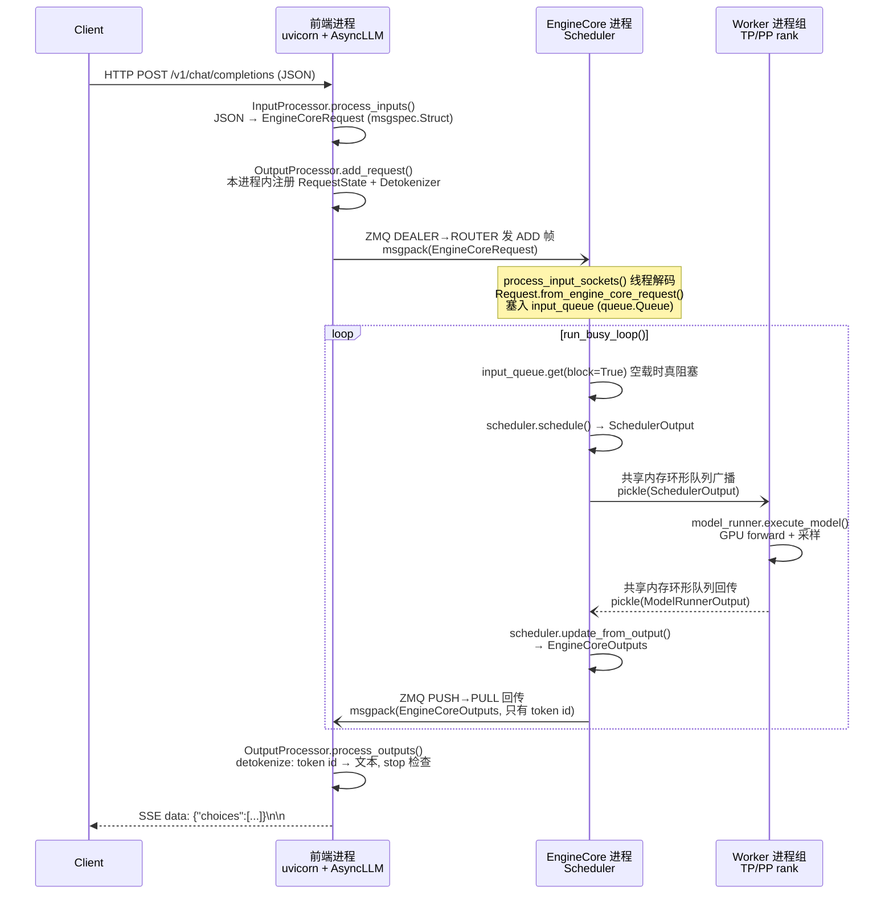

# vLLM V1 架构与 EngineCore 主循环

> **本篇取证基准**：`vllm` @ `7ca49fbe`（2026-08-22）
> **一句话**：三进程三种 IPC，token 在 GPU 侧生成，文本在前端侧拼

## 0. 结论先行

- vLLM V1 是**三层进程模型**：前端 API 进程（可以有多个，`entrypoints/openai/api_server.py` 起的 uvicorn 进程）→ EngineCore 进程（每个 DP rank 一个，`vllm/v1/engine/core.py` 里的 `EngineCoreProc`）→ Worker 进程组（每个 TP/PP/EP rank 一个，`vllm/v1/executor/multiproc_executor.py` 里的 `WorkerProc`）。三层之间**用两种完全不同的 IPC**：前端↔EngineCore 走 ZMQ + msgspec.msgpack（跨进程、可跨节点、需要 schema 校验的地方）；EngineCore↔Worker 走共享内存环形队列 + pickle（同机、受信、要传张量的地方）。这不是随意选择，是"谁的载荷更大/谁更信任谁"决定的（`_should_throttle_prefills` 类，见 `_PLAN.md` 诚实标准 §5 三件套，本篇 `## 5` 展开）。
- `EngineCore.step()`（`vllm/v1/engine/core.py:597`）三段式：`scheduler.schedule()` 产出 `SchedulerOutput`（CPU 侧决定"这一步谁跑、跑几个 token"）→ `model_executor.execute_model()` 产出 `ModelRunnerOutput`（GPU 侧真正跑模型、采样）→ `scheduler.update_from_output()` 产出 `EngineCoreOutputs`（把新 token id 塞回每个请求的状态机）。整个 `step()` 里**没有一行 detokenize**——`EngineCoreOutput`（`vllm/v1/engine/__init__.py:196`）只装 `new_token_ids: list[int]`，字符串还原被推给了前端进程的 `OutputProcessor`。
- EngineCore 空载时不是忙等：`run_busy_loop()`（`vllm/v1/engine/core.py:1405`）在没有请求时会阻塞在 `self.input_queue.get(block=True)`（`vllm/v1/engine/core.py:1447`，标准 `queue.Queue`，内部是条件变量，不占 CPU）。但 Worker 进程之间传递 `SchedulerOutput`/`ModelRunnerOutput` 的共享内存队列不是这样——`SpinCondition.wait()`（`vllm/distributed/device_communicators/shm_broadcast.py:191`）会先忙轮询 1 秒（`busy_loop_s: float = 1`，`vllm/distributed/device_communicators/shm_broadcast.py:134`）才降级为阻塞等 ZMQ 通知。两层等待策略不同，是因为等待对象的到达频率天差地别（详见 `## 7`）。
- DP（data parallel）只在 MoE 模型上做**锁步（lockstep）all-reduce 同步**：`DPEngineCoreProc`（`vllm/v1/engine/core.py:2000`）每 32 步做一次 `ParallelConfig.sync_dp_state` 全局同步（`vllm/v1/engine/core.py:2267` `_has_global_unfinished_reqs`），没活干的 rank 要执行"空转 batch"（`execute_dummy_batch`，`vllm/v1/engine/core.py:2220`）陪跑，直到所有 rank 都没活了才一起暂停——因为专家并行（EP）要求所有 rank 在同一步做同样次数的 all-to-all，一个 rank 掉队会让其他 rank 的通信 kernel 永久挂起。非 MoE 模型的 DP 则完全独立，每个 rank 是彼此无关的 `EngineCoreProc`（`vllm/v1/engine/core.py:1326` 附近的注释直接写明 "Non-MoE DP ranks are completely independent"）。
- Detokenize 放在前端进程，不是随手为之：`OutputProcessor.process_outputs()`（`vllm/v1/engine/output_processor.py:603`）在 `AsyncLLM._run_output_handler()`（`vllm/v1/engine/async_llm.py:665`）里的 asyncio 任务中跑，和 EngineCore 完全解耦——EngineCore 进程只管"什么时候该跑模型"，CPU 密集的 BPE 反解码、stop-string 匹配、logprobs 组装全部挪出 GPU 所在的进程，不占用本该留给调度/排队逻辑的 CPU 时间片。

---

## 1. 它在系统里的位置

一次 `chat/completions` 请求，从 HTTP 到 SSE，穿过的进程边界大致是：

```
Client
  │ HTTP JSON
  ▼
┌─────────────────────────────────────────────┐
│ 前端 API 进程 (uvicorn / FastAPI)             │  可以有多个（--api-server-count）
│  entrypoints/openai/chat_completion/serving.py│  vllm/v1/utils.py:230 APIServerProcessManager
│  AsyncLLM (async_llm.py)                      │
│  InputProcessor.process_inputs()  → EngineCoreRequest
│  OutputProcessor（本进程内，持有 Detokenizer） │
└──────────────────┬────────────────────────────┘
                    │ ZMQ ROUTER/DEALER + PUSH/PULL
                    │ msgspec.msgpack
                    ▼
┌─────────────────────────────────────────────┐
│ EngineCore 进程（每 DP rank 一个）             │  vllm/v1/engine/core.py:1021 EngineCoreProc
│  Scheduler（CPU：谁跑、跑多少 token、KV 分配） │  vllm/v1/core/sched/scheduler.py:73
│  StructuredOutputManager                      │
└──────────────────┬────────────────────────────┘
                    │ 共享内存环形队列 (MessageQueue)
                    │ pickle / cloudpickle
                    ▼
┌─────────────────────────────────────────────┐
│ Worker 进程组（每 TP/PP/EP rank 一个）         │  vllm/v1/executor/multiproc_executor.py:600 WorkerProc
│  GPUModelRunner（前向 + 采样）                 │  vllm/v1/worker/gpu_worker.py:143 Worker
│  实际持有 KV Cache 显存                        │
└─────────────────────────────────────────────┘
```

三层的职责边界很干净：**前端进程管"人话"（tokenize/detokenize/HTTP 协议/多路复用），EngineCore 进程管"账本"（哪个请求该跑、KV block 怎么分配、要不要抢占），Worker 进程管"算力"（真正跑 CUDA kernel）。** 这条边界不是理论上的划分——三层用不同的序列化格式、不同的等待策略、甚至不同的默认多进程 spawn 方式（`vllm/utils/system_utils.py:168` `get_mp_context()` 对 Worker/EngineCore 默认走 `fork`，而 `vllm/v1/utils.py:208` 对多 API-server 进程强制走 `spawn`），说明这是三个独立的工程决策，不是同一套代码复制三份。

需要澄清一个容易踩的坑：**并不是所有部署形态都有独立的 EngineCore 进程**。`EngineCoreClient.make_client()`（`vllm/v1/engine/core_client.py:89`）会根据 `multiprocess_mode` 在三种客户端之间选：`AsyncMPClient`（在线 OpenAI server 用，ZMQ+asyncio）、`SyncMPClient`（离线 `LLM()` 类默认用，ZMQ 同步）、`InprocClient`（`vllm/v1/engine/core_client.py:306`，EngineCore 直接 new 在当前进程里，`get_output()` 就是直接调用 `step_fn()`，没有 busy loop 也没有 ZMQ）。是否走多进程由 `envs.VLLM_ENABLE_V1_MULTIPROCESSING` 控制，**默认值是 `True`**（`vllm/envs.py:157`），所以本篇讲的"独立进程 + ZMQ"是默认路径，`InprocClient` 只在显式关闭该开关（`VLLM_ENABLE_V1_MULTIPROCESSING=0`，常见于单进程调试/测试场景）时才会走到。

还有一层容易被忽略的多进程：**前端 API 进程本身也可以有多个**（`--api-server-count`），`APIServerProcessManager`（`vllm/v1/utils.py:180`）用 `spawn_context.Process`（`vllm/v1/utils.py:230`）拉起若干个 uvicorn worker 进程，它们共享同一个监听 socket（`sock` 参数），由操作系统内核做 accept 层面的负载均衡。多个前端进程但只有一组 EngineCore 进程时，`EngineCoreRequest.client_index`（`vllm/v1/engine/__init__.py:132`）就派上用场——EngineCore 侧的输出 ZMQ 是 `PUSH` 对多个前端各开一个 socket（`process_output_sockets()` 里 `sockets = [... for output_path in output_paths]`，`vllm/v1/engine/core.py:1809-1814`），靠 `client_index` 决定一条 `EngineCoreOutputs` 该送去哪个 `sockets[client_index]`（`vllm/v1/engine/core.py:1852`）——这是"一份 EngineCore 输出，按请求来源精确投递回原来那个前端进程"，不是广播。

这篇是 `01-vLLM/` 的骨干篇，只看"进程边界 + 循环骨架 + 数据怎么变形"；调度器内部怎么决定"谁跑、要不要抢占"是 [[03-vLLM-调度器解剖]] 的范围；`execute_model()` 内部 CUDA Graph 怎么捕获重放是 [[06-vLLM-模型执行与CUDA-Graph]] 的范围；TP/PP/EP 怎么切分权重和激活是 [[07-vLLM-分布式与并行策略]] 的范围。

---

## 2. 代码地图（文件 → 职责，带行号）

### 前端进程（frontend）

| 文件:行 | 职责 |
|---|---|
| `vllm/entrypoints/openai/chat_completion/serving.py:244` | `create_chat_completion()`，HTTP 入口 |
| `vllm/entrypoints/openai/chat_completion/serving.py:452` | `chat_completion_stream_generator()`，SSE 逐 chunk `yield` |
| `vllm/v1/engine/input_processor.py:281` | `InputProcessor.process_inputs()`，JSON/messages → `EngineCoreRequest`（注：`_PLAN.md` 起点线索里写的 `processor.py` 已改名为本文件，路径已变） |
| `vllm/v1/engine/async_llm.py:283` | `AsyncLLM.add_request()`，前端总入口 |
| `vllm/v1/engine/async_llm.py:424` | `AsyncLLM._add_request()`，本进程注册 `OutputProcessor` + 跨进程发 `EngineCoreRequest` 的分界点 |
| `vllm/v1/engine/async_llm.py:665` | `_run_output_handler()`，后台 asyncio 任务：拉 `EngineCoreOutputs` → 推 `RequestOutput` |
| `vllm/v1/engine/output_processor.py:603` | `OutputProcessor.process_outputs()`，**detokenize 就发生在这里** |
| `vllm/v1/engine/output_processor.py:677` | `req_state.detokenizer.update()`，增量 token→text |
| `vllm/v1/utils.py:230` | `APIServerProcessManager`，多前端进程用 `spawn_context.Process` 拉起 |

### EngineCore 进程

| 文件:行 | 职责 |
|---|---|
| `vllm/v1/engine/core.py:105` | `EngineCore` 类定义（内层循环逻辑，与是否独立进程无关） |
| `vllm/v1/engine/core.py:597` | `step()`，schedule→execute→update 三段式 |
| `vllm/v1/engine/core.py:638` | `step_with_batch_queue()`，PP 流水线下的异步调度版本 |
| `vllm/v1/engine/core.py:982` | `preprocess_add_request()`，`EngineCoreRequest`→`Request` 的转换点 |
| `vllm/v1/engine/core.py:1021` | `EngineCoreProc` 类，"ZMQ-wrapper for running EngineCore in background process" |
| `vllm/v1/engine/core.py:1285` | `run_engine_core()`，进程入口静态方法 |
| `vllm/v1/engine/core.py:1405` | `run_busy_loop()`，主循环骨架 |
| `vllm/v1/engine/core.py:1447` | `input_queue.get(block=True)`，空载时的真阻塞点 |
| `vllm/v1/engine/core.py:1462` | `_process_engine_step()` |
| `vllm/v1/engine/core.py:1688` | `process_input_sockets()`，独立 IO 线程，msgpack 解码 |
| `vllm/v1/engine/core.py:1791` | `process_output_sockets()`，独立 IO 线程，msgpack 编码 |
| `vllm/v1/engine/core.py:2000` | `DPEngineCoreProc` 类（仅 MoE 模型用） |
| `vllm/v1/engine/core.py:2184` | DP 版 `run_busy_loop()`，含 all-reduce 锁步 |
| `vllm/v1/engine/core.py:2267` | `_has_global_unfinished_reqs()`，每 32 步一次的全局同步 |
| `vllm/v1/engine/utils.py:144` | `CoreEngineProcManager`，用 `context.Process` 拉起 `EngineCoreProc.run_engine_core` |
| `vllm/v1/engine/coordinator.py:23` | `DPCoordinator`，DP>1 时协调多个 EngineCore 与多个前端之间统计/wave 状态的又一个独立进程 |

### 客户端（前端进程内，与 EngineCore 通信的那一半）

| 文件:行 | 职责 |
|---|---|
| `vllm/v1/engine/core_client.py:78` | `EngineCoreClient` 抽象基类 |
| `vllm/v1/engine/core_client.py:306` | `InprocClient`，单进程退化路径 |
| `vllm/v1/engine/core_client.py:503` | `MPClient`，"EngineCore runs in a background process busy loop" |
| `vllm/v1/engine/core_client.py:554` | 输入用 `zmq.ROUTER`，`bind=True` |
| `vllm/v1/engine/core_client.py:596` | 输出用 `zmq.PULL` |
| `vllm/v1/engine/core_client.py:978` | `AsyncMPClient`，配合 `AsyncLLM` |

### Worker 进程组

| 文件:行 | 职责 |
|---|---|
| `vllm/v1/executor/multiproc_executor.py:111` | `MultiprocExecutor`，EngineCore 侧持有的执行器句柄 |
| `vllm/v1/executor/multiproc_executor.py:340` | `execute_model()`，对 `collective_rpc` 的封装 |
| `vllm/v1/executor/multiproc_executor.py:600` | `WorkerProc` 类 |
| `vllm/v1/executor/multiproc_executor.py:1029` | `worker_busy_loop()`，Worker 侧主循环 |
| `vllm/v1/worker/gpu_worker.py:143` | `Worker` 类 |
| `vllm/v1/worker/gpu_worker.py:1064` | `Worker.execute_model()`，落到 `GPUModelRunner` |
| `vllm/distributed/device_communicators/shm_broadcast.py:112` | `SpinCondition`，共享内存队列的忙轮询→阻塞降级策略 |

### 核心数据结构定义处

| 文件:行 | 职责 |
|---|---|
| `vllm/v1/engine/__init__.py:107` | `EngineCoreRequest`（msgspec.Struct） |
| `vllm/v1/engine/__init__.py:196` | `EngineCoreOutput`（msgspec.Struct，只装 token id 不装文本） |
| `vllm/v1/engine/__init__.py:253` | `EngineCoreOutputs`（一批 `EngineCoreOutput` + 调度统计） |
| `vllm/v1/engine/__init__.py:284` | `EngineCoreRequestType`（ADD/ABORT/UTILITY/... 消息类型帧） |
| `vllm/v1/request.py:59` | `Request`（EngineCore 内部的请求状态机） |
| `vllm/v1/request.py:238` | `Request.from_engine_core_request()` |
| `vllm/v1/core/sched/output.py:206` | `SchedulerOutput` |
| `vllm/v1/outputs.py:309` | `ModelRunnerOutput` |

以上共 38 条引用，均带行号，可用 `_verify.py` 逐条核对。

---

## 3. 核心数据结构

一条请求在这条链路上要经历 **5 次变形**，每次变形都对应一次进程边界或职责边界：

### 3.1 HTTP JSON → `ChatCompletionRequest`（前端进程，pydantic 校验层）

不属于本篇重点，见 [[08-vLLM-HTTP-API表面全解]]。落地类是 `vllm/entrypoints/openai/chat_completion/protocol.py:213` 的 `ChatCompletionRequest`。

### 3.2 `ChatCompletionRequest` → `EngineCoreRequest`（前端进程内，仍是"人话"到"引擎话"的转换）

`vllm/v1/engine/__init__.py:107` 定义为 `msgspec.Struct`（不是 dataclass，也不是 pydantic model）：

```
class EngineCoreRequest(msgspec.Struct, array_like=True, omit_defaults=True, gc=False):
    request_id: str
    prompt_token_ids: list[int] | None
    mm_features: list[MultiModalFeatureSpec] | None
    sampling_params: SamplingParams | None
    pooling_params: PoolingParams | None
    arrival_time: float
    ...
    client_index: int = 0        # 多前端进程场景下，标记结果要送回哪个前端
    current_wave: int = 0        # DP 场景下标记属于哪一"波"请求
    priority: int = 0
```

`array_like=True` 让 msgspec 把它编码成定长数组而不是字典，省掉字段名重复传输的开销；`gc=False` 让这个 Struct 不被 Python 垃圾回收器扫描（构造/析构在高 QPS 下是热路径）。`prompt_token_ids` 此时已经完成了 tokenize——分词是在前端进程做的（不阻塞事件循环，`vllm/v1/engine/async_llm.py:372` 的 `process_inputs_async`），EngineCore 收到的已经是纯 token id 数组。

### 3.3 `EngineCoreRequest` → `Request`（跨进程之后，EngineCore 进程内的"重量级"状态机）

`vllm/v1/request.py:59` 的 `Request` 不是 msgspec.Struct，是普通 Python 类，因为它**从不跨进程传输**，只在 EngineCore 内部活动。转换发生在 `Request.from_engine_core_request()`（`vllm/v1/request.py:238`），被 `preprocess_add_request()`（`vllm/v1/engine/core.py:982`）调用。`Request` 携带的字段比 `EngineCoreRequest` 多得多：`status`（`RequestStatus` 状态机）、`num_computed_tokens`、`spec_token_ids`（投机解码用）、`kv_transfer_params`（PD 分离用）——这些都是调度器要跟踪的运行时状态，`EngineCoreRequest` 里没有，因为客户端不需要知道。

值得注意：`preprocess_add_request()` 是在 `process_input_sockets()`（`vllm/v1/engine/core.py:1688`）这个**独立 IO 线程**里调用的，而不是在主循环线程——`vllm/v1/engine/core.py:1105-1109` 的注释直接写明这是为了"overlap ZMQ socket IO with GPU"和"overlap some serialization/deserialization with the model forward pass"：反序列化 + 构造 `Request` 对象这些 CPU 工作，跟正在跑的那一步 GPU forward 是并行的。

### 3.4 `SchedulerOutput`（EngineCore 进程 → Worker 进程，"这一步干什么"的合同）

`vllm/v1/core/sched/output.py:206`，`@dataclass`（不是 msgspec.Struct——它从不跨机器，只走同机共享内存，不需要 schema 校验开销）。关键字段：

- `scheduled_new_reqs: list[NewRequestData]` —— 本步**第一次**被调度的请求（要把完整 prompt 送给 Worker）
- `scheduled_cached_reqs: CachedRequestData` —— 本步继续跑的请求（Worker 已经缓存了它的状态，只送**增量**，省传输）
- `num_scheduled_tokens: dict[str, int]` —— 每个请求本步跑几个 token（prefill 可能几百个，decode 通常 1 个，除非有投机解码/jump decoding）
- `kv_connector_metadata` / `ec_connector_metadata` —— PD 分离场景下 KV/EC 传输的元数据（见 [[12-vLLM-PD分离与KV-Connector]]）

"新请求发全量、老请求发增量"这个设计直接对应代码注释 `vllm/v1/core/sched/output.py:209-214`："We cache the request's data in each worker process, so that we don't need to re-send it every scheduling step"——这是把 Worker 进程当成了有状态的缓存节点，而不是无状态的纯函数调用。

`NewRequestData`（`vllm/v1/core/sched/output.py:36`）和 `CachedRequestData`（`vllm/v1/core/sched/output.py:130`）的字段设计也印证了"全量 vs 增量"：前者带 `prompt_token_ids`（完整 prompt）、`block_ids`（首次分配的 KV block）；后者是**列式（columnar）布局**——`req_ids: list[str]` 和 `num_computed_tokens: list[int]` 等字段按下标对齐，一个请求的完整信息要跨好几个并行数组去拼，而不是"每个请求一个对象"的行式布局，目的是减少 Python 对象数量、降低跨进程传输时的 pickle 开销。两者的 `__repr__` 处理隐私数据的方式还不对称：`NewRequestData.__repr__()`（`vllm/v1/core/sched/output.py:85`）默认打印完整 `prompt_token_ids`，要显式调用 `anon_repr()`（`vllm/v1/core/sched/output.py:104`）才脱敏；而 `CachedRequestData.__repr__()`（`vllm/v1/core/sched/output.py:164`）直接委托给 `anon_repr()`（`vllm/v1/core/sched/output.py:147`），默认就是脱敏的——同一个文件里两个紧邻的数据类，日志脱敏的默认行为并不一致，调试时打日志要留意这个差异。

### 3.5 `ModelRunnerOutput`（Worker 进程 → EngineCore 进程，一步 GPU 计算的结果）

`vllm/v1/outputs.py:309`。核心字段 `sampled_token_ids: list[list[int]]`（`num_reqs x num_generated_tokens`，之所以是"每请求多个 token"而不是单个，是因为投机解码/jump decoding 一步可能吐出不止 1 个 token）。还带 `pooler_output`（embedding/reward 模型用）、`kv_connector_output`（PD 分离）、`num_nans_in_logits`（数值健康检查）。这一层**已经完成采样**——`ModelRunnerOutput` 里是 token id 而不是 logits，logits 张量在 Worker 进程内部就被采样消费掉了，不会跨进程传输（避免传一个 `[batch, vocab_size]` 的大张量）。

### 3.6 `EngineCoreOutput` / `EngineCoreOutputs`（EngineCore 进程 → 前端进程，唯一跨机器的输出载荷）

`vllm/v1/engine/__init__.py:196` 和 `:253`，同样是 `msgspec.Struct`。`EngineCoreOutput.new_token_ids: list[int]`（`vllm/v1/engine/__init__.py:203`）——**没有 `text` 字段**。前端进程收到的永远是数字，从数字变回字符串是 `OutputProcessor.process_outputs()`（`vllm/v1/engine/output_processor.py:603`）在前端进程里做的事（`## 4` 详细走读）。

### 3.7 前端进程内：`RequestOutput` → SSE `data: {...}`

不再跨进程，纯 Python 对象序列化成 JSON，`chat_completion_stream_generator()`（`vllm/entrypoints/openai/chat_completion/serving.py:452`）里 `yield f"data: {data}\n\n"`（`vllm/entrypoints/openai/chat_completion/serving.py:507-508`）。

---

## 4. 主流程走读

### 4.1 时序图



### 4.2 逐跳走读

**跳 1（Client → 前端进程）**：`create_chat_completion()`（`vllm/entrypoints/openai/chat_completion/serving.py:244`）接收 HTTP，调用 `render_chat_request()` 走 chat template，再交给 `self.engine_client.generate()`（`vllm/entrypoints/openai/chat_completion/serving.py:370`，`engine_client` 就是 `AsyncLLM` 实例）。

**跳 2（前端进程内部）**：`AsyncLLM.add_request()`（`vllm/v1/engine/async_llm.py:283`）先做输入处理——如果是原始 prompt，走 `input_processor.process_inputs_async()`（`vllm/v1/engine/async_llm.py:372`，异步避免阻塞事件循环，因为 tokenize 大 prompt 可能耗时）。转换出 `Request`（此处命名有歧义，`process_inputs` 返回的其实还是携带 `EngineCoreRequest` 语义的对象，真正的 `vllm.v1.request.Request` 要等进了 EngineCore 进程才由 `preprocess_add_request()` 构造，见 `## 3.3`）。`_add_request()`（`vllm/v1/engine/async_llm.py:424`）里两行代码划清了进程边界：

```
self.output_processor.add_request(request, prompt, parent_req, index, queue)   # 本进程
await self.engine_core.add_request_async(request)                              # 送去另一个进程
```

**跳 3（前端进程 → EngineCore 进程）**：`add_request_async` 最终通过 `AsyncMPClient` 的 ZMQ DEALER 发送 `ADD` 帧，载荷是 `msgspec.msgpack.encode(EngineCoreRequest)`。EngineCore 进程侧的 `process_input_sockets()`（`vllm/v1/engine/core.py:1688`）阻塞在 `poller.poll()` 上（这也是阻塞，不是忙等），收到帧后解码、调 `preprocess_add_request()`、把 `(Request, request_wave)` 塞进 `self.input_queue`（一个 `queue.Queue`，`vllm/v1/engine/core.py:1040`）。

**跳 4（EngineCore 主循环）**：`run_busy_loop()`（`vllm/v1/engine/core.py:1405`）每轮做三件事：
1. `_process_input_queue()`（`vllm/v1/engine/core.py:1431`）——如果 `has_work()`（`vllm/v1/engine/core.py:1392`，等价于"有正在跑的请求 or 调度器里还有排队的 or 批队列非空"）为 `False`，就阻塞在 `input_queue.get(block=True)`（`vllm/v1/engine/core.py:1447`）等下一条消息；有活干就非阻塞地把队列排空。
2. `_process_engine_step()`（`vllm/v1/engine/core.py:1462`）——调 `self.step_fn()`（等于 `step()` 或 `step_with_batch_queue()`，取决于是否开了 PP 批队列，`vllm/v1/engine/core.py:235-237`），把返回的 `EngineCoreOutputs` 逐条塞进 `output_queue`。
3. 发布 DP 统计（如果开了 DP 内部负载均衡）。

`step()`（`vllm/v1/engine/core.py:597`）本身：

```
scheduler_output = self.scheduler.schedule(...)                       # CPU：决定跑谁
future = self.model_executor.execute_model(scheduler_output, non_block=True)  # 发给 Worker，非阻塞
grammar_output = self.scheduler.get_grammar_bitmask(scheduler_output) # 结构化输出的 bitmask，和 GPU forward 并行算
model_output = future.result()                                        # 阻塞等 Worker 回结果
engine_core_outputs = self.scheduler.update_from_output(scheduler_output, model_output)
```

第 3 行 `get_grammar_bitmask` 在等 GPU 结果的同时算，是一个刻意的重叠优化，出发点和"输入线程与 GPU forward 重叠"是同一个思路：CPU 上能提前算的，不要等 GPU 空出来再算。

**跳 5（EngineCore 进程 → Worker 进程组）**：`execute_model()`（`vllm/v1/engine/core.py:609`）实际调 `MultiprocExecutor.execute_model()`（`vllm/v1/executor/multiproc_executor.py:340`），内部是 `collective_rpc("execute_model", ...)`（`vllm/v1/executor/multiproc_executor.py:375`），把 `(method_name, args, kwargs)` 通过共享内存环形队列（`vllm/distributed/device_communicators/shm_broadcast.py` 的 `MessageQueue`）广播给所有 Worker。Worker 侧 `worker_busy_loop()`（`vllm/v1/executor/multiproc_executor.py:1029`）从 `self.rpc_broadcast_mq.dequeue(indefinite=True)` 取出方法名和参数，`getattr(self.worker, method)(*args, **kwargs)` 直接调用——**这是同机 SPMD 调用，走的是 pickle/cloudpickle，不是 msgpack**（`vllm/distributed/device_communicators/shm_broadcast.py:900` `pickle.loads`，`vllm/v1/executor/multiproc_executor.py:1040` `cloudpickle.loads(method)`）。

**跳 6（Worker 进程内部）**：`Worker.execute_model()`（`vllm/v1/worker/gpu_worker.py:1064`）调 `self.model_runner.execute_model(...)`，跑 CUDA kernel、attention、采样，产出 `ModelRunnerOutput`，通过同一条共享内存队列回传给 EngineCore 进程。

**跳 7（EngineCore 进程内部）**：`scheduler.update_from_output(scheduler_output, model_output)`（`vllm/v1/engine/core.py:622`，调度器实现见 `vllm/v1/core/sched/scheduler.py:1744`）把新 token id 写回每个 `Request` 的状态，同时决定哪些请求本步已经 `FINISHED`，打包成 `EngineCoreOutputs`。

**跳 8（EngineCore 进程 → 前端进程）**：`process_output_sockets()`（`vllm/v1/engine/core.py:1791`）线程从 `output_queue` 取出 `(client_index, EngineCoreOutputs)`，`MsgpackEncoder().encode_into()` 编码后走 ZMQ PUSH 发给对应前端进程的 PULL 端口。这里做了缓冲区复用（`reuse_buffers`，声明于 `vllm/v1/engine/core.py:1799`，复用逻辑在 `vllm/v1/engine/core.py:1846-1858`）——高 QPS 下频繁分配 `bytearray` 是可见的开销，复用能省一部分。

**跳 9（前端进程内部，detokenize 真正发生的地方）**：`AsyncLLM._run_output_handler()`（`vllm/v1/engine/async_llm.py:665`）里的后台 asyncio 任务 `output_handler()`（`vllm/v1/engine/async_llm.py:686`）持续 `await engine_core.get_output_async()`（`vllm/v1/engine/async_llm.py:690`），拿到 `EngineCoreOutputs` 后交给 `output_processor.process_outputs()`（`vllm/v1/engine/output_processor.py:603`）。这个函数对每条 `EngineCoreOutput`：更新统计 → `req_state.detokenizer.update(new_token_ids, ...)`（`vllm/v1/engine/output_processor.py:677`，增量 BPE 反解码 + stop-string 检查）→ `logprobs_processor.update_from_output()` → 组装 `RequestOutput` 塞进对应请求的 `RequestOutputCollector` 队列（`vllm/v1/engine/output_processor.py:700-702`）。

**跳 10（前端进程 → Client）**：`chat_completion_stream_generator()`（`vllm/entrypoints/openai/chat_completion/serving.py:452`）里 `async for res in result_generator`（`vllm/entrypoints/openai/chat_completion/serving.py:518`）消费 `RequestOutputCollector`，逐条 `yield f"data: {data}\n\n"`（`vllm/entrypoints/openai/chat_completion/serving.py:507-508`），FastAPI 的 `StreamingResponse` 把这些字符串写回 HTTP 连接，成为 SSE 事件流。

### 4.3 十跳速查表

对照 `## 4.1` 的时序图，把每一跳所在的进程和跨越的数据类型列成表，方便回查：

| 跳 | 方向 | 所在进程 | 数据类型 | 关键函数 |
|---|---|---|---|---|
| 1 | Client→前端 | 前端 | HTTP JSON | `create_chat_completion()` |
| 2 | 前端内部 | 前端 | `ChatCompletionRequest`→`EngineCoreRequest` | `AsyncLLM.add_request()` |
| 3 | 前端→EngineCore | 跨进程（ZMQ） | msgpack(`EngineCoreRequest`) | `add_request_async()` |
| 4 | EngineCore 内部 | EngineCore | `EngineCoreRequest`→`Request` | `preprocess_add_request()` |
| 5 | EngineCore 循环 | EngineCore | `Request`→`SchedulerOutput` | `scheduler.schedule()` |
| 6 | EngineCore→Worker | 跨进程（共享内存） | pickle(`SchedulerOutput`) | `collective_rpc("execute_model")` |
| 7 | Worker 内部 | Worker | `SchedulerOutput`→`ModelRunnerOutput` | `model_runner.execute_model()` |
| 8 | Worker→EngineCore | 跨进程（共享内存） | pickle(`ModelRunnerOutput`) | `worker_busy_loop()` 回传 |
| 9 | EngineCore 内部 | EngineCore | `ModelRunnerOutput`→`EngineCoreOutputs` | `scheduler.update_from_output()` |
| 10 | EngineCore→前端 | 跨进程（ZMQ） | msgpack(`EngineCoreOutputs`，仅 token id） | `process_output_sockets()` |
| 11 | 前端内部 | 前端 | `EngineCoreOutputs`→`RequestOutput`（含文本） | `output_processor.process_outputs()` |
| 12 | 前端→Client | 前端 | SSE `data: {...}` | `chat_completion_stream_generator()` |

12 跳里只有 3、6、8、10 这 4 跳真正跨越了进程边界，其余 8 跳都是进程内部的数据变形——这也是为什么本篇 `## 0` 说"三层进程模型"而不是"十二层"：进程数量远少于数据变形次数，多数变形只是同进程内的对象转换，不产生 IPC 开销。

---

## 5. 设计决策与代价

### 决策 1：EngineCore 独立进程 + ZMQ，而不是和前端同进程的 asyncio 任务

- **为什么这么设计**：GPU 前向是 GIL 无法释放太久的重活（虽然 CUDA kernel launch 本身会释放 GIL，但 Python 侧的 batch 准备、采样后处理仍占 CPU），如果和前端的 HTTP 处理、tokenize、detokenize 挤在同一个进程里，两边会互相抢 GIL，拖慢彼此的延迟尾部。拆成独立进程后，两边各自有独立的 GIL，用操作系统调度器天然并行。
- **不这样会怎样**：V0（vLLM 上一代引擎，本篇不展开）就是同进程模型，社区反馈里高并发下前端的 tokenize/序列化会和 GPU 调度抢时间片，尾延迟不稳定；这也是 V1 重构的动机之一（`本库推断`，依据：`InprocClient` docstring 明确写"for use in LLMEngine for V0-style add_request() and step()"，说明同进程模式是刻意保留的旧路径而非新设计）。
- **什么时候可以不这样**：单请求、单进程、调试/测试场景，`VLLM_ENABLE_V1_MULTIPROCESSING=0` 显式退化为 `InprocClient`（`vllm/v1/engine/core_client.py:306`）；此时没有 ZMQ 开销、没有序列化开销，适合跑单测或本地小规模验证正确性，但生产环境默认不用这条路径（默认值见 `vllm/envs.py:157`）。

### 决策 2：输入/输出各开一条独立 Socket IO 线程，主循环只碰 `queue.Queue`

- **为什么这么设计**：`vllm/v1/engine/core.py:1105-1109` 的注释写得很直接——ZMQ 收发和 msgpack 编解码都会释放 GIL（IO 等待、C 扩展编解码），如果放进主循环线程，会和 GPU forward 的等待时间抢占；分离成独立线程后，反序列化 `Request` 对象这种 CPU 工作可以和上一步的 `future.result()` 等待并行发生，即"用等 GPU 的空闲时间偷偷把下一批输入准备好"。
- **不这样会怎样**：如果输入解析和主循环在同一线程顺序执行，每一步都要先花时间反序列化新请求，再花时间调度，再等 GPU——三段变成完全串行，尾延迟会多出一段"反序列化耗时"，在高并发新请求持续涌入时更明显。
- **什么时候可以不这样**：请求到达率极低（比如离线批处理，一次性喂完所有请求，之后再无新请求进来）时，输入线程和主循环没什么可重叠的，用不用独立线程差别不大；`InprocClient` 路径直接跳过了整个 Socket IO 层，因为压根没有 ZMQ。

### 决策 3：EngineCore↔前端走 msgspec.msgpack，EngineCore↔Worker 走 pickle

- **为什么这么设计**：前端↔EngineCore 传输的是结构化、有明确 schema 的协议对象（`EngineCoreRequest`/`EngineCoreOutput` 都是 `msgspec.Struct`），msgpack 是紧凑二进制格式且 `msgspec` 库本身用 C 实现编解码，比 `pickle` 快、比 JSON 紧凑，还自带类型校验；而 EngineCore↔Worker 传输的是 `SchedulerOutput`/`ModelRunnerOutput` 这类内部专用、字段多变、还可能带张量的对象，用 pickle（`vllm/distributed/device_communicators/shm_broadcast.py:900`）能不做任何 schema 声明就序列化任意 Python 对象，Worker RPC 的方法名甚至用 `cloudpickle` 序列化任意可调用对象（`vllm/v1/executor/multiproc_executor.py:1040`）——这是本地信任边界内的"什么都能扔过去"，不需要 msgpack 的严格类型约束。
- **不这样会怎样**：反过来如果 EngineCore↔前端也用 pickle，会失去 `msgspec.Struct` 的 `array_like`/`omit_defaults` 带来的编码体积优势，而且 pickle 反序列化任意对象存在安全隐患（前端和 EngineCore 虽然通常同机，但协议层面留了口子给未来可能的跨机部署）；如果 EngineCore↔Worker 也用 msgspec，则每次给 `SchedulerOutput` 加个新字段都要维护 Struct schema，而这个结构变化频率远高于对外协议。
- **什么时候可以不这样**：`未查证`——没有在源码里找到显式讨论"是否考虑过统一序列化格式"的注释或文档，这是基于两处序列化代码的直接观察做出的推断，不是上游明说的设计权衡。

### 决策 4：Worker RPC 广播队列用共享内存 + 忙轮询/阻塞混合，而不是纯 ZMQ

- **为什么这么设计**：EngineCore↔Worker 之间是**每一步解码都要走一次**的高频通信（decode 阶段可能几十毫秒一步），如果每次都走 ZMQ 的系统调用 + 内核态拷贝，在这个频率下开销会累积；共享内存队列（`shm_broadcast.py`）省掉了内核态拷贝，`SpinCondition`（`vllm/distributed/device_communicators/shm_broadcast.py:112`）额外做了"先忙轮询 1 秒，命中就是几乎零延迟；1 秒内没有新数据就说明确实空闲了，降级为阻塞等 ZMQ 通知"（`vllm/distributed/device_communicators/shm_broadcast.py:191-216`），把"低延迟"和"空闲不耗 CPU"两个目标都照顾到了。
- **不这样会怎样**：如果 Worker RPC 也用纯阻塞（像 EngineCore 的 `input_queue.get(block=True)` 那样），在持续高频调用场景下，每次"发通知→被唤醒"都要走一次内核态上下文切换，对解码这种毫秒级节奏的循环是可测量的开销；如果反过来纯忙轮询（不设 1 秒退化），一旦空闲（比如所有请求处理完、等下一个请求），Worker 进程会持续吃满一个 CPU 核心，即使 GPU 完全没有负载。
- **什么时候可以不这样**：`busy_loop_s` 是可配置的构造参数（`vllm/distributed/device_communicators/shm_broadcast.py:134`，默认 1 秒）——如果确定负载模式是长时间空闲、偶尔来一波（比如低 QPS 的边缘部署），调小甚至调到 0（等价于永远走阻塞）能省 CPU；反之如果追求极限尾延迟且不在乎空闲功耗，可以调大。`未查证`：没有找到暴露给终端用户的 CLI flag 直接改这个值，目前看是写死在构造调用处的常量。

### 决策 5：Detokenize 放在前端进程，不放在 EngineCore 进程

- **为什么这么设计**：BPE 反解码、stop-string 匹配、logprobs 格式转换都是纯 CPU 工作，和 GPU 完全无关；放在前端进程能利用前端本身已经是"CPU 密集型 + asyncio 并发"的定位，多个请求的 detokenize 可以在同一个 asyncio 事件循环里见缝插针地跑，而不会占用 EngineCore 进程本该留给"调度决策 + 发起下一步 GPU 计算"的 CPU 时间片。EngineCore 只需要传最紧凑的载荷（token id），不需要知道 tokenizer 长什么样。
- **不这样会怎样**：如果 detokenize 放进 EngineCore 进程，每一步 `step()` 结束后都要多花时间做字符串处理，这段时间 GPU 很可能已经空出来等下一批输入了——等于让 GPU 空转去等一个和它无关的 CPU 任务，直接拉长每步的墙钟时间。
- **什么时候可以不这样**：如果场景只需要拿 token id 不需要文本（比如某些 embedding/reward 模型只要 `pooler_output`，走 `pooling_output` 分支，`vllm/v1/engine/output_processor.py:669-670` 直接跳过 detokenizer），这一层就不存在，也就无所谓放哪。

### 决策 6：DP 用 all-reduce 锁步，而不是各 EngineCore rank 完全独立

- **为什么这么设计**：仅当模型是 MoE 且开了专家并行（EP）时才需要锁步（`vllm/v1/engine/core.py:2014` 断言 `is_moe`）——因为 EP 下每个 rank 的专家路由结果不同，但 all-to-all 通信是所有 rank 必须同时参与的集合操作，一个 rank 已经没请求可跑而提前退出/暂停，会让其他 rank 的通信 kernel 永久等不到对端，直接死锁。`_has_global_unfinished_reqs()`（`vllm/v1/engine/core.py:2267`）用 all-reduce 确认"所有 rank 都没活干了"才允许集体暂停。
- **不这样会怎样**：如果没有锁步机制，负载不均的 DP rank（比如某个 rank 恰好请求少）会先跑完退出等待状态，而其他 rank 还在跑 MoE forward 里的 all-to-all，通信操作找不到对端就会挂起，整个集群卡死，不是变慢而是彻底 hang 住。
- **什么时候可以不这样**：非 MoE 模型的 DP（`vllm/v1/engine/core.py:1326` 附近注释："Non-MoE DP ranks are completely independent"）——每个 rank 是完全独立的模型副本，互相之间没有集合通信依赖，用普通的 `EngineCoreProc` 而不是 `DPEngineCoreProc`，各自按自己的节奏调度，谁忙谁闲互不影响。

### 决策 7：前端↔EngineCore 用 ROUTER/DEALER + PUSH/PULL，而不是 REQ/REP

- **为什么这么设计**：`REQ/REP` 是严格同步的一问一答，一个 socket 一次只能有一个未完成的请求在途，用来传输"新请求"和"流式 token 输出"这种一对多、乱序到达的场景完全不合适。`ROUTER`（前端侧绑定，`vllm/v1/engine/core_client.py:554`）能靠身份帧（identity frame）同时和多个 `DEALER`（EngineCore 侧连接，identity 是 `self.engine_index.to_bytes(length=2, byteorder="little")`，见 `vllm/v1/engine/core.py:1047`）保持连接，天然支持"一个前端对多个 EngineCore rank"（DP 场景）或"一个 EngineCore 对多个前端"（多 API 进程场景）的多路复用；而输出方向单向、高频、不需要请求-应答配对，直接用 `PUSH`（EngineCore 侧，`vllm/v1/engine/core.py:1811`）/`PULL`（前端侧，`vllm/v1/engine/core_client.py:596`）——比 ROUTER/DEALER 更轻，因为输出这条路根本不需要按身份路由回一个特定的"发送者"，只需要把结果送到"这条请求原本来自的那个前端进程"（靠 `client_index` 字段区分，见本篇 `## 1` 补充说明），而不是靠 socket 身份。
- **不这样会怎样**：如果用 `REQ/REP`，DP>1 或多前端场景下同一个 socket 没法并发挂多个未完成请求，会退化成事实上的串行排队，直接抵消掉"EngineCore 独立进程异步处理"的意义；如果输出也用 ROUTER/DEALER，每次发送都要多带一层身份帧的编解码开销，对本就高频（每步 decode 都可能有输出）的路径是不必要的负担。
- **什么时候可以不这样**：单前端、单 EngineCore、请求量很低的极简部署下，协议选择对性能的影响可以忽略不计，但 vLLM 没有为这种场景单独提供更简单的 socket 类型组合——`InprocClient` 直接跳过整层 ZMQ 才是"简化"的答案，而不是换一种 socket 模式。

---

## 6. 同位对照（SGLang 在同一位置怎么做）

同一取证会话里顺手核对了 SGLang（sha `15a43983`，2026-08-22，取证基准与本篇不同引擎故单独标注，不计入本篇 `_verify.py` 校验的统一 sha）：

- SGLang 的调度循环入口是 `Scheduler.event_loop_normal()`（`sglang:python/sglang/srt/managers/scheduler.py:1748`），结构和 vLLM 的 `step()` 神似：收请求 → `get_next_batch_to_run()` 决定这一步跑谁 → `run_batch()` 执行 → `process_batch_result()` 处理结果——三段式的骨架是一样的，说明"schedule/execute/update"是这类引擎的通用范式，不是 vLLM 独有。
- **最大的架构差异**：SGLang 的 `Scheduler` 对象**直接持有** `self.tp_worker = TpModelWorker(**worker_kwargs)`（`sglang:python/sglang/srt/managers/scheduler.py:924`）——调度逻辑和模型执行在**同一个进程**里，通过普通函数调用交互，没有 vLLM 那样"EngineCore 进程"和"Worker 进程组"之间的共享内存 IPC 一跳。`run_scheduler_process()`（`sglang:python/sglang/srt/managers/scheduler.py:5140`）按 `tp_rank`/`pp_rank`/`dp_rank` 拉起进程，每个进程里调度器和模型是绑在一起的。
- 这意味着 vLLM 多了"EngineCore↔Worker"这一层进程边界（本篇 `## 5` 决策 4 讨论的共享内存+忙轮询），换来的是"调度逻辑与 TP rank 数量解耦"（TP=8 时 vLLM 只有 1 个 EngineCore 进程 + 8 个 Worker 进程做纯前向，而不需要 8 份独立的调度器状态）；SGLang 则是每个 TP rank 各自跑一份 `Scheduler`，`未查证`——SGLang 侧如何保证多个 rank 的 `Scheduler` 状态一致（比如都调度了同一批请求）需要另外读 `TpModelWorker` 之间的同步逻辑，这属于 [[02-SGLang-Scheduler事件循环]] 的范围，本篇不展开。

---

## 7. 踩坑与反直觉

1. **`EngineCoreOutput` 里真的没有 `text` 字段**——第一次读代码会下意识以为 EngineCore 至少会把 detokenize 后的增量文本传回来，实际上 `vllm/v1/engine/__init__.py:196-234` 逐字段看下来只有 `new_token_ids: list[int]`，文本要等到前端进程的 `vllm/v1/engine/output_processor.py:677` 才第一次出现。这意味着如果你想在 EngineCore 进程里插桩打印"生成了什么文字"，插不到——那里从头到尾只有数字。
2. **空载 EngineCore 的两层等待策略不一致，容易类比错**：`input_queue.get(block=True)`（`vllm/v1/engine/core.py:1447`）是真阻塞，0 CPU 占用；但 Worker RPC 广播队列的 `SpinCondition.wait()`（`vllm/distributed/device_communicators/shm_broadcast.py:191`）默认会先忙轮询 1 秒（`busy_loop_s=1`，`vllm/distributed/device_communicators/shm_broadcast.py:134`）。如果拿"EngineCore 空载不占 CPU"去推断"Worker 空载也不占 CPU"，会得出错误结论——Worker 进程在最后一个请求处理完之后的 1 秒内，其实还在原地 spin。
3. **`enable_envs_cache()` 在 `EngineCore.__init__` 末尾调用**（`vllm/v1/engine/core.py:251`），注释写"Enable environment variable cache (e.g. assume no more environment variable overrides after this point)"——也就是说 EngineCore 初始化完成后，**再改环境变量对已经跑起来的 EngineCore 进程不会生效**，这个坑常见于"以为改了 env var 就能热更新某个开关，结果毫无反应"，其实是进程内部已经把 env 值缓存死了。
4. **`freeze_gc_heap()`（`vllm/v1/engine/core.py:246`）把启动时的堆标记为静态**，目的是让 Python 的分代 GC 跳过它，减少老年代扫描的停顿——这意味着 EngineCore 进程启动阶段分配的对象（包括模型权重的 Python 侧句柄等）之后基本不会被 GC 主动扫描，如果这期间有对象被错误地长期持有引用导致的"内存泄漏"，靠等 GC 是等不到的。
5. **起点线索里给的 `vllm/v1/engine/processor.py` 已经不存在**——本次取证时它已经被拆分/改名为 `vllm/v1/engine/input_processor.py`，这与 `_PLAN.md` §7 已知的"entrypoints 已经拆包"是同一类教训：**vLLM 主干迭代很快，任何写死的路径线索都可能在下次取证时失效，必须用 `grep`/`Read` 现场核实，不能直接照抄提示里的路径去引用行号**。
6. **`step_with_batch_queue()`（`vllm/v1/engine/core.py:638`）不是"什么时候都更快"的升级版**——它是专门为流水线并行（PP）设计的：PP 下如果严格"发一批→等结果→再发下一批"，流水线中间会出现气泡（bubble）；用批队列让调度和执行提前重叠、异步深度到 `max_concurrent_batches`，才能把 PP 的气泡填掉。非 PP 场景下 `batch_queue_size` 默认不大于 1（`vllm/v1/engine/core.py:210-216`），走的还是普通 `step()`，两条路径不是谁比谁高级，是两种流水线深度的选择。
7. **`RequestStatus`（`vllm/v1/request.py:364`）判断"请求是否结束"靠的是整数比较，不是显式的枚举成员检查**——`is_finished()`（`vllm/v1/request.py:386-387`）实现是 `status > RequestStatus.PREEMPTED`，依赖 `IntEnum` 成员按代码里出现的先后顺序自动编号（`WAITING=1 ... PREEMPTED=6, FINISHED_STOPPED=7 ...`）。注释在第 373-374 行专门提醒"anything after PREEMPTED will be considered as a finished status"——这是一个**顺序即语义**的设计，如果未来有人往 `PREEMPTED` 之前插入一个新状态，或者不小心把某个"未结束"状态排到了 `PREEMPTED` 后面，`is_finished()` 会静默返回错误结果，不会有任何类型检查或运行时错误提醒你哪里错了。
8. **EngineCore 进程崩溃不是靠单独的心跳 socket 发现的**，而是复用输出 PUSH socket：`EngineCoreProc.ENGINE_CORE_DEAD`（`vllm/v1/engine/core.py:1024`）是一个哨兵字节串，进程异常退出前会尽力把它塞进正常的输出 socket 发一次（`vllm/v1/engine/core.py:1828-1831`），前端侧 `MPClient.validate_alive()`（`vllm/v1/engine/core_client.py:490`）在解码每一帧输出前先检查"这是不是那个特殊的单帧死亡消息"，命中就抛 `EngineDeadError`。这个机制依赖"进程在死之前还有机会往 socket 里写一个字节串"——如果是被 `SIGKILL` 或者硬件层面直接中断，这条哨兵消息根本发不出去，前端只能靠另一条独立的进程存活监控线程（`start_engine_core_monitor()`，`vllm/v1/engine/core_client.py:711`）通过操作系统层面的进程退出码来兜底，两套机制互为补充，不是只有一套。

---

## 8. 可改进点

以下按"本库推断"标注，均基于本篇读到的代码结构，未验证上游是否已有相关讨论/PR（遵守 `_PLAN.md` §1.6 不编 PR 号/issue 号的红线）：

- **共享内存 RPC 广播的 `busy_loop_s=1` 是硬编码常量**（`vllm/distributed/device_communicators/shm_broadcast.py:134`），没有暴露成可调 CLI/env 开关。对延迟极其敏感、又明确知道自己的流量模式（比如始终高 QPS 不间断）的部署场景，理论上可以把这个值调大甚至设为"永不降级"以换取更稳定的尾延迟；反过来对间歇性低流量场景，调小能省 Worker 进程的空转 CPU/功耗。目前只能改源码常量，没有配置入口。
- **`process_output_sockets()` 的缓冲区复用池 `max_reuse_bufs = len(sockets) + 1`**（`vllm/v1/engine/core.py:1824`）是一个相当保守的固定上限，在多前端进程（`--api-server-count` > 1）且输出体积差异很大（比如既有短聊天回复又有长文档生成）的场景下，复用池可能频繁分配新 `bytearray` 而不是命中缓存，值得做一次实测（本机无 GPU，此处不产出实测数字，仅指出观察点）。
- **`EngineCoreOutputs` 里 `outputs: list[EngineCoreOutput]` 是逐请求的对象列表**（`vllm/v1/engine/__init__.py:265`），代码注释里作者自己也留了话（`vllm/v1/engine/__init__.py:259-260` "We could consider ways to make this more compact, e.g. columnwise layout"）——高并发小 batch 场景下逐请求 msgspec.Struct 编码可能比列式（columnar）布局多付出一些每对象的元数据开销，这是上游代码自己标注的已知可优化点，不是本库新发现。
- **`RequestStatus.is_finished()` 的"顺序即语义"设计（本篇 `## 7` 第 7 条）没有任何编译期或运行时的防护**——一个 `assert` 或者在 `RequestStatus` 定义处加一行注释断言（比如启动时自检 `PREEMPTED` 在所有 `FINISHED_*` 之前）成本很低，能把"未来有人误改枚举顺序导致状态判断静默出错"这种事故从"运行时才发现"提前到"改动当时就报错"。
- **共享内存队列的忙轮询窗口 `busy_loop_s` 和输入队列的纯阻塞是两套独立实现的等待策略**（`## 5` 决策 4 已展开），如果 EngineCore 侧的 `input_queue.get(block=True)` 也能感知"最近是否高频有请求进来"并做类似的短暂自适应忙轮询，理论上能在持续高 QPS 场景下省掉一部分线程唤醒开销——但这会让本来简单的"真阻塞"逻辑变复杂，是否值得要看实际请求到达模式，`未查证`：没有证据表明上游认为这是当前的瓶颈点。

---

## 9. 自测题与延伸阅读

**闭卷自测题**（先合上本篇再答，答完再翻回去对）：

1. `EngineCore.step()` 三段式分别叫什么方法？各自的输入输出类型是什么？
2. EngineCore 进程在没有任何请求时，CPU 占用大致是多少？为什么？如果换成 Worker 进程组呢，答案一样吗？
3. `EngineCoreOutput` 里能不能直接拿到生成的文本？如果不能，文本是在哪个进程、哪个函数里第一次出现的？
4. 为什么 EngineCore↔前端用 msgpack，EngineCore↔Worker 用 pickle？如果反过来会有什么问题？
5. DP 模式下，什么条件触发 all-reduce 锁步同步？非 MoE 模型的 DP 需要这个同步吗？
6. `Request.from_engine_core_request()` 是在哪个线程调用的？为什么不放在主循环线程里？

**延伸阅读**（仅从 `_PLAN.md` §6 名册挑选）：

- [[01-vLLM-全景与代码地图]] —— 先看这篇建立整体坐标系，再回来看本篇的进程细节
- [[03-vLLM-调度器解剖]] —— `scheduler.schedule()` 内部怎么决定"谁跑、跑多少、要不要抢占"，本篇只当它是黑盒
- [[07-vLLM-分布式与并行策略]] —— TP/PP/EP 怎么切分模型、`collective_rpc` 广播之外的 TP 内部通信怎么做
