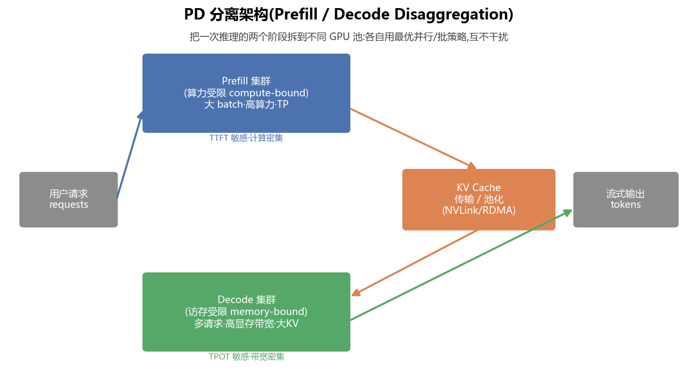
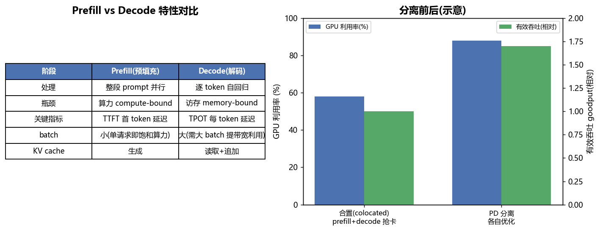

# PD 分离架构 · Prefill / Decode Disaggregation(全面·本质)

> 当前 LLM 推理服务(serving)最重要的架构演进之一。理解它,先要理解**一次自回归生成天然是"两种性格截然不同的负载"拼在一起**。

---

## 1. 一次推理的两个阶段

大模型生成一段回答,分两步:

| 阶段 | 做什么 | 计算特征 | 关键延迟指标 |
|---|---|---|---|
| **Prefill(预填充)** | 把整段 prompt 一次性喂进去,并行算出所有 token 的表示 + 首个输出 token,同时**生成 KV cache** | **算力受限 compute-bound**(一大批 token 同时过,矩阵乘吃满算力) | **TTFT**(Time-To-First-Token,首 token 延迟) |
| **Decode(解码)** | 之后**逐个 token** 自回归生成,每步只算 1 个新 token,但要**读取全部历史 KV cache** | **访存受限 memory-bound**(每步计算量极小,却要把庞大的 KV/权重从 HBM 搬一遍) | **TPOT**(Time-Per-Output-Token,每 token 延迟) |

> 🔬 **第一性原理**:Prefill 的算术强度高(大矩阵乘,FLOP/Byte 大)→ 落在 roofline 的**算力屋顶**下;Decode 的算术强度极低(batch=1 时每步几乎是"读一遍权重只做一次乘加")→ 死死卡在 roofline 的**访存屋檐**上(见 `02_GPU结构` 的 roofline 图)。**两者的瓶颈根本不同**。

---

## 2. 为什么要"分离"

传统做法是 **合置 colocated**:同一批 GPU 既做 prefill 又做 decode。问题:

- **互相干扰**:一个长 prompt 的 prefill(算力密集、耗时)插进来,会**阻塞**正在 decode 的其它请求 → decode 的 TPOT 抖动、卡顿。
- **资源画像冲突**:prefill 想要**高算力**、小 batch 就能打满;decode 想要**高显存带宽 + 大 batch**(把多请求攒起来分摊权重搬运)。同一套配置无法同时最优。
- **并行策略冲突**:prefill 适合张量并行 TP(降低单次延迟);decode 适合更大的数据/流水并行把吞吐拉满。

**PD 分离**:把两个阶段拆到**两个独立的 GPU 池**,各自用最优的批策略、并行策略、甚至不同的硬件,互不干扰。

请求先进 **Prefill 集群**算出 KV cache 与首 token,再把 **KV cache 传输**给 **Decode 集群**继续逐 token 生成并流式返回。

---

## 3. 核心难点:KV Cache 的搬运

分离的代价是:prefill 产生的 **KV cache 必须传给 decode 节点**。KV cache 很大:

$$\text{KV bytes} = 2 \times L \times n_{kv} \times d_{head} \times s \times \text{dtype} \times \text{batch}$$

(2=K和V,L=层数,`n_kv`=KV 头数,`s`=序列长)。一个长上下文请求的 KV 可达几百 MB 到 GB 级。

搬运手段与优化:
- **高速互联**:节点内 NVLink、跨节点 RDMA/InfiniBand;传输要和 prefill 计算**重叠**(layer-by-layer 边算边传)。
- **KV cache 池化 / 分层存储**:把 KV 放到可共享的池(显存→DRAM→SSD 分层),配合**前缀缓存 prefix caching**(相同前缀的 prompt 复用 KV,省掉重复 prefill)。
- **调度**:decode 节点按显存/带宽预算做**连续批处理 continuous batching**;prefill 节点按算力打包。

> ⚠️ **常见坑**:如果 KV 传输带宽跟不上,分离带来的收益会被传输延迟吃掉 → 分离**只在高速互联充足**时才划算(所以常是机内 NVLink 域或 RDMA 胖树网络)。

---

## 4. 业界系统一览

| 系统 | 关键点 |
|---|---|
| **Mooncake**(Kimi) | KV cache 为中心的分离架构 + 分层 KV 池 + 前缀缓存,面向长上下文 |
| **DistServe** | 论文化 PD 分离,按 SLO(TTFT/TPOT)分别为两阶段独立配比资源与并行度 |
| **Splitwise**(微软) | prefill/decode 用不同 GPU 型号(prefill 上高算力卡、decode 上高带宽卡)省成本 |
| **vLLM / SGLang** | 支持 disaggregated serving + PagedAttention(分页 KV,减碎片)+ 前缀缓存 |
| **TensorRT-LLM / Dynamo** | NVIDIA 侧的分离与 KV 传输编排 |

---

## 5. 什么时候用 / 不用

**适合**:在线服务、SLO 严格(要稳定的 TTFT 和 TPOT)、请求长短混合(避免长 prefill 阻塞 decode)、有充足高速互联。

**不划算**:小规模/单机、互联带宽不足、请求高度同质(合置 + continuous batching 已够)。

## 6. 📌 本质小结

1. 分离的根因:**prefill 算力受限、decode 访存受限,性格冲突**。
2. 分离的收益:**各自最优 + 互不干扰**,GPU 利用率与有效吞吐 goodput 双升,尾延迟更稳。
3. 分离的代价:**KV cache 跨节点搬运**,靠高速互联 + 池化 + 前缀缓存 + 计算通信重叠来摊平。

## 💡 面试高频
- "Prefill 和 Decode 的瓶颈分别是什么?" → compute-bound(TTFT)/ memory-bound(TPOT)。
- "为什么要 PD 分离?" → 消除互相阻塞 + 各自用最优批/并行/硬件。
- "分离的代价?怎么解决?" → KV 传输;RDMA/NVLink + KV 池化 + 前缀缓存 + 传算重叠。
- "decode 为什么要大 batch?" → 摊薄每步的权重/KV 搬运(memory-bound),提高带宽利用率。

## 🔗 延伸
- 瓶颈的本质:[`02_GPU结构_从SM到集群_全面本质.md`](02_GPU结构_从SM到集群_全面本质.md) 的 roofline 与显存层级
- 实战:[`projects/01_pd_disagg_simulator`](projects/01_pd_disagg_simulator) —— 模拟 PD 分离调度,量化 TTFT/TPOT/吞吐与 KV 传输开销
- 仓库既有:`../llm-inference/PD分离.md`、`../llm-inference/KV-Cache优化.md`、`../llm-inference/Mooncake.md`
