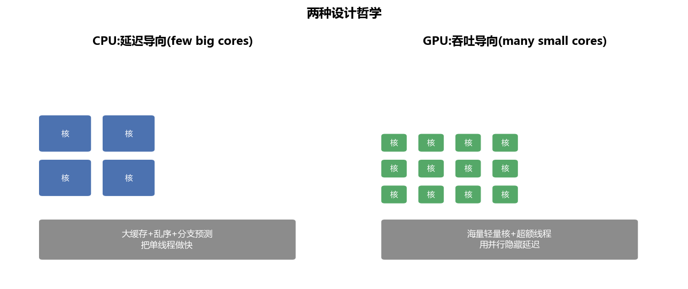
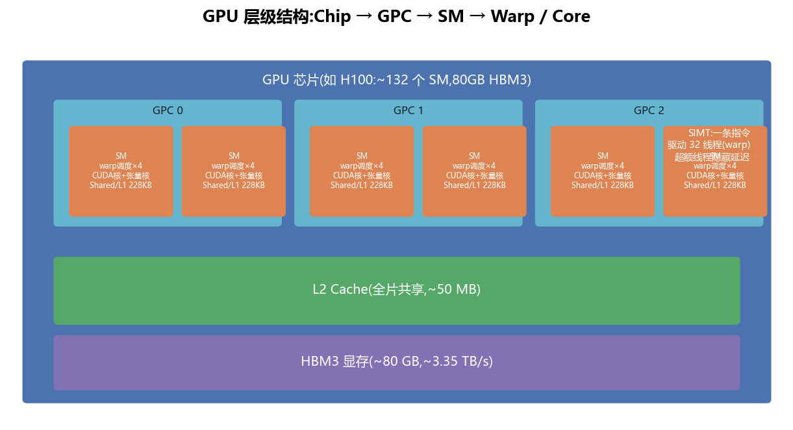
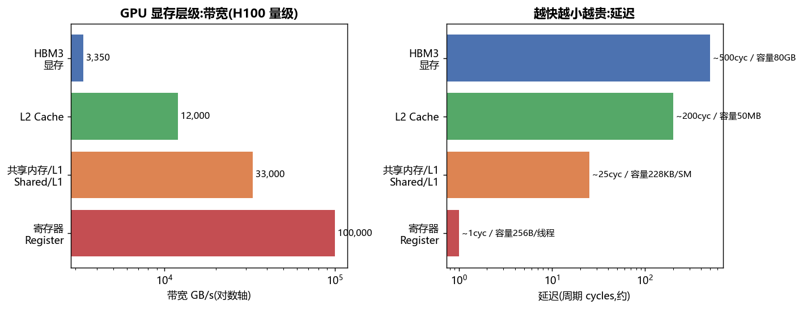
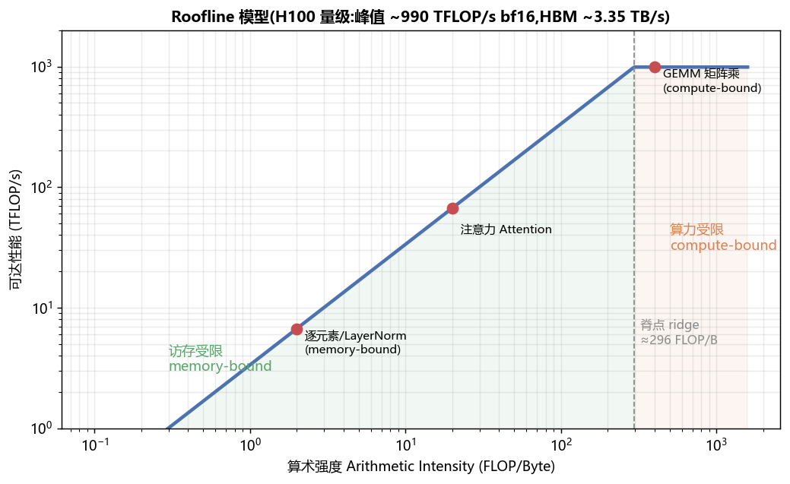

# GPU 结构 · 从晶体管到集群(全面·本质)

> GPU 为什么快?不是因为"频率高"(其实比 CPU 低),而是**用海量并行 + 极高显存带宽 + 张量核,把吞吐推到极致,并用"超额线程"把访存延迟藏起来**。本篇从执行模型讲到集群互联。

---

## 1. 设计哲学:吞吐导向 vs 延迟导向

- **CPU**:少量"大核",堆大缓存、乱序执行、分支预测,目标是把**单线程**做到最快(**延迟导向**)。
- **GPU**:海量"小核",几乎没有复杂控制逻辑,靠**成千上万个线程**和**快速切换**把**吞吐**做到最大(**吞吐导向**)。单个线程慢没关系,一起跑得多就快。

> 🔬 **本质**:GPU 不消除内存延迟,而是**隐藏**它——当一批线程(warp)在等内存,调度器立刻切到另一批就绪的 warp 继续算。所以 GPU 要"超额订阅"线程(occupancy 占用率)才能跑满。

---

## 2. 层级结构:Chip → GPC → SM → Warp

- **SM(Streaming Multiprocessor,流多处理器)**:GPU 的基本计算单元。H100 有 ~132 个 SM。每个 SM 内含:
  - 若干 **warp 调度器**(通常 4 个),每周期挑就绪 warp 发射指令;
  - **CUDA 核**(标量 ALU)做通用浮点/整数;
  - **张量核 Tensor Core** 做矩阵乘累加(MMA),是 LLM 算力的主力;
  - **共享内存 / L1**(H100 可达 228 KB/SM)、寄存器堆(每 SM 数万个 32-bit 寄存器)。
- **Warp(线程束)**:**32 个线程**绑成一束,**同一条指令同时驱动 32 个线程**(SIMT,Single Instruction Multiple Threads)。这是 GPU 真正的调度粒度。
  - ⚠️ **线程发散 divergence**:同一 warp 内线程走了不同 if 分支 → 硬件串行执行各分支,性能掉。写 kernel 要尽量让 warp 内走同一路径。
- **Grid / Block / Thread**:软件侧的组织——kernel 启动一个 grid,grid 由 block 组成(一个 block 调度到一个 SM,块内可用 shared memory + `__syncthreads()` 协作),block 由 thread 组成。

---

## 3. 显存层级:速度与容量的取舍

从快到慢、从小到大:

| 层级 | 容量(量级) | 带宽(量级) | 延迟 | 谁能看到 |
|---|---|---|---|---|
| 寄存器 register | 256 B/线程 | 极高 | ~1 cyc | 单线程私有 |
| 共享内存/L1 shared/L1 | 228 KB/SM | ~33 TB/s | ~20-30 cyc | 块内共享 |
| L2 cache | ~50 MB | ~12 TB/s | ~200 cyc | 全片共享 |
| HBM3 显存 | ~80 GB | ~3.35 TB/s | ~400-600 cyc | 全局 |

> 🔬 **优化的第一性原理**:HBM 又慢又是瓶颈。把数据搬上片上(shared/register)后**尽可能多次复用**,减少 HBM 访问——这就是 GEMM 分块、FlashAttention、算子融合的共同目标。
>
> ⚠️ **合并访存 coalescing**:一个 warp 的 32 个线程若访问**连续对齐**的地址,硬件合并成一次大事务;否则拆成多次,带宽利用率暴跌。
>
> ⚠️ **bank conflict**:共享内存分 32 个 bank,warp 内多个线程访问同一 bank 的不同地址会被串行化(最坏 32×)。

---

## 4. 张量核 Tensor Core

现代 GPU 算力的绝大部分来自张量核:它一条指令做一个**小矩阵乘累加** `D = A·B + C`(MMA)。支持混合精度(fp16/bf16/tf32/fp8/int8),吞吐是普通 CUDA 核的一个数量级以上。Hopper 还有 **WGMMA**(warp-group 级 MMA)+ **TMA**(异步张量搬运),把"喂数据"也异步化。

> 💡 这就是为什么 LLM 训练/推理要把计算表达成**大矩阵乘**——只有喂给张量核才能吃到峰值算力。

---

## 5. Roofline:判断该往哪优化

- **算术强度 Arithmetic Intensity** = FLOP / 访存字节。
- **脊点 ridge point** = 峰值算力 / 峰值带宽(H100 约 296 FLOP/B)。
- 算术强度 **< 脊点** → **访存受限 memory-bound**(逐元素、LayerNorm、decode)→ 优化方向:减少 HBM 访问、融合、提高带宽利用。
- 算术强度 **> 脊点** → **算力受限 compute-bound**(大 GEMM、prefill)→ 优化方向:喂满张量核、提高占用率。

> 这张图直接解释了 [`01_PD分离架构`](01_PD分离架构_Prefill_Decode_Disaggregation.md):prefill 在右(compute-bound),decode 在左(memory-bound)。

---

## 6. 多卡与集群:互联决定并行策略

单卡装不下大模型 → 多卡。**互联带宽**决定哪种并行放哪:

| 互联 | 带宽(量级) | 范围 | 谁走这里 |
|---|---|---|---|
| **NVLink / NVSwitch** | ~900 GB/s(全互联) | 机内 8 卡 | **张量并行 TP**(通信重,必须高带宽) |
| **PCIe** | ~64 GB/s(Gen5 x16) | 机内 CPU-GPU | H2D/D2H 拷贝 |
| **InfiniBand / RoCE(RDMA)** | ~400 Gb/s/口 | 跨机 | **数据/流水并行 DP/PP**(通信相对少) |

> 🔬 **本质映射**:通信量大的并行(TP)待在 NVLink 域内;通信量小的(DP/PP)才跨机。这就是 5D 并行"TP 机内、DP/PP 机间"的由来。集群网络拓扑(fat-tree、rail-optimized)进一步决定 all-reduce 的实际带宽。

## 7. GPU 各代谱系(量级参考)

| 代 | 卡 | HBM | HBM 带宽 | 张量算力(低精度) | NVLink |
|---|---|---|---|---|---|
| Volta | V100 | 16/32 GB | ~900 GB/s | ~125 TFLOPS(fp16) | Gen2 |
| Ampere | A100 | 40/80 GB | ~2.0 TB/s | ~312 TFLOPS(fp16) | Gen3 |
| Hopper | H100 | 80 GB | ~3.35 TB/s | ~990 TFLOPS(bf16) | Gen4 |
| Blackwell | B200 | ~192 GB | ~8 TB/s | 更高 + fp4 | Gen5 |

## 📌 本质小结
1. GPU = **吞吐导向**:海量线程 + 超额订阅隐藏延迟 + 张量核堆算力。
2. 显存层级是核心:**复用片上、减少 HBM 访问**是一切 kernel 优化的主线。
3. Roofline 告诉你 memory-bound 还是 compute-bound,决定优化方向。
4. **互联带宽决定并行策略的物理布局**。

## 💡 面试高频
- warp/SIMT/occupancy 是什么;线程发散、合并访存、bank conflict。
- Roofline 怎么判断瓶颈;脊点怎么算。
- 为什么 TP 只在机内做(NVLink);集群里各并行怎么映射到硬件。

## 🔗 延伸
- 深挖:`../ultra-scale-playbook/appendix/A_GPU架构与本质...md`(如已建)
- 实战:[`projects/02_roofline_bandwidth_bench`](projects/02_roofline_bandwidth_bench)、CUDA 算子见 `../../Enigneer-infra/cuda-mastery`(如有)
- 对照:[`03_CPU结构_流水线_乱序_缓存_多核.md`](03_CPU结构_流水线_乱序_缓存_多核.md)
