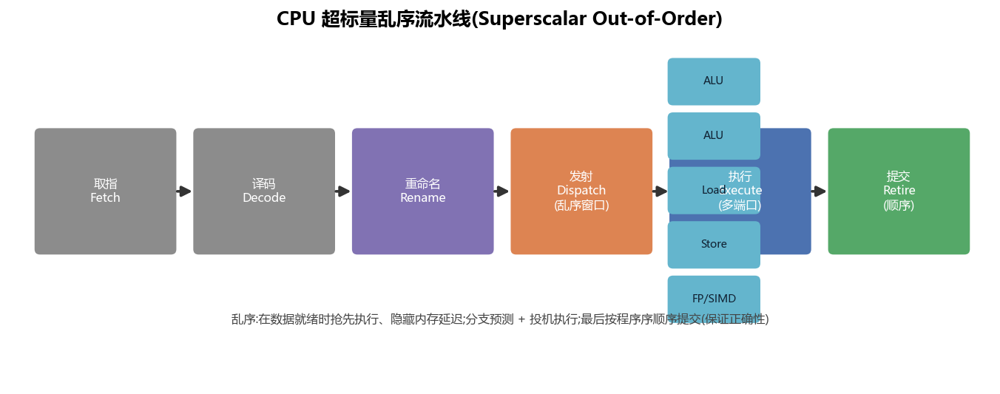
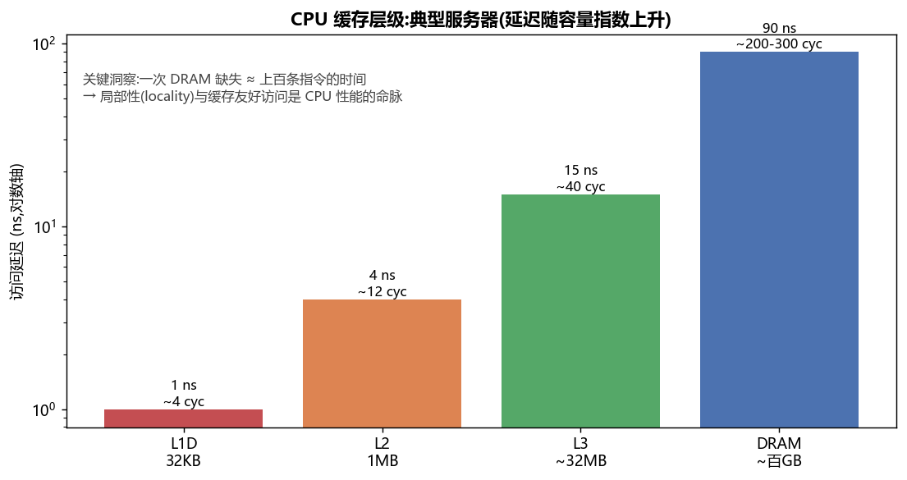
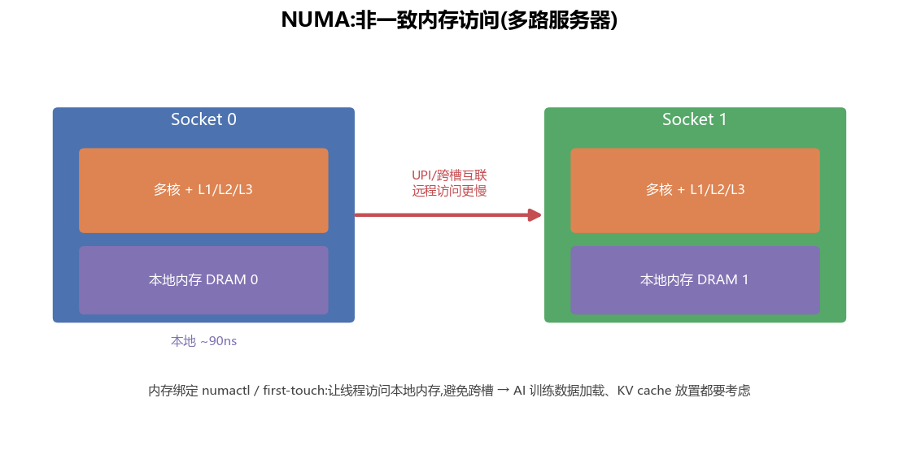

# CPU 结构 · 流水线 / 乱序 / 缓存 / 多核 NUMA(全面·本质)

> AI 训练里 CPU 不是配角:数据加载与预处理、tokenization、host↔device 调度、参数服务、KV 池的 DRAM 分层、通信栈,全在 CPU 上。理解 CPU 的"延迟导向"设计,才知道为什么这些环节会成瓶颈。

---

## 1. 设计哲学:延迟导向

CPU 是**延迟导向 latency-oriented**:用少量强大的核,配大缓存、乱序执行、分支预测、投机执行,把**单个线程**做到尽可能快。代价是控制逻辑复杂、核数少。对比 GPU 的"吞吐导向"(见 [`02_GPU结构`](02_GPU结构_从SM到集群_全面本质.md))。

---

## 2. 超标量乱序流水线

一条指令要经过多个阶段;现代 CPU 同时在**流水**多条,并且**乱序 out-of-order** 执行:

- **取指 Fetch / 译码 Decode**:配**分支预测**,提前把后续指令拉进来(预测错就冲刷流水线,代价大)。
- **重命名 Rename**:把架构寄存器映射到大量物理寄存器,消除假依赖(WAR/WAW),让更多指令能并行。
- **发射 Dispatch(乱序窗口)**:指令进"重排序缓冲/保留站",**谁的操作数先就绪谁先执行**——用后面的独立指令**填住**等内存的空档。
- **执行 Execute(多端口)**:多个执行端口(多 ALU、Load/Store、FP/SIMD)→ **超标量 superscalar**,一周期发射多条。
- **提交 Retire(顺序)**:结果按**程序原序**提交,对外表现得像顺序执行(保证正确性 + 精确异常)。

> 🔬 **本质**:乱序 + 投机 = 在硬件层面**自动挖掘指令级并行 ILP**、**隐藏内存延迟**。这也是"内存重排"的根源之一(见 [`04_内存模型`](04_内存模型_一致性_内存序_GPU与CPU.md))。

---

## 3. 缓存层级:局部性是命脉

| 层级 | 容量 | 延迟(约) | 说明 |
|---|---|---|---|
| L1D | 32-48 KB/核 | ~1 ns / ~4 cyc | 每核私有,最快 |
| L2 | 256KB-2MB/核 | ~4 ns / ~12 cyc | 每核私有 |
| L3(LLC) | 数十 MB | ~15 ns / ~40 cyc | 多核共享 |
| DRAM | 数百 GB | ~90 ns / ~200-300 cyc | 主存 |

> 🔬 **一次 DRAM 缺失 ≈ 上百条指令的时间**。所以 CPU 性能命脉是**局部性 locality**:
> - **时间局部性**:刚用过的还会用 → 留在缓存。
> - **空间局部性**:用了一个,附近的也会用 → 缓存以**缓存行 cache line(64 字节)** 为单位搬运。
>
> ⚠️ **缓存行 = 64 字节**这个数字极其重要:顺序访问数组飞快(每行只缺失一次),随机/跨步访问慢;**伪共享 false sharing**(两个核频繁写同一缓存行的不同变量)会让性能暴跌——实战项目 03 会**实测**这个效应。

---

## 4. SIMD 向量化

CPU 靠 **SIMD**(SSE/AVX2/AVX-512)一条指令处理多个数据(如 AVX-512 一次 16 个 float)。数据预处理、量化、部分算子在 CPU 上要靠向量化 + 缓存友好布局才快。

---

## 5. 多核与 NUMA

多路服务器里,每个 CPU(socket)有**本地内存**;访问**另一个 socket 的内存要走跨槽互联(UPI)**,更慢——这就是 **NUMA(非一致内存访问)**。

- **first-touch**:内存页在**第一次被哪个核写**时才分配到那个核的本地节点。
- **绑核绑内存**:用 `numactl`/`taskset` 让线程和它的数据待在同一 NUMA 节点,避免跨槽。
- **对 AI 的影响**:数据加载线程、DataLoader worker、KV cache 的 DRAM 分层、CPU offload(如 ZeRO-Offload 把优化器状态放 CPU)都要考虑 NUMA 亲和性,否则跨槽访存拖慢整条流水线。

---

## 6. CPU 在 AI-Infra 里的真实角色

| 环节 | CPU 的活 | 瓶颈点 |
|---|---|---|
| 数据流水 | 读盘、解码、增强、tokenize、组 batch | I/O + 单核算力 + GIL(Python) |
| Host 调度 | 发 kernel、管理 stream/event、H2D/D2H | launch 开销(用 CUDA Graph 降) |
| CPU offload | 存优化器状态/KV,CPU 做 Adam 更新 | PCIe 带宽 + CPU 内存带宽 + NUMA |
| 通信 | NCCL/gloo 的 host 侧、RDMA 控制 | 中断、拷贝、NUMA |

## 📌 本质小结
1. CPU = **延迟导向**:乱序 + 投机 + 大缓存,把单线程做快。
2. **局部性 + 64 字节缓存行**是 CPU 性能命脉;伪共享是隐形杀手。
3. 多路服务器是 **NUMA**,要绑核绑内存。
4. AI 里 CPU 管数据流水与调度,常是"喂不饱 GPU"的元凶。

## 💡 面试高频
- 乱序执行/流水线/分支预测/投机;为什么会有内存重排。
- 缓存行 64B、伪共享、局部性;一次 cache miss 多贵。
- NUMA 是什么、first-touch、怎么绑核绑内存。
- DataLoader 为什么用多进程(绕开 Python GIL)。

## 🔗 延伸
- 内存序的硬件根源:[`04_内存模型_一致性_内存序_GPU与CPU.md`](04_内存模型_一致性_内存序_GPU与CPU.md)
- 实战:[`projects/03_false_sharing_memory_order`](projects/03_false_sharing_memory_order)(**实测**伪共享的性能悬崖)
- 对照:[`02_GPU结构...md`](02_GPU结构_从SM到集群_全面本质.md)
