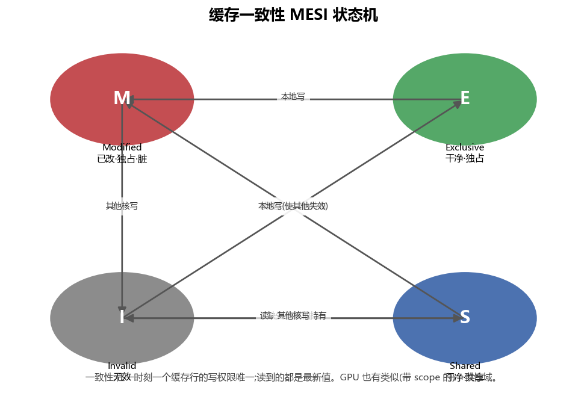
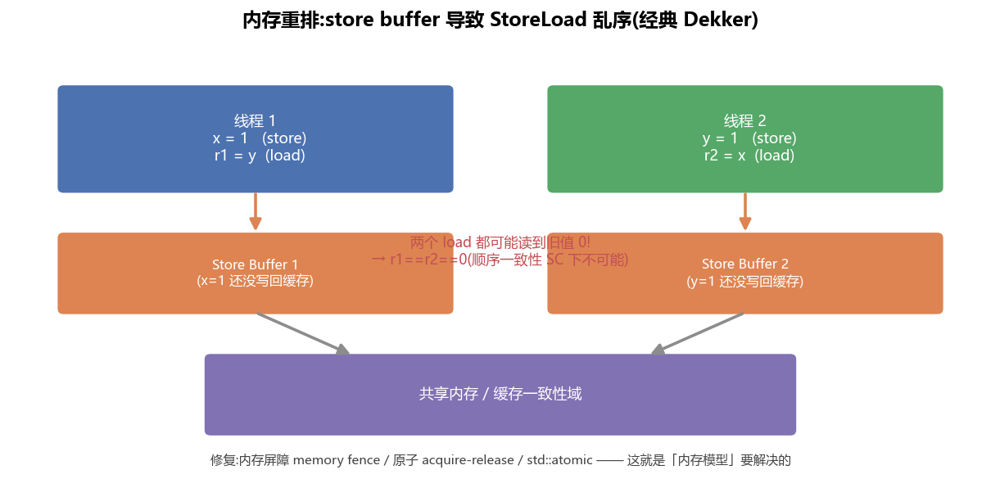

# 内存模型 · 一致性 / 内存序 / 原子(CPU 与 GPU)(全面·本质)

> 这是并发编程里最烧脑、也最面试爱问的部分。核心问题:**多个核/线程同时读写共享内存,谁能看到谁的写?以什么顺序?** 答案由**内存模型 memory model** 规定。

---

## 1. 两个容易混淆的概念

| 概念 | 管什么 | 一句话 |
|---|---|---|
| **一致性 Coherence** | **单个**内存位置 | 对同一个地址,所有核最终看到**一致的、有序的**写序列 |
| **内存序 / 一致性模型 Consistency** | **多个**内存位置**之间** | 不同地址的读写,在别的核眼里能以什么**相对顺序**出现 |

Coherence 保证"每个地址自己不乱";Consistency 保证(或不保证)"多个地址之间的顺序"。

---

## 2. 缓存一致性:MESI



多个核各有私有缓存,同一缓存行可能存在多份副本。**MESI** 协议给每个缓存行标记状态:

- **M(Modified)**:被本核改过、独占、与内存不一致(脏)。
- **E(Exclusive)**:只有本核有、干净。
- **S(Shared)**:多核共享、干净。
- **I(Invalid)**:无效。

规则本质:**任一时刻,一个缓存行的"写权限"最多归一个核**;别的核要写,先把其它副本**作废 invalidate**。这样保证了对单个地址的 coherence。代价是 invalidate 的通信开销——**伪共享**(见 CPU 篇)就是它被滥用的后果。

---

## 3. 内存重排:为什么会发生

即使每个地址都 coherent,**多个地址之间的顺序仍可能被打乱**。来源:

1. **编译器重排**:优化时调整无数据依赖的读写顺序。
2. **CPU 乱序执行 + store buffer**:写先进**store buffer**(还没到缓存),后面的读却能先执行 → 出现 **StoreLoad 重排**。



经典例子(Dekker):两个线程各自"先写自己的、再读对方的"。由于两边的写都卡在各自 store buffer 里,**两个读都可能读到旧值 0**——这在"顺序一致性"下本不该发生,但真实硬件(x86 也允许 StoreLoad 重排)会。

> 🔬 **本质**:硬件为了性能(隐藏写延迟)牺牲了"直觉上的全局顺序"。内存模型就是**硬件/语言和程序员之间的契约**,规定"默认能重排到什么程度,以及你如何用同步手段禁止重排"。

---

## 4. 内存序的谱系(强 → 弱)

| 模型 | 谁 | 特点 |
|---|---|---|
| **顺序一致性 SC** | 理论理想 | 所有核看到同一个全局交错顺序;最直觉但最慢 |
| **TSO(x86)** | Intel/AMD | 较强:只允许 **StoreLoad** 重排(store buffer 造成) |
| **弱序 weak**(ARM/POWER/**GPU**) | ARM、NVIDIA GPU | 允许更多重排,必须显式加屏障才有序 |

---

## 5. 同步工具:原子与 acquire/release

程序员用**原子操作 + 内存序标注**来禁止有害重排:

- **memory fence / barrier**:一道栅栏,禁止跨越它的重排。
- **acquire**(用于 load):此 load 之后的读写不能被重排到它**之前** → 常用于"拿锁/读标志位"。
- **release**(用于 store):此 store 之前的读写不能被重排到它**之后** → 常用于"放锁/发布数据"。
- **acquire-release 配对**:线程 A 把数据写好后 `release` 一个标志;线程 B `acquire` 到该标志后,**保证能看到 A 之前的所有写**。这是无锁编程发布数据的基石。

```cpp
// 生产者
data = compute();                       // 1) 先准备数据
flag.store(1, std::memory_order_release);// 2) release 发布:1 不会被重排到它之后

// 消费者
while (flag.load(std::memory_order_acquire) == 0) {}  // acquire 获取
use(data);   // 保证能看到生产者的 data(1 happens-before use)
```

> ⚠️ **坑**:用普通(非原子)变量做线程间标志位是未定义行为;`volatile` **不保证**内存序(它只防编译器优化掉访问,不给多核可见性/顺序保证)。要用 `std::atomic` + 正确的 memory_order。

---

## 6. GPU 的内存模型:更弱 + 带 scope

GPU 是**弱内存模型**,而且多了一个维度:**作用域 scope**——一个原子/屏障作用到多大范围:

| scope | 范围 |
|---|---|
| `thread` | 单线程 |
| `block`(cta) | 线程块内(常配 `__syncthreads()`) |
| `device` | 整个 GPU |
| `system` | GPU + CPU(统一内存) |

- **`__syncthreads()`**:块内屏障——块内所有线程到齐、且之前的共享内存写都可见,才继续。写 kernel 时**最常用**(如 GEMM 分块加载后同步)。
  - ⚠️ **不能在发散分支里调用**(部分线程到不了 → 死锁)。
- **`__threadfence()` 系列**:内存栅栏,保证之前的写对相应 scope 可见。
- **warp 内**:32 线程 SIMT,同步用 `__syncwarp()`;warp 内数据交换用 `__shfl_*`(shuffle)。
- CUDA C++ 提供 `cuda::atomic` + `cuda::memory_order_*` + `thread_scope_*`,和 C++ 内存模型对齐但显式带 scope。

> 🔬 **为什么 GPU 更弱**:海量线程 + 高带宽,若强制全局顺序,同步成本爆炸。所以默认极弱,把"何处需要顺序"交给程序员用 scope 精确表达——**只在必要处、必要范围内同步**,是 GPU 高性能的前提。

---

## 7. 一张对照

| | CPU(x86 TSO) | GPU(NVIDIA,弱+scope) |
|---|---|---|
| 默认序 | 较强(仅 StoreLoad 重排) | 很弱 |
| 同步原语 | fence、`std::atomic`、锁 | `__syncthreads`、`__threadfence`、`cuda::atomic`+scope |
| 一致性范围 | 全系统 | 分 thread/block/device/system scope |
| 关键坑 | 伪共享、`volatile` 误用 | 发散里 `__syncthreads`、忘 fence、scope 选错 |

## 📌 本质小结
1. **Coherence** 管单地址、**Consistency** 管多地址间顺序。
2. 硬件为性能允许**重排**;内存模型是契约,原子 + acquire/release 是你禁止有害重排的工具。
3. **GPU 内存模型更弱且带 scope**——只在必要范围同步是高性能的前提。
4. `volatile ≠ 原子/内存序`;线程间共享标志要用 `std::atomic`/`cuda::atomic`。

## 💡 面试高频
- coherence vs consistency 区别;MESI。
- 内存重排从哪来(store buffer / 乱序 / 编译器);SC/TSO/弱序。
- acquire/release 语义与配对;为什么 `volatile` 不够。
- `__syncthreads()` 的语义与"发散里调用会死锁"的坑;GPU 的 scope。

## 🔗 延伸
- 硬件根源:[`03_CPU结构...md`](03_CPU结构_流水线_乱序_缓存_多核.md)(乱序/store buffer)、[`02_GPU结构...md`](02_GPU结构_从SM到集群_全面本质.md)
- 实战:[`projects/03_false_sharing_memory_order`](projects/03_false_sharing_memory_order)
