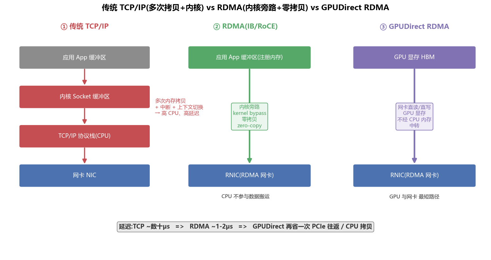
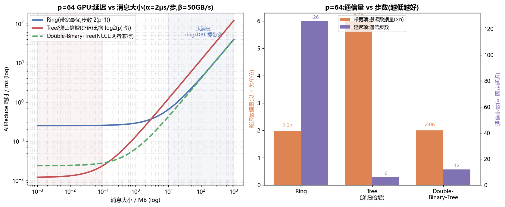
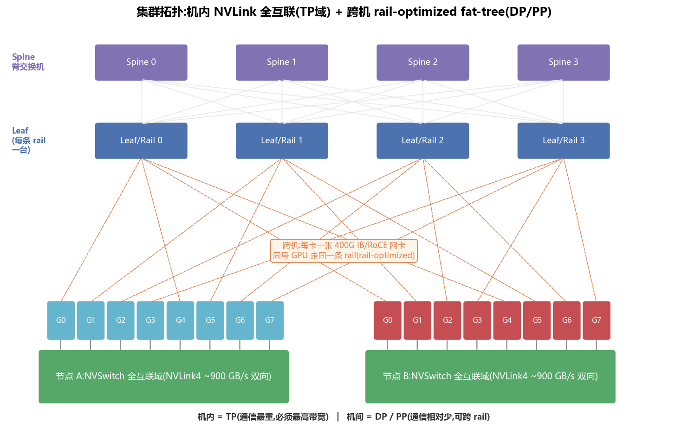
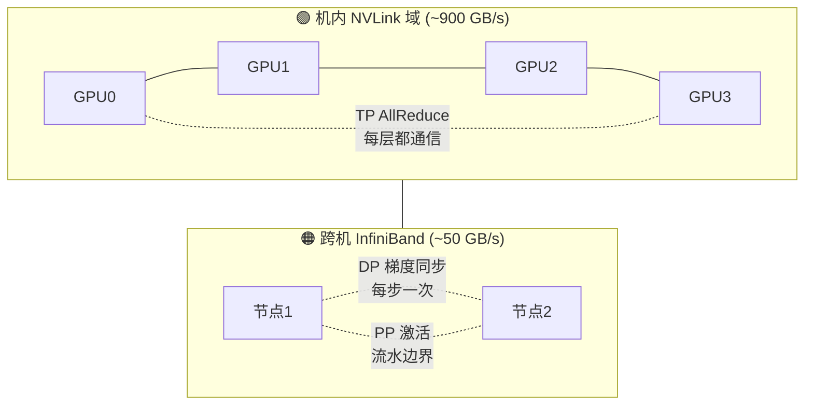
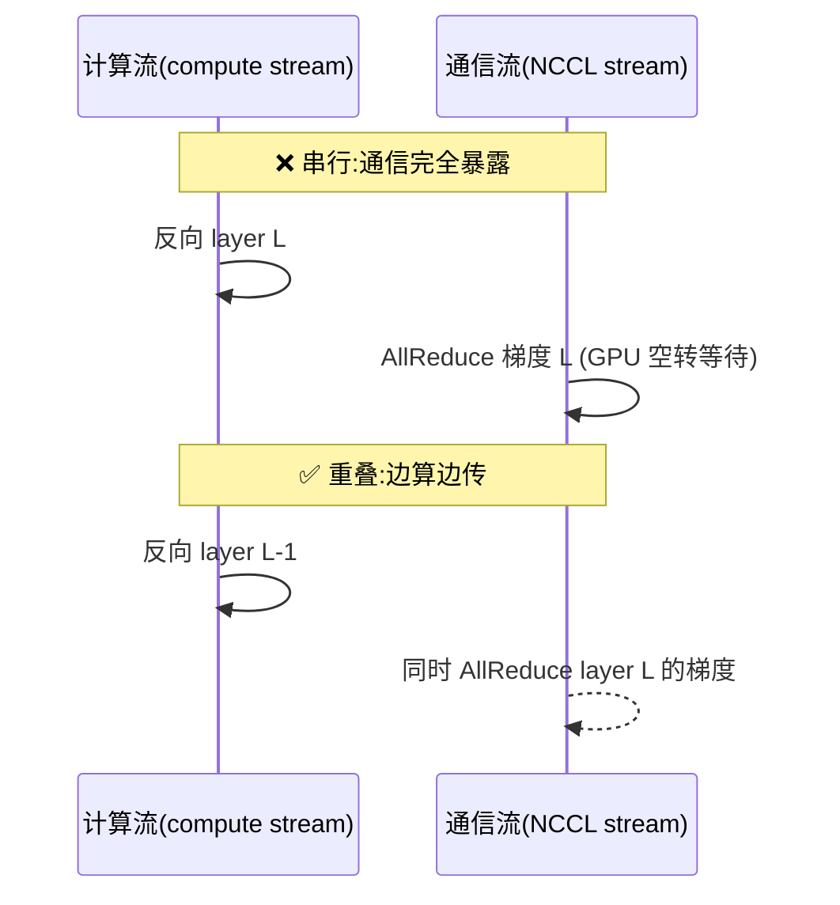
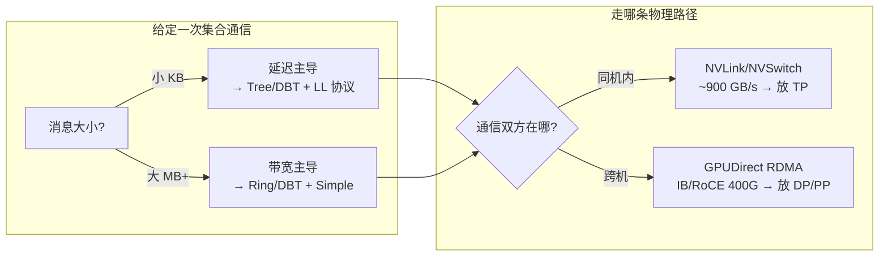

# 网络与通信 · RDMA / RoCE / IB · NCCL · 集合通信算法 · 集群拓扑(全面·本质)

> 单卡装不下大模型 → 多卡多机 → **卡与卡之间要不停地交换梯度/激活/KV**。于是网络从"锦上添花"变成了**分布式训练/推理的命脉**:GPU 再快,只要通信拖后腿,几百上千张卡的利用率(MFU)就会被拉到地板上。本篇从"为什么网络是瓶颈"讲到 RDMA、NCCL 的三种 AllReduce 算法、集群拓扑,以及通信与计算怎么重叠。

---

## 🧠 1. 为什么网络是分布式训练的命脉

一次典型的数据并行(DP)训练迭代:每张卡各算各的前向+反向,得到**各自的梯度**;然后**所有卡把梯度求和求平均**(这就是 AllReduce),再各自更新参数。模型越大,梯度越大——一个 7B 模型 fp16 梯度就是 **14 GB**,几百张卡每一步都要把这些数据在网络里搬来搬去。

> 🔬 **第一性原理**:GPU 算得越快,单步计算时间越短,**通信时间占比反而越高**。假设计算 100ms、通信 100ms,若下一代 GPU 把计算砍到 50ms 而网络不变,那么这一步从 200ms → 150ms,**加速比只有 1.33×,而不是 GPU 宣称的 2×**——被网络"税"掉了。这就是 Amdahl 定律在分布式训练里的现身。

### ⚙️ 带宽 / 延迟 / 消息大小:通信的三要素

任何一次点对点传输的耗时,都可以用一个极其重要的线性模型(**α-β 模型**)刻画:

$$
T(n) = \alpha + \frac{n}{\beta}
$$

- $\alpha$ = **固定延迟 latency**(启动一次传输的开销:握手、协议栈、一跳交换机的转发,量级 **1~几十 µs**)。
- $\beta$ = **带宽 bandwidth**(每秒能搬多少字节,量级 **数十~数百 GB/s**)。
- $n$ = **消息大小 message size**(这次要搬的字节数)。

| 消息大小 | 谁主导 | 优化方向 |
|---|---|---|
| **小消息**(几十字节~几十 KB) | $\alpha$ **延迟主导** | 减少**步数/跳数**,合并小包,选低延迟算法(tree) |
| **大消息**(几 MB~几 GB) | $n/\beta$ **带宽主导** | 打满**带宽**,选带宽最优算法(ring),别让链路空闲 |

> 💡 **实战**:这就是为什么**同样的 AllReduce,小张量和大张量要用不同算法**(见第 4 节)。也是为什么梯度要做 **bucket 分桶融合**——把很多小梯度攒成一个大包再发,把 α 摊薄。

> ⚠️ **常见坑**:只盯着"链路带宽 400 Gbps"这个数字。实际**有效带宽**还要打折:协议开销、拥塞、拓扑非阻塞比、以及**小消息根本吃不到带宽**(被 α 主导)。规划集群一定要看"**总线带宽 busbw**"这种考虑了算法通信量的等效带宽。

---

## 🚀 2. RDMA / RoCE / InfiniBand:让网络快到能喂饱 GPU

传统 **TCP/IP** 走内核协议栈:数据要从应用缓冲区 → 内核 socket 缓冲区 → 协议栈处理 → 网卡,**每一步都拷贝内存,还要中断 CPU、上下文切换**。延迟几十 µs,还把宝贵的 CPU 核烧在搬数据上。对分布式训练这种"高频、大块"的通信,这是灾难。

**RDMA(Remote Direct Memory Access,远程直接内存访问)** 是解药:让**一台机器的网卡,直接读写另一台机器的内存**,全程绕过操作系统内核。



### 🔑 RDMA 的两大法宝

| 机制 | 是什么 | 为什么快 |
|---|---|---|
| **内核旁路 kernel bypass** | 应用直接和网卡(RNIC)对话(通过 verbs / QP 队列),不进内核 | 省掉系统调用、中断、上下文切换 |
| **零拷贝 zero-copy** | 网卡通过 DMA 直接搬应用**注册过的内存**,不经过中间缓冲区 | 省掉 CPU 逐字节拷贝,CPU 完全不碰数据 |

> 🔬 **本质**:CPU 只在一开始"下个单"(post 一个 work request 到发送队列 QP),之后**网卡自己完成传输并在完成队列 CQ 打个勾**。数据搬运彻底"卸载(offload)"给硬件。这就是 RDMA 能做到 **~1-2 µs 延迟、接近线速带宽、且 CPU 几乎 0 占用**的原因。

### 🌐 三种主流实现

| 实现 | 全称 | 底层 | 特点 |
|---|---|---|---|
| **InfiniBand(IB)** | InfiniBand | 专用 IB 链路+交换机 | 原生 RDMA、低延迟、自带可靠传输与拥塞控制;贵,生态封闭(NVIDIA/Mellanox 主导) |
| **RoCE v2** | RDMA over Converged Ethernet | 跑在**以太网/UDP** 上 | 复用以太网生态、便宜;但要靠交换机 **PFC/ECN** 做无损网络,调不好易丢包 |
| **iWARP** | internet Wide Area RDMA | 跑在 **TCP** 上 | 兼容性好、可路由,但延迟/性能不如前两者,现较少用于大规模训练 |

> 💡 **面试高频**:"IB 和 RoCE 怎么选?" —— 追求极致性能与确定性、预算充足 → **IB**;想用以太网生态、成本敏感、能把无损网络调好 → **RoCE v2**。国内很多大集群两者都有,超节点内 IB、跨 POD 以太。

### 🎮 GPUDirect RDMA:把 GPU 显存也接进来

普通 RDMA 只到"主机内存"。深度学习的数据在 **GPU 显存**里,若还要先 GPU→CPU 内存拷贝再发,就多了一次 PCIe 往返。**GPUDirect RDMA** 让**网卡直接 DMA 读写 GPU 显存(HBM)**,连 CPU 内存中转都省了。

```text
无 GPUDirect: GPU显存 --PCIe--> CPU内存 --拷贝--> 网卡  (两跳 + CPU 拷贝)
有 GPUDirect: GPU显存 ------PCIe(P2P)------> 网卡      (一跳,CPU 不参与)
```

> ⚠️ **坑**:GPUDirect RDMA 要求 GPU 和网卡**挂在同一个 PCIe Switch 下 / 同一 NUMA 节点**,P2P 路径才短;否则要绕经 CPU root complex,延迟带宽都掉。这就是服务器为什么按 "**每 GPU 就近配一张网卡**" 布线(见拓扑 rail-optimized)。

---

## 🔗 3. NCCL 是什么

**NCCL(NVIDIA Collective Communications Library,读作 "Nickel")** 是 NVIDIA 的 GPU 集合通信库。PyTorch DDP / FSDP、Megatron、DeepSpeed 底下的 `all_reduce` / `all_gather` / `reduce_scatter` 最终都调 NCCL。它做三件事:

1. **拓扑感知**:自动探测机内 NVLink/NVSwitch、PCIe,机间 IB/RoCE 的连接,构建通信图。
2. **选算法+选传输**:根据消息大小、GPU 数、拓扑,自动选 ring 还是 tree,走 NVLink 还是 RDMA(用不用 GPUDirect)。
3. **高效执行**:把通信做成 GPU kernel,和计算 kernel 一样在 SM/拷贝引擎上跑,支持和计算**重叠**。

### 集合通信原语速查

| 原语 | 语义 | 训练里谁用 |
|---|---|---|
| **AllReduce** | 所有卡的张量对应求和(/平均),结果**每张卡都拿到** | **DP 梯度同步**(最核心) |
| **ReduceScatter** | 求和后**按分片分给各卡**(每卡拿一段和) | ZeRO / FSDP、ring-allreduce 的前半 |
| **AllGather** | 每卡的分片**拼成整体广播给所有卡** | ZeRO 参数收集、ring-allreduce 的后半 |
| **Broadcast** | 一张卡的数据发给所有卡 | 初始化广播权重 |
| **All-to-All** | 每卡给每卡发不同数据(转置) | **MoE 专家路由**、序列并行 |

> 🔬 **关键恒等式**:$\text{AllReduce} = \text{ReduceScatter} + \text{AllGather}$。ring-allreduce 正是这么实现的——先 reduce-scatter 让每卡持有一段全局和,再 all-gather 拼回完整结果。理解这条就理解了 ring 为什么带宽最优。

### 一段最小的 PyTorch + NCCL 示例

```python
import torch, torch.distributed as dist
dist.init_process_group("nccl")          # 底层用 NCCL,自动探测 NVLink/IB
rank, world = dist.get_rank(), dist.get_world_size()
x = torch.ones(1 << 20, device=f"cuda:{rank % torch.cuda.device_count()}") * rank
dist.all_reduce(x, op=dist.ReduceOp.SUM) # 所有卡求和,结果每卡都拿到
assert x[0].item() == sum(range(world))  # 0+1+...+(world-1)
# 训练里几乎不手写:DDP 在反向 hook 里自动分桶 all_reduce 梯度
```

```bash
# 关键环境变量(排障/调优)
NCCL_DEBUG=INFO            # 打印它选了 Ring/Tree、走 NVLink 还是 IB(NET/IB)
NCCL_ALGO=Tree            # 强制算法;NCCL_PROTO=LL 小消息低延迟协议
NCCL_IB_HCA=mlx5          # 指定 IB 网卡;NCCL_SOCKET_IFNAME 选网口
NCCL_P2P_DISABLE=1        # 关 P2P 排查 NVLink 问题(仅调试,勿上生产)
```

### 🧮 In-network reduction:让交换机替你算(SHARP)

极致优化是把"求和"这步**卸载到网络硬件里**。**NVLink SHARP / IB SHARP(Scalable Hierarchical Aggregation and Reduction Protocol)** 让 **NVSwitch / IB 交换机自己做归约**:各卡把数据发上去,交换机在芯片里就地相加,再把结果广播回来。

- ✅ 数据**只上行一次、下行一次**,不再在环里转 $2(p-1)$ 圈 → 带宽项砍半、延迟更低。
- ✅ 释放 GPU SM(不用 GPU 跑归约 kernel)。
- 这是超节点(NVL72 等)大 AllReduce 的重要加速来源。

> 🔬 **本质**:通信和计算的边界在模糊——**网络设备也能算**。当"搬数据"本身就是为了"聚合",不如让数据流经的交换机顺手把和算了,少一趟往返。

---

## 📊 4. 三种 AllReduce 算法:ring vs tree vs double-binary-tree

这是本篇的核心。用第 1 节的 α-β 模型,把 $p$ 张卡、消息 $n$ 字节、每步延迟 $\alpha$、链路带宽 $\beta$ 代入,三种算法的耗时天差地别。



### 🔵 Ring AllReduce(环)—— 带宽最优,大消息之王

把 $p$ 张卡连成一个环,每张卡只和左右邻居通信。分两阶段,每阶段 $p-1$ 步:

- **Reduce-Scatter**($p-1$ 步):数据切成 $p$ 片,每步每卡把一片发给下家、从上家收一片累加;$p-1$ 步后每卡持有**一段完整的全局和**。
- **All-Gather**($p-1$ 步):再转 $p-1$ 步,把各自那段和传遍全环。

$$
T_{\text{ring}} = \underbrace{2(p-1)\,\alpha}_{\text{延迟项:步数多}} + \underbrace{2\frac{p-1}{p}\cdot\frac{n}{\beta}}_{\text{带宽项:每卡只搬} \approx 2n}
$$

- ✅ **带宽项 $\approx 2n/\beta$,与卡数 $p$ 几乎无关**——无论 8 卡还是 1024 卡,每张卡搬的数据量都差不多。这就是"**带宽最优 bandwidth-optimal**"。
- ❌ **延迟项 $2(p-1)\alpha$ 随 $p$ 线性增长**——1024 卡就是约 2046 步,小消息时被 α 拖死。

```text
Ring 环(4 卡示意),每步只和邻居传 1 片
   G0 → G1 → G2 → G3 →(回到 G0)
```

### 🔴 Tree / 递归倍增(recursive doubling)—— 延迟低,小消息占优

用树形/对半折叠的方式聚合,只需 $\log_2 p$ 步:

$$
T_{\text{tree}} = \underbrace{\log_2 p \cdot \alpha}_{\text{延迟项:步数少!}} + \underbrace{\log_2 p \cdot \frac{n}{\beta}}_{\text{带宽项:搬} \log_2 p \text{ 份,大消息吃亏}}
$$

- ✅ **步数只有 $\log_2 p$**(1024 卡 = 10 步 vs ring 的 2046 步)——**小消息延迟大幅降低**。
- ❌ **带宽项 $\log_2 p \cdot n$**:每卡要搬 $\log_2 p$ 份数据(1024 卡搬 10 份 vs ring 的 2 份),**大消息严重浪费带宽**。

### 🟢 Double-Binary-Tree(双二叉树)—— 两者兼得,NCCL 大规模默认

NCCL 的杀手锏(源自 Rabenseifner 思路)。构造**两棵互补的二叉树**:一棵树的内部节点恰好是另一棵树的叶子。数据切两半,各走一棵树,**同时上行 reduce、下行 broadcast**。

$$
T_{\text{dbt}} \approx \underbrace{2\log_2 p \cdot \alpha}_{\text{延迟仍是对数级}} + \underbrace{2\cdot\frac{n}{\beta}}_{\text{带宽近最优} \approx 2n}
$$

- ✅ **延迟对数级**(像 tree),✅ **带宽项 $\approx 2n$**(像 ring)——鱼与熊掌兼得。
- 这就是为什么上图里**绿色虚线在小消息处贴着红线(低延迟)、大消息处贴着蓝线(高带宽)**,全程都在最优附近。

### 三算法对比总表($p=64$ 为例)

| 算法 | 步数(∝延迟) | 每卡搬运量(∝带宽) | 适用消息 | NCCL 何时用 |
|---|---|---|---|---|
| **Ring** | $2(p-1)=126$ | $\approx 2n$ | **大消息**(≳几 MB) | 单机/中等规模、大张量 |
| **Tree/递归倍增** | $\log_2 p = 6$ | $\log_2 p \cdot n = 6n$ | **小消息**(≲几十 KB) | 小张量、延迟敏感 |
| **Double-Binary-Tree** | $2\log_2 p = 12$ | $\approx 2n$ | **大规模全覆盖** | 多机大规模默认(可 `NCCL_ALGO` 强制) |

> 💡 **面试高频金句**:"ring 带宽最优但步数正比于卡数,大消息用它;tree 步数只有 log 卡数,小消息用它降延迟;NCCL 的 double-binary-tree 用两棵互补树同时拿到 log 级延迟和近最优带宽,所以大规模默认选它。"

### 🔢 算一算:$p=64$,$\alpha=2\,\mu s$,$\beta=50\,\text{GB/s}$

**① 小消息 $n=16\,\text{KB}$**(带宽项 $=16\text{KB}/50\text{GB/s}\approx 0.32\,\mu s$,可忽略,纯看步数):

$$
T_{\text{ring}} \approx 2\times 63\times 2\mu s = 252\,\mu s,\quad
T_{\text{tree}} \approx 6\times 2\mu s = 12\,\mu s
$$

**tree 快约 21×**——小消息就该走 tree/DBT。

**② 大消息 $n=1\,\text{GB}$**(延迟项相对可忽略,纯看带宽项):

$$
T_{\text{ring}} \approx 2\times\frac{1\text{GB}}{50\text{GB/s}} = 40\,\text{ms},\quad
T_{\text{tree}} \approx 6\times\frac{1\text{GB}}{50\text{GB/s}} = 120\,\text{ms}
$$

**ring 快 3×**(因为 tree 搬了 $\log_2 64=6$ 份数据)——大消息就该走 ring。这两个数就是上图两条曲线在左右两端的交叉,也是"消息大小决定算法"的量化证据。

> 💡 **实战**:可用 `NCCL_ALGO=Ring/Tree`、`NCCL_PROTO=Simple/LL/LL128`(LL=Low-Latency,小消息用更省同步的协议)、`NCCL_MIN/MAX_NCHANNELS` 调优;`NCCL_DEBUG=INFO` 打印它实际选了什么算法/传输。跑 `nccl-tests` 的 `all_reduce_perf` 看 busbw 曲线是排障第一步。

---

## 🏗️ 5. 集群拓扑:为什么 TP 走机内 NVLink、DP/PP 跨机 IB

网络不是"一根线",而是一张有层级的**拓扑**。拓扑决定了任意两卡之间的带宽和延迟,进而决定并行策略该怎么摆。



### 带宽的巨大落差(H100 量级)

| 互联 | 带宽(量级) | 延迟 | 范围 |
|---|---|---|---|
| **NVLink4 / NVSwitch**(机内全互联) | **~900 GB/s** 双向/卡 | 亚 µs | 机内 8(或超节点 256)卡 |
| **PCIe Gen5 x16** | ~64 GB/s | ~µs | CPU↔GPU、GPU↔网卡 |
| **InfiniBand/RoCE 400G**(跨机) | **~50 GB/s**(400 Gbps)/口 | ~1-2 µs + 多跳 | 跨机 |

> 🔬 **本质映射(记牢!)**:机内 NVLink 比跨机 IB **快约一个数量级**(900 vs 50 GB/s)。所以:**通信量最大的并行放进最快的域**。
> - **张量并行 TP**:每层前向/反向都要 AllReduce 激活,**通信极频繁极重** → **必须待在机内 NVLink 域**(TP size 通常 ≤ 单机卡数/NVLink 域大小,如 8)。
> - **数据并行 DP / 流水并行 PP**:DP 每步只在反向末尾同步一次梯度;PP 只在流水级边界传激活——**通信相对稀疏** → **可以跨机走 IB**。

这正是 5D 并行"**TP 机内、DP/PP 机间**"布局的物理根源。



### 三种经典网络拓扑

| 拓扑 | 结构 | 特点 | 用在哪 |
|---|---|---|---|
| **Fat-Tree(胖树 / Clos)** | 叶(leaf/ToR)—脊(spine)多层,越往上链路越"胖" | **全等分带宽(non-blocking)**,任意两点带宽有保证;布线/交换机多、成本高 | 主流 GPU 训练集群 |
| **Rail-optimized(轨道优化)** | 每台机同号 GPU 的网卡接到**同一台 leaf(一条 rail)** | 同号 GPU 间**一跳直达**,AllReduce 走同 rail 不抢带宽;是 fat-tree 的一种布线约定 | NVIDIA 参考架构、多数大厂 |
| **Dragonfly** | 分组,组内全连接,组间少量高带宽长链 | 交换机/线缆更省、直径小(跳数少);路由更复杂、易局部拥塞 | 超算(HPC)、超大规模 |

> 🔬 **Rail-optimized 的精髓**:DP AllReduce 是"所有节点的第 $k$ 号 GPU 之间"聚合。若第 $k$ 号 GPU 都挂在第 $k$ 条 rail 上,这次 AllReduce **只在一台 leaf 交换机内完成**,根本不上 spine,既低延迟又不和别的 rail 抢带宽。这就是上面拓扑图橙色虚线"同号 GPU 走同一条 rail"的用意。

### ⚖️ Bisection 带宽:衡量拓扑好坏的关键指标

**bisection 带宽**:把集群一切两半,横跨切面的**总带宽**。它决定了"最坏情况下,两半之间能多快通信"——AllReduce/All-to-All 这类全局通信的上限由它决定。

- **Full bisection / non-blocking**:切面带宽 = 一半节点的接入带宽之和(fat-tree 追求的目标)。
- **Oversubscribed(超订)**:上行带宽 < 下行(如 2:1),省钱但全局通信会成瓶颈。

> ⚠️ **坑**:很多"看起来很大"的集群其实上行超订。跑 All-to-All(MoE)或大 DP 时才发现 bisection 不够,实际带宽远低于单口标称。选型/排障务必确认**非阻塞比**。

### InfiniBand 各代(量级参考)

| 代 | 单口速率 | 出现时期 | 谁在用 |
|---|---|---|---|
| **EDR** | 100 Gbps | ~2016 | V100 时代 |
| **HDR** | 200 Gbps | ~2020 | A100 集群 |
| **NDR** | 400 Gbps | ~2022 | H100 集群(主流) |
| **XDR** | 800 Gbps | ~2024+ | Blackwell 集群 |

> 每代基本翻倍。注意"每卡一张网卡"时,**跨机聚合带宽 = 卡数 × 单口**——8 卡 NDR 节点跨机理论 3.2 Tbps,但仍比机内 NVLink(8×900GB/s=57.6 Tbps 级)低一个数量级,这正是 TP 不能跨机的根因。

---

## 🔀 6. All-to-All 与 MoE:另一种通信压力

除了 AllReduce,**All-to-All** 是另一个大户,尤其 **MoE(混合专家)** 模型:每个 token 经门控(gating)被路由到不同专家,而专家分散在不同卡上 → 必须把 token **打散发到目标卡、算完再收回来**,这就是两次 All-to-All(dispatch + combine)。

| 特性 | AllReduce(DP) | All-to-All(MoE / SP) |
|---|---|---|
| 通信模式 | 全体聚合同一份数据 | 每卡给每卡发**不同**数据 |
| 数据量 | 与模型梯度成正比 | 与 token 数 × 隐藏维成正比 |
| 对拓扑要求 | 看总带宽 | **重度依赖 bisection 带宽**(全交叉) |
| 痛点 | 步数(大规模) | 负载不均(热门专家)、bisection 不够 |

> ⚠️ **坑**:MoE 的 All-to-All 是**全交叉流量**,最吃 bisection 带宽;若专家路由不均(某专家爆热),还会造成**通信长尾**。这就是 MoE 训练里"**专家并行 EP** 尽量放进高带宽域、并做负载均衡损失(aux loss)"的原因。序列并行(SP)、上下文并行也会引入 All-to-All / AllGather 流量。

---

## 🌊 7. 拥塞控制:无损网络是 RDMA 的前提

RDMA(尤其 RoCE)对丢包极其敏感——一丢包就要重传,延迟抖动放大,整个集合通信被最慢的那条链路拖住(**尾延迟**)。所以要构建**无损/低丢包网络**:

| 机制 | 层次 | 作用 |
|---|---|---|
| **PFC(Priority Flow Control)** | 链路层 | 队列快满时发暂停帧,让上游**停一下**别再发 → 不丢包 |
| **ECN(Explicit Congestion Notification)** | IP 层 | 交换机在拥塞时给包**打标记**,接收方通知发送方**降速** |
| **DCQCN / 拥塞算法** | 端侧 | 根据 ECN 反馈平滑调节发送速率(RoCE 常用) |
| **自适应路由 adaptive routing** | 交换机 | 多路径时避开热点链路,均衡负载 |

> ⚠️ **PFC 的坑**:PFC 会引发**队头阻塞(HoL blocking)**甚至**PFC 死锁/风暴**——一处拥塞的暂停帧可能反压一大片。大规模 RoCE 网络最难调的就是 PFC+ECN 参数。IB 自带更成熟的基于信用(credit)的流控,这也是很多人偏爱 IB 的原因之一。

> 🔬 **本质**:分布式训练是**同步屏障(bulk-synchronous)**——全体等最慢的一个。所以网络工程的核心不只是"平均带宽高",更是"**尾延迟低、无丢包、无长尾**"。一条抖动的链路能拖垮几千卡的迭代。

---

## ⚡ 8. 通信与计算重叠:把通信"藏起来"

即便网络再快,通信总要花时间。终极优化是让**通信和计算同时进行**,把通信时间**藏在计算背后**(和 GPU 用超额线程隐藏访存延迟是同一种哲学)。



常见重叠手段:

- **DDP 梯度分桶(bucket)+ 反向即通信**:反向传播一算完某层梯度,立刻异步启动该桶的 AllReduce,同时继续算前面的层。反向算完时通信也差不多好了。
- **独立 CUDA stream**:NCCL 通信放单独的 stream,和计算 stream 并行,由拷贝引擎/SM 分担。
- **FSDP/ZeRO 的 prefetch**:提前 all-gather 下一层参数,和当前层计算重叠。
- **PP 的 1F1B 调度**:让不同 micro-batch 的前向/反向交错,填满流水,顺带隐藏 PP 通信。

> 💡 **能藏多少?** 理想上界:$T_{\text{step}} = \max(T_{\text{compute}},\, T_{\text{comm}})$ 而非二者之和。**当计算 > 通信时能完全隐藏**;当通信 > 计算(卡太快/网太慢/张量太小),通信"露出来"成为瓶颈——这时只能靠更快的网络、更好的算法、或更大的 batch(增大计算/通信比)。

> ⚠️ **坑**:重叠不是免费的——通信 kernel 也占 SM/拷贝引擎/显存带宽,可能**拖慢计算**;stream 依赖搞错还会串行化甚至死锁。要用 Nsight Systems 看时间线确认真的重叠上了。

---

## 🧩 9. 一图看懂:通信如何映射到硬件



---

## 📖 术语速查(中英对照)

| 术语 | 英文 | 一句话本质 |
|---|---|---|
| 集合通信 | collective communication | 一组进程一起完成的通信原语(AllReduce 等) |
| 内核旁路 | kernel bypass | 应用绕过 OS 直接和网卡对话 |
| 零拷贝 | zero-copy | 网卡 DMA 直搬用户内存,CPU 不拷贝 |
| 队列对 | Queue Pair (QP) | RDMA 的收发队列,应用往里 post 请求 |
| 总线带宽 | bus bandwidth (busbw) | 考虑算法通信量后的等效带宽,比"算法带宽"更真实 |
| 等分带宽 | bisection bandwidth | 集群切两半后横跨切面的总带宽 |
| 非阻塞 | non-blocking / full fat-tree | 任意两点带宽都有保证(上行不超订) |
| 优先流控 | PFC | 链路层暂停帧,实现无损(不丢包) |
| 显式拥塞通知 | ECN | 交换机给包打标记,通知发送方降速 |
| 网内归约 | in-network reduction (SHARP) | 交换机就地做求和,少一趟往返 |

## 📌 本质小结

1. **网络是命脉**:GPU 越快,通信占比越高(Amdahl);通信由 **带宽/延迟/消息大小** 三要素决定,小消息看延迟、大消息看带宽。
2. **RDMA = 内核旁路 + 零拷贝**,CPU 不碰数据;**GPUDirect RDMA** 让网卡直接读写 GPU 显存。IB 性能确定性最好,RoCE 便宜但要调无损网络。
3. **NCCL** 拓扑感知地选算法+传输;记住 $\text{AllReduce}=\text{ReduceScatter}+\text{AllGather}$。
4. **三种 AllReduce**:Ring 带宽最优(步数 $2(p-1)$,大消息)、Tree 延迟低(步数 $\log_2 p$,小消息)、**Double-Binary-Tree** 两者兼得(大规模默认)。
5. **拓扑决定布局**:机内 NVLink 快一个数量级 → **TP 机内**;跨机 IB 相对慢 → **DP/PP 机间**;fat-tree 求非阻塞、rail-optimized 让同号 GPU 一跳直达、看 **bisection 带宽/非阻塞比**。
6. **无损网络(PFC/ECN)** 是 RDMA 前提,核心是压尾延迟;**计算/通信重叠** 把通信藏进计算背后,上界是 $\max$ 而非和。

## 💡 面试高频

- α-β 模型:小消息 vs 大消息各由谁主导?为什么梯度要分桶?
- RDMA 为什么快(kernel bypass / zero-copy);GPUDirect RDMA 省了哪一跳;IB vs RoCE 怎么选。
- Ring / Tree / Double-Binary-Tree 的通信量与步数公式,各自适用场景,NCCL 大规模为何默认 DBT。
- 为什么 TP 只在机内、DP/PP 才跨机?背后是带宽落差(900 vs 50 GB/s)。
- fat-tree / rail-optimized / dragonfly 区别;bisection 带宽是什么;PFC/ECN 解决什么、有什么坑。
- 计算通信重叠的手段与上界;如何验证真的重叠了(Nsight)。

## ⚠️ 常见坑合集

- 只看单口标称带宽,忽略**有效带宽/busbw/非阻塞比**。
- RoCE 的 **PFC 死锁/风暴**、队头阻塞;无损网络参数难调。
- GPUDirect 要求 **GPU 与网卡同 NUMA/PCIe switch**,否则绕 CPU 变慢。
- 小张量用 ring → 被步数 $2(p-1)\alpha$ 拖死;大张量用 tree → 带宽 $\log_2 p\cdot n$ 浪费。
- 以为"加了 stream 就重叠了",实际被依赖串行化;通信 kernel 反噬计算。

## 🔗 延伸

- 互联硬件根源:[`02_GPU结构_从SM到集群_全面本质.md`](02_GPU结构_从SM到集群_全面本质.md) 第 6 节(NVLink/PCIe/IB 带宽表、TP 机内 DP/PP 机间的由来)。
- NUMA / PCIe 亲和(影响 GPUDirect 路径):[`03_CPU结构_流水线_乱序_缓存_多核.md`](03_CPU结构_流水线_乱序_缓存_多核.md)。
- 通信里的原子/一致性与 GPU scope:[`04_内存模型_一致性_内存序_GPU与CPU.md`](04_内存模型_一致性_内存序_GPU与CPU.md)。
- 推理侧的 KV 传输也走 NVLink/RDMA:[`01_PD分离架构_Prefill_Decode_Disaggregation.md`](01_PD分离架构_Prefill_Decode_Disaggregation.md)。
- 分布式训练全景:`../ultra-scale-playbook`(如有)、推理引擎通信:`../llm-inference/`;CUDA/NCCL 算子实战:`../../Enigneer-infra/cuda-mastery`(如有)。
- 动手:`nccl-tests` 的 `all_reduce_perf`(看 busbw 曲线)、`NCCL_DEBUG=INFO` 观察算法选择、Nsight Systems 看通信/计算时间线。

---

*配图由 [`figures/_gen_net.py`](figures/_gen_net.py) 用 matplotlib 生成(net_topology / net_allreduce / net_rdma),数字为 H100 + 400G IB + NVLink4 量级。*
