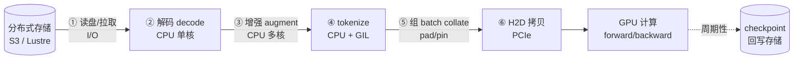
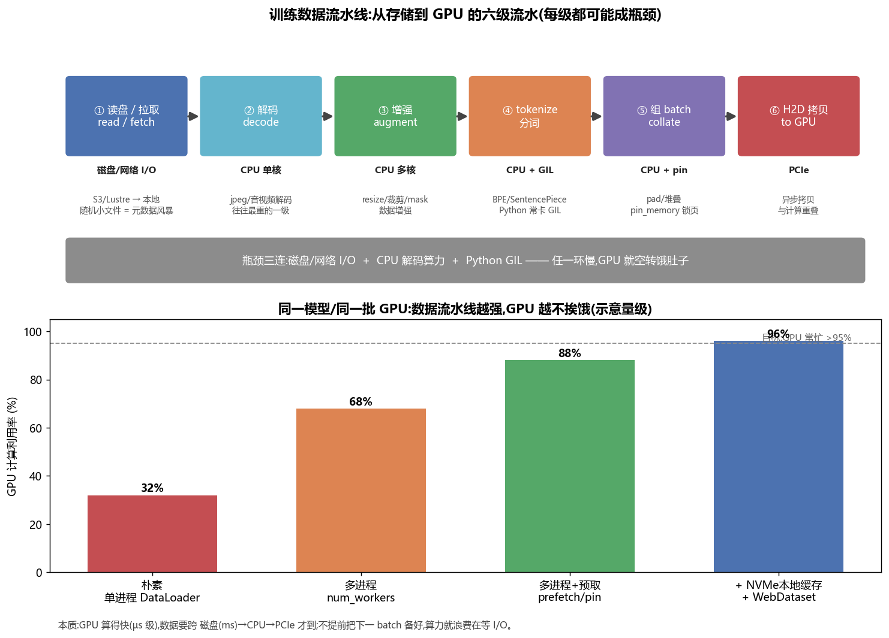
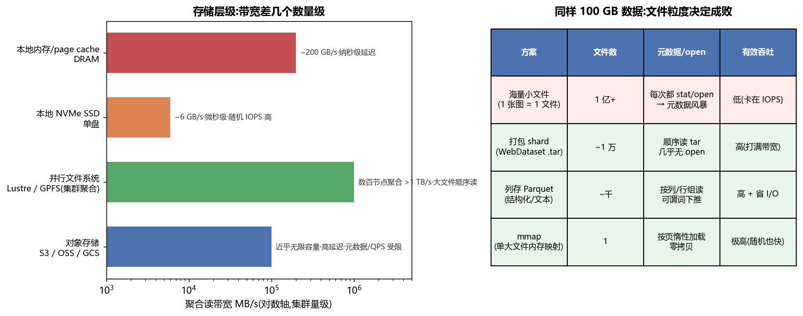
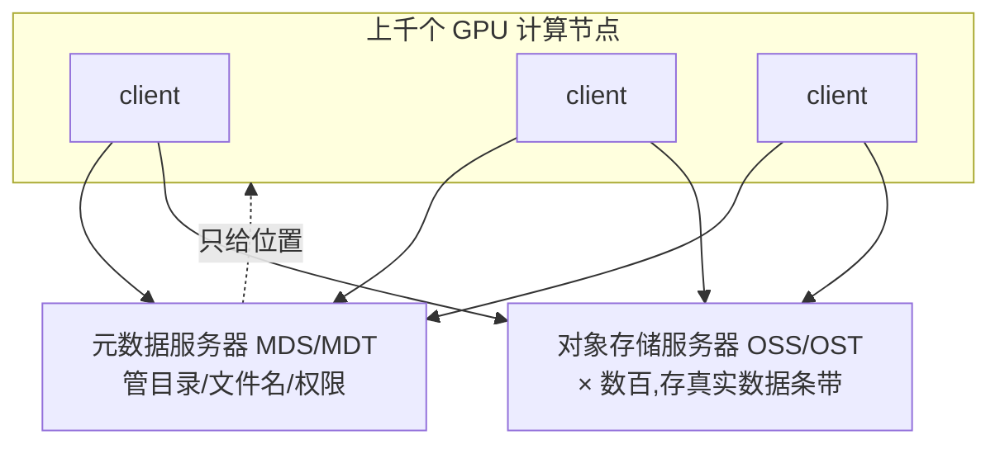
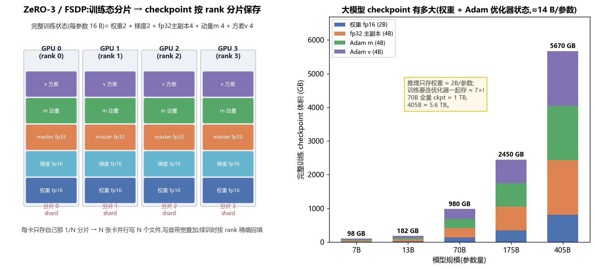
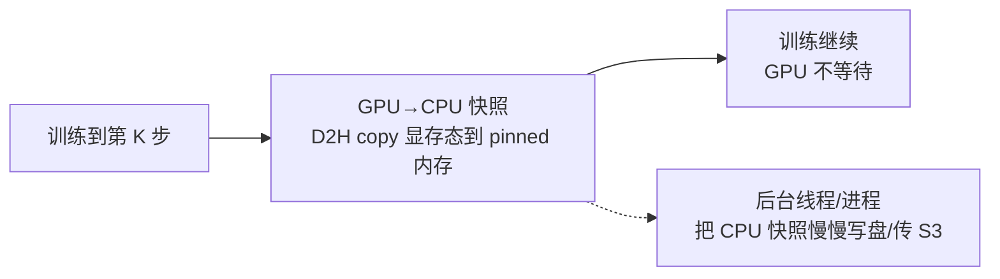
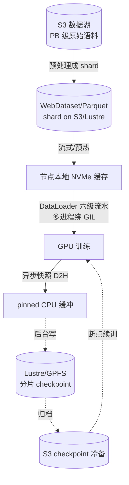

# 存储与数据 · 训练数据流水线 / checkpoint / 分布式存储(全面·本质)

> 训练大模型时,人人盯着 GPU 算力,却常常被一句话打脸:**"GPU 只用了 40%"**。九成情况不是算力不够,而是**数据喂不上、checkpoint 卡住、存储扛不住**。这一篇把"数据与存储"这条常被忽视、却决定训练是否跑得动、跑得快、跑得稳的暗线讲透。
>
> 一句话主线:**GPU 以微秒(µs)节奏吞数据,而数据要跨越 磁盘(ms)→ 网络 → CPU → PCIe 才能到它嘴边。任何一环慢半拍,几十万块钱一天的 GPU 就在空转。**

---

## 1. 🧠 全景:一条数据的一生

一个 batch 从"躺在存储里"到"进 GPU 算 loss",要走完整条流水线:





上图上半部分是六级流水线,下半部分揭示核心矛盾:**流水线越强,GPU 越不挨饿**。下面逐级拆解。

---

## 2. 🚰 训练数据流水线:读盘 → 解码 → 增强 → tokenize → 组 batch

### 2.1 六级到底在干什么

| 级 | 动作 | 谁在干活 | 典型开销 | 常见坑 |
|---|---|---|---|---|
| ① 读盘/拉取 | 从存储把原始字节读进内存 | **磁盘/网络 I/O** | 随机小文件 = 元数据风暴 | 一张图一个文件 → open 打爆元数据服务 |
| ② 解码 decode | jpeg/音视频/protobuf 解成张量 | **CPU 单核**(常最重) | 一张 224² jpeg 解码几十 µs~ms | 用 PIL 纯 Python 解码 → 慢 10× |
| ③ 增强 augment | resize/裁剪/flip/mask | **CPU 多核** | 视觉重、文本轻 | 增强算子未向量化 |
| ④ tokenize 分词 | 文本 → token id(BPE/SentencePiece) | **CPU + Python GIL** | LLM 预训练的主力开销 | 纯 Python 分词卡 GIL |
| ⑤ 组 batch collate | pad、堆叠、pin_memory | **CPU + 锁页内存** | 变长序列 pad 浪费 | 忘了 pin_memory → H2D 不能异步 |
| ⑥ H2D 拷贝 | 主存 → 显存 | **PCIe** | ~25 GB/s(Gen5 x16) | 拷贝没和计算重叠 |

> 🔬 **第一性原理**:GPU 一个 step 可能只要几十毫秒;要在这几十毫秒内,把**下一个** batch 的六级流水全部备好。只要平均单 batch 的 CPU/I/O 时间 > GPU 单 step 时间,GPU 就必然出现**气泡(bubble)空转**。这就是"data starvation(数据饥饿)"。

### 2.2 ⚠️ 为什么常喂不饱 GPU:I/O + CPU + GIL 三座大山

**① I/O 墙**:随机读海量小文件时,瓶颈根本不是带宽,而是 **IOPS 与元数据 op**。100 GB 数据若是 1 亿张小图,每张都要 `open/stat/read/close`,元数据服务先被打爆(见 §4)。

**② CPU 墙**:解码(尤其 jpeg/视频)和增强是**纯 CPU 计算**。一台 8×H100 服务器可能只配几十个 CPU 核,**GPU:CPU 算力比严重失衡**——GPU 算得飞快,CPU 解码却跟不上。

**③ GIL 墙**:Python 有**全局解释器锁(Global Interpreter Lock)**,同一进程内**同一时刻只有一个线程执行 Python 字节码**。所以 PyTorch `DataLoader` 用**多进程**(`num_workers>0`),每个 worker 独立进程绕开 GIL;但进程间要**序列化+管道传输**数据,又带来开销与内存翻倍。

```python
# PyTorch:一个"喂得饱"的 DataLoader 长这样
loader = DataLoader(
    dataset,
    batch_size=256,
    num_workers=8,        # 多进程绕开 GIL:8 个进程并行解码/增强
    pin_memory=True,      # 锁页内存 → H2D 可用异步 DMA,和计算重叠
    prefetch_factor=4,    # 每个 worker 预取 4 个 batch,提前备好下一口
    persistent_workers=True,  # 别每个 epoch 重启进程(重建开销大)
    drop_last=True,
)
# 训练循环里配合 non_blocking 异步拷贝
for x, y in loader:
    x = x.to("cuda", non_blocking=True)   # 与上一步计算重叠
```

> 💡 **实战调参口诀**:先 `num_workers` 拉到"CPU 核数量级",再开 `pin_memory + non_blocking` 让 H2D 和计算重叠,再上 `prefetch_factor` 藏住 I/O 抖动;若还饿,就往上游动刀——**换数据格式**(§3)或**加本地缓存**。

> ⚠️ **常见坑**:
> - `num_workers` 越大越好?错。太多会**内存爆**(每进程一份)、**上下文切换 + 序列化开销**反噬,还可能被 NUMA 跨槽拖慢(见 [`03_CPU结构`](03_CPU结构_流水线_乱序_缓存_多核.md) 的 NUMA)。
> - 增强放 GPU 上做?可以!**NVIDIA DALI / GPU 解码(nvJPEG)** 把解码增强搬到 GPU,直接绕开 CPU 墙——代价是占用一点 GPU。
> - **worker 里做重初始化**(如每次建一个大对象/连数据库)→ 用 `worker_init_fn` 或 `persistent_workers`。

### 2.3 shuffle 与随机性:buffer shuffle

大模型训练要求样本**充分打散**(否则梯度有偏、同类样本扎堆)。但数据是**流式**从 shard 读的,没法把上亿样本全载进内存做全局 shuffle。工程上用 **shuffle buffer(缓冲区打散)**:


维护一个容量 `N` 的缓冲区,每次**随机弹出一个**样本、再从流里**补一个**进来。`N` 越大越接近全局随机,但越吃内存。**再叠加 shard 级 shuffle**(先打乱 shard 顺序、每个 shard 内部也预打散)才够随机。

> 🔬 **本质**:shuffle buffer 是"**随机性 vs 内存 vs 顺序读吞吐**"的三角折中——它让你在**只做顺序读**(存储友好)的同时,拿到近似全局随机。

### 2.4 🔢 数值直觉:训练到底要多大的数据带宽

先算一笔账,别被"存储很快"骗了。假设 8×H100 训一个 7B 模型:

- 全局 batch = 4M tokens/step,单 step ≈ 0.4 s → **~10M tokens/s**。
- LLM 预训练的 token 已经是 `uint16`(2 B),纯 token 流:`10M × 2B ≈ 20 MB/s` —— **文本训练的 I/O 其实很轻**,主力开销在 **tokenize(CPU)** 与顺序读。
- 但**视觉/多模态**完全不同:若每 step 喂 2048 张 224² jpeg(~100 KB/张),就是 `2048 / 0.4s × 100KB ≈ 500 MB/s`,而且每张都要**解码**(CPU 单核几十 µs~ms)→ **CPU 解码墙 + I/O 墙一起来**。

| 训练类型 | 每 token/样本字节 | 带宽压力 | 主瓶颈 |
|---|---|---|---|
| LLM 文本(预 tokenize) | 2 B/token | 低(几十 MB/s) | tokenize / 顺序读元数据 |
| LLM 文本(在线 tokenize) | 原始文本 + 分词 | 中 | **CPU 分词(GIL)** |
| 视觉/多模态 | ~100 KB/样本 | 高(GB/s) | **CPU 解码 + I/O** |

> 💡 **结论**:文本训练把语料**预先 tokenize 成 bin/parquet**(§3),训练时几乎零解码;视觉训练则要么**打包 shard + 多进程解码**,要么直接**上 GPU 解码(nvJPEG/DALI)**。搞清自己是哪种,才知道刀往哪砍。

---

## 3. 📦 数据格式:WebDataset / Parquet / mmap

格式选错,前面的调参全白费。核心洞察:**顺序读大文件 >>> 随机读小文件**。



右表是关键:**同样 100 GB 数据,文件粒度决定有效吞吐能差几十倍**。

### 3.1 WebDataset / tar 打包(sharding)

把海量小样本**打包成一批 `.tar` 分片(shard)**,如 `data-{000000..001023}.tar`,每个 shard 几百 MB~几 GB。

- **读取时顺序流式解 tar**,几乎没有 `open` 系统调用 → 把小文件的**元数据风暴**变成**大文件顺序读**,IOPS 问题消失。
- 天然适配 **S3/对象存储**:一次 GET 拉一个 shard,而非上亿次 GET。
- **sharding 与分布式**:N 个 rank(或 DataLoader worker)各领**不相交的一批 shard**,并行读、互不重复。

```python
import webdataset as wds
dataset = (
    wds.WebDataset("s3://bucket/data-{000000..001023}.tar",
                   shardshuffle=True)     # ① 先打乱 shard 顺序
       .shuffle(10000)                    # ② 再 buffer shuffle 打散样本
       .decode("pil")                     # 解码
       .to_tuple("jpg", "cls")            # 取字段
)
```

> 💡 **面试高频**:"训练读小文件慢怎么办?" → 打包成 WebDataset/tar shard,把随机小 I/O 变顺序大 I/O;shard 级 + buffer 两级 shuffle 保证随机性。

### 3.2 Parquet:列式存储(结构化/文本)

**Parquet** 是**列存(columnar)**格式,面向结构化数据与文本预训练语料(如 The Pile、RedPajama 大量用它):

- **按列存储 + 压缩**:只读需要的列(如只要 `text` 不要 `metadata`),I/O 直接省一大截;同列数据相似,压缩比高。
- **行组(row group)**:内部按行组切块,可**并行读**、可**谓词下推(predicate pushdown)**(在存储层就过滤,不把无关行读上来)。
- **自带 schema**,配 Arrow 可**零拷贝**读入内存。HuggingFace `datasets` 底层就是 Arrow/Parquet。

| | WebDataset/tar | Parquet | 裸小文件 |
|---|---|---|---|
| 适合 | 图/音/视频等二进制样本 | 结构化/文本/表格 | ❌ 别用于训练 |
| 读模式 | 顺序流式 | 列 + 行组,可过滤 | 随机 open |
| 随机访问单样本 | 弱(要顺序) | 中(按行组) | 强但慢 |
| 压缩 | 靠内部文件 | 强(列压缩) | 无 |

### 3.3 mmap:内存映射(把文件当数组用)

**mmap(memory-map)**:把一个大文件**映射进进程虚拟地址空间**,像访问内存一样访问文件,**由操作系统按页(page)惰性加载 + page cache 缓存**。

- **零拷贝**:不经过 `read()` 的用户态缓冲拷贝,访问哪页 OS 换哪页进来。
- **多进程共享**:同一文件 mmap 到多个 DataLoader worker,**共享同一份 page cache**,内存不翻倍。
- 典型用法:把整个 tokenized 语料拼成一个大的 `uint16` token 数组存成 `.bin`,再 `np.memmap` 打开——**训练时按下标随机取一段 token,随机访问也快**(热数据常驻 page cache)。这正是 nanoGPT / Megatron 预训练数据的经典做法。

```python
import numpy as np
# 预处理阶段:把所有 token 拼成一个大 bin(uint16 够放 50k 词表)
data = np.memmap("train.bin", dtype=np.uint16, mode="r")   # 不真正读进内存
def get_batch(block_size, batch_size):
    ix = np.random.randint(len(data) - block_size, size=batch_size)  # 随机起点
    x = np.stack([data[i:i+block_size] for i in ix])       # OS 按页加载,命中 cache 极快
    return x
```

> 🔬 **本质**:mmap 把"文件 I/O"外包给了**操作系统的虚拟内存 + page cache**——热数据自动留在 DRAM(见 [`04_内存模型`](04_内存模型_一致性_内存序_GPU与CPU.md) 与 CPU 篇的缓存局部性),你只管当数组用。代价:**首次缺页(page fault)有延迟**,且**随机跨大文件会击穿 cache**(退化成磁盘随机读)。

### 3.4 safetensors:存权重的"安全 + 零拷贝"格式

上面几种是**训练输入**格式;存**模型权重**还有一个必须知道的:**safetensors**(HuggingFace)。它替代了危险的 PyTorch `torch.save`(底层 **pickle**):

- **安全**:pickle 会在反序列化时**执行任意代码**(下载的 `.bin` 权重可能是木马);safetensors 只是"**头部 JSON(记录每个张量的 dtype/shape/偏移) + 紧凑的张量字节**",**不含可执行逻辑**。
- **零拷贝 + mmap 加载**:头部记了每个张量的字节偏移,可**mmap 直接映射**、按需加载,**加载快、内存省**,还能**只读某几个张量**(懒加载)。

> 💡 **一句话**:分发/加载权重用 **safetensors**(安全 + 快);训练态大 checkpoint 用**框架自己的分片格式**(DCP/dist-ckpt,见 §5.5)。别再从不可信来源 `torch.load` pickle。

---

## 4. 🗄️ 分布式存储:Lustre / GPFS 与对象存储 S3

单机磁盘装不下 PB 级语料,也扛不住上千 GPU 同时读。训练集群的存储通常分两类:

### 4.1 并行文件系统 Lustre / GPFS(高性能训练现场)

**Lustre / GPFS(现名 IBM Storage Scale)/ BeeGFS** 是 **POSIX 并行文件系统**,超算与大厂训练集群标配:



- **数据/元数据分离**:**MDS/MDT** 管元数据(文件名、目录、权限、条带布局),**OSS/OST** 存真实数据。一个大文件被**条带化(striping)**切到很多 OST 上,**多台并行读 → 聚合带宽可上 TB/s**。
- **POSIX 语义**:程序像用本地文件一样用它(`open/read/write`),迁移无痛。

> ⚠️ **吞吐 vs 元数据瓶颈——最重要的一课**:
> - **吞吐(带宽)**:靠加 OST 横向扩展,读大文件能打满,**不是主要瓶颈**。
> - **元数据(metadata)**:所有 `open/stat/create/ls` 都压到 **MDS**。上千 GPU 同时**创建/打开海量小文件**(如每 rank 各写各的 checkpoint 小文件、或读裸小图),**MDS 被打爆** → 整个文件系统卡死。
>
> 这就是为什么 §3 反复强调**打包 shard**:把"上亿次小文件 open"变成"几千次大文件顺序读",**从根本上卸掉元数据压力**。

### 4.2 对象存储 S3 / OSS / GCS(海量冷/温数据)

**对象存储(Object Storage)**:S3、阿里云 OSS、GCS。数据以**对象(object)= key + 值 + 元数据**存放,**扁平命名空间**(没有真正的目录树),通过 HTTP(GET/PUT)访问。

| 维度 | 并行文件系统(Lustre/GPFS) | 对象存储(S3/OSS) |
|---|---|---|
| 接口 | POSIX(open/read/write) | HTTP REST(GET/PUT/LIST) |
| 语义 | 完整文件语义、可随机写 | 对象**整体读写**、一般不可原地改 |
| 延迟 | 低(µs~ms) | 高(数十 ms 首字节) |
| 带宽 | 极高(聚合 TB/s) | 高(靠并发大量请求堆) |
| 容量/成本 | 贵、容量有限 | **近乎无限、便宜** |
| 一致性 | 强 | 通常读己所写强一致,LIST 可能慢 |
| 元数据/QPS | MDS 易成瓶颈 | 按 key **前缀分片**扩 QPS |
| 角色 | **训练现场热数据** | **数据湖 / checkpoint 归档 / 冷存** |

> 💡 **典型分层实践**:原始 PB 级语料躺在 **S3(便宜、无限)** → 训练前预处理成 **WebDataset/Parquet shard** 也放 S3 → 训练时**流式拉 shard** 或**预热到节点本地 NVMe/并行 FS** 当缓存。checkpoint 先落**本地/并行 FS**(快),再**异步上传 S3**(持久、跨区容灾)。

> 🔬 **第一性原理:三层缓存打穿延迟**。存储和 CPU 缓存一个道理——**把热的往近处放**:S3(远、便宜、慢) → 并行 FS / 节点本地 NVMe(近、快、贵) → page cache/DRAM(最近、最快)。训练前**预热(prefetch/warm-up)** 把本 epoch 要用的 shard 拉到本地,训练时命中本地缓存,只有 cache miss 才回源 S3。这和 CPU 的 L1/L2/L3→DRAM、GPU 的 shared→HBM(见 [`02_GPU结构`](02_GPU结构_从SM到集群_全面本质.md))是**同一套"局部性 + 分层"思想**,只是尺度从纳秒放大到毫秒、从 KB 放大到 PB。

> ⚠️ **对象存储的坑**:
> - **首字节延迟高**:靠**大并发 + 预取**藏延迟,别指望单请求低延迟。
> - **LIST 慢/贵**:别用"列目录"驱动训练;用**确定的 shard 命名**(`data-{000000..N}.tar`)直接拼 key。
> - **热点前缀**:海量对象共享一个 key 前缀会撞到分区限流 → key 打散前缀。

---

## 5. 💾 Checkpoint:大模型训练的"存档点"

Checkpoint = 把**训练态**周期性存盘,用于**断点续训(fault tolerance)** 和**产出可部署权重**。大规模训练**故障是常态**(千卡跑几周,几乎必然有卡/网/存故障),checkpoint 是唯一的后悔药。

### 5.1 ⚠️ 大模型 checkpoint 到底多大

关键:**训练 checkpoint 远不止权重!** 混合精度 + Adam 优化器,每个参数要存的东西(经典 16 字节账本):

| 内容 | 精度 | 字节/参数 | 是否入 ckpt |
|---|---|---|---|
| 权重 weights | fp16/bf16 | 2 | ✅ |
| 梯度 gradients | fp16 | 2 | ✖️(可重算,一般不存) |
| fp32 主副本 master | fp32 | 4 | ✅ |
| Adam 动量 m | fp32 | 4 | ✅ |
| Adam 方差 v | fp32 | 4 | ✅ |
| **训练 ckpt 合计** | | **≈14** | |
| **仅推理权重** | bf16 | **2** | 部署用 |

$$\text{训练 ckpt 大小} \approx 14 \text{ B} \times P \quad(\text{推理权重仅 } \approx 2\text{ B} \times P)$$



代入几个规模(右图):

| 模型 | 参数 P | 推理权重(2B) | **训练 ckpt(≈14B)** |
|---|---|---|---|
| 7B | 7e9 | 14 GB | **~98 GB** |
| 70B | 7e10 | 140 GB | **~980 GB(≈1 TB)** |
| 175B(GPT-3) | 1.75e11 | 350 GB | **~2.45 TB** |
| 405B(Llama-3.1) | 4.05e11 | 810 GB | **~5.6 TB** |

> 🔬 **本质**:训练 checkpoint 比"权重文件"大 **~7 倍**,罪魁是 **fp32 优化器状态(master + m + v = 12 B/参数)**。所以"70B 模型 checkpoint 一个 TB 级、写一次要几分钟"一点都不夸张——这直接推动了下面所有的分片与异步技术。

### 5.2 分片保存(sharded checkpoint)与 ZeRO/FSDP 的对应

**为什么必须分片**:①单文件 TB 级,单机写盘/内存都放不下;②千卡训练时,若所有卡把状态**汇聚到 rank0 再存**(gather),rank0 内存爆 + 网络风暴 + 串行写盘极慢。

**ZeRO / FSDP 本就把训练态切成 N 份**(见左图),checkpoint 顺势**各存各的分片**:

| 并行/优化 | 训练时怎么切 | checkpoint 怎么存 |
|---|---|---|
| **ZeRO-1** | 只切**优化器状态**到各 rank | 各 rank 存自己那份优化器状态 + 完整权重 |
| **ZeRO-2** | 切**优化器状态 + 梯度** | 同上 |
| **ZeRO-3 / FSDP** | **权重、梯度、优化器状态全切**(每卡只留 1/N) | **每 rank 只写自己的 1/N 分片** → N 卡并行写 N 个文件,**写盘带宽叠加** |
| **张量并行 TP** | 权重按维度切到 TP 组 | 各 TP rank 存自己那片权重 |
| **流水并行 PP** | 按层切 | 各 stage 存自己那些层 |

> 🔬 **本质对应**:**训练态怎么分布,checkpoint 就怎么分片**——因为每张卡本来就只持有全局状态的 1/N,让它**直接把手里这份写下去**,既不用 gather(省网络/内存),又能 N 卡并行写(省时间)。续训时按 **rank/坐标精确回填**到对应卡。

> ⚠️ **常见坑**:**分片 checkpoint 与并行度绑定**——用 8 卡 ZeRO-3 存的分片,想换成 16 卡续训,分片对不上!解法:用 **PyTorch Distributed Checkpoint(DCP)** / **Megatron 的 dist-ckpt**,它们存**逻辑上完整、物理上分片**的格式,支持**重分片(resharding)**——换并行度/卡数也能加载。

### 5.3 异步 / 后台保存(async checkpoint)

写 1 TB 到并行 FS 可能要几分钟。若**同步阻塞**训练等它写完,GPU 就白等——**checkpoint 越勤,浪费越多**。优化路径:



1. **快照到 CPU(snapshot)**:先把显存里的状态**快速 D2H 拷到 pinned 主存**(几秒),训练**立刻继续**。
2. **后台落盘**:另起线程/进程把 CPU 副本**慢慢写盘 / 传 S3**,与训练计算**重叠**。
3. 进阶:**分层/多级 checkpoint**(如 NVIDIA **NVRfilesystem**、Meta 的思路、**CheckFreq / Gemini** 等研究):高频快照写**内存/邻居节点(冗余)**,低频才落持久存储;故障时优先从内存/邻居恢复。

> 💡 **收益量级**:异步能把 checkpoint 对训练的**阻塞时间从"分钟级"压到"秒级"**,于是可以**存得更勤**(比如每几百步),故障时**丢的进度更少**。

> ⚠️ **一致性坑**:快照必须是**某一步的一致状态**(权重/优化器/step/RNG/data-loader 位置对齐);后台写盘要用**原子发布**(先写临时文件再 rename / 写完再更新 `latest` 指针),否则崩在半途会留下**半个损坏的 checkpoint**。

### 5.4 断点续训(resume):要存的不止权重

真正"接着上次跑"要恢复**全部训练态**,漏一样都会导致结果不可复现或跑飞:

- ✅ 模型权重 + fp32 主副本
- ✅ 优化器状态(Adam m/v、step 计数)
- ✅ **学习率调度器**状态(走到 warmup/decay 哪儿了)
- ✅ **global step / epoch / 已消费的 token 数**
- ✅ **数据加载位置**(读到哪个 shard / 样本,保证不重复不遗漏)—— 常被忽略!
- ✅ **RNG 随机数状态**(dropout、增强、shuffle 的随机种子)
- ✅ 混合精度的 **loss scale**、梯度累积计数

> ⚠️ **最常见的续训坑**:只存了权重和优化器,**没存 data-loader 进度和 RNG** → 续训后**重复喂前面的数据**、随机性错位,曲线出现台阶/尖刺,"续训不等于没中断过"。

### 5.5 🔢 多久存一次?最优 checkpoint 间隔(Young/Daly)

存太勤 → 浪费在写盘上;存太稀 → 一崩就丢一大截进度。这有经典解。设:
- `C` = 一次 checkpoint 的开销(阻塞时间,异步后可压到很小);
- `MTBF`(Mean Time Between Failures)= 集群平均无故障时间——**卡越多,MTBF 越短**(千卡集群可能几小时就有一次故障)。

**Young/Daly 最优 checkpoint 间隔**近似:

$$T_{\text{opt}} \approx \sqrt{2 \cdot C \cdot \text{MTBF}}$$

> 🔬 **本质与直觉**:每次故障平均丢掉"半个间隔"的算力,再加上每个间隔要付一次 `C`。对间隔求导取极小,就得到上式。**推论**:①集群规模越大(MTBF↓)→ 该存得越勤;②异步把 `C` 压小 → 也能存得更勤而不心疼。这正是 §5.3 异步 checkpoint 的价值所在——**它同时改善了公式里的 `C`**。

> 💡 **实战**:千卡训练常见"每 15~60 分钟一存";配异步后甚至可"每几百 step 快照到内存/邻居、每小时才落持久存储"。别忘了**只保留最近 k 个 + 若干里程碑**(TB 级 ckpt,不清理会撑爆存储)。

### 5.6 框架横向对比(存 checkpoint 用什么)

| 框架/格式 | 分片 | 重分片(换卡数) | 异步 | 备注 |
|---|---|---|---|---|
| `torch.save`(pickle) | ✖️ 单文件 | ✖️ | ✖️ | 小模型/推理权重;**有安全风险** |
| **safetensors** | ✖️ | — | — | 分发权重首选,安全 + mmap 快 |
| **PyTorch DCP**(Distributed Checkpoint) | ✅ 每 rank | ✅ 逻辑完整可重分片 | ✅ | FSDP 训练态标准做法 |
| **DeepSpeed / ZeRO** | ✅ 按 ZeRO 分片 | 靠 `zero_to_fp32` 转换 | ✅(近期) | ZeRO-3 分片写 |
| **Megatron dist-ckpt** | ✅ 按 TP/PP/DP 坐标 | ✅ | ✅ | 超大模型 3D 并行 |

> ⚠️ **迁移坑**:不同框架/版本的 checkpoint 结构键名可能变;跨框架加载常需**转换脚本**(如 DeepSpeed `zero_to_fp32.py` 把分片优化器态合并成一个 fp32 权重再导出 safetensors)。

---

## 6. 🔗 全链路串起来:存储决定训练的"隐形上限"



- **入口**(读数据)看:格式 + 元数据 + 流水线 → 决定 **GPU 能否喂饱**。
- **出口**(写 checkpoint)看:分片 + 异步 + 一致性 → 决定 **故障能否快速恢复、能否存得勤**。
- 两头都压在**分布式存储的吞吐与元数据**上——所以说,**存储与数据是训练的隐形上限**。

---

## 📌 本质小结

1. **GPU 常喂不饱** ≠ 算力不够,而是 **I/O + CPU 解码 + Python GIL** 三座墙 → 多进程 DataLoader + pin/prefetch + 换格式 + GPU 解码来解。
2. **顺序读大文件 >>> 随机读小文件**:WebDataset/tar 打包卸掉元数据风暴,Parquet 列存省 I/O,mmap 把冷热管理外包给 OS page cache。
3. **分布式存储两条命脉**:Lustre/GPFS 给**吞吐**但 **MDS 元数据**是瓶颈;S3 给**无限容量**但**延迟高、LIST 慢**;打包 shard 同时救两者。
4. **训练 checkpoint ≈ 14 B/参数(比推理权重大 ~7×)**,罪魁是 fp32 优化器状态;70B 就 ~1 TB。
5. **分片 checkpoint 对应 ZeRO/FSDP 的分片**:每卡只写自己的 1/N,N 卡并行写;换并行度要 DCP 重分片。
6. **异步/后台保存**把阻塞从分钟压到秒;**断点续训**要连 data-loader 位置、RNG、调度器一起存,否则"续训 ≠ 没中断"。

## 💡 面试高频

- "训练时 GPU 利用率只有 40%,怎么排查?" → 先看数据流水线:`num_workers`/`pin_memory`/`prefetch`,再看格式(小文件?)、CPU 解码是否瓶颈、要不要 GPU 解码(DALI)。
- "为什么 DataLoader 要多进程而不是多线程?" → Python **GIL**,多线程无法并行跑 Python 解码/分词;多进程各自独立解释器绕开 GIL(代价:序列化 + 内存翻倍)。
- "大模型 checkpoint 为什么这么大?怎么算?" → **≈14 B/参数**(权重 2 + fp32 master 4 + Adam m 4 + v 4);70B ≈ 1 TB。
- "checkpoint 怎么和 ZeRO/FSDP 配合?" → 训练态怎么切,ckpt 就怎么分片;每 rank 存自己的 1/N,并行写;换卡数用 DCP 重分片。
- "异步 checkpoint 原理?" → 先 D2H 快照到 pinned CPU(秒级,训练继续),后台线程慢慢落盘/传 S3;注意一致性 + 原子发布。
- "Lustre 和 S3 区别?各放什么?" → POSIX+高吞吐(热数据/训练现场,元数据是瓶颈)vs HTTP+无限容量(数据湖/checkpoint 冷备,延迟高)。
- "断点续训除了权重还要存什么?" → 优化器状态、调度器、global step、**data-loader 位置**、**RNG**、loss scale。

## ⚠️ 常见坑合集

- 裸小文件直读训练 → 元数据风暴,打爆 MDS/S3 QPS。
- `num_workers` 盲目开大 → 内存爆 + 上下文切换 + NUMA 跨槽反噬。
- 忘 `pin_memory`/`non_blocking` → H2D 无法与计算重叠。
- 分片 checkpoint 与并行度硬绑定,换卡数加载失败 → 用 DCP/dist-ckpt。
- 续训漏存 data-loader 位置与 RNG → 重复喂数据、随机性错位。
- checkpoint 非原子写,崩在半途 → 损坏的半个存档;要"临时文件 + rename + latest 指针"。

## 🔗 延伸

- **CPU 侧根源**:[`03_CPU结构_流水线_乱序_缓存_多核.md`](03_CPU结构_流水线_乱序_缓存_多核.md)——DataLoader 多进程绕 GIL、NUMA 对数据加载的影响、缓存局部性(mmap 的 page cache)。
- **内存/一致性**:[`04_内存模型_一致性_内存序_GPU与CPU.md`](04_内存模型_一致性_内存序_GPU与CPU.md)——异步 checkpoint 的 D2H 与 pinned 内存、快照一致性。
- **GPU/互联**:[`02_GPU结构_从SM到集群_全面本质.md`](02_GPU结构_从SM到集群_全面本质.md)——H2D 的 PCIe 带宽、HBM 层级、分片写盘依赖的互联(NVLink/RDMA)。
- **推理侧对照**:[`01_PD分离架构_Prefill_Decode_Disaggregation.md`](01_PD分离架构_Prefill_Decode_Disaggregation.md)——KV cache 的分层存储/池化与本篇"数据分层存储"同源;`../llm-inference/KV-Cache优化.md`、`../llm-inference/Mooncake.md`。
- **总览**:[`README.md`](README.md)。配套 `../ultra-scale-playbook`(分布式训练 · ZeRO/FSDP/并行策略)、`../../Enigneer-infra/cuda-mastery`(CUDA 算子与 GPU 解码)。
