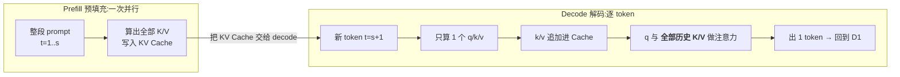
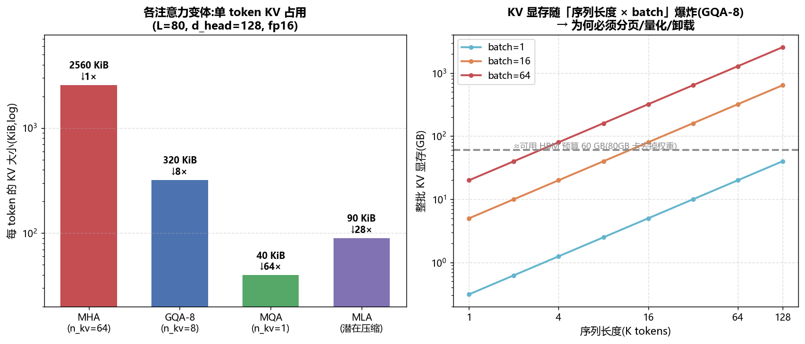
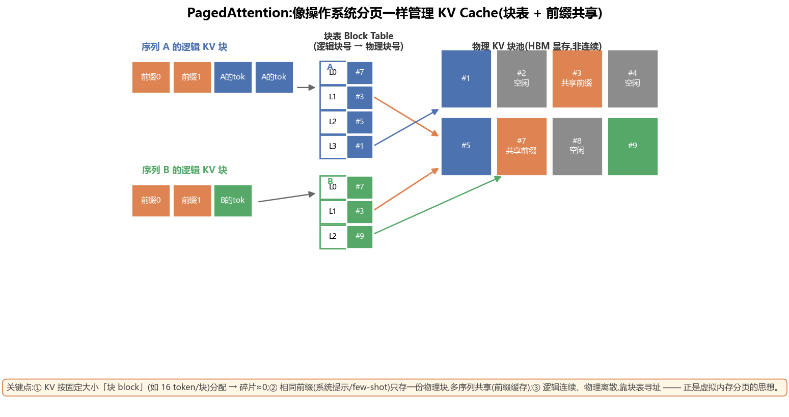
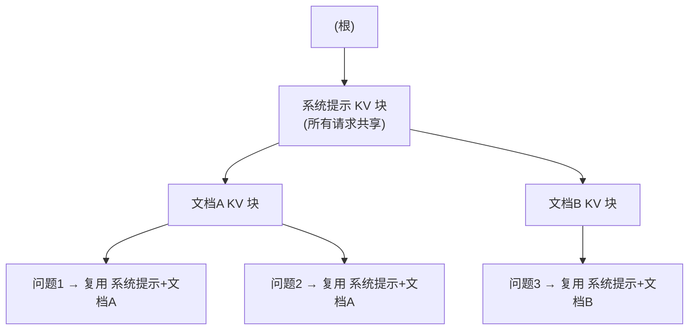
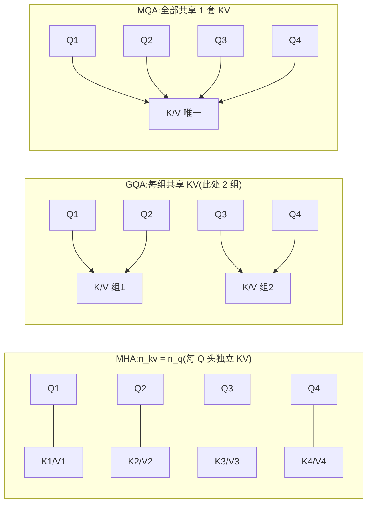
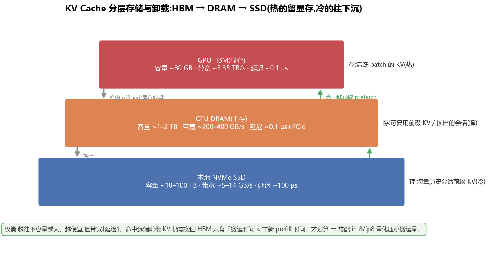
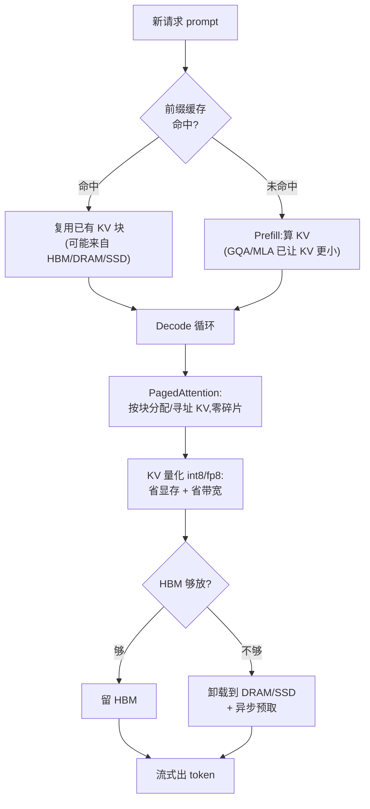

# KV Cache 深入 · PagedAttention / 前缀缓存 / 量化压缩(全面·本质)

> Decode(逐 token 生成)阶段之所以慢、之所以吃显存,**根子几乎全在 KV Cache 上**。
> 把 KV Cache 讲透,你就同时理解了:为什么 decode 是**访存受限**、为什么长上下文这么贵、
> 以及 vLLM/SGLang/TensorRT-LLM 这些引擎到底在优化什么。本篇从「它是什么」一路讲到
> 「分页 / 前缀共享 / MQA-GQA-MLA / int8-fp8 量化 / HBM→DRAM→SSD 分层卸载」。

---

## 1. 🧠 KV Cache 是什么:自回归生成里的"记账本"

先回忆一次注意力(self-attention)在算什么。对第 $t$ 个 token,注意力要拿它的 **Query** 去和**前面所有 token 的 Key** 做点积,再对**所有 token 的 Value** 加权求和:

$$\text{Attn}(q_t) = \text{softmax}\!\left(\frac{q_t \, K_{1:t}^\top}{\sqrt{d}}\right) V_{1:t}$$

关键观察:**每生成一个新 token,都需要用到前面所有 token 的 $K$ 和 $V$**。而这些 $K,V$ 一旦算出来,**在后续所有步里都不会变**(因为前面的 token 已经定了)。

- **不缓存**:每生成 1 个 token,都把 $1..t$ 全部重算一遍 K/V → 生成长度 $n$ 的序列是 $O(n^2)$ 甚至 $O(n^3)$ 的重复计算,愚蠢。
- **缓存**:把每层、每个 token 的 $K,V$ 存下来,叫 **KV Cache**。下一步只算**新 token 那一个** Q/K/V,把新的 K/V 追加进 cache,再做注意力即可。

> 🔬 **第一性原理**:KV Cache 是一次典型的**用显存换计算**(space–time tradeoff)。它把 decode 从"每步 $O(t)$ 次重算"降到"每步追加 1 个"。代价是——这个"记账本"会**随生成越滚越大**,最终成为 decode 的**显存瓶颈**和**带宽瓶颈**(见 §2)。



> 💡 **一句话**:Prefill **生产** KV Cache,Decode **反复读取 + 追加** KV Cache。整个 decode 循环的显存与带宽开销,主角就是它。

---

## 2. 📏 算它到底多大:一个必须背下来的公式

单请求的 KV Cache 字节数:

$$\boxed{\;\text{KV bytes} \;=\; 2 \times L \times n_{kv} \times d_{head} \times s \times \text{dtype} \times \text{batch}\;}$$

| 符号 | 含义 | 举例(70B 级) |
|---|---|---|
| **2** | K 和 V 各一份 | 2 |
| $L$ | 层数 layers | 80 |
| $n_{kv}$ | **KV 头数**(注意:不是 Q 头数!GQA/MQA 就是压这个) | 64(MHA) |
| $d_{head}$ | 每个头的维度 | 128 |
| $s$ | 序列长度(已生成 + prompt) | 变量 |
| **dtype** | 每个数的字节数(fp16=2, fp8/int8=1) | 2 |
| **batch** | 并发请求数 | 变量 |

**先算"每 token 每请求"的 KV**(把 $s$ 和 batch 设 1):

$$2 \times 80 \times 64 \times 128 \times 2 = 2{,}621{,}440 \text{ B} \approx \mathbf{2.5\ MiB / token}$$

再乘上序列长度和 batch,数字立刻爆炸:

| 场景(MHA) | 计算 | KV 总量 |
|---|---|---|
| 1 请求 × 2K token | 2.5 MiB × 2048 | **5 GiB** |
| 1 请求 × 32K token | 2.5 MiB × 32768 | **80 GiB**(一整张 H100!) |
| 64 请求 × 2K token | 2.5 MiB × 2048 × 64 | **320 GiB**(单卡根本装不下) |

**动手算一遍**(把公式变成代码,换你自己的模型配置即可):

```python
def kv_bytes(L, n_kv, d_head, seq, batch, dtype_bytes=2):
    """KV Cache 字节数 = 2 * L * n_kv * d_head * seq * dtype * batch"""
    return 2 * L * n_kv * d_head * seq * batch * dtype_bytes

GiB = 1024**3
# 70B 级:80 层, MHA 64 头, d_head=128, fp16
print(kv_bytes(80, 64, 128, 1,     1) / 1024, "KiB/token")   # -> 2560.0 KiB/token
print(kv_bytes(80, 64, 128, 32768, 1) / GiB,  "GiB (1 请求 32K)")  # -> 80.0 GiB
print(kv_bytes(80, 64, 128, 2048, 64) / GiB,  "GiB (64 请求 2K)")  # -> 320.0 GiB
# 换 GQA-8:n_kv 64 -> 8,同样场景直接除以 8
print(kv_bytes(80, 8,  128, 2048, 64) / GiB,  "GiB (GQA-8, 64x2K)")  # -> 40.0 GiB
```



> 🔬 **为什么 KV Cache 让 decode 变成 memory-bound(访存受限)?**
> Decode 每步只算 **1 个** token:计算量 $\approx$ 一次 $q\cdot K^\top$ 和一次加权求和,FLOP 极小。但为了这一步,硬件必须把**整个 KV Cache 从 HBM 读一遍**(还要读一遍模型权重)。**算术强度 = FLOP / 访存字节 ≈ 极低** → 死死卡在 [Roofline](02_GPU结构_从SM到集群_全面本质.md) 的**访存屋檐**下。所以 decode 的 TPOT(每 token 延迟)≈ **KV+权重字节 / HBM 带宽**,几乎与算力无关。

> **一步 decode 到底搬多少字节?** 以 GQA-8、序列已到 8K token 为例:每步要读的 KV ≈ $320\text{ KiB/token} \times 8192 = 2.5\text{ GiB}$,再加读一遍权重(70B fp16 ≈ 140 GB,但 TP 切分后每卡读一部分)。在 3.35 TB/s 的 H100 上,光搬 2.5 GiB KV 就要 ~0.75 ms —— 而这一步的**有效计算不到 1 µs**。**带宽,而非算力,决定了这一步多快**。这就是 memory-bound 的字面含义。

> 💡 **这直接解释了三件事**:
> ① 为什么 decode 要**攒大 batch**——多请求共享同一次权重搬运,分摊带宽(见 [01 PD 分离](01_PD分离架构_Prefill_Decode_Disaggregation.md));
> ② 为什么**长上下文这么贵**——KV 随 $s$ 线性增长,读它的带宽开销也线性增长;
> ③ 为什么后面所有优化(分页/量化/MQA-GQA-MLA)本质都在干一件事:**把 KV Cache 变小、变省、变可共享**。

> ⚠️ **常见坑**:很多人以为"模型是 70B,显存主要被权重占"。其实在**高并发 / 长上下文**服务里,**KV Cache 往往比权重还大**。权重是固定的(fp16 的 70B ≈ 140 GB,且可切分),但 KV 随 `batch × seqlen` 无上限膨胀——**KV 才是决定"能并发多少路"的那块显存**。

---

## 3. 📦 PagedAttention:用操作系统分页的思想管 KV

### 3.1 ⚠️ 朴素分配的两大浪费

vLLM 之前的引擎,普遍给每个请求**预留一整段连续显存**(按 `max_seq_len` 算最坏情况)。问题:

- **内部碎片 internal fragmentation**:请求实际只生成了 100 token,却按 2048 预留 → **95% 的 KV 空间空占**。
- **外部碎片 external fragmentation**:请求长短不一、来去不定,连续块被切得七零八落,**总量够却拼不出一段连续的**,新请求进不来。
- **无法共享**:两个请求即使有相同前缀(同一段系统提示),各存各的,重复占用。

> 论文测得:朴素分配下 KV 显存的**实际有效利用率常低于 40%**,大量显存被碎片和预留吃掉 → 并发路数上不去。

### 3.2 🧩 核心思想:把 KV 切成"块",用"块表"寻址

**PagedAttention** 把每个序列的 KV 切成**固定大小的块 block**(例如每块 16 个 token 的 KV)。这些块在物理显存里**不必连续**;每个序列维护一张 **块表 Block Table**,把"逻辑块号 → 物理块号"映射起来——**和虚拟内存的页表(page table)一模一样**。



| 操作系统虚拟内存 | PagedAttention |
|---|---|
| 进程的虚拟地址空间 | 一个序列的逻辑 KV(连续编号) |
| 物理内存页 page(如 4KB) | 物理 KV 块 block(如 16 token) |
| 页表 page table | 块表 block table |
| 缺页/按需分页 | 按需分配新块(生成到才给) |
| 共享内存页(fork/COW) | 共享前缀块 + Copy-on-Write |

**寻址逻辑**(和查页表一样,给定逻辑 token 位置 → 找到物理地址):

```python
BLOCK = 16  # 每块 16 个 token 的 KV
def locate(block_table, token_pos):
    logical_block = token_pos // BLOCK      # 逻辑块号
    offset        = token_pos %  BLOCK      # 块内偏移
    physical_block = block_table[logical_block]  # 查块表 -> 物理块号
    return physical_block, offset            # attention kernel 据此 gather K/V

# 生成到第 33 个 token 却发现第 2 块(逻辑块 2)还没分配 -> 按需从空闲池取一块填进块表
# 这正是 OS 的"缺页 -> 按需分页";序列结束则把它的物理块全部还给空闲池
```

**它消灭了什么:**
- **内部碎片**:最多浪费"最后一个没填满的块"(≤ 1 块),而不是整段预留。
- **外部碎片**:块大小统一,任何空闲块都能用,**总量够就一定分得出**。
- **不能共享 → 能共享**:相同前缀的物理块**只存一份**,多序列的块表都指向它(§4)。

### 3.3 🔧 怎么用 + 代价

- **块大小 block_size** 是个旋钮:太小 → 块表长、寻址开销大;太大 → 内部碎片回潮。常见 16 / 32。
- **注意力 kernel 要改写**:因为 KV 物理上不连续,标准 attention 的"连续读一段 K/V"不成立了。PagedAttention 的 kernel 按**块**去 gather K/V 再算,这就是它名字里 "Paged" 的由来。
- **代价**:多一层块表间接寻址 + 定制 kernel 的复杂度。但换来**显存利用率从 ~40% 提到 ~96%**,并发路数(吞吐)成倍增长——非常划算。

> 💡 **面试高频**:"PagedAttention 解决什么问题?" → **KV 显存碎片**(内部+外部)+ **无法共享**。手段:**固定大小块 + 块表间接寻址**,借用 OS 分页思想;顺带打开了**前缀共享 / Copy-on-Write** 的大门。

---

## 4. 🌳 前缀缓存 Prefix Caching:相同前缀,只算一次

### 4.1 为什么能省:前缀的 KV 与后文无关

再看 §1 的公式:第 $i$ 个 token 的 $K_i, V_i$ **只取决于它自己和它前面的 token**,与后面是什么无关。所以:**只要两个请求的前缀(prompt 开头)逐 token 完全相同,这段前缀的 KV Cache 就一模一样,可以复用**——省掉对这段前缀的**重复 prefill**。

典型高命中场景(省得巨多):
- **系统提示 system prompt**:成千上万请求共用同一段几百 token 的系统提示;
- **Few-shot 示例 / 长文档 QA**:同一篇文档反复被问不同问题;
- **多轮对话**:第 $k$ 轮的前缀 = 前 $k-1$ 轮的全部内容,**每轮都能命中上一轮的 KV**;
- **Agent / 采样**:同一 prompt 采样多条(parallel sampling、beam),共享 prompt 段 KV。

$$\text{省下的 prefill FLOP} \;\propto\; \text{命中前缀长度} \times \text{batch 中共享它的请求数}$$

**算一笔账**(客服机器人:2000 token 系统提示 + 文档,用户问题平均 50 token):

| 指标 | 无前缀缓存 | 有前缀缓存 |
|---|---|---|
| 每请求需 prefill 的 token | 2000 + 50 = **2050** | 只 prefill 新增 **50**(前缀命中) |
| prefill 计算量(相对) | 1× | **≈ 0.024×**(省 ~97%) |
| 前缀 KV 显存(1000 并发) | 各存一份 → **爆炸** | **只存一份**共享块 |
| 首 token 延迟 TTFT | 高(要过完 2050) | **大幅下降**(只过 50) |

> 命中前缀越长、并发共享的请求越多,前缀缓存越赚——这就是为什么"长系统提示 + 高并发"的服务(客服、Copilot、RAG)几乎必开前缀缓存。

### 4.2 🔧 怎么实现:哈希块 或 基数树

前缀缓存天然长在 PagedAttention 之上——因为 KV 已经是**块**,共享块只是"多张块表指向同一物理块"。两种主流索引:

| 方式 | 代表 | 思路 |
|---|---|---|
| **块哈希 hash-based** | vLLM Automatic Prefix Caching | 对每个块内容(token ids + 前缀)算 hash,查表命中就复用该物理块 |
| **基数树 RadixAttention** | SGLang | 把所有请求的 token 序列组织成一棵 **radix tree**,公共前缀就是**树上共享的路径节点**,叶子是各自后续;LRU 淘汰冷节点 |



### 4.3 ⚠️ 坑与代价:Copy-on-Write 与失效

- **共享是只读的**:多个序列共享同一前缀块没问题(都只读)。可一旦某序列要在共享块尾部**追加/改写**(比如共享块还没填满就分叉了),必须先**复制一份再改** → **Copy-on-Write(COW)**,和 OS 的 fork 一样。
- **必须逐 token 精确匹配**:差一个 token(哪怕空格、时间戳、随机 nonce)前缀就断,命中率崩。**把易变内容放前面是大忌**——变的东西要放 prompt 末尾,固定的(系统提示、文档)放前面。
- **淘汰策略**:缓存的前缀 KV 也占显存,要按 LRU 等淘汰;命中率低时缓存反而是负担。
- **正确性**:采样温度、位置编码(RoPE 位置从哪算起)、attention mask 要保证复用后语义一致,否则会出错。

> 💡 **前缀缓存 × PD 分离 × 分层存储 的合流**:Mooncake(Kimi)这类系统把**前缀 KV 放进一个跨节点的 KV 池**(HBM→DRAM→SSD 分层,§7),让**不同请求、不同时间、不同机器**都能命中同一段前缀 KV → 长上下文、高重复场景收益巨大。参见 [01 PD 分离](01_PD分离架构_Prefill_Decode_Disaggregation.md)。

---

## 5. 🏛️ 从架构上砍 KV:MHA → MQA → GQA → MLA

前面(分页/前缀)是**怎么存**;这一节是**从模型结构上直接让 KV 变少**——砍公式里的 $n_{kv}$。

### 5.1 三种"共享 KV 头"的思路

标准 **MHA(Multi-Head Attention)**:$n_{kv} = n_q$,每个 Query 头配一套自己的 K/V 头。KV 最大。

- **MQA(Multi-Query Attention)**:**所有 Query 头共享同一套 K/V**($n_{kv}=1$)。KV 直接除以 $n_q$(如 64×),最省;但表达力下降、训练易不稳、质量掉。
- **GQA(Grouped-Query Attention)**:折中。把 Query 头分成 $g$ 组,**每组共享一套 K/V**($n_{kv}=g$,如 8)。是当今**主流**(Llama-2/3 70B、Mixtral 等),质量几乎不掉、KV 降 8× 起。



### 5.2 MLA(Multi-head Latent Attention):DeepSeek 的"压缩再解压"

MHA/MQA/GQA 都在**头的数量**上做文章;**MLA(多头潜在注意力)** 换了个维度:**不直接缓存 K/V,而是缓存一个低维的"潜在向量 latent" $c^{KV}$**,用的时候再用一个上投影矩阵把它**解压**回各头的 K/V。

$$\underbrace{c^{KV}_t = W^{DKV}\, h_t}_{\text{下投影,存这个(维度小)}}, \qquad \underbrace{k_t = W^{UK} c^{KV}_t,\; v_t = W^{UV} c^{KV}_t}_{\text{用时上投影解压回多头}}$$

- **只缓存 $c^{KV}$**(一份低维向量,DeepSeek-V2 里维度 512 + 一小段 RoPE 64),不缓存展开后的多头 K/V → KV 大幅缩小,却**保留接近 MHA 的表达力**(因为解压回的是"满血"多头)。
- 上投影矩阵还能**吸收进 Q/O 的权重**里,推理时不额外增计算。
- **RoPE 兼容性**是难点:旋转位置编码和"先压缩再解压"不完全对易,MLA 用**解耦 RoPE**(单独留一小段带位置的维度)来解决。

### 5.3 四者数值对比(L=80, d_head=128, fp16)

| 变体 | $n_{kv}$ / 缓存内容 | 每 token KV | 相对 MHA | 质量 | 代表模型 |
|---|---|---|---|---|---|
| **MHA** | 64 头 K/V | **2560 KiB** | 1× | 基准最好 | GPT-3、早期模型 |
| **GQA-8** | 8 组 K/V | **320 KiB** | ↓ 8× | 几乎不掉 | Llama-2/3 70B、Mixtral |
| **MQA** | 1 套 K/V | **40 KiB** | ↓ 64× | 有下降 | PaLM、Falcon |
| **MLA** | 512+64 维潜在向量 | **≈ 90 KiB** | ↓ ~28× | 接近 MHA | DeepSeek-V2/V3 |

> 🔬 **本质**:MQA/GQA 是"**减少 KV 头数**"(牺牲一点表达力换省显存);MLA 是"**低秩压缩 KV**"(用一个瓶颈维度存信息,用时解压,兼顾省显存与质量)。这也是 DeepSeek 能用相对小的 KV 支撑长上下文 + 高并发的关键之一。

> 💡 **面试高频**:"GQA 和 MQA 区别?" → MQA 全共享 1 套 KV(极省但掉质量),GQA 分组共享(可调 g,质量几乎不掉),GQA 是 MHA($g=n_q$)与 MQA($g=1$)之间的连续插值。"MLA 凭什么又小又好?" → 缓存低维潜在向量而非展开的多头 K/V,用时上投影解压,近似 MHA 表达力。

---

## 6. 🔢 KV 量化:用更少的比特存 K/V(int8 / fp8)

公式里还有一个旋钮:**dtype**。把 KV 从 fp16(2B)降到 **fp8 / int8(1B)**,KV Cache **直接减半**;更激进的 int4 可再减半。

### 6.1 怎么量化

量化就是把一段浮点 KV 线性映射到低比特整数,存一个 scale $s$(和可选零点 $z$)以便反量化:

$$q = \text{round}\!\left(\frac{x}{s}\right) + z,\qquad \hat{x} = s\,(q - z),\qquad s = \frac{\max(x)-\min(x)}{2^{b}-1}$$

- **per-token / per-channel 量化**:对每个 token(或每个通道)分别算 scale/zero-point 再量化,比全局一个 scale 精度好很多。K 通常对 channel 更敏感(不同通道量级差异大),常见 **K 按 channel、V 按 token** 的非对称策略(如 KIVI)。
- **fp8 vs int8**:fp8(E4M3/E5M2)有指数位、动态范围大,对**离群值 outlier** 更友好,Hopper/Blackwell 有硬件支持;int8 需要好的 scale,对离群值敏感,但更省、更通用。
- **只量化 KV,不动权重/激活**:KV 量化是**推理期**的显存/带宽优化,和权重量化(GPTQ/AWQ)是两回事,可叠加。

### 6.2 收益与代价

| 精度 | 每 token KV(GQA-8) | 相对 fp16 | 影响 |
|---|---|---|---|
| fp16 | 320 KiB | 1× | 基准 |
| fp8 / int8 | 160 KiB | ↓ 2× | 质量损失通常很小(good scale 下) |
| int4 | 80 KiB | ↓ 4× | 需精细量化,长上下文可能掉点 |

> 🔬 **为什么量化对 decode 是"双赢"**:decode 是 memory-bound,瓶颈是**搬 KV 的字节数**。KV 减半 → **既省显存**(能装更多并发/更长上下文),**又省带宽**(每步搬的字节少了一半 → TPOT 更快)。这是少有的"容量和速度一起改善"的优化。

> ⚠️ **坑**:① 量化/反量化本身有开销,kernel 要把它**融合**进 attention,否则省的带宽被额外读写吃掉;② **离群值**会让某些 channel 量化误差爆炸(尤其 K),要 per-channel/分组处理;③ 长上下文下误差会**累积**,评测要覆盖长序列,不能只看短 prompt。

---

## 6.5 ✂️ 另一条压缩路线:少存一些 token(驱逐 / 滑动窗口 / 注意力汇聚)

前面是"每个 token 的 KV 存得更小";还有一条正交路线:**干脆不存那么多 token 的 KV**——用**近似**换显存。适合超长上下文里"大部分历史其实用不太上"的场景。

| 方法 | 思路 | 代价 |
|---|---|---|
| **滑动窗口 Sliding Window** | 只保留最近 $w$ 个 token 的 KV,更早的丢掉(Mistral 用过) | 丢失远处精确信息 |
| **注意力汇聚 StreamingLLM / Attention Sink** | 保留**最开头几个 token**(注意力"下沉"到它们)+ 最近窗口,中间丢 | 近似,可能漏中段细节 |
| **重要性驱逐 H2O / Scissorhands** | 按累计注意力分数保留"重要 token(heavy hitters)",驱逐低分 KV | 需在线统计重要性 |
| **合并/低秩压缩** | 把多个 token 的 KV 合并或做低秩近似 | 有损,评测要谨慎 |

> 🔬 **注意力汇聚的惊人发现**:模型会习惯性地把大量注意力权重"倾倒"到序列**最初的几个 token** 上(即使它们语义无关)——像一个"注意力垃圾桶/sink"。所以直接丢掉开头会让分布崩坏、困惑度飙升;**保留这几个 sink token + 最近窗口**,就能在近乎恒定的 KV 显存下**流式处理无限长**输入。

> ⚠️ **坑**:这些都是**有损**方法。对"needle-in-a-haystack(大海捞针)"类需要精确长程召回的任务,激进驱逐会掉点。生产上常把它当**兜底**(超出预算才启用),而非默认。

---

## 7. 🗄️ KV 卸载分层:HBM → DRAM → SSD

显存(HBM)再省也有限。**分层存储 tiered KV**:热的 KV 留在 HBM,温的换到 CPU DRAM,冷的(可复用的历史前缀)沉到 SSD——**用容量换带宽**,把"能缓存多少前缀"从几十 GB 扩到几十 TB。



| 层级 | 容量(量级) | 带宽(量级) | 延迟 | 放什么 |
|---|---|---|---|---|
| **GPU HBM** | ~80 GB | ~3.35 TB/s | ~0.1 µs | 当前活跃 batch 的 KV(热) |
| **CPU DRAM** | ~1–2 TB | ~200–400 GB/s(+PCIe) | ~µs 级 | 换出的会话 / 可复用前缀(温) |
| **本地 NVMe SSD** | ~10–100 TB | ~5–14 GB/s | ~100 µs | 海量历史前缀 KV(冷) |

**关键判断:什么时候"搬回来"划算?**

$$\text{搬运时间} = \frac{\text{KV 字节}}{\text{层间带宽}} \quad\text{vs}\quad \text{重新 prefill 时间}$$

- 命中一段远端前缀 KV,**只有当"从 DRAM/SSD 搬回 HBM 的时间" < "重新 prefill 这段前缀的时间"** 才划算。
- 所以分层卸载常和 **KV 量化(§6)** 搭配:压小 KV → 搬运字节少 → 搬回更快、SSD 存得更多。
- 还要**异步预取 prefetch**:调度器预判即将命中的前缀,提前把 KV 从 SSD/DRAM 拉上来,和当前计算**重叠**,藏住搬运延迟(和 [01 PD 分离](01_PD分离架构_Prefill_Decode_Disaggregation.md) 的"传算重叠"同理)。

> 💡 **业界**:Mooncake(Kimi)、LMCache、vLLM 的 CPU offloading、NVIDIA Dynamo 的 KV 管理器,都在做"KV 池 + 分层 + 跨请求/跨节点复用"。本质是把 KV Cache 从"单卡的一块显存"升格为**一个可调度、可共享、可分层的存储系统**。

---

## 8. 🧵 全景串联:一次长上下文高并发服务里,KV 优化怎么协同



| 优化 | 砍公式的哪一项 | 主要收益 | 主要代价 |
|---|---|---|---|
| **PagedAttention** | 提高**有效利用率**(减碎片) | 并发路数 ↑(~40%→~96%) | 块表寻址 + 定制 kernel |
| **前缀缓存** | 省**重复 prefill** + 共享 KV | TTFT ↓、算力省 | 精确匹配、COW、缓存管理 |
| **MQA/GQA** | 砍 $n_{kv}$ | KV ↓ 8~64× | 表达力略降(MQA 明显) |
| **MLA** | 低秩压缩 K/V | KV ↓ ~28× 且近 MHA 质量 | 结构复杂、RoPE 需解耦 |
| **KV 量化** | 砍 dtype(2B→1B) | 显存 ↓ + 带宽 ↓(TPOT↓) | 量化误差、需融合 kernel |
| **token 驱逐/滑窗** | 砍 $s$(少存 token) | 超长上下文近乎恒定显存 | 有损,长程召回可能掉点 |
| **分层卸载** | 扩**容量**(HBM→DRAM→SSD) | 可缓存前缀量 ↑↑ | 搬运延迟、需预取重叠 |

> 🔬 **一条主线**:decode 是 memory-bound,瓶颈是 **KV 的字节数 与 搬它的带宽**。上面每一招,要么让 KV **更小**(GQA/MLA/量化),要么让它**不重复算/可共享**(前缀缓存),要么让它**装得下、放得多**(分页/分层)。理解了这条主线,任何新出的 KV 优化你都能一眼归类。

> 💡 **它们可叠乘**:真实引擎里这些优化是**同时**开的——GQA(结构省 8×)× int8 量化(再省 2×)× PagedAttention(利用率 40%→96%,≈2.4×)× 前缀缓存(高重复场景再省一截)。乘起来,同一张卡能服务的**并发路数 / 上下文长度**可以比朴素实现高一两个数量级。这就是现代推理引擎"看起来能装下不可能的量"的秘密。

---

## 📌 本质小结

1. **KV Cache = 用显存换计算**:缓存历史 K/V,把 decode 从每步重算降为每步追加;代价是它随 `batch × seqlen` 线性膨胀。
2. **公式要背**:$2 \cdot L \cdot n_{kv} \cdot d_{head} \cdot s \cdot \text{dtype} \cdot \text{batch}$。70B 级 MHA ≈ **2.5 MiB/token**,长上下文/高并发下**KV 常比权重还大**。
3. **decode 是 memory-bound**:TPOT ≈ (KV+权重字节)/HBM 带宽 → 一切优化本质是**减字节 / 减重复 / 提利用率**。
4. **PagedAttention** 用 OS 分页思想消灭碎片(利用率 ~40%→~96%)并打开**前缀共享**。
5. **前缀缓存**让相同前缀只 prefill 一次、KV 只存一份(系统提示/多轮对话/文档 QA 收益巨大);注意精确匹配与 COW。
6. **MQA/GQA/MLA** 从结构上砍 KV:GQA 是当今主流(降 8×~质量不掉),MLA 用低秩压缩兼顾小与好。
7. **KV 量化(int8/fp8)** 对 decode 双赢(省显存 + 省带宽);**分层卸载(HBM→DRAM→SSD)** 用容量换带宽,配预取与量化才划算。

## 💡 面试高频速答

- **KV Cache 为什么存在?多大?** → 避免重算历史 K/V;$2\,L\,n_{kv}\,d_{head}\,s\,\text{dtype}\,\text{batch}$,随序列/并发线性爆炸。
- **为什么 decode 是访存受限?** → 每步只算 1 token(FLOP 小)却要搬整个 KV+权重 → 算术强度极低,TPOT≈字节/带宽。
- **PagedAttention 解决什么?** → KV 显存碎片 + 无法共享;固定块 + 块表寻址,借 OS 分页。
- **前缀缓存原理与坑?** → 前缀 KV 与后文无关可复用;必须逐 token 精确匹配,共享块改写要 COW。
- **MHA/MQA/GQA/MLA 区别?** → 分别是 独立 KV / 全共享 1 套 / 分组共享 / 低秩压缩;KV 依次变小,GQA 主流、MLA 兼顾质量。
- **KV 量化为什么对 decode 特别有用?** → 既省显存又省带宽,直接压 TPOT;注意离群值与融合 kernel。

## 🔗 延伸

- **同文件夹**:
  - [01 · PD 分离架构](01_PD分离架构_Prefill_Decode_Disaggregation.md) —— KV 的跨节点搬运、prefill/decode 瓶颈之别,与本篇 §7 分层卸载直接呼应。
  - [02 · GPU 结构](02_GPU结构_从SM到集群_全面本质.md) —— Roofline / 显存层级 / HBM 带宽,解释"为什么 decode memory-bound"。
  - [03 · CPU 结构](03_CPU结构_流水线_乱序_缓存_多核.md) —— DRAM/缓存层级,理解 §7 里 CPU DRAM 那一层。
  - [04 · 内存模型](04_内存模型_一致性_内存序_GPU与CPU.md) —— 共享 KV 块的读写一致性(COW)背后的内存语义。
- **仓库既有**:`../llm-inference/KV-Cache优化.md`、`../llm-inference/PagedAttention.md`、`../llm-inference/Mooncake.md`、`../llm-inference/FlashAttention.md`(算注意力时怎么少读 HBM,与 KV 优化互补)。
- **实战对照**:`projects/01_pd_disagg_simulator`(量化 KV 传输开销)、`../../Enigneer-infra/cuda-mastery`(手写 paged/flash attention kernel)。
- **论文**:vLLM/PagedAttention(SOSP'23)、GQA(2023)、DeepSeek-V2 MLA(2024)、Mooncake(2024)、KIVI(KV int2/int4 量化)。
