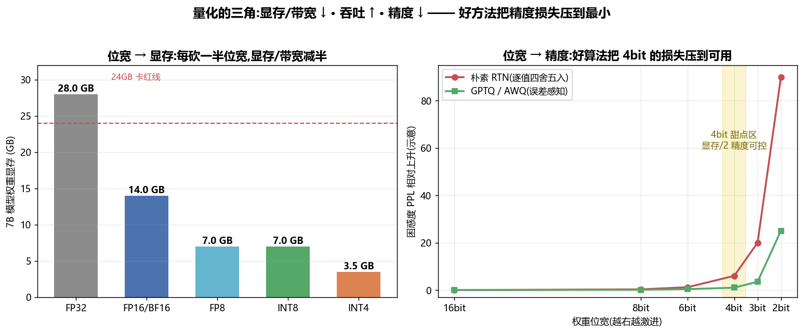
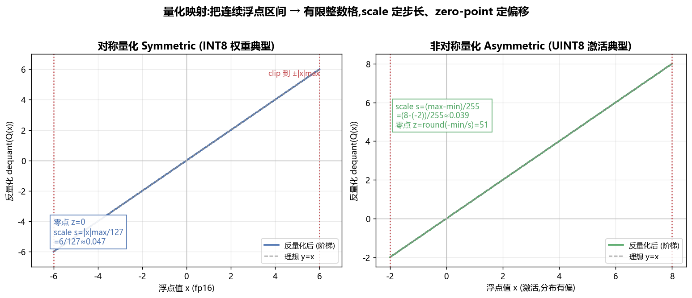
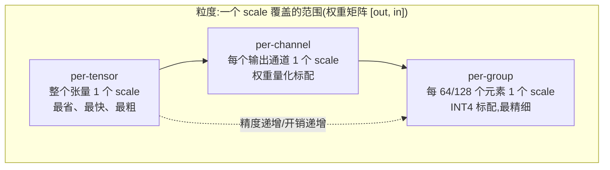
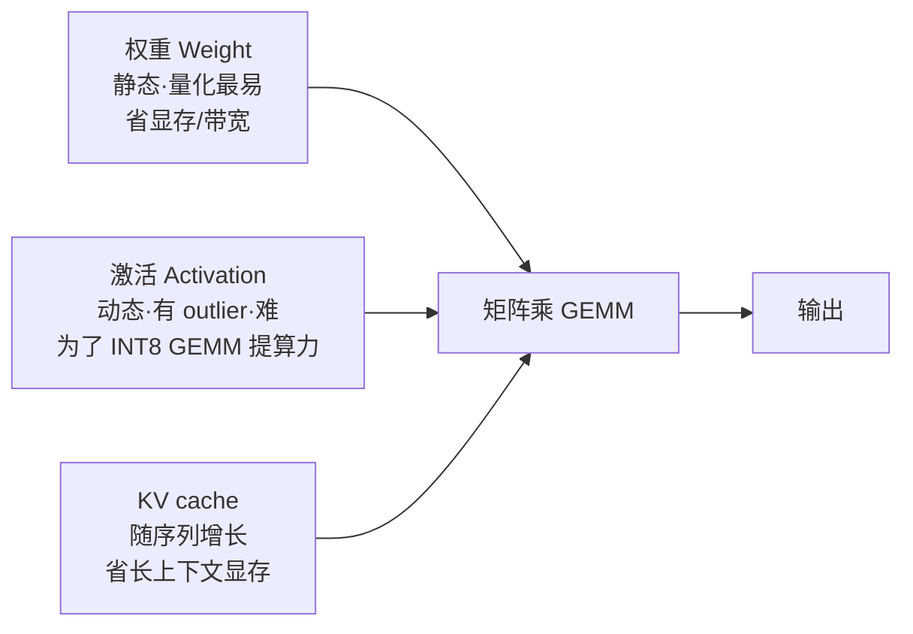
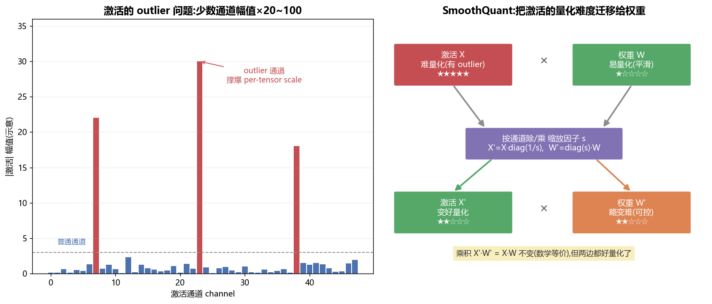
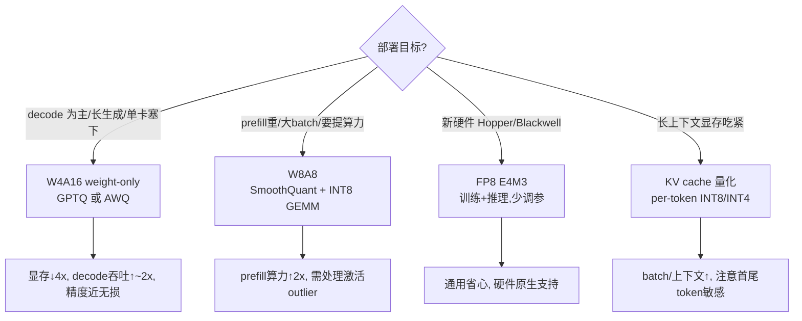
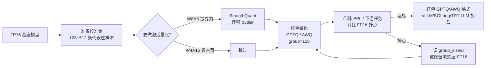

# 量化与低精度 · INT8 / INT4 / FP8、GPTQ / AWQ / SmoothQuant(全面·本质)

> 大模型部署里最实用、最"立竿见影"的一招:**用更少的比特存权重和激活**。7B 模型 FP16 要 14GB 显存,量化到 INT4 只要 3.5GB——一张消费级卡就能跑。本篇从"为什么能量化、代价在哪",一路讲到工业界三大主力算法 GPTQ / AWQ / SmoothQuant 的**本质区别**。

---

## 1. 🧠 为什么要量化:省的是显存、带宽,换的是吞吐

先看一个最朴素的事实:**LLM 推理绝大多数时间在搬数据,不在算数**(见 [`02_GPU结构`](02_GPU结构_从SM到集群_全面本质.md) 的 roofline)。decode 阶段每生成 1 个 token,要把**整个模型权重从 HBM 读一遍**。所以:

- **权重占的字节数 = 每步要搬的字节数**(memory-bound)。
- 位宽砍一半 → 搬运量减半 → **decode 吞吐几乎翻倍**,而不是"算得快一点"。

| 收益维度 | 机制 | 直觉 |
|---|---|---|
| **省显存** | 参数从 16bit → 4bit,占用 ×1/4 | 7B: 14GB → 3.5GB,单卡装得下 / batch 更大 |
| **省带宽 → 提吞吐** | decode 每步搬的权重字节数同比例下降 | memory-bound 阶段吞吐 ≈ 反比于位宽 |
| **省 KV cache** | KV 也能量化(见 §5) | 长上下文的 KV 从显存杀手变可控 |
| **提算力(部分)** | INT8/FP8 张量核吞吐是 FP16 的 2×~4× | compute-bound 的 prefill 也受益 |

> 🔬 **第一性原理**:量化的第一收益**不是算得快,而是搬得少**。一个 70B 模型 INT4 权重约 35GB,decode 每 token 就少搬 100GB 级别的数据——这是吞吐提升的根,也是为什么"权重量化"比"激活量化"更早普及(decode 瓶颈在权重搬运)。



左图:7B 模型权重显存随位宽线性下降,INT4 把模型压到 3.5GB(24GB 卡随便跑)。右图:位宽越激进,精度损失(困惑度 PPL 上升)越大,但**好算法(GPTQ/AWQ)能把 4bit 的损失压到接近无损**——这正是本篇后半的主角。

---

## 2. 🔢 数值格式回顾:FP32 / FP16 / BF16 / FP8 / INT8 / INT4

量化前先搞清"比特都花在哪"。浮点数 = **符号位 sign + 指数位 exponent + 尾数位 mantissa**;指数决定**动态范围**(能表示多大多小),尾数决定**精度**(相邻数之间多密)。

| 格式 | 位 | 符号/指数/尾数 | 动态范围 | 相对精度 | 典型用途 |
|---|---|---|---|---|---|
| **FP32** | 32 | 1 / 8 / 23 | ~1e±38 | 很高 | 训练主精度、累加器 |
| **FP16** | 16 | 1 / 5 / 10 | ~6e±4 | 中 | 推理常用,但范围窄(易溢出) |
| **BF16** | 16 | 1 / 8 / 7 | ~1e±38 | 低于 FP16 | 训练主力,**范围=FP32、精度换范围** |
| **FP8-E4M3** | 8 | 1 / 4 / 3 | ~±448 | 低 | Hopper/Blackwell 训练+推理,**精度侧** |
| **FP8-E5M2** | 8 | 1 / 5 / 2 | ~±57344 | 更低 | 梯度等大范围量,**范围侧** |
| **INT8** | 8 | 定点(scale) | 由 scale 定 | 256 个格 | 权重/激活量化主力 |
| **INT4** | 4 | 定点(scale) | 由 scale 定 | 16 个格 | 权重激进量化(GPTQ/AWQ) |

> 💡 **BF16 vs FP16 的本质**:同样 16 位,BF16 把位数从尾数挪给指数,**动态范围等于 FP32**——所以训练不容易溢出/下溢,这就是它成为训练默认精度的原因。代价是尾数只有 7 位,精度更粗,但训练靠大量累加不敏感。

> 🔬 **浮点 vs 整点(定点)**:FP8 每个数**自带指数**,动态范围大、对 outlier 更宽容,但硬件复杂;INT8 是**统一 scale 的定点**,所有数共享一个步长,简单高效但**怕 outlier**(一个大值撑大 scale,小值全被压没,见 §6)。这条区别贯穿全篇。

```python
# 直觉:同样 8 位,FP8 与 INT8 表示同一批数的差异
import numpy as np
x = np.array([0.01, 0.5, 12.0, 350.0])         # 跨 4 个数量级
# INT8 per-tensor 对称:scale 由最大值定
s = np.abs(x).max() / 127                        # ≈ 2.756
xq_int8 = np.round(x / s) * s                     # [0, 0, 11.0, 349.9] → 小值 0.01/0.5 被压成 0!
# FP8-E4M3 自带指数:小值也能表示(近似)
# → INT8 对宽动态范围的数据很吃亏,这就是 outlier 问题的根
print(xq_int8)   # [0.        0.        11.02...  349.9...]
```

---

## 3. 📐 量化基础:scale、zero-point、对称/非对称、粒度

### 3.1 核心公式:量化 = 缩放 + 取整 + 偏移

把浮点 $x$ 映射到整数 $q$,再能还原回近似的 $\hat{x}$:

$$q = \mathrm{clip}\left(\mathrm{round}\left(\frac{x}{s}\right) + z,\ q_{min},\ q_{max}\right), \qquad \hat{x} = s \cdot (q - z)$$

- **scale $s$(缩放/步长)**:一个整数格代表多大的浮点区间。$s$ 越小越精细,但能表示的范围越窄。
- **zero-point $z$(零点/偏移)**:浮点的 0 对应哪个整数。对称量化 $z=0$;非对称量化 $z\neq0$。
- **clip**:超出 $[q_{min}, q_{max}]$ 的值截断(饱和)。



左:**对称量化**,浮点区间 $[-|x|_{max}, |x|_{max}]$ 对称映射到 $[-127, 127]$,零点固定为 0。右:**非对称量化**,浮点区间 $[x_{min}, x_{max}]$(分布有偏,如 ReLU/GELU 后的激活恒为正)映射到 $[0, 255]$,用零点 $z$ 校准偏移。阶梯线就是量化-反量化后的实际取值。

### 3.2 对称 vs 非对称

| | 对称 Symmetric | 非对称 Asymmetric |
|---|---|---|
| 零点 $z$ | 固定 $=0$ | 可调,校准分布偏移 |
| 范围 | $[-\|x\|_{max}, \|x\|_{max}]$ | $[x_{min}, x_{max}]$ |
| 计算 | **快**(无 $z$ 项,矩阵乘更简洁) | 略慢(展开有交叉项) |
| 适合 | **权重**(大致零对称) | **激活**(ReLU/GELU 后单边分布) |

> 🔬 **为什么权重用对称、激活用非对称**:训练出的权重分布近似以 0 为中心对称,用对称量化不浪费格子且算得快;激活经过非线性(ReLU 恒非负、GELU 偏正)后**分布严重偏向一侧**,若强行对称,一半的整数格就浪费了——非对称用 $z$ 把区间"贴合"过去,精度更高。

### 3.3 量化粒度:per-tensor / per-channel / per-group

一个 scale 管多少数?管得越少越精细,但元数据越多、算得越慢。



| 粒度 | scale 数量 | 精度 | 开销 | 典型场景 |
|---|---|---|---|---|
| **per-tensor** | 1 | 最低 | 最小 | 激活量化(要快)、早期方案 |
| **per-channel/per-token** | 每行/每列 1 个 | 中 | 小 | 权重按输出通道;激活按 token |
| **per-group** | 每 G 个元素 1 个(G=64/128) | 高 | 元数据 ~scale/G | **INT4 权重必备**(如 GPTQ/AWQ 的 group_size=128) |

> 💡 **实战:group_size=128 是什么意思**。把权重每一行(输入维)切成每 128 个一组,每组独立算 scale/zero-point。这样组内动态范围小、量化更准。代价是每 128 个 4bit 值要多存一个 FP16 scale(+ 可能一个 zero-point),**有效位宽略高于 4**(约 4.25~4.5 bit),这也是为什么 "4bit 模型" 实际显存比理论 3.5GB 稍大。

> ⚠️ **常见坑**:per-tensor 激活量化遇到 outlier 会灾难性掉点(一个通道的极大值撑爆整个张量的 scale)。要么换 per-token/per-channel 粒度,要么用 SmoothQuant 把 outlier "抹平"(§6、§7)。

---

## 4. 🏗️ PTQ vs QAT;量化什么:权重 / 激活 / KV

### 4.1 训练后量化 PTQ vs 量化感知训练 QAT

| | **PTQ**(Post-Training Quantization) | **QAT**(Quantization-Aware Training) |
|---|---|---|
| 做法 | 训练完**直接**量化,最多用少量校准数据 | 训练中**插入伪量化节点**,让模型学会适应量化误差 |
| 数据 | 无标注,几百条校准样本即可 | 需完整训练数据 + 反向传播 |
| 成本 | **低**(几分钟~几小时) | 高(等于再训练一遍) |
| 精度 | 8bit 几乎无损;4bit 需好算法 | 更高,极低位宽(2~3bit)也能救 |
| LLM 现状 | **绝对主流**(GPTQ/AWQ/SmoothQuant 都是 PTQ) | 少用(LLM 太大,重训代价高) |

> 🔬 **为什么 LLM 几乎都用 PTQ**:大模型重训一次的算力成本极高,而 GPTQ/AWQ 这类**误差感知的 PTQ** 已能把 4bit 权重做到接近无损。QAT 主要留给**极低位宽(≤3bit)**或对精度极致敏感的小模型。伪量化(fake quant)的关键技巧是 **STE(Straight-Through Estimator)**:前向按量化取整,反向把不可导的 round 近似为恒等,让梯度能穿过去。

### 4.2 量化谁:权重 / 激活 / KV cache



| 量化对象 | 难度 | 主要收益 | 代表方法 |
|---|---|---|---|
| **权重 Weight-only** | 易(静态、分布好) | **省显存/带宽**,decode 提速 | GPTQ、AWQ、bitsandbytes NF4 |
| **激活 Activation** | 难(动态、outlier 多) | 配合权重做 **INT8/FP8 GEMM**,prefill 提算力 | SmoothQuant、LLM.int8() |
| **KV cache** | 中(逐 token 动态) | **省长上下文显存**,batch 更大 | KIVI、KVQuant、per-token INT8/INT4 |

> 💡 **weight-only vs weight+activation 的选择**:
> - **decode 为主(生成长、batch 小)** → memory-bound → **weight-only(W4A16)** 最划算,只需权重 4bit,激活保持 FP16。
> - **prefill 为主 / 大 batch** → compute-bound → 上 **W8A8(权重+激活都 INT8)** 才能吃到 INT8 张量核 2× 算力,这时激活量化(SmoothQuant)才有意义。

> ⚠️ **W4A16 不提算力**:很多人以为"4bit 就快 4 倍"。W4A16 的加速来自**省带宽**(decode),GEMM 时权重还得反量化回 FP16 再算,**不吃低精度张量核算力**。要提 prefill 算力必须让激活也低精度(W8A8),这正是 SmoothQuant 的战场。

---

## 5. 🎯 三大主力算法:GPTQ / AWQ / SmoothQuant

这三个是工业界 LLM 量化的"三驾马车",**解决的问题不同**,常常组合使用。

### 5.1 GPTQ —— 逐层最优,补偿量化误差

**思路**:量化不是"逐个权重四舍五入"就完事——量化一个权重会引入误差,GPTQ 把这个误差**用还没量化的权重去补偿**,让整层的输出误差最小。

- 目标:对每一层,最小化 $\|WX - \hat{W}X\|^2$(量化前后该层输出的差)。这是一个逐层的最小二乘问题,基于二阶信息(Hessian $H = XX^\top$,用校准数据估计)。
- 做法:逐列量化权重,每量化一列就**更新剩余未量化列**来吸收误差(源自 OBQ / OBS 的思想),用 Cholesky 分解高效求解。
- 结果:**权重 4bit(甚至 3bit)** 接近无损;纯 weight-only(W4A16),不动激活。

$$\hat{W} = \arg\min_{\hat{W}}\ \|WX - \hat{W}X\|_2^2 \quad\text{(逐层、逐列贪心 + Hessian 补偿)}$$

> 💡 GPTQ 的招牌是 **"量化后用剩余权重补偿误差"**。这比朴素 RTN(round-to-nearest,逐值四舍五入)在 4bit 上强得多——见 §1 右图两条曲线。

### 5.2 AWQ —— 激活感知,保护重要通道

**思路(Activation-aware Weight Quantization)**:不是所有权重一样重要。观察发现,**对应激活幅值大的那些权重通道,对输出影响最大**。AWQ **不量化它们**(或给它们放大 scale 保护),从而在不动激活的前提下减小量化损失。

- 关键观察:**权重的重要性由激活分布决定**——激活大的通道,权重量化误差被放大。
- 做法:按激活统计给每个输入通道搜一个**缩放因子 $s$**,把重要通道的权重**乘 $s$ 放大**再量化(等价于给它更多有效精度),激活侧对应**除以 $s$** 保持数学等价。只需**极少校准数据**,不做反向传播。
- 结果:W4A16 下常优于 GPTQ,且**对校准集不敏感、更鲁棒**,速度快。

> 🔬 **AWQ 与 GPTQ 的本质区别**:GPTQ 是**误差补偿**(量化后修补剩余权重);AWQ 是**重要性保护**(量化前放大关键通道)。前者更"数学最优"但依赖 Hessian/校准;后者更"启发式"但简单鲁棒。二者都是 **weight-only**,不解决激活量化。

### 5.3 SmoothQuant —— 把激活的难度迁移给权重

**思路**:要做 **W8A8**(激活也 INT8 才能吃 INT8 算力),但激活有 outlier(§7),per-tensor 量化直接崩。SmoothQuant 发现:**激活难量化、权重好量化**,那就**把难度从激活挪一部分到权重**,让两边都"中等好量化"。

按通道选一个平滑因子 $s$,做一个**数学上完全等价**的变换:

$$Y = XW = \underbrace{(X\,\mathrm{diag}(s)^{-1})}_{\hat X\ \text{变平滑}}\ \underbrace{(\mathrm{diag}(s)\,W)}_{\hat W\ \text{略变陡}} = \hat X\,\hat W$$

激活除以 $s$(outlier 被压小、好量化),权重乘以 $s$(略变难但权重本来好量化、扛得住),**乘积不变**。$s$ 常取 $s_j = \dfrac{(\max_i|X_{ij}|)^\alpha}{(\max_i|W_{ij}|)^{1-\alpha}}$,迁移强度 $\alpha$(常 0.5)控制"挪多少"。



左:激活的 **outlier 通道**(红)幅值是普通通道的 20~100 倍,撑爆 per-tensor scale。右:SmoothQuant 用等价变换把难度在激活/权重间**再平衡**,让 W8A8 可行。

> 💡 **三者组合**:实践中常见 **SmoothQuant(让激活可 INT8)+ GPTQ/AWQ(把权重压到 4bit)** 一起用。SmoothQuant 解决"激活量化",GPTQ/AWQ 解决"权重低位宽",互补不冲突。

### 5.4 一张表看清区别

| 方法 | 量化对象 | 核心思想 | 需要激活? | 校准数据 | 提算力? | 典型配置 |
|---|---|---|---|---|---|---|
| **RTN**(基线) | 权重 | 逐值四舍五入 | 否 | 无 | 否 | W8 还行,W4 掉点 |
| **GPTQ** | 权重 | 逐层最小二乘 + Hessian 误差补偿 | 否 | 少量 | 否(W4A16) | W4/W3A16,group=128 |
| **AWQ** | 权重 | 激活感知,放大保护重要通道 | 统计(不训练) | 极少 | 否(W4A16) | W4A16,鲁棒 |
| **SmoothQuant** | 权重+激活 | 难度从激活迁移到权重(等价变换) | 是(要做 INT8) | 少量 | **是(W8A8)** | W8A8,提 prefill 算力 |
| **LLM.int8()** | 权重+激活 | outlier 走 FP16、其余走 INT8(混合) | 是 | 无 | 部分 | W8A8 训练/推理保精度 |

### 5.5 还该知道的几种(补全地图)

| 方法 | 归类 | 一句话本质 |
|---|---|---|
| **NF4(NormalFloat4)** | 权重 4bit | 非均匀量化:格子按**正态分布分位点**排布,匹配权重的钟形分布;QLoRA 的基础 |
| **双重量化 Double Quant** | 元数据压缩 | 连 scale 本身也量化(FP32→8bit),再省 ~0.4 bit/参数;QLoRA 技巧 |
| **GGUF k-quants**(Q4_K_M 等) | 权重混合 | llama.cpp 生态:不同层/张量给不同位宽 + 分块,CPU/端侧首选 |
| **HQQ** | 权重 | 无需校准数据,快速鲁棒的半二次优化 |
| **QuaRot / SpinQuant** | 旋转类 | 用 Hadamard 正交旋转把 outlier "打散",让 W4A4 都可行 |

> 💡 **NF4 为什么比 INT4 准**:INT4 的 16 个格**等间距**,而权重是钟形分布(中间密两头稀)。NF4 让格子在 0 附近**更密**、两端稀疏,即"把精度花在数多的地方"——信息论上更优。这就是 QLoRA 能在 4bit 基座上微调还几乎无损的关键。

---

## 6. 🌡️ FP8 与 KV cache 量化:硬件与长上下文的新战场

### 6.1 FP8:Hopper/Blackwell 的原生低精度

FP8 是**自带指数的 8bit 浮点**,天生比 INT8 更抗 outlier(动态范围大),且 Hopper(H100)/Blackwell 张量核**原生支持**,不需要 SmoothQuant 那样的预处理。

| | **E4M3** | **E5M2** |
|---|---|---|
| 指数/尾数 | 4 / 3 | 5 / 2 |
| 范围 | ~±448 | ~±57344 |
| 精度 | 相对高 | 相对低 |
| 用途 | **前向 / 权重 / 激活**(要精度) | **梯度**(要大范围) |

- **缩放策略**:FP8 范围有限,需给每个张量配一个缩放因子(把数值挪进 FP8 可表示区)。**延迟缩放 delayed scaling** 用历史若干步的 amax 统计来定 scale,避免每步同步开销。
- **收益**:训练 + 推理都能吃 FP8 张量核(H100 FP8 算力 ~2× BF16),且工程上比 INT8+SmoothQuant **更省心**(不用逐层调 α、搜 group)。

> 🔬 **FP8 vs INT8 的本质选择**:同 8bit,INT8 精度分辨率略高(格子均匀密),但**怕 outlier、要 SmoothQuant 伺候**;FP8 分辨率略低,但**动态范围大、直接扛 outlier、硬件原生**。新硬件上 FP8 正在成为默认;老硬件(A100 无 FP8)仍是 INT8 天下。

### 6.2 KV cache 量化:长上下文的显存救星

长上下文场景,KV cache 会**随序列长度线性膨胀**,常常比权重还占显存(见 [`01_PD分离`](01_PD分离架构_Prefill_Decode_Disaggregation.md) 的 KV 公式)。把 KV 从 FP16 量化到 INT8/INT4:

$$\text{KV 显存} \propto 2 \times L \times n_{kv} \times d_{head} \times s_{len} \times \text{dtype}$$

dtype 从 2 字节(FP16)→ 1 字节(INT8)→ 0.5 字节(INT4),**长上下文显存直接减半/减四**,batch 和上下文都能翻倍。

| 要点 | 说明 |
|---|---|
| **粒度** | KV 逐 token 生成 → 天然 **per-token** 量化;K 和 V 分布不同,常分开处理 |
| **K vs V** | K 的 outlier 常按通道分布、V 按 token 分布 → KIVI 对 K 用 per-channel、V 用 per-token |
| **敏感位置** | 首 token(attention sink)、近期 token 更敏感,常保留 FP16(混合精度) |
| **代表** | KIVI(2bit KV)、KVQuant、TensorRT-LLM / vLLM 内置 INT8 KV |

> ⚠️ **常见坑**:KV 量化到 INT4/2bit 时,**保留少量最近或最重要的 token 为高精度**很关键——否则近期上下文失真会明显影响生成质量。这与权重量化"静态一刀切"不同,KV 是动态流。

---

## 7. ⚠️ outlier 问题:量化的头号敌人

**现象**:大模型激活里,**极少数特征维度(通道)的幅值异常大**(比其它大几十上百倍),且随模型变大越发严重(涌现)。

**为什么致命(对 INT8 per-tensor)**:scale 由最大值决定 $s = |x|_{max}/127$。一个 outlier 把 $|x|_{max}$ 撑到很大 → $s$ 变大 → **绝大多数正常小值被压到同几个整数格甚至归零**,信息全丢。

**解法谱系**:

| 解法 | 思路 | 代表 |
|---|---|---|
| **混合精度** | outlier 通道走 FP16,其余 INT8 | LLM.int8() |
| **难度迁移** | 等价变换把 outlier 压小(激活↔权重) | **SmoothQuant** |
| **更细粒度** | per-token/per-channel/per-group,把 outlier 隔离在小范围 | 各类 group 量化 |
| **旋转/变换** | 用 Hadamard 等正交变换"打散" outlier | QuaRot、SpinQuant |
| **换格式** | 用带指数的 FP8,天生对宽动态范围宽容 | FP8-E4M3 |

> 🔬 **第一性原理**:outlier 的本质是**动态范围爆炸**。定点(INT)用统一 scale,天生怕宽动态范围;三条出路——(1)把宽范围切细(细粒度);(2)把宽范围压窄(迁移/旋转);(3)换个自带指数的格式(FP8)。所有 outlier 方法都落在这三类里。

> 💡 **面试高频**:"为什么模型越大越难量化激活?" → outlier 现象随规模涌现且更极端;per-tensor INT8 直接崩,这正是 SmoothQuant / LLM.int8() 出现的动机。

---

## 8. 🧪 精度-显存-速度权衡:怎么选



**经验法则(量级参考)**:

| 配置 | 显存(7B) | 相对吞吐(decode) | 精度损失 | 何时选 |
|---|---|---|---|---|
| FP16(基线) | 14 GB | 1.0× | 0 | 精度优先/短序列 |
| **W8A16** | 7 GB | ~1.5× | 几乎无损 | 保守省显存 |
| **W4A16(GPTQ/AWQ)** | ~4 GB | ~1.8×~2× | 很小(好算法) | **单卡部署主流** |
| **W8A8(SmoothQuant)** | 7 GB | prefill 算力 ~2× | 小(需调 α) | 大 batch / 吞吐服务 |
| **FP8** | 7 GB | ~2×(算力) | 小 | 新硬件原生 |

> ⚠️ **常见坑**:
> - **不是位宽越低越好**。W2/W3 往往需要 QAT 或特殊技巧,朴素 PTQ 掉点严重(§1 右图 2bit 处曲线陡升)。**4bit 是当前的甜点区**。
> - **量化不总提速**。W4A16 的加速来自省带宽,在 **compute-bound 的 prefill 上几乎无收益**,还可能因反量化开销略慢。收益主要在 decode。
> - **有效位宽 > 名义位宽**。group scale/zero-point 的元数据让"4bit 模型"实际约 4.25~4.5 bit,显存别按 3.5GB 硬算。
> - **校准集要有代表性**。GPTQ/SmoothQuant 依赖校准数据估 Hessian/统计,校准集分布偏了会掉点(AWQ 相对最鲁棒)。

---

## 9. 🛠️ 一个能跑的最小示例

先看一条**典型的生产量化流水线**长什么样——从原始 FP16 权重到可部署的低精度产物:



> 💡 **实战顺序**:先决定 weight-only 还是 weight+activation(看 decode/prefill 哪个是瓶颈)→ 需要激活量化就先 SmoothQuant → 再 GPTQ/AWQ 压权重 → **必须评测掉点**(PPL + 至少一个下游任务)→ 不达标就调粒度或对敏感层(常见是第一层、lm_head)保留高精度。

下面是**不依赖任何框架**、纯 NumPy 的量化内核,帮你把上面的 scale/group/误差看清楚:


```python
import numpy as np

def quantize_symmetric(w, bits=8):
    """对称 per-tensor 量化(权重典型)"""
    qmax = 2**(bits-1) - 1                     # int8: 127, int4: 7
    s = np.abs(w).max() / qmax                 # scale 由绝对最大值定
    q = np.clip(np.round(w / s), -qmax-1, qmax)
    return q.astype(np.int8), s                # 存整数 q + 一个 scale

def dequantize(q, s):
    return q.astype(np.float32) * s

def quantize_group(w, bits=4, group=128):
    """per-group 量化:INT4 标配,组内独立 scale"""
    out = np.zeros_like(w); scales = []
    for i in range(0, w.shape[-1], group):
        blk = w[..., i:i+group]
        q, s = quantize_symmetric(blk, bits)
        out[..., i:i+group] = dequantize(q, s); scales.append(s)
    return out, scales

np.random.seed(0)
W = np.random.randn(256, 1024).astype(np.float32)      # 一层权重
for bits in (8, 4):
    q, s = quantize_symmetric(W, bits)
    err_pt = np.abs(W - dequantize(q, s)).mean()
    err_gp = np.abs(W - quantize_group(W, bits, 128)[0]).mean()
    print(f"{bits}bit  per-tensor MAE={err_pt:.4f}   per-group128 MAE={err_gp:.4f}")
# 8bit  per-tensor MAE≈0.0095  per-group128 MAE≈0.0084
# 4bit  per-tensor MAE≈0.173   per-group128 MAE≈0.154  ← 细粒度把 4bit 误差显著压低
```

> 💡 跑一下就能亲眼看到:**8bit 几乎无损、4bit 明显掉、per-group 把 4bit 救回来一截**——这就是工业界 INT4 都用 group=128 的原因。真实的 GPTQ/AWQ 在此基础上再加误差补偿/重要性保护,把损失进一步压到接近无损。

**工业工具链速查**:

| 工具 | 支持 | 一句话 |
|---|---|---|
| `bitsandbytes` | INT8 / NF4(4bit) | HF `load_in_4bit=True`,QLoRA 微调基础 |
| `auto-gptq` / GPTQModel | GPTQ W4/W3 | 一行量化 + 推理 |
| `AutoAWQ` | AWQ W4 | 鲁棒、快,vLLM/SGLang 直接加载 |
| `llm-compressor`(vLLM) | SmoothQuant / W8A8 / FP8 | 生产级 PTQ 管线 |
| `TensorRT-LLM` | INT8/INT4/FP8 全套 | NVIDIA 部署,含 KV 量化 |

---

## 10. 📌 本质小结

1. **量化的第一收益是"搬得少"**:decode 是 memory-bound,位宽减半 ≈ 吞吐翻倍;省显存让单卡塞下大模型。
2. **量化 = scale(步长)+ zero-point(偏移)+ clip**;权重用对称、激活用非对称;粒度越细越准越贵,INT4 靠 group=128。
3. **PTQ 是 LLM 主流**(重训太贵),GPTQ/AWQ/SmoothQuant 都是误差/重要性感知的 PTQ。
4. **三驾马车分工**:GPTQ=逐层误差补偿、AWQ=保护重要通道(都是 weight-only 省带宽),SmoothQuant=激活难度迁移(做 W8A8 提算力)。
5. **outlier 是头号敌人**:定点怕宽动态范围,出路是细粒度 / 迁移旋转 / 换 FP8。
6. **4bit 是当前甜点**:再低要 QAT;量化不总提速(prefill 收益小);有效位宽略高于名义位宽。

## 💡 面试高频

- "量化为什么能提 decode 吞吐?" → memory-bound,搬运字节数随位宽下降,吞吐≈反比位宽。
- "scale 和 zero-point 分别是什么?对称/非对称怎么选?" → 步长/偏移;权重对称、激活非对称。
- "GPTQ、AWQ、SmoothQuant 有啥区别?" → 误差补偿 / 重要性保护 / 难度迁移;前两个 weight-only,后一个做 W8A8。
- "W4A16 为什么不提算力?" → 权重要反量化回 FP16 再算,加速来自省带宽而非低精度张量核。
- "outlier 为什么让 INT8 激活量化崩?怎么解决?" → 撑爆 per-tensor scale;SmoothQuant/混合精度/细粒度/FP8。
- "BF16 和 FP16 区别?" → 同 16 位,BF16 范围=FP32(指数 8 位),精度换范围,训练默认。

## 🔗 延伸

- **瓶颈的根**:[`02_GPU结构_从SM到集群_全面本质.md`](02_GPU结构_从SM到集群_全面本质.md) —— roofline / memory-bound 决定了"为什么权重量化提 decode 吞吐";张量核对 INT8/FP8 的原生支持。
- **推理服务**:[`01_PD分离架构_Prefill_Decode_Disaggregation.md`](01_PD分离架构_Prefill_Decode_Disaggregation.md) —— prefill(compute-bound,W8A8 受益)/ decode(memory-bound,W4A16 受益)对量化方案的不同偏好;KV 量化直接减小 §3 那条 KV 传输开销。
- **内存/带宽本质**:[`04_内存模型_一致性_内存序_GPU与CPU.md`](04_内存模型_一致性_内存序_GPU与CPU.md)、[`03_CPU结构_流水线_乱序_缓存_多核.md`](03_CPU结构_流水线_乱序_缓存_多核.md) —— 为什么"少搬数据"是一切优化的主线。
- **总览**:本库 [`README.md`](README.md)。
- **仓库既有**:`../llm-inference/` 下的量化与推理引擎笔记(GPTQ/AWQ/vLLM/TensorRT-LLM);`../ultra-scale-playbook`(FP8 训练);`../../Enigneer-infra/cuda-mastery`(INT8/FP8 算子实现)。
