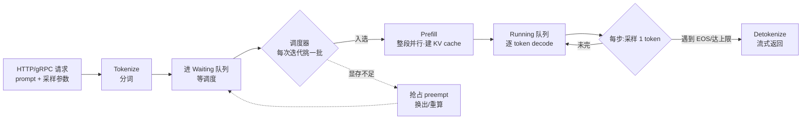
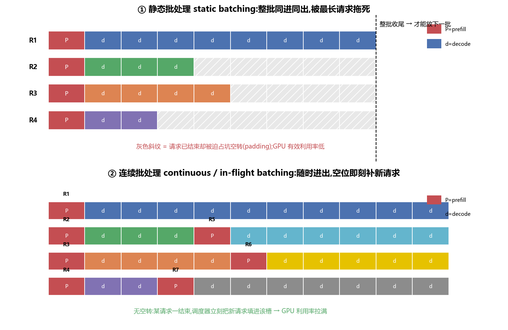
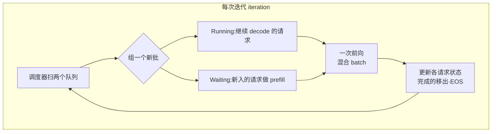
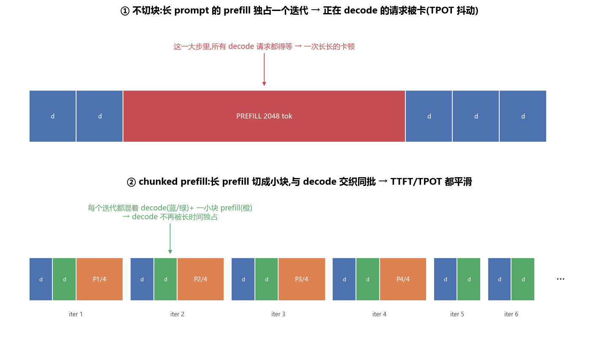
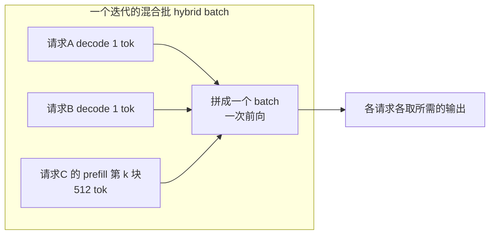
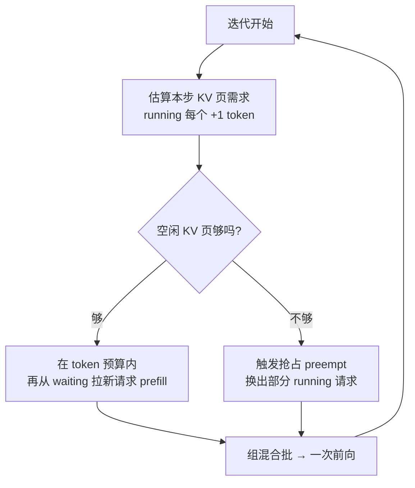
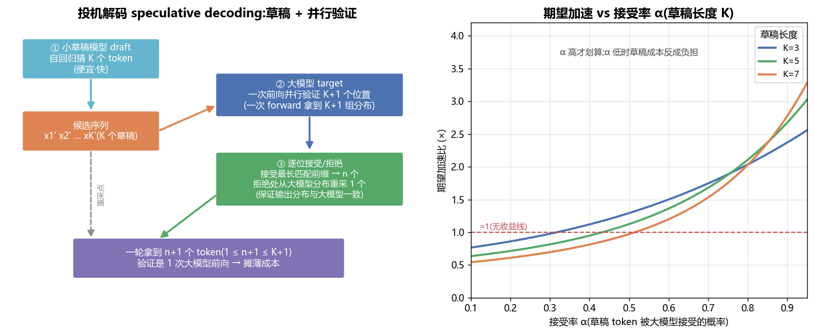
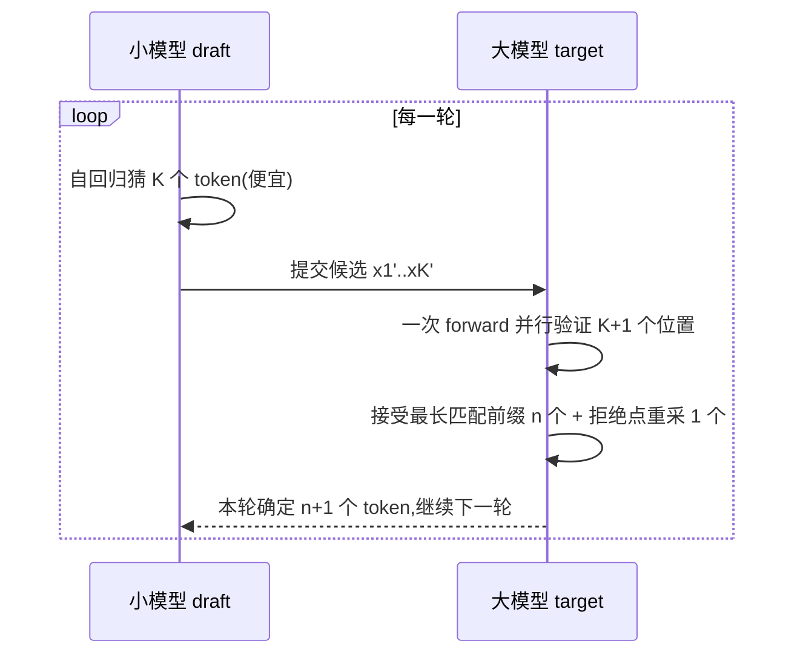
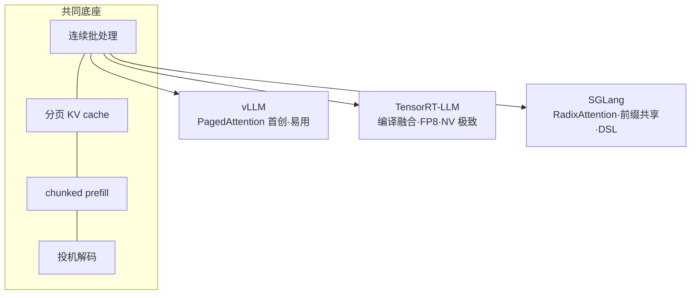
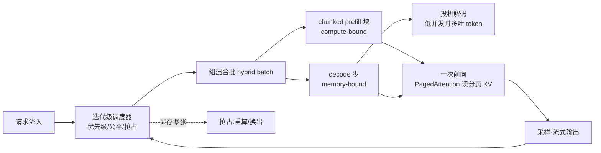

# 推理引擎架构 · 连续批处理 / 调度 / 投机解码 / chunked prefill(全面·本质)

> 一个 LLM 推理引擎(inference engine / serving engine)的核心工作,就是**把成百上千个请求塞进有限的 GPU,既要快(低延迟),又要多(高吞吐)**。这两个目标天生打架。本篇把当代引擎(vLLM / TensorRT-LLM / SGLang)赖以为生的四项关键技术——**连续批处理、chunked prefill、迭代级调度、投机解码**——从第一性原理讲透,每项都讲清:**是什么 / 为什么 / 怎么用 / 代价**。
>
> 前置:先读 [`01_PD分离架构`](01_PD分离架构_Prefill_Decode_Disaggregation.md)(prefill 算力受限 / decode 访存受限)与 [`02_GPU结构`](02_GPU结构_从SM到集群_全面本质.md)(roofline、显存带宽)。本篇讲的是"在**同一**批 GPU 上如何把请求编排到极致",PD 分离则是"把两阶段拆到**不同** GPU"——两者互补。

---

## 🧭 0. 先建立地图:一个请求的生命周期

一个请求从进来到吐完,要穿过引擎的这些环节:



**贯穿全篇的两个延迟指标**(务必背下来):

| 指标 | 全称 | 含义 | 由谁主导 |
|---|---|---|---|
| **TTFT** | Time-To-First-Token | 从请求到达 → 吐出**第一个** token 的时间 | **prefill**(排队 + 首次前向) |
| **TPOT** | Time-Per-Output-Token | 稳定生成阶段**每个** token 的间隔(也叫 ITL,inter-token latency) | **decode**(每步前向) |

> 🔬 **第一性原理**:端到端延迟 ≈ `TTFT + (输出长度-1) × TPOT`。用户体感 = "多久开始出字(TTFT)" + "出字流不流畅(TPOT)"。引擎所有花招,本质都是在**吞吐 throughput** 与这两个延迟之间做权衡。

---

## 🐌 1. 静态批处理的痛:等最慢的那个

### 是什么

最朴素的做法叫 **静态批处理 static batching**(也叫 request-level batching):**攒够一批请求 → 打包一起跑 → 整批全部生成完 → 才收尾、才放下一批**。这是早期框架(如原始 FasterTransformer 服务、朴素 HF `generate`)的默认行为。

### 为什么痛

LLM 生成是**自回归**的,每个请求的**输出长度事先不知道**,而且差异巨大:有的问答只吐 3 个 token,有的写代码吐 2000 个。静态批处理里,**整批的步数 = 批内最长请求的步数**。



看上图 ①:R1 要生成 8 个 token,R2 只要 3 个。但 R2 在第 3 步就完事了,却**不能退出**——它得陪着 R1 一直空转到第 8 步(灰色斜纹格子)。这些格子是**纯浪费的算力**:GPU 在为已经结束的请求做 padding、空算。

```python
# 静态批处理的本质:批内同步,被 max_len 拖死
batch = collect_requests(n=8)          # 攒一批
kv = prefill(batch)                    # 一起 prefill
for step in range(max_len_in_batch):   # 步数 = 批内最长的那个
    logits = decode_step(batch, kv)    # 已结束的请求仍占坑、仍参与矩阵乘
    # 早结束的请求只能挂着等,GPU 利用率随时间掉下去
```

### 代价量化

| 现象 | 后果 |
|---|---|
| **队头阻塞 head-of-line blocking** | 短请求被长请求拖着,TTFT/尾延迟爆炸 |
| **利用率随时间衰减** | 批一开始满,越到后面结束的越多,有效 batch 越小,GPU 空转 |
| **新请求进不来** | 一批没跑完,后到的请求只能干等,即使 GPU 已半空 |

> ⚠️ **常见坑**:很多人以为"batch 越大吞吐越高"就无脑攒大批。静态批下,**批越大、长度方差越大 → 空转浪费越严重**,吞吐反而可能下降,尾延迟一定变差。

---

## 🚀 2. 连续批处理 continuous / in-flight batching

### 是什么

**连续批处理**(vLLM 叫 continuous batching,TensorRT-LLM 叫 in-flight batching,思想同源,出自论文 **Orca, OSDI'22**)把批处理的粒度从"整个请求"降到 **"一次迭代 iteration"**:

> **不再等整批跑完。每生成一步(一个迭代),就重新组批:已完成的请求立刻退出,腾出的槽位马上填入等待队列里的新请求。**

看上图 ②:R2 在第 3 步结束,调度器**立刻**把 R5 填进它的槽;R3 结束换 R6,R4 结束换 R7。**没有任何空转格子**——GPU 的每个"座位"始终坐着一个真正在算的请求。

### 为什么能拉满利用率



- **请求随时进出**:进出粒度是 1 个 token 的时间,而不是整个请求的时间;后到的请求平均只等 ~半步就能上车。
- **槽位永不空转**:座位一空立刻补人,有效 batch size 维持在高位 → **GPU 利用率与吞吐大幅提升**(Orca / vLLM 报告相对静态批 **数倍**吞吐)。
- **配 PagedAttention**:能连续批的前提是 **KV cache 可以按需分配、请求间不必等长**。vLLM 的 **PagedAttention** 把 KV cache 分成固定大小的"页"(如 16 token/页),像操作系统虚拟内存那样**按页分配、按需增长**,消除了为"最大长度"预留的巨大碎片,才让海量请求同时在飞成为可能。

| 维度 | 静态批处理 | 连续批处理 |
|---|---|---|
| 调度粒度 | 请求级(整批同进同出) | **迭代级**(每步重组) |
| 请求进出 | 必须等整批结束 | **随时进出** |
| 空转浪费 | 大(陪最长请求) | **几乎为零** |
| GPU 利用率 | 随时间衰减 | **持续高位** |
| 吞吐 | 基线 | **数倍** |
| KV 前提 | 定长预留、碎片多 | PagedAttention 分页按需 |

> 💡 **实战 / 面试高频**:"continuous batching 为什么比 static batching 好?" → 把批粒度从请求级降到迭代级,**已完成请求立即退出、新请求立即补入**,消除空转、拉满 GPU 利用率;它依赖 PagedAttention 让 KV cache 能按页动态增长。

> ⚠️ **常见坑**:连续批把 prefill 和 decode 混在一批里跑时,**一个长 prompt 的 prefill 会突然拉长这一步**,让所有正在 decode 的请求这一拍变卡(TPOT 尖刺)。这正是下一节 chunked prefill 要解决的问题。

---

## 🔪 3. chunked prefill:把长 prefill 切块,与 decode 交织

### 为什么需要它

prefill 和 decode 的算力画像天差地别:

- **prefill**:一次处理 prompt 的**几百上千个 token**,是个大矩阵乘,**算力受限 compute-bound**,一步就能把 GPU 打满。
- **decode**:一次只处理**每个请求 1 个新 token**,是"瘦长"的矩阵-向量乘,**访存受限 memory-bound**,GPU 算力大量空闲(在等 KV/权重从 HBM 搬过来)。

问题来了:当一个 2048-token 的长 prompt 进来做 prefill,它**独占**这一整个迭代好几十毫秒(上图 chunked 的 ①),这期间**所有正在 decode 的请求都被卡住**——用户看到的是"字突然不动了",TPOT 出现巨大尖刺。



### 是什么

**chunked prefill**(SARATHI, 2023 提出;vLLM、TensorRT-LLM 均已内置)把一个长 prefill **切成固定大小的小块**(chunk,如每块 512 token),**每个迭代只处理一块**,并把这一小块 prefill 与其它请求的 decode **拼进同一个批**一起前向:



上图 ②:每个迭代都是 `[几个 decode 小块 + 一小块 prefill]` 拼起来。长 prefill 被摊到多个迭代里,**再也不会一次独占**。

### 为什么这样更好(第一性原理)

> 🔬 **本质:用 prefill 的"满算力"去填 decode 的"空算力"**。decode 步天生 memory-bound,GPU 算力大量闲置;往里塞一小块 compute-bound 的 prefill,**几乎"免费"地蹭走了本来浪费的算力**——两种负载正好互补,把一个迭代的算力-带宽利用率同时拉高。

- **平滑 TPOT**:decode 请求不再被长 prefill 长时间独占,每步时长趋于均匀,inter-token 延迟尖刺被削平。
- **平滑 / 可控 TTFT**:通过 **token budget**(每迭代总 token 预算,如 2048)统一约束"这一步塞多少 prefill + 多少 decode",可用一个旋钮在 TTFT 与 TPOT 间调平衡。
- **提升吞吐**:混合批把算力与带宽都用满,整体 goodput 上升。

### 怎么用(vLLM 示例)

```python
from vllm import LLM
llm = LLM(
    model="Qwen/Qwen2.5-7B-Instruct",
    enable_chunked_prefill=True,   # 开启 chunked prefill
    max_num_batched_tokens=2048,   # 每次迭代的 token 预算(prefill+decode 之和上限)
)
# 预算越小 → decode 越不容易被卡(TPOT 更稳),但长 prompt 的 TTFT 变长(切更多块)
# 预算越大 → 长 prompt prefill 更快出首 token,但 decode 尖刺风险回升
```

| 旋钮 `max_num_batched_tokens` | 偏小 | 偏大 |
|---|---|---|
| decode 稳定性(TPOT) | ✅ 稳 | ⚠️ 易被 prefill 挤出尖刺 |
| 长 prompt 首 token(TTFT) | ⚠️ 变慢(切更多块) | ✅ 更快 |
| 适合场景 | 聊天(重体感流畅) | 长文档摘要(重首响应) |

> ⚠️ **常见坑**:块太小(如 128)→ prefill 被切成太多迭代,固定开销(kernel launch、attention 读 KV)反复摊,长 prompt 的 TTFT 明显变差;块太大 → 又退化回"独占"卡 decode。**通常 512~2048 之间调**,按你的 SLO(重 TTFT 还是重 TPOT)取舍。

---

## 🎛️ 4. 调度器:迭代级调度、优先级、抢占、公平

调度器是引擎的大脑,决定**每个迭代**"让哪些请求上车、做 prefill 还是 decode、显存不够时踢谁下车"。

### 4.1 迭代级调度 iteration-level scheduling

这是连续批处理的调度学名:**每个迭代都重新决策一次**(而非请求级一锤定音)。每步调度器要回答:

1. Running 队列里哪些请求继续 decode?
2. Waiting 队列里能拉几个新请求进来做 prefill(受 token budget + 显存约束)?
3. 显存(KV cache 页)是否够用?不够怎么办?



### 4.2 优先级 priority

不是所有请求生而平等。引擎可按**优先级 / SLO 类别**排序 waiting 队列:

- **默认 FCFS**(先来先服务)——公平、简单,但长请求可能拖后面短请求。
- **优先级队列**——付费/交互式请求优先,离线批量任务让路。
- **最短优先 / SLO 感知**——预测输出长度或按剩余 SLO 排序,压低平均等待。

> 💡 **面试点**:vLLM 支持 `priority` 调度策略(数值小优先)+ FCFS 兜底;生产上常按租户/业务线分优先级,给交互流量让路。

### 4.3 抢占 preemption:显存不够时踢谁下车

decode 每走一步,每个在飞请求的 KV cache 就**增长一个 token**(占用只增不减,直到请求结束)。海量请求同时在飞,显存(KV 页)可能**中途耗尽**。这时必须**抢占**部分请求腾地方,两种做法:

| 抢占策略 | 做法 | 代价 | 何时用 |
|---|---|---|---|
| **重算 recomputation** | 直接丢弃被抢占请求的 KV,之后重新排队,从头 prefill 一遍 | 浪费已算的 prefill 算力 | KV 小 / 重算便宜时(vLLM 默认) |
| **换出 swap** | 把 KV cache 搬到 CPU 内存(DRAM),恢复时再换回显存 | 占用 PCIe 带宽、搬运延迟 | KV 大、重算比搬运更贵时 |

```python
# vLLM 抢占策略(伪示意)
if free_kv_blocks < needed_blocks:
    victim = pick_victim(running)     # 通常按 LIFO / 优先级挑最"年轻"的
    if policy == "recompute":
        drop_kv(victim); requeue(victim)          # 丢 KV,回 waiting 重来
    else:  # swap
        swap_out_to_cpu(victim.kv)                # 搬到 DRAM,恢复时 swap_in
```

> ⚠️ **常见坑:抖动 thrashing**。显存长期紧张 → 反复抢占同一批请求 → 大量重算/换出,吞吐雪崩。根因通常是 **`max_num_seqs`(最大并发请求)开太大 / KV 显存不足**。对策:调小并发、开量化 KV、加显存,或上 PD 分离把 decode 挪到高带宽卡。

### 4.4 公平 fairness

多租户下要防止一个"吐 8000 token 的巨型请求"长期霸占 GPU、饿死别人。手段:

- **token 预算平摊**:每迭代给每租户的 token 配额上限。
- **老化 aging**:等待越久的请求优先级逐步升高,防饥饿。
- **抢占式让路**:低优先长任务被高优先短任务临时抢占。

---

## ⚡ 5. 投机解码 speculative decoding

### 为什么可能加速(第一性原理)

回忆:decode 是 **memory-bound**——bottleneck 是"把 KV cache + 模型权重从 HBM 搬进来",一次 forward 里**算力大量闲置**。关键洞察:

> 🔬 **验证 K 个 token 和验证 1 个 token,对大模型来说前向成本几乎一样**(都是一次 forward,只是序列维度从 1 变 K,而这在 memory-bound 区几乎不增加墙钟时间)。既然"多验几个几乎免费",那就**先用一个便宜的小模型快速猜出 K 个 token,再让大模型一次性并行验证**——一轮就可能确定多个 token,而输出分布和只用大模型**完全一致**(无损)。

### 是什么



**投机解码**(speculative decoding / speculative sampling,Leviathan 2023、Chen 2023)每一轮做三件事(见上图左):

1. **草稿 draft**:小模型(draft model,便宜快)自回归猜出 K 个候选 token `x1' … xK'`。
2. **并行验证 verify**:大模型(target model)**一次前向**并行算出这 K+1 个位置的真实分布。
3. **接受/拒绝 accept/reject**:从头逐位比对,**接受最长匹配前缀**(接受 n 个);在第一个被拒的位置,**从大模型的(修正后)分布重采 1 个 token**。于是一轮拿到 **n+1 个 token**(`1 ≤ n+1 ≤ K+1`),且**保证与大模型直接采样同分布**(这是数学证明的无损性,靠拒绝采样修正实现)。



### 数学:期望加速

设 **接受率** α(草稿 token 被接受的平均概率),草稿长度 K。一轮内期望被接受的 token 数(几何分布求和):

$$E[\text{接受数}] = \frac{1 - \alpha^{K+1}}{1 - \alpha}$$

若草稿模型相对大模型的成本比为 c(如 0.1~0.2),则**期望加速比**近似:

$$\text{speedup} \approx \frac{E[\text{接受数}]}{1 + K\cdot c}$$

上图右画出了不同 K 下加速比随 α 的变化,关键结论:

| α(接受率) | 效果 |
|---|---|
| **高(>0.7)** | 一轮接受多个 token,**加速 1.5×~3×+**,草稿越长越赚 |
| **中(~0.5)** | 小幅加速,K 不宜太大 |
| **低(<0.3)** | 草稿几乎全被拒,**反而变慢**(白付草稿成本,踩红色"无收益线") |

> 🔬 **本质**:投机解码的收益 = **接受率 α × 草稿便宜程度**。α 由"草稿模型和大模型有多像"决定;越像越赚。所以草稿模型选型是关键。

### 草稿从哪来:几种主流变体

| 变体 | 草稿来源 | 特点 |
|---|---|---|
| **独立小模型** | 同系列的小模型(如 7B 猜、70B 验) | 经典;需两个模型、显存翻倍 |
| **Medusa** | 在大模型上加**多个输出头**,一次并行出多个位置的候选 | 无需独立草稿模型,微调即可 |
| **EAGLE / EAGLE-2/3** | 在**特征层**做轻量自回归草稿,接受率很高 | 当前 SOTA 之一,α 高、加速强 |
| **Lookahead / n-gram / PLD** | 用 **prompt 里已有的 n-gram** 或 Jacobi 迭代当草稿,零训练 | 对"复述/长上下文抽取"类特别有效 |

> 💡 **实战 / 面试高频**
> - "投机解码为什么不损失精度?" → 用**拒绝采样修正**,数学上保证输出分布 = 大模型直接采样的分布(**无损**)。
> - "为什么它能加速?" → decode 是 memory-bound,大模型**验 K 个和验 1 个墙钟差不多**,小模型猜的又便宜,一轮多确定几个 token。
> - "什么时候没用甚至变慢?" → 接受率低(草稿和大模型不像 / 高温采样发散),或 batch 已经很大(算力被占满,验证不再"几乎免费")。

> ⚠️ **常见坑**:**大 batch 高吞吐场景下投机解码收益会缩水甚至变负**。因为大 batch 时 GPU 已接近 compute-bound,"多验几个 token"不再免费,反而挤占算力。投机解码最香的场景是**低并发、低延迟**(如单用户对话、追求极致 TPOT)。

---

## 🏗️ 6. 三大引擎架构对比:vLLM / TensorRT-LLM / SGLang

它们都做连续批处理 + 分页 KV + chunked prefill + 投机解码,但**出身、侧重、生态不同**。

| 维度 | **vLLM** | **TensorRT-LLM** | **SGLang** |
|---|---|---|---|
| 出身 | UC Berkeley,开源社区 | NVIDIA 官方 | UC Berkeley / LMSYS |
| 招牌技术 | **PagedAttention**(分页 KV,首创) | **深度编译优化**(TRT 图、算子融合、FP8/INT4 kernel) | **RadixAttention**(前缀树共享 KV) |
| 批处理 | continuous batching | in-flight batching | continuous batching |
| chunked prefill | ✅ | ✅ | ✅ |
| 投机解码 | ✅(含 EAGLE/Medusa/n-gram) | ✅ | ✅(EAGLE 等) |
| 前缀/KV 复用 | Automatic Prefix Caching | 支持 | **RadixAttention**(自动树状复用,强项) |
| 性能上限 | 高、易用、迭代快 | **单卡极致**(NV 硬件绑定最深) | 高;**结构化生成 / Agent 编排**强 |
| 编程模型 | OpenAI 兼容 API | C++/Python runtime + Triton | **前端 DSL**(可编排多轮/并行/约束解码) |
| 适合 | 通用自建服务、快速上线、研究 | 榨干 NVIDIA 卡的极致吞吐/延迟 | 复杂 prompt 流程、Agent、共享前缀多的负载 |



> 💡 **选型经验**
> - **快速自建、通用、跟进新特性快** → vLLM。
> - **纯 NVIDIA、要压榨到极限的吞吐/延迟、能接受编译期成本** → TensorRT-LLM。
> - **大量共享系统提示 / 少样本前缀 / 复杂 Agent 多轮编排 / 结构化输出** → SGLang(RadixAttention 让相同前缀的 KV 全自动共享,省大量 prefill)。

> 🔬 **RadixAttention 本质**:把所有请求的 KV cache 组织成一棵 **radix 前缀树**,相同前缀(如同一段 system prompt、同样的 few-shot 例子)**只算一次、共享一份 KV**。对"上千请求共享同一长系统提示"的场景,prefill 成本可降一个量级——这是 vLLM 的 prefix caching 的树状增强版。

---

## 🧩 7. 四项技术如何协同(全景)



一句话串起来:**调度器每个迭代**,在 token 预算与显存约束下,把 **chunked prefill 块**(补算力)和 **decode 步**(memory-bound)拼成一个**混合批**(连续批处理),用 **PagedAttention** 读写分页 KV;低并发时对 decode 叠加**投机解码**多吐 token;显存不足时**抢占**。四项技术围绕同一个目标:**在延迟约束下把 GPU 吞吐榨干**。

---

## 📊 8. 一张对比总表(背诵版)

| 技术 | 解决什么痛 | 核心机制 | 主要收益 | 主要代价 / 坑 |
|---|---|---|---|---|
| 连续批处理 | 静态批空转、队头阻塞 | 迭代级组批,随时进出 | 吞吐数倍、利用率拉满 | 依赖分页 KV;长 prefill 会卡 decode |
| chunked prefill | 长 prefill 独占卡 decode | 切块 + 与 decode 交织混批 | TTFT/TPOT 平滑 | 块太小 TTFT 变差,需调预算 |
| 迭代级调度/抢占 | 显存耗尽、公平、SLO | 每步决策 + 重算/换出 | 稳定 SLO、防饥饿 | 抖动 thrashing、抢占开销 |
| 投机解码 | decode 太慢(TPOT 高) | 小模型草稿 + 大模型并行验证 | 低并发 1.5×~3× 加速(无损) | 接受率低则变慢;大 batch 收益缩水 |

---

## 📌 本质小结

1. **一个请求的一生**:排队 → prefill(定 TTFT)→ 逐 token decode(定 TPOT)→ 流式返回;所有优化都在**吞吐 vs TTFT vs TPOT** 三角里权衡。
2. **连续批处理**把批粒度降到**迭代级**,请求随时进出、槽位不空转,是现代引擎吞吐的地基(靠 PagedAttention 支撑)。
3. **chunked prefill** 用"切块交织"把 compute-bound 的 prefill 填进 memory-bound 的 decode 空算力里,**同时平滑 TTFT 和 TPOT**。
4. **调度器**做迭代级决策 + 优先级 + 抢占(重算/换出)+ 公平,守住 SLO、防抖动防饥饿。
5. **投机解码**利用"decode memory-bound、验证近乎免费"的本质,小模型草稿 + 大模型并行验证,**无损**地在低并发下大幅提速。
6. **vLLM / TensorRT-LLM / SGLang** 共享同一套底座,分别以 **易用/编译极致/前缀共享** 见长。

## 💡 面试高频速答

- **static 与 continuous batching 区别?** 请求级 vs 迭代级;后者已完成即退、新请求即补,消除空转。
- **chunked prefill 解决什么?** 长 prefill 独占迭代卡住 decode 的 TPOT 尖刺;切块交织 + token 预算平滑两个延迟。
- **抢占两种策略?** 重算(丢 KV 重跑 prefill)vs 换出(KV 搬 CPU);按"重算 vs 搬运谁更便宜"选。
- **投机解码为什么无损、为什么快、何时失效?** 拒绝采样保分布一致;memory-bound 下验多个近乎免费;接受率低或大 batch 时失效。
- **PagedAttention / RadixAttention?** 前者分页按需分配 KV 消碎片;后者前缀树共享相同前缀 KV。

## 🔗 延伸

- **同阶段拆到不同 GPU**:[`01_PD分离架构_Prefill_Decode_Disaggregation.md`](01_PD分离架构_Prefill_Decode_Disaggregation.md)——本篇是"同池编排",PD 分离是"跨池分工",互补。
- **瓶颈的物理根因**:[`02_GPU结构_从SM到集群_全面本质.md`](02_GPU结构_从SM到集群_全面本质.md) 的 roofline / 显存带宽——解释了为何 decode memory-bound、验证近乎免费。
- **抢占换出的内存语义**:[`03_CPU结构_流水线_乱序_缓存_多核.md`](03_CPU结构_流水线_乱序_缓存_多核.md) / [`04_内存模型_一致性_内存序_GPU与CPU.md`](04_内存模型_一致性_内存序_GPU与CPU.md)(KV 换出到 DRAM、PCIe 搬运)。
- **仓库既有推理引擎资料**:`../llm-inference/`(vLLM、TensorRT-LLM、SGLang、Continuous Batching、投机解码等专题)、`../llm-inference/KV-Cache优化.md`。
- **动手**:可在 [`projects/`](projects) 目录仿照 01 号 PD 模拟器,写一个"static vs continuous batching + chunked prefill"的 tick 仿真,量化 TTFT/TPOT/吞吐随策略与 token 预算的变化。

---

*配图由 [`figures/_gen_ie.py`](figures/_gen_ie.py) 生成(matplotlib,Microsoft YaHei);数值为主流引擎/硬件量级示意,非某次实测基准。*
