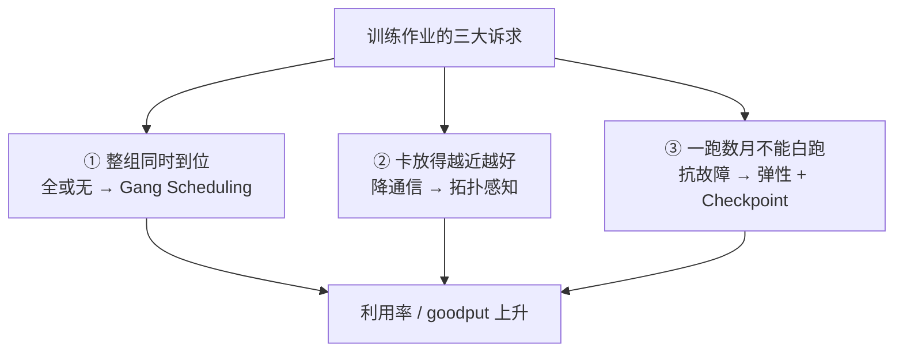
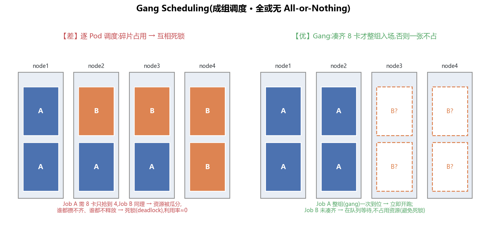
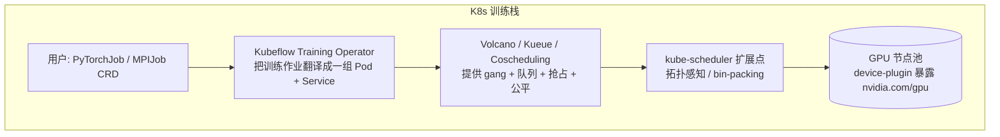
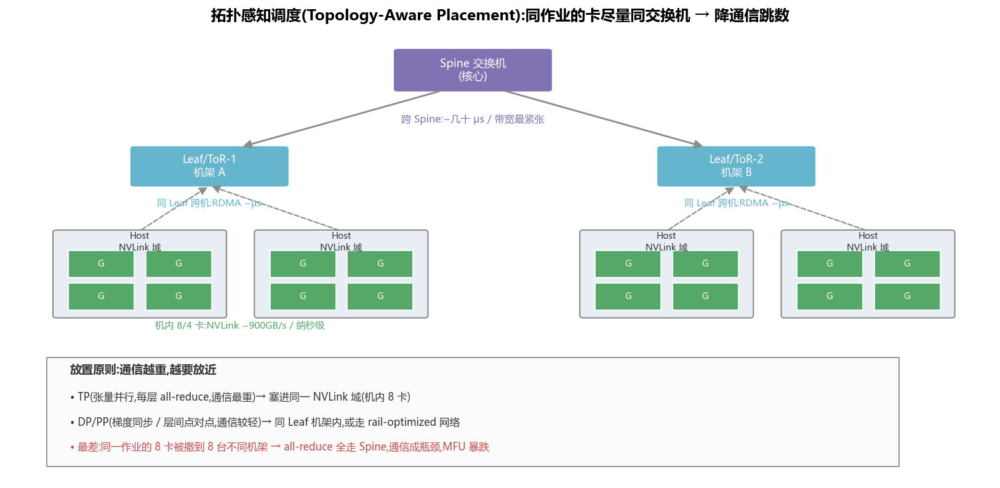
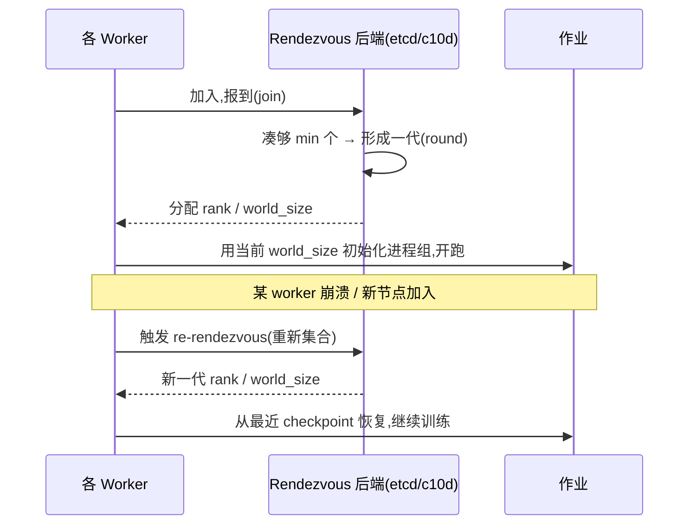
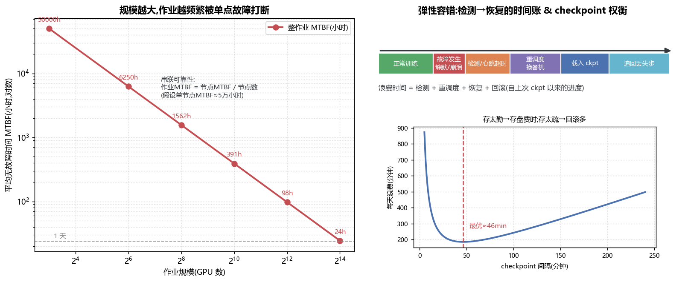
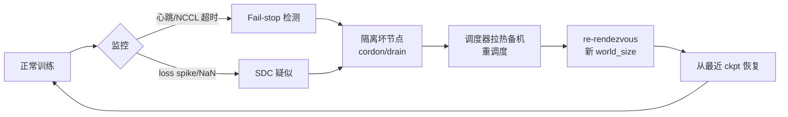
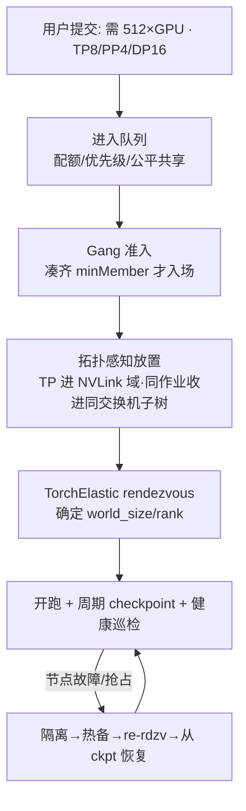

# 集群调度与编排 · k8s / Slurm · Gang · 弹性 · 容错(全面·本质)

> 前面几篇讲的是"一台机器 / 一张卡里怎么快"([02 GPU](02_GPU结构_从SM到集群_全面本质.md)、[03 CPU](03_CPU结构_流水线_乱序_缓存_多核.md)、[04 内存模型](04_内存模型_一致性_内存序_GPU与CPU.md))。本篇上升一层:**几千上万张卡怎么被"分配、排队、放到对的位置、跑挂了怎么办"**。这就是**集群调度与编排(cluster scheduling & orchestration)**——AI-Infra 里离"钱"和"利用率"最近的一层。
>
> 核心矛盾一句话:**训练作业要"整组卡同时到位、放得越近越好、还不能被单点故障拖垮";而通用调度器天生是"一个一个 Pod 慢慢塞"。** 本篇讲这条鸿沟怎么被 gang scheduling、拓扑感知、弹性容错一步步填平。

---

## 1. 🧠 为什么训练作业的调度"特别难"

先看训练作业和普通在线服务(microservice)的资源画像有多不一样:

| 维度 | 普通 Web/微服务 | 大模型训练作业 |
|---|---|---|
| 单元粒度 | 1 个 Pod = 1 个副本,**彼此独立** | N 个 worker **强耦合**,是一个整体(一次 all-reduce 少一个都不行) |
| 启动语义 | 有几个起几个,弹性伸缩 | **全或无(all-or-nothing)**:要么 N 个一起跑,要么一个都别起 |
| 资源需求 | 零碎(0.5 core / 512 MB) | 巨块(整机 8×H100 + 独占 NVLink + RDMA 网卡) |
| 通信 | 松耦合、偶发 RPC | **同步、高频、带宽敏感**(每步 all-reduce 几十 GB) |
| 运行时长 | 常驻,秒级重启 | 一跑数天~数月,重启代价巨大 |
| 失败容忍 | 挂一个副本无感 | **挂一个 worker,整个作业崩**(木桶效应) |

> 🔬 **第一性原理**:训练是一个 **同步的、紧耦合的、超长时的巨型并行程序**(BSP,Bulk Synchronous Parallel)。它对调度器提出三个通用调度器不天然满足的要求——**成组(gang)**、**放近(topology)**、**抗挂(fault tolerance)**。本篇的三个主角,正好一一对应。



---

## 2. 🎯 Gang Scheduling(成组调度 · 全或无)

### 2.1 是什么

**Gang scheduling**:把一个作业的**所有 worker 当成一个不可分割的"帮派(gang)"**,调度器要么**同时**为它们全部分配到资源、一起启动;要么**一张卡都不占**,整组在队列里等。**没有"先起一半"这种中间状态。**

### 2.2 为什么必须这样——不然会"资源死锁"

假设集群 4 台机、每台 2 卡(共 8 卡),两个作业 A、B **各需 8 卡**。通用调度器(如原生 k8s default-scheduler)是**逐 Pod** 贪心分配的:



- **左(逐 Pod 调度)**:A 先抢到 4 张、B 也抢到 4 张。现在 A 还差 4 张(被 B 占着),B 还差 4 张(被 A 占着)。**谁都攒不齐、谁都不肯释放已占的卡** → **资源死锁(resource deadlock)**,8 张卡被瓜分却**一个作业都跑不起来,GPU 利用率≈0**。
- **右(gang scheduling)**:调度器先做**准入(admission)判断**——"能不能一次凑齐 A 的 8 张?"能,就整组入场立即开跑;B 凑不齐就**在队列等待、一张卡都不占**,等 A 结束或有空位再整组入场。死锁消失。

> ⚠️ **这不是杞人忧天**:多队列高并发提交大作业时,逐 Pod 调度必然出现这种碎片死锁。这正是社区搞 **Volcano / YuniKorn / Kueue** 的头号动机。

### 2.3 关键机制:PodGroup 与 minMember

Gang 的落地靠一个抽象:**PodGroup**(一组 Pod 的元数据),核心字段是 `minMember`(最少需要几个成员才允许整组启动)。调度器凑够 `minMember` 个可用坑位,才一次性 bind;否则**预留(reserve)或全部驳回**。

```yaml
# Volcano PodGroup:声明"这 8 个 Pod 是一个帮派,凑齐 8 个才准入"
apiVersion: scheduling.volcano.sh/v1beta1
kind: PodGroup
metadata:
  name: llama-pretrain-tp8
spec:
  minMember: 8              # 全或无:少于 8 个可用坑位就不启动
  queue: research           # 归属队列(见第 4 节:配额/抢占/公平)
  priorityClassName: high
  minResources:             # 最小资源门槛(GPU/CPU/mem)
    nvidia.com/gpu: "8"
```

> 💡 **实战**:Slurm 天生就是 gang 语义——`sbatch -N 8 --gres=gpu:8` 申请的整块资源,**要么整块给你、要么排队**,不存在"先给你半块"。而 Kubernetes **默认没有 gang**,必须换 Volcano / Kueue / Coscheduling 插件补上。这是"k8s 跑训练要不要额外装东西"的根本原因。

### 2.4 一个常被忽略的副作用:资源预留导致的"空转"

Gang 为了凑齐 `minMember`,有时要**预留(reserve)已到位的坑位、等剩下的凑齐**。这段等待里,**被预留的卡是空着的**(不能给小作业用),换来的是避免死锁。这叫 **starvation vs deadlock 的权衡**:调度器要用 **backfill(回填)**——在预留的大作业等待间隙,塞进能在预留时间前跑完的小作业,把空转填掉。

| 策略 | 好处 | 代价 |
|---|---|---|
| 纯逐 Pod | 无空转 | **死锁风险**、大作业饿死 |
| Gang + 预留 | 无死锁 | 预留期间**部分卡空转** |
| Gang + 预留 + **Backfill** | 无死锁 + 填补空转 | 调度器复杂度高 |

---

## 3. ⚖️ Slurm vs Kubernetes(+ Volcano / Kubeflow)

两大阵营,起点完全不同:**Slurm 从 HPC(超算)长出来,天生为批处理大作业;k8s 从云原生微服务长出来,天生为长驻服务**,靠生态插件才补齐训练能力。

### 3.1 血统对比

| 维度 | **Slurm** | **Kubernetes(原生)** | **k8s + Volcano/Kueue** |
|---|---|---|---|
| 出身 | HPC 超算批处理 | 云原生在线服务 | 云原生 + 批调度补丁 |
| 调度语义 | **天生 gang / 独占整机** | 逐 Pod、共享 | 补上 gang(PodGroup) |
| 提交方式 | `sbatch` / `srun` 脚本 | YAML manifest / Operator | `Job`+`PodGroup` / CRD |
| 队列/配额 | Partition + QOS + Fairshare | Namespace + ResourceQuota(弱) | Queue + 层级配额 + 公平 |
| 抢占 | 成熟(QOS 抢占) | 需 PriorityClass,较弱 | 成熟(队列间借用/回收) |
| 拓扑感知 | `--switches`、topology.conf | 需 topology plugin / NodeLabel | topology-aware plugin |
| 弹性伸缩 | 偏静态(需脚本) | 强(HPA/CA,面向服务) | 面向训练的弹性(见 §5) |
| 生态 | MPI/科学计算深 | 容器/云/CI-CD 深、镜像即环境 | 两者兼得 |
| 多租户隔离 | account/QOS | Namespace/RBAC/NetworkPolicy | 队列 + RBAC |

> 🔬 **本质区别**:Slurm 把"**一台机器**"当作调度单元、进程直接跑在裸机(bare-metal)上,**离硬件近、开销小、gang 天然**;k8s 把"**一个容器 Pod**"当调度单元,**环境即镜像、可移植、弹性强、生态好**,但要靠插件把"批处理 + gang + 拓扑 + 弹性"这套 HPC 传统补回来。

### 3.2 Kubernetes 训练生态版图



- **Kubeflow Training Operator**:提供 `PyTorchJob`/`TFJob`/`MPIJob` 等 CRD,自动把"一个训练作业"展开成 **master + N×worker** 的 Pod 集合,注入 `MASTER_ADDR`、`WORLD_SIZE`、`RANK` 等分布式环境变量,并管理生命周期。**它负责"作业模型",不负责"怎么调度"。**
- **Volcano**:CNCF 的批调度器,补上 **gang(PodGroup)+ 队列 + 抢占 + 公平共享 + 拓扑**。是 k8s 上跑训练最主流的调度器。
- **Kueue**:更"云原生亲和"的队列/配额层(不替换 kube-scheduler,做准入 + 配额借用),近年上升很快。
- **device-plugin**:让 k8s 识别 `nvidia.com/gpu` 这种扩展资源;配 **MIG / time-slicing** 可做单卡切分。

```yaml
# Kubeflow PyTorchJob:1 master + 7 worker = 8 卡张量并行作业
apiVersion: kubeflow.org/v1
kind: PyTorchJob
metadata: { name: llama-tp8 }
spec:
  pytorchReplicaSpecs:
    Master: { replicas: 1, template: { spec: { containers: [{ resources: { limits: { nvidia.com/gpu: 1 } } }] } } }
    Worker: { replicas: 7, template: { spec: { containers: [{ resources: { limits: { nvidia.com/gpu: 1 } } }] } } }
  # 配合 Volcano:schedulerName: volcano + 自动生成 minMember=8 的 PodGroup
```

---

## 4. 🗂️ 队列 / 抢占 / 优先级 / 公平共享

集群是**多租户(multi-tenant)**的:研究、预训练、评测、临时实验都来抢同一批卡。这套"谁先跑、谁让谁"的规则,是调度器的**政治学**。

### 4.1 四个概念一次讲清

| 概念 | 是什么 | 解决什么 | 代价/坑 |
|---|---|---|---|
| **队列 Queue / Partition** | 作业按业务线分组排队,每队有**配额(quota)** | 资源分组、隔离、限流 | 配额定太死→整体利用率低 |
| **优先级 Priority** | 每作业一个数值,高优先先调度/可抢占低优 | 保障关键作业 | 优先级反转、低优饿死 |
| **抢占 Preemption** | 高优来了,**踢掉(evict)** 正在跑的低优,腾出资源 | 让高优不等 | 被踢作业**丢进度**(须能 checkpoint) |
| **公平共享 Fairshare** | 按历史用量动态调优先级,**用得多的降权**,让长期分配趋于配额比例 | 防大户长期霸占 | 计算复杂、需衰减窗口 |

> ⚠️ **抢占最大的坑:被踢的作业必须"踢得起"**。如果被抢占的训练作业没有 checkpoint,抢占=**几小时进度直接蒸发**。所以**抢占策略和 checkpoint 频率是绑定设计的**——生产上常配置"高优抢占时,先给被踢作业一个 grace period 触发一次紧急 ckpt 再 kill"。

### 4.2 公平共享的本质:借用 + 回收(borrow & reclaim)

现代批调度(Volcano/Kueue/YuniKorn)的核心思想不是"死配额",而是 **弹性配额**:

- 每队有 **guaranteed(保底)** 和 **max(上限)**。
- 队里没作业时,**空闲配额借给别的队**用满(提高整体利用率)。
- 保底队一来活,**回收(reclaim/preempt)** 被借走的资源。

```
DRF(Dominant Resource Fairness,主导资源公平):
  多维资源(GPU/CPU/mem)下,按每个用户"最紧张那一维"的占比来均衡。
  → 避免"申请 CPU 多的用户"和"申请 GPU 多的用户"没法比较的问题。
```

> 💡 **面试高频**:"队列配额定死 vs 弹性借用怎么选?" → 定死简单但利用率低(空闲卡不给别人用);弹性借用利用率高,但要有**可靠的抢占+ckpt**兜底,否则回收时被踢的作业白跑。**大厂几乎都走弹性借用 + 层级队列 + DRF**。

---

## 5. 📍 拓扑感知调度(Topology-Aware Placement)

Gang 保证"卡够、一起上",但**没说卡放哪**。对训练,**"放哪"直接决定通信瓶颈**。

### 5.1 为什么位置这么关键

回顾 [02 GPU 篇](02_GPU结构_从SM到集群_全面本质.md)的互联层级——带宽差**一到两个数量级**:

| 互联层级 | 带宽(量级) | 延迟 | 范围 |
|---|---|---|---|
| 机内 NVLink/NVSwitch | ~900 GB/s | 纳秒级 | 同机 8 卡 |
| 同机架 RDMA(同 Leaf/ToR) | ~400 Gb/s/口 (~50 GB/s) | ~µs | 同 ToR 交换机 |
| 跨机架(过 Spine) | 收敛比受限,更紧张 | ~几十 µs | 跨机架 |

同一个作业的卡若被撒到不同机架,**每一步 all-reduce 都要翻越最慢的那段链路**——木桶效应下,通信被最远的那对卡拖死。



### 5.2 放置原则:通信越重,越要放近

$$T_{\text{step}} = \max(T_{\text{compute}},\; T_{\text{comm}}),\qquad T_{\text{comm}} \propto \frac{\text{通信量}}{\text{有效带宽}}$$

有效带宽被**最慢的一跳**决定。于是放置策略要和并行策略对齐(见 [02 篇](02_GPU结构_从SM到集群_全面本质.md)"TP 机内、DP/PP 机间"):

- **TP(张量并行)**:每层前向/反向都要 all-reduce,**通信最重** → **必须塞进同一 NVLink 域(机内 8 卡)**。
- **PP(流水并行)**:只在 stage 边界点对点传 activation,**通信较轻** → 同机架内或相邻机架即可。
- **DP(数据并行)**:每步一次梯度 all-reduce,量大但可与反向重叠 → **rail-optimized 网络**(把各机同号网卡接到同一 rail 交换机,让 all-reduce 走高带宽 rail)。

> 🔬 **本质**:调度器要理解**物理拓扑树(Spine→Leaf→Host→GPU)**,把一个作业的 gang **尽量收进同一子树**(同交换机),让最重的通信留在最快的链路上。Slurm 用 `topology.conf` + `--switches=1` 表达"我要这组节点在同一台交换机下";k8s 侧用 **node label(rack/zone)+ 拓扑插件**做同样的事。

### 5.3 装箱策略:bin-packing(紧凑)vs spread(打散)

放置还有一个正交维度——**同一台机器该塞满还是留空**:

| 策略 | 做法 | 适合 | 代价 |
|---|---|---|---|
| **Bin-packing(紧凑装箱)** | 优先塞满已用机器,再开新机 | **训练**:整机独占、通信近、空出整机给下一个大作业 | 单机故障域大 |
| **Spread(打散)** | 副本尽量分散到不同机/机架 | **在线服务**:容灾、避免单机挂掉全崩 | 通信远、碎片多 |

> 🔬 **本质对立**:训练要 **bin-packing**(把 8 卡作业收进一台机吃满 NVLink,并让集群"整机"这个大坑保持完整,方便下一个大 gang 入场);在线服务要 **spread**(副本散开抗故障)。**同一个调度器对训练和服务要用相反的打分函数**——这也是为什么很多公司把"训练池"和"推理池"物理/逻辑分开管理。

### 5.4 碎片与 GPU 共享:MIG / time-slicing

训练要**整卡独占**;但评测、调试、小模型微调只用**半张卡**就够。若不共享,一堆小任务把整卡占着 → **碎片化(fragmentation)**、利用率低。两种共享手段:

- **MIG(Multi-Instance GPU)**:把一张 A100/H100 **硬件切成最多 7 个隔离实例**(各有独立 SM/显存/带宽配额),**强隔离**、互不干扰 → 适合多租户共享跑小任务。
- **Time-slicing(时间片)**:多个进程**分时复用**同一张卡,软隔离、**无显存隔离**(可能 OOM 互踩)→ 适合信任域内的开发/调试。

> ⚠️ **训练作业绝不用共享卡**:MIG 切片砍掉了 NVLink 全互联和满带宽,time-slicing 又会被别的进程抢占算力抖动。**共享只服务于"填碎片的小任务",让训练大作业始终拿整卡整机。**

```bash
# Slurm:要求 16 个节点尽量落在同一台交换机下(最多跨 1 台),否则最多等 30 分钟
sbatch -N 16 --switches=1@30:00 --gres=gpu:8 train.sh
```

### 5.3 收益量级

拓扑感知能把大规模训练的 **MFU(Model FLOPs Utilization)** 从"卡被打散"的 30~40% 拉回 50~60%+。**通信占比越高(TP 度大 / 序列长 / 集群大),拓扑放置的收益越显著。** 反过来,若作业小到装进单机 8 卡,拓扑感知基本无感——**收益随规模放大**。

---

## 6. 🔄 弹性训练(Elastic Training)

### 6.1 是什么、为什么

**弹性训练**:允许训练作业在运行中**动态增减 worker 数量**而**不整体重启**——

- **缩容(scale-down)**:某节点故障/被抢占,作业**不崩**,用剩下的节点继续跑(降级但活着)。
- **扩容(scale-up)**:有空闲卡释放出来,自动把它们**加进**正在跑的作业提速。
- **抗抢占**:配合弹性配额,低优作业被借用资源时可缩,回收时可扩,**长期高利用**。

> ⚠️ **弹性的代价:数学语义会变**。worker 数变了 → 全局 batch size 变 → 有效学习率/BN 统计/梯度累积步数都受影响。**弹性不是"免费拔插卡"**,必须让训练脚本在 world size 改变时重算这些超参(如按 world size 线性缩放 lr、或固定 global batch 反调 micro-batch)。

### 6.2 怎么做:rendezvous(汇合)机制

PyTorch 的 **TorchElastic(`torchrun`)** 是事实标准。核心是 **rendezvous**:所有 worker 通过一个共享后端(etcd / c10d)"点名集合",**动态确定当前有几个人(world size)、每个人排第几(rank)**。有人掉线→触发**重新集合**→用新的 world size 继续。



```bash
# TorchElastic:允许 worker 数在 [6,8] 间弹性伸缩,rdzv 后端做汇合
torchrun \
  --nnodes=6:8 \
  --nproc_per_node=8 \
  --rdzv_backend=c10d \
  --rdzv_endpoint=$MASTER:29400 \
  --max_restarts=5 \
  train.py
```

### 6.3 弹性 ≠ 容错,但两者协同

- **弹性**解决"人数能变";**容错**解决"变的时候不丢进度"。二者靠 **checkpoint** 缝合:re-rendezvous 后**从最近 ckpt 恢复**,用新 world size 继续。
- 层次:**进程级重启(torchrun `--max_restarts`)→ 节点级替换(调度器换备机)→ 作业级恢复(从 ckpt)**,由内到外逐级兜底。

---

## 7. 💥 大规模训练的故障率、MTBF 与静默错误

规模一大,"偶发故障"变成"家常便饭"。这是万卡训练最反直觉、也最烧钱的一面。

### 7.1 串联可靠性:规模越大,越频繁挂

训练作业是**串联系统(series system)**:**任意一个节点挂,整个作业挂**(木桶效应)。若单节点平均无故障时间为 $\text{MTBF}_{\text{node}}$,作业有 $n$ 个节点,则:

$$\text{MTBF}_{\text{job}} \approx \frac{\text{MTBF}_{\text{node}}}{n}$$



**左图**:假设单节点 MTBF ≈ 5 万小时(含 GPU/HBM/网卡/光模块/电源/散热),8 卡/节点。作业规模一涨,整作业 MTBF 断崖式下跌:

| 作业规模 | 节点数 | 整作业 MTBF | 直觉 |
|---|---|---|---|
| 64 卡 | 8 | ~6250 h(~260 天) | 基本无感 |
| 1024 卡 | 128 | ~391 h(~16 天) | 半月一挂 |
| 4096 卡 | 512 | ~98 h(~4 天) | 每周挂 |
| 16384 卡 | 2048 | ~24 h(**~1 天**) | **天天挂** |

> 🔬 **本质**:万卡训练里"**跑几天从不出错**"是不存在的。业界公开数据佐证——Meta 训 Llama-3 的 16K H100 集群,**平均每约 3 小时一次中断**;单卡/光模块/HBM ECC 是主要元凶。所以**"故障是常态、恢复要自动"**是万卡训练的设计前提,不是可选项。

### 7.2 故障的两种面孔:崩溃 vs 静默

| 类型 | 表现 | 检测难度 | 危害 |
|---|---|---|---|
| **Fail-stop(崩溃/挂死)** | 进程退出、节点掉线、NCCL 超时、心跳丢失 | **易**(有信号) | 明确,能立刻触发恢复 |
| **Silent Data Corruption(SDC,静默数据损坏)** | 硬件算错但**不报错**:某次乘加结果 bit 翻转、HBM 弱位、ALU 偶发错 | **极难**(无信号) | **有毒**:错误值随梯度扩散,loss 悄悄发散或收敛到坏点,**回溯定位极贵** |

> ⚠️ **静默错误(SDC)是大规模训练的"幽灵"**。Google/Meta 都公开过:海量芯片里总有极少数"**mercurial cores(水银核)**"会在特定输入下偶发算错却不报警。表现是 **loss 突然尖刺(spike)或 NaN**,但根因不在代码、在某张卡的某个单元。
>
> **对策**:① **loss/grad-norm 异常监控**(spike 自动回滚);② **确定性重算校验**(同输入在另一卡复算比对);③ **定期健康巡检**(NCCL all-reduce 自检、matmul 校验、ECC 计数);④ 疑似坏节点**拉黑(drain/cordon)** 换备机。

### 7.3 检测 → 恢复的时间账(右图)

一次故障浪费的时间由四段构成:

$$T_{\text{lost}} = \underbrace{T_{\text{detect}}}_{\text{检测/心跳超时}} + \underbrace{T_{\text{resched}}}_{\text{重调度换备机}} + \underbrace{T_{\text{load}}}_{\text{载入 ckpt}} + \underbrace{T_{\text{redo}}}_{\text{回滚重算(自上次 ckpt)}}$$

- $T_{\text{detect}}$:靠**心跳 / NCCL watchdog 超时**发现,几十秒~几分钟。设太短→误杀(网络抖动),太长→白等。
- $T_{\text{resched}}$:调度器从**热备池(hot spare)** 拉一台好机顶上。**有备机秒级、无备机要等**。
- $T_{\text{redo}}$:**回滚量 = 自上次 checkpoint 以来的进度**,平均是 ckpt 间隔的一半。

### 7.4 Checkpoint 频率的最优权衡

**存太勤**→存盘本身耗时(几十 GB~TB 级权重+优化器状态,写盘/传对象存储费时,还会 stall 训练);**存太疏**→一挂回滚一大片。存在最优点:

$$\text{每日浪费} \approx \underbrace{\frac{1440}{T_{\text{ckpt}}}\cdot c_{\text{save}}}_{\text{存盘开销}} + \underbrace{\frac{T_{\text{ckpt}}}{2}\cdot f_{\text{fail}}}_{\text{期望回滚}} \;\Rightarrow\; T_{\text{ckpt}}^{*}=\sqrt{\frac{2\,c_{\text{save}}\cdot 1440}{f_{\text{fail}}}}$$

右图取每次存盘 3 min、每天故障 4 次,算出**最优间隔≈46 min**。这就是著名的 **Young/Daly 公式** 的直觉:**最优 ckpt 间隔 ≈ √(2 × 存盘成本 × MTBF)**——故障越频繁(MTBF 越小)、存盘越便宜,就该存得越勤。

> 💡 **工程加速**:① **异步/分层 checkpoint**(先落本地 NVMe/内存,再后台异步刷对象存储,把 $c_{\text{save}}$ 打到近乎为 0,如 DeepSpeed、Nebula、CheckFreq);② **分布式分片 ckpt**(每 rank 只存自己那片,别汇聚到单点);③ **in-memory / 冗余副本**(把 ckpt 存到邻居显存,省掉磁盘往返);④ **只重算不重启**(TorchElastic 进程级重启,省掉整作业冷启)。

### 7.5 全景:一次故障的自动恢复闭环



---

## 8. 🧩 把三件事拼起来:一个健壮训练平台的调度全景



| 诉求 | 机制 | 典型实现 |
|---|---|---|
| 整组到位、防死锁 | Gang / PodGroup | Slurm 天生 · Volcano/Kueue |
| 多租户排队、借用、抢占 | 队列 + 配额 + 优先级 + DRF 公平 | Slurm QOS/Fairshare · Volcano Queue |
| 卡放近、降通信 | 拓扑感知放置 | Slurm topology.conf · k8s 拓扑插件 |
| 人数可变、不重启 | 弹性 + rendezvous | TorchElastic(`torchrun`) |
| 挂了自动恢复、少丢进度 | 检测 + 热备 + checkpoint | 心跳/NCCL watchdog + 异步分片 ckpt |
| 静默错误 | 监控 + 校验 + 拉黑 | loss/grad 监控 + 巡检 + drain |

---

## 📌 本质小结

1. **训练作业 = 同步紧耦合的巨型并行程序(BSP)**,对调度提出三诉求:**成组、放近、抗挂**——通用调度器不天然满足。
2. **Gang scheduling(全或无)** 解决"整组同时到位",消除**资源死锁**;PodGroup + `minMember` 是落地抓手;代价是预留空转,靠 **backfill** 填补。
3. **Slurm(HPC 血统,gang 天生、离硬件近)vs k8s(云原生,靠 Volcano/Kubeflow 补齐批调度)**——各有取舍,大厂常两者并存。
4. **队列/优先级/抢占/公平**是多租户的政治学;现代做法是**弹性配额 + 借用回收 + DRF**,抢占必须与 **checkpoint** 绑定设计。
5. **拓扑感知**把作业的卡收进同一交换机子树,让最重的通信(TP)留在最快的链路(NVLink)——**收益随规模放大**。
6. **弹性训练**让 world size 可增减不重启(rendezvous),但会改变数学语义(batch/lr 需重算)。
7. **万卡训练故障是常态**:MTBF ≈ 节点MTBF/节点数,万卡级"天天挂";**静默错误(SDC)**是最难缠的幽灵;恢复靠**检测+热备+从 ckpt 回滚**,ckpt 频率有**√(2·存盘·MTBF)** 的最优点。

## 💡 面试高频

- **"为什么训练要 gang scheduling?不用会怎样?"** → all-or-nothing;逐 Pod 会资源死锁,利用率归零。
- **"Slurm 和 k8s 跑训练的区别?"** → Slurm gang 天生/离硬件近/HPC 血统;k8s 弹性生态好但需 Volcano/Kueue 补 gang+队列+拓扑。
- **"拓扑感知调度解决什么?"** → 让同作业的卡尽量同交换机,把最重通信(TP)留在 NVLink,提 MFU。
- **"弹性训练怎么实现?代价是什么?"** → rendezvous 动态定 world_size;代价是 batch/lr 语义变、需配 ckpt 恢复。
- **"万卡训练为什么老挂?MTBF 怎么估?"** → 串联可靠性 MTBF≈节点MTBF/节点数;万卡日级。
- **"什么是静默错误?怎么防?"** → SDC,硬件算错不报警;靠 loss/grad 监控 + 复算校验 + 巡检拉黑。
- **"checkpoint 多久存一次最优?"** → Young/Daly:≈√(2×存盘成本×MTBF);异步分片 ckpt 把存盘成本打到近 0。

## ⚠️ 常见坑速查

- 抢占**没配 checkpoint** → 被踢作业进度全丢。
- gang 的 `minMember` 设错(> 实际可用)→ 作业永远排队。
- 拓扑标签(rack/switch label)不准 → 拓扑感知形同虚设,卡被打散。
- 弹性伸缩**没同步调 lr/batch** → loss 悄悄跑偏。
- ckpt 存在**单点/同步阻塞** → 存盘 stall 拖慢训练、或坏盘丢档;要**异步 + 分片 + 冗余**。
- 心跳超时设太短 → 网络抖动误杀健康作业。

## 🔗 延伸

- 通信为何机内机外差一个数量级、TP/DP/PP 怎么映射硬件:[`02_GPU结构_从SM到集群_全面本质.md`](02_GPU结构_从SM到集群_全面本质.md)(互联与 roofline)
- 推理侧的"另一种调度"(把两阶段拆到不同 GPU 池):[`01_PD分离架构_Prefill_Decode_Disaggregation.md`](01_PD分离架构_Prefill_Decode_Disaggregation.md)
- 同步语义 / 内存序为何决定 all-reduce 正确性:[`04_内存模型_一致性_内存序_GPU与CPU.md`](04_内存模型_一致性_内存序_GPU与CPU.md)、CPU 侧 [`03_CPU结构_流水线_乱序_缓存_多核.md`](03_CPU结构_流水线_乱序_缓存_多核.md)
- 分布式训练全景 / 5D 并行:`../ultra-scale-playbook`(如已建)
- 推理引擎与连续批处理:`../llm-inference/`(`continuous-batching`、`PagedAttention` 等)
- 动手:`projects/` 下的调度/带宽实测(见本目录 [README](README.md))、CUDA 算子 `../../Enigneer-infra/cuda-mastery`(如有)
