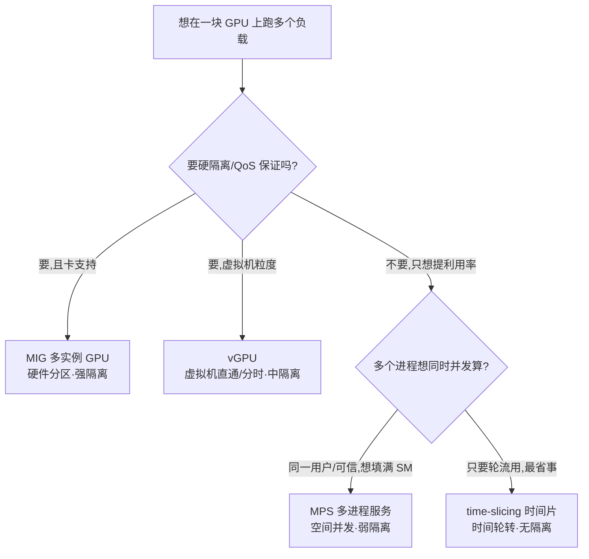
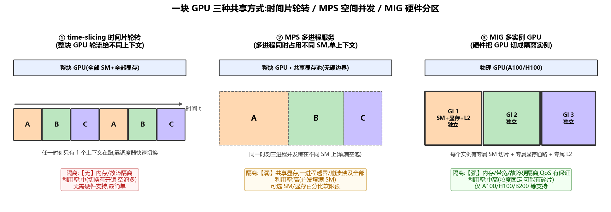
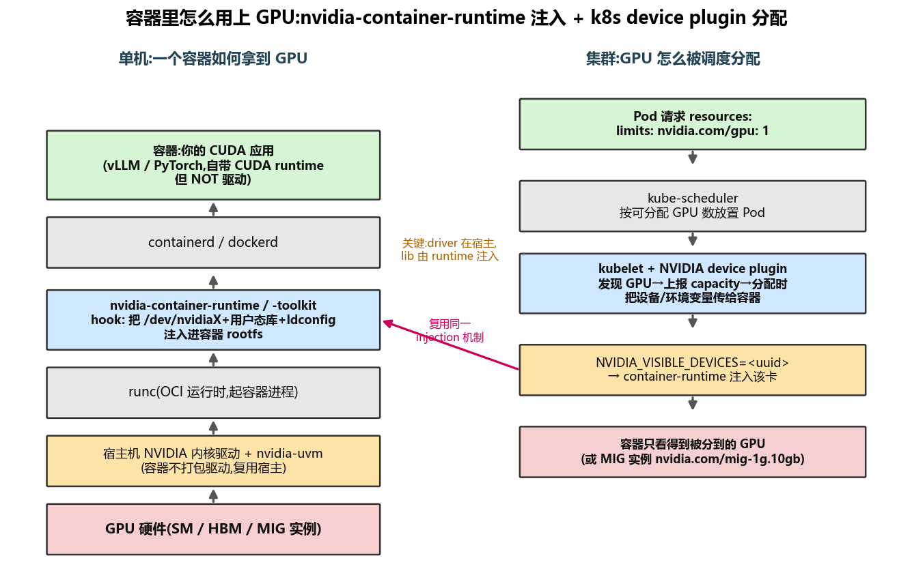
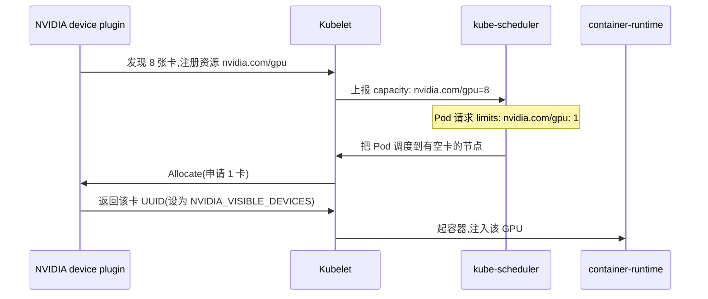
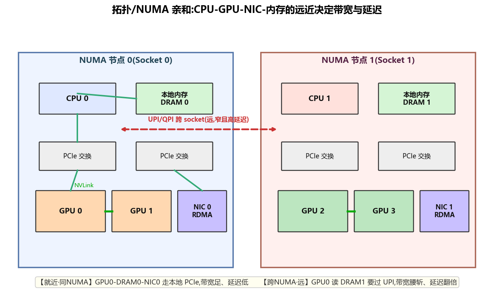
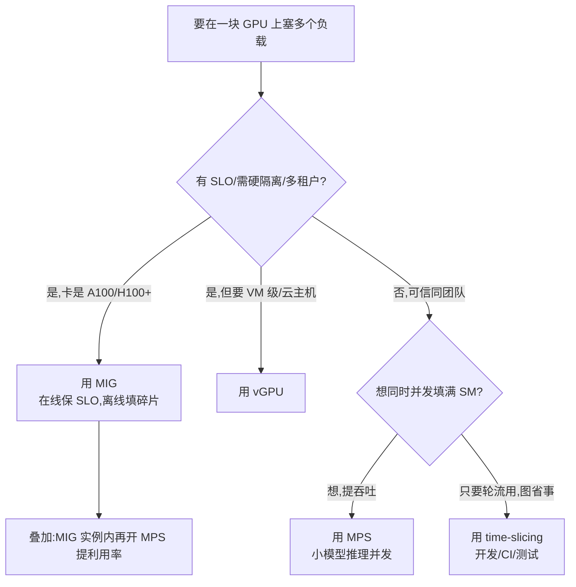

# GPU 虚拟化与共享 · MIG / MPS / time-slicing / 容器 GPU(全面·本质)

> 一块 H100 十几万块钱,却经常只用到 20% 算力——**推理小模型、开发调试、批量小作业**都喂不满它。于是有了一整套"把一块 GPU 切给多个负载"的技术。本篇讲透四条路线(**time-slicing 时间片 / MPS 多进程 / MIG 硬件分区 / vGPU 虚拟化**)的本质、隔离性、利用率与代价,再讲**容器/K8s 怎么把 GPU 交到你手里**,以及**拓扑/NUMA 亲和**为什么能再榨一截性能。

---

## 1. 🧠 为什么要共享 GPU:利用率的经济学

先算一笔账。GPU 是数据中心里**最贵**的东西,但很多负载天生喂不满它:

| 负载 | 典型 GPU 利用率 | 为什么喂不满 |
|---|---|---|
| **小模型推理**(7B 以下、embedding、rerank、ASR/TTS) | 5%–30% | 模型小、batch 小,SM 和显存都用不完 |
| **开发/调试/Notebook** | <10%(大量空闲) | 人在写代码,GPU 大部分时间在发呆 |
| **CI/单测/离线批处理** | 波动大 | 短作业,启动-算-退出,间歇占用 |
| **在线服务低峰期** | 白天高、夜里低 | 请求量随昼夜波动 |

> 🔬 **第一性原理**:GPU 成本 ≈ 固定折旧(买来就在烧钱)。**有效产出 = 利用率 × 时间**。若单个负载只用 20%,那 80% 的折旧就白白蒸发了。**共享**的目标就是把这 80% 卖给别的负载,把"每块钱买到的算力"(perf/$)拉上去。

**共享带来的三类收益:**
1. **提利用率 / 降成本**:多个小负载塞进一块卡,少买卡。
2. **弹性密度**:开发平台上一块卡开出 7 个 Notebook,人人有 GPU。
3. **隔离保 QoS**(仅 MIG/vGPU):在线服务 + 离线批处理混部,还能保证在线服务的延迟不被抖动。

**但共享不是免费的**,核心矛盾是一对 trade-off:

$$\text{隔离性(isolation)} \;\longleftrightarrow\; \text{利用率(utilization)}$$

隔离越强 → 边界越硬 → 越难把碎片填满(利用率打折);隔离越弱 → 越能填满 → 但一个负载崩了/超用会殃及邻居(**吵闹的邻居 noisy neighbor**)。四条路线就是在这条轴上取不同的点。

---

## 2. 🗺️ 四条路线总览



一句话记住四者的**本质切法**:

| 路线 | 切的是什么维度 | 一句话 |
|---|---|---|
| **time-slicing** | **时间**(谁先谁后轮流) | 整块卡轮流给不同上下文,靠调度器快切 |
| **MPS** | **空间**(SM 同时瓜分) | 多进程**同时**跑在不同 SM,合并成一个上下文,填满空泡 |
| **MIG** | **硬件**(物理切成小卡) | 芯片级把 SM+显存+L2 切成互不干扰的"小 GPU" |
| **vGPU** | **虚拟机**(hypervisor 分配) | 给每个 VM 一个虚拟 GPU,底层可分时或走 MIG |



---

## 3. ⏱️ time-slicing(时间片轮转):最简单、无隔离

**是什么**:GPU 本来就支持多个进程/上下文(context)提交任务,GPU 的调度器在它们之间**按时间片轮流**执行——同一时刻整块 GPU 归一个上下文,时间到了切下一个。这是 GPU 最原始、**任何卡都支持**的共享方式。

**怎么用**:裸机上多进程直接跑就是隐式 time-slicing。在 K8s 里用 NVIDIA device plugin 的 `time-slicing` 配置,把 1 块物理 GPU **超额上报**成 N 份:

```yaml
# NVIDIA k8s-device-plugin: 把每块 GPU 复制成 4 份"时间片副本"
version: v1
sharing:
  timeSlicing:
    replicas: 4          # 1 张卡 → 上报 nvidia.com/gpu: 4
```

这样 4 个 Pod 都以为自己拿到"一块 GPU",实际共用一块、轮流跑。

**代价 / 坑:**
- ⚠️ **无内存隔离**:4 个 Pod 共享同一显存空间,一个 Pod OOM/占满显存会**拖垮全部**;没有显存配额。
- ⚠️ **无性能隔离**:一个长 kernel 会阻塞其他上下文,延迟抖动大(**上下文切换有开销**,还会冲刷 L2)。
- ⚠️ **无故障隔离**:一个进程 GPU 崩了(XID error)可能影响同卡其他进程。

> 💡 **实战**:time-slicing 最适合**开发/测试/CI 这类可信、不苛求 QoS 的场景**——图省事、图密度。**绝不要**用它做有 SLO 的在线服务混部。

---

## 4. 🔀 MPS(Multi-Process Service):空间并发,提利用率

**是什么**:普通 time-slicing 下多进程是"轮流";**MPS** 则让多个进程的 kernel **真正同时**跑在**不同的 SM** 上——它把多个进程的 CUDA context **合并成一个**共享 context 提交给 GPU,于是硬件可以把 A 进程的 kernel 和 B 进程的 kernel 并发调度,**填满彼此的空泡**。

**为什么能提利用率**:单个小负载(如 batch=1 的小模型推理)只用得到几个 SM,剩下几十个 SM 闲着。MPS 让另一个进程的 kernel 占用那些闲置 SM → 整卡吞吐显著提升。

**怎么用**:

```bash
# 1) 启动 MPS 控制守护进程(每块 GPU 一个)
export CUDA_VISIBLE_DEVICES=0
nvidia-cuda-mps-control -d          # 后台守护

# 2) 之后该卡上启动的 CUDA 进程会自动接入 MPS server
#   (可选)限制单个客户端最多用多少比例的 SM / 显存:
export CUDA_MPS_ACTIVE_THREAD_PERCENTAGE=50   # 该 client 最多用 50% 的 SM
export CUDA_MPS_PINNED_DEVICE_MEM_LIMIT=0=10G # 该 client 显存上限 10G(Volta+)
```

**关键旋钮:**
- `CUDA_MPS_ACTIVE_THREAD_PERCENTAGE`:给每个 client **软性**限制可用 SM 比例(Volta+ 支持"execution resource provisioning"),做粗粒度算力隔离。
- `CUDA_MPS_PINNED_DEVICE_MEM_LIMIT`:限制单 client 显存,**缓解**(但不硬保证)OOM 互殴。

**代价 / 坑:**
- ⚠️ **弱隔离**:所有 client 共享同一个 GPU 地址空间。**一个进程写越界/崩溃可能污染或拖垮整个 MPS server → 殃及同卡所有进程**。
- ⚠️ **故障放大**:MPS server 挂了,接在上面的 client 全挂。
- ⚠️ **不适合不可信多租户**:没有内存保护边界。适合**同一用户/同一团队的可信作业**。

> 🔬 **本质**:MPS 用"牺牲隔离"换"并发填满 SM"。它和 time-slicing 的根本区别是——**time-slicing 是时间维度轮流(同一时刻 1 个),MPS 是空间维度并发(同一时刻多个各占部分 SM)**。看图1 面板 ① vs ② 一目了然。

**一个直观的量级(小模型推理,示意)**:假设单进程 batch=1 只用满 ~15% SM、整卡吞吐 100 req/s。把多进程塞进来:

| 并发进程数 | time-slicing 总吞吐 | MPS 总吞吐 | 说明 |
|---|---|---|---|
| 1 | 100 req/s | 100 req/s | 基准 |
| 4 | ~95 req/s(切换开销略降) | **~330 req/s** | MPS 并发填满 SM,近线性到饱和 |
| 8 | ~90 req/s | **~450 req/s** | 接近整卡算力上限,增益放缓 |

> time-slicing 是"轮流用同一块算力",总量几乎不变还略降;MPS 是"同时用不同 SM",能把闲置算力真正利用起来 → **这就是 MPS 提利用率的价值所在**(具体数字取决于模型/kernel,能否近线性看单进程占了多少 SM)。

> 💡 **面试高频**:"MPS 和 time-slicing 区别?" → 一个空间并发(同时,提利用率)、一个时间轮流(不同时);MPS 隔离更弱但吞吐更高。

---

## 5. 🧱 MIG(Multi-Instance GPU):硬件分区,强隔离

**是什么**:从 **Ampere(A100)** 起,NVIDIA 在芯片层面把一块 GPU **物理切成最多 7 个独立实例(GPU Instance, GI)**,每个实例有**专属的 SM 切片、专属的显存通道与容量、专属的 L2 缓存片、专属的显存带宽**。切完之后,每个实例在操作系统/CUDA 眼里就是**一块独立的小 GPU**,有自己的设备节点。

> 🔬 **本质**:MIG 不是软件调度,而是**在数据通路上加了硬件隔墙**——A 实例的访存走 A 的显存控制器和 L2 片,**物理上到不了** B 的显存。所以它给出**内存隔离 + 带宽/QoS 隔离 + 故障隔离**,是唯一能安全做**不可信多租户**的方案。

**切分是分层的**:GPU 先切成 **GI(GPU Instance,含 SM+显存+L2)**,GI 内再切 **CI(Compute Instance,只切算力,共享该 GI 的显存)**。粒度以 GPU 的"切片单位"计:A100 有 7 个 SM 切片 + 8 个显存切片。

**A100(40GB)常见 MIG profile:**

| Profile | SM 切片 | 显存 | 一卡最多几个 | 用途 |
|---|---|---|---|---|
| `1g.5gb` | 1/7 | 5 GB | **7** | 最小实例,小模型/embedding |
| `2g.10gb` | 2/7 | 10 GB | 3 | 中等推理 |
| `3g.20gb` | 3/7 | 20 GB | 2 | 较大推理 |
| `4g.20gb` | 4/7 | 20 GB | 1(+剩余) | — |
| `7g.40gb` | 7/7 | 40 GB | 1 | 整卡(等于不切) |

> 80GB 的 A100/H100 profile 显存翻倍(`1g.10gb` … `7g.80gb`);H100 还有带更多 L2/copy engine 的变体(如 `1g.10gb+me`)。

**怎么用:**

```bash
# 开启 MIG 模式(需要重置 GPU,drain 掉所有进程)
sudo nvidia-smi -i 0 -mig 1

# 创建 GPU Instance:7 个 1g.5gb
sudo nvidia-smi mig -i 0 -cgi 1g.5gb,1g.5gb,1g.5gb,1g.5gb,1g.5gb,1g.5gb,1g.5gb -C

# 查看切出来的实例(每个有独立 UUID: MIG-xxxx)
nvidia-smi -L
# 用某个 MIG 实例跑任务:
CUDA_VISIBLE_DEVICES=MIG-GPU-xxxx/1/0  python infer.py
```

**代价 / 坑:**
- ⚠️ **切分是静态的**:切好 profile 要跑负载前配好;**动态改切分需要 drain GPU + 重配**,不能像 MPS 那样随进程来去弹性伸缩。
- ⚠️ **有碎片**:粒度固定(1/7、2/7…),负载需求若不是整数份,会浪费("装箱问题")。
- ⚠️ **实例内不能再用 NVLink 跨实例通信**;单个 MIG 实例**不能**做多卡张量并行(它就是一小块)。
- ⚠️ **只有特定卡支持**:A100 / A30 / H100 / H200 / B200 等数据中心卡;消费卡(RTX)**不支持** MIG。

> 💡 **实战典型**:在线推理服务用 `3g.20gb` 保 SLO,同卡剩下的 `1g.5gb`×… 跑离线批处理——**硬隔离保证在线延迟不被离线抖动影响**,这是 MIG 相对 MPS/time-slicing 的杀手锏。

---

## 6. 🖥️ vGPU:虚拟机粒度的 GPU 虚拟化

**是什么**:前三者面向**进程/容器**;**vGPU(NVIDIA GRID / vGPU 软件)** 面向**虚拟机 VM**。在 hypervisor(VMware/KVM/Xen)里装 vGPU manager,把物理 GPU 切成多个 **vGPU profile**(如 `A100-4C`、`A100-20C`)分给不同 VM,VM 里装 guest 驱动即可像本地 GPU 一样用。

**底层实现有两条路:**
- **分时(time-sliced vGPU)**:多个 VM 的 vGPU 轮流用整卡(类似 time-slicing,但带显存分区)。
- **MIG-backed vGPU**:每个 vGPU 后面绑一个 MIG 实例 → 拿到 MIG 的硬隔离 + VM 的强隔离。

| 维度 | vGPU | MIG(裸机) | 容器直通 |
|---|---|---|---|
| 隔离粒度 | **虚拟机** | 进程/容器 | 进程/容器 |
| 强隔离 | 中(VM 边界)~ 强(MIG-backed) | 强 | 取决于下层 |
| 典型场景 | 云主机租户、VDI 图形工作站、企业私有云 | 裸机 K8s 推理混部 | K8s/Docker |
| 授权 | **需 NVIDIA vGPU 商业 license** | 免费(卡自带) | 免费 |

> 💡 vGPU 更多出现在**云厂商卖 GPU 云主机**、**VDI 虚拟桌面**、需要虚拟机级安全边界的**企业私有云**;在纯 K8s + 容器的推理栈里,大家更常用裸机 MIG / MPS / time-slicing。

---

## 7. 📊 四方案硬碰硬对比

| 维度 | time-slicing | MPS | MIG | vGPU |
|---|---|---|---|---|
| **切分维度** | 时间轮流 | 空间并发(SM) | 硬件物理分区 | 虚拟机 |
| **同一时刻并发** | ❎ 否(1 个) | ✅ 是(多进程) | ✅ 是(各实例独立) | 视实现 |
| **内存隔离** | ❌ 无 | ⚠️ 软限额 | ✅ 硬隔离 | ✅ 有 |
| **性能/QoS 隔离** | ❌ 无 | ⚠️ 弱(SM%) | ✅ 强 | ✅(MIG-backed 最强) |
| **故障隔离** | ❌ 无 | ❌ 弱(MPS server 挂全挂) | ✅ 强 | ✅ |
| **利用率提升** | 中(切换开销/空泡) | **高**(填满 SM) | 中高(有碎片) | 中 |
| **弹性/动态性** | 高(随进程来去) | 高 | **低**(静态切分) | 中 |
| **硬件要求** | 任意 GPU | 任意(Volta+ 有算力配额) | 仅 A100/H100/B200 等 | 需 license + 支持卡 |
| **适合多租户** | ❌ 仅可信 | ❌ 仅可信 | ✅ **可不可信** | ✅ |
| **一句话** | 最省事、无保证 | 提利用率、弱隔离 | 强隔离、保 QoS | VM 级、云/VDI |

> 🔬 **一图记住**:沿"隔离性 → 利用率"轴排,**隔离性:MIG/vGPU > MPS > time-slicing**;**填满能力/弹性:MPS ≳ time-slicing > MIG**。选型就是在这条轴上按你的 QoS 要求落点。

**它们能叠加吗?** 能:例如 **MIG 切出一个 3g.20gb 实例,再在该实例里开 MPS** 让多个小进程并发——先硬隔离出一块,再在块内软并发提利用率。

---

## 8. 📦 容器里怎么用上 GPU

### 8.1 为什么"装个 Docker 直接跑"不行

容器的哲学是"打包一切依赖",但 **GPU 驱动是个例外**:内核态驱动必须和**宿主机内核**匹配,不能塞进容器镜像。所以约定是——

> 🔬 **本质分层**:**内核态驱动留在宿主机**(容器复用它);**用户态库(CUDA driver API `libcuda.so`、`nvidia-smi` 等)在运行时由 nvidia-container-runtime 注入进容器**;而 **CUDA runtime / cuDNN 等由你的镜像自带**(所以镜像 CUDA 版本可以低于宿主驱动,向后兼容)。



### 8.2 单机:nvidia-container-toolkit

关键组件 **nvidia-container-runtime / nvidia-container-toolkit**:它是一个 OCI `prestart` hook,在容器启动前把 `/dev/nvidia*` 设备节点、`libcuda.so` 等用户态库、`nvidia-smi` 挂载/注入进容器 rootfs,并跑 `ldconfig`。

```bash
# 装好 nvidia-container-toolkit 后,一行跑起来:
docker run --rm --gpus all nvidia/cuda:12.4.0-base nvidia-smi
# 或只给某几张卡 / 某个 MIG 实例:
docker run --gpus '"device=0,1"' ...
docker run --gpus '"device=MIG-xxxx"' ...
```

`--gpus` 背后就是设置 `NVIDIA_VISIBLE_DEVICES`,由 runtime 决定把哪些设备注入容器。

### 8.3 集群:Kubernetes device plugin

K8s 本身不认识 GPU,靠 **NVIDIA device plugin**(一个 DaemonSet)把 GPU 变成可调度资源:



```yaml
# Pod 请求一块 GPU
resources:
  limits:
    nvidia.com/gpu: 1          # 整卡
    # 或请求一个 MIG 实例(需 mig 策略):
    # nvidia.com/mig-1g.10gb: 1
    # 或 time-slicing 副本(见 §3):就还是 nvidia.com/gpu: 1,但被超额上报
```

- **共享的三种呈现方式**在 K8s 里的资源名:整卡 `nvidia.com/gpu`、MIG 实例 `nvidia.com/mig-<profile>`、time-slicing 则仍是 `nvidia.com/gpu` 但 replicas 放大。
- **NVIDIA GPU Operator** 把驱动、toolkit、device plugin、DCGM 监控、MIG manager 一整套自动装好,是生产标配。

> ⚠️ **常见坑**:
> - 容器里 `nvidia-smi` 报 "Failed to initialize NVML" → 多半是 runtime 没配好(`/etc/docker/daemon.json` 没设 `default-runtime: nvidia`)或没加 `--gpus`。
> - **镜像 CUDA 版本 > 宿主驱动支持**会跑不起来(向前不兼容)——升级 CUDA 前先看宿主驱动版本。
> - K8s 里 `limits` 和 `requests` 对 GPU 必须相等(GPU 是不可压缩、整数分配的扩展资源)。

---

## 9. 🧭 拓扑 / NUMA 亲和:把容器绑到"就近"的硬件

即使 GPU 分配对了,**放错位置**照样慢。现代服务器是 **NUMA(Non-Uniform Memory Access)** 架构:多个 CPU socket,每个 socket 有**本地内存**和**本地挂载的 PCIe 设备(GPU、网卡)**。**跨 socket 访问要走 UPI/QPI 互联,带宽更窄、延迟更高。**



> 🔬 **第一性原理**:数据从"离你远的"内存/设备搬过来,要多过一跳互联(UPI)。对**访存受限**的 GPU 负载和**高频 H2D/D2H 拷贝**、**GPUDirect RDMA**(GPU 直接和网卡 DMA)来说,**GPU、网卡、被 pin 的主机内存必须在同一个 NUMA 节点**,否则数据要绕远路,带宽腰斩、延迟翻倍。

**要对齐的三件套(亲和 affinity):**
1. **CPU ↔ GPU 亲和**:把用该 GPU 的进程/线程绑到 GPU 所在 socket 的 CPU 核(`numactl --cpunodebind`)。
2. **内存 ↔ GPU 亲和**:pinned host memory 分配在 GPU 本地 NUMA 节点(`numactl --membind`)。
3. **GPU ↔ NIC 亲和**:做 GPUDirect RDMA 时,选和 GPU 同 PCIe 交换/同 socket 的网卡(**rail-optimized** 网络设计的由来)。

**怎么查拓扑、怎么绑:**

```bash
# 查 GPU 之间/GPU-NIC 的连接方式(NVLink? 同 PCIe? 跨 socket?)
nvidia-smi topo -m
#   NV# = NVLink 几条;PIX = 同一 PCIe 桥;PXB/NODE = 同 NUMA;SYS = 跨 socket(最远最慢)

# 查某块 GPU 属于哪个 NUMA 节点
cat /sys/bus/pci/devices/0000:17:00.0/numa_node    # 输出 0 或 1

# 把进程绑到 NUMA 节点 0 的 CPU + 内存(与 GPU0 同节点)
numactl --cpunodebind=0 --membind=0 python train.py
```

`nvidia-smi topo -m` 的连接等级从好到坏:**NVLink(NV#) > PIX(同 PCIe 桥) > PXB > NODE(同 NUMA) > SYS(跨 socket)**。做多卡通信(NCCL)时,NCCL 会读拓扑自动选最优路径,但**前提是硬件摆位和进程绑核正确**。

**在 K8s 里怎么做:**
- **Topology Manager**(kubelet feature):`policy: single-numa-node`,让 CPU、内存、GPU、SR-IOV 网卡的分配**对齐到同一 NUMA 节点**,否则拒绝调度。
- 配合 **CPU Manager(static)** + **Memory Manager**,保证 GPU Pod 的 CPU/内存都来自本地节点。

> 💡 **面试高频**:"为什么两块 GPU 通信有的快有的慢?" → 看它们走 NVLink 还是跨 socket 的 PCIe/UPI(`nvidia-smi topo -m`);"NUMA 亲和影响什么?" → H2D 拷贝带宽、GPUDirect RDMA 带宽、访存受限 kernel 的实际吞吐。

> ⚠️ **坑**:容器默认可能被调度器随便绑核 → GPU0 的进程跑在了 socket1 的 CPU 上,数据每次都跨 UPI。**高性能训练/推理一定要显式做 NUMA 亲和**(见 [`03_CPU结构`](03_CPU结构_流水线_乱序_缓存_多核.md) 的 NUMA 一节)。

---

## 10. 🔭 可观测性:共享 GPU 到底用了多少

共享环境里最容易被误导的就是"利用率"这个数。**必须先搞清楚 `nvidia-smi` 的 `GPU-Util` 是什么:**

> ⚠️ **`GPU-Util` 不是算力利用率!** 它只表示"**过去一个采样窗口内,有没有至少一个 kernel 在跑**"的时间占比。一个只用 1 个 SM 的小 kernel 一直跑,`GPU-Util` 也显示 **100%**——但实际 132 个 SM 里 131 个在闲着。**看 GPU-Util 高就以为喂满了,是最常见的误判。**

要看**真实算力占用**,得用更细的指标(DCGM / Nsight):

| 指标 | 含义 | 从哪来 |
|---|---|---|
| `SM Activity` / `SMACT` | SM 被占用的比例(考虑到用了几个 SM) | DCGM `DCGM_FI_PROF_SM_ACTIVE` |
| `SM Occupancy` / `SMOCC` | 每个 SM 上活跃 warp 占最大 warp 的比例 | DCGM `DCGM_FI_PROF_SM_OCCUPANCY` |
| `Tensor Core Active` | 张量核活跃占比(LLM 关键) | DCGM `DCGM_FI_PROF_PIPE_TENSOR_ACTIVE` |
| `DRAM Active` | 显存带宽利用 | DCGM `DCGM_FI_PROF_DRAM_ACTIVE` |
| 显存占用 | 已用/总显存 | `nvidia-smi`、DCGM |

```bash
# 生产标配:DCGM exporter → Prometheus → Grafana
dcgmi dmon -e 1002,1003,1004,1005   # SM active / occupancy / tensor / dram active

# MIG 下每个实例单独计量(GPU-Util 在 MIG 模式下会显示 N/A,要按实例看)
nvidia-smi -i 0 --query-gpu=mig.mode.current --format=csv
nvidia-smi mig -lgip                 # 列出 GPU 实例及其资源
```

> 🔬 **本质**:判断"该不该共享 / 共享有没有效果",要看 **SM Active + Tensor Active + DRAM Active** 三条曲线,而不是 GPU-Util。若 SM Active 常年只有 20% → 有大量算力可被 MPS/MIG 卖出去;若 Tensor Active 已很高 → 说明已 compute-bound,再塞进程只会互相抢、收益有限。

> 💡 **面试高频**:"`nvidia-smi` 的 GPU-Util 100% 是不是就喂满了?" → **不是**,它只反映"有没有 kernel 在跑",真实算力要看 DCGM 的 SM Active / Tensor Active。这题几乎必问。

---

## 11. 🎯 选型决策:到底用哪个



**经验法则:**
- **在线推理 + 严格 SLO / 多租户** → **MIG**(硬隔离是唯一能保延迟的)。
- **一堆小模型推理想提吞吐、同团队可信** → **MPS**(并发填满 SM)。
- **开发平台 / Notebook / CI** → **time-slicing**(密度优先、无所谓抖动)。
- **卖 GPU 云主机 / VDI / VM 级安全** → **vGPU**。
- **任何情况**:先把 **NUMA/拓扑亲和** 做对,否则前面切得再好也漏性能。

---

## 📌 本质小结

1. 共享 GPU 的动机是**利用率经济学**:GPU 太贵,小负载喂不满,把闲置算力"卖"出去降 perf/$。
2. 核心 trade-off 是 **隔离性 ↔ 利用率**;四条路线各取一点:
   - **time-slicing**:时间轮流,无隔离,最省事(开发/CI)。
   - **MPS**:空间并发填满 SM,弱隔离,提吞吐(可信小推理)。
   - **MIG**:硬件物理分区,**强隔离/保 QoS/可多租户**,静态有碎片(在线混部)。
   - **vGPU**:虚拟机粒度,底层可分时或 MIG-backed(云主机/VDI)。
3. **容器用 GPU 的本质**:驱动留宿主、用户态库由 **nvidia-container-runtime 注入**、CUDA runtime 由镜像自带;K8s 靠 **device plugin** 把 GPU 变成可调度资源(整卡 / MIG 实例 / 时间片副本)。
4. **拓扑/NUMA 亲和**:把 GPU、网卡、pinned 内存、CPU 核绑到**同一 NUMA 节点**,避免跨 UPI 绕远——用 `nvidia-smi topo -m` + `numactl` + K8s Topology Manager 落地。

## 💡 面试高频

- MIG vs MPS vs time-slicing 三者本质区别(硬件分区 / 空间并发 / 时间轮流)、各自隔离性与适用场景。
- MIG 为什么能做不可信多租户而 MPS 不能?(硬件内存隔墙 vs 共享地址空间)。
- 容器里 GPU 是怎么工作的?驱动为什么不打进镜像?device plugin 干什么?
- `NVIDIA_VISIBLE_DEVICES` / `--gpus` / `nvidia.com/gpu` 分别是哪一层的概念。
- 为什么要 NUMA 亲和?`nvidia-smi topo -m` 里 NV#/PIX/SYS 代表什么?

## ⚠️ 常见坑合集

- time-slicing/MPS **无内存隔离**,别拿去做有 SLO 的在线服务混部。
- MPS server 崩溃会**殃及同卡所有 client**;MIG 才有故障隔离。
- MIG 切分是**静态**的,改切分要 drain GPU;粒度固定会有**碎片**。
- 容器 `nvidia-smi` 报 NVML 失败 → 检查 runtime 配置与 `--gpus`。
- 忘了 NUMA 亲和 → GPU 进程跑到对面 socket,H2D/RDMA 带宽腰斩。

## 🔗 延伸

- 硬件基础:[`02_GPU结构_从SM到集群_全面本质.md`](02_GPU结构_从SM到集群_全面本质.md)(SM/显存层级/NVLink 互联——理解 MIG 切的是哪些资源)。
- NUMA 根源:[`03_CPU结构_流水线_乱序_缓存_多核.md`](03_CPU结构_流水线_乱序_缓存_多核.md)(NUMA 与本地/远端内存)。
- 一致性/scope:[`04_内存模型_一致性_内存序_GPU与CPU.md`](04_内存模型_一致性_内存序_GPU与CPU.md)。
- 服务架构:[`01_PD分离架构_Prefill_Decode_Disaggregation.md`](01_PD分离架构_Prefill_Decode_Disaggregation.md)(共享/分离都是为了利用率 goodput);仓库既有 `../llm-inference/PD分离.md`、`../llm-inference/KV-Cache优化.md`。
- 推理引擎落地:`../llm-inference/vllm`、`../llm-inference/sglang`(小模型推理常配 MPS/MIG 提密度);集群编排 `../llm-maas/`。
- CUDA 侧:`../../Enigneer-infra/cuda-mastery`(如有)——理解 SM/warp 才懂 MPS/MIG 切的是什么。
