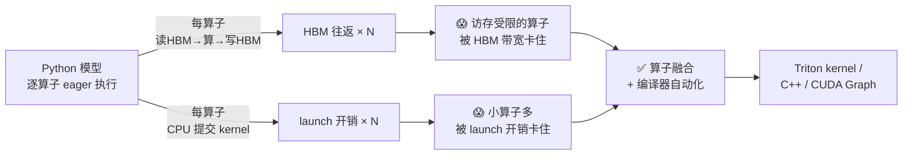
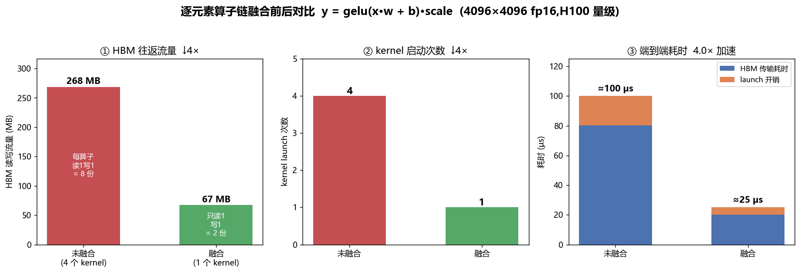
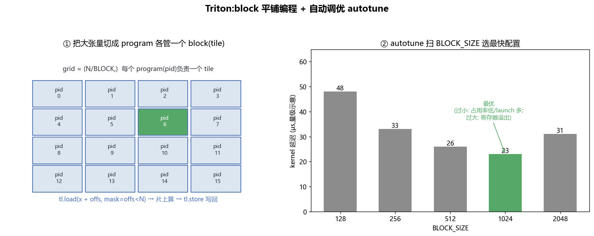
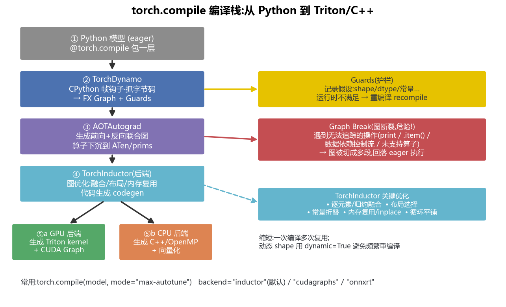
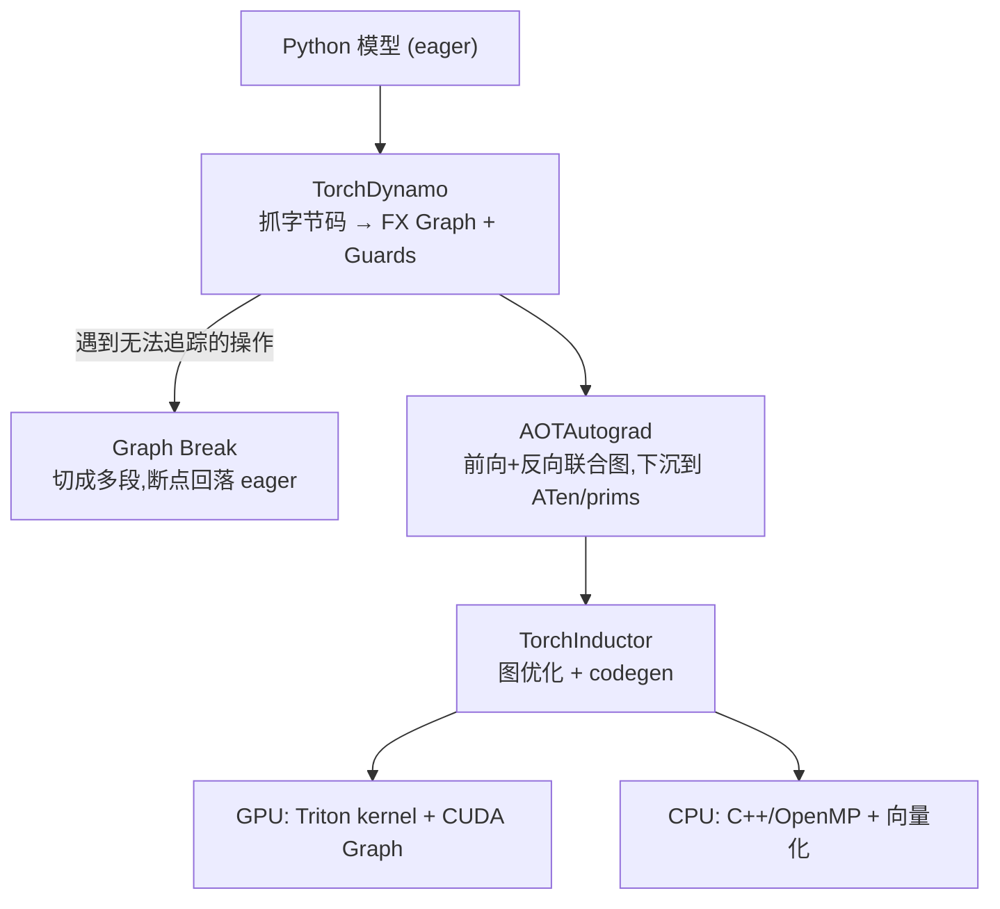
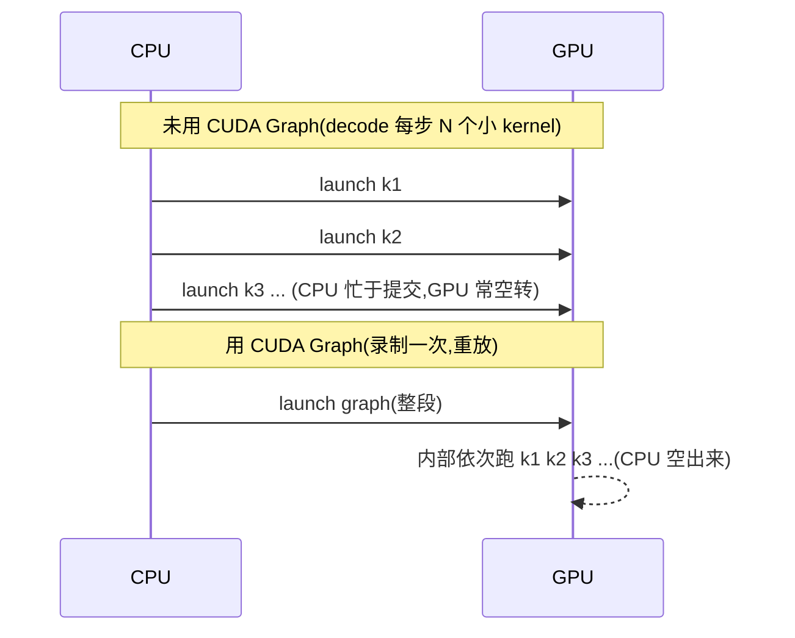
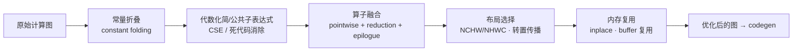
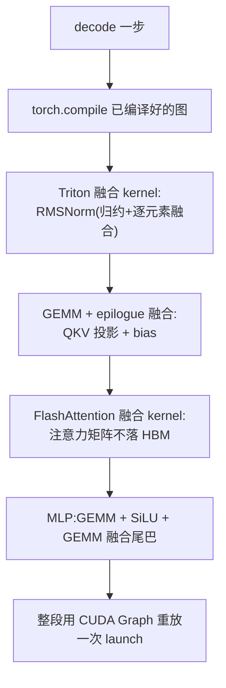

# 算子与编译 · 算子融合 / Triton / torch.compile / 图优化(全面·本质)

> 一个 LLM 的前向,在框架里是**几千个小算子**(matmul、add、gelu、softmax…)一个接一个跑。每个算子都要把数据从 HBM 搬上片、算完再写回 HBM。**大量时间不是花在"算",而是花在"搬"和"启动 kernel"上。**
>
> **算子与编译**要解决的就是这件事:把多个小算子**融合(fuse)**成一个大 kernel,少搬几趟 HBM、少启动几次 kernel;并用**编译器**(Triton / TorchInductor / XLA / TVM)把这件事自动化。本篇从第一性原理讲透"为什么融合"、Triton 怎么写 kernel、`torch.compile` 的整条编译栈、以及编译器里的图优化。

---

## 0. 🗺️ 全景:一次前向到底慢在哪



先建立三个"成本量级",后面反复用(H100 级):

| 成本项 | 量级 | 谁被它卡住 |
|---|---|---|
| HBM 带宽 | ~3.35 TB/s | 逐元素、LayerNorm、softmax、decode(**访存受限 memory-bound**) |
| 单次 kernel launch(CPU→GPU 提交) | ~5–10 µs | 大量**小 kernel**(短序列 decode 尤甚) |
| 张量核算力 | ~990 TFLOPS(bf16) | 大 GEMM、prefill(**算力受限 compute-bound**) |

> 🔬 **第一性原理**:优化 = 让**瓶颈资源**别闲着。访存受限时,减少 HBM 往返就是减少总时间;launch 受限时,合并 kernel 就是减少总时间。**融合同时打这两个点**。要判断某算子受限于谁,回看 [`02_GPU结构`](02_GPU结构_从SM到集群_全面本质.md) 的 Roofline。

---

## 1. 🧠 为什么要融合(fusion)

### 1.1 是什么

**算子融合**:把在数据流上前后相连的多个算子,**合并生成为一个 GPU kernel**,让中间结果**留在片上(寄存器 / 共享内存 / L1)**,不落回 HBM。

拿一条典型的逐元素链举例:`y = gelu(x * w + b) * scale`(4 个逐元素算子)。

- **未融合(eager)**:`t1 = x*w`(读 x、w,写 t1)→ `t2 = t1+b`(读 t1、b,写 t2)→ `t3 = gelu(t2)`(读 t2,写 t3)→ `y = t3*scale`(读 t3,写 y)。每个算子都**读 HBM + 写 HBM**。
- **融合**:一个 kernel 里 `load x` 一次 → 在寄存器里把 `*w、+b、gelu、*scale` 全算完 → `store y` 一次。中间的 `t1/t2/t3` **根本不进 HBM**。

### 1.2 为什么(算笔账)

对 4096×4096 的 fp16 张量(单份 ≈ 33.6 MB),链长 `k=4`:

| | HBM 往返流量 | kernel launch | HBM 传输耗时 | launch 开销 | 端到端 |
|---|---|---|---|---|---|
| 未融合 | `2·k·S` = **268 MB** | 4 次 | 268MB/3.35TBps ≈ 80 µs | 4×5 = 20 µs | **≈100 µs** |
| 融合 | `2·S` = **67 MB** | 1 次 | 67MB/3.35TBps ≈ 20 µs | 1×5 = 5 µs | **≈25 µs** |
| 收益 | **↓4×** | ↓4× | | | **≈4× 加速** |



- **省 HBM 往返**:未融合每算子读 1 写 1,`k` 个算子 = `2k` 份;融合全程只读 1 写 1 = 2 份。逐元素链几乎都是**访存受限**,流量降几倍,时间就降几倍。
- **省 kernel launch**:`k` 次提交变 1 次。对**又小又多**的 kernel(比如 decode 阶段序列很短、每个 kernel 只跑几微秒),launch 开销甚至能占大头,合并后立竿见影。

> 🔬 **本质**:融合的收益 = 省下的 HBM 流量 ÷ 带宽 + 省下的 launch 次数 × 单次开销。**算术强度越低(越访存受限)的算子,融合收益越大**;纯大 GEMM 本就算力受限,融合它的"主体"意义不大,但融合它的**尾巴**很有意义(见 §1.4)。

### 1.3 逐元素融合(elementwise / pointwise fusion)

最容易融合的一类:**逐元素算子 + 广播 + 归约的组合**。因为逐元素算子"每个输出只依赖对应位置的输入",天然可以在一个 kernel 里串起来。

典型可融合模式:
- **激活链**:`bias → gelu/silu → dropout`;
- **归一化**:LayerNorm / RMSNorm = 归约(算均值方差)+ 逐元素(缩放平移),一个 kernel 搞定;
- **element-wise + reduction**:`softmax`(减 max、exp、求和、除)融成一个 kernel,就是 FlashAttention 里在线 softmax 的思想雏形。

### 1.4 GEMM + epilogue 融合(把尾巴粘到矩阵乘上)

大 GEMM(`C = A·B`)本身喂张量核、算力受限,但它算完往往紧跟一串**逐元素尾巴(epilogue)**:加 bias、加残差、激活、量化缩放……

- **不融合**:GEMM 把 `C` 写回 HBM(33 MB),下一个 kernel 再把 `C` 读回来加 bias/激活,又是一轮往返。
- **epilogue 融合**:在 GEMM kernel 把结果**从张量核/共享内存写回 HBM 的那一刻**,顺手把 bias、激活、残差、fp8 量化做掉,`C` 只写一次。这就是 cuBLASLt / CUTLASS 的 **epilogue**、以及 Inductor 的 "**prologue/epilogue fusion**"。

| 融合类型 | 融进什么 | 主要省什么 |
|---|---|---|
| 逐元素融合 | 多个 pointwise / norm / softmax | 省 HBM 往返 + launch |
| **GEMM epilogue** | GEMM 后的 bias/激活/残差/量化 | 省"把 GEMM 结果读回来"的一整趟 |
| **GEMM prologue** | GEMM 前对输入的缩放/反量化 | 省"预处理输入"的一趟 |
| **注意力融合** | QK·softmax·PV 全链(FlashAttention) | 不写巨大的注意力矩阵到 HBM |

> ⚠️ **常见坑**:融合不是越多越好。融进太多逻辑,单 kernel 用的**寄存器/共享内存暴涨** → occupancy(占用率)下降、甚至寄存器溢出到本地内存(local memory,其实在 HBM),**反而变慢**。融合有"甜点区",编译器/autotune 就是在帮你找它。

> 💡 **实战**:FlashAttention 是"融合"的巅峰案例——把 `QKᵀ → softmax → ·V` 融成一个 kernel,**从不把 N×N 的注意力矩阵写进 HBM**,靠分块(tiling)+ 在线 softmax 在片上算完。它同时省了 HBM 往返(O(N²) 的中间矩阵不落地)和显存(不用存注意力矩阵)。详见 [`../llm-inference/`](../llm-inference/) 与 [`02_GPU结构`](02_GPU结构_从SM到集群_全面本质.md) 的张量核一节。

### 1.5 融合的边界:什么能融、什么不能融

编译器判断"两个相邻算子能不能塞进一个 kernel",核心看**它们的迭代空间(循环形状)和数据依赖是否相容**:

| 情形 | 能否融合 | 原因 |
|---|---|---|
| pointwise → pointwise | ✅ 直接融 | 逐元素,输出位置一一对应,循环同构 |
| pointwise → reduction(如 `x*w` 再求和) | ✅ 常能融 | 归约可"边读边累加",输入只读一次 |
| reduction → pointwise(如 softmax 里 sum 后再除) | ✅ 常能融 | 归约结果广播回逐元素 |
| GEMM → pointwise(epilogue) | ✅ 融尾巴 | 结果出寄存器时顺手做逐元素 |
| GEMM → GEMM | ⚠️ 一般不融 | 两个大矩阵乘循环结构不同、中间结果太大放不下片上 |
| 有 **数据依赖控制流** / 动态 shape 交界 | ❌ 断开 | 迭代空间不确定 |
| 中间张量被**别处也要用**(多消费者) | ⚠️ 需权衡 | 融了可能得重算,或仍需落地一份 |

> 🔬 **本质**:融合的可行性 = **循环能不能合并 + 中间量放不放得下片上**。这解释了为什么"逐元素链随便融、两个大 GEMM 不融、GEMM 只融尾巴"。Inductor 内部把算子归成 pointwise / reduction / template(GEMM 等)几类,同类且循环相容的才进同一个 **fusion group**。

---

## 2. 🔧 Triton:用 Python 写 GPU kernel

### 2.1 是什么 / 为什么

**Triton** 是 OpenAI 开源的 GPU kernel 语言 + 编译器,让你**用 Python 语法写出接近手写 CUDA 性能的 kernel**。它是 `torch.compile` 生成 GPU 代码的**默认后端**——理解 Triton,就理解了 Inductor 到底生成了什么。

它和 CUDA 的关键差别在**编程粒度**:

| | CUDA | Triton |
|---|---|---|
| 编程对象 | **单个线程**(thread) | **一个 block/tile**(一批数据) |
| 谁管线程内分工 | 你手写(threadIdx、共享内存、同步) | **编译器自动**(向量化、访存合并、bank 冲突、流水) |
| 谁管访存合并/bank 冲突 | 你 | 编译器 |
| 学习曲线 | 陡 | 平缓(Python 思维) |
| 极限性能 | 最高(可抠到底) | 很高(多数场景够用) |

> 🔬 **本质**:Triton 把"一个 warp 里 32 个线程怎么协作"这层繁琐细节**交给编译器**,你只需描述"**这个 program 负责哪一块数据、对这块数据做什么**"。它把 GPU 编程从"线程视角"抬高到"**block/张量视角**"。

### 2.2 block 编程模型:program 各管一个 tile

Triton 里,你启动一个 **grid**,grid 里每个实例叫 **program**(类似 CUDA 的一个 block),用 `tl.program_id(axis)` 拿到自己的编号 `pid`,然后自己算"我负责数据的哪一段(tile / block)"。



一个最小的向量加 kernel(`z = x + y`):

```python
import triton
import triton.language as tl

@triton.jit
def add_kernel(x_ptr, y_ptr, z_ptr, n, BLOCK: tl.constexpr):
    pid = tl.program_id(axis=0)          # 我是第几个 program
    offs = pid * BLOCK + tl.arange(0, BLOCK)  # 我负责的这一段下标
    mask = offs < n                      # 尾巴不满一块时,越界的屏蔽掉
    x = tl.load(x_ptr + offs, mask=mask) # 从 HBM 把这一 tile 搬上片
    y = tl.load(y_ptr + offs, mask=mask)
    tl.store(z_ptr + offs, x + y, mask=mask)  # 片上算完,写回 HBM

def add(x, y):
    z = torch.empty_like(x)
    n = x.numel()
    grid = lambda meta: (triton.cdiv(n, meta["BLOCK"]),)  # 需要多少个 program
    add_kernel[grid](x, y, z, n, BLOCK=1024)
    return z
```

读法(零基础三句话):
1. **`grid`** 决定开多少个 program(`cdiv(n, BLOCK)` = 向上取整,保证覆盖所有元素);
2. 每个 program 用 `pid` + `tl.arange` 算出**自己那一 tile 的下标 `offs`**;
3. **`tl.load` / `tl.store`** 是唯一碰 HBM 的地方,中间的 `x + y` 全在片上——**融合就是在这中间多塞几步运算,而 load/store 次数不变**。

> 💡 **mask 的意义**:`n` 不一定能被 `BLOCK` 整除,最后一块会越界。`mask=offs<n` 让越界的 lane 不读不写,避免非法访存——这是 Triton kernel 的标配。

### 2.3 自动调优 autotune

同一个 kernel,`BLOCK` 取多大、用几个 warp(`num_warps`)、流水几级(`num_stages`)对性能影响巨大,而且**随 GPU 型号、张量形状而变**。Triton 用 `@triton.autotune` 帮你**离线扫一遍候选配置,自动选最快的**:

```python
@triton.autotune(
    configs=[
        triton.Config({"BLOCK": 256},  num_warps=4),
        triton.Config({"BLOCK": 512},  num_warps=4),
        triton.Config({"BLOCK": 1024}, num_warps=8),
        triton.Config({"BLOCK": 2048}, num_warps=8),
    ],
    key=["n"],   # n 变了才重新调优;否则复用缓存的最优配置
)
@triton.jit
def add_kernel(...):
    ...
```

上图右侧就是量级示意:`BLOCK` **太小** → program 太多、launch/occupancy 差;**太大** → 单 program 寄存器/共享内存吃紧甚至溢出。中间有个"甜点"(图里 1024 最快)。

> ⚠️ **常见坑**:autotune 首次遇到新的 `key` 会**实际跑一遍所有 config 计时**,第一次调用会有明显停顿(warmup)。生产里要么提前 warmup,要么缓存调优结果。`torch.compile(mode="max-autotune")` 本质就是把这套 autotune 开到最大。

### 2.4 二维平铺:matmul 的 Triton 骨架

向量加是一维 tile。矩阵乘 `C[M,N] = A[M,K]·B[K,N]` 是**二维平铺**:每个 program 负责输出 `C` 的一个 `BLOCK_M × BLOCK_N` 小块,沿 `K` 维分块循环累加。这正是 GEMM epilogue 融合(§1.4)发生的地方——累加完在写回前把 bias/激活做掉。

```python
@triton.jit
def matmul_kernel(a_ptr, b_ptr, c_ptr, M, N, K,
                  BLOCK_M: tl.constexpr, BLOCK_N: tl.constexpr, BLOCK_K: tl.constexpr):
    pid_m = tl.program_id(0)          # 我负责哪一行块
    pid_n = tl.program_id(1)          # 我负责哪一列块
    offs_m = pid_m * BLOCK_M + tl.arange(0, BLOCK_M)
    offs_n = pid_n * BLOCK_N + tl.arange(0, BLOCK_N)
    acc = tl.zeros((BLOCK_M, BLOCK_N), dtype=tl.float32)   # 累加器留在寄存器
    for k in range(0, K, BLOCK_K):    # 沿 K 分块,把 A/B 的小块搬上片相乘累加
        a = tl.load(a_ptr + (offs_m[:, None] * K + (k + tl.arange(0, BLOCK_K))[None, :]))
        b = tl.load(b_ptr + ((k + tl.arange(0, BLOCK_K))[:, None] * N + offs_n[None, :]))
        acc += tl.dot(a, b)           # tl.dot → 底层走张量核 MMA
    acc = tl.maximum(acc, 0.0)        # ← epilogue 融合:顺手做 ReLU,C 只写一次
    tl.store(c_ptr + offs_m[:, None] * N + offs_n[None, :], acc)
```

- **`tl.dot`** 会被编译到**张量核**(Tensor Core)的 MMA 指令——这就是 Triton 能逼近 cuBLAS 的关键;
- **`acc` 全程在寄存器**里累加,`A/B` 的小块靠 `BLOCK_K` 循环分批搬上片、**复用**(每块 A 参与 `BLOCK_N` 个输出),这就是 §1 说的"复用片上、减少 HBM"的落地;
- 最后一行的 `ReLU` 就是 **epilogue 融合**:不额外起一个 kernel、`C` 不多读一趟。

> 💡 真实高性能 matmul 还要处理 `mask`(边界)、`num_stages`(软件流水预取,让搬数据和算重叠)、地址的 stride 等;但"**二维 tile + K 维循环 + 寄存器累加 + epilogue**"这个骨架不变。

---

## 3. 🚀 torch.compile / TorchInductor:一行装饰器,自动融合

### 3.1 是什么

PyTorch 默认是 **eager 模式**(逐算子解释执行,灵活好调试,但每个算子单独一个 kernel、无法跨算子融合)。`torch.compile`(PyTorch 2.x)在**几乎不改代码**的前提下,把模型**捕获成计算图 → 编译优化 → 生成融合后的 Triton/C++ kernel**:

```python
model = MyTransformerBlock().cuda()
model = torch.compile(model)            # 就这一行
y = model(x)                            # 首次触发编译(慢),之后跑编译好的图(快)
```

### 3.2 整条编译栈(逐级讲透)





**① TorchDynamo(图捕获 / graph capture)**
用 CPython 的**帧评估钩子(frame eval hook)**在函数运行前**拦截并分析字节码**,把 PyTorch 操作抽取成 **FX 计算图**。同时记录一组 **Guards(护栏)**——它编译时假设的前提(输入 shape、dtype、某些标量常量、是否 requires_grad 等)。

- **Guards + 重编译**:下次调用先**廉价地检查 guards**;若全部命中,直接跑编译好的图;若 shape/dtype 变了 → guard 失败 → **触发重编译(recompile)**,为新情况再编一份。

**② AOTAutograd**
提前(Ahead-Of-Time)把**前向图和反向图一起**生成出来(训练要反向),并把算子**下沉(lowering)到更底层、更规整的算子集**(ATen / prims),方便后端统一优化。推理只用前向。

**③ TorchInductor(默认后端)**
真正做**图优化 + 代码生成**的地方:融合、布局选择、常量折叠、内存复用……(详见 §5),然后 **GPU 生成 Triton kernel、CPU 生成 C++/OpenMP**,并可叠加 **CUDA Graph**(§4.3)进一步压 launch 开销。

**④ 后端可换**:`torch.compile(model, backend=...)`,默认 `"inductor"`;还可选 `"cudagraphs"`、`"onnxrt"`、`"openxla"`(走 XLA)等。

### 3.3 ⚠️ Graph Break(图断裂):最重要的坑

Dynamo 不是万能的——遇到**它没法追踪的东西**,会在那里**把图"切断"**:断点前编译成图跑,断点处**回落到 eager 逐行跑**,断点后再开一段新图。这叫 **graph break**。

常见触发 graph break 的操作:

| 触发点 | 为什么断 | 怎么办 |
|---|---|---|
| `print()` / logging | 有副作用,无法进图 | 调试后删掉;或用 `torch._dynamo` 的日志 |
| `.item()` / `.tolist()` / `.cpu()` | 把 GPU 张量值同步回 Python,图依赖具体值 | 尽量避免在热路径同步 |
| **数据依赖的控制流**(`if x.sum() > 0:`) | 分支取决于**张量的值**,图是静态的 | 用 `torch.where` / `torch.cond` 改写 |
| 未支持的算子 / 第三方库调用 | Dynamo 不认识 | 换等价 PyTorch 算子,或注册自定义 |
| 部分 `.numpy()`、Python 复杂对象 | 无法符号化 | 移出热路径 |

> ⚠️ **危害**:graph break 越多,能被融合/优化的**图段越碎**,加速越差,kernel launch 也回来了。极端情况整段回落 eager,`torch.compile` 形同虚设。

> 💡 **面试高频 / 实战排查**:用 `torch._dynamo.explain(model)(x)` 或 `TORCH_LOGS="graph_breaks"` 环境变量,能列出**每一处 graph break 及原因**。优化 `torch.compile` 的第一步,永远是**把热路径上的 graph break 清零**。用 `fullgraph=True` 可强制"要么整图、要么报错",逼你暴露所有断点。

### 3.4 动态 shape 与重编译

LLM 推理里序列长度天天变,若每个新长度都重编译一份,编译开销爆炸。

- `torch.compile(model, dynamic=True)`:把 shape 当**符号变量**编一份通用图,避免为每个长度重编。
- `mode="reduce-overhead"`:偏向用 CUDA Graph 压 launch(适合小 batch decode);`mode="max-autotune"`:开满 autotune 找最快 kernel(编译更慢,运行最快)。

| mode | 侧重 | 适合 |
|---|---|---|
| 默认 | 平衡 | 通用 |
| `reduce-overhead` | 压 launch(CUDA Graph) | 小 batch / decode |
| `max-autotune` | 极致 kernel(autotune) | 固定形状的重负载 / prefill |

---

## 4. 🌐 XLA / TVM / CUDA Graph:其它编译路线

### 4.1 XLA(Accelerated Linear Algebra)

Google 的张量编译器,是 **JAX / TensorFlow(及 PyTorch/XLA、TPU)**的核心。思路和 Inductor 相通:把整张图做**代数化简 + 算子融合 + 布局优化**,再为目标硬件(TPU/GPU/CPU)生成代码。

- 特色是**激进的整图融合**和为 TPU 定制的调度;
- ⚠️ 代价:强调**静态 shape**,动态 shape 场景容易反复重编译(和 Dynamo 的 guard 重编译类似的痛点)。

### 4.2 TVM

Apache 开源的**深度学习编译器栈**,主打**跨硬件部署**(CPU/GPU/NPU/手机/边缘)。特色是 **AutoTVM / Ansor 自动调度**——用搜索(甚至 ML 代价模型)在巨大的调度空间里找每个算子的最优实现。定位更偏"**把一个模型部署到千奇百怪的硬件上并压榨性能**"。

| 编译器 | 生态 | 主打 | 典型场景 |
|---|---|---|---|
| **TorchInductor** | PyTorch 原生 | 一行 `torch.compile`,Triton 后端 | PyTorch 训练/推理 |
| **XLA** | JAX/TF/TPU | 整图融合,静态 shape | TPU、JAX |
| **TVM** | 独立 | 跨硬件、自动调度搜索 | 边缘/异构部署 |
| **TensorRT** | NVIDIA | 推理专用,层融合 + 量化 | NVIDIA 上线推理 |

### 4.3 CUDA Graph:直接干掉 launch 开销

即使 kernel 融得再好,**每个 kernel 还是要 CPU 逐个提交**。在 decode 这种"每步都是一串小 kernel"的场景,CPU 提交(launch)本身就是瓶颈——GPU 干等 CPU 喂活。

**CUDA Graph** 把一整段固定的 kernel 序列**"录制"成一张图**,之后**一次 `launch` 就重放整段**,把"N 次 CPU→GPU 提交"变成"1 次":



- 收益:省掉 N-1 次 launch 的 CPU 开销 + 内核间调度延迟,**小 kernel 密集的 decode 提速明显**;
- ⚠️ 代价:图**一旦录制,结构和输入张量地址就固定**了——shape 变、指针变都要重录;所以要求**静态 shape + 固定显存地址**(常配合预分配的 KV cache buffer)。`torch.compile(mode="reduce-overhead")` 会自动帮你套 CUDA Graph。

> 🔬 **本质区分**:**融合**减少的是 **HBM 往返**(算得少搬得少);**CUDA Graph**减少的是 **CPU 提交开销**(GPU 别等 CPU)。两者正交,常一起上。

---

## 5. 🛠️ 图优化(graph-level optimization)清单

编译器拿到计算图后,做的经典优化(Inductor / XLA / TVM 大同小异):



| 优化 | 是什么 | 省什么 | 代价/坑 |
|---|---|---|---|
| **常量折叠** constant folding | 编译期就能算出的子表达式(如 `weight * 1.0`、shape 计算)直接算成常量 | 运行时算力 | 需能证明是编译期常量 |
| **公共子表达式消除** CSE | 同一个子表达式算一次、复用 | 重复计算 | — |
| **死代码消除** DCE | 没被用到的算子直接删 | 无用计算/显存 | — |
| **算子融合** fusion | §1:pointwise/reduction/epilogue 合并成一个 kernel | HBM 往返 + launch | 融太多 → 寄存器溢出 |
| **布局选择** layout | 选对张量内存布局(如 NHWC 更利于张量核 / 合并访存),必要处插转置并**传播**到能吸收的地方 | 访存效率 / 少余转置 | 布局不匹配 → 隐式转置反而慢 |
| **内存复用** | 生命周期不重叠的中间张量**共享同一块 buffer**;安全时做 **inplace** | 峰值显存 | inplace 需保证无别名读后写冲突 |
| **调度/流水** | 排 kernel 顺序、重叠计算与通信/搬运(如 TMA 异步预取) | 空转 | 依赖分析要正确 |

> 💡 **实战直觉**:训练时开 `torch.compile` 常见 **1.3–2×** 加速(尤其访存受限的 norm/激活/小算子多的模型);**显存也常降**(融合少了中间张量落地 + 内存复用)。收益大小高度取决于**graph break 有没有清干净**和**模型里访存受限算子占比**。

> ⚠️ **常见坑合集**:① graph break 太多导致图碎(§3.3);② 动态 shape 频繁重编译(用 `dynamic=True`);③ 首次编译很慢(几十秒到几分钟,属正常,要做编译缓存 warmup);④ 融合过度导致寄存器溢出(交给 autotune);⑤ 自定义 CUDA/第三方算子 Dynamo 不认识(注册为 custom op 让它当黑盒进图)。

---

## 6. 🧩 把四件事串起来:一次编译后的 decode step



- **融合**把每个子模块的 HBM 往返压到最少;
- **Triton** 是这些融合 kernel 的实现语言;
- **torch.compile/Inductor** 自动完成"图捕获→图优化→生成 Triton";
- **CUDA Graph** 把整段小 kernel 序列一次性重放,消灭 launch 开销。

这就是现代推理引擎(vLLM / SGLang / TensorRT-LLM)背后"又快又省"的四板斧,详见 [`../llm-inference/`](../llm-inference/) 与 [`01_PD分离架构`](01_PD分离架构_Prefill_Decode_Disaggregation.md)。

---

## 📌 本质小结

1. **一次前向的时间常被"搬"和"启动"吃掉**,不全是"算"。融合同时打这两个点:**省 HBM 往返** + **省 kernel launch**。
2. **融合收益 ∝ 访存受限程度**:逐元素/norm/softmax 融合最划算;大 GEMM 融**尾巴(epilogue)**最划算;FlashAttention 是融合的巅峰(注意力矩阵不落 HBM)。
3. **Triton** 把 GPU 编程从"线程视角"抬到"**block/tile 视角**",线程内分工与 autotune 交给编译器;它是 `torch.compile` 的默认 GPU 后端。
4. **torch.compile 栈**:Dynamo(抓图+Guards)→ AOTAutograd(前反向联合图)→ Inductor(图优化+codegen)→ Triton/C++。**graph break 是头号敌人**,先清零再谈加速。
5. **图优化**:常量折叠、CSE/DCE、融合、布局选择、内存复用——都是"少算、少搬、少占"。
6. **CUDA Graph** 正交于融合,专治**launch 开销**(decode 小 kernel 密集场景),代价是要静态 shape + 固定地址。

## 💡 面试高频

- 算子融合到底省了什么?(HBM 往返 + launch;能定量算)为什么访存受限算子融合收益大?
- GEMM epilogue 融合是什么,为什么对 GEMM 尤其有用?
- Triton 和 CUDA 的编程粒度差别(thread vs block/tile)?autotune 在调什么?
- `torch.compile` 的四级栈各做什么?**graph break** 是什么、怎么排查(`torch._dynamo.explain` / `TORCH_LOGS`)、`fullgraph=True` 的作用?
- CUDA Graph 解决什么问题、代价是什么、和融合有何区别?
- XLA / TVM / TensorRT 各自定位?

## 🔗 延伸

- 基础:[`02_GPU结构_从SM到集群_全面本质.md`](02_GPU结构_从SM到集群_全面本质.md)(Roofline 判断 memory/compute-bound、张量核、显存层级——融合为什么有效的物理根基)
- 底层:[`04_内存模型_一致性_内存序_GPU与CPU.md`](04_内存模型_一致性_内存序_GPU与CPU.md)(共享内存/HBM 的可见性与同步)、[`03_CPU结构_流水线_乱序_缓存_多核.md`](03_CPU结构_流水线_乱序_缓存_多核.md)(CPU 后端的向量化/OpenMP)
- 应用:[`01_PD分离架构_Prefill_Decode_Disaggregation.md`](01_PD分离架构_Prefill_Decode_Disaggregation.md)(prefill 算力受限 / decode 访存受限,决定往哪优化)、[`../llm-inference/`](../llm-inference/)(FlashAttention、PagedAttention、vLLM/SGLang/TensorRT-LLM)
- 训练:[`../ultra-scale-playbook`](../ultra-scale-playbook)(分布式训练里 `torch.compile` + 融合 + 通信重叠)
- 手写算子:[`../../Enigneer-infra/cuda-mastery`](../../Enigneer-infra/cuda-mastery)(CUDA/Triton 算子从零实现与优化)
