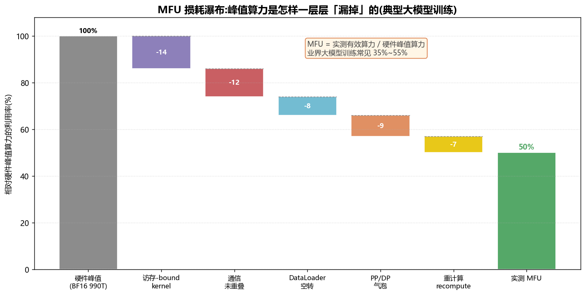
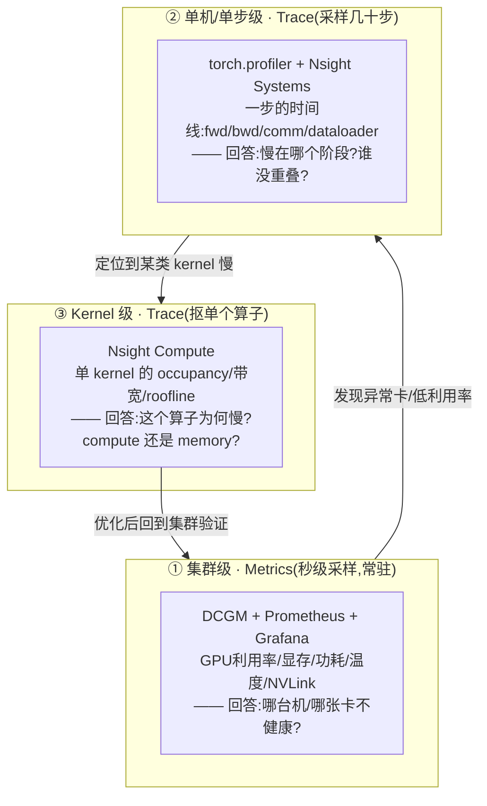
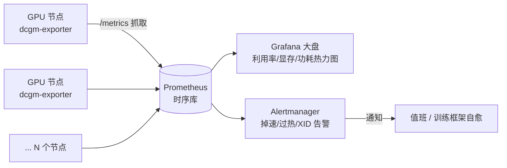
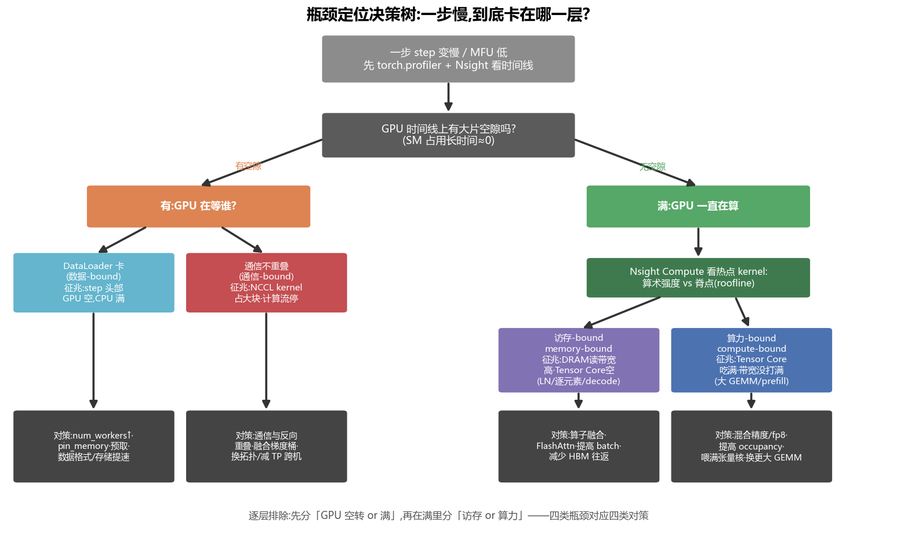
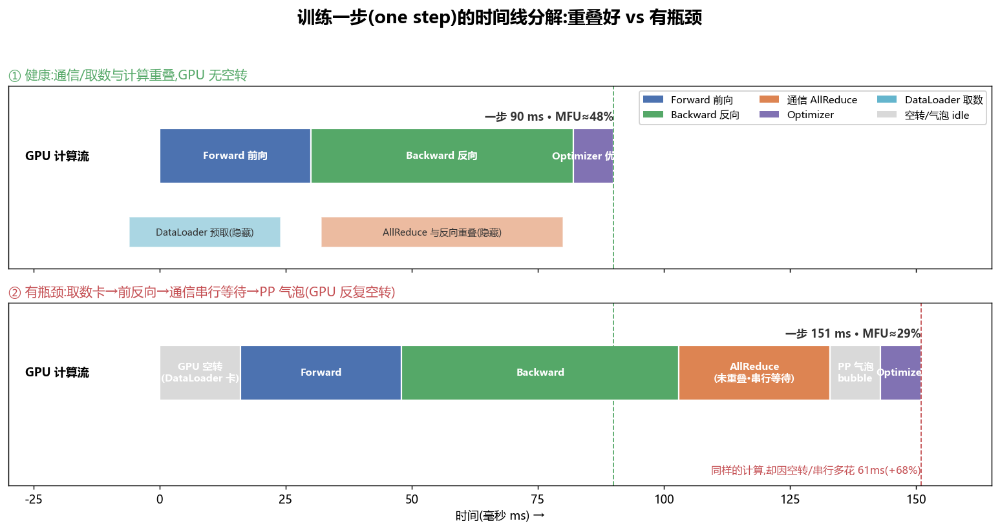
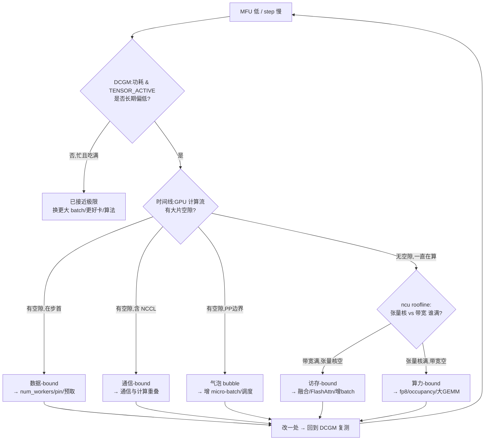

# 可观测性与性能剖析 · profiling / DCGM / 瓶颈定位方法论(全面·本质)

> 你花几千万买的 H100 集群,**到底跑到了峰值算力的百分之几**?训练一步慢,是卡在算力、访存、通信还是数据?这不能靠"感觉",必须靠**测量**。本篇讲透:怎么量化利用率(MFU/吞吐)、用什么工具看(torch.profiler / Nsight / DCGM)、以及一套**可复用的瓶颈定位方法论**。

---

## 🧠 1. 为什么要 profile:第一性原理

一句话:**没有测量就没有优化**。深层原因有三:

1. **直觉几乎总是错的**。人以为"GPU 利用率 100% = 跑满了",但 `GPU_UTIL=100%` 只代表"有 kernel 在跑",不代表**算力被吃满**——它可能 100% 时间都在做访存受限的逐元素算子,张量核几乎空着。真正的瓶颈往往藏在你没看的那一层。
2. **成本极其昂贵**。一个 1000 卡 H100 集群,每提升 10% 的 MFU,等价于**省下 100 张卡**或**训练提前 10% 完成**。在这个量级,"优化"就是直接的钱。
3. **瓶颈会流动**。修好数据瓶颈,通信瓶颈就冒出来;修好通信,又变成访存瓶颈。**只有持续观测,才能知道当前卡在哪、下一步该修谁**。

> 🔬 **第一性原理**:一次训练/推理的墙钟时间(wall-clock)= 各阶段时间之和 − 重叠部分。优化 = **要么让某段更快,要么让它和别的段重叠(隐藏)**。而你必须先知道"哪段最长、谁没重叠",才谈得上优化。这就是 profiling 的全部意义。

> 💡 **可观测性 observability 的三支柱**:**Metrics(指标,如 DCGM 的 GPU 利用率/功耗)** + **Traces(时间线,如 Nsight/torch.profiler 的 kernel 时序)** + **Logs(日志)**。训练场景里,Metrics 回答"健不健康",Traces 回答"慢在哪一步",两者缺一不可。

---

## 📐 2. 怎么量化:MFU、吞吐与它们的分解

### 2.1 吞吐 throughput

最顶层的指标,越大越好:

- **训练**:`tokens/sec`(每秒处理的 token 数)或 `samples/sec`、`steps/sec`。
- **推理**:`tokens/sec`(解码吞吐)、`requests/sec`(QPS);还要看延迟 **TTFT**(首 token)与 **TPOT**(每 token),见 [`01_PD分离架构`](01_PD分离架构_Prefill_Decode_Disaggregation.md)。

吞吐是"结果",但它不告诉你"离硬件极限还有多远"——这就要 MFU。**吞吐还可以逐层分解**,帮你定位到底哪一环拖了后腿:

$$\text{tokens/sec} = \frac{\text{global\_batch} \times \text{seq\_len}}{t_{\text{step}}},\qquad t_{\text{step}} = t_{\text{data}} + t_{\text{fwd}} + t_{\text{bwd}} + t_{\text{comm}}^{\text{未重叠}} + t_{\text{opt}} + t_{\text{bubble}}$$

一旦把 $t_{\text{step}}$ 拆成这几项(profiler 时间线正好给你这几段),**哪一项最大就先修哪一项**——这就是把"吞吐低"翻译成"可执行动作"的桥。理想情况下 $t_{\text{data}}$、$t_{\text{comm}}$ 都被藏进 $t_{\text{fwd}}/t_{\text{bwd}}$ 里趋近于 0。

### 2.2 MFU:模型算力利用率(Model FLOPs Utilization)

**MFU = 模型真正需要的算力 ÷ 硬件峰值算力**。它把"你用出了硬件几成功力"压成一个 0~1 的数,是训练效率的黄金指标。

对稠密 Transformer,每个 token 的训练前向+反向浮点运算量约为(著名的 **6N 近似**):

$$\text{FLOPs}_{\text{token}} \approx \underbrace{6N}_{\text{参数矩阵乘}} + \underbrace{12 \cdot L \cdot s \cdot h}_{\text{注意力(长序列时不可忽略)}}$$

其中 $N$=模型(非 embedding)参数量,$L$=层数,$s$=序列长,$h$=隐藏维。**6 = 2(前向乘加算两次 FLOP)+ 4(反向约为前向的 2 倍)**。于是:

$$\boxed{\text{MFU} = \frac{6N \cdot T}{P_{\text{peak}} \cdot G}}$$

- $T$ = 整个集群每秒处理的 token 数(tokens/sec)
- $P_{\text{peak}}$ = **单卡**峰值算力(如 H100 BF16 稠密 ≈ 989 TFLOP/s)
- $G$ = 卡数

> 💡 **实战:一道会算的 MFU 题**。70B 模型,跑在 64 张 H100(BF16 峰值 989 TFLOP/s),实测全集群 6.0×10⁴ tokens/s。
> 分子 = 6 × 70×10⁹ × 6.0×10⁴ = 2.52×10¹⁶ FLOP/s;分母 = 989×10¹² × 64 = 6.33×10¹⁶。
> **MFU = 2.52 / 6.33 ≈ 40%**。业界大模型训练常见 **35%~55%**,能到 50%+ 就算调得很好了。

### 2.3 MFU vs HFU:重计算算不算?

| 指标 | 分子里的 FLOPs | 含义 |
|---|---|---|
| **MFU**(Model) | 只算**模型逻辑上需要**的(6N) | "有用功"占峰值几成——**报告/对比模型效率用这个** |
| **HFU**(Hardware) | 加上**重计算 recompute** 多做的前向(开激活重算时 ~8N) | "硬件实际执行"占峰值几成——**看硬件忙不忙用这个** |

> ⚠️ **常见坑**:开了**激活重计算 activation checkpointing**(用算力换显存,反向时重跑一遍前向)后,HFU 会明显高于 MFU。别拿 HFU 冒充 MFU 去吹效率——多做的那部分前向是"为省显存付的税",不是有用功。

### 2.4 MFU 是怎样一层层"漏掉"的

峰值算力从 100% 掉到实测 MFU,中间每一层都在漏:



- **访存-bound kernel**:LayerNorm、逐元素、softmax 等张量核空转,只走访存 → 漏一块。
- **通信未重叠**:AllReduce/AllGather 时计算流停等 → 漏一块。
- **DataLoader 空转**:GPU 等数据 → 漏一块。
- **PP/DP 气泡**:流水并行填不满、同步等待 → 漏一块。
- **重计算**:激活重算多做的前向(MFU 视角算损耗,HFU 视角不算)。

**优化就是逐块把这些漏洞补上**。而"哪块漏得最多",只能测出来——这就引出工具与方法论。

---

## 🔭 3. 观测的三个层级(先建立地图)

从粗到细,不同问题看不同层级,别一上来就抠 kernel:



> 🔬 **本质**:这是一个**由粗到细、再回粗验证**的漏斗。集群指标像"体检报告"(哪里不对劲),时间线像"X 光"(哪一步卡),kernel 剖析像"活检"(细胞级病因)。**顺序反了会浪费大量时间**——别在没定位到哪步慢之前就去抠某个 kernel。

---

## 🛠️ 4. 工具全景

### 4.1 `torch.profiler`:最顺手的第一站

PyTorch 自带,几行代码就能同时抓 **CPU 端算子 + CUDA kernel + 内存**,导出 **Chrome trace**(`chrome://tracing` 或 [Perfetto](https://ui.perfetto.dev/) 打开看时间线),还能出 TensorBoard 面板。

```python
import torch
from torch.profiler import profile, ProfilerActivity, schedule

# schedule:跳过预热,只抓稳定的几步(profiling 本身有开销,别全程抓)
sched = schedule(wait=1, warmup=1, active=3, repeat=1)

def trace_handler(p):
    # 打印最耗时算子(按 CUDA 自身时间排序)
    print(p.key_averages().table(sort_by="self_cuda_time_total", row_limit=15))
    p.export_chrome_trace(f"trace_{p.step_num}.json")   # 拖进 Perfetto 看时间线

with profile(
    activities=[ProfilerActivity.CPU, ProfilerActivity.CUDA],
    schedule=sched,
    on_trace_ready=trace_handler,
    record_shapes=True,       # 记录张量 shape(定位是哪个矩阵乘)
    profile_memory=True,      # 记录显存分配
    with_stack=True,          # 关联到 Python 源码行
) as prof:
    for step, batch in enumerate(loader):
        train_step(batch)
        prof.step()           # 必须调用,驱动 schedule
```

**怎么读输出**:表格里 `Self CUDA %` 高的算子就是热点;若 `aten::to` / `cudaMemcpyAsync` / `DataLoader` 占大头 → 数据路径有问题;若某个 `ampere_..._gemm` 占大头且 shape 很大 → 正常(计算密集),看它 MFU 够不够。一张健康的表长这样(节选,已按 CUDA 自身时间排序):

```text
Name                              Self CUDA   Self CUDA %   # Calls
---------------------------------------------------------------- 
ampere_bf16_..._gemm (QKV/MLP)      41.2 ms       58.3%       384    ← 大 GEMM,该是主力,健康
flash_attention_fwd/bwd             12.7 ms       18.0%        96    ← 注意力,已用 FlashAttn,好
ncclDevKernel_AllReduce              6.1 ms        8.6%        24    ← 通信,占比不大且能重叠则 OK
elementwise/LayerNorm/dropout        5.3 ms        7.5%      1200+   ← 访存-bound 小算子,可融合
aten::copy_ / cudaMemcpyAsync        2.1 ms        3.0%       ...    ← H2D 拷贝,过高要查数据路径
```

若上面 `gemm + flash_attention` 合计占比很高 → 算力用在了刀刃上;若 `elementwise/copy/AllReduce` 反客为主 → 分别指向访存/数据/通信瓶颈,对号入座 §6。

> 💡 **面试高频**:"怎么快速看训练卡在哪?" → 先 `torch.profiler` 抓 3~5 步导出 chrome trace,在 Perfetto 里看一条时间线上 **GPU 流有没有空隙**、**NCCL 有没有和计算重叠**、**DataLoader 是否阻塞**。这是最低成本的定位手段。

> ⚠️ **坑:CUDA 是异步的**。Python 里 `t0=time(); y=model(x); t1=time()` 量出来的几乎是"发射 kernel 的时间"而非"kernel 执行时间"。要精确计时必须用 **CUDA event + `torch.cuda.synchronize()`**,或者直接信任 profiler 的 device 侧时间戳。

### 4.2 Nsight Systems(`nsys`):系统级时间线之王

看**整机、跨 CPU/GPU/NCCL/CUDA 的统一时间线**,比 torch.profiler 更底层、更全(能看到 NVLink、PCIe、CUDA API、OS 线程)。定位"**谁在等谁**"最强。

```bash
# 抓一段训练,生成 report.nsys-rep,用 Nsight Systems GUI 打开看时间线
nsys profile -t cuda,nvtx,osrt,cudnn,cublas \
     --gpu-metrics-device=all \
     -o report --force-overwrite true \
     python train.py --steps 30
```

配合 **NVTX** 打标记,时间线上就能看到你自己的语义分段:

```python
import torch.cuda.nvtx as nvtx
nvtx.range_push("forward");  y = model(x);        nvtx.range_pop()
nvtx.range_push("backward"); loss.backward();      nvtx.range_pop()
nvtx.range_push("allreduce");optimizer.step();     nvtx.range_pop()
```

**看什么**:计算流(CUDA stream)有没有空白(空白=GPU 空转);NCCL 的 kernel 是否和反向计算**并排重叠**;CPU 线程是不是卡在 `pthread_cond_wait`(等 DataLoader)。

### 4.3 Nsight Compute(`ncu`):单 kernel 级显微镜

当时间线定位到"某个 kernel 慢",用 `ncu` 抠它的**微架构指标**:occupancy、各流水线利用率、**实测 roofline**、每次访存是否合并、bank conflict……

```bash
# 只抓名字含 gemm 的 kernel 的前若干个,做完整 roofline 分析(ncu 很重,务必限定范围)
ncu --set full --kernel-name-base regex:".*gemm.*" -c 10 \
    -o kernel_report python train.py
```

**关键指标**:`sm__throughput`(SM 利用)、`dram__throughput`(HBM 带宽利用)、`sm__pipe_tensor_op_hmma`(张量核活跃)、`achieved_occupancy`。ncu 会直接告诉你这个 kernel 是 **Compute Bound** 还是 **Memory Bound**,以及在 roofline 图上的位置(见 [`02_GPU结构`](02_GPU结构_从SM到集群_全面本质.md) 的 roofline)。

### 4.4 四大工具对比

| 工具 | 层级 | 看什么 | 开销 | 何时用 |
|---|---|---|---|---|
| **DCGM** | 集群/常驻 | 利用率/显存/功耗/温度/NVLink | 极低(可常开) | 监控告警、找坏卡/掉速卡 |
| **torch.profiler** | 单步/算子 | 算子耗时 + chrome trace + 显存 | 中(抓几步) | 第一站快速定位阶段 |
| **Nsight Systems** | 系统时间线 | CPU/GPU/NCCL/PCIe 谁等谁 | 中 | 看重叠、气泡、通信 |
| **Nsight Compute** | 单 kernel | occupancy/带宽/roofline | **高**(逐 kernel 重放) | 抠单算子微优化 |

> 🔬 **本质区别**:`nsys` 回答"**时间都花哪了、谁挡了谁**"(时间线/横向);`ncu` 回答"**这个 kernel 为什么慢**"(微架构/纵向)。前者定位,后者归因。绝大多数训练问题在 `nsys` 层就能解决,`ncu` 是写/调 CUDA 算子时才深入用。

### 4.5 怎么读一张 Chrome/Perfetto 时间线(trace 解剖)

导出的 `trace.json` 拖进 [Perfetto](https://ui.perfetto.dev/),你会看到多条**泳道 lane**。学会认这几条,90% 的问题一眼看穿:

| 泳道(row) | 代表 | 你要盯的 |
|---|---|---|
| **CPU / python thread** | 主线程发射 kernel、跑 Python | 是否卡在 `DataLoader.__next__` / `synchronize`(说明在等 GPU 或等数据) |
| **CUDA API(cudaLaunchKernel…)** | CPU 发射 GPU 任务的 API 调用 | 密集且间隔均匀=喂得上;稀疏=CPU 跟不上(CPU-bound / launch 开销大) |
| **GPU stream(compute)** | 真正的 kernel 在 GPU 上执行 | **有没有空白**——空白=GPU 空转,是头号敌人 |
| **GPU stream(NCCL/comm)** | 集合通信 kernel | 是否和 compute 流**并排重叠**(好),还是错开串行(坏) |
| **memcpy(H2D/D2H)** | 主存↔显存拷贝 | 大量出现=数据路径重,考虑 pin_memory/预取 |

> 💡 **一眼判读法**:把视线沿 **GPU compute 流**横扫——**连续无空白** = 健康;**周期性空白** = 数据或通信没跟上;**空白里躺着 NCCL** = 通信没重叠。这比读任何表格都快。对照本篇 §6.3 的两条时间线即可上手。

> ⚠️ **坑:CPU launch bound**。小模型/小 batch 时,单个 kernel 执行只要几微秒,但 CPU 端 Python + `cudaLaunchKernel` 发射一个就要十几微秒 → **GPU 在等 CPU 发指令**,时间线上 CUDA API 排得满满、GPU 流却断断续续。药方:**CUDA Graph**(把一串 kernel 录制成一次重放,消掉逐个 launch 的开销)、增大 batch、`torch.compile` 融合。

---

## 📊 5. 集群指标:DCGM + Prometheus + Grafana

单机 profiler 抓不了"1000 卡里哪张掉速"。生产集群靠 **DCGM(Data Center GPU Manager)** 采指标 → **Prometheus** 存时序 → **Grafana** 出大盘 + 告警。



### 5.1 必看的 DCGM 指标(field)

| DCGM field | 含义 | 健康训练期望 | 异常解读 |
|---|---|---|---|
| `DEV_GPU_UTIL` | GPU 利用率(有 kernel 在跑的时间%) | 高且平稳 | 忽高忽低 → 有空转(数据/通信) |
| `PROF_SM_ACTIVE` | SM 平均活跃比例 | 高 | 低 → 并行度/occupancy 不足 |
| `PROF_SM_OCCUPANCY` | 活跃 warp / 上限 | 适中偏高 | 低 → 寄存器/shared 用太多 |
| `PROF_PIPE_TENSOR_ACTIVE` | **张量核活跃比例** | **训练该高** | 低 → 算力没喂给张量核(见下方坑) |
| `PROF_DRAM_ACTIVE` | HBM 带宽利用 | 视负载 | 高+张量核低 → memory-bound |
| `DEV_FB_USED / FB_FREE` | 显存已用/空闲 | 稳定 | 逼近满 → OOM 风险;锯齿 → 碎片 |
| `DEV_POWER_USAGE` | 功耗(W) | 接近 TDP 且稳 | 低 → 没跑满;掉 → 降频/空转 |
| `DEV_GPU_TEMP` | 温度(℃) | < 阈值 | 过热 → 触发**降频 throttling** |
| `PROF_NVLINK_TX/RX_BYTES` | NVLink 收发 | 视并行 | 判断 TP 通信量 |
| `PROF_PCIE_TX/RX_BYTES` | PCIe 收发 | 视负载 | 高 → H2D 拷贝(数据路径)重 |
| `DEV_SM_CLOCK` | SM 频率 | 接近 boost | 掉 → 过热/功耗墙降频 |

### 5.2 一个价值千金的洞察:`GPU_UTIL=100%` 是个陷阱

> ⚠️ **常见坑(必背)**:`DEV_GPU_UTIL` 只表示"这段时间有 kernel 在执行",**它不看那个 kernel 有没有用张量核、有没有吃满算力**。完全可能:
> - `GPU_UTIL = 100%`,但 `PIPE_TENSOR_ACTIVE = 15%` → GPU 一直在跑访存受限的小算子,**算力其实闲着**,MFU 很低。
>
> **所以判断"跑得好不好",要看 `PIPE_TENSOR_ACTIVE` + 功耗 + MFU,而不是 `GPU_UTIL`**。这是区分外行和内行的分水岭。

> 💡 **实战告警规则举例**:`avg_over_time(DEV_POWER_USAGE[5m]) < 250W`(H100 空转征兆)或 `DEV_GPU_TEMP > 85`(过热降频)或 `DEV_XID_ERRORS > 0`(硬件/驱动错误,常预示掉卡)→ 立即告警。大规模训练里,**用功耗曲线判断"这一步是不是又空转了"往往比利用率更灵敏**。

### 5.3 推理服务的可观测性:指标换了一套

训练看 MFU/吞吐,**在线推理服务看的是"延迟分位 + 有效吞吐 + 队列"**——因为要满足 SLO。常和 DCGM 一起进 Prometheus/Grafana 的 serving 指标:

| 指标 | 含义 | 为什么重要 |
|---|---|---|
| **TTFT**(p50/p95/p99) | 首 token 延迟 | 用户"等待感";由 **prefill** 决定 |
| **TPOT / ITL** | 每输出 token 间隔 | 流式"打字速度";由 **decode** 决定 |
| **goodput** | 满足 SLO 的有效吞吐 | 比裸吞吐更真:超时的请求不算数 |
| **queue time / 排队长度** | 请求在排队上花的时间 | 高 → 容量不足或调度差 |
| **KV cache 占用 / 命中率** | 显存里 KV 用量、前缀缓存命中 | 决定并发上限与 prefill 省不省 |
| **batch size(运行时)** | continuous batching 实际拼批大小 | 太小 → decode memory-bound、张量核空 |

> 🔬 **本质对照**:训练是**离线吞吐游戏**(把 MFU 顶满即可,延迟不敏感);推理是**在线延迟游戏**(在 TTFT/TPOT 的 SLO 约束下最大化 goodput)。所以两边的"可观测性仪表盘"关注点不同——但**底层瓶颈四分法(数据/通信/访存/算力)完全通用**,decode 天然 memory-bound 就是"访存-bound"在推理侧的体现。详见 [`01_PD分离架构`](01_PD分离架构_Prefill_Decode_Disaggregation.md)。

### 5.4 profiling 本身有代价:最佳实践

> ⚠️ **profiler 不是免费的**。`torch.profiler` 带 `with_stack` 会显著拖慢;`ncu` 逐 kernel 重放能让程序慢**几十上百倍**。**绝不能在生产全程开重型 profiler**。

| 场景 | 常开什么 | 抓多久 |
|---|---|---|
| 生产常驻监控 | **DCGM**(极低开销)+ 框架自带轻量计数(tokens/s、MFU) | 一直 |
| 定位一次性能问题 | torch.profiler `schedule` 抓 **3~5 步** / nsys 抓 20~30 步 | 秒级 |
| 抠单个算子 | ncu 限定 `--kernel-name` + `-c N` 只抓几个 | 单 kernel |

**要点**:① 先 **warmup** 再抓(前几步含 cudnn autotune/编译,不代表稳态);② 用 `schedule`/`-c` **限定范围**,别全程抓;③ 抓完**关掉**再上生产;④ 常驻只留 DCGM + 轻量吞吐/MFU 计数器,异常时才上重型工具。

---

## 🧭 6. 瓶颈定位方法论:四类 bound,逐层排除

这是本篇的核心。任何"慢",最终都归到四类之一。**先分"GPU 空转还是满",再在满里分"访存还是算力"**:



### 6.1 四类瓶颈总表

| 瓶颈类型 | 一句话 | 典型征兆 | 用什么测 | 对策 |
|---|---|---|---|---|
| **数据-bound**<br/>data-bound | GPU 在等 DataLoader 喂数据 | step **头部**GPU 空转、CPU 满、功耗周期性掉 | 时间线看步首空隙;CPU 利用率 | `num_workers↑`、`pin_memory`、预取 prefetch、更快的存储/格式、把预处理搬上 GPU |
| **通信-bound**<br/>comm-bound | 卡在 AllReduce/AllGather 等集合通信 | NCCL kernel 占大块且**计算流停等**;NVLink/IB 打满 | nsys 看 NCCL 与计算是否重叠 | 通信与反向**重叠**、梯度分桶 bucket、减少跨机 TP、换拓扑(rail-optimized)、用 fp8/压缩通信 |
| **访存-bound**<br/>memory-bound | 算力闲、HBM 带宽满 | `DRAM_ACTIVE` 高、`TENSOR_ACTIVE` 低;算术强度<脊点 | ncu roofline | **算子融合**、FlashAttention、增大 batch 提高复用、减少 HBM 往返 |
| **算力-bound**<br/>compute-bound | 张量核吃满,带宽没满 | `TENSOR_ACTIVE` 高、功耗接近 TDP;算术强度>脊点 | ncu roofline | 混合精度/**fp8**、提高 occupancy、换更大更规整的 GEMM、上更强的卡 |

> 🔬 **第一性原理(roofline 视角)**:算术强度 = FLOP/访存字节。与硬件**脊点**(H100 ≈ 296 FLOP/B)比较——**在脊点左边 = memory-bound,右边 = compute-bound**。而 GPU 空转(数据/通信)是"连 roofline 都没上去",是更外层的问题,要**先排除**。详见 [`02_GPU结构`](02_GPU结构_从SM到集群_全面本质.md)。

### 6.2 排查顺序(SOP,照着做)

1. **看集群 Metrics(DCGM)**:功耗/`TENSOR_ACTIVE` 是不是长期偏低?哪张卡是掉队者(straggler)?
2. **抓时间线(torch.profiler / nsys)几步**:GPU 计算流**有没有空隙**?
   - 空隙在 **step 头部** → 大概率 **数据-bound**(GPU 等 DataLoader)。
   - 空隙里有大块 **NCCL** → **通信-bound**(通信没和计算重叠)。
   - 空隙在 PP 边界、规律出现 → **气泡**(流水并行 warmup/cooldown)。
3. **GPU 一直在算但 MFU 还是低** → 用 **ncu** 抠热点 kernel 的 roofline:
   - 张量核空、带宽满 → **memory-bound** → 融合/FlashAttn。
   - 张量核满、带宽没满 → **compute-bound** → fp8/更大 GEMM。
4. **改一处,回到第 1 步复测**——瓶颈会流动,永远验证。

### 6.3 一步时间线:健康 vs 有瓶颈

同样的计算量,重叠好和有瓶颈能差 60%+ 的墙钟时间:



- **上(健康)**:DataLoader 预取、AllReduce 都**藏在计算背后**,GPU 计算流没有空隙。
- **下(有瓶颈)**:步首等数据空转 → 通信串行等待 → PP 气泡,GPU 反复空转,一步多花 61ms(+68%)。

> 💡 **本质**:优化训练性能,80% 的功夫是**把"取数、通信、重计算"藏到"计算"背后去**(overlap),而不是让每个 kernel 快一点点。时间线上"消灭空隙"比"缩短某个块"收益大得多。

---

## 🩺 7. 常见征兆速查表(症状 → 病因 → 药方)

| 你看到的征兆 | 大概率病因 | 排查动作 | 药方 |
|---|---|---|---|
| **SM 占用低 / `TENSOR_ACTIVE` 低但 UTIL 高** | 跑的都是访存小算子;或 batch/并行度太小 | ncu 看 occupancy 与热点 | 算子融合、增大 batch、提高 occupancy |
| **功耗周期性掉、step 有节奏卡顿** | **DataLoader 卡**(数据-bound) | 时间线看步首空隙、CPU 是否满 | `num_workers↑`、`pin_memory=True`、`persistent_workers`、预取、加速解码/存储 |
| **NCCL kernel 占大块、计算流停等** | **通信不重叠**(comm-bound) | nsys 看 NCCL 与 bwd 是否并排 | DDP 梯度桶重叠、`no_sync` 累积、减少跨机 TP、ZeRO 通信重叠 |
| **PP 边界规律空隙** | **流水气泡 bubble** | 看 micro-batch 数与气泡占比 | 增加 micro-batch 数、interleaved/1F1B 调度 |
| **多卡里一张明显慢(straggler)** | 坏卡/降频/网络热点 | DCGM 看该卡温度/频率/XID | 隔离换卡、检查散热、rebalance |
| **显存锯齿 / 偶发 OOM** | 碎片、激活峰值、缓存未释放 | `profile_memory`、显存快照 | 重计算、`expandable_segments`、减 batch |
| **`GPU_UTIL` 高但 MFU 低** | 算力没喂给张量核 | 算 MFU、看 `TENSOR_ACTIVE` | 混合精度、FlashAttn、规整 GEMM |
| **H2D/`PCIE_TX` 很高** | 每步大量 CPU→GPU 拷贝 | 时间线看 memcpy | `pin_memory`、预取到 GPU、`non_blocking=True` |

> ⚠️ **DataLoader 的隐形坑**:`num_workers` 太少喂不上;太多则 CPU/内存打架、`worker` 启动开销大。`pin_memory=True` 能让 H2D 拷贝走 DMA 并与计算重叠。**预处理(resize/tokenize)若在 CPU 且很重,会成为整机瓶颈**——考虑离线预处理或搬上 GPU(如 DALI)。

> ⚠️ **推理侧的等价问题**:decode 阶段 batch 太小 → memory-bound、张量核空(见 PD 分离);此时"低利用率"是**结构性的**,靠 continuous batching / 大 batch / 投机解码来提升,而非 profiler 抠 kernel。

---

## 🧩 8. 把方法论串成一条决策链(mermaid)



> 🔬 **为什么是"环"而非"链"**:每修复一类瓶颈,墙钟时间下降,**下一个最长的段就浮现成新瓶颈**。性能优化本质是**迭代逼近硬件极限**的过程,直到 Q1 回答"已经忙且吃满"为止。

---

## 📌 本质小结

1. **没有测量就没有优化**;直觉常错(尤其 `GPU_UTIL=100%` 的陷阱),成本又极高,必须靠数据。
2. **MFU = 6N·T /(P_peak·G)** 是训练效率的黄金指标;分清 **MFU(有用功)vs HFU(含重计算)**;峰值算力经"访存/通信/数据/气泡/重计算"逐层漏到 35%~55%。
3. **三层观测**:DCGM(集群体检)→ torch.profiler/nsys(时间线定位)→ ncu(kernel 归因),由粗到细、再回粗验证。
4. **四类瓶颈**:数据-/通信-/访存-/算力-bound。**先分"GPU 空转还是满",再在满里用 roofline 分"访存还是算力"**。
5. 优化的主战场是**把取数/通信/重计算藏到计算背后(overlap),在时间线上消灭空隙**;瓶颈会流动,改一处必复测。

## 💡 面试高频

- **MFU 怎么算?为什么是 6N?** → 前向 2N + 反向 4N;MFU=有效算力/峰值算力;能现场算一道题。
- **MFU 和 HFU 区别?** → HFU 把激活重计算多做的前向算进去,MFU 不算。
- **`GPU_UTIL 100%` 一定跑满了吗?** → 不。它只表示有 kernel 在跑;要看 `PIPE_TENSOR_ACTIVE`/功耗/MFU 才知道算力吃没吃满。
- **怎么判断 compute-bound 还是 memory-bound?** → roofline:算术强度与脊点比;或 ncu 看张量核 vs DRAM 谁满。
- **训练一步慢,你的排查流程?** → DCGM 看健康 → profiler/nsys 抓时间线看空隙(步首=数据/含NCCL=通信/PP边界=气泡)→ 满则 ncu 抠 kernel → 改一处回测。
- **DataLoader 卡有什么征兆、怎么修?** → 步首空转、功耗周期掉;num_workers/pin_memory/预取/上 GPU 预处理。
- **nsys 和 ncu 分工?** → nsys 看时间线/谁等谁(定位),ncu 看单 kernel 微架构(归因)。

## 🔗 延伸

- 瓶颈的物理根源:[`02_GPU结构_从SM到集群_全面本质.md`](02_GPU结构_从SM到集群_全面本质.md)(roofline/脊点/显存层级/占用率)、[`03_CPU结构_流水线_乱序_缓存_多核.md`](03_CPU结构_流水线_乱序_缓存_多核.md)(DataLoader 侧的 CPU 瓶颈)
- 推理侧的 compute/memory-bound 与低利用率:[`01_PD分离架构_Prefill_Decode_Disaggregation.md`](01_PD分离架构_Prefill_Decode_Disaggregation.md)(prefill 算力受限 / decode 访存受限、TTFT/TPOT)
- 通信/内存序背景:[`04_内存模型_一致性_内存序_GPU与CPU.md`](04_内存模型_一致性_内存序_GPU与CPU.md)
- 实战项目:[`projects/02_roofline_bandwidth_bench`](projects/02_roofline_bandwidth_bench)(实测带宽/算力画 roofline)、[`projects/03_cache_locality_bench`](projects/03_cache_locality_bench)
- 配套目录:`../llm-inference/`(推理引擎的吞吐/延迟指标与 continuous batching)、`../ultra-scale-playbook/`(分布式训练里通信重叠/气泡/ZeRO)、`../../Enigneer-infra/cuda-mastery`(CUDA 算子级 Nsight Compute 优化)

---

*配图由 [`figures/_gen_prof.py`](figures/_gen_prof.py) 用 matplotlib 生成(真实 PNG):`prof_step_timeline.png`(一步时间线分解)、`prof_bottleneck_tree.png`(瓶颈决策树)、`prof_mfu_waterfall.png`(MFU 损耗瀑布)。重新生成:`cd figures && python _gen_prof.py`。*
