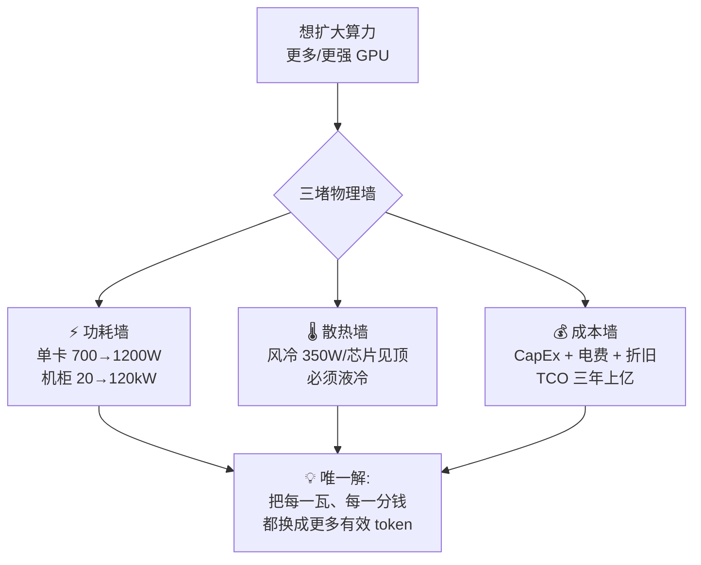
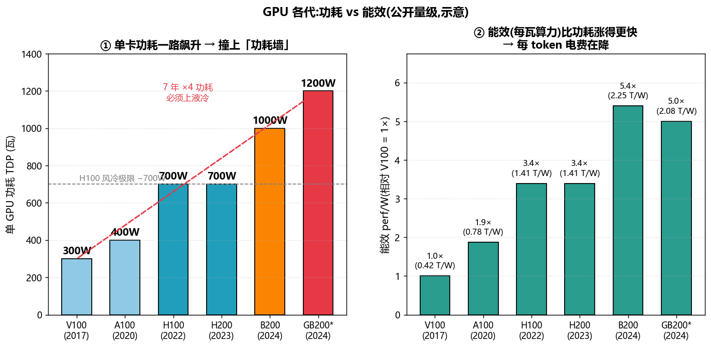
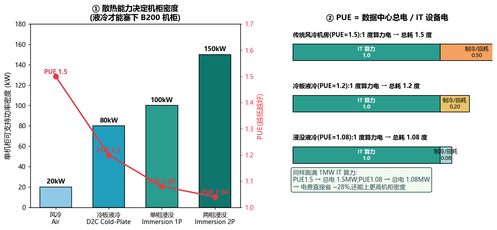
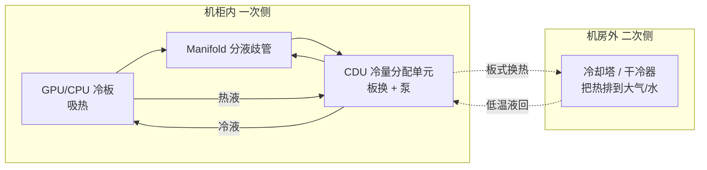
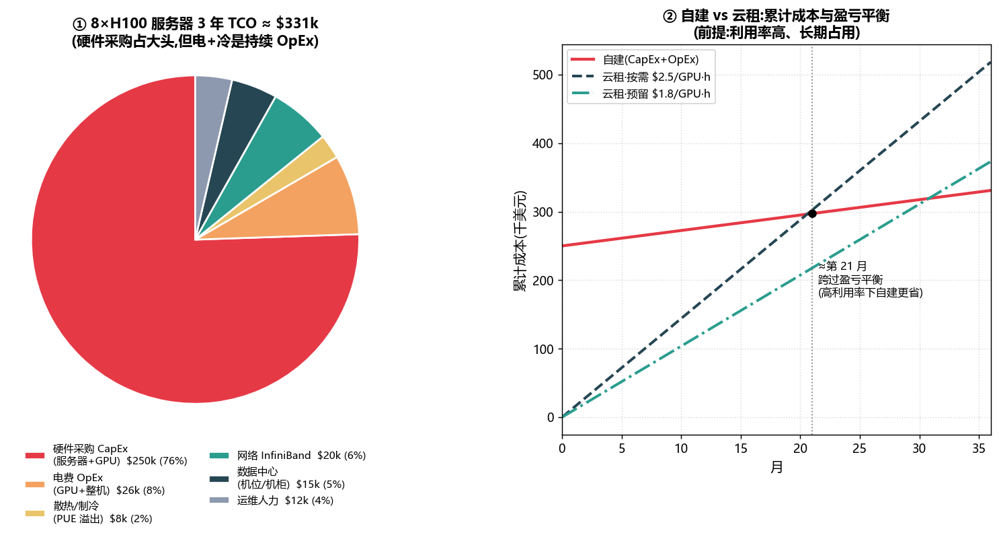
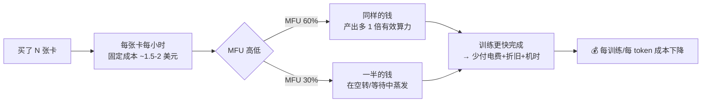
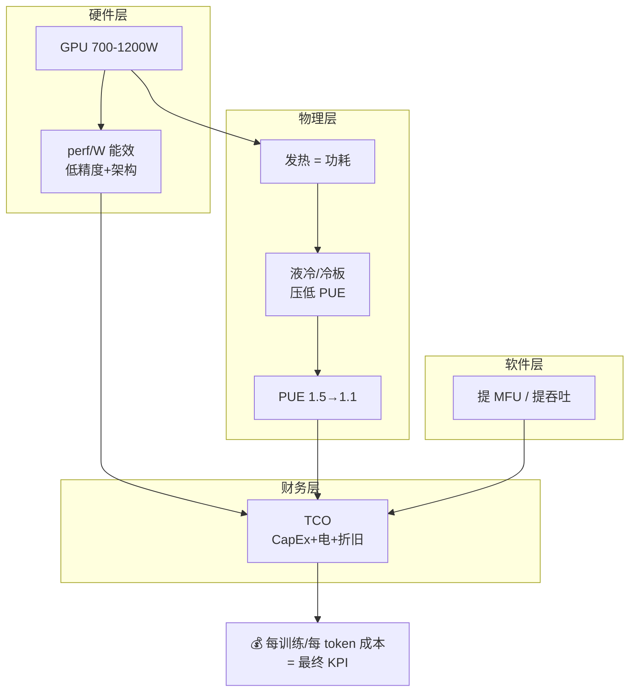

# 功耗、散热与成本 · 功耗墙 / 液冷 / TCO / 能效(全面·本质)

> 一句话本质:**AI 集群的真正瓶颈,早已从「买不买得到卡」变成「供不供得上电、散不散得掉热、算不算得过账」。**
> 一张 H100 满载 700W,一个 8 卡机头 ~10kW,一个 GB200 NVL72 机柜 ~120kW——这已经不是 IT 问题,而是**电力工程 + 热力学 + 财务模型**三合一。本篇从第一性原理讲清:功耗为什么撞墙、液冷为什么必上、TCO 怎么拆、以及**为什么工程师天天喊「提 MFU」其实就是在喊「省钱」**。

---

## 🧭 0. 为什么这一篇值得单独讲?

前面 [`02 GPU 结构`](02_GPU结构_从SM到集群_全面本质.md) 讲了算力怎么来,[`01 PD 分离`](01_PD分离架构_Prefill_Decode_Disaggregation.md) 讲了推理怎么排。但真实世界里,**决定你能不能上 10 万卡集群的,不是算法,是三堵墙**:



> 🔬 **第一性原理**:算力(FLOPS)= 芯片数 × 单芯片算力 × **利用率**。芯片数受**电和热**上限约束,单芯片算力受**功耗墙**约束,而利用率(MFU)是你唯一能靠软件免费拿到的杠杆。所以「省钱」的三个抓手是:**降功耗、提能效、抬 MFU**。

---

## ⚡ 1. GPU 功耗:从 300W 到 1200W 的「功耗墙」

### 1.1 各代单卡功耗一路飙升



| 代 (年) | 卡 | 典型 TDP | 低精度稠密算力 | 能效 perf/W | 散热方式 |
|---|---|---|---|---|---|
| Volta (2017) | V100 | **300W** | ~125 TFLOPS(fp16) | 0.42 T/W(1×) | 风冷 |
| Ampere (2020) | A100 | **400W** | ~312 TFLOPS(fp16) | 0.78 T/W(1.9×) | 风冷 |
| Hopper (2022) | H100 SXM | **700W** | ~990 TFLOPS(bf16) | 1.41 T/W(3.4×) | 风冷极限 / 冷板 |
| Hopper (2023) | H200 | **700W** | ~990 TFLOPS(bf16) | 1.41 T/W | 冷板 |
| Blackwell (2024) | B200 | **~1000W** | ~2250 TFLOPS(fp16 稠密) | 2.25 T/W(5.4×) | **必须液冷** |
| Blackwell (2024) | GB200(单 GPU) | **~1200W** | ~2500 TFLOPS | 2.08 T/W | **必须液冷** |

> **TDP**(Thermal Design Power,热设计功耗):芯片在满载下持续产生、散热系统必须带走的功率。约等于满载电功耗。**几乎全部电功耗最终都变成热**——这是能量守恒,GPU 不是电动机,它不对外做机械功。

> 💡 **实战/面试高频**:「H100 功耗多少?」标准答案是 **SXM 版 700W、PCIe 版 350W**。为什么差一倍?SXM 走 NVLink、供电/散热规格更高、跑得更满;PCIe 版受插槽 300W 供电 + 风冷约束被限频。**同一颗芯片,散热能力直接决定它能放出多少算力。**

### 1.2 什么是「功耗墙」(Power Wall)

**功耗墙**指的是:芯片功率密度(W/mm²)增长到风冷/供电/封装再也扛不住,继续堆频率/堆核只会烧掉芯片。它有三层含义:

1. **芯片级**:Dennard scaling(登纳德缩放)在 ~2006 年终结——晶体管变小后功率密度不再下降,于是频率不能再随意拉高,只能靠堆核(多核化)。
2. **单卡级**:单 GPU 从 300W→1200W,风冷散热(单芯片 ~350-500W 是风冷经济上限)被击穿,**必须换液冷**。
3. **机柜/数据中心级**:传统机房按每机柜 **5-15kW** 设计供电和制冷。一个 GB200 NVL72 机柜要 **~120kW**——直接超设计 8-20 倍,机房要从头改造。

$$
P_{\text{dynamic}} = \alpha \cdot C \cdot V^2 \cdot f
$$

> 🔬 **本质**:动态功耗 $\propto V^2 f$(电压平方 × 频率)。想提频率 $f$ 往往要提电压 $V$,功耗以立方级暴涨——这就是频率撞墙的数学根源。现代芯片改为:**降压 + 堆并行 + 提能效**,而不是拉频率。

### 1.3 机柜供电密度:被忽视的真·瓶颈

| 平台 | 单节点/机柜功率 | 供电要求 | 对机房意味着 |
|---|---|---|---|
| 8×V100 服务器 | ~3-4kW | 传统 PDU 够 | 普通机房可上 |
| 8×A100 服务器 | ~6.5kW | 需高密机柜 | 部分机房需改 |
| 8×H100 服务器 | ~10kW | 需 400V/液冷预留 | 多数老机房塞不下 |
| **GB200 NVL72 机柜** | **~120kW** | **需液冷 + 高压直流** | **必须新建/大改** |

> ⚠️ **常见坑**:很多人以为「买到卡就能开跑」。真实卡点常是**机房那一路电供不上、空调压不住**。10 万卡 H100 集群峰值功耗约 **70-150MW**,相当于一座小城市的用电——这也是为什么大厂开始**自建电站/买核电/挨着水电站建 DC**。

### 1.4 供电链路:每一级转换都在漏电

从电网到晶体管,电压要一路降压转换,**每一级都有损耗**,这些损耗也计入 PUE 的分母之外(供配电损耗):

```
电网 10kV/35kV → 变压器 → 400V 交流 → PSU 电源(AC→DC)→ 48V 母线 → VRM 稳压 → GPU 芯片 ~0.7V
        ~99%          ~98%         ~94-96%(PSU)       ~98%      ~90%(VRM)
```

- 传统 12V 母线在大电流下 $P_{\text{损}}=I^2R$ 损耗大(电流大 → 铜损平方级)。故高密机柜改用 **48V 母线**:同功率下电流降 4×,铜损降 16×。
- 前沿方案(GB200 机柜)进一步上 **高压直流(HVDC)/ 集中式电源架**,减少每台服务器各自 AC→DC 的重复转换损耗。

> 🔬 **本质**:$P_{\text{线损}}=I^2R$——**提高母线电压、降低电流**是减少供电损耗的第一性原理,和「为什么远距离输电用高压」完全同一个道理。机柜功率越高,这一点越致命。

---

## 🌡️ 2. 散热:风冷 vs 液冷,PUE 决定电费溢出

### 2.1 为什么风冷带不动了

热量传递靠介质带走。空气**比热容小、导热差**;水的**体积比热容约是空气的 ~3500 倍**,同样体积带走的热量天差地别。当单芯片 >500W、单机柜 >30-40kW,风冷需要的**风量/风扇功耗/噪声**变得不经济甚至物理不可行——于是液冷登场。



### 2.2 三种散热方案对比

| 方案 | 原理 | 单机柜密度 | 典型 PUE | 改造成本 | 适用 |
|---|---|---|---|---|---|
| **风冷 Air** | 风扇 + 冷通道 + CRAC 空调 | ~5-20kW | ~1.4-1.6 | 低(现成) | ≤A100 时代 |
| **冷板液冷 D2C**(Direct-to-Chip / Cold Plate) | 冷板贴 GPU/CPU,液体在板内带走热,余热仍靠风冷 | ~40-80kW | ~1.1-1.25 | 中(服务器+CDU 改造) | **H100/B200 主流** |
| **单相浸没 Immersion 1P** | 整机泡在绝缘液里,液体升温不沸腾,靠循环换热 | ~60-100kW | ~1.05-1.10 | 高(全套液箱) | 超高密/边缘特例 |
| **两相浸没 Immersion 2P** | 绝缘液沸腾相变吸热(潜热),蒸汽冷凝回流 | ~100-150kW | **~1.02-1.05** | 很高(液体贵/环保争议) | 极致 PUE 研究/特定场景 |

> 💡 **业界现状(2024-2025)**:数据中心主流是**冷板液冷(D2C)**——它改动小、可维护性好、生态成熟,NVIDIA GB200 NVL72 就是**冷板液冷 + 少量风冷**。浸没虽 PUE 更极致,但漏液维护、液体成本、运维习惯改变大,更多在探索期。

> 🔬 **第一性原理:冷板为什么是主流折中**——你不需要把「所有」热都用液体带走,只要把**功率密度最高的 GPU/CPU/HBM**(占整机 ~80% 发热)用冷板精准带走,其余低发热件(内存/硬盘/网卡)继续风冷即可。用最小改造换最大散热收益,这是典型的工程 80/20。

**冷板液冷回路(D2C)长这样**:



- **CDU**(Cooling Distribution Unit,冷量分配单元):液冷的心脏,内含泵和板式换热器,把「机柜内的工质回路(一次侧)」与「机房外的冷却回路(二次侧)」**隔离换热**——芯片侧的液不直接跑到室外,漏液风险和水质要求都可控。
- 一次侧常用去离子水/丙二醇水溶液(防腐防冻),二次侧接冷却塔或干冷器把热最终排给自然环境。

> ⚠️ **常见坑**:液冷不是「装个水管」那么简单。**漏液检测、快接头(dripless connector)、CDU 冗余、水质维护、和现有风冷混布**都是工程难点;运维团队的技能栈也要从「换风扇」升级到「懂流体」。这也是浸没推广慢的现实原因。

### 2.3 PUE:数据中心的「能效税」

**PUE**(Power Usage Effectiveness,电能使用效率):

$$
\text{PUE} = \frac{\text{数据中心总耗电}}{\text{IT 设备耗电}} = \frac{P_{\text{IT}} + P_{\text{制冷}} + P_{\text{供配电损耗}} + P_{\text{照明}}}{P_{\text{IT}}}
$$

- PUE = 1.0 是理论极限(所有电都进了算力,制冷不耗电,不可能达到)。
- PUE = 1.5 意味着:**每 1 度电用于算力,就要额外花 0.5 度电用于散热/供电损耗**——这 0.5 度是纯浪费的「能效税」。
- PUE = 1.08(浸没)则只多花 0.08 度。

> 💡 **算笔账**:同样跑满 **1MW** 的 IT 算力,
> - PUE 1.5 → 总电 1.5MW,一年电费(按 $0.1/kWh)= 1500kW × 8760h × $0.1 ≈ **$131 万/年**
> - PUE 1.08 → 总电 1.08MW → ≈ **$95 万/年**
> **仅靠把 PUE 从 1.5 降到 1.08,一年省 ~$36 万电费(降 ~28%)**,还没算液冷让你多塞几倍算力密度的收益。

> ⚠️ **常见坑:PUE 不衡量算力效率**。PUE=1.0 的机房如果 GPU 全在空转(MFU=0),照样烧钱。PUE 只管「电有没有浪费在制冷上」,**不管「电有没有变成有效 token」**——后者是 MFU 的事(见第 4 节)。两个指标要一起看。

---

## 💰 3. TCO 成本模型:采购 vs 云租、电费、折旧

### 3.1 什么是 TCO

**TCO**(Total Cost of Ownership,总拥有成本)= 在整个生命周期(通常算 **3-5 年**)里,为拥有并运行这套算力所付出的**全部**成本,而不只是买卡的钱。

$$
\text{TCO} = \underbrace{C_{\text{硬件}} + C_{\text{网络}} + C_{\text{机房建设}}}_{\text{CapEx 一次性资本支出}} + \underbrace{(C_{\text{电}} + C_{\text{冷}} + C_{\text{运维}} + C_{\text{折旧摊销}})\times T}_{\text{OpEx 持续运营支出}}
$$

### 3.2 一台 8×H100 服务器 3 年 TCO 拆解



| 项目 | 量级(3 年) | 属于 | 说明 |
|---|---|---|---|
| 硬件采购(整机 8×H100) | ~$250k | CapEx | GPU 占绝对大头 |
| 电费(整机 ~10kW) | ~$26k | OpEx | 10kW×8760h×3×$0.1 |
| 散热/制冷(PUE 溢出) | ~$8k | OpEx | 按 PUE 1.3 额外 ~30% 电 |
| 网络(InfiniBand 分摊) | ~$20k | CapEx | 400G IB 交换/网卡/线缆 |
| 数据中心(机位/机柜) | ~$15k | OpEx | 空间租金/托管 |
| 运维人力 | ~$12k | OpEx | 分摊 |
| **合计 TCO** | **~$331k** | | 硬件占 ~76% |

> 💡 **关键洞察**:H100 时代**硬件采购(CapEx)仍是绝对大头(~76%)**,电费只占个位数百分比。但两个趋势在变:①卡越来越贵但也越来越省电,电费占比缓慢上升;②**在卡的折旧摊销 + 电费口径下,「让卡满载跑有效活」比什么都重要**——空转的卡照样在折旧、照样占机位,却不产出。

### 3.3 折旧:沉默的最大成本

GPU 按会计通常 **3-5 年直线折旧**。一张 $30k 的 H100,3 年折旧 = 每天 ~$27 在「蒸发」,**无论你用不用它**。

$$
\text{每 GPU 每小时的隐含成本} \approx \frac{C_{\text{采购}}}{寿命_{\text{小时}}} + P_{\text{功耗}} \times \text{PUE} \times \text{电价}
$$

以 H100 估:采购摊销 $30k/(3×8760h) ≈ **$1.14/h**,电费 0.7kW×1.3×$0.1 ≈ **$0.09/h**,再加网络/机房/运维摊销 ≈ 合计 **$1.5-2/h**。

> 🔬 **本质**:**GPU 成本主要是「时间成本」不是「电成本」**。卡一旦买了,不管开不开机,折旧的钟就在走。所以「让每张卡每一秒都在做有效计算」= 直接摊薄单位算力成本。这也是下一节 MFU 省钱的财务根源。

**一段可跑的 TCO / 每 token 成本估算**(把上面的公式落成代码,量级示意):

```python
# tco_estimate.py —— 估算 GPU 每小时隐含成本 与 训练每 token 成本
def gpu_cost_per_hour(price=30_000, life_years=3, tdp_kw=0.7,
                      pue=1.3, elec=0.10, overhead_ratio=0.35):
    """采购摊销 + 电费(含 PUE)+ 网络/机房/运维摊销"""
    life_h = life_years * 365 * 24
    capex_ph = price / life_h                      # 折旧摊销
    elec_ph  = tdp_kw * pue * elec                 # 电费(含制冷溢出)
    other_ph = (capex_ph + elec_ph) * overhead_ratio  # 其它摊销
    return capex_ph + elec_ph + other_ph

def cost_per_token(n_params, tokens, n_gpu=1000,
                   peak_flops=990e12, mfu=0.45):
    """训练:总 FLOPs=6*N*D;有效吞吐=峰值*MFU;成本=卡时*卡价"""
    total_flops = 6 * n_params * tokens
    eff = n_gpu * peak_flops * mfu                 # 有效 FLOPs/s
    seconds = total_flops / eff
    hours = seconds / 3600
    cost = hours * n_gpu * gpu_cost_per_hour()
    return cost, hours, cost / tokens

c_ph = gpu_cost_per_hour()
print(f"H100 每卡每小时隐含成本 ≈ ${c_ph:.2f}/h")   # ≈ $1.6/h

for mfu in (0.30, 0.45, 0.60):
    cost, hrs, cpt = cost_per_token(70e9, 1e12, mfu=mfu)  # 70B 模型, 1T tokens
    print(f"MFU={mfu:.0%}: {hrs:6.1f} 墙钟小时(1000卡) → 总 ${cost/1e6:5.2f}M,"
          f" 每百万token ${cpt*1e6:.2f}")
# MFU 30→60%:耗时/总成本几乎腰斩 —— 这就是「提 MFU = 省钱」的量化证据
```

> 💡 把 `mfu` 从 0.30 调到 0.60,`hours` 和 `cost` 直接减半——**代码复现了「MFU 翻倍→成本减半」**。你可以改 `price/pue/elec` 看不同电价、不同 PUE 下的敏感度。

### 3.4 自建 vs 云租:什么时候该买卡?

右图的盈亏平衡分析:

| 维度 | 自建(Buy) | 云租(Rent) |
|---|---|---|
| 前期投入 | 高 CapEx(一次性砸钱) | 几乎为 0 |
| 单位成本(高利用率) | **低**($1.5-2/GPU·h 摊销) | 高($2-4/GPU·h 按需) |
| 弹性 | 差(买了就固定) | **强**(随开随关) |
| 盈亏平衡点 | 见图,**利用率高时约 1.5-2 年回本** | — |
| 适合谁 | 长期、稳定、高利用率的大厂/训练 | 短期、突发、探索期的团队/推理峰谷 |

> 💡 **决策法则**:**「利用率 × 时长」决定买还是租**。如果你的卡能常年跑在 >60-70% 利用率、且要用 2 年以上 → 自建更省(图中约第 21 月跨过盈亏平衡)。如果是短期实验、负载起伏大、或没能力运维机房 → 云租。很多公司走**混合**:基线负载自建,峰值溢出用云。

> ⚠️ **常见坑**:只比「买卡价 vs 每小时租价」是错的。自建要算上**机房改造、液冷 CDU、IB 网络、运维团队、电费、折旧、以及低利用率的浪费**。云价看着贵,但它把这些全打包 + 弹性省掉了空转浪费。**真实对比的是 TCO/有效算力,不是牌价。**

### 3.5 训练 vs 推理:两种截然不同的成本结构

同样是烧 GPU,训练和推理的成本画像完全不同,优化抓手也不同:

| 维度 | 训练 Training | 推理 Serving |
|---|---|---|
| 负载特征 | 长期、稳定、满载 | 峰谷波动大(白天高、深夜低) |
| 主导成本 | **折旧 + 电费**(卡长期占满) | **利用率**(峰谷间大量空转风险) |
| 关键指标 | **MFU**(算力利用率) | **$/1M tokens**、吞吐、SLA(TTFT/TPOT) |
| 买 or 租 | 长期→倾向自建 | 波动大→倾向云 + 弹性扩缩 |
| 省钱抓手 | 提 MFU、通信重叠、好并行 | 批处理、KV cache、PD 分离、投机解码、量化 |

> 💡 **本质**:训练是「把固定的一大坨活尽快算完」→ 越满越省(MFU);推理是「用尽量少的卡扛住波动的请求量」→ 关键是**别让卡在低谷空转**(弹性 + 高并发 batching)。两者都指向同一个财务真理:**GPU 空转 = 烧钱**。

---

## 🔋 4. 能效 perf/watt、MFU 与成本:为什么提 MFU = 省钱

### 4.1 perf/watt:硬件能效

**perf/watt**(每瓦性能)= 算力 / 功耗,是**硬件**层面的能效指标。从图 1 右侧看:虽然单卡功耗从 300W→1200W(×4),但 perf/W 从 0.42→2.25 T/W(×5.4)——**能效比功耗涨得更快**,所以**每 token 的电费其实在逐代下降**。

> 🔬 **本质**:摩尔定律放缓后,厂商靠**架构 + 低精度(fp16→fp8→fp4)+ 先进封装 + 高带宽 HBM** 把 perf/W 撑住。低精度是能效大杀器:fp8 相比 fp16 同样功耗下算力翻倍,而 LLM 很多环节能容忍低精度——这是能效跃升的核心来源之一。

### 4.2 MFU:软件把硬件能效「兑现」了多少

**MFU**(Model FLOPs Utilization,模型算力利用率):你**实际达到**的有效算力,占硬件**理论峰值**的比例。

$$
\text{MFU} = \frac{\text{实际有效 FLOPs/s}}{\text{硬件峰值 FLOPs/s}} = \frac{6 N D / T_{\text{step}}}{\text{GPU 数} \times \text{单卡峰值 FLOPS}}
$$

其中 $N$=参数量、$D$=一步处理的 token 数、$6ND$ ≈ 一步训练的浮点运算量(前向 2ND + 反向 4ND),$T_{\text{step}}$=一步耗时。

| MFU 水平 | 含义 | 典型场景 |
|---|---|---|
| ~30% | 一般,有较大浪费 | 未优化 / 通信瓶颈重 |
| ~40-50% | 良好 | 优化过的大规模训练(业界常见目标) |
| ~50-60% | 优秀 | FlashAttention + 通信重叠 + 好并行策略 |
| >60% | 顶尖 | 高度调优的稠密训练 |

> 💡 **面试高频**:MFU 和 perf/W 什么关系?**perf/W 是硬件天花板,MFU 是你实际爬到了天花板的百分之几**。硬件给你 990 TFLOPS,MFU=40% 意味着你只用出了 ~396 TFLOPS,**剩下 60% 的电和折旧全打水漂**。

### 4.3 为什么「提 MFU」直接等于「省钱」

这是本篇的**题眼**。把两条链串起来:



**推导:每 token 成本与 MFU 成反比。**

$$
\text{Cost}_{\text{per token}} = \frac{\text{GPU 数} \times \text{单卡每秒成本}}{\text{有效吞吐(token/s)}} = \frac{\text{GPU 数} \times c_{\text{gpu/s}}}{\text{峰值 FLOPS} \times \text{MFU} / (6N)}
$$

分母里 MFU 在**乘**位置——**MFU 翻倍,每 token 成本直接减半**。

> 💡 **一句话记牢**:**卡的成本是按时间流逝的(折旧+电费),不是按你算了多少而付的。所以你算得越满(MFU 越高),摊到每个 token 上的钱就越少。提 MFU 不产生任何硬件开销,是纯软件的免费省钱。**

**举例算账**:训练一个模型需 $10^{22}$ FLOPs,用 1000 张 H100(峰值 990 TFLOPS/卡),每卡 $1.75/h。

| MFU | 有效总算力 | 耗时 | 总成本 | 相对 |
|---|---|---|---|---|
| 30% | 297 PFLOPS | ~9.4 h | ~$16.4k | 基准 |
| 45% | 445 PFLOPS | ~6.2 h | ~$10.9k | **省 33%** |
| 60% | 594 PFLOPS | ~4.7 h | ~$8.2k | **省 50%** |

> 🔬 **第一性原理**:同一堆卡、同一段电、同一份折旧,MFU 从 30%→60% 只是**软件把它们用满了**,训练时间腰斩,总成本随之腰斩。这就是为什么 [FlashAttention、算子融合、通信-计算重叠、好的并行切分](02_GPU结构_从SM到集群_全面本质.md)——这些「提 MFU」的活——本质上都是**省钱**的活。CFO 听不懂 MFU,但听得懂「训练成本降一半」。

### 4.4 推理侧同理:MFU 换成吞吐/成本

训练看 MFU,**推理看每百万 token 成本($/1M tokens)**,本质一样:让 GPU 少空转、批处理打满、KV cache 高效、PD 分离减少互相拖累——都是在**抬有效吞吐 / 降单 token 成本**。详见 [`01 PD 分离`](01_PD分离架构_Prefill_Decode_Disaggregation.md)。

> ⚠️ **常见坑:盲目追 MFU 也会踩雷**。为了 MFU 把 batch 拉爆 → 延迟(TPOT/TTFT)爆炸,用户体验崩;或上激进低精度 → 精度掉。**目标从来不是 MFU 数字本身,而是「满足 SLA 前提下的最低单 token 成本」**。MFU 是手段,$/token 才是目的。

### 4.5 别忘了「水」和「碳」:WUE 与可持续

电不是唯一的账。大规模 DC 还有两个隐性成本/约束:

| 指标 | 全称 | 含义 | 与散热的关系 |
|---|---|---|---|
| **WUE** | Water Usage Effectiveness | 每度 IT 电消耗多少升水(L/kWh) | 蒸发冷却省电但**费水**,干旱地区受限 |
| **CUE** | Carbon Usage Effectiveness | 每度 IT 电排放多少 CO₂ | 取决于电网碳强度(煤电 vs 水核风光) |

> 🔬 **本质权衡**:蒸发冷却(cooling tower)靠水蒸发带走大量热、PUE 低,但 WUE 高——**省电和省水常常矛盾**。闭式干冷器省水但换热差、PUE 略高。这就是为什么 DC 选址要综合看**电价、水资源、气候(自然冷却时长)、电网碳强度**——不是随便找块地就能建。

> 💡 **面试延伸**:「大模型很费电/费水吗?」——训练一次大模型的电耗以 GWh 计、伴随可观耗水与碳排;但**摊到单次推理 token 上其实很小**,且逐代能效(perf/W)在快速改善。真正的可持续抓手仍是那三样:**低 PUE(液冷)、高 perf/W(硬件)、高 MFU(软件)**——省电天然就省水省碳。

---

## 🔗 5. 把三堵墙串成一个成本闭环



**读法**:硬件能效(perf/W)是地基,液冷/低 PUE 砍掉能效税,MFU 把买来的算力真正用满——三者共同决定最终的 **$/token**。任何一环拉胯,钱都白花。

---

## 📌 本质小结

1. **功耗墙**:单卡 300→1200W(7 年 ×4),机柜密度 20→120kW,已成扩算力的头号物理约束;动态功耗 $\propto V^2f$ 是频率撞墙的数学根源。
2. **散热墙**:风冷带不动 >500W 芯片,**冷板液冷是当下主流折中**(改造小、密度高);浸没 PUE 更极致但运维/成本重。
3. **PUE**:数据中心的能效税;从 1.5 降到 1.08,电费省 ~28%,但**它不衡量算力有没有变成有效 token**。
4. **TCO**:H100 时代**硬件采购占 ~76%**,但**折旧是按时间流逝的沉默成本**;自建 vs 云租由「利用率 × 时长」决定,比的是 TCO/有效算力,不是牌价。
5. **perf/W vs MFU**:前者是硬件天花板(逐代 ×5.4,涨得比功耗快),后者是你实际爬到的百分比。
6. **提 MFU = 省钱**(题眼):卡的成本按时间折旧,算得越满,摊到每 token 越便宜;**MFU 翻倍 → 每 token 成本减半**,而且是纯软件免费红利。

## 💡 面试高频速答

- **H100 功耗?** SXM 700W / PCIe 350W;散热能力决定放出多少算力。
- **什么是功耗墙?** 功率密度增长击穿风冷/供电/封装上限;$P\propto V^2f$,拉频率不划算,改堆并行+提能效。
- **风冷 vs 液冷?为什么必上液冷?** 水体积比热 ~空气 3500 倍;>500W 芯片 / >40kW 机柜风冷不经济;冷板是主流。
- **PUE 是什么?怎么算?** 总耗电/IT 耗电;1.5 意味每度算力电多花 0.5 度制冷;不衡量 MFU。
- **TCO 包含什么?自建还是云租?** CapEx(硬件+网络+机房)+OpEx(电+冷+运维+折旧);利用率高且长期→自建,反之→云租。
- **MFU 是什么?为什么提 MFU 省钱?** 实际有效 FLOPs/峰值;卡按时间折旧,算越满摊越薄,MFU 翻倍→每 token 成本减半。
- **perf/W 和 MFU 区别?** perf/W 硬件天花板,MFU 软件兑现率;两者相乘才是真实每瓦有效算力。

## ⚠️ 常见坑合集

- 只比「买卡价 vs 租价」,忘了机房/液冷/网络/折旧/空转浪费 → 应比 **TCO/有效算力**。
- 以为电费是大头 → H100 时代硬件+折旧才是大头,电费个位数占比(但会随代际上升)。
- PUE 低 ≠ 省钱,若 GPU 空转照样烧钱;PUE 和 MFU 要一起看。
- 盲目追 MFU 拉爆 batch → 延迟 SLA 崩;目标是「满足 SLA 下最低 $/token」。
- 「买到卡就能跑」→ 真卡点常是机房供电/散热塞不下 120kW 机柜。

## 🔗 延伸阅读

- 算力从哪来:[`02 GPU 结构 · 从 SM 到集群`](02_GPU结构_从SM到集群_全面本质.md)(perf/W、张量核、低精度、互联)
- 为什么 memory-bound/compute-bound 影响 MFU:[`02` 的 Roofline 一节](02_GPU结构_从SM到集群_全面本质.md)
- 推理侧的 $/token 与吞吐:[`01 PD 分离架构`](01_PD分离架构_Prefill_Decode_Disaggregation.md)
- 缓存/NUMA 也影响利用率:[`03 CPU 结构`](03_CPU结构_流水线_乱序_缓存_多核.md)、[`04 内存模型`](04_内存模型_一致性_内存序_GPU与CPU.md)
- 目录总览:[`README`](README.md)
- 分布式训练如何抬 MFU(并行/重叠):`../ultra-scale-playbook`(如已建)
- 推理引擎的成本优化:`../llm-inference/`(vLLM/SGLang 的吞吐与 batching)
- CUDA 算子融合直接提 MFU:`../../Enigneer-infra/cuda-mastery`(如有)

---

> 📎 **图注声明**:本篇 3 张图由 [`figures/_gen_tco.py`](figures/_gen_tco.py) 生成,数据为公开 datasheet / 行业估算的**量级示意**(非精确报价),用于说明趋势与本质。重跑:`cd figures && python _gen_tco.py`。
