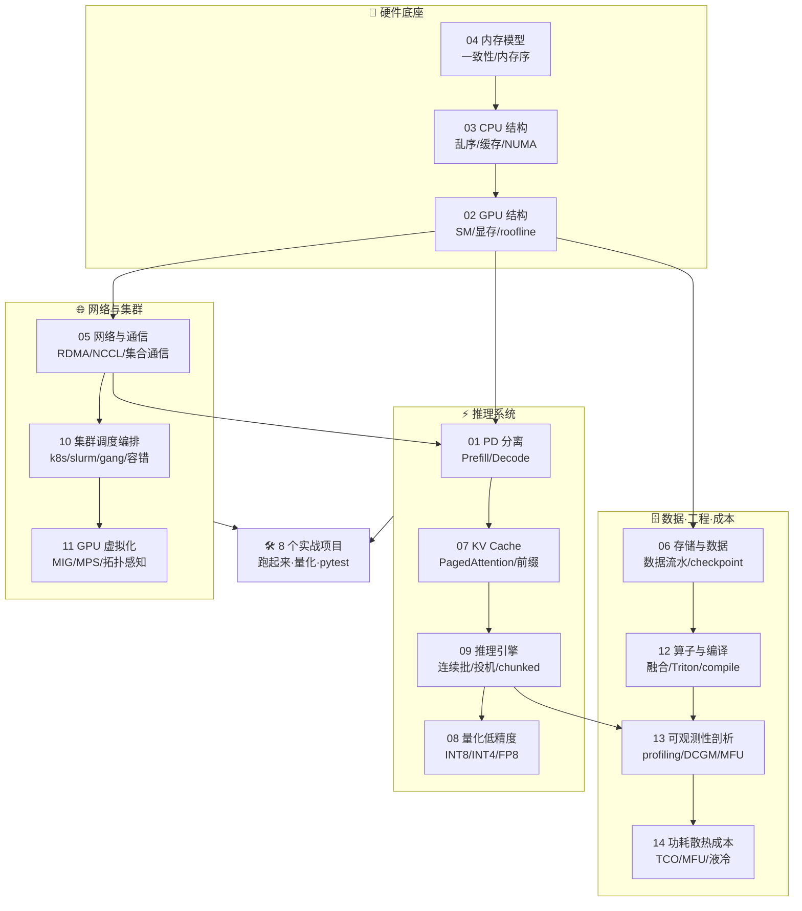

# AI-Infra 底层架构 · 全面·本质·配图·带实战

> 把 AI-Infra 从**硬件底座**到**推理系统**到**集群工程**一条线**讲透、配真图、带可跑项目**:
> **内存/CPU/GPU 结构** · **网络与集合通信** · **PD 分离/KV Cache/量化/推理引擎** · **存储/调度/虚拟化** · **算子编译/可观测性/成本**。
>
> 每篇都从第一性原理出发,配 matplotlib 生成的真实示意图/图表;每个项目都在本机跑通并 `pytest` 验证。
>
> **规模:14 篇讲义 + 8 个实战项目 + `figures/` 41 张配图,全部离线可跑、无需 GPU/网络。**

---

## 🗺️ 学习路径

四条主线,从底层硬件一路爬到集群工程;想吃透"为什么"就从 🧱 底座往上,想直奔应用就从 ⚡ 推理系统读起,遇到瓶颈概念再回看对应底层篇。



---

## 📚 十四篇讲义

| 文件 | 讲什么 | 配图 |
|---|---|---|
| [01 · PD 分离架构](01_PD分离架构_Prefill_Decode_Disaggregation.md) | Prefill(算力受限)/Decode(访存受限)为何要分离、KV 传输、业界系统 | 架构图 + 前后对比 |
| [02 · GPU 结构](02_GPU结构_从SM到集群_全面本质.md) | 吞吐导向、SM/warp/SIMT、显存层级、张量核、Roofline、互联与集群 | SM 结构 + 显存层级 + roofline |
| [03 · CPU 结构](03_CPU结构_流水线_乱序_缓存_多核.md) | 延迟导向、超标量乱序流水线、缓存层级、SIMD、NUMA | 流水线 + 缓存层级 + NUMA |
| [04 · 内存模型](04_内存模型_一致性_内存序_GPU与CPU.md) | 一致性 vs 内存序、MESI、重排、acquire/release、GPU 的 scope | 内存重排 + MESI |
| [05 · 网络与通信](05_网络与通信_RDMA_NCCL_集合通信算法_拓扑.md) | RDMA/RoCE/IB、NCCL、集合通信算法(ring/tree/双二叉树)、α-β 代价、fat-tree/rail 拓扑 | RDMA + AllReduce + 拓扑 |
| [06 · 存储与数据](06_存储与数据_训练数据流水_checkpoint_分布式存储.md) | 训练数据流水线(读取/shuffle/预取)、checkpoint(分片/异步)、对象存储/并行文件系统 | 数据流水 + checkpoint 分片 + 存储栈 |
| [07 · KV Cache 深入](07_KVCache深入_PagedAttention_前缀缓存_量化压缩.md) | PagedAttention、前缀缓存、KV 量化/压缩、MQA/GQA/MLA、KV 分层 | 分页注意力 + 注意力变体 + KV 分层 |
| [08 · 量化与低精度](08_量化与低精度_INT8_INT4_FP8_GPTQ_AWQ_SmoothQuant.md) | INT8/INT4/FP8、对称/非对称、per-tensor/channel/group、GPTQ/AWQ/SmoothQuant、outlier | 量化映射 + SmoothQuant + 精度权衡 |
| [09 · 推理引擎架构](09_推理引擎架构_连续批处理_调度_投机解码_chunked_prefill.md) | 连续批处理、iteration-level 调度、投机解码、chunked prefill | 批处理时间线 + chunked prefill + 投机解码 |
| [10 · 集群调度与编排](10_集群调度与编排_k8s_slurm_gang_弹性_容错.md) | k8s/slurm、gang scheduling、弹性训练、容错与 checkpoint 恢复 | gang 调度 + 容错 + 拓扑感知 |
| [11 · GPU 虚拟化与共享](11_GPU虚拟化与共享_MIG_MPS_拓扑感知.md) | MIG、MPS、时间片、拓扑感知、容器 GPU 栈 | 共享方案 + 容器栈 + 拓扑 |
| [12 · 算子与编译](12_算子与编译_融合_Triton_torchcompile_图优化.md) | 算子融合、Triton、torch.compile、图优化、HBM 往返 | 编译栈 + HBM 往返 + Triton autotune |
| [13 · 可观测性与性能剖析](13_可观测性与性能剖析_profiling_DCGM_瓶颈方法论.md) | profiling(Nsight/torch profiler)、DCGM 指标、MFU、瓶颈定位方法论 | step 时间线 + MFU 瀑布 + 瓶颈树 |
| [14 · 功耗散热与成本](14_功耗散热与成本_TCO_MFU_液冷.md) | TCO、MFU、$/token、PUE、风冷 vs 液冷、能效 | 成本拆解 + PUE 散热 + 能效 |

## 🖼️ 图库(`figures/`,共 41 张,由 matplotlib 脚本生成)

**硬件底座(01–04,11 张)**

| | | |
|---|---|---|
| PD 分离架构 | PD 前后对比 | Roofline 模型 |
| GPU 层级结构 | GPU 显存层级 | CPU 缓存层级 |
| CPU 乱序流水线 | NUMA 拓扑 | CPU vs GPU 哲学 |
| 内存重排/store buffer | MESI 状态机 | |

**拓展篇(05–14,每篇 3 张,共 30 张)**

| 讲义 | 三张配图 |
|---|---|
| 05 网络与通信 | `net_rdma` · `net_allreduce` · `net_topology` |
| 06 存储与数据 | `sd_pipeline` · `sd_checkpoint_shard` · `sd_storage_stack` |
| 07 KV Cache | `kvc_paged_attention` · `kvc_attention_variants` · `kvc_kv_tiering` |
| 08 量化低精度 | `quant_mapping` · `quant_smooth` · `quant_tradeoff` |
| 09 推理引擎 | `ie_batching_timeline` · `ie_chunked_prefill` · `ie_speculative_decoding` |
| 10 集群调度 | `sched_gang` · `sched_reliability` · `sched_topology` |
| 11 GPU 虚拟化 | `gvs_schemes` · `gvs_container_stack` · `gvs_topology` |
| 12 算子编译 | `opc_compile_stack` · `opc_hbm_roundtrip` · `opc_triton_autotune` |
| 13 可观测性 | `prof_step_timeline` · `prof_mfu_waterfall` · `prof_bottleneck_tree` |
| 14 功耗成本 | `tco_breakdown` · `tco_cooling_pue` · `tco_power_efficiency` |

重新生成:
```bash
cd figures
python make_figures.py     # 原 11 张(硬件底座 01–04)
python _gen_net.py         # 05 网络   → net_*.png
python _gen_sd.py          # 06 存储   → sd_*.png
python _gen_kvc.py         # 07 KV     → kvc_*.png
python _gen_quant.py       # 08 量化   → quant_*.png
python _gen_ie.py          # 09 推理引擎 → ie_*.png
python _gen_sched.py       # 10 调度   → sched_*.png
python _gen_gvs.py         # 11 虚拟化 → gvs_*.png
python _gen_opc.py         # 12 算子编译 → opc_*.png
python _gen_prof.py        # 13 可观测性 → prof_*.png
python _gen_tco.py         # 14 成本   → tco_*.png
```

## 🛠️ 实战项目(`projects/`,全部本机跑通 + pytest)

| 项目 | 做什么 | 验证 |
|---|---|---|
| [01 · PD 分离调度模拟器](projects/01_pd_disagg_simulator) | tick 仿真量化"合置 vs 分离":分离让 decode 尾延迟 p99 TPOT 打平 | **6 passed** |
| [02 · Roofline 带宽实测](projects/02_roofline_bandwidth_bench) | 实测本机内存带宽/算力,画 roofline(生成图) | **5 passed** |
| [03 · 缓存局部性实测](projects/03_cache_locality_bench) | 实测转置慢 4×、步长跨缓存行慢 20×、DRAM 悬崖(生成图) | **4 passed** |
| [04 · 集合通信成本模型](projects/04_collective_cost_model) | α-β 成本模型量化 ring/tree/双二叉树在不同卡数 P、消息大小 N 的代价,画最优算法图 → 为何小消息用树、大消息用环 | **72 passed**(3 图) |
| [05 · 分页 KV Cache](projects/05_paged_kv_cache) | 纯 numpy 从零实现 vLLM 块级分配器:固定 block、页表、引用计数、前缀共享 copy-on-write | **17 passed**(1 图) |
| [06 · 量化实验室](projects/06_quantization_lab) | 纯 numpy(torch 对拍)手写 INT8/INT4、对称/非对称、per-tensor/channel/group,实测误差随位宽/粒度变化,复现 outlier | **25 passed**(2 图) |
| [07 · 连续批处理模拟器](projects/07_continuous_batching_sim) | 离散步仿真 static vs continuous batching,量化吞吐/尾延迟差异 | **10 passed**(2 图) |
| [08 · 投机解码模拟](projects/08_speculative_decoding_sim) | 闭式公式 + 蒙特卡洛对拍投机解码期望加速,求最优草稿长度 k*、何时反而变慢 | **17 passed**(3 图) |

> ✅ 8 个项目共 **156 个 pytest 全部通过**(原 3 项 15 + 新 5 项 141);项目 02/03 会**实测你自己机器**的带宽/缓存,项目 04–08 会生成量化图表。

### 一键跑
```bash
cd projects/04_collective_cost_model
python -m pytest -q       # 验证(72 passed)
python run_demo.py        # 生成 ring/tree/双二叉树 代价曲线 + 最优算法图
```

---

## 🎯 面试考点速查

| 主题 | 看这里 |
|---|---|
| PD 分离改善什么/代价 | 01 + 项目 01 |
| memory-bound vs compute-bound / roofline | 02 + 项目 02 |
| warp/SIMT/occupancy/合并访存/bank conflict | 02 |
| 乱序执行/缓存行 64B/伪共享/NUMA | 03 + 项目 03 |
| coherence vs consistency / MESI / acquire-release / GPU scope | 04 |
| RDMA/RoCE vs InfiniBand、NCCL、ring/tree/双二叉树、α-β 模型 | 05 + 项目 04 |
| 为什么 TP 机内、DP/PP 机间 / fat-tree / rail-optimized 拓扑 | 02(互联)+ 05 |
| 训练数据流水线 / checkpoint 分片与异步 / 并行文件系统 | 06 |
| PagedAttention / 前缀缓存 / MQA-GQA-MLA / KV 量化 | 07 + 项目 05 |
| INT8/INT4/FP8、GPTQ/AWQ/SmoothQuant、outlier、per-channel/group | 08 + 项目 06 |
| 连续批处理 / iteration-level 调度 / chunked prefill | 09 + 项目 07 |
| 投机解码期望加速 / 最优草稿长度 k* | 09 + 项目 08 |
| k8s/slurm、gang scheduling、弹性训练、容错恢复 | 10 |
| MIG vs MPS vs 时间片、拓扑感知调度 | 11 |
| 算子融合 / Triton / torch.compile / HBM 往返 | 12 |
| profiling / DCGM 指标 / MFU / 瓶颈定位方法论 | 13 |
| TCO / $per-token / PUE / 风冷 vs 液冷 | 14 |

## 依赖
`python -m pip install numpy matplotlib pytest`(本机已装)。图与项目均离线可跑,无需 GPU/网络。

---

*配套 `../ultra-scale-playbook`(分布式训练)、`../llm-inference/`(推理引擎)、`../../Enigneer-infra/cuda-mastery`(CUDA 算子)。*
