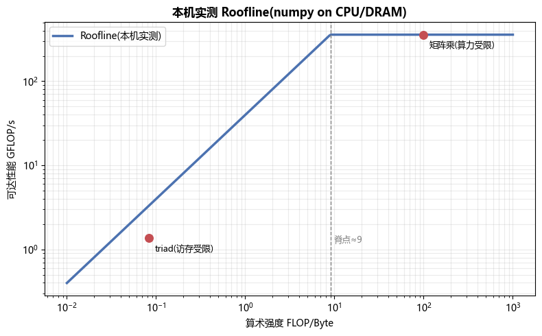

# 项目 02 · Roofline & 内存带宽实测

> 对应 [`../../02_GPU结构_从SM到集群_全面本质.md`](../../02_GPU结构_从SM到集群_全面本质.md) 的 roofline 与显存层级。
>
> 不只是讲概念——**在你这台机器上真实测出**内存带宽 GB/s 与矩阵乘算力 GFLOP/s,算出脊点,把访存受限/算力受限的算子标到 roofline 上。方法与 GPU 完全一致(本机无 GPU,测的是 CPU/DRAM)。

---

## 🎯 测什么

- **带宽(STREAM 风格)**:在大数组上跑 `copy / scale / add / triad`,用"移动字节数 / 耗时"算 GB/s。数组取大(越过 cache)以落到 DRAM。
- **算力**:大矩阵乘 `C=A@B`,`FLOP=2n³`,算 GFLOP/s。
- **算术强度**:triad ≈ `2 FLOP / 24 B = 1/12`(极度访存受限);矩阵乘 ≈ `n/12`(随规模变算力受限)。
- **脊点 ridge** = 峰值算力 / 峰值带宽。

## 📁 文件
| 文件 | 作用 |
|---|---|
| `bench.py` | 实测带宽/算力 + 算术强度/roofline 公式 |
| `test_bench.py` | 5 个 pytest:带宽/算力在合理范围、算术强度与 roofline 公式正确 |
| `run_demo.py` | 跑实测并生成 `measured_roofline.png` |

## ▶️ 如何运行
```bash
python -m pytest -q      # 5 passed
python run_demo.py       # 打印实测带宽/算力 + 生成 measured_roofline.png
```

## 📊 本机实测示例(你的机器会不同)
| 算子 | 带宽 GB/s | 算术强度 |
|---|---|---|
| copy | ~40 | 极低 |
| add | ~31 | ~1/24 |
| triad | ~16 | ~1/12 |
| **矩阵乘** | — | **~100(n=1200)** → **358 GFLOP/s** |

脊点 ≈ **9 FLOP/Byte**:算术强度低于它的算子(triad、逐元素、LLM decode)受带宽限制;高于它的(大矩阵乘、prefill)受算力限制。



## 🔬 和 LLM 的联系
- **decode / 逐元素 / LayerNorm**:算术强度低 → 卡在带宽屋檐 → 优化=减少 HBM 访问、融合、提高带宽利用(见 [`01_PD分离`](../../01_PD分离架构_Prefill_Decode_Disaggregation.md))。
- **prefill / 大 GEMM**:算术强度高 → 逼近算力屋顶 → 优化=喂满张量核、提高占用率。

## 💡 面试高频
- roofline 怎么画、脊点怎么算、怎么判断一个算子该往哪优化。
- 为什么 STREAM triad 是内存带宽的经典基准;为什么矩阵乘能逼近峰值算力。
- 为什么"实测峰值"往往低于"理论峰值"(缓存、页错误、单线程、NUMA)。

## ⚠️ 常见坑
- 数组太小仍在 cache 里 → 测到的是缓存带宽而非 DRAM;要取大数组、warmup、取多次最优。
- numpy 的 `a+b` 会分配临时数组 → 用 `out=` 避免,才测得准。

## 🔗 延伸
- 理论:[`../../02_GPU结构...md`](../../02_GPU结构_从SM到集群_全面本质.md)
- 缓存层级实测:[`../03_cache_locality_bench`](../03_cache_locality_bench)
