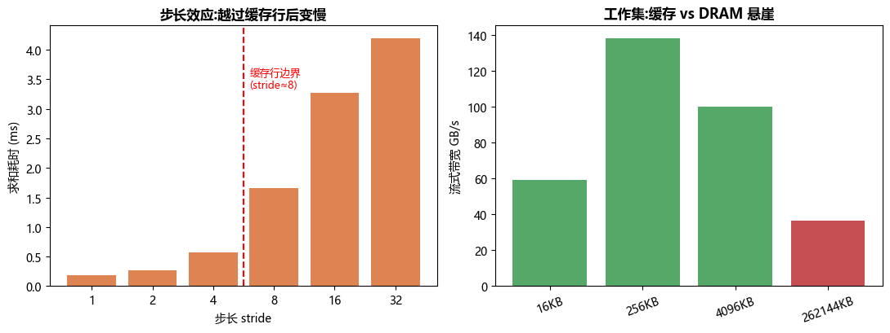

# 项目 03 · CPU 缓存 / 局部性实测

> 对应 [`../../03_CPU结构_流水线_乱序_缓存_多核.md`](../../03_CPU结构_流水线_乱序_缓存_多核.md)。
>
> 缓存不是玄学——**在你这台机器上真实测出**局部性的威力:同样的数据量,访问模式一变,速度差几倍到几十倍。

---

## 🎯 三个实测效应

1. **连续 vs 转置(跨步)**:`A.copy()`(连续读)vs `A.T.copy()`(跨步读)。转置拷贝每次跳到不同缓存行 → 缓存不友好 → **实测慢 ~4×**。
2. **步长效应**:固定读 m 个元素,步长越过**缓存行(64B = 8 个 float64)** 后,每个有用元素要多拖一整条缓存行 → **stride=32 比 stride=1 慢 ~20×**。
3. **工作集悬崖**:数据能装进 cache 时流式带宽高(~140 GB/s),落到 DRAM 时暴跌(~37 GB/s)。



## 📁 文件
| 文件 | 作用 |
|---|---|
| `locality_bench.py` | 三个实测函数(连续/转置、步长、工作集) |
| `test_locality.py` | 4 个 pytest:缓存行=8、转置更慢、步长跨行变慢、DRAM 慢于 cache |
| `run_demo.py` | 跑实测 + 生成 `cache_effects.png` |

## ▶️ 如何运行
```bash
python -m pytest -q      # 4 passed
python run_demo.py       # 打印实测 + 生成 cache_effects.png
```

## 🔬 和 AI-Infra 的联系
- **数据流水**:DataLoader 的数据布局、tokenize 后的内存排布,连续/缓存友好才喂得饱 GPU。
- **算子**:矩阵转置、attention 的 QK^T 布局、layout(NCHW vs NHWC)都在和缓存行较劲——这也是 CUDA 里 shared memory + padding 消除 bank conflict 的 CPU 对应物。
- **伪共享 false sharing**:多线程写同一缓存行的不同变量会互相 invalidate(见 CPU 篇)。Python 有 GIL 难直接复现真并行伪共享,但**步长/局部性效应同源**——都是"缓存行 64 字节"这一物理事实的后果。

## 💡 面试高频
- 缓存行 64 字节;时间/空间局部性;为什么行优先遍历比列优先快。
- 一次 cache miss 的代价;工作集越过 cache 的"悬崖"。
- 伪共享是什么、怎么用 padding/对齐避免。

## ⚠️ 诚实声明
本项目测的是**访问模式**对带宽/延迟的影响(在 numpy/C 层,绕开了 Python 逐元素开销)。真并行伪共享需 C/C++ 多线程才好复现;这里用步长与转置揭示同一物理根源。

## 🔗 延伸
- 理论:[`../../03_CPU结构...md`](../../03_CPU结构_流水线_乱序_缓存_多核.md)、[`../../04_内存模型...md`](../../04_内存模型_一致性_内存序_GPU与CPU.md)
- 带宽/roofline:[`../02_roofline_bandwidth_bench`](../02_roofline_bandwidth_bench)
