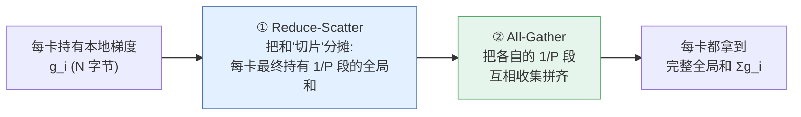
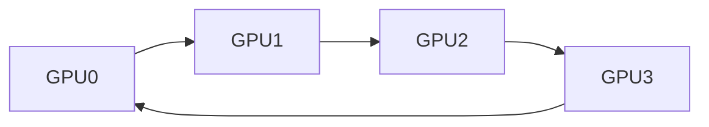
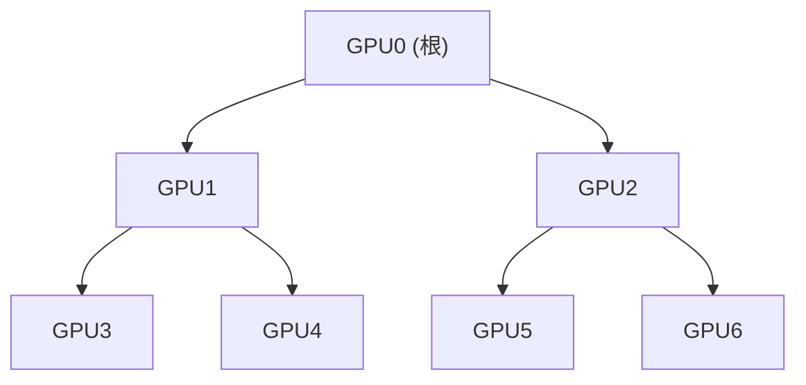
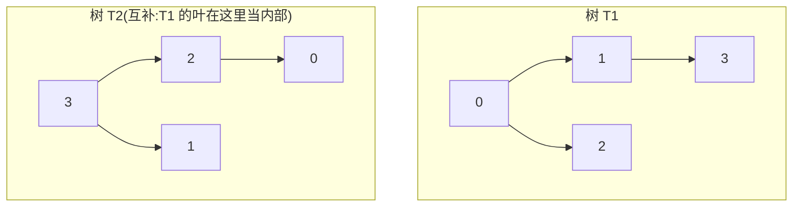
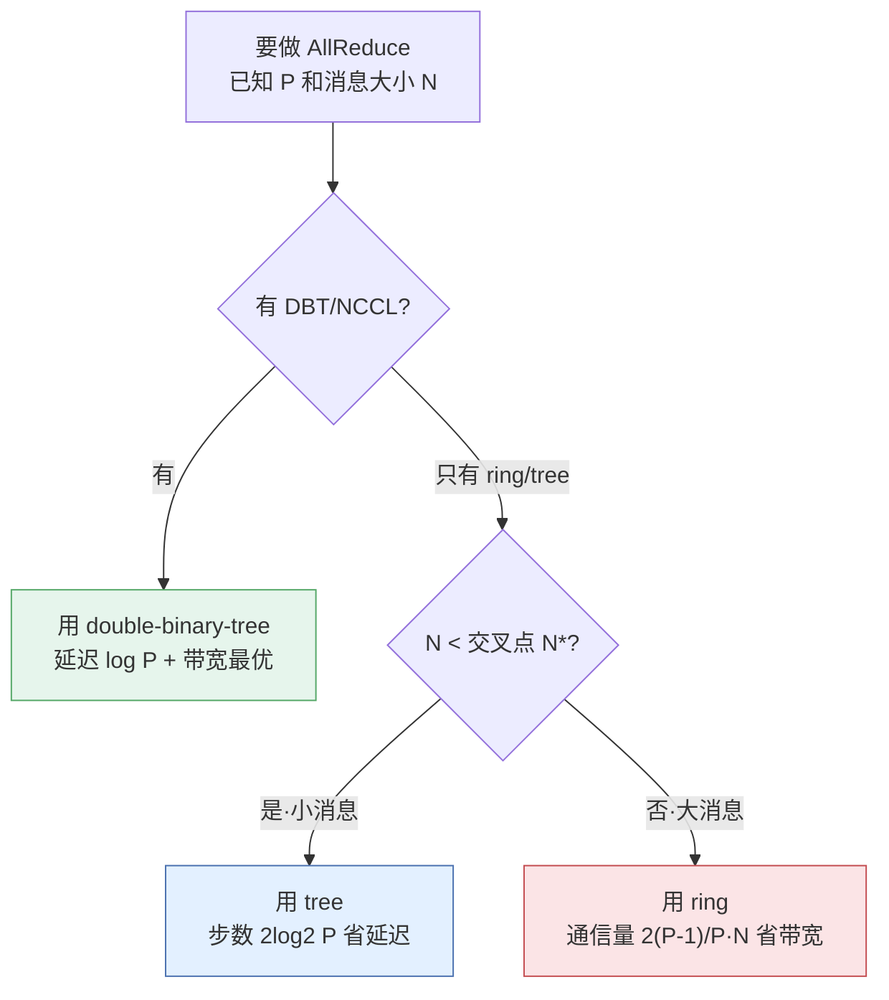
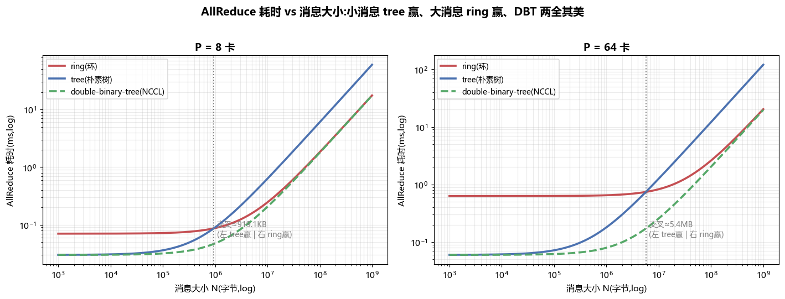
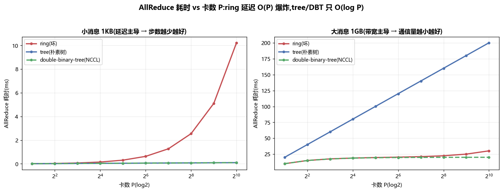
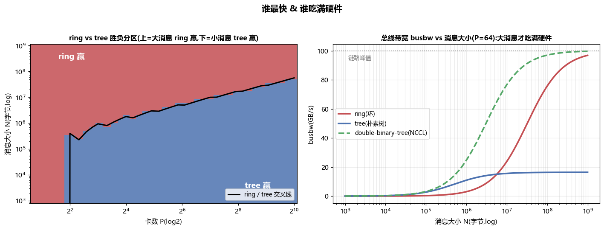
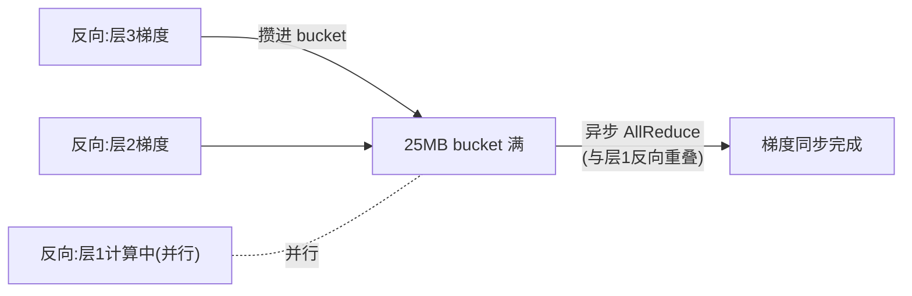
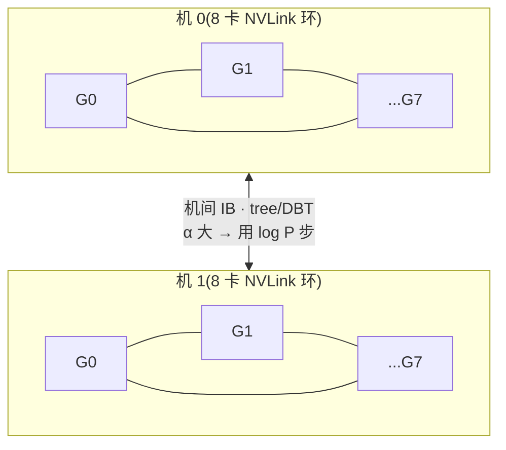

# 项目 04 · 集合通信成本模型 & 拓扑(AllReduce 的 α-β 代价)

> 对应讲义 [`../../05_网络与通信_RDMA_NCCL_集合通信算法_拓扑.md`](../../05_网络与通信_RDMA_NCCL_集合通信算法_拓扑.md)。
>
> 分布式训练里,GPU 之间同步梯度靠的是 **AllReduce**。同一个 AllReduce,换个算法(ring / tree / double-binary-tree)在不同 **卡数 P** 与 **消息大小 N** 下能差几倍到几十倍。
> 本项目用一张纸就能推的 **α-β 成本模型** 把这件事 **量化、画曲线、写成可验证的 pytest**——让你彻底搞懂:**为什么小消息用树、大消息用环,而 NCCL 大集群默认用双二叉树。**

---

## 🎯 你能学到什么

- **是什么**:集合通信(collective communication)、AllReduce、reduce-scatter / all-gather 的分解。
- **为什么**:AllReduce 的两个物理下界——延迟 $\sim\log P$ 跳、带宽 $\sim 2N$ 字节;三种算法各自逼近哪个下界。
- **怎么用**:Hockney **α-β 模型** $T=\alpha\cdot\text{steps}+\beta\cdot\text{bytes}$,给定链路延迟/带宽算出耗时、找交叉点、选算法。
- **代价**:ring 延迟 $O(P)$、tree 带宽 $O(\log P\cdot N)$、DBT 两全其美的物理原因与工程取舍。
- **落地**:这套模型如何映射到真实硬件拓扑(NVLink 环、机间 IB、fat-tree、rail-optimized、torus)与 NCCL 的算法选择。

> 💡 **一句话主线**:**小消息拼"步数(延迟)",大消息拼"通信量(带宽)"。** ring 步数多但通信量最省;tree 步数少但通信量多;double-binary-tree 步数像树、通信量像环 → **Pareto 最优**。

---

## 🧠 零基础起步:什么是 AllReduce?

假设有 $P=4$ 张 GPU,每张各自算完一份梯度向量 $g_0,g_1,g_2,g_3$(各 $N$ 字节)。数据并行训练要求:**每张卡最终都拿到 $g_0+g_1+g_2+g_3$**(求和后好更新同一份权重)。这个"**归约(reduce)+ 让所有人拿到结果(all)**"的操作就是 **AllReduce**。

朴素做法(反面教材):

- **naive:所有卡把数据发给 0 号,0 号求和再广播回去。** 0 号进/出各 $\sim (P-1)N$ 字节 → 中心节点成为瓶颈,带宽随 $P$ 线性恶化,完全不可扩展。

好的算法都把 AllReduce 拆成两个半程,让 **每个节点均摊负载**:



> 🔬 **第一性原理:AllReduce 的两个下界**
> - **带宽下界**:每张卡的数据最终要"离开"它一次(参与全局求和)、结果又要"回到"它一次。信息论下界 ≈ **每卡搬 $2\frac{P-1}{P}N \to 2N$ 字节**。谁能做到就叫"带宽最优"。
> - **延迟下界**:信息要从任一节点传播到所有节点,至少需要 $\lceil\log_2 P\rceil$ 跳(每跳消息数翻倍)。谁能做到就叫"延迟最优"。
> 三种算法就是在这两个下界之间做取舍。

---

## 📐 α-β 成本模型(Hockney model)

我们不模拟每个字节,而用经典的 **α-β 线性模型** 估算一次通信的时间:

$$T \;=\; \underbrace{\alpha}_{\text{每条消息延迟}}\cdot\,\text{steps} \;+\; \underbrace{\beta}_{\text{每字节时间}=1/\text{带宽}}\cdot\,\text{bytes}$$

| 符号 | 含义 | 决定谁 | 典型量级 |
|---|---|---|---|
| $\alpha$ | 一条消息的固定启动延迟(link latency + 软件栈) | **小消息**性能 | NVLink ~1μs、IB ~2–5μs |
| $\beta$ | 每字节传输时间 $=1/\text{带宽}$ | **大消息**性能 | 100 GB/s → $\beta=10^{-11}$ s/B |
| steps | 通信轮数(每轮至少吃一次 $\alpha$) | 延迟项系数 | 见下表 |
| bytes | 临界路径上一个节点搬运的字节数 | 带宽项系数 | 见下表 |

> ⚠️ **常见坑:小消息不是"带宽不够",是"延迟摊不平"。** 发 1 KB,传输本身只要 $10^{-11}\times10^3=10\text{ns}$,但每条消息的 $\alpha\approx$ 微秒级——**耗时几乎全是 steps × α**。所以小消息优化的唯一杠杆是 **减少步数**,这正是树赢的原因。
>
> 💡 **进阶**:更精细的模型会加第三项 $\gamma\cdot\text{bytes}$ 表示"归约求和的计算开销"(reduce 要做加法),即 $T=\alpha S+\beta B+\gamma B'$。本项目为聚焦通信只用两项;$\gamma$ 项对三种算法是同阶的常数,不改变定性结论。

---

## 🧩 三种 AllReduce 算法(逐个讲透)

下面 $P$=卡数,$N$=消息(梯度 buffer)字节数。**记住只看两列:steps(乘 α)和 bytes(乘 β)。**

| 算法 | steps(α 系数) | bytes/节点(β 系数) | 延迟 | 带宽 | 一句话 |
|---|---|---|---|---|---|
| **ring** 环 | $2(P-1)$ | $\dfrac{2(P-1)}{P}N\to 2N$ | $O(P)$ ❌ | 最优 ✅ | 大消息之王 |
| **tree** 朴素二叉树 | $2\log_2 P$ | $2\log_2 P\cdot N$ | $O(\log P)$ ✅ | 差 ❌ | 小消息之王 |
| **double-binary-tree** 双二叉树(NCCL) | $2\log_2 P$ | $\dfrac{2(P-1)}{P}N\to 2N$ | $O(\log P)$ ✅ | 最优 ✅ | **两全其美** |

### 🔴 1. Ring AllReduce(环)

把 $P$ 张卡首尾相连成环,每张卡只和左右邻居通信。AllReduce = **reduce-scatter(P−1 步)+ all-gather(P−1 步)**。



**为什么通信量是 $\frac{2(P-1)}{P}N$?** 把每卡的向量切成 $P$ 段(每段 $N/P$ 字节):

- **Reduce-scatter**:$P-1$ 步,每步每卡把一段发给下家、同时收上家一段并累加。走完每卡持有 **1 段的全局和**。搬运 $(P-1)\cdot\frac{N}{P}$ 字节。
- **All-gather**:再 $P-1$ 步,把各自那段全局和沿环传一圈拼齐。再搬 $(P-1)\cdot\frac{N}{P}$ 字节。

$$\boxed{\;\text{bytes}_\text{ring}=2(P-1)\cdot\frac{N}{P}=\frac{2(P-1)}{P}\,N\;\xrightarrow{P\to\infty}\;2N\;}\qquad \text{steps}_\text{ring}=2(P-1)$$

> 🔬 **第一性原理**:每步只搬 $\frac1P$ 数据,总搬运恰好逼近 **带宽下界 $2N$**,且**与 P 无关**——所以 ring 是"带宽最优"。代价是步数 $2(P-1)$ **随 P 线性增长**:1024 卡要 2046 步,每步吃一份 $\alpha$,小消息被延迟拖死。

**手把手看 $P=4$ 的 reduce-scatter**(把向量切成 a,b,c,d 四段,$g^i_x$ 表示 GPU$i$ 的 $x$ 段):每步"发一段给下家、收上家一段并累加",3 步后每卡恰好持有一段的全局和(下表加粗)。

| 步 | GPU0 持有 | GPU1 持有 | GPU2 持有 | GPU3 持有 |
|---|---|---|---|---|
| 起始 | a0 b0 c0 d0 | a1 b1 c1 d1 | a2 b2 c2 d2 | a3 b3 c3 d3 |
| 1 后 | a0 · · d0+d3 | a1+a0 b1 · · | · b2+b1 c2 · | · · c3+c2 d3 |
| 2 后 | a0 · c段部分 **d0+d3+d2** | **a0+a1+a2**(a段) · · | · b段部分... | ... |
| 3 后 | · · · **∑d** | **∑a** · · · | · **∑b** · · | · · **∑c** · |

> 每卡最终各持"1 段的全局和",共搬 $3\times\frac N4$;再对称地 all-gather 3 步把四段全局和拼齐 → 合计 $2\times3\times\frac N4=\frac{2\cdot3}{4}N=\frac{2(P-1)}{P}N$。**这就是那条黄金公式的由来。**

### 🔵 2. Tree AllReduce(朴素二叉树)

把 $P$ 张卡组织成二叉树。AllReduce = **reduce 上行(叶→根,$\log_2 P$ 步)+ broadcast 下行(根→叶,$\log_2 P$ 步)**。



- **Reduce**:每层子节点把 $N$ 字节发给父节点求和,树高 $\log_2 P$ 层 → $\log_2 P$ 步。
- **Broadcast**:根把 $N$ 字节的结果沿树下发,又 $\log_2 P$ 步。

$$\text{steps}_\text{tree}=2\log_2 P \qquad \boxed{\;\text{bytes}_\text{tree}=2\log_2 P\cdot N\;}$$

> ✅ **好处**:步数只有 $2\log_2 P$——1024 卡也才 20 步,**小消息碾压 ring**。
> ❌ **代价**:临界路径(根到最深叶)**每一跳都要搬满 $N$**,总带宽项 $2\log_2 P\cdot N$ 随 $\log P$ 增长(1024 卡是 $20N$,比 ring 的 $\sim2N$ 差 10 倍)。而且朴素单树的**叶子节点只收不发,上行链路一半闲置**,带宽利用率只有 ~50%。

### 🟢 3. Double Binary Tree(双二叉树,NCCL 大集群默认)

NCCL 的杀手锏:**构造两棵互补的二叉树 $T_0,T_1$,让每个 rank 在一棵里是内部节点、在另一棵里是叶子。** 于是每个节点的**上行、下行链路都被占满**,带宽利用率翻倍到 ~100%,同时保留树的 $\log P$ 深度。



把消息劈成两半,一半走 $T_0$、一半走 $T_1$,两棵树同时流水线跑:

$$\text{steps}_\text{DBT}=2\log_2 P\quad(\text{延迟像树})\qquad \boxed{\;\text{bytes}_\text{DBT}=\frac{2(P-1)}{P}N\to 2N\quad(\text{带宽像环})\;}$$

> 🔬 **第一性原理:为什么能两全其美?** 树的低延迟来自 $\log P$ 深度;树的带宽差来自"叶子闲置 + 单树每跳搬满 $N$"。双树用**互补结构**消灭叶子闲置、用**劈半+流水线**把每跳有效负载降到 $\sim N$ 级别 → **同时逼近延迟下界 $\log P$ 和带宽下界 $2N$**。这就是 NCCL 在几百上千卡上默认用 DBT 而非 ring 的根本原因。
>
> 💡 **诚实声明**:本项目把 DBT 建模为"树的步数 + 环的通信量"这一**理想化上界**,忽略了流水线的填充/排空(fill/drain)开销与非 2 的幂时的树不平衡。它抓住了 DBT 的本质定性行为,足以解释算法选择;要精确到纳秒需实测 `nccl-tests`(本机无 GPU,故用模型)。

### 🔁 其它常见算法(一览,便于面试拓展)

本项目聚焦 ring / tree / DBT 三个最有代表性的,但你该知道它们在算法谱系里的位置:

| 算法 | steps | bytes/节点 | 特点 |
|---|---|---|---|
| **Recursive-doubling**(蝶式) | $\log_2 P$ | $\log_2 P\cdot N$ | 每步与"距离翻倍"的伙伴交换全量 $N$;延迟最优、带宽差,适合**极小消息** |
| **Recursive-halving/doubling**(Rabenseifner) | $2\log_2 P$ | $\frac{2(P-1)}P N$ | reduce-scatter(halving)+ all-gather(doubling);**中等消息**常见默认,2 的幂时很优 |
| **Ring** | $2(P-1)$ | $\frac{2(P-1)}P N$ | 带宽最优、延迟 $O(P)$ |
| **Double-binary-tree** | $2\log_2 P$ | $\frac{2(P-1)}P N$ | 延迟+带宽双优,大集群默认 |

> 💡 MPI/NCCL 内部就是按"消息大小 + P + 拓扑"在这些算法间**自动切换**(NCCL 的 `NCCL_ALGO`、`NCCL_PROTO` 可手动指定 `Ring/Tree/CollNet` 与 `LL/LL128/Simple`)。本项目的成本模型正是这种"自动选择器"背后的决策逻辑。

---

## 📊 谁赢?—— 交叉点(crossover)推导

令两算法耗时相等,解消息大小 $N^\*$。因为两者 bytes 都 $\propto N$(记系数 $c$):

$$\alpha S_a+\beta c_a N=\alpha S_b+\beta c_b N \;\Longrightarrow\; \boxed{\,N^\*=\dfrac{\alpha\,(S_a-S_b)}{\beta\,(c_b-c_a)}\,}$$

对 **ring vs tree**:$S_\text{ring}=2(P-1)>S_\text{tree}=2\log_2P$,而 $c_\text{tree}=2\log_2P>c_\text{ring}=\frac{2(P-1)}P$,分子分母同号 → $N^\*>0$ **存在唯一交叉**:

- $N<N^\*$:延迟主导 → **tree 赢**(步数少)。
- $N>N^\*$:带宽主导 → **ring 赢**(通信量省)。

用本项目默认网络($\alpha=5\mu s$,带宽 100 GB/s)算出的交叉点:

| P | ring↔tree 交叉点 $N^\*$ | 含义 |
|---|---|---|
| 8 | ≈ **919 KB** | 小于 ~1MB 用树,大于用环 |
| 64 | ≈ **5.4 MB** | P 越大,ring 延迟惩罚越重,交叉点右移 |

而 **ring vs DBT**:两者 $c$ 相同($c_b-c_a=0$)→ 分母为 0 → **无正交叉点**,DBT 步数更少故**恒不劣于 ring**;对 tree 同理恒不劣 → **DBT 全区间 Pareto 最优**。



---

## 📁 文件结构

| 文件 | 作用 |
|---|---|
| `collective_cost.py` | 核心:三种算法的步数/通信量公式、α-β 模型、busbw、交叉点求解、默认网络画像 |
| `tests/test_cost_model.py` | **12 组 / 72 个** pytest:验证 ring 通信量=$2(P-1)/P\cdot N$、步数公式、tree/DBT 步数=$2\log_2P$、小消息 tree 赢/大消息 ring 赢、DBT 全程 Pareto 最优、交叉点自洽等 |
| `run_demo.py` | 打印结论表 + 生成 3 张对比图(Agg + 微软雅黑) |
| `requirements.txt` | numpy / matplotlib / pytest |

---

## 🔧 代码讲解(核心就三行)

整个成本模型的灵魂是这三个纯函数(见 `collective_cost.py`):

```python
def ring_steps(P):  return 2 * (P - 1)          # 环:延迟 O(P)
def tree_steps(P):  return 2 * _log2_ceil(P)    # 树:延迟 O(log P)

def ring_coeff(P):  return 2.0 * (P - 1) / P    # 环:带宽最优 →2
def tree_coeff(P):  return 2.0 * _log2_ceil(P)  # 树:带宽 O(log P)
def dbt_coeff(P):   return 2.0 * (P - 1) / P    # 双树:带宽同环(最优)

def allreduce_time(algo, N, P, alpha, beta):    # T = α·steps + β·bytes
    steps  = ALGOS[algo].steps_fn(P)
    nbytes = ALGOS[algo].coeff_fn(P) * N
    return alpha * steps + beta * nbytes
```

派生工具:

- `crossover_size(P, α, β, "ring", "tree")` —— 解析求交叉点 $N^\*$(上面的公式)。
- `bus_bandwidth(algo, N, P, α, β)` —— NCCL 口径的**总线带宽 busbw** $=\frac{N}{T}\cdot\frac{2(P-1)}{P}$,用来横比"谁把硬件吃得更满"。
- `best_algo(N, P, α, β)` —— 直接返回耗时最小的算法名。
- `Network(alpha, bandwidth_gbps)` —— 一个可替换的链路画像(默认 5μs / 100 GB/s)。

---

## 🧪 pytest 到底锁住了什么(72 个断言)

代价模型的价值在于**结论可复现、公式可验证**。测试把每条"定性直觉"变成"定量断言":

| 测试 | 锁住的性质 |
|---|---|
| `test_ring_communication_volume` | ring 通信量**精确等于** $2(P-1)/P\cdot N$(多组 P、N) |
| `test_ring_steps_formula` | ring 步数 $=2(P-1)$ |
| `test_ring_bandwidth_asymptote_to_2N` | ring 带宽系数**单调趋近 2**、永不超过(带宽下界) |
| `test_tree_steps_is_2_log2P` | tree/DBT 步数 $=2\log_2 P$ |
| `test_dbt_same_latency_as_tree_but_bandwidth_as_ring` | DBT 延迟同树、带宽同环(两全其美) |
| `test_small_message_tree_beats_ring` | 小消息(1KB)**tree < ring** |
| `test_large_message_ring_beats_tree` | 大消息(1GB)**ring < tree** |
| `test_dbt_is_pareto_best_everywhere` | DBT 在 $7$ 个量级 × 多个 P 上**恒不劣** |
| `test_crossover_between_ring_and_tree` | 交叉点处两者耗时相等、左树赢右环赢 |
| `test_crossover_moves_up_with_P` | P 越大交叉点越往大消息移 |
| `test_busbw_*` | busbw 为正、不超峰值、随消息增大而升 |

> ✅ 运行结果:**72 passed**。这些断言就是"小消息用树、大消息用环、大集群用双二叉树"这句话的**机器可验证版本**。

---

## ▶️ 如何运行

```bash
pip install -r requirements.txt          # 本机已装
python -m pytest -q                       # 72 passed
python run_demo.py                        # 打印表 + 生成 3 张 png
```

> Windows 终端如遇中文乱码:`run_demo.py` 已在开头 `sys.stdout.reconfigure(encoding="utf-8")`;或先 `chcp 65001`。

---

## 📈 本机跑出的结论(节选)

```
算法                        步数公式        通信量公式
ring(环)                   2(P-1)          2(P-1)/P · N
tree(朴素树)               2·log2(P)       2·log2(P) · N
double-binary-tree(NCCL)   2·log2(P)       2(P-1)/P · N

P=8    ring↔tree 交叉点 ≈ 919.1KB
P=64   ring↔tree 交叉点 ≈ 5.4MB

消息       P    ring(ms)  tree(ms)  DBT(ms)   最优
1000B      8    0.0700    0.0301    0.0300    double-binary-tree
1000B      64   0.6300    0.0601    0.0600    double-binary-tree   ← 小消息:ring 步数多被延迟拖死
9.5MB      8    0.2450    0.6300    0.2050    double-binary-tree   ← 大消息:tree 通信量多吃亏
953.7MB    64   20.3175   120.0600  19.7475   double-binary-tree   ← DBT 始终最优
```

### 图 1 · 耗时 vs 消息大小(交叉点)

左 P=8、右 P=64。**红(ring)与蓝(tree)在交叉点交叉**:左侧树赢、右侧环赢;**绿虚线(DBT)始终是下包络**(最快)。P 越大,交叉点越往右(ring 延迟惩罚变重)。

### 图 2 · 耗时 vs 卡数 P

左小消息(1KB):**ring 耗时随 P 线性爆炸**(延迟 $O(P)$),tree/DBT 几乎贴地($O(\log P)$)。右大消息(1GB):**tree 耗时随 $\log P$ 线性上升**(带宽差),ring/DBT 平缓。

### 图 3 · 胜负分区 & 总线带宽

左:$(P,N)$ 平面上 ring vs tree 的胜负分区,黑线是交叉曲线(上大消息 ring 赢、下小消息 tree 赢)。右:**busbw**——DBT(绿)最快逼近链路峰值,ring(红)大消息才追上,tree(蓝)卡在 ~16 GB/s 上不去(被 $\log P$ 带宽项限死)。

---

## 🧮 动手估一次真实 AllReduce(面试必会)

**题**:1.3B 参数模型,FP16 梯度,64 卡数据并行,链路 100 GB/s、$\alpha=5\mu s$。ring-allreduce 一次要多久?

$$N = 1.3\times10^9 \text{ params} \times 2\text{ B/param} = 2.6\text{ GB} = 2.6\times10^9\text{ B}$$
$$T_\text{ring} = \alpha\cdot 2(P{-}1) + \beta\cdot\tfrac{2(P{-}1)}{P}N = 5\mu s\times126 + 10^{-11}\times1.969\times2.6\times10^9$$
$$= 0.63\text{ ms} + 51.2\text{ ms} \approx \mathbf{51.8\ ms}$$

> 🔬 **读数**:大消息下 **带宽项(51ms)完全碾压延迟项(0.63ms)**——所以此处 ring/DBT 才是对的选择;换 tree 的话带宽项要 $\times\frac{2\log_2 64}{2(P-1)/P}\approx\frac{12}{1.97}\approx6$ 倍 ≈ 300ms,慢 6 倍。
>
> 💡 **工程含义**:一次 51.8ms 的 AllReduce,若每个 training step 只算 100ms,通信就占 1/3——这就是为什么要 **通信/计算重叠** 和 **梯度分桶**(见下)。用 `bus_bandwidth("ring", 2.6e9, 64, 5e-6, 1e-11)` 可算出此时 busbw ≈ 98 GB/s(几乎吃满硬件)。

## 🔗 通信与计算重叠(overlap)& 梯度分桶(bucketing)

成本模型算的是"裸通信时间"。真实框架还有两招把它藏起来:

- **重叠(overlap)**:反向传播是**逐层**产生梯度的。PyTorch DDP 在某层梯度一算完就**立刻异步发起该层的 AllReduce**,与后续层的反向计算并行 → 通信被计算"盖住",端到端几乎只剩计算时间。
- **分桶(bucketing)**:太多小 AllReduce → 每个都吃 $\alpha$,延迟累积(正是本模型"小消息吃 α"的后果)。DDP 把多层梯度**攒进一个 ~25MB 的 bucket** 再一次性 AllReduce → 把 N 做大、把消息数做小,让通信落到"大消息带宽主导"的高效区。



> ⚠️ **坑**:bucket 太小 → 退化成一堆小消息(α 主导,慢);太大 → 重叠窗口变小(要等整桶算完才开发)。25MB 是经验折中,恰好落在本模型的"带宽主导"高效区。

---

## 🌐 从算法到真实硬件拓扑

成本模型里的 $\alpha,\beta,P$ 不是凭空的,它们由**拓扑**决定。算法要"拓扑感知"才能真快:

| 拓扑 | 长这样 | 谁跑得好 | 对应现实 |
|---|---|---|---|
| **Ring(环)** | 卡首尾相连 | ring-allreduce 天然契合 | 单机 8 卡 NVLink/NVSwitch 内组环 |
| **Fat-tree / Clos** | 多层交换机无阻塞 | tree/DBT 契合层级 | 数据中心 InfiniBand 机间网络 |
| **Rail-optimized** | 每卡专属一条 rail 上行 | 同 rail 内先 reduce | 大规模 GPU 集群(每机 8 卡对 8 条 rail) |
| **Torus / mesh** | 2D/3D 网格 | 各维分别做 ring | Google TPU pod、部分超算 |

> 💡 **面试高频:为什么"机内用 ring、机间用 tree/分层"?** 机内 NVLink 延迟低、带宽极高,卡数少($P=8$)→ ring 的 $2(P-1)=14$ 步开销可忽略、带宽最优很划算;机间跨交换机延迟高($\alpha$ 大)、层级多、$P$ 大 → 用 tree/DBT 的 $\log P$ 步数省延迟。真实的 **hierarchical AllReduce**:先机内 ring reduce-scatter,再机间 tree/ring,再机内 all-gather —— 把每层都用最合适的算法。



---

## 💡 面试高频

- **手推 ring AllReduce 通信量**:$2(P-1)/P\cdot N$,并说明 reduce-scatter + all-gather 各 $(P-1)\frac NP$。为什么"与 P 无关、逼近 $2N$"= 带宽最优。
- **ring 的 steps 为什么是 $2(P-1)$**,tree 为什么是 $2\log_2 P$;由此说明小/大消息各选谁。
- **α-β 模型**:两项各代表什么、$\beta=1/$带宽、小消息为何延迟主导。
- **double-binary-tree 解决了什么**:单树叶子链路闲置(带宽 ~50%);双树互补 → 100% 利用 + 保 $\log P$ 延迟。
- **busbw vs algbw**:为什么用 busbw 横比不同 P;`nccl-tests` 报告的就是它。
- **拓扑感知 / 分层 AllReduce**:机内 ring、机间 tree;rail-optimized、NVSwitch 的意义。
- **和 PCIe/NVLink/IB 带宽数字挂钩**:能估一个 1.3B 参数(FP16 梯度 ≈ 2.6 GB)在 100 GB/s 上 AllReduce 一次约几十 ms。

## ⚠️ 常见坑

- **把"通信量"当成"耗时"**:小消息耗时几乎全是 $\alpha\times\text{steps}$,通信量再省也没用——别拿带宽公式解释小消息。
- **忽略 P 对交叉点的影响**:同一消息大小,8 卡该用 ring、1024 卡可能该用 tree/DBT,因为 ring 步数 $2(P-1)$ 爆炸。
- **单树带宽算成 100%**:朴素二叉树叶子只收不发,有效带宽 ~50%;这正是 DBT 存在的理由。
- **非 2 的幂**:$P$ 不是 2 的幂时树不平衡,深度取 $\lceil\log_2P\rceil$(本项目 `_log2_ceil` 已处理);NCCL 会做更复杂的树构造。
- **模型 ≠ 实测**:真实还有拥塞、协议开销、拓扑不规则、GPU 计算 overlap(通信/计算重叠能把 AllReduce 藏进反向传播)。模型给"为什么/往哪走",实测(`nccl-tests`)给"精确数字"。

---

## 📌 小结

- AllReduce 的一切取舍围绕两个下界:**延迟 $\sim\log P$、带宽 $\sim 2N$**。
- **ring**:带宽最优($\frac{2(P-1)}P N$)、延迟 $O(P)$ → **大消息之王**。
- **tree**:延迟 $O(\log P)$、带宽 $O(\log P\cdot N)$ → **小消息之王**。
- **double-binary-tree**:延迟像树 + 带宽像环 → **Pareto 最优,NCCL 大集群默认**。
- 交叉点 $N^\*=\frac{\alpha(S_a-S_b)}{\beta(c_b-c_a)}$;$P$ 越大,ring↔tree 交叉点越往大消息移。
- 真实系统要 **拓扑感知 + 分层**:机内 ring、机间 tree/DBT,把每层用最合适的算法。

---

## 🔗 延伸

- 理论配套:[`../../05_网络与通信_RDMA_NCCL_集合通信算法_拓扑.md`](../../05_网络与通信_RDMA_NCCL_集合通信算法_拓扑.md)
- 为什么"TP 机内、DP/PP 机间":[`../../02_GPU结构_从SM到集群_全面本质.md`](../../02_GPU结构_从SM到集群_全面本质.md)(互联与集群)
- 带宽/roofline 与 memory-bound:[`../02_roofline_bandwidth_bench`](../02_roofline_bandwidth_bench)
- 缓存/局部性(通信也怕 stride):[`../03_cache_locality_bench`](../03_cache_locality_bench)
- PD 分离里 KV 传输的通信代价:[`../01_pd_disagg_simulator`](../01_pd_disagg_simulator)、[`../../01_PD分离架构_Prefill_Decode_Disaggregation.md`](../../01_PD分离架构_Prefill_Decode_Disaggregation.md)
- 存储与 checkpoint 的分布式 IO:[`../../06_存储与数据_训练数据流水_checkpoint_分布式存储.md`](../../06_存储与数据_训练数据流水_checkpoint_分布式存储.md)
- 集群调度里的 gang/拓扑感知:[`../../10_集群调度与编排_k8s_slurm_gang_弹性_容错.md`](../../10_集群调度与编排_k8s_slurm_gang_弹性_容错.md)
- 推理侧的通信(TP AllReduce 在每层):[`../../09_推理引擎架构_连续批处理_调度_投机解码_chunked_prefill.md`](../../09_推理引擎架构_连续批处理_调度_投机解码_chunked_prefill.md)、[`../../../llm-inference/`](../../../llm-inference/)
- 分布式训练全景:[`../../../ultra-scale-playbook`](../../../ultra-scale-playbook)
