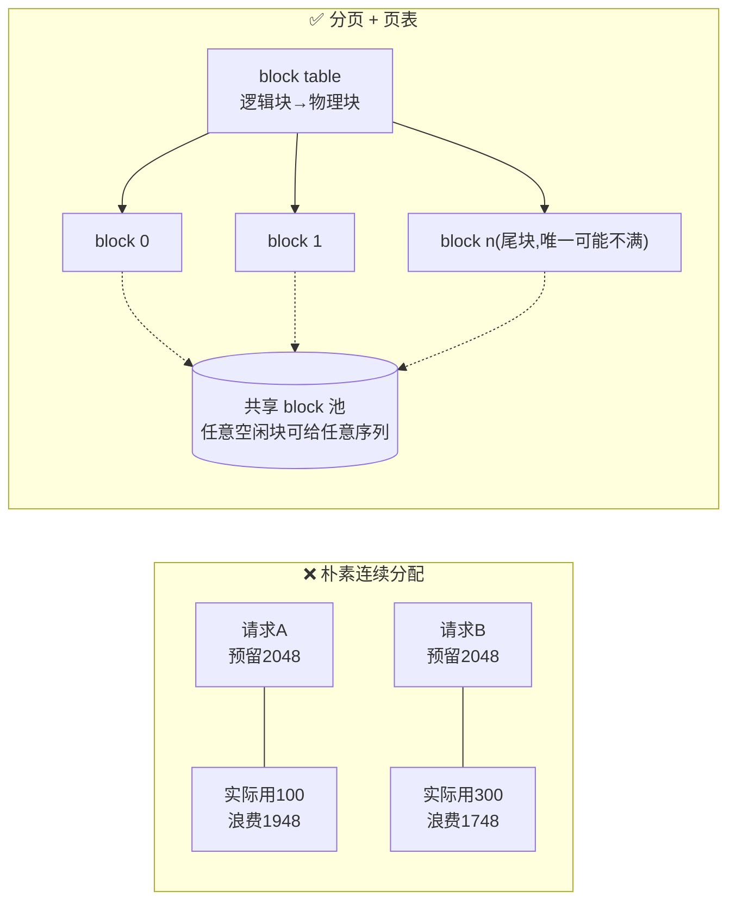
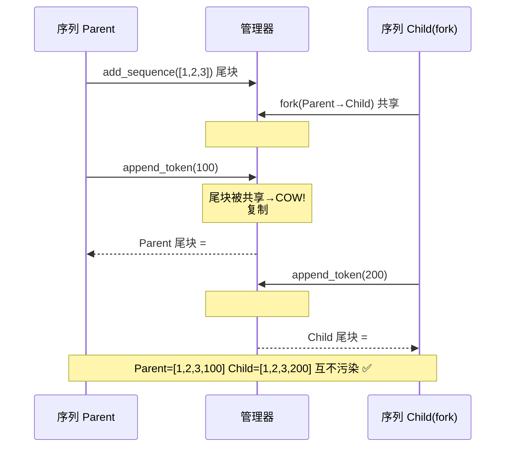
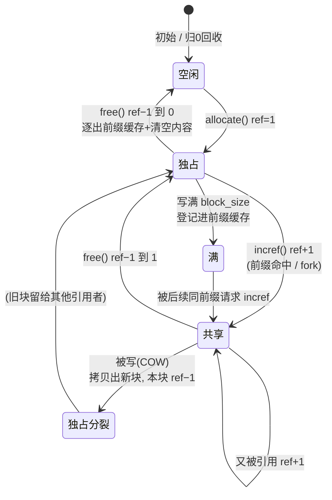
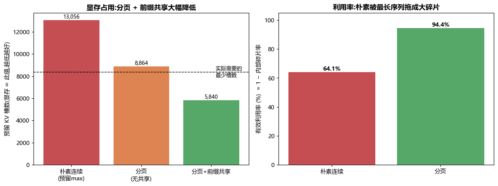

# 项目 05 · PagedAttention 式分页 KV Cache 管理器 🧩

> 对应架构文档 [`../../07_KVCache深入_PagedAttention_前缀缓存_量化压缩.md`](../../07_KVCache深入_PagedAttention_前缀缓存_量化压缩.md)。
>
> 用**纯 Python + numpy**从零实现 vLLM 的核心数据结构:**块级 KV Cache 分配器**。
> 固定大小 block、每序列 block table(页表)、引用计数、前缀共享的**写时复制 copy-on-write**、
> 碎片统计。本机秒级可跑,`pytest` 17 项全绿,`run_demo` 出碎片对比图。
>
> 学完你能对面试官讲清楚:**vLLM 凭什么把吞吐做到 HuggingFace 的 24 倍——不是算子快,是显存管理好。**

---

## 🎯 一句话:KV Cache 是「操作系统内存管理」问题

先复述一个必须刻进 DNA 的事实(细节见架构文档 §1–2):自回归生成时,每个 token 的
`Key/Value` 一旦算出**就不再变**,于是我们把它缓存下来,叫 **KV Cache**。它随生成越滚越大,
最终成为 decode 阶段的**显存瓶颈**。

```
单请求 KV 字节数 = 2 × L(层) × n_kv(头) × d_head × s(序列长) × dtype × batch
```

$$\text{KV bytes} = 2 \times L \times n_{kv} \times d_{head} \times s \times \text{dtype} \times \text{batch}$$

问题来了:**你事先不知道每个请求会生成多长**。传统实现(HF `generate`)怎么办?
——**按最坏情况 `max_seq_len` 给每个请求预留一整段连续显存**。这引出三宗罪:

| 罪 | 英文 | 是什么 | 后果 |
|---|---|---|---|
| 内部碎片 | internal fragmentation | 预留了 2048,实际只生成 100 → 1948 个槽空着但已被占 | 显存利用率常 < 40% |
| 外部碎片 | external fragmentation | 空闲显存总量够,但不连续,塞不下新请求 | 明明有显存却 OOM |
| 无法共享 | no sharing | 100 个请求用同一段系统提示,却各存 100 份相同 KV | 长公共前缀场景巨浪费 |

> 🔬 **第一性原理**:这三宗罪,操作系统在 1960 年代就用**分页(paging)+ 虚拟内存**解决过了。
> vLLM 的 PagedAttention 本质就是**把 OS 的分页搬到 KV Cache 上**:物理内存切成固定大小的
> **页帧(block)**,每个进程(序列)有一张**页表(block table)**做逻辑→物理映射,页可**共享**
> 并配**引用计数 + 写时复制**。本项目就是这套机制的最小可运行实现。



---

## 🧠 三个核心概念:是什么 / 为什么 / 怎么用 / 代价

### ① Block（页）—— 把连续预留切成固定小块

- **是什么**:一个 block 存 `block_size` 个 token 的 KV(vLLM 默认 16)。物理显存 = `num_blocks` 个 block 的池子。
- **为什么**:化整为零后,**任何空闲 block 都能给任何序列** → 外部碎片直接归零;序列增长时**按需追加一块**,不用预留。
- **怎么用**:序列的第 `i` 个逻辑块 → `block_table[i]` → 物理块号。读 KV 时按页表 gather。
- **代价**:多一层间址(indirection),attention kernel 要按 block table 寻址(vLLM 写了专门的 PagedAttention CUDA kernel);块内最后一块可能不满 → **保留了一点点内部碎片,但上限锁死在「每序列 < 1 个 block」**。

### ② 引用计数（ref count）—— 让一个物理块被多个序列共享

- **是什么**:每个物理块记一个整数 `ref_count`,表示「有几个序列正引用我」。
- **为什么**:前缀共享、fork(并行采样)都需要「多个序列指向同一物理块」。释放时不能一有人走就回收——**得等最后一个引用者离开**。
- **怎么用**:`allocate` → ref=1;`incref`(共享)→ ref+1;`free` → ref−1,**归 0 才真正回收**。
- **代价**:每次分配/释放要维护计数;共享块**只读安全,一旦有人要写就危险**(会污染别人)→ 引出 COW。

### ③ 写时复制（copy-on-write, COW）—— 共享块被写前先拷贝

- **是什么**:多个序列共享一个未满的尾块;谁要往里写新 token,**先给它复制一份私有副本**,在副本上写,旧块引用 −1。
- **为什么**:共享是为了省显存(相同前缀只存一份);但 decode 会往尾块追加**各不相同**的新 token,直接写会把别的序列的 KV 覆盖掉。COW 兼顾「省」与「隔离」。
- **怎么用**:`append_token` 前检查尾块 `ref_count > 1`?是 → 复制→旧块 free→页表指向新块→再写。
- **代价**:第一次写触发一次 block 拷贝(`block_size` 个 KV 向量);之后各写各的,零开销。**共享得越久、写得越晚,越赚**。



---

## 📁 文件结构

| 文件 | 作用 |
|---|---|
| `paged_kv_cache.py` | 核心:`BlockAllocator`(空闲链表+引用计数)、`Sequence`(页表)、`PagedKVCacheManager`(add/append/fork/free/stats) |
| `tests/test_paged_kv_cache.py` | 17 个 pytest:分配释放不泄漏、不越界、前缀共享省块、碎片率精确、COW 正确 |
| `run_demo.py` | 64 条聊天请求(共享系统提示),对比朴素 vs 分页 vs 分页+共享,出 `kv_fragmentation.png` |
| `requirements.txt` | numpy / matplotlib / pytest |

---

## 🔬 代码讲解:三个类,层层递进

### `BlockAllocator`——物理页帧分配器(≈ OS 的 buddy/free-list)

```python
class BlockAllocator:
    def __init__(self, num_blocks):
        self._free = list(range(num_blocks - 1, -1, -1))  # 空闲块栈,O(1) 出入
        self.ref_count = [0] * num_blocks                 # 每块引用计数

    def allocate(self):                    # 0 → 1
        if not self._free:
            raise OutOfMemory(...)         # 池满:真实引擎在此触发抢占/换出
        b = self._free.pop(); self.ref_count[b] = 1; return b

    def incref(self, b):  self.ref_count[b] += 1          # 共享:+1

    def free(self, b):                     # −1,归 0 才回收
        self.ref_count[b] -= 1
        if self.ref_count[b] == 0:
            self._free.append(b); return True
        return False
```

> 💡 **实战对照**:vLLM 的 `BlockSpaceManager` / `BlockAllocator` 就是这个结构的工业版
> (再加上 GPU/CPU 双层、块换出 swap、prefix cache 的 LRU 逐出)。核心不变:**空闲链表 + 引用计数**。

### `PagedKVCacheManager.add_sequence`——prefill 阶段,逐满块尝试前缀共享

```python
n_full = len(tokens) // bs
prev = 0
for i in range(n_full):
    blk = tuple(tokens[i*bs:(i+1)*bs])
    prev = self._chain_hash(prev, blk)             # 链式哈希:身份=f(前缀, 本块)
    if sharing and prev in self.prefix_cache:      # 前缀命中!
        pblock = self.prefix_cache[prev]
        self.alloc.incref(pblock)                  # 只 +1 引用,一个字节都不写
        self.blocks_saved_by_prefix += 1
    else:
        pblock = self.alloc.allocate()
        self.store[pblock, :] = blk                # 写入 KV
        self.prefix_cache[prev] = pblock           # 登记,供后续共享
    seq.block_table.append(pblock)
# 不满的尾块永远私有(还要继续写,不能共享)
```

> ⚠️ **常见坑:为什么用「链式哈希」而不是「单块哈希」?**
> 若只用本块内容做哈希,序列 `[A,B]` 和 `[X,B]` 的第 2 块都是 `B`,会被错误判定可共享——
> 但它们的**前缀不同**,KV 值其实不同(attention 依赖前文)!链式哈希 `h_i = f(h_{i-1}, blk_i)`
> 保证**只有从头完全相同的前缀才碰撞**,语义正确。这就是 vLLM 的 prefix hashing 做法。

### `PagedKVCacheManager.append_token`——decode 阶段,含 COW 分支

```python
last = seq.block_table[-1] if seq.block_table else None
if last is None or self.filled[last] == bs:        # A. 尾块满 → 新块
    last = self.alloc.allocate(); seq.block_table.append(last)
elif self.alloc.ref_count[last] > 1:               # B. 尾块共享 → COW
    newb = self.alloc.allocate()
    self.store[newb, :] = self.store[last, :]       # 复制整块 KV
    self.filled[newb] = self.filled[last]
    self.alloc.free(last)                           # 旧块引用 −1
    seq.block_table[-1] = newb; last = newb
    self.cow_count += 1
# C. 尾块独占 → 直接写
self._write_slot(last, token_id)
```

> 🔬 **本质**:注意三条分支的**触发条件互斥且完备**——满块走 A(新块,不 COW),
> 共享未满走 B(COW),独占未满走 C(直写)。**满的共享块永远不会被 COW**(它已满,不再写),
> 这是 COW 只作用于「尾块」的关键,也是很多手写实现容易搞错的地方。

---

## 🔄 一个物理块的一生(状态机)

理解引用计数系统,最快的方式是盯着**单个物理块**看它的状态迁移:



> ⚠️ **常见坑:提前回收(use-after-free)与泄漏(leak)是引用计数的两大死因**。
> - 提前回收:`free` 时没判断 ref 是否归 0 就回收 → 别的序列还在用,读到脏数据。
> - 泄漏:`fork`/共享时忘了 `incref`,或释放路径漏掉某些块 → 块永不回收,池子慢慢耗尽。
> 本项目用 `test_no_leak_after_mixed_workload` + `test_free_shared_prefix_no_premature_recycle`
> 两条测试,分别把这两个死因焊死。

---

## ⏱️ 复杂度与数据结构一览

| 操作 | 时间复杂度 | 关键数据结构 | 说明 |
|---|---|---|---|
| `allocate` / `free` | **O(1)** | 空闲块栈 `_free`(list 当 stack) | pop/append 都是尾部操作 |
| `incref` | O(1) | `ref_count` 数组 | 直接下标 +1 |
| `add_sequence` | O(n_blocks) | 前缀缓存 dict + 链式哈希 | 每满块一次哈希查表 O(1) |
| `append_token` | O(1) 摊还 | block table(list) | 满块/COW 时一次 O(block_size) 拷贝 |
| `fork` | O(块数) | 复制 block table + 逐块 incref | 零 KV 拷贝,只动计数 |
| 前缀查找 | O(1) | `prefix_cache: hash→block` | 哈希表命中即共享 |
| 碎片统计 | O(num_blocks) | `filled` 数组 | 遍历在用块求和 |

> 💡 **实战**:这套结构里**没有任何 O(n²) 或需要连续扫描空闲空间的操作**——这正是它相对
> 「连续分配 + first-fit 找空洞」的优势:后者找连续空洞随碎片增多会退化。分页把「找空间」
> 变成「从栈里 pop 一块」,永远 O(1)。

---

## 🧮 碎片率:手把手算一遍

以 `test_fragmentation_exact_values`(`block_size=4`,一条长度 10 的序列)为例:

$$
\text{已分配块} = \left\lceil \frac{10}{4} \right\rceil = 3,\quad
\text{已分配槽} = 3 \times 4 = 12,\quad
\text{已写槽} = 10
$$

$$
\text{内部碎片率} = 1 - \frac{\text{已写槽}}{\text{已分配槽}} = 1 - \frac{10}{12} = \frac{2}{12} \approx 16.7\%
$$

那 2 个空槽在**尾块**里(逻辑块 2 只填了 `10 \bmod 4 = 2` 个)。**关键洞察**:无论序列多长,
浪费永远 $\le \text{block\_size}-1$ 个槽,即 **每序列内部碎片上限 = 1 个块**。序列越长,这点固定浪费
被摊得越薄 → 碎片率趋近 0。

对比朴素连续分配:预留 `max_seq_len=2048`,实际生成 100 → 碎片率 $1 - 100/2048 \approx 95\%$。
**分页把「与最长序列挂钩的碎片」换成了「与 block_size 挂钩的固定小碎片」**,这就是利用率从
64% 跳到 94% 的数学根源。

---

## 🧭 从零到进阶:建议的阅读/上手顺序

1. **跑起来**:`python -m pytest -q` 看 17 绿,`python run_demo.py` 看碎片图。先有体感。
2. **读分配器**:`BlockAllocator` 30 行,理解「空闲栈 + 引用计数」——这是全部地基。
3. **读 add/append**:跟着 `test_add_sequence_layout_and_readback` 单步,看逻辑块如何映射到物理块。
4. **读共享**:`test_prefix_sharing_saves_blocks` → 理解链式哈希为什么能安全共享。
5. **读 COW**:`test_fork_shares_then_cow_diverges` 是最精彩的一条,fork→写→分裂全流程。
6. **进阶延伸**:去架构文档看 vLLM 如何在此之上加 CPU 换出、chunked prefill、prefix cache LRU。

---

## ▶️ 如何运行

```bash
cd projects/05_paged_kv_cache
pip install -r requirements.txt      # numpy / matplotlib / pytest

python -m pytest -q                  # 17 passed
python run_demo.py                   # 打印三方案对比 + 生成 kv_fragmentation.png
```

> 离线纯 CPU,无需 GPU / 联网 / 模型 / key。matplotlib 用 `Agg` 后端 + 微软雅黑字体。

---

## 📊 典型输出解读

`run_demo.py`(64 条聊天请求,共享 48-token 系统提示,block_size=16):

| 方案 | 预留 KV 槽 | 相对朴素 | 有效利用率 | 内部碎片率 |
|---|---:|---:|---:|---:|
| 朴素连续(预留 max) | 13,056 | 1.00× | **64.1%** | **35.9%** |
| 分页(无共享) | 8,864 | 1.47× | **94.4%** | **5.6%** |
| 分页 + 前缀共享 | **5,840** | **2.24×** | — | — |

- **分页把利用率从 64% 拉到 94%**:朴素方案被那条 204-token 的最长序列绑架——每个请求都按 204 预留,短请求全是浪费;分页按需分配,碎片被锁死在「每序列 < 1 块」。
- **前缀共享再省一半**:64 条请求的 48-token 系统提示(3 个满块)只存 1 份,省下 189 个物理块(3024 槽)。显存压到朴素的 **1/2.2**。
- 本 demo 里 COW = 0(每条序列独立 decode,没 fork)。想看 COW 请看测试 `test_fork_shares_then_cow_diverges`——那才是并行采样/beam search 的场景。



> 左图:预留槽数(∝ 显存,越低越好),虚线是「实际最少需要」。分页贴着虚线,朴素高出一大截。
> 右图:有效利用率,分页 94% vs 朴素 64%。

---

## 🧪 测试覆盖(17 项,pytest 全绿)

| 类别 | 代表用例 | 断言的不变量 |
|---|---|---|
| 分配器 | `test_allocator_out_of_memory_raises` | 池满 `allocate` 抛 `OutOfMemory` |
| 引用计数 | `..._shared_block_not_freed_until_zero` | 共享块 ref 归 0 才回收 |
| 不越界 | `test_append_never_overflows_block` | 每块 `filled ≤ block_size`,读回 == 写入 |
| 前缀共享 | `test_prefix_sharing_saves_blocks` | 相同前缀第二条**一块不多用**,`saved==4` |
| 部分共享 | `..._partial_common_prefix` | 前 2 块共享、第 3 块私有,内容正确 |
| 碎片精确 | `test_fragmentation_exact_values` | 长 10 用 3 块 → 碎片 == 2/12(精确) |
| 分页 > 朴素 | `test_paged_beats_naive_utilization` | 分页利用率 > 0.85 > 朴素 < 0.6 |
| **COW** | `test_fork_shares_then_cow_diverges` | fork 共享 → 写触发 COW → 两序列内容互不污染 |
| 不泄漏 | `test_no_leak_after_mixed_workload` | 混合负载(add/append/fork)全释放后空闲块满额、ref 全 0、缓存清空 |

> 💡 **面试高频:「你怎么证明没内存泄漏?」** ——见 `assert_no_leak`:释放所有序列后断言
> `num_free == num_blocks`、`所有 ref_count == 0`、`prefix_cache == {}`。**引用计数系统最怕的就是
> 泄漏(该回收没回收)和提前回收(还有人用就回收了 → use-after-free)**,两条各有测试守住。

---

## 💡 面试高频问答

<b>Q1:PagedAttention 到底解决了什么?为什么能提吞吐?</b>
> 它解决 KV Cache 的**显存碎片**。朴素连续分配利用率常 < 40%,分页做到 > 90% → 同样显存能**并发跑更多请求**(更大的 batch)。而 decode 是访存受限的,batch 越大、算力利用率(MFU)越高 → **吞吐上去了**。注意:**不是 kernel 变快了,是显存装得下更大的 batch**。

<b>Q2:block_size 怎么选?大好还是小好?</b>
> 权衡:**块越小,内部碎片越小**(尾块浪费上限 = block_size−1),但**页表越长、寻址开销越大、prefix cache 命中粒度越粗**。块越大反之。vLLM 默认 16,是碎片与寻址开销的经验平衡点。面试能说出这个 tradeoff 就够。

<b>Q3:前缀共享的哈希为什么要「链式/带前缀」?</b>
> 见上文坑:attention 的 KV 依赖全部前文,只有**从头完全相同的前缀**其 KV 才真正相等。链式哈希 `h_i = f(h_{i-1}, block_i)` 确保中间块内容相同但前缀不同的序列**不会**被错误共享。

<b>Q4:什么时候触发 COW?代价多大?</b>
> 当**多个序列共享一个未满的尾块,且其中一个要写新 token** 时。代价 = 复制一个 block 的 KV(`block_size × 2 × L × n_kv × d_head`)。典型场景:一个 prompt 采样 N 条候选(parallel sampling)、beam search——它们共享 prompt 的 KV,直到各自生成分叉才 COW。**共享期越长越省**。

<b>Q5:block 池满了(OOM)怎么办?</b>
> 真实引擎会**抢占(preemption)**:挑一个序列,要么把它的 KV **换出(swap)到 CPU 内存**,要么直接**重算(recompute)**丢弃后重来,腾出 block 给高优先级请求。本项目简化为直接抛 `OutOfMemory`,但把「归 0 回收 + 引用计数」这套地基打好了,换出只是再加一层 CPU block 池。

<b>Q6:分页 vs 朴素,external fragmentation 怎么就没了?</b>
> 朴素要求**连续**大段显存,空闲总量够但不连续时塞不进 → 外部碎片。分页把需求切成**等大的块**,任何空闲块都能用,**不要求连续** → 外部碎片从定义上消失,只剩每序列一个尾块的内部碎片。

---

## ⚠️ 本实现的简化(诚实声明)

- **不存真实 KV 向量**:用 `int64` 数组每格存一个 token id 当替身,足以验证「共享/COW/寻址」的**正确性**;真实系统每格是 `2·L·n_kv·d_head` 个 fp16。数据结构与算法完全一致。
- **无 GPU kernel**:真正的 PagedAttention 要一个按 block table 寻址的 CUDA kernel;本项目只做**内存管理层**(vLLM 里对应 `BlockManager`,和 kernel 解耦)。
- **OOM 不做换出/重算**:直接抛异常,把抢占策略留给读者延伸。
- **prefix cache 无 LRU 逐出**:块被引用时常驻、归 0 即逐出;vLLM 还会对「ref=0 但可能复用」的块做 LRU 缓存以跨请求命中。
- 目的是**讲透机制、可跑可测**,不是复刻 vLLM 全部工程细节。

---

## 📌 小结

1. KV Cache 的显存管理**本质是操作系统的分页问题**:固定 block(页)+ block table(页表)+ 引用计数 + 写时复制。
2. **分页消除外部碎片、把内部碎片锁死在每序列 < 1 块** → 利用率从 ~64% 提到 ~94%(本机 demo 实测)。
3. **前缀共享**让相同系统提示只存一份,再省一半显存;**COW** 保证共享块被写时不互相污染。
4. 利用率上去 → 能装下更大 batch → decode 的 MFU/吞吐上去,**这才是 vLLM 提速的真实来源**。
5. 17 项 pytest 守住「不泄漏 / 不越界 / 省块 / 碎片精确 / COW 正确」五类不变量。

---

## 🔗 延伸

- 架构原理(强烈先读):[`../../07_KVCache深入_PagedAttention_前缀缓存_量化压缩.md`](../../07_KVCache深入_PagedAttention_前缀缓存_量化压缩.md)
- KV 量化压缩(与分页正交的另一条省显存路线):同上文档 §量化压缩 + [`../../08_量化与低精度...md`](../../08_量化与低精度_INT8_INT4_FP8_GPTQ_AWQ_SmoothQuant.md)
- 推理引擎调度(分页是它的地基):[`../../09_推理引擎架构_连续批处理_调度_投机解码_chunked_prefill.md`](../../09_推理引擎架构_连续批处理_调度_投机解码_chunked_prefill.md)
- 内存一致性/内存序(引用计数背后的并发正确性):[`../../04_内存模型_一致性_内存序_GPU与CPU.md`](../../04_内存模型_一致性_内存序_GPU与CPU.md)
- 姊妹项目:
  - [`../01_pd_disagg_simulator`](../01_pd_disagg_simulator/README.md) —— PD 分离调度模拟器(decode 尾延迟)
  - [`../02_roofline_bandwidth_bench`](../02_roofline_bandwidth_bench/README.md) —— roofline / 访存带宽(decode 为何 memory-bound)
  - [`../03_cache_locality_bench`](../03_cache_locality_bench/README.md) —— CPU 缓存局部性(分页寻址的间址代价直觉)
- 仓库既有:`../../../llm-inference/`(vLLM / PagedAttention / 前缀缓存实践文章)
