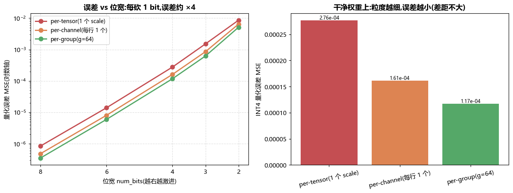
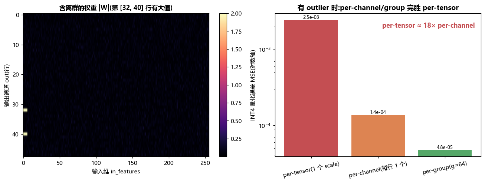
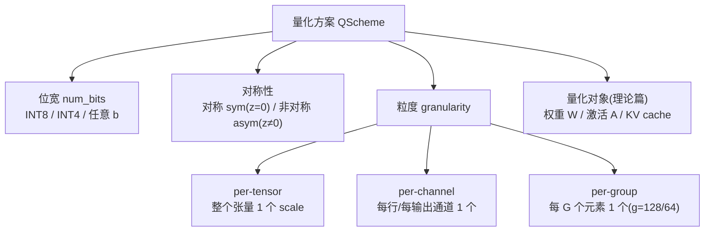
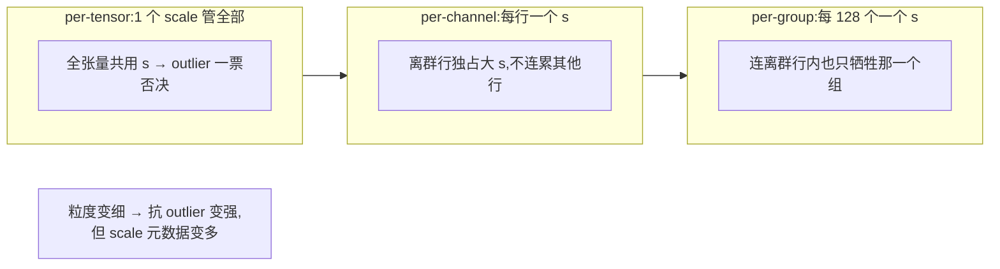
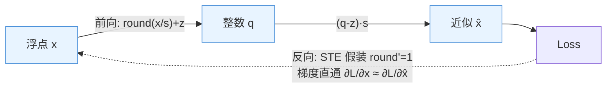
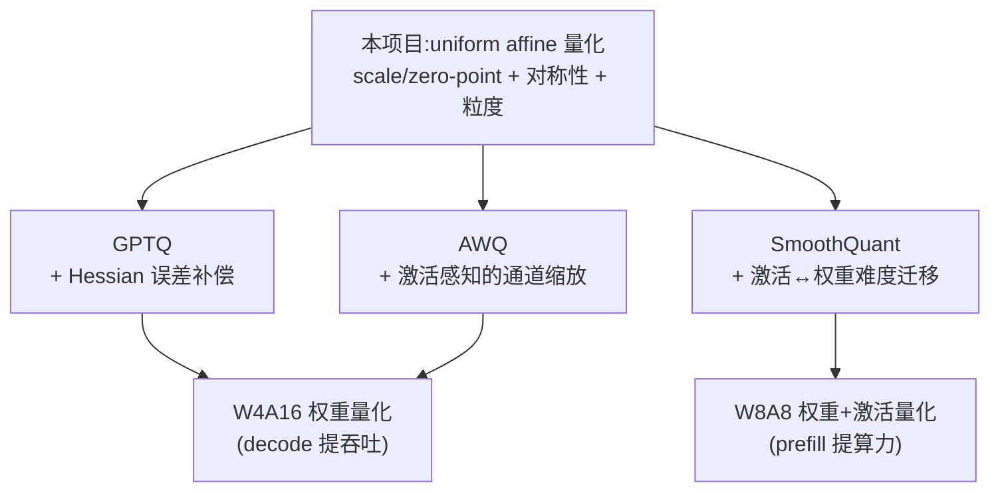

# 项目 06 · 量化实验室 Quantization Lab

> 对应理论篇 [`../../08_量化与低精度_INT8_INT4_FP8_GPTQ_AWQ_SmoothQuant.md`](../../08_量化与低精度_INT8_INT4_FP8_GPTQ_AWQ_SmoothQuant.md)。
>
> 量化不是玄学:一条 `q = round(x/s)+z` 公式 + 一个 `x̂ = (q-z)·s` 反量化,就能把 16bit 权重压到 4bit。本项目用**纯 numpy**(附 torch 对拍)把 **INT8/INT4、对称/非对称、per-tensor/per-channel/per-group** 全部手写实现,在你这台机器上**实测**量化误差随位宽、粒度怎么变,并复现工业界最著名的 **outlier(离群值)问题**——为什么 per-channel/per-group 是 INT4 权重量化的必备粒度。

---

## 🎯 这个项目能让你"亲眼看到"什么

| 现象 | 一句话结论 | 在哪验证 |
|---|---|---|
| **位宽越低,误差越大** | 每砍 1 bit,量化步长 scale 翻倍,MSE 约 ×4 | `error_vs_bitwidth.png` / `test_lower_bits_larger_error` |
| **量化误差有理论界** | 未截断时 \|误差\| ≤ scale/2,MSE ≈ scale²/12 | `test_roundtrip_within_theoretical_max_bound` |
| **对称 vs 非对称** | 全正激活(ReLU/GELU 后)用非对称更省 1 bit | `test_asymmetric_beats_symmetric_for_nonneg_activation` |
| **outlier 毁掉 per-tensor** | 几个离群大值撑爆全局 scale → 正常值全被压成 0 | `granularity_outlier.png` |
| **per-channel/group 救场** | 每行/每组独立 scale,误差降到 1/18 甚至更多 | `test_per_channel_beats_per_tensor_with_outliers` |
| **粒度的代价** | per-group 每组多存一个 scale → 有效位宽 > 名义位宽 | `test_quant_report...` / demo `[5]` |





---

## 🧠 一、量化到底在做什么(是什么 / 为什么)

### 1.1 一句话:用"整数 + 一个缩放因子"近似一批浮点数

深度学习的权重、激活本质是一堆浮点数。**量化(quantization)** 就是:找一个**步长 scale `s`**,把每个浮点数 `x` 用最接近的"格点"来表示——格点是 `s` 的整数倍。存的时候只存那个整数 `q`(4 或 8 bit),用的时候再乘回 `s` 还原成近似浮点 `x̂`。

$$\underbrace{q = \mathrm{clip}\Big(\mathrm{round}\big(\tfrac{x}{s}\big) + z,\ q_{\min},\ q_{\max}\Big)}_{\text{量化 quantize}}, \qquad \underbrace{\hat{x} = s\,(q - z)}_{\text{反量化 dequantize}}$$

- **`s`(scale,步长)**:一个整数格代表多大的浮点区间。`s` 越小越精细,但能覆盖的范围越窄。
- **`z`(zero-point,零点)**:浮点的 0 落在哪个整数上。**对称量化 `z=0`**,**非对称 `z≠0`**。
- **`clip`**:超出 `[q_min, q_max]` 的值被截断(饱和 saturate)。

> 🔬 **第一性原理:量化的第一收益不是"算得快",是"搬得少"。** LLM 推理 decode 阶段是 **memory-bound**——每生成 1 个 token 要把整个模型权重从显存(HBM)读一遍。权重从 16bit 变 4bit,**每步搬运字节数直接减到 1/4**,吞吐几乎反比于位宽。省显存(7B: 14GB→3.5GB)只是顺带的。这也是为什么"权重量化"比"激活量化"先普及。

### 1.2 为什么"能"量化?—— 神经网络对噪声不敏感

量化 = 给每个数加了一点 `[-s/2, s/2]` 的**舍入噪声**。深度网络本身对小扰动鲁棒(dropout、BN 都在加噪),所以 8bit 几乎无损、4bit 配好算法也接近无损。代价见下表:

| 维度 | 收益 | 代价 |
|---|---|---|
| 显存 | 参数字节 ×(bit/16) | —— |
| 带宽→吞吐 | decode 每步搬运量同比下降 | W4A16 **不提算力**(GEMM 仍反量化回 FP16 算) |
| 精度 | —— | 位宽越低损失越大,outlier 会放大损失 |
| 复杂度 | —— | scale/zero-point 元数据、反量化开销、kernel 复杂 |

---

## 🔢 二、四个正交的设计维度

量化方案 = **位宽 × 对称性 × 粒度 × 量化对象** 的组合。本项目实现了前三个维度的全部组合。



### 2.1 维度一:位宽 num_bits —— 有多少个"格子"

`b` bit 有 `2^b` 个格子。格子越多,步长 `s` 越细,误差越小。

| 位宽 | 整数格数 | 对称范围 | 非对称范围 | 典型用途 |
|---|---|---|---|---|
| INT8 | 256 | [-127, 127] | [0, 255] | 权重/激活量化主力,近乎无损 |
| INT4 | 16 | [-7, 7] | [0, 15] | 权重激进量化(GPTQ/AWQ) |
| INT2/3 | 4/8 | 极小 | 极小 | 研究向,需 QAT 才能救 |

> 💡 **实战:为什么每砍 1 bit 误差约 ×4?** 步长 `s ∝ 1/(2^{b-1})`,少 1 bit 则 `s` 翻倍;而 MSE ∝ `s²`(见 §3),所以 `s×2 → MSE×4`。`error_vs_bitwidth.png` 左图在对数轴上是一条漂亮的直线,斜率正对应这个规律。

### 2.2 维度二:对称 vs 非对称 —— 零点放哪

```
对称 symmetric(z=0):        非对称 asymmetric(z≠0):
  浮点  [-|x|max, +|x|max]     浮点  [xmin, xmax](分布可偏)
  整数  [-127,     +127]       整数  [0,      255]
  零点固定为 0,实现简单        用 z 校准偏移,充分利用范围
```

| | 对称 Symmetric | 非对称 Asymmetric |
|---|---|---|
| zero-point | 恒为 0 | `z = round(q_min − x_min/s)` |
| 适合数据 | **零对称**(权重常近似对称) | **有偏**(ReLU/GELU 后激活恒为正) |
| 计算 | 快(GEMM 无需处理 z 的交叉项) | 慢一点(要额外算 z 相关项) |
| 精度 | 对称数据够用 | 偏态数据上**多赚约 1 bit** |

> 💡 **面试高频:激活为什么常用非对称?** ReLU/GELU 后激活恒为正(如 `[0, 6]`)。对称量化会把 `[-6, 0]` 这半个范围白白浪费——等于只用了 128 个格子而不是 256,凭空少 1 bit 精度。本项目 `test_asymmetric_beats_symmetric_for_nonneg_activation` 实测:同样 8bit,非对称 MSE 约为对称的 **1/4**。

### 2.3 维度三:粒度 granularity —— 多少个数共享一个 scale

这是本项目的重头戏。**共享 scale 的元素越少(粒度越细),越能适应局部动态范围,但要存的 scale 越多。**

| 粒度 | scale 数量(64×256 矩阵) | 精度 | 元数据开销 | 典型场景 |
|---|---|---|---|---|
| **per-tensor** | 1 | 最低 | 最小 | 激活(要快)、早期方案 |
| **per-channel** | 64(每行 1 个) | 中 | 小 | 权重按输出通道量化 |
| **per-group** | 256(每 64 列 1 个) | 高 | 每组 1 个 scale | **INT4 权重必备**(GPTQ/AWQ 的 `group_size=128`) |



> ⚠️ **常见坑:per-group 的"4bit 模型其实不止 4bit"。** `group_size=128` 意味着每 128 个 4bit 权重要额外存一个 FP16 的 scale(非对称还要存 zero-point)。有效位宽 = `4 + 16/128 = 4.125 bit`;`group_size=32` 则是 `4 + 16/32 = 4.5 bit`。这就是为什么"4bit 模型"实际显存比理论 3.5GB 稍大。本项目 `effective_bits()` 和 demo 的 `[5]` 就在算这笔账。

---

## 📐 三、量化误差的理论界(为什么测试敢写死阈值)

### 3.1 最大误差 ≤ scale/2

只要数据没被 `clip` 截断(本项目 scale 由数据的真实 min/max 决定,所以正常数据不会截断),量化就是一次"四舍五入到最近格点"。舍入误差最多半个格子:

$$|x - \hat{x}| \le \frac{s}{2}$$

对 per-channel / per-group,每个元素受**它所在通道/组的 scale** 约束,所以全局最大误差 ≤ `max(scale)/2`。测试 `test_roundtrip_within_theoretical_max_bound` 就在验证这条硬边界(留 1e-6 数值余量)。

### 3.2 MSE ≈ scale²/12(均匀噪声模型)

把舍入误差建模成均匀分布 `U(-s/2, s/2)`,其方差正是 `s²/12`(均匀分布方差 = 区间长度²/12):

$$\mathrm{MSE} = \mathbb{E}[(x-\hat{x})^2] \approx \frac{s^2}{12}$$

`test_mse_matches_uniform_model_for_fine_grid` 在 8bit 细网格上验证:实测 MSE 与 `s²/12` 同量级(高斯数据非严格均匀,留了 0.2×~3× 余量)。

> 🔬 **为什么这条界这么有用?** 它把"量化好不好"从玄学变成可预测的工程量:知道数据范围和位宽,就能**先验估计**误差。GPTQ 之类算法的目标函数(最小化 `‖WX − ŴX‖²`)本质就是在这条界之上,再用 Hessian 信息把误差往未量化权重上"挪",做得比朴素舍入更好。

### 3.3 零点 zero-point 的公式怎么来的

非对称量化要让浮点区间 `[x_min, x_max]` 线性映射到整数区间 `[q_min, q_max]`。两个约束:端点对齐。

$$s = \frac{x_{\max} - x_{\min}}{q_{\max} - q_{\min}}, \qquad x_{\min} \mapsto q_{\min} \;\Rightarrow\; z = \mathrm{round}\Big(q_{\min} - \frac{x_{\min}}{s}\Big)$$

`z` 取整(round)是为了保证**浮点 0 能被某个整数精确表示**——这对含 0 的稀疏张量、padding、mask 很重要。本项目 `_params` 里还额外做了 `x_min = min(x_min, 0)`、`x_max = max(x_max, 0)`,把 0 强行纳入范围,`test_zero_is_exactly_representable_asymmetric` 就在验证"浮点 0 反量化后仍是 0"。

---

## 🔬 四、outlier 问题:本项目的灵魂实验

### 4.1 现象:几个离群值,一票否决

真实 LLM 的权重/激活里存在**离群值(outlier)**——极少数元素幅值比其余大几十倍(激活里尤其严重,见 LLM.int8()、SmoothQuant)。对 **per-tensor** 量化这是灾难:

```python
import numpy as np
x = np.array([0.01, 0.5, -0.3, 0.2, 12.0])   # 最后一个是 outlier
s = np.abs(x).max() / 7                        # INT4 对称:scale 被 12.0 撑到 ≈1.71
q = np.clip(np.round(x / s), -7, 7)            # → [0, 0, 0, 0, 7]
print((q * s))                                 # → [0, 0, 0, 0, 12.0]:前四个全被压成 0!
```

一个 `12.0` 把 scale 撑大到 `1.71`,于是 `0.01/0.5/0.3/0.2` 这些**有效信息**全被四舍五入成了 0——整个张量只剩 outlier 一个数是准的。

把同一个向量 `[0.01, 0.5, -0.3, 0.2, 12.0]` 用不同方案 INT4 量化,反量化后的结果一目了然:

| 方案 | scale(每格步长) | 反量化 x̂ | 正常值是否幸存 |
|---|---|---|---|
| per-tensor 对称 | 12.0/7 ≈ 1.71 | `[0, 0, 0, 0, 12.0]` | ❌ 全被压成 0 |
| per-group(g=4)对称 | 组1: 0.5/7≈0.071;组2: 12.0/7 | `[0, 0.50, -0.29, 0.21, 12.0]` | ✅ 前 4 个精准还原 |

> per-group 把前 4 个正常值分到一个组(组内最大值仅 0.5,scale 细到 0.071),outlier 单独一组——两边互不干扰。这正是 `granularity_outlier.png` 右图 per-group 柱最矮的原因。

### 4.2 解法:让 scale 别被 outlier 绑架

| 思路 | 做法 | 本项目/工业界 |
|---|---|---|
| **细化粒度** | per-channel:每行独立 scale,离群行不连累别人;per-group 更进一步 | ✅ 本项目主线 |
| **抹平 outlier** | SmoothQuant:把激活的 outlier 幅度"搬"一部分给权重,两边都好量化 | 理论篇 §7 |
| **混合精度** | LLM.int8():把 outlier 通道单独用 FP16 算,其余 INT8 | 理论篇 §5 |

本项目 `make_outlier_matrix` 构造了一个 64×256 权重:只有 **2 行、每行前几列**是大值(见 `granularity_outlier.png` 左图左上角的亮点)。实测 INT4 下:

```
per_tensor  : MSE = 2.5e-03      ← 被 outlier 撑爆,正常值全废
per_channel : MSE = 1.4e-04      ← per-tensor 误差的 1/18
per_group   : MSE = 4.8e-05      ← 再降,连离群行里也只牺牲一个组
```

> 💡 **为什么把 outlier 集中在"少数几行的少数几列"而不是"整行"?** 关键洞察:outlier 元素**自身**在任何粒度下都难量化(它的值大,`s/2` 的绝对误差就大),这部分误差是 per-tensor 和 per-channel **共有的地板**。只有把 outlier 收窄成极少数元素,per-tensor 对**大面积正常元素**的"压成 0"损失才会成为主导,per-channel 的优势才充分显现(否则 MSE 比值被共有地板卡在 ~2×)。这也是调这个 demo 时踩过的真实坑——见 §7。

---

## 📁 五、文件结构与代码讲解

| 文件 | 作用 |
|---|---|
| `quantize.py` | 核心:`QScheme` 配置、`int_range` 范围、`compute_qparams` 求 scale/zp、`fake_quantize` 量化-反量化、误差度量、理论界、`make_outlier_matrix`、torch 对拍版 |
| `tests/test_quantize.py` | 25 个 pytest:范围/零点/边界、理论界、位宽单调、outlier 下 per-channel/group 更优、非对称优势、numpy-torch 对拍 |
| `run_demo.py` | 打印误差报告 + 生成 2 张 PNG(Agg + 微软雅黑) |
| `conftest.py` | 空文件,让 `tests/` 能 `import quantize` |
| `requirements.txt` | numpy / matplotlib / pytest / torch(仅对拍用) |

### 5.1 核心:统一处理三种粒度

三种粒度的差别只在于"**在哪个轴上取 min/max**"。代码用一个 `_view_and_axes` 把张量整形成"归约视图",再走同一套 `_params` 逻辑,优雅地消除了重复:

```python
def _view_and_axes(x, scheme):
    if scheme.granularity == "per_tensor":
        return x, None, x.shape                          # 对整个张量归约
    if scheme.granularity == "per_channel":
        axes = tuple(i for i in range(x.ndim) if i != scheme.axis)
        return x, axes, x.shape                           # 保留 axis,归约其余
    if scheme.granularity == "per_group":                 # 2D 权重按列切组
        rows, cols = x.shape
        xw = x.reshape(rows, cols // scheme.group_size, scheme.group_size)
        return xw, (2,), x.shape                          # 每组归约最后一维
```

`_params` 里对称/非对称分叉:对称取 `|x|` 的最大值定 scale、零点为 0;非对称取真实 `[min,max]`(并强制含 0)算 scale 和零点。所有归约都用 `keepdims=True`,得到的 scale/zp 可以**直接广播**回原张量,量化只是一行:

```python
q = np.clip(np.round(xw / scale) + zp, qmin, qmax)   # 量化
x_hat = (q - zp) * scale                              # 反量化
```

### 5.2 fake-quant:为什么量化完立刻反量化

本项目做的是**模拟量化(fake / simulated quantization)**:量化得到整数 `q` 后立刻用 `x̂=(q-z)s` 还原成浮点,便于逐点测误差。这正是 PTQ 校准和 QAT 训练里 fake-quant 节点的做法——**前向体验量化误差,但仍在浮点域计算**。真实部署时才会把 `q` 以 int4/int8 紧密打包进显存。

fake-quant 在 QAT(量化感知训练)里的关键是**反向怎么求导**:`round` 处处导数为 0,梯度无法穿过。工业界用 **STE(Straight-Through Estimator,直通估计)**:前向照常量化,反向假装 `round` 是恒等函数(导数=1),让梯度直接"直通"回去。



> 🔬 **STE 为什么"作弊"却有效?** round 的真实梯度几乎处处为 0、在格点处为无穷——直接用会让训练停摆。STE 把它近似成恒等,相当于告诉网络"你输出挪一点,量化结果就跟着挪一点",这个"局部线性"近似在细网格下误差很小,却让梯度能流动、让权重学会**避开会掉进量化坑的取值**。本项目未实现 QAT(纯 PTQ 视角),但 `fake_quantize` 的前向就是 QAT 节点的前向,补一个 STE 反向即可用于训练。

### 5.3 numpy / torch 对拍

`fake_quantize_torch` 用 torch 算子(`amax/amin/round/clamp`)重写了同一套逻辑,`test_numpy_torch_parity` 验证两者逐点一致(`atol=1e-8`)。这说明**量化是与框架无关的纯算术**,也是把量化逻辑搬进训练图(QAT)的雏形。

### 5.4 `quantize.py` API 速查

| 函数 | 签名要点 | 返回 |
|---|---|---|
| `QScheme(num_bits, symmetric, granularity, group_size, axis)` | 一套量化配置(dataclass) | 配置对象,`str(s)` 给出如 `INT4-sym-group g64` |
| `int_range(num_bits, symmetric)` | 求整数码范围 | `(qmin, qmax)` |
| `compute_qparams(x, scheme)` | 只求量化参数 | `(scale, zp, qmin, qmax)` |
| `fake_quantize(x, scheme)` | 核心:量化→反量化 | `(x_hat, q, scale, zp)` |
| `quantize_dequantize(x, num_bits=…, …)` | 便捷封装,只要 x̂ | `x_hat` |
| `mse / max_abs_err(x, x_hat)` | 误差度量 | `float` |
| `theoretical_max_error / theoretical_mse(scale)` | 理论界 | `float`(`s/2`、`s²/12`) |
| `effective_bits(scheme)` | 含元数据的有效位宽 | `float` |
| `quant_report(x, scheme)` | 一站式误差报告 | `dict`(mse/max/理论界/n_scales/eff_bits) |
| `make_outlier_matrix(...)` | 构造含 outlier 的权重 | `(W, out_rows)` |
| `fake_quantize_torch(x, scheme)` | torch 版(对拍用) | `x_hat`(numpy) |

---

## ▶️ 六、如何运行

```bash
# 安装(numpy/matplotlib/pytest/torch 已装则跳过)
pip install -r requirements.txt

# 跑测试(应输出 25 passed)
python -m pytest -q

# 跑演示:打印误差报告 + 生成 2 张 PNG
python run_demo.py
```

运行环境:**Python 3.13、numpy 2.3、torch 2.12 CPU、无 GPU、无网络**,全程离线。出图用 `matplotlib.use("Agg")` + `font.sans-serif=["Microsoft YaHei"]`,中文正常、负号正常。

预期输出(节选):

```
[1] 干净权重 per-tensor 误差 vs 位宽:
     bits |          MSE |    max_abs | 理论max = scale/2
        8 |    8.350e-07 |  1.584e-03 | 1.584e-03      ← 实测 max_abs 恰好 = scale/2
        4 |    2.764e-04 |  2.873e-02 | 2.874e-02
        2 |    8.609e-03 |  2.011e-01 | 2.012e-01      ← 每砍 1 bit,MSE 约 ×4~×6
[4] outlier 权重,各粒度 INT4 误差:
    per_tensor  : MSE = 2.455e-03
    per_channel : MSE = 1.378e-04       ← 1/18
    per_group   : MSE = 4.762e-05
[5] per-group 有效位宽:
    INT4 group_size=128: 4.125 bit    group_size=32: 4.500 bit
```

---

## 💡 七、踩坑记录(诚实工程日志)

- **outlier demo 的 MSE 比值上不去(2.6× 而非目标 >5×)。** 最初把**整行**设为大值,结果 outlier 行自身的量化误差成了 per-tensor 与 per-channel **共有的误差地板**,把比值卡死在 ~2×。改成"只在少数行的少数列放大值"后,per-tensor 对大面积正常元素的损失才成为主导,比值跳到 18×。教训:**做对照实验要想清楚"共有项"会不会稀释你想放大的差异。**
- **`float(scale)` 报 DeprecationWarning。** per-tensor 的 scale 是 shape `(1,1)` 数组,numpy 2.x 不许直接 `float()`,改成 `float(scale.reshape(-1)[0])`。
- **子目录 `tests/` 导不到 `quantize`。** 放一个空 `conftest.py` 在项目根,pytest 会把它所在目录加进 `sys.path`,`import quantize` 即通。

---

## 🎓 八、面试高频问答

- **Q:INT4 权重量化为什么一定要 per-group?** A:权重里存在离群值,per-tensor 的单一 scale 会被离群值撑爆,导致大量正常权重被压成 0。per-group(如 128)让每小组独立 scale,把动态范围切碎、逐组适配,是 GPTQ/AWQ 的标配。代价是有效位宽略升到 ~4.25bit。
- **Q:对称和非对称怎么选?** A:权重近似零对称 → 对称(GEMM 更快,无 zero-point 交叉项);激活经 ReLU/GELU 后有偏 → 非对称(否则浪费半个范围,白丢 ~1bit)。
- **Q:W4A16 为什么不提算力,只提吞吐?** A:W4A16 权重 4bit、激活仍 16bit,GEMM 时要把权重反量化回 FP16 再算,不吃 INT8 张量核。加速全来自 decode 阶段**搬权重的字节数**减少(memory-bound)。要提 prefill 算力得上 W8A8(激活也量化),这是 SmoothQuant 的战场。
- **Q:量化误差有多大是可以先算出来的吗?** A:可以。未截断时最大误差 ≤ scale/2,MSE ≈ scale²/12。scale 由数据范围和位宽决定,所以给定这两者就能先验估计误差量级——本项目测试就是拿这条界做断言的。
- **Q:PTQ 和 QAT 区别?** A:PTQ 训练后直接量化(几百条校准数据即可),LLM 绝对主流;QAT 训练中插 fake-quant 节点让模型学会适应量化误差(靠 STE 让梯度穿过 round),精度更高但要重训,主要留给极低位宽(≤3bit)。

---

## 🌉 九、从这个玩具实验到工业界三大算法

本项目实现的是量化的**地基**(uniform affine quant)。工业界 LLM 量化的"三驾马车"都建在这块地基上,各自多解决一个问题:

| 算法 | 在本项目基础上多做了什么 | 对应的痛点 |
|---|---|---|
| **GPTQ** | 不再逐个权重独立四舍五入,而是用 Hessian(`H=XXᵀ`)信息,量化一列时把误差**补偿**到未量化列,最小化整层输出误差 `‖WX−ŴX‖²` | 朴素舍入会累积层内误差;GPTQ 把 INT4 权重做到接近无损 |
| **AWQ** | 发现"少数**显著权重通道**决定精度",按激活幅度给权重通道**乘保护性缩放**再量化,保住重要通道 | outlier 的另一种解法:不是切碎粒度,而是加权保护 |
| **SmoothQuant** | 把**激活**的 outlier 幅度按公式"搬"一部分给权重(`Ŵ=W·diag(s)`, `Â=A·diag(1/s)`),让 W8A8 里激活也好量化 | 激活 outlier 比权重更凶,per-tensor 激活量化会崩;SmoothQuant 让 W8A8 GEMM 提算力成为可能 |



> 💡 **一句话串起来**:本项目的 per-group 是"**用更细的 scale 硬扛 outlier**";AWQ 是"**给重要通道加保护**";SmoothQuant 是"**把 outlier 从激活挪给权重**";GPTQ 是"**量化后用剩余权重补偿误差**"。四种思路都在跟同一个敌人——**动态范围里的离群值**——较劲。理解了本项目的 outlier 实验,再读这三篇论文会顺畅很多。

## 🧪 十、扩展练习(把项目玩深)

1. **实现 percentile / MSE-optimal 校准**:当前 scale 用 `max(|x|)`,对 outlier 敏感。试试用 99.9 分位数裁掉极端值(clip 校准),或网格搜索让 MSE 最小的 scale——观察 outlier 场景下 per-tensor 能追回多少。
2. **加 KV cache 量化**:KV 是逐 token 动态生成的,试 per-token(每个 token 一个 scale)INT8/INT4,测长序列下的显存与误差权衡(呼应 [`07_KVCache`](../../07_KVCache深入_PagedAttention_前缀缓存_量化压缩.md))。
3. **补一个 STE 反向做 mini-QAT**:用 `fake_quantize` 的前向 + STE 反向,在一个 2 层 MLP 上做量化感知训练,对比 PTQ 直接量化的精度差。
4. **真实权重复现**:载入一个小模型(如 GPT-2 的某个 `Linear` 权重),直接跑本项目的 `quant_report`,看真实权重的 outlier 有多严重、per-group 收益多大。
5. **NF4(NormalFloat4)**:本项目是均匀量化,试实现 bitsandbytes 的 NF4——按正态分布分位点设**非均匀**格点,对高斯权重更优。

## 📌 小结

- 量化 = **`round(x/s)+z` 量化 + `(q-z)·s` 反量化**,四个正交维度:**位宽 × 对称性 × 粒度 × 对象**。
- 误差有**硬理论界**:最大误差 ≤ `s/2`,MSE ≈ `s²/12`;**每砍 1 bit,scale 翻倍、MSE 约 ×4**。
- **outlier 是 per-tensor 的天敌**:几个离群大值撑爆全局 scale,正常值全废;**per-channel/per-group 用更细的 scale 隔离离群**,本项目实测误差降到 1/18。
- 粒度越细精度越高,但要付**scale 元数据**开销(per-group INT4 有效位宽 ~4.25bit)。
- 全部用一条公式、纯 numpy 手写,25 个 pytest 全绿,torch 对拍逐点一致——**量化是可预测的工程,不是玄学**。

## 🔗 延伸

- 理论主篇:[`../../08_量化与低精度_INT8_INT4_FP8_GPTQ_AWQ_SmoothQuant.md`](../../08_量化与低精度_INT8_INT4_FP8_GPTQ_AWQ_SmoothQuant.md)(FP8、GPTQ/AWQ/SmoothQuant 三大算法本质)
- KV cache 量化:[`../../07_KVCache深入_PagedAttention_前缀缓存_量化压缩.md`](../../07_KVCache深入_PagedAttention_前缀缓存_量化压缩.md)
- 为什么 decode 是 memory-bound(量化提吞吐的根):[`../../02_GPU结构_从SM到集群_全面本质.md`](../../02_GPU结构_从SM到集群_全面本质.md)、[`../02_roofline_bandwidth_bench`](../02_roofline_bandwidth_bench)
- 算子/编译(反量化 kernel 融合):[`../../12_算子与编译_融合_Triton_torchcompile_图优化.md`](../../12_算子与编译_融合_Triton_torchcompile_图优化.md)
- 同系列动手项目:[`../01_pd_disagg_simulator`](../01_pd_disagg_simulator) · [`../03_cache_locality_bench`](../03_cache_locality_bench) · 上层推理引擎 [`../../09_推理引擎架构_连续批处理_调度_投机解码_chunked_prefill.md`](../../09_推理引擎架构_连续批处理_调度_投机解码_chunked_prefill.md)
