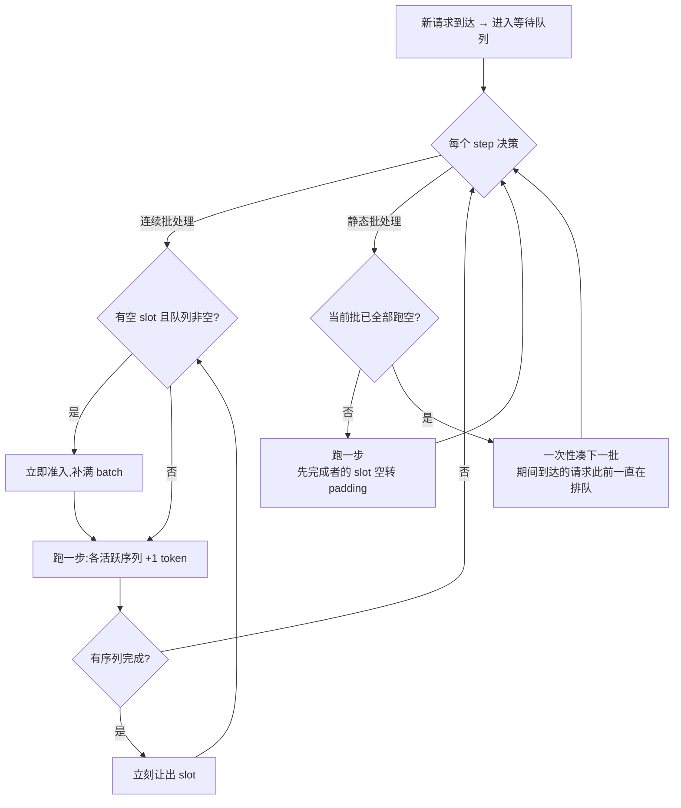
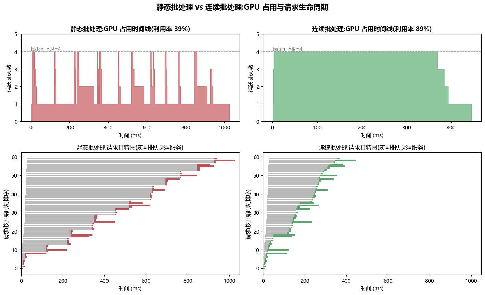
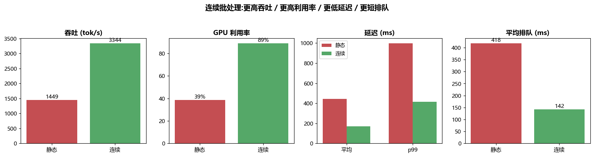

# 项目 07 · 连续批处理模拟器(Continuous Batching Simulator)

> 对应架构篇 [`../../09_推理引擎架构_连续批处理_调度_投机解码_chunked_prefill.md`](../../09_推理引擎架构_连续批处理_调度_投机解码_chunked_prefill.md)。
>
> 用一个**离散步(iteration/step)仿真**,把 LLM 推理服务里最重要的一个调度决策量化出来:
> **静态批处理(static batching)vs 连续批处理(continuous batching / iteration-level scheduling)**。
> 对同一个到达流(arrival stream),测两者的**吞吐、平均/尾延迟、GPU 利用率**。
> 纯 Python 核心、零第三方依赖、秒级可跑,离线不联网不下模型。

---

## 🧠 一句话本质

> **静态批处理**:凑一批一起发车,**必须等车上最慢的那位到站,整车才能返场**;先到站的乘客占着座空转,站台上的新乘客只能干等下一班。
>
> **连续批处理**:每一站(每个 decode step)谁下车谁立刻腾座,站台上排队的新乘客**当场补位**。车永远满载 → 吞吐高、等待短、GPU 不空转。

这台"公交车"就是 GPU 的一个 batch;"座位"是 batch 里的 slot;"到站"是一条请求 `output_len` 个 token 生成完毕。连续批处理是 vLLM / TGI(HuggingFace)/ TensorRT-LLM 把推理吞吐拉高 **2~20×** 的核心机制。本项目就是把这个直觉**做成可运行、可测量、可画图**的模型。

---

## 🎯 为什么会有这个问题?(是什么 / 为什么)

LLM 自回归解码有两个"讨厌"的特性,共同让"静态批处理"变得极其浪费:

| 特性 | 含义 | 带来的麻烦 |
|---|---|---|
| **逐 token 生成** | 一次 forward 只出 1 个 token,要循环 `output_len` 次 | 一条请求要在 GPU 上"驻留"很多步 |
| **输出长度高度不均** | 有的回复 3 个 token,有的 800 个,且**事先不知道** | 同一批请求的完成时刻天差地别 |

静态批处理把"凑批"当成一次性动作:**批一旦发出,成员固定,直到最慢的成员(`max(output_len)`)结束才整批退休**。于是:

- ⚠️ **批内空转**:短请求早早生成完,它的 slot 却被"锁"到整批结束,期间做无用的 padding forward。
- ⚠️ **队头阻塞(HOL blocking)**:批执行期间到达的新请求**进不来**,要等整批 drain 完才能组下一批 → 排队延迟暴涨。

连续批处理的洞见:**批的成员不必固定**。调度粒度从"一整批的生命周期"降到"一个 iteration"——每步结束重新决策谁在批里。这就是名字 **iteration-level scheduling** 的由来(Orca, OSDI'22 首次提出;vLLM 发扬光大)。

### 🔬 第一性原理:work-conserving(不空转)才是吞吐的上界

把 GPU 抽象成 `B` 个 slot 的资源池,总工作量(所有请求的 slot·步之和)是固定的 `W = Σ service_steps`。任何调度的完成时间(makespan)都有下界:

$$\text{makespan} \ge \frac{W}{B}\cdot \text{STEP} \quad(\text{把每个 slot·步都填满时取等})$$

- **连续批处理是 work-conserving 的**:只要等待队列非空且有空 slot,就绝不让 slot 闲着 → 紧贴这个下界。
- **静态批处理不是**:批内短请求完成后的空 slot 被浪费,makespan 被最慢者拉长。

**吞吐 = 总 token / makespan**,总 token 两者相同,所以 **连续 makespan ≤ 静态 makespan ⇒ 连续吞吐 ≥ 静态吞吐**。这不是巧合,是 work-conserving 调度的数学必然——也是本项目 pytest 里可以稳稳断言 `连续吞吐 ≥ 静态` 的底气。

---

## 🧩 仿真模型(简化但抓住本质)

一个 **step = 一次 forward = `STEP_MS` 毫秒**(默认 1ms)。每条请求:

```
占用 slot 的总步数 service_steps = prefill_steps + output_len
  · prefill_steps = ceil(prompt_len / 128)   # 算力受限,∝ prompt 长度,至少 1 步
  · decode:每步产出 1 个 token,共 output_len 步
```

| 建模量 | 规则 | 对应真实系统 |
|---|---|---|
| **prefill** | 占 slot `prefill_steps` 步,不出 token | 算力受限的首包计算 |
| **decode** | 每步出 1 token,占 slot 1 步 | 访存受限的自回归 |
| **首 token 时刻(TTFT)** | `start + (prefill_steps+1)·STEP` | 用户看到的"首字延迟" |
| **完成时刻(done)** | `start + service_steps·STEP` | 最后一个 token |
| **GPU 利用率** | 占用 slot·步 / (窗口步数 × B) | 平均 batch 填充率 |

> 🔬 **两个模拟器共用同一套按步推进引擎,唯一差异是"准入策略"这一行**——这是本项目最巧妙的地方:把"静态 vs 连续"的本质提炼成一个布尔判断,读代码一眼看穿。

```python
# 连续:每步都把 batch 回填到满(work-conserving)
# 静态:仅当整批彻底跑空(running 为空)才准入下一批
can_admit = (mode == "continuous") or (len(running) == 0)
```

### 两种策略的调度流程(mermaid)



### 时间线对比:同一批请求,两种命运(mermaid)

```mermaid
gantt
    title 静态 vs 连续:1 条长请求(40 token) + 3 条短请求(各 1 token),batch=2
    dateFormat X
    axisFormat %s
    section 静态批处理
    长R0 (批1)      :done, 0, 41
    短R1 (批1,占座空转) :active, 0, 41
    短R2 (批2,排队等整批) :crit, 41, 43
    短R3 (批2,排队等整批) :crit, 41, 43
    section 连续批处理
    长R0            :done, 0, 41
    短R1            :active, 0, 2
    短R2 (补位)      :active, 2, 4
    短R3 (补位)      :active, 4, 6
```



看懂这张图就看懂了一切:静态里 R1 占着座空转到 41、R2/R3 排队到 41 才发车;连续里 R1/R2/R3 在长请求 R0 跑的同时,轮流补进那个空 slot,6 步就全清空。

---

## 📁 文件结构

| 文件 | 作用 |
|---|---|
| `continuous_batching.py` | **核心**(零依赖):`Request` / `simulate_static` / `simulate_continuous` / `summarize`;统一按步引擎 + 指标计算 |
| `tests/test_continuous_batching.py` | 10 个 pytest:不变量、连续吞吐≥静态、空闲更少、尾延迟/排队更优、退化 case |
| `conftest.py` | 让 `tests/` 能 `import continuous_batching`(把项目根加进 `sys.path`) |
| `run_demo.py` | 跑 60 条混合到达流,打印指标表 + 出 `timeline.png` / `metrics.png` |
| `requirements.txt` | numpy / matplotlib / pytest(核心模块本身不需要) |

---

## 🔬 核心代码讲解(怎么用 / 代价)

### 1)统一的按步推进引擎 `_simulate`

```python
while t < max_steps:
    now = t * step_ms
    # ① 收入到达的请求(arrival <= now)进等待队列
    while p < len(reqs) and reqs[p].arrival <= now:
        waiting.append(reqs[p]); p += 1
    # ② 准入策略(唯一的策略差异!)
    can_admit = (mode == "continuous") or (len(running) == 0)
    if can_admit:
        while len(running) < batch_size and waiting:
            r = waiting.popleft(); _schedule_tokens(r, now, step_ms)
            running.append(_Slot(r))
    # ③ 终止 / 空转跳步(GPU 无事可做时直接跳到下一个到达)
    if not running:
        if p >= len(reqs) and not waiting: break
        if not waiting: t = ceil(reqs[p].arrival / step_ms); continue
    # ④ 跑一步:统计占用 → 各活跃序列剩余步 -1 → 完成者让出 slot
    occupancy.append(len(running))
    for slot in running: slot.remaining -= 1
    running = [s for s in running if s.remaining > 0]
    t += 1
```

- **`occupancy` 列表**:记录每个"真实运行步"的活跃 slot 数,既用来算利用率,也直接喂给时间线图。
- **`_schedule_tokens(r, start, ...)`**:把一条请求的 `ttft / token_times / done` 一次性排定。**关键**:两个模拟器用**完全相同**的记账函数,唯一变量是 `start`(被准入时刻)。所以延迟差异**纯粹**来自"何时能上车"——正是调度策略的本质,而非记账口径的差异。

### 2)静态 = "只在批跑空时回填" —— 一行代码的威力

`can_admit = (mode=="continuous") or (len(running)==0)`。静态模式下,只要批里还有任何一条在跑,就**不准入**任何新请求;等 `running` 变空,才一次性凑满下一批。这精确复现了静态批处理的两大浪费(批内空转 + 队头阻塞),而连续模式每步都回填。

### 3)指标计算(`SimResult` 的方法)

$$
\text{GPU 利用率}=\frac{\sum_t \text{active}_t}{\underbrace{W_{\text{steps}}}_{(\text{makespan}-\text{start})/\text{STEP}}\times B},\qquad
\text{吞吐}=\frac{\sum_i \text{output\_len}_i}{\text{makespan}-\text{start}}\times 1000\ \text{tok/s}
$$

- **占用 slot·步(分子)** = `sum(occupancy)`,两种策略必然相等(总工作量固定)。
- **可用 slot·步(分母)** = 窗口步数 × `B`。连续窗口短 → 分母小 → 利用率高、空闲少。
- 延迟用**最近秩百分位**(`_percentile`)取 p50/p95/p99;排队延迟 `queue_delay = start - arrival` 单独统计,直观体现队头阻塞。

---

## ▶️ 如何运行

```bash
# 在本项目根目录
python -m pytest -q      # 10 passed —— 全部不变量与对比断言
python run_demo.py       # 打印静态 vs 连续指标表 + 生成 timeline.png / metrics.png
```

> `python -m pytest` 会把当前目录加入 `sys.path`;外加 `conftest.py` 兜底,`tests/` 下用例可直接 `import continuous_batching`。

---

## 📊 本机实测输出(你的机器会有随机差异)

```
==============================================================================
静态批处理 vs 连续批处理(batch_size=4,60 条混合到达流)
==============================================================================
指标                          静态            连续         连续/静态
吞吐(tok/s)               1448.9        3343.8         2.31x
GPU利用率                   38.6%         89.0%         2.31x
空闲slot·步                  2524           196         0.08x
makespan(ms)              1028           446         0.43x
平均延迟(ms)                 444.9         168.8         0.38x
p99延迟(ms)                998.6         416.6         0.42x
平均排队(ms)                 418.5         142.4         0.34x
```

| 图 | 看点 |
|---|---|
|  | **上排**:静态的 GPU 占用是"锯齿"——每批发车瞬间冲到 4,短请求完成后跌到 1 空转;连续几乎贴着 batch 上限满载。**下排甘特图**:灰=排队、彩=服务;静态大片灰色(队头阻塞),连续排队短、整体在 ~446ms 收官,静态拖到 ~1028ms。 |
|  | 吞吐 ×2.3、利用率 39%→89%、平均/p99 延迟腰斩、排队时间大幅缩短。 |

> 🔬 **读图本质**:静态的锯齿"谷底"就是被浪费的 GPU;连续把这些谷底用等待队列里的请求填平了。利用率从 39%→89%,几乎就是吞吐提升 2.31× 的来源。

---

## ✍️ 手把手逐步推演(一个能心算的最小例子)

设 `batch_size=2`、`STEP=1ms`、全部 `t=0` 到达、`prompt_len` 都很小(`prefill_steps=1`)。请求:
`R0` 长(`output=6`,`service=7`),`R1/R2/R3` 短(`output=1`,`service=2`)。

**静态批处理**(只在整批跑空才回填):

| 阶段 | 批成员 | 起止(ms) | 期间发生什么 |
|---|---|---|---|
| 批1 | R0, R1 | 0 → 7 | R1 在 step2 就完成,但它的 slot 被锁到 step7(**空转 5 步**);R2/R3 排队干等 |
| 批2 | R2, R3 | 7 → 9 | 直到批1 彻底跑空(step7)才发车 |

- makespan = **9**;总占用 = R0(7)+R1(2)+R2(2)+R3(2)=**13** slot·步;窗口 = 9×2=**18** → 利用率 **13/18≈72%**,空转 **5**。
- R2/R3 排队 7ms,延迟被队头阻塞放大。

**连续批处理**(每步谁完成谁让座,队列当场补位):

| step | 批内 | 完成 → 让座 | 补位 |
|---|---|---|---|
| 1 | R0,R1 | — | — |
| 2 | R0,R1 | R1 完成 | step3 补入 R2 |
| 3 | R0,R2 | R2 完成 | step4 补入 R3 |
| 4 | R0,R3 | R3 完成 | 队列空,R0 独占 |
| 5–7 | R0 | R0 在 step7 完成 | — |

- makespan = **7**;总占用同为 **13**;窗口 = 7×2=**14** → 利用率 **13/14≈93%**,空转 **1**。
- 短请求趁 R0 还在跑,轮流"钻"进那个空 slot → makespan 从 9 降到 7,排队几乎为零。

> 💡 **心算结论**:总工作量(13 slot·步)两种策略一模一样,差别只在**有没有让 slot 空转**。连续把空转从 5 压到 1,makespan 9→7,这就是全部魔法。上面的 `variance_workload` 测试正是这个思想的放大版(1 长 + 8 短)。

---

## 🔬 三种"批处理"辨析(别混淆)

| 策略 | 批何时定? | 长度方差浪费? | 新请求要等? | 代表实现 |
|---|---|---|---|---|
| **静态批处理** static | 发车时定死,直到最慢者退休 | ❌ 严重(短的空转) | ❌ 等整批 drain | 朴素离线批推理 |
| **动态攒批** dynamic batching | 攒够一批/超时才发,**发后仍固定** | ❌ 仍存在 | ⚠️ 等攒批窗口 | Triton `dynamic_batching` |
| **连续批处理** continuous | **每个 iteration 重新决策** | ✅ 消除 | ✅ 当场补位 | vLLM / TGI / TRT-LLM |

⚠️ **高频误区**:把 Triton 的 `dynamic_batching` 当成连续批处理。前者只解决"如何把零散请求攒成一批",批一旦发出**内部依然是静态的**;后者解决"批在运行中如何增删成员"。二者正交,可叠加。

---

## 🧪 自己动手做实验(如何用 / 扩展)

核心 API 极简,`Request` 列表进、`SimResult` 出。扫一遍 `batch_size` 看吞吐/利用率的边际收益:

```python
from continuous_batching import Request, simulate_static, simulate_continuous, summarize
import random

rnd = random.Random(0)
wl = [Request(i, arrival=rnd.uniform(0, 30),
              prompt_len=rnd.randint(16, 256),
              output_len=rnd.choice([4, 8, 80, 100])) for i in range(80)]

for B in (1, 2, 4, 8, 16, 32):
    c = summarize(simulate_continuous(wl, batch_size=B))
    s = summarize(simulate_static(wl, batch_size=B))
    print(f"B={B:>2}  连续吞吐={c['throughput_tok_s']:7.0f}  利用率={c['gpu_util']:.0%}  "
          f"连续/静态吞吐={c['throughput_tok_s']/s['throughput_tok_s']:.2f}x")
```

可玩的方向:
- **改到达率**:把 `arrival` 压到 `[0, 5]`(突发到达)会放大静态的队头阻塞;拉到 `[0, 300]`(稀疏)则两者趋同(没有并发就没有魔法)。
- **改长度方差**:`output_len` 越参差,静态空转越严重、连续优势越大;全等长时差距最小。
- **改 `PREFILL_TOKENS_PER_STEP`**(在 `continuous_batching.py`):模拟 prefill 更重的负载(长 RAG / 文档),观察 TTFT 变化。
- **加一个新策略**:复制 `_simulate`,把 `can_admit` 改成"每 K 步才回填一次",即可造出介于静态与连续之间的"周期性回填"策略做对照。

---

## 💡 面试高频

- **"连续批处理到底解决了什么?"** → 两个浪费:① 批内长度方差导致的空 slot 空转;② 新请求的队头阻塞。手段:把调度粒度从"整批生命周期"降到"每个 iteration",每步动态增删批成员(iteration-level scheduling)。
- **"为什么它能大幅提吞吐?"** → 因为它是 **work-conserving** 的:有活就不让 slot 闲着,makespan 逼近理论下界 `W/B`。吞吐 = 总 token / makespan,故连续吞吐必 ≥ 静态。
- **"和 static/dynamic batching 的区别?"** → static:批固定,等最慢的;dynamic batching(如 Triton 的攒批):只是把请求攒成批再发,**批内依然是静态的**,不解决长度方差;continuous 才是运行中(in-flight)增删成员。
- **"prefill 和 decode 混在一个 batch 会怎样?"** → 朴素连续批处理里,新请求的 prefill(算力重、耗时长)插进来会**卡住**正在 decode 的老请求,造成 TTFT/TPOT 抖动。解决:**chunked prefill**(把长 prefill 切块,和 decode 交错调度,见架构篇 09)。
- **"显存不够怎么办?"** → batch 越大越吃 KV Cache 显存。连续批处理需配 **PagedAttention**(见 [`../../07_KVCache深入...md`](../../07_KVCache深入_PagedAttention_前缀缓存_量化压缩.md))按页分配 + 抢占/换出(preemption/swap),显存不足时踢掉部分请求稍后重跑。
- **"吞吐和延迟能否兼得?"** → 大 batch 提吞吐但增单请求延迟(排队+更慢的 forward);SLO 敏感场景要限批大小或用 PD 分离(见项目 01)。**没有免费午餐**。

---

## ⚠️ 常见坑 & 模型的诚实简化

- ⚠️ **"连续 = 无脑调大 batch"是错的**:batch 增大 → KV Cache 显存线性增长、单步 forward 变慢、单请求延迟上升。真实系统用 `max_num_seqs` / `max_num_batched_tokens` 双闸门约束。
- ⚠️ **prefill 会抢 decode**:本模型把每条请求当"占一个 slot 连续跑 service_steps 步"处理,**未建模 prefill 插入对同批 decode 的干扰**——真实系统正因此发明了 chunked prefill / 优先级调度。
- ⚠️ **本模型未建模**:显存容量上限与抢占、PagedAttention 碎片、不同 batch 大小下 forward 时间的变化(此处近似恒定)、投机解码、变长 attention 的实际算力。
- 🎯 **目的是教学与直觉**,量化"为什么连续批处理必然更优"以及"优在哪";**不是精确性能预测**。真实数字请看 vLLM / SGLang / TensorRT-LLM 的 benchmark。
- ✅ **诚实的边界**:`test_single_request_equivalent` 与 `test_batch_size_one_is_sequential` 明确断言——**只有一条请求或 batch=1 时,两种策略完全等价**。连续批处理的收益**来自并发 + 长度方差**,没有并发就没有魔法。

---

## 🧭 从本模型通向真实系统(进阶)

| 真实机制 | 解决的问题 | 在本模型的位置 |
|---|---|---|
| **Iteration-level scheduling**(Orca/vLLM) | 批成员固定 → 空转+阻塞 | 就是本项目的连续模式 |
| **PagedAttention**(vLLM) | 大 batch 的 KV 显存碎片 | 本模型未建模显存,是它让大 batch 可行 |
| **Chunked prefill**(SARATHI/vLLM) | prefill 抢占 decode → TTFT/TPOT 抖动 | 本模型未建模 prefill 干扰 |
| **抢占 / 换出**(preemption/swap) | 显存不足时如何保证不 OOM | 本模型 batch 无显存上限 |
| **PD 分离**(DistServe/Mooncake) | prefill 与 decode 相互干扰 | 见姊妹项目 [`../01_pd_disagg_simulator`](../01_pd_disagg_simulator) |
| **投机解码**(speculative decoding) | decode 访存受限、算力闲置 | 正交优化,可叠加 |

---

## 📌 小结

- **静态批处理**因两个浪费(批内空转 + 队头阻塞)而低效;根因是"批成员固定、等最慢者"。
- **连续批处理**把调度粒度降到 iteration:谁完成谁让座、队列请求当场补位,是 **work-conserving** 调度 → 吞吐、利用率、延迟全面占优,且 **连续吞吐 ≥ 静态** 有数学保证。
- 本项目用一行 `can_admit` 的差异,把这个本质做成**可跑、可测(10 passed)、可画图(2.31× 吞吐、39%→89% 利用率)**的模型;并诚实标注了它的简化边界与通向真实系统(PagedAttention / chunked prefill / PD 分离)的路标。

## 🔗 延伸

- 架构总纲:[`../../09_推理引擎架构_连续批处理_调度_投机解码_chunked_prefill.md`](../../09_推理引擎架构_连续批处理_调度_投机解码_chunked_prefill.md)
- KV Cache 与 PagedAttention(让大 batch 可行):[`../../07_KVCache深入_PagedAttention_前缀缓存_量化压缩.md`](../../07_KVCache深入_PagedAttention_前缀缓存_量化压缩.md)
- PD 分离(prefill/decode 互不干扰):[`../../01_PD分离架构_Prefill_Decode_Disaggregation.md`](../../01_PD分离架构_Prefill_Decode_Disaggregation.md) · 姊妹仿真 [`../01_pd_disagg_simulator`](../01_pd_disagg_simulator)
- 访存/算力屋顶(decode 为何访存受限):[`../../02_GPU结构_从SM到集群_全面本质.md`](../../02_GPU结构_从SM到集群_全面本质.md) · 实测 [`../02_roofline_bandwidth_bench`](../02_roofline_bandwidth_bench)
- 内存模型与缓存局部性:[`../../04_内存模型_一致性_内存序_GPU与CPU.md`](../../04_内存模型_一致性_内存序_GPU与CPU.md) · [`../03_cache_locality_bench`](../03_cache_locality_bench)
- 仓库既有推理笔记:`../../../llm-inference/`(vLLM / 连续批处理 / PagedAttention)
