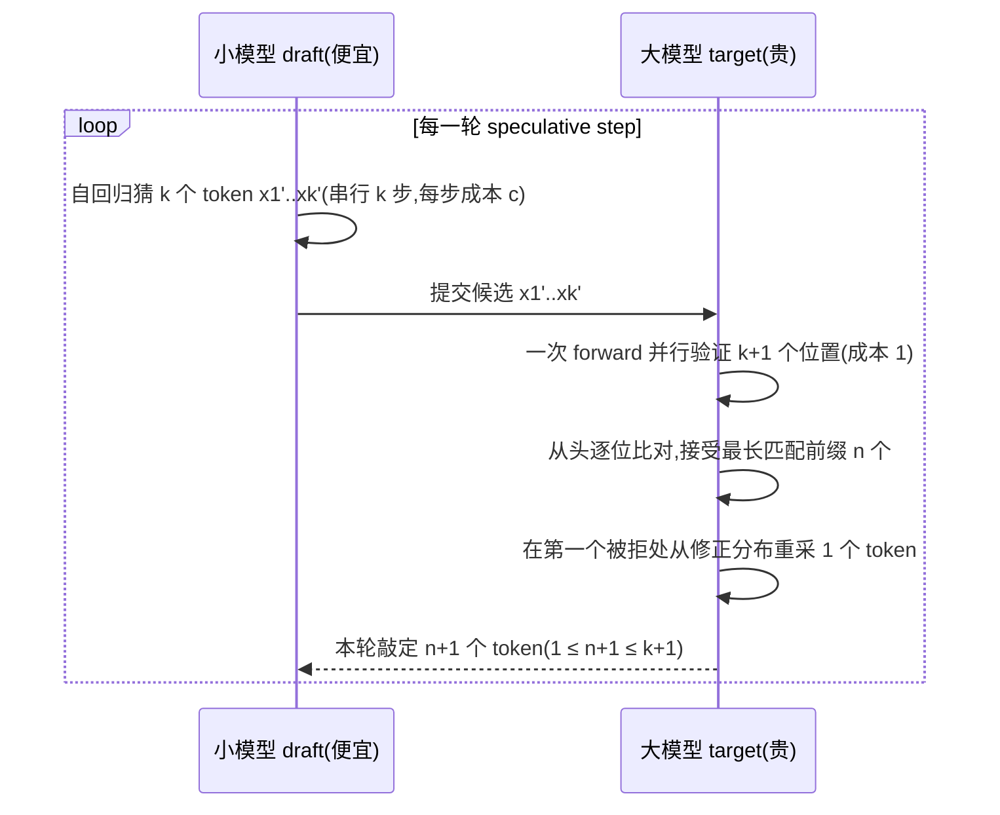
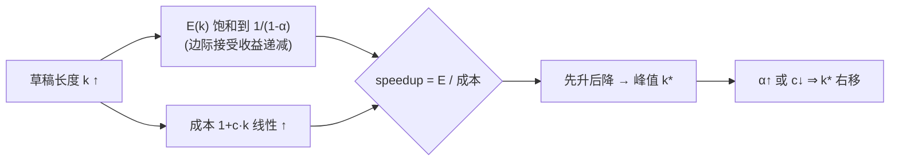
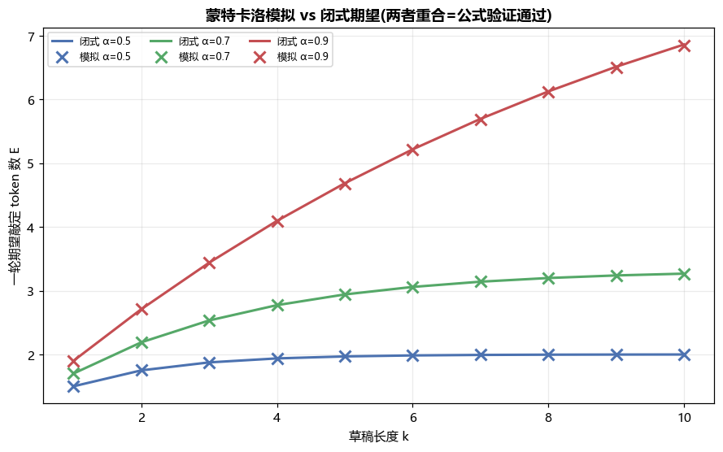
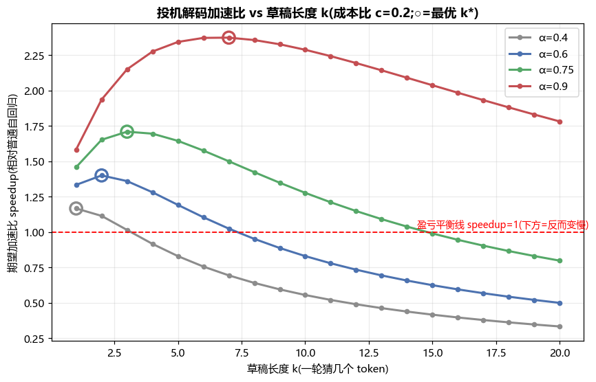
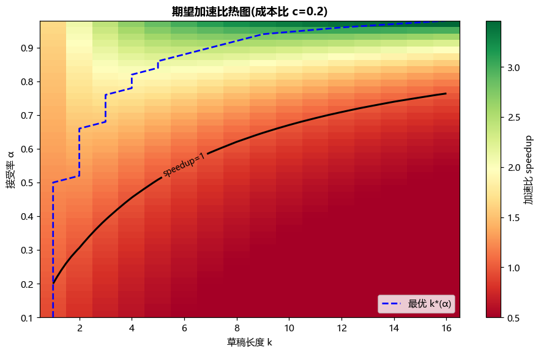
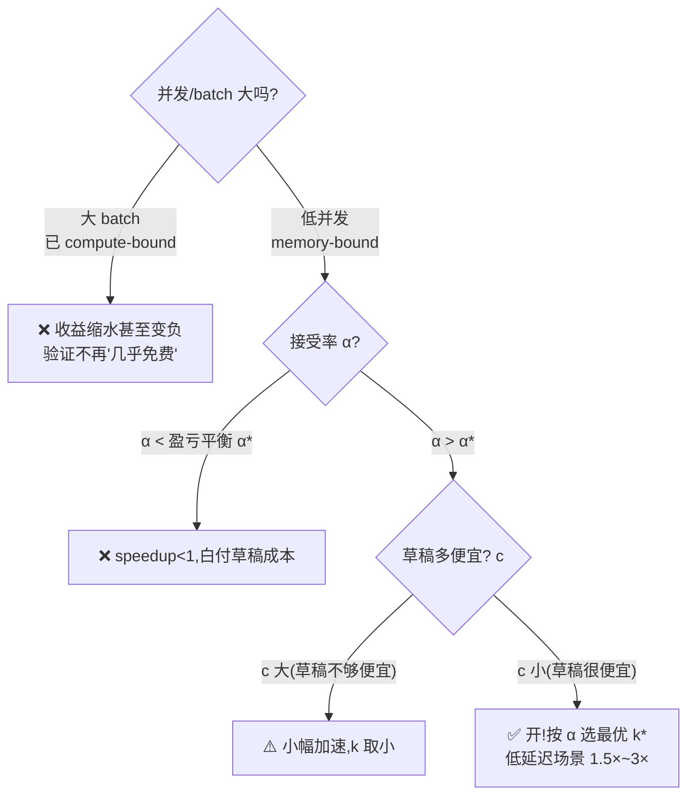

# 项目 08 · 投机解码模拟与期望加速 🚀

> 对应架构篇 [`../../09_推理引擎架构...md`](../../09_推理引擎架构_连续批处理_调度_投机解码_chunked_prefill.md) 的「5. 投机解码 speculative decoding」。
>
> 用**闭式公式 + 蒙特卡洛模拟对拍**,把投机解码(speculative decoding)的**期望加速**量化到底:一轮草稿提 `k` 个 token、接受率 `α`,到底能敲定几个 token?加速比长什么样?最优草稿长度 `k*` 在哪里?什么时候**反而变慢**?
>
> 纯 `numpy` + `matplotlib`,CPU、离线、秒级可跑,**不下模型、不联网、不需 key**。

---

## 🧠 一句话直觉:为什么"先猜后验"能加速?

LLM 自回归解码(decode)一次只吐 **1 个 token**,而且是 **访存受限(memory-bound)** 的:每步都要把几十 GB 的权重和 KV cache 从显存搬进片上,算力(FLOPS)大量闲置。于是有个"白嫖"的机会 👇

> 🔬 **第一性原理**:decode 阶段大模型**验证 1 个 token 和验证 K 个 token 的墙钟时间几乎一样**(都被显存带宽卡住,算力有的是)。既然多验几个"几乎免费",那就先用一个**便宜的小模型(草稿 draft)猜 K 个**,再让**大模型一次并行验证**——猜对的部分白赚,一轮吐出多个 token。

- **草稿模型 draft**:小、快、便宜(如 1B 猜 70B 验、或 Medusa/EAGLE 头)。
- **目标模型 target**:大、准,负责**并行验证 + 拒绝采样修正**。
- **无损性**:靠拒绝采样(rejection sampling)修正,数学上**保证输出分布 = 大模型直接采样**——不是近似,是严格无损。

这个项目**不跑真模型**,而是把上面的随机过程抽象成一个概率模型,用公式算期望、用模拟对拍,专注讲清**"加速从哪来、到哪去"**。

> 🔬 **第一性原理:为什么"验 K 个 ≈ 验 1 个"?** decode 每步的时间被 **权重+KV 的显存搬运** 主导,而不是被算力主导。把一个 token 换成 K 个 token 一起过网络,搬运的权重量**几乎不变**(权重只读一遍),只是多算了 K 倍的矩阵乘——但这些矩阵乘在 memory-bound 区**本来就是免费算力**。所以:
>
> | 阶段 | 瓶颈 | 验 1 个 vs 验 K 个 |
> |---|---|---|
> | decode(低并发) | 访存带宽(memory-bound) | 墙钟几乎相同 ✅ 投机解码大赚 |
> | prefill / 大 batch | 算力(compute-bound) | 验 K 个≈K 倍时间 ❌ 收益缩水 |
>
> 一句话:**投机解码把闲置的算力换成了吞吐**。这也解释了它为何**只在低并发/低延迟场景**真香(详见 [`../02_roofline_bandwidth_bench`](../02_roofline_bandwidth_bench) 的 roofline 实测)。

---

## 🎯 建模:草稿-验证(draft-then-verify)的一轮



**关键量**(全项目统一记号):

| 符号 | 含义 | 典型值 |
|---|---|---|
| `α` (alpha) | 单个草稿 token 被接受的**平均概率**(acceptance rate) | 0.6~0.9(草稿越像大模型越高) |
| `k` | 一轮草稿提出的 token 数(draft length,doc 里记作 K) | 2~10 |
| `c` | 草稿模型 / 目标模型的**单步成本比**(draft-to-target cost ratio) | 0.1~0.2 |
| `E` | 一轮**期望敲定**的 token 数(含那 1 个修正/bonus token) | 见闭式 |

---

## 📐 数学推导:一轮期望敲定几个 token?

设接受的草稿前缀长度为随机变量 `X`(`0 ≤ X ≤ k`)。因为**逐位比对、遇到第一个拒绝就停**,在 i.i.d. 接受近似下:

$$P(X \ge i) = \alpha^i \qquad (\text{前 } i \text{ 个都被接受})$$

一轮敲定的 token 数 = `X + 1`(那 `+1` 是拒绝点的重采 token;若全接受则是末尾的 bonus token)。用**尾和公式** `E[X] = Σ_{i≥1} P(X ≥ i)`:

$$
E \;=\; 1 + \mathbb{E}[X]
\;=\; 1 + \sum_{i=1}^{k}\alpha^i
\;=\; 1 + \frac{\alpha(1-\alpha^{k})}{1-\alpha}
\;=\; \boxed{\dfrac{1-\alpha^{\,k+1}}{1-\alpha}}
$$

这就是几何级数求和,和 doc 里的公式完全一致。**边界**很好记:

| 情形 | E | 直觉 |
|---|---|---|
| `α → 0`(草稿全被拒) | `1` | 每轮只拿到那 1 个修正 token,退化为普通自回归 |
| `α → 1`(草稿全被接受) | `k+1` | k 个草稿全中 + 1 个 bonus |
| 一般 | `(1-α^{k+1})/(1-α)` | 单调随 α、k 递增,但随 k **饱和到上界** `1/(1-α)` |

> 💡 **面试高频**:"E 为什么随 k 会饱和?" → 因为 `Σαⁱ` 是收敛级数,`k→∞` 时 `E→1/(1-α)`。**边际接受收益递减**——第 10 个草稿 token 被接受的概率是 `α¹⁰`,已经很小,再加长草稿几乎不涨 E,却要多付草稿成本。这正是**存在最优 k\*** 的根源。

### ✍️ 手算一个例子(α=0.8, k=3)

一步步把公式"跑"一遍,建立直觉:

| 前缀接受长度 X | 概率 | 敲定 token 数 X+1 |
|---|---|---|
| 0(第 1 个就拒) | `(1-α)=0.2` | 1 |
| 1(拒在第 2 个) | `α(1-α)=0.16` | 2 |
| 2(拒在第 3 个) | `α²(1-α)=0.128` | 3 |
| 3(全接受 + bonus) | `α³=0.512` | 4 |

$$
E = 1(0.2)+2(0.16)+3(0.128)+4(0.512)=2.952
= \frac{1-0.8^{4}}{1-0.8}=\frac{0.5904}{0.2}=2.952 \checkmark
$$

即 α=0.8、k=3 时,**平均一轮敲定 ≈2.95 个 token**(而普通 decode 只有 1 个)。加速比还要再除以成本 `1+ck`。

---

## 💰 加速比模型:把"草稿成本"算进去

E 只是"产出",还要除以"成本"。一轮里:

- 草稿模型**自回归跑 k 步**(串行!每步耗 `c` 个"目标单位") → 成本 `c·k`
- 目标模型做 **1 次并行验证** → 成本 `1`
- 普通自回归基线:1 个目标单位产 1 个 token

$$
\text{speedup}(\alpha,k,c)\;=\;\frac{E}{1+c\,k}\;=\;\frac{1-\alpha^{\,k+1}}{(1-\alpha)\,(1+c\,k)}
$$

- `speedup > 1` 才真正划算(相对普通 decode)。
- `α` 低或 `c` 高时可能 **< 1**——白付草稿成本,**反而更慢**(踩坑区)。

> ⚠️ **常见坑**:很多人以为投机解码"永远加速"。**错**。它有**盈亏平衡接受率** `α*`:低于它 speedup < 1。本项目 `breakeven_alpha(k, c)` 用二分求出这个临界值(见下表)。

### 📉 为什么存在最优草稿长度 k\*?

- 分子 `E` 随 k **饱和**(逼近 `1/(1-α)`,涨不动了)。
- 分母 `1 + c·k` 随 k **线性增长**(草稿越长越贵)。
- 两者之比必然**先升后降**,在某个 `k*` 处见顶。

$$
\underbrace{E(k)\to \tfrac{1}{1-\alpha}}_{\text{饱和}}
\quad\Big/\quad
\underbrace{(1+ck)}_{\text{线性增长}}
\;\Longrightarrow\;
\text{存在内部极大值 } k^\*
$$

**α 越高、c 越小**,E 饱和得越慢 → **k\* 越大**(值得提更长的草稿)。这是本项目的一个可测试断言。



---

## 🎓 接受率 α 是什么?怎么来的?

`α` 是这套模型里**最重要、也最需要工程去争取**的量。它衡量"草稿模型的下一个 token,有多大概率被大模型认可"。

- **决定因素**:草稿分布 `q(x)` 与大模型分布 `p(x)` 有多接近。两者越像,`α` 越高。严格版(Leviathan)里,单 token 接受概率 = `min(1, p(x)/q(x))` 的期望,和分布重叠度直接挂钩。
- **提高 α 的手段**(每一招都把加速比和最优 k\* 一起抬高):
  - 选**同系列**的草稿(如 Qwen-1.8B 猜 Qwen-72B),预训练分布天然接近;
  - **蒸馏 / 领域微调**草稿,专门对齐目标分布;
  - 用 **EAGLE**(在目标模型的**特征层**做轻量自回归草稿,α 极高)或 **Medusa**(目标模型加多头);
  - **降采样温度**(temperature↓ 分布更尖锐、更确定 → α↑;高温发散 → α↓);
  - 对"复述/抽取"类任务用 **n-gram / PLD**(直接从 prompt 抄,命中率极高)。

### 主流草稿变体对比

| 变体 | 草稿来源 | 典型 α | 代价 |
|---|---|---|---|
| 独立小模型 | 同系列更小的模型 | 中~高 | 需两个模型、显存翻倍 |
| **Medusa** | 目标模型加多个输出头 | 中 | 无需独立草稿,微调即可 |
| **EAGLE / EAGLE-2/3** | 特征层轻量自回归 + 草稿树 | **很高** | SOTA,需训练草稿头 |
| **Lookahead / n-gram / PLD** | prompt 里的 n-gram / Jacobi | 任务依赖(复述极高) | 零训练,泛任务一般 |

> 💡 本项目用单一标量 `α` 抽象所有变体的"平均接受率"——**换个变体,就是换一个 α 值代入公式**,加速曲线随之整体平移。想直观感受,把 `run_demo.py` 里的 α 从 0.6 调到 0.9 再跑一遍即可。

---

## 📁 文件结构

| 文件 | 作用 |
|---|---|
| `spec_decode.py` | 核心:闭式期望、蒙特卡洛模拟、加速比、最优 k、盈亏平衡 α、加速比网格 |
| `tests/test_spec_decode.py` | 17 个 pytest:公式手算对拍、模拟≈闭式、α↑加速↑、k\*存在且随α增大、盈亏平衡是根 |
| `run_demo.py` | 打印对拍表 + 最优 k\* 表,生成 3 张配图 PNG |
| `requirements.txt` | numpy / matplotlib / pytest |

---

## 🧩 代码讲解(核心片段)

### 1) 闭式期望——一行公式,处理好边界

```python
def expected_tokens(alpha: float, k: int) -> float:
    if alpha >= 1.0:
        return float(k + 1)                 # 极限:全接受 + bonus,避免 0/0
    return (1.0 - alpha ** (k + 1)) / (1.0 - alpha)
```

⚠️ `α=1` 时公式分母为 0,必须单独返回 `k+1`(洛必达/级数极限都得这个)。

### 2) 蒙特卡洛模拟——用 `cumprod` 巧算"开头连续接受数"

不写 for 循环、纯向量化:对每一轮独立掷 k 次 `Bernoulli(α)`,**接受前缀长度 = 开头连续 True 的个数**。技巧:一旦出现第一个 `False`,`cumprod` 就变 0 并保持 0,于是每行 `cumprod` 之和恰好等于开头连续 True 的长度。

```python
def simulate_mean_tokens(alpha, k, n_steps=200_000, seed=0):
    rng = np.random.default_rng(seed)
    accepts = rng.random((n_steps, k)) < alpha          # (n_steps, k) 的 bool
    leading = np.cumprod(accepts, axis=1).sum(axis=1)    # 开头连续 True 的长度
    tokens = leading + 1                                 # +1: 拒绝点重采 / bonus
    return float(tokens.mean())
```

> 💡 `cumprod` 求"前缀连续段长度"是个通用小技巧(也能算最长前导零/前导 1),面试白板题常用。

### 3) 加速比 + 最优 k——argmax 暴力搜就够

```python
def expected_speedup(alpha, k, c=DEFAULT_C):
    return expected_tokens(alpha, k) / (1.0 + c * k)

def optimal_k(alpha, c=DEFAULT_C, k_max=20):
    ks = np.arange(1, k_max + 1)
    speeds = np.array([expected_speedup(alpha, int(k), c) for k in ks])
    return int(ks[int(np.argmax(speeds))])
```

### 4) 盈亏平衡接受率——二分求根(speedup 关于 α 单调)

```python
def breakeven_alpha(k, c=DEFAULT_C):
    lo, hi = 0.0, 1.0 - 1e-12
    if expected_speedup(hi, k, c) <= 1.0:   # 草稿太贵,再高的 α 也回不了本
        return 1.0
    for _ in range(100):                     # 二分 100 次 ≈ 机器精度
        mid = 0.5 * (lo + hi)
        lo, hi = (mid, hi) if expected_speedup(mid, k, c) < 1.0 else (lo, mid)
    return 0.5 * (lo + hi)
```

⚠️ 二分成立的前提:`speedup(α)` 在 `α∈(0,1)` 上**单调递增**(k、c 固定)——直觉上接受率越高一定越赚,所以根唯一、可二分。若 `α=1` 时 speedup 仍 ≤ 1(草稿太贵),提前返回 1.0 表示"这套配置永远回不了本"。

### 5) 逐轮可读版模拟 + 加速比网格

`simulate_step` 是给人读的单轮版(遇到第一个拒绝 `break`),用于测试"敲定数恒在 `[1, k+1]`";`speedup_grid` 批量算 `(α, k)` 矩阵供热图:

```python
def simulate_step(alpha, k, rng):
    accepted = 0
    for _ in range(k):
        if rng.random() < alpha:
            accepted += 1
        else:
            break                 # 遇到第一个拒绝即停,后面全丢弃
    return accepted + 1           # +1: 修正 / bonus token

def speedup_grid(alphas, ks, c=DEFAULT_C):
    grid = np.empty((len(alphas), len(ks)))
    for i, a in enumerate(alphas):
        for j, k in enumerate(ks):
            grid[i, j] = expected_speedup(float(a), int(k), c)
    return grid
```

---

## ▶️ 如何运行

```bash
pip install -r requirements.txt      # numpy / matplotlib / pytest

python -m pytest -q                   # 17 passed —— 公式与模拟全部对拍通过
python run_demo.py                    # 打印对拍表 + 最优 k* 表,生成 3 张 PNG
```

生成的配图(当前目录):`speedup_vs_k.png`、`speedup_heatmap.png`、`sim_vs_closed.png`。

> matplotlib 用 `Agg` 后端(无需显示器)+ `Microsoft YaHei` 中文字体,`axes.unicode_minus=False`,Windows 本机直接出图。

### 🧪 测试覆盖(17 passed)

| 测试 | 验证的性质 |
|---|---|
| `expected_tokens_hand_computed` | 闭式公式与**手算小例子**逐位相等 |
| `expected_tokens_boundaries` | α=0→E=1、α=1→E=k+1、恒有 `1≤E≤k+1` |
| `expected_tokens_monotonic` | E 随 α、随 k 严格递增 |
| `simulation_matches_closed_form` ×4 | 30 万次模拟均值与闭式**误差 < 0.02** |
| `simulate_step_in_range` | 单轮敲定数恒落在 `[1, k+1]` |
| `simulation_converges_more_samples_tighter` | 样本越多,与闭式偏差越小(蒙特卡洛收敛) |
| `higher_acceptance_more_speedup` | **α↑ ⇒ 加速比↑**(单调) |
| `speedup_sim_matches_closed_form` | 实测加速比 ≈ 闭式加速比 |
| `low_alpha_high_cost_can_be_slowdown` | 低 α + 高 c ⇒ **speedup < 1**(会变慢) |
| `optimal_k_is_interior_peak` | **最优 k\* 存在**且是内部极大(非边界) |
| `optimal_k_grows_with_alpha` | **α↑ ⇒ k\* 不减**且端到端增大 |
| `optimal_speedup_matches_grid_max` | `optimal_speedup` = 暴力网格最大值 |
| `breakeven_alpha_is_root` | 盈亏平衡 α\* 处 speedup=1,两侧异号 |
| `speedup_grid_shape_and_values` | 网格形状与逐点函数一致 |

> 这三条正是题目要的金标准:**模拟均值≈闭式期望**、**接受率越高加速越大**、**k 的最优点存在**。

---

## 📊 典型输出与配图解读

### 模拟 ≈ 闭式(公式验证)

`run_demo.py` 打印的对拍表(20 万次模拟,误差 < 0.01):

| α | k | 闭式 E | 模拟 E | \|误差\| |
|---|---|---|---|---|
| 0.30 | 2 | 1.3900 | 1.3913 | 0.0013 |
| 0.60 | 5 | 2.3834 | 2.3894 | 0.0061 |
| 0.90 | 8 | 6.1258 | 6.1297 | 0.0039 |



> 🔬 三条曲线(闭式)与叉号(模拟)几乎完全重合,直接**用随机过程验证了几何级数公式**。α=0.9 时 E 随 k 一路涨(草稿好,加长划算);α=0.5 时很快压平(饱和早)。

### 加速比 vs 草稿长度 k(含最优点 ○)



不同 α 的最优草稿长度与加速比(`c=0.2`):

| 接受率 α | 最优 k\* | 最优 speedup | 盈亏平衡 α(该 k\*) |
|---|---|---|---|
| 0.40 | 1 | 1.167× | 0.200 |
| 0.60 | 2 | 1.400× | 0.306 |
| 0.75 | 3 | 1.709× | 0.389 |
| 0.90 | 7 | 2.373× | 0.589 |
| 0.95 | 10 | 2.875× | 0.671 |

> 📈 **规律一目了然**:α 从 0.4→0.95,最优草稿 k\* 从 1→10(**右移**),加速比从 1.17×→2.88×。这解释了为什么 EAGLE 这类**高接受率**方法敢用长草稿树、加速更猛。

### (α, k) 加速比热图 + 盈亏平衡线



> 🗺️ 黑色 `speedup=1` 等高线是**盈亏分界**:左下(低 α、可长 k)是**红色亏损区**(反而变慢),右上是**绿色盈利区**。蓝色虚线是每个 α 的最优 k\* 轨迹——**随 α 升高向右上爬**。这张图一眼看清"投机解码在哪个工况才值得开"。

---

## 🧭 什么时候该开投机解码?(决策)



---

## 💡 面试高频 Q&A

> **Q1:投机解码为什么能加速,为什么不掉精度?**
> 加速:decode 是 memory-bound,大模型**验 K 个和验 1 个墙钟差不多**,小模型猜的又便宜,一轮多敲定几个 token。无损:第一个被拒处用**拒绝采样从修正分布重采**,数学上保证输出分布 = 大模型直接采样(严格无损,不是近似)。

> **Q2:期望加速比公式?最优草稿长度存在吗?**
> `E=(1-α^{k+1})/(1-α)`,`speedup=E/(1+ck)`。**存在最优 k\***:E 随 k 饱和(逼近 `1/(1-α)`),成本 `1+ck` 线性增长,比值先升后降。α 越高、c 越小,k\* 越大。

> **Q3:什么时候投机解码没用甚至变慢?**
> ① 接受率低(草稿和大模型不像 / 高温采样发散)→ 低于盈亏平衡 α\*,speedup<1;② **大 batch 高吞吐**场景,GPU 已 compute-bound,"多验几个"不再免费,反挤占算力。最香场景=**低并发、追求极致 TPOT**(单用户对话)。

> **Q4:接受率 α 由什么决定?怎么提高?**
> 由"草稿分布与大模型分布有多接近"决定(可用两者的对齐度理解)。提高手段:更好的草稿(同系列小模型 / **EAGLE 在特征层做草稿** / Medusa 多头 / n-gram 复述)、降低采样温度、领域内蒸馏。α↑ 直接把加速比和最优 k\* 一起抬上去。

> **Q5:草稿从哪来?几种主流变体?**
> 独立小模型(经典,显存翻倍)、**Medusa**(大模型加多头,无需独立草稿)、**EAGLE/EAGLE-2/3**(特征层轻量自回归,α 高、SOTA)、**Lookahead / n-gram / PLD**(用 prompt 里的 n-gram 当草稿,零训练,复述/长上下文抽取特有效)。

---

## ⚠️ 模型的简化(诚实声明)

这是**教学建模**,不是精确性能预测,以下都做了近似:

- **i.i.d. 接受近似**:真实里 token 间接受概率相关(前面接受了后面更可能接受),`α` 是"平均接受率"的一阶近似。真实用 **接受长度分布**更准。
- **成本比 c 恒定**:实际 c 随 batch、序列长度、算子实现变化;大 batch 下"验证近乎免费"的前提会破裂(见 Q3)。
- **不建模草稿树 / 多候选**:Medusa、EAGLE-2、SpecInfer 用**树状草稿 + 并行验证多条路径**,期望加速更高,本模型只算线性单链草稿。
- **未建模拒绝采样的分布细节**:这里把"接受"抽象成 `Bernoulli(α)`,没有真的做 target/draft 概率比的拒绝采样(那部分保证无损,不影响期望 token 数的量级)。

目的:**把"加速从哪来、最优 k 在哪、何时变慢"的直觉与量级讲透**。真实数字请看 vLLM / SGLang / EAGLE 的 benchmark。

---

## 📌 小结

1. 投机解码的收益本质 = **decode 是 memory-bound,大模型并行验证近乎免费** + **草稿便宜**。
2. 一轮期望敲定 token 数 `E=(1-α^{k+1})/(1-α)`,**几何级数**,随 k **饱和**到 `1/(1-α)`。
3. 加速比 `speedup=E/(1+ck)`,有**盈亏平衡 α\***(低于它反而变慢)和**内部最优 k\***(α↑、c↓ 则 k\* 右移)。
4. 蒙特卡洛 20 万次模拟与闭式**误差 < 0.01**,公式站得住脚。
5. 最香场景:**低并发、低延迟**;大 batch / 低接受率是它的软肋。

## 🔗 延伸

- 架构总篇:[`../../09_推理引擎架构...md`](../../09_推理引擎架构_连续批处理_调度_投机解码_chunked_prefill.md)(投机解码 + 连续批处理 + chunked prefill)
- 为什么"验 K 个≈验 1 个":[`../../02_GPU结构...md`](../../02_GPU结构_从SM到集群_全面本质.md) 的 roofline / memory-bound,及项目 [`../02_roofline_bandwidth_bench`](../02_roofline_bandwidth_bench)
- KV cache 与 decode 访存:[`../../07_KVCache深入...md`](../../07_KVCache深入_PagedAttention_前缀缓存_量化压缩.md)
- 姊妹项目:[`../01_pd_disagg_simulator`](../01_pd_disagg_simulator)(PD 分离调度)、[`../03_cache_locality_bench`](../03_cache_locality_bench)(缓存局部性)
- 仓库既有推理专题:`../../../llm-inference/`(vLLM、SGLang、投机解码、KV-Cache优化 等)
