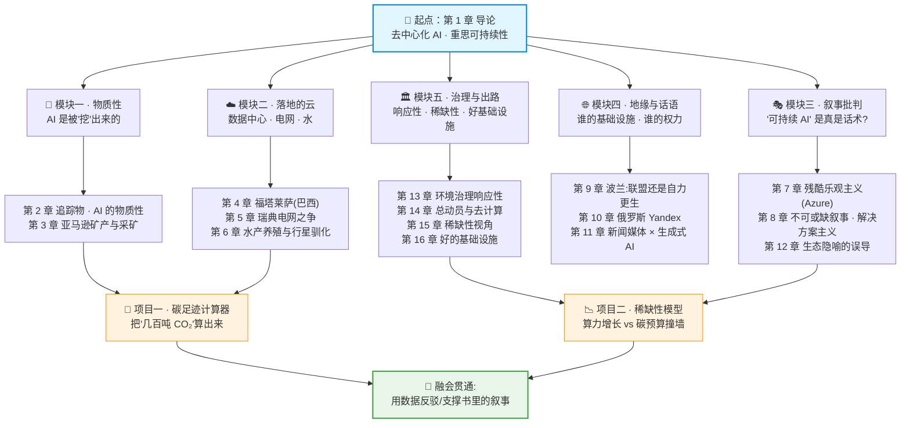

# 🌍 《AI Infrastructures and Sustainability》中文逐章精讲 + 实战合集

> 本仓库是对学术专著 **《AI Infrastructures and Sustainability》**（*AI 基础设施与可持续性*，Palgrave / Springer, 2026，Mollen · Jansen · Kannengießer · Velkova 主编）的**中文逐章精讲**，外加 **2 个从第一性原理搭起、离线可跑、带 pytest 的实战项目**。
>
> 这本书不是一本"怎么训模型"的技术书，而是一本从**批判基础设施研究（Critical Infrastructure Studies）**、**政治经济学**、**环境治理**视角，把"AI 到底消耗了什么、谁在承担代价、'可持续 AI' 的叙事哪里是真哪里是话术"讲透的书。它把 AI 从云端的抽象拉回到**矿产、水、电网、土地、劳工、地缘政治**的物质世界。
>
> 📌 **本合集想解决什么**：读原书容易陷进社科术语（残酷乐观主义、基础设施化、解决方案主义……）而抓不住骨架。这里每章都用**中文 + 类比 + emoji + 表格**把核心论点拆开讲，并配 **mermaid 图 / 面试高频问答**；再用两个可运行的小模型，把"训练一个大模型排放几百吨 CO₂""算力增长会不会撞碎碳预算"这类**抽象口号变成可计算、可测试、可复现的代码**。

---

## 🗺️ 学习路径（建议顺序）



**三条读法：**

- 🚀 **速通（半天）**：第 1 章 → 第 8 章（解决方案主义）→ 第 15 章（稀缺性）→ 跑项目一。抓住"物质代价 + 叙事批判 + 出路"的主线即可。
- 📚 **通读（按模块）**：按上图五个模块顺序，每读完一个模块回来跑对应项目，把定性论点用定量代码验一遍。
- 🎤 **面试/汇报导向**：每章末尾都有「面试高频 / 第一性原理 / 常见坑」，配合两个项目的代码结论，足够撑起一次关于"AI 与可持续性"的深度讨论。

---

## 📖 目录一 · 逐章精讲（`book-guide/`）

> 每篇都是独立的中文长文：原书论点 + 类比讲解 + mermaid 图 + 面试问答。点击章名直达。

| 章 | 精讲文件 | 一句话讲什么 |
|:--:|:---|:---|
| 1 | [导论：去中心化 AI 与重思可持续性](book-guide/01_导论_去中心化AI与重思可持续性.md) | 全书总纲：为什么要把 AI "去中心化"地看——从云端抽象拉回到物质、地理与权力，重新定义"可持续"。 |
| 2 | [追踪物：AI 的物质性](book-guide/02_追踪物_AI的物质性.md) | 用"follow the thing"方法，沿着一块芯片/一台服务器倒推它背后的矿石、供应链与看不见的劳动。 |
| 3 | [亚马逊的矿产与采矿：智能的摇篮](book-guide/03_亚马逊的矿产与采矿_智能的摇篮.md) | AI 的"摇篮"在亚马逊雨林的矿坑——采矿如何成为"基础设施化"的起点，代价由谁承担。 |
| 4 | [在大西洋一角"生长"云：福塔莱萨数据中心](book-guide/04_在大西洋一角生长云_福塔莱萨数据中心.md) | 巴西福塔莱萨如何借"AI + 可再生能源"范式成为数字枢纽，光鲜叙事下的地方现实。 |
| 5 | [对齐能源网、云与公共价值：瑞典](book-guide/05_对齐能源网_云与公共价值_瑞典.md) | 瑞典数据中心与电网之争：清洁电力、公共价值与私有云之间怎么"对齐"或撕裂。 |
| 6 | [水产养殖、AI 与行星驯化](book-guide/06_水产养殖_AI与行星驯化.md) | 从三文鱼养殖看 AI 如何"驯化"整个行星——把自然纳入可计算、可优化的系统。 |
| 7 | [可持续云的"残酷乐观主义"](book-guide/07_可持续云的残酷乐观主义.md) | 以微软 Azure 为例：绿色云的美好承诺为何是一种"残酷乐观主义"——让你抱着幻想接受现状。 |
| 8 | [不可或缺叙事与基础设施解决方案主义](book-guide/08_不可或缺叙事与基础设施解决方案主义.md) | AI 公司如何把自己叙述成"社会不可或缺"，用"再建一层基础设施"来解决基础设施造成的问题。 |
| 9 | [联盟还是自力更生：新地缘技术圈](book-guide/09_联盟还是自力更生_新地缘技术圈.md) | 以波兰为例，中小国家在 AI 基础设施上"抱大腿结盟"还是"自主可控"的两难。 |
| 10 | [俄罗斯 AI 的话语基础设施：Yandex](book-guide/10_俄罗斯AI的话语基础设施_Yandex.md) | 拆解 Yandex 可持续性报告——"话语基础设施"如何用叙事把公司包装成负责任行动者。 |
| 11 | [纠缠的可持续性：新闻媒体合作与生成式 AI](book-guide/11_纠缠的可持续性_新闻媒体合作与生成式AI.md) | 新闻媒体与生成式 AI 平台的合作，如何让市场权力与"可持续性"纠缠在一起。 |
| 12 | [只见树木不见数据：生态隐喻](book-guide/12_只见树木不见数据_生态隐喻.md) | "云""数据湖""生态系统"等生态隐喻如何（误）塑造我们对 AI 数据与算力的理解。 |
| 13 | [环境治理中的响应性与 AI](book-guide/13_环境治理中的响应性与AI.md) | AI 进入环境治理：基础设施、权力与制度能力——技术能否让治理更"响应"公共诉求。 |
| 14 | [AI 基础设施、总动员与去计算](book-guide/14_AI基础设施_总动员与去计算.md) | 用"总动员"框架看 AI 军备竞赛，并提出激进出路——"去计算"(decomputing)：少算，才可持续。 |
| 15 | [为燃烧的星球提供更多算力？稀缺性视角](book-guide/15_为燃烧的星球提供更多算力_稀缺性视角.md) | 在气候临界点还要"更多算力"吗？用"稀缺性"而非"效率"重构 AI 基础设施治理。 |
| 16 | [好的基础设施：数字未来、价值与摩擦](book-guide/16_好的基础设施_数字未来价值与摩擦.md) | 全书收尾：什么才是"好的基础设施"——拥抱摩擦、承载多元价值，而非追求无摩擦的规模化。 |

---

## 🛠️ 目录二 · 实战项目（`projects/`）

> 两个项目都是**纯 Python、离线可跑、不联网 / 不下模型 / 不需 API key**，把书里的定性论点变成可计算、可测试、可复现的代码。

| 项目 | 目录 | 讲什么 & 对应章节 | 如何跑 |
|:---|:---|:---|:---|
| 🧮 **AI 碳足迹计算器** | [`projects/01_ai_carbon_footprint_calculator`](projects/01_ai_carbon_footprint_calculator) | 把"训练一个大模型排放几百吨 CO₂"拆成第一性原理链条：给定 GPU 数 · 功耗 · 时长 · PUE · 电网碳强度 · 水耗系数，逐行算出训练/推理的 **kWh · tCO₂e · 水(L)**，并对比不同电网的清洁度。呼应 **第 2、4、5、7 章**（物质性、数据中心、电网、绿色云叙事）。23 个单测，每个对应一条物理直觉。 | ```bash<br>cd projects/01_ai_carbon_footprint_calculator<br>pip install -r requirements.txt<br>python -m pytest -q      # 单元测试<br>python run_demo.py       # 出图到 figures/```<br> |
| 📉 **数据中心稀缺性模型** | [`projects/02_datacenter_scarcity_model`](projects/02_datacenter_scarcity_model) | 用最小模型回答尖锐问题:"照当前趋势，AI 累计碳排第几年耗尽碳预算？能效改进和可再生能源救不救得了？"基于 **Kaya 恒等式 + 碳预算**，把吓人的总量拆成三条可调曲线看它逼近"碳预算之墙"。呼应 **第 14、15、16 章**（去计算、稀缺性、好基础设施）。 | ```bash<br>cd projects/02_datacenter_scarcity_model<br>pip install -r requirements.txt<br>python -m pytest -q      # 期望 39 passed<br>python run_demo.py       # 出图到 out/```<br> |

> 💡 两个项目形成对照：**项目一算"一次训练/推理的账单"（微观、当下）**，**项目二算"整个行业累计逼近碳预算"（宏观、趋势）**。合起来正好覆盖书里"个体代价 → 系统极限"的完整论证链。

---

## 🎯 面试 / 实战怎么用

这套材料适合三类场景：

- 🎤 **面试 / 面谈里聊"AI 与可持续性"**
  - 别只会说"AI 很耗电"。用**项目一的公式**把它量化：`能耗 = GPU 数 × 单卡功耗 × 时长 × PUE`，`碳排 = 能耗 × 电网碳强度`——一句话展示第一性原理。
  - 被追问"绿色云是不是就没问题了？"→ 用**第 7 章「残酷乐观主义」**和**第 8 章「解决方案主义」**反打：清洁电力叙事常常掩盖总量增长与地方代价。
  - 被追问"那怎么办？"→ 抛出**第 14 章「去计算」/ 第 15 章「稀缺性视角」**：从"更高效地多算"转向"是否该少算"，配**项目二**的碳预算撞墙曲线作论据。

- 📊 **做技术选型 / ESG 汇报的论据库**
  - 直接改**项目一**里的参数（你自己的 GPU 型号、PUE、当地电网碳强度），算出真实的训练/推理碳账单，写进 PPT。
  - 用**项目二**跑几个情景（乐观能效 / 悲观增长 / 高可再生占比），给管理层看"哪一条假设才真正决定我们撞不撞墙"。

- 🧠 **建立批判性思维框架**
  - 逐章精讲的价值不在记结论，而在学会一套**追问工具**：这条基础设施的物质来源是什么（第 2–3 章）？谁在讲"可持续"叙事、为谁服务（第 7–12 章）？出路是效率还是节制（第 14–16 章）？
  - 每章末尾的「面试高频 / 常见坑」就是把这套追问工具固化成可复用的问答。

---

## 📌 一句话总结

> **AI 不是"云端"的，它是被挖出来、被电起来、被水冷却、被叙事包装起来的物质系统。** 这本书教你看穿"可持续 AI"的话术，这两个项目教你把代价算成数字。读完 + 跑完，你既有**批判的眼光**，也有**量化的底气**。

## 🔗 延伸

- 原书：*AI Infrastructures and Sustainability*，Palgrave Macmillan / Springer，2026。
- 本合集配套上级教程仓库 [`llm-action`](../..)（AI-Infra 中文教程）。
- 想深入某一章或改项目参数：直接进对应目录，每篇 / 每个项目都有独立 README 与可跑代码。

*本合集为学习用途的中文精讲与教学项目，观点解读以原书为准。*
