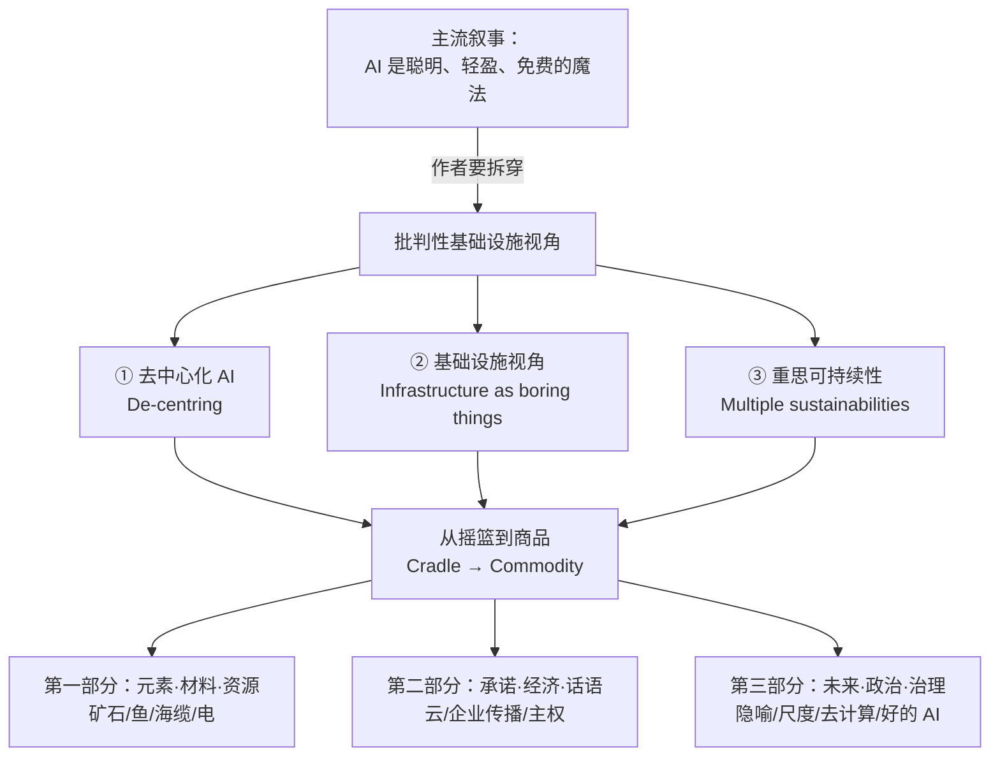
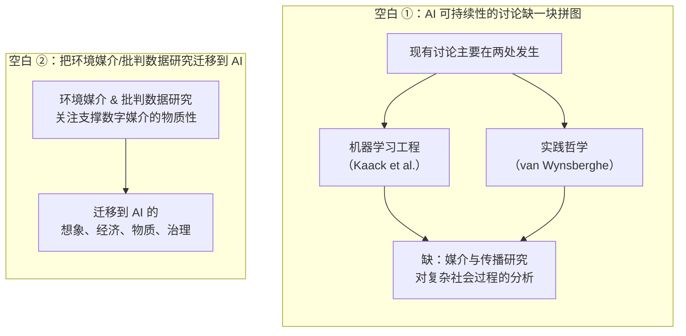
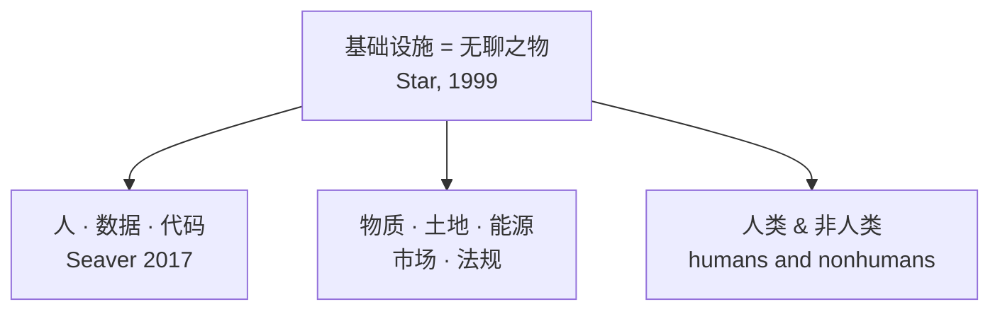
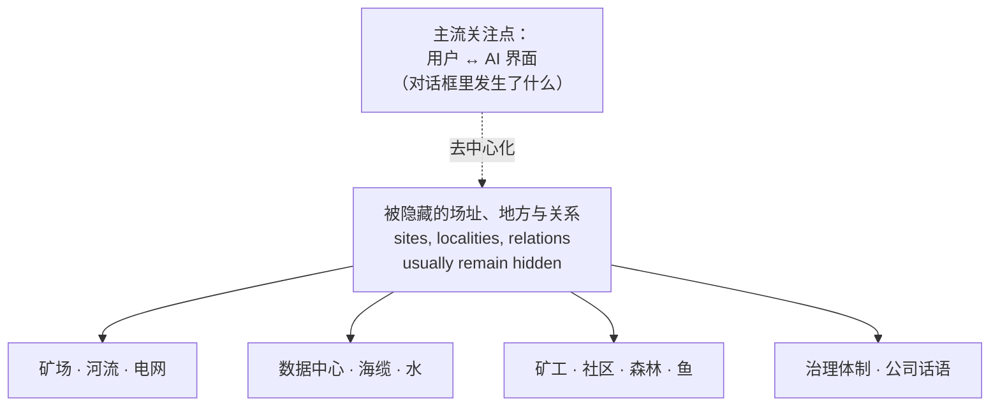
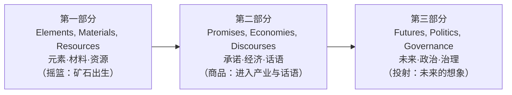
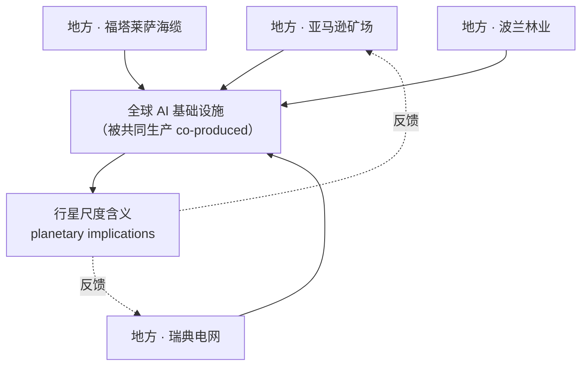

# 第 1 章 导论：去中心化 AI 与重思可持续性 🌍⚡

> 原书章节：*Introduction: De-Centring Artificial Intelligence and Rethinking Sustainability*
> 作者：Anne Mollen、Fieke Jansen、Sigrid Kannengießer、Julia Velkova（本书四位主编）
> 对应 PDF 页码：21–48（正文 22–41，参考文献 42–48）
> 出处：*AI Infrastructures and Sustainability*（Palgrave Studies in European Communication Research and Education，2026，开放获取 CC BY 4.0）

---

## 🗺️ 本章地图

这一章是全书的"总纲"。作者们要做一件反直觉的事：**不把 AI 当成一个聪明的"大脑"或"服务"来讲，而把它当成一套横跨全球的物质基础设施（infrastructure）来解剖**——从亚马逊雨林里的矿坑、海底光缆、水电站，到数据中心的电网、公司博客里的"绿色"话术，一路追到"AI 会拯救气候"这类政治承诺。

在此基础上，作者提出全书的三个核心动作：

| 核心动作 | 英文 | 一句话解释 |
|---|---|---|
| ① 去中心化 AI | **De-centring AI** | 把注意力从"人机对话界面"移开，看向支撑它的物质、地点、人与关系 |
| ② 把 AI 当基础设施 | **Infrastructural perspective** | 用"研究无聊之物"（study of boring things）的方法看电线、矿石、电网、水 |
| ③ 重思可持续性 | **Rethinking sustainability** | 拒绝把可持续性窄化为"碳排放/资源效率"，扩展到正义、代际、多物种 |

配套的分析路径叫 **"从摇篮到商品"（From the Cradle to the Commodity）**——追踪 AI 从矿石"出生"到变成一件"商品/服务"再到未来治理的全链条。

> ⚠️ **给技术读者的提醒**：这是一本**人文社科（媒介与传播研究）著作**，不是工程手册。它里面几乎没有代码，但对"我们该怎么谈论、衡量、治理 AI 基础设施"有极强的思想冲击力。本讲义会用工程读者熟悉的方式（表格、mermaid、第一性原理框）帮你把这些论证吃透，并在关键处标注它对 AI-Infra 工程实践与面试的启发。

---

## 1. 一个"AI 无处不在"的未来 🚀

### 1.1 作者从哪儿开篇：极度的炒作

开篇第一句直接定调：

> "We live in a moment of extreme hype over Artificial Intelligence (AI)."
> （我们正处在一个对 AI 极度炒作的时刻。）

作者列举了 AI 被推销进入的领域清单，从日常沟通、医疗、公共行政、教育、农业、能源基础设施管理——**一直到"冰淇淋"（Godske, 2024）**。这个略带荒诞的例子（用 AI 优化夏季冰淇淋）是作者故意放的：它凸显了一种"AI 万能"的文化氛围。

这些技术被打包、贴牌成 **"AI 服务"（AI services）**，并用一套熟悉的话术来推销：

| 推销话术（trope） | 潜台词 |
|---|---|
| 经济潜力 | 能赚钱、能救经济 |
| 对世界"毫不费力的知识" | 无所不知 |
| 视觉/文本输出中的"创造力" | 有创意 |
| 数字陪伴、护理服务 | 有温度 |
| 把欧洲经济从衰退中拯救 | 是国运工程 |

> 🔬 **核心论证 · 神话化（mythologisation）**
> 作者的第一个关键判断：AI 被赋予了 **"越来越神话般的品质和看似无所不包的力量"**。在欧洲，AI 被推销为 **当代大多数社会、环境、经济问题的解决方案**（European Parliament, 2025）。
> 为什么这是个问题？因为一旦某样东西被当成"万能解药"，人们就**停止追问它的成本、它的物质基础、它的受害者**。全书要做的正是把这层神话剥掉。

### 1.2 政治舞台：巴黎 AI 行动峰会与"AI 竞赛"

作者点名了 **2025 年 2 月巴黎 AI 行动峰会（AI Action Summit）**。在那里，政客和产业界提出的"前进之路"是三个词：

> **创新（innovation）、投资（investment）、去监管（deregulation）**

这套逻辑呼应了欧洲各国的"AI 战略"，其核心信息是：

> "The message is that innovation and prosperity can only be achieved with AI, which requires infrastructural capacity."
> （信息很明确：创新和繁荣只能靠 AI 实现，而 AI 需要基础设施能力。）

欧盟委员会主席冯德莱恩（Ursula von der Leyen）在巴黎说，欧洲要成为 **"领先的 AI 大陆之一"**，这意味着 **"拥抱一种 AI 无处不在的生活方式"（a way of life where AI is everywhere）**——这就是本节标题的来源。

**这句政治口号的物质后果是什么？** 作者给出了一个具体到吓人的数字：

> 欧盟宣布建设 **13 座 AI"超级工厂"（AI gigafactories）**，为"AI 饱和的未来"提供必要的基础设施。

> 💡 **实战联想**：工程师看到"13 座 gigafactory"想到的是算力、供电、散热、选址；作者想到的是"这些电从哪来、水从哪来、矿从哪来、谁的社区被牺牲"。**本书的价值就在于把这两种视角接起来**——一个合格的 AI-Infra 从业者，迟早要在选址、ESG、能耗审计中面对这些问题。

### 1.3 本书的立场：一个批判性的基础设施视角

作者明确宣告全书的方法论：

> "This book develops a critical infrastructural perspective on these developments."

它要研究的是当产业、行政机构和个人越来越把 AI 定位为 **"社会变革的权威与代理人（authority and agent of social change）"** 时，浮现出来的 **不平等、经济与社会冲突**。

紧接着，作者给出了全书最重要的"物质清单"——用来拆穿"AI 是无形的、毫不费力的"这一神话：

> **要让 AI 在具体情境中运转，必须采购并组织：**
> - 存数据的硬盘（hard drives）
> - 处理数据的处理器与芯片（processors and chips）
> - 给服务器机架供电的电力（electricity）
> - 矿物与金属（minerals and metals）
> - 电线（wires）
> - 专业知识（expertise）
> - 人（people）

> 🔬 **第一性原理 · AI 的物质性（materiality）**
> 主流叙事说 AI"无形、免费、必然"。作者的反驳是最朴素的物理事实：**没有一个比特是免费漂浮在空中的。** 每一次推理、每一次训练，背后都是被采购、被排布、被供电的物质实体。这套物质清单是全书的"锚"——后面每一章都在追踪清单里某一项（矿、芯片、电、水、缆）的真实代价。
> 对工程读者：这正是"TCO（总拥有成本）"和"碳足迹核算"在人文社科里的对应物，只是作者追得更远——一直追到矿工和被污染的河流。

作者还给出全书主题的一句话概括：

> "It explores AI at the intersection of **infrastructure** and **sustainability**."
> （本书在**基础设施**与**可持续性**的交叉点上探究 AI。）

并点明这套基础设施如何延续了旧的压迫历史：

> AI 基础设施的蔓延正在 **嵌入并延展殖民主义、种族主义、新自由主义扩张，以及对自然和人的剥削的历史**。

### 1.4 为什么"现在"必须做这件事：反对技术决定论

作者解释了紧迫性。当前主流的讨论方式是把 AI 的社会与环境正义问题（Crawford, 2021）当成 **"基于技术进步就能管理"（manageable based on technological progress）** 的问题（Sætra, 2023）。于是媒体、政策、科学、产业里流行的做法是：

> **净估算（net-estimations）**：把 AI 的环境收益 减去 环境风险，算出一个净值（Kaack et al., 2022）。

作者称这是 **技术决定论（techno-determinist）** 的取径，并给出反驳：

> "This techno-determinist approach neglects decades of scientific knowledge on how sociotechnical transformations unfold, as well as the fact that **technology is never teleology**."
> （这种技术决定论忽视了数十年关于社会技术转型如何展开的科学知识，也忽视了"技术从来不是目的论"这一事实。）

> "Technologies do not roll out in an empty social space but are part of complex, friction-filled negotiations with uncertain outcomes."
> （技术不是在空无一物的社会空间中铺开的，而是复杂的、充满摩擦的、结果不确定的博弈的一部分。）

> ⚠️ **常见坑 · "净影响"计算的陷阱**
> "AI 帮电网省的碳 > AI 自己耗的碳，所以 AI 对气候是净正面的"——这类"净影响"论证听起来很工程、很理性，但作者指出它的两个致命缺陷：
> 1. **它把不可通约的东西相加减**：一个被污染河流的社区、一个失去电力的城镇，怎么"减去"数据中心省下的碳？
> 2. **它假设技术会按预期展开**（teleology），忽略了博弈、摩擦和意外后果。
> 记住这个词：**resource fetish（资源拜物教）**——把复杂的社会-环境纠缠，简化成一张"资源账本"。

### 1.5 本书的跨学科定位

作者把这本书放在多个媒介与传播研究传统的交汇处。理解这些"坐标"能帮你判断作者的思想工具从哪来：

| 传统/领域 | 关注什么 | 代表学者（书中引） |
|---|---|---|
| 环境媒介（environmental media） | 媒介的物质与环境关系 | Maxwell & Miller, Starosielski |
| 基础设施研究（infrastructure studies） | 管线、平台、政治 | Parks & Starosielski, Plantin |
| 批判性数据中心研究（critical data centre studies） | 数据中心的社会技术后果 | Edwards et al., Brodie |
| 人机传播（human–machine communication） | 自动化沟通如何改变社会 | Guzman & Lewis |
| 科技与社会研究（STS） | 技术的社会建构 | Suchman, Larkin |

---

## 2. 拓展视角：本书要填的两个空白 🔍

### 2.1 从"平台"到"AI 现象"

作者回顾道：过去几十年，媒介研究已经证明——**深入研究数字媒介底层的物质性（materialities），能让研究者抓住当代媒介成形所经由的复杂（地缘）政治、社会与经济关系**（Amoore, 2020; Dencik, 2022; Plantin & Punathambekar, 2018）。

但一个缺口存在：

> "However, **infrastructural perspectives on automated technologies have been marginal** and require further development."
> （然而，对自动化技术的基础设施视角一直是边缘的，需要进一步发展。）

于是本书要填补 **两个研究空白（research gaps）**：

| | 空白 ① | 空白 ② |
|---|---|---|
| **现状** | AI 可持续性讨论集中在 ML 工程 与 实践哲学 | 环境媒介/批判数据研究已成熟，但针对"数字媒介" |
| **本书补什么** | 引入媒介与传播研究，分析 AI 可持续性背后的**复杂社会过程** | 把这套工具**迁移到 AI**（想象/经济/物质/治理） |

### 2.2 驱动全书的三个核心问题

作者把研究问题浓缩成三句话（值得逐句品味）：

> 1. **可持续性是如何在 AI 基础设施的开发与维护中被生产和实践的（反之亦然）？**
>    （How is sustainability produced and practiced in relation to the development and maintenance of infrastructures for AI, and vice versa?）
> 2. **AI 基础设施与可持续性之间的关系是如何被构建的，由谁构建，为了什么目的？**
>    （…constructed, by whom and to what ends?）
> 3. **这种关系对社会、经济与环境福祉有何影响？**
>    （What implications does this relationship have for social, economic and environmental wellbeing?）

> 💡 **面试高频 · "by whom and to what ends"**
> 注意第 2 个问题的措辞。当有人对你说"AI 是可持续的"，一个受过本书训练的批判性头脑会立刻反问三件事：**是谁在这么说？他这么说对他有什么好处？这个说法遮蔽了什么？** 这套"追问主体与目的"的反射，是本书送给读者最实用的思维习惯，在 ESG 尽调、供应商评估、技术伦理评审里都用得上。

### 2.3 四大关键角力场（four key arenas）

作者指出社会实践正在被数字技术转型，并围绕四个"角力场"展开。**这是本节的骨架，务必记牢**：

| # | 角力场 | 核心机制 | 书中标志性例子 |
|---|---|---|---|
| ① | **技术解决主义**（Techno-solutionism） | AI 被定位为"能生产可持续性的行动者"，投资与扩张的正当性建立在"AI 会解决气候危机"的宣称上 | OpenAI CEO Sam Altman（2024）宣称 AI **"will fix the climate"**（毫无实证支撑，unsubstantiated） |
| ② | **可持续性的商品化**（Commodification） | AI 公司把自己包装成"给别的行业的可持续性解决方案"，把可持续性**窄化为效率、知识与资源优化**，让 AI 与其他产业**脱离**其污染、榨取、压迫的供应链现实（Dauvergne, 2022） | 后文的"云 for Sustainability"工具 |
| ③ | **资源导向的升级**（Resource escalation） | AI 应用增长 → 资源竞争加剧 → 沿基础设施的对抗升级。产业做出"绿色"承诺（可再生能源、碳抵消、NetZero），但与其对**土地、能源、水、关键原材料**日益增长的渴求形成尖锐反差 | 数据中心的可持续承诺 vs. 实际耗能（Day et al., 2022） |
| ④ | **地缘政治转向**（Geopolitical shifts） | 地缘政治剧变改变 AI 与基础设施的政策优先级，撕裂美欧数字政策同盟，瓦解国际治理框架，重燃"欧洲基础设施主权"辩论，加剧对 AI 技术市场霸权与其构成要素（组件、数据集、模型、基础设施）控制权的争夺 | 欧洲主权辩论（Caffarra et al., 2025） |

> 🔬 **核心论证 · 四个角力场是"层层递进"的**
> 这四个不是并列的清单，而是一条因果链：
> **①"AI 能解决问题"的话语** → 催生 **②把可持续性商品化的商业模式** → 带来 **③对真实资源的争夺升级** → 最终卷入 **④地缘政治的霸权竞争**。
> 作者特别强调第 ④ 点的历史深度：地缘政治竞争"是一长串殖民与帝国主义政治的最新化身（the latest incarnation of a long line of colonial and imperialistic politics）"——**霸权大国剥削边缘群体与地区的自然与人**。这句话把"AI 芯片战"接回了几百年的殖民史。

### 2.4 关键结论：没有"本身可持续"的 AI 基础设施

本节最后落到全书最尖锐的论断之一：

> "These analyses expose the fact that **there are no sustainable AI infrastructures per se**. There is not one but **many AI infrastructures** (Mol, 2002) and ensuring sustainable and equitable AI futures requires **change to current economic and political systems and values**."
> （这些分析揭示：不存在"本身就可持续"的 AI 基础设施。存在的不是一个而是许多个 AI 基础设施；确保可持续而公平的 AI 未来，需要改变当前的经济、政治系统与价值观。）

这里引用了 Annemarie Mol 的 *The Body Multiple*（2002）里的 **"multiple / 多重本体"** 思想：同一个对象（这里是"AI 基础设施"），在不同实践、不同地点里其实是**不同的东西**。所以不能问"AI 可不可持续"，只能问"**这个** AI 基础设施，对**谁**，在**哪里**，可不可持续"。

---

## 3. 基础设施关系：怎么把 AI 当基础设施看 🏗️

### 3.1 AI 不是新事物，且它被神话化了

作者提醒：**AI 不是新现象。** 研究机器智能思想史的学者早已批判过那些把 AI 和算法描绘成 **"无实体的（substance-less）、强大的媒介（powerful media）、存在于社会与技术约束之外"** 的技术神话（Elish & Boyd, 2018; Natale, 2021; Amoore, 2020）。

这直接呼应了 Lucy Suchman（2023）的一个关键追问——**质疑 AI 的"物性/实体性"（the "thingness" of AI）**。Suchman 呼吁：

> "for a keener focus on [these technologies'] locations, politics, material-semiotic specificity and effects."
> （更敏锐地聚焦于这些技术的位置、政治、物质-符号的具体性及其效应。）

本书正是回应这个呼吁——**把可持续性作为探究 AI 的核心关切，并通过基础设施的透镜来看它**。

### 3.2 "基础设施转向"（the infrastructural turn）

作者把本书放进过去十年媒介研究里的 **"基础设施转向"**（Hesmondhalgh, 2021; Parks & Starosielski, 2015 等）。这个转向做了两件事：

1. 把新的经验对象与场址纳入视野（海底光缆、数据中心、矿场、鱼场……）；
2. 同时回答媒介研究的传统问题：**社会技术关系如何组织权力、经济与知识**。

本书作者研究的"基础设施实体"清单：

> **平台、海底光缆、数据中心、新闻编辑室、矿场、鱼场**——它们如何与可持续性、环境与社会正义相交。

### 3.3 核心方法：研究"无聊之物"（study of boring things）

这是全书方法论的心脏，来自 Susan Leigh Star（1999）：

> 把基础设施研究当作对 **"无聊之物（boring things）"** 的研究，包括：
> - 人、数据与代码的排布（arrangements of people, data and code；Seaver, 2017）
> - 物质、土地、能源、市场、法规的排布
> - 卷入其中的人类与非人类（humans and nonhumans；Suchman, 2023）

> 💡 **实战 · 为什么"无聊"很重要**
> 基础设施的政治恰恰藏在"无聊"里——没人愿意讨论的机房散热、电网调度、水权、矿场许可证。当一样东西"无聊到没人看"，它就获得了不被质疑的权力。工程师每天打交道的正是这些"无聊之物"，所以你们其实站在批判分析的最前线，只是平时不这么想而已。

### 3.4 定义是一种政治行为

作者提出一个极其重要的观点：**你如何定义 AI，决定了你如何治理它、以及它的哪些影响被凸显。**

> "How AI is defined affects how it is governed and which of its impacts are highlighted."

作者对比了两种定义：

| 把 AI 定义为…… | 凸显了什么 | 打开了什么议题 |
|---|---|---|
| **由数据实践塑造的算法系统**（an algorithmic system shaped by data practices） | 让社会关系变得可读、可计算、可自动化的文化与组织工作 | 歧视、（去）人性化、公共价值重构 → 治理与批判 |
| **物质、能源与遭遇的流动**（a flow of materials, energy…；Cellard et al., 2025） | 造 GPU 的矿物金属、喂数据中心的水与电、大型数据基础设施各层之间的遭遇 | 环境成本、供应链、榨取 |

作者强调，**目的不是给出一个唯一正确的定义**，而是：

> "to highlight **the political nature of definitions as knowledge devices** that obscure or foreground AI's elements and aspects."
> （凸显定义作为"知识装置"的政治本质——它遮蔽或凸显 AI 的某些元素与面向。）

> 🔬 **第一性原理 · 定义即取舍**
> 引用 Brian Larkin（2013）：基础设施的定义是一种 **"范畴行为（categorial act）"**——"任何一组特定的知识问题，都必须选择去考察这些[基础设施]层级中的哪一些"。**任何这样的范畴行为都会凸显某些议题、遮蔽另一些。**
> 一个尖锐的例子：软件工程和信息学用**神经网络的图（neurons and nodes 的示意图）**来描绘 AI 基础设施，这暗示了一种"统一性"，并**与这些网络和产业实际的运作方式、差异保持距离**（Cohn, 2023）。这延续了一条技术科学传统——**把计算的数学运算凌驾于任何其他维度之上**（Pasek, 2023）。
> 换句话说：**当你只画神经网络图时，你就把矿工、河流、电网从"AI 是什么"里删掉了。** 这是本书对工程可视化最深刻的一记批评。

### 3.5 本书对 AI 基础设施的正式定义 ⭐

这是全书最该背下来的一段。基于 Parks & Starosielski（2015）的媒介基础设施研究，作者定义：

> **AI infrastructures** = **material-discursive arrangements** that enable the automated transformation of information from individual data points to agglomerated outputs through probability assessments and large-scale data processing based on respective computing means.
>
> **AI 基础设施** = 一种**物质-话语的排布（material-discursive arrangements）**，它通过概率评估与大规模数据处理、基于相应的计算手段，使信息从单个数据点到聚合输出的**自动化转换**得以可能。

拆开来看这个定义的每一块：

| 定义要素 | 含义 | 工程对应 |
|---|---|---|
| **material-discursive**（物质-话语的） | 既是物质的（芯片/电/水），又是话语的（叙事/承诺/定义） | 硬件 + 营销/文档/规范 |
| **arrangements**（排布） | 强调是被"安排/编排"出来的关系，而非天然存在 | 系统架构、供应链编排 |
| **automated transformation of information**（信息的自动化转换） | 从原始数据点 → 聚合输出 | 数据管线、推理 |
| **probability assessments**（概率评估） | AI 的本质是概率计算 | 模型前向传播 |
| **large-scale data processing**（大规模数据处理） | 需要规模 | 分布式训练/推理 |
| **respective computing means**（相应的计算手段） | 依赖具体算力 | GPU/TPU 集群 |

> ⚠️ **常见坑 · 别漏掉"discursive（话语的）"**
> 工程读者最容易只记住"物质"那一半（芯片、电、水），把"话语"那一半当成软弱的空话。但作者坚持 **material 和 discursive 是焊在一起的**：数据中心之所以能建，不只是因为有水泥和电，还因为有一套"这是绿色的、必要的、必然的"的**话语**为它开路、挡住批评。第 2 部分（Promises, Economies, Discourses）整整一部分就在证明：**话语本身就是基础设施的一部分**。

### 3.6 承认它是社会技术系统 → 才能追问扩张的后果

当基础设施被承认为 **社会技术系统（socio-technical system）** 时，它就"鼓励对扩张的后果与冲突的探究"（Parks, 2020）。基础设施视角因此**把围绕 AI 及其构成物质的诸多关系与摩擦（relations and frictions）**，作为更广义可持续性讨论——尤其是社会与环境正义——中的相关因素凸显出来。

作者举了一个批判性例子：本书的贡献者们解构了那些聚焦于"据称可持续的自然资源榨取与管理"的取径，指出它们**内在地有缺陷**，因为它们生产的叙事：

- 既不符合 **代内与代际正义（intra- and intergenerational justice）** 的问题（UN WCED, 1987）；
- 也达不到公认的气候目标（Buller, 2022）。

### 3.7 基础设施是相对的、也是关系性的

作者引入两个精妙的限定词：

> - **相对的（relative）**（Hesmondhalgh, 2021）：基础设施对不同行动者意味着不同的东西。
> - **关系性的（relational）**：引用 Star & Ruhleder（1996）的名言——**"基础设施是在实践中为人们浮现出来的，与活动和结构相连"**（infrastructure is something that emerges for people in practice, connected to activities and structures）。

并且从 **非人类中心（non-anthropocentric）** 的取径出发，这还延伸到 **非人类与超人类（more-than-human）行动者**——森林、鱼、河流也是 AI 基础设施的"参与者"。

> 🔬 **核心论证 · 基础设施不是"东西"，是"关系"**
> Star & Ruhleder 的经典观点：同一根管道，对水管工是"工作对象"，对居民是"隐形的背景"，对城市规划者是"网络节点"。**它不是自带"基础设施"属性，而是在具体关系中才成为基础设施。**
> 应用到 AI：同一个数据中心，对科技公司是"资产"，对当地社区是"抢电抢水的怪兽"，对政府是"主权象征"，对候鸟是"热岛"。所以"这个数据中心可不可持续"永远没有单一答案——它取决于你站在哪个关系里问。

---

## 4. 多重可持续性：把"可持续"这个词拆开 🌱

### 4.1 本书拥抱的是"广义可持续性"

作者明确拒绝主流的窄义可持续性，转而拥抱一个宽广的概念，纳入：

| 维度 | 思想来源 |
|---|---|
| 正义、平等、可行能力（justice, equality, capabilities） | Sen, 2008；UN WCED, 1987 |
| 超人类与多物种（more-than-human, multispecies） | Bossert & Hagendorff, 2023；Tschakert, 2022 |
| 非西方的"与自然共存"观念 | Liboiron, 2021（*Pollution is Colonialism*） |

贡献者们要 **解构那些主导性的窄化讨论**——即把 AI 与可持续性只谈成 **AI 系统的排放与资源消耗**（Kaack et al., 2022; Vinuesa et al., 2020）。

### 4.2 词源考古："可持续性"本来是林业术语

作者做了一次精彩的概念史（begriffsgeschichte）：

> **"sustainability"（可持续性）** 一词最早由 **von Carlowitz** 在**森林管理**语境下提出（萨克森 Hans Carl von Carlowitz 学会, 2013）。它的起源就暗含 **代际正义（intergenerational justice）** 的理解——后来被 UN（WCED, 1987）发展为"代内与代际正义"。

但这里藏着一个**批判的钩子**：

> 它在历史上用来指"为后代**维持林业或农业**"，这意味着一种对 **资源持续使用（enduring use of resources）** 的关注——即 **被约束在限度内、以保证其延续的榨取（extraction that is constrained within limits to guarantee its continuity）**（Warde, 2018）。

也就是说，把森林"可持续"经营，本质上被概念化成一个 **管理与知识问题**：砍哪棵、种哪棵、如何计算病害损失……

### 4.3 关键批判：功能主义的 AI 沿用了同一套"榨取逻辑"

作者一针见血：

> "**Functionalist approaches** to AI technologies and their potentials for SDGs (Vinuesa et al., 2020) rely on **a similar understanding of sustained natural resource exploitation**. They conceptualise sustainability as an issue of **knowledge, efficiency and resource management**…"
> （对 AI 的功能主义取径……依赖于同一种"持续的自然资源榨取"理解。它们把可持续性概念化为知识、效率与资源管理问题……）

于是它们 **加入了一长串技术解决主义**（techno-solutionist；Morozov, 2014; Sætra, 2023）的队伍——**把技术、尤其是 AI，当成复杂问题的"速效药（quick fixes）"**。

在这套框架下，关于 AI 与可持续性的辩论就集中在两件事：

1. 把 AI 的开发与应用**带回行星边界之内**（planetary boundaries；Raworth, 2017; Rockström et al., 2009）；
2. 用 AI **让工业生产更高效、减少碳排放**（Kaack et al., 2022; Rolnick et al., 2022）。

这里可持续性提供了一个 **规范性框架（normative framework）**，其中**气候变化缓解被当成"为后代维持地球"的基石**。

> ⚠️ **常见坑 · "效率派可持续性"的隐藏假设**
> "让 AI 更高效 = 更可持续" 听起来无懈可击，但它偷偷预设了两件事：
> 1. **榨取本身是 OK 的，只要"有限度"** —— 但第 5 章（亚马逊矿业那章）会直接反驳："mining will always be exploitative"（采矿永远是剥削性的），所以有些东西**没有"可持续榨取"这回事**。
> 2. **可持续性是个"知识/管理问题"** —— 于是它天然地把 AI（一个知识/管理工具）推荐为解药。这是一个**自我论证的闭环**：用制造问题的逻辑去"解决"问题。
> 这正是**杰文斯悖论（Jevons paradox）**在 AI 上的体现：效率提升往往带来总消耗的上升，而非下降。作者在第 ③ 角力场里已经埋下这个反差。

### 4.4 资源问题永远无法与更广的可持续性含义切割

本节收尾于一个坚定的论断，也是本书区别于工程视角的分水岭：

> "**Matters of resources can therefore never be separated from wider sustainability implications** and, consequently, very different concepts of sustainability."
> （资源问题因此永远无法与更广的可持续性含义切割开来，也无法与由此产生的、非常不同的可持续性概念切割开来。）

这句话呼应了媒介与传播研究的一贯立场（Kannengießer, 2019; Maxwell & Miller, 2013; Pasek, 2023）：**数字产业的能源与资源消耗，无法与社会和经济排斥问题分开**。

---

## 5. 去中心化 AI 与重思可持续性 🔄

这是全书标题的两个动作，作者在这里正式阐述。

### 5.1 去中心化（de-centring）是什么

作者借用 Peña Gangadharan 和 Niklas（2019）提出的"去中心化"取径，其目标是：

> "'see through' technology, acknowledging its connection to larger systems of **institutionalised oppression**."
> （"看穿"技术，承认它与更大的制度化压迫系统的联系。）

去中心化 AI 让我们能够**考量那个使大规模数据处理成为可能的"物质性本身"**。而这些物质性必须放在其**基础设施语境**中考量——它们**始终由技术、硬件、软件、数据集、社区、产业、治理体制、人、植物等等构成**。

> 🔬 **第一性原理 · "去中心化"不是技术架构的去中心化！**
> ⚠️ 特别注意：这里的 **de-centring** 跟区块链/联邦学习里的"去中心化（decentralization）"**完全不是一回事**。
> - 技术语境的 decentralization = 把算力/数据/控制分散到多节点。
> - 本书的 de-centring = **认识论动作**——把 AI（作为界面/大脑）从画面正中心**移开**，好让原本被它遮住的物质、地点、人、关系**显形**。
> 一个绝佳的类比：日食观测。你不能直接盯着太阳（AI 界面），你得**遮住它**，才能看见平时被强光淹没的日冕（供应链、社区、生态）。**去中心化就是"遮住太阳"这个动作。** 面试或写作中千万别混淆这两个词。

### 5.2 去中心化揭露"不方便的问题"

一旦把 AI 放回它的**地方性关系（local relations）**中，就会浮现出"如何让 AI 与可持续性对齐"这类**不方便的问题（inconvenient questions）**。

本书的经验发现指出：

> 公民们**设想更好的治理与现状的替代方案**，朝向福利国家的原初理念、参与式取径、**去增长/后增长（de-/post-growth）** 观念前进——这内在地意味着**改变当前的政治与经济系统**。

> 💡 **面试高频 · de-growth / post-growth（去增长）**
> 这是本书的政治底色，也是它和"绿色增长（green growth）"的分水岭：
> - **绿色增长**：经济继续增长，只要用技术把碳/资源脱钩（AI 公司最爱这套）。
> - **去增长**：质疑"无限增长"本身的可能性，主张**主动缩减**物质吞吐量。
> 作者站在去增长一侧。这解释了为什么全书对"用 AI 提效来实现可持续"如此警惕——在去增长框架里，**提效只是给增长续命**。第 3 部分 McQuillan 的"去计算（de-computing）"就是这条线的极致表达。

### 5.3 重思可持续性 = 一种分析方法

作者把"重思可持续性"提升为一种**分析取径（analytical approach）**：

> "Rethinking sustainability thus becomes an analytical approach **to question and challenge the values and worldviews underpinning AI infrastructures**."
> （重思可持续性因此成为一种分析取径，用以质疑和挑战支撑 AI 基础设施的价值观与世界观。）

一个关键案例（本书 Sefyrin & Velkova 的结尾章）：一个瑞典的"好的 AI 基础设施"数据中心案例研究揭示——

> "**there is no single understanding of sustainability**: different (and sometimes conflicting) meanings get attributed to the concept and reflect different valuations of what is 'good'."
> （不存在对可持续性的单一理解：不同的、有时相互冲突的含义被赋予这个概念，反映了对"什么是好"的不同评价。）

因此，作者说，我们**不能把 AI 基础设施与可持续性的问题局限于其直接影响（direct impact）**；它需要对**支配和组织社会的世界观与价值观**进行更深入的分析，包括：

> **什么被认为是有价值的、什么可以被丢弃、以及以什么代价（what is considered valuable, what can be discarded and at what cost）。**

> ⚠️ **常见坑 · 别把这理解成"可持续性没用了"**
> 作者反复澄清：**这不是说可持续性作为概念变得无关紧要**——恰恰相反！"当检视 AI 基础设施的社会、生态与经济影响时，必须论证相反的观点。" 我们要做的是**重思近来占主导的可持续性范式**，而非抛弃它。这是一种"深化"而非"取消"。

### 5.4 诚实的自我定位与局限

作者展现了学术诚实（这点值得学习）：本书是欧洲媒介与传播系列丛书，所以：

- 主要聚焦欧洲的地点、产业、治理理性与话语（荷兰、瑞典苦于治理数据中心繁荣；波兰作为中东欧例子；Yandex 作为俄罗斯自治政权下的公司）；
- 也涉及全球边缘的再建构：从爱尔兰（历史上的欧洲边缘）到巴西（因海缆、矿产、水电而日益重要的网络组件）；
- 但作者**明确承认**：本书源于 ECREA（欧洲传播研究与教育协会）语境，**只呈现了地方视角的一小部分，无法涵盖非常相关的非洲或亚洲视角，以及世界其他区域**。

> 一个反复出现的判断：尽管地理、政治、产业在变，**殖民主义逻辑与分配不公依然存在**（colonialist logics and distributional injustices persist）。这些"榨取前沿（extractive frontiers）"正在农业、林业、新闻、技术等各行各业被重新协商。

---

## 6. 各章贡献：从摇篮到商品 🍼→📦

### 6.1 全书结构：从矿石的"出生"到未来治理

作者用一句话统摄所有章节的共识：

> 尽管 AI 被吹捧为**闪亮的新技术**，数字产业底层的产业逻辑仍在延续**权力聚集、剥削与分配不公的旧轨迹**。

全书三部分，构成一条"从摇篮到商品再到未来"的路线：

| 部分 | 中文 | 关注 | 从"摇篮到商品"的位置 |
|---|---|---|---|
| 第一部分 | 元素·材料·资源 | AI 基础设施的**物质性**如何被生产、理解，及其对可持续性观念的影响 | AI 资源的"诞生"——亚马逊矿场 |
| 第二部分 | 承诺·经济·话语 | 不同行动者如何**想象** AI 基础设施与可持续性 | 在话语与产业中的"显现" |
| 第三部分 | 未来·政治·治理 | AI 产业的**权力不对称**及其与社会生态可持续性的相互依赖 | 对 AI 未来的政治与治理投射 |

### 6.2 第一部分：元素·材料·资源（Elements, Materials, Resources）

| 作者 | 核心概念/方法 | 一句话论点 |
|---|---|---|
| **Ana Valdivia** | "跟着 GPU 走"（follow the GPU）；"follow-the-thing" 方法；AI 的**商品拜物教（commodity fetishism）** | 追踪 AI 芯片从矿物榨取到电子垃圾（e-waste）的旅程，揭示每一环的环境成本，以此**去拜物化（de-fetishise）** AI 可持续性的成本-收益方程 |
| **Débora Leal, Max Krüger, Sigrid Kannengießer** | 采矿是"AI 基础设施的摇篮（cradle of AI infrastructure）"；整合原住民视角 | 对金、钽、铜、钴等矿物的指数级需求，带来污染、健康危害、犯罪率上升、性工作、非法采矿工人的极端危险；**采矿永远是剥削性的，因此 AI 基础设施永远不可能可持续** |
| **Iago Bojczuk** | 巴西福塔莱萨（Fortaleza）作为"枢纽的枢纽（hub-of-hubs）" | 丰富的水电 + 本地通信基础设施 + 海缆登陆点，让福塔莱萨从巴西最穷地区之一转型为全球 AI 基础设施节点，被国家政策塑造成 AI 经济的竞争玩家 |
| **Julia Velkova** | **基础设施错位（infrastructure misalignment）**；瑞典案例 | 区域行政、国家电网运营商与市政的联盟通过升级电网，反而**危及居民的能源供给**；引出能源与水的伦理分配、公共价值与共同善的问题 |
| **Patrick Brodie** | **代谢裂痕（metabolic rift）**；政治生态学；鱼类养殖 | 云厂商承诺用 ML "创新"养殖与提取（自动喂食、管理疾病寄生虫）以"停留在行星边界内"，但实际上是**在物质上塑造依赖少数巨头的产业未来，强化而非缓解资本主义增长的"外部性"** |

> 💡 **面试高频 · follow-the-thing / follow the GPU**
> Valdivia 的方法值得记：**选一个具体的物（一颗 GPU、一块钴），追它从矿到废的全生命周期，每一站问"谁受益、谁受害、什么被排放"。** 这就是"从摇篮到坟墓（cradle-to-grave）"生命周期评估（LCA）的人文社科版，但比工程 LCA 追得更狠——一直追到矿工的身体和被污染的河。做数据中心 ESG / 供应链尽调时，这是一套直接可用的调研框架。

### 6.3 第二部分：承诺·经济·话语（Promises, Economies, Discourses）

| 作者 | 对象 | 核心概念 | 一句话论点 |
|---|---|---|---|
| **Hamsini Sridharan** | 微软 Azure "Cloud for Sustainability" | **去政治化（depoliticise）**；比"漂绿"更深 | 把可持续性**窄化为数据分析**，在话语上把可持续性**与资本主义解耦**，让经济现状与西方环保主义对齐——这比"漂绿（greenwashing）"更严重 |
| **Salla-Maaria Laaksonen & Meri Frig** | 美国大科技公司 24 年的企业博客 | **基础设施解决主义（infrastructural solutionism）**；强制通行点（obligatory passage points） | 企业把自己定位为可持续性事务的"强制通行点"，通过**从话语中简单地删除批评**来回避批评，强化大科技作为未来气候解决方案提供者的合法性 |
| **Malgorzata Winiarska-Brodowska** | 波兰的公共与媒体话语 | 数字主权 vs. 对美技术圈的对齐 | 波兰传统上更靠近美国技术圈；随乌克兰战争，可持续性与 AI 成为军事与经济地缘政治关切，"结盟还是自立"变得关键 |
| **Olga Dovbysh** | 俄罗斯 Yandex 的可持续性报告 | 可持续性作为**技术与意识形态主权** | 在被制裁的自治政权、全面入侵邻国背景下，Yandex 把可持续性从"与西方合作的工具"重新框定为**数字自立（digital self-reliance）**，与"进步、现代生活方式"的 AI 叙事对齐 |
| **Anne Mollen** | 大科技与传统新闻机构的合作 | 政治经济学视角；市场集中 | 新闻媒体在 AI **部署阶段**极具价值——作为训练数据来源、生产"权威性/可信度"、设定行业标准——从而成为**强化 AI 生成内容市场垄断**的工具，并影响信息获取、知识生产、公共领域与环境议题 |

> 🔬 **核心论证 · "infrastructural solutionism" 与"obligatory passage point"**
> Laaksonen & Frig 借用了拉图尔（ANT，行动者网络理论）的概念 **"强制通行点"**：如果你想谈论/解决可持续性，就"必须"经过大科技的云、工具、平台。**当一家公司把自己做成任何相关行动都绕不开的节点，它就获得了基础设施级的权力**——然后它只需从公共话语里"删掉"批评声，就能维持合法性。这是从"漂绿"（说好听话）升级到"结构性俘获"（让你没法不用我）的关键一步。工程读者应当警惕：云厂商的"可持续性仪表盘"本身就是这套权力结构的一环。

### 6.4 第三部分：未来·政治·治理（Futures, Politics, Governance）

| 作者 | 对象/概念 | 一句话论点 |
|---|---|---|
| **Gerwin van Schie & Inte Gloerich** | 计算话语中的**生物/植物隐喻** | 平台研究经典文献依赖"树"的隐喻，这会**自然化（naturalise）** 那些本是人为的决定；作者提议用**下水道系统（sewage system）** 作为描述 AI 平台化的替代隐喻 |
| **Jędrzej Niklas** | 环境治理中的 AI；波兰林业案例 | 数字基础设施**无论所有权归谁都应被视为公共基础设施**，因为它们是中介公共利益的关键行动者；提出以 **"回应性（responsiveness）"** 为核心的规范框架 |
| **Dan McQuillan** | **"尺度（scale）"** 作为核心关切；Ernst Jünger 的"总动员" | "尺度"话语为不可想象的资源需求辩护、投射无限增长；这与硅谷的极右、优生、反民主政治深度纠缠；主张 **"去计算（de-computing）"**——去自动化社会关系、把重要决策从 AI 的化约性输出中解开 |
| **Fieke Jansen & Niels ten Oever** | 行星边界内的治理；参与式行动研究 | 欧洲多元行动者强烈渴望**重新想象国家在 AI 基础设施治理中的角色**——一个促进福利与民主、保护人权与环境正义的国家（作为"监管者、协调者与投资者"），是更具解放性、更公正的计算未来的前提 |
| **Johanna Sefyrin & Julia Velkova**（结论章） | 瑞典"设计上就可持续"的数据中心；"好的 AI 基础设施" | 实现"好的 AI 基础设施"绝非易事——不同行动者的想象之间存在**摩擦（frictions）**；"好"（在"公正"的意义上）如何在 AI 基础设施的所有维度上实现，仍高度悬而未决 |

> 💡 **面试高频 · "de-computing（去计算）"**
> McQuillan 的这个词很可能出现在关于"AI 治理/负责任 AI"的讨论里。它是"去增长"在算力层面的对应物：**不是把 AI 做得更高效更绿，而是主动地"少算"——把某些社会关系和重要决策从自动化系统里撤出来。** 这是本书对"技术解决主义"最激进的反向命题。你不必同意它，但要能准确复述它。

### 6.5 三部分如何汇成一个整体

作者的收束句道出全书方法论的精髓：

> "these sections exemplify how **AI infrastructures emerge from and within local contexts while co-producing global AI infrastructures**, thus positioning their localities as **crucial for understanding the planetary implications** of AI and sustainability."
> （这些部分示范了 AI 基础设施如何**从地方语境中、并在地方语境内浮现，同时共同生产全球性的 AI 基础设施**，从而把它们的地方性定位为理解 AI 与可持续性之行星尺度含义的关键。）

> 🔬 **第一性原理 · "地方即行星（the local is planetary）"**
> 这是全书的方法论心脏，值得反复咀嚼：**没有一个抽象、悬浮的"全球 AI"。全球 AI 基础设施是由无数具体的地方（一座矿、一条河、一个电网、一根海缆）"拼"出来、"共同生产"出来的。** 所以研究一座瑞典数据中心的电网错位，不是"只见树木"——恰恰是理解整个行星级 AI 系统运作与代价的**唯一入口**。对工程读者：这提醒你，任何"全局最优"的算力/能源规划，落地时都会撞上一个个有历史、有社区、有生态的**具体地方**，而代价往往被外包给"不想从 AI 获利的人"。

---

## 7. 把工程视角和本书视角对照起来 🔧🆚📚

为帮助 AI-Infra 工程背景的读者定位，这里做一个"翻译表"——同一件事，工程语言和本书语言各怎么说：

| 工程/产业语言 | 本书（批判基础设施）语言 | 关键差异 |
|---|---|---|
| PUE、能效比、碳足迹核算 | resource fetish（资源拜物教） | 本书认为"只算资源"遮蔽了社会正义 |
| TCO（总拥有成本） | from the cradle to the commodity | 本书把成本追到矿工与河流，不止财务 |
| 可再生能源采购、碳抵消、NetZero 承诺 | 第③角力场的"绿色反差" | 本书视其为与增长渴求矛盾的话术 |
| 用 AI 优化电网/减排（AI for Good/SDGs） | functionalist / techno-solutionism | 本书视其为"用制造问题的逻辑解决问题" |
| 数据中心选址、电力/水资源规划 | infrastructure misalignment（Velkova） | 本书关注被牺牲的当地供给 |
| 供应链管理、ESG 尽调 | follow-the-thing / follow the GPU | 本书方法追得更远、更政治化 |
| 云的"可持续性仪表盘" | infrastructural solutionism（把自己做成强制通行点） | 本书视其为结构性权力俘获 |
| 提升模型/推理效率 | 隐含杰文斯悖论；de-growth / de-computing 才是反命题 | 本书质疑"提效=更可持续" |
| 系统架构图、神经网络示意图 | 定义作为"范畴行为"，会遮蔽物质与人 | 本书批评工程图删掉了供应链与社区 |

> ⚠️ **给工程读者的诚实提醒**
> 本书对工程实践的态度是**批判性的**，有些论断（如"AI 基础设施永远不可能可持续")工程读者可能不完全认同。但即便你不同意结论，本书提供的**追问工具**（谁受益/谁受害、定义遮蔽了什么、话语如何成为基础设施、地方如何承载行星代价）在真实的 ESG、选址、伦理评审、政策合规工作中是**实打实有用的**。把它当成一副"补盲镜"，而非敌对文本。

---

## 📌 小结

把这一章浓缩成一张"必记清单"：

1. **全书主旨（三动作）**：① **去中心化 AI**（把 AI 从画面中心移开，让物质/地点/人/关系显形——注意 ≠ 技术去中心化）；② **把 AI 当基础设施**（用"研究无聊之物"的方法看矿、电、水、缆）；③ **重思可持续性**（拒绝把它窄化为碳排放/效率，扩展到正义、代际、多物种）。

2. **AI 基础设施的定义（背下来）**：一种**物质-话语的排布（material-discursive arrangements）**，通过概率评估与大规模数据处理，使信息从数据点到聚合输出的自动化转换成为可能。**"物质"和"话语"缺一不可。**

3. **核心批判靶子**：技术决定论、净影响计算、**资源拜物教**、技术解决主义、功能主义 AI-for-SDGs——它们共享一个错误：把复杂的社会-环境纠缠**降维成一个资源/效率账本**。

4. **四大角力场（因果链）**：技术解决主义 → 可持续性商品化 → 资源升级 → 地缘政治竞争（是殖民史的最新化身）。

5. **两个关键限定词**：基础设施是**相对的**（对不同人意味不同）、**关系性的**（在实践中才浮现），并延伸到**非人类/超人类**（森林、鱼、河）。

6. **两个核心论断**：**"不存在本身可持续的 AI 基础设施"**（there are no sustainable AI infrastructures per se）；**"不是一个而是许多个 AI 基础设施"**（not one but many，Mol 2002）。

7. **分析路径**：**从摇篮到商品**——三部分（元素/材料/资源 → 承诺/经济/话语 → 未来/政治/治理）追踪 AI 从矿石"出生"到进入产业话语再到未来治理。

8. **方法论心脏**：**"地方即行星"**——全球 AI 基础设施由无数具体地方共同生产，研究地方（矿、电网、海缆）是理解行星级代价的唯一入口；而代价常被**外包给不想从 AI 获利的人**。

9. **政治底色**：站在 **de-growth / post-growth（去增长）** 一侧，警惕"绿色增长"；最激进的反命题是 McQuillan 的 **de-computing（去计算）**。

10. **诚实的局限**：本书主要是欧洲视角，缺非洲、亚洲等视角——但**殖民逻辑与分配不公跨地域持续存在**。

---

## 🔗 延伸

**书内延伸（顺着"从摇篮到商品"读下去）**
- 第一部分 · Valdivia《跟着 GPU 走》、Leal/Krüger/Kannengießer《亚马逊：AI 的摇篮》——把本章的"物质清单"落到具体矿石。
- 第一部分 · Velkova《基础设施错位》——把本章的"可持续性=分配正义"落到瑞典电网。
- 第二部分 · Sridharan《Cloud for Sustainability》、Laaksonen & Frig《基础设施解决主义》——把本章的"话语即基础设施"落到企业传播。
- 第三部分 · McQuillan《尺度与去计算》、结论章 Sefyrin & Velkova《什么是"好的 AI 基础设施"》——把本章的"重思可持续性"推到极致与开放式追问。

**关键理论源头（想深挖时读）**
- Susan Leigh Star (1999) *The Ethnography of Infrastructure* + Star & Ruhleder (1996) —— "无聊之物"与"关系性基础设施"的方法论原典。
- Lucy Suchman (2023) *The uncontroversial 'thingness' of AI* —— "去中心化"的直接思想来源。
- Kate Crawford (2021) *Atlas of AI* —— AI 的行星成本，与本书高度互补的必读书。
- Crawford & Joler (2018) *Anatomy of an AI System* —— 用一台 Amazon Echo 解剖全球劳动/数据/资源链，本章方法的视觉化经典。
- Annemarie Mol (2002) *The Body Multiple* —— "多重本体（multiple）"，支撑"许多个 AI 基础设施"的哲学基础。
- Brian Larkin (2013) *The Politics and Poetics of Infrastructure* —— "定义作为范畴行为"的来源。

**与工程/AI-Infra 面试挂钩的关键词（建议能各用一句话解释）**
- de-centring（去中心化，认识论意义）｜ material-discursive arrangements｜ resource fetish｜ techno-solutionism｜ commodification of sustainability｜ infrastructure misalignment｜ infrastructural solutionism / obligatory passage point｜ follow-the-thing / follow the GPU｜ de-growth / de-computing｜ "the local is planetary"。

**批判视角的对照读物（想听"另一面"）**
- Kaack et al. (2022) *Aligning AI with climate change mitigation*、Rolnick et al. (2022) *Tackling climate change with ML*、Vinuesa et al. (2020) *AI in achieving the SDGs* —— 本书批判的"功能主义/AI-for-SDGs"代表作，读它们能让你更好地理解争论的两端。
