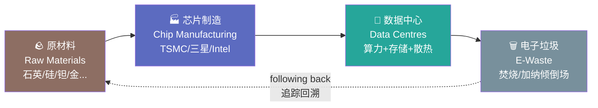
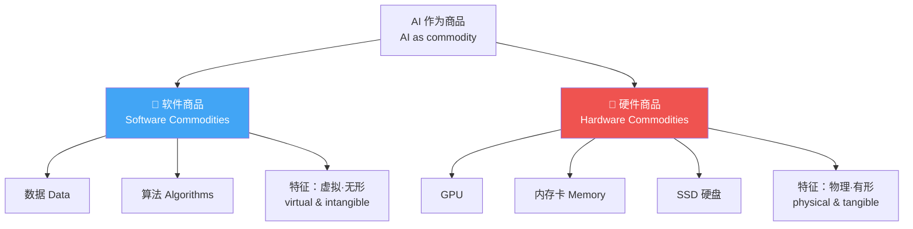
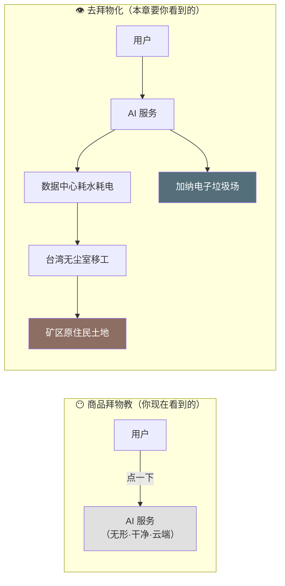
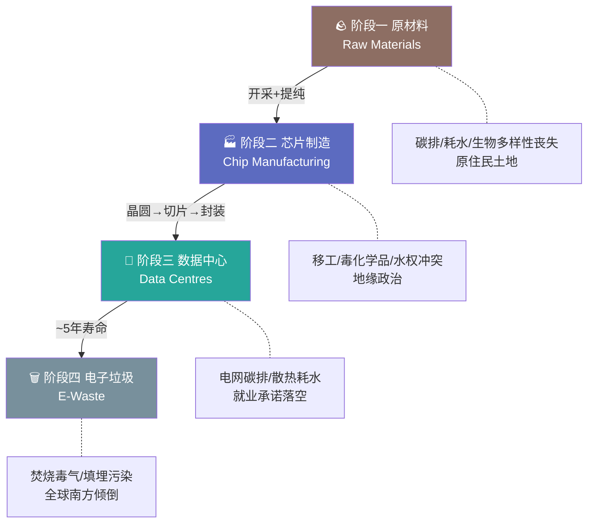
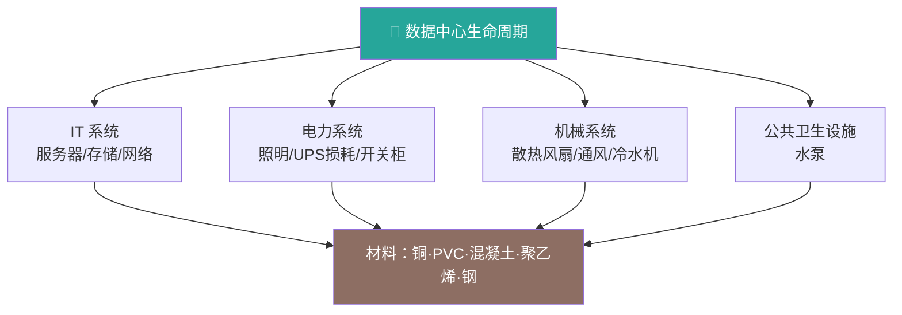
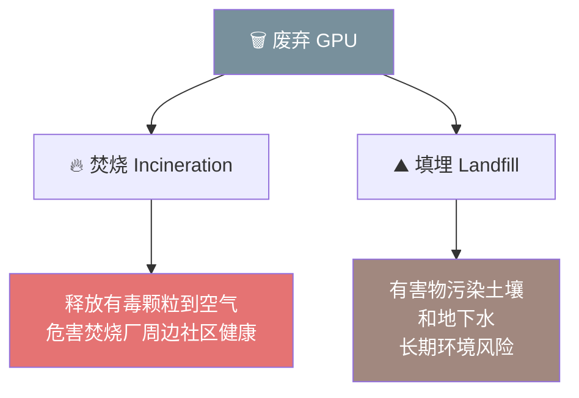
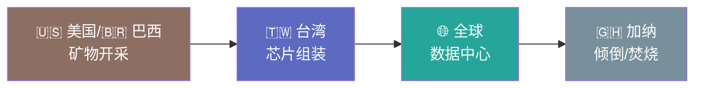

# 第 2 章 追踪物：AI 的物质性 🌍⛏️

> 原书章节：Ana Valdivia（牛津大学），*Follow the Thing: AI*
> 收录于《AI Infrastructures and Sustainability》第一部分「Elements, Materials, Resources（元素·材料·资源）」
> 对应 PDF 第 49–68 页

---

## 🗺️ 本章地图

这一章要回答一个看似简单、实则颠覆的问题：**当你在手机上和 ChatGPT/DeepSeek 聊天时，你到底在"消费"什么？**

普通人的直觉答案是「一段虚拟的、无形的、云端的服务」。而本章作者 Ana Valdivia 用一整套来自**批判地理学（critical geography）**的方法论告诉你：错。AI 一点都不虚拟，它是一条横跨全球、由**矿物 → 芯片 → 数据中心 → 电子垃圾**串起来的**实体商品链（commodity chain）**，每一环都在消耗真实的**能源、水、土地**，并在真实的人身上留下真实的伤害。

本章的核心方法叫 **「Follow the Thing（追踪物）」**——像纪录片追踪一颗木瓜从伦敦超市货架回溯到牙买加农场那样，把一块 GPU「追踪回去」，看它从哪来、经过谁的手、最后死在哪。

本章你会读到：

1. **📖 一个引子**：DeepSeek 如何一夜蒸发英伟达 6000 亿美元市值——AI 的「物质性」为什么突然变得如此要命
2. **🧩 一套理论**：什么是「物质性（materiality）」、「商品链（commodity chain）」、「商品拜物教（commodity fetishism）」、「去拜物化（defetishisation）」
3. **🔧 一套方法**：Ian Cook 的「Follow the Thing（追踪物）」方法论
4. **🌍 四段旅程**：跟着一块 GPU 走完它的一生（矿 → 芯片 → 数据中心 → 垃圾）
5. **⚖️ 一个结论**：AI 商品链如何制造全球环境不正义（environmental injustice）

> ⚠️ 阅读提示：这是一本**人文社科**书，不是技术书。它不会教你怎么写 CUDA kernel，而是教你**怎么"看"整个 AI 产业**。但对做 AI-Infra 的工程师来说，这一章恰恰是你平时看不到的「基础设施的背面」——它会彻底改变你对「云」这个词的理解。

---

## 🎬 引子：DeepSeek 震动华尔街——「物质性」为什么突然要命

本章开篇用了一个非常新鲜的案例（书里明确写了日期）：

> On January 27th, 2025, Chinese AI model-makers released DeepSeek v3 ... while Meta's Llama 3 cost 61.6 million USD to develop, DeepSeek claimed to have reduced costs to just 6 million USD ... NVIDIA saw its market value plummet by 600 billion USD on the same day.

翻译并展开讲解：

| 事件 | 数字 | 含义 |
|---|---|---|
| Meta 训练 Llama 3 成本 | **6160 万美元** | 传统"大力出奇迹"路线 |
| DeepSeek 声称的训练成本 | **仅 600 万美元** | 用**更少的芯片、更少的能源**达到近似性能 |
| 英伟达（NVIDIA）当日市值蒸发 | **6000 亿美元** | 市场恐慌 |

作者从这个案例里提炼出一个**根本性的矛盾（fundamental tension）**：

> improvements in AI efficiency, and thus in sustainability, can negatively impact US stock markets and firms whose profits depend on selling more hardware.

**AI 效率的提升（也就是可持续性的提升），反而会打击那些靠"多卖硬件"赚钱的公司的股价。**

这句话是整章的思想引信 💥。它戳破了一个流行叙事——山姆·奥特曼（Sam Altman）那句"搞 GenAI 就是需要更多芯片、更多能源、更多数据中心"（书中引 Lynn, 2024，标题就叫 *AI Wants More Data. More Chips. More Power. More Water. More Everything*）。

> 🔬 **核心论证 #1：效率悖论 与 商业动机的冲突**
>
> 表面上，整个行业都在喊「digital sustainability（数字可持续）」，公开投资绿色倡议。但当 DeepSeek 真的证明「可以用更少资源做到差不多的效果」时，**市场的反应却是暴跌**。
>
> 为什么？因为**硬件制造商的利润模型建立在"高资源需求"之上**——你消耗越多芯片/电/水，卖铲子的人赚越多。所以「可持续」和「盈利」在这个产业里是**结构性对立**的。这就是作者说的「competing economic incentives（相互竞争的经济动机）」。
>
> 这个洞察对面试/思考特别有用：**当有人告诉你"AI 会越来越绿色"时，先问一句——谁的利润依赖它不绿色？**

作者由此引出全章的问题意识：AI 的「物质性（materiality）」因为其**政治与经济影响力**（能左右资本市场），而变成了实实在在的 **"matter that matters"（要紧的物质 / 有分量的物质）**。这是一句英文双关：`matter` 既是"物质"也是"要紧"。

---

## 🧩 第一块理论积木：什么是「物质性 Materiality」？

作者引用 STS（科学技术研究）学者 John Law 的经典定义：

> Materiality has traditionally been understood as a relational effect, i.e., "matter that matters" (Law, 2012).

**物质性 = 一种关系性的效应（relational effect）**。

这句话对工程师有点抽象，我们拆开讲：

- 「物质性」不是说"AI 由原子组成"这么废话的事实
- 而是说：**这些物质（芯片、水、电、矿）通过一张关系网，产生了真实的社会与政治后果**——它们"要紧（matter）"，是因为它们牵动着股市、地缘政治、水权、劳工健康

> 💡 **一句话理解**：DeepSeek 案例里，几块（少用的）芯片能让一家公司蒸发 6000 亿美元。芯片本身是"物质"，它能引发这种连锁反应就是"物质性"。物质之所以 matter，是因为它嵌在关系网里。

作者接着盘点了研究"技术物质性"的几路重要学者，这是本章的**学术谱系（intellectual lineage）**，值得做成一张表：

| 学者 | 概念 / 作品 | 核心主张 |
|---|---|---|
| **Kate Crawford & Vladan Joler (2018)** | *Anatomy of an AI System*（一个 AI 系统的解剖） | 解剖 Amazon Echo（Alexa），揭示一个语音助手背后完整的资源/劳动/数据链条 |
| **Jussi Parikka (2021)** | *A Geology of Media*（媒体地质学） | 媒体技术与**地球物理环境**相连：从金属矿物开采到电子废弃物堆积。「自然既使媒体文化成为可能，也承受了它的重负」 |
| **Sy Taffel (2021)** | 数字媒体的**政治生态学（political ecology）** | 强调媒体设备与**环境退化（environmental degradation）**的关系，尤其在气候变化背景下 |
| **Morand et al. (2024)** | ML 算法的碳足迹 | 尽管努力提升效率，**AI 的环境影响仍在持续上升**（效率没能抵消规模增长） |
| **Luccioni et al. (2023)** | BLOOM 模型的碳排 | 训练 176B 的 BLOOM（一个刻意做得环保的大模型）产生 **50.5 吨 CO₂** |
| **Mél Hogan (2015)** | 数据中心用水研究先驱 | 早在 2015 年就分析美国数据中心的耗水（如 Utah Data Center） |

> ⚠️ **常见坑：把"能效提升"等同于"总影响下降"**
>
> Morand et al. 的发现是本章一个反直觉的关键点：**单位能效在提升，但 AI 的总环境影响在上升。** 这是典型的 **Jevons 悖论（杰文斯悖论）**——效率提升降低了单次成本，反而刺激了总使用量爆炸。后文 TSMC 的数据（增产快于减排）会再次印证这一点。工程师做「优化」时最容易掉进这个坑：你把单个 kernel 优化了 2 倍，公司就跑 5 倍的任务。

### 🌊 AI 不只烧电，还"喝水"

作者特别拎出「水」这个大多数人忽略的资源：

> Meta used 22 million litres of water to train Llama-3—an amount a Londoner would consume in just over 400 years (Valdivia, 2025).

| 对象 | 耗水量 | 直观对照 |
|---|---|---|
| Meta 训练 Llama-3 | **2200 万升水** | 一个伦敦人喝 **400 多年** 的水 |

水用在哪？两处：
1. **训练/开发阶段**：给服务器**散热（cooling）**
2. **制造阶段**：制造显卡本身就需要大量水（Li et al., 2023，那篇著名的 *Making AI Less "Thirsty"*）

> 🔬 **核心论证 #2：环境成本不能只算"训练那一刻"**
>
> 现有很多研究只盯着「训练算法时 GPU 烧了多少电、排了多少碳」，作者认为这是**碎片化（fragmented）**的视角，它「fails to trace back the environmental impacts across both types of AI commodities」。
>
> 真正的账要跨越**整条链**：`矿物开采 → 制造 → 运行 → 废弃`，把碳排、耗水、**土壤退化（soil degradation）、大规模废弃物、生物多样性丧失（biodiversity loss）**全算进去。这就是本章方法论要解决的核心缺陷。

---

## 🧩 第二块理论积木：软件商品 vs 硬件商品

作者给了一个非常清爽的分类，工程师一看就懂：

> In the context of AI, there are two types of commodities: software and hardware.

| 类型 | 例子 | 物质性形态 |
|---|---|---|
| **软件商品（software）** | 数据（data）、算法（algorithms） | **虚拟、无形**（virtual & intangible） |
| **硬件商品（hardware）** | GPU、内存卡、SSD 硬盘 | **物理、有形**（physical & tangible） |

作者批评说：现有文献只研究其中一类，没有把两者串起来看整条链。本章的贡献就是**用批判地理学的框架，照亮 AI 商品链，从而给它的物质性"去拜物化（defetishise）"**。

「去拜物化」这个词很关键，我们下一节专门讲。

---

## 🧩 第三块理论积木：商品拜物教 与 去拜物化 ⚙️

这是全章思想最硬核的一段，来自马克思（Marx）和批判地理学家 David Harvey。

### 什么是「商品拜物教（Commodity Fetishism）」？

> "commodity fetishism" (Marx) — the idea that once commodities are purchased, the materials and human relations involved in the production of that commodity are ignored.

**商品拜物教 = 商品一旦被买下，它背后的原材料和人的劳动关系就被"隐形"了。** 你只看到"一件商品"，看不到它是"谁在什么条件下、消耗了什么、做出来的"。

David Harvey 有一句被本章两次引用的名言，非常传神：

> "the grapes that sit upon the supermarket shelves are mute; we cannot see the fingerprints of exploitation upon them or tell immediately what part of the world they are from" (Harvey, 1990).

**"超市货架上的葡萄是沉默的（mute）；我们看不到它们身上剥削的指纹，也看不出它们来自世界哪个角落。"**

> 💡 **迁移到 AI**：一块英伟达 H100 GPU 就是那串"沉默的葡萄"。你看到的是一个 3 万美元的加速卡、一个 API 端点。你看不到：加纳（Ghana）电子垃圾场里徒手拆解它的工人、台湾（Taiwan）无尘室里暴露在毒化学品中的东南亚移工、北卡罗来纳州被开采的石英矿。

### 什么是「去拜物化（Defetishisation）」？

既然拜物教把关系"藏起来"了，那**去拜物化就是把它"揪出来"**——重新连接消费者与远方的生产者，让沉默的商品"开口说话（unmute）"。

Harvey 的号召被本章当作行动纲领：

> "get behind the veil, the fetishism of the market" (Harvey, 1990)

**"掀开面纱，掀开市场的拜物教。"**

---

## 🔧 核心方法：Follow the Thing（追踪物）

理论积木搭好了，现在是本章的**方法论主角**。

### 从木瓜到 GPU

2004 年，地理学家 **Ian Cook** 发表了名作 *Follow the Thing: Papaya*（追踪物：木瓜）：

> Cook traced the route of a papaya from a supermarket in London back to a farm in Jamaica to "unmute" commodities and explore social relations and geographies.

他**追踪一颗木瓜**：从伦敦超市的货架，一路回溯到牙买加的农场，把商品"解除静音"，揭示背后的社会关系和地理。这是一次"去拜物化的挑衅（a provocation to defetishise）"——证明**你完全可以把消费者和遥远的生产者重新连起来**。

本章作者 Valdivia 说：我把这套方法用在 AI 最有形的商品上——**GPU**。

> This chapter builds on this scholarship to defetishise commodity chains through follow the thing analysis, focusing on the tangible commodities of AI: GPUs.

「Follow the Thing AI」要做两件事：

1. **揭示地理、物质与社会关系**（geographies, materialities, and social relationships）——GPU 从哪来、经过谁
2. **核算全链条的环境影响**（not only during training, but across its entire commodity chain）——不只训练那一刻

> 🔬 **核心论证 #3：商品化本身"绑架"了我们的认知**
>
> 作者有一个特别深刻的元层面（meta-level）论点：用商品视角看 AI，**不只是"多列几条环境危害清单"**，而是揭示——**"商品化"这个过程本身，主动限制了我们理解 AI 的能力（the commodification process itself actively constrains our understanding）。**
>
> 换句话说：把 AI 当"干净的云服务"来卖，这种叙事结构本身就让你**看不见**它的社会与环境后果。去拜物化不是补充信息，而是**换一副能看见的眼镜**。

### 什么是「商品链（Commodity Chain）」？

作者给了标准定义（Hopkins & Wallerstein, 1986）：

> a "network of labour and production processes whose end result is a finished commodity."

**商品链 = 一张劳动与生产过程的网络，其最终结果是一件成品。**

它有几个同义词，工程师可能更熟悉后面几个：

| 术语 | 英文 | 学科来源 |
|---|---|---|
| 商品链 | commodity chain | 世界体系理论 / 批判地理学 |
| 价值链 | value chain | 管理学（波特） |
| 供应链 | supply chain | 运营/物流 |
| 生产网络 | production network | 经济地理学 |

作者还引了人类学家 Anna Tsing 的两本书作为思想背景——*The Mushroom at the End of the World*（末日蘑菇，讲松茸的供应链）和她对"供应链资本主义"的分析。所以本章标题里的 **"Papayas, Mushrooms and GPUs"**（木瓜、蘑菇、GPU）——是在说：木瓜可以被追踪、松茸可以被追踪，**GPU 一样可以**。

---

## 🌍 GPU 的一生：跟着一块芯片走完四段旅程

现在进入本章最精彩的「田野」部分。作者把 GPU 的商品链分成**四个阶段**，我们逐段精讲。

---

### 🪨 阶段一：原材料（Raw Materials）——从"非凡的晶体"开始

**GPU 是什么？** 作者从物理定义切入：

> GPUs are classified as "semiconductors" because their electrical conductivity can be controlled—they are neither superconductors nor non-conductors.

GPU 属于**半导体（semiconductor）**——导电性可被控制，既非超导体也非绝缘体。主材料是**硅（silicon）**，硅来自**高纯度石英（high-purity quartz）**。

这里有一个反常识的精彩细节（引 Ingrid Burrington, 2024）：

> "the invention of silicon chips did not rely on ordinary sand but on extraordinary crystals" (p. 14).

**"硅芯片的发明不靠普通的沙子，而靠非凡的晶体。"**

| 事实 | 数字 / 地点 |
|---|---|
| 硅占地壳质量比 | **27.7%**（极其丰富，所以不算"关键原材料"） |
| 但高纯度石英集中在少数地点 | 如美国北卡罗来纳州 **Spruce Pine（云杉松）** ——全球最大高纯度石英矿之一 |
| 采矿公司 | Sibelco，其网站自述："产品从北卡出口数千英里到亚洲电子专业厂" |

> ⚠️ **反直觉点：丰富 ≠ 不受地理约束**
>
> 硅虽然占地壳近 1/3，但**能做芯片的那种超纯石英**却高度集中在极少数矿点。这就是为什么"沙子取之不尽"是个误区——**AI 的原材料供应有真实的地理瓶颈**（Spruce Pine 若停产，全球芯片业都会打喷嚏）。

**GPU 里还有什么金属？** 作者逐一列出（这张表很值得记）：

| 金属 | 用途 |
|---|---|
| 硅（silicon） | 主体半导体材料 |
| 钽（tantalum）、钯（palladium） | **电容器（capacitors）**——芯片需要"能量爆发"时储放电 |
| 锡（tin）、金（gold）、银（silver）、锌（zinc） | 芯片内的**开关与连接** |
| 铝（aluminium）、铜（copper） | 其他组件 |

钽（tantalum）尤其牵扯到**冲突矿产（conflict minerals）**。据英伟达 2022 年《冲突矿产报告》，钽的开采企业分布在**巴西、法国、印度、中国、日本**。

**原材料阶段的环境代价：**

- 引 Owen et al. (2023，发在 *Nature Sustainability*)：**至少 60% 用于绿色转型矿产开采的土地，属于原住民与乡村地理（Indigenous and rural geographies）**——而其中银、铜、锡、锌同样用于电子制造
- 开采耗巨量能源 → 碳排
- 提纯矿物耗巨量水 → 高耗水 + **水源污染**
- 关联**生物多样性丧失**：毁林、栖息地破坏、连地下昆虫和受噪音污染影响的鸟类都被波及

> 🔬 **核心论证 #4：AI 延续了殖民式的"榨取主义"**
>
> 作者一句点题：追踪一块芯片的矿物供应链，揭示了 **AI 也卷入了历史性的压迫机制，如土地与资源的榨取主义（land and resource extractivism）**。AI 被包装成"进步"，但它的地基是老式的殖民逻辑——**中心（发达地区）享受，边缘（原住民/南方）承担**。

---

### 🏭 阶段二：芯片制造（Chip Manufacturing）——TSMC、移工与一场旱灾

矿开采、提纯后，运往工厂造 GPU。作者先讲**制造流程**（这段工程师最亲切）：

> First, a company must design the chip ... silicon is first purified ... sliced into thin wafers, onto which intricate electrical patterns are etched ... cut into individual chips, tested and packaged ... in highly controlled clean rooms to prevent contamination, as even the tiniest particle of dust could cause defects.

⑥ 整个过程在**无尘室（clean rooms）**里完成——一粒灰尘就能造成缺陷。

**产业格局（一张必记的表）：**

| 角色 | 公司 | 关键事实 |
|---|---|---|
| **芯片设计（design）** | **NVIDIA** | 占 GPU 市场 **80%** 份额；市值超过 Meta、Amazon |
| **芯片制造（manufacturing / foundry）** | **TSMC（台积电）、三星、Intel** | NVIDIA **不自己造芯片**——它是 **fabless（无晶圆厂）** 公司，外包生产 |
| **光刻机（machinery）** | **ASML（荷兰）** | **垄断**制造芯片所需的机器 |
| **云基础设施（cloud）** | AWS、Microsoft Azure、Google Cloud | 三家主导网络化数据中心服务的供给 |

> 💡 **面试高频概念：Fabless（无晶圆厂）模式**
>
> NVIDIA 只做设计，把生产外包给台积电——这叫 fabless。作者引 Myers & Vipra (2025)：NVIDIA 是 AI 训练芯片设计的**关键守门人（gatekeeper）**。理解这条产业链的"设计/制造/光刻机/云"四层分工，是理解整个 AI 地缘政治（美中芯片战）的钥匙。

**TSMC 与地缘政治：**

- 1970–80 年代，美国为降成本把芯片制造**外包**出去；如今在地缘政治压力下"后悔了"，正投资本土产能（如亚利桑那州的 TSMC 工厂）
- **劳工代价**：在台生产 GPU 的工人，许多是来自**印尼、越南、菲律宾、泰国**的**东南亚移工（migrant labourers）**，长工时 + 暴露于毒化学品，严重损害健康
- 引 Myers & Vipra (2025)："造芯片的物质条件——包括暴露于毒化学品的工作——被那些把芯片框定为'政治宝贵资源'的强势叙事所遮蔽"

**2021 台湾大旱：芯片 vs 农业的水权冲突** 🌾💧

这是本章最震撼的案例之一：

> in 2021, the government prioritised water supply for chip manufacturing over agriculture during one of the country's worst droughts (Zhong & Chang Chien, 2021).

2021 年台湾遭遇最严重旱灾之一，政府**优先保障芯片制造用水，牺牲农业**。农民愤怒——他们被指责"高耗水"，但芯片制造同样极度耗水。

> 📊 脚注数据：据 TSMC 2022 可持续报告，公司**每天用水 26 万立方米（260,000 m³/day）**。

作者点评：这展示了 AI 商品链如何**重新分配水资源，从而重新分配环境正义（environmental justice）**，波及农业等其他经济部门。

**制造阶段的整体环境账**（引 Roussilhe et al., 2024，分析 16 家台湾电子制造商 2015–2020）：

| 指标 | 年增长率 |
|---|---|
| 温室气体排放 | **+7.5% / 年** |
| 终端能源消耗 | **+8.8% / 年** |
| 用电 | **+8.9% / 年** |
| 用水 | **+6.1% / 年** |

结论直指杰文斯悖论：**产量与环境影响直接挂钩，光靠效率提升不足以降低整体足迹（efficiency improvements alone are insufficient）。** 电子业的快速扩张 + 可再生能源采用缓慢，可能葬送台湾的减碳目标。这个研究的标题很妙——*From silicon shield to carbon lock-in?*（从"硅盾"到"碳锁定"？）。

---

### 🏢 阶段三：数据中心（Data Centres）——"云"其实很重

矿变成了芯片，芯片装进服务器，服务器住进**数据中心**。作者要拆穿的第一个神话就是 **"云（cloud）"**。

> 🔬 **核心论证 #5："云"是最成功的商品拜物教**
>
> "云"这个词让你以为数据在天上飘。但作者引 Edwards et al. (2024)：数据中心是"研究互联网、云与数字技术之**物质性**的批判性场所"。研究它们就是**戳破"云"的叙事**——暴露"巨大的建筑结构 + 惊人的资源消耗"。数据中心是「the cloud」的**脊梁骨（backbone）**。

**破除三个关于数据中心的误解：**

| 误解 | 真相 |
|---|---|
| ❌ 数据中心主要建在寒冷地区（为散热） | ✅ 选址由**政治、基础设施、经济**因素决定，不只看气候。核心是**就近（proximity）**——离得近，传输快（金融交易商差 1 秒可能损失百万） |
| ❌ 数据中心带来大量就业 | ✅ 建设期雇很多建筑工，但**运营期只需一小撮工程师 + 保安**。证据显示它**并不显著降低当地失业率**（Cummins, 2024）。长期经济利好被**夸大**了 |
| ❌ 云是无形的、干净的 | ✅ 它由 **IT 系统 + 电力系统 + 机械系统 + 公共卫生设施**构成，用铜、PVC、混凝土、聚乙烯、钢建成 |

作者还写到自己在**墨西哥克雷塔罗（Querétaro）**做的民族志田野（ethnographic research）：当地政府**明确欢迎并推动**数据中心落地，且这类设施倾向选在**高失业率地区**、以"创造就业"为承诺——但就业承诺往往落空，反而制造**水冲突和电力分配冲突**。

**数据中心生命周期的组成**（引 Whitehead et al., 2015 对英国数据中心的 LCA 研究）：

**数据中心的两大环境批评：**

1. **碳排**：取决于电网电源。若电网烧化石燃料，数据中心就"继承"这份碳排。作者点出一个**南北不平等**：全球北方（Global North）的数据中心**普遍用可再生能源**，全球南方（Global South）的则不然
2. **耗水**：为服务器散热耗巨量水（Mél Hogan 2015 是这方面先驱）

作者总结：AI 芯片正在**放大（magnifying）**数据中心的环境影响。那么，这堆物质"没用了之后"去哪？

---

### 🗑️ 阶段四：电子垃圾（E-Waste）——终点在加纳

> Waste is the final stage within AI commodity chains, with two primary endpoints: incineration or dumping.

商品链的终点有两个：**焚烧（incineration）** 或 **倾倒（dumping）**。

**为什么 GPU 不回收？**

> Extracting minerals from GPU components is prohibitively expensive, making it nearly impossible to reintroduce them into the supply chain.

从 GPU 组件里提取矿物**贵得离谱**，几乎不可能重新回到供应链。于是 GPU 要么被焚烧减容，要么被运到别国，让当地社区去处理。

**加纳（Ghana）的 Accra（阿克拉）：**

- 艺术家/研究者 Cyrus Khalatbari (2024) 在阿克拉发现了**被丢弃的 GPU**——那里是**全球最大电子垃圾倾倒场之一**
- 但 GPU 废弃问题在学术界几乎无人研究（罕见例外：Velasco González 2016；Wang et al. 2024）

**电子垃圾的全球南方地理**（引 Jennifer Gabrys, *Digital Rubbish* 2013）：

- 在**德里（印度）、广东（中国）**，工人拆解电子组件（电线、主板）
- 引 Taffel (2021)："富裕国家把大量有毒废物运往贫穷国家，在那里被徒手处理，几乎没有保护工人健康安全或当地环境的措施。"

**LLM 会让电子垃圾暴增多少倍？** 这是本章最惊人的预测（引 Wang et al. 2024，发在 *Nature Computational Science*）：

| 事实 | 数字 |
|---|---|
| 一块 GPU 的平均寿命 | **约 5 年**（必须定期更换） |
| 若无监管/政策干预，到 2030 年 LLM 可能使电子垃圾产量增加 | **1000 倍（a factor of 1000）** |

**焚烧 vs 填埋的两种毒害：**

> ⚠️ **回收的经济学陷阱**：很多人以为"电子垃圾能回收提炼贵金属，是笔生意"。但作者指出——对 GPU 而言，**提取成本高于价值**，所以市场逻辑下它**注定被丢弃**，而不是被回收。这再次说明：单靠市场解决不了环境问题，因为污染的外部性（externality）没有被定价。

---

## ⚖️ 结论：污染如何"翻译"成利润

作者用 GPU 一生的地理路线图收束全章：

> GPUs, made from minerals extracted in locations such as the United States and Brazil, are assembled in Taiwan to manufacture chips before being distributed to data centres worldwide. At the end of their lifecycle, these GPUs are discarded in dumping fields in Ghana or incinerated.

**最核心的价值判断**——引人类学家 Anna Tsing (2015, *The Mushroom at the End of the World*)：

> "supply chains make value from translating values produced in quite varied circumstances into capitalist inventory" (p. 56).
> ... "pollution translates into profit" (p. 56).

**"供应链的价值创造，就是把各种不同处境下产生的价值，翻译成资本主义的库存。"** 而在 AI 商品链里，**"污染被翻译成利润"**：从地里挖矿、提纯造芯、组装服务器、填埋电子垃圾——每一步都在污染土壤、水和人的身体。

> 🔬 **核心论证 #6（全章总纲）：AI 商品链 = 分配不正义的机器**
>
> 价值分配**极不均等（not distributed equally）**：
> - **拉美、以及美欧的边缘地区** 承担**开采**的代价
> - **数据中心周边社区** 牺牲水与土壤，却**不分享**大科技公司积累的资本
> - **台湾农民** 在旱灾中为 TSMC 让出水
> - **加纳社区** 接收全世界的电子垃圾
>
> "Follow the Thing" 方法的最终成果，就是把这条**不正义的分配链**照亮出来——这就是 defetishisation（去拜物化）的政治意义。

作者最后回扣引子：**DeepSeek 案例说明，"用（据称）更少资源训练算法"竟能打击股市**——因为这个产业的利润恰恰依赖"多用资源"。要在 AI 时代"掀开面纱（get behind the veil）"，就必须理解这项技术背后的**商品**。

---

## 💡 给 AI-Infra 工程师的实战启示

这一章虽是人文社科，但对做基础设施的人有非常直接的用处：

| 你平时关心的 | 本章让你多看到的一层 |
|---|---|
| GPU 利用率、MFU、吞吐 | 这块 GPU 的**矿物来源、制造移工、5 年后的归宿** |
| PUE（数据中心能效） | 电网**电源结构（碳排）** + **散热耗水** + 选址的**政治经济学** |
| "训练成本 = ¥X" | 完整的**全生命周期环境成本**（矿→造→跑→废） |
| "上云" | "云"是**最成功的商品拜物教**——它很重、很脏、有地理 |
| 模型效率优化 | 小心**杰文斯悖论**：单位效率↑ 常伴随总量↑ |

> 💡 **面试高频（可持续性 / AI 伦理岗）**
> - 用一句话解释「commodity fetishism」在 AI 语境下是什么 → *把 AI 当"干净云服务"消费，遮蔽了它背后的矿物、劳工与废弃物关系。*
> - 「Follow the Thing」方法的两个目标？ → *(1) 揭示地理/物质/社会关系；(2) 核算全链条（而非仅训练阶段）的环境影响。*
> - 为什么 DeepSeek 提效反而砸盘？ → *硬件商业模型依赖高资源需求，效率提升与硬件利润结构性对立。*

---

## 📌 小结

- **核心命题**：**AI 不是虚拟的**。它是一条横跨全球的**实体商品链**，消耗真实的矿、水、电、土地，并在真实的人身上留下伤害。
- **核心方法**：**Follow the Thing（追踪物）**——像追踪木瓜/松茸一样追踪一块 GPU，为其**去拜物化（defetishise）**，让"沉默的商品开口"。
- **核心理论**：物质性（matter that matters）+ 商品链（commodity chain）+ 商品拜物教（Marx / Harvey）+ 去拜物化。
- **GPU 的四段一生**：
  1. 🪨 **原材料**：超纯石英/硅 + 钽金银锡…；开采落在**原住民土地**，伴随碳排、耗水污染、生物多样性丧失、榨取主义。
  2. 🏭 **芯片制造**：NVIDIA 设计（fabless）→ TSMC/三星/Intel 制造 → ASML 垄断光刻机；东南亚**移工**、毒化学品、2021 台湾旱灾**芯片 vs 农业水权冲突**、增产快于减排。
  3. 🏢 **数据中心**：戳破"云"的神话；选址靠政治经济而非气候；**就业承诺落空**；碳排（南北不平等）+ 散热耗水。
  4. 🗑️ **电子垃圾**：GPU 寿命约 5 年、回收不划算 → 焚烧/倾倒；终点在**加纳 Accra**；LLM 或使电子垃圾到 2030 年 **×1000**。
- **核心结论**：AI 商品链把**污染翻译成利润**，制造全球**环境不正义**——中心受益、边缘（拉美/南方/原住民/农民/垃圾场社区）承担。
- **反直觉三连**：① 效率提升可能砸盘（DeepSeek）；② 单位能效↑ 而总影响↑（杰文斯悖论）；③ 硅取之不尽 ≠ 供应无瓶颈（超纯石英高度集中）。

---

## 🔗 延伸阅读

**本章直接引用、最值得追的一手文献：**

| 主题 | 文献 |
|---|---|
| Follow the Thing 方法原点 | Cook, I. (2004). *Follow the Thing: Papaya*. Antipode, 36(4). |
| AI 系统解剖 | Crawford, K. & Joler, V. (2018). *Anatomy of an AI System*. anatomyof.ai |
| 媒体地质学 | Parikka, J. (2021). *A Geology of Media*. Univ. of Minnesota Press. |
| AI 供应链资本主义（作者本人） | Valdivia, A. (2024). *The supply chain capitalism of AI*. Information, Communication & Society. |
| AI 的水足迹 | Li, P. et al. (2023). *Making AI Less "Thirsty"*. arXiv:2304.03271 |
| BLOOM 碳足迹 | Luccioni, A. S. et al. (2023). *Estimating the carbon footprint of BLOOM*. JMLR. |
| LLM 与电子垃圾危机 | Wang, P. et al. (2024). *E-waste challenges of generative AI*. Nature Computational Science. |
| 台湾电子制造环境足迹 | Roussilhe, G. et al. (2024). *From silicon shield to carbon lock-in?*. J. Industrial Ecology. |
| 绿色转型矿产与原住民土地 | Owen, J. R. et al. (2023). Nature Sustainability, 6(2). |
| 芯片战地缘政治 | Miller, C. (2022). *Chip War*. Simon & Schuster. |
| 供应链人类学 | Tsing, A. L. (2015). *The Mushroom at the End of the World*. Princeton. |
| 数据中心用水先驱研究 | Hogan, M. (2015). *Data flows and water woes: The Utah Data Center*. Big Data & Society. |

**与本书其他章节的联系：** 本章属第一部分「Elements, Materials, Resources」，是全书**物质性视角**的奠基章。它建立的"商品链 / 去拜物化"框架，是后续讨论数据中心、能源、水、劳工、地缘政治各章的共同底座——读懂这一章，后面所有关于"AI 到底消耗了什么"的讨论都能对号入座。

---

> ✍️ 讲义说明：本章为人文社科章节，核心是**论证与方法论**而非代码。上文所有引号内英文均为原书原句摘录（含页码/作者/年份），中文为讲解。数字（6000 亿美元、2200 万升水、×1000、26 万 m³/天等）均取自原书正文与脚注。
