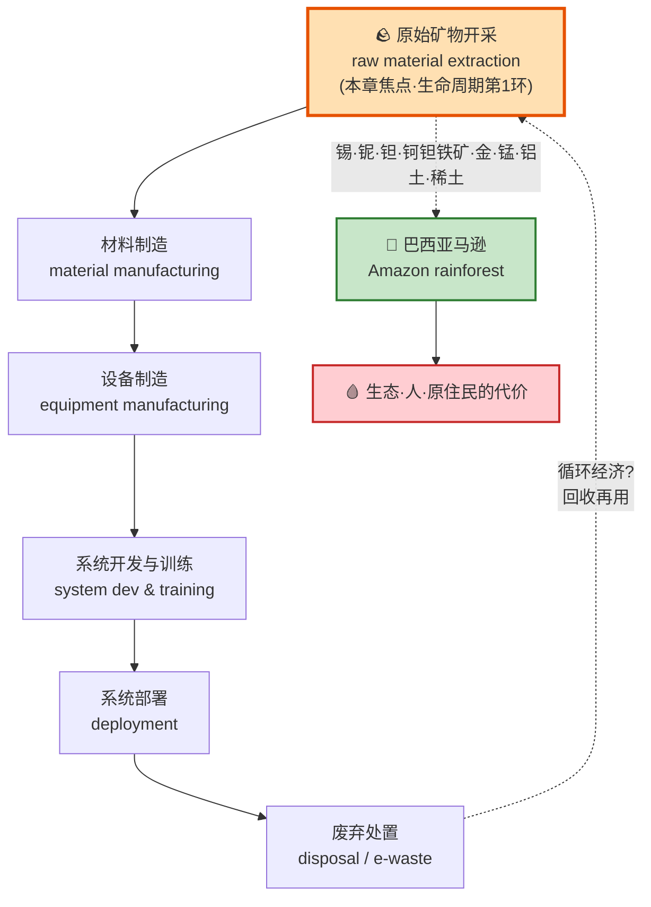
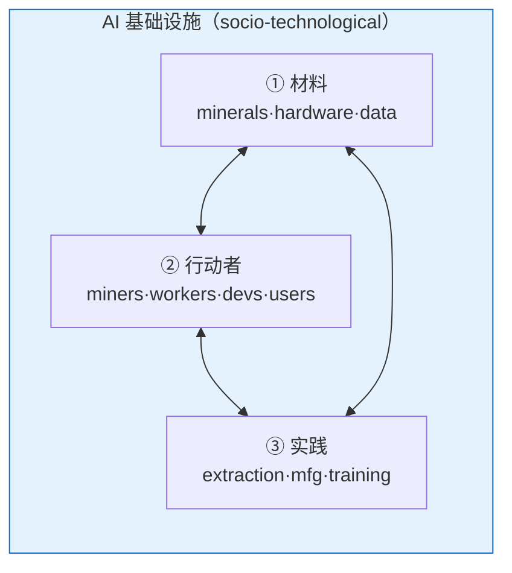
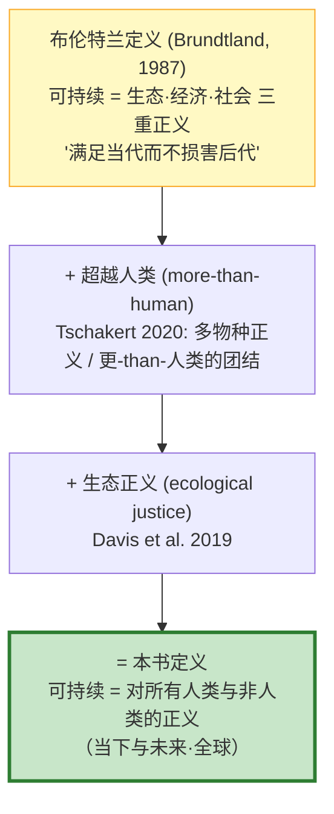
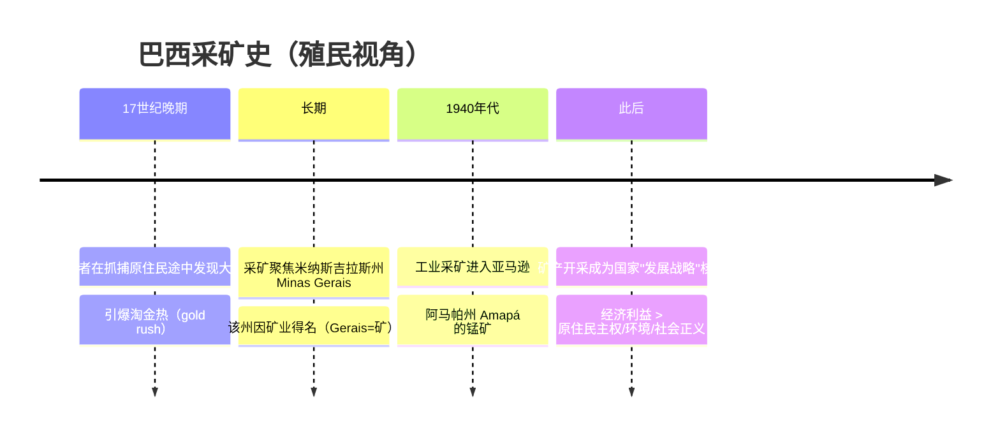
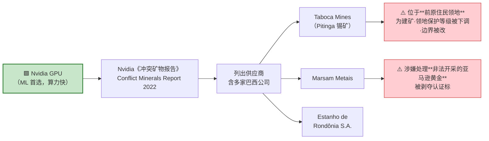
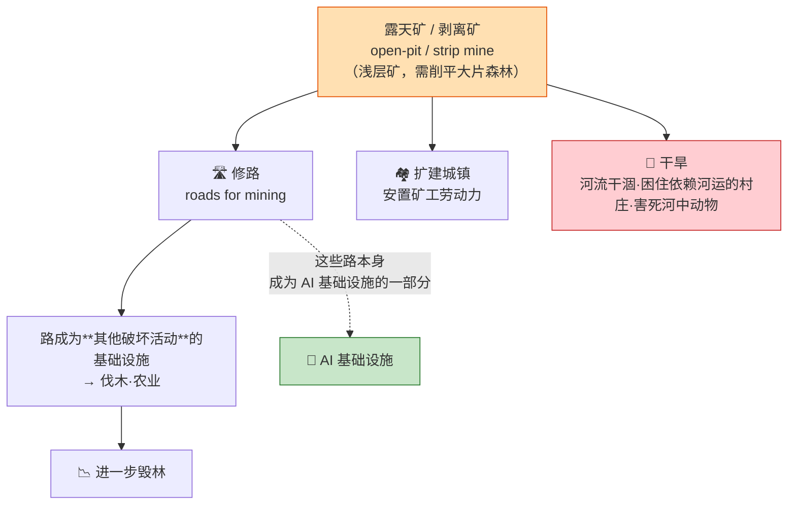
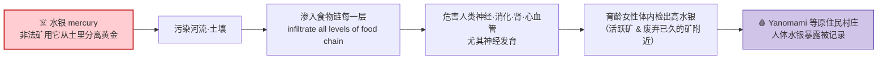
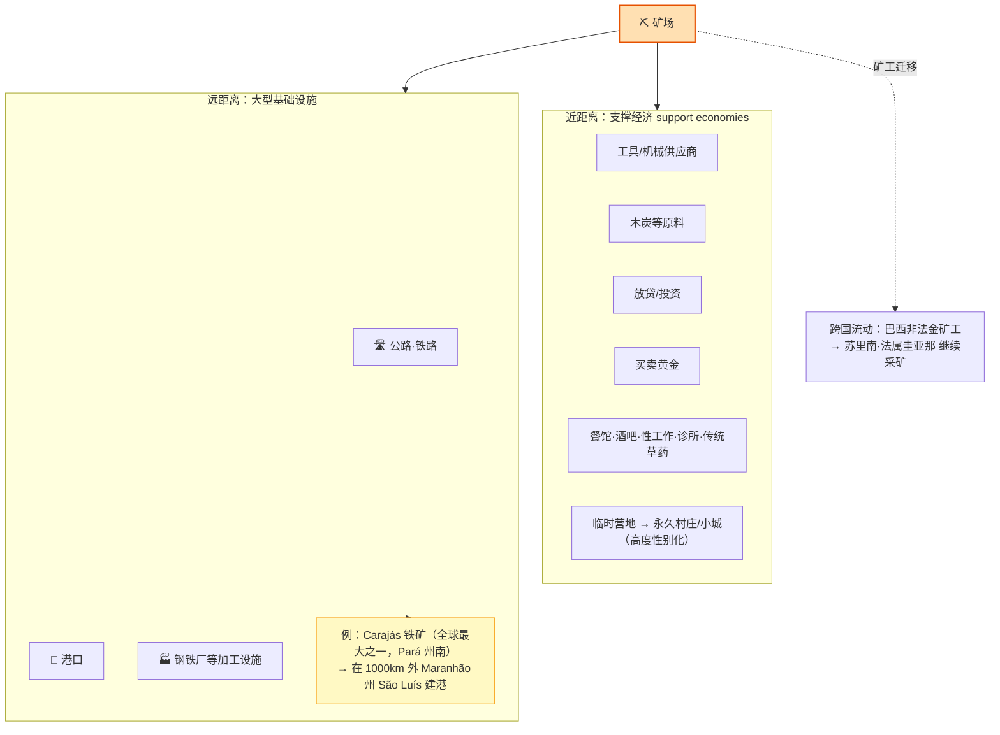
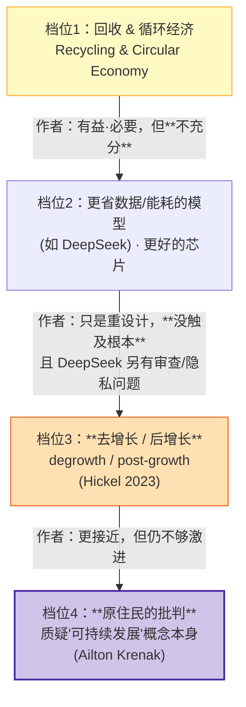
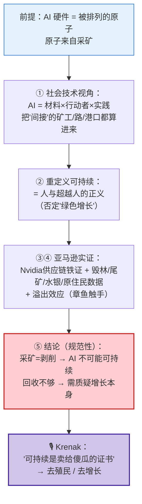

# 第 3 章 · 亚马逊的矿产与采矿——智能的摇篮 ⛏️🌳

> 本章精讲对应原书 Chapter 3：**"Amazonia's Place in AI: Minerals and Mining as the Cradle of Infrastructuring"**（亚马逊在 AI 中的位置：作为"基础设施化摇篮"的矿产与采矿），作者 Débora de Castro Leal、Maximilian Krüger、Sigrid Kannengießer。原书 pp. 69–90。
>
> 这是一本人文社科（传播学 / 科技与社会研究 STS）视角的书。它不教你怎么写 CUDA kernel，而是逼着你回答一个技术人平时不问的问题：**你训练大模型用的那张 GPU，它的原子来自哪里？谁为它付出了代价？** 本章的答案是——**巴西亚马逊雨林**。

---

## 🗺️ 本章地图

在你打开 PyTorch、`import torch`、`.to("cuda")` 的那一刻，一条横跨半个地球、深入雨林、沾着水银与血的物质链条就已经在你背后运转了。本章把这条链条的**最上游第一环——矿产开采（mineral extraction）**摊开给你看。

本章要讲透的五件事：

| # | 小节 | 一句话核心 |
|---|------|-----------|
| 1 | **AI 基础设施与矿产（社会技术视角）** | AI 不只是代码和芯片，它是"材料 + 行动者 + 实践"三者交织的关系网络 |
| 2 | **可持续性视角——聚焦矿产** | 把"可持续"重新定义为**"人与超越人的正义"（more-than-human justice）**，而非"绿色增长" |
| 3 | **在巴西亚马逊开采矿产** | 亚马逊是 AI 所需矿物的全球关键产地，采矿=殖民暴力的延续 |
| 4 | **采矿的破坏性后果 & 蔓延效应** | 毁林、尾矿、水银中毒、原住民灭绝；破坏远超矿坑本身（"溢出效应"） |
| 5 | **让 AI 采矿"更可持续"是不可能的** | 结论：采矿本质即剥削，回收/循环经济不够，需要质疑增长本身（去增长 degrowth） |

> ⚠️ **读法提醒**：本章不是"技术悲观主义抱怨帖"。它是一篇有严密论证结构的学术章节。我们逐段拆解它的**核心论证（argument）**，标出每个断言背后的**证据（数字、案例、访谈）**，让你既能读懂它的立场，也能在面试 / 讨论中复述它的逻辑而不是情绪。

---

## 🧩 开篇：把 AI 拆开，看见"物质地基"

原书开篇一句话点题（译）：

> "当我们解构 AI 的基础设施时，许多不同的**组件**和**阶段**会浮现出来。从技术视角看，AI 基础设施包括——原始矿物、技术设备、数据中心、网络结构。本章聚焦**矿产在生成式 AI 基础设施中的相关性**，我们视之为 **AI 基础设施的摇篮（the cradle of AI infrastructures）**，因为它们构成了人工智能硬件的**物质根基（material foundation）**。"

### 🔬 核心论证一：为什么叫"摇篮"？

"摇篮（cradle）"这个隐喻是全章的题眼。理解它要抓住三层意思：

1. **时间上最早**：在机器学习生命周期里，矿产处在**第一环**（raw material extraction），一切在此之前发生。没有锡、没有铌、没有金，后面所有的 fab、封装、训练、推理都是空中楼阁。
2. **物质上最基础**：芯片归根结底是**被精心排列的原子**。这些原子不是凭空出现的，它们是从地下被挖出来、被提纯、被掺杂的。
3. **伦理上被忽视**：正因为它离你（用户 / 开发者）最远，所以最容易被"看不见"。本章的任务就是**让它重新可见（render visible）**。

> 💡 **给技术人的直觉桥**：类比一下依赖树。你 `pip install torch` 时看到的是顶层依赖；但 torch 依赖 CUDA，CUDA 依赖 GPU 硬件，GPU 依赖晶圆，晶圆依赖高纯硅、金键合线、钽电容……一路 `--tree` 展开到叶子节点，叶子就是**从亚马逊挖出来的一块矿石**。本章讲的就是这棵依赖树最深、最脏、也最少人看的那片叶子。

---

## 📐 第一节 · 社会技术视角下的 AI 基础设施

### 是什么：science and technology studies（STS）传统

作者明确宣告自己站在 **科技与社会研究（STS）** 的传统里，采用**关系性的社会技术视角（relational socio-technological perspective）**。这个视角的一句话主张：

> **AI 系统不仅由材料和技术构成，也由行动者（actors）及其实践（practices）构成。**

原书引了两个关键出处，你在读 AI 伦理 / STS 文献时会反复撞见它们，务必记住：

| 出处 | 贡献 | 记忆点 |
|------|------|--------|
| **Crawford & Joler (2019)** 《Anatomy of an AI System》 | 把一个 Amazon Echo 音箱"解剖"成从锂矿到点击工人的完整链条 | "AI 的解剖学" —— 本章思想的直接祖先 |
| **Star & Ruhleder (1996)** | 提出基础设施是**关系性**的、由**实践**带入存在的 | "infrastructuring"（把基础设施当动词）的理论根 |
| **Luccioni et al. (2022)** | 提出 ML 生命周期五阶段模型 | 矿产=第一阶段的学术依据 |
| **Mollen & Kannengießer (2025)** | 本章作者团队自己的理论框架 | 下面详细拆 |

### 🔬 核心论证二：AI 基础设施 = 材料 × 行动者 × 实践

Mollen & Kannengießer（2025）提出的社会技术概念，把 AI 基础设施拆成**三个维度**。这是全章的分析骨架，用表格钉死：

| 维度 | 英文 | 例子（原书列举） |
|------|------|-----------------|
| **① 材料 / 物质** | material aspects | 矿产 & 原材料、硬件、架构、生成式 AI 的数据集、允许使用的硬件 |
| **② 行动者** | actors | **矿工（miners）**、工人、制造商、政策制定者、AI 开发者、**点击工人（click workers）**、用户……（还有很多）|
| **③ 实践** | practices | **矿物开采（mineral extraction）**、制造、开发与训练、挪用（appropriation）…… |

> 🔬 **本章的方法论创新在哪？** 作者说 Mollen & Kannengießer 的框架虽然"整体（holistic）"，但**遗漏了那些间接构成和维护 AI 基础设施的行动者与实践**。本章的贡献就是补上这一环：聚焦**矿物开采这一时刻（the moment of mineral extraction）**，展示**间接的本地关系（indirect local relationships）如何也是 infrastructuring 的一部分**。
>
> 换句话说：给一条修给矿场用的公路、一个远在 1000 公里外的港口、一个被赶走的原住民——都算进"AI 基础设施"里。这是本章最激进、也最需要你理解的一步扩展。

### 💡 面试 / 讨论高频：什么是 "infrastructuring"？

不是名词 "infrastructure（基础设施）"，而是**动名词 "infrastructuring"**——强调基础设施**不是静态的物，而是被持续的实践"做出来 / 维持出来"的过程**。

- 一条路修好不叫基础设施；有人天天走、天天修、天天用它运矿——这个**持续的动作**才让它成为基础设施。
- 对 AI 而言：不是"有了 GPU 就有 AI 基础设施"，而是**矿工挖矿、工人提纯、司机运输、政客改法律**——这一整套正在发生的实践，共同"infrastructuring"了 AI。

作者由此得出一个尖锐结论（译）：

> "AI 基础设施**不是中立的、也不是纯技术的**，而是与开采、驱逐、抵抗的历史深深纠缠，代表着**殖民的延续（colonial continuities）**。"

---

## ⚖️ 第二节 · 可持续性视角——重新定义"可持续"

这一节是本章的**价值观地基**。作者不接受主流的"可持续=绿色增长"，而是层层加码，重构了"可持续"的定义。跟着这条阶梯走：

### 是什么：从"布伦特兰"到"人与超越人的正义"

| 概念 | 出处 | 含义 |
|------|------|------|
| **布伦特兰定义** | UN WCED, 1987《我们共同的未来》 | 可持续性 = 生态、经济、社会三个维度的正义 |
| **超越人类的团结** more-than-human solidarity | Tschakert, 2020 | 正义不能只给人类，要给所有物种 |
| **多物种正义** multispecies justice | Tschakert, 2020 | 河流、鱼、森林都是正义的对象 |
| **生态正义** ecological justice | Davis et al., 2019 | 生态系统本身有被正义对待的权利 |
| **本书最终定义** | 作者综合 | **人与超越人的正义（human and more-than-human justice），适用于全球所有人类与非人类、当下与未来** |

### 🔬 核心论证三：为什么作者说"可持续发展目标（SDGs）自相矛盾"？

作者抛出一个反直觉的断言（译）：

> "这也揭示了联合国宣布的**可持续发展目标（SDGs）内在的矛盾**：由于它与**经济增长（无论绿色与否）**的关注相容，它悖论性地把正义变成了一个**不可能实现的目标**。"

拆解这个论证：

1. SDGs 想同时要"增长"和"正义"。
2. 但"增长"意味着更多生产 → 更多矿物 → 更多开采 → 更多破坏。
3. 只要增长是前提，正义（尤其对被开采地的人和生态）就永远达不到。
4. **所以"绿色增长"是个伪命题**——你不可能一边挖亚马逊一边说自己可持续。

> ⚠️ **常见坑**：很多技术圈的"AI for Good / Green AI"叙事，默认"我们可以既做大 AI 又对地球好"。本章从根上否定这个前提。你可以不同意，但要知道这个批判存在，且论证链条清晰。

### 为什么矿产被忽视了？

作者点出一个研究空白（这对你写论文 / 做研究选题有用）：

> "关于 AI 基础设施的可持续性研究，大量集中在**能耗**（如 Dodge et al., 2022 测 AI 碳强度）和**水耗**（Li et al., 2023《让 AI 不那么口渴》测数据中心冷却水足迹）。而**矿产**作为 AI 基础设施的**存在性资源（existential resource）**，却极少被研究。"

| AI 基础设施的环境代价 | 已有研究 | 关注度 |
|----------------------|---------|--------|
| ⚡ 能耗 / 碳排放 | Dodge et al. 2022；Luccioni et al.（BLOOM 176B 碳足迹）| 高 🔥🔥🔥 |
| 💧 水耗（冷却） | Li et al. 2023 "Making AI Less Thirsty" | 中 🔥🔥 |
| 🪨 **矿产 / 采矿** | **几乎空白** ← 本章要填的坑 | 低 🔥 |

作者还给了一个宏观背景数字：

> "过去 20 年见证了**前所未有的矿产热潮（mineral rush）**和采矿的激增——无论大规模还是小规模手工采矿——主要由矿物在数字技术中的角色驱动（Jacka, 2018）。"

最著名的反面教材：**刚果（DRC）的钶钽铁矿（coltan）**。作者说亚马逊的情况虽然不像 DRC 那么惨烈，但同样灾难性，而且遍布全球——印尼、巴布亚新几内亚、玻利维亚、秘鲁、澳大利亚。甚至写作本章时（2025.1）南非刚发生：警方为逼非法金矿工出坑，**切断食物、水和药品供应**，导致不明数量的工人被困地下。

---

## 🌳 第三节 · 在巴西亚马逊开采矿产

这是本章的**实证核心**。作者把镜头拉近到巴西亚马逊。

### 历史：采矿 = 殖民暴力的延续

原书原话（译）：

> "巴西采矿的历史与**殖民主义暴力**紧密相连，至今仍反映**新殖民（neo-colonial）动态**。……这个模式把**经济收益置于原住民主权、环境管理、社会正义之上**，延续了对亚马逊土地和资源的**殖民式剥夺（colonial dispossession）**。"

原住民领袖 Alessandra Korap Munduruku 的控诉（译）：

> "政府把我们的领土看作一份**商业计划书**。随着河流被杀死、土地被抢夺，一切都覆盖着**原住民的鲜血**。"

### 🪨 亚马逊到底有哪些"AI 矿"？

这是本章对技术人最有信息密度的一段。作者列出亚马逊富含的矿产——**全部对 AI 基础设施的生产至关重要**：

| 矿物 | 英文 | 在芯片 / 硬件里干什么（补充技术背景） |
|------|------|-----------------------------------|
| 锰 | Manganese | 钢铁合金；电池 |
| 铝土矿 | bauxite | 炼铝；散热器、机箱、封装 |
| 锡石 / 锡 | cassiterite / tin | **焊料（solder）的主料**——芯片、PCB 万物焊接靠它 |
| 镍 | nickel | 合金、电池、电镀 |
| 铁矿 | iron ore | 一切钢结构、机架、厂房 |
| 金 | gold | **键合线（bond wire）、镀层**——抗氧化、导电，芯片引脚必需 |
| 铌 | niobium | 超导、特种合金、电容；**亚马逊拥有全球最大铌储量之一** |
| 钽 | tantalum | **钽电容（tantalum capacitor）**——高密度电路板必备 |
| 钶钽铁矿 | coltan | 钽的主要矿石来源（就是 DRC 那个臭名昭著的矿）|
| 稀土 | rare earths | 磁体、显示、各种半导体掺杂 |

> 💡 **实战知识点：金到底在你手机 / GPU 里有多少？** 参考文献里作者引了 Feyisayo (2024) 和 Moreau (2024)——一部手机含约 **0.034 克黄金**，看似微量，但全球几十亿台设备 × 亿级 GPU 累加起来，就是天文数字的开采压力。金的作用是**键合线和触点镀层**：延展性极好、几乎不氧化、导电性优异，是芯片封装里"最后一公里"连接的黄金标准（字面意义）。

作者还提到 2025 年 3 月亚马逊获批**石油钻探许可**——矿产之外又添一重威胁。

> ⚠️ **"诅咒还是祝福？"** 作者引 Borges & Branford (2020) 的提问：亚马逊的矿产财富，对雨林及其人类 / 非人类居民、乃至整个星球（因亚马逊对全球气候至关重要）而言，**更像诅咒（curse）而非祝福（blessing）**。这就是资源经济学里著名的"**资源诅咒（resource curse）**"命题，被套用到了 AI 供应链上。

### 🔗 第一节 3.1：亚马逊在 AI 基础设施中的位置 —— Nvidia 的铁证

作者坦承：追踪非法矿物进入技术供应链**极难（Farrar, 2008）**，但违法矿物确实流入了受严格监管的市场如欧盟（Wenzel, 2024）。

**但有一个案例是"明确且可证明的"——Nvidia 的 GPU。**

这是全章最"硬"、对技术人冲击最大的一段实证。逻辑链如下：

原书事实（译，逐点核对）：

1. **Nvidia** 是 GPU 最重要的生产商之一，GPU 因算力高频繁用于机器学习。
2. Nvidia 在其**《冲突矿物报告》（Conflict Minerals Report, 2022）**中列出供应商，**其中有数家巴西公司**。
3. 这些公司包括**基于亚马逊雨林地区、或在那里运营工厂和矿场的企业**，如 **Taboca Mines、Marsam Metais、Estanho de Rondônia S.A.** 等。
4. **Marsam Metais** 涉及**处理来自亚马逊的非法开采黄金**（Goodman & Biller, 2022）。
5. **Taboca** 运营的矿场位于一个叫 **Pitinga** 的镇，**坐落在前原住民领地上**。

> 🔬 **核心论证四（本章的"实锤"）**：这不是"AI 可能间接害了环境"的模糊指控，而是一条**可查证的供应链线索**——从你数据中心里那张 H100，经 Nvidia 官方合规文件，直连到亚马逊一座建在原住民土地上的锡矿。作者用它把"AI 基础设施"和"亚马逊采矿"**焊死**，让读者无法再说"这和我做的模型无关"。

补充一个后文才揭晓的黑色细节：为了在 Pitinga 建这座**锡矿**，当地**原住民领地的保护地位被降级，领地边界被人为改动以把矿场排除在外**（Baines, 2008）。**先改法律，再合法采矿**——这就是"新殖民动态"的具体操作。

### 矿工也是"资源"：性别化的采矿知识

作者强调一句关键的框架话：

> "此语境下 AI 基础设施的资源，**不仅是矿物本身，也是参与开采的人（the people involved）。**"

对非法金矿的详细人类学研究（Graulau, 2001；Massaro & de Theije, 2018）揭示：

- 采矿知识**不来自地质学 / 工程学的正规学习**，而来自**对森林和采矿的亲身熟悉**，其水准足以匹敌甚至超越学院知识。
- 采矿是**性别化的（gendered）**：女性占亚马逊非法矿工的 **20–37%**，并主导了特定工种——`requear` 和 `bateiar`（从含金砾石中提金的不同步骤）。
- 非法矿工**技术娴熟、极具创新性**：从手工升级到机械化、用勘探钻、用**氰化物（cyanide）替代水银（mercury）**分离黄金——效率提升，据称"有潜力"更可持续、减少环境损害。

> ⚠️ **常见坑（作者的反驳）**：不要被"技术升级 = 更环保"骗了。作者明确反驳：**创新和提效的实践，本质上仍是攫取性和剥削性的（extractivist and exploitative）**，反而可能助长非法采矿活动，并未真正减少其环境和社会破坏。技术改良改变的是效率，不是剥削结构。

---

## 💥 第四节 · 采矿的破坏性后果

作者先做一个必要的区分（这个区分贯穿全节）：

| 类型 | legal 合法 | illegal 非法 |
|------|-----------|-------------|
| 规模 | 常为大规模工业矿 | 常（但不总是）小规模、手工（artisanal）|
| 复垦义务 | **法律要求尽可能复垦**（回填矿坑、再造林）| 通常**直接遗弃，无任何修复** |
| 化学品 | 受监管 | 频繁使用高毒**水银 / 氰化物**（缺监管）|
| 对原住民威胁 | 有 | **更大**（擅闯保护领地）|

> 但作者强调一个前提：**合法与非法在亚马逊采矿业里边界"极其模糊（porous at best）"**——非法矿被发现由**警察拥有**、由**政客亲属出资**，这解释了为什么"小小非法矿"能买得起昂贵机械。

### 后果一：毁林（Deforestation）—— 用数字说话

这是最直观的后果。把关键数字钉死（面试 / 写作可直接引用）：

| 数字 | 含义 | 出处 |
|------|------|------|
| **11,670 km²** | 2005–2015 十年间，采矿在巴西亚马逊造成的毁林面积 | Sonter et al., 2017 |
| **× 12 倍** | 实际毁林面积可达矿场本身的最多 12 倍 | Sonter et al., 2017 |
| **+90%** | 2017→2020，非法采矿导致的毁林率增幅 | Siqueira-Gay & Sánchez, 2021 |
| **52.9 → 101.7 km²/年** | 非法采矿年毁林面积（2017 vs 2020）| 同上 |

**为什么毁林面积远大于矿坑？** 作者给了机理（这段逻辑很重要）：

> 🔬 **本章最巧妙的一步论证**：作者说这些**为采矿修的路，本身就成了 AI 基础设施的一部分**。它们是"间接关联 AI"的材料与技术的范例——路不直接算力，但没有路就没有矿，没有矿就没有芯片。**这就是把"基础设施"扩展到间接层的具体兑现**（呼应第一节的理论）。而且路一旦修好，又成为伐木、农业等**新一轮破坏**的通道——毁林是自我放大的。

### 后果二：尾矿（Tailings）—— 有毒的液态废料

- **是什么**：工业露天 / 剥离矿把岩石粉碎、与水和化学品混合、滤出目标矿物后剩下的残渣，**通常高毒、呈液态**（Killeen, 2024）。
- **怎么存**：存在叫**尾矿坝（tailing dams）**的库里。
- **代价**：尾矿坝溃坝是**巴西最严重的环境灾难之一**——例如 **Fundão 溃坝（Fundão dam break）**（Pereira et al., 2024；即 2015 年 Samarco / Vale / BHP 事件，巴西史上最严重环境灾难，5000 万立方米尾矿倾泻）。

> ⚠️ **露天矿不可回填**：作者点出——因为做了"过滤（filtering）"处理，露天矿**无法回填**，地上永远留下一个**巨大的洞**和大量有毒尾矿。这与"合法矿须复垦"的法律要求形成残酷反差。

### 后果三：水银中毒（Mercury）—— 非法采矿的专属灾难

这是本章读来最痛的一段。逻辑链：

关键事实：

- 水银**毒害神经、消化、肾、心血管系统**，尤其影响**神经发育**（Vega et al., 2018）。
- 在多个社区的**育龄女性**体内检出高水银——**不仅活跃矿场，连废弃已久的矿场附近也是**（Hacon 2008；Bello 2023；Veiga & Hinton 2002）。这意味着**污染的时间尺度是几代人**。

### 后果四：对原住民社区的毁灭性冲击

非法采矿伴随**人口涌入（influx）**，连锁反应：

- 💧 水源被日增人口耗竭
- 🌿 动植物食物源受损
- 🎭 文化传统被破坏
- 🚨 犯罪、卖淫增加
- ⚔️ **矿工与原住民冲突**——非法矿工频繁杀害原住民，如近年发生在 **Yanomami 人**领地的事件（Philips, 2023）

作者给出全章最沉重的判断（译）：

> "亚马逊采矿对原住民社区的严酷后果**不可避免、难以补偿**，且**合法与非法采矿皆然**。最终，非法采矿的后果**可能导致原住民族的灭绝（extinction of Indigenous peoples）**。"（Villén-Perez et al., 2020）

> 🔬 **回扣理论**：作者在这一节反复写一句话——"**基础设施的关系性特征在此显现（the relational character of infrastructures becomes apparent）**"。水银串起河流（非人类）、鱼（非人类）、育龄女性（人类）、胎儿（未来的人类）——这正是第二节"人与超越人的正义"要保护的完整链条。理论和证据在这里咬合。

---

## 🐙 第四节续 · 采矿远超矿坑本身——"溢出效应"

### 🔬 核心论证五：Spillage Effect（溢出 / 蔓延效应）

这是本章分析上最有力的概念，来自 **Gudynas (2015)** 提出的"**采矿的溢出效应（spillage effect of mining）**"（西语 efectos derrame，已被学界广泛接受）。核心：

> **采矿不是一个局部（localised）现象，而是一个蔓延（spreading）现象。** 它像章鱼触手（tentacle-like）一样向远方伸展。

分两个尺度看：

**近距离溢出**：矿场周围长出一整套"支撑经济"——供应工具机械、木炭、放贷投资、买卖黄金，以及餐饮、性工作、诊所、草药生产。过去临时的营地，近几十年**变得永久化**，成了村庄或小城（Kolen et al., 2018）。这些经济**高度性别化**。

**远距离溢出**：采矿催生大型基础设施——公路、铁路、港口、钢铁厂，常常**远离矿场**。作者的招牌案例：

> **Carajás 铁矿**（Pará 州南部，世界最大铁矿之一）导致在 **1000 公里外**的 Maranhão 州 São Luís 地区**修建了一个港口**。

**跨国溢出**：巴西非法金矿工还**迁移到其他亚马逊国家**——苏里南（de Theije & Heemskerk, 2009）、法属圭亚那（Le Tourneau, 2021）——继续采矿。破坏跨越国界。

### 与政策 / 全球商业的纠缠

作者强调采矿深度纠缠于**买卖、加工、投资的全球商业**，以及**区域和国家政策制定**——包括经济发展项目、环境立法、原住民保护。前面提到的 **Pitinga 锡矿**（Nvidia 的供应商）就是政策被采矿反噬的典型：**为了建矿，原住民领地保护等级被下调、边界被改**。

> 💡 **给技术人的收束**：作者由此得出一个方法论结论——"当 AI 基础设施被概念化为**包含其构成矿物、采矿的人、以及这些人的实践**时，就会发现**'什么在 AI 基础设施之内、什么在之外'这条边界极难划定**。" 采矿的复杂性和溢出效应意味着它是**弥漫的**，其后果对生态系统和社区是**深刻、暴力、毁灭性**的——而这一切，都可以视为 AI 基础设施的一部分，因为它们**源于 AI 技术对多样矿物的需求**。

---

## 🚫 第五节 · 让 AI 采矿"更可持续"是不可能的

这是全章的**结论章**，也是最有争议、最需要你精确理解的部分。作者的立场极其鲜明。

### 🔬 核心论证六（全章总论点）：不可能命题

作者的核心断言（译，逐句拆）：

> "为 AI 基础设施开采矿物**永远不可能可持续**——**无论**是布伦特兰定义意义上的，**还是**人与超越人的正义意义上的——因为**采矿永远是一种剥削方法（mining will always be a method of exploitation）**。依赖矿物开采的 AI 技术**不可能可持续，因此也不可能被用于可持续的目的**。"

论证结构（三段论）：

1. **大前提**：采矿总是伴随环境退化和毁林（Nikiforuk 2023；Villén-Perez 2020）——它本质即剥削。
2. **小前提**：AI 依赖矿物开采。
3. **结论**：所以 AI 不可能可持续，也不能用于可持续目的。

> ⚠️ **这是规范性（normative）主张，不是实证描述**。作者明说他们"采取了规范性视角（normative perspective）"。你可以质疑第一大前提（"采矿一定不可持续吗？"），但要看清这是一个**价值判断驱动**的论证，不是"数据显示 X"那种可证伪陈述。这是人文社科章节和技术论文的关键区别。

### 那些"看似能解决"的方案，为什么作者说不够？

作者逐一评估了三档解决方案，**层层递进地否定其充分性**：

| 档位 | 方案 | 作者的评价 |
|------|------|-----------|
| **1** | **回收 & 循环经济** | "直接、有益、必要"——尽可能回收再用矿物；循环经济要求**大幅减少产品和工艺的多样性**（也就是 AI 硬件里要**减少金属和矿物的种类**）以便回收。**但作者明说：不充分（not sufficient）**。因为企业和政府"饥渴于创新、增长、技术霸权"，随时准备抛弃减排承诺。 |
| **2** | **更省的模型 / 更好的芯片** | 作者点名 **DeepSeek**（更省数据 / 能耗）——但说这只是"重设计、重工程"，**没质疑 AI 本身的必要性**；而且 DeepSeek 还有**审查（censorship）和隐私**等社会正义问题。 |
| **3** | **去增长 / 后增长（degrowth）** | 引 Hickel (2023)：主张世界体系中心国家**放弃以增长为目标**，包括放弃社会上不必要、生态上破坏性的生产形式。作者更认同这一档。 |
| **4** | **原住民的根本批判** | **最激进**：不只批评采矿，而是**质疑"可持续发展"这个概念本身**。 |

### 🎙️ 两位原住民思想家的声音（本章的道德高潮）

作者用两段访谈把论证推到顶点。

**Sônia Guajajara（本章开头引用）**（译）：

> "对原住民而言，摧毁原住民的森林和领地，等于摧毁我们自己。因为**我们的领地就是我们的身体、我们的灵魂**。原住民很早就知道，生命中一切都是相互联系的。当自然在一处被摧毁，后果会在世界的另一端被感受到。"

**Ailton Krenak**（巴西原住民活动家、思想家，**失去祖传土地于 5000 万立方米采矿尾矿**）—— 全章最尖锐的一击（译）：

> "如果**攫取系统（extractive system）是至高无上的、并改变着地球生命的循环**，你怎么可能生产出可持续的东西？**可持续性是一张卖给傻瓜的证书，只要还有人买，它就还有效**……我们不如把它叫做**'终结的可持续性'**。人人都知道我们**已经越过了边缘**……森林之外那个在欧洲吃汉堡的人，需要它〔原住民的世界〕**死去**。"

> 🔬 **为什么用这段收尾？** Krenak 一句话戳穿了整个"可持续 AI"话语的自欺：**只要底层是攫取式经济，任何"可持续"标签都是安慰剂（"卖给傻瓜的证书"）。** 作者接着提炼出对 AI 研究和政治的核心挑战——

> "我们需要用**极其不同**的方式来思考和塑造 AI，而不是问'生产和挪用过程如何变得更可持续'。相反，我们需要**质疑那个其攫取性和剥削性实践在 AI 基础设施中物质化的经济系统本身**。"

### 去殖民（decolonial）路径

作者最后给出方向（不是具体方案，而是立场）：

- 去殖民路径要求的不只是"不同的基础设施化实践和技术方案"，更是**对全球权力动态的解构（deconstruction of global power dynamics）**。
- **优先原住民知识体系、土地权、环境管理**，而非攫取式经济模式。
- 不要把有害实践"粉饰成更环保（greenwashing）"，而要推动**系统性变革**——修复过去的伤害，尊重边缘社区的权利与独立。
- 呼吁**更多经验研究**（尤其民族志研究），去倾听被采矿影响的社区的**视角和感受**（现有研究多为定量，缺质性视角，Zhouri 2017）。

---

## 🧠 全章论证结构一图流

把整章的逻辑骨架压缩成一张图，方便你复述：

---

## 💬 面试 / 讨论高频问答（本章版）

> 这是一本人文社科书，"面试题"更多出现在 AI 伦理、STS、可持续计算、绿色 AI、供应链治理等语境的讨论 / 答辩里。以下问答帮你把观点说清楚。

**Q1：一句话概括本章论点？**
A：AI 硬件的物质根基是采矿（尤其亚马逊的锡、铌、钽、金等），而采矿本质是剥削性、破坏性的，因此"可持续的 AI 采矿"是不可能的；解决之道不是让采矿更绿，而是质疑增长导向的经济系统本身。

**Q2：什么是"more-than-human justice（超越人类的正义）"？和普通"可持续"有何区别？**
A：普通可持续（布伦特兰）关注生态 / 经济 / 社会三重正义，但对象仍主要是人类。"超越人类的正义"把正义对象扩展到**所有非人类**——河流、鱼、森林、物种。区别在于：绿色增长可以是"人类友好"的，但对被水银毒死的河流、被毁的森林并不正义。

**Q3：作者用什么"实锤"把 AI 和亚马逊采矿连起来？**
A：**Nvidia 的《冲突矿物报告》**。报告列出的供应商含巴西公司（Taboca、Marsam、Estanho de Rondônia），其中 Taboca 的 Pitinga 锡矿建在前原住民领地上，Marsam 涉嫌处理非法亚马逊黄金。这是官方合规文件里的可查证链条。

**Q4：什么是"溢出效应（spillage effect）"？**
A：Gudynas (2015) 提出，指采矿的破坏**远超矿坑本身**——近处催生支撑经济（含性工作、贷款、永久村镇），远处催生公路铁路港口（如 Carajás 铁矿在 1000km 外建港），甚至跨国（巴西矿工迁到苏里南）。它说明采矿是**弥漫的、蔓延的**，因此"AI 基础设施的边界"极难划定。

**Q5：为什么作者说"回收 / 循环经济不够"？**
A：因为在创新、增长、技术霸权的驱动下，企业和政府随时会抛弃减排承诺；回收只减少新矿需求，没触及"为什么需要这么多 AI"的根本问题。作者主张更激进的去增长（degrowth），乃至质疑"可持续发展"概念本身。

**Q6：技术改良（如用氰化物替代水银、机械化、DeepSeek 省能耗）能解决问题吗？**
A：作者明确否定其充分性。技术升级改变**效率**，不改变**剥削结构**，甚至可能助长非法采矿。DeepSeek 更省，但采矿地基没变，且另有审查 / 隐私问题。

**Q7：这个论证的弱点 / 可质疑处在哪？（批判性思考）**
A：（1）"采矿永远是剥削"是**规范性大前提**，非实证，可被质疑；（2）"AI 不能用于可持续目的"是强断言，忽略了 AI 在气候建模、能源优化等的正面用途；（3）去增长在"AI 军备竞赛"现实下可行性存疑。作者自己也承认"当前研究没有确定答案"。

---

## ⚠️ 读这一章最容易踩的坑

| 坑 | 纠正 |
|----|------|
| 把它当"技术无关的环保抱怨" | 它有严密论证结构和可查证证据（Nvidia 供应链、毁林数字），是学术章节 |
| 混淆 infrastructure（名词）和 infrastructuring（动词） | 后者强调"由持续实践做出来的过程"，是本章理论核心 |
| 以为"可持续 = 减碳减水" | 本章把可持续重定义为"人与超越人的正义"，碳和水只是其中一角，矿产被长期忽视 |
| 以为"回收 / 更好的芯片"是作者认可的解 | 作者认为它们**必要但不充分**，真正主张是质疑增长本身 |
| 把"不可能可持续"读成实证结论 | 它是**规范性主张**，建立在"采矿即剥削"的价值前提上 |
| 忽略"合法 vs 非法"边界模糊这一点 | 作者强调非法矿常由警察拥有、政客出资，二者界限"极其多孔" |

---

## 📌 小结

- **摇篮隐喻**：矿产是 AI 基础设施的物质根基和生命周期第一环，也是最被忽视的一环——本章的使命是"让它重新可见"。
- **理论框架**：社会技术视角把 AI 基础设施拆成**材料 × 行动者 × 实践**三维；本章创新在于把**间接**的行动者与实践（矿工、为矿修的路、远方的港口）也纳入 AI 基础设施——"infrastructuring"。
- **价值地基**：把"可持续"从"绿色增长"重定义为"**人与超越人的正义**"，据此指出 SDGs 自相矛盾。
- **亚马逊实证**：这里富含锡、铌、钽、金、稀土等全部"AI 矿"；**Nvidia 冲突矿物报告**提供了从 GPU 到 Pitinga 锡矿（建在原住民领地上）的可查证链条。
- **四大后果**：毁林（10 年 11,670 km²，实际达矿场 12 倍）、有毒尾矿（Fundão 溃坝）、水银中毒（渗入食物链、育龄女性、Yanomami）、原住民社区冲击乃至灭绝。
- **溢出效应**：采矿破坏像章鱼触手蔓延——近距支撑经济、远距大型基建（Carajás→1000km 外港口）、跨国迁移。
- **规范性结论**：采矿本质即剥削 → **AI 采矿不可能可持续**；回收 / 更好芯片 / 省能模型都不充分；出路在**去增长**乃至**质疑"可持续发展"概念本身**（Krenak："可持续是卖给傻瓜的证书"）。

> **给技术人的一句话**：下次你 `nvidia-smi` 看到那张卡的名字时，记得它的原子有一部分来自一座建在原住民土地上、用改法律换来的亚马逊锡矿。这不改变你要不要用 GPU，但它改变你能不能诚实地说"我的 AI 是可持续的"。

---

## 🔗 延伸阅读与关键文献

**本章核心概念的理论根源**
- Crawford, K. & Joler, V. (2019). *Anatomy of an AI System.* —— "AI 的解剖学"，本章思想直系祖先，从 Echo 音箱追到锂矿。
- Star, S. L. & Ruhleder, K. (1996). *Steps toward an ecology of infrastructure.* —— "infrastructuring"的理论根。
- Luccioni et al. (2022). ML 生命周期五阶段模型 —— 矿产=第一环的学术依据。
- Mollen, A. & Kannengießer, S. (2025). *Shaping AI (more) sustainably.* —— 本章作者团队的社会技术框架。

**可持续性 / 正义的重定义**
- UN WCED (1987). *Our Common Future*（布伦特兰报告）—— 可持续性经典定义。
- Tschakert, P. (2020). *More-than-human solidarity and multispecies justice.* —— "超越人类的正义"来源。
- Hickel, J. (2023). *On technology and degrowth.* —— 去增长的代表论述。

**亚马逊采矿的实证证据（可直接引用的数字）**
- Sonter et al. (2017), *Nature Communications* —— 10 年 11,670 km² 毁林、12 倍溢出。
- Siqueira-Gay & Sánchez (2020/2021) —— "把铌留在地下"、非法采矿毁林 +90%。
- Villén-Pérez et al. (2020) —— 亚马逊黄金与原住民土地权风险、可能导致灭绝。
- Vega et al. (2018) —— Yanomami 村庄人体水银暴露。

**AI 的其他环境代价（对照阅读）**
- Dodge et al. (2022) —— 测量 AI 碳强度。
- Li et al. (2023). *Making AI Less Thirsty* —— 数据中心水足迹。

**供应链与产业证据**
- NVIDIA Corporation (2022). *Conflict Minerals Report* —— 本章"实锤"的原始文件。
- Wenzel (2024), Mongabay —— 欧盟进口的巴西黄金"几乎全部非法"。
- Gudynas, E. (2015) —— "溢出效应（efectos derrame）"概念来源。

**原住民思想家的声音**
- Guajajara, S. (2020) 与 Ailton Krenak（Guerra, 2021 访谈）—— 本章道德论证的核心引用。

> 💡 **与本书其他章的联系**：作者多次提示参见本卷 **Valdivia**（Nvidia / GPU 章）、**Bojczuk**（下一章：巴西 Fortaleza 数据中心与绿色能源）、**Brodie**、**Sridharan** 诸章——本书的整体论证是把 AI 基础设施的**每一环**（矿产→数据中心→能源→劳动）都做去殖民的批判性检视。本章负责最上游的"矿产"这一环。
