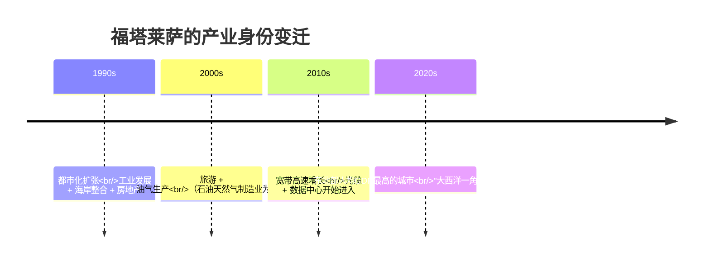
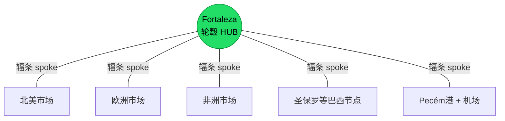
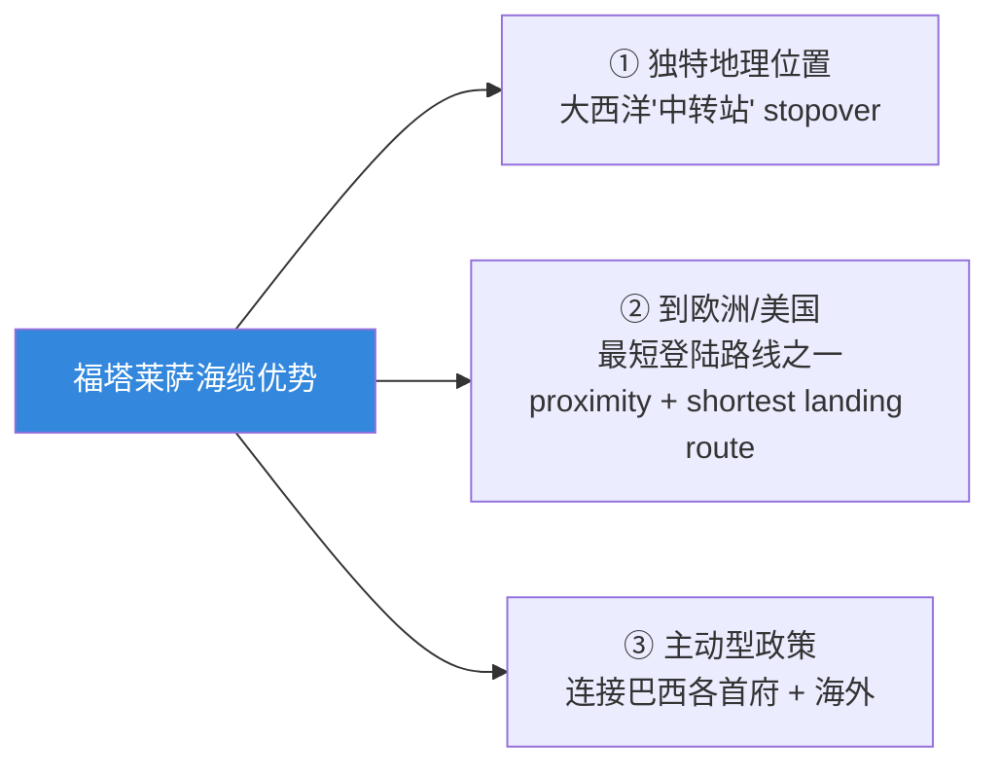
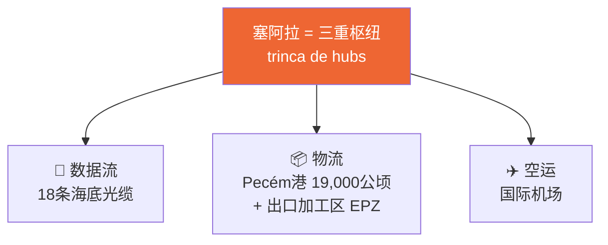
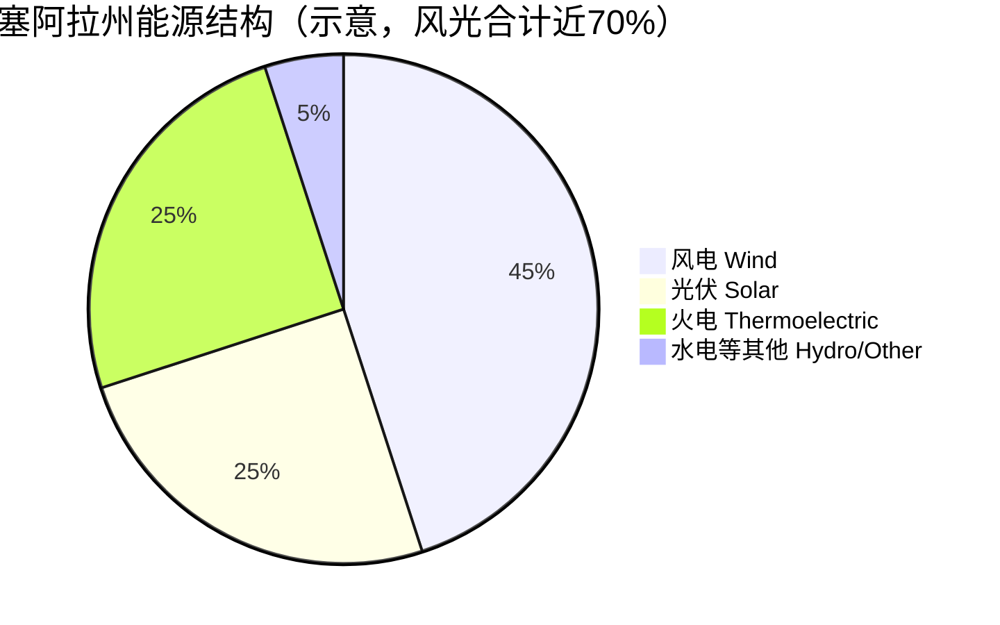
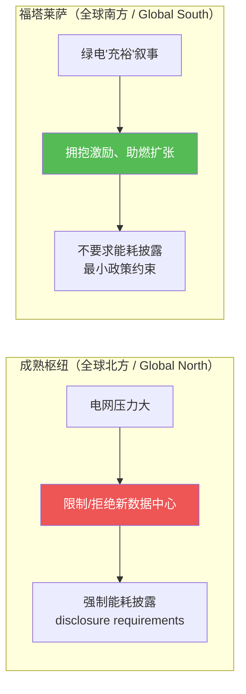
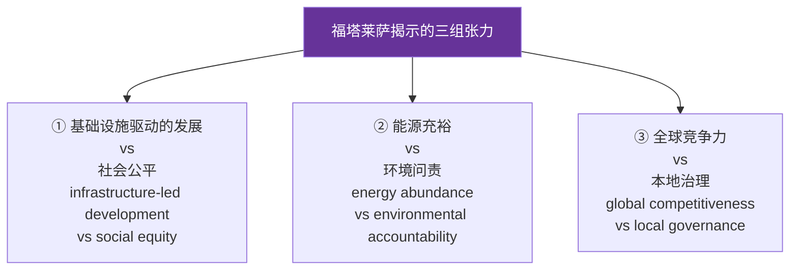

# 🌊 第 4 章 · 在大西洋一角"生长"云：福塔莱萨数据中心

> 原文：*Growing the Cloud at the "Corner of the Atlantic": Fortaleza as a Digital Infrastructure Hub Amidst AI–Renewable Energy Paradigms in Brazil*
> 作者：Iago Bojczuk（剑桥大学 University of Cambridge）
> 对应 PDF 第 91–114 页 · 关键词：数据中心 / 可再生能源 / 数字能量学（digital energetics）/ 福塔莱萨 / 全球南方（Global South）

---

## 🗺️ 本章地图

这一章是全书里**第一篇"落地到一座具体城市"的田野式研究**。前几章谈的是"AI 基础设施与可持续性"的宏观概念、政治经济学框架；从这一章开始，作者带我们飞到南美洲——巴西东北角一座叫**福塔莱萨（Fortaleza）**的海滨城市，用它作为一个"活标本"，回答一个非常尖锐的问题：

> 当全世界都在抢建 AI 数据中心时，一座"看起来占尽地利、又有绿电"的城市，到底是走向"可持续发展的样板"，还是在重复工业资本主义的老套路？

作者不是工程师，而是一位做**批判性话语分析（Critical Discourse Analysis, CDA）**的传播学/媒介研究学者。所以本章的"技术"不是 CUDA 或分布式训练，而是：**海底光缆的地理经济学、可再生能源的政策工具、以及"话语（discourse）如何塑造基础设施"**。

本章我们按作者的四段式结构走，并在每一段补足"零基础也能懂"的背景：

| 段落 | 英文小节 | 讲什么 | 你会学到 |
|------|----------|--------|----------|
| 1️⃣ | Introduction | 为什么是福塔莱萨？研究方法是什么？ | 数字能量学、CDA、"生长云"这个核心隐喻 |
| 2️⃣ | A Matter of Geography? | 地理 + 海底光缆如何造就"枢纽" | 海缆产业 99% 数据靠它、"hub-of-hubs" 想象 |
| 3️⃣ | Local Promises and Policies | "绿色能源充裕"叙事 + 政策工具 | 巴西/塞阿拉的绿电数据、税收减免、政策的作用 |
| 4️⃣ | Beyond the Hub & Discussion | 张力、批判、未来 | 技术乐观主义的遮蔽、监管缺口、全球南方启示 |

> 💡 **读这一章的正确姿势**：不要把它当成"巴西数据中心行业报告"来读。作者真正想让你看见的，是**同一套基础设施，可以被讲成两个完全不同的故事**——一个是"绿色、主权、繁荣"，一个是"不平等、遮蔽、监管真空"。这一章就是在教你怎么"拆解"官方叙事。

---

## 🔬 核心论证（先把全章的"论点骨架"立起来）

作者在导论里就把整章的**核心干预（key intervention）**说清楚了。我们先抄原文，再逐句拆。

> 原文（第 93 页）：
> "The key intervention developed through this chapter considers **'growing the cloud' as fluid and dynamic processes shaped by power relations and territorial tensions** that become increasingly pronounced as AI intersects with the convergence of digital and energy infrastructures."

**逐句拆解：**

1. **"growing the cloud"（生长云）** —— 这是本章的核心隐喻。"云"（cloud，即数据中心/算力）不是天上飘的、无形的、纯私营公司的事。它是**被"种"在一块块具体土地上、需要电、需要光缆、需要政府批地的"物质实体"**。用"growing / 生长"这个动词，就是要提醒你：云是被人为培育出来的，有人浇水、有人施肥（政策补贴），也有人被这棵树的树荫挡住阳光（本地社区）。

2. **"fluid and dynamic processes / 流动、动态的过程"** —— 反对"福塔莱萨天生就是枢纽"这种宿命论。枢纽地位是**被不断争夺、协商、建构出来的**，不是地图上一个固定的点。

3. **"power relations and territorial tensions / 权力关系与领土张力"** —— 这是全章的题眼。**地方 vs 全球、州政府 vs 联邦、私营公司 vs 本地社区、经济利益 vs 环境责任**，这些张力才是主角。

作者还引用了两位学者，给这个论点装上"理论锚点"：

- **Luke Munn（2023）的 "new vectors for territorialization"（领土化的新载体）**：数字基础设施不是"去物质化"的，它反而在**重新塑造土地的归属和用途**——谁的地被拿去建风场？谁的海岸线被光缆占据？
- **Pasek et al.（2023）的 "digital energetics"（数字能量学）**：研究"数字"与"能量"如何纠缠在一起的新兴领域。本章就是"数字能量学"在一个具体地点（situated hub）的案例。

> ⚠️ **常见坑**：很多人一看到"数据中心 + 绿电"就下意识觉得"这不挺好吗，用可再生能源多环保"。作者整章都在拆解这种**下意识的乐观**。他反复强调："绿色"和"可持续"不是一回事——**用绿电给数据中心供电，可能只是把化石燃料时代的那套不平等，换了一身环保的外衣继续跑（greening the predatory enterprise）。**

---

## 1️⃣ 导论：为什么是福塔莱萨？"数字能量学"登场

### 📍 是什么：福塔莱萨的身份速写

**福塔莱萨（Fortaleza）** 位于巴西东北部的**塞阿拉州（Ceará）**——这个州"曾是巴西最穷的州之一"（once one of Brazil's poorest states）。但在过去十年，它完成了一次惊人的身份转变：

作者用了一句非常精炼的话概括这个转变（第 98 页）：

> "The city has gone from being largely **an oil and gas manufacturing site** to attracting investments across digital infrastructures from some of the largest global companies..."
> （这座城市从一个以油气制造为主的地方，变成了吸引全球最大公司数字基础设施投资的地方。）

进来的玩家分两类：

| 类型 | 代表公司 | 说明 |
|------|----------|------|
| 🌎 全球大科技（Big Tech） | AWS、Google、Microsoft | 云巨头，需要靠近海缆的算力节点 |
| 🇧🇷 巴西本土数据中心 | Scala、Ascenty | 主机托管（colocation）运营商 |
| 🔌 地面光纤 / 边缘数据中心 | V.Tal（现更名 Tecto Data Centers）、Elea Digital | 陆地光纤 + 边缘节点 |

### 🧊 为什么：AI 让"能量问题"变成"speculation（投机/猜测）"

导论开头就点出全书的时代背景（第 91 页）：

> "As AI systems continue to remodel industries and daily life worldwide, **the energy required to power, cool, and sustain its digital infrastructures has become a point of speculation.**"

注意 **power、cool、sustain** 三个动词——这就是数据中心的三大能耗来源：

- **power（供电）**：GPU 集群本身耗电
- **cool（散热）**：把 GPU 产生的热量导走，制冷同样吃电（PUE，Power Usage Effectiveness 的核心）
- **sustain（维持）**：24×7 不间断运行

而 "speculation" 这个词一语双关：既指**技术/能源上的"预测猜测"**（没人算得准 AI 要吃多少电），也暗指**金融上的"投机"**（资本蜂拥而入赌未来）。

### 🇧🇷 巴西的"绿电底牌"

巴西之所以敢在 AI 时代下重注，是因为它手里有一张牌：**极高比例的可再生能源电力**。作者给出硬数据（第 98 页）：

> "Brazil's renewable energy sector supplies **over 89% of the country's electricity** and reached **599.2 TWh in 2024**（IRENA, 2024）..."

对比一下：全球大多数国家的电网还高度依赖煤、气。巴西 89% 电力来自可再生能源（主要是水电，加上后来的风、光），这在全球是"标杆式的（global benchmark）"存在。这就是巴西政府反复讲的**"我们有绿电，所以我们适合搞 AI"**的物质基础。

### 🔬 核心论证：研究方法 —— 批判性话语分析（CDA）

作者明确交代了方法论，这对理解全章至关重要（第 93 页）：

> "This chapter employs a **critical discourse analysis with a dialectical–relational approach（Fairclough, 2010）** to examine how municipal, state, and federal discourses co-create narratives of digital and energy convergence in Fortaleza."

**给零基础读者翻译一下"批判性话语分析（CDA）"：**

| 概念 | 通俗解释 |
|------|----------|
| **话语（discourse）** | 不只是"说的话"，而是"一整套关于某事该怎么理解的说法系统"。比如"福塔莱萨=绿色 AI 枢纽"就是一种话语。 |
| **批判性（critical）** | 不满足于"他们说了什么"，而要追问"**谁在说？为了谁的利益说？这套说法遮蔽了什么？**" |
| **辩证–关系取向（dialectical-relational）** | Fairclough 的框架，强调话语和社会现实是**相互塑造**的：政策文件塑造现实，现实又反过来塑造政策文件怎么写。 |

作者具体做了什么？他**按时间顺序（chronologically）分析了 2015–2025 十年间的一大批材料**：

- 主流媒体（Folha de S. Paulo、O Globo）
- 地方报纸（O Povo、Diário do Nordeste）
- 政府幻灯片、宣传册、监管机构报告
- 视频、地图、市政与州级政策文件

> 💡 **实战 / 方法迁移**：这套"收集官方话语材料 → 按时间线排 → 对比不同层级政府说法 → 找出被遮蔽的矛盾"的方法，其实可以迁移到**分析任何一个"技术乐观宣传"**——包括国内的"东数西算""绿色算力""智算中心"。当你下次看到某地招商引资 PPT 说"我们有廉价绿电+区位优势+政策红利"时，记得问 CDA 三连：谁在说？为谁说？遮蔽了什么？

---

## 2️⃣ 地理的问题？"枢纽（hub）"想象与海底光缆

### 🎡 "hub" 这个词的考古

作者做了一件很"文科"但很妙的事——他去查了 **"hub"（枢纽）** 这个词的词源（第 94 页）：

> "the word 'hub' originates from the Old English *hyb*, referring to **the central part of a wheel, the rounded wooden block that holds the spokes in place**..."

**hub 原意 = 车轮的轮毂**，就是那个中间的圆木块，所有辐条（spokes）从它向外辐射。

作者的关键洞察（🔬核心论证）：

> "the concept of a 'hub' explored here functions as **a powerful discursive and spatial construct** through which states and corporations articulate visions of progress, connectivity, and global relevance—often embedding specific political and economic logics within..."

**"hub" 不只是一个地理事实，更是一个"话语建构 + 空间建构"。** 政府和公司用"我们是枢纽"这句话，来**打包"进步、连接、全球相关性"的愿景**，并在其中偷偷塞进特定的政治经济逻辑（"所以你要来投资、要给我们政策"）。

作者还举了全球其他"枢纽"作对照，帮你建立坐标系：

| 城市 | 被封的名号 | 时间 |
|------|------------|------|
| 印度班加罗尔 / 海得拉巴 | 全球 IT 中心、"tech cities" | 1990s 起 |
| 中国深圳 | 从"竹幕"后走出，成为"硬件的硅谷" | 改革开放后 |
| 巴西福塔莱萨 | "大西洋一角"、"hub-of-hubs" | 2010s 起 |

### 🌊 海底光缆：为什么地理"占了大便宜"

这是本章**最"硬核基础设施"的部分**，也是理解福塔莱萨崛起的关键。作者给出一个震撼的数字（第 95 页）：

> "In the fiber optic submarine cable industry, responsible for the infrastructure that transports **99% of the world's transoceanic data**..."

**全世界 99% 的跨洋数据，走的是海底光缆，不是卫星。** 这是很多人的认知盲区——我们以为"云"在天上，其实**洲际互联网的物理载体是铺在海床上的一根根光缆**。

福塔莱萨为什么成了海缆枢纽？作者列了三个原因：

**为什么"最短路线"这么值钱？** 因为海缆的核心竞争力是**延迟（latency）**。数据在光纤里以接近光速传播，但距离越长延迟越大。福塔莱萨在南美洲**最靠近欧洲和美国的那个"犄角"**上，从这里登陆，跨大西洋的物理距离最短→延迟最低→对金融、AI 等对延迟敏感的业务最有吸引力。

作者引用了福塔莱萨市长在 Scala 数据中心发布会上一句非常"接地气"的比喻（第 99 页），把这个逻辑讲透了：

> "**Boeing will not land on a runway meant for small planes; it will land at major airports.** We already have that... In Fortaleza, we are close to the cables, we have excellent connectivity and a geographic location that allows for **lower latency**, which is the main asset of the companies coordinating this operation."
> （波音不会降落在为小飞机准备的跑道上，它要降落在大机场。我们已经有大机场了……在福塔莱萨，我们靠近光缆，连接性极佳，地理位置带来更低的延迟——这正是这些公司最核心的资产。）

### 📈 海缆规模：18 条系统

作者给出截至 2025 年的统计（第 97 页）：

> "As of 2025, Fortaleza has **18 operational or planned submarine cable systems**, with at least **ten directly providing international bandwidth** connecting companies and markets in other parts of the Americas, as well as Western territories of the European and African markets."

| 指标 | 数字 |
|------|------|
| 已运营或规划的海缆系统 | 18 条 |
| 直接提供国际带宽的 | ≥ 10 条 |
| 连接的市场 | 美洲、欧洲西部、非洲西部 |

### 🦞 "大龙虾" 与 "巨龙虾"：数据中心落地实例

作者用了两个很萌的项目名（都在 Praia do Futuro 海滩，大多数光缆的登陆点）来展示投资规模（第 96 页）：

| 项目名 | 时间 | 投资额 | 规模 / 容量 |
|--------|------|--------|-------------|
| 🦞 **Big Lobster（大龙虾）** | 2023 | 2 亿雷亚尔（约 3450 万美元） | Tecto Data Centers 启动 |
| 🦞 **Mega Lobster（巨龙虾）** | 2024 揭幕 | 5.5 亿+ 雷亚尔（约 9490 万美元） | 13,000 m²，**20 MW 容量** |

在"巨龙虾"揭幕式上，塞阿拉州经济发展秘书说了一句浓缩全州卖点的话（第 96 页）：

> "[Ceará has] **abundant renewable energy resources, submarine cables that provide the best connectivity in the Americas, and the data centers are a key strategic element** for creating a digital economy."
> （塞阿拉拥有充裕的可再生能源、提供美洲最佳连接性的海底光缆，而数据中心是打造数字经济的关键战略要素。）

### 🔺 "trinca de hubs"：三重枢纽

福塔莱萨/塞阿拉的野心不止于数据。作者引入一个葡萄牙语概念 **"trinca de hubs"（三重枢纽 / trio of hubs）**，指**物理货物、工业、数据三种"流"在同一个地理节点上汇聚**（第 97–98 页）：

作者点出这个"三重枢纽"叙事的深层作用：它让福塔莱萨"**不再依赖圣保罗（São Paulo）**"——圣保罗是巴西传统上集中了绝大多数数据中心投资的地方。福塔莱萨的崛起，本质上是在**挑战巴西数字基础设施的地理集中格局**，把"云"从东南部拉到东北部。

> 💡 **面试高频 / 知识点**：海底光缆产业是 AI 基础设施地缘政治里**极其重要但常被忽视**的一环。记住三个关键词：**99% 跨洋数据靠海缆、latency（延迟）是核心资产、landing station（登陆站）的选址由地理最短路径 + 海床条件 + 政策友好度共同决定**。ANATEL（巴西国家电信局）2022 年就专门评估过福塔莱萨的"favorable seabed conditions（有利海床条件）"。

### 🔬 核心论证：云的形成"离不开政府"

这一节最后，作者给出一个对全书都很重要的判断（第 99 页）：

> "the formation of the cloud cannot be disentangled from established and emerging nodes of connectivity; rather, **it emerges through competing and fluid forces, with the government playing a central role** in the Fortaleza case."

这直接反驳了一种流行观点——"云是私营公司自己搞出来的，是纯市场行为"。作者说：**不，在福塔莱萨，政府是核心玩家。** 这就为下一节"政策与绿电叙事"埋下伏笔。

---

## 3️⃣ 地方承诺与政策："绿色能源充裕"叙事

### 🌬️ 是什么：塞阿拉的绿电"家底"

如果说第 2 节讲的是"地利"（海缆），第 3 节讲的就是"绿电"这张牌。作者给出塞阿拉州详细的可再生能源数据（第 98–99 页）：

| 指标 | 数字 | 说明 |
|------|------|------|
| 塞阿拉可再生能源占比 | ≥ 50%（早在 2020s 初） | 风 + 光已占能源结构近 **70%** |
| 水电 | 有限 | "scarce surface water"——地表水稀缺 |
| 陆上风电潜力 | **94 GW**（占全国 10.7%） | |
| 海上风电潜力 | **117 GW**（占全国 9.5%） | |
| 光伏发电潜力 | **643 GW**（占全国 2.3%） | |

作者特别强调这些数字**"remarkable given the state's relatively small territorial footprint"（考虑到该州相对小的领土面积，这些数字相当惊人）**。再加上近年兴起的**绿氢（green hydrogen）**生产，塞阿拉被投资者视为可再生能源的"天堂（Ceará as paradise）"。

### 🏛️ 为什么：政策才是真正的"引擎"

这是本节**最重要的论点**，也是作者对"市场万能论"的正面驳斥。他一层层列出塞阿拉/福塔莱萨的政策工具箱：

**州级政策（Ceará State）：**

| 政策 / 法规 | 年份 | 内容 |
|-------------|------|------|
| Decree No. 32.438 | 2017 | 设立**工业发展基金** + **可再生能源产业链激励计划** |
| Law No. 17.553 | 2021 | 对清洁能源项目给予优惠待遇 |
| Ceará Verde 州能源转型计划（Decree No. 34.733） | — | "绿色塞阿拉"能源转型方案 |

配套的"软性"手段还包括：
- 全面**税收减免（tax incentives）**
- **法律确定性（legal certainty）**——让投资者觉得政策稳定、不会朝令夕改
- **简化环境许可（streamlined environmental licensing）**——加速风光项目建设
- 通过与地方机构、国家电网运营商、能源研究公司**合作**来增强**电力输送（transmission）**

**市级政策（Fortaleza Municipal）：**

作者举了一个非常具体的例子——**Complementary Law No. 340 of 2022**（第 100–101 页）：

> "reducing the **ISSQN（Service Tax）rate to 2%** for services exceeding the average prices of the previous quarter. This reduced rate specifically targets companies involved in **data processing, application service provision, and internet hosting**, directly benefiting data center operations."

即：把服务税（ISSQN）降到 **2%**，且**专门针对数据处理、应用服务、互联网托管**这些数据中心相关业务。根据脚注，**新公司从第 4 个月起可享受、把税务住所迁到福塔莱萨的公司立即享受；且 10% 的税收优惠要反哺"市政经济发展基金"**。

### 🔬 核心论证：挑战"市场驱动可持续"的神话

作者在这里给出全章最锋利的一个判断（第 100 页）：

> "This challenges the idea that **market forces drive sustainability alone**, highlighting **state policies' critical role** in renewable development and future data center projects."

**翻译成大白话：** 很多人以为"可再生能源是因为便宜了、市场自然就转过去了"。作者说：**错。塞阿拉的绿电转型，是政府用二十年的税收、许可、电网投资一手催出来的（driven not only by natural resources... but also by robust public sector involvement）。** 自然资源只是基础，政策才是引擎。

### ⚠️ 转折：当"充裕（abundance）"成为一种"话术"

从第 100 页开始，作者的笔锋一转，进入**批判模式**。他指出这套"绿电充裕→数据中心天然可持续"的叙事有严重问题。

> ⚠️ **常见坑（作者亲自拆的坑）**：利益相关者常常"假设（assume）"——
> "large-scale wind and solar projects **can seamlessly power data centers and automatically benefit local communities**."
> （大规模风光项目能无缝给数据中心供电，并自动惠及本地社区。）
>
> 作者说，"seamlessly（无缝）"和"automatically（自动）"这两个词，就是话术的破绽。现实中根本没有"无缝"和"自动"，中间充满了：
> - **社会-环境的权衡（socio-environmental trade-offs）**
> - **收益分配不均（uneven benefit distribution）**
> - **企业利润优先于本地需求（corporate profits prioritized over local needs）**

作者搬出两组重量级研究来支撑批判：

**① Howe & Boyer（2019）—— 拉美风场的民族志：**

> "green investments can inadvertently **deepen inequalities, displace local communities, and restructure land rights** to favor multinational interests."
> （绿色投资可能无意中加深不平等、驱逐本地社区、重构土地权利以偏向跨国利益。）

他们警告，我们要避免——

> "**simply greening the predatory and accumulative enterprises** of modern statecraft and capitalism."
> （只是给现代国家治理和资本主义的那些掠夺性、积累性的事业刷上一层绿漆。）

**② Pasek et al.（2023）—— 数字能量学：**

> "even as renewable energy is pursued to fuel the cloud, **the same divisions that powered industrial capitalism through fossil fuels can be reproduced**."
> （即便用可再生能源来驱动云，那些曾靠化石燃料驱动工业资本主义的同样的分裂，也可能被复制。）

### 🕳️ 最致命的一点：没有数据

作者点出一个**监管黑洞**（第 101–102 页）：

> "there is a notable **lack of data and systematic studies** linking energy projects to the growing AI-driven demand... partly because **regulatory bodies do not require these infrastructure owners and operators to disclose their energy usage consumption.**"

**巴西的监管机构不要求数据中心披露能耗数据。** 没有数据，就没法验证"绿电充裕、可持续"这套说法到底真不真。这是"技术官僚式可持续（technocratic sustainability）"的核心问题——

> 🔬 **核心论证 · "technocratic sustainability（技术官僚式可持续）"**
> 作者定义这种可持续观（第 102 页）："one that **prioritizes large-scale industrial production while sidelining the social dimensions** of environmental stewardship."
> 即：**只顾大规模工业产出，把环境治理的"社会维度"晾在一边。**
> 它的危害是 **"depoliticize energy transitions（把能源转型去政治化）"**——把本该是"谁得利、谁受损"的政治争论，包装成一个纯技术问题（"我们有 X GW 绿电，够用了，没问题"），从而**遮蔽了土地使用、环境退化、经济不平等的本地冲突**。

作者用一句话总结这套"充裕"话术的本质（第 102 页）：

> "Framing energy as 'abundant' **risks oversimplifying sustainability, reducing it merely to powering Fortaleza's data centers** rather than a broader sociopolitical process."
> （把能源框定为"充裕"，有把可持续性过度简化的风险——把它简化为"给福塔莱萨的数据中心供电"，而不是一个更广泛的社会政治过程。）

---

## 4️⃣ 超越枢纽：一个"可持续 AI 生态"正在浮现？

### 🇧🇷 国家战略登场：AI for the Good of All（人人皆善的 AI）

第 4 节把镜头从州级拉到**联邦国家战略**层面。作者介绍了巴西 2024 年年中推出的 **"AI for the Good of All / IA para o bem de todos"** 战略（第 102–103 页）：

| 战略要素 | 内容 |
|----------|------|
| 名称 | AI for the Good of All（人人皆善的 AI） |
| 时间 | 2024 年中启动，规划 2024–2028 |
| 投资额 | 近 **40 亿美元** |
| 核心定位 | 技术主权（technological sovereignty）+ 全球竞争力 |
| 差异化 | **偏离硅谷模式**，走"本地驱动（locally driven）"路线 |

战略里有一段官方宣传视频的话，非常能代表巴西的"对抗性"叙事（第 103 页）：

> "[Brazil's vision is to build] an AI that **does not exclude people…that does not increase inequalities**... a **sustainable AI that leverages the diversity of our renewable energy matrix** to produce technology with a smaller environmental footprint..."
> （巴西的愿景是建造一种不排斥人、不加剧不平等的 AI……一种可持续的 AI，利用我们多元的可再生能源矩阵，以更小的环境足迹生产技术。）

战略的**第一支柱**就是"扩张和现代化 AI 基础设施"，而其中明确点名**福塔莱萨的战略区位和十年发展提供了竞争优势**。还提到要建 **"national data centers（国家数据中心）"** 在北部和东北部，并配套一个**"AI 可持续性与可再生能源计划"**，整合制冷技术和节能设备。

### ⏳ 致命的方法论缺陷：10 年一评的"decadal model"

作者在这里给出一个**极其关键的技术性批判**（第 104 页）：

> "the Brazilian government, at the federal level, employs only a **decadal model to assess energy demands.** Increasingly, such a method is challenged by the rapid construction of new data centers... **forecasting energy needs over a decade is difficult due to fluctuating demand and evolving technologies.**"

**"decadal model" = 以十年为周期评估能源需求的模型。**

> ⚠️ **常见坑 / 第一性原理**：为什么"10 年一评"在 AI 时代是致命的？
> - **AI 的能耗增长是指数级、按季度甚至按月剧变的**（一个新数据中心几个月就建起来、一批新 GPU 换代就翻倍能耗）。
> - 而政府的电网规划用的是"10 年慢镜头"。
> - **这就像用年历去追踪秒表——两个时间尺度完全对不上。** 结果就是：电网规划永远滞后于数据中心的实际扩张，"绿电充裕"的承诺可能在下一波 AI 扩张前就被击穿。

巴西矿业能源部（Ministry of Energy and Mines）的官方说法是，电网规划要"平衡未来能耗预测与输电网容量"；而电信局 ANATEL 的立场则更露骨（第 104 页）：

> "what they [the energy sector's regulators] can do is **ensure the provision of reliable energy to support data center operations**."
> （能源监管方能做的，就是确保为数据中心运营提供可靠的能源。）

作者一针见血：这些说法"bolster the government narrative of attracting data centers for economic gains（强化了政府'为经济收益吸引数据中心'的叙事）"，但**始终没有提出一个"granular and robust mechanism（精细而稳健的机制）"**来真正推动可持续。

### 📊 数字冲击：塞阿拉的电力需求预测

作者给出联邦政府的官方预测（第 105 页），这些数字帮你把"抽象的张力"落到"具体的兆瓦"：

| 预测项 | 数字 | 时间范围 |
|--------|------|----------|
| 塞阿拉数据中心电力需求 | 高达 **876 MW** | 2025–2037 |
| 对标 | 相当于圣保罗、南里奥格兰德等主要枢纽 | — |
| 全国数据中心电力需求 | 到 2035 年达 **9 GW** | country-wide |
| 绿氢投资承诺（塞阿拉） | **300 亿美元** | 截至 2024 |

作者点出一个耐人寻味的对比（第 105 页）：

> "**Rather than controlling growth**, as seen in many established data center nodes around the world, **Fortaleza is embracing incentives to fuel expansion**..."
> （与世界上许多成熟数据中心节点"控制增长"的做法不同，福塔莱萨拥抱激励政策来助燃扩张。）

**成熟枢纽（如新加坡、爱尔兰、荷兰）在给数据中心"踩刹车"（因为电网压力、限电），而福塔莱萨还在"踩油门"。** 这就是"全球南方吸引投资"逻辑的典型：用最小的政策约束（minimum policy oversight）换取投资。

### 🌍 全球南方的"非限制性"立场

作者引用 ANATEL 官员 Freire（2024）的话，展示这种立场（第 107 页）：

> "In the U.S.... federal legislation favors state-level autonomy, leading **some states to reject the installation of data centers due to high energy consumption**. In other countries, there are already very restrictive policies... **However, we cannot focus only on restrictive regulation. We need to envision a national strategy that promotes the development and expansion of data centers**, while also considering ways to ensure this growth does not negatively impact the environment..."

作者的解读（🔬核心论证）：

> "This commentary signals a **non-restrictive approach**, functioning with a broader **abundant energy framework**, that is commonly articulated by many Global South countries seeking to attract technology investments with **minimum policy oversight**."

### 🛠️ 作者开的"药方"：先从"披露"开始

作者不是纯粹唱衰，他给出建设性建议（第 108 页）：

> "A first step, however, might be to implement a **more rigorous framework for collecting data and reporting on existing data center facilities**—one that enhances our understanding of the true impact of the burgeoning data center sector on the electric grid..."

关键在于——**这不等于"更严格的监管"**：

> "this approach **does not necessarily translate into stricter regulations** but seeks **an optimal path** that considers sector-specific factors, existing energy configurations, current policy frameworks, and feasibility studies..."

他还指了个方向：**欧盟已经在做**。根据脚注，**从 2026 年起，欧盟《能源效率指令》（EU/2023/1791）将要求数据中心运营商披露能耗信息。** 这就是"最佳实践"的参照系。

> 💡 **实战 / 政策对照**：这里的核心是 **"disclosure（披露）" 是一切可持续治理的地基**。你没法管理你测量不到的东西（you can't manage what you can't measure）。欧盟走在前面（EU/2023/1791 强制披露），巴西还在"绿电充裕"的舒适区里裸奔。这对做 AI 基础设施 ESG / 合规的人是重要信号：**能耗披露正在从"可选"变成"强制"，且会沿供应链传导。**

---

## 5️⃣ 讨论：张力、遮蔽与全球南方的启示

作者在 Discussion 部分把全章的张力做了最终收束。第一句话就重新定义了 AI 时代基础设施的核心命题（第 108 页）：

> "the imperative is no longer merely **constructing new data centers, but determining their optimal deployment locations, connections to other infrastructures, and how they intersect with other critical systems, such as the energy grid.**"

**AI 时代的关键问题，已经从"要不要建数据中心"变成了"建在哪、怎么连、如何与电网这样的关键系统交织"。** 这正是"数字-能源融合（convergence of digital and energy infrastructures）"的核心。

### 🎭 三组无法回避的张力

作者把福塔莱萨案例揭示的深层矛盾，凝练成三组对立（第 109 页）：

这三组张力，恰好对应了本章标题里的"**地方（local）与全球（global）的张力**"这一主题：

- 福塔莱萨要在**全球 AI 经济**里当竞争者（global），就得吸引跨国资本（global），用简化许可、税收减免去迎合它们；
- 但这些跨国项目占用的是**本地的土地、海岸、电网**（local），受影响的是**本地社区**（local），而**本地治理能力**却在"招商引资"的压力下被弱化。

### 🎪 核心批判：技术乐观主义"遮蔽"了什么

作者引用 Appel et al.（2018）的经典论断给全章定调（第 108–109 页）：

> "infrastructures are critical locations through which **sociality, governance and politics, accumulation and dispossession, and institutions and aspirations are formed, reformed, and performed**."
> （基础设施是关键场所，社会性、治理与政治、积累与剥夺、制度与愿景都在其中被形成、重塑和展演。）

**注意 "accumulation and dispossession（积累与剥夺）" 这对词** —— 这是批判地理学的核心概念：**资本的积累（一方赚钱），往往以另一方的剥夺（土地、资源、权利被拿走）为代价。** 数据中心/风场的"积累"，可能对应本地社区的"剥夺"。

作者的最终判断（🔬核心论证）：

> "the celebrated government discourse of 'abundant energy' **obscures potential land-use complexities, inequitable resource distribution, and regulatory gaps** that threaten to **repeat historical inequalities** if left unaddressed."

### 🪞 一句最精辟的悖论

作者用一句极漂亮的话，概括了巴西在可持续问题上的处境（第 109 页）：

> "concerns related to sustainability occupy a **paradoxical position—marginal in practice, yet central in discourse**."
> （与可持续性相关的关切占据一个悖论性的位置——**在实践中是边缘的，在话语中却是中心的**。）

**"话语上人人都在讲可持续，实践中它却被边缘化。"** 这一句话就是整章的灵魂。政府 PPT、招商视频、发布会——满屏"绿色、可持续、清洁能源"；但真正的能耗披露、社区受益、环境问责，却没人认真做。

### 🌐 对全球南方的启示

作者最后把福塔莱萨的意义升华到方法论层面（第 109–110 页）。他呼吁的不是"照搬国际最佳实践（international best practices）"，而是：

> "**locally grounded, interdisciplinary studies** that interrogate how digital infrastructures are shaped by—and, in turn, reshape—socio-environmental dynamics."

以及探索：

> "new, **context-specific governance models, accountability frameworks, and technical standards** capable of harmonizing infrastructural growth with equity and ecological stewardship."

**关键词是 "context-specific（因地制宜）"。** 因为——
- 自然资源分布不同
- 基础设施部门跨司法管辖区运作方式不同
- AI 推进速度极快

所以**没有一个"放之四海皆准"的答案**。福塔莱萨这样的"全球南方节点（Global South nodes）"，反而可能为"更包容、更可持续的范式"贡献独特的经验。

---

## 📌 小结

这一章，Bojczuk 用福塔莱萨这一座城市，教会我们**如何"拆解"一个 AI 基础设施的乐观叙事**。核心可以浓缩为下面这张表：

| 维度 | 官方叙事（surface narrative） | 作者的批判（critical reading） |
|------|------------------------------|-------------------------------|
| **地理** | "天生的枢纽，占尽地利" | 枢纽是被政策+资本**建构**出来的（fluid, dynamic） |
| **海缆** | "连接世界，降低延迟，带来繁荣" | 99% 跨洋数据的物质命脉，也是**领土化的新载体** |
| **绿电** | "充裕、绿色、可持续" | "充裕"是**话术**；绿色 ≠ 公平；可能只是给掠夺刷绿漆 |
| **政策** | "市场自然选择了福塔莱萨" | **政府是核心玩家**；政策才是引擎，非市场 |
| **可持续** | "AI + 绿电 = 双赢（win-win）" | **技术官僚式可持续**，去政治化，遮蔽本地冲突 |
| **监管** | "不要限制性监管，要发展" | **能耗披露缺位**是最大黑洞；欧盟已强制，巴西裸奔 |

**三个必须带走的"金句"：**

1. 🌱 **"生长云（growing the cloud）"** —— 云不是天上的、无形的、纯私营的。它被"种"在具体土地上，需要电、光缆、政府批地，有人得利、有人受损。
2. 🪞 **"在实践中边缘、在话语中中心（marginal in practice, yet central in discourse）"** —— 这是所有"可持续 AI"宣传的通病诊断书。
3. 📊 **"你无法管理你测量不到的东西"** —— 没有能耗披露（disclosure），"可持续"就永远只是 PPT 上的形容词。

**这一章在全书中的位置**：它是把前几章的宏观框架（数字能量学、基础设施政治经济学）**第一次落到一个具体田野**的样板。它示范了一种研究方法（CDA），也提供了一个可迁移的"批判透镜"——无论你面对的是巴西的福塔莱萨，还是国内的"东数西算"枢纽节点，都可以用同一套三连拷问：**谁在说这套叙事？为谁的利益？它遮蔽了什么？**

---

## 🔗 延伸阅读与思考

**本章引用的关键文献（值得追下去）：**

| 文献 | 为什么值得读 |
|------|-------------|
| **Pasek et al.（2023）*Digital Energetics*** | 本章理论核心。"数字能量学"研究数字与能量如何纠缠。 |
| **Munn, L.（2023）*Technical Territories*** | "领土化的新载体"概念来源；数字基础设施如何重塑亚洲的土地与主体。 |
| **Howe & Boyer（2019）*Energopolitics: Wind and Power in the Anthropocene*** | 拉美风场民族志，"绿色投资加深不平等"的实证。 |
| **Appel, Anand & Gupta（2018）*The Promise of Infrastructure*** | 基础设施研究经典，"积累与剥夺"的框架。 |
| **Burrell, J.（2020）"Waiting for a Data Center in Prineville, Oregon"** | 数据中心落地社区的另一个田野案例（美国俄勒冈）。 |
| **Bresnihan & Brodie（2021）"New extractive frontiers in Ireland"** | 爱尔兰"风/数据的莫比乌斯环"，和本章高度呼应。 |

**几个可以自己动手想的问题：**

1. 🤔 **对照国内**：中国的"东数西算"工程（把东部算力需求引到西部绿电富集区，如内蒙、贵州、宁夏）和福塔莱萨的逻辑有何异同？"西部有绿电+便宜"的叙事，是否也存在作者说的"技术官僚式可持续"风险？
2. 🤔 **披露的传导**：欧盟 EU/2023/1791（2026 起强制数据中心能耗披露）会如何沿全球供应链传导？如果 AWS/Google 在福塔莱萨的数据中心要服务欧洲客户，是否会被迫披露？
3. 🤔 **latency 的地缘**：既然 latency 是海缆的核心资产，为什么"最短跨洋路径"会成为地缘战略要地？想想红海海缆被切断事件对全球互联网的影响。
4. 🤔 **"decadal model" 的困境**：如果你是巴西的电网规划者，面对"10 年慢镜头"追不上"AI 季度剧变"这个矛盾，你会设计一个什么样的动态预测机制？

**与本书其他章节的连接：**
- 前接**数字能量学 / 基础设施政治经济学的宏观章节**——本章是它们的第一个田野落地。
- 可与**其他"数据中心落地社区"案例**（爱尔兰、瑞典、冰岛、俄勒冈）对读，构成一幅"全球云的物质地理"拼图。

> 🌊 **一句话记住这一章**：在大西洋的一角，人们正在"种"一朵云——它需要海缆输送数据、需要风场输送电力、也需要政策输送资本。但真正的问题不是这朵云长得多快，而是：**它的树荫下，站着谁？被挡住阳光的，又是谁？**
