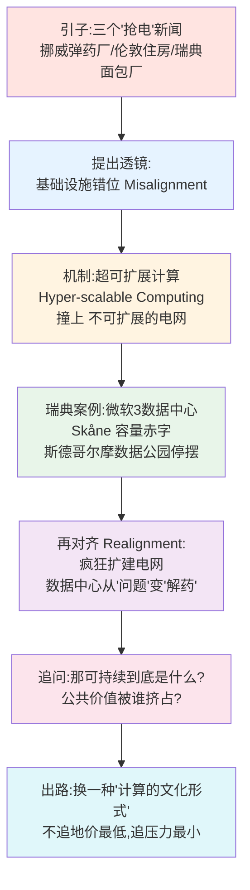
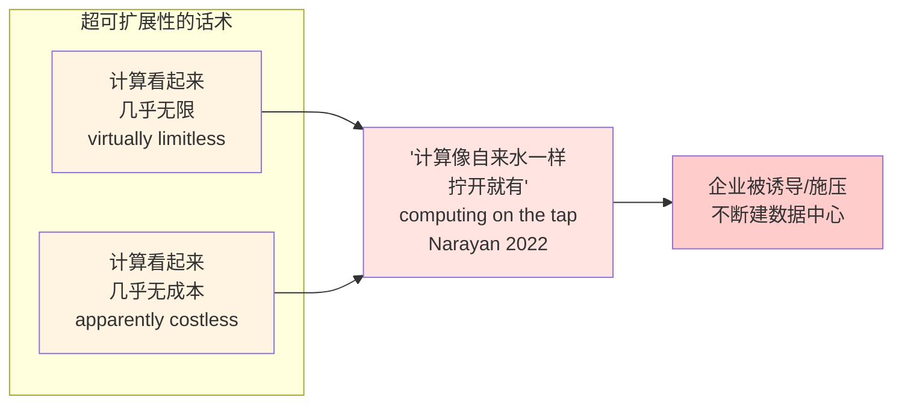
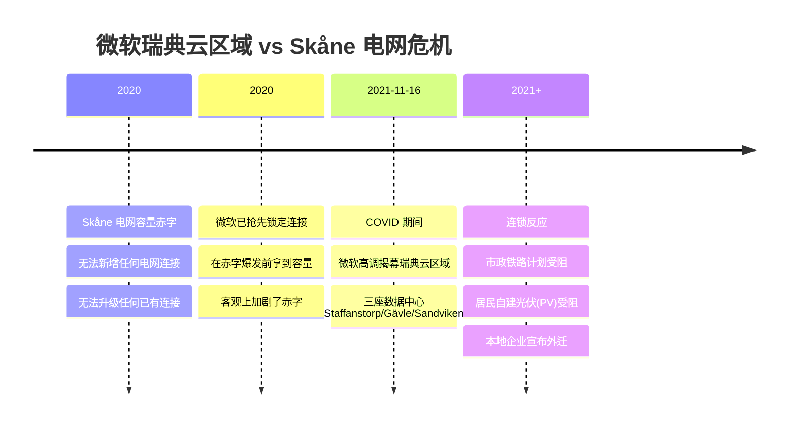
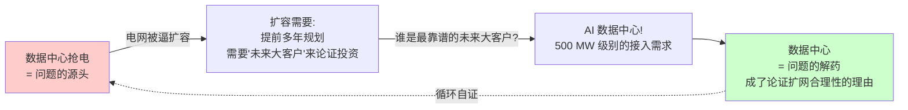
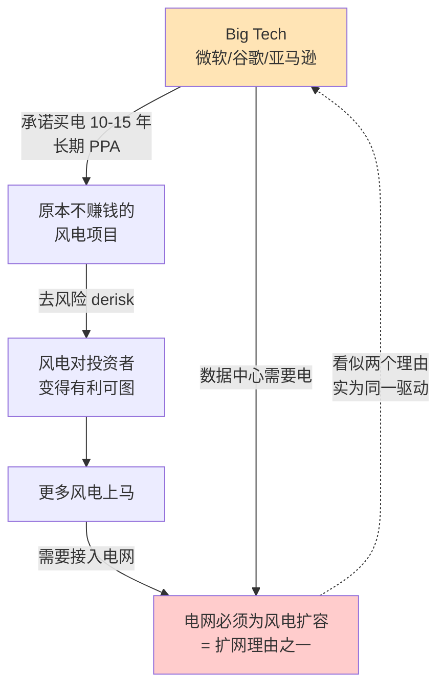
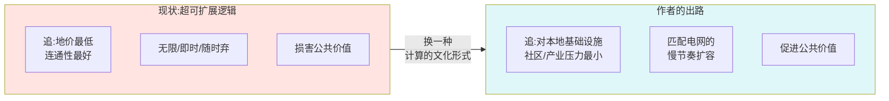
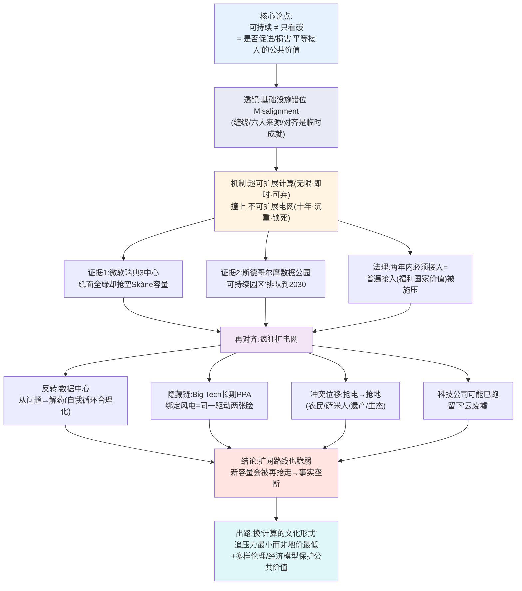

# 第 5 章 · 对齐能源网、云与公共价值 —— 瑞典的数据中心与电网之争

> 原书章节：**Aligning Energy Grids, Clouds and Public Values in Sweden**
> 作者：Julia Velkova（林雪平大学 Linköping University，文化与社会系）
> 出处：*AI Infrastructures and Sustainability*（Palgrave, 2026），第 5 章，pp. 115–133
> 关键词：AI 与能源 · 数据中心与可持续性 · 公共价值（public values） · 数字基础设施时间性 · 瑞典 · 云计算的可扩展性 · 容量赤字（capacity deficits）

---

## 🗺️ 本章地图

这一章不是讲「训练一个大模型要烧多少电」这种工程账，而是一位科技与社会研究（STS）学者从**社会学 / 人类学**角度追问的一个更深的问题：

> 当一个 TikTok 数据中心可以"抢走"整个地区的电网容量，害得挪威的弹药厂扩产不了、伦敦的房子盖不成、瑞典的面包厂被迫搬家——**"可持续"这个词到底还指什么？**

作者的核心武器是一个概念：**基础设施错位（infrastructural misalignment，也译"失调 / 不对齐"）**。她主张：数字基础设施是否"可持续"，不能只看它和"碳"这一种化学物质的关系，还要看它**如何促进或损害公共价值（public values）**——尤其是"人人平等地接入基础电力"这个公共价值。

本章的推进路线：

读完你会掌握三层东西：

| 层次 | 你会学到什么 |
|------|-------------|
| 🧩 **概念层** | 基础设施、错位（misalignment）、缠绕（entanglement）、超可扩展性（hyper-scalability）、公共价值、时间性（temporality）、容量赤字 |
| 🌍 **案例层** | 瑞典 Skåne / 斯德哥尔摩 / Mälardalen 的真实电网危机，微软 / AWS / 谷歌的操作，瑞典国家电网 Svenska Kraftnät 的 10 年计划 |
| 🤔 **批判层** | 为什么"接绿电 = 可持续"是个话术；"扩电网"如何把冲突从"抢电"转移到"抢地"；为什么这不是数据中心的"本质缺陷"而是一种"当下的计算文化形式" |

> 💡 **给工程师的话**：如果你是搞 AI Infra 的，这一章是你日常"选址、报装、PUE、绿电 PPA"背后的**政治经济学与社会学解释**。它会让你在面试里回答"数据中心可持续性"时，不再只会背 PUE，而能讲出"电网时间性错位""公共价值挤占"这种让面试官眼前一亮的框架。

---

## 0️⃣ 开场三连击：三个"数据中心抢电"的真实新闻

作者不是从理论开场，而是甩出三个（其实是四个）触目惊心的真实事件。先把它们记牢，全章都在解释它们。

| # | 时间地点 | 发生了什么 | 谁被挤掉了 | 出处 |
|---|----------|-----------|-----------|------|
| ① | 2023 春 · 挪威 Hamar | 一个 **TikTok 数据中心**占掉了该地区**所有可用的电网输电容量** | **Nammo 弹药厂**扩产计划泡汤——而这批弹药本是为支援乌克兰抗俄 | Yerushalmy, 2023（《卫报》） |
| ② | 2022 · 西伦敦 | 数据中心扎堆导致当地电网**容量耗尽** | **新建住房被叫停** | Hammond & Morris, 2022（FT） |
| ③ | 2021 · 瑞典 Skåne 省 | 微软在该省电网**史上最严重容量赤字**中高调揭幕一座数据中心 | 当地大型**工业面包房、塑料厂**等被迫另寻建厂地 | Libertson et al., 2021 |
| ④ | ~2019 · 瑞典 Mälardalen | **AWS** 建了三座数据中心 | 区域电网 CEO 早在 2019 就警告：**此后没有任何大型高耗电产业能再接入本区电网** | Selin, 2018 |

> 🔬 **本章核心论证（第一击）**：这些不是孤例，也不是"技术故障"。把计算机接入电网这个**看似纯技术的日常操作**，同时是一个**社会操作**——它重新分配了"谁能用上能源"的权利。碳排放只是可持续性的一面；**接入权（access）的分配**是被主流讨论忽略的另一面。

作者由此立下全章论点：

> **一项数字基础设施是否可持续，不能被简化为它与"碳"这一化学物质的单一关系，而同样取决于基础设施的运作如何"促进或损害了平等接入（access）的公共价值"。**

她还补一刀点出政策紧迫性：随着**欧盟新政策推动全欧洲建"AI 工厂"（AI factories）**，公民和产业能否**公平接入电力**的问题只会越来越重要。所以必须追问两个问题：

1. 共享接入基础设施（如电网）的价值一旦被损害，人们**设想用什么方式去恢复 / 弥补**它？
2. 到底是**什么条件**，一开始就制造了这些问题？

而且——"AI"软件已经存在几十年了（Suchman, 1987），计算和数字基础设施也早就有了。**那么，今天的问题到底新在哪里？** 这个"新在哪里"是全章的钩子。

---

## 1️⃣ 核心透镜：什么是"基础设施错位"（Infrastructural Misalignment）

这是全章最重要的理论工具，务必吃透。作者是分三步搭起来的。

### 1.1 先定义"基础设施"（Infrastructure）

作者引用人类学经典定义（Larkin, 2013）：

> **基础设施 = 那些"使其他事物得以流动"的物件与关系，其治理形式看起来是脱离正式制度的（appears detached from formal institutions）。**

拆开讲：
- **"使其他事物流动"**：电网让电流动、公路让车流动、互联网让数据流动。基础设施本身不是目的，它是**让别的东西跑起来的底座**。
- **"治理看起来脱离正式制度"**：基础设施常常"隐身"——你平时感觉不到电网的存在，只有停电时才想起它。这种"隐形的治理"是基础设施研究的核心母题。

关于基础设施的学术研究，历来关注四大主题：**公民身份（citizenship）、知识（knowledge）、权力（power）、时间性（temporality）**，分别对应不同"形态"的基础设施（公路铁路网、能源、互联网、视听与移动媒体）。而最近，**数据中心**作为数字基础设施的一个独特子集浮现出来，催生了一整波"数据、数字化、能源、环境如何缠绕"的研究（Edwards et al., 2024）。

### 1.2 关键转折："基础设施从不孤立存在，它们彼此缠绕（entangled）"

作者批评主流研究的一个坏习惯：**把基础设施切成一段一段来分析**——空间基础设施、城市基础设施、科学基础设施、信息基础设施、能源系统、数据中心，各讲各的逻辑和政治，**很少去碰它们之间的相互关系**。

她借 STS 学者 **Janet Vertesi（2014）** 的洞见来反驳：

> **任何一项基础设施，永远是多重基础设施"乱糟糟地相互重叠（messily overlap）"的缠绕体。**

例子：电网基础设施**同时**在支撑着科学设施、交通网络、数字计算……**每一个**系统都有自己的逻辑，服务于特定的理性、商品和服务，**而且常常和别的系统"错位"（in misalignment）**。

### 1.3 "错位"从哪来？—— 六大来源

作者列出了错位的六个来源，这是一张可以直接背的表：

| 错位来源 | 含义 | 数据中心 vs 电网的具体体现 |
|----------|------|---------------------------|
| ① 不同的**专业工作实践** | 电力工程师 vs 云工程师，做事方式、职业身份不同 | 电网规划师按"负荷曲线"想事，云工程师按"弹性伸缩"想事 |
| ② 不同的**法规与市场** | 各自受不同监管、在不同市场里交易 | 电网受能源监管；云是租赁市场，"按量付费" |
| ③ 不同的**时间性与空间性** | 时间尺度和地理逻辑不同（本章重中之重） | 电网要**提前十几年**规划；数据中心**说建就建** |
| ④ **漂移与损坏**（drift and brokenness） | 系统会老化、失修、偏离原设计 | 老变电站、老输电线需要维护替换 |
| ⑤ 不同的**价值取向**（value orientations） | 各系统"想促进什么价值"不一样 | 电网促进"普遍接入"；云促进"无限可扩展" |

> ⚠️ **常见坑（读者容易误解）**：不要把"错位"理解成"故障 / bug"。作者的意思恰恰相反——**基础设施的正常运作，本身就是一种持续的"成就（ongoing accomplishment）"**，是靠不同行动者不停地把异质系统的逻辑、价值"对齐"才勉强达成的。错位是**常态**，对齐才是需要费劲维护的**例外**。

### 1.4 "对齐"是一种需要不断劳作的临时成就

Vertesi 有一句被作者反复引用的话：

> 错位要求不同行动者努力去制造"**适合特定任务、用手边现成材料拼出来的、转瞬即逝的对齐时刻**"（fleeting moments of alignment suited to particular tasks with materials ready-to-hand）。

Vertesi 的原始案例是**机器人太空任务**：科学家和工程师们靠一堆琐碎的日常仪式（打电话、个人调整、技术手段）把不对齐的标准、职业身份、文化规范、通信技术**临时抹平**，制造出"连贯性（coherence）"。

而且——**对齐不总是成功的**。Vertesi 举了个经典小例子：**Mac 和 PC 系统之间一个简单的不匹配**，就能让科学家们束手无策，甚至改变一场昂贵太空任务的走向。

> 🔬 **本章核心论证（第二击）**：错位会呼唤"修复（repairs）"和"再对齐（realignments）"，而这些恰恰是**权力谈判的战场**。因为它逼人回答两个尖锐问题：**"该对齐谁的工作？"（whose work is to be aligned）** 以及 **"为了谁、为了什么目的？"（to what end）**。—— 记住这句，它是理解全章"扩电网 = 谁受益"的钥匙。

### 1.5 数字基础设施也不例外——两个"价值缠绕"的例子

作者给了两个很妙的例子，说明数据中心天生就活在"错位"里：

**例子 A：把数据中心塞进防空洞 / 地堡（Taylor, 2021）**
- 某些数据中心运营商为了兜售"数据安全"这个价值，把机房建在**本来就象征安全的地方**——防空洞、地堡。
- 但**防空洞的治理逻辑和数据中心的完全不同**。管理这些空间的公共当局，必须在"应急时保护公民的战备价值（preparedness / citizen protection）" 和 "把这些长期闲置空间商品化"之间谈判。
- **公民防御 vs 数据中心**这两种价值取向的差异，产生了基础设施错位，逼公共行政去决定"该优先哪个、何时优先"，靠"允许或不允许某个基础设施连接"来对齐差异。

**例子 B：把数据中心放到北欧"蹭"绿色价值（Salling & Winthereik, 2025）**
- 跨国公司把数据中心放到北欧，只要**接上已有的、看起来促进环境价值的基础设施**（可再生电力驱动的电网、区域供热系统 district heat），就能"坐享"环保形象。
- 于是电网运营商和地方政府必须谈判两套系统的三重差异：
  - **空间逻辑**：间歇性可再生能源供给催生的"新地理" vs 数据中心的选址需求；
  - **时间逻辑**：能源系统的**长期规划** vs 科技行业的**飞快迭代**和数字基础设施的**快速淘汰**（Chun, 2017; Velkova, 2019）；
  - **经济逻辑**：能源的经济学 vs 数据的经济学，两套账。

> 💡 **实战 take-away**：这两个例子的共同点是——**数据中心通过不断"对齐"不同基础设施逻辑、不同价值，来扮演数字经济的基础设施角色**。它不是自足的，它是"寄生 / 缠绕"在别的系统上的。这解释了为什么"选址"在数据中心行业里是头等大事：选址本质上是在选"蹭哪套价值、和哪套系统对齐"。

**本节收尾的关键判断**（承上启下）：

> 由数据中心引发的社会与环境伤害，**并不是数据中心的"内在本质"**，而是**当下一种特定"文化形式"（cultural form, Williams 1974）**的产物——这种形式把计算组织成崇尚**超可扩展性（hyper-scalability）**，它要求不断地把缠绕的基础设施"往上扩容"来迁就自己，**却又做不到**。

---

## 2️⃣ 病根机制：超可扩展的计算，撞上不可扩展的电网

这是全章的"发动机"部分——解释错位到底怎么产生的。

### 2.1 什么是"云计算"和"超可扩展性"

作者先把云计算讲清楚（引 Hu, 2015）：

> **云计算 = 一种组织计算基础设施的当代形式**：把计算机聚集到数据中心 → 虚拟化并把它们编组成"逻辑实体" → 打包成"按需租用（rent on demand）"的服务。

然后引 **Narayan（2022）** 引出核心概念 **超可扩展性（hyper-scalability）**：

> 云计算是一种**外包（outsourcing）**，它让企业能够"扩展"——**无需前期自建 / 自管基础设施的成本**，就能提供数字服务。这背后是一种"超可扩展"的文化逻辑。

超可扩展性的两个"魔法承诺"（这是被批判的靶子）：

- **"无限"**：Powell（2024）指出，超可扩展性让计算**看起来无限、也看起来无成本**。
- **"拧开就有"**：相比早期自建机房的模式，云计算让算力"on the tap"（像自来水管一样）。

**当今欧洲三巨头**：AWS、Microsoft、Google（Narayan, 2022）。它们也把这套超可扩展云基础设施**包装成 AI 开发的资源**：

| 厂商 | 产品/话术（书中原文引用） |
|------|--------------------------|
| AWS | 提供 **SageModel Training**：算法、算力、模型、训练数据集（含合成数据建模 synthetic data modelling）的打包 |
| Microsoft | "AI Solutions" 目录，语言 + 视觉模型打包，口号 **"Build and Scale Exceptional Generative AI Systems"** |
| Microsoft Azure | 广告词："**Amplify human ingenuity**（放大人类才智）。放胆去想，用最新 AI 方案创造突破。按量付费或免费试用 30 天。**无前期承诺——随时取消**。" |

> ⚠️ **常见坑 / 话术识别**：注意 Azure 那句 **"无前期承诺、随时取消、按量付费"**——这正是"超可扩展性话术"的教科书样本。它把**沉重的物理现实（要真实的钢筋水泥、真实的兆瓦电力、真实占用别人的电网容量）**，包装成"随手可弃的软性订阅"。作者全章都在戳破这层话术。

### 2.2 "可持续"作为一个可选的下拉菜单项

关键观察：这些云服务**让你"选地点"**，而**某些地点会给算力附带"可持续"属性**——取决于跑这个服务的数据中心在世界哪个角落。

> **微软和 AWS 都把它们在瑞典的数据中心宣传为"可持续计算 / 可持续 AI"，靠的就是和瑞典能源基础设施（由可再生能源驱动）的"关联"。**

于是矛盾登场：

> 超可扩展性承诺"算力对任何人、以任何代价都可得"，于是**施压企业不断上马数据中心**。但当数据中心扩张时，**能源、水、电网这些社会基础设施根本长不了那么快**——于是产生基础设施错位，其表现就是**损害了"平等接入基础设施服务"这个价值**。

### 2.3 微软瑞典三数据中心 —— 一个"揭幕即危机"的案例

这是本章最详细的实证案例，值得逐点拆解：

**时间线：**

**几个关键细节：**

1. **三座数据中心**分别建在瑞典三个相距很远的镇：**Staffanstorp、Gävle、Sandviken**。提供可扩展云服务、安全、本地数据存储（后来还包括 AI 服务用的计算机）、以及"可持续性"。

2. **微软的强制性揭幕新闻稿**里，强调这是公司"最先进、最可持续设计"的数据中心，理由是：
   - **零废弃物（zero waste）**；
   - 备用电力用**环保认证柴油（environmentally certified diesel）** + **100% 可再生能源**；
   - 用一套软件**按小时（hourly basis）测量可再生电力的使用**；
   - 承诺未来在瑞典**少用水、少产废**。

3. **但是——** 这个揭幕，正好撞上 Skåne（三座之一所在的省）经历**该地区史上最严重的输电容量短缺**。**2020 年，Skåne 无法建立任何新的电网连接、无法升级任何已有连接**；而这座**高耗电的微软数据中心，却已在短缺爆发前抢先锁定了连接——从而"贡献"了这场短缺**，并准备开业。

4. **连锁伤害**：
   - 市政发展火车连接的计划受影响；
   - 居民通过自建光伏（PV）发电的项目受影响；
   - 本地公司和产业宣布外迁（Libertson et al., 2021）；
   - 电网连接排起长队，**视申请容量大小可能排队数年**。

> 🔬 **本章核心论证（第三击 · "普遍接入"作为公共价值）**：瑞典法律规定，**电网运营商有义务在两年内（或更短）连接任何想接入的人**（Swedish Energy Markets Inspectorate, 2021）。当微软申请接入本地电网时，**只要申请时还有可用容量，运营商 E.ON 就不能拒绝**——哪怕批准会导致容量赤字、让别的产业排队更久。
>
> 这个"必须连接任何人"的强制义务，**制造了"普遍接入电力"这一公共价值**——一个在历史上与**瑞典福利国家（welfare state）** 的形成绑定的价值。而微软数据中心这类事件，**恰恰在给这个价值施压**。

### 2.4 斯德哥尔摩数据公园 —— "可持续园区"却全面停摆

第二个案例更讽刺：

- 斯德哥尔摩市、能源公司、光纤基础设施商共建了一个数据中心产业园 **"Stockholm Data Parks"**。
- 它被**品牌化为"可持续、低碳"**，因为它要用**数据中心的余热来给城市供暖**（excess heat district heating）。
- **但现在一座数据中心都建不了**——因为该市**其他区域**的数据中心，加上正在电气化的产业和其他大型用电户，**已经把电力用量占到没有显著容量剩余**。
- 结果：Stockholm Data Parks 里的数据中心**排队排到 2030 年**，等更多电网容量释放出来（Stockholm City, 2025）。

> 💡 **面试高频视角**：这两个瑞典案例合起来，给出了一个极佳的"可持续性反例"——**一个数据中心可以在纸面上做到零废、100% 绿电、余热供暖（工程指标全绿），却仍然是"不可持续"的**，因为它挤占了别人接入电力的权利。这就是作者要你跳出"PUE / 碳足迹"单一指标、转向"公共价值 / 接入公平"的核心用意。

### 2.5 病根总结：时间性错位（Temporal Misalignment）

作者把病根精确定位为一句话：

> **电网容量赤字，反映的是"数据"基础设施与"能源"基础设施在【扩容的时间性】上的错位（misalignment in the temporalities of scaling）**，从而损害了瑞典"普遍且平等接入电力"的公共价值。

而且这些问题是**叠加在能源系统"已有的内部错位"之上**的，比如：
- **发电地点** vs **用电地点**不一致 → 造成不平衡、甚至断电风险；
- 为了让数据中心"可持续"，**可再生能源必须生产得更多** → 又产生新的错位（要建更多风电、光伏，又要占地、又要接网……）。

用一张表对比两套基础设施的"扩容节律"：

| 维度 | 超可扩展云计算 / 数据中心 | 电网 / 能源系统 |
|------|--------------------------|----------------|
| **扩容速度** | 说建就建，"on demand" | 从决策到运营平均 **10–12 年**（Svenska Kraftnät 自述） |
| **驱动逻辑** | 哪里地便宜、连通性好就去哪 | 必须**提前多年**长期规划，还得在"客户还没来"时就先建 |
| **时间视野** | 即时、无限、随时可弃 | 长周期、缓慢、有物理惯性 |
| **物质性** | 服务器 3–5 年换代，易废弃 | 输电线、变电站几十年寿命 |
| **市场/监管** | 租赁市场、平台资本 | 受能源监管、公共事业属性 |
| **淘汰风险** | 快速过时，可能变"云废墟" | 沉没成本高，一旦建成锁死几十年 |

> ⚠️ **这张表是全章的"金表"**：几乎所有冲突都能还原成这张表左右两栏的"节律不匹配"。记住核心矛盾——**一边号称"无限、即时、随时取消"，另一边是"十年起步、说了不算、建了就锁死"**。两者硬凑到一起，必然是有人被挤出去。

---

## 3️⃣ 再对齐：疯狂扩建电网，以及数据中心如何从"问题"翻身成"解药"

这一节讲：面对错位，各方是怎么"再对齐（realignment）"的——而这个过程本身又是新的权力politics。

### 3.1 Skåne 的紧急扩容动作

Skåne 的容量赤字触发了大规模的地方 + 国家扩容努力。区域电网运营商 **E.ON** 干了这些事：

| 措施 | 说明 |
|------|------|
| 升级多台变压器（transformers） | 硬件扩容 |
| 与 **Baltic Cable**（瑞典-德国输电线）签新合同 | 跨国调电 |
| 装新系统做输电**负载均衡（load balancing）** | 软性挖潜 |
| 2021 年起推**算法方案** | 诱导人们**错峰**做饭 / 充电——在电网最需要时**移出用电**，腾出容量（E.ON, 2025） |

**成效**：这些措施释放了 **1 TW 的电力**，相当于**寒冷天里整个马尔默（Malmö）的用电需求**。

> ⚠️ **但注意这个反转**：尽管释放量惊人，政客和区域电网运营商**仍认为不够**——因为预期未来数据中心、市政电气化、产业电气化会带来**更高需求**（Skånes effektkommission NET, 2025）。他们据此"预支"了对更大扩容的需求。

### 3.2 关键反转：数据中心从"问题"变成"解药"

这是本章最精彩、最反直觉的论证，务必看懂：

逻辑链条（逐环拆）：

1. 电网**必须长期规划、提前多年建**，而且**在客户还没到位时就得建**。
2. 数据中心却是"哪里地便宜、哪里有电就冒出来"（mushroom），不按电网逻辑来。
3. 于是电网运营商 E.ON 陷入尴尬：**在电网扩好前无法接新客户，却又得先去找"能用掉未来新容量"的大客户**。
4. **谁是最理想的"未来大客户"？—— 恰恰是 AI 数据中心！** 瑞典国家电网 **Svenska Kraftnät** 的报告指出：很大一部分新客户很可能是 AI 数据中心，并据此论证电网必须紧急扩容。

书中直接引用（Svenska Kraftnät, 2019, p. 13）：

> "数据中心接入的最大请求达到从电网索取 **500 MW** 容量，这在**不加固电网的情况下往往难以实现**。"

于是他们呼吁在全国**建更多输电线**。

> 🔬 **本章核心论证（第四击 · 自我循环的合理化）**：数据中心**从"制造问题的源头"，摇身变成"解决问题的方案"**——因为它成了那个能"论证电网扩容合理性"的潜在大客户。这是一个**自我循环的合理化机制**：抢电造成危机 → 危机催生扩网 → 扩网需要大客户 → 大客户又是数据中心 → 扩网又反过来服务了数据中心。资本和能源产业在这个循环里**双双获利**。

### 3.3 引入 Anna Tsing："可扩展性总是不完整的"

作者借人类学家 **Anna Tsing（2012）** 的"不可扩展性（non-scalability）"理论收紧论点：

> **可扩展性的努力总是不完整的（scalability efforts are always incomplete）；一项基础设施"扩不动"这件事，恰恰暴露了扩展工程的失败**（Tsing, 2012, p. 510）。

应用到瑞典：**瑞典很多地区的电网就是跟不上计算运作的尺度**。此时基础设施错位表现为一个"**再缩放（rescaling）问题**"——即如何**找到"正确的尺度"**，去对齐两个被损害的价值：**经济增长** 和 **公共接入能源**。

> 💡 **理论 take-away**："scalability"（可扩展性）在硅谷话语里是褒义词、是圣杯。Tsing 把它翻过来：**能无限"复制粘贴"而不改变各部分关系的系统，是稀有且暴力的**；真实世界（电网、土地、社区）充满"扩不动"的关系，而这些"扩不动"才是常态。数据中心行业硬要把不可扩展的电网、土地、社区"扳成可扩展的"，冲突就必然爆发。

### 3.4 "基础设施政治"：再对齐决定"为谁工作、排斥谁"

作者提炼出一个普适命题：

> 克服缠绕基础设施之间的错位，需要在**不同价值**之间、**不同基础设施逻辑**之间做"再对齐"。而**这些再对齐"如何执行"，就定义了：基础设施将为谁工作、优先谁、排除谁、能工作多久。**
>
> 这就是**基础设施政治（infrastructure politics）的核心**——它既能生产**财富**，也能生产**暴力**（Anand et al., 2018; Rodgers & O'Neill, 2012）。

"基础设施暴力（infrastructural violence）"是个专门术语：基础设施通过"谁被接入、谁被排除"来施加的、往往隐形的结构性伤害。

### 3.5 瑞典国家电网 Svenska Kraftnät 的 10 年计划

再对齐的主角是国家电网运营商 **Svenska Kraftnät**（国有机构，负责规划、维护、运营输电网、变电站及国际互联）。它自我定位为"瑞典气候政策的重要行动者"，使命是提供**安全、环境可持续、经济可行**的电力供应。

**转向**：过去 Svenska Kraftnät 关注的是"**如何出口过剩发电**"（为出口而加固国内输电线）。但 Skåne 等地危机后，它发布了一份**全国电网 10 年加固扩容计划**（*Systemutvecklingsplan 2020–2029*）：建新输电线、加固主要变电站和区域输电设施。

**它自述的动机（三大"社会发展"）**：

| # | "社会发展"驱动因素 | 潜台词 |
|---|-------------------|--------|
| ① | 城市区域用电增加（因已有数据中心落地） | 数据中心已经在吃电 |
| ② | 本地发电关停造成的容量赤字 | **暗指某些核电站关闭** |
| ③ | 预期数据中心带来的用电激增 | 未来还要吃更多电 |

**数据中心的胃口**：Svenska Kraftnät 指出（虽无公开数字），数据中心可能请求 **300 MW–500 MW** 容量，**相当于一个瑞典中型城镇的规模**。容量赤字最严重的城市区是：**斯德哥尔摩、乌普萨拉、马尔默、Mälardalen**——除乌普萨拉外，其余都是数据中心 / 大科技公司高度集中之地。

> ⚠️ **作者的"公允"提醒**：她特别强调——**数据中心只是扩网四大理由之一**，另外三个是：
> 1. 增强电网连接**新风电项目**的能力；
> 2. 维持 / 增强国内外**售电能力**；
> 3. 维护 / 替换**老化的电网元件**。
>
> **但注意——** 其中"风电"又**间接和数据中心扩张挂钩**！

### 3.6 隐藏链条：大科技公司如何"绑定"风电

这是一条容易被忽略、但极其重要的资本链条（引 Christophers, 2022）：

- 微软、谷歌、亚马逊都**自称是新装可再生能源电力的最大买家**。
- 在北欧，这些公司成了**风电项目的重要"补贴方 / 后盾"**：Big Tech 通过**承诺购买风电 10–15 年的电力（长期 PPA）**，来**给原本不赚钱的风电项目"去风险（derisk）"**——这让风电对投资者变得有利可图。

> 🔬 **核心论证（第五击 · "绿色"话术的资本底座）**：所谓"数据中心用绿电所以可持续"，其真相是——**Big Tech 用长期购电协议把风电"买断"**。这既做实了自己的"环保买家"人设，又把可再生能源的产能**绑定到自己的算力需求上**。于是"扩网理由"里的"风电"和"数据中心"根本是**同一个驱动的两张面孔**。当电网为了迎合超可扩展计算而扩容时（无论以数据中心还是风电的名义），**新的问题和错位又会冒出来**。

### 3.7 扩网的"提速"操作，与它制造的新冲突

Svenska Kraftnät 坦承：**从决策到运营，扩一次电网平均要 10–12 年**——这"太长了"，跟不上"要把工业制造从化石燃料转向电气化、要建数据中心、要建新住房"的期待（Svenska Kraftnät, 2019, p. 19）。

**它的提速方案**：**并行处理不同流程**——特别是**在获得输电线运营特许权（concession rights）之前，就先开始规划新输电线**。这样能把装一条新输电线的时间**砍掉 8–10 年**（但运营商仍嫌太长）。

**代价来了 —— 冲突从"抢电"转移到"抢地"**：

规划输电线要处理和公民的冲突：

| 受影响方 | 冲突类型 |
|----------|---------|
| 农民（farmers） | 征用农业用地 |
| 原住民（indigenous people，指萨米人 Sámi） | 土地权、传统生计 |
| 潜在考古遗址 | 文化遗产保护 |
| 文化 / 工业遗产 | 景观、历史价值 |
| 人类与非人类的栖息环境 | 生态、动物栖息地 |

瑞典能源市场监察局（Ei）打算联合各地区和机构（如国家测绘、地籍、土地登记局）**缩短扩网审批流程**。Skåne 的管理者也承认：这需要**和社区就土地使用和选址对话**，甚至要在**变电站的美学设计（aesthetic designs）** 上下功夫，来化解和居民的冲突（Skånes effektkommission NET, 2025, p. 13）。大规模扩网还要征用农业用地、从私人业主手里拿地，**必然引发纠纷**。

> 🔬 **核心论证（第六击 · 冲突的"位移"而非"消解"）**：注意这里发生的不是"解决"，而是**冲突的位移（displacement）**：
> - 原本焦点是"**超可扩展云** vs **普遍接入电力**"这两个价值的对齐；
> - 现在焦点**转移**到"如何搞定电网扩建"；
> - 冲突的**性质也变了**——从"**争夺电力接入**"变成"**土地治理争议**"。
>
> 扩网不但没消解冲突，反而**"倍增了社会冲突可能爆发的舞台"**，并**改变了瑞典电网的治理方式**：压缩规划时间、制造新的争议场、重塑行政流程。

### 3.8 而与此同时……科技公司可能已经跑了

最后一记讽刺：

> 在电网扩好之前，云计算运营商**只能被迫适应更长的时间线、按更长的连接周期做规划、放慢专用于 AI 系统的算力扩张**。这种**时间错位**——"按需 AI"的商业模式 vs "预期需求"而建的数据中心 vs "苦等电网连接"的现实——已经在数据中心行业里**制造焦虑**。
>
> 换句话说：当电网运营商和市政做着十年扩容计划、改变工作方式时，**科技行业可能早就搬去别处找电了**，从而**制造新的错位，把基础设施留成一片废墟（leaving infrastructure in ruins）**（Brodie & Velkova, 2021; Velkova, 2025）。

> 💡 **"云废墟（cloud ruins）"** 是作者自己的研究母题（她研究过爱立信被废弃的 Vaudreuil 数据中心）。核心洞见：数字基础设施是**"非永久性基础设施（impermanent infrastructures）"**——它来得快、走得也快，留下的却是被它绑住、扩了一半的电网和被征了地的社区。这是"超可扩展"逻辑的最终恶果：**别人被迫做十年承诺，它自己却随时可以走。**

---

## 4️⃣ 那么，可持续到底是什么？（作者的结论与出路）

### 4.1 重新定义"可持续性"讨论的起点

作者收束全章：

> 云计算当下所依赖的**超可扩展性逻辑**，让数字公司得以扩张、实验 AI、取得巨大成功（Narayan, 2022）。但**这种成功，是建立在"把缠绕的基础设施推入错位、进而损害公共价值"之上的**。

内部错位 + 空间/时间的扩容逻辑差异，导致两种结果二选一：
- **算力短缺**，或
- **局部电力短缺**（损害瑞典平等接入能源的公共价值）。

因此她主张，关于可持续性的讨论应当**换一个起点**：

> 更细致的可持续性讨论，应当**从"基础设施错位"分析、以及"再对齐"的尝试入手**，聚焦于**数字系统与能源系统"内部及彼此之间的矛盾"**，以及它们**如何促进或损害"平等接入基础设施"的公共价值**。

### 4.2 "扩电网"这条路本身也是脆弱的

作者不看好"猛扩电网"这条对齐路线，理由清晰：

| 电网的属性 | AI 计算的属性 | 后果 |
|-----------|--------------|------|
| 时间性更慢更长 | "此时此地就要无限算力" | 天生对不齐 |
| 物质性沉重（钢铁、铜线） | 轻资产、随时可弃 | 谁被锁死一目了然 |
| 有专业文化、市场、监管 | 绕开这些约束 | 电网被动迎合 |

**致命一击**：即便瑞典电网真的按计划在未来十年扩了容，**做 AI 生意的公司也能轻易把这些新容量"再抢走"**——因为政策制定者拼命想推动算力基础设施，把它**优先于其他部门**。

> **于是：云计算一边享受着"瑞典人人可平等接入能源"的原则红利，数据中心运营商却在事实上（de facto）"垄断"电网，把其他产业、竞争对手——甚至其他数据中心同行——都挤出去了。**

### 4.3 巨头的"自建电力"后手，只会加剧垄断

在此背景下，亚马逊、微软、谷歌这些**资源雄厚的公司**开始**投资专用输电线、甚至自建电厂**——以此**躲开它们自己正在制造的电网压力**。作者一针见血：这只会导致**能源生产和电网管理上进一步的垄断与错位**。

> ⚠️ **面试可用的犀利判断**：Big Tech"自建电力 / 核电 / SMR"看似是"负责任地为自己的用电买单"，实则是**加固垄断**——它们退出公共电网博弈、自成体系，把"平等接入"的公共价值进一步架空。这与本章开头"接入公平"的主线首尾呼应。

（脚注补充：当前 AI 算力需求已引发关于**多建核电、建小型模块化反应堆 SMR 与数据中心同址（colocation）** 的讨论，Stover, 2024——这又带来核废料处理、选址、公共健康的新社会冲突。）

### 4.4 出路：换一种"计算的文化形式"

作者最后给出方向（注意是"方向"而非"方案"，人文社科书的典型收尾）：

1. **错位不是普适或穷尽的**——它在不同地方、被不同历史 / 人群 / 产业塑造，表现各异。在某些地方，冲突甚至根本不是关于**能源**的，而是关于**水**基础设施的（Lehuedé, 2024; Valdivia, 2024）。

2. **"聚焦错位"提供了一种"重新想象"的方法**——去设想数据中心与其他基础设施"缠绕"的、能**促进而非损害公共价值**的对齐未来。

3. **更和谐的对齐，可能需要**：
   - **不同的扩容节奏**（a different pace of scaling），或
   - **彻底不同的计算组织方式**——不再追随"**哪里地便宜、连通性最好**"，而是追随"**哪里对本地基础设施、社区、产业的压力最小**"。

4. **一句话总纲**：

> **我们需要一种不同形式的计算，以及为它配套的、多样化的伦理与经济模型**——这些模型必须充分考虑"缠绕着基础设施的数据中心产业之间的相互关系"，从而**保护公共价值**。

---

## 5️⃣ 全章论证结构总复盘（一图看懂）

---

## 6️⃣ 关键术语中英对照速查表

| 中文 | 英文 | 一句话理解 |
|------|------|-----------|
| 基础设施错位 / 失调 | Infrastructural misalignment | 不同基础设施系统逻辑/价值/节律对不齐，是常态 |
| 缠绕 | Entanglement | 任何基础设施都是多重系统乱糟糟重叠的产物（Vertesi） |
| 超可扩展性 | Hyper-scalability | 云的文化逻辑：算力"无限·无成本·拧开就有"（Narayan） |
| 不可扩展性 | Non-scalability | Tsing：扩不动才是常态，扩得动是稀有且暴力的 |
| 公共价值 | Public values | 贡献于共同善、在民主社会中被争夺的价值（van Dijck et al.） |
| 普遍接入 | Universal access | 人人可平等接入基础设施，绑定瑞典福利国家史 |
| 容量赤字 | Capacity deficit | 电网无法再新增/升级连接的短缺状态 |
| 时间性 | Temporality | 系统的时间尺度与节律（电网十年 vs 云即时） |
| 基础设施政治 | Infrastructure politics | 再对齐决定"为谁工作、排斥谁"，能生财富也能生暴力 |
| 基础设施暴力 | Infrastructural violence | 通过"谁被接入/排除"施加的隐形结构性伤害 |
| 文化形式 | Cultural form | Williams：技术的社会组织方式（伤害源于形式而非本质） |
| 云废墟 / 非永久基础设施 | Cloud ruins / impermanent infra | 数据中心来去匆匆，留下扩到一半的电网 |
| 去风险 | Derisk | Big Tech 用长期 PPA 给不赚钱的风电兜底 |
| 区域供热 | District heating | 用数据中心余热给城市供暖 |
| 购电协议 | PPA (Power Purchase Agreement) | 承诺买电 10–15 年的长期合约 |

---

## 7️⃣ 💡 给 AI Infra 从业者的"翻译"：这章和你的日常有什么关系

作者是社会学家，但她描述的每一件事，都是你在 AI Infra 岗位上会真实撞到的：

| 她的社会学概念 | 你工作里的对应物 |
|----------------|-----------------|
| "抢占电网容量" | 数据中心**报装 / grid interconnection queue**（美国 PJM 排队已达数年） |
| "时间性错位" | 你的**GPU 集群交付周期（月）** vs **电力/变电站建设周期（年）** |
| "选址追地价最低" | **site selection** 里的电价、气候（自然冷却）、税收优惠权衡 |
| "微软按小时测绿电" | **24/7 Carbon-Free Energy (CFE) matching**、时序碳会计 |
| "Big Tech 绑定风电 PPA" | 你司签的**可再生能源 PPA / VPPA** |
| "自建电厂 / SMR 同址" | 微软重启三里岛核电、各家的 **behind-the-meter 发电**、SMR colocation |
| "公共价值 / 接入公平" | 你做**社区关系 / 监管审批**时绕不开的"社会许可（social license）" |
| "云废墟" | **搁浅资产（stranded assets）**、被废弃的老旧数据中心 |

> 💡 **面试话术升级**：被问"数据中心可持续性怎么看？"——
> - ❌ **只答**："看 PUE、用绿电、上液冷。"（工程师标准答案，天花板低）
> - ✅ **进阶答**："PUE 和绿电只是'碳'这一维度。更深的问题是**基础设施错位**——数据中心的扩容节律（说建就建）和电网的扩容节律（十年起步）对不齐，会挤占**其他产业和居民平等接入电力的公共价值**，瑞典 Skåne、斯德哥尔摩都是活例子。所谓'100% 绿电'很多时候是 Big Tech 用长期 PPA 把风电买断的话术。真正的可持续要求我们重新想'计算的组织方式'——不追地价最低，而追**对本地电网、社区压力最小**的选址与节奏。"（直接把面试官镇住）

---

## 8️⃣ 🤔 思考题 / 面试高频追问

1. **概念辨析**：为什么作者说"数据中心的社会环境伤害不是它的'内在本质'，而是一种'文化形式'的产物"？如果换一种"文化形式"，同样的数据中心会不会不伤害公共价值？（提示：Williams 的 cultural form + 超可扩展 vs 其他计算组织方式）

2. **机制题**：用你自己的话讲清楚——为什么数据中心能"从问题变成扩网的解药"？这个自我循环里，谁获利、谁买单？

3. **反例题**：微软瑞典数据中心做到了零废、100% 绿电、余热供暖、按小时测绿电——按传统标准这是"模范生"。作者凭什么还说它"不可持续"？这挑战了你对"可持续"的哪个默认假设？

4. **位移题**："扩电网"把冲突从"抢电"变成了"抢地"。这是"解决了冲突"还是"转移了冲突"？在中国 / 你熟悉的国家，数据中心选址会引发哪类"土地 / 社区"冲突？

5. **对比题**：本章聚焦"能源/电网"错位。作者提到在别的地方冲突可能是关于"**水**"的（Lehuedé, Valdivia）。请把本章的"错位"框架套到"数据中心 vs 水资源"上，重画一遍逻辑链。

6. **政策题**：欧盟正推"AI 工厂"遍地开花。用本章框架预测：这会加剧还是缓解"公共价值被挤占"？为什么？

---

## 📌 小结

- **一句话主旨**：数字基础设施是否"可持续"，**不能只看碳**，还要看它**如何促进或损害"人人平等接入基础电力"的公共价值**。碳是一维，接入公平是被忽略的另一维。

- **核心透镜——基础设施错位（misalignment）**：任何基础设施都是多重系统"乱糟糟缠绕"的产物（Vertesi）；它们在专业实践、法规市场、时间空间、价值取向上天生错位；**"对齐"是需要不断劳作的临时成就，而非默认状态**。

- **病根机制**：**超可扩展计算**（"无限·即时·随时弃"的云话术）**撞上不可扩展的电网**（"十年规划·物质沉重·建了锁死"）。核心是**时间性错位**——一边说建就建，一边十年起步。

- **瑞典铁证**：微软三数据中心纸面全绿却抢空 Skåne 电网容量、逼走面包厂、卡住居民光伏；斯德哥尔摩"可持续数据公园"排队到 2030。瑞典"两年内必须接入"的法律**制造了"普遍接入"这一福利国家公共价值**，而数据中心正在给它施压。

- **再对齐的反转**：疯狂扩电网时，**数据中心从"问题源头"翻身成"论证扩网合理的大客户"**（自我循环合理化）；Big Tech 用长期 PPA **绑定风电**，让"数据中心"和"风电"成为同一驱动的两张脸；扩网又把**冲突从"抢电"位移到"抢地"**（农民、萨米人、遗产、生态）。

- **结论**：扩电网这条路本身脆弱——新容量会被 AI 公司再抢走，形成**事实垄断**；巨头"自建电力/核电"只会加剧垄断。真正出路是**换一种"计算的文化形式"**：不追地价最低，而追**对本地基础设施、社区压力最小**的选址与节奏，并配以**保护公共价值的多样伦理与经济模型**。

- **给工程师的落点**：这一章是你日常"选址、报装排队、PUE、绿电 PPA、SMR 同址"背后的**政治经济学解释**。掌握"基础设施错位 / 时间性 / 公共价值 / 事实垄断"这套词，能让你把"数据中心可持续性"讲到工程指标之上的层次。

---

## 🔗 延伸阅读

**本章作者相关（Julia Velkova 的"数据中心时间性"研究线）**
- Velkova, J. (2019). *Data centres as impermanent infrastructures.* Culture Machine, 18. —— "非永久基础设施"的源头
- Velkova, J. (2021). *Thermopolitics of data: Cloud infrastructures and energy futures.* Cultural Studies. —— 数据的"热政治"
- Brodie, P., & Velkova, J. (2021). *Cloud ruins: Ericsson's Vaudreuil data centre and infrastructural abandonment.* ICS, 24(6). —— "云废墟"
- Libertson, F., Velkova, J., & Palm, J. (2021). *Data-centre infrastructure and energy gentrification: Perspectives from Sweden.* —— 本章瑞典案例的实证底本，提出"能源绅士化（energy gentrification）"

**理论基石**
- Vertesi, J. (2014). *Seamful spaces: Heterogeneous infrastructures in interaction.* —— "错位/缝隙空间"理论
- Tsing, A. L. (2012). *On non-scalability.* Common Knowledge, 18(3). —— "不可扩展性"必读
- Larkin, B. (2013). *The politics and poetics of infrastructure.* —— 基础设施研究入门综述
- Williams, R. (1974). *Television: Technology and cultural form.* —— "文化形式"概念来源
- Anand, Gupta & Appel (Eds.) (2018). *The promise of infrastructure.* —— 基础设施政治

**云计算 / 平台资本**
- Narayan, D. (2022). *Monopolisation and competition under platform capitalism.* —— "超可扩展性"概念来源
- Hu, T. H. (2015). *A prehistory of the cloud.* —— 云的前史
- van Dijck, Poell & de Waal (2018). *The platform society.* —— "公共价值"框架来源

**能源与数字 / 水资源维度**
- Christophers, B. (2022). *Taking renewables to market.* —— Big Tech 如何给风电"去风险"
- Lehuedé, S. (2024). *An elemental ethics for AI: Water as resistance.* —— 把"错位"框架搬到"水"
- Valdivia, A. (2024). *The supply chain capitalism of AI.* —— AI 供应链的环境批判
- Luccioni, Jernite & Strubell (2023). *Power hungry processing: Watts driving the cost of AI deployment?* —— AI 部署的功耗测算（工程侧对照读物）

**新闻案例原文**
- Yerushalmy (2023, The Guardian) —— TikTok 数据中心 vs 挪威弹药厂
- Hammond & Morris (2022, FT) —— 西伦敦住房被电网叫停

> 与本书其他章的呼应：本章 pp. 119 提到 "see also Bojzcuk in this volume"（与本书 Bojzcuk 章关于数据中心价值的讨论互补）；同时可对读本书讨论"碳会计 / 环境问责"的章节，形成"碳维度 vs 接入公平维度"的完整可持续性图景。
