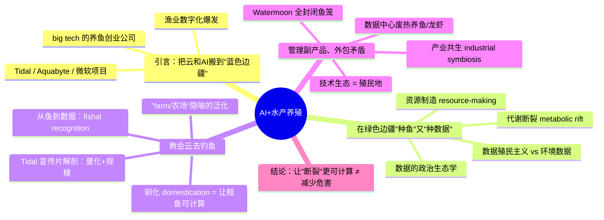
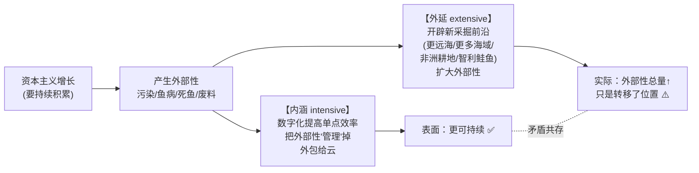
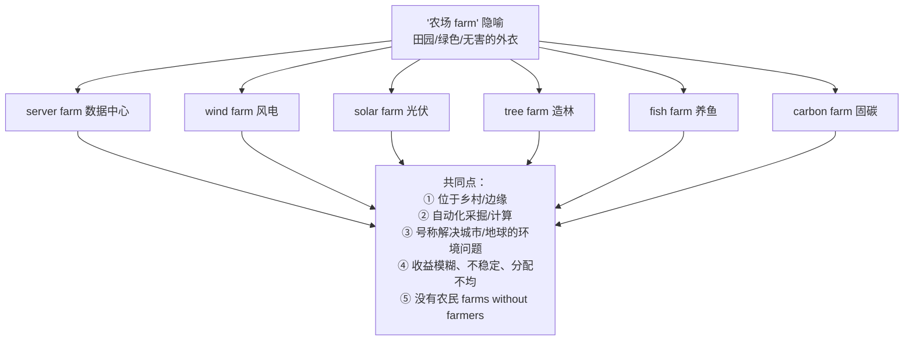
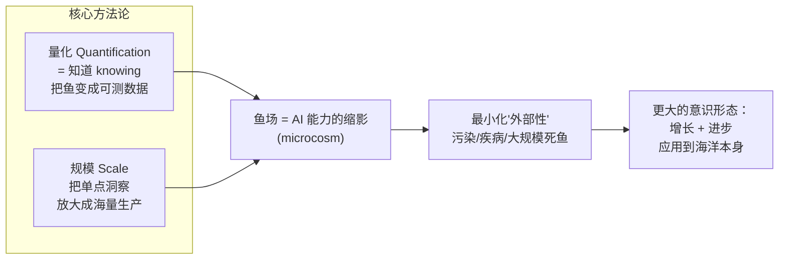
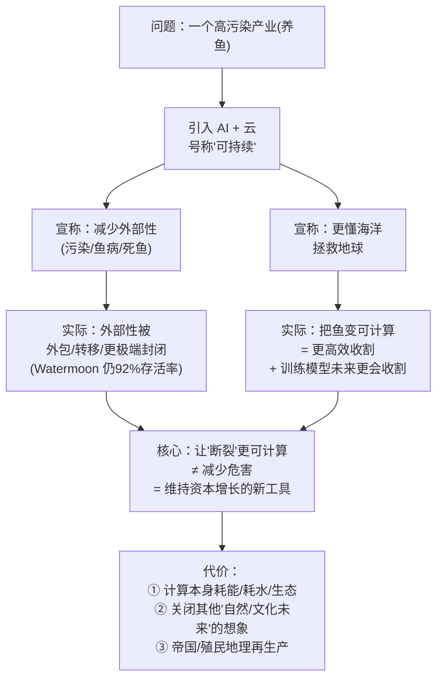

# 06 · 🐟 水产养殖、AI 与行星驯化（Aquaculture, AI, and Planetary Domestication）

> 本章对应原书第 6 章（Patrick Brodie，都柏林大学学院 UCD）。原文页码 pp. 134–159。
> 关键词：人工智能（Artificial Intelligence）· 水产养殖（Aquaculture）· 蓝色革命（Blue Revolution）· 效率（Efficiency）

---

## 🗺️ 本章地图

这一章是全书里技术味最"淡"、批判味最"浓"的一章：它不讲怎么训练模型，而是拿"AI + 养鱼"这个看似冷门的产业当**手术台**，解剖当代"绿色 / 数字资本主义"如何用 AI 和云计算给一个高污染产业"洗白 + 扩张"。作者 Brodie 是**政治生态学（political ecology）**和**批判基础设施研究（critical infrastructure studies）**背景，他的核心武器是一批马克思主义生态学概念（代谢断裂 metabolic rift、廉价自然 cheap nature、绿色采掘主义 green extractivism、数据殖民主义 data colonialism）。

作为一份给工程师 / infra 从业者的精讲，我会做两件事：
1. **把书里的每个抽象概念翻成大白话**（是什么 / 为什么这么说 / 证据是什么 / 代价是什么）；
2. **把它和你熟悉的 AI-Infra 事实挂钩**——"云 / 数据中心 / 计算机视觉 / 边缘推理 / 废热回收"这些词在本章不是隐喻，是真实产业，AI Infra 人反而是本章隐含的"当事人"。

---

## 0. 🎯 先给结论：这一章到底在吵什么？

如果你是工程师，读这种"人文社科批判"最怕看不到靶心。这章的**一句话论点**是：

> **AI 和云计算被当作"可持续养鱼"的银弹（silver bullet），但它不是在治愈问题，而是在把资本主义增长的"外部性 / 副产品"（污染、鱼病、大规模死鱼）更高效地管理、外包、并转移到别处——从而让本来该被约束的产业得以继续扩张。**

作者反复用一个词：**intensifying rather than ameliorating**（是在**强化**而不是**缓解**）资本主义增长的"外部性"。这就是全章的姿态。

| 产业话术（宣传片里说的） | 作者的反驳（批判视角） |
|---|---|
| AI 让养鱼**更可持续**、拯救海洋 | AI 让养鱼**更能规模化**，可持续只是扩张的许可证（license to scale） |
| 数字技术**减少**污染、鱼病等外部性 | 数字技术把外部性**外包**到"别处 / 看不见的地方"，同时开辟新的采掘前沿 |
| "农场 / farm"是绿色、田园的 | "农场"变成了**没有农民的自动采掘站**（farms without farmers） |
| 把鱼变成数据 = 更懂海洋、更好保护 | 把鱼变成数据 = 让鱼**可被计算、可被收割**（legible for harvesting） |
| 数据中心废热养鱼 = 循环经济、气候正贡献 | 循环经济话术把**副产品重新包装成资源**，为进一步的工业增长背书 |

> 🔬 **核心论证（本章第一性原理）**：作者不是"反对养鱼"或"反对 AI"，他反对的是一种**认识论（epistemology）**——即"只要把自然变得足够可计算（calculable），就能把不可持续变成可持续"。他认为**"让断裂更可计算"（rendering the rift more calculable）并不减少生态危害，它只是把技术科学的进步逻辑用去维持资本主义增长**。记住这句原话（p. 153）：
> *"Rendering the rift more calculable does not reduce its ecological impacts—it applies the epistemic functions of technoscientific progress to problems of sustaining capitalist growth."*

---

## 1. 🌊 引言：把"云"和 AI 搬到蓝色边疆（Blue Frontier）

### 1.1 一个正在数字化爆发的老产业

书的开头点题（p. 133–134）：养鱼（fish farming / 水产养殖 aquaculture）最近经历了一次"数字繁荣"（digital boom）。公司们纷纷把**数据驱动（data-driven）**和**机器学习（machine-learning）**技术塞进养殖和捕捞环节。

作者把这放进一个更大的背景：AI 正在被当作各种"不绿"产业的**可持续银弹**——从采矿（mining）到工业化农业（industrial agriculture）。养鱼只是最新一块"蓝色（blue）"地盘。

> 💡 **给 infra 人的翻译**：这就是典型的"AI for X"叙事。你可能听过"AI for climate""AI for agriculture"。作者的怀疑是：当一个高污染产业突然拥抱 AI，它到底是在**减排**，还是在**给自己找一张继续扩张的道德门票**？

### 1.2 "绿色新政"与"蓝色新政"合流

原文（p. 134）：随着"绿色（green）"和"蓝色（blue）"新政的号召合流，数字技术被越来越多地委以重任——**在行星极限（planetary limits）内，以可计算的方式管理行星资源，服务于更密集的价值榨取**。

这里出现两个贯穿全章的动词：
- **mobilising "stocks" towards "flows"**：把可测量资源的"存量（stock）"调动成商品与服务的"流量（flow）"。这是把海洋 / 淡水系统**变成资源池**的过程。
- **sensing, mapping, surveying**：感知、绘图、勘测。这是把海洋变成数据的**前置工序**。

作者抛出全章的引导问题（research question）：

> "云"及其对 AI / 机器学习的支撑，究竟以何种方式**在行星极限内管理这些过程**？（*In what ways do the "cloud," and its facilitation of AI and machine-learning, operate to manage these processes within planetary limits?*）

### 1.3 谁在做这件事？—— big tech 的养鱼创业地图

这是全章少数几处"硬事实"，工程师会觉得亲切（p. 134–135）。作者列了几家"aquatech（水产科技）"公司，且刻意强调它们与 big tech 的血缘：

| 公司 | 与 big tech 的关系 | 用的云 |
|---|---|---|
| **Tidal** | Alphabet X（谷歌"登月工厂"Moonshot Factory）孵化，2024 年拆分（spin off），Alphabet 仍持有重要少数股权 | Google Cloud |
| **Aquabyte** | 与 **AWS** 合作交付方案；其前技术负责人后来"跳槽"去了 Tidal（作者调侃：AI 养鱼圈子还很小） | AWS |
| **微软（Microsoft）** | 从南美到东亚，扶持并推广了一批创业公司和生产者的项目 | Azure（隐含） |

作者观察到一个关键现象：**每个项目都在鹦鹉学舌般（parrots）重复同一套话术和目标**：

1. 可持续地喂养地球（sustainably feed the planet）；
2. 优化鱼的生产（主要作为**生物量 biomass**，锁定**饲料转化比 biomass-to-feed ratio**）；
3. 提升鱼的福利（fish welfare）；
4. 扩大生产规模（scale up production）；
5. 最终——**引入全自动鱼场（automated fish farm）**。Aquabyte 在 2019 年一场 AWS 赞助的网络研讨会结尾就是这么承诺的。

> ⚠️ **常见坑（读这章时）**：不要把"biomass to feed ratio（饲料转化比）"当成中性技术指标就滑过去。作者后面会揭示：把鱼定义为**biomass（生物量）**而非"生命"，本身就是一次**认识论操作**——它让鱼变成"可优化的产量数字"，为大规模收割铺路。

### 1.4 本章的分析框架：数据的政治生态学

作者把本章定位为对**"数据的政治生态学"（political ecology of data，Goldstein & Nost, 2022）**的初步研究——即研究**数字数据如何在社会-生态系统（socio-ecological systems）中运作**。

他要看的具体场景是：**先进数字技术如何被整合进"绿色资本"所谓的行星"边疆（frontiers）"上的食品生产**，尤其是通过**驯化（domestication）**过程——靠"数字化监测和干预鱼群"带来的规模化效率（scaled efficiencies）来实现。

理论工具箱（后面逐一展开）：
- **代谢断裂（metabolic rift）** —— 生态马克思主义核心概念；
- **绿色采掘主义（green extractivism）** —— 打着绿色旗号的采掘；
- **驯化（domestication）** —— 把野生变成"可计算资源"的历史过程。

---

## 2. 🌱 在"绿色边疆"上种鱼、种数据（Farming Fish and Farming Data）

这一节是**理论重头戏**，把"数据"和"生态"接起来。工程师读起来会最吃力，所以我逐个概念拆。

### 2.1 数据殖民主义（Data Colonialism）与它遇到的"生产性摩擦"

作者先引 Paula Ricaurte（2019）关于**数据驱动理性（data-driven rationality）**的经典段落（p. 136）：

> 数据驱动的理性，靠的是主要位于西方国家的国家、企业、研究中心所建立的**知识生产基础设施**，以及一个支撑资本积累和经济增长的经济系统……整个互联网基础设施支撑着各种交易、流动和互动，把**任何形式的存在（any form of existence）都转化为可能的数据来源**……我们的对象和空间的宇宙，已被转化为**为资本积累和权力集中提供燃料的知识**。（Ricaurte, 2019, p. 351）

这是**"数据殖民主义"（data colonialism，Couldry & Mejias, 2019）**的立场：数据化的核心价值，来自对社会活动和"人类生活"的**殖民、汲取、榨取**。

**但作者说：这个理论一旦碰到"环境数据"就产生"生产性摩擦"（productive frictions）**——即它不完全适用，反而暴露出更有意思的东西。为什么？

- 环境数据化**常常嵌在公共治理和监管机制里**（不像抖音抓你的行为数据那样赤裸裸私有）。
- 作者引 Adrienne Buller：比如**碳定价（carbon pricing）**，大多是基于"国家对排放的惩罚性政策"，而**不是给排放正向赋值**。
- 所以环境数据化更多是一种**"表征、量化、可读化（legibility）"**的过程——它**先把自然变得可计算，从而预先构造出（pre-empting）将要从"自然"中抽取的那个资源**（引 Liboiron, 2021）。

> 🔬 **核心论证**：这里作者做了一个精妙的区分。赤裸的"采掘（extraction）"不是重点，重点是**"可计算化（making calculable）"这个前置动作**。一条鱼要先被传感器和模型渲染成"可读的数据对象"，之后才谈得上被高效收割。**可计算化是采掘的前提，不是采掘本身。** 这对理解"AI 到底在产业里干了什么"极其关键——AI 干的往往就是这个"legibility（可读化）"的活。

### 2.2 资源制造（Resource-Making）：自然不是被发现的，是被"制造"出来的

作者引地理学家 Gavin Bridge（2011，p. 137）：社会科学家研究"资源制造（resource-making）"，意味着要理解——

> "**特定的社会自然（socionature）配置，是通过怎样的政治、经济和文化过程，被想象、被占有、被商品化的。**"

关键词 **socionature（社会自然）**：Bridge 认为人 / 自然的界线是被**故意（intentional）**打破和构造出来的，目的是构造"物质价值"。而这种"意图"正在被"对可持续性的社会投资"进一步**深化和增值（valorised）**。

> 💡 **一句话记住**：**资源不是天然存在的，"某物成为资源"是一次社会-技术工程。** 石油在地下待了亿万年不叫资源，是钻探 / 定价 / 市场把它"制造"成资源。同理，鲑鱼变成"可持续蛋白质产量"也是被制造的。AI/数据在这个"制造"链条上，是**可读化 + 优化**这一段。

### 2.3 采掘主义（Extractivism）该保留还是该修正？—— "断裂管理"

作者做了个辩证的两手（p. 137）：

- 一方面，**保留（salvage）"采掘主义"作为启发式（heuristic）**：数据化的核心确实是**转移和外包（displacing and outsourcing）数据资本主义的危害与矛盾**。
- 另一方面要**认清**：所谓数据化的"采掘认识论（extractive epistemologies）"，用到环境系统上时，**更准确的说法是"以特定方式管理'断裂'（management of rifting）"**。

这句话是理解全章的钥匙（p. 137）：

> 对所谓"外部性（externalities）"的高效管理，被**外包给"云"**，形成一种**物质抽象（material abstraction）**的过程；与此同时，又在不断扩张的边疆上**扩大必要的物质采掘（及其外部性）**。

作者把它总结成**两个矛盾过程的叠加**（他称为 "extensive and intensive dynamic"，外延与内涵并进）：

> ⚠️ **常见坑**：很多"绿色 AI"报告只报**内涵那一侧**（"我们把单位产量的排放降低了 X%"），从不报**外延那一侧**（"因为更便宜了，总产量翻了三倍，绝对排放反而涨了"）。这就是经济学里的 **Jevons 悖论（回弹效应 rebound effect）**在生态批判里的翻版。作者整章都在提醒你看第二侧。

### 2.4 代谢断裂（Metabolic Rift）：全章的理论地基

这是本章最"硬核"的马克思主义生态学概念，必须讲透（p. 137–139）。

**是什么**：**代谢断裂（metabolic rift）**是生态马克思主义的奠基性论断（源自 John Bellamy Foster《Marx's Ecology》, 2000），描述资本主义对生态系统"新陈代谢（物质循环）"的**原初性扰乱（originary disruption）**，以此生产价值。

经典例子（作者引 Jason Moore）：
- 传统农业里，作物吸收土壤养分 → 人吃掉 → 排泄物回到土壤，形成**闭环代谢**。
- 资本主义把粮食运进城市，养分随人 / 废物流走，**不再回到原来的土壤** → 土壤耗竭（soil exhaustion）→ 于是需要工业化肥来"补"这个断裂 → 制造新的依赖和污染。这就是"断裂"。

**Moore 的修正（作者采用的版本，p. 138）**：Moore 把它从"环境被扰乱"救回来，改造成分析**资本如何把"自然 / 社会"二元对立工具化**，去开辟新的价值化（valorisation）前沿的工具。要点：

- 资本**本质上是一种生产关系（relation of production）**，它就运行在所谓"自然"之中（无论是农业还是工业劳动的剥削）。
- 资本**永不停歇地追求积累**，积累过程必然**产生外部化效应（externalising effects）**。
- 这是一个**辩证过程**——"运动中的价值（value-in-motion）"，穿行于所谓自然之中。
- **任何想"修复"或"停止"断裂的方案，必须先移除资本的这个核心积累功能**，否则谈不上真正"可持续"。（这是作者对"AI 修复可持续"的釜底抽薪式反驳。）

**断裂的关键不在"断裂那一刻"，而在"善后管理"**（p. 138，重点）：

> 代谢断裂理论关心的是这个**扰乱之后**——为了在土壤生态等局部关系"耗竭"的情况下**维持生产**，所必需的那些**管理形式（forms of management）**。

而且断裂总是**在一个地方耗竭、在另一个地方积累**，尤其发生在"殖民地"或今天的**边缘 / 半边缘经济体（peripheries and semi-peripheries）**。作者点名了鲑鱼产业的实验场（p. 138）：

> **爱尔兰、挪威、苏格兰、智利** —— 这些前殖民地 / 被边缘化 / 半边缘经济体，正是工业技术科学被拿来"驯服和收割鲑鱼生态"的实验场。

| 代谢断裂概念 | 传统农业例子 | AI 养鱼里的对应 |
|---|---|---|
| 原初扰乱 | 养分不回土壤 | 把鱼从野生生态里圈养起来 |
| 局部耗竭 | 土壤肥力枯竭 | 海岸生态被污染、鱼虱泛滥、鱼病 |
| 善后管理 | 施工业化肥 | 用 AI 传感器 24/7 监测、预测、投喂优化 |
| 地理转移 | 从殖民地进口养分 | 把鱼场推向更远海 / 边缘经济体 |
| 制造新依赖 | 依赖化肥工业 | 依赖云 / big tech 平台 |

> 🔬 **核心论证**：作者由此得到一个漂亮而反直觉的命题（p. 138）——**"绿色数字技术"不是在弥合断裂，它本身就是"持续断裂（continual process of rifting）"的一部分**。因为断裂"需要耗竭作为副产品"，而绿色技术恰恰被用来"减少和抵消（reduce and offset）行星生态的这些低效"。**管理副产品 = 生产一个新的生态系统 = 让断裂可持续地继续下去。**

### 2.5 廉价自然（Cheap Nature）与"AI 加速主义"的辩护

作者引 Xiaowei Wang（王笑哲，《Blockchain Chicken Farm》作者）在中国养猪场用 AI 的例子（p. 139）：

> "这些技术让猪肉变得便宜，从而推动更多的供应和需求，人们开始相信猪肉是饮食的必需品。**AI 不是任何问题的良药——它只是那场永不满足的、对规模的追逐中的一环。**"（Wang, 2020）

作者把这接到 Moore 的**"廉价自然（cheap nature）"**：AI 驱动的效率，正是用来生产**"廉价自然"以支撑无止境的可扩张增长**。

他也提醒别把这**廉价地贬为"AI 加速主义（AI accelerationism）"**就完事（p. 139）：真正令人不安的是——这构造了一种**行星想象（imaginary）**：在这个想象里，**AI 不仅是维持生命的必要元素，甚至是不可逃脱（inescapable）的元素，而这生命被绑定在"持续的资本主义生产和增长"上。** 采掘逻辑不但被机器**具体化（concretised）**，还被机器**通过生态自动化（automated through ecologies）**。

---

## 3. 🚜 "农场（Farm）"隐喻的泛化：没有农民的农场

这是全章最出圈、最好记的一段（p. 139）。作者和 Darin Barney 合写过（Brodie & Barney, 2026）：

> "**农场（farm）**已经成为描述那些位于乡村、其主要功能（除了资本积累）是解决城市或'地球'环境问题的采掘性作业的通用词：
> - 数据中心 = **server farms（服务器农场）**
> - 风机群 = **wind farms（风力农场）**
> - 光伏阵列 = **solar farms（太阳能农场）**
> - 再造林 = **tree farms（树木农场）**
> - 水产养殖 = **fish farms（鱼场）**
> - 甚至土壤固碳 = **carbon farms（碳农场）**
>
> 它们共同构成了'脱碳'和'可持续'的基础设施……作为自动化的收割、计算、能源生产和碳封存场所，**这些往往是没有农民的农场（farms without farmers）**。"

> 💡 **面试高频 / 谈资**：下次有人说"我们的数据中心是绿色 server farm"，你可以接一句 Brodie 的洞察——**"农场"这个词把一个高能耗、高用水的工业设施包装成田园牧歌，掩盖了它其实是"没有农民的自动化采掘站"**。对 AI-infra 从业者，这是一面照自己的镜子：**你就在"server farm"里工作**。

### 3.1 驯化（Domestication）：让鲑鱼变成"可控资源"

作者引 STS 学者 Marianne Lien（《Becoming Salmon》, 2015，p. 140）：把鲑鱼变成一个**可控的"资源"，根本上是一个驯化（domestication）过程**——这是人类历史上任何"farming"的核心。

驯化在资本主义社会里，还携带着**"占地扩张和规模化（landed expansion and scaling）"**的暗示。养鱼的驯化技术史：

- 鱼笼（fish pens）推向**更远的海（further offshore）**；
- 对鱼群的**技术监测（technological monitoring）**；
- 物种的**选择性育种（selective breeding）**。

**关键点**：这些都**需要资本去规模化**——因为对小农户来说，这从来不够赚钱。所以养鱼很快变成一个**由拥有基础设施和土地能力的大玩家主导**的产业，只有他们能扩张到海洋这种棘手的（水域）地形上。

作者引 Aquabyte 创始人 Bryton Shang：养鱼者早已习惯**高度技术中介（technological mediation）**，以及**与鱼群保持必要距离**——鱼是**通过管道运到岸上或甲板（transported through tubes）**，而不是用手或钓线一条条收。

> ⚠️ **常见坑**：不要以为"驯化"是中性的技术进步。Lien 和作者强调：驯化是**物质 + 符号（material and semiotic）双重过程**，它把动 / 植物当作**基础资源、可反复制造和再造的生物量（biomass）**，并**再生产一种"进步（progression）"的殖民意识形态**——把"野生（wild）"他者置于社会之外（outside the social fold）。

### 3.2 "鲑鱼建模"（Salmon Modelling）：把鱼和人一起卷进"预先优化"

作者引 Susanne Bauer（2024）关于**"鲑鱼建模（salmon modelling）"**的研究（p. 140–141）。这段对懂 ML 的人特别有味道：

- 与实验室传统的"湿实验（bench work）"不同，**系统生物学里的数字平台催生了"混合的、分布式的研究配置（blended and distributed research configurations）"**——这跟信息系统研究里的"协作实践"很像。
- Bauer 描述"实验室内外的**抽取与优化链条（chains of extraction and optimizations）**"：从分布式数据仓库，到挪威小学里当作健康促进工作的营养干预（nutrition interventions）。
- **关键句**：要展示"从不同实验设置中抽取的数据，如何把**鱼和人一起编入（enroll both fish and humans into）**用于**预先优化（preemptive optimization）**的计算基础设施"。

Bauer 的名句（p. 141）：

> "**数字模型抽取、转化、并消化——代谢（metabolize）——数据，服务于特定的观看与行动世界的方式。**"（digital models extract, transform, and digest—metabolize—data）

作者的引申：这些"特定方式"越来越是**"可持续"商品与价值生产的方式**。哪怕一开始只是想象成"可持续性抵消（sustainability offsets）"，它们也会被**基础设施化（infrastructuralised）**——尤其当这些软件平台变成产业规模化运转的**必需品**。

> 🔬 **核心论证**：注意 Bauer 用 "metabolize（代谢）" 呼应 "metabolic rift（代谢断裂）"。数字模型对数据的"代谢"，和资本对自然的"代谢"，是同构的——**数据管道就是一条新陈代谢链**：抽取（extract）→ 转化（transform）→ 消化（digest）。这不就是 ETL（Extract-Transform-Load）吗？作者在提醒你：**你天天写的 ETL/特征工程流水线，在政治生态学眼里就是"把生命代谢成可优化产量"的机器。**

### 3.3 当一条鱼"成为数据"：fishal recognition（鱼脸识别）

这是全章金句最密的地方（p. 141）：

> **一条鱼不是数据（a fish is not data）**——鱼只有通过感知和计算过程，把它的**生物特征（biometric）**等信息纳入电子设备，才**成为（becomes）**数据。

Google 支持的 Tidal 搞的**"fishal recognition"（"鱼脸识别"，戏仿 facial recognition 人脸识别）**，用的部分就是**用于人类生物政治监控（human biopolitical monitoring）的同款生物特征与体积测量设备**。

但作者点出食品语境下监控政治的**双重性**（既更采掘、又没那么采掘）：

- 一方面，这是把某物**渲染成可收割的原材料（raw material for harvesting）**；
- 另一方面，那材料**只在"高效收割"和"训练 AI 模型以在未来优化收割"时才有用**，**而非其自身有价值**。

> 💡 **实战类比（infra 视角）**：把这段翻译成你熟悉的话——
> - **鱼 = 未标注的物理世界对象**；
> - **传感器 / 摄像头 = 数据采集（data ingestion）**；
> - **fishal recognition = 计算机视觉的个体识别 + 体积估计（volumetric estimation）**；
> - **目的 = 生成训练数据，训练模型，优化"投喂 / 收割"策略**。
>
> 这就是一套标准的**边缘感知 + 云端训练 + 策略优化**闭环。作者的批判是：这套闭环的**价值锚点不是"理解鱼"，而是"更高效地收割鱼 + 让模型未来更会收割"**。

---

## 4. ☁️ 教会云去钓鱼（Teaching the Cloud to Fish）

标题是双关：字面"教云钓鱼"，也戏仿"授人以鱼不如授人以渔（teach a man to fish）"。这节切入**云基础设施**本身。

### 4.1 一个常被忽略的盲点：撑起数字基础设施的物质资源网络

作者自我批评式地指出（p. 141，很重要）：批判数据研究和 STS 常常**只盯着数据的"采掘维度和认识论"，却回避了"维系数字基础设施的物质资源网络"**（引 Brodie, 2024; Pasek et al., 2023）。

当一家公司"上云"（join the cloud），它就进入了 **big tech 超大规模（hyperscale）云服务商**的计算装置——市场份额最大的三家：**AWS、Google、Microsoft**。

作者对"上云"的政治经济定性（p. 142）：

> 部署云技术去支撑工业技术科学（尤其面向采掘），本质是**在价值链的一环管理和再生产副产品（byproduct），同时把"危害"和偶发性（contingency）的管理外包给云。**

他抛出核心难题——所谓"**双重转型（twin transition）**"：

> 如何调和"绿色 + 数字"增长这个看似不可通约的循环？——即：**扩张中的绿色资本主义的采掘认识论，被由感知、监测、处理、并作用于生态信息所驱动的数字效率所"促进和强化"。**

### 4.2 案例精讲：Tidal 的宣传片（Vision Film）解剖

作者把 Tidal 2024 年拆分和它的宣传片当作**"典范而非例外（exemplary rather than exceptional）"**来读（p. 142–145）。

**Tidal 承诺解决的老问题**（很实在的产业痛点）：
1. 鱼群中的**疾病和寄生虫（disease and parasites）**；
2. **投喂低效（inefficiencies in feeding）**；
3. **排污和其他生态"外部性"（effluent and externalities）**。

**做法**：在鱼笼里外插满**摄像头和传感器**，做 **24/7 实时监测**，把鱼"搬到岸上"看（monitoring of fish on shore）→ 承诺 Bauer 说的**"预先优化（preemptive optimization）"**。

**宣传片话术**（CEO 们的原话，作者逐句抄录+反讽解读）：

CEO Neil Davé（p. 143）：
> "我们从一个很简单的概念出发：**拯救海洋，帮助拯救世界**。挑战在于我们对海洋了解不够……如果我们能把'理解'带进海洋，我们就有一半的机会确保它足够健康以支撑人类前行。让我们有信心去做的，是**'在规模上理解海洋（understand the ocean at scale）'所需的技术现在可行了**。"

紧接着"临门一脚"（Davé "goes in for the kill"）：
> "**90% 的野生渔业种群已经枯竭。** 我们不能再按现在的速度捕捞了。水产养殖需要**弥合当前供给和未来需求之间的鸿沟**——但它必须**可持续地规模化（scale sustainably）**。"

作者的解读（p. 143）：认识海洋生态的各种"regimes of knowing（认知体制）"，被高效地应用到**规模化问题和市场的"本性"——供需（supply and demand）**上。这提出了一种**马尔萨斯式（Malthusian）生态观**：仿佛"我们"只是还没把这个生态系统"控制得够好"。

三张宣传图（Figs. 6.1–6.3，p. 144–145）作者特意描述：
- **Fig 6.1**：一个**完全联网的鱼场（fully networked fish farm）**；
- **Fig 6.2**：那台**摄像头 + 传感器设备**（作者形容像 Wall-E 机器人）；
- **Fig 6.3**：高潮"产品镜头"——**摄像头置于水中，"与鱼共游（swimming with the fishes）"**。

### 4.3 从宣传片提炼的两个关键词：量化 + 规模

作者说这片子最重要的是揭示 AI 养鱼的**两个核心维度**（p. 145）：

作者接入**蓝色媒体研究（blue media studies）**（引 Han, 2024; Jue, 2021，p. 145）：对海洋环境的**媒介化（mediation）**既挑战人类"观察"，也**为积累开辟新前沿**。这种表征体制把海洋渲染成两类东西：
1. **可被调动去服务人类活动的潜在环境**（无论什么目的、什么规模）；
2. **可被收割 / 采掘的组件**——靠数字技术，也靠一支"想象力先遣队"（如把水想象成"存储介质 storage medium"、把海床想象成海底电缆的"通道 channel"）。

> 💡 **infra 冷知识挂钩**：作者提到"海床作为海底电缆通道""水作为存储介质"绝非虚言——微软的 **Project Natick（海底数据中心）**、遍布海底的**光缆（subsea cables）**正是把海洋"想象成基础设施"的真实工程。本章批判的"想象力先遣队"，就是 infra 圈的路线图 PPT。

### 4.4 climate reductionism（气候还原论）的陷阱

作者揭示养鱼的一个**基本二分（dichotomy，p. 146）**：

- 养鱼是众所周知的环境"恶棍（villain）"：污染海岸生态、因大规模生产而"折磨鱼"；
- **但**，在一个**气候还原论（climate reductionist）**的框架下——**只关心碳和温室气体（GHGs）**——养鱼的**单位排放确实远低于猪、羊、牛**，于是它摇身变成"可被计算性地控制、以更可持续地生产蛋白质"的环境。

> ⚠️ **常见坑（极其重要的思维工具）**：**气候还原论 = 把复杂的多维生态危害压缩成单一的"碳"指标。** 一旦只看碳，养鱼就"赢"了猪牛羊；但海岸污染、鱼虱、抗生素、逃逸鱼冲击野生种群、饲料鱼（用小鱼喂大鱼）等维度全被抹掉了。**AI-infra 语境同理**：只报"PUE / 每 token 碳排"就说自己绿色，却不报用水、稀土、供应链、e-waste——这是同一个还原论陷阱。

### 4.5 "蓝色革命"继承"绿色革命"的承诺

作者点出术语谱系（p. 146）：绿色 / 数字水产养殖承诺的**"蓝色革命（blue revolution）"**，继承了陆上规模化农业的**"绿色革命（green revolution）"**的承诺。

Aquabyte 的 Shang 的逻辑：既然全球海洋只有一小部分用于食品生产，**为什么不开辟这块新前沿？** 只需要那个 Aquabyte 承诺的**全自动鱼场**——它的**饲料-蛋白转化比接近 1:1**，据称能**在云端（in and from the cloud）生产完全优化的鱼**。

---

## 5. ♻️ 管理副产品、外包矛盾（Managing Byproducts and Outsourcing Contradictions）

这一节把批判推向"循环经济"话术，也是和 AI-infra 关系最直接的一节（数据中心废热！）。

### 5.1 案例：Watermoon —— 挪威的"全封闭鱼笼登月计划"

2024 年 5 月的新闻（p. 146–148）：被称为"养鱼界埃隆·马斯克（Elon Musk of fish farming）"的 Sondre Eide 和他挪威的 Eide 公司，搞了个保密的"登月（moonshot）"技术——**Watermoon**：

- 一个**全封闭（fully enclosed）**的鲑鱼笼，但**仍在离岸（offshore）**，不像 Aquabyte 那种必须land-locked（陆封）的"每镇一座全自动鱼场"；
- 位于水下 **72 米**，数千条鱼游在里面；
- 承诺**"零鱼虱（zero lice）"和对周围生态系统零明显外部性**。

作者的反讽（p. 146–147）：把鱼蛋白生产的外部性降到近乎零，成了一场**"靠电缆和电线加剧封闭（intensified enclosure via cables and wires）"**的操作。Eide 2023 可持续报告里写：

> "前 CEO Knut Frode 把生意从**湖搬到海**，Sondre 则把它**推向更远的世界、推进云端（into the cloud）**，靠大数据的新创新、游客中心 Salmon Eye，以及一个碳中和鲑鱼的新品牌。"

**最"打脸"的数字**（p. 148，作者特意点出）：

> Eide 作为自封的、被广泛宣传的可持续领袖，**在实施 Watermoon 之前，尽管在"云"和大数据监测上投了大钱，其养殖鲑鱼的存活率也只能勉强吹到 92%。**

> 🔬 **核心论证**：这个 92% 是全章最锋利的经验证据。它说明——**海量传感 + 云 + 大数据，并没有真正"驯服"生态偶发性**；8% 的死亡率意味着大量死鱼这一"副产品"依然存在。于是解法不是"承认控制不了"，而是**升级到更极端的封闭（Watermoon）**——用更多基础设施去追逐"近零外部性"的幻象。这正是"断裂善后管理"的螺旋：每一次"解决"都要求下一次更大的技术封闭。

作者的定性（p. 148–149）：Watermoon 代表了"可持续地规模化生产鱼"所需的**强化版本**。这不再主要是**地理扩张（虽然那个动态还在）**，而是**在数字技术中深化生产关系**——这**不解决、反而放大（amplifies）**了这些"去物质化经济（dematerialised economies）"核心的矛盾（就像农业的磷、养牛的饲料一样，总有个物质缺口）。**"断裂"持续进行，一处生活方式的崩塌去维系别处，同时为这些过程的技术管理者积累利润**——这些管理者在基础设施和运营上都变得越来越核心。

### 5.2 数据中心废热养鱼：把副产品重新包装成资源

**这是本章与 AI-infra 最硬的交叉点**（p. 149–150），值得工程师逐条看：

大规模计算（跑 AI 和数据驱动系统）的**资源密集性**，让它成为"循环性（circularity）"的显眼靶子——于是鱼这样的产品变成了**"绿色算术（green arithmetic）"的材料**。

作者列举的真实项目：

| 项目 / 主体 | 做法 | 话术 |
|---|---|---|
| **数据处理设施废热**（Velkova, 2016：*Data that warms*） | 把服务器废热用于循环生产（如温室种菜） | 脱碳时代的"银弹循环经济方案" |
| **Green Mountain 数据中心（挪威）** | 用废热生产食物 + 采购可再生能源 | 不只"气候中性"，而是**"气候正贡献（climate positive）"** |
| **Green Mountain（另一处）** | 废热去养**龙虾（lobster）** | 新闻标题：*On the menu: Norwegian cloud lobster*（"云龙虾") |
| **EcoDataCenter（瑞典）2022** | 与 **Wa3rm** 合作，废热用于养鱼；引用日本用数据中心废热**养鳗鱼（eel）**的成功案例 | 承诺**"产业共生（industrial symbiosis）"** |
| **Wa3rm 的 CORALIS 计划**（Horizon 2020 共同资助） | 管理工业废弃生态，用于再生产 | **"把副产品变成进一步工业增长的资源"** |

作者引 EcoDataCenter 官网的话：新设施将为未来"一大片食品生产区"做贡献，"满足未来对可持续性、技术和循环性的要求。**这是一种新型生态系统，我们从一开始就以循环思考。**"

> 💡 **面试高频 / infra 谈资**：**数据中心废热回收（waste heat recovery）**是真实且技术上正当的方向（北欧很多数据中心确实给区域供暖 district heating 供热）。但作者的批判角度是：**当废热回收被用作"我们气候正贡献（climate positive）"的营销**时，它把"服务器发热"这个**能耗的副产品**，重新叙述成"我们在造福食物生产"的**资源**——从而**为持续扩张数据中心背书**。技术是真的，叙事是可疑的。这两点要能分开谈。

服务器冷却制造的**受控微气候（micro-climates）**形成一种**"热生态（thermal ecology）"**（引 Frenzel & Ruder, 2023）。

### 5.3 "技术生态 = 殖民地"：Pringle 的挑衅

作者引 Thomas Patrick Pringle（2021）关于**"技术生态系统与殖民地（tech ecosystem and the colony）"**（p. 149–151）。核心是：科技产业的环境思维推崇**"殖民地的离散运作维系整体复杂功能"**这种被制造出来的殖民"整体论（holism）"。

Pringle 举世界经济论坛（WEF）文章为例——标题《"农业科技（agritech）"如何引领非洲崛起的创业浪潮》，把非洲称为**"世界的粮篮（food basket for the world）"**，理由是"全球 60% 未利用可耕地 + 54% 非洲人口已在该行业"。Pringle 的质问：

> 这个把**"非洲当作智能面包篮（Africa as smart breadbasket）"的技术生态系统**，是不是被设计来**把信息资本的全球流动，导向那些已被数百年剥削、帝国暴力和土地掠夺所耗竭的土壤？**

作者提炼出 Pringle 的核心：技术生态系统制造一种**内涵 + 外延并进的动态**——**为促进增长而扩张（scaling），却依赖离散的生态微效率（micro-efficiencies）**。挪威 Green Mountain 的"云龙虾"标题是同一逻辑：作者引 Politico 文章——"欧洲对**数据本地化（data localization）和技术主权（tech sovereignty）**的新胃口，也在推动 Green Mountain 的可持续业务。"（把数据领土化和"可持续"生意绑在一起）

### 5.4 terraforming（地球化改造）愿景与"再技能化"的空头支票

作者设想一个场景（p. 150）：陆地上、自给自足的鱼场就建在数据中心旁边，被**跑在隔壁服务器上的 AI 应用**变得高效。这就是 Aquabyte 的**"地球化改造（terraformed）"愿景**——承诺"**每个镇一座全自动鱼场（a fully automated fish farm in every town）**"，同时声称其技术会"**再技能化（re-skill）**沿海地区原本从事捕鱼的工人"（AWS Events, 2019）。

但作者指出（p. 150–151）：被承诺"工业化生计"的养鱼社区，仍**尴尬地悬在 AI 鱼场的梦里**。AI 主导的驯化图景，**不是**永远低效、有生态入侵的近岸鱼场，而是最终**通过室内、陆上、日益自动化、与海岸生态相隔离（discrete from coastal ecologies）的鱼场，更彻底地驯化这个过程**。

> ⚠️ **常见坑**：**"自动化会再技能化工人"** 是几乎所有自动化叙事的标配安抚剂。作者提醒你追问：**当终局是"没有农民的全自动鱼场"，那些"被再技能化"的沿海渔民到底去干嘛？** 承诺很响，落地很虚。这对 AI 时代任何"AI 会创造新岗位"的说法都是一记提醒。

### 5.5 帝国维度 + 发展主义前提

作者把地理连成一张网（p. 151）：

- big tech 在非洲的农业圈地、在智利和厄瓜多尔扩张的鱼场 → **公然的帝国事业（imperial endeavours）**；
- **但**在欧洲的边缘（爱尔兰、挪威等绿 / 蓝前沿），你也能看到同一个**"发展主义（developmental）"前提**：**可持续数字技术 = 通过"可持续"的可计算性，管理环境外部性，以增强工业生产。**
- 这些项目甚至让公司能宣称自己**"超越净零（more than net zero）"、能"气候正贡献（climate positive）"**（如 Green Mountain），同时承诺一种**后碳形式的经济发展**。

### 5.6 如何打破"闭环生态"的承诺？—— Liboiron 的"资源时间性"

作者引 Max Liboiron（《Pollution is Colonialism》, 2021，p. 151–152）——一个极其锋利的时间性分析：

> **"资源（Resource）的时间性是预期性的（anticipatory）——它制造、甚至旨在保证殖民的未来。** 这种时间性的核心是一种信念：这个未来可以被选择，而当下可以通过管理实践（management practices）朝它引导。因此，**资源遮蔽了（eclipse）与土地（Land）在当下和未来的其他可能关系**……如果一条河被定义为'废物同化（waste assimilation）'之用，那它就只能在'不妨碍其作为水槽（sink）角色'的前提下才能当钓鱼点。**培育某些未来、遮蔽另一些未来，是刻画'资源'和'污染'的管理式本体论（managerial ontologies）的关键技术。**"

作者接 Lien（2015）的呼应：即便把鱼构造成"可量化、可知、可管理到未来"的东西，Lien 也意识到这种**不可通约性（incommensurability）**——那些"慢下来的田野相遇"让读者瞥见"制造中的活鲑鱼（salmon in-the-making）"；而在另一些场所，鲑鱼只能通过**数字、图像、图表、政策文件、研究报告、网站**被抽象地渲染出来，"这些场所也在'搬演鲑鱼'，只是方式不同，并让养殖鱼**旅行到遥远的未来、同时出现在许多地方**。"

> 🔬 **核心论证（Liboiron 这段的分量）**：**"把某物定义为资源"是一个关于未来的政治动作。** 一旦河 = 排污槽、鱼 = 可持续蛋白质，其他所有可能的关系（河作为生命体、鱼作为生态一员）就被**提前排除（eclipse）**。作者的问题（p. 152）：**如果鲑鱼变成"市场化可持续性的容器（vessel for market-driven sustainability）"，我们未来其他"自然 / 文化关系"的可能路径，极限在哪里？** —— 这就是全章的政治关切：**AI 掌舵的"可持续性"，正在悄悄关闭我们想象其他未来的能力。**

作者最后自我定位（p. 152）：他不是要重复"资本主义批判"，而是想**思考这些棘手的政治生态如何正在被制度化、基础设施化**——通过云驱动的工业技术科学，在绿（和蓝）资本主义正在展开的"前沿"。他把 Bauer 的**"预先优化（pre-emptive optimisation）"**收束为全章的批判焦点：**为一个更可计算的行星而预先优化资源——这一切都由高度仪器化的鱼场中介，而鱼场又依赖于本身无可逃脱地具有生态性（inescapably ecological）的计算资源。**

---

## 6. 🧾 结论（Conclusion）：让"断裂"更可计算 ≠ 减少危害

作者的收束（p. 152–153）：

**云计算在当代"绿色"数字经济中，正扮演一个特定角色**——"可持续地"再生产和收割鱼（及其他"绿色"产品）。资本主义增长的基础设施矛盾，**既在数字系统中被管理，又要求数字系统的指数级扩张。**

这带来根本矛盾（作者引自己其他研究）：

> 为"云"运营采购**可再生电力**，就像冷却服务器所需的**不均衡的水供给**一样，**频繁地再生产出环境不正义（environmental injustice）和采掘性作业的明显案例。**（引 Ortar et al., 2023）

作者的最终论断（三段收尾，逐一记）：

1. **可持续性合理化的本质**：云基础设施与所谓"可持续"鱼蛋白生产的关系表明，**嵌在数字增长里的可持续性理性，依赖于资本永不停歇的工业征服（never-ending industrial mastery）**——而这一切**始于看似无害的"清理某些生产过程"的尝试**。

2. **驯化 = 培育（culturing）= 殖民进步意识形态**：在 Lien 的框架里，为农业 / 水产养殖而驯化，**总是一个"培育（culturing）"过程**，把土地和水的实践想象成人类生产过程。即便在更小尺度上，这也**再生产了"进步（progression）"的殖民意识形态**，把"野生"他者留在社会之外。**驯化根本上把动 / 植物当作基础资源、可反复制造再造的生物量**——它不止是"驯服（taming）"，而是**改变人类与他者的关系**（既指人类潜在需求，也指其所牵涉的社会 / 政治经济过程）。

3. **釜底抽薪的一击（全章最重要的一句，务必记住）**：如果按 Liboiron 所言，**"污染"和"资源"的意识形态根本上是关于殖民主义**——即在生产一种"假定资本主义会使用并耗竭土地和生态"的价值秩序，那么无论多"绿色"，通过"资源"和"水槽（sinks）"深化这些逻辑，**同样是在殖民资本主义框架内组织生态、服务资本积累**。一旦接受这个基本前提——

> **"我们对'以 AI 为舵手的可持续性'的视野和政治取向就清晰多了：让断裂更可计算（rendering the rift more calculable），并不减少其生态影响——它只是把技术科学进步的认识论功能，应用于'维持资本主义增长'的问题上，无论这在现场看起来多么不那么有害、多么像是服务于行星健康。"**（p. 153）

---

## 7. 🧠 给 AI-Infra 从业者的"翻译对照表"

这一章满是人文社科黑话，我把它系统翻成 infra 人的语言，方便你复用它的批判视角看自己的行业：

| 书里的概念（人文） | 你熟悉的 infra 对应 | 批判要点 |
|---|---|---|
| datafication（数据化） | 数据采集 / 埋点 / 传感器 ingestion | 让世界"可读"是采掘的前置工序 |
| legibility（可读化） | 特征工程 / 标注 / CV 识别 | 可读 = 可优化 = 可收割 |
| metabolize data（代谢数据） | ETL（Extract-Transform-Load） | 数据管道与资本的"代谢"同构 |
| preemptive optimization（预先优化） | 预测性维护 / 强化学习策略优化 | 优化目标锚定"收割效率"而非"理解" |
| cloud（云） | AWS / GCP / Azure hyperscale | "上云 = 把矛盾外包给别处" |
| server farm（服务器农场） | 数据中心 | "农场"隐喻掩盖能耗 / 用水 / e-waste |
| waste heat recovery（废热回收） | 数据中心余热供暖 / 养鱼 | 技术真实，但被用来"洗白"扩张 |
| climate positive（气候正贡献） | 碳信用 / RE100 / 抵消 | 气候还原论：只看碳，抹掉其他维度 |
| farms without farmers | 无人化 / 全自动运维 | "再技能化"往往是空头支票 |
| twin transition（双重转型） | "绿色 + 数字化"双 KPI | 两者可能相互强化采掘，而非互补 |

> 💡 **实战用法**：下次评审一个"AI for sustainability"提案时，套 Brodie 的三问：
> 1. **它报了"外延那一侧"吗？**（效率提升后总量是否反而增长 → Jevons 悖论）
> 2. **它是不是气候还原论？**（只报碳，不报水 / 稀土 / 供应链 / e-waste / 生态）
> 3. **它把矛盾"外包"到哪里了？**（哪个边缘地区 / 哪个看不见的环节承接了外部性）

---

## 8. ⚖️ 对这套批判的"再批判"：读者自己该有的分寸

作为讲师，我也要提醒你**别把批判当教条**。Brodie 的框架很有力，但工程判断上有几点要平衡：

- ✅ **它对的地方**：Jevons 回弹、气候还原论、外部性外包、"农场"话术的祛魅——这些是**真实且可操作**的分析工具，能戳破很多绿色营销。
- ⚠️ **它的盲点**：文章几乎把一切数字化都归因于"资本主义采掘"，**较少给出"该怎么办"的建设性方案**（这是政治生态学批判的通病）。它也**不太承认**技术确有实际正效应（养鱼单位排放确实低于牛肉；废热供暖确实省了化石燃料）。
- 🧭 **平衡的立场**：技术是真的，**叙事的政治是可疑的**。可持续 AI 不是"银弹"也不是"骗局"，关键在于**用什么指标衡量、谁承担外部性、增长边界在哪**。作者最大的贡献，是逼你把"我们更绿了"这句话拆成"绿在哪个维度、代价在哪个地方"。

---

## 📌 小结

1. **一句话论点**：AI + 云在养鱼业里不是治愈可持续问题，而是**更高效地管理、外包、转移**资本主义增长的外部性，从而给高污染产业发放**继续扩张的许可证**。
2. **核心机制**：**可读化（legibility）→ 优化（optimization）→ 规模化（scale）**。把鱼变成数据，让它可被计算，进而可被高效收割，并训练模型让未来收割更强。
3. **理论地基**：**代谢断裂（metabolic rift）**——断裂的关键不在扰乱那一刻，而在"善后管理"；绿色数字技术本身就是**"持续断裂"的一环**，它靠制造 / 管理副产品来让断裂可持续地继续。
4. **"农场"祛魅**：server / wind / solar / fish / carbon farm 共享一个田园外衣，实质是**"没有农民的自动化采掘站"**——AI-infra 人自己就在 server farm 里。
5. **infra 硬交叉**：**数据中心废热养鱼 / 养龙虾 / 养鳗鱼**是真实的"产业共生"，但被包装成"climate positive"以为扩张背书；本质是**把能耗副产品重新叙述成资源**。
6. **最锋利的证据**：Eide 投了大钱上云 + 大数据，鲑鱼存活率仍只有 **92%** → 说明海量传感并没"驯服"偶发性，解法却是升级到更极端封闭（Watermoon）。
7. **釜底抽薪的结论**：**"让断裂更可计算 ≠ 减少危害"**——它只是把技术科学的进步逻辑，用去维持资本增长；同时**"资源化"这个动作会提前关闭我们想象其他自然 / 文化未来的能力**（Liboiron 的资源时间性）。
8. **给工程师的可复用工具**：评审任何"AI for sustainability"时问三件事——**报外延侧了吗？是气候还原论吗？外部性外包到哪了？**

---

## 🔗 延伸阅读与关键文献

**本章直接引用（最值得追的几本）**
- Marianne Lien, *Becoming Salmon: Aquaculture and the Domestication of a Fish* (2015) —— 鲑鱼驯化的 STS 民族志，本章"驯化"论的源头。
- Max Liboiron, *Pollution is Colonialism* (2021) —— "污染 = 殖民主义""资源的时间性"，全章结论的理论支点。
- Jason W. Moore, *Capitalism in the Web of Life* (2015) & "Metabolic Rift or Metabolic Shift?" (2017) —— "廉价自然""代谢断裂修正版"。
- Susanne Bauer, "Seeing like a model fish" (*STHV*, 2024) —— "鲑鱼建模""预先优化""数据代谢"的直接来源。
- Xiaowei Wang（王笑哲）, *Blockchain Chicken Farm* (2020) —— 中国乡村科技（含 AI 养猪）的一手观察，"AI 不是良药，只是对规模的追逐"。
- Nost & Goldstein (eds.), *The Nature of Data* / "A Political Ecology of Data" (2022) —— 本章的学科定位。
- Julia Velkova, "Data that warms" (*Big Data & Society*, 2016) —— 数据中心废热的政治经济学，本章 5.2 节的理论来源。

**与本书其他章的连接**
- 与本书 **Sefyrin & Velkova（本卷）**关于数据中心废热的章节直接呼应（本章 5.2 明确 cross-reference）。
- 与全书主线呼应：**"AI 可持续性"不是技术参数问题，而是政治经济与认识论问题。**

**infra 从业者的补充视角（本章之外，帮助你平衡）**
- Jevons 悖论 / 回弹效应（rebound effect）—— 理解"效率提升 → 总量反增"的经济学基础。
- 数据中心 **PUE / WUE（用水效率）** 指标之争 —— 本章"气候还原论"批判的量化对应。
- 微软 **Project Natick（海底数据中心）** / 海底光缆 —— 本章"把海洋想象成基础设施"的真实工程案例。

> 🎣 **一句话收尾**：这一章教会 AI-infra 人一件事——当你听到"我们用 AI 让 X 变可持续"，别急着信也别急着骂，先问一句：**"可持续"是被谁、用什么指标、在牺牲了谁的未来之后计算出来的？** 让断裂更可计算，从来不等于让断裂消失。
