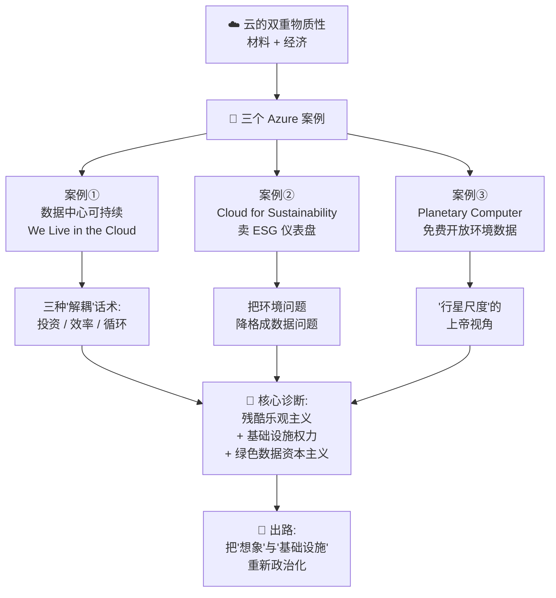
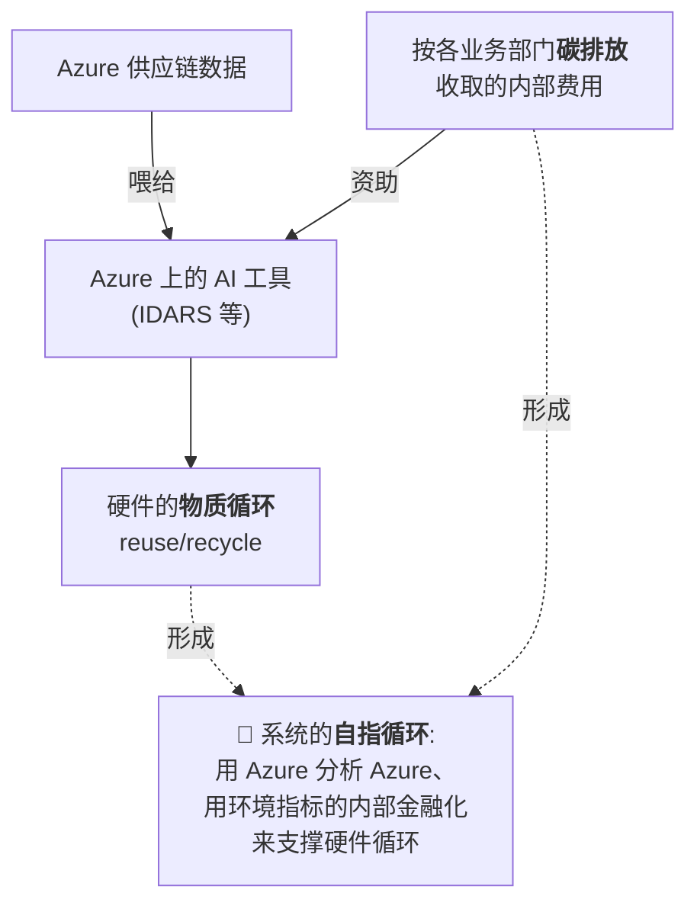
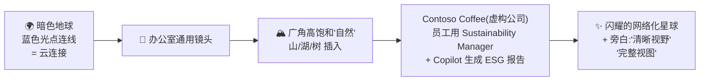
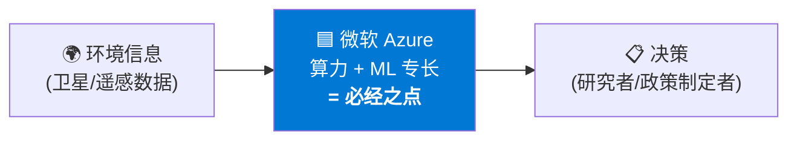
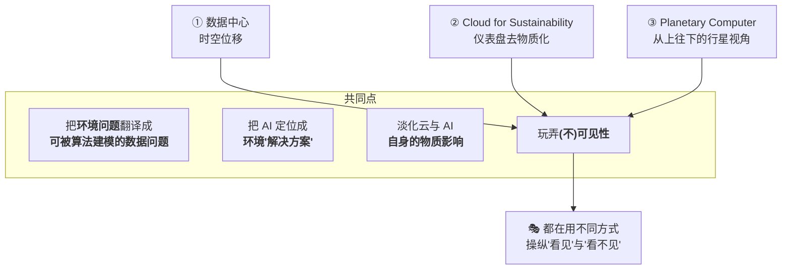
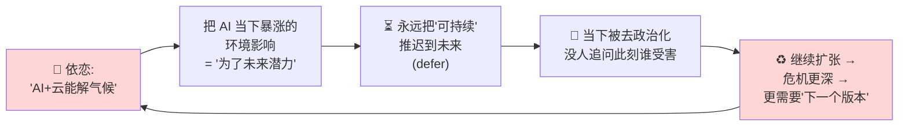

# 第 7 章 · 可持续云的「残酷乐观主义」 ☁️💔

> 精讲对应原书：**Chapter 7 — "The Cruel Optimism of the Sustainable Cloud: Fantasies and Futures of Microsoft Azure"**,作者 Hamsini Sridharan(南加州大学 USC)。原书 pp. 160–182。
> 本章是全书第二部分 **"Promises, Economies, Discourses(承诺、经济、话语)"** 的开篇。

---

## 🗺️ 本章地图

这一章不是讲「怎么把数据中心变绿」的工程手册,而是一篇**批判性话语分析(critical discourse analysis)**。它盯着微软 Azure 的三个「可持续」项目,追问一个扎心的问题:

> **当"可持续"这个词撞上云基础设施(data center + AI)那副贪婪的物质身体(greedy materiality)时,它到底在承诺什么样的未来?又悄悄让哪些政治可能性消失了?**

作者的核心武器是文化理论家 **Lauren Berlant** 的概念 —— **「残酷乐观主义 / cruel optimism」**:你所依恋、所盼望的那个"美好未来",恰恰是阻碍你活好当下的障碍。放到云上,就是:*我们幻想"可持续云"能靠技术进步(尤其是 AI)把"无限增长的资本主义"和"气候危机下的当下与未来繁荣"和解 —— 而这个幻想本身,正在把我们推向危机更深处。*

本章阅读路线:

| 小节 | 你会学到什么 |
|---|---|
| 1️⃣ 云为什么不是"无形的" | 拆穿"云"这个隐喻;物质性的两层含义 |
| 2️⃣ 理论工具箱 | 基础设施转向、社会技术想象、残酷乐观主义、绿色资本主义 |
| 3️⃣ 案例① 数据中心 | 投资/效率/循环三种解耦话术,及其"位移"戏法 |
| 4️⃣ 案例② 卖可持续 | 仪表盘化、数据摩擦、自然的崇高、石油悖论 |
| 5️⃣ 案例③ 行星计算机 | 数据慈善、必经之点、"上帝视角"、全球北方偏斜 |
| 6️⃣ 总诊断 | 残酷乐观主义 × 基础设施权力 × 绿色数据资本主义 |
| 7️⃣ 面试/研究视角 | 如何把这套批判用在你的技术工作里 |

> 💡 **给工程师读者的一句话**:你平时读的是"PUE 降到 1.1"这种指标;这一章教你反过来问 —— *"这个指标把什么东西挡在了视线之外?谁替谁承担了代价?"* 这是一种**技术素养的升级**,不是反技术。

---

## 1️⃣ "云"是个骗人的隐喻:relentlessly material ☁️→🏭

### 是什么

原文开门见山:

> *"The cloud has become a near-ubiquitous feature of computing, a seemingly **immaterial, infinite condensation of data** ... However, this metaphor is deceptive: cloud computing is **relentlessly material** in both the environmental and economic senses (Hu, 2015; Monserrate, 2022)."*
> ——「云已成为计算无处不在的特征,一团看似无形、无限的数据凝结……但这个隐喻是骗人的:云计算在环境与经济两个意义上都是**冷酷地物质化的**。」

"云 cloud"这个词让你以为数据飘在天上、无重量、无边界、免费无限。**实际上**,它落地就是:

> *"the construction of **data centers** reliant on **voracious energy consumption**, **water** extracted to cool servers, and copious **waste**."*

- 🏭 **数据中心**:实体建筑
- ⚡ **贪婪的能耗**:voracious energy
- 💧 **水**:抽来给服务器降温
- 🗑️ **废弃物**:大量电子垃圾

### 为什么这个隐喻重要 —— 物质性的两层含义

作者强调云是 "material in both the **environmental** and **economic** senses",这是本章的钥匙:

| 物质性 | 含义 | 本章怎么用 |
|---|---|---|
| **环境物质性** environmental | 电、水、土地、碳、电子废物 —— 真实的自然资源消耗 | 案例中被"位移(displace)"和"抽象(abstract)"掉的东西 |
| **经济物质性** economic | 云是资本积累的机器,受"短期利润 vs 长期气候风险"张力驱动 | 解释了为什么大厂"既要绿又要涨" |

> ⚠️ **常见坑**:很多技术讨论只承认"环境物质性"(承认云耗电),却不承认"经济物质性"(不承认可持续叙事是资本积累的一部分)。本章的锋利之处正在于把两者绑在一起看。

### 张力的来源:短期利润 vs 未来利润

> *"...major cloud service providers such as Amazon Web Services, Microsoft Azure, and Google Cloud negotiate between **short-term profit** and **climate change's threats to future profitability**. This tension has grown even more acute with the recent advent of **compute-intensive generative AI**."*

生成式 AI(compute-intensive generative AI)让这个张力**更尖锐**了:模型越大越耗算力、越耗水电,而这些公司又必须继续增长。可持续项目,就是它们**调和"经济"与"环境"这对矛盾**的方式。

> 🔬 **核心论证(第一环)**:企业可持续(corporate sustainability)不是慈善,而是**green capitalism(绿色资本主义)**的产物 —— 它的根在 1980 年代的 **"生态现代化 / ecological modernization"** 话语:相信可以靠技术把"环境影响"和"资源消耗"从"经济增长"里**解耦(decouple)**,相信"绿色增长 / green growth"(Hajer 1997;Tienhaara 2014)。
>
> 这套话语的官方定义来自 **布伦特兰委员会(Brundtland Commission)** 1987 年《我们共同的未来》,把"可持续发展"定义为:*"满足当代人的需要,又不损害后代满足其需要的能力"* —— 关键是它把**技术创新**摆成了"维持经济增长"的手段。**微软在公司资料里直接引用了这个定义(Microsoft, n.d.-c)。**

---

## 2️⃣ 理论工具箱:四把手术刀 🔧

在进入案例前,先备齐作者用来解剖的四个概念。别跳过 —— 它们是这一章"为什么能这么说"的地基。

### 工具 A:基础设施转向(the infrastructural turn)与「(不)可见性」

作者站在人类学与 STS(科学技术研究)的"基础设施转向"上。核心张力是:

- **一派(Star, Edwards)**:基础设施的定义性特征是"不可见"—— 它中介了我们与环境的关系,然后消失在背景里(比如你从不想电网,除非停电)。
- **Larkin(2013)**:不可见只是**一种**可能状态;政治行动者常常反过来把基础设施**做成奇观**、故意让你看见(比如宏伟的水坝、酷炫的数据中心 3D 导览)。

> 🔑 关注**"谁在操纵可见与不可见"**,就能读出基础设施里藏的东西 —— 这引出工具 B。

### 工具 B:社会技术想象(sociotechnical imaginaries)

引 **Jasanoff & Kim (2015)** 的定义(必背):

> *"collectively held, institutionally stabilized, and publicly performed **visions of desirable futures**"*
> ——「被集体持有、被制度稳固、被公开展演的**关于理想未来的愿景**」

- **Larkin**:基础设施"从欲望与幻想中诞生,又把欲望与幻想存储于自身之内"。
- **Appel et al. (2018)**:基础设施包含**承诺(promises)**,这些承诺同时揭示"抱负与失败、供给与遗弃、技术进步及其阴暗面"。

> 💡 **一句话记忆**:基础设施 = 凝固成钢筋水泥的"未来愿景"。你分析一段可持续营销文案,就是在**逆向工程**它想让你相信的那个未来。

### 工具 C:残酷乐观主义(cruel optimism)— 本章书名的来源

引 **Lauren Berlant (2011)**。虽然原文没给整段定义,但作者反复用它下判断。你需要理解它的机制:

> **残酷乐观主义**:当你对某个对象/愿景的**依恋(attachment)**,恰恰是**阻碍你实现它本身所许诺的那种繁荣**的东西时,这种乐观就是"残酷的"。

放到本章:

| 你依恋的对象 | 它许诺给你的 | 为什么是"残酷"的 |
|---|---|---|
| "可持续云 / AI 拯救气候"的幻想 | 技术进步能让"无限增长"与"气候安全"共存 | 正是这份依恋,让我们**继续扩张**云基础设施、**推迟**真正的政治变革,反而把危机推深 |

原文的定性句(务必记住这句,它是全章论点浓缩):

> *"...the **'cruel optimism'** (Berlant, 2011) of the fantasy that through technological progress, sustainable cloud infrastructure can reconcile **endless economic growth** with **present and future flourishing** in the shadow of the climate crisis."*

### 工具 D:基础设施权力 & 绿色数据资本主义

- **基础设施权力(infrastructural power)**(Khalili 2018;Luitse 2024):不是靠命令,而是靠**"你离不开我"**来行使的权力 —— 微软通过让 Azure 成为"可持续的基础设施"来施加它。
- **绿色数据资本主义(green data capitalism)**(Wiessner et al. 2026):把 **green capitalism(绿色资本主义)** + **data capitalism(数据资本主义)** 焊在一起 —— 人与非人在网络系统里留下的"痕迹"被变成"绿色企业"可估值的数据。

这四把刀备齐,进入案例。

> 🔬 **核心论证(总纲)** — 作者在导言就把结论亮明了,值得整段抄下逐句拆:
>
> > *"Microsoft's sustainability efforts, I argue, are **more than a marketing strategy**; the company's faith in the ability of technology, and especially AI, to reconcile capitalism with environmentalism **depoliticizes the present** in favor of a 'sustainable future,' exposing a kind of 'infrastructural power' ... that materially shapes the politics of cloud infrastructure under ... 'green data capitalism'."*
>
> **逐句拆:**
> 1. "**more than a marketing strategy**" —— 别只把它当洗绿(greenwashing)。它比营销**更深**:它真的在物质上塑造云基础设施怎么建、建在哪。
> 2. "faith in ... AI ... to reconcile capitalism with environmentalism" —— 信仰:AI 能把"资本主义"和"环保"和解。
> 3. "**depoliticizes the present** in favor of a 'sustainable future'" —— 代价:用一个"可持续未来"的许诺,**把当下去政治化**(让你不去追问当下谁在受害)。
> 4. "**infrastructural power** ... green data capitalism" —— 这是一种基础设施权力,运行在绿色数据资本主义逻辑下。

---

## 3️⃣ 案例① 数据中心:投资 / 效率 / 循环 —— 解耦三话术 🏭

**素材来源**:微软 2021 年 4 月上线的 3D 交互微网站 **《We Live in the Cloud》**(Microsoft Story Labs, 2021),邀请你"探索数据中心隐藏的世界"。落地页是一座**悬浮在天上的柱子**,顶上矮楼、太阳能板阵列、风机、绿植,云朵飘过屏幕。点 *Enter The Lobby* 后依次进入:大堂 → 运营室 → 机械区 → 服务器机房 → **循环中心(Circular Center)** → 网络机房 → **创新室(Innovation Room)**。

> 🔬 **核心论证**:微软对"自己的可持续"依赖三种**经济逻辑**来把"业务增长"和"资源消耗"**解耦**——**投资(investment)、效率(efficiency)、循环(circularity)**。这些逻辑并非中性,它们**在时间和空间上位移(displace)**了环境影响,同时**在物质上塑造并扩张**了云。AI 在此被定位成"优化资源的工具",而非"消耗资源的负担"。

下面逐一拆。

### 3.1 投资(investment):把影响"记账"化 —— fungible mediation

> *"Financial logics suffuse Microsoft's sustainability efforts, displacing its environmental impact."*

引 **Pasek (2019)** 的关键概念 **「可替代性中介 / fungible mediation」**:微软把"数据中心选址、碳抵消、可再生能源采购"

> *"translate[s] local relations into **generic commodities** that can be bought and sold at a distance, **obfuscating the question of accountability** in favor of the formal logics of accounting"*
> ——「把在地关系翻译成可远距离买卖的**通用商品**,用会计的形式逻辑**遮蔽了问责问题**」

**水的例子最典型**:微软在虚拟导览里强调对"水的获取与补充(replenishment)"的**"投资"**。2023 年白皮书用 **Volumetric Water Benefit Accounting(容积水效益核算)** 标准量化其"水管理(water stewardship)",宣传遍布全球(从 Fargo 到 Cape Town)的 **49 个补水项目"组合(portfolio)"**。

**戏法在哪?**

- **时间位移**:现在用,以后补(usage now, replenishment later)。
- **空间位移**:这里用,那里抵(usage here, offset there)。

> ⚠️ **抵消(offset)的政治代价** —— 引 Brain & Lavigne (2024),这段很重:
> > *"...offsetting structures provide ways for **wealthy corporations from the Global North** to continue their operations, dodge emissions reductions, and **push the burden of change ... onto the already-marginalized communities** least responsible for the crisis."*
>
> 碳抵消被包装成"支持自然保护",但很多保护实践导致了**原住民社区被剥夺与驱离(dispossession and displacement)**。而"市场的抽象"还带来 **"重复计算(double counting)与腐败的合规实践"**。

### 3.2 效率(efficiency):Adiabatic cooling 与"现代 vs 非现代"话术

导览用"效率"作为**省水的解耦策略**。一篇博文问:

> *"how can we continue to **conserve water** while meeting **growing customer demand** for cloud and AI innovation?"*(Walsh, 2024)

——注意这句话的结构:它**预设了增长必须继续**,只在"如何一边省水一边扩张"里打转。微软的回答:审计找低效点 + "先进预测模型"预判用水需求。

**机械区**的卡片解释 **Adiabatic cooling(绝热冷却)**:

> *"a highly efficient **closed-loop** method of temperature control that uses **evaporation and outside air** to reduce energy usage and water consumption compared to traditional air cooling."*

配套信息图把"现代"冷却 vs "非现代"(如更耗电耗水的机械冷却)对立起来 —— **这正是"生态现代化"话语的教科书表演**:现代 = 高效 = 绿色。

> ⚠️ **作者抓到的破绽**:同一张信息图里的**分区冷却地图**显示,**最耗资源的冷却方式仍然铺在每个大陆的大片区域上**。所谓"按气候优化(optimized by climate)、最小化/最大化利用资源",掩盖了"资源密集型方法还在广泛使用"这一事实。

**额外一招:热能再利用 —— infrastructural convergence(基础设施汇聚)**。数据中心产生的热被"管道输送到区域供暖网络,帮本地社区达成气候目标"(如芬兰的数据中心)。作者引 **Velkova (2016)** 称之为 **"infrastructural convergence"** —— 废热变成一种可交易的"计算流量商品"。听起来很美,但它同样服务于"让扩张显得正当"。

### 3.3 循环(circularity):零废弃、IDARS、与"自指的循环"

**Circular Center(循环中心)** 体现"零废弃(zero waste)"目标:退役硬件在这里被处置。微软搞了个 **"反向供应链模型(reverse supply chain model)"**:

> *"before an asset is even introduced to Microsoft's supply chain, each part or component already has an **optimized disposition plan**."*

**IDARS(Intelligent Disposition and Routing System,智能处置与路由系统)** 用机器学习对资产分类、优化路线、给出每个部件的处置指令(Borkar, 2022)。被判定"有价值"的处理器、内存被"收割(harvested)"内部复用,其余捐给学校或再利用。

> ⚠️ **数字的诚实之处**:微软目标是**复用或回收 90%** 硬件 —— 但**仍有 10% 作为废弃物丢掉**,而且**数据中心的硬件需求还在增长**。90% 听着很绿,但分母(总量)在猛涨,10% 的绝对值一样在涨。

**最精妙的一层 —— "自指的循环(self-referential circularity)"**:

原文:

> *"The material circularity of hardware is thus supported by a **self-referential circularity of the system**, which analyzes Azure supply chain data using **Azure-based AI tools** and **internal financialization of environmental metrics**."*

**读法**:微软用自己的云(Azure)分析自己的供应链,用自己的 AI 优化循环,用"给各部门按碳排放收内部费"这种**把环境指标金融化**的方式来给系统买单。整个循环**自我闭合、自我指涉** —— 它既是硬件的循环,也是把 Azure 变成"不可或缺"的循环。

### 3.4 全局话术,局部代价:亚利桑那的水与太阳能

> *"...Microsoft's decoupling strategies **disparately impact local environments**..."*

引 **Edwards et al. (2024)**:大科技公司搞自己的"气候控制"—— *"通过弯折不同的叙事与想象来适应当地条件,以便上演下一阶段的扩张"*。

**亚利桑那 El Mirage / Goodyear 的例子(全章最锋利的一段实证)**:

| 微软说的 | 后来被揭出的真相 |
|---|---|
| 2019:新数据中心"由 **100% 可再生能源**供电",阳光充沛"是投资太阳能的理想地点" | 2021 澄清:太阳能厂用 **可再生能源证书(REC)** 来**抵消**用电,**并非直接供电**给数据中心(Walsh, 2021) |
| 用"室外空气冷却"、气温低于 **85°F(约 29°C)** 时不用水 | Hao (2024a) 指出:该地区气温**经常超过 85°F**;即便用低耗水法,微软估算该中心**每年约用 5600 万加仑水**;且**公司不公布实际用量** |
| 宣传其对保护 **Lake Mead(米德湖)** 的"投资"(附近的补水项目之一) | 该 Goodyear 园区**位于缺水地区**,却被设计用来托管生成式 AI 巨兽 **OpenAI**(微软是主要投资方) |

> 💡 **实战洞察**:REC(可再生能源证书)和"实际用绿电"是两回事。前者是一种**会计手段**(在别处买了证书),后者是**物理事实**(这台服务器此刻的电子来自太阳能)。当你看到"100% renewable"时,请务必追问:*是 physical supply 还是 REC/offset?* —— 这几乎是整章"位移"逻辑的技术缩影。

### 3.5 案例①小结:把生态变成经济,再把 AI 变成优化器

> *"...rendering environmental impact **fungible and optimizable**, displacing it across **time** (usage now, replenishment later) and **space** (usage here offset there ...)."*

引 **Hogan (2018)** 的 **"Big Data Ecologies(大数据生态)"**:一种新自由主义逻辑,相信

> *"nature will maintain an equilibrium that can be restored if disrupted through both **calculable and mappable market-driven** assessments and interventions."*

这种**资产负债表式(balance-sheet)**的做法"经济化了环境",让"继续扩张云"显得可能、甚至可欲。

> ⚠️ **本节最关键的反讽(务必记)** —— 就在这套"解耦/更少资源做更多事"的叙事之下,微软**最新可持续报告显示**:
> - **整体碳排放较 2020 年增长 +29.1%**(很可能因生成式 AI 激增)
> - **水消耗增长 +87%**(Microsoft, 2024b)
>
> 「云生态变成云经济;AI 成了优化资源的工具,而非耗竭资源的元凶」—— 而数字证明,现实恰恰相反。**这就是"残酷乐观主义"的物质证据:越是相信技术能解耦,资源消耗越是暴涨。**

---

## 4️⃣ 案例② Cloud for Sustainability:把可持续商品化 📊

**素材来源**:微软 **Cloud for Sustainability** 营销网站与概览视频。

> 🔬 **核心论证**:除了自家可持续,微软还**卖**可持续产品。营销材料把生成式 AI 与预测模型塞进**去语境化的环境仪表盘**,兜售"消灭数据摩擦"的承诺和一种**"被数据化的自然崇高(datafied natural sublime)"**。由此,Azure 把自己变成**跨行业(包括最破坏环境的行业)的、被商业化的"可持续基础设施"**,托举着企业们永远"在路上、却永不抵达"的**"可持续之旅(sustainability journeys)"**。

### 4.1 产品是什么

Cloud for Sustainability 让客户用 Azure 来:
- 用"数据智能"标准化环境监测,做 **ESG(环境、社会、治理)报告**;
- 提升 IT 基础设施效率;
- 降低环境影响。

具体"解决方案(solutions)"包括 **Sustainability Manager(可持续管理器)** 和 **Emissions Impact Dashboard(排放影响仪表盘)**,并**重点集成生成式 AI 聊天机器人 Copilot**。

### 4.2 视频的美学:自然崇高 + 云崇高

概览视频的镜头语言值得逐帧读(作者做的就是这件事):

- 旁白说:*"organizations are aiming to be more sustainable ... the **complexity of this data** often **slows progress**."* —— 把"可持续"的障碍,悄悄定义成"**数据太复杂**"。
- 结尾承诺给你对"可持续足迹(sustainability footprint)"的 **"clear line of sight(清晰视野)"** 和 **"complete view(完整视图)"**。

> 🔑 **关键的话语转换**:
> > *"Problems of environmental impact are **recast as problems of data** to which Azure is the 'solution'."*
>
> 环境影响问题 → 被**重新框定为数据问题** → 而 Azure 就是"解决方案"。自然资源消耗被**转化(transfigure)**成挂靠 ESG 标准、被仪表盘干净可视化的数据分析。

### 4.3 数据摩擦(data frictions)与"仪表盘化"的政治

这一节的理论最密集,分三层:

**① 数据摩擦(Pasek et al. 2023,承 Edwards 2013)**:算碳足迹充满"data frictions(数据摩擦)"—— 数据脏、口径不一、要做很多政治性的选择。微软的卖点是**"streamlining(流线化)"**,把摩擦抹掉。

> ⚠️ 但作者指出:*streamlining strips away this friction **while concealing the political choices** made in doing so.* —— 抹平摩擦的同时,**隐藏了做这些选择时的政治性**(比如:哪些排放算进来?边界画在哪?)。

**② 仪表盘会"括除"不可测量的东西(Mattern 2015)**:

> *"...in dashboards, 'whatever is not readily operationalizable or measurable is simply **bracketed out**' while the included data, shorn of its politics, becomes 'representable, contextualizable, and intelligible,' resulting in a **'sterilized quasi-transparency'**."*

- **bracketed out(被括除)**:测不了的,直接不显示 —— 于是它在"完整视图"里等于不存在。
- **sterilized quasi-transparency(消毒后的准透明)**:看起来透明,其实是被消过毒、剥了政治的假透明。

**③ 投机性(speculative)**:Sustainability Manager 提供 AI 的 **"what-if analysis(假设分析)"**,预测"业务实践改变对碳排放的影响"—— 未来还没发生,就先在仪表盘上演练"解耦"。

> 🔬 **核心论证**:*"'data governance' ... becomes the modality of **environmental governance**."* —— 当"把杂乱数据变得标准化、集中化、可视化、可报告"成了目的,**数据治理就替代了环境治理**。你治理的是数据,不是环境。

### 4.4 双重崇高:自然崇高 × 云崇高

作者把两种"崇高(sublime)"叠在一起:

| 崇高 | 出处 | 含义 |
|---|---|---|
| **自然崇高** natural sublime | 视频里广角山湖 | 人类小到消失在壮丽自然里 —— 暗示自然"未被触碰"或"对人类影响免疫" |
| **云崇高** cloud sublime | Mosco (2014) | "曾寄托于宗教与自然的'普遍知识、虚拟世界、无限沟通'的承诺,如今由数字技术支撑" |

两者并置,兜售一个愿景:**通过去根的(deracinated)数据分析、可视化和 AI,超越企业那些'太人类'的环境影响**。—— 即:用崇高的美学,把物质代价升华掉。

### 4.5 石油悖论:谁在买这些"可持续方案"? 🛢️

**全章最有杀伤力的一击**。Cloud for Sustainability 网站有面向各行业的营销页:汽车、能源、金融、制造、零售、楼宇管理。能源页写:*"Connectivity and renewables are here to stay"*,并引 **McKinsey** 估计:"先进连接性"到 2030 年能给**石油天然气行业带来 2500 亿美元价值**。

> **矛盾(the contradiction)赤裸裸地浮现:**
> - 一方面:微软工具能"驱动能源转型、帮企业减排";
> - 另一方面:它帮**石油天然气公司(包括 Chevron、ExxonMobil)**从"云优化的钻探"里榨取更多价值。

引 **Hao (2024b)** 的原话,精准到刺耳:

> *"There is the tension. On the one hand, AI may be able to help reduce drilling's toll on the environment. On the other hand, **it's used for drilling**."*

> ⚠️ **公司内部的撕裂**:多年来,一个员工主导的可持续小组一直呼吁微软**停止**用专门的云计算和 AI 工具支持石油公司;而微软辩称它在"帮这些公司提效、转向可再生能源"(Hao, 2024b)。

**结论句**:

> *"...it sells a vision of a 'sustainable future' that **masks the rampant unsustainability of the present**."*
> ——「它兜售一个'可持续未来'的愿景,**掩盖了当下猖獗的不可持续**。」

---

## 5️⃣ 案例③ Planetary Computer:免费开放数据的"礼物" 🌐

**素材来源**:微软 2020 年推出的 **Planetary Computer(行星计算机)**,承 AI for Earth 计划而来,为环境研究/保护组织提供"大规模托管数据 + 分享 ML 工具"的中央平台。主页标题 *"A Planetary Computer for a Sustainable Future"*,极简美学:高饱和卫星图 + Data Catalog / API / Applications 三个入口。

> 🔬 **核心论证**:微软把 Planetary Computer 定位成"全球环境知识生产与管理的**仁慈云基础设施(benevolent cloud infrastructure)**",承诺**巨大尺度**的数据、算力、算法建模,并通过"开放数据经济"免费提供。由此,它在**基础设施层面强化了一种抽象的"行星想象(planetary imaginary)"** —— 一种依赖遥感与制图、由 AI 中介的环境主义。

### 5.1 "信息化的环境主义":把气候危机降格成"数据不够"

2019 年视频里,时任首席环境官 **Lucas Joppa** 站在一个"开向翠绿树林的超现实黄色小屋"里,抛出一句核心台词:

> *"...at its core, AI is just an **algorithm that solves for an objective function**. It solves a problem. And the biggest problem we need to solve right now is how we, as humans, **can continue to grow and prosper without destroying the very ecosystems** that we all depend on."*

作者点破:这种提问方式反映了 **"环境主义的信息化(informating of environmentalism)"**(Fortun 2004;Gabrys 2016)—— **把气候危机翻译成"收集更多数据"的问题**,再进一步,翻译成"一个等 AI 来解的问题"。

> 💡 **给工程师的警觉**:"AI 只是一个求解目标函数的算法" —— 这句话技术上没错,但它是一种**修辞策略**:它把"如何在不毁灭生态的前提下继续增长"设成**目标函数**,于是"是否应该继续增长"这个**政治问题**,被偷换成一个**优化问题**。当政治问题被写成 loss function,谁来定义 loss,谁就赢了。

### 5.2 承诺:尺度(scale)与效率(efficiency)

- **尺度**:网站反复强调 **"petabytes(拍字节)"** 级的"全球环境数据",算力经由 Azure 提供。
- **效率**:Data Catalog 强调数据"以一致、**分析就绪(analysis-ready)**的格式"提供(暗示"数据准备工作已经替你做好了"),API"让用户轻松找到所需数据"。文档说它让用户"利用云的力量加速环境可持续与地球科学"。

> **和案例②同构**:它也是在"减少 data friction(数据摩擦)"—— 或至少"看起来在减少"。而与此同时,**大规模数据与计算本身的物质环境影响,又一次被淡化(deemphasized)**。

### 5.3 "免费"与"开放"的话术:data philanthropy(数据慈善)

> *"The discourse of 'freeness' and 'openness' is **premised on the assumption that data and tools are, by default, proprietary and costly** — implying that the Planetary Computer is a **gift** to environmentalism."*

引两个关键概念:

| 概念 | 出处 | 含义 |
|---|---|---|
| **数据慈善** data philanthropy | Aronczyk & Espinoza (2022) | 靠"共享价值(shared value)"哲学,最终**同样维系了科技公司以数据为中心的商业模式** |
| **必经之点** obligatory passage point | Callon (1984),经 Lukacz (2024) | 微软的算力基础设施与 ML 专长,被"数据策展实践"摆成了**"信息"与"决策"之间的必经关卡** |

**双面性**:一面,Planetary Computer 确实是对环境研究的仁慈贡献;另一面,它**把 Azure 定位成那项工作"必需的云基础设施"**。免费,是让你上钩、并让你离不开的最好方式。

### 5.4 "上帝视角":谁的"行星"? —— the god trick 👁️

作者对 100+ 个数据集做了盘点,发现两个偏斜:

1. **绝大多数是遥感数据(尤其卫星)** —— 字面意义上生产一种"地外的行星视角(extraterrestrial planetary view)",几乎都服务于用 AI 做全球制图与建模。
2. **非全球范围的数据集,几乎全部聚焦北美,尤以美国为主**;全球卫星数据大量来自 **NASA(Landsat)** 或欧洲的 **Copernicus(Sentinel)**。

引 **Lin (2024)**:环境制图数据严重**偏向"全球北方(Global North)"** —— *这暗示着,究竟"谁的从上往下的视角"被当成了"行星的(planetary)"视角。*

引 **Haraway (1988)** 的 **"the god trick(上帝把戏)"** 与 **"view from above(从上往下的视角)"**:

> 一种把**特定的白人、西方、男性中心**的观看方式,伪装成**普遍、客观、无处不在**的"上帝视角"。

> 🔬 **核心论证**:"行星尺度"听起来包容全球,实则**用一种被特定地缘政治塑造的'从上往下'的看法,冒充了普遍性**。它决定了"环境危机长什么样、该怎么解",而这个决定权握在少数北方机构手里。

Joppa 视频结尾把这一切推向高潮:

> *"...the objective function for human species on Earth is to **minimize our environmental impacts while maximizing the overall global human experience**. And ... **technology can take us the rest of the way. The future is ours to decide.**"*

作者一针见血:"maximizing the overall global human experience" **大概就是"经济繁荣与业务增长"的代号**。—— 这就是微软想让"我们"选择的未来。

---

## 6️⃣ 总诊断:残酷乐观主义 × 基础设施权力 × 绿色数据资本主义 🧨

最后一节 **"The Cruel Optimism of the Cloudy Future"** 把三个案例拧成一股绳。

### 6.1 三案例的统一结构

| 案例 | 解耦/操纵手法 | 玩(不)可见性的方式 |
|---|---|---|
| ① 数据中心 | 投资 / 效率 / 循环 | 资源消耗与补充的**时空位移** |
| ② Cloud for Sustainability | 仪表盘标准化、去语境化 | 把环境影响**去物质化**成"数据化的自然崇高",给你"清晰视野" |
| ③ Planetary Computer | 免费开放、行星尺度 | 行星计算的**"从上往下"视角** |

### 6.2 "solutionism(解决方案主义)"为何危险

作者承认微软的投入"数额巨大、很可能出自真诚的员工"—— 但引入两个精准诊断:

- **企业可持续伦理(Archer 2024)** = "真诚想解决问题" + **"相信只有市场化方案能解决"** 的混合体。
- **环境解决方案主义(Lennon 2024)**:一种"情感技术(affective technique)",既让公司增长利润、确立市场niche,也**让员工得以扮演一种'人道主义身份'** —— 但它**把环境问题本身去政治化了**。

引 **Parikka (2011)** 的判词:这类生态投资**不改变积累的根本逻辑**,所以

> *"the **discourse of sustainability on its own is unsustainable**."*
> ——「可持续的话语,其本身就是不可持续的。」

> 🔑 **超越洗绿(beyond greenwashing)**:作者反复强调,这**不只是**虚假营销那么简单。新自由主义的可持续想象**"限制了想象力,并在物质上塑造了云基础设施,封杀了计算与环境的其他可能安排(foreclosing other possible arrangements)"**。这是本章和普通"批评大厂洗绿"文章的**根本区别**。

### 6.3 "默认诉诸技术"与当下的去政治化

引 **Hong (2020)** 的 **"default to technology(默认诉诸技术)"**:一种心态,要求你接受资本主义式的榨取,同时把希望寄托在

> *"the **next version, the next project, the next invention**."*

于是:

> *"faith in technology's ability to reconcile capitalism with environmentalism **depoliticizes the present** in favor of a 'sustainable future.' Discourses of this future rely on **temporal and spatial displacement**, commoditized 'journeys,' and speculative visions to **perpetually defer sustainability**."*

**这就是残酷乐观主义的完整机制**:

引 **Gupta (2018)**:基础设施是"未来愿景的具体实例化",它"通过一种**预期政治(politics of anticipation)** 塑造当下"。—— 你为一个想象中的未来而建的东西,反过来锁死了你的现在。

### 6.4 基础设施权力 + 绿色数据资本主义:权力如何落地

**Luitse (2024)** 说云服务商通过三招行使基础设施权力:**服务的垂直整合、互补式创新、技术复杂性的抽象**。作者补一招:微软通过**把 Azure 变成"被数据化的可持续基础设施"**(为自己、为各行业客户、为环境知识生产)来行使权力。

这落进 **Wiessner et al. (2026)** 的 **"绿色数据资本主义"**:

- **绿色资本主义**(以技术+经济增长为中心的抱负)
- **+ 数据资本主义**(West 2019:"我们数据的商品化实现了权力的再分配",权力**偏向那些有能力接触并解读数据的行动者**)

三处**权力不对称(asymmetries of power)**:

| 不对称 | 体现 |
|---|---|
| 全球 vs 在地 | 微软伸进/横跨其数据中心影响的**在地社区与生态** |
| 减排 vs 助纣 | 把可持续工具**卖给石油天然气**等破坏环境的行业去"提效" |
| 全球北方 vs 南方 | 聚合遥感数据与环境制图工具**偏斜向全球北方** |

### 6.5 出路:把"想象"与"基础设施"重新政治化 🌱

作者不止于批判,末尾给出**替代想象**的方向 —— 全是"反问句",逼你想象另一种云:

> - 用 **place-based accountability(基于地方的问责)** 取代"可替代性、位移、抽象"(Pasek 2019),会是什么样?
> - 扎根于 **relational ways of being(关系性的存在与认知方式)**,而不是把能测量/可视化/金融化的东西从景观里抽出来、把其余的隐藏或丢弃(Mattern 2015;Pasek et al. 2023)?
> - **承认数据化与 AI 所产知识的极限**,而不是无限加深对技术的依赖(Hong 2020)?

**全章的收尾号召:**

> *"We must **(re)politicize the relationship between imagination and infrastructure** to confront **what is actually sustained** in 'sustainable' cloud infrastructure."*
> ——「我们必须**把'想象'与'基础设施'的关系重新政治化**,才能直面'可持续'云基础设施里**真正被维系下来的到底是什么**。」

> 💡 **一句话点题**:"sustainable cloud" 里,被 sustain(维系)的往往不是地球,而是**无限增长的资本积累本身**。

---

## 7️⃣ 面试 / 研究 / 工程实践视角 🎓

### 7.1 面试高频:如何把这套批判说得专业

> **💡 面试高频**:当被问"你怎么看数据中心/大模型的可持续性?"——不要只背 PUE、液冷、REC 指标,可以这样加一层:

1. **区分 physical supply vs offset/REC**:"100% renewable"常是证书抵消而非物理供电(见 Arizona 案例)。这是判断一个可持续声明**含金量**的第一刀。
2. **警惕"解耦(decoupling)"叙事**:效率提升不等于总量下降 —— 微软自己的报告里碳 +29.1%、水 +87%,正是"Jevons 悖论"式反弹的实证。
3. **追问"位移"**:代价是被搬到了**未来**(先用后补)还是**别处**(此地用、彼地抵)?谁在承担?
4. **识别"问题被降格成数据问题"**:当"要不要增长"这种政治问题被写成"目标函数/what-if 仪表盘",要问**谁定义了 loss、谁被 bracket out 了**。

### 7.2 给工程师的可操作清单 ✅

即便你不做人文研究,这一章能直接改进你的技术判断:

| 当你看到… | 请追问… |
|---|---|
| "100% renewable / carbon neutral" | 是 physical PPA/直供,还是 REC/offset 会计?边界(scope 1/2/3)画到哪? |
| "AI 优化,降低 X% 能耗/水耗" | 分母(总规模)在涨吗?绝对量是升是降? |
| "零废弃 / 90% 回收" | 剩下 10% 的绝对吨数随规模在涨吗? |
| "免费/开放数据平台" | 它把谁摆成了"信息→决策"之间的**必经之点**?锁定效应在哪? |
| "行星尺度 / 全球视图" | 数据覆盖有没有 Global North 偏斜?谁的视角被当成"普遍"? |
| "可持续之旅 sustainability journey" | 终点是否被**永久推迟**到"下一个版本"? |

### 7.3 与全书/全书第二部分的接口 🔗

- 本章是第二部分 **"Promises, Economies, Discourses"** 的**范式样章**:它示范了如何用**话语分析**读一个技术产品的营销材料。
- 紧随其后的**第 8 章 "Narratives of Indispensability and Infrastructural Solutionism of AI Companies"**(Laaksonen & Frig)把"不可或缺性叙事"与"基础设施解决方案主义"扩展到更多 AI 公司 —— 本章的"必经之点""solutionism"正是它的引子。
- 与工程向章节的关系:工程章告诉你**"云如何变绿"(how)**,本章告诉你**"'变绿'这个叙事替谁服务、遮蔽了谁"(for whom / at whose cost)**。二者互补,缺一不可。

---

## 📌 小结

1. **"云"是骗人的隐喻**:它 relentlessly material —— 环境上(电/水/地/碳/废物)+ 经济上(资本积累机器)。生成式 AI 让"短期利润 vs 未来气候风险"的张力空前尖锐。
2. **企业可持续 = 绿色资本主义**,根在 1980s 的"生态现代化"与布伦特兰"可持续发展"定义 —— 核心信念是**用技术把环境影响从经济增长里"解耦"**。
3. **三个 Azure 案例,同一套逻辑**:
   - ① **数据中心**:投资/效率/循环三话术,把影响做**时空位移**;"自指的循环"把 Azure 变得不可或缺。铁证:碳 +29.1%、水 +87%。
   - ② **Cloud for Sustainability**:把环境问题**降格成数据问题**,用仪表盘制造"消毒后的准透明",把可持续商品化;**石油悖论**戳穿"卖可持续给最不可持续的行业"。
   - ③ **Planetary Computer**:以"免费开放"行**数据慈善**,把 Azure 设为信息与决策之间的**"必经之点"**;"行星尺度"实为偏向全球北方的**"上帝视角"**。
4. **总诊断三合一**:
   - **残酷乐观主义(Berlant)**:对"AI+云拯救气候"的依恋,恰恰让我们推迟变革、加深危机。
   - **基础设施权力(Khalili/Luitse)**:靠"你离不开我"来统治,物质性地塑造云怎么建。
   - **绿色数据资本主义(Wiessner et al.)**:绿色资本主义 + 数据资本主义,权力偏向能解读数据者。
5. **超越洗绿**:这套想象不只是虚假营销,它**限制想象力、封杀"计算与环境的其他可能安排"**。
6. **出路**:用**基于地方的问责**、**关系性认知**、**承认技术知识的极限**,来**把"想象"与"基础设施"重新政治化** —— 追问"可持续云"里**真正被维系的是什么**。

> 🔬 **一句话记住全章**:在 "sustainable cloud" 里,被 sustain 的常常不是地球,而是**无限增长本身** —— 而支撑这一切的,是一份**残酷的乐观**:越相信技术能解耦,资源消耗越暴涨。

---

## 🔗 延伸阅读

**理论基石(建议按此顺序读)**
- **Berlant, L. (2011).** *Cruel Optimism.* Duke University Press. —— 本章书名与核心判词来源。
- **Jasanoff, S., & Kim, S.-H. (Eds.). (2015).** *Dreamscapes of Modernity: Sociotechnical Imaginaries.* —— "社会技术想象"的定义。
- **Larkin, B. (2013).** "The politics and poetics of infrastructure." *Annual Review of Anthropology.* —— 基础设施的(不)可见性与奇观。
- **Haraway, D. (1988).** "Situated Knowledges." *Feminist Studies.* —— "上帝把戏 / view from above"。

**云与数据中心的物质性(工程读者尤其看这组)**
- **Monserrate, S. G. (2022).** "The Cloud is Material." *MIT Case Studies.* —— 最好的入门,直接讲云的物理代价。
- **Hu, T.-H. (2015).** *A Prehistory of the Cloud.* MIT Press.
- **Pasek, A. (2019).** "Managing carbon and data flows: Fungible forms of mediation in the cloud." —— "可替代性中介"、位移逻辑。
- **Velkova, J. (2016).** "Data that warms." —— 废热与"基础设施汇聚"。

**可持续话语的批判**
- **Hogan, M. (2018).** "Big Data Ecologies." *Ephemera.* —— "大数据生态"与新自由主义平衡逻辑。
- **Archer, M. (2024).** *Unsustainable: Measurement, Reporting, and the Limits of Corporate Sustainability.* NYU Press.
- **Hong, S. (2020).** *Technologies of Speculation.* NYU Press. —— "默认诉诸技术"。
- **Parikka, J. (2011).** *Medianatures.* —— "可持续话语本身不可持续"。

**记者调查(读起来最解渴的实证)**
- **Hao, K. (2024a).** "AI Is Taking Water From the Desert." *The Atlantic.* —— 亚利桑那缺水地建数据中心。
- **Hao, K. (2024b).** "Microsoft's Hypocrisy on AI." *The Atlantic.* —— 微软一边卖可持续、一边助力石油钻探。

**一手企业材料(自己去读营销文案、练"话语分析"手感)**
- Microsoft Story Labs (2021). *We Live in the Cloud* 3D 微网站。
- Microsoft (2020a). *A Planetary Computer for a Sustainable Future.*
- Microsoft (2024b). *2024 Environmental Sustainability Report*(去核对碳 +29.1%、水 +87% 这两个数)。
