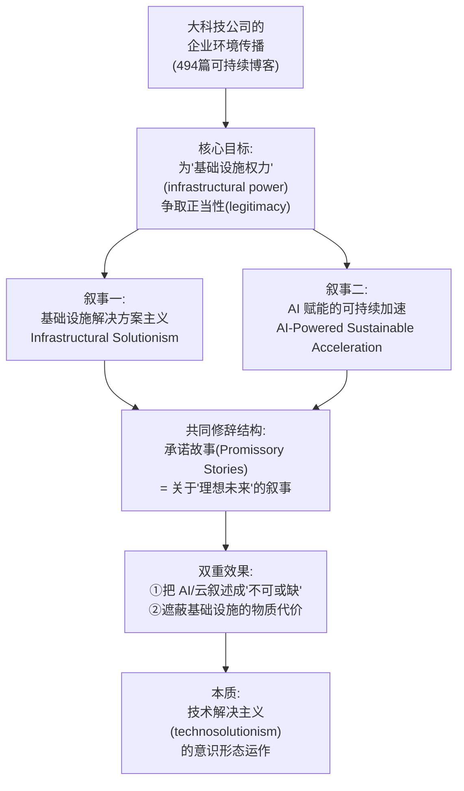
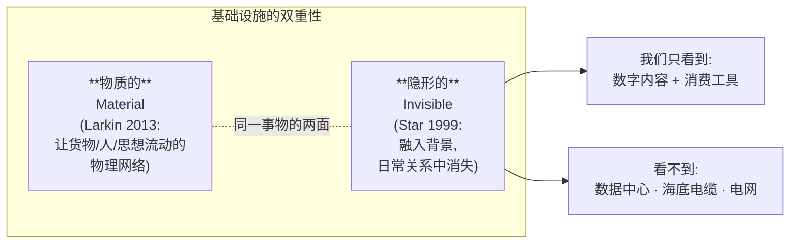
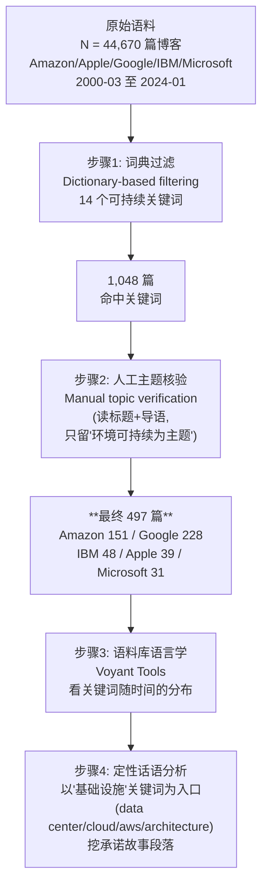
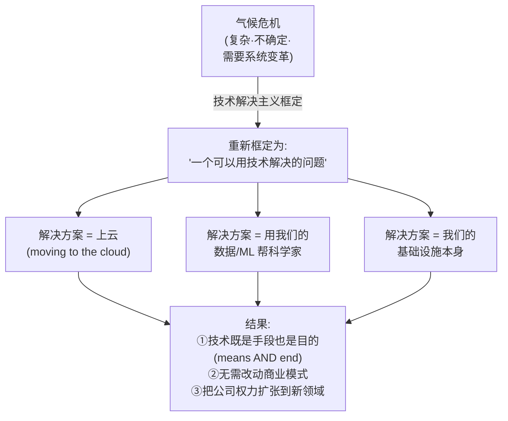
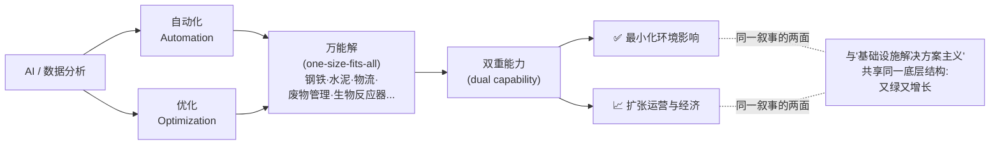
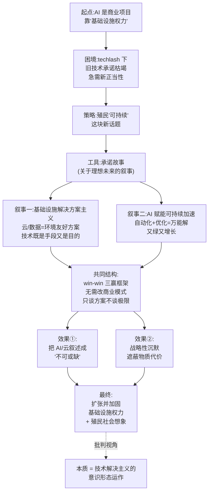

# 第 8 章 · 不可或缺叙事与基础设施解决方案主义 🏗️🌍

> 原书章节：**Chapter 8 — Narratives of Indispensability and Infrastructural Solutionism of AI Companies**
> 作者：Salla-Maaria Laaksonen（赫尔辛基大学）& Meri Frig（赫尔辛基大学 / 阿尔托大学）
> 对应 PDF 页码：183–206
> 章节定位：全书第二部分「Promises, Economies, Discourses（承诺·经济·话语）」的核心批判章

---

## 🗺️ 本章地图

这一章是全书里最"文科"、也是最锋利的一章。它不讲芯片、不讲水电，而是解剖**大科技公司如何用"话语（discourse）"把自己塑造成"拯救地球所必需的存在"**。作者抓取了 Amazon、Apple、Google、IBM、Microsoft 五家巨头 24 年（2000–2024）的 **44,670 篇企业博客**，过滤出 497 篇谈可持续发展的文章，用语料库语言学（corpus linguistics）+ 话语分析，拆穿了两套核心叙事：



读完你会掌握 5 个可迁移的分析工具：**承诺故事（promissory stories）、技术解决主义（technosolutionism）、基础设施权力（infrastructural power）、企业环境传播（corporate environmental communication）、语料库辅助话语分析（corpus-assisted discourse analysis）**。

| 你将学到 | 一句话 |
|---|---|
| 什么是"不可或缺叙事" | 公司把自己讲成"没有我地球就完了"的必需品 |
| 什么是"基础设施解决方案主义" | 把"上云 / 用 AI"包装成解决气候危机的方案 |
| 为什么这是意识形态批判 | 它服务于权力扩张，同时系统性隐藏物质代价 |
| 方法论怎么做 | 44,670→497 篇博客的语料库过滤 + 话语分析 |
| 对做 AI-Infra 的人意味什么 | 你写的每份"绿色数据中心"文案都可能是这套叙事的一环 |

---

## 1️⃣ 开场：Google 的一次"出柜"时刻

本章用一个真实事件开场，非常精彩，值得逐句吃透。

> 📖 **原书抄录（p.183）**
> "In summer 2024, Google reported that their energy consumption had risen 50% during the past five years due to the increasing demand caused by AI development, training, and use. The company admitted that this might hinder their goal of reaching net zero emissions by 2030, particularly with 'the uncertainty around the future environmental impact of AI, which is complex and difficult to predict' (Google, 2024, p. 31)."

**逐句拆解**：

1. **"能耗过去五年涨了 50%"** —— 这是硬数据，罕见地由公司自己说出。
2. **"这可能妨碍我们 2030 净零排放的目标"** —— 承认了 AI 与减排目标的**冲突**。
3. **"AI 未来的环境影响复杂且难以预测"** —— 用"不确定性"给自己开脱。

作者称这是一次**"coming out（出柜）"时刻**：这是**首批**由商业主体自己把"环境担忧"和"AI 使用增长"放在一起说的公开时刻。为什么珍贵？因为在此之前，关于数字技术的讨论**几乎清一色**是乐观的：

> 📖 "discussions on digital technology typically come with techno-optimistic and digital solutionist frames suggesting that technology can help in solving the world's biggest challenges, including the climate crisis"（p.183）

翻译：数字技术的主流叙事框架（frame）是**技术乐观主义 + 数字解决方案主义**，暗示"技术能解决世界最大的挑战，包括气候危机"。

> 🔬 **核心论证 · 为什么开场要用 Google 这个反例？**
> 因为这个"出柜"事件是全章的**参照系**：它证明了"AI 有环境代价"这件事连巨头自己都被迫承认。那么问题来了——**如果代价真实存在，为什么 24 年的企业博客里几乎看不到它？** 整章就是在回答：因为公司用"承诺故事"系统性地把代价藏了起来，只讲光鲜的解决方案。Google 2024 的坦白，反而衬托出此前的沉默是"策略性"的。

作者随即摆出与乐观叙事对立的**学术事实**（这些是本书前几章的主题）：

| 环境代价维度 | 关键文献（原书引用） | 数字 |
|---|---|---|
| 高能耗、高水耗 | Freitag et al., 2021; Pasek et al., 2023 | — |
| 生成式 AI 的巨大成本 | Crawford, 2024; Li et al., 2023 | — |
| 数据中心是排放主体 | World Bank & ITU, 2024 | **2020→2022 排放 +45%** |

---

## 2️⃣ 立论核心：AI 首先是一个"商业项目"，靠的是"基础设施权力"

这是本章的第一性命题，务必记牢。

> 📖 **原书抄录（p.183）**
> "AI is first and foremost a business project that relies on infrastructural power. Development of AI is largely controlled by big tech companies, who have already accumulated significant societal power as providers of global information and communication infrastructures."

### 什么是"基础设施权力（infrastructural power）"？

- **是什么**：不是靠某个爆款产品，而是靠**掌控底层管道**——云、搜索、广告、消息、内容分发——获得的、渗透进整个社会运转的结构性权力。
- **为什么关键**：Amazon、Google、Microsoft 不只是卖服务，它们**提供了让别人网店能开、火车能跑、数据能存的地基**。一旦成为地基，你就"太大而不能倒"，也"太深而看不见"。

> 📖 "some of the companies—most notably Amazon, Google, and Microsoft—also play a more profoundly infrastructural role in the data economy: They provide databases and computing infrastructure that keep our online shops working, trains running..."（p.184）

### 基础设施的两个悖论属性：既物质又隐形

作者借经典基础设施研究（infrastructure studies）指出一个矛盾——



> 📖 **两句必背的定义（p.185）**
> - Larkin (2013)：infrastructures are material and physical networks that "facilitate the flow of goods, people, or ideas and allow for their exchange over space"（基础设施是"促进货物、人或思想流动、并允许其跨空间交换"的物质与物理网络）。
> - Star (1999)：基础设施"become invisible in our everyday relations and assimilate into the background"（在日常关系中变得隐形，融入背景）。

**关键推论**：正因为基础设施天然隐形，公司的**话语**就成了让它"重新可见 / 或继续隐形"的战场。作者引 Parks & Starosielski (2015)：媒介基础设施是"material forms as well as discursive constructions"（既是物质形态，也是话语建构）。

> 🔬 **核心论证 · AI 是"话语项目"**
> 本章最关键的一步转身：既然基础设施是被"想象、塑造、再塑造、并在话语中被赋予意义"的（imagined, shaped, reshaped and made to matter in discourse），那么 **AI 不只是商业项目，更是一个"话语项目（discursive project）"**——通过企业博客、政策文件、公司规划等社会建构来维系和想象。所以研究企业"怎么说"，就是研究权力"怎么被生产"。

---

## 3️⃣ 理论工具箱：承诺故事（Promissory Stories）

这是全章的**核心分析概念**，来自经济社会学家 Jens Beckert。

### 定义与机制

> 📖 **原书抄录（p.184）**
> "Promissory stories are narratives about desired futures that political and economic leaders, such as corporations, rely on to gain legitimacy and mobilize stakeholders (Beckert, 2020)."

**承诺故事 = 关于"理想未来（desired futures）"的叙事**，政治与经济领袖（比如公司）靠它来：
1. **获取正当性（gain legitimacy）**
2. **动员利益相关者（mobilize stakeholders）**

| 维度 | 内容 | 原书出处 |
|---|---|---|
| **威力来源** | 靠**叙事的说服力**，而非对未来的真知（"persuasive power of the narratives rather than any clear foreknowledge of the future"） | Beckert, 2020, p.319 |
| **承载物** | "interests, hopes, fantasies, and social norms"（利益、希望、幻想、社会规范） | p.187 |
| **作用方式** | **表演性（performative）**：不只是描述未来，而是**塑造**当下与未来的行动 | Nyberg & Wright, 2016 |
| **约束效应** | 公开的气候目标是一种"commissive（承诺言语行为）"，把组织**绑定**到某条行动路径上 | Christensen et al., 2021, p.411 |

> 📖 **Jasanoff (2015) 的名言（p.186，原书大段引用）**
> "Multinational corporations increasingly act upon imagined understandings of how the world is and ought to be, playing upon the perceived hopes and fears of their customers and clients and thereby propagating notions of technological progress and benefit that cut across."

翻译：跨国公司越来越**依据"世界应该是什么样"的想象**来行动，**利用客户的希望与恐惧**，从而传播"技术进步与益处"的观念。

### 承诺故事为什么对公司特别好用？

因为它能**帮人们暂时忽略未来的不确定性（overlook uncertainty）**——在气候危机这种极度不确定的语境里，谁能把"混乱的未来"讲成"确定的光明"，谁就掌握了话语主动权。

> 💡 **实战 · 承诺故事 vs. 洗绿（greenwashing）的区别**
> 别把两者划等号。洗绿强调"虚假、误导"；承诺故事更中性但更深刻——它**不一定说谎**，但它"persuade rather than inform（意在说服而非告知）"，因此**"can hide more than explain（隐藏的比解释的多）"**（p.188）。它的核心不是骗，而是**选择性地建构一个让你愿意相信、并跟着行动的未来**。这也是为什么它比洗绿更难被拆穿。

---

## 4️⃣ 企业环境传播（Corporate Environmental Communication）的三副面孔

作者花大篇幅（p.187–188）分析公司谈环境的"话语实践"有哪些**功能**。整理成一张表：

| 面孔 | 做什么 | 潜台词 |
|---|---|---|
| 😇 **理想主义者（aspirational talk）** | "抱负性言说"能激发行动、带来正向社会变化（Christensen et al., 2013） | 说了就可能真做（表演性的乐观面） |
| 🎭 **表演者（performative）** | 不只描述，还塑造现在与未来的场景与行动 | 说本身就是一种"做"（colonize the future，殖民未来） |
| 🃏 **挑食者（cherry-picking）** | 突出环境成绩，**隐藏或淡化**复杂、有争议的话题（Tuan et al., 2024） | 报喜不报忧 |

而"win–win 生态技术框架（win–win eco-technological frames）"是企业环境传播的招牌套路：

> 📖 "win–win eco-technological frames that emphasize how certain management decisions and ideas benefit business, the planet, and society simultaneously, are prominent in corporate environmental communication"（p.187）

即：**一个决定同时对生意好、对地球好、对社会好**。这个"三赢"框架是后面两大叙事的修辞底座。

> ⚠️ **常见坑 · 把"公司说的"当成"公司做的"**
> 作者明确警告（p.188）："corporate environmental communication cannot be equated to their environmental action（企业环境传播不能等同于其环境行动）。" AI 基础设施恰恰是最紧张的一环：它**既是**公司权力与商业承诺的**主干**，**又是**承载环境后果（土地、水、能源、原材料）的**元凶**。所以公司在谈它时，天然有强烈动机"报喜不报忧"。

---

## 5️⃣ 方法论：44,670 → 497 的漏斗（值得每个做数据分析的人学）

这一节（Materials and Methods, p.188–190）是全章方法示范，做 AI-Infra 的工程师尤其能看懂其"数据管线"思维。



### 14 个过滤关键词（原书 p.188–189 抄录）

```
"climate change", "sustainable", "renewable energy", "emissions",
"greenhouse gas", "recycle", "recycling", "sustainability",
"corporate social responsibility", "water usage", "workers",
"waste", "sdg", "green"
```

### 为什么选"企业博客"当研究对象？

> 📖 "Corporate blogs are a form of promotional corporate communication and thus biased towards a positive tone... they do not facilitate dialogue or offer space for criticism. However, they are less formal than corporate annual reporting."（p.189）

| 博客的特性 | 对研究的意义 |
|---|---|
| 促销性、正面基调 | 正好暴露公司**想让你看到的自我形象** |
| 不容许对话/批评 | 是**单向宣传**的纯净样本 |
| 比年报/官方声明更随意 | 更能捕捉"话语策略"而非法务措辞 |
| 由公司名或高管署名、经公关编辑 | 内容**受控**，代表公司立场 |

> 💡 **实战 · 这套"词典过滤 + 人工核验 + 语料库可视化 + 定性精读"是内容审计的通用管线**
> 无论你是做舆情监控、合规审计还是竞品文案分析，这个四步漏斗都能直接复用：先用关键词把海量文本降到千级，再人工确认降到百级，然后用工具（如 Voyant / 现在可以用 LLM）看宏观分布，最后人工精读挖机制。**降维顺序：机器粗筛 → 人工精筛 → 机器看全局 → 人工看深度。**

---

## 6️⃣ 发现总览：24 年语料告诉我们什么

在拆两大叙事之前，作者先给了几个宏观趋势（Findings, p.190–193）：

| 趋势 | 细节 |
|---|---|
| **起步晚** | 最早的环保博客：Apple（2005）、Google（2006）；2016 前总量很低 |
| **2021 大爆发** | 环境相关博文数量猛涨；B2B 导向的 Amazon 与 IBM **直到 2021** 才开始谈环境 |
| **Google 最能说** | 2016 年起稳定输出，是语料里最"话痨"的公司 |
| **数据中心是主角** | 数据中心能耗方案是贯穿全程的焦点，**"data center" 共 499 次提及** |
| **AI 一词 2018 才出现** | 2018 年 3 月首次出现"AI"；此前用 machine learning / deep learning 等具体词 |
| **可再生能源被当作"已解决"** | 关键词分析显示：可再生能源问题被视为"solved"（很可能靠碳抵消 carbon offsetting），焦点转向 AI 机会 |
| **只谈排放，不谈物质** | 环境议题几乎只从"能耗导致的排放"切入，水、原材料等物质维度**几乎无人提** |

> 📖 **一个刺眼的观察（p.192）**
> "Strikingly, in the blog posts, there was no questioning of the increasing energy demand and intensification of digital activities, no question about reduction or limits—just a promissory story of digital technology that allows us to get all new shiny things without abandoning anything."

翻译：**刺眼的是，博客里从不质疑能耗增长与数字活动扩张，从不谈"减少"或"极限"——只有一个承诺故事：数字技术让我们拥有一切闪亮新东西，却什么都不用放弃。**

### 关键词修辞样本（原书抄录）

作者列了几段极具代表性的原文，我们逐条点评：

> 📖 Apple（2017）："With 17 megawatts of rooftop solar, Apple Park will run one of the largest on-site solar energy installations in the world."
> 👉 **技术崇高（technological sublime）**：把办公楼渲染成技术成就，用"最大之一"的规模感制造敬畏。

> 📖 Amazon（2022 标题）："How immersive commerce can drive your sustainability goals while making your merch look fabulous"
> 👉 **消费不减反增**：可持续被绑到"让你的周边商品更好看"上——增长与可持续被强行焊在一起。

> 📖 Google（2018a）："Imagine a world of abundance—a world where products are infinitely recycled... an economy that is both profitable and stems depletion of raw materials. That's the world we want for all of us, and Google is working with the experts who are getting us there."
> 👉 **丰裕世界（world of abundance）**：这是本章标题灵感之一。核心话术是"既盈利、又不耗竭资源"，一个**不需要牺牲的乌托邦**，且 Google 是"带我们抵达"的那个人。

---

## 7️⃣ 叙事一：基础设施解决方案主义（Infrastructural Solutionism）🔧

这是本章的第一根支柱概念，务必吃透。

### 定义：把"数据与计算基础设施"话语建构成"对环境友好的解决方案"

> 📖 **原书核心定义（p.194）**
> "These posts propagate infrastructural solutionism: data and computing infrastructures were discursively constructed as environmentally friendly solutions. The companies frequently depict how their technologies and infrastructure help other actors to be more sustainable, often accompanied with data-based arguments showing the scale of energy or cost savings achieved by, for example, moving 'to the cloud'."

它是 **technosolutionism（技术解决主义，Morozov 2014）** 的一个**基础设施变体**。技术解决主义的经典定义是：把复杂的社会/政治问题重新框定为**有整洁技术方案的问题**——而在这里，公司自家的**基础设施本身**就是那个方案。



### 技术解决主义的标志：技术**既是手段又是目的**

> 📖 "technologies that they offer are presented as both a means and an end, as typical to technosolutionism (e.g., Morozov, 2014)"（p.193）

- **手段**：用云/AI 去解决气候问题（工具属性）。
- **目的**：气候问题的存在本身，成了"你更该多用云/AI"的理由（自我正当化）。

这就形成了一个**闭环**：问题越大 → 越需要我的技术 → 我的技术越正当 → 我越能扩张。

### 原书三段样本，逐段解剖

> 📖 **样本 1 · Google（2019a）"循环的 Google"**
> "Our vision is simple: we want a circular Google within a sustainable world. The challenges... demand that we redefine how systems work—from what we value and the choices we make, to the assumptions and industrial processes that have been standard practice across our economy for decades."
> 🔍 表面在讲"循环经济"的宏大变革，实则把**全经济体的重新设计**都收拢到"Google 愿景"之下——公司成了系统变革的**主语和主角**。

> 📖 **样本 2 · Microsoft（2014）"云计算的力量"**
> "We have an amazing opportunity in front of us to tap into the culture of innovation and the power of cloud computing, devices and our partner ecosystem to enable a transition to a new way of thinking and interacting with our planet's resources."
> 🔍 **用"技术魔法"对冲气候的不确定性**——气候带来的不确定，被"云计算 + 设备 + 伙伴生态"的确定性叙事所收编（confronted with certainty）。

> 📖 **样本 3 · IBM（2023a）"帮客户也变可持续"**
> "the talented people of IBM are using our cutting-edge technologies, including hybrid cloud and AI, to keep transforming not only our own operations for increased sustainability, but also the operations of our clients and partners."
> 🔍 **可持续的"传染性权力"**：不只自己绿，还带着客户和伙伴一起绿——基础设施的影响力借"可持续"之名渗透到各行各业。

### 两个更隐蔽的正当化机制

1. **让基础设施成为"知识生产"的必需品**（p.195）
   公司宣称：智能数据基础设施帮气候科学家、可持续专家做研究——把自己塑造成**知识生产的地基**。作者引 Beer (2017) 的"数据分析想象（data analytics imaginary）"：它被描绘成 **panoramic, prophetic, revealing and smart（全景的、先知的、揭示的、聪明的）**。
   > 📖 Google（2018b）："Positive environmental impact is possible if we give people access to information... we hope Google can provide a platform for our users to change the world."
   > 👉 潜台词：**"只要有信息（而信息在我手里），世界就能变好。"** 这恰好完美契合 Google 卖搜索/数据的既有商业承诺。

2. **与"已经可持续的行动者"绑定，借来权威**（p.195）
   > 📖 "these stories legitimize the infrastructures by tying them together with actors and practices that are already sustainable, thus building authority for the companies."

> 🔬 **核心论证 · 最致命的一句话**
> 作者点破（p.195）："The innovations described, however, were mostly applications based on the existing systems, **with no requirement to rethink the business model**." 所谓的绿色创新，绝大多数只是**在既有系统上加应用**，**完全不需要重新思考商业模式**。它反而**加固**了公司的基础设施权力——把它们的基础设施变成了"让各方做出环保选择的基础设施"。绿色叙事 = 权力扩张的润滑剂。

---

## 8️⃣ 叙事二：AI 赋能的可持续加速（AI-Powered Sustainable Acceleration）🚀

当"AI"一词在 2018 年进入语料，它**无缝接入并扩展**了上面那套解决主义故事。

### 核心动词群：AI "helps, powers, empowers, improves, and accelerates"

> 📖 **原书（p.196）**
> "AI—typically used without explaining further what kind of AI—was touted as a means to improve efficiency and productivity, which are tightly woven with sustainability. AI helps, powers, empowers, improves, and accelerates. Consequently, the solutionist discourses became characterized with an overarching logic of progression and growth."

**注意两个关键**：
1. **"什么样的 AI"从不解释**（used without explaining further what kind of AI）——AI 是个**空洞的能指（empty signifier）**，谁都能往里塞想要的意义。
2. 叙事被赋予了**"进步与增长的总体逻辑"**——未来路径 = 由数字基础设施驱动的"可持续加速"。

### 两个被反复推销的 AI 过程：自动化 + 优化

> 📖 "The corporate discourse highlighted two key processes allowed and enhanced by data analytics and AI technologies: **automation and optimization**. These processes were presented as the **one-size-fits-all solution** across industries: be it bioreactors, steel and cement production, delivering parcels, or waste management."（p.196）



**这是全章最精妙的批判点**：自动化与优化被讲成能**同时**"最小化环境影响"和"扩张运营与经济"——**又绿又增长**，与叙事一的"双重能力"如出一辙。

### AI 甚至能"让 AI 自己变可持续"

这是叙事二最狡猾的一步：AI 的可持续问题**几乎从不被提及**，反而被讲成"AI 通过提升数据中心/电网效率，让基础设施自己变绿"。

> 📖 **样本 · Google（2019）**
> "Thanks to advances in artificial intelligence and chip design, our data centers are seven times more energy efficient today than they were five years ago."
> 🔍 用"7 倍能效"这种数字，把 AI 的**净环境负担**问题，偷换成 AI 的**局部效率**成就。

> 📖 **样本 · IBM（2023c）智能电网**
> "Smart grid technology... promises to modernize the traditional electrical system with an infusion of digital intelligence that helps energy providers transition to clean energy and reduce carbon emissions."

> ⚠️ **常见坑 · 效率 ≠ 总量下降（杰文斯悖论 Jevons Paradox）**
> "我们数据中心能效提升 7 倍"听着很绿，但这是**单位能效（efficiency per unit）**，不等于**总能耗（total consumption）**下降。回到开场：Google 自己承认总能耗五年涨了 50%。效率提升往往**诱导更多使用**，总量反而上升——这就是杰文斯悖论。企业叙事系统性地用"局部效率"掩盖"总量膨胀"。本章作者虽未点名杰文斯，但整个"从不谈 reduction or limits"的观察，正是这个悖论的话语症候。

### 为什么这套故事"人人爱听"？

> 📖 **原书神总结（p.197）**
> "They are stories that many stakeholders want to hear, as they give the permission to keep pursuing existing goals and plans **without radical changes** while still being sustainable."

翻译：这些是**大家都想听的故事**，因为它们给了你一张**"无需激进改变、照旧前进、还能自称可持续"的许可证**。正因人人爱听，它们**极可能成为可信的承诺故事**——而可信的承诺故事是**表演性**的：它为"增加 AI 采用"提供了正当理由。

---

## 9️⃣ 结论：技术公司如何"殖民"可持续这块新领地

结论部分（p.197–200）把两大叙事收束成一个**权力批判**，句句是重点。

### 核心命题：把 AI/云叙述成"不可或缺（indispensable）"

> 📖 **原书（p.198）**
> "digital infrastructure companies discursively built the relationship between their technologies and sustainability transition by **framing digital infrastructures and AI as indispensable tools needed to strive towards greener societies**."

这就是章标题"**Narratives of Indispensability（不可或缺叙事）**"的落点：通过话语，把"数字基础设施 + AI"框定成**通往绿色社会所不可或缺的工具**。

### "殖民（colonize）"这个动词的两层含义

作者用了两次"colonize"，非常关键：

| 殖民对象 | 原文 | 含义 |
|---|---|---|
| **殖民"可持续"这块新话题** | "the technology companies colonize the novel area of rising public concern, sustainability, to bolster the power of their infrastructures"（p.198） | 哪里有公众关切上升，就去占领哪里，为基础设施权力续命 |
| **殖民"未来"** | "colonize the future through acting upon particular conceptualizations of climate change"（Nyberg & Wright 2016, p.198–199） | 用特定的气候观来行动，从而占据"社会想象（social imagination）"的空间 |

### 为什么公司"需要"这套叙事？—— techlash（科技反噬）语境

> 🔬 **核心论证 · 承诺故事的"接力"逻辑**
> 作者的洞见（p.198）：在 **techlash（科技反噬）** 与"要求科技公司负责"的浪潮中，行业**急需新的正当性来源**。此前的"技术承诺"已经**exhaustion（枯竭）**了（Beckert 2020：批评意味着技术承诺的耗尽）。而**可持续正是一块可以攫取的新鲜土壤**——因为几乎所有人都在为达成气候目标挣扎，而科技公司是少数**看似**能"提供可信预测和行动路径"的行动者。于是：**旧承诺（更快更强的技术）枯竭 → 换上新承诺（拯救地球的技术）**。承诺故事完成了一次接力续命。

### 最锋利的批判：战略性沉默

> 📖 **原书（p.198–199）**
> "the technology companies remain, perhaps strategically, silent about the materiality of their infrastructures and the related immediate environmental consequences: constantly and rapidly expanding digital consumption and the natural resources it needs."

**基础设施本可以"在传播中被物质化、被看见"（Cooren 2018），但企业传播恰恰反其道而行——作为一种"遮蔽物质性"的手段。**

三条压轴结论：

1. **没有任何一家公司提出需要"根本改变商业模式"的方案**（"None of the companies propose solutions that require fundamental shifts to their business models"）——只做**增量创新（incremental innovations）**，并用"共同责任（joint responsibility）"把视线从**自己的运营与影响**上引开。

2. **公司被塑造成"社会不可或缺"的专家权威**（Géring et al., 2023：future-oriented discourse presents them as "socially indispensable"），从而**在当下正当化行动、在未来主张社会重要性**，去**填满社会想象的空间**（Mager & Katzenbach, 2021）。

3. **信任的悖论**：Edelman 信任报告（2024）显示人们**最信任企业**把创新整合进社会、引领更好未来；但作者反问——**公司到底有多真诚地关心伦理发展，是个悬而未决的问题**。而 AI/云行业的**极度不透明（profoundly opaque, Brevini 2020）**，让人根本无从评判。

### 一个点名批评：OpenAI

> 📖 **原书结尾（p.200）**
> "some global players do not communicate about their environmental impact and goals at all—including the generative AI company OpenAI. Currently, with accelerating interest in AI, the environmental cost of this hype has not reached the overarching attention it requires."

作者点名：连"披上绿色外衣"都懒得做的公司也有——**生成式 AI 巨头 OpenAI 干脆完全不谈环境影响与目标**。在 AI 热潮加速的当下，这场炒作的**环境代价**还远未获得它应得的关注。

---

## 🔟 全章逻辑总图



---

## 💡 面试 / 讨论高频问题

| 问题 | 要点答法 |
|---|---|
| **什么是"技术解决主义（technosolutionism）"？** | Morozov (2014) 提出：把复杂的社会/政治问题**重新框定为有整洁技术方案的问题**。本章的"基础设施解决主义"是其变体——公司**自家的基础设施**就是那个"方案"，技术**既是手段又是目的**。 |
| **"承诺故事"和"洗绿"有何不同？** | 洗绿强调虚假误导；承诺故事更深刻——**不一定说谎**，但意在**说服而非告知**，靠叙事说服力（而非真知）建构正当性、动员利益相关者。它"隐藏的比解释的多"。 |
| **为什么说这是"意识形态批判"？** | 因为叙事**服务于权力**：它把 AI/云塑造成"不可或缺"，同时**系统性隐藏物质代价**（水、能源、原材料），且**从不要求改变商业模式**——用"拯救地球"之名行"扩张地基"之实。 |
| **为什么效率提升不能证明可持续？** | 杰文斯悖论：**单位能效上升 ≠ 总能耗下降**。Google 数据中心能效"7 倍"的同时，总能耗五年涨 50%。企业叙事用局部效率掩盖总量膨胀，从不谈"reduction or limits"。 |
| **这套研究方法能迁移到哪？** | "词典过滤 → 人工核验 → 语料库可视化 → 定性精读"的四步漏斗，可用于舆情审计、合规审查、竞品文案分析——**机器粗筛→人工精筛→机器看全局→人工看深度**。 |

---

## 📌 小结

- 🎯 **一句话主旨**：大科技公司通过 24 年的企业博客，用**承诺故事**把"数字基础设施 + AI"叙述成**通往绿色社会不可或缺的工具**，借此为**基础设施权力**争取正当性，同时**战略性地沉默**于其真实的物质环境代价。
- 🔧 **两大叙事**：
  1. **基础设施解决方案主义** —— 云/数据被建构成环境友好方案，技术既是手段又是目的，无需改商业模式。
  2. **AI 赋能的可持续加速** —— 自动化 + 优化被讲成万能解，"又绿又增长"，AI 甚至能"让 AI 自己变可持续"。
- 🧠 **核心批判**：这是 **technosolutionism（技术解决主义）** 的意识形态运作。在 techlash 语境下，旧技术承诺枯竭，公司**殖民"可持续"**这块新领地续命，把自己塑造成"社会不可或缺"的专家权威，填满社会想象空间。
- ⚠️ **必记警觉点**：①"说的"不等于"做的"；②效率提升不等于总量下降（杰文斯悖论）；③"共同责任"叙事把视线从公司自身运营引开；④连披绿外衣都省了的 OpenAI，环境代价至今被忽视。
- 🛠️ **可迁移方法**：44,670→497 的"词典过滤 + 人工核验 + 语料库分析 + 定性精读"内容审计管线。

> 🔬 **本章第一性原理一句话**：**当一个行动者把"解决某问题"包装成"更多使用它自己"，且从不接受"减少与极限"，那它兜售的就不是解决方案，而是正当性。**

---

## 🔗 延伸阅读与关联

| 类型 | 条目 | 与本章的关系 |
|---|---|---|
| 📖 本书内 | 第 7 章《The Cruel Optimism of the Sustainable Cloud》（Microsoft Azure） | 姊妹章：同样批判"可持续云"的幻想与承诺，可对照阅读 |
| 📖 本书内 | 第 1 章《Introduction: De-Centring AI》 | 提供"基础设施关系 / 多重可持续性"的总框架 |
| 📖 本书内 | 第 10 章（Yandex）、第 11 章（新闻媒体合作）、第 12 章（生态隐喻） | 同属"话语/承诺/经济"部分，都在拆企业与制度的叙事 |
| 📚 关键理论 | Beckert, J. (2020). *The exhausted futures of neoliberalism* | "承诺故事 / 正当性枯竭"的理论源头 |
| 📚 关键理论 | Morozov, E. (2014). *To Save Everything, Click Here* | "技术解决主义（technosolutionism）"的原始出处 |
| 📚 关键理论 | Larkin, B. (2013). *The politics and poetics of infrastructure* | "基础设施既物质又隐形"的经典定义 |
| 📚 关键理论 | Crawford, K. (2024). *Generative AI's environmental costs are soaring—and mostly secret* | 本章"物质代价"批判的实证支撑 |
| 🛠️ 方法工具 | Voyant Tools（Sinclair & Rockwell, 2016） | 本章用的语料库可视化工具，可上手复现 |
| 🔑 关键概念清单 | promissory stories · infrastructural power · technosolutionism · aspirational talk · win–win eco-technological frame · data analytics imaginary · techlash · colonizing the future | 本章 8 个可迁移的分析术语 |

---

*本讲义对应原书 pp.183–206（Chapter 8）。作者 Salla-Maaria Laaksonen & Meri Frig，University of Helsinki / Aalto University。所有原文引用均标注了原书页码与文献作者，供你回原文精读核对。*
