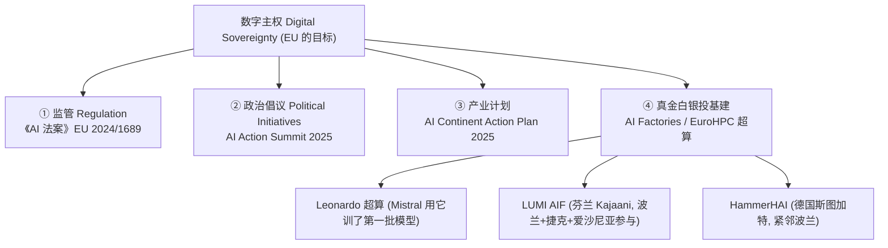
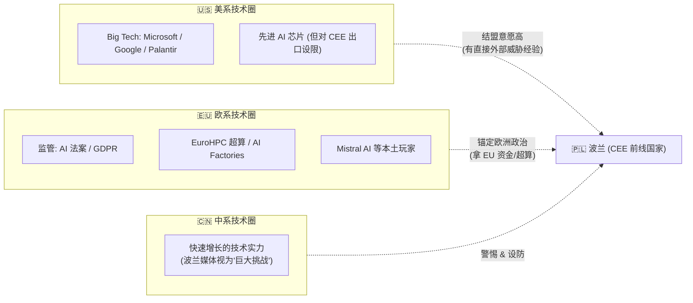
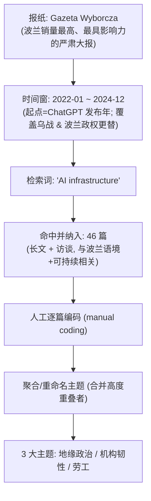
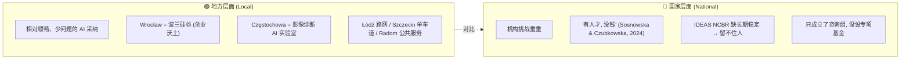
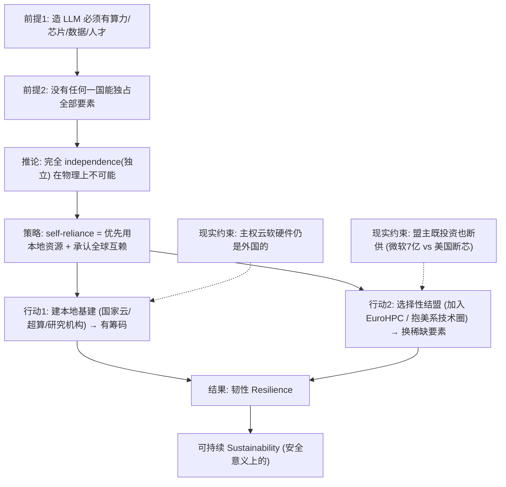

# 第 9 章 · 联盟还是自力更生：新地缘技术圈 🌍⚔️

> 原书章题：**Alliance or Self-Reliance in New Geopolitical Technospheres — AI Infrastructures in Poland**
> 作者：Małgorzata Winiarska-Brodowska（雅盖隆大学 / Jagiellonian University, Kraków, Poland）
> 对应 PDF 页码：207–230（正文 207–224，其后为参考文献）
> 关键词：AI 基础设施 · 可持续性 · 地缘政治（Geopolitics）· 中东欧（CEE）· 波兰

---

## 🗺️ 本章地图

这是一章「人文社科 + 传播学」的实证研究，不是工程手册，但对做 AI 基础设施（AI Infrastructure）的工程师、产品、战略人极其有用——它回答一个越来越绕不开的问题：

> **当算力（compute）、芯片、数据中心、模型都成了国家战略资产，你到底该"结盟"（Alliance）还是"自力更生"（Self-Reliance）？**

作者以**波兰**为透镜，用**主题分析法（Thematic Analysis, TA）**扒了波兰头号严肃大报《Gazeta Wyborcza》2022–2024 三年间 46 篇报道，提炼出三大主题：

1. 🪖 **地缘政治与波兰的挑战**（尤其是军事维度、乌克兰战争）
2. 🏗️ **创新、韧性基础设施与强有力的机构**
3. 👷 **劳工问题**（人才外流 / 低薪 / 数字福祉 / 隐形劳动）

本章讲透以下几件事，配 3 张 mermaid 图 + 多张对照表：

| 小节 | 你会学到 |
|---|---|
| §1 核心概念 | 什么是"技术圈 technosphere"、"技术主权 digital sovereignty"、"自力更生 self-reliance" |
| §2 三方博弈 | 美 / 中 / 欧三大 AI 势力，以及波兰的"选边"困境 |
| §3 可持续性的"国家化" | 为什么可持续不再是全球公共品，而是国家安全议题 |
| §4 方法论 | 传播学怎么做质性研究（TA vs QCA），工程人也该懂 |
| §5 三大主题精讲 | 地缘政治 / 机构韧性 / 劳工，逐条抄录原文引文并讲解 |
| §6 第一性原理 | "自力更生 ≠ 闭关锁国"的本质论证 |
| §7 对工程师/战略的启示 | 面试高频、实战判断、常见坑 |

> 🔬 **核心论证（本章一句话）**：作者反复强调——**self-reliance（自力更生）不是 independence（独立自主），而是 interdependence（互相依赖）**。真正的可持续 AI 基础设施战略，是"先用本地资源、同时承认全球复杂互赖、并主动结盟换取本地产不了的东西"。

---

## §1 先把三个"唬人"的概念讲成人话 🧩

这一章的门槛全在术语。把这三个词拆开，后面全通。

### 1.1 技术圈 / 技术领域（Technosphere / Technological Sphere）

**是什么**：书里引 Kissinger 等人（2024）说，欧洲面临一个选择——

> "Europe faces the choice of whether to act as an ally to one side or the other in **each major technological sphere** — shaping its course by establishing a special relationship — or as a **balancer** between sides." （Kissinger et al., 2024, p. 125）
>
> 译：欧洲要选择——在**每一个重大技术领域**里，是当某一方的**盟友**（建立特殊关系），还是当各方之间的**平衡者**。

**怎么理解**：把"技术圈"想成**技术上的势力范围**。冷战有军事阵营，今天有"技术阵营"：你用谁的云、谁的芯片、谁的模型、谁的标准，就等于站进了谁的技术圈。

- 用 AWS/Azure/OpenAI/Nvidia → 美系技术圈
- 用华为/阿里云/昇腾/DeepSeek → 中系技术圈
- 用 Mistral/EuroHPC/GAIA-X → 欧系技术圈

**代价**：站队意味着**依赖 + 被约束**（下文美国限制对波兰出口 AI 芯片就是活例子），但不站队又意味着**自己啥都得从头造**——这就是全章的核心张力。

### 1.2 数字主权 / 技术主权（Digital Sovereignty）

**是什么**：书里说欧盟（EU）在"championing digital sovereignty（力挺数字主权）"，引了三篇经典文献：Celeste (2021)、Floridi (2020)、Pohle & Thiel (2020)。

**人话定义**：**一个国家/地区能对本土的数据、算力、关键数字基础设施拥有实质控制权，而不是被外国公司/政府卡脖子。**

欧盟怎么落地数字主权？书里给了四条路径：

> 💡 **实战/面试高频**：数字主权最典型的落地就是**"训练底座"能不能自己掌握**。书里引 Mistral AI 高管的话，直击要害：
> > "The access to infrastructure is important, if you don't have this, **you cannot build large language models**. We could train the first ones on [the EU supercomputer] Leonardo. We were lucky enough not being blocked access to computing, but this will come for other companies. The volumes that are needed for AI are incredible." （Kroet, 2024, para. 4）
> >
> > 译：能不能拿到基础设施太关键了，没有它**你根本造不了大语言模型**。我们靠欧盟超算 Leonardo 训了第一批。我们运气好没被断供算力，但别的公司迟早会碰上（断供）。AI 需要的（算力）体量大得吓人。
>
> 这段话是全书对"为什么算力=主权"最赤裸的注脚：**没有算力，连入场券都没有。**

### 1.3 自力更生（Self-Reliance）—— 本章的"题眼"

**是什么**：作者把"可持续性（sustainability）"直接定义为**根植于自力更生的概念**（引 Kurtz, 2022, p. 239）。这是本章最反直觉、也最重要的一步。

**关键澄清（划重点 ⚠️）**：作者三番五次强调——

> self-reliance is **not only about being able to become completely self-sustaining and exclusive**, as the usage of *reliance* indicates an emphasis on **interdependence vis-à-vis independence**, underlining complex, intricate networks of dependence.
>
> 译：自力更生**不只是完全自给自足、排他孤立**；"reliance（依赖）"这个词本身就强调**互赖，而非独立**，凸显的是复杂精密的依赖网络。

一张表说清 self-reliance 到底是什么、不是什么：

| 维度 | ❌ self-reliance **不是** | ✅ self-reliance **是** |
|---|---|---|
| 目标 | 完全自给自足、闭关锁国 | 优先用本地资源，同时承认全球互赖 |
| 对外 | 排他、隔绝 | 主动**贸易**换本地产不了的货，建可持续关系 |
| 关键词 | independence（独立） | **interdependence（互赖）** |
| 心态 | "我全都自己造" | "该造的造，该买的买，该结盟的结盟" |

> 🔬 **核心论证**：这就是章题"Alliance **or** Self-Reliance（联盟还是自力更生）"的诡计——作者最后论证的是二者**不是"or"（二选一），而是"and"**。真正聪明的战略是"以自力更生为底色的选择性结盟"。

---

## §2 三方博弈：美 / 中 / 欧，以及波兰的"选边"困境 🎭

### 2.1 三极格局

书里开门见山：**AI 被推为很多地区技术进步的关键驱动力，其中美国、中国、欧盟三方领跑（with the US, China and the European Union leading engagement）。**

### 2.2 波兰为什么倾向"抱美国大腿"？

书里引 Kissinger et al. (2024) 一段极关键的判断，解释了**老欧洲 vs 新欧洲的分歧**：

> here, the preferences of the traditional EU states and the newer Central and Eastern European entrants may differ... historic global powers such as **France and Germany have prized independence** and the freedom to maneuver in their technology policy. However, **peripheral European states with recent and direct experience of foreign threats – such as post-Soviet Baltic and Central European states – have shown greater readiness to identify with a US-led "technosphere"**. （Kissinger et al., 2024, p. 125）
>
> 译：传统欧盟国家和中东欧新成员的偏好会不同……法德这类老牌全球强国**看重独立**、看重技术政策上的回旋自由。但**有近期、直接外部威胁经验的欧洲边缘国家——如后苏联的波罗的海和中欧国家——更愿意认同美国主导的"技术圈"**。

**为什么？** 一句话：**挨过打的人更想找靠山。** 波罗的海三国、波兰刚从苏联阴影里出来，俄乌战争又在家门口，安全焦虑压倒对"技术独立"的执念，于是宁可依附强大且可靠的美系技术圈。

### 2.3 活例子：波兰国家云 = 谷歌 + 微软

书里给了一个绝妙的悖论案例——**Polish National Cloud（波兰国家云）**：

- 由波兰开发基金（Polish Development Fund）和 PKO BP 银行创立，管理**位于波兰境内**的数据中心；
- 初衷是**主权**："要由波兰公司管理，以保持这门生意的主权属性"；
- 但主要合作伙伴是……**Google 和 Microsoft**。

波兰记者一针见血的讽刺（务必体会这句的黑色幽默）：

> "It was to be managed by Polish companies so that this business would maintain its sovereign character. **Today, sovereignty means the Google Cloud or Microsoft Azure platform**." （Czubkowska, 2024, para. 21）
>
> 译：本来说好由波兰公司管理、以保持主权属性。**可如今，所谓"主权"就是 Google Cloud 或 Microsoft Azure 平台。**

> ⚠️ **常见坑**：这就是**"主权云"的最大陷阱**——数据中心在你境内、公司注册在你这、名字叫"国家云"，但**软件栈、芯片、运维、控制面全是外国的**。**物理主权 ≠ 技术主权。** 做私有化/信创/国产替代的同学，这句要刻在脑门上。

### 2.4 国际关系是动态的：一手加码，一手卡脖子

作者特意点出**同一时期、同一对美关系里的两股相反力量**，说明"结盟"从不是稳态：

| 方向 | 事件 | 出处 |
|---|---|---|
| 🤝 加码 | 微软追加投资 **7 亿美元**，与波兰武装部队合作提升波兰网络安全 | Koper & Florkiewicz, 2025 |
| 🔪 卡脖子 | 美国出台新规，**限制对包括波兰在内的中东欧出口先进 AI 半导体** | Haeck, 2025a（POLITICO 报道标题："Poland fumes over US block on AI chips"，波兰对美国封锁 AI 芯片震怒） |

> 💡 **实战判断**：这正是"技术圈依附"的代价——**你的盟主既是投资人，也是随时能拔网线的人。** 波兰一边收着微软 7 亿美元，一边被美国断先进芯片，主权的脆弱性暴露无遗。

---

## §3 可持续性的"国家化"：从全球公共品到国家安全议题 🛡️

这是本章最重要的**理论转向**，务必吃透。

### 3.1 什么叫"可持续性的国家化"（Nationalisation of Sustainability）

书里劈头引 Kononenko & Noonan (2022)：

> 在不确定的时代，可持续性（含 AI 基础设施的可持续性）被视为**"抵御新兴地缘政治风险的堡垒"（a bulwark against emerging geopolitical risks）**。
>
> 例如"在贸易和能源上，对进口碳（尤其来自俄罗斯）的依赖被视为**安全隐患（security liability）**"。

于是出现了**"可持续性的国家化"**——政府**"可能基于自身的国家威胁评估来追求可持续性"**（governments "may pursue sustainability based on their own national threat assessments"）。

**翻译成人话**：

| 旧观念（全球主义） | 新现实（国家化） |
|---|---|
| 可持续 = 应对**全球**系统性挑战的普世方案 | 可持续 = 由**国家优先级**塑造的东西 |
| 减碳是为了救地球 | 减碳是为了**摆脱对俄罗斯能源的依赖**（安全） |
| 数字威胁是技术问题 | 数字威胁被**嵌入国家安全政策** |
| 目标：全球协作 | 目标：**资源独立（resource independence）** |

### 3.2 波兰的证据链

作者拿波兰官方文件坐实这个转向：

- **《波兰共和国国家安全战略》（2020, p. 20）**：把"提升公私、军民信息系统韧性，具备预防/打击/响应网络威胁的能力"列为准则；
- **《波兰能源政策至 2040》（2021, pp. 15–19）**：早在乌克兰战争前，就把"减少对能源和关键原材料的依赖""最优利用本国能源资源"当成战略目标。

> 🔬 **核心论证**：可持续性在这里**变味了**——它不再主要是环保/气候问题，而是**"别被卡脖子"的安全问题**。绿色能源之所以要搞，一半是为气候，一半（甚至更多）是为了**不再依赖俄罗斯的天然气**。这解释了为什么本章把 sustainability 和 self-reliance 画等号。

### 3.3 一个尖锐的矛盾：欧盟一边喊可持续，一边猛堆算力

作者留了一个**批判性伏笔**，非常值得工程人反思：

> The EU is also following the dominant mantra that **more computing is needed** and is cheering AI innovation... **This approach should be debated especially from a sustainability perspective.** Both EU-level policy and current national policies in member states are very much steered towards **making more computing necessary** in many spheres of social life and government action.
>
> 译：欧盟也在跟随"**需要更多算力**"这一主流咒语，为 AI 创新叫好……**这种做法尤其应从可持续角度加以辩论。** 欧盟层面和成员国的政策都在把"**让更多算力变得必要**"推向社会生活和政府行动的方方面面。

> ⚠️ **常见坑（战略盲区）**：**"more compute（更多算力）"被当成不容置疑的政治正确。** 但每一块 GPU、每一座数据中心都要电、要水、要稀土。作者暗示：把"更多算力"写进国策，本身就和"可持续"存在结构性冲突。做 AI Infra 的人，别只算 FLOPS/W，也要算这笔"政治-生态账"。

---

## §4 方法论小课：传播学怎么做质性研究 📚

这一段对工程背景的读者是"补短板"——学界（尤其人文社科）如何"严谨地读报纸"。

### 4.1 主题分析 TA vs 质性内容分析 QCA

作者用的是**主题分析法（Thematic Analysis, TA）**，并解释了它和**质性内容分析（Qualitative Content Analysis, QCA）**的区别：

| | QCA（质性内容分析） | **TA（主题分析，本章用）** |
|---|---|---|
| 源头 | 从**定量**内容分析演化而来 | 独立的质性方法 |
| 目标 | 纯**描述（description）** | **诠释（interpretation）** |
| 适用数据量 | **大数据集** | **中小数据集**（如本章 46 篇） |
| 一句话 | 数出来"说了什么" | 读出来"意味着什么" |

引 Herzog et al. (2019) 说：TA "可能是使用最广泛的质性数据分析方法，是几乎所有质性数据分析的必备起点"（p. 385）。

### 4.2 数据来源与筛选（工程人也该学的"实验设计"）

作者也**诚实交代了局限（reflexivity，反身性）**——这是好研究的标志：

> ⚠️ 检索词"AI infrastructure"太宽，会囊括硬件、软件、数据中心、云计算、乃至立法/政策框架，**可能导致遗漏某些具体维度**。为保持清晰，构建主题时**刻意不细分子主题**（复杂的主题结构会伤害"perspicuity 明晰性"）。

> 💡 **面试高频（做数据/评测的同学注意）**：这套流程本质就是**"关键词召回 → 人工标注 → 主题聚类 → 承认偏差"**，和你做数据集构建、做 LLM 输出的人工评测一模一样。学界的 transparency（透明）+ reflexivity（反身）标准，正是我们做 eval 时该有的严谨。

---

## §5 三大主题逐条精讲 🔍

### 主题一 🪖 地缘政治：AI 基础设施、可持续与全球权力动态

**核心命题**：乌克兰战争成了**先进军用 AI 的"试验场"（testing ground）**。Palantir、Microsoft、Google 都和乌军合作试用不同 AI 系统，凸显 AI 的**双重用途（dual-use）**——军民两用。

书里两句报道引文很扎心：

> "In 2024 the involvement of American technology companies in Ukraine's defence machine has become so obvious that **Time magazine devoted its cover to the topic**." （Mazzini, 2024, para. 34）
>
> "**Overseas companies have turned Ukraine into their artificial intelligence laboratory**." （Mazzini, 2024, para. 34）
>
> 译：2024 年美国科技公司卷入乌克兰国防机器已明显到《时代》周刊专门做了封面；海外公司把乌克兰变成了他们的**人工智能实验室**。

> 🔬 **核心论证（作者的犀利之处）**：作者点破"laboratory（实验室）"这个词的双面性——
> > "laboratories are also where **failures happen** and it means their testing is done in a context where, **if it fails, it does not directly impact US military or civilians**."
> >
> > 译：实验室也是**失败发生的地方**，意味着（美国公司）在一个"**万一失败也不直接波及美国军队或平民**"的环境里做测试。
>
> 即：**在别人的战场上试你的 AI，风险外包，收益内收。** 这是对"AI 双重用途"最冷峻的地缘伦理批判。

**生态维度被严重低估**：作者同时指出美国 Big Tech 的气候承诺正因 AI 而崩盘——

> "Microsoft may fail to achieve negative CO₂ emissions by 2030... Google planned to achieve climate neutrality by 2030." （Kublik, 2024, para. 4）
>
> AI 的发展带来数据中心扩张，其巨大能耗**无法被新的可再生能源满足**。

**但是**——作者坦白：绝大多数被分析文本聚焦地缘政治和美国在 CEE 的角色，**生态维度在样本中大大被低估（much underrepresented）**。这本身就是一个发现：**媒体把 AI 主要当"权力问题"而非"环境问题"来谈。**

**对中国的警惕**：地缘维度还体现在对中国公司入场的担忧：

> "the growing Chinese technological power will be a huge challenge for us. And then the difficulties we had with Facebook or Instagram may turn out to be a pleasant memory." （Pikuła, 2022, para. 26）
>
> 译：中国日益增长的技术实力对我们将是巨大挑战。到那时，我们过去在 Facebook 或 Instagram 上遇到的麻烦，可能会成为一段美好回忆。

**欧盟投入被批"不够"**：记者 Cieśliński (2024b) 的文章标题就是《欧洲必须把研发投入翻倍才能追上美中》，专家警告：

> "if Europe does not become a leader in these key areas [半导体、数字通信、AI —MWB], it will become **dependent on others**, which will limit its ability to solve the most pressing problems of its own citizens." （para. 8）

**虚假信息 = 头号风险**：作者引 **世界经济论坛（WEF）全球风险感知调查 2023–2025**，指出 **错误信息与虚假信息（mis/disinformation）被列为最严重问题**，是外国势力影响选民、在冲突区制造疑云、抹黑他国产品的主要机制（WEF, 2025, p. 8）。波兰被官员称为**"欧盟被攻击最多的国家……与俄罗斯处于混合战争（hybrid war）"**（Bielicka, 2025, para. 1）。

波兰《数字化战略》三大支柱正是对此回应：**① 全国数字素养 ② 保护未成年人 ③ 打击虚假信息**。

---

### 主题二 🏗️ 创新、韧性基础设施与强有力的机构

作者发现一个**耐人寻味的落差**：

**地方顺、国家难**。地方城市热火朝天地上 AI（交通、医疗、空气质量、灾害预警……），但**国家级机构缺钱、缺稳定性**。

一句被引的名言点出适应之道——**改基础设施 ≠ 只改技术，还要改思维**：

> "to harness the power of AI, we will need to **learn new ways of thinking**." （Kevin Kelly，Breczko, 2024, para. 1）

作者强调**机构稳定性对留住人才的决定性作用**：AI 发展依赖"access to compute, talent, and most of all **global collaboration**（算力、人才，而最重要的是全球协作）"。IDEAS NCBR 这类机构一旦不稳，就留不住顶尖人才。

> 💡 **实战启示**：对国家/大厂做 AI Infra 战略——**硬件好堆，机构难建。** 数据中心几个月能盖起来，但一个能持续吸引全球人才、稳定运营十年的研究机构，才是真护城河。而机构的敌人往往不是技术，是**政治不稳定 + 短期主义 + 断供的资金**。

---

### 主题三 👷 劳工：人才外流、低薪与数字福祉

这是最"接地气"、也最容易被工程视角忽略的一章内容。四个子问题：

| 子问题 | 关键证据 | 出处 |
|---|---|---|
| 🧠 人才外流（Brain Drain） | 机构不稳→年轻 IT 人才流向国外；"**Talent is the 'oil' of the AI era（人才是 AI 时代的石油）**" | Duszczyk, 2025 引 Kosiński（斯坦福）|
| 💸 低薪 & 过劳 | 波兰双职工比例高于西欧；**周工时 39.3 小时，欧盟均值仅 36.1** | Eurostat, 2024 |
| 🧘 数字福祉（Digital Well-being） | 把"管好自己的数字健康"的责任**甩给用户**，是**阶级性的不公** | Pikuła, 2022 |
| 🫥 隐形劳动（Hidden Labour） | AI 靠外围地区大量**廉价标注/数据清洗**劳工撑起 | Cieśliński, 2024a |

**"责任转嫁"的阶级批判**（Pikuła, 2022）值得原文体会：

> this "shifting of responsibility is very **class-based**, because there are people who have more competences, more resources to deal with the policies of large corporations, but there are also those who cannot cope... **it is difficult to take care of conscious content consumption when you have to work two jobs**." （para. 20）
>
> 译：这种责任转嫁**极具阶级性**——有人有更多能力、资源去应对大公司的政策，也有人根本应付不来……**当你得打两份工时，很难去讲究"有意识的内容消费"。**

**"AI = 21 世纪的采矿业"**（Cieśliński, 2024a，引用了 Kate Crawford《Atlas of AI》的思想）——全章最震撼的一段引文：

> "In many ways, the planet's AI infrastructure is simply a **giant mining industry for the 21st century**. Everyone has probably heard that it is constantly extracting colossal amounts of data from all of us, but not necessarily that it is perpetuating quite **traditional forms of mining**. And the IT industry's demand for **rare earth minerals, oil and coal, and water to cool data centers is huge — but the industry itself does not bear the real costs of extraction**. AI also exploits huge amounts of **poorly paid labour** to perform all the tasks it cannot do itself, especially training models and cleaning data." （Cieśliński, 2024a, para. 18–19）
>
> 译：某种意义上，地球的 AI 基础设施就是**21 世纪的巨型采矿业**。人人都听说它在不断从我们所有人身上抽取海量数据，却未必知道它还在延续**相当传统的采矿形态**：IT 业对**稀土、石油煤炭、冷却数据中心的水**需求巨大，**但产业本身并不承担开采的真实成本**。AI 还剥削大量**低薪劳工**去干它自己干不了的活，尤其是训练模型和清洗数据。

> 🔬 **核心论证（呼应 Crawford《Atlas of AI》）**：本章的理论底座正是 Kate Crawford——AI 不是纯技术领域，而是"**technical and social practices, institutions and infrastructures, politics and culture（技术与社会实践、机构与基础设施、政治与文化的综合体）**"（Crawford, 2021, p. 8）。所谓"云"，落地是**矿、电、水、稀土 + 全球外围的血汗标注工**。**成本被外包给外围（peripheries），收益被算力中心（US Big Tech）收割。**

> ⚠️ **常见坑**：作者诚实指出——**这种"隐形劳动/采矿"视角在波兰语境里几乎没被媒体提及**（was not brought up in relation to Poland particularly）。也就是说，即便是先进的批判视角，也常常"只谈别人、不照镜子"。这提醒我们：谈 AI 伦理时，别只当"进口批判"，要落到自己脚下的产业链。

---

## §6 第一性原理：为什么"自力更生 = 互赖"是自洽的 🧭

把全章的逻辑压成一条推理链：

**一句话第一性原理**：

> **在 AI 时代，"完全自主"是伪命题；真正可持续的战略是"以本地能力为筹码、以选择性结盟为杠杆的互赖"。** 你造得越多，谈判桌上越有底气去结盟；你什么都不造，就只能被结盟（被人当技术殖民地）。

这解释了为什么波兰的选择看似矛盾却理性：

- **既**猛建波兰国家云、加入 EuroHPC 的 AI Factories（自力更生的一面）；
- **又**让 Google/Microsoft 当主要伙伴、认同美系技术圈（结盟的一面）。

不是精神分裂，而是**"self-reliance = interdependence"这枚硬币的两面**。

---

## §7 对工程师 / 产品 / 战略人的启示 💼

### 7.1 把这一章翻译成技术决策

| 书里的地缘概念 | 你在公司/项目里的对应决策 |
|---|---|
| 技术圈选边 | 云厂商锁定（vendor lock-in）：全押 AWS？还是多云？还是信创国产化？ |
| 数字主权 | 数据出境合规、模型权重自主、训练底座能否自控 |
| 自力更生=互赖 | 核心组件自研 + 长尾能力采购/开源，而非"全自研"或"全外购" |
| 断供风险 | 芯片/GPU 供应链的 Plan B（国产算力、量化压缩、跨云调度）|
| 隐形劳动 | 数据标注外包的成本与伦理、RLHF 标注工的工作条件 |
| 机构韧性 | 团队/组织能否稳定十年，别让政治/资金波动摧毁人才池 |

### 7.2 面试高频问法 💡

- **"AI 主权/算力主权是什么？为什么各国都在抢建数据中心？"** → 用 Mistral 那句"没算力就造不了 LLM"+ 数字主权四路径回答。
- **"'主权云'能真正保证主权吗？"** → 用波兰国家云的悖论（数据中心在本土、控制面是 Google/Azure）回答：物理主权 ≠ 技术主权。
- **"AI 的可持续性只是环保问题吗？"** → 用"可持续性的国家化"回答：它已被嵌入国家安全（能源独立、供应链、断供风险）。
- **"AI 基础设施的真实成本有哪些？"** → 用"AI = 21 世纪采矿业"回答：稀土 + 电煤 + 冷却水 + 外围低薪标注工，成本外包、收益内收。

### 7.3 常见坑总结 ⚠️

1. **把"更多算力"当无条件正确**——忽略电/水/碳/地缘的隐性账单。
2. **把主权云当银弹**——只看机房位置，不看软硬件栈归谁。
3. **把结盟当稳态**——盟主随时能拔网线（出口管制）。
4. **把 AI 伦理当"进口批判"**——只谈别国血汗工厂，不照自家产业链。
5. **只堆硬件、不建机构**——GPU 好买，能留住全球人才十年的机构难求。

---

## 📌 小结

- **章题的骗局**：不是"联盟 **or** 自力更生"二选一，而是二者合一——**self-reliance 的本质是 interdependence（互赖），不是 independence（独立）**。
- **可持续性变味了**：从"应对全球气候挑战的普世方案"→"基于国家威胁评估的安全议题"（可持续性的**国家化**）。绿色能源一半是为气候，一半是为摆脱对俄能源依赖。
- **算力=入场券**：没有基础设施（超算/芯片）就造不了大模型；这就是数字主权最硬的落点。欧盟用监管 + 政治倡议 + 产业计划 + 真金白银投基建四路径追赶美中。
- **波兰的选边逻辑**：挨过打的边缘国家（波罗的海、中欧）更愿抱美系技术圈；法德这类老牌强国更看重独立。波兰国家云=Google+Microsoft 是"主权悖论"的活标本。
- **三大主题**：① 地缘政治（乌克兰=AI 军用试验场、双重用途、生态被低估、防中国、防虚假信息）② 机构韧性（地方顺、国家难、稳定性决定留才）③ 劳工（人才外流、低薪过劳、责任甩锅、隐形采矿式劳动）。
- **理论底座**：Kate Crawford《Atlas of AI》——AI 是技术+社会+政治+文化的综合体，落地是矿、电、水、稀土和全球外围的血汗标注工，**成本外包、收益内收**。
- **给工程人的一句话**：造得越多，越有资格结盟；什么都不造，就只能被当技术殖民地。

---

## 🔗 延伸

**本章直接引用的核心文献**（可按图索骥深挖）：

- **Crawford, K. (2021). *Atlas of AI: Power, Politics and the Planetary Costs of Artificial Intelligence*. Yale University Press.** — 全章理论基石，把 AI 还原为"采矿业 + 政治 + 劳动"的必读书。
- **Kissinger, H. et al. (2024).** — "技术圈选边 vs 平衡者"、老欧洲 vs 新欧洲分歧的出处（p. 124–125）。
- **Kononenko & Noonan (2022).** — "可持续性的国家化"、"可持续=抵御地缘风险的堡垒"。
- **Kurtz (2022), p. 239.** — "自力更生（self-reliance）作为可持续性根基"的定义来源。
- **Floridi, L. (2020). *The fight for digital sovereignty*. Philosophy & Technology, 33, 369–378.** — 数字主权经典入门。
- **WEF Global Risks Report 2024/2025.** — 虚假信息被列为头号全球风险的数据源。

**配套阅读（本书其他章 & 仓库其他材料）**：

- 本书前几章关于**数据中心能耗、水耗、可持续性度量**的技术章节，正好补上本章"生态维度被低估"的空白。
- llm-action 仓库的 **AI-Infra / llm-inference** 目录：把本章的"算力=主权"落到真实的推理成本、量化、跨云调度等工程手段。
- 关键词延伸检索：`digital sovereignty`、`sovereign AI`、`EuroHPC AI factories`、`export controls AI chips`、`data labeling labour ethics`、`nationalisation of sustainability`。

> 🧭 **一句话记住本章**：在新地缘技术圈里，**别问"结盟还是自力更生"，要问"如何用自力更生的筹码，做聪明的选择性结盟"。**
