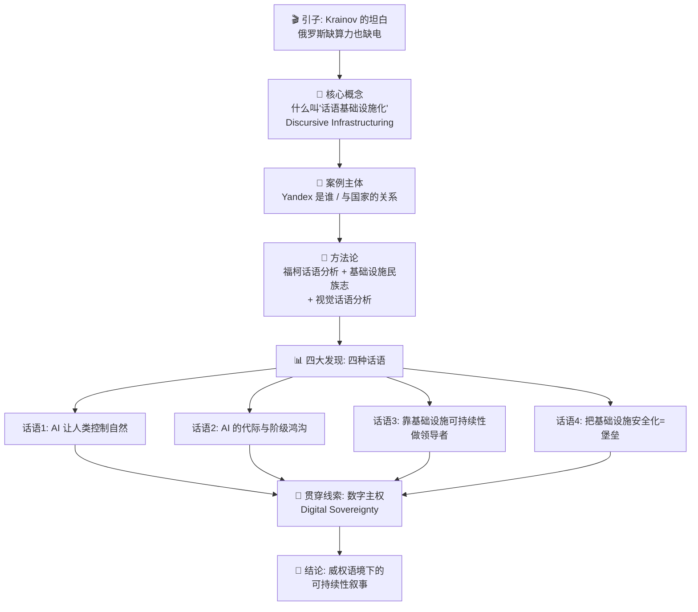
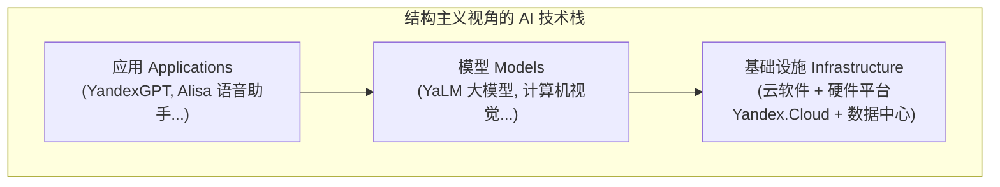
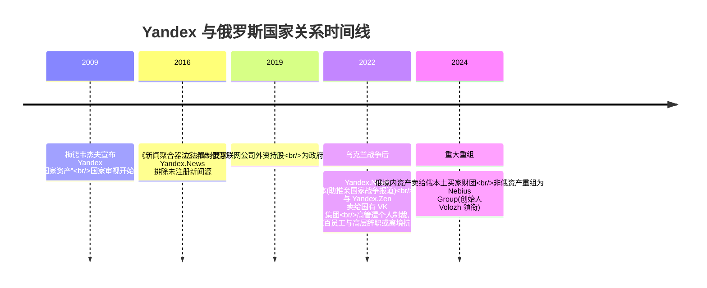
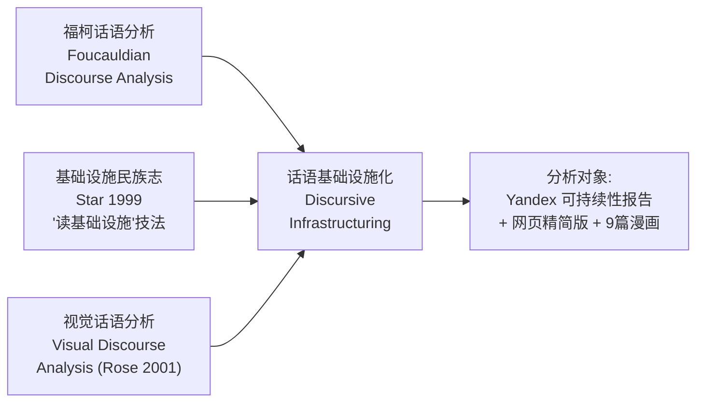
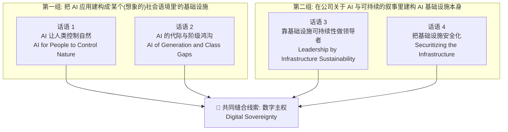
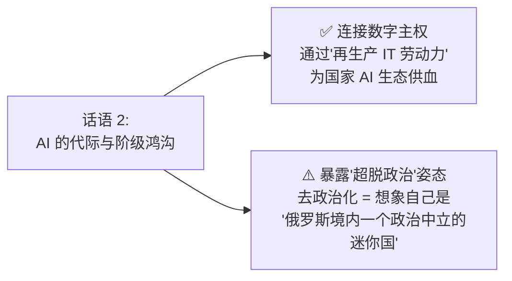
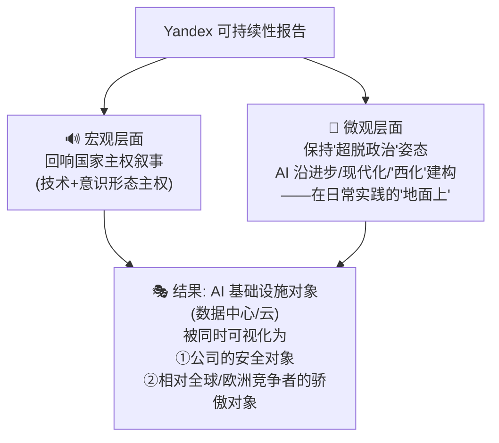

# 第 10 章 俄罗斯 AI 的话语基础设施：Yandex 的可持续性报告 🇷🇺🧊

> 原书章节：**Discursive Infrastructuring of AI in Russia: Yandex's Sustainability Reporting**
> 作者：Olga Dovbysh（赫尔辛基大学 University of Helsinki）
> 对应 PDF 第 231–250 页
> 关键词：可持续性报告（Sustainability reporting）· Yandex · 俄罗斯 · 批判话语分析（Critical Discourse Analysis, CDA）· 基础设施研究（Infrastructure Studies）· AI 基础设施

---

## 🗺️ 本章地图

这一章和本书前面偏"工程/能耗/水耗"的章节完全不同——它是一篇**人文社会科学（STS + 传播学）** 的实证研究。它不问"数据中心用了多少度电"，而问一个更狡猾的问题：

> **一家俄罗斯科技巨头，是如何用"文字 + 漫画"把自己的 AI 数据中心，讲成一个"可持续、主权、坚不可摧的堡垒"的？**

阅读路线如下：

**读这一章你能拿到什么**：
1. 一套"读基础设施背后叙事"的**分析工具**（Star 的"读基础设施"技法、福柯的权力/知识观）；
2. 理解"可持续性报告 / ESG"作为**企业传播文体**的运作机制与偏见；
3. 一个具体、鲜活的案例——看一家公司如何用 9 篇漫画把数据中心画成童话里的英雄和堡垒；
4. 对"数字主权（Digital Sovereignty）"这一当下全球热词的批判性理解。

> 💡 **给工程师读者的一句话定位**：如果说本书别的章节教你"AI 基础设施物理上是什么"，这一章教你"AI 基础设施在话语上被建构成什么"——两者都是真实的"基础设施"，因为**符号也是基础设施的一部分**。这正是本章最反直觉、也最值钱的洞见。

---

## 1. 🎬 引子：一个罕见的"坦白"

2025 年 2 月，Yandex 的 AI 研发总监 **Aleksander Krainov** 说了一句在俄罗斯科技圈里很反常的话：

> "如果你现在想建一个大型数据中心，不仅通电要花你一年时间……而且能给你的电，也不会有你需要的那么多。"
> （Aryalina & Milkin, 2025）

作者用这句话开场，是因为它**罕见**。它承认了 AI 的**物质性（materiality）** 和**资源依赖（resource dependence）**——AI 不是凭空的魔法，它吃电、吃算力、吃冷却。这与俄罗斯主流的"技术民粹主义（techno-populism）"叙事形成鲜明对比：后者总把技术进步描绘成"满足人民需求、增强民族自豪感"。

几个硬数据，先建立物质背景：

| 指标 | 数据 | 出处 |
|---|---|---|
| 俄罗斯数据中心数量（2024.4） | 225 座 | Aryalina & Milkin, 2025 |
| 占全国能源系统比例 | 约 1% | 同上 |
| 预期年增长 | 30%–40% | 同上 |
| 能源分布特征 | 全国有盈余，但**莫斯科、圣彼得堡两大都市圈缺电**，其他地区盈余 | 同上 |

> 🔬 **核心论证（本章第一性原理）**：AI 基础设施同时是**物质的**（吃电的机房）和**符号的**（被讲述的故事）。Krainov 少见地掀开了"物质"那一面；而 Yandex 的可持续性报告，做的正是把这物质的、耗能的、有污染的东西，**重新包装成一个可持续、光荣、安全的符号**。本章就是要把这层包装"考古"出来（excavate）。

### 1.1 更大的政治背景

作者把问题放进一个尖锐的框里：

> **可持续性挑战 + 日益增长的主权焦虑，在当代俄罗斯——一个"处于战争中的威权国家"——是如何显现的？**

几条制度性事实：
- **俄罗斯总统**把 AI 视为国家"科学、技术、意识形态"主权的关键（Muhametshina, 2024），并强调要应对"来自不友好外国的不公平竞争对 AI 技术的封锁"（President of Russia, 2024）。
- 两个国家级项目：联邦项目"人工智能"、国家项目"数据经济与国家数字化转型"，运行至 2030，目标是建成**国家级 AI 生态**。2025–2027 国家投资约 264.9 亿卢布。
- **制裁 + 外企撤离**（乌克兰战争后）给 AI 产业与基础设施带来额外挑战。

> ⚠️ **常见坑（研究方法层面）**：在**受限政权（restricted regimes）** 里做研究，拿不到一手数据（Gel'man, 2023）。所以作者不去访谈、不去机房，而是选了一个**公开可得、却极富信息量**的数据源——**公司的可持续性报告**。这是"戴着镣铐跳舞"的方法论选择，后面会反复看到它的影响。

---

## 2. 🧩 核心概念：什么是"话语基础设施化"

这是全章的理论心脏，务必吃透。我们分三层拆：**基础设施是什么 → 话语是什么 → 两者怎么焊在一起**。

### 2.1 AI 基础设施 = 情境化的社会技术系统

先看 AI 技术栈的**结构主义**视角（van der Vlist et al., 2024）：

但作者不满足于这种"分层堆栈"的干净图景。她引 **Crawford（2021）** 和 **Raley & Rhee（2023）** 的**批判性 AI 研究**，给 AI 一个更"脏"、更全面的定义：

> AI 是"**技术安排与社会技术实践的组装（assemblage）**，是概念、意识形态、以及部署机制（dispositif）"。

在此基础上，作者给出**本章工作定义**：

> 📌 **AI 基础设施 = 被设计、被配置以支撑 AI 模型和应用运行与维护的、情境化的社会技术系统（situated sociotechnical systems）。**

"情境化（situated）"这个词很关键——它意味着**同一台服务器，在不同国家、不同政治语境下，意义完全不同**。

### 2.2 基础设施同时是"物质的"和"符号的"

这是 STS（科学技术研究）里的经典命题。作者连引三组权威：

| 学者 | 金句（原文精神） | 含义 |
|---|---|---|
| Bowker & Star (2000) | "信息系统的介质不只是电线插头、比特字节，还有**表征的惯例、正式与经验的信息**。" | 基础设施包含"表征系统"这层 |
| Parks & Starosielski (2015) | 媒介基础设施是"**物质形式，也是话语建构**"（p.5） | 物质 ≠ 全部，话语也是构成性的 |
| Star (1999) | 基础设施有**强关系性（relationality）**——不是静态孤立的物件，而是通过实践被生产和再生产 | 基础设施是"活的"，被不断做出来 |

> 🔬 **核心论证**：既然基础设施的构成里**本来就包含"表征/话语"这一层**，那么研究一家公司怎么"讲述"它的数据中心，就不是研究"公关话术"这种表面文章，而是在研究**基础设施本身如何被建构出来**。这是本章立论的地基——把"读报告"提升为"读基础设施"。

### 2.3 边界物（Boundary Object）：同一物、多重意义

作者引入 Bowker & Star 的另一利器——**边界物（boundary object）**：

> 边界物"在不同社会世界里有不同意义"，却"足够稳健以在各处维持共同身份"（Bowker & Star, 2000, p.297）。

**类比理解** 💡：想象一张地图。对于登山者，它是路线；对于地质学家，它是岩层；对于军队，它是战场。地图这个"物"没变，但意义随"社会世界"而变——它就是边界物。

Yandex 的 AI 基础设施同样是边界物：对投资者是资产，对政府是主权工具，对用户是便利服务，对环保者是碳排放源。可持续性报告的工作，就是**在这么多相互冲突的意义之间，稳住一个"对公司有利"的共同身份**。

### 2.4 "话语基础设施化"（Discursive Infrastructuring）的正式定义

方法论核心概念，来自 **Bennani-Taylor（2024）**：

> **Infrastructuring（基础设施化，动名词）**："试图把一个**物质—符号的组装（material-symbolic assemblage）** 固定进某个特定社会秩序（social order）里的诸过程。"

> **Discursive infrastructuring（话语的基础设施化）**："试图把 AI **稳定（stabilise）** 为一个由**特定意识形态、物质性、权力关系**组成的组装的话语过程。"

拆开这个定义里的三个动词，就懂了整章在干什么：

| 关键词 | 含义 | 在 Yandex 案例里 |
|---|---|---|
| **stabilise（稳定/焊死）** | 让某个不确定、有争议的东西变得"理所当然" | 把"数据中心=可持续+光荣+安全"变成常识 |
| **fix within a social order（固定进社会秩序）** | 让技术契合特定的权力结构 | 让 AI 契合俄罗斯的"主权"国家议程 |
| **assemblage（组装）** | 强调技术不是单一物，而是"意识形态+物质+权力"的混合体 | 数据中心 = 机房 + 主权意识形态 + 国家权力 |

> 💡 **一句话记住**：**"话语基础设施化"= 用讲故事的方式，把"这堆耗电的机器就该是这样、就是好东西"这件事焊死成常识。** 报告和漫画，就是焊枪。

---

## 3. 🏢 案例主体：Yandex 是谁，它和国家什么关系

要读懂这些话语，必须先懂 Yandex 这家公司的**政治处境**——它决定了报告"为什么这么讲、不敢那么讲"。

### 3.1 Yandex 画像：俄罗斯的"谷歌"

| 维度 | 内容 |
|---|---|
| 成立 | 1997 年，莫斯科 |
| 定位 | 跨国互联网公司，主营俄罗斯与独联体（CIS）国家 |
| 常见对标 | 谷歌（Google）——搜索引擎 + 在线广告 + 电商 + 出行 + 云计算 |
| 服务规模 | 90+ 数字服务与产品 |
| 代表服务 | Yandex Search、云存储、邮箱、Yandex.Lavka（食杂配送）、IoT 智能设备、网约车、共享汽车、Yandex.Market（电商） |
| 地位 | **RuNet（俄语互联网）的关键玩家** |

### 3.2 与国家的关系：从"国家资产"到步步收紧

这是理解全章的**权力背景**。作者用一条清晰的时间线，展示 Yandex 如何从独立创业公司，一步步被国家收编：

**"非政治化"策略（Depoliticization）** —— 本章反复出现的关键词。

Solovyeva & Bristow（2024）指出：Yandex 领导层**战略性地决定"置身政治之外"**，方式是：
1. 构建"**企业主权（corporate sovereignty）**"；
2. 通过政治妥协；
3. 聚焦业务增长。

这种非政治化被一种"**关怀伦理（care ethics）**"正当化——营造一个让员工"感到安全、被保护"的**安全茧（safety cocoon）**。但代价是：**日益顺从俄罗斯国家政治，组织传播被去政治化。**

> ⚠️ **常见坑（理解误区）**："非政治化"听起来像"中立"，但作者点破：**在威权语境里，"不谈政治"本身就是一种高度政治化的选择**——它等于默许现状、配合国家叙事。后面话语 2 会看到，这种"假装成一个政治中立的小国"（"a politically neutral mini-state within Russia"）的幻觉，如何渗进可持续性报告。

### 3.3 Yandex 的 AI 与基础设施家底

这些"物质事实"是后面话语分析要"符号化"的原材料：

| 资产 | 细节 |
|---|---|
| **模型** | ≥17 项服务（含语音助手 **Alisa**）用 **YandexGPT**；2022 年开源大模型 **YaLM**（Yet another Language Model）；还有计算机视觉、无人驾驶 |
| **云平台** | **Yandex.Cloud**（2018 上线）；2023 年 32,000+ 客户，俄罗斯云计算领军者 |
| **市场机会** | 外企撤离后俄云市场暴涨，Yandex 重金竞逐，对手有 Rostelekom、Selectel、Cloud.ru、VK Cloud |
| **数据中心** | 4 座：莫斯科州 2 座、弗拉基米尔州 1 座、梁赞州 1 座 |
| **海外机房** | 重组前在芬兰 Mäntsälä 有一座，现归 Nebius Group |
| **超算** | **Chervonenkis** 超算——报告称是"欧洲第 4 强商用超算" |

> 💡 记住这几个名字：**Alisa、YandexGPT、YaLM、Yandex.Cloud、Chervonenkis、PUE 1.13**——它们是后面四种话语反复调用的"道具"。

---

## 4. 🔬 方法论：怎么"读"基础设施的话语

作者的分析方法是三种工具的**合成（synthesize）**。理解它们，你就掌握了一套可迁移的"批判阅读"框架。

### 4.1 三把工具

#### 工具 1：福柯的话语观——话语即权力

> 话语（discourse）是"一套特定的**观念、概念、分类**的集合，在一组特定实践中被生产、再生产、转化，并通过它赋予物理与社会现实以意义"（Hajer, 1995, p.44）。

福柯的两个要点：
1. **话语是一种规训（discipline）**：话语之所以有力，是因为它把主体规训进特定的思考和行动方式。
2. **权力与知识紧密缠绕**。福柯原话（1995, p.27）：

> "权力和知识直接相互蕴含；……没有不同时构成某个知识领域的权力关系，也没有不预设并同时构成权力关系的知识。"

> 🔬 **核心论证**：正因为"知识/话语"与"权力"焊死，所以分析 Yandex 报告里"什么是可持续 AI"这套**知识**，本质上就是在分析它服务了**谁的权力**（公司的、国家的）。分析不能停在"文本说了什么"，而要**考古（excavate）** 出：文本里**隐含的 AI 愿景**，以及它绑定的社会历史语境（Bennani-Taylor, 2024, p.5）。

#### 工具 2：Star 的"读基础设施"技法

Susan Leigh Star（1999）的两大经典技法，本章直接拿来用：

| 技法 | 英文 | 做什么 | 注意信号 |
|---|---|---|---|
| **识别主叙事** | identification of master narratives | 找出被"隐去/未命名"的东西 | 用被动语态、删除情态词、把一堆活动和利益**捏成一个有单一议程的行动者**、人格化 |
| **浮现隐形劳动** | surfacing invisible work | 追踪被隐藏的过程与"衔接劳动（articulation work）" | 谁的劳动被抹掉了？ |

> 💡 **实战/面试高频**："master narrative（主叙事）"是批判研究的高频考点。它的核心操作是：**把复杂多元的现实，简化成一个单一、光滑、看似理所当然的故事**。例如把"Yandex 众多工程师、外包、供应链的劳动"压缩成"Yandex 的神经网络拯救了世界"这一句——中间所有人的劳动就"隐形"了。识别这种简化，就是批判分析的核心动作。

#### 工具 3：视觉话语分析——漫画也是话语

作者的一个**方法创新**：她不只读文字，还读**漫画（comics）**。依据 Rose（2001）：**视觉性也可以被当作一种话语**——话语可以通过各种视觉与言语的图像、文本，以及这些语言所允许的实践来表达。

这就把分析对象从"报告 PDF"扩展到了"9 篇漫画的画面、构图、隐喻"。

### 4.2 数据集：一份报告，三种形态

Yandex 2020 年开始发可持续性报告（比业内第一家 VKontakte 晚一年）。**最新一版 2024 年 6 月发布，有三种形态**：

| 形态 | 内容 | 引用代号 |
|---|---|---|
| 传统 **PDF 报告** | 俄英双语，可在线读可下载 | Yandex, 2023a |
| **网页精简版** | 报告最重要亮点 | Yandex, 2023b |
| **漫画** | 《关于人与技术的 9 个故事》 | Yandex, 2023c |

三种形态都含图像（照片，或神经网络生成的类照片图，及手绘）。作者还用了报告里超链接指向的**数据中心与云服务补充文档**（Yandex, 2023d，《Yandex.Cloud 的安全》）。

**本章聚焦的 4 篇漫画**（更明确与 AI 相关）——**表 10.1**：

| 编号 | 标题 | 主题 |
|---|---|---|
| 1 | 云端的自然、教育与健康 | Yandex Cloud 助力科研 |
| 3 | 生态的、技术的市场 | 环保包装、用神经网络与机器人优化 Yandex Market 体验 |
| 6 | AI 助手与教育 | 免费的 YandexGPT AI 助手帮中学生备考毕业考（Yandex Uchebnik） |
| 8 | 保护用户与数据 | 安全技术 |

### 4.3 分析流程

作者的两轮阅读：
1. **熟悉阶段（familiarization）**：细读所有材料（含视觉），沉浸其中，初步标记关键主题（Rose, 2001），留意"主叙事"信号（Star, 1999）。
2. **批判阶段**：以更批判的目光反复回看，做 **Fairclough（2010）的"互话语分析（interdiscursive analysis）"**——把文本分析与社会实践分析连起来。特别关注：用词与短语、被称呼或被想象的社群、材料里的默认解读、文本的生产与获取方式。

> ⚠️ **常见坑（文体偏见）**：可持续性报告作为一种**企业传播文体（genre）**，天生就是要帮利益相关者（投资者、消费者、公民组织）评估公司的可持续性——但正因如此，它**可能在环境和社会影响的陈述上产生偏见**（Frig et al., 2025）。文体本身塑造了叙述的结构和语调。所以**视觉形式（漫画、图像）反而是突破口**——它们能更深地"钻进去"、追踪那些被隐藏的过程和"衔接劳动"。这解释了作者为什么如此看重漫画。

---

## 5. 📊 四大发现：Yandex 用来"焊死"AI 可持续性的四种话语

分析揭示 **4 种主要话语**，作者把它们松散地分成两组：

在逐一分析前，先立起贯穿全章的"隐形主角"——**数字主权**。

### 5.0 贯穿线索：数字主权（Digital Sovereignty）

> 数字主权已成为全球强有力的政治话语，用来执行国家法律、正当化政府对数字领域的干预，以保护从安全、繁荣到文化规范、多样性、媒体控制等"关键物品（vital goods）"（Heidebrecht, 2024）。

在**俄罗斯语境**里，数字主权主要关联于该国长期打造"**主权互联网（sovereign internet）**"的努力（Budnitsky & Jia, 2018; Litvinenko, 2021）。

作者的核心洞察 🔑：

> 主权的观念在 Yandex 可持续性报告里**萌芽**——它把 AI 基础设施**想象成一座在敌人猛攻下岿然不动的、坚不可摧的堡垒（impregnable fortress）**。Yandex 由此支持国家计划：本地拥有、控制、运营的创新生态，以确保数字主权——以及作为其一部分的 **AI 主权**。

Musiani（2022）的定义为此背书：**数字主权依赖于本地拥有、控制、运营的创新生态，能提升国家的技术与经济独立性和自主性。**

记住这条线——四种话语，其实都在给"主权"这座堡垒添砖。

---

### 5.1 话语 1：AI 让人类控制自然 🌋🐂

**建构内容**：AI 是**掌握在有权势之人（Yandex 员工与用户）手中的控制工具**——用来追踪、研究、控制自然对象（气候、动物、天气），**即便这需要资源、会产生温室气体（GHGs）**。

#### 文本证据

报告第 87 页：

> "数字技术在解决复杂气候问题中扮演重要角色。例如，Yandex 服务分析气象数据和气候现象，构建并可视化气候预测，从而帮助科学家研究应对气候变化的可能性，帮助企业选择适应策略。"

紧接着，报告**承认了负面影响**（这是关键的话术结构）：

> "任何数字服务的运行都伴随产生温室气体排放的过程，我们努力去研究它们"，且"Yandex 总碳足迹的一半以上来自数据中心的电力消耗"（Yandex, 2023a, p.87）。

> 🔬 **核心论证（话术结构）**：这两段构成一个经典的"**尽管…但是…**"结构——**尽管**有负面环境影响，**但**自然资源对"为人创造价值"是必要的。作者点出：这和西方科技公司的可持续话语一致——把数字技术发展视为对社会问题的"**以方案为中心（solution-centric）**"的路径（Kuntsman & Rattle, 2019）。**碳排放被承认，是为了让它显得"已被负责任地考虑过"，从而更容易被接受。**

#### 视觉证据：漫画 1（图 10.1）

漫画把 **El Niño（厄尔尼诺）** 现象画成一头**从火山里醒来的愤怒红牛**。火山脚下村庄屋顶上的人问它："你要对我们做什么？我们知道你会来。"红牛咆哮："可是怎么知道的？"于是有了解释：

> "有一座城，城里有栋楼，楼里有个数据中心，数据中心里有个服务器集群，集群里有个 Yandex 神经网络——它提前算好了你何时何地出现。"

最后一格，一个**中性性别的人**摊手困惑："恐怕你理解不了，你只是一团火山灰。你居然还能说话，真是奇迹。"

**作者的解读**（这是视觉话语分析的示范）：

| 分析维度 | 内容 |
|---|---|
| **叙事结构** | 镜像**俄罗斯童话结构**（Propp, 1971）：反派威胁社群的和平生活 |
| **英雄是谁** | 按 Propp 分类挫败反派的英雄，被画成**非人、非物质的神经网络** |
| **英雄的位置** | 用典型童话方式描述（层层保护地藏起最重要的东西，如"科谢的死亡"藏在层层之下）——正对应"城→楼→数据中心→集群→神经网络"的嵌套 |
| **人类的角色** | 沦为**次要**——只负责和反派沟通 |
| **对自然的处理** | El Niño 被塑造成**要被击败的侵略性实体**；取胜策略是**预测并抵消其影响** |
| **权力关系** | 人类先与 El Niño 对话，结尾却**剥夺其能动性**（"你理解不了，你只是一团火山灰"）——凸显**人类，被 AI 赋能后，成为自然的主人（nature's host）** |

> 💡 **实战洞察**：注意这套隐喻的政治效果。把气候现象画成"要被打败的反派"，把 AI 画成"提前算好一切的隐形英雄"——这**悄悄把'控制/征服自然'正当化了**，也把 AI 的碳排放这个"英雄的代价"顺势合理化。

#### 与主权的连接

> 这一话语把 AI 稳定为一种**赋能式的控制工具**，也贡献于主权观念。它把主权**扩展到"通过 Yandex 提供的 AI 工具控制行星级影响（planetary influences）"**。

作者做了一个精彩的**跨语境比较**：
- **欧盟**：通过国家间合作、跨国网络合作来建 AI 基础设施，追求"欧洲主权"（用 AI 预测极端天气等）；
- **Yandex**：**相似的雄心，不同的执行**——同样想用 AI 管理气候危机，但走的是"本地拥有控制"的主权路径。

结论一句：**温室气体排放这种负面后果，被表征为"令人不快但不可避免、因而可接受"的、通往主权这一更大目标的组成部分。**

---

### 5.2 话语 2：AI 的代际与阶级鸿沟 👨‍👦

**建构内容**：AI 是一个**边界物**，它（断）连接不同社会世界的行动者——其中，**年轻、受过良好教育、中上阶层**的人，被视为实践和受益于 AI 的主要社会群体。

#### 视觉证据：漫画 6（图 10.2）

一个**父亲**不理解儿子在电脑上干什么、AI 如何用于教育（尤其是备考中学毕业考）。父亲的视觉符号极具指向性：

| 视觉符号 | 象征含义 |
|---|---|
| 穿 **tel'nyashka**（俄罗斯军人穿的横条纹背心） | 军人背景 |
| 左臂有**纹身** | 强化军人/特定阶层身份 |
| **40 多岁** | 代际标记 |
| 台词："我不理解这一代人。我像他这么大时，玩的是 GTA。" | 代际与文化鸿沟 |

> 这幅漫画在**不同年龄、教育、职业**的人及其与 AI 的关系之间，画出了**象征性的边界（symbolic borders）**。类似的代际鸿沟也出现在漫画 3。

#### 文本证据

报告强调年轻人的重要性：

> "我们喜欢和年轻人一起工作，我们在他们身上看到技术产业发展的巨大潜力。"（p.37）

报告还把**专业人才短缺**说成 AI 发展的主要障碍，并**批评国家教育系统**无力解决：

> "教育系统有适应技术发展新趋势太慢的风险。"（p.46）

于是报告罗列 Yandex 从中学到大学、**与国家教育系统并行或作为其一部分**提供的众多活动。作者点破：

> **Yandex 由此打造一套教育基础设施，来（再）生产 IT 专家和未来劳动者。**

#### 双重的主权/去政治化连接（本话语最精妙处）

这一话语同时挂钩两个东西，看似矛盾却并存：

**去政治化（depoliticization）** 在 Yandex 这里表现为"**想象一个属于自己的宇宙——一个'俄罗斯境内政治中立的迷你国家'的幻觉**"（Solovyeva & Bristow, 2024, p.8）。

由此，报告、精简版与漫画共同把 AI **稳定在一个特定社会群体里**：

> **年轻、受教育、白人、中或中上阶层、居住在俄罗斯大城市的人。**

> ⚠️ **常见坑 / 最锋利的批判**：作者指出一个巨大的裂缝——**这个群体根本不能代表俄罗斯的整体人口**。更讽刺的是：**正是这个群体，在 2022 年 2 月入侵乌克兰、2022 年 9 月军事动员后，大规模离开了俄罗斯**（Kostenko et al., 2023）。也就是说，报告为之描绘美好 AI 未来的那群人，恰恰是用脚投票逃离这个政权的人。这个反讽把"去政治化"的虚假性暴露无遗。

与 Bennani-Taylor（2024）在其他国家语境里的发现一致：Yandex 把 AI 建构成与**进步（progress）和现代性（modernity）** 绑定的东西。

---

### 5.3 话语 3：靠基础设施可持续性做领导者 🏆

这是**四种话语里最"技术/工程"** 的一种，也是工程师读者最亲切的一段——但注意作者如何把工程指标读成**政治符号**。

报告里对 AI 基础设施的正面讨论分两处：
1. **子章"能效（Energy Efficiency）"**：围绕数据中心与 **PUE（Power Usage Effectiveness，电源使用效率）** 指数；
2. **子章"碳足迹（Carbon Footprint）"**：评估讨论 **Scope 1 和 Scope 2**。

（有趣的是：**漫画和精简版都不碰这两个话题**——太技术、太"物质"，不适合讲故事。这本身就是一种"隐形工作"。）

#### 关键工程概念速补 💡

| 术语 | 含义 | 越好越？ |
|---|---|---|
| **PUE** | 数据中心总能耗 ÷ IT 设备能耗。衡量"为了让服务器跑，额外花了多少电在制冷/供电损耗上" | 越接近 **1.0** 越好 |
| **Scope 1** | 直接排放（自有设施/车辆烧的燃料） | 越低越好 |
| **Scope 2** | 外购电力/热力的间接排放 | 越低越好 |

#### 文本证据：全是"相对世界/欧洲"的比较

| 报告原句（p.76–78） | 数字 | 话术分析 |
|---|---|---|
| "2023 年服务服务器设备的额外能耗，比世界平均**低 4.5 倍**" | 4.5× 更低 | 相对世界平均 |
| "俄罗斯最大数据中心年均 **PUE = 1.13**……与世界行业领袖相当，**比世界平均（2023 为 1.58）好 28%**" | PUE 1.13 vs 1.58 | 相对世界平均 |
| "Yandex 的 **Chervonenkis 是欧洲 TOP-4 最强商用超算**" | 欧洲第 4 | 相对欧洲 |

> 🔬 **核心论证（双重操作）**：作者指出这段做了两件事——
> 1. **主叙事**：illustrate（图解）Yandex 数据中心的能源可持续性；
> 2. **相对主义评估**：设立一种"**比世界/欧洲更好**"的评价方式。
>
> 而最狡猾的是它做的"**隐形工作（invisible work）**"：**通过和欧洲/世界比，Yandex 悄悄把自己声称成"欧洲 IT 部门的一员"，一个在 AI 发展和基础设施可持续性上取得领先地位的欧洲/西方公司。**

> ⚠️ **常见坑（读懂政治潜台词）**：一家**处于战争、被西方制裁、被欧洲切割**的俄罗斯公司，却在报告里反复用"比欧洲好、欧洲 TOP-4、比世界平均好"来定位自己——这不是简单的技术自夸。它是在话语上**否认被西方开除的现实**，坚持"我们仍属于（甚至领先于）欧洲技术共同体"。工程指标（PUE 1.13）在这里成了**主权与归属感的政治武器**。

---

### 5.4 话语 4：把基础设施安全化（Securitizing）🏰🦹

**建构内容**：安全（security）被建构成**可持续性精神（sustainability ethos）的一部分**。报告强调安全日益重要、需提升有效性：

> "2023 年我们扩充了团队——负责数字安全的员工增加了三分之一。这既因业务增长，也因我们希望**更有效地保护我们的基础设施和服务**。"（p.62）

报告里，基础设施安全由两部分构成：**数据中心的物理安全** + **云服务的安全**。

#### 文本证据：一座"堡垒"的层层描写（Yandex, 2023d）

作者引用《Yandex.Cloud 的安全》文档，展示"**坚不可摧的堡垒（impregnable fortress）**"意象是如何被文字砌起来的：

| 安全措施描写 | 堡垒隐喻 |
|---|---|
| "进入数据中心受**严格管制**——没有预先批准的申请不能进入。" | 城门森严 |
| "所有云服务对象（机架、机箱、设备诊断区）持续处于**视频监控**下，录像在公司服务器**至少存 3 个月**。" | 连**有权限的人也被监控** |
| "损坏的设备存放在特殊安全包内……未经特别申请不得更换或移出……**损坏设备在数据中心内部被销毁**。" | 控制延续到物件"死后" |

> 作者的点睛：这些实践**象征性地表明——"堡垒"对物件的控制，甚至在它们"死亡"之后仍在继续。**

#### 视觉证据：漫画 8（图 10.3）

- **诈骗者**被画成**具攻击性的黑色恶魔（black devils）**，试图绕过 Yandex 安全技术；
- **Yandex 安全**被画成一堵由**贴着标签的砖块**砌成的墙，恶魔试图摧毁它；
- **结尾：墙没被攻破——堡垒没有陷落。**

#### 与主权的连接

> 这一话语把数据中心和云服务**稳定为公司与国家的安全对象**。技术主权在这里被想象成**抵御外部敌人的"安全化（securitization）"实践**。

> 💡 **实战/理论高频**："securitization（安全化）"是国际关系与批判安全研究的核心概念——指**通过话语把某个议题'说成'生存威胁**，从而正当化例外手段。这里 Yandex 把数据中心"说成"需要抵御外敌的堡垒，正是把商业基础设施**安全化**，从而与国家的"抵御不友好外国"叙事无缝对接。"外部敌人（external foes）"这个措辞，直接呼应了本章开头总统关于"不友好外国封锁"的表述。

---

## 6. 🧾 结论：威权语境下的 AI 基础设施可持续性

作者把四种话语收束到一个更大的论断上。

### 6.1 一张总表：四种话语如何各自服务"主权"

| 话语 | 把 AI 基础设施稳定成… | 隐形/被抹掉的东西 | 主权连接方式 |
|---|---|---|---|
| **1 控制自然** | 赋能人类征服自然的英雄工具 | 碳排放的"英雄代价"被合理化 | 主权扩展到**控制行星级影响** |
| **2 代际/阶级鸿沟** | 年轻中上阶层专属的进步象征 | 俄罗斯大多数人口 + 逃离的那群人 | 通过**再生产 IT 劳动力**供血国家生态 |
| **3 领导者** | 比欧洲/世界更优的可持续基础设施 | 被西方制裁切割的现实 | 声称属于并领先**欧洲技术共同体** |
| **4 安全化** | 抵御外敌、坚不可摧的堡垒 | 商业设施被说成生存性防御对象 | 与国家"抵御不友好外国"叙事对接 |

### 6.2 三个核心结论

**结论一：可持续性 = 环境社会经济 + 主权与自给**

> 在**威权语境**里，可持续性叙事获得**额外维度**——它与**国家自给自足（national self-sufficiency）和主权**的话语交织（Glasze et al., 2023）。传统上把可持续性只看成"环境、社会、经济"三支柱（Dillard et al., 2008）的观点，被 AI 基础设施创造的**新权力动态与依赖**所挑战。

**结论二：Yandex 回响国家的主权叙事**

> Yandex 处于威权政权之下、通过所有权结构处于**部分国家控制**中，它**回响一种国家主导的叙事**——把 AI 建构成国家追求"技术与意识形态主权"雄心的一部分。AI 及其服务被建构成能确保对**自然与行星事件的控制**、以及对**一个专业者群体的（再）生产**的"基础设施化实体"。

**结论三：与此同时，Yandex 保持"超脱政治"的姿态**

这是一个**看似矛盾、实则并存**的双重性：

> 研究**证明了 Yandex 的非政治立场**（Solovyeva & Bristow, 2024）：AI 及其基础设施是沿着**进步、现代化、"西化（westernization）"** 的观念被建构的——但是在"**地面上（on the ground）**"，在其客户与员工的日常实践里。因此，AI 基础设施的对象（主要是数据中心和云服务）被**同时**可视化为：**公司安全的对象**，以及**相较全球与欧洲竞争者的骄傲对象**。

### 6.3 一句话总结这一章

> 📌 **Yandex 用一份可持续性报告和 9 篇漫画，把耗电的、被制裁的、被国家半控制的 AI 数据中心，同时讲成了"控制自然的英雄"、"进步青年的专属"、"胜过欧洲的领导者"、"抵御外敌的堡垒"——每一种讲法都在给国家的"数字主权"添砖，而它偏偏还坚称自己"不谈政治"。这，就是"话语的基础设施化"。**

---

## 7. 🎓 面试 / 考试高频问答

> 💡 **面试高频**（适合 STS、传播学、批判 AI、科技政策方向）：

**Q1：什么是"话语基础设施化（discursive infrastructuring）"？**
A：Bennani-Taylor（2024）提出的概念，指用话语过程去"稳定（stabilise）"AI——把它焊成一个由特定意识形态、物质性、权力关系组成的"组装（assemblage）"，并固定进某个社会秩序。核心动词是 stabilise（把有争议的变成理所当然）和 fix within a social order（让技术契合权力结构）。

**Q2：为什么说"基础设施同时是物质的和符号的"？**
A：因为按 Bowker & Star（2000），信息系统的介质不只是硬件，还包含"表征的惯例、正式与经验的信息"。既然表征本就是基础设施的构成层，研究一家公司如何"讲述"数据中心，就是在研究基础设施本身如何被建构。

**Q3：Star 的两大"读基础设施"技法是什么？**
A：①识别主叙事（master narratives）——找被隐去/未命名的东西，警惕被动语态、删除情态词、把多元现实捏成"单一议程的行动者"；②浮现隐形劳动（invisible work）——追踪被隐藏的过程与"衔接劳动"。

**Q4：本章为什么选"可持续性报告"作数据，而不是访谈或实地调查？**
A：因为在受限政权（restricted regimes）里一手数据难获取（Gel'man, 2023）。可持续性报告是公开可得、又极富话语信息的 CSR 传播文体——它既报告活动，又建构"什么算负责任组织"。缺点是文体自带偏见，所以作者补充了漫画的视觉分析来突破。

**Q5：四种话语分别是什么，它们的共同缝合点是什么？**
A：①AI 让人类控制自然；②AI 的代际/阶级鸿沟；③靠基础设施可持续性做领导者；④把基础设施安全化。共同缝合点是**数字主权（digital sovereignty）**——四者都在把 AI 基础设施建构成支撑"本地拥有、控制、运营"的主权堡垒。

**Q6：本章最锋利的批判是什么？**
A：话语 2 里——报告为之描绘美好 AI 未来的"年轻、受教育、中上阶层、大城市"群体，根本不代表俄罗斯多数人口；而且正是这群人在 2022 年战争与动员后大规模逃离了俄罗斯。这把 Yandex"去政治化"姿态的虚假性彻底暴露。

**Q7："securitization（安全化）"在本章怎么体现？**
A：话语 4 把数据中心话语性地"说成"需要抵御外部恶魔/敌人的堡垒（漫画 8 的砖墙 vs 黑恶魔），把商业基础设施建构成生存性防御对象，从而与国家"抵御不友好外国"的主权叙事无缝对接。

---

## 8. 🔗 延伸与关联

**本章与本书其他章节的对话**：
- **与 Velkova 章（能源赤字）**：本章开头引用了 Velkova 关于能源赤字的讨论——莫斯科/圣彼得堡缺电、其他地区盈余的不均衡分布。
- **与 Sridharan & Brodie 章**：话语 1（用 AI 预测天气/管理气候）与欧美的类似讨论相互映照。
- **与本书导论（欧洲主权）**：话语 3 的"欧洲领导者"定位，与导论中"欧洲通过跨国合作建 AI 主权"形成对比——相似雄心，不同执行。

**关键理论谱系（可延伸精读）**：

| 主题 | 核心文献 |
|---|---|
| 基础设施研究 | Star (1999)《基础设施的民族志》；Bowker & Star (2000)《Sorting Things Out》；Parks & Starosielski (2015)《Signal Traffic》 |
| 话语基础设施化 | Bennani-Taylor (2024)；Aspria et al. (2016) |
| 批判 AI 研究 | Crawford (2021)《Atlas of AI》；Raley & Rhee (2023)《Critical AI》 |
| 福柯话语/权力 | Foucault (1995)《规训与惩罚》；Hajer (1995) |
| 数字主权 | Musiani (2022)；Budnitsky & Jia (2018)；Litvinenko (2021)；Glasze et al. (2023) |
| 视觉方法 | Rose (2001)《Visual Methodologies》；Propp (1971)《民间故事形态学》 |
| Yandex 与国家 | Solovyeva & Bristow (2024)；Kravets-Meinke (2024)；Wijermars (2021) |
| 云基础设施依赖 | van der Vlist et al. (2024)《Big AI》 |

**给不同读者的下一步**：
- 🔧 **工程师**：回看话语 3，理解 PUE / Scope 1&2 这些你熟悉的指标，如何在报告里被转成政治符号——训练你"读指标背后叙事"的批判嗅觉。
- 📚 **社科生**：把本章方法（福柯 + Star + Rose 三合一）套到任何一家公司的 ESG/可持续性报告上做练习，这是极好的 CDA 训练模板。
- 🌐 **政策/地缘方向**：本章是"数字主权 × 威权语境 × 企业传播"三重交叉的范本，可与欧盟主权云、中俄"网络联盟"等议题对读。

---

> 📌 **一章小结**：这一章教会我们一件反直觉的事——**AI 基础设施不只是机房和电缆，也是被讲述出来的故事；而故事，同样是基础设施的一部分。** Yandex 的可持续性报告与漫画，用"控制自然的英雄、进步青年的专属、胜过欧洲的领导者、抵御外敌的堡垒"这四种话语，把一堆耗电、被制裁、被国家半控制的数据中心，稳定成了"可持续 + 主权 + 光荣 + 安全"的常识。理解这套"话语的基础设施化"，你就获得了一副 X 光眼镜——从此看任何公司的可持续性宣传，都能看穿它在为谁的权力添砖。
