# 第 11 章 · 纠缠的可持续性：新闻媒体合作与生成式 AI 的市场权力 🕸️

> 原书章名：**Entangled Sustainabilities: News Media Partnerships and Generative AI Market Power**
> 作者：Anne Mollen（德国明斯特大学 University of Münster）
> 对应 PDF 页码：251–273 ｜ 关键词：生成式 AI（Generative AI）· 政治经济学（Political Economy）· 媒体集中（Media Concentration）· 可持续性（Sustainability）· 新闻合作（News Partnerships）

---

## 🗺️ 本章地图

这一章和本书前面偏"数据中心能耗、水足迹、硬件"的工程视角**很不一样**。它是一篇**批判性政治经济学（critical political economy）**的论文，核心追问是：

> 当 OpenAI 这样的生成式 AI 巨头，从 2023 年起密集地和《美联社》《卫报》《大西洋月刊》《新闻集团》《世界报》等新闻机构签合作协议时——**这些"新闻+AI"的合作，究竟在如何重塑市场权力？又如何和可持续性(经济/社会/环境三个维度)"纠缠(entangle)"在一起？**

作者的核心立场（也是全书想推广的观点）：**只盯着"AI 耗多少电、多少水"是不够的**。真正决定 AI 是否可持续的，是**谁掌握了基础设施、谁在制定行业标准、谁在当"知识守门人"**——而新闻媒体正被悄悄"整合"进生成式 AI 的价值链里，成为巩固巨头市场权力的一环。

本章阅读路线：

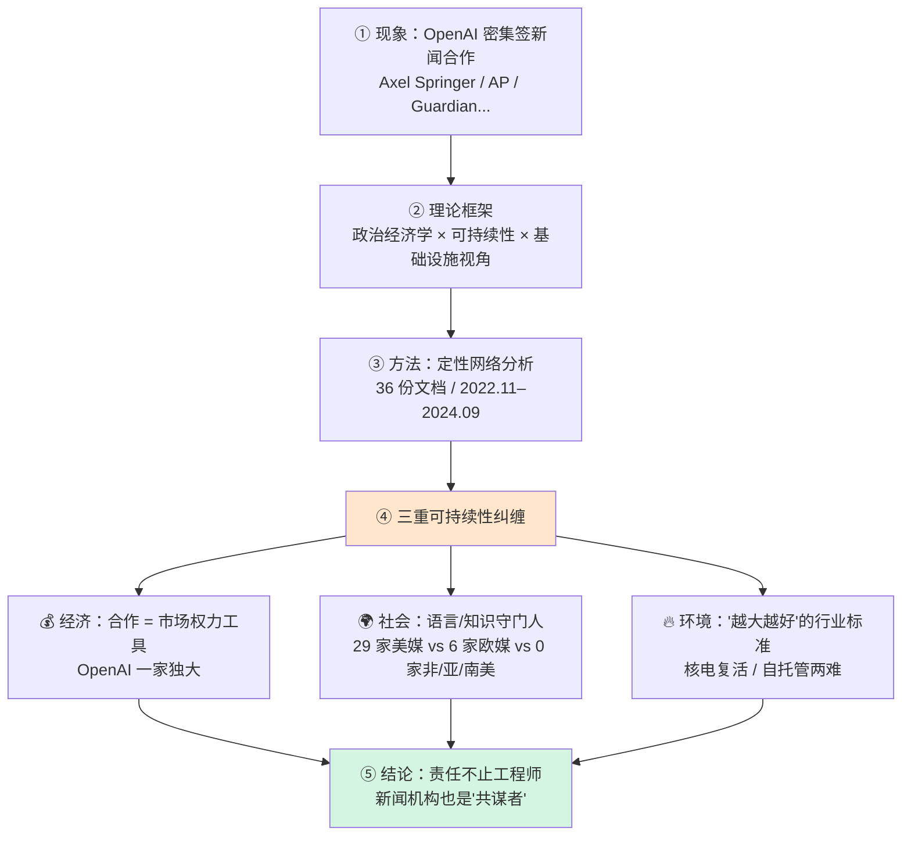

学完这一章，你应该能回答：

1. 为什么说"新闻合作"是生成式 AI 市场集中（market concentration）的隐藏推手？
2. "基础设施视角（infrastructural perspective）"和"政治经济学视角"如何结合，看穿单纯"能耗焦虑"的局限？
3. 三个可持续性维度（经济/社会/环境）是怎么"纠缠"在一起、无法拆开谈的？
4. 为什么作者说新闻机构也要为 AI 的不可持续性"负责"？

---

## 🎬 一、开场现象：一场静悄悄的"抢新闻"运动

### 1.1 ChatGPT 之后，大厂在疯狂"整合"

书里开篇的判断（PDF p.250–251）：

> "Generative AI applications have led to significant turmoil in the digital industries since the launch of ChatGPT in November 2022."
> （自 2022 年 11 月 ChatGPT 发布以来，生成式 AI 已在数字产业掀起巨大动荡。）

大厂的应对策略有两条腿，**且大多数是"两条腿一起走"**：

| 策略 | 含义 | 书中例子 |
|---|---|---|
| **自研（in-house development）** | 自己砸钱建大模型 | 各家自研 LLM |
| **合作（partnerships）** | 和 AI 提供商深度绑定 | Microsoft × OpenAI；法国 Mistral AI 被大厂追逐 |

反过来，生成式 AI 提供商也**主动**寻求和大厂（书里叫 **GAMAM** = Google、Apple、Meta、Amazon、Microsoft）深度绑定。为什么？因为绑定能拿到三样"命根子"：

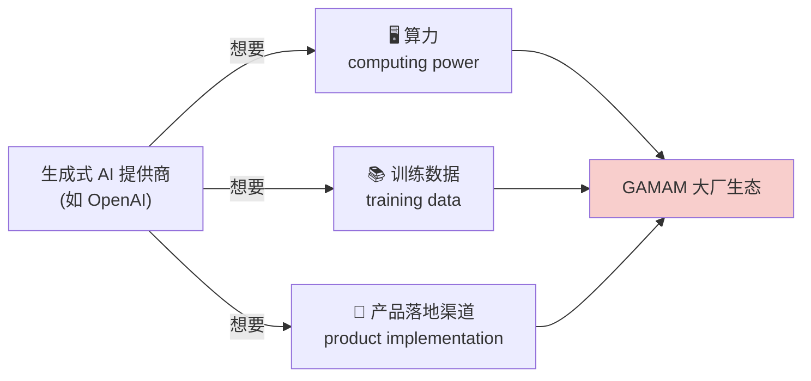

> 🔬 **核心论证 · 为什么市场必然向巨头集中？**
> 作者引用 Mozilla Foundation (2024) 的判断：在生成式 AI 行业，**data（数据）、capital（资本）、ecosystems（生态）、expertise（专长）** 这四要素是"显现市场权力（manifesting market power）"的关键。而这四样，恰恰是已经统治数字世界的大厂天然就有的。于是形成一个自我强化的循环——**已经强的更强**（Vipra & Korinek, 2023 称之为"ChatGPT 的看不见的手"）。这不是市场失灵，而是技术本身的"前提条件"制造了极高的**进入壁垒（entry barriers）**（Gray Widder et al., 2023）。

### 1.2 一个惊人的悖论：垄断者却说自己在"反垄断"

书里（PDF p.253）抓了一个绝妙的反讽——微软 CEO 萨提亚·纳德拉（Satya Nadella）竟然把生成式 AI 说成是对"集中化的平台与搜索引擎产业"的**颠覆**，还劝记者们应该"欢迎 AI"：

> **"Let's face it, there's a real aggregation power in a few places, right? Search is one. News feeds is another. Both of these things could be up for disruption.... What happens to the information ecosystem when there's high concentration is deterioration."**
> （说实话，聚合的权力就集中在少数几个地方，对吧？搜索是一个，新闻推送是另一个。这两样都可能被颠覆……当高度集中时，信息生态会发生什么？会恶化。）
> —— Nadella，转引自 Manancourt, 2024

> ⚠️ **常见坑 · 别被"颠覆叙事"骗了**
> 纳德拉这段话表面上批判集中化、鼓吹颠覆，**但说话的人自己就是最大集中方（微软 + OpenAI）之一**。作者的潜台词：所谓"AI 颠覆搜索/新闻"，很可能只是**权力从一批巨头转移到另一批(甚至同一批)巨头**，而不是真正的去中心化。这正是本章要用政治经济学工具戳穿的"话术"。

### 1.3 被学界忽略的角落：新闻合作

竞争监管机构（如欧盟 Vestager 等，2024）已经在盯着大厂间的并购。但**很少有人关注"新闻出版商 × 生成式 AI"这类合作**——尽管几乎所有 AI 提供商都在砸钱做这件事。

**OpenAI 是绝对的领跑者（frontrunner）**：

- 2023 年 7 月起：从行业巨头**美联社（Associated Press）**开始
- 2023 年 12 月：与 **Axel Springer**（德国出版巨头，旗下《Bild》《Politico》）签约，被包装成"史上首个（the first of its kind）"全球新闻合作，口号是"深化 AI 在新闻业中的有益应用"
- 持续全球扩张，到写作时（2025 年 2 月）已签下**《卫报》(The Guardian)**

作者一针见血：这些合作"**如今正在成为行业标准（industry standard）**"。

> 💡 **实战 / 面试高频 · 学界的盲区在哪？**
> 媒体传播研究至今主要聚焦"生成式 AI 如何改变新闻**生产**（journalistic production）"（Cools & Diakopoulos, 2024）——比如记者用 AI 写稿、核查。但**经济维度**（这些合作如何重塑大厂与新闻业的关系）几乎无人系统研究。本章正是要填这个坑。面试若问"研究 AI 治理时最容易被忽略的视角是什么"，可答：**产业链上的经济权力结构**，而非仅停留在应用伦理层面。

### 1.4 又爱又恨：合作与诉讼并存

值得注意的是，同一批新闻机构对 AI 提供商是**矛盾态度**：

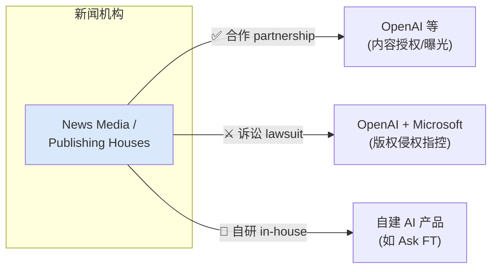

书里点名：一边是 Axel Springer 的合作被"广泛关注"，另一边**《纽约时报》2023 年起诉 OpenAI 和微软**，指控它们未经许可用受版权保护的新闻内容训练模型。这种"边合作边打官司"的分裂状态，正是"**行动者格局正在剧变（shifting actor landscape）**"的信号。

---

## 🧭 二、理论框架：三副眼镜叠在一起看

要看懂上面的乱象，作者戴了三副"眼镜"，并且强调**它们必须叠加使用**。

### 2.1 第一副眼镜：批判政治经济学（Critical Political Economy）

这是媒体研究里的老传统（Baker, 2006；McChesney, 2008；Downing, 2011）。它关心的核心是：

> "critical political economy continues to be centrally concerned with the relations between **the organization of culture and communications** and **the constitution of the good society** grounded in social justice and democratic practice."
> （批判政治经济学始终核心关注：文化与传播的组织方式，如何关系到一个植根于社会正义与民主实践的"良善社会"的构成。）
> —— Wasko et al., 2011, p. 2

**媒体集中（media concentration）的传统分类**（Knoche, 2021）——在"前数字时代"很清晰：

| 集中类型 | 英文 | 含义 |
|---|---|---|
| 纵向集中 | vertical | 控制产业链上下游（如既做内容又做发行） |
| 横向集中 | horizontal | 同一环节吞并同行（如报业收购报业） |
| 斜向集中 | diagonal | 跨行业扩张 |
| 集团化 | conglomerates | 多元媒体帝国 |

> 🔬 **核心论证 · 数字时代，旧分类不够用了**
> 作者指出：随着"平台化（platformization）"，媒体集中已经变成 Poell (2020) 说的**"大型企业生态系统的纠缠（entanglements of large corporate ecosystems）"**——它们不只控制内容生产或发行，还控制**硬件生产、数据聚合、广告业务**。社会学家 Philipp Staab (2024) 更激进：在当代数字资本主义里，科技公司**不是在"支配"市场，而是直接"构建"了专有市场（proprietary markets）**——通过对市场内部前所未有的、丰盈的"控制"来实现。
>
> 一句话：**巨头不再是"市场里最大的玩家"，而是"市场本身的建造者兼裁判"。**

### 2.2 第二副眼镜：可持续性（Sustainability）= 代际正义

作者把可持续性拉回到它最根本的定义——**正义（justice）**：

- **经济集中/权力** 永远关联着**经济剥削**和**人类福祉能力的公平分配**（Sen, 2008 的"能力方法" capabilities approach）
- 联合国 SDGs（可持续发展目标，2015）把这些制度化
- 布伦特兰报告（UN WCED, 1987《我们共同的未来》）把可持续性理解为**代内正义 + 代际正义（intra- and intergenerational justice）**

所以"可持续性"和"政治经济学"**天然接得上**：两者都在问——**文化与传播的组织方式，如何影响一个公正社会的构成？**

> ⚠️ **常见坑 · 把"可持续 = 环保"是最大的误读**
> 本书（尤其本章）反复强调：可持续性有**三根支柱——经济、社会、环境**，缺一不可，且相互纠缠。只谈碳排放和水足迹，是把可持续性"矮化"了。

### 2.3 第三副眼镜：基础设施视角（Infrastructural Perspective）

这是本书的招牌视角。什么叫"基础设施"？作者层层引用：

| 学者 | 对"基础设施"的界定 |
|---|---|
| Brian Larkin (2013, p.329) | 必须承认其**物质性（materiality）**，其目的是**允许物质形式的分配与运输** |
| Parks & Starosielski (2015, p.4) | 媒体/传播基础设施"支持视听**信号流量（signal traffic）**的分配"——海底电缆、数据传输网、铜线等 |
| Star & Ruhleder (1996) | 物质性总是从**关系性设置（relational settings）**中涌现——意味着**很多行动者都与 AI 的物质性纠缠在一起** |

关键转折——把生成式 AI 看成"**传播性智能体（communicative agents）**"（Guzman & Lewis, 2020）：

> 🔬 **核心论证 · 基础设施视角看的不是"技术怎么工作"，而是"权力怎么运作"**
> 作者明确（PDF p.256）：基础设施视角"**不是要揭示技术在实践意义上如何运作，而是要调查基础设施（作为当代媒体的"后端 backends"）中所蕴含的政治理性（political rationalities）与市场动态（market dynamics）**"（引 Parks et al., 2023 的"媒体后端"概念）。
>
> 换句话说：**别把 AI 当黑箱看功能，要把它当"权力的凝结物"看结构。** 沿着价值链的每一个物质环节，都藏着"谁控制、谁获利、谁被排除"的政治问题。

### 2.4 生成式 AI 的价值链（Value Chain）

作者借用机器学习生命周期分析（Luccioni et al., 2022），把生成式 AI 拆成 6 个阶段：

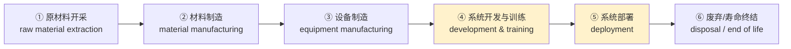

**为什么这个拆分能解释"权力向大厂集中"？** 因为大厂在**每一环**都占尽先机：

| 价值链环节 | 大厂的先天优势 |
|---|---|
| 硬件/算力/能源 | 硬件开发、计算能力、能源供应的统治地位 |
| 系统开发 | 内部专长（in-house expertise）建新 ML 技术 |
| 训练数据 | 独家数据获取渠道 |
| 部署 | 能把 AI 塞进庞大的产品生态（product ecosystems） |

作者列举了 2022 年底以来沿这些环节发生的"结盟潮"：

| 结盟目的 | 例子 |
|---|---|
| 产品集成 | Mistral AI × SAP / BNP Paribas / Capgemini |
| 算力 | OpenAI × Microsoft；Anthropic × AWS |
| 训练数据 | SAP × Aleph Alpha / Anthropic / Cohere（企业数据） |
| 硬件 | Adobe × NVIDIA |

而**新闻媒体合作**，正是插进这条价值链里、最被媒体传播学者忽视的一环。

---

## 🔬 三、研究方法：36 份文档的定性网络分析

作者不是空谈理论，而是做了实证。这一节讲清楚"她到底做了什么、怎么做的"。

### 3.1 研究问题

> **"如何理解新闻/出版机构与生成式 AI 提供商之间的战略合作，是如何形成新的行动者格局（actor constellations），又如何关系到媒体与市场集中？"**

并进一步追问：这些新格局对**经济、社会、环境**三重可持续性各有什么影响？

### 3.2 方法：定性网络分析（Qualitative Network Analysis）

| 要素 | 具体设置 |
|---|---|
| **方法** | 定性网络分析（Hollstein & Straus, 2006）——不是画社交网络图算指标，而是**定性地看行动者如何互相定位、如何叙事性地赋予关系"相关性(relevance)"** |
| **数据来源** | AI 提供商官网博客/新闻稿 + 科技媒体对并购与合作的报道 |
| **样本量** | **36 份文档** |
| **时间跨度** | 2022 年 11 月 – 2024 年 9 月 |
| **分析工具** | 定性编码软件（qualitative coding software） |
| **编码焦点** | 系统化梳理**行动者、它们之间的关系、以及通过"规范与价值(norms and values)"对关系相关性的赋予** |

### 3.3 发现的"关系类型光谱"

分析揭示：新闻机构与 AI 组织之间的关系，形式各异、位置各异，是一条**光谱**：

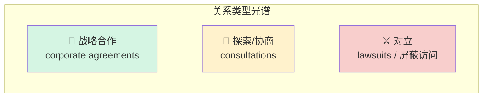

- **合作端**：正式的企业协议、机构化的合作方式
- **中间**：对可能合作的探索或更具体的协商
- **对立端**：诉讼（版权官司）、AI 提供商屏蔽新闻网站访问

> 💡 **实战 / 面试高频 · 定性方法的价值**
> 很多人以为"网络分析"就是画节点算中心度。本章示范了**定性网络分析**：它不追求统计显著性，而追求**理解"叙事框架(narrative framings)"**——即各方**如何用语言给自己的关系"贴标签、赋意义"**。当你研究一个还在快速演变、样本天然稀少的产业格局时，这种方法比大数据统计更能抓住"权力如何被话语构建"。这是社科方法论的高频考点。

---

## 💰 四、经济可持续性：合作是"市场权力"的战略武器

这是三重纠缠的**第一根柱子**，也是本章最核心的实证发现。

### 4.1 核心发现：OpenAI 一家独大

分析清楚显示：新出现的关系——**无论合作还是对抗**——背后都有一个共同逻辑：**巩固市场权力（fostering market power）**。

- **OpenAI 是签下最多新闻合作的主导者**（见原书 Fig. 11.1"新闻机构与生成式 AI 提供商新报道关系图"）
- 它和紧密伙伴 **Microsoft** 同时也是**被诉讼对象**（新闻机构起诉它俩）
- 结论：OpenAI 不只是技术领跑者，**更是"塑造与新闻业新型商业关系"的领跑者**

其他玩家（Apple、Google）**想学 OpenAI 的合作策略，却基本卡在"协商/探索"阶段，签不下具体协议**。

### 4.2 一个反直觉的数据：钱不是关键

作者揭示了一组耐人寻味的数字（PDF p.260）：

| 玩家 | 出价 | 结果 |
|---|---|---|
| **Apple** | 传闻**~5000 万美元**多年合作 | 基本没签成 |
| **OpenAI** | 传闻**每年 100 万–500 万美元**/家出版商 | 签成一大批 |

> ⚠️ **常见坑 · "谁出价高谁赢"是错的**
> Apple 出价明显更高，却签不下来；OpenAI 出价低反而横扫市场。作者的判断：**这不主要是钱的问题**。出版商看重的不是"直接付款(direct payments)"，而是——

**新收入模式（new revenue models）** 的真相：出版商真正想要的，是通过 AI 输出**增加触达与受众参与（outreach and audience engagement）**。看《大西洋月刊》CEO 的原话：

> **"We believe that people searching with AI models will be one of the fundamental ways that people navigate the web in the future... We're delighted to partner with OpenAI, to make The Atlantic's reporting and stories more discoverable to their millions of users, and to have a voice in shaping how news is surfaced on their platforms."**
> （我们相信"用 AI 模型搜索"将成为未来人们浏览网络的根本方式之一……我们很高兴与 OpenAI 合作，让《大西洋月刊》的报道能被其数百万用户更容易地发现，并在"新闻如何在其平台上呈现"这件事上拥有话语权。）
> —— Nicholas Thompson，《大西洋月刊》CEO，转引自 OpenAI, 2024c

出版商赌的是**"未来入口"**——如果 ChatGPT 变成新的搜索引擎，早点上车才能被"看见"。

### 4.3 又一个反直觉发现：训练数据不是重点，"部署"才是

从基础设施视角看，这些合作对价值链的哪个环节最"相关"？

| 猜测 | 实际（36 份文档的编码结果） |
|---|---|
| 大家以为：合作 = 拿**训练数据（training data）** | ❌ **只有 5 份文档**明确提到"保证高质量训练数据" |
| 实际重点：**部署阶段（deployment phase）** | ✅ 反复强调新闻内容对"输出"至关重要 |

**为什么部署阶段更需要新闻内容？** 因为生成式 AI 被大力营销成"信息资源/认知技术（epistemic technology）"，而它天生**搞不定"当前时事(current affairs)"**：

看《新闻集团》合作的措辞：

> **"Through this partnership, OpenAI has permission to display content from News Corp mastheads in response to user questions and to enhance its products, with the ultimate objective of providing people the ability to make informed choices based on reliable information and news sources."**
> （通过此合作，OpenAI 获准在回应用户提问时展示新闻集团旗下刊物的内容并增强其产品，最终目标是让人们能基于可靠信息与新闻来源做出知情选择。）
> —— OpenAI, 2024b

新闻内容被赋予的**规范价值（norms）**：可靠（reliable）、可信（trustworthy）、当前（current）、权威（authoritative）——**这些恰恰是 LLM 本身最欠缺的**。

> 🔬 **核心论证 · 为什么"部署 > 训练"这个发现如此重要？**
> 如果合作只为拿训练数据，那是"一次性买断"；但如果合作是为**部署阶段持续输出可靠信息**，意味着新闻机构被**长期焊进 AI 的价值链**——成为 AI"充当认知技术"能力的持续供血者。谁签下了这些"可靠内容源"，谁就在价值链上**巩固了对手难以复制的位置**，从而**抬高进入壁垒**。这就把"新闻合作"和"市场集中"死死绑在了一起。

### 4.4 经济结论：不平等在加深

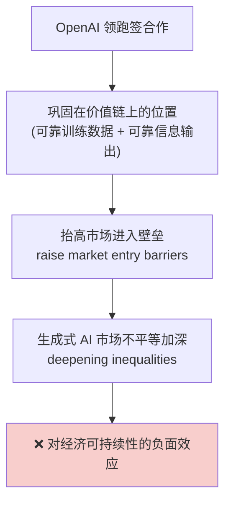

作者定论：**新闻合作在生成式 AI 行业的市场权力与集中中扮演重要角色，可能抬高进入壁垒**。OpenAI 领跑的现状指向"不平等加深"，即**对经济可持续性的负面影响**。而这一切又关乎"我们如何创造和感知关于世界的知识"，所以必须批判性看待。

---

## 🌍 五、社会可持续性：谁在当"知识与语言的守门人"？

第二根柱子。这里作者从"经济"跳到"民主与文化正义"。

### 5.1 逻辑链：把新闻塞进价值链 → 影响信息多样性

把新闻媒体整合进价值链，不只强化经济优势，还会影响：

- **信息获取（information access）**
- **意见与世界观的多样性（diversity of opinions and worldviews）**（Kuai et al., 2025）
- 因此**深刻关乎政治意见形成与民主根基**

因为在 ML 研究里，"算法公平与数据集偏见"早已是显学（Barocas et al., 2019；Mittelstadt et al., 2016）——会导致**对个体的歧视**（Wachter, 2022）或**推崇某些文化价值、忽视其他**（Birhane et al., 2022）。当新闻媒体被整合进价值链，它同样会影响 AI 输出中"公平表征与意见多样性"的成色。

### 5.2 触目惊心的数据：合作的"美国中心偏见"

许多主流生成式 AI 建立在**盎格鲁-美国偏见（Anglo-American bias）**之上，可能通过其在知识生产中的广泛应用，造成**认知不公（epistemic injustices）**（Luo & Puett, 2024），尤其伤害**全球南方（Global South / Majority World）**。

作者数了自己的样本（PDF p.262），结果极其失衡：

| 地区 | 被点名的新闻机构数量 | 占比示意 |
|---|---|---|
| 🇺🇸 美国 | **29 家**（还有更多以"多刊出版集团"名义参与） | ██████████████████████████ |
| 🇪🇸🇫🇷🇩🇪 西/法/德 | 仅 **6 家** | █████ |
| 🌍 非洲/亚洲/南美/其他 | **0 家** | （空） |

> ⚠️ **常见坑 · "全球合作"的话术陷阱**
> OpenAI 喜欢把国际合作宣传成"反映全球的触达"：
>
> > **"In partnership with Le Monde and Prisa Media, our goal is to enable ChatGPT users around the world to connect with the news in new ways that are interactive and insightful."**
> > （与《世界报》和 Prisa Media 合作，我们的目标是让全球 ChatGPT 用户以新的、互动的、有洞察力的方式接触新闻。）
> > —— OpenAI, 2024a
>
> 但数据显示，所谓"全球"其实是**29:6:0** 的严重倾斜。这是典型的"用个别国际案例给系统性偏见镀金"。

### 5.3 为什么在"部署"环节偏见更致命？

作者澄清一个技术细节（PDF p.263）：**新闻合作对"时事类提问"尤其关键**，因为最新时事**不在训练数据里**。对于当前新闻，AI 的做法是：

> 实时搜索最新信息 → 把找到的文本"转换并重新组装（convert and re-assemble）"成新的摘要式输出。

而且 Columbia Journalism Review 的研究（Jaźwińska & Chandrasekar, 2025）发现，即使在现有合作里，**署名/归因问题（attribution problems）也大量存在**。于是偏向美国媒体的合作，会**进一步危及全球文化多样性与遗产的表征**。

> 🔬 **核心论证 · 这直接威胁 SDG 16**
> 作者指出：新闻合作的集中化可能危及**可持续发展目标 16"强有力的机构（Strong Institutions）"**，其子目标要求"确保公众获取信息、依据国家立法和国际协议保护基本自由"（United Nations, 2015, p.28）。**当少数公司决定"哪些新闻源值得被 AI 引用"，它们就成了民主信息生态的守门人（gatekeepers）。**

### 5.4 双重守门权力

在高度集中的 AI 市场里，少数公司握有**双重守门权（gatekeeping power）**：

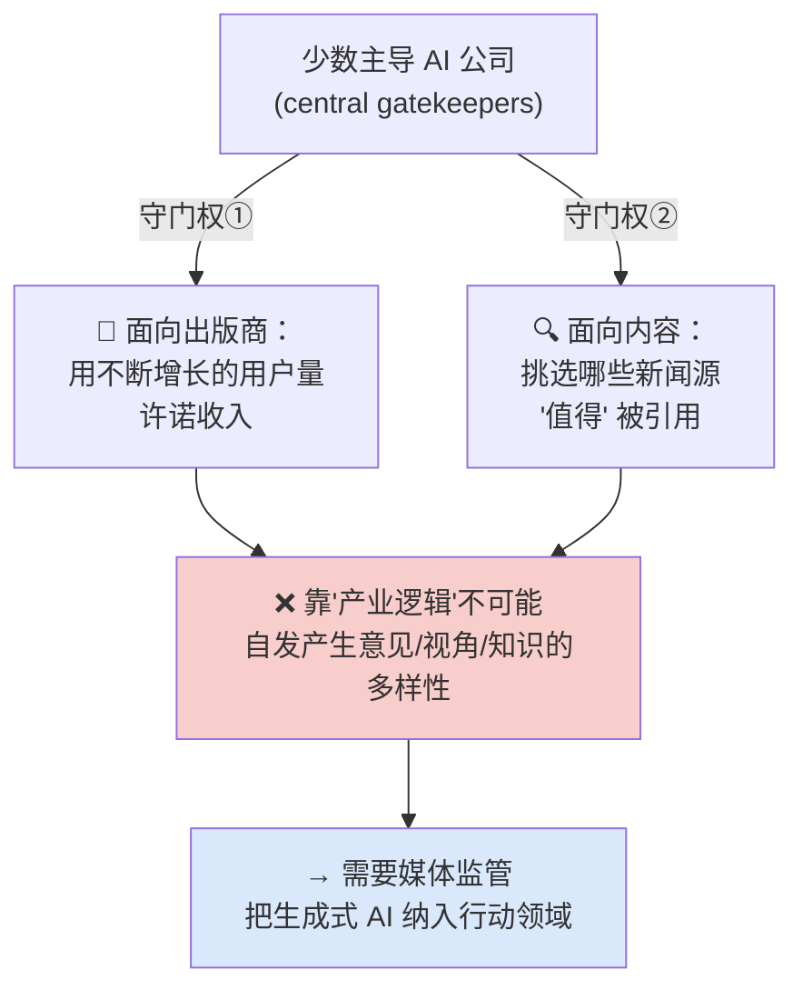

作者的判断很悲观也很清醒：**在集中市场里，指望"产业逻辑"自发带来观点、话题、知识库的多样性，是不合理的**。多样性和民主意见形成，只能靠**媒体监管**——而监管越来越需要把生成式 AI 当作一个"行动领域"来对待。

### 5.5 一线希望：全球新闻媒体信托

作者提到一个正面案例——2025 年巴黎"AI 行动峰会（AI Action Summit）"上宣布的**全球新闻媒体信托（Global News Media Trust）**，其创立原则是：

> **"enable news content creators—particularly those producing content in the Global Majority—to be paid for content essential to training AI large language models (LLMs) and to foster linguistic diversity in the development of AI technology."**
> （让新闻内容创作者——尤其是"全球多数"地区的创作者——因其对训练 AI 大语言模型至关重要的内容而获得报酬，并促进 AI 技术开发中的语言多样性。）
> —— IFPIM, 2025

这体现了"需要协调行动（coordinated action）"来对冲失衡合作。

---

## 🔥 六、环境可持续性：从"越大越好"到核电复活

第三根柱子。作者在这里把"看似最直接的环保维度"和前两根柱子**重新纠缠**起来。

### 6.1 合作如何"传染"环境不可持续？

逻辑链（PDF p.264）：

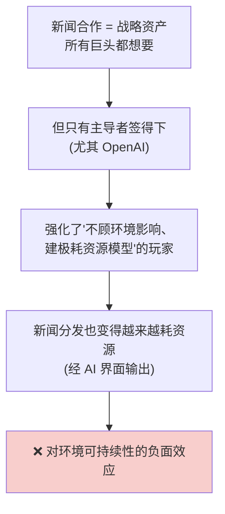

### 6.2 "越大越好"的产业魔咒

ML 研究持续证明生成式 AI 有巨大的**能源、水和其他资源需求**（Bender et al., 2021"随机鹦鹉"; Li et al., 2023"AI 的秘密水足迹"; Strubell et al., 2020），主因是**庞大的模型架构、训练数据、海量推理次数**。

而这些需求还在按"**越大越好（bigger is better）**"的信条持续增长（Bender et al., 2021；Rohde et al., 2024），只是"刚开始被缓慢挑战"。

> 🔬 **核心论证 · 市场权力 = 制定"环境标准"的权力**
> 这是本节最深刻的一步推理：**少数玩家的市场权力，意味着它们主导（或至少倾向性地设定）行业标准**。在环境维度上，这些"标准"包括两条极坏的默认：
> 1. **"越大越好"的信条** —— 逼所有人卷模型规模
> 2. **对环境影响信息的"系统性缺失"** —— 大家都不披露真实能耗
>
> 于是"少数巨头的选择"变成了"整个行业的物理现实"。谁掌握市场权力，谁就掌握了"地球要为 AI 付出多少"的定价权。

### 6.3 "AI 不可避免论"与核电复活

面对日益明显的能源焦虑，大厂的操作是（PDF p.264–265）：

| 大厂操作 | 后果 |
|---|---|
| 把"能源获取"包装成关键政治/产业议题 | 为自己争取能源政策优待 |
| 援引"AI 的必然性（inevitability of AI）" | **为"不遵守自己设定的减排目标"辩护** |
| **复活核电**：自建反应堆 + 推动重启退役核电站 | 通过与外部伙伴签协议激活废弃核电 |
| 继续在产品里堆"高度自动化方案" | 更多硬件、更多能源/水、更多数据中心 |

> ⚠️ **常见坑 · "AI 必然论"是逃避责任的话术**
> 作者点破：大厂用"AI 反正挡不住"来**正当化自己违背减排承诺（legitimising their non-compliance with self-set emission targets）**。这是一种把"技术宿命论"当挡箭牌的策略。批判者要警惕：任何"这是必然趋势，所以只能接受代价"的说法，往往是在为既得利益者卸责。

### 6.4 新闻机构的"环境沉默"

这里作者对新闻机构提出了尖锐批评：

- 出版商与大厂合作，**进一步巩固了大厂在价值链上的主导地位**（训练数据 + 部署）
- 所以新闻机构**应当反思自己在"推广、延续环境有害产业标准"中的角色**
- **但样本里，新闻机构的"对立立场"从不提环境！** 它们打官司只为两件事：
  - **版权侵权（copyright infringements）**
  - **商业模式被非法侵蚀**

看联合诉讼（《纽约每日新闻》《芝加哥论坛报》等）的原话：

> **"This lawsuit is about how Microsoft and OpenAI are not entitled to use copyrighted newspaper content to build their new trillion-dollar enterprises without paying for that content."**
> （这场诉讼关乎：微软和 OpenAI 无权在不付费的情况下，用受版权保护的报纸内容来构建它们的万亿美元新企业。）
> —— David, 2024

> 🔬 **核心论证 · 新闻机构只顾"自家生意"，看不见"整个生态"**
> 作者的判断：新闻机构反对 AI 时，关注的**只是对自己直接业务和收入模式的冲击**，而**没有反思自己在"更大的 AI 市场权力生态"中的角色**——至少在公开声明中如此。这是本章批判的关键落点：**责任是分布式的，但新闻机构选择性失明。**

### 6.5 自托管（Self-hosting）：出路还是新两难？

样本里有一个"更微妙有趣"的动向——少数大牌（《纽约时报》《金融时报》《福布斯》及多家科技杂志）**自研 AI 工具**让用户直接与自家内容互动：

> **"The Financial Times has a new generative AI chatbot called Ask FT that can answer questions its subscribers ask. Similar to generalized AI bots (like ChatGPT, Copilot, or Gemini), users can expect a curated natural language answer to whatever they want to know."**
> （《金融时报》推出了名为 Ask FT 的新生成式 AI 聊天机器人，可回答订阅者的提问。与通用 AI 机器人（如 ChatGPT、Copilot、Gemini）类似，用户可就任何想了解的问题获得精选的自然语言回答。）
> —— Roth & Kennemer, 2024

**自托管是不是解药？** 作者给出了一个诚实而纠结的分析：

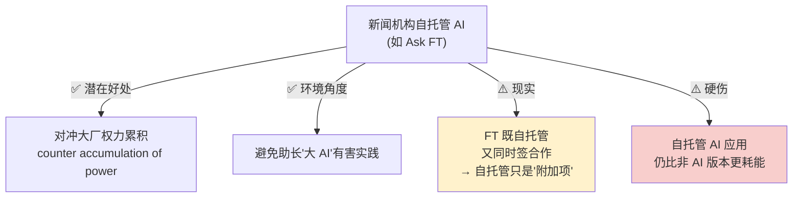

> ⚠️ **常见坑 · "自建就环保"是幻觉**
> 关键洞察：**自托管的 AI 应用，仍然比它的"非 AI 对应物"更耗能。** 而且现实中，FT 是"既自托管、又搞合作"——自托管只是合作的**补充**，而非替代。所以自托管既是一线希望（对冲权力），又不是环境层面的免罪金牌。

---

## 🧩 七、结论：可持续性是"纠缠"的，责任是"分布"的

### 7.1 三重可持续性无法拆开谈

作者的总纲（PDF p.266）：

> **生成式 AI 的市场权力，是理解"环境、社会、经济上有害的行业标准如何被建立和固化"的钥匙。** 当所有可持续性维度都被承认其"相互关联（interrelation）"时，生成式 AI 的可持续性就变成一个**更宏大**的问题。

一封新闻机构关于版权侵权的公开信，恰好体现了这种纠缠：

> **"Such practices undermine the media industry's core business models, which are predicated on readership and viewership... In addition to violating copyright law, the resulting impact is to meaningfully reduce media diversity and undermine the financial viability of companies to invest in media coverage, further reducing the public's access to high-quality and trustworthy information."**
> （这类做法破坏了媒体产业以读者和观众为前提的核心商业模式……除了违反版权法，其结果还会实质性地削弱媒体多样性、削弱企业投资于新闻报道的财务可行性，进而进一步减少公众获取高质量、可信信息的渠道。）
> —— David, 2023

看这段话如何把三者串起来：**版权（经济）→ 媒体多样性（社会）→ 公众信息获取（民主）**，环环相扣。

### 7.2 破除"孤立的生态视角"

本章对全书的方法论贡献（回应 Hesmondhalgh, 2021 呼吁"把基础设施视角与政治经济学视角连起来"）：

> 🔬 **核心论证 · 只谈能耗是"视野太窄"**
> "孤立的生态可持续性视角（isolated ecological sustainability perspectives）"是有局限的。**只焦虑 AI 应用的能耗，看不到影响如何沿着价值链相互关联。** 政治经济学视角揭示：市场权力如何**沿着生成式 AI 的基础设施显现**——并由此照亮"新闻合作"这些看似无害的商业动作，其实对**信息获取、认识论（epistemologies）、公共领域的构成**有极其深远的影响。

### 7.3 核心结论三连

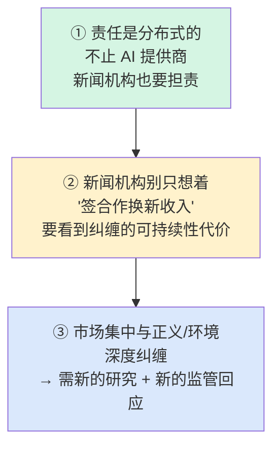

作者最后强调，媒体传播研究不能只研究"新闻编辑室里用 AI 带来的变化"，更要理解**机器作为"传播者"的认知角色（the epistemic role of machines as communicators）**。一场"根本性的转变（seminal shift）"正在发生。

> 💡 **实战 / 面试高频 · 本章一句话总结**
> **"AI 是否可持续，不是一个工程问题，而是一个'谁掌握基础设施、谁制定标准、谁当守门人'的政治经济学问题——而新闻合作是这套权力机器上一个被忽视却关键的齿轮。"**
> 若被问"如何全面评估一项 AI 技术的可持续性"，标准答案框架就是本章的**经济×社会×环境三重纠缠 + 基础设施视角**。

---

## 📊 附：全章核心论点一图流

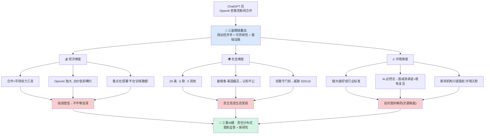

---

## 📌 小结

| # | 要点 | 一句话 |
|---|---|---|
| 1 | **现象** | ChatGPT 后，OpenAI 领跑密集签新闻合作（AP、Axel Springer、卫报、大西洋月刊、新闻集团…），已成行业标准 |
| 2 | **悖论** | 微软 CEO 一边是最大集中方，一边宣称 AI 会"颠覆集中化"——典型话术 |
| 3 | **理论** | 三副眼镜叠加：批判政治经济学 × 可持续性(=代际正义) × 基础设施视角 |
| 4 | **基础设施视角精髓** | 不看"技术怎么工作"，看"基础设施里的政治理性与市场动态"——AI 是权力的凝结物 |
| 5 | **价值链** | 6 阶段(开采→制造→设备→训练→部署→废弃)，大厂每环占先 → 权力自我强化 |
| 6 | **方法** | 定性网络分析，36 份文档(2022.11–2024.09)，编码行动者/关系/规范 |
| 7 | **💰经济** | 合作=市场权力工具；钱不是关键(Apple 出价高却签不下)；重点是"部署"而非训练数据；结果抬高壁垒、加深不平等 |
| 8 | **🌍社会** | 29 美 : 6 欧 : 0 非/亚/南美，盎格鲁-美国偏见→认知不公；双重守门权威胁 SDG16"强机构" |
| 9 | **🔥环境** | 市场权力=定义"越大越好"标准的权力；AI 必然论正当化毁约+核电复活；新闻机构只争版权、对环境沉默；自托管仍更耗能非解药 |
| 10 | **结论** | 三重可持续性无法拆开谈；责任是分布式的(新闻机构也是共谋);只谈能耗视野太窄;需新监管与新研究 |

**给 AI-Infra 从业者的启示**：当你在优化推理成本、堆算力、谈"模型越大越强"时，本章提醒你——**这些工程默认值(defaults)本身就是市场权力的产物**。真正的"可持续 AI"不只在于把 FLOPs/瓦特做得更漂亮，更在于**质疑"谁在制定标准、谁被排除、代价由谁承担"**。技术选择从来不是中立的。

---

## 🔗 延伸阅读与钩子

**本章内部关键文献（按主题）**

- 市场集中理论：Vipra & Korinek (2023)《基础模型的市场集中含义：ChatGPT 看不见的手》(Brookings)；Gray Widder et al. (2023)《Open (for business)：大厂、集中权力与 OpenAI 的政治经济学》
- 基础设施研究：Larkin (2013)《基础设施的政治与诗学》；Parks & Starosielski (2015)《Signal Traffic》；Star & Ruhleder (1996)《迈向基础设施生态学》；Parks et al. (2023)《Media Backends》
- 政治经济学：Wasko/Murdock/Sousa (2011)《传播政治经济学手册》；McChesney (2008)；Staab (2024)《数字资本主义中的市场与权力》
- 环境成本：Bender et al. (2021)《随机鹦鹉》；Strubell et al. (2020)《能源与政策考量》；Li et al. (2023)《让 AI 不那么"渴"：AI 的秘密水足迹》；Luccioni et al. (2022)《估算 BLOOM 176B 的碳足迹》
- 认知/文化正义：Alvarado (2023)《AI 作为认知技术》；Luo & Puett (2024, Nature)《盎格鲁-美国偏见或使生成式 AI 成为看不见的智识牢笼》；Jaźwińska & Chandrasekar (2025, CJR)《AI 搜索有引用问题》
- 政策文件：United Nations (2015) SDGs；UN WCED (1987)《我们共同的未来》；Vestager et al. (2024) 欧盟-CMA-DOJ-FTC 生成式 AI 竞争联合声明

**动手钩子**（把本章批判视角落到实处）

- 🔍 **复现迷你版研究**：去 [Platforms and Publishers: AI Partnership Tracker](https://petebrown.quarto.pub/pnp-ai-partnerships/)（书末脚注给的持续更新版合作清单），自己数一遍"美国 : 欧洲 : 全球南方"的合作机构比例，看 2025 年后是否仍失衡。
- 📈 **量化守门效应**：用几个 AI 搜索引擎问同一个"非西方时事"问题，记录它引用了哪些新闻源、有没有归因错误——复现 Jaźwińska & Chandrasekar (2025) 的"引用问题"。
- 🌐 **对照阅读**：本书前几章讲数据中心能耗/水足迹的工程视角，回头对比本章"孤立生态视角视野太窄"的批评，体会"三重纠缠"如何超越单一环境维度。

> 一句话收尾：**可持续的 AI，不是把电用得更省，而是把权力分得更公。** 🌱
