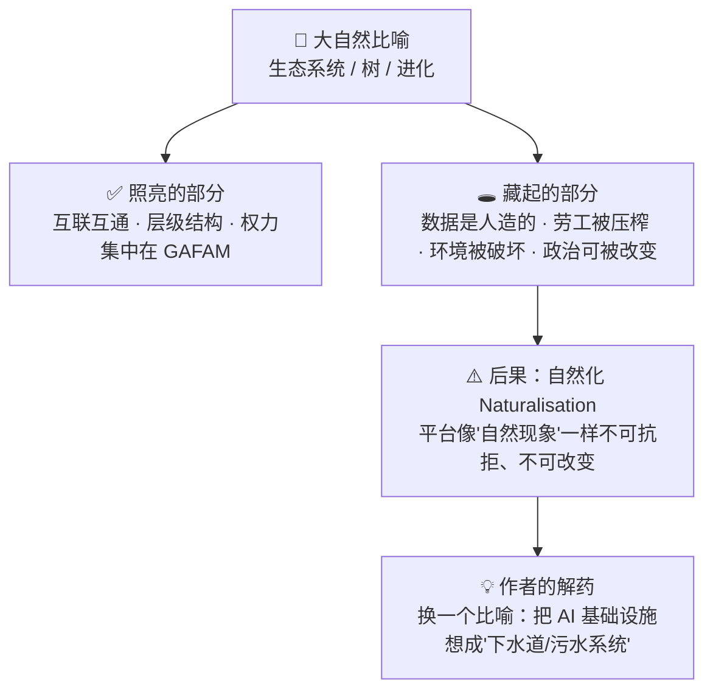
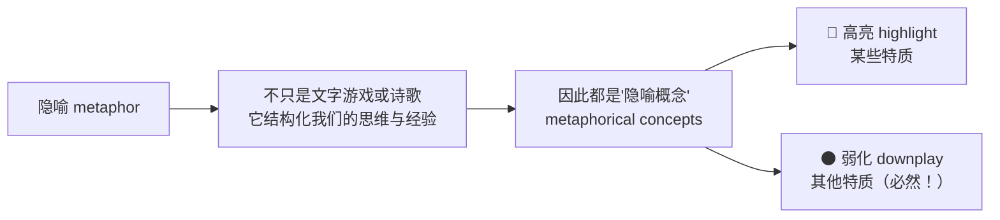
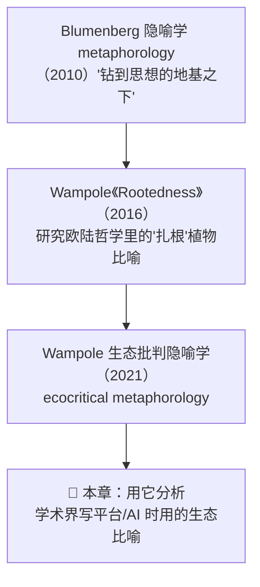
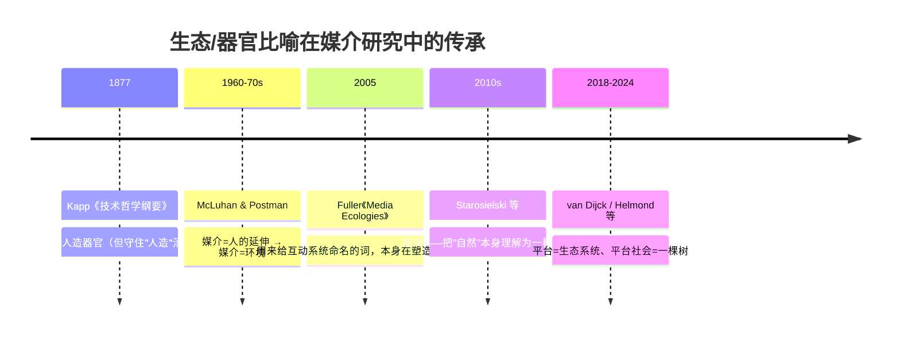
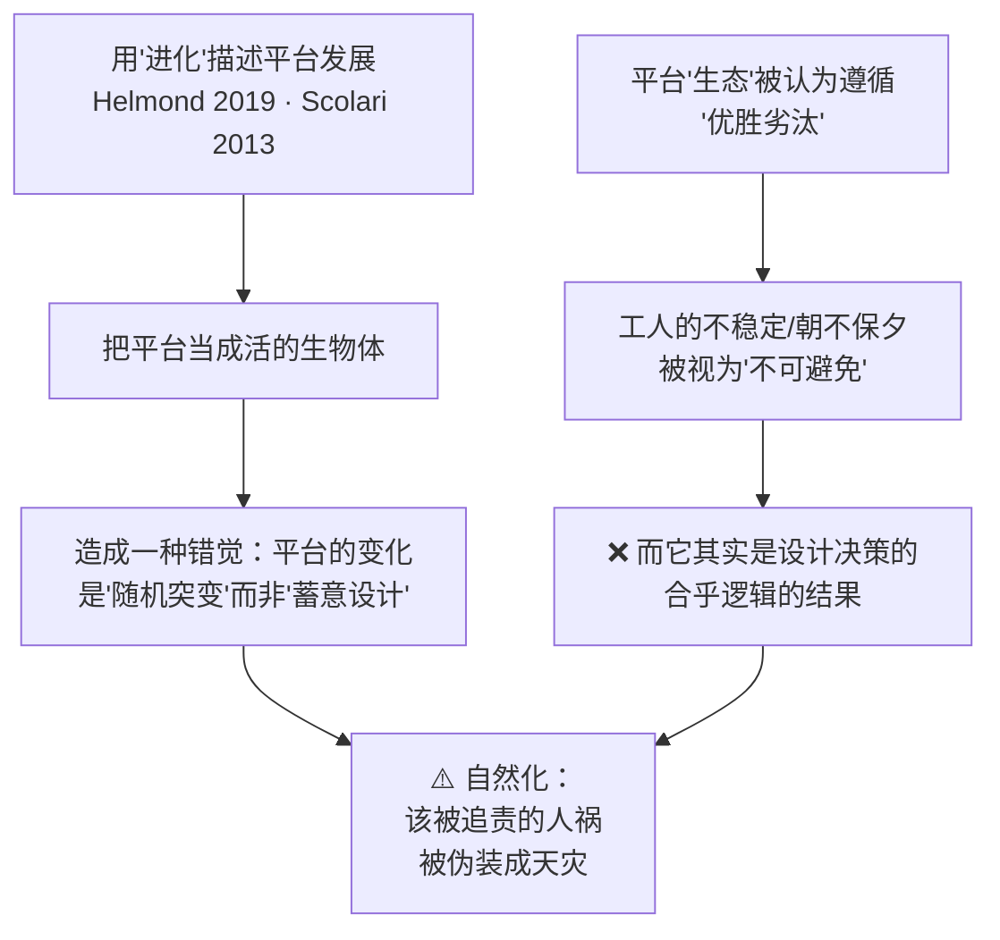
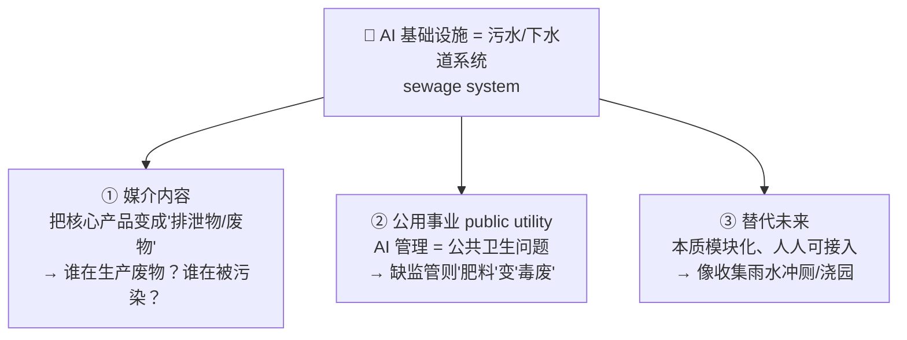

# 第 12 章 · 只见树木不见数据：生态隐喻如何（误）塑造我们对 AI 数据与算力的理解 🌳

> 原书章名：**Not Seeing the Data for the Trees: How Ecological Metaphors Matter in Academic Discourse on Platforms and AI**
> 作者：Gerwin van Schie（乌得勒支大学）& Inte Gloerich（阿姆斯特丹应用科学大学）
> 对应 PDF 第 274–292 页 · 属于全书第三部分「Futures, Politics, Governance（未来·政治·治理）」

---

## 🗺️ 本章地图

这一章是一篇**人文社科（媒介研究 + 批判数据研究）**的论文，不是技术手册。它的核心问题只有一个：

> **当学者和产业界用"生态系统（ecosystem）""树（tree）""进化（evolution）"这类来自大自然的词去描述平台和 AI 时，这些比喻到底帮我们看清了什么、又替我们藏起了什么？**

作者的答案（也是本章骨架）：



你读完本章会掌握 6 件事：

| # | 小节 | 一句话抓手 |
|---|------|-----------|
| 1 | 引言 | 比喻不是修辞点缀，而是"会做事的语言"（performative language），它悄悄塑造政策与认知 |
| 2 | 研究比喻的方法 | Lakoff & Johnson 的隐喻理论 + Wampole 的"生态批判隐喻学（ecocritical metaphorology）" |
| 3 | 把媒介理解为生态 | 从 Kapp（1877）到 McLuhan，"技术=器官/环境"的思想史 |
| 4 | 平台即生态、平台社会即一棵树 | 详解 José van Dijck 的"树"比喻：根/干/枝 三层 |
| 5 | 树与生态比喻藏起了什么 | 五大盲区：劳工、异见、设计性、去中心化、政治非自然 |
| 6 | 结论：走向替代比喻 | 提议把 AI 想成"下水道/污水系统（sewage system）" |

> 🎯 **为什么一个搞 AI Infra 的人要读这章？** 因为你每天挂在嘴边的 "AI 生态""模型进化""数据是新石油" 全是比喻。比喻决定了监管者怎么立法、公众怎么看你、投资人怎么估值。看懂"比喻的政治"，你才能在讲 AI Infra 故事时不被别人的比喻牵着走。

---

## 1. 引言：比喻会"做事" 🔨

### 1.1 是什么：树和自然，是人类最古老的比喻库

作者开篇提醒我们一件容易忽略的事——**树、植物、生态，几千年来一直是人类思考的隐喻矿脉**：

- 哲学和文学里到处是"根（roots）、枝（branches）、茎（stems）"（Wampole, 2016）；
- 知识的组织与可视化，从中世纪起就爱画成"树"的样子（想想生物学的"进化树"、家谱"树"、文件目录"树"）；
- 而**计算与技术领域尤其泛滥**：生态（ecology）、各种维持生命的自然元素（Peters, 2015）。

> 💡 **面试/闲聊高频**：为什么工程师天天说 "dependency tree（依赖树）""git tree""Merkle tree""decision tree（决策树）"？因为"树"这个结构——一个根、层层分叉、不回环——太符合我们对"有层级、无循环的秩序"的直觉了。本章要做的，恰恰是**质疑这种"太自然了以至于没人多想"的直觉**。

### 1.2 为什么重要：比喻是 "performative language（施为性语言）"

这是全章的**第一性论证起点**，务必吃透。作者引了三位思想家：

| 引用 | 观点 | 白话 |
|------|------|------|
| Austin (1962) *How to do things with words* | 语言不只是"描述世界"，更能"在世界里做事" | 你说"我宣布你们结为夫妻"，说完这句话婚姻就真的成立了——语言=行动 |
| Carbonell et al. (2016) | 比喻会"采取行动（take action）" | 比喻不是被动的装饰，它主动改变现实 |
| Wampole (2021) | 比喻制造"下意识不断自我重复的思维模式" | 用久了的比喻，会变成你都察觉不到的思考惯性 |

> 🔬 **核心论证（本章的地基）**：
> **比喻 = 会施加影响的行动**。它一边解释事物，一边**执行（perform）着社会规范、意识形态和世界观**，并因此影响：① 技术开发方向 ② 政策制定 ③ 大众接受度。
>
> 换句话说：**选哪个比喻，从来不是中立的、随便的选择**，而是被说话人（或整个文化）的意图、政治立场、意识形态所驱动的。

作者特别点名：用"自然/生态"来包装的比喻，**既被污染工业用于营销洗白**（Smith, 1998，"绿色营销"神话），**也被研究媒介和技术的学者自己在用**——所以搞清楚这些比喻的政治含义至关重要。

### 1.3 本章要审判的两个"被告"

作者选了两部**平台研究领域影响力极大**的文献开刀：

1. **José van Dijck《Seeing the Forest for the Trees》（2021）** —— 用"一棵树"的形象来思考如何监管平台公司。
2. **《The Platform Society》（van Dijck et al., 2018）** —— 把平台公司和技术操作化为一种"生态"来理解。

作者的核心指控（先记住，后面逐层展开）：

> **这些生态比喻"自然化（naturalise）"了平台，以及 AI 所依赖的知识过程与基础设施。** 它们让"平台使用 AI"这件事看起来天经地义、自然而然。

作者回应的是 Wyatt（2021）向媒介研究者发出的号召——"**解构强者的比喻（deconstruct the metaphors of the powerful）**"并提出替代方案。所以本章不只是批判，还要**自己造一个新比喻**。

### 1.4 一个必须警惕的当下动向

作者点名 Helmond & van der Vlist（2024）——两位平台研究学者主张"**继续把'平台'比喻和'生态系统'这类概念框架整合起来**"，以此来应对不断演化的平台格局，并预判即将到来的 **"AI 平台大转移（AI platform shift）"**。

本章明确定位为**对这一号召的反驳（counter-argument）**：揭示这种比喻对"想象一个环境可持续的平台/AI 未来"的社会政治后果。

---

## 2. 研究比喻的方法：隐喻学 🔬

### 2.1 Lakoff & Johnson：隐喻的本质

本节的理论基石来自语言学经典 *Metaphors We Live By*（Lakoff & Johnson, 1980）：

> **"隐喻的本质，是用一种事物去理解和体验另一种事物。"**
> （*The essence of metaphor is understanding and experiencing one kind of thing in terms of another.*）

由此推出三条关键结论：



| 概念 | 是什么 | AI 例子 |
|------|--------|---------|
| **高亮（highlight）** | 比喻凸显被描述物的某些方面 | "数据是新石油" → 高亮"数据有巨大经济价值、可被开采变现" |
| **弱化（downplay）** | 高亮的**代价**是必然遮蔽另一些方面 | 同一个比喻 → 遮蔽"数据是关于活生生的人的、有隐私和同意问题的" |

> ⚠️ **常见坑**：很多人以为比喻是"中立的教学工具"，用完就扔。错。**每一次高亮，都同时在遮蔽**。这是一个零和结构——你不可能只享受比喻带来的"看清"，而不承担它带来的"看不见"。这就是本章标题的双关：**"只见树木不见数据（Not seeing the data for the trees）"**——你被"树"迷住了，反而看不见撑起这棵树的真实数据、劳工与算力。

### 2.2 已经"石化"的比喻最危险

作者引 Anaïs Augé（2023）：气候变化辩论里到处是比喻——"地球是一栋着火的大楼""气候科学是假宗教"——用哪个比喻，全看你站在辩论的哪一边。

但真正危险的是**已经被正常化、变成日常语言一部分**的比喻。这时：

- 说话人的意图和目的**退到了背景里**；
- 比喻却**不动声色地继续携带"隐含预设（implicit presuppositions）"**（Deleuze & Guattari, 2021）；
- 从而影响真实的态度、行动和社会政治现实，**通常是在维护既有的权力格局**。

> 🔬 **教科书级案例："云（the cloud）"**
>
> "云"这个比喻，把撑起所有平台服务的**数据中心、服务器农场**——那些实实在在的、耗电耗水的钢筋水泥建筑——描绘成**非物质的、飘渺的**（Peters, 2015）。
>
> | "云"高亮了 | "云"藏起了 |
> |-----------|-----------|
> | 便捷、无处不在、轻盈、随取随用 | 巨大的能耗、占地、水冷、稀土开采、地缘政治、电子垃圾 |
>
> 结果：从平台技术的**政策制定**到个人的**数据习惯**，都被"飘渺的云"这个意象扭曲了。你以为文件"上传到云端"就消失在空气里了，其实它躺在爱尔兰或内蒙古一个耗电堪比小城市的机房硬盘上。

作者由此定义了整个批判数据研究领域的任务：

> **调查比喻传达了哪些意义、又隐藏了哪些意义，以及它们许可（afford）了什么样的态度和行动。**

### 2.3 方法论：生态批判隐喻学（ecocritical metaphorology）

这是本章的**招牌方法**，名字拗口但逻辑清晰，拆成三层：



| 层 | 提出者 | 核心 |
|----|--------|------|
| 地基 | **Blumenberg（2010）** | "隐喻学"是一种"钻到思想substructure（基层结构）之下"的方法——挖出我们思考时不自觉依赖的隐喻底座 |
| 应用 | **Wampole（2016）《Rootedness》** | 用这方法研究欧陆哲学里"扎根""根性"这类植物比喻的种种含义 |
| 升级 | **Wampole（2021）** | 提出这方法也能研究**日常**的生态比喻，尤其是那些"**会引发行为和政策改变的语言生产**"，因为它能"揭示人们谈论环境和气候变化时的无意识模式" |

**本章的具体做法（务必记住这个方法论选择）**：

> 作者说，他们把大部分注意力放在比喻的 **connotative（引申/内涵）** 层面，而**不是** denotative（字面/外延）层面。
>
> - **字面（denotative）**：作者本来想用这个比喻解释什么功能？（比如"树的根=底层基础设施"）
> - **引申（connotative）**：这个比喻还**同时唤起了哪些别的意义**？（比如"树"还唤起"自然生长、不可抗拒、无人设计"）
>
> **方法诀窍：把比喻"延伸到比作者本意更远的地方"**（extending the metaphor further than originally intended），在环境破坏和气候变化的背景下，把这些常见生态比喻**问题化（problematize）**。

> 💡 **实战启示**：这是一种非常可迁移的批判技巧——**"把对方的比喻当真，一直推到底"**。对方说"平台是一棵树"？好，那树上的虫子是谁？给树授粉的蜜蜂是谁？（后面第 5 节作者正是这么干的，答案是：内容审核工和零工/用户。）当你把一个自证其明的比喻推到它遮蔽的角落，它的意识形态就暴露了。

---

## 3. 把媒介理解为生态：一段思想史 🌿

作者要证明"生态比喻"在媒介研究里**根深蒂固、由来已久**，所以追溯了一条思想脉络。

### 3.1 起点：Ernst Kapp（1877）——技术是人的"器官"

许多人认为**技术哲学的开端**，就是 Kapp 1877 年的《技术哲学纲要》（*Grundlinien einer Philosophie der Technik*）。他把工具和机器理解为**活生物体的器官（organs）**。

关键在于——**Kapp 从没忘记这只是个比喻**。作者抄录了两句原话来证明这一点：

> **1.（工具的意义依赖于人）**
> "一棵树的根，从树干上切下来，就不再是根了；在这种脱离母体的孤立状态下，它只是**另一块木头**。"
> （*The root of a tree, cut off from the trunk, ceases to be a root; it is, in this extragenetic isolation, just another piece of wood.*）
>
> —— 工具作为器官，只有在**使用它的人**的关系中才获得意义和目的。

> **2.（技术是人造的，不是自然长出来的）**
> "工具和机器既不长在树上，也不像天赐的吗哪（manna）从天而降；相反，它们存在，是**因为我们自己制造了它们**。"
> （*Tools and machines neither grow on trees nor fall like manna from heaven; instead, they exist 'because we have made them ourselves'.*）

> 🔬 **核心论证（作者埋的关键伏笔）**：注意 Kapp 这句话——**"工具不长在树上，是我们造的。"** 这恰恰是本章要捍卫的立场！Kapp 用了满纸自然比喻，却**始终守住了"这是人造物"的清醒**。而后来的平台研究者（van Dijck 等）用"树"比喻时，恰恰**丢掉了 Kapp 的这份清醒**，让平台看起来像是自然长出来的。作者是在用比喻的祖师爷来打比喻的后人。

### 3.2 继承：McLuhan——媒介是"人的延伸"，更是"环境"

Kapp"技术即人造器官"的思想，虽然很多细节已被推翻，却明显活在媒介学者身上：

- **Marshall McLuhan**：媒介是"**人的延伸（the extensions of man）**"（1994）——这是"器官"思路的直接后裔。
- **McLuhan + Neil Postman**：更进一步，把媒介理解为一种**环境（environment）**。

这个"**媒介的环境式理解（environmental understanding of media）**"，大约从 **1960–70 年代**起成为媒介研究的主导范式之一。标志就是"ecology（生态）"这个词在媒介研究里被反复使用（Grønning, 2020; Lum, 2000; Scolari, 2012）。



### 3.3 一个必须区分的"意识形态差别"

作者在这里划了一条**极其重要的界线**，别读漏：

> **有些学者把"自然本身理解为一种媒介"**（Starosielski, 2019）——比如把森林当作一种"媒介"来分析——这**没问题**，甚至有益，因为它能凸显"当代的自然其实是被社会政治高度充电（socio-politically charged）的"。
>
> **但**"通过生态比喻把平台和 AI 自然化"——这是**另一回事，有问题**。

| | 把自然理解为媒介 | 把平台/AI 自然化 |
|---|---|---|
| 方向 | 自然 → 被看成媒介（人造、有政治） | 平台 → 被看成自然（无政治、天然） |
| 效果 | ✅ 揭示自然的社会政治属性 | ❌ 遮蔽人造决策、基础设施、政治 |
| 风险 | 低 | 高：掩盖当代技术的"殖民的、资本主义的、破坏环境的"本质 |

> ⚠️ **常见坑**：不要以为本章在反对一切"自然/文化不分"的做法。作者承认，Haraway（1997）早就指出"分开自然和文化"本身就有问题。作者反对的**不是**打通自然与文化的哲学努力，而是**单向地把人造的、有政治后果的平台，伪装成没有政治的自然现象**。

---

## 4. 平台即生态、平台社会即一棵树 🌳

这是全章分析的**主战场**——把 van Dijck 的"树"比喻拆开逐层讲。

### 4.1 背景：平台研究里，"生态"是通用语

在当代平台研究中，"platform ecology（平台生态）""AI ecosystem（AI 生态系统）"是理解**科技公司、物质基础设施、文化生产三者之间相互关系与依赖**的常见方式（van Dijck et al., 2018 等）。

作者顺带盘点了两条已有的批判路线（说明"批判生态比喻"不是他们首创）：

| 学者 | 比喻切入点 |
|------|-----------|
| Maxwell & Miller (2012) *Greening the Media* | 从**物质环境影响**角度操作化"媒介生态" |
| John Durham Peters (2015) | 批判"**云（cloud）**"的比喻 |
| Jussi Parikka (2010) *Insect Media* | 计算文化里的**昆虫、病毒**比喻 |

作者说：但我们还**缺少**对"植物的、树木的、环境的（botanical, arboreal, environmental）"比喻的批判——**尤其因为连批判性媒介学者自己都在用这些比喻**。

### 4.2 "阿姆斯特丹学派"与 van Dijck

作者把火力集中在被称为 **"阿姆斯特丹平台研究学派（Amsterdam School of platform studies）"**（Christofari, 2023）的代表人物 **José van Dijck** 身上——她研究大科技公司近二十年。

追溯 van Dijck 对"生态"比喻的两次使用：

**① 荷兰语版《De platformsamenleving》（2016，面向政策制定者等大众）**

> 作者们**明说**："连接性平台的生态系统（the ecosystem of connective platforms）"这个比喻，是为了传达所有在线平台通过共享机制而产生的"**高度互联与相互纠缠（interconnectedness and mutual entanglement）**"。

**② 英语版《The Platform Society》（2018，面向学者）**

> ⚠️ **作者抓到的关键破绽**：在英文版里，"platform ecology"第一次出现时，作者们承认了"platform（平台）"是个比喻，并**专门写了脚注解释"平台"这个比喻**——**却好像忘了解释"生态（ecology）"本身也是一个比喻！**
>
> 这正是本章的证据：**"生态"这个比喻已经自然化到连批判学者都没意识到它是比喻**——它已经"隐身"了。

### 4.3 van Dijck (2018)：平台社会是一个"生态系统"

van Dijck 等人把平台社会**铸造成一个生态系统/生态**，是为了能研究其错综连接对公共生活的社会政治与经济影响。他们强调（务必记住这句反自然化的话）：

> 平台生态系统**看似中立**，但——
> "**它并不中立，恰恰相反，铭刻在生态系统架构里的意识形态信条，在'什么构成公共价值、谁的利益被服务'这件事上，盖下了一个巨大的印章。**"（p. 22）

> 💡 **值得玩味**：van Dijck 自己也知道"生态"听起来太中立、太天然，所以特意声明"它不中立"。但本章作者要论证的正是：**光靠一句声明"它不中立"，压不住"生态"这个词本身持续散发的"自然、天然、中立"的连带意义**——这就是 2.2 节说的"石化比喻的隐含预设"在起作用。

### 4.4 van Dijck (2021)：升级为"一棵树"——根、干、枝

2021 年，van Dijck 加上了更精细的**"树"的比喻**（根 roots、干 trunk、枝 branches），来表征平台社会不同组件之间的关系与权力动态。

她声称"树"比喻做出**四大贡献**：

| # | 贡献 | 白话 |
|---|------|------|
| 1 | 解释层级 | 说清那些复杂、常被黑箱化的平台系统的等级结构 |
| 2 | 关注动态 | 引起对"维持这些层级的动态机制"的注意 |
| 3 | 促成整体治理 | 帮助把"碎片化的治理框架"重绘为"更整体的方法"（p. 2802）|
| 4 | 定位干预点 | 高亮治理、监管、政策**可以介入**以支持公共价值的关键点 |

**树的三层结构详解**（这是本章你必须能默画出来的核心图）：

```mermaid
flowchart TD
    subgraph 枝叶 Branches & Leaves
      L1["医疗 App"]
      L2["出行 App"]
      L3["新闻平台"]
    end
    subgraph 树干 Trunk
      T["GAFAM 中介层<br/>Google · Apple · Facebook · Amazon · Microsoft"]
    end
    subgraph 树根 Roots（地下·看不见）
      R["协议 · 电缆 · 稀有金属<br/>芯片 · 数据中心"]
    end
    L1 --> T
    L2 --> T
    L3 --> T
    T --> R
    L1 -. "光合作用：供给数据 🍃" .-> T
    L2 -. 数据 .-> T
    L3 -. 数据 .-> R
```

逐层讲解（对照原文）：

**🌰 树根（roots）= 地下、看不见的基础设施**

> 我们能看到、体验、交互的只是平台社会的某些部分；**另一些部分——树根——处于我们直接视线之外**。这片地下空间住着：**协议、电缆、稀有金属、芯片、数据中心**——这些正是"要有平台，首先得有"的基础设施前提。

作者引 Star & Ruhleder（1996）关于基础设施的经典洞见：

> **树根（基础设施）常常被视为理所当然（taken for granted），或因为依赖它的那棵树太大太重要，而显得"无法被改变"。**

> 🔬 **面试高频延伸**：这正好呼应了整本书的主题——AI Infra 的"根"（数据中心、能耗、稀土、水冷）平时被大众和政策完全忽视，因为大家只看得见"枝叶"（好用的 App）。而 AI 对内容推荐等功能来说，平台本身也扮演"基础设施"角色——**AI 也是长在这棵树的地下的**。

**🪵 树干（trunk）= GAFAM 中介层**

> 服务特定行业（医疗、出行、新闻）的 App 和平台（=枝），**依赖主宰树干的中介**。而这些中介大多落在强大的企业伞——**GAFAM**（Google, Apple, Facebook, Amazon, Microsoft）——的控制之下。
>
> 例子：一家新闻媒体想触达受众，就得依赖 Google 的算法搜索动态，或 Facebook 及其子公司的社交功能。**树干因此对"枝能做什么"握有巨大权力。**

**🍃 树枝的叶子（leaves）= 光合作用 = 数据供给**

这是"树"比喻里最精巧、也最需要警惕的一环：

> 就像叶子进行**赋予生命的光合作用（life-giving photosynthesis）**，平台树的枝叶也提供了**赋予生命的数据供给（life-giving supply of data）**，供养着树干和树根。**正是这些数据，使得越来越多渗透进平台功能的、基于 AI 的各种流程成为可能。**
>
> 尽管权力层级存在（GAFAM 树干的权力不容低估），但"**树的每一部分都在支撑整棵树的健康**"。（van Dijck, 2021）

> ⚠️ **这就是标题双关落地的地方**："只见树木不见数据（Not Seeing the **Data** for the Trees）"——数据在这个比喻里被浪漫化成了"光合作用产出的养分"，听起来自然、循环、健康。但真实的数据从哪来？是被谁的点击、谁的隐私、谁的无偿劳动"光合"出来的？"树"的意象把这个尖锐问题**软化成了田园牧歌**。

### 4.5 平台是"活的、会变形的"树

van Dijck (2021) 进一步说，平台像树，因为它们"构成'活的'动态系统，总在变形，从而**共同塑造着自己的物种**"（p. 2805）。

一个生动的子比喻——**"穿过栅栏的树枝"**：

> 监管框架常常孤立地、或在国界内处理平台化问题，结果平台公司总能绕过监管机构设下的重重障碍。**就像一棵树，新枝会从"意在限制它生长的栅栏"的缝隙里钻出来**，平台也会变异，绕过那些会阻碍其权力延续的监管。

对 van Dijck 而言，"平台化之树"这个比喻是**积极的**——它能促成"服务于人民和社会、而非服务于企业中心化权力"的新平台想象。

### 4.6 "生态系统"的两种尺度

加上"树"之后，"ecosystem（生态系统）"这个词可以在两个尺度上理解：

| 尺度 | 含义 | 例子 |
|------|------|------|
| **① 微观：一个平台/公司 = 一个生态** | 描述某个 App 内部、或某公司软硬件边界内创造的环境 | 苹果"生态"、微信"生态" |
| **② 宏观：平台们生存的环境 = 一个生态** | 平台成为**争夺资源的"物种"** | "进化""入侵物种"等词由此而来 |

宏观尺度下衍生的一串自然词：

- **"进化（evolution）"**：讨论某 App/公司的发展史（Helmond et al., 2019; Scolari, 2013）；
- **"入侵物种（invasive species）"**：讨论新技术如何扰乱既有媒介格局（Lai & Flensburg, 2021）。

> 🔬 **核心论证**：作者指出，"进化""树""入侵物种"虽然用词不同，**却都在调用同一个生态比喻**——因为它们都隐含着**稳态（homeostasis）**：一个不断寻求"居民之间平衡（equilibrium）"的环境。这就是关键的意识形态——**平台世界被想象成一个总会自动回到平衡的、稳定的自然系统**。

### 4.7 承上启下：好处承认，但……

作者在这一节末尾给了 van Dijck 公道：

> **"树"比喻让平台社会的组织结构变得清晰，由此获得的洞见对制定捍卫公共价值的政策至关重要。** 但——我们要论证，这个比喻**还有别的效果**。

那"别的效果"是什么？一句话预告了第 5 节的核心指控：

> 用"树"和生态比喻，会在**话语上把平台的结构与关系"自然化"**，把它们描绘成——在某种程度上——**独立于人类意图和干预的、自主的存在**。这与"技术发展贯穿人类史的真实环境影响"（Crawford, 2021; Velkova; 电子垃圾 Wan, 2021）**严重不符**。
>
> **所以：我们应当警惕把 AI 和平台基础设施等同于自然与生态。这就是我们批判和呼吁替代方案的维度。**

---

## 5. 树与生态比喻藏起了什么 🕳️

这是本章**批判的高潮**。作者用 2.3 节的方法——"**把比喻延伸到超出作者本意的地方**"——一刀刀剖开"树"藏起的东西。我把它们整理成**五大盲区**。

### 盲区一：劳工——树上的虫子与蜜蜂 🐛🐝

作者玩了一个漂亮的"以子之矛攻子之盾"：既然平台是树，那**树上还有什么？**

> - 树上的**虫子（bugs）** = 大量但隐形的**内容审核团队（content moderators）**——他们在恶劣条件下从事情感上极度消耗的劳动；
> - 给树**授粉的蜜蜂（bees）** = **点击工（click workers）、零工（gig workers）、日常用户**——他们在平台间移动，有意或无意地生产出被平台和 AI 公司资本化的数据供给。

> 🔬 **核心论证**：这些"维持树的健康"的根本要素，**恰恰落在"根/干/枝三层"的视野之外**。就像真实的树离不开一张由其他活物构成的网络，平台也离不开这张网。但标准的"树"比喻只有三层，把维持它运转的**人类劳动整个抹掉了**。

```mermaid
flowchart LR
    subgraph 标准树比喻只有三层
      A["根 · 干 · 枝"]
    end
    subgraph 被藏起的第四维·活的网络
      B["🐛 虫子 = 内容审核工<br/>情感劳动·恶劣条件"]
      C["🐝 蜜蜂 = 点击工/零工/用户<br/>无偿生产数据"]
    end
    A -.视野之外.-> B
    A -.视野之外.-> C
```

### 盲区二：异见与冲突——被"稳态"抹平 ✊

> "树"高亮了既有基础设施和平台公司的**权力**。但在此过程中，**这份权力被"抹平"了：仿佛不可能有任何异见或差异（no dissent or difference seems possible）。**

把自然比喻扩展到更大图景，风险是**把平台化呈现为一种"自然平衡"**。但事实是：

> 并非平台内外发生的一切都在维持它。**虫子不会让人想到"异见"**，可平台上持续发生着"反其道而行、要求变革、劫持系统另作他用"的活动——从**活动家绕过内容审核**，到**第三方非法使用数据**。
>
> **平台是争斗（contestation）、行动主义（activism）、战术性使用（tactical use）的空间**（Milan & Treré, 2019），**而不是平衡**。把它们呈现为自然系统、生态现象，**掩盖了"让它们运转"所需要的那些斗争**（无论好坏）。

作者引 Heise（2002）一句致命的话：

> "它把**人类仅仅塑造成一个他们无法控制的准生物系统里的零件**，并且似乎没有给'理论化人类在技术创造与使用中的能动性和意图'提供任何明显的出发点。"
> （*it casts humans as mere components of a quasi-biological system that they cannot control...*）

> ⚠️ **这是本章对 AI 从业者最尖锐的提醒**：当你说"AI 生态在自我进化"时，你可能正在**把决定这一切的真实的人（工程师、标注员、监管者、抗议者）降格为'系统里的零件'**，从而在话语上取消了"我们本可以做出不同选择"的可能性。

### 盲区三：设计性——它是被设计的，不是长出来的 ✏️

这是**最核心的一击**：

> 更根本地，"树"比喻——或任何自然比喻——把平台和平台化呈现为**并非由设计元素构成，而是自然发生的现象（naturally occurring phenomena）**。

作者澄清一个精妙的点：

> 尽管一棵树确实在不断变化、响应环境，但比喻**遗漏**的是——**这些变化是被政治、经济、意识形态所左右的**。
>
> **不存在一个决定整棵平台树形状的"宏大设计"，但每一个元素都是"有利于特定利益相关者、损害另一些人"的情境化决策（situated decisions）的结果。**

推论：

> 这意味着，**在其他社会政治和意识形态语境下，平台化本可以呈现出非常不同的形状**——那些形状根本不适合用"有一个天生中心化树干的树"来表征。

### 盲区四：去中心化——树干天生中心化，容不下联邦/分布式 🕸️

一个绝妙的批判——**比喻本身就排除了替代方案**：

> "树"比喻**强化了树干（GAFAM）的权力，这部分是"设计使然"**。van Dijck 正是**因为**"树"能如此清晰地展示"权力确实中心化于 GAFAM"才用它。
>
> **但与此同时，这个比喻也自然化了"一个平台网络就是要包含这个中心化点"的想法。** 如果平台化社会像一棵树，那就很难想象出一个"不被中心化进根-干-枝结构"的关系网络。

结果：

> **像 Mastodon 这样的联邦式网络（federated networks）、或像区块链这样的分布式数据库（distributed databases），在这个比喻里根本没有位置。** 然而它们也是（或可以是）平台的一部分——只不过是被重新想象过的平台。

> 💡 **第一性原理**：这揭示了比喻的一个隐蔽暴政——**你只能想象你的比喻允许你想象的东西**。"树"有唯一的根、唯一的干，所以它在结构上就**否定了去中心化的可能**。想推动 Web3、联邦宇宙（Fediverse）、去中心化 AI 的人，如果继续用"树/生态"讲故事，等于在用一个反对自己的语言。

### 盲区五：政治非自然——进化 ≠ 优胜劣汰 = 自然法则 ⚖️

作者拆穿"树"比喻里藏着的**"进化方向性（evolutionary directionality）"**：

> 一棵树的根、干、枝构成**同一个物种**：橡树的干长橡树的枝，柳树的根连柳树的干。"树"比喻**暗示了物质基础（根）、几个近乎垄断的大软件平台（干）、跑在其上的众多应用（枝叶）之间存在一种"合乎逻辑的、自然的组织关系"**。

但作者反驳：

> **这套组织方式没有任何一部分是命中注定的**：这些根不会"自然地"通向这个干，这个干也不必然通向这些枝。
>
> 平台树的协议与物质"根"**并不绑定于某个特定"物种"的地上平台**。**Mastodon 和 Instagram 用的是同样的一些"根"**——同一套通用互联网协议、同样的访问硬件。

最后一记重锤，直指资本主义意识形态：

> 附着在"生态"上的一些含义，比如"进化"——**常被错误地等同于"优胜劣汰（survival of the fittest）"**——恰好和资本主义、新自由主义的种种论调严丝合缝。
>
> **但这些政治经济系统不是自然法则（不像引力那样）。它们是人造系统，只要我们集体想改，就能改。**

后果链条：



> 🔬 **一句话总结整节盲区**：**生态比喻把"人祸"讲成了"天灾"**。凡是被说成"自然的、进化的、优胜劣汰的"，就免除了具体的人的责任——工人被压榨？"物竞天择嘛"；GAFAM 垄断？"生态就是这样长的嘛"；数据被无偿采集？"叶子光合作用嘛"。**批判的全部意义，就是把"自然"重新翻译回"选择"，从而让改变重新变得可想象。**

---

## 6. 结论：走向替代比喻——把 AI 想成"下水道" 🚽

作者不满足于批判，遵照 Wyatt（2021）等人的号召，**提出一个替代比喻**。

### 6.1 为什么要主动造新比喻

> 鉴于 AI、平台及其物质基础设施的**人造本性（human-made nature）**，以及**比喻的施为性（performativity）**，我们应当**主动去寻找那些反映技术与公司之"人工、被建构"特征的比喻**。理想情况下，这类比喻还应与已有的"环境批判话语"良好衔接。

### 6.2 新比喻：污水/下水道系统（sewage system）

灵感来源：

| 来源 | 说法 |
|------|------|
| Susan Leigh Star（转引自 Englehardt, 2015） | 从"计算机是**信息高速公路**"转向"**下水道（sewers）**" |
| Cohn（2023） | 把 AI 比作**结肠（colon）**，因为"AI 和所有后端生成了**巨量的废物**" |

于是作者提议：**把数据基础设施、平台公司和 AI 想成一个污水系统的一部分**。这个比喻聚焦三个批判维度：



### 6.3 维度①：数据即废物——"exhaust data（尾气数据）"

> 把 AI 基础设施想成污水系统，就把它的**核心产品变成了排泄物或废物**。虽然现在听起来像是修辞上的跨越，但"**数据是废物**"的说法从批判数据研究诞生之初就存在。

关键引用 **Rob Kitchin（2014）**：

- 很多数据是 **"exhaust data（尾气/废气数据）"**——**从来不是为了被捕获而创造的**（你浏览、点击时"顺带排出"的数字尾气）；
- 他呼吁意识到这些数据在认识论上是**"messy and dirty（凌乱且肮脏的）"**。

作者还点出：这种"脏"的思维其实早就藏在数据科学的日常用语里——**数据"清洗（cleaning）"**（Rawson & Muñoz, 2019, *Against Cleaning*）。

> 💡 **面试高频/认知升级**：你每天说的 "data cleaning（数据清洗）"、"data pipeline（数据管道）"、"data lake（数据湖）"——**这些词本身就暗示了数据是需要处理的、可能有毒的流体**。作者的洞察是：与其用田园牧歌的"光合作用产养分"（树比喻），不如老实承认数据很多是"排泄出来的、需要处理的废物流"——**后者反而更接近工程真相，也更能激发问责**。

### 6.4 维度②：AI 是公用事业，管理它是公共卫生问题

> 把平台基础设施想成污水系统，有助于把 **AI 平台理解为一种公用事业（public utility），把对它的管理理解为一个公共卫生（public health）问题**。
>
> 缺乏监管和监督，可能把**潜在肥沃的物质（fertile material）变成污染我们生存环境的有毒废物（toxic waste）**。因此，对它的管理应当"受到与公用事业提供商同等的审查"（Mollen et al., 2024），并遵守公共价值（van Dijck et al., 2018）。

对比"树"：

| | 🌳 树 | 🚽 下水道 |
|---|---|---|
| 控制感 | 内在中心化控制、追求稳态 | 更流动的意象 |
| 能动性 | 人是系统的零件 | **任何人都可基于共享协议和基础设施建自己的系统** |

### 6.5 维度③：替代未来——模块化、人人可接入

> 就像人们**收集雨水**用来冲厕所、或在干旱时浇灌花园，"平台即污水系统"的意象，把"**已经存在的、或未来可以接入公共骨干（public backbone）的众多替代方案**"带入视野。
>
> 这可能在"关于平台和算法治理的学术辩论"与"它们的基础设施与环境维度"之间，架起一座急需的桥梁。

### 6.6 全章结论

作者最后总结，"下水道"比喻高亮了平台化的三个关键维度：

1. **关注被生产和运输的东西**——从而把"**生产它的人（劳工/用户）**"作为批判调查的焦点；
2. **把 AI 及其平台呈现为公共基础设施**——需要**公共组织的维护**；
3. **提供一个本质上模块化、任何人都可改造的想象**。

最后一句是给人文学者的宣言，也点了本书的题：

> **虽然围绕新兴技术的话语深受企业需求影响，但创造"批判的、却又生动有力的替代方案"是我们的责任。** 而"生态批判隐喻学"是人文学者的一个重要新方法论。

> ⚠️ **一个诚实的自我保留**：作者自己也承认，"下水道"这个新比喻同样**只是又一个比喻**——它一样会高亮某些东西、遮蔽另一些东西（比如它可能过度强调"废物、肮脏"，而遮蔽数据中真正有价值、有尊严的部分）。本章的真正主张不是"下水道一定比树好"，而是：**永远对你正在使用的比喻保持警觉，尤其当它来自权力方、且已经自然到你察觉不到它是比喻的时候。**

---

## 📊 全章核心对照总表

把"树/生态"比喻的五大盲区和"下水道"的对治，做成一张速查表：

| 维度 | 🌳 树/生态比喻 高亮 | 🕳️ 树/生态比喻 遮蔽 | 🚽 下水道比喻 试图对治 |
|------|-------------------|--------------------|---------------------|
| **劳工** | 光合作用产养分（田园化）| 内容审核工（虫）、零工/用户（蜂）的血汗 | 聚焦"谁在生产被运输的东西" |
| **冲突** | 稳态、自然平衡 | 抗争、行动主义、战术使用 | 承认系统是被"维护"出来的 |
| **设计性** | 自然生长、无人设计 | 每个元素都是有利益偏向的情境决策 | 强调人造、被建构 |
| **拓扑** | 唯一中心化的根-干-枝 | 联邦（Mastodon）、分布式（区块链）| 模块化、人人可接入公共骨干 |
| **政治** | 进化 = 优胜劣汰 = 自然法则 | 资本主义/新自由主义是可改的人造系统 | AI = 公用事业 + 公共卫生，需公共监管 |

---

## 📌 小结

1. **比喻会"做事"**：它不是修辞装饰，而是"施为性语言"（Austin），一边解释一边执行意识形态，影响政策、开发、公众认知。选比喻从不中立。

2. **每次高亮必然弱化**（Lakoff & Johnson）：比喻照亮某些方面的代价，是遮蔽另一些方面。最危险的是"石化"的日常比喻——如"云"，把耗电耗水的机房讲成飘渺无物。

3. **方法：生态批判隐喻学**（Wampole）：不看比喻的字面功能，而看它引申唤起的额外意义；诀窍是"**把比喻推到超出作者本意的地方**"，让被遮蔽的角落暴露。

4. **祖师爷 Kapp 的清醒**：技术哲学开创者虽满纸自然比喻，却守住"**工具不长在树上，是我们造的**"。后来的平台学者恰恰丢了这份清醒。

5. **审判 van Dijck 的"树"**：根（数据中心/芯片/电缆）、干（GAFAM 中介）、枝叶（各行业 App，其数据像"光合作用"供养全树）。它清晰展示了权力集中于 GAFAM——但也因此把这一切"自然化"了。

6. **五大盲区**：树/生态比喻藏起了 ① 劳工血汗 ② 抗争与异见 ③ 设计性（人祸被讲成天灾）④ 去中心化替代方案（联邦/分布式）⑤ 政治的可改性（"进化/优胜劣汰"被伪装成自然法则）。**一句话：它把"人祸"讲成"天灾"，从而取消了改变的可想象性。**

7. **替代比喻：下水道/污水系统**：把数据当"exhaust data（尾气废物）"（Kitchin），把 AI 当需要公共监管的公用事业与公共卫生问题，提供一个模块化、人人可接入的想象。但作者诚实承认——它也只是又一个会高亮/遮蔽的比喻。

8. **给 AI Infra 从业者的迁移**：你讲"AI 生态""模型进化""数据是新石油""上云"时，正在替听众决定他们能想象什么、看不见什么。**看懂比喻的政治，是把技术叙事从别人手里夺回来的第一步。**

---

## 🔗 延伸阅读

**隐喻与语言理论**
- Lakoff & Johnson (1980) *Metaphors We Live By* —— 隐喻理论的奠基之作，本章一切分析的地基。
- Austin (1962) *How to Do Things with Words* —— "施为性语言"的源头。
- Wampole (2021) *An Ecocritical Metaphorology* —— 本章的核心方法论来源。
- Wyatt (2021) *Metaphors in Critical Internet and Digital Media Studies* —— "解构强者的比喻"的号召。

**平台研究（本章的批判对象）**
- van Dijck (2021) *Seeing the Forest for the Trees* —— "树"比喻原文（本章标题即戏仿它）。
- van Dijck et al. (2018) *The Platform Society* —— "平台生态"比喻的操作化。
- Helmond & van der Vlist (2024) *Platform: A Tapestry of Meanings and Metaphors* —— 本章明确要反驳的"继续整合生态系统比喻"的号召。

**批判数据与基础设施研究**
- Crawford (2021) *Atlas of AI* —— AI 的行星级物质与政治成本，本章"根被遮蔽"论的实证支撑。
- Kitchin (2014) *The Data Revolution* —— "exhaust data（尾气数据）"概念来源，支撑"下水道"比喻。
- Peters (2015) *The Marvelous Clouds* —— 对"云"比喻的经典批判。
- Star & Ruhleder (1996) *Steps Toward an Ecology of Infrastructure* —— "基础设施被视为理所当然"的经典论述。
- Velkova (2016, 2021) —— 数据中心废热、云基础设施的"热政治"，"根"的真实环境代价。

**本书内呼应章节**
- 与第三部分（Futures, Politics, Governance）其他各章一起读：本章提供的是"如何用语言/比喻批判性地重新框定 AI Infra"的方法论工具箱。
