# 第 13 章 环境治理中的响应性与 AI：基础设施、权力与制度能力 🌲🤖

> 原书章节：**Responsiveness and AI in Environmental Governance: Infrastructures, Power, and Institutional Capacity**
> 作者：Jędrzej Niklas（剑桥大学 / 波兰科学院）
> 对应 PDF 页码：293–315（Palgrave《AI Infrastructures and Sustainability》第 13 章）
> 关键词：AI 治理 · 数字基础设施 · 环境治理 · 响应性 · 制度能力

---

## 🗺️ 本章地图

这一章是全书里"社会科学味"最浓的一章。它不讲模型怎么训、算子怎么写，而是问一个更根本的问题：

> **当我们把 AI 塞进环境治理（管森林、测碳、防火、护生物多样性），它到底改变了什么？谁受益？谁被边缘化？"绿色 AI"是真环保，还是新一层技术官僚的遮羞布？**

作者给出的分析工具箱有两件：

1. **把 AI 当"公共数字基础设施"（public digital infrastructure）来看**——不是把它当一堆算法/API，而是当铁路、电网那样的大型社会技术系统：谁出钱、谁维护、按什么标准跑、体现谁的价值观。
2. **用"响应性（responsiveness）"这个框架来评判**——它拆成两根柱子：
   - **共情式感知（empathetic perception）**：制度对社会声音、异见、草根能量有多开放；
   - **坚决行动（resolute engagement）**：制度有没有法律/财政/行政资源把这些声音落地成大规模行动。

然后作者用**波兰林业（Polish forestry）**这个真实案例（37 个深度访谈）把框架跑了一遍，得出一个略带悲观的结论：波兰国家森林局（State Forests, SF）技术能力极强（欧洲最先进的火灾探测系统之一），但恰恰因为它太强太自治，反而**对多元声音很不响应**——它擅长救火（对齐自己核心利益的危机），却在生物多样性、限制采伐这类"慢变量"上拖后腿。

本章阅读地图：

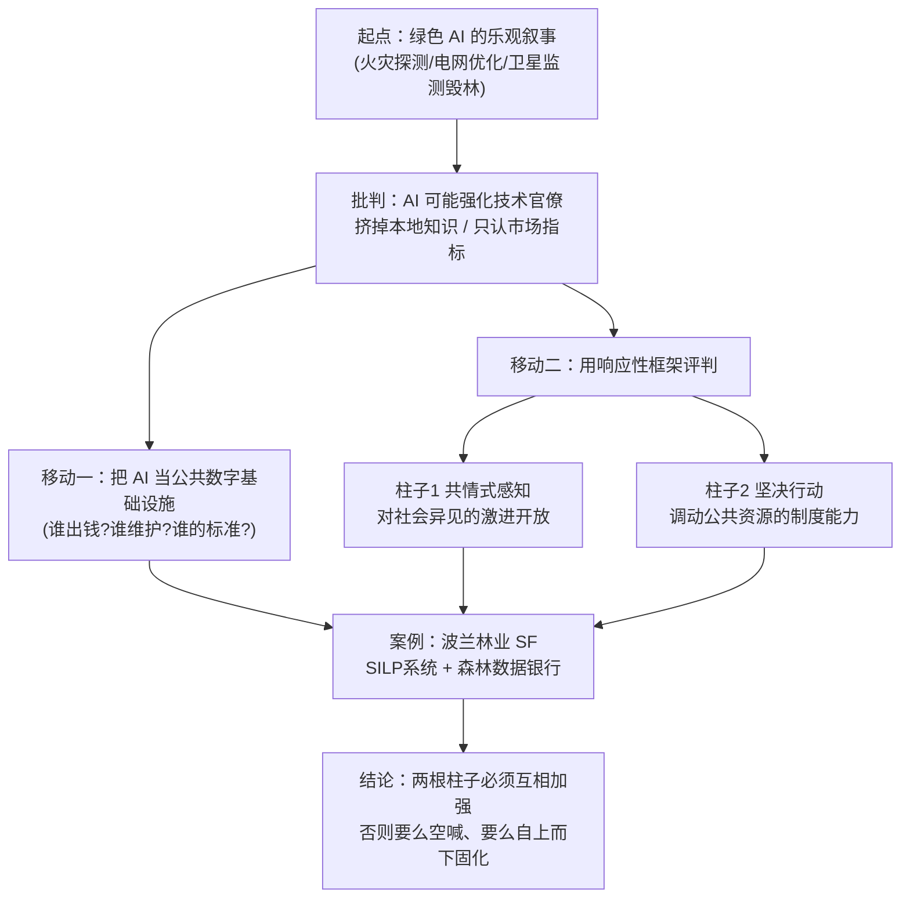

---

## 一、开场：为什么"绿色 AI"值得多打一个问号 🤔

### 1.1 主流叙事长什么样

**是什么。** 打开任何一份气候政策文件或科技媒体，AI 都被塑造成对付生态危机的"变革性工具"。书里点名了三个最常被引用的应用（原文 p.294）：

| 应用 | 英文 | 卖点 |
|---|---|---|
| 野火探测 | wildfire detection | 实时发现火点、快速调度消防 |
| 电网优化 | energy grid optimization | 平滑负荷、提高可再生能源占比 |
| 卫星毁林监测 | satellite-based deforestation monitoring | 大尺度、近实时盯住森林砍伐 |

政策层面也一样乐观。作者举了欧盟"**双重转型（twin transition）**"的例子——把数字创新当成绿色方案的催化剂（Kovacic et al., 2024）。这套话语的核心逻辑是：**数字化 = 效率 = 环保**。

### 1.2 学者的三条警告

作者立刻泼冷水（原文 p.294，引 Bakker & Ritts 2018；Gabrys et al. 2022；Nost & Goldstein 2022；van Wynsberghe 2021）。绿色 AI 可能会：

1. **强化技术官僚治理模式（technocratic governance）**——决策变成"专家关起门算数据"，公众插不上话；
2. **边缘化本地知识（sideline local knowledge）**——祖辈传下来的生态经验、原住民对土地的理解，进不了模型的输入；
3. **让市场化指标压过民主的、语境敏感的方法**——比如只统计"木材产量"，不统计"这片林子对本地社区意味着什么"。

> 🔬 **核心论证 1：技术中立是一种政治姿态**
> 这一章反复要拆的，是"AI 只是个中立工具"这个假设。作者的立场：**把 AI 说成中立，本身就是一种去政治化（depoliticisation）的政治操作**——它让"谁定义了森林问题""谁的指标算数"这些权力问题，被伪装成纯技术问题，从而躲开民主审查。全章的分析工具（基础设施视角 + 响应性）都是为了把这层遮蔽揭开。

### 1.3 环境治理这个大背景

作者把 AI 接到"**环境治理（environmental governance）**"这个更大的讨论上。定义（引 Lemos & Agrawal, 2006）：

> 环境治理 = 政治行动者借以影响环境行为与结果的**监管过程、机制与制度**。

历史演变（引 Agrawal et al., 2022）：

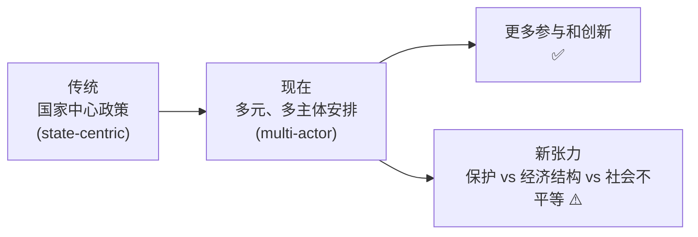

于是本章的**核心追问（dual challenge）**成型（原文 p.294 末）：

> - AI 系统如何**关联**这些宏大的可持续目标？
> - AI 到底能在多大程度上，以**公平、语境敏感**的方式真正贡献于这些目标？

💡 **给工程师的翻译**：如果你是做环境 AI 系统的工程师，这一章逼你回答的不是"我的 mAP 有多高"，而是"我这套系统的默认分类标准（哪些算林、哪些算问题），把谁的世界观焊进去了？"

---

## 二、移动一：把 AI 当"公共数字基础设施"来看 🏗️

这是全章的第一个理论支点。作者不满足于常见的"AI 要透明""AI 别搞技术官僚"这类批评，认为它们太表面。他要换一个更结构性的视角。

### 2.1 什么叫"基础设施"？—— Bowker & Star 的经典定义

**是什么。** 引用信息学经典 Bowker and Star (1999)、Star and Bowker (2010)，作者说基础设施不只是看得见的物理网络（铁路、公路）或数字资产（服务器、协议），还包括底下那层看不见的东西：

> **标准（standards）、分类（classifications）、社会实践（social practices）**——它们决定了技术怎么运转、谁能用得上。

基础设施最关键的一个特征叫**"不可见性（invisibility）"**：

> 基础设施平时"无缝嵌入"日常运作，你根本注意不到它——**直到它坏了，或者被人拿放大镜审视它如何强化了某种权力结构和价值观**。（Star & Bowker, 2010）

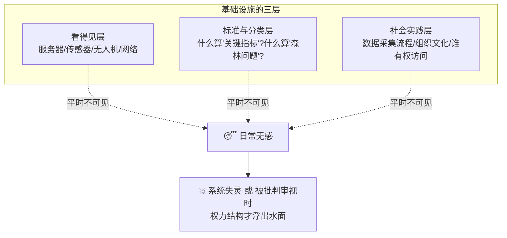

> 🔬 **核心论证 2：分类即权力（classification is power）**
> 这是 Bowker & Star 整套理论、也是本章的地基。一个数据系统的字段设计、枚举值、必填项，看似是纯技术选择，实则决定了"什么被看见、什么被治理、什么被无视"。后文波兰森林数据银行的例子会把这点讲得非常具体——系统里有"木材产量""病虫害"字段，但"本地生物多样性""文化价值"字段很弱，于是后者在治理中就"不存在"。

### 2.2 换了视角，问题就换了

**为什么这么看。** 采用基础设施视角，关注点就从"这个算法准不准"（比如毁林监测、气候建模的技术细节）转向了支撑它的整个社会技术系统（原文 p.296）：

| 常见 AI 批评的问法 | 基础设施视角的问法 |
|---|---|
| 算法准确率够高吗？ | **谁出钱、谁维护**这套系统？ |
| 模型透明吗？ | 里面**嵌入了什么标准**？ |
| 有没有算法歧视？ | 它产出的知识，**最终谁受益**？ |

作者引入 Edwards (2017) 的"**知识基础设施（knowledge infrastructures）**"概念。在环境领域，这类系统不仅监测空气质量、生物多样性、碳通量，还：

- **建模生态变化**；
- 构建一种"**环境记忆（environmental memory）**"——通过积累长期数据集，为基于历史趋势的政策决策打底。

⚠️ **常见坑：以为数据是"天生就在那"的**
作者强调，数据集的**连续性与完整性**依赖于稳定资金、制度优先级和治理结构。任何中断（财政、政治、技术）都会暴露基础设施的脆弱性。一句话点破：

> **数据是持续维护工作的产物**（"a product of ongoing maintenance efforts"），而这种维护常被称为"**不可见的工作（invisible work）**"。

维护包括两大类：

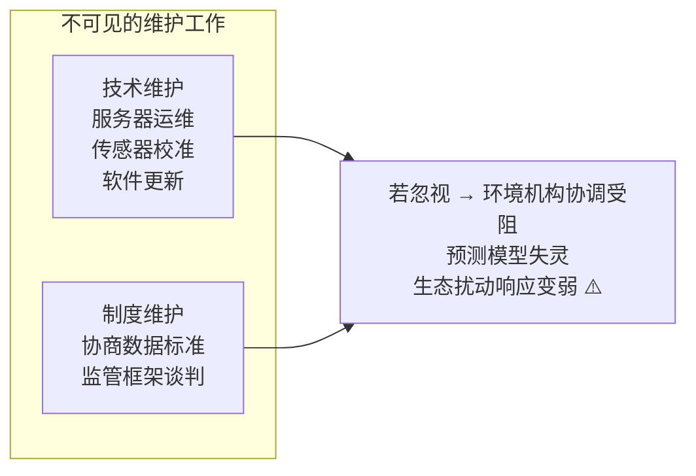

### 2.3 数据的政治生态学：不平等的权力塑造了数据

**为什么。** 引用"**数据的政治生态学（political ecology of data）**"（Goldstein & Nost, 2022；Nost & Goldstein, 2022），作者指出：环境数据基础设施的开发被**不平等的权力动态**驱动——

> 拥有巨大财力和技术资源的**政府和企业**，定义了优先级、设定了分类标准、决定了 AI 应用的方向。

结果是深刻的：**数据基础设施不仅决定"监测什么"，还决定"什么被看见、什么可被行动"**——

- 哪些生态系统被密切观察、监管、干预；
- 哪些生态系统被留在治理框架之外，无人问津。

### 2.4 关键洞察：AI 基础设施本身是"物质的"

**是什么。** 作者强调一个容易被忽略的点（原文 p.297）：AI 系统和数据基础设施本身就是**物质的（material）**——它们不只是"记录"环境变化，还**主动重塑生态系统和地景**。

两个层面：

1. **产出层面的物质后果**：数字制图、算法化资源管理、自动化监管执行，会直接影响土地利用、保护实践、生态修复，产生实实在在的环境后果（Goldstein & Nost, 2022）。
2. **运行层面的物质消耗**：运行这些基础设施需要大量**能源、水、原材料**——从给数据中心供电和散热（跑气候模型），到提取计算硬件所需的稀土金属（引 Lehuedé, 2024）。

> 💡 **实战 / 面试高频：绿色 AI 的"碳悖论"**
> 这里藏着一个绝佳的辩论点：**你用来"拯救地球"的气候模型，本身在烧电、耗水、挖稀土**。van Wynsberghe (2021) 那篇经典把它拆成两半：`AI for sustainability`（用 AI 促进可持续）vs `sustainability of AI`（AI 自身的可持续性）。做环境 AI，两笔账都得算。面试时若被问"绿色 AI 是不是伪命题"，可用此框架作答：不是伪命题，但必须净额核算（net accounting），不能只算收益不算成本。

### 2.5 数字公共基础设施（DPI）与"公共性"

**是什么。** 作者接上公共政策研究（引 Eaves et al. 2025；Mazzucato et al. 2024；Nagar & Eaves 2024）：为社会和国家功能设计的数字基础设施——**数字身份系统、电子支付网络、数据共享平台**——正日益成为经济治理、资源管理、环境监管的核心。

这引出一个规范性问题：**什么才算"公共"基础设施？该怎么设计？该用什么原则指导它服务公共利益？**

作者引 Eaves et al. (2025) 给出"公共性（publicness）"的三个来源：

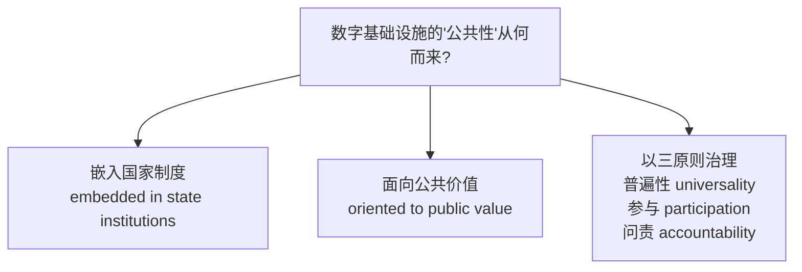

**怎么用（设计启示）。** 因此，基础设施的设计与治理不能只谈技术效率，还要反思它的**属性**（互操作性 interoperability、开放性 openness）和更广的**功能**（支持经济发展、环境治理目标）。作者引 van Veelen et al. (2021) 提出"**基础设施民主化（democratising infrastructure）**"——通过扩大准入、确保透明、促进共创（co-creation），既解决社会挑战也解决环境挑战。

方向性（directionality）是核心：

> 这些基础设施到底是服务于**气候韧性、环境治理、经济包容**，还是反过来**固化既有不平等**？（Eaves et al., 2025）

这就自然过渡到全章的第二个支点——因为单靠"基础设施视角"能做分析，却缺一套**政治语言**来表达"AI 基础设施如何服务集体利益"。作者说，这套语言就是"响应性"。

---

## 三、移动二：把"响应性"重新定义为变革性框架 🔄

### 3.1 响应性的老意思，和它的不足

**是什么（老定义）。** "响应性（responsiveness）"源于两条脉络（原文 p.299）：

- **负责任创新（Responsible Innovation, RI）**（Stilgoe et al., 2013）；
- **环境治理**（Mustalahti, 2018；Pellizzoni, 2004）。

老定义：**持续回应新问题、社会声音、伦理关切的能力**——识别多元需求，并以匹配社会/环境挑战规模的方式回应。常和参与（participation）、透明（transparency）、包容（inclusivity）挂钩。在 RI 里，它常和另外三个词并列：**anticipation（预判）、reflexivity（反身性）、inclusion（包容）**。

**为什么不够。** 作者引 Pellizzoni (2020) 的尖锐批评：

> 这个版本的响应性**没能挑战更深层的权力结构**，只停留在程序性调整（procedural adjustments），而非实质性变革（substantive change）。

Pellizzoni 呼吁一种更**激进的开放（radical openness）**——不仅承认社会诉求，还允许**治理结构本身发生根本性转变**。

再补一条政治理论的脉络（Fineman, 2008 的"**响应型国家 responsive state**"）：强调公共制度作为"**资源动员者（resource mobilisers）**"的主动角色，要有权威和能力去落地长期政策；以及（Mustalahti et al., 2020）要给本地社区配上真正参与治理所需的资源和能力。

### 3.2 作者的重构：两根柱子

**核心贡献。** 作者把响应性重构为一个**变革性（transformative）**框架，由两个交织的维度组成：

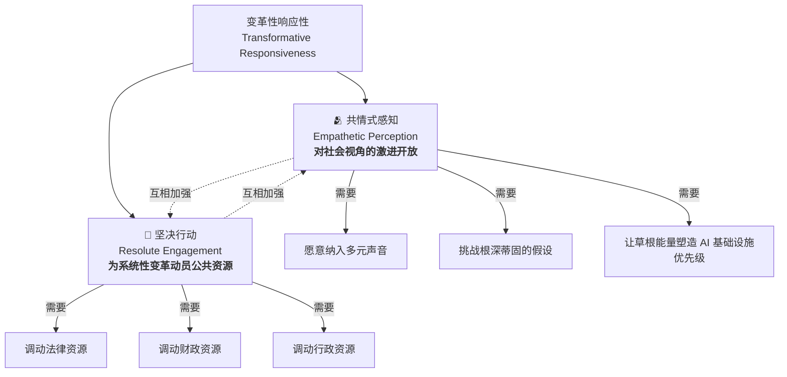

两根柱子对比表：

| 维度 | 共情式感知 Empathetic Perception | 坚决行动 Resolute Engagement |
|---|---|---|
| **核心问题** | 制度愿不愿意"听见"异见？ | 制度有没有能力把诉求"落地"？ |
| **关键词** | 开放、争辩、重新定义问题 | 预算、人员、法律框架、执行力 |
| **理论来源** | Pellizzoni（激进开放） | Fineman（响应型国家）、Eckersley |
| **失败模式** | 只"收集意见"不改核心指标 | 有力量但只服务自己核心利益 |
| **对应波兰案例** | 森林数据银行"开一条缝"却不真听 | SF 火灾系统极强，但只对齐救火 |

#### 3.2.1 柱子一：共情式感知（Empathetic Perception）

**是什么。** 一种对**社会愿景、对环境/社会问题的替代定义、对现状的争辩**的根本性开放。它不满足于现有响应性——因为后者"未必能产生重大变革所需的集体能量"。变革性方法更进一步，**培育社会动员（social mobilisation）**——让社区能培养出共享的目的感和承诺。

**关键论点（引 Pellizzoni 2004, 2020）**：

> 制度和公共领袖必须**愿意在草根运动、活动家组织、本地社区、独立专家面前重新审视自己的假设**。

一个反直觉但深刻的说法：

> 反对资源开采的抗议、保护生物多样性的草根运动，**不是"干扰（disruptions）"，而是环境再政治化（environmental re-politicisation）的关键驱动力**（引 Accetti, 2021）。

这些动员能**暴露既有假设的漏洞**，戳破"AI 是中立工具"的去政治化框架。它把关注点从"市场效率"拉向更广的追问：**AI 如何服务公共善（common good）、促进气候团结（climate solidarity）、维护种间正义（interspecies justice）？**

> 一句总结：**响应性不是"收集意见"，而是把"扰动时刻"当成重思主导范式的宝贵创造性机会。**

#### 3.2.2 柱子二：坚决行动（Resolute Engagement）

**是什么。** 公共制度把社会愿景**转译成具体项目和投资**的能力。作者的核心判断：

> **光有自下而上的压力或公民热情是不够的**，如果缺资金、监管或协调机制的话。

引 Fineman (2008) 的"响应型国家"：公共当局必须足够强、足够主动，才能保护公共善不被相互竞争的利益侵蚀，并通过强健的制度能力和资源配置解决社会不平等。制度动员（institutional mobilisation）不仅是保证足够的预算和人员，还要建立**稳定的法律框架**。

作者给了一个非常具体的例子（原文 p.300-301）：

> 如果要用 AI 来**监测 CO₂ 排放**，就需要在**数据基础设施、跨机构合作、以及强制报告和执法的立法措施**上大量投资。这跟"只是优化一下现有流程"是**根本不同规模的行动**。（引 Eckersley 2004；Tompkins & Adger 2005）

制度还必须能在危机（自然灾害、非法毁林、环境污染）中**快速响应**，需要程序灵活性和协调良好的执行机构。

### 3.3 两根柱子如何"合奏"

**为什么必须成对。** 只有当**共同体能量存在** 且 **国家（或其他公共实体）准备好动用其资源与权威**时，深层变革的可能性才出现。作者把这个机制刻画成一个**反馈回路（feedback loop）**：

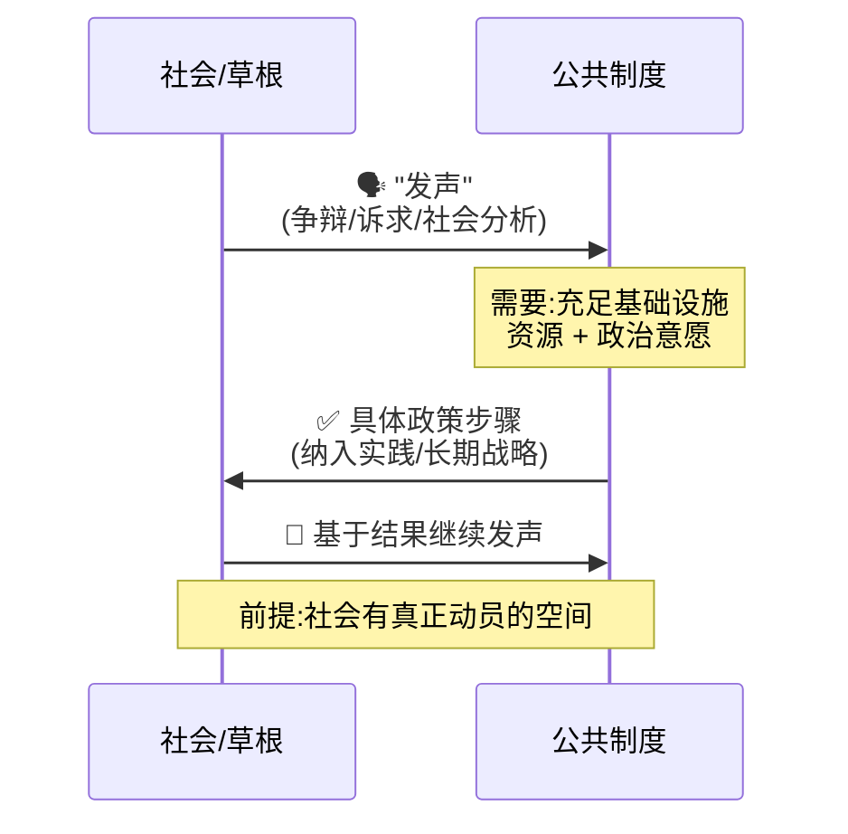

作者明确点出这与自由主义（liberal）路径的对比：

| | 自由主义路径 | 变革性响应性 |
|---|---|---|
| 公众参与 | 常限于"咨询（consultation）" | 真正的社会动员空间 |
| 国家介入 | 最小化（minimal） | 主动动用资源与权威 |
| 变革潜力 | 程序微调 | 深层结构转变 |

> 💡 **面试高频：这个框架为什么对"AI 治理"有用？**
> 很多 AI 伦理框架只讲"要有人类监督""要透明""要可解释"——这些都停在"共情式感知"这半边，甚至只停在它的弱版本（咨询）。本章的贡献是提醒：**没有"坚决行动"这半边，再多的透明和参与都会沦为象征性表演**。反过来，只有坚决行动没有共情感知，就是技术官僚的自上而下。**两条腿走路**才是可操作的评判标尺。

---

## 四、案例：波兰林业与它的公共数字基础设施 🌲🇵🇱

理论讲完，作者用波兰林业把框架"跑"了一遍。这一段是全章最实证、最好读的部分。

### 4.1 为什么选波兰森林？

**背景数字**（原文 p.301-302）：

| 事实 | 数值 |
|---|---|
| 森林覆盖波兰国土 | 约 **30%** |
| 由国家森林局（State Forests, SF；波兰语 Lasy Państwowe）管理 | 近 **80%** |
| SF 员工数 | 超 **25,000 人** |
| SF 监管面积 | **800 万公顷** |
| 依托的访谈样本 | **37 个**半结构化访谈 |

**SF 是个什么怪物？** 作者形容它"**兼具政府机构和国有企业双重特征**"（引 Niedziałkowski & Putkowska-Smoter, 2021）：

- 名义上受气候与环境部监管；
- 实际上**自己管预算、有自己的研究中心、有详细的内部规章**——高度财政与组织自治。

一位高管的原话（受访者编号 SFM4）把它的体量说得很直白：

> "论规模很震撼。我们的体量堪比一家大银行……25,000 名员工，800 万公顷的监管面积。"

**为什么它是绝佳案例。** 因为它的数字基础设施不是新玩意，而是**波兰林业管理长期传统的延续**——几十年来系统性的数据采集和国家监督塑造了实践。它把"基础设施"的历史纵深、制度嵌入全占了。

### 4.2 用基础设施视角看到的三层结构

采用基础设施视角（Edwards 2017；Star & Bowker 2010），波兰林业不是"无人机+传感器+火灾 AI"的简单堆叠，而是一个**决定知识如何被生产、共享、应用**的整合系统：

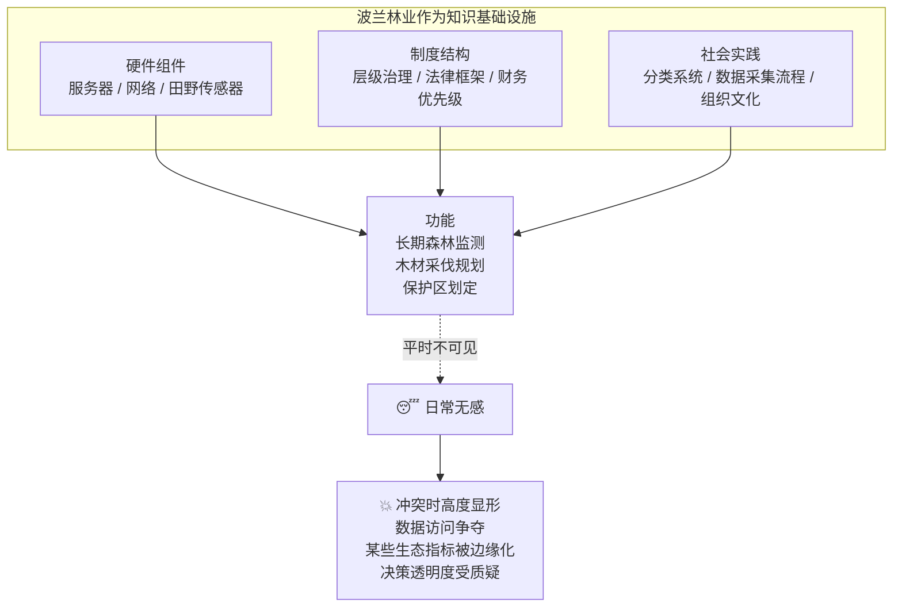

作者特别点名了那支"不可见的维护大军"：SF 大量投资于维护基础设施，有专门的 **IT 和数据管理单元**负责系统维护、安全和持续开发。这类专业劳动——数据库管理、软件工程、合规——确保了森林治理的"技术骨架"始终可运转、可适应新的环境与政策挑战。

### 4.3 张力的源头：技术官僚 vs 生态优先

**为什么会有冲突。** 森林在可持续辩论里是核心场域（碳封存、生态韧性、社会经济发展）。但**这些数据系统到底服务谁的利益？**

作者点名了著名的**比亚沃维耶扎森林（Białowieża Forest）大规模采伐争议**（引 Blicharska & Van Herzele 2015；Niedziałkowski & Chmielewski 2023）。这场争议引出一个尖锐问题：

> SF 的技术与组织能力，到底是**对齐了更广的社会与生态优先级**，还是**强化了一种技术官僚的、以生产为中心的范式**？

作者要考察的两套具体基础设施：

| 系统 | 英文 / 波兰语 | 作用 |
|---|---|---|
| 国家森林信息系统 | **SILP / SFIS** (State Forests Information System) | 整合全国林业数据的国家级平台 |
| 森林数据银行 | **Forest Data Bank** | 2010 年代建立，统一 300+ 林区数据，向公众和其他机构开放 |

### 4.4 方法论：37 个访谈怎么分析

**怎么做的（值得学的研究方法）。** 作者交代了透明的方法论（原文 p.303-304）：

**受访者构成（37 人）：**

| 群体 | 代码 | 人数 |
|---|---|---|
| 环境与数字权利 NGO | NGO | 8 |
| 公共机构 | PI | 7 |
| IT 公司 | IT | 3 |
| 一线护林员 | FF | 5 |
| SF 管理者 | SFM | 5 |
| 学界/林业/IT 专家 | EXP | 9 |

**分析方法（双层编码）：**

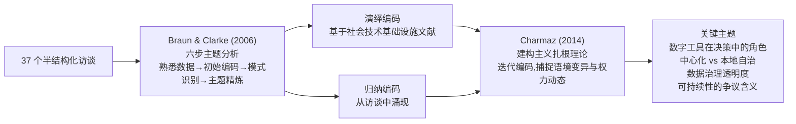

> 💡 **给做定性研究的读者**：这套"演绎码 + 归纳码 + 建构主义扎根理论"的组合，是社会科学里研究社会技术系统的标准打法。演绎码保证覆盖理论关切，归纳码保证不漏掉数据里冒出来的新东西，扎根理论保证对语境和权力保持敏感。哪怕你是工程背景，这也是做用户研究、需求访谈时值得借鉴的框架。

---

## 五、案例分析（上）：共情式感知——开放、争辩与数据基础设施 🫂

这一节把"共情式感知"这根柱子拿到波兰林业里检验，结论是：**开放被基础设施设计既促成、又约束。**

### 5.1 自上而下的模式，几乎不留空间

**发现。** SF 通过一个**高度专业化、自上而下（top-down）**的模式运作，几乎不给更广的社区或生态参照框架留空间。虽然林业官员和数据专家收集了海量指标，但**"什么算关键指标""什么算森林问题"这些底层假设，基本由偏向经济和管理目标的层级标准所决定。**

一位公民社会代表（NGO5）的原话，把这种封闭说得刺骨：

> "根本没有真正的协商空间。森林管理被框定成一个技术问题，决策在关起的门后做出。社区和活动家只能**被动反应，而非参与**。"

作者点破关键：**问题不只是"咨询"或"透明"，而是塑造知识与决策的基础设施设计（infrastructural design）本身。** 又一次呼应 Star & Bowker：基础设施平时隐藏，却深刻影响"哪些议题和观点能获得关注"。

### 5.2 森林数据银行：一个"开一条缝"的典型

**正面：** 森林数据银行技术上很强。它统一了 300+ 林区的数据，整合了林分、采伐量、病虫害防治的海量信息，是监测和决策的中央仓库。一位护林员（SFM4）说：

> "它是个能展示很多东西、帮我们有效管理森林的工具。它就是为了把海量信息整合到一个地方而建的。"

一个耐人寻味的历史细节，来自它的一位原始开发者（EXP1）：

> "把数据设为**开放访问**，是建设中一个关键决定——而这个决定并非不言自明。'当时有真实的担忧，'他回忆道，'很多护林员想起 1990 年代的大规模抗议，担心开放数据会**引发冲突**，而不是支持更好的治理。'"

**负面（关键批判）：** 尽管技术过硬，数据银行**主要围绕经济和运营指标**——木材产量、病虫害缓解等——而**本地生物多样性、文化价值这类因素得到的重视少得多**。一位 NGO 领袖（NGO7）的比喻极其精彩：

> "这些系统是为**护林员**设计的，不是为**社区**设计的。它们把门开得刚好够说自己'透明'，但**不够让任何人真正走进来**。"

> 🔬 **核心论证 3：开放数据 ≠ 开放治理**
> 这是本节最锋利的一刀。森林数据银行"开放"了原始数据，但**它保留了对分类系统和指标的控制权**——即定义"什么算合格林业管理"的权力。开放的是数据的"读取权限"，没开放的是"定义什么重要"的权力。这正是 5.1 讲的基础设施设计层面的封闭。**面试/答辩时可背下来：数据开放性（data openness）和治理开放性（governance openness）是两回事，前者容易做样子，后者才动真格。**

### 5.3 草根的反击：伐木地图（Logging Map）

**发现（希望的一面）。** 公民社会没坐以待毙，而是**创造性地"回收"和"改造"官方数据**。最亮眼的例子是 NGO 主导的"**伐木地图（Logging Map）**"：

- 把森林数据银行的原始统计，**重新打包成用户友好的可视化**——直观展示计划采伐点位；
- 通过突出**本地影响和潜在生态损失**，活动家试图拓宽"森林代表什么、谁来决定森林命运"的对话。

一位活动家（NGO3）的话点出了数据可视化的政治力量：

> "这张地图不只是数据，它是一种**把人和这些决策连起来**的方式……它给了他们**发声的渠道**。"

### 5.4 "倾听"的限度：能改可视化，改不了核心指标

**关键张力。** 但草根的创造力有天花板。虽然 SF 确实**发布**某些数据集，它却**牢牢控制着定义"合格"林业管理的分类系统和指标**。公民行动者能创造性地重新诠释这些数据流，却在**重塑核心成功指标**上遇到内在限制。另一位 NGO 代表（NGO5）一针见血：

> "问题不在于**访问**数据，而在于他们**拿数据做什么**。他们乐意给你看数字，但**别指望他们真按你说的去行动**。"

这两句话精准对应了本章两根柱子的差别——"给你看数字"是共情感知的弱版本（做样子的开放），"按你说的行动"才是坚决行动。而 SF 恰恰卡在前者。

### 5.5 小结：开放被基础设施设计塑造

**结论。** 这个动态揭示了：**共情式感知所需的开放，既能被基础设施设计促成，也能被它约束。** 即便是那些因运营效率而备受赞誉的精密工具，若没有治理规范的更广泛转变，也很难容纳多元社会价值或调整其指标。

作者的判断偏悲观：虽然活动家运动持续挑战波兰林业政策，但**其努力很少转化为实质性的制度变革**。SF 依旧是一个主导性、高度抗拒改变的行动者。真正包容的森林治理，取决于**数据基础设施吸收异见、打破根深蒂固权力不对称的能力与意愿**——而这两样，SF 都缺。

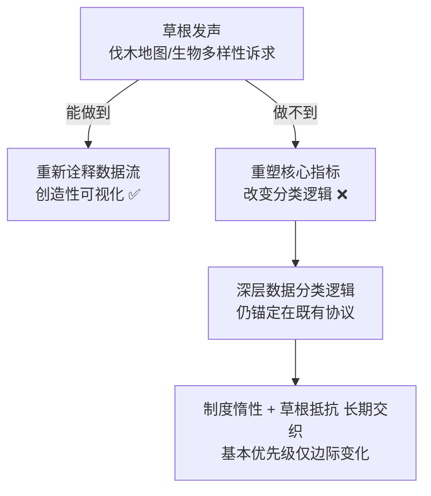

---

## 六、案例分析（下）：坚决行动——能力、自治与治理优先级 💪

第二根柱子的检验。结论比第一根更微妙：SF **能力极强**，但这份能力是**选择性的（selective）**——只对齐自己的核心利益。

### 6.1 惊人的制度能力

**发现（能力的一面）。** 共情式感知讲的是"愿不愿意开放"，坚决行动讲的是"一旦认定议题，有没有能力动员资源、落地决策"。在波兰林业，这份能力由 SF 淋漓尽致地体现。

前面已知 SF 管理约 80% 林地、员工超 25,000。作者进一步强调那支维护数据的"隐形大军"（EXP3）：

> "人们常常盯着输出——地图、报告、统计——但那背后，是巨量的工作。**成千上万的护林员、管理者和 IT 人员每天录入数据，才让系统运转起来。**"

**能力从哪来？——制度演化史。** SF 的能力部分来自制度演化：

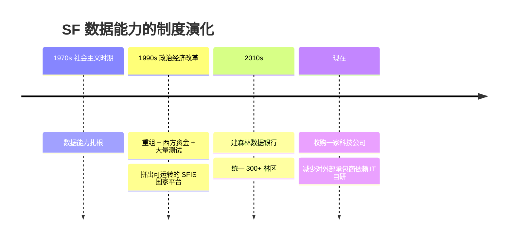

一位 IT 专家（SFM2）回忆 90 年代建系统：

> "在 90 年代建这套系统是一场真正的冒险，一次彻底的转型。我们有西方资金、大量测试，最后硬是拼出了一个能跑的东西。"

### 6.2 自治的双刃剑

**关键张力。** SF 一个显著特征是**异常的自治（unusual autonomy）**——摆脱了某些预算约束、能内部调配资源，于是发展出先进 IT，甚至**收购了一家科技公司**以减少对外部承包商的依赖。一位护林员（FF2）说：

> "把 IT 运营留在内部，给了我们更多灵活性去按需求调整系统。这是为了确保**技术为我们服务，而不是反过来**。"

但批评者立刻指出硬币的反面（NGO2）：

> "他们庞大、资金充裕、能做很了不起的事，但他们也**很难被推动或质疑**。他们或许在收集数据，但**这些数据在服务谁的优先级**？"

> 🔬 **核心论证 4：自治悖论（autonomy paradox）**
> 这是坚决行动这根柱子最深刻的发现。**同一份自治，一面驱动了大胆投资（好事），一面把 SF 与外部监督隔离开（坏事）。** 让 SF 有能力"坚决行动"的那套制度自主性，恰恰也让它有能力"坚决地无视"外部诉求。**能力越强、越自治的机构，越可能变得对多元声音不响应。** 这直接呼应了第五节的悲观结论——两根柱子在 SF 这里非但没互相加强，反而互相拆台。

### 6.3 火灾探测系统：能力对齐核心利益时的样板

**发现（能力的高光时刻）。** SF 的**野火探测与响应系统**是"强制度能力立竿见影"的典型。它融合了：

- **观察塔**的实时数据；
- **无人机**；
- **机器学习算法**。

一旦探测到新火点，立即向消防单位报警。一位专家（EXP6）点出了它成功的真正原因：

> "关键在于**信息与行动之间的直接联系**。它不只是一屏数据，**外头有人随时准备响应**。"

这套系统被誉为**欧洲最先进的系统之一**。但作者借它讲了一个反技术决定论的道理（EXP6）：

> "你不能只是把技术砸到问题上就指望它奏效。它需要一个**地基**——训练有素的人员、扎实的流程、稳定的预算。"

> 💡 **实战 / 面试高频：为什么"信息到行动"是 AI 系统的真命门**
> 火灾系统的成功不在算法多牛，而在"**information → action** 的闭环"被组织结构（训练人员 + 既定流程 + 可靠资金）撑住了。这对做任何决策支持类 AI 都是硬道理：**模型只是管道的一段，末端没有"随时准备响应的人和流程"，再准的预测都是屏幕上的一堆数据。** 这也正是"坚决行动"框架的实证注脚。

### 6.4 但能力是"选择性"的

**关键批判。** 然而，同样的能力**并不必然转化为对长期生态关切的强投入**。SF 擅长危机响应和资源开采目标，但批评者指出它对生物多样性或更广可持续指标的承诺有限。一位 NGO 领袖（NGO6）说：

> "他们在应急响应上出类拔萃，但你要是看**保护栖息地或限制木材开采**，他们就落后了。这不只是技术问题——**这是他们的优先级放在哪里的问题**。"

作者由此提炼出"**选择性坚决行动（selective resolute engagement）**"：

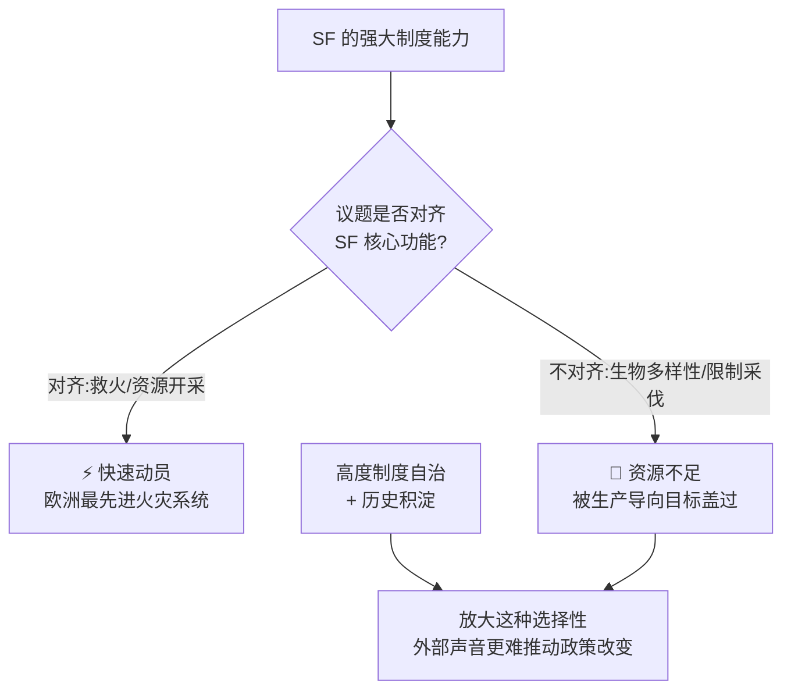

### 6.5 小结：资源丰沛也可能固化等级

**结论。** "坚决行动"的复杂性在于：**资源丰沛和强大基础设施能促成迅速有效的干预，但如果制度文化不接纳多元社会诉求，它们也会固化既有等级。** 高度的制度自治和历史积淀，会**放大这种选择性能力**，让本地社区、NGO 等外部声音更难促成有意义的政策改变。

---

## 七、结论：响应性、公共基础设施与变革行动的"规模" 🎯

作者在结论里把两根柱子拧成一股，给出全章最凝练的判断。

### 7.1 核心洞察：两根柱子必须互相加强

**是什么。** 响应性不是一个固定的制度模型，而是一个**概念装置（conceptual device）**，用来考察两者之间的互惠关系：

> **对社会批判的开放（共情式感知）** ↔ **大规模动员资源的能力（坚决行动）**

关键洞察（引 Edwards, 2017）：公共数字基础设施（含 AI 应用）**既能促进民主过程，也能促成宏大的大规模行动——但前提是"组织能力"和"社会输入"互相加强。**

作者刻画出两种失败模式，构成一个完整的四象限图景：

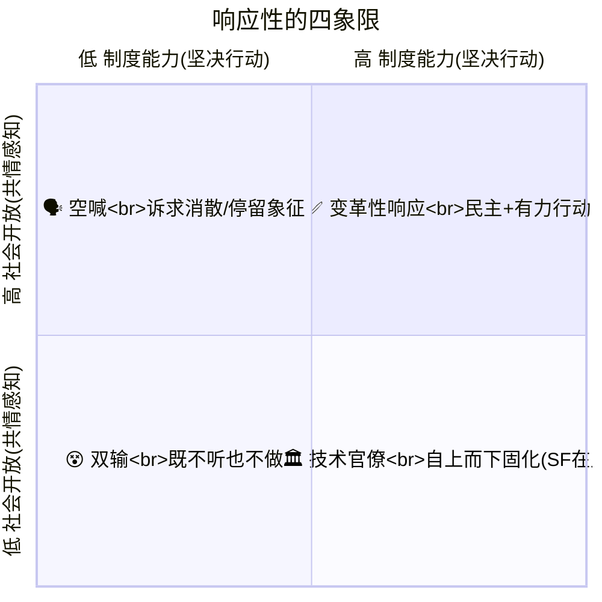

对应作者原话的两句警告：

- **只有能力、没有社会输入** → "稳健的基础设施和制度预算或许能促成果断行动，但没有持续的公民参与和批判反思，就有**固化自上而下优先级**的风险"（右下象限，SF 的处境）。
- **只有社会输入、没有能力** → "本地争辩和民主动员能拓宽政策视野，但没有制度动能和资源流动，这些变革呼声可能**消散或停留于象征**"（左上象限）。

> ⚠️ **常见坑：以为"多搞参与"就够了**
> 很多 AI 治理讨论一股脑往"参与、透明、包容"上堆——那全是共情感知这半边。本章反复敲打：**参与若没有坚决行动兜底，就是左上象限的"空喊"。** 反过来，SF 证明了右下象限的危险：能力越强越可能技术官僚化。真正的目标是右上象限，而这需要制度**愿意根据新数据、公众批判、政治格局变化去修订根深蒂固的优先级**。

### 7.2 第二个洞察：变革的物质与组织维度

**是什么。** 大规模环境干预不只需要有远见的想法，还需要**稳定资金、专职人员、政治支持**。响应性把 AI 技术**放回到既有组织和基础设施里**，而不是当成孤立的解决方案：

> **AI 工具从不孤立运作**——它们与人类专长、制度框架、物质基础设施相互作用。

因此，响应式方法要求深入理解这些**依赖关系（dependencies）**，确保 **AI 是"补充（complements）"而非"替代（displaces）"**可持续治理所需的系统性能力。

> 💡 **一句话记住本章对工程师的忠告**：**别把 AI 当"独立解决方案（standalone solution）"卖。** 它的真正潜力，在于与既有的人、制度、物质设施对齐；脱离了这些，模型再强也落不了地。

### 7.3 使能者，也是守门人

**关键双重性。** 公共数字基础设施既是可持续治理的**使能者（enabler）**，也是**守门人（gatekeeper）**：

| | 使能的一面 | 守门的一面 |
|---|---|---|
| 中央化系统 | 扩大 AI 触及范围：广域监测、实时分析、更敏捷应对环境威胁（Eaves et al. 2025） | 妨碍民主监督、边缘化定义可持续性的替代方式 |

响应性因此凸显了一场**平衡术**：在"建设制度力量"（如大规模部署 AI 的资源）和"维持真正参与与生态完整所需的开放性"之间取得平衡。

### 7.4 坦诚的自我批评：框架的局限

作者在结尾非常诚实地列出了"响应性"框架的边界（这也是学术写作的好范本）：

1. **宏观视角会掠过微观经验**——关注宏观能力，难免绕过本地经验的细腻处，尤其是与地方文化价值、社区组织的微观政治相关的挣扎。
2. **不自动解决根深蒂固的制度权力**——像林业这样的大型官僚基础设施，往往极其抗拒改变，草根很难获得持久影响。
3. **不是万灵药（not a panacea）**——它仍是一个抽象框架，不保证权力在所有利益相关者间均匀分布。

但它的价值在于：**澄清了那些常常不可见的过程——资源配置、基础设施维护、政治承诺——这些才是大规模变革的真正底盘。**

最后一句话，收束全书主题：

> **若公共数字基础设施要服务社会-生态目标，其设计与部署必须同时使能"参与"和"果断行动"。** 技术真正的潜力，在于它与包容性决策结构、以及对生态福祉的集体愿景相对齐。

---

## 📌 小结

| 关键概念 | 一句话本质 |
|---|---|
| **绿色 AI 的问题化** | 别把"数字化=环保"当默认真理；要问它强化了谁的权力 |
| **AI 作为公共数字基础设施** | 关注谁出钱/谁维护/什么标准/谁受益，而非只看算法准不准 |
| **不可见的维护工作** | 数据是持续维护的产物，不是天生就在那；断供即暴露脆弱 |
| **分类即权力** | 系统的字段/枚举决定"什么被看见、被治理、被无视" |
| **AI 的物质性** | 它既重塑地景，又烧电耗水挖稀土——收益成本两笔账都要算 |
| **响应性 = 两根柱子** | 共情式感知（对异见的激进开放）+ 坚决行动（动员资源落地）|
| **反馈回路** | "发声" ↔ "政策落地"，缺任一柱都失败 |
| **开放数据 ≠ 开放治理** | 给你看数字容易，按你说的改核心指标很难 |
| **自治悖论** | 让机构能"坚决行动"的自治，也让它能"坚决无视" |
| **选择性坚决行动** | SF 对齐核心利益（救火）时神速，对慢变量（生物多样性）拖沓 |
| **四象限判据** | 目标是"高能力 × 高开放"，避免"技术官僚"和"空喊"两个陷阱 |
| **AI 是补充不是替代** | 别当独立解决方案卖；真正潜力在与人/制度/设施对齐 |

**本章一句话总结**：
> AI 能不能真的帮到环境，不取决于模型多先进，而取决于承载它的**公共制度**——既愿意听见草根异见（共情式感知），又有资源把这些诉求落地成大规模行动（坚决行动）。波兰森林局的教训是：**光有强大能力却对多元声音封闭，会造出一个高效但技术官僚化的巨兽。**

---

## 🔗 延伸阅读

**本章直接依赖的理论基石：**
- Bowker, G. C., & Star, S. L. (1999). *Sorting Things Out: Classification and Its Consequences.* MIT Press. —— "分类即权力""基础设施不可见性"的源头。
- Star, S. L., & Bowker, G. C. (2010). *How to Infrastructure.* —— 基础设施研究的方法论纲领。
- Edwards, P. N. (2017). *Knowledge Infrastructures for the Anthropocene.* —— "知识基础设施""环境记忆"概念。
- Pellizzoni, L. (2004; 2020). *Responsibility (and Environmental Governance).* —— 对"程序性响应性"的激进批判，本章"共情式感知"的思想来源。
- Fineman, M. A. (2008). *The Vulnerable Subject.* —— "响应型国家""制度作为资源动员者"，本章"坚决行动"的来源。
- Stilgoe, J., Owen, R., & Macnaghten, P. (2013). *Developing a Framework for Responsible Innovation.* —— RI 四维度（anticipation/reflexivity/inclusion/responsiveness）。

**数据的政治生态学与"数字森林"：**
- Goldstein, J. E., & Nost, E. (Eds.) (2022). *The Nature of Data.* / Nost & Goldstein (2022). *A Political Ecology of Data.*
- Gabrys, J. et al. (2022). *Reworking the Political in Digital Forests.*
- Bakker, K., & Ritts, M. (2018). *Smart Earth: A Meta-Review.*
- Turnbull, J. et al. (2023). *Digital Ecologies: Materialities, Encounters, Governance.*

**数字公共基础设施（DPI）与公共价值：**
- Eaves, D., Mazzucato, M., & Pagliarini, G. (2025). *Leveraging Digital Public Infrastructures for the Common Good* (UCL IIPP WP 2024-19).
- Mazzucato, M., Eaves, D., & Vasconcellos, B. (2024). *What is 'public' about DPI?* (IIPP WP 2024-05).
- Nagar, S., & Eaves, D. (2024). *Interactions between AI and Digital Public Infrastructure.* arXiv:2412.05761.

**AI 自身的可持续性（呼应第 2.4 节碳悖论）：**
- van Wynsberghe, A. (2021). *Sustainable AI: AI for Sustainability and the Sustainability of AI.*
- Lehuedé, S. (2024). *An Elemental Ethics for AI: Water as Resistance within AI's Value Chain.*

**波兰林业与比亚沃维耶扎争议（案例背景）：**
- Blicharska, M., & Van Herzele, A. (2015). *What a Forest? Whose Forest?* —— 比亚沃维耶扎森林概念之争。
- Niedziałkowski, K., & Chmielewski, P. (2023). *Challenging the Dominant Path of Forest Policy?* —— 波兰自下而上的公民森林管理倡议。

**方法论（若想复用本章的定性研究套路）：**
- Braun, V., & Clarke, V. (2006). *Using Thematic Analysis in Psychology.* —— 六步主题分析。
- Charmaz, K. (2014). *Grounded Theory in Global Perspective.* —— 建构主义扎根理论。

**与本书其他章节的连接：**
- 本章的"AI 物质性/能耗"与全书讨论数据中心能耗、水耗的章节互为表里；
- "公共数字基础设施"这一框架，可与讨论算力主权、开源基础设施的章节对读；
- "响应性"框架可迁移到任何"AI 进入公共治理"的领域（医疗、司法、社会福利），不限于环境。
