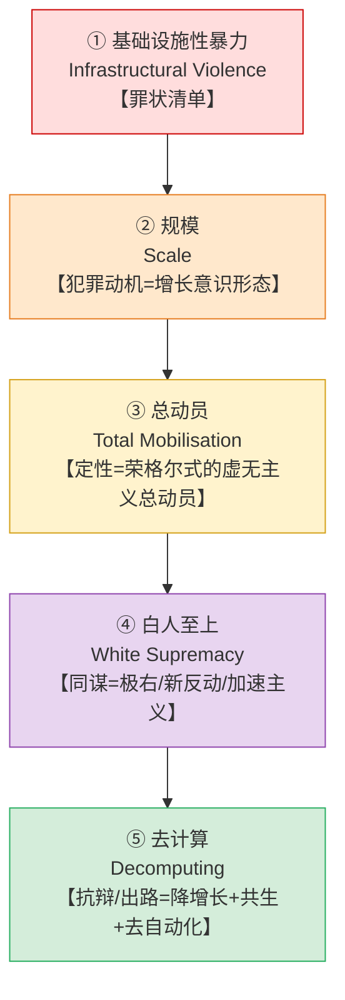
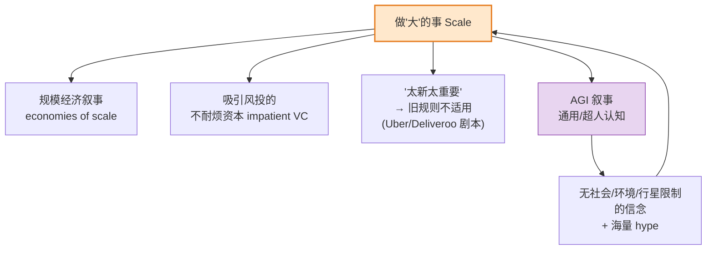
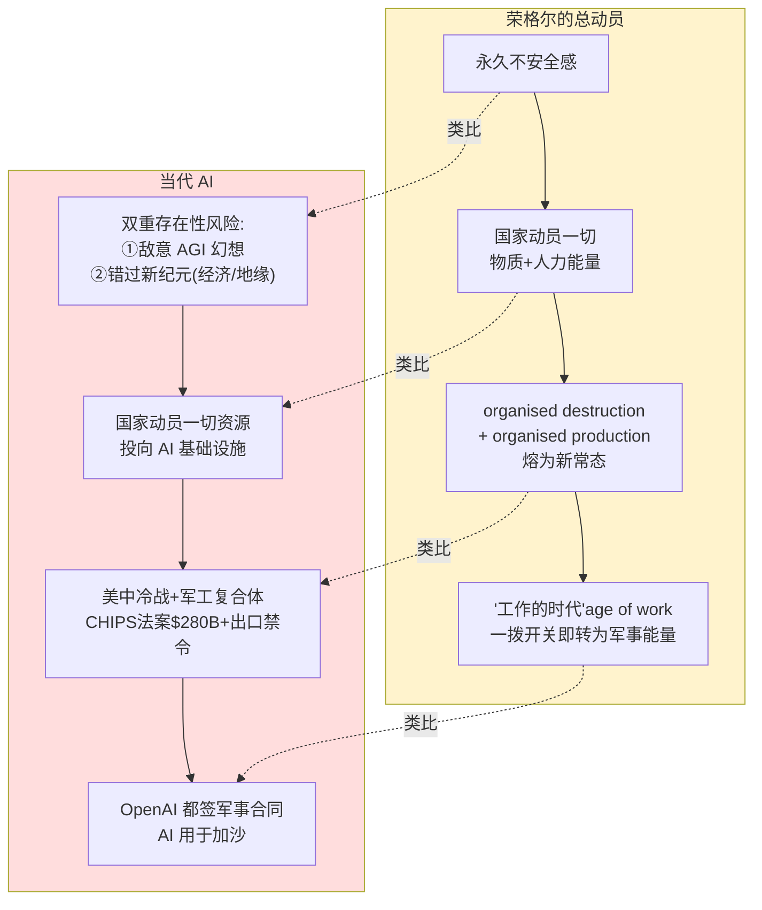
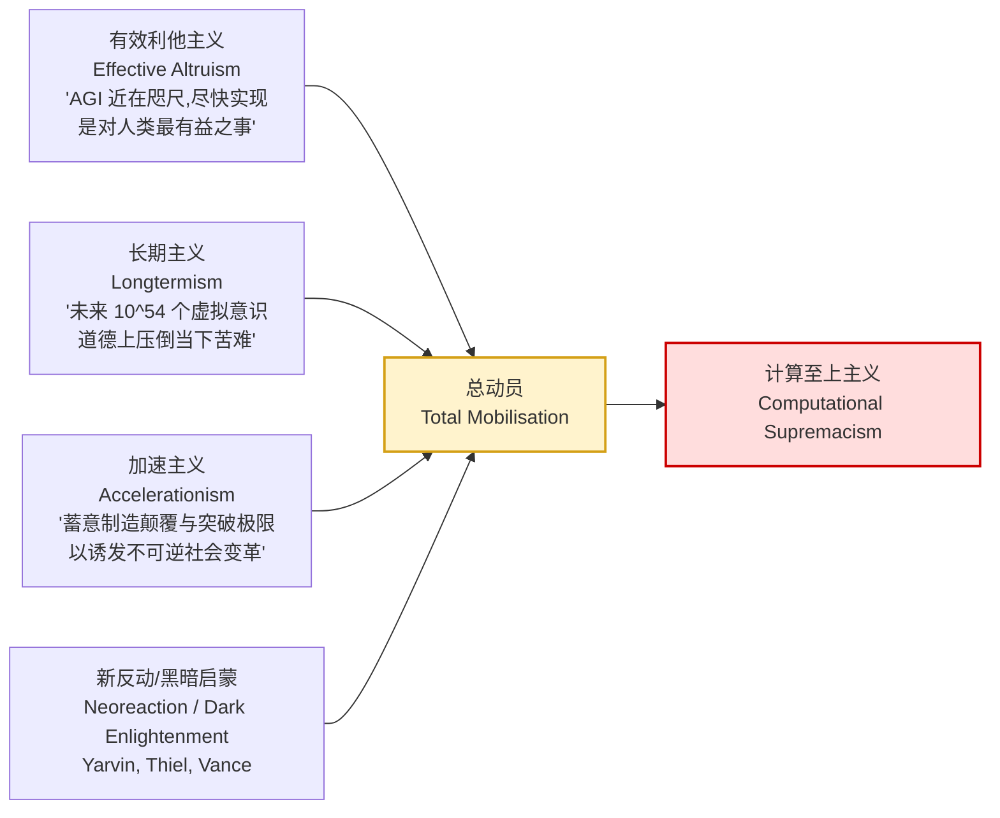
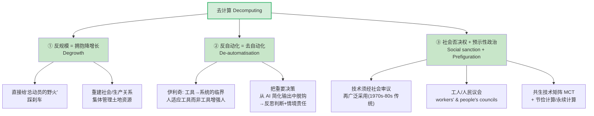
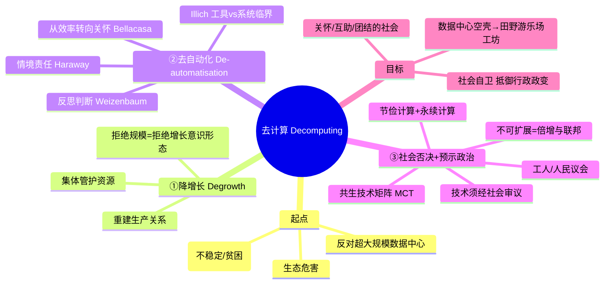

# 第 14 章 · AI 基础设施、总动员与去计算 🔥

> 原书章节：**AI Infrastructures, Total Mobilisation and Decomputing**
> 作者：Dan McQuillan（伦敦大学金史密斯学院 / Goldsmiths, University of London）
> 出处：《AI Infrastructures and Sustainability》第 14 章（PDF 第 316–335 页）
> 关键词：AI · 数据中心（Data centres）· 极右（Far right）· 去计算（Decomputing）· 共生自足（Conviviality）

---

## 🗺️ 本章地图

这是全书里"火药味"最浓、政治立场最鲜明的一章。作者 McQuillan 是《Resisting AI: An Anti-fascist Approach to Artificial Intelligence》（2022）的作者，本章可以看成那本书的浓缩+更新版。它不是一篇讲"怎么优化数据中心 PUE"的技术论文，而是一篇**技术批判理论（critical theory of technology）**檄文，主张：AI 基础设施的疯狂扩张不是单纯的商业行为或工程问题，而是一场政治-哲学层面的**"总动员"（total mobilisation）**，与极右政治、白人至上主义（white supremacy）深度绑定；对此的正确回应不是"给 AI 装上环保补丁"，而是**"去计算"（decomputing）**——一场以"降增长（degrowth）+共生技术（convivial tools）"为纲的社会自卫运动。

全章五个小节，逻辑是**层层递进的"起诉书 → 判决 → 抗辩方案"**：

阅读本章你需要切换"频道"：前面十几章大多是工程师/传播学者视角，本章是**政治哲学 + 社会运动**视角。术语密度极高（荣格尔、尼采、伊利奇、哈拉维、阿伦特……），下面我们逐个"拆包"，既讲**是什么**、也讲**为什么作者这么论证**、还标注**这个论点强在哪 / 弱在哪（代价与争议）**。

---

## 一、⚡ 基础设施性暴力（Infrastructural Violence）：罪状清单

### 1.1 作者先给 AI 下定义

> 原文：*"This chapter defines contemporary AI as systems based on artificial neural networks, and its infrastructures as datasets, models, computer chips and, in particular, data centres."*

**逐点拆解**——作者把"AI 基础设施"限定为四层，且重点在最后一层：

| 层次 | 英文 | 中文 | 在本章的角色 |
|---|---|---|---|
| 数据集 | Datasets | 训练语料 | 廉价/血汗劳动的产物（下文 ImageNet、内容审核） |
| 模型 | Models | 神经网络权重 | "巨型模式匹配器"，无理解力 |
| 芯片 | Computer chips | GPU | 地缘政治焦点（CHIPS 法案、台积电） |
| **数据中心** | **Data centres** | **算力仓库** | ⭐ 本章主角，也是后文"去计算"的**攻击靶点（Achilles' heel）** |

> 🔬 **核心论证 #1｜为什么盯住数据中心？**
> 因为数据中心是 AI 唯一"看得见、摸得着、砸不动就抗议得动"的**物质实体（material substrate）**。模型是抽象的、算法是黑箱的，但一座耗电耗水的仓库是实实在在坐落在某个社区旁边的。作者后面把它称为"新兴技术威权秩序的阿喀琉斯之踵"——**批判理论需要一个物理抓手，数据中心就是这个抓手。** 这是全章战略的基石。

### 1.2 能耗：环境账单

作者用一串数据把 AI 的能耗"实锤"：

| 事实 | 数据 | 出处 |
|---|---|---|
| 美国数据中心占全国用电 | 2018 年约 **2%** → 2028 年预计 **12%** | Berkeley/LBNL, Shehabi et al. 2024 |
| 爱尔兰数据中心耗电 | 占全国 **1/5**，吃光新增风电 | Daly 2024 |
| 微软 | 碳排因 AI **暴涨 30%**，坦承climate 目标难达 | Rathi & Bass 2024 |
| 谷歌 | 温室气体 5 年 **+48%** | Rahman-Jones 2024 |
| 训练 vs 推理 | 训练（优化）烧一大笔，每次查询（推理）再烧一笔 | 本章 |

> ⚠️ **常见坑｜"绿电"和"碳抵消"是遮羞布**
> 原文尖锐指出："云公司意识到数据中心碳排是个 PR 负债，于是用可再生能源和碳抵消（carbon offsets）把自己包装成 green tech……但这块遮羞布被生成式 AI 的能耗需求'吹飞了'（blown away）。"
> **技术读者要记住**：作者不否认"绿电"存在，他的论点是——增量需求超过了整个电网的清洁供给能力，于是 AI 的用电本质上是在**挤占**别处的清洁能源（爱尔兰吃光新增风电就是铁证）。"我用 100% 绿电"在**系统边界**上是自欺，因为你占掉的绿电本可以给别人。这叫 **additionality（额外性）问题**，是碳核算里的经典陷阱。

### 1.3 电网挤兑：不是 MWh 能衡量的伤害

作者刻意强调"影响比兆瓦时（MWh）更广"，举了三个英国案例：

- **西伦敦停建急需的住房**——因为数据中心已用光电网容量（Hammond & Morris 2022）。
- **数据中心运营商游说政府**——要求在停电时优先保供电，而此时数百万家庭处于"燃料贫困（fuel poverty）"。
- **英国把数据中心重新归类为"关键国家基础设施（critical national infrastructure）"**——意味着政府将不得不在"产业"与"老人、残障者、边缘人群的过冬生存机会"之间做选择。

> 🔬 **核心论证 #2｜从"能耗"升级到"结构性暴力"**
> 这是全节的枢纽。作者引用挪威和平学家 **加尔通（Johan Galtung, 1969）的"结构性暴力（structural violence）"** 定义：
> > *"制度或社会结构通过阻止人们满足其基本需求而伤害人们的方式。"*
> 论证链条是：AI 数据中心 → 抢占电网/资金/住房 → 让弱势群体无法满足取暖、住房等基本需求 → 因此 **"AI 已成为一种基础设施性暴力（infrastructural violence）"**。
> 这一步在逻辑上很关键：它把"AI 耗能"从**技术/经济问题**重新框定为**伦理/暴力问题**，从而为后文呼吁"抵抗"提供道德正当性。

### 1.4 人力：隐形的血汗劳动

AI 还消耗巨量"人的能量"来维持"它在创造新东西"的**幻觉（illusion）**：

| 阶段 | 隐形劳动 | 反讽点 |
|---|---|---|
| ImageNet（Russakovsky 2015） | 数千匿名工人廉价标注 | "此前不可行规模的任务"靠血汗完成 |
| 内容审核（Perrigo 2023） | 全球南方工人清洗有毒文本 | 时薪 $2 的**创伤性**劳动 |
| RLHF（Lambert 2022） | 人教模型模仿创作/编程 | **奖励你训练出取代你自己的工具** |
| 部署后（Germain 2024） | 真人偷偷"兜底" | AI 缺常识，人来backfill它的短板 |

> 💡 **实战/面试高频｜"AI 的自动化"其实是"劳动的转移与隐形化"**
> 作者引用 Paullada et al. 2021、Perrigo 2023 等文献指出：**所有 AI 系统都在"隐形化（invisibilise）"** 那些为其"缺乏常识"兜底的劳动。这与本书前面章节讲的"幽灵工作（ghost work）""人在回路（human-in-the-loop）其实是人肉补丁"完全呼应。
> 面试/讨论时的高阶表述：*"生成式 AI 的'端到端自动化'叙事，掩盖了它对标注、审核、RLHF、部署兜底四类人类劳动的持续依赖；这不是自动化，而是劳动的地理转移（转向全球南方）+ 会计隐形化。"*

### 1.5 效用鸿沟：越算越多，越算越错

> 原文：*"Artificial neural networks are, fundamentally, giant pattern-finding mechanisms that optimise the correlation between the training data and their outputs. There's no understanding involved, so AI is always faking it even when it happens to hit on the right answer."*

**逐句讲透**：
- 神经网络 = **巨型模式匹配机（giant pattern-finding mechanisms）**，优化的是"训练数据与输出之间的相关性（correlation）"。
- **没有理解（no understanding）** → 即便碰巧答对，也是在"假装（faking it）"。
- 这对**生成式**和**预测式**AI 都成立。
- 幻觉（hallucination，作者更爱用 Nelson 2024 的 **"confabulation / 虚构症"**）是这一点的**典型范例（paradigmatic）**。
- 所谓"推理（reasoning）"能规避幻觉？——引 **Mirzadeh et al. 2024（GSM-Symbolic）** 说"出闸即被证伪（debunked as soon as they were out of the gate）"，且推理步骤把推理算量放大**几百到几千倍**，烧更多电。

> ⚠️ **常见坑（技术侧要警惕作者的以偏概全）**
> McQuillan 的"AI 没有理解、永远在假装"是一个**强哲学断言**，属于"中文屋（Chinese Room）/相关≠因果"阵营。技术读者应知道：
> 1. **"correlation ≠ understanding"** 是有力的哲学批评，但"understanding"本身没有公认操作定义，属于开放辩论（对面阵营会引用 emergent abilities、可解释性研究反驳）。
> 2. 作者引 GSM-Symbolic 说"推理被证伪"是**选择性引用**——该论文说的是 LLM 数学推理**脆弱、对表述扰动敏感**，而非"推理完全无效"。
> 3. 但他的**核心经验性观点是站得住的**：CoT/推理模型确实把推理时算量（inference-time compute）放大了 1~3 个数量级，能耗随之上升。这点无争议。
> **读批判理论要练就的功夫**：区分作者的"经验事实（可核验）"与"哲学断言（可辩论）"与"价值判断（可不同意）"。

小节收尾的三个"技术解决主义（technosolutionism）"祛魅：
- AI 不会带来癌症治疗的革命（Bawden 2024）；
- 不会靠"超智能虚拟导师"抹平教育差距；
- 但它**已经成功地**把注意力从"医疗/教育缺钱"这个真问题上引开了（Williamson 2024）。
- 在社会关系领域，AI 正成为"不稳定化与剥夺的引擎"，以"可被合成替代品取代"为由削弱护理员、护士等关键工人（Zeff 2024：英伟达想用 $9/小时的 AI 取代护士）。

---

## 二、📈 规模（Scale）：增长意识形态的当代化身

### 2.1 "Scale" 是行业的护身咒

> 原文：*"The single word used inside the industry to legitimise AI's vast intake of electrical energy and human labour is 'scale'."*

作者说，行业用**一个词**——"规模（scale）"——来给 AI 吞噬电力和劳动"洗白"。

**FLOP 增长的时间线**（作者的核心量化证据，务必记住这张表）：

| 里程碑 | 训练算量（FLOP） | 年份/来源 |
|---|---|---|
| AlexNet（图像分类突破） | $10^{17}$ | 2012, Krizhevsky et al. |
| ChatGPT 类 LLM | $10^{24}$ | 生成式 AI 时代 |
| Meta / Alphabet 近期模型 | $10^{25}$ | "10 后面 25 个零" |
| **2030 年预测** | $10^{29}$ | Sevilla et al. 2024（Epoch AI） |

$10^{29}$ FLOP 意味着什么？作者给出**尺度感（perspective）**：
- 需在 AI 基础设施上花**数千亿美元**；
- 单个模型的训练要跑**数月**、用**数百万块高端 GPU**；
- 能耗大到"需要跨多个国家电网分摊，否则会彻底压垮它们（overload）"。
- → **"被推向物质现实的 AI 愿景，是一台行星尺度的机器（planetary-scale machine）。"**

> 💡 **实战/面试高频｜"Scaling Law 被行业当成物理定律"**
> 原文："如此笃信 scaling 的有效性，以至于很多业内人把它当作一条**物理定律（physical law）** 来谈。" 训练算量约 **每年 4–5 倍** 增长（Sevilla & Roldán 2024），远超手机普及、基因测序等任何"技术革命"的扩张速度。
> 批判视角的锋利表述：*"Scaling law 在工程上是经验回归曲线，但在意识形态上被神化为自然律，从而使'无限扩张'显得像'服从物理'一样不可违抗——这是把政治选择伪装成技术必然（naturalising a political choice）。"*

### 2.2 规模 → 自我强化的"美德"→ AGI 神话

作者引 **Hanna & Park 2020（《Against Scale》）** 指出：搞"大"的行为赋予 AI 产业一种**自我强化的虚荣/美德（self-reinforcing virtue）**：

论证要点：
- 规模复用了 **Uber / Deliveroo 的剧本**——用"机器学习算法"的去管制光环，把"血汗工厂式的不稳定就业"正常化（Narayan 2022）。
- 当代 AI 额外叠加了 **AGI 叙事**：不仅是"通用智能能做人类一切认知任务"，甚至"超越人类认知"。
- 规模 = **无限增长的愿景** + **超越人类理解的知识主张（claim to knowledge beyond human understanding）**（McQuillan 2017 称之为"机器新柏拉图主义 machinic neoplatonism"）。
- AGI 信念靠"行业自定义指标（self-defined metrics）"上的性能提升（Bommasani 2022）+ "涌现出类心智推理迹象"的幻想（Bubeck et al. 2023《GPT-4 火花》）来维系。

### 2.3 Schmidt 的"太晚论"与增长意识形态

> 原文（转述）：前谷歌 CEO 埃里克·施密特（Eric Schmidt）被质疑 AI 能耗时，回应是——**"更快更狠地上（go further and faster），因为逆转气候变化已经太晚了，只有 AI 本身能帮我们克服它。"**（Schmidt 2024）

作者的结论性判断：

> 🔬 **核心论证 #3｜Scaling = 增长意识形态（growth ideology）的最新迭代**
> *"AI 指标的总体逻辑，和 GDP 一样，是增长——不管是否带来社会效益、不管沿途造成多少附带损害（collateral damage）。"*
> *"Scaling 是驱动资本主义经济、并为殖民扩张提供理由的那套增长意识形态的 AI 版本。"*
> 这一步把 AI 接进了**批判政治经济学**的大谱系：GDP 增长 → 殖民扩张 → 不可逆气候变化 → **AI 是同一逻辑的"下一次迭代"**。核心毛病是：用一套**不区分"建设性/破坏性外部性"** 的窄指标来定义"增长"。

---

## 三、⚙️ 总动员（Total Mobilisation）：荣格尔的透镜

这是全章**理论核心**，也是最烧脑的一节。作者借德国作家/思想家 **恩斯特·荣格尔（Ernst Jünger, 1895–1998）** 的概念"总动员（total mobilisation / *totale Mobilmachung*）"来给 AI 扩张"定性"。

### 3.1 荣格尔是谁？"总动员"是什么？

> ⚠️ **背景补课（作者假设你知道，但技术读者多半不知道）**
> 恩斯特·荣格尔：一战德军前线军官、战争回忆录《钢铁风暴》作者，两战之间德国"保守革命"思想家，思想上与右翼/技术崇拜纠缠很深（作者选他做透镜，本身就是要暴露 AI 扩张与右翼的亲缘）。"总动员"出自其 1930 年同名文章及《工人：支配与形态》（*Der Arbeiter*, 1932；英译 The Worker: Dominion and Form, 2017）。

荣格尔"总动员"的要义（作者逐条引用）：

| 荣格尔命题（原文引述） | 中文与解读 |
|---|---|
| *"the Great War was fought not only between two groups of nations but also between two epochs"* | 一战不只是两组国家之战，更是**两个时代之战**——旧秩序 vs 新技术秩序 |
| *"driven relentlessly to seize matter, movement and force through the formalism of technoscience"*（Costea & Amiridis 2017） | 新范式**通过技术科学的形式主义，无情地攫取物质、运动与力** |
| *"conversion of life itself into energy… in the whirring of wheels, or in fire and movement on the battlefield"* | 总动员的任务 = **把生命本身转化为能量**（商业、技术、运输、战场） |
| 起因 = "永久不安全（permanent insecurity）" | 国家生活被潜在风险"围困"→ 国家被召唤去"确保存在性安全（existential security）" |

### 3.2 把透镜对准 AI：三层类比

**逐层对应**：

1. **风险驱动**：AI 时代的"存在性风险"有两层——
   - 表层：AI 自身（敌意 AGI 幻想）；
   - **深层（更重要）**：国家把"错过 AI 新纪元"视为风险——AI 被吹嘘的力量是"经济与地缘政治实力"的来源。
   - 作者引荣格尔那段排比："工业的组织力与掌控、大众的劳动力、金融的全国动员、科学的优越及其与生活的亲密绑定、整个文化的发展——谁能列举所有将被聚拢在一起的东西？"→ **AI 的"通用性（generalisability）"恰好体现了荣格尔预见的"诸力量的整合"。**

2. **冲突（而非竞争）是内核**：
   > 原文：*"The dynamic of conflict, as opposed to mere competition, is becoming increasingly apparent as an intrinsic aspect of AI."*
   - 深度学习突破时硅谷讲的是"民主化"；如今 AI 深陷**美中冷战**、与**军工复合体**公开缠绕。
   - **CHIPS 法案**：授权约 **2800 亿美元** 资助美国半导体研发制造，重点是最先进的 AI GPU（几乎是台积电 TSMC 独家）+ 对华出口禁令（Miller 2024）。
   - AI 公司**公开、强硬**地投身军事应用（Abraham 2024），常以"与中国的全球对抗"为由（Morozov 2023）。
   - 连以"为全人类安全有益地开发 AGI"为立会宗旨的 **OpenAI 都加入了军事合同与武器开发**（O'Donnell 2024）。

3. **"工作的时代（the age of work）"**：
   > 荣格尔金句：*"通过它，现代生活广泛分支、纹理丰富的诸多潮流，能被一拨开关（a single flick of the switch）编组为军事能量。"*
   - 作者说荣格尔"对 AI 被用于加沙种族灭绝（Reiff 2023）不会有丝毫惊讶"。
   - **关键洞见**：不是 AI 被"扭向"军事，而是 **总动员的逻辑本就诞生于现代战争的工业性质，并外溢成为"和平时期"社会的基础设施逻辑。**

### 3.3 总动员 = 主动虚无主义（active nihilism）

作者把 AI-as-total-mobilisation 拔高到**尼采式虚无主义**：

| 概念 | 内涵 | 出处 |
|---|---|---|
| **主动虚无主义**（active nihilism） | 不是精神力量的被动耗竭，而是**"生长出"（outgrowing）那些阻碍事物的旧价值，并摧毁之以为新价值清道** | 尼采 → 荣格尔（Bousquet 2016） |
| 机器/虚无主义的**双重性** | 一面"贬低生命、剥夺意义、使其沦为效用的功能"；另一面"其最充分的实现是新活力得以萌发的土壤" | Bousquet 2016, p.22 |
| AI 的真正诉求 | 不只是攫取吉瓦级能量/耗尽沙漠化地区水资源，而是 **"一套与尼采式权力意志（will to power）对齐的装置（apparatus of alignment）"** | 本章 |

> 🔬 **核心论证 #4｜为什么这一步至关重要？**
> 前两节（暴力、规模）还可以被读成"资本主义批判"。第三节把它升级为**"文明断裂"批判**：
> *"动员一切能量的目的，非常明确地是把社会从旧有的锚点上切断（severing of society from its previous moorings）。这正是 AI 基础设施与今日极权政治力量'超越自由主义规则秩序（rules-based order）'的野心相熔合之处。"*
> 荣格尔金句收尾："在技术中我们认出了总革命最有效、最无可争议的手段……破坏领域拥有一个秘密中心，旧力量的臣服正是从这里完成的。"
> 并且——荣格尔在此明确把总动员绑定到**种族至上（racial supremacy）**："如果**那个把新语言当作根本语言来理解的种族**……achieves dominion [Herrschaft]（获得支配）……" → 顺势引出第四节。

> ⚠️ **常见坑｜类比的力量与风险**
> 用荣格尔透镜是一把**双刃剑**：
> - **强处**：极其有力地把"AI 军事化 + 无限扩张 + 破坏旧秩序 + 右翼亲缘"四件事**统一**在一个概念下，解释力惊人。
> - **风险**：这是**类比论证（argument by analogy）**，不是因果证明。"AI 扩张的信念与荣格尔的信念'惊人地相似（uncannily similar）'"——相似不等于同一。批判的批判者会说：这有"以联想代论证""诛心"之嫌。读者应把它当作**富有洞察力的诠释框架**，而非可证伪的科学命题。

---

## 四、🩸 白人至上（White Supremacy）：同谋图谱

本节把"总动员"落到具体的**硅谷意识形态谱系**，论证 AI 扩张与极右政治的绑定不是巧合。

### 4.1 四种"超越性意识形态"

| 意识形态 | 核心主张 | 与总动员的共鸣点 | 出处 |
|---|---|---|---|
| **有效利他主义**（Effective Altruism, EA） | AGI 就要来了；最有益之事就是尽快实现它 | 超越性 → 应投入无限份额的全球资源 | Gebru 2022 |
| **长期主义**（Longtermism） | 人类未来 = 高达 **$10^{54}$** 个栖居于计算硬件的虚拟意识；他们道德上**压倒**当下任何附带苦难 | 同上：为"超越"牺牲此时此地 | Torres 2021 |
| **加速主义**（Accelerationism） | 蓄意以颠覆和突破极限来诱发不可逆社会变革 | 与荣格尔"破坏即清道"同构 | — |
| **新反动/黑暗启蒙**（Neoreaction / Dark Enlightenment） | 反民主、精英支配（Curtis Yarvin 主张） | 明确的**极右项目** | Haider 2017 |

**关键人物链**：Peter Thiel（Palantir 联创、特朗普顾问）← Yarvin 的追随者 → 试图建立原型 **"网络国家（network states）"**（Srinivasan 2022：买地/接管旧金山）→ 与特朗普 MAGA 运动融合 → **Thiel 门徒、副总统 J.D. Vance**（Duran 2024b）。作者结论："新反动的谈资如今正在塑造我们社会与物质基础设施的未来。"

> 💡 **面试/讨论高频｜EA、Longtermism、e/acc 你至少要能一句话讲清**
> - **EA**：用"最大化影响"逻辑，把资源导向"存在性风险"（尤其 AGI 安全），Gebru 批评它推销"危险版 AI 安全"。
> - **Longtermism**：把未来天文数字的虚拟人口当作道德权重，从而**折现当下真实苦难**——Torres 称其为"世界上最危险的世俗信条"。
> - 这些原本是"网上小圈子讨论"，被**加密货币资助的智库**（Bordelon 2024 提到一个拿了 $660M 的团体）推进华盛顿与伦敦政策圈，把英国议程从"伦理危害"**红丸化（redpill）** 到"AI 安全/超级智能"的末世叙事。

### 4.2 从"白人至上"到"计算至上主义"

作者的收束论证（本节最锋利处）：

> 🔬 **核心论证 #5｜AI 与优生学（eugenics）的共同祖先**
> - *"AI 和 AGI 在数学与意识形态上都有维多利亚时代优生学（Victorian eugenics）的先驱——那是为英帝国主义及其全球攫取辩护的伪科学。"*（Clayton 2020：优生学如何塑造了统计学）
> - 关于 AI 应用于社会问题的讨论，越来越多地**与公开的优生学逻辑结合**（van Toorn & Soldatić 2024）：比如"劣质、二流的 AI 医疗对穷人或全球南方'够用了（good enough）'"，或"AI 教育'补足'先天的智力生物等级"（Williamson 2021）。
> - **至上主义与 AI 的运作方式'同构（conformal）'**：AI 在社会语境中运作时，会**本质化差异（essentialise difference）**、强化把某些生命标记为"相对可抛弃（relatively disposable）"的排序。

最终定性——把资源流动（矿产开采→电网）与"抬高精英少数为历史主体（Andreessen 2023《技术乐观主义宣言》）"的社会意识形态对齐，理解为一次 **"技术政治相变（technopolitical phase shift）"**：动员物质、社会、情感资源，去**巩固基于种族与生物优越性主张的权力等级**。

> **本节结尾抛出的问题（引出第五节）**：
> *"对我们其余人来说，问题是——如何回应计算至上主义（computational supremacism）的基础设施？"*

---

## 五、🌱 去计算（Decomputing）：抗辩与出路

这是全章的**建设性方案**，也是作者的原创术语。前四节是"起诉+定罪"，本节是"我们该怎么办"。

### 5.1 去计算是什么？一句话定义

> 原文：*"resistance to the total mobilisation and supremacist politics materialised in AI takes the form of 'decomputing'."*

**去计算（decomputing）= 对"物质化于 AI 之中的总动员与至上主义政治"的抵抗形式。**

它的**起点非常具体**：**反对（超大规模）数据中心的存在需求（opposing the need for hyperscale data centres）**。理由有二——
1. **生态**：它们造成环境危害；
2. **社会**：它们承载了 AI 那些"使人不稳定、使人贫困（precaritising and immiserating）"的计算。

> 🔬 **核心论证 #6｜为什么攻击点是数据中心？（回收第一节的伏笔）**
> - 数据中心那些"无窗仓库 + 蒸发冷却塔"是**引擎**，消耗自然资源，产出的不只是 CO₂，还有**异化（alienation）与不稳定（precarity）**。
> - 但——**数据中心也是新兴技术威权秩序的"阿喀琉斯之踵"**：一条反对其扩张的**人民阵线（popular front）** 能把从气候变化、能源贫困到劳工正义的各种社会运动**联合起来**。
> - 因此数据中心既是**教育契机**也是**组织契机**——反对其扩张的集会，同时是提升对"基础设施交叉性（infrastructural intersectionality）"意识的机会。
> **战略逻辑**：抽象的 AI 无法被抗议，但一座具体的仓库可以。这就是为什么第一节开头就把"数据中心"定为主角。

### 5.2 去计算的三根支柱

#### 支柱①：反规模 = 降增长（Degrowth）

- 去计算**把"拒绝规模（rejection of scale）"作为减害之道和替代前路的启发式（heuristic）**。
- 规模 = 增长意识形态 → 去计算因此"意味着与**降增长（degrowth）** 原则的接触"。
- 降增长不只是拒绝，而是一个过程（引 Schmelzer et al. 2022）：
  > *"强化社会正义与自决，在这种改变了的新陈代谢条件下追求所有人的美好生活；重新设计其制度与基础设施，使它们的运转不依赖于增长和持续扩张。"*
- **重点在"用什么替代它"**：重建社会与生产关系，对土地资源进行更集体的管护（stewardship）。
- → **"作为降增长的去计算，给 AI 及其失控基础设施的总动员野火，踩下一记直接的刹车。"**

#### 支柱②：反自动化 = 去自动化（De-automatisation）

作者祭出 **伊凡·伊利奇（Ivan Illich）** 的核心洞见：

> 🔬 **核心论证 #7｜工具 vs 系统的临界点（Illich）**
> 原文：*"tools transform from means to ends when their scale, size, or structure requires people to adapt to them, rather than enhancing people's autonomy and capacity."*
> **当一个工具的规模/尺寸/结构，要求人去适应它（而非它增强人的自主与能力）时，工具就从"手段"异化成了"目的"。**
> → **"规模（scaling）正是把一个被呈现为工具的东西（如 AI）变成一个系统（system）的手段"**——一种"生活经验与技术手段相互配置的装置（apparatus）"的进一步嵌套。
> AI 是对"制度、官僚、市场结构"的**强化**——把能动性（agency）从工人和社区那里剥离，塞进"不透明、抽象的机制"里。

- 作者一句尖锐的翻转：**"我们面对的问题不是数据治理（data governance），而是我们的生活一开始就被如此数据化（datafied）这件事。"**
- **去计算 = 社会关系的去自动化** + 把重要决策从 AI 的"化约式输出（reductive outputs）"中**解开缠绕（disentangling）**，转而依靠：
  - **反思性判断（reflective judgement）**（Weizenbaum 1984《计算机能力与人类理性》）；
  - **情境化责任（situated responsibility）**（Haraway 1988《情境知识》）。
- 去计算既是给计算基础设施**去碳（decarbonising）**，也是给社会**"去技术生成的确定性（technogenic certainties）"的编程（deprogramming）**。
- 从"效率与优化"框架，转向 **"关怀之事（matters of care）"**（Bellacasa 2017）：以我们相互的脆弱与依赖为本体论基础，强调**平衡、节制、互惠**；并借此摆脱阿伦特（Arendt 2022《艾希曼在耶路撒冷》）所说的**"无思（thoughtlessness）"** 与新反动技术政治公开鼓吹的功利残忍。

#### 支柱③：社会否决权 + 预示性政治 + 共生技术

- **社会审议（social sanction）**：如 1970s–80s 广泛主张的，可能广泛影响社会的技术，应在广泛采用**之前**接受批判性审问。作者判定："现有监管机制不能被信任来充分抵抗大科技的影响"——**连欧盟都不行**（还演一演规则秩序），美国更是"监管俘获（regulatory capture）"升级为"国家俘获（state capture）"，与极右公开结盟。
- **预示性政治（prefigurative approach）**：其实践**当下就演练**它想带来的赋权与可持续关系。
- **组织形式 = 工人与人民议会（workers' and people's councils）**：扎根于本地、专业语境和多样生活经验的集体——从医护/社工、家长-教师协会到工会。历史范本：1980 年代中期伦敦的**技术网络（technology networks）**，把社区的"技能、创造力、热情"与理工学院的"科学与创新知识水库"对接（Smith 2014）。
- **评估工具的标准，不必从零开始**：

| 资源 | 内容 | 出处 |
|---|---|---|
| 《共生自足的工具》 | 伊利奇定义**共生工具（convivial tools）**= 使人行使自主与创造，而非被操纵系统所要求的条件反射 | Illich 1975, *Tools for Conviviality* |
| **共生技术矩阵（MCT）** | 给"共生性"划出一组评估维度：**可及性**（谁能造/用？）、**关联性**（如何影响人际关系？）、**生物互动**（如何与生命体和生态互动？） | Vetter 2018 |
| **节俭计算（frugal computing）** | 面向低碳/零碳计算的路径 | Vanderbauwhede 2023 |
| **永续计算（permacomputing）** | 把计算对齐到行星与社会限度内 | Permacomputing 2024 |

- 作者给 MCT 补一条：**合适的工具是"不可扩展（not scalable）"的**——因为像"关怀（care）"本身一样，它们总是根植于**特定性与语境（specificity and context）**。替代性工具应对普遍需求的方式不是**扩张（scaling）**，而是**倍增与联邦化（multiplying and federating）**。

> 💡 **实战/工程含义｜"不可扩展"是特性不是 bug**
> 这条对工程师最反直觉：主流工程文化以"可扩展性（scalability）"为最高美德。作者主张——**对某些社会技术，"不可扩展"恰恰是应有的设计约束**。类比：社区诊所、护理关系、地方合作社，靠"复制并联邦"而非"一个中心无限做大"来覆盖需求。这与联邦式/去中心系统（Fediverse、self-hosting、本地小模型）的技术潮流暗合——可以把"边缘小模型 + 联邦"读成去计算的一种工程落地。

### 5.3 收尾：去计算作为社会自卫

> 🔬 **本章终章论断**
> - 去计算是对 AI 技术政治装置及其"总体化转型（totalising transformations）"的**反权力（counter-power）** 建构。
> - 它同时是：**社会重建的纲领** + **必要的社会自卫（social self-defence）**。
> - 为什么是自卫？——AI 被"无争议地抬高"，助长了白人至上的普遍强化，以及"信奉此类意识形态者实施的行政政变（administrative coup）"（Natanson et al. 2025：马斯克的 DOGE 把敏感联邦数据喂给 AI 来定向裁员）。
> - **工人/人民议会**按集体商定的社会价值来管护技术开发与部署，是**技术政治层面的支柱（buttress）**，抵御同类"接管社会未来方向"的企图。

作者用一个乌托邦意象收尾（非常"文学化"，但立场鲜明）：

> *"当昔日 AI 数据中心的巨大空壳被归还给公共所有，并被田野、游乐场、社区自营的改造与维修工坊所取代时，我们就离可持续性更近了一步。"*

---

## 六、📊 全章论证结构总表（一图速记）

| 小节 | 关键概念 | 一句话主张 | 主要思想资源 |
|---|---|---|---|
| ① 基础设施性暴力 | Structural / infrastructural violence | AI 耗能耗人 = 阻止弱者满足基本需求 = 暴力 | Galtung 1969 |
| ② 规模 | Scale, scaling law, AGI | "Scale" 是增长意识形态的当代咒语，被神化为物理律 | Hanna & Park; McQuillan 2017 |
| ③ 总动员 | Total mobilisation, active nihilism | AI 扩张 = 荣格尔式总动员 = 尼采式权力意志/主动虚无主义 | Jünger; Bousquet 2016 |
| ④ 白人至上 | EA / Longtermism / Accelerationism / Neoreaction; 优生学 | 总动员绑定极右与种族至上 → 计算至上主义 | Torres; Gebru; Clayton 2020 |
| ⑤ 去计算 | Decomputing, degrowth, de-automatisation, conviviality | 抵抗 = 降增长 + 去自动化 + 共生技术 + 人民议会 | Illich; Haraway; Weizenbaum; Vetter |

---

## 七、🧠 给技术读者的"平衡阅读"提示

作者立场鲜明，技术从业者读时建议区分**三类断言**，避免"全盘接受"或"全盘否定"：

| 类别 | 例子 | 应对姿态 |
|---|---|---|
| **可核验的经验事实** | 数据中心占美国电网 2%→12%；训练算量每年 4–5×；推理模型放大算量 100–1000×；OpenAI 签军事合同 | ✅ 基本可信，可查原始出处 |
| **可辩论的哲学断言** | "AI 没有理解、永远在假装"；"scaling 被神化为物理律" | ⚖️ 有力但非定论，存在对立学派 |
| **可不同意的价值/类比判断** | "AI = 荣格尔式总动员 = 主动虚无主义"；"数据中心空壳变田野" | 🤔 富洞察的诠释框架 & 政治愿景，非可证伪命题 |

> ⚠️ **最大的争议点**
> 1. **类比 ≠ 因果**：荣格尔透镜解释力强，但"信念相似"不能证明"本质同一"，有"诛心/联想代论证"之嫌。
> 2. **选择性引用**：如借 GSM-Symbolic 断言"推理被证伪"，实为"推理脆弱"。
> 3. **技术悲观的单一性**：作者几乎不承认 AI 有任何正当用途，"去计算"要求的"不可扩展/去自动化"在医疗诊断、科学计算等**确有正效用**的场景可能过度。
> 但作者最强、最难反驳的**建设性贡献**是：**把"数据中心"确立为可被社会运动瞄准的物质抓手**，以及**"scalable ≠ good、有些好工具本就不该 scale"** 这一对工程文化的根本挑战。

---

## 📌 小结

- 本章是全书的**批判理论高地**：不谈"如何让 AI 更绿"，而是主张 AI 基础设施的扩张本身就是问题，需要**政治性抵抗**。
- **五步论证**：AI = 基础设施性暴力（Galtung）→ 由"规模/增长意识形态"驱动 → 定性为荣格尔式"总动员"与尼采式"主动虚无主义"→ 与极右/优生学/计算至上主义同谋 → 出路是"去计算"。
- **去计算（decomputing）三支柱**：① 降增长（degrowth，反规模）；② 去自动化（de-automatisation，反 AI 剥夺能动性）；③ 社会否决权 + 预示性政治（工人/人民议会 + 共生技术 MCT）。
- **战略核心**：数据中心既是 AI 的物质命脉，也是其**阿喀琉斯之踵**——是把气候、能源贫困、劳工正义等运动联合起来的**组织与教育契机**。
- **对工程师最刺耳、也最值得深思的一句**：*"合适的工具是不可扩展的"*——挑战了"scalability 至上"的工程信仰，指向"倍增+联邦"而非"中心化做大"的技术路线。

## 🔗 延伸阅读

**本章核心思想源头**
- Ivan Illich (1975), *Tools for Conviviality*（共生工具，去计算的价值基石）
- Ernst Jünger (2017 英译), *The Worker: Dominion and Form*（总动员概念原典）
- A. Bousquet (2016), "Ernst Jünger and the problem of nihilism in the age of total war"（读懂第三节的钥匙）
- Dan McQuillan (2022), *Resisting AI: An Anti-fascist Approach to AI*（作者本书，本章的母体）

**经验证据**
- Shehabi et al. (2024), *2024 US Data Center Energy Usage Report*, LBNL（能耗数据源头）
- Sevilla et al. (2024), "Can AI scaling continue through 2030?", Epoch AI（$10^{29}$ FLOP 预测）
- Mirzadeh et al. (2024), *GSM-Symbolic*（LLM 数学推理脆弱性）

**意识形态批判**
- É. P. Torres (2021), "Why longtermism is the world's most dangerous secular credo", Aeon
- T. Gebru (2022), "Effective altruism is pushing a dangerous brand of 'AI safety'", Wired
- Hanna & Park (2020), *Against Scale*（对"规模思维"的抵抗）

**替代方案工具箱**
- A. Vetter (2018), "The matrix of convivial technology"（MCT 评估框架）
- W. Vanderbauwhede (2023), *Frugal computing*（节俭/零碳计算路径）
- Permacomputing (2024), *Principles*（永续计算原则）
- D. Haraway (1988), "Situated Knowledges"；J. Weizenbaum (1984), *Computer Power and Human Reason*（"反思判断/情境责任"的哲学根据）

**本书内呼应章节**：可与前面讨论"数据中心能耗/水耗""幽灵劳动/人在回路""绿色 IT 与碳抵消批判"的章节对读——本章相当于把那些经验发现**升级为一套完整的政治哲学与行动纲领**。
