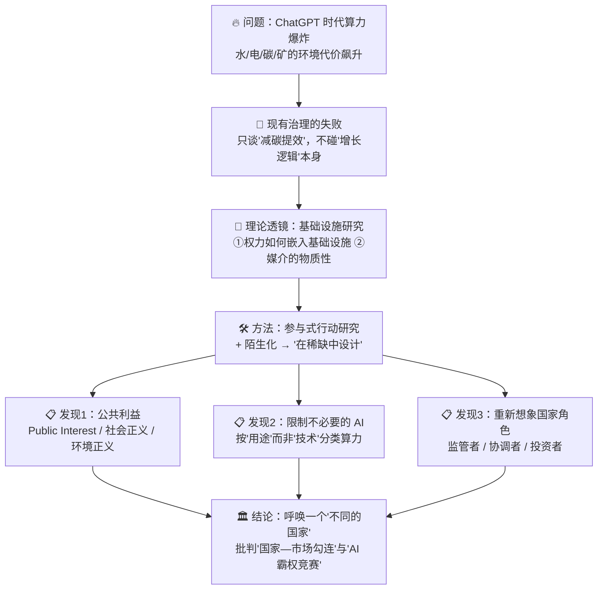
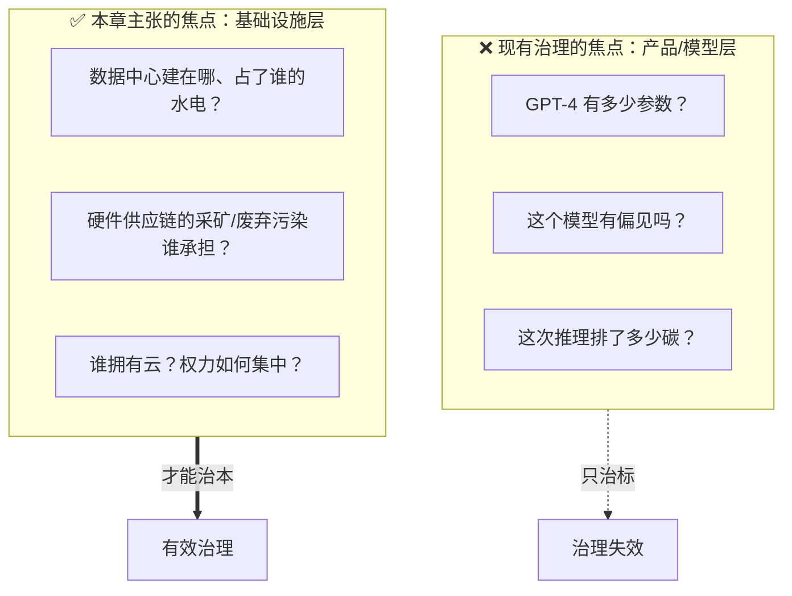
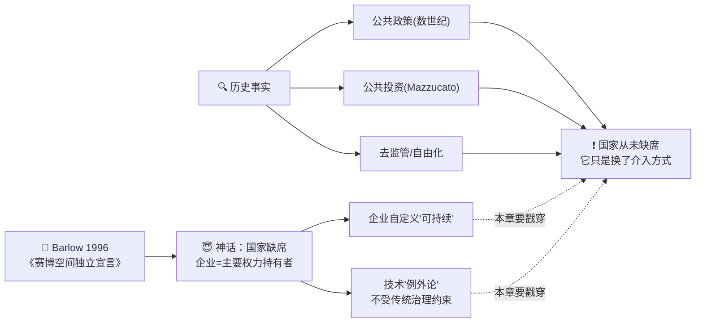
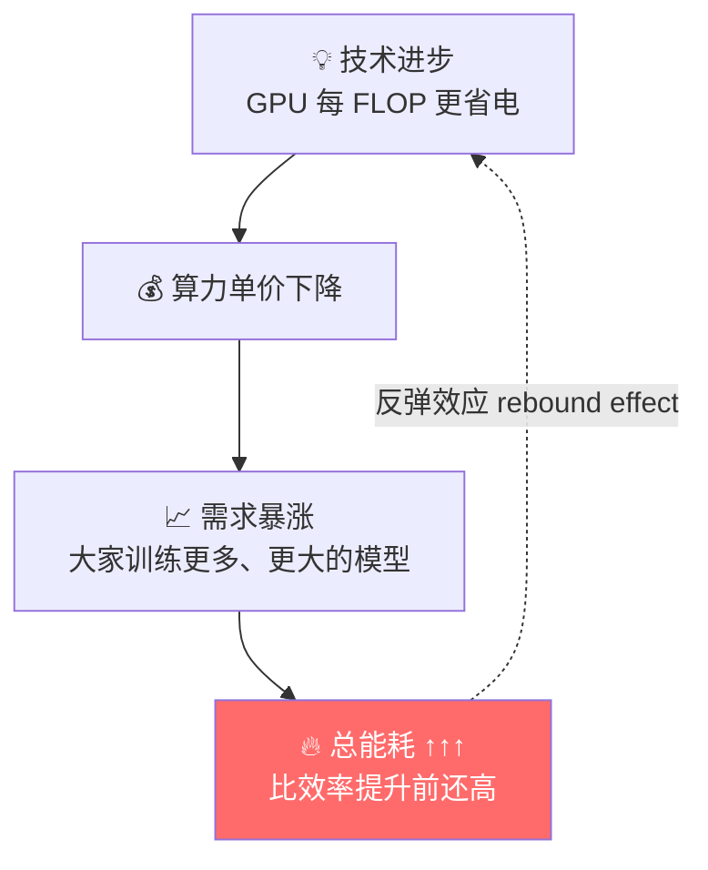
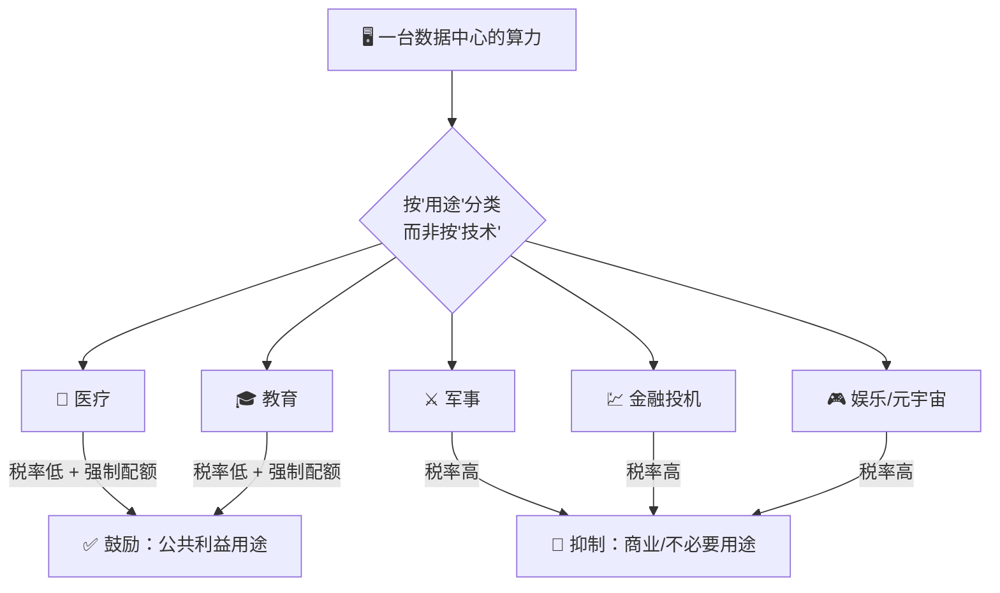
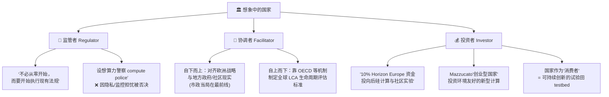
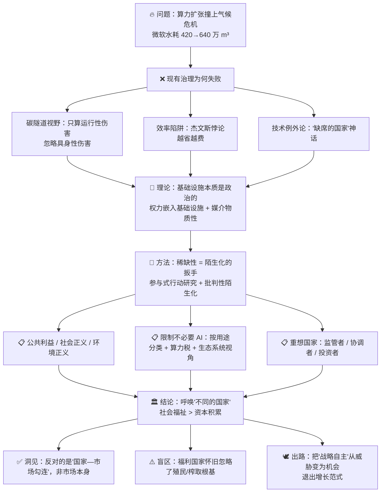

# 第 15 章 🔥 为燃烧的星球提供更多算力？——一种"稀缺性"视角的 AI 基础设施治理

> 原文标题：**More Compute for a Burning Planet? A Scarcity Approach to AI Infrastructures**
> 作者：Fieke Jansen & Niels ten Oever（阿姆斯特丹大学 / Critical Infrastructure Lab）
> 出处：《AI Infrastructures and Sustainability》第 15 章（PDF pp. 336–355）
> 关键词：AI 基础设施 · 可持续性 · 治理 · 稀缺性（Scarcity）· 陌生化（Defamiliarisation）

---

## 🗺️ 本章地图

这一章和整本书里那些讲芯片、讲散热、讲 PUE 的技术章节**完全不同**。它是一篇**批判性社会科学（critical social science）**论文，讨论的不是"怎么让数据中心更省电"，而是一个更根本的问题：

> 在一个**已经在燃烧的星球**上，我们凭什么还要**无限扩张算力**？谁有权决定算力该给谁用？如果我们不从"资源无限、增长无限"的假设出发，而是从"**资源稀缺**"出发，AI 基础设施的**治理（governance）**会长成什么样？

作者用一场跨越三个工作坊、80 位专家的**参与式行动研究（Participatory Action Research）**，配合文学理论里的"**陌生化**"方法，逼参与者去想象一个"在稀缺中设计（designing in scarcity）"的未来。最后得出一个反直觉的结论：在欧洲语境下，人们真正反对的**不是市场的力量，而是"国家—市场的勾连"**；他们呼唤的是一个**完全不同的国家（a different state）**。

本章地图如下：

学完本章，你将能回答：
- **稀缺性（scarcity）**为什么是一个治理"武器"，而不只是一个约束？
- 什么是**运行性伤害（operational harms）**与**具身性伤害（embodied harms）**？
- 为什么作者说"通过效率实现可持续"是一个**逻辑陷阱**（杰文斯悖论）？
- **陌生化（defamiliarisation）**这种听起来很文艺的方法，为什么能撬动技术治理的讨论？
- 为什么工作坊里的专家最后都把矛头指向了**国家**，而不是企业或社区？

> 💡 **给技术读者的提示**：如果你是做 AI-Infra 的工程师，这一章会让你很不舒服——它质疑的正是你每天在优化的东西（"更多算力"）本身是否正当。但恰恰是这种"不舒服"最有价值：它帮你跳出"如何把事情做得更高效"的隧道视野，去问"这件事**该不该做、为谁做**"。这就是本章方法论"陌生化"的现身说法。

---

## 1. 🔥 开场：一个在燃烧的星球上，算力还在疯长

### 1.1 是什么：一组触目惊心的数字

论文开篇就甩出一个具体到吓人的事实：

> **微软**用于数据中心**冷却的水耗**，从 2020 年的 **420 万 m³**，暴涨到 2022 年的 **640 万 m³**（Microsoft, 2024）。

这个跳涨很大一部分要归因于运行 ChatGPT 所需的**算力与冷却**——而 ChatGPT 正是托管在 **Microsoft Azure** 上的。

| 指标 | 2020 年 | 2022 年 | 变化 |
|---|---|---|---|
| 微软数据中心冷却水耗 | 420 万 m³ | 640 万 m³ | **+52%** ↑ |

> 🔬 **核心论证（第一性事实）**：生成式 AI（Generative AI）不是"云端里的魔法"，它是**吃水、吃电、吃矿、排碳**的**物质性产业**。420 万 → 640 万 m³ 这个数字之所以重要，是因为它把"AI 的环境代价"从抽象口号变成了一个**可测量、可归因**的物理量。整本书、整个"批判性数据中心研究"领域，都建立在"**数字基础设施是物质的（material）**"这一反直觉的第一性事实之上。

### 1.2 为什么：环境焦虑比 ChatGPT 更古老

作者特意提醒：对科技业气候影响的担忧**早于**生成式 AI。学界早就在量化：

- **能耗与碳排**：AI 模型的碳足迹（Bender et al. 2021 的"随机鹦鹉" Stochastic Parrots；Hao 2019："训练一个 AI 模型的排碳量 ≈ 五辆车一生的排碳"）
- **水耗**：跑数据中心要多少水（Hogan 2015：犹他数据中心）
- **全生命周期**：从采矿到废弃，AI 对不同地球系统的影响（Falk et al. 2024）

其中 **Falk et al. (2024)** 给出一个贯穿全章的**不公正结构**：

> **环境伤害不成比例地落在全球南方（Global South），而经济收益主要集中在西方（West）。**

> ⚠️ **常见误区**："AI 的碳排问题，靠买绿电、上液冷、提 PUE 就能解决。" —— 本章的整个论证就是要拆穿这个观点。碳排只是**冰山一角**，冰山下面是**采矿、制造、运输、废弃**的具身伤害，以及**收益与伤害在地理上的错配**。只盯着"减碳提效"，作者称之为 **碳隧道视野（carbon tunnel vision）**。

### 1.3 本章的核心野心：从"批判现状"到"想象另一种可能"

作者说，他们要**超越对"现状"的批判**——即超越对"AI 基础设施相关的一切环境伤害之总和"以及"现有治理框架之局限"的罗列——转向**"可能之物（what could be）"**：

> 通过请专家去**在稀缺中设计（design AI infrastructures in scarcity）**，寻找超越现状的**解放性替代方案（emancipatory alternatives）**。

这里第一次出现全章的核心概念 **稀缺性（scarcity）**——

> 我们用"稀缺"这个词，去**对冲（counterpose）**支撑当前 AI 发展的主导价值观：即在争夺技术霸权的竞赛中，那种**无节制增长（unbridled growth）与资源丰裕（abundance）**的信念。

---

## 2. 🧭 核心概念：什么是"稀缺性视角"？

这是整章的**题眼**，值得单独讲透。

### 2.1 是什么：稀缺 vs 丰裕，两种世界观的对撞

| 维度 | 🚀 主导范式：丰裕（Abundance） | 🌱 本章范式：稀缺（Scarcity） |
|---|---|---|
| 基本假设 | 资源近乎无限、可持续增长 | 资源是**有限的**、地球有**行星边界（planetary boundaries）** |
| 算力观 | 越多越好，"more compute" | 够用就好，**充足性（sufficiency）** |
| 驱动力 | 市场需求、资本积累、技术霸权 | 社会需求、公共利益、生态完整性 |
| 治理问题 | "怎么造得更多、更快、更省？" | "**到底需要多少？谁受益、谁受害？**" |
| 隐喻 | 战时经济（wartime economy） | 分配有限资源的伦理 |

> 🔬 **核心论证**：稀缺性不是一个"技术约束"（比如"我们缺 GPU"），而是一个**规范性立场（normative stance）**和一个**方法论工具**。作者不是在说"资源真的不够了"，而是说：**如果我们假装（或承认）资源是有限的，那治理的问题就会从"如何高效扩张"翻转成"如何公平分配与限制"**。这个翻转，就是本章全部洞见的来源。

### 2.2 为什么：一个思想实验（本章最精彩的设计）

在工作坊里，当参与者卡壳、不知道"在稀缺中设计"到底是什么意思时，主持人抛出了一个**具体到残酷的两难**（后面会详述 Zeewolde 案例）：

> 假设你面前有**一份有限的可再生能源**。你会把它分配给——
> - 一个将成为"元宇宙骨干"的**超大规模数据中心（hyperscale data centre）**？
> - 还是一家**医院**？
> - 还是一个**本地社区**？

这一问，讨论立刻炸开了锅。为什么？因为它把抽象的"可持续性"变成了一道**零和的分配题**：只要你承认能源有限，你就**必须**在"AI 算力"和"人的基本需求"之间做取舍——而这正是"丰裕"范式极力回避的问题。

> 💡 **实战/面试高频类比**：这在系统设计里叫**资源约束下的调度（scheduling under resource constraints）**。工程师天天在做——CPU 时间片、GPU 显存、带宽配额都是有限资源。本章的洞见是：**当你把"算力"当成一种全社会的稀缺公共资源来调度时，"该给谁"就不再是技术问题，而是政治问题。** 谁来当这个"调度器（scheduler）"？本章的答案是：**国家**。

### 2.3 怎么用：稀缺作为"陌生化"的扳手

"稀缺"之所以有效，是因为它**让熟悉的东西变得陌生**。我们太习惯"算力越多越好"这个默认设定了，以至于从不追问它。把默认设定反过来（"假设算力必须省着用"），大脑就被迫重新思考一切。这就引出了本章的方法论——见第 5 节。

---

## 3. 🏗️ 理论透镜：基础设施、权力与可持续性的塑造

### 3.1 为什么要用"基础设施视角"，而不是"看单个模型"

本章明确站在**基础设施研究（infrastructure studies）**的传统里。核心论断来自 **Balayn & Gürses (2024)**：

> 当代 AI 治理体制是**失效的**，因为它盯着**服务和产品（services and products）**，却不管**生产这些服务的工程环境（engineering environments）**。

AI 服务是通过**计算基础设施**生产和交付的——由敏捷生产环境、云、终端设备构成，而这些**掌握在极少数公司手里**。所以：

> **要治理 AI 的环境伤害，不该看单个模型，而要看使这种计算成为可能的基础设施。**

### 3.2 两组关键区分（必须记住）

#### 🔧 运行性伤害 vs 具身性伤害

| 概念 | 英文 | 覆盖什么 | 例子 |
|---|---|---|---|
| **运行性伤害** | operational harms | AI 基础设施（尤指数据中心）**运行时**的污染与资源消耗 | 耗电、耗水冷却、运行碳排 |
| **具身性伤害** | embodied harms | 硬件的**采矿、制造、运输、废弃**中的伤害 | 稀土开采污染、芯片制造、电子垃圾（e-waste） |

> ⚠️ **常见坑**：绝大多数"绿色 AI"讨论只算**运行性伤害**（因为它可以被 PUE、绿电这些指标"优化"掉），系统性地**忽略了具身性伤害**。而具身伤害恰恰是**最不公正**的部分——它主要发生在全球南方，藏在权力视野之外（Chen & Burrington 2023；Maphosa et al. 2023 讲津巴布韦电子垃圾）。

#### ⚡ 基础设施研究的两个核心命题

作者把本章定位在基础设施研究的两大辩论里：

1. **权力如何嵌入并通过基础设施施展（ten Oever, 2023）**
2. **媒介的物质性如何把环境问题带入对数字基础设施的"关系性"理解（Edwards et al., 2024）**

### 3.3 🔬 核心论证：基础设施"本质上是政治的"

这是全章的理论基石，来自 Bowker & Star (2008)：

> 大规模系统通过**使某些实践成为可能、限制另一些实践**，来塑造社会与经济活动的分布。因此，**基础设施本质上是政治的（inherently political）**。

由此推出四个必须追问的问题：

> **谁**有权塑造基础设施？在**什么条件**下？为了**什么目的**？以及**代价是什么**？

作者进一步引一系列经验研究，把"数据中心是政治的"落到实处：

- **Brodie & Velkova (2021)**：爱立信 Vaudreuil-Dorion 数据中心案例——数字基础设施承载着"经济增长与繁荣"的承诺，诱使国家为吸引这个产业而营造**优惠的税收、开发与政治环境**。但数字经济的时间性（金融投机、公司战略多变）让基础设施变得"**柔软、可塑、可抛弃（soft, malleable, disposable）**"。
- **数据中心是投机性房地产**：它是被用于**金融投机与资本积累**的高度投机性不动产（Lehuedé 2021；Rone 2024）。

> 💡 **给工程师的震撼点**：你以为数据中心是"算力的家"，作者告诉你它首先是一块**用来炒的地皮 + 一张吸引资本的政策名片**。这就是"陌生化"——同一个物体，从两个视角看，是两样完全不同的东西。

### 3.4 "赛博空间独立"神话与"缺席的国家"

作者花了很大篇幅拆解一个影响深远的意识形态。**Ensmenger (2021)** 的名言：

> "计算机产业在很大程度上成功地宣称自己**置身于（工业化的）历史之外**，因此**独立于**那些为约束和调节工业化而发展出来的政治、社会与环境控制。"

再往前追，是 **Barlow (1996)《赛博空间独立宣言》** 制造的信念：**国家对新技术没有主权**，技术公司和工程师才是主要的权力持有者——于是"什么叫可持续、什么叫环境福祉"竟由企业来定义。

作者尖锐指出：**"国家缺席"这个说法在历史上是错的**——

> 国家一直深度介入互联网、云、乃至 AI 的发展：通过数个世纪的**公共政策**（Holt 2024）、**公共投资**（Mazzucato 2011），以及近期通过**去监管与自由化**（Rone 2024）。

> 🔬 **核心论证**："缺席的国家"是一个**被制造出来的幻觉**。国家其实一直在场，只不过它的角色从"公共投资者/监管者"悄悄滑向了"去监管者/市场帮手"。本章后半段要求的，正是把国家从"市场帮手"拉回"公共守护者"。

---

## 4. 💸 效率的陷阱：为什么"越省电反而越费电"

这一节是本章**唯一一处硬核逻辑**，技术读者一定要吃透。

### 4.1 产业界的自我辩护

面对物质性批评，科技产业的标准话术是：

1. 互联网/云/AI 对社会经济福祉**不可或缺**；
2. 它虽有直接负面环境影响，但**将极大促进其他行业的脱碳（decarbonisation）**；
3. 它的能耗增长，**相对于算力的增长是"温和"的**（言下之意：我们已经很高效了）。

这套话术推动的是一个**狭隘的可持续议程（narrow sustainability agenda）**，用"**效率（efficiency）**"的话语把环境目标和经济利益"对齐"（Sridharan 2025）。而这恰好被欧盟委员会及部分成员国**买账**——他们既想在 AI 霸权竞赛里不落后，又想找**不给经济设限的"快速可持续修补"**。

### 4.2 🔬 核心论证：杰文斯悖论（Jevons' Paradox）

作者引 **Alcott (2005)** 一击命中：

> **"在资本主义系统里，靠效率提升实现可持续，是一种有缺陷的逻辑（flawed logic）。"**

这背后是经济学里著名的 **杰文斯悖论（Jevons' Paradox）**：

$$
\text{效率} \uparrow \;\Longrightarrow\; \text{单位成本} \downarrow \;\Longrightarrow\; \text{需求} \uparrow\uparrow \;\Longrightarrow\; \text{总消耗} \uparrow
$$

用大白话讲：**当一件事变得更省资源（更便宜），人们就会用得更多，结果总消耗不降反升。**

**AI 的现实印证**：单块 H100 比上一代高效得多，但因为算力便宜了、模型能力强了，全行业训练/推理的**总量爆炸式增长**，数据中心的总能耗、总水耗（回看开头微软的 420→640 万 m³）不降反升。

> ⚠️ **面试高频陷阱**：如果有人问你"提升 GPU 能效能解决 AI 的碳排问题吗？"——标准工程答案是"能"，但**本章级别的答案是"在资本主义增长逻辑下不能，因为杰文斯悖论会把节省的量全部反弹掉，甚至更多"**。效率是必要的，但**远不充分**；没有对**总量的硬约束（绝对上限）**，效率只会加速扩张。这就是为什么作者要引入"稀缺性"和"充足性"——它们谈的是**绝对上限**，而不是**相对效率**。

### 4.3 从新自由主义到"掠夺性资本主义"

作者给这套逻辑起了个名字。当"通过效率实现可持续"的幻觉强化了**技术例外论**，产业就被允许**外部化（externalise）**社会与环境成本。作者把 Big Tech 的经济逻辑称为：

> **掠夺性资本主义（predatory capitalism）**——AI 只是这条"国家间竞争 + 资本积累"长链上的最新化身。

> 💡 荷兰的 **Zeewolde** 案例是这条逻辑的活教材（下节详述）：抗议成功阻止了 Meta 在当地建数据中心，被当作"本地战胜全球资本"的胜利。但作者冷静指出——它**只是把问题转移到了别的领土（displaced the problem）**，并没有阻止数据中心建设，只是让它不在荷兰建了而已。**局部胜利 ≠ 系统改变。**

---

## 5. 🧪 方法论：参与式行动研究 + 陌生化

要理解本章的结论，必须理解它**怎么得出**结论——方法本身就是论证的一部分。

### 5.1 方法一：参与式行动研究（Participatory Action Research, PAR）

**是什么**：一种批判社会科学方法，通过**协作式头脑风暴、对话、构想**来共同创造关于某议题的知识，识别社会变革的路径（Greenwood & Levin 2007）。

**为什么用它**：它契合批判社会科学的目标——学界的角色是**揭露并解释权力结构，以减轻不必要、不情愿的苦难**（Fay 1987）。这里不是研究者高高在上地"研究"对象，而是让**学者、公民社会组织、政策制定者共同去理解世界、一起学习、articulate（明确表达）共同诉求**。

### 5.2 方法二：陌生化 / 批判性陌生化（Defamiliarisation）

**是什么**：源自**文学与批判理论**的方法，把**熟悉的东西变得陌生**，挑战我们对某个对象/情境的**日常自动化认知**（Bell et al. 2005）。

进一步的**批判性陌生化（critical defamiliarisation）**，把"**可能之物（what could be）**"与"**现状之物（what is）**"并置，让参与者提出新的规范性问题，"**寻找超越现状的解放性替代方案**"（Gunderson 2020）。

**怎么用**：具体操作就是那句灵魂拷问——**请你在"稀缺"中设计 AI 基础设施**。

> 🔬 **核心论证（方法即洞见）**：为什么"陌生化"如此关键？因为对 AI 基础设施最大的治理障碍，不是缺技术、缺钱，而是**"增长与丰裕"的默认假设太深入人心，深到没人再去质疑它**。你不能在"更多算力天经地义"的前提下讨论"如何限制算力"——这在逻辑上是自相矛盾的。陌生化的作用，就是**把那个隐形的默认假设显形并悬置**，从而打开原本被封死的想象空间。这正是本章开头对技术读者说"这章会让你不舒服"的原因。

### 5.3 样本：三场工作坊，80 人

| 工作坊 | 时间/地点 | 参与者 | 人数 | 特点 |
|---|---|---|---|---|
| 工作坊 1 | 2023.07，Critical Infra Lab 等主办的一周静修 | 欧洲学者、公民社会组织者 | 25 | 户外练习开场 |
| 工作坊 2 | 2024.01，布鲁塞尔 Privacy Camp（"Down with Data Centres"） | 学者、组织者、活跃于布鲁塞尔的政策制定者 | ~40 | 政策空间深度参与者 |
| 工作坊 3 | 阿姆斯特丹大学（"Rethinking Data Centers in the Age of Scarcity"） | 西欧学者、公民社会实践者、政策制定者 | 16 | 学术专场 |

**共同点**：都来自欧洲或深谙欧洲政策；统一的引导问题——

> **"我们如何在稀缺中治理数据中心？（How can we govern data centres in scarcity?）"**

**为什么选欧洲**：AI 法案、荷兰/爱尔兰/西班牙的本地反数据中心抗议、俄乌战争（2022）后飙升的能源价格、电网拥堵——这些让欧洲成为研究 AI 基础设施治理的绝佳样本。

**流程设计**（值得学习的引导术）：
1. 破冰练习，摸清参与者知识水平，保证人人能发声；
2. "拉平认知（level-setting）"：专家介绍数据中心的伤害与框架；
3. 抛出核心陌生化问题；
4. 卡壳时抛 Zeewolde 两难（医院 vs 数据中心 vs 社区）；
5. 收尾总结并请参与者补充**验证发现（member checking）**。

---

## 6. 📋 发现一：以"公共利益"超越当代基础设施政治

这是三大发现的第一个。工作坊里**压倒性的共识**是一句狠话：

> **"根本不存在可持续的 AI 基础设施（there are no sustainable AI infrastructures）。"**

科技产业被视为"在模糊的进步承诺下，一边无节制扩张 AI 市场，一边把环境与社会成本外部化给社会"的驱动者。

### 6.1 三个正义概念的精细区分（重点）

参与者用来指称"解放性价值观"的词，主要是三个，作者做了极精细的辨析：

| 概念 | 核心诉求 | 关键提问 | 局限 |
|---|---|---|---|
| **公共利益 Public Interest** | 国家应"塑造市场使其服务公共利益，而非资本积累的狭隘目标"（Maxigas 2024）；传统含隐私/知识获取/言论自由，AI 时代应扩展到**公共安全、健康、用电权**等社会经济权利 | "国家该如何让市场也服务于公众？" | 假设"国家保护公共利益 → 自动带来平等" ——但这未必成立 |
| **社会正义 Social Justice** | 克服**历史决定的不平等**，尤其在算力的**获取与再分配**上 | "**到底需要多少算力？** 每个人参与数字社会所需的**最低限度算力**是多少？谁受害、谁受益？" | 更多关于再分配与获取，**未触及拆除殖民/榨取/排斥结构** |
| **环境正义 Environmental Justice** | 承认 AI 硬件供应链中的污染、压迫、伤害；强调气候与生物多样性危机**本质上是不公正的**——受害最深的社区/土地，恰恰贡献最少、声音最被排除（Kazansky et al. 2022） | "供应链上的污染与伤害由谁承担？" | 同上 |

> 💡 **一个直击灵魂的工程问题**：社会正义那一栏里"**每个人参与数字社会所需的最低限度算力是多少？**"——这是一个技术界几乎从没认真问过的问题。我们永远在问"如何提供更多算力"，从不问"一个人体面地活在数字社会里，**最少**需要多少算力？"。把这个问题当真，整个 AI-Infra 的目标函数就要重写。

### 6.2 🔬 核心论证：他们的想象力被"西方自由主义"框住了

作者做了一个非常犀利的**自我批判式观察**：参与者更强调"公共利益"而非"社会/气候正义"，这暴露了他们把 AI 治理**定位在西方自由民主的框架内**——那个"理性的国家确保市场也服务公众"的框架。

> **缺席的是"废除主义（abolitionist）"或更激进（militant）的路径。** 参与者**并不想象一个没有 AI 基础设施的未来**；他们的解放性未来仍落在**自由主义规则秩序**之内，正义更多关乎"再分配与获取"，而**较少关乎拆除殖民的、榨取的、排斥性的结构**。

> ⚠️ **深刻之处**：作者没有为自己的研究结论"贴金"。他们诚实指出——即便是这群最激进、最关心环境的欧洲专家，其想象力的**天花板**也就到"改良的福利国家"为止，没人敢想"废除 AI 基础设施本身"。这个**想象力的边界**本身，就是一个重要的政治发现。

---

## 7. 📋 发现二：限制"不必要的 AI"

第二大发现，来自那些**结构性重构**技术产业的提议：充足计算（sufficient computing）、公共基础设施、限制对电网的索取、数据浪费。两条主线浮现：

### 7.1 主线一：按"用途"而非"技术"给 AI 分类

引 **Suchman (2023)** 的经典发问：

> **"当我们谈论 'AI' 时，我们到底在谈论什么？"**

参与者的兴趣**不在于区分计算技术**（Transformer？CNN？），而在于**按用途分类**：

> "需要知道算力**被用来干什么**？开始**给 AI 的目的分类**：是医疗？教育？军事？金融？"（工作坊 3）

**由此推出两个具体的政策工具**：

| 政策工具 | 机制 | 目的 |
|---|---|---|
| **算力税（computation taxes）** | 对不同用途差别征税 | 激励公共利益用途，抑制不必要/纯商业用途 |
| **公共使用强制令（public use mandate）** | 规定**一大部分服务器必须分配给公共利益** | 保证公共利益在现有算力中的优先权 |

> ⚠️ **重要澄清（别理解错）**：这里的"可取用途"**只关乎"限制与再分配算力"，不关乎社会影响**。也就是说，工作坊讨论的是"该不该把算力给医疗系统"，而**不是**"医疗 AI 会不会强化刻板印象、加剧社会不平等"。这是两个不同层面的问题，本章聚焦前者。

### 7.2 主线二：把 AI 基础设施放进"更大的生态系统"里看

关于能耗、电网、欧洲可持续目标的讨论，指向一个核心事实——**AI 抬高了整个科技业的总能耗**，而且不只是真实需求，还有**虚构的索取**：

- **空占预订（air-bookings）**：数据中心向电网预留**远超实际所需**的容量（Velkova 2024），制造出一种"需要更多容量"的虚假叙事；
- 它们对可再生能源的索取，**逼得其他行业只能继续烧化石燃料**，阻碍全社会脱碳。

于是 **"AI 基础设施管理成了我们能源转型中一个绕不开的两难"**（工作坊 3）。

**两个层次的解放性未来**：

| 层次 | 主张 |
|---|---|
| **低垂的果实**（易实现） | 让科技业**在本地实时匹配可再生能源的供需**，而不是靠买**绿证（green energy certificates）** 来"洗绿" |
| **更根本的** | 用"**生态系统方法**"，按**社会需求与欧洲可持续目标**（而非市场需求）来**优先分配能源** |

这带来一个决定性的视角转换：

> 讨论的重心**从"让 AI 基础设施可持续"转向"确保一个停留在行星边界内的可持续社会"**。AI 基础设施**或许**能在能源转型中扮演角色——**但不能不惜一切代价（but not at all costs）**。

> 💡 **绿证 vs 实时匹配（技术辨析）**：绿证（RECs）是一种会计手段——公司买入等量的可再生能源"证书"，就能声称自己"100% 绿电"，哪怕它实际用的是当地电网里的煤电。**实时地理匹配（24/7 时空匹配）**则要求你**每一小时、在本地**都真实消耗对应的绿电。本章参与者要求后者，因为前者只是**账面脱碳**，不改变物理世界里烧了多少煤。这是一个非常实在的、可落地的工程/政策区分。

---

## 8. 📋 发现三：重新想象"国家"的角色

第三大发现，也是通向结论的桥梁。参与者赋予国家**三种角色**：

### 8.1 国家角色一：监管者（Regulator）

关键台词，道出欧洲公民社会的**集体挫败感**：

> **"我们不必从零开始，我们需要的是开始执行现有法规。"**（工作坊 2）

这源于对冯德莱恩委员会"**海啸般的立法**却缺乏有效实施与执行"的不满。有人提议设"**算力警察（compute police）**"——一个能在充足性框架内强制优先公共利益的国家机构——但**几乎立刻因隐私和监控担忧被否决**。（这个自我否决很重要：说明参与者对"国家权力扩张"本身也保持警惕。）

### 8.2 国家角色二：协调者（Facilitator）

- **自下而上**：需要让欧洲战略对齐地方社区与政府的现实——**市政当局处在最前线**，navigating（斡旋于）市场利益、社会需求、环境伤害、公众舆论之间的张力。
- **自上而下**：需要 OECD 等机制，因为**没有任何单一国家能控制全球科技产业**，也无法独自制定并执行**生命周期评估（Life Cycle Assessment, LCA）** 标准，以推动关键原材料采矿、生产、使用的透明与问责。

> 🔬 **LCA（生命周期评估）为什么重要**：它是唯一能同时覆盖**运行性伤害 + 具身性伤害**的评估工具——从矿山到废弃场，全链条核算。但它天然是跨国的（矿在刚果、芯片在台湾、组装在中国、使用在欧洲、废弃在津巴布韦），所以**必须靠国际机制**才能强制执行。这解释了为什么"自上而下"角色不可或缺。

### 8.3 国家角色三：投资者（Investor）

来自 **Mazzucato (2011)《创业型国家（The Entrepreneurial State）》** 的思想：政府一直、也将继续在资助新技术研发上扮演关键角色。

- 黑山工作坊的具体诉求：**"Horizon Europe 资金的 10% 应投向后硅计算（post-silicon computing）与社区实验。"**
- 国家投资欧洲 AI 时，很大一部分研发资金应投向**更环境友好的新型计算**；
- 大学工作坊补充：国家不只是监管者，还是 **AI 基础设施的消费者（consumer）**，因此它可以成为**可持续创新的试验田（testbed）**——国家应投资自己实验"充足计算"的能力。

> 💡 **给创业者/研究者的信号**："后硅计算（post-silicon computing）"+ 国家采购作为绿色创新试验田——这是一个真实的政策风向。如果欧洲真的把公共采购和研发资金导向"更省资源的计算范式"，那**类脑计算、光计算、可逆计算、边缘小模型**等"非主流"方向可能获得政策红利。这是本章里少见的、指向具体机会的段落。

---

## 9. 🏛️ 结论：呼唤一个"不同的国家"

### 9.1 核心结论

所有解放性未来的共同点：**把公共利益置于资本积累这一狭隘目标之上，并把国家视为实现这一切的首要权力持有者。**

一个耐人寻味的观察：小规模、社区化的方案**也被提出过，但在讨论中没能获得牵引力**。为什么？

> 当人们直面当代全球权力格局——科技产业与国家都在争夺 AI 霸权——他们倾向于**把权力与能动性归给那些他们相信能在相应"尺度（scale）"上行动的行动者**。在西欧语境下，**这是国家，而不是公民、用户或社区。**

于是参与者呼唤的，是一个**完全不同的国家（a completely different state）**：

这个想象中的国家，**echoes（回响着）对西欧福利国家的某种怀旧**——那个"为公民提供保障、并因此被信任为有能力守护社会/经济/人权"的国家。

### 9.2 ⚠️ 作者的诚实与保留

作者**没有**把这个结论浪漫化，反而点出它的**盲区**：

> 国家在**建立并延续殖民的、榨取的、排斥性结构**中的角色——那些嵌入并通过基础设施施展的结构——**被（参与者）留白未处理（left unaddressed）**。

换句话说：怀念福利国家的人，往往忘了那个福利国家的繁荣，**本身就建立在对全球南方的殖民榨取之上**。呼唤"强大的欧洲国家"，可能只是把伤害再一次外包出去。

### 9.3 🔬 核心论证：从"新自由主义"到"掠夺性资本主义"的伪装

作者给出对当下地缘政治的诊断：

- 科技产业正在**利用新的地缘政治紧张时刻**：中国作为**崛起的霸主**，美国与欧洲作为**衰落的霸主**——AI 与量子计算被塑造成全球竞争的**主战场**和"**无限增长的新源泉**"（Bareis & Katzenbach 2022）。
- **技术解决主义的想象（techsolutionist imaginaries）**：把 AI 吹成社会与环境问题的**解药**，同时无视它**直接、即时的伤害**——这**掩盖了从新自由主义向掠夺性资本主义的转型**。
- 在欧洲，这一转型的特征是承认"**全球西方的无限增长已不再可能**"。于是全球竞争变成**零和博弈**：一方的发展以另一方的衰落为代价。
- **地缘政治焦虑**驱使国家：投资技术、通过"**在岸化（onshoring）**"自然榨取来追求"战略自主"、减少对中国的依赖（Riofrancos 2023）、进一步为科技业松绑。产业领袖**喂养这种全球焦虑**来推动其 AI 增长议程（Solnit 2024）。

### 9.4 战时经济 vs 解放性未来

作者用一个强对比收尾：

| | 🪖 战时经济（wartime economy） | 🕊️ 解放性未来（emancipatory future） |
|---|---|---|
| 一切经济生产与自然榨取的协调目标 | 服务于**国家间经济竞争** | 服务于**阻止我们生活与环境的进一步恶化** |
| 国家动用其力量（监管/投资/软实力）去 | 赢得 AI 霸权竞赛 | **最小化全球变暖、生态恶化、社会差距扩大** |
| 逻辑 | 逐底竞争 + 资本集中 + 经济军事化 | 优先公民与环境的福祉 |

最终的规范性诉求，直指欧盟战略：

> 欧盟"**不惜一切代价成为全球 AI 领导者**"（European Commission 2025）的追求，与所提议的公共利益路径**根本对立**。参与者认为，**真正的时代难题是社会与生态危机，而不是"能否在更小的晶圆上塞进更多处理器、更多存储、更多算力"。**

作者甚至从"战略自主"里看出一线转机：

> 当前对"战略自主"的追求，**与其说是威胁，不如说是机会**——它让欧洲有可能**从新自由主义增长范式后退一步**，把重心放回**人与地球的福祉**，以及技术与法规在实现这一福祉中的角色。

> 🔬 **核心论证总收束**：本章标题的问号——"**为燃烧的星球提供更多算力？**"——答案是响亮的"不"。但作者的深刻之处在于，"不"的对象**不是算力本身**，而是驱动算力无限扩张的那套**"增长—丰裕—霸权"逻辑**。把这套逻辑替换为"**稀缺—充足—公共利益**"，你就不再问"如何造更多算力"，而开始问"**我们究竟需要多少，以及该由谁、为谁来分配**"。这，就是一个"稀缺性视角"的全部力量。

---

## 10. 🔗 概念之间的关系全景

把全章串成一张图，帮你在脑中形成整体结构：

---

## 📌 小结

| # | 要点 | 一句话本质 |
|---|---|---|
| 1 | **算力 vs 气候** | 生成式 AI 是吃水、吃电、吃矿、排碳的**物质性产业**；微软水耗两年涨 52% 就是铁证。 |
| 2 | **稀缺性视角** | 用"资源有限"对冲"增长丰裕"；它不是约束，而是把治理问题从"如何高效扩张"翻转成"如何公平限制与分配"的**规范性扳手**。 |
| 3 | **两种伤害** | **运行性伤害**（跑起来的耗电耗水）+ **具身性伤害**（采矿制造废弃的污染）；后者更不公正，主要落在全球南方。 |
| 4 | **基础设施即政治** | 该治理的不是单个模型，而是**使计算成为可能的基础设施**；要追问谁有权、什么条件、什么目的、什么代价。 |
| 5 | **效率陷阱** | **杰文斯悖论**——效率提升→成本下降→需求暴涨→总消耗不降反升。没有绝对上限，"绿色 AI"只是加速扩张。 |
| 6 | **方法即洞见** | **陌生化**让"算力越多越好"的隐形默认假设显形并悬置，从而打开被封死的想象空间。 |
| 7 | **三种正义** | 公共利益（国家守护公众）< 社会正义（再分配算力，"最低需要多少？"）< 环境正义（供应链的不公正）。 |
| 8 | **限制不必要 AI** | 按**用途**（而非技术）分类 → 算力税 + 公共使用强制令；用**实时绿电匹配**取代**绿证洗绿**。 |
| 9 | **不同的国家** | 参与者呼唤一个**社会福祉 > 资本积累**的国家（监管者/协调者/投资者），反对的是"国家—市场勾连"而非市场本身。 |
| 10 | **诚实的保留** | 福利国家怀旧**忽略了其殖民/榨取根基**；标题问号的答案是"不"，但否定的是"增长逻辑"，不是算力本身。 |

> **一句话带走全章**：在一个燃烧的星球上，真正的问题不是"如何造更多算力"，而是"**我们究竟需要多少算力，以及该由谁、为谁来分配**"——把默认的"丰裕"假设换成"稀缺"假设，整个 AI 基础设施治理的目标函数就要重写。

---

## 🔗 延伸阅读与关联

**本章直接引用的关键文献（按重要性）**
- **Alcott, B. (2005). Jevons' Paradox.** —— 效率陷阱的经济学根基，全章逻辑支点。
- **Ensmenger, N. (2021). The Cloud Is a Factory.** —— "技术例外论 / 缺席的国家"神话的经典拆解。
- **Mazzucato, M. (2011). The Entrepreneurial State.** —— "国家作为投资者/创业者"角色的理论来源。
- **Bender et al. (2021). Stochastic Parrots.** —— 量化大模型碳排的奠基之作。
- **Balayn & Gürses (2024). Misguided: AI regulation needs a shift in focus.** —— "治理该看基础设施而非产品"的直接依据。
- **Bowker & Star (2008). Sorting Things Out.** —— "基础设施本质是政治的"的理论源头。
- **Falk et al. (2024).** —— "伤害在南方、收益在西方"的不公正结构。

**与本书其他章节的关联**
- 本章是全书的**批判/人文社科支柱**，与前面讲 PUE、液冷、能效的**技术章节**形成张力：技术章教你"如何做得更高效"，本章逼你问"这件事该不该做"。
- "运行性 vs 具身性伤害"、"绿证 vs 实时匹配"等区分，可与书中讲**数据中心能源与水足迹**的章节对读。
- Sridharan 关于"'可持续'云计算的幻想（Microsoft Azure）"一章（本书内），是本章"效率话语批判"的姊妹篇。

**若想继续深挖的方向**
- **降增长计算（degrowth computing）**：Sutherland (2022) "Strategies for degrowth computing" —— 本章"充足计算"的更激进版本。
- **资源的地缘政治**：Riofrancos (2023) 锂在岸化 —— "安全—可持续"张力的实证研究。
- **技术解决主义批判**：Solnit (2024) 在《卫报》的评论 —— 把 AI 当气候解药的意识形态陷阱。

---

*本讲义对应原书第 15 章（pp. 336–355），在忠实原文论证的基础上，为中文技术读者补充了杰文斯悖论、绿证/实时匹配、LCA 等技术辨析框，以及面向工程师的"陌生化"实战解读。原章采用 CC BY 4.0 许可开放获取。*
