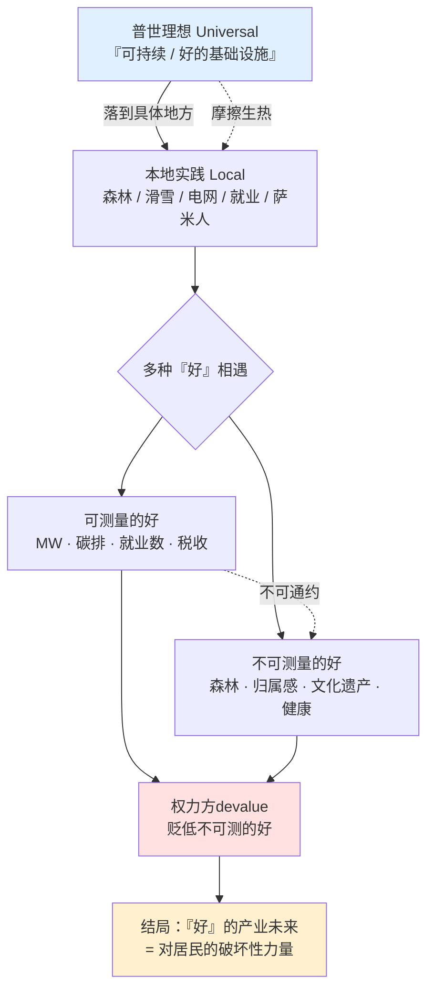
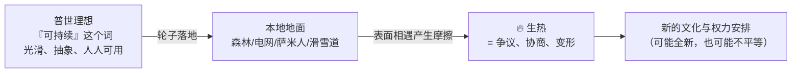
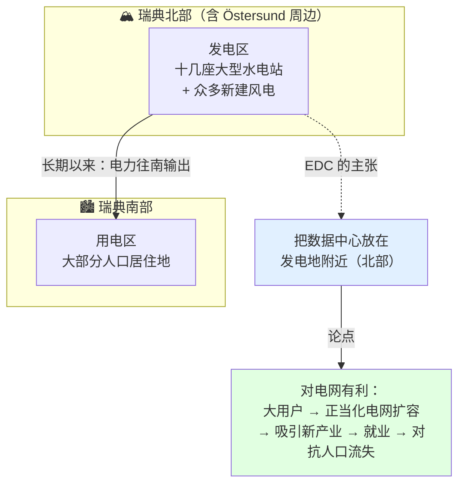
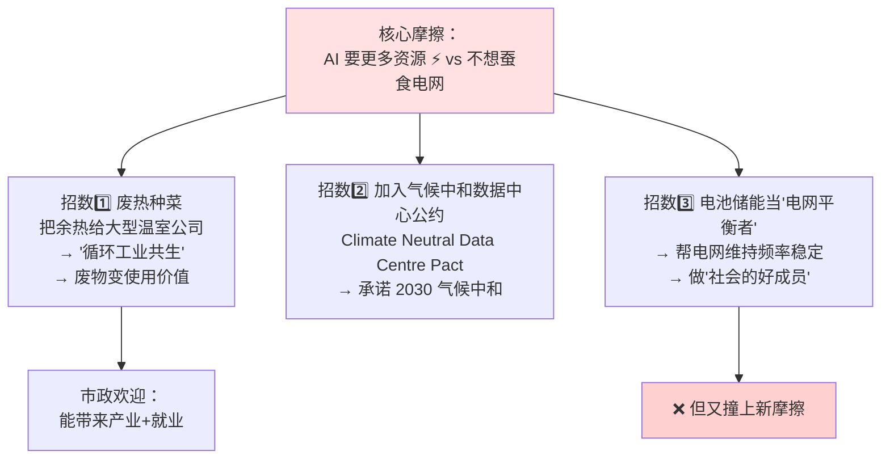
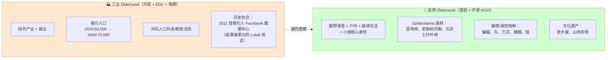
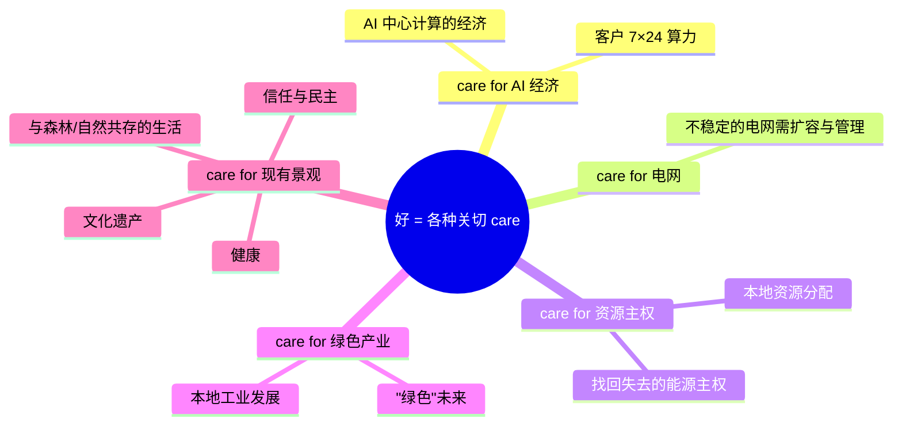
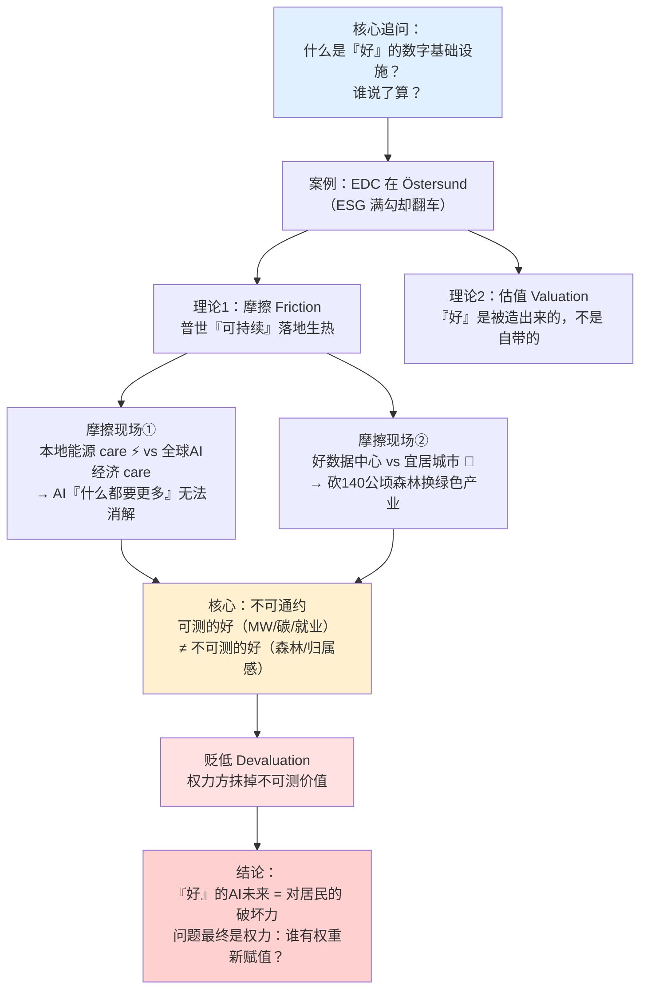

# 第 16 章 · 好的基础设施：数字未来、价值与摩擦 🏔️⚡

> 原文：*The Good Infrastructure: Digital Futures, Values and Friction*
> 作者：Johanna Sefyrin & Julia Velkova（瑞典 Linköping 大学）
> 出处：*AI Infrastructures and Sustainability*（Palgrave, 2026）第 16 章，PDF 第 356–378 页
> 关键词：数据中心（Data centre）· 摩擦（Friction）· 估值（Valuation）· 能源电网（Energy grids）· 宜居城市（Liveable city）· 数字基础设施（Digital infrastructure）

---

## 🗺️ 本章地图

这一章和本书里绝大多数「技术侧」章节不一样：**它不是教你怎么建数据中心，而是逼你回答一个更难的问题——「什么叫『好』的数据中心？『好』是谁说了算？」**

作者用瑞典小城 **Östersund（约特松）** 的一个真实案例：一家自称「生态+社会双绿色」的数据中心公司 **EcoDataCenter（EDC）**，各项 ESG 指标都打勾了，却仍然遭到当地居民的强烈抵制、被起诉、闹上市政听证会。作者问：**为什么一个「样样都对」的绿色数据中心，还是会引发冲突？**

答案的核心是三个人文社科概念，本章会逐一讲透：

| 概念 | 英文 | 一句话理解 | 本章作用 |
|---|---|---|---|
| **摩擦** | Friction | 全球普世理想（如「可持续」）落到具体地方时，与本地实践「摩擦生热」而产生的新格局 | 分析框架的第一支柱 |
| **估值/赋值** | Valuation | 「好/坏」不是技术自带的属性，而是在具体实践中被人**协商、争夺、建构**出来的 | 分析框架的第二支柱 |
| **不可通约** | Incommensurability | 两种「好」用的度量衡根本不同（可测的 MW/碳排 vs 不可测的森林/归属感），无法换算比较 | 冲突为何无解的根源 |

**学完本章你能做到：**
1. 用「摩擦」而不是「善/恶二分」去分析任何一场基础设施争议；
2. 识别一个「绿色叙事」背后藏着哪几种互相打架的「好」；
3. 理解为什么「碳排达标」不等于「社会可接受」——ESG 报告打满勾也可能翻车；
4. 在做 AI-Infra / 选址 / 政策时，看见那些**被度量衡系统性抹掉的价值**。

> 💡 **给工程师/面试者的话**：你可能觉得「这是文科内容，跟我写 CUDA kernel 没关系」。恰恰相反。**数据中心选址、电网谈判、社区关系、ESG 合规，是当代 AI-Infra 岗位（尤其云厂商/超算/政府侧）绕不开的真实工作。** 这一章教你的是——当技术指标全绿、项目却推不动时，问题到底出在哪一层。这是 SRE/Infra 之外的「基础设施政治学」，越往高走越值钱。

---

## 0️⃣ 开场：一份「问题清单」与一个反直觉的追问

作者在引言里先铺了一张**算法/数字系统「伤害清单」**，把过去十几年学界积累的批判一口气列出来。我们把它整理成表，方便你一眼看清「学界在担心什么」：

| 伤害类型 | 英文 | 代表文献（书里引用） | 通俗解释 |
|---|---|---|---|
| 官僚识别与信用评分的排斥 | exclusion through identification & credit scoring | Singh 2023 | 你办不了业务，因为系统里「你不存在/分不够」 |
| 内容审核工的去人性化 | dehumanization of content moderation | Roberts 2019; Ruckenstein & Turunen 2020 | 有人天天看血腥暴力帮你「净化」信息流 |
| 数字安防、监控、照护与控制 | securitization, surveillance, care & control | Winter & Hermansson 2025 | 「为你好」的监控 |
| 数据化的种族化 | datafied racialization | Benjamin 2019；D'Ignazio & Klein 2023 | 数据里编码进了种族偏见 |
| **数据中心对水/自然/能源/土地的冲击** | data centres' impact | Bresnihan & Brodie 2023；Hogan 2015 | 本章焦点 |
| 社区抵制 | community resistance | Lehuedé 2024；Rone 2024 | 居民起来反对 |

作者说：这些问题近年被统统装进了一个大筐——**「可持续性（sustainability）」**。于是他们提出本章的**核心追问**：

> **「什么才是一个『好』且值得拥有的、给算法和 AI 系统用的数字基础设施？它长什么样？能被谁、为谁想象出来？它由什么构成？」**

这个追问的巧妙之处在于：**它不问「数据中心有多坏」（那已经有一堆研究了），而是反过来问「怎样才算好」。** 一旦你开始定义「好」，你就会发现——**「好」根本没有唯一答案。**

### 🔬 核心论证 1：把「量化伤害」转向「价值协商」

本章最重要的立场转向（thesis）在这里：

> 原文：「We propose therefore to expand the current debate on the sustainability of digital infrastructure and to orient attention **from questions of quantifiable and measurable harms, such as carbon emissions, to concerns with valuations** through which the different qualities of 'good' infrastructure come to fruition and contention.」

**逐句拆解：**
- 主流的可持续性辩论盯着**可量化的伤害**：碳排放多少吨、耗水多少立方、耗电多少 MW。
- 作者说：**这不够。** 因为就算这些数字都「达标」，冲突照样发生（EDC 就是活例子）。
- 真正的战场在**估值（valuation）**——即「什么算好、值多少、由谁说了算」这个**协商过程**本身。
- **一句话结论**：`good/bad ≠ 技术本身的属性`，而是 `= 社会技术关系 + 它推崇的价值 + 允许某种「好」压过另一种「好」的权力结构` 的产物。

> 原文金句：「**good and bad are never properties of a technology per se but a result of sociotechnical relations, the values that they promote and the power structures** that allow for certain versions of the good to flourish and to suppress others.」

⚠️ **常见坑**：工程师最容易掉进的坑就是**技术决定论**——「我把 PUE 做到 1.1、100% 用水电、余热回收，这就是好数据中心啊！」。本章告诉你：**这些都是「一种」好，而且是「可量化的那种」好。** 但对住在旁边、每天去那片森林越野滑雪的居民来说，「好」是另一回事，而且你的指标再漂亮，也换不来他们的森林。

---

## 1️⃣ 主角登场：EcoDataCenter（EDC）——一个「样样都对」的公司

要理解这章的张力，得先看清 EDC 有多「优等生」。作者花了很大篇幅描述它，因为**正是「优等生却翻车」才让追问有力量**。

### EDC 的「绿色简历」

| 维度 | EDC 的做法（原文依据 EcoDataCenter 2023 可持续报告） |
|---|---|
| 🏢 定位 | 2014 年成立，专做 AI 处理的**托管（co-location）数据中心**；在 Falun、Stockholm、Piteå 有站点 |
| ⚡ 能源 | 用**无化石能源（fossil-free）** |
| ♨️ 余热 | **共享废热（share waste heat）** |
| 💧 冷却 | 力求**不依赖地下水**冷却（independent from groundwater） |
| 🤝 劳工 | 尊重工人权利、育儿假、结社自由、工会主导的集体薪酬谈判 |
| ⚖️ 伦理 | 「合乎伦理的经营，缓解环境与社会风险，**对加密货币说不**，确保透明与合规」 |
| 🔍 透明 | 在一个**出了名遮遮掩掩**的行业里，主动公开系统数据、性能指标、可持续工作 |
| 🌍 平等 | 基于**瑞典福利价值观**做多元与公平（diversity and equity） |

作者的总结一针见血：

> 原文：「the company goes to lengths to respond to environmental criticisms, align to accepted welfare and inclusivity policies, and promote a model for operations that **ticks many of the boxes** for what today could be called a 'sustainable' or, at the very least, non-harmful digital infrastructure.」

「ticks many of the boxes（把该打的勾都打了）」——这就是 EDC。

### 反转：优等生也翻车了

> 原文：「**Nevertheless, despite its commitments, the company faces civic resistance and critique** around its latest data centre development in the town of Östersund in Sweden. We were curious: **why?**」

这个「why」就是全章的引擎。**一个把 ESG 打满勾的公司，为什么还被居民抵制、起诉？** 作者要用「摩擦」和「估值」来解答。

> 💡 **实战启示**：这对任何做 AI-Infra 商业化/选址的人都是当头棒喝——**合规不等于社会许可（social license to operate）**。你可以拿到所有许可证、通过所有环评，项目照样可能因为「社区觉得你抢了他们珍视的东西」而卡死。EDC 的教训就是：**别以为指标绿了，社区就买账。**

---

## 2️⃣ 理论工具箱之一：摩擦（Friction）——本章的第一支柱

这是全章最需要掰开揉碎的概念。摩擦来自人类学家 **Anna Tsing（钤，2005）** 的名著《Friction: An Ethnography of Global Connection》。

### 摩擦 ≠ 冲突

> ⚠️ **头号误区**：一看「摩擦」就以为是「吵架、对抗」。**不是。** 原文明确：

> 「Friction, following anthropologist Anna Tsing (2005), **is not synonymous with tension or conflict** even if it certainly involves these in some ways.」

摩擦**包含**张力和冲突，但**不等于**它们。那摩擦到底是什么？

### 摩擦是什么：普世理想落地时「生热」的过程

Tsing 的定义（作者引用并展开）：

> 「Friction reflects the **productive and compromising relations** through which aspirations to fulfil universal schemes of global connection come to fruition.」

**关键词拆解：**
- **productive（有生产性的）**：摩擦不只是阻力，它**生产出新东西**——新的文化、新的权力安排。
- **compromising（既妥协又危及的）**：一语双关，既是「妥协」也是「危及/损害」。
- **universal schemes（普世方案）**：像「全球连接」「可持续发展」这种人人都想要的宏大理想。

### 什么是「普世（universal）」？——「我们不能不想要，即使它常把我们排除在外」

作者引用 Gayatri Spivak（斯皮瓦克）经由 Tsing 给出的经典定义：

> 「Tsing defines a universal as that which '**we cannot not want, even if it so often excludes us**' (Tsing 2005, p. 1).」

**这句拗口的双重否定值得咀嚼：**
- 「we cannot not want」= 我们**没法不想要**它（比如「可持续」，谁敢说自己反对可持续？）。
- 「even if it so often excludes us」= **即使它经常把我们排除在外**（可持续的宏大叙事里，可能根本没有你那片森林的位置）。

**普世理想是全球连接的前提，但它从不以提出者设想的形态出现**——它一定会在「本地相遇的热量」中变形。

> 原文名句：「As a metaphorical image, **friction reminds us that heterogeneous and unequal encounters can lead to new arrangements of culture and power**」（Tsing 2005, p. 5）。

### 用物理直觉理解摩擦（这是本章少有的「可类比物理」处）

- 光滑的轮子（普世理想）在真空里**转不动、也走不了**——没有摩擦就没有前进。
- 只有轮子**接触到粗糙的地面**（具体地方），才既能前进、又会生热、还会磨损。
- 「可持续」这个词也一样：它抽象时人人点头，一旦要落地到 Östersund 那片具体的森林，就**摩擦生热**，暴露出各方对「好」的不同理解。

### 「可持续」是一个普世理想——人人都能拿去用

> 原文：「**Sustainability is one such universal**, a word and a discourse that everyone can claim to a different end and purpose.」

这是本章的钥匙句。**「可持续」是个空筐**：
- EDC 说：我用绿电、余热回收，我可持续。
- 电网公司说：数据中心帮我扩容电网、留住本地能源主权，我可持续。
- 居民说：一片不砍的森林、能滑雪的生活方式，才是真正的可持续。

**同一个词，三方各取所需，指向完全不同的目的。** 这就是「everyone can claim to a different end」。

> 脚注 2 提醒（书里 footnote）：Stacey Alaimo（2012）专门讨论过「可持续」这个词认识论上的麻烦——它和「技术解决主义（techno-solutionism）」以及一段「科学客观性」的历史纠缠不清。也就是说，「可持续」听着中立客观，其实包袱很重。

---

## 3️⃣ 理论工具箱之二：估值（Valuation）——本章的第二支柱

如果说「摩擦」告诉你**冲突从哪来**，那么「估值」告诉你**「好」是怎么被造出来的**。

### 估值的定义：价值不是名词，是动词

作者引用估值研究（valuation studies，源自科学技术研究 STS + 实用主义传统）的经典定义：

> 「valuation as '**any social practice where the value or values of something is established, assessed, negotiated, provoked, maintained, constructed and/or contested**' (Doganova et al., 2014, p. 87).」

**注意这一长串动词**：建立、评估、协商、激发、维持、建构、争夺。**价值不是「东西自带的标签」，而是一堆持续进行的社会实践。**

再补一句 Hauge（2016）：估值还包括「judging, improving, appreciating（评判、改进、欣赏）」等无数活动。

### 核心假设：价值不稳定、不是人/文化的固有属性

> 🔬 **核心论证 2**（估值研究的根本立场）：

> 原文：「values are **not stable nor a property of people or cultures** but something that is '**grappled with, articulated, and made in concrete practices**'」（Dussauge et al., 2015, p. 1）。

**逐点拆解：**
1. 价值**不稳定**——今天觉得森林重要，谈判桌上可能就被换成 MW 数字。
2. 价值**不是人或文化的固有属性**——不是「瑞典人天生爱自然」这种本质主义解释。
3. 价值是在**具体实践中被「摔打、表达、造出来」的**（grappled with = 摔打/角力）。
4. 研究价值的方法：**看「不协调、不和谐、断裂」的时刻**（dissonances, discordances, ruptures）——也就是**看争议**。

### 关键推论：「什么是好技术/好基础设施」永远是开放问题

> 原文：「the question 'What is good technology?' and its corollary, 'What is a good infrastructure?' are **bound to always remain open**.」

**永远开放**——因为答案取决于「在特定时间、地点、情境下，哪些实践定义了『好』」。实验室里的「好」和新技术落地现场的「好」，可能完全不同（Lee & Helgesson, 2020）。

> 脚注 3 补充：这种「把价值当实践」的思路不新，至少可追溯到 **John Dewey（杜威）1939 年的《Theory of Valuation》**——杜威把价值同时理解为「essence 和 practice，名词和动词」。也就是说，**value 既是「价值」也是「赋值/估值」这个动作。**

### 方法论：争议分析（Controversy Analysis）

作者怎么研究「估值」？答案是**在争议中研究**：

> 原文：「Valuation practices are **exposed to analysis in moments of controversy**. Controversies highlight the making of social, political and power relations in action. **They open a black box** of objects that seem fixed and contained.」

**为什么盯着争议？**
- 平时一个数据中心看起来是「黑箱」——理所当然、封闭、固定。
- **一旦有争议，黑箱被撬开**（Latour 2003 的「打开黑箱」），你才看得见里面的社会、政治、权力关系是**怎么被造出来的**。

> 💡 **方法论迁移**：这个「看争议以理解系统」的思路，工程师其实很熟——**只有在故障/事故（incident）时，你才真正看清一个分布式系统的依赖关系、隐藏假设和权力（谁能改配置、谁能回滚）。** 平时一切正常，架构就是个黑箱。争议之于社会系统，就像 incident 之于技术系统——**都是理解系统的最佳窗口。**

### 作者的经验材料（研究是怎么做的）

作者 2023–2025 年追踪了 EDC 在 Östersund 的公共辩论，材料包括：

| 材料来源 | 说明 |
|---|---|
| 在线材料 + 市政听证会公开录音 | 官方争议现场 |
| EDC 撰写的可持续报告 | 公司自述 |
| Facebook 群组 "Save the Spikbodarna" | 居民自发组织（Spikbodarna 是那片森林的名字） |
| 当地报纸 *Östersundsposten* 的媒体报道 | 本地舆论 |
| **8 场访谈**（第一作者 Sefyrin 做） | 对象：EDC、市政雇员、区域电网运营商 Jämtkraft、当地自然保护协会 |

分析用**诠释学方法（hermeneutical approach）**：在经验材料与理论问题之间来回穿梭。

---

## 4️⃣ 摩擦现场之一：本地能源之关切 vs 全球 AI 经济之关切 ⚡

这是全章第一个具体的摩擦现场。核心张力是：**EDC 想「不吃掉本地电网」，但 AI 计算的本质就是「什么都要更多」。**

### 4.1 EDC 的承诺：「我们不想蚕食（cannibalize）现有电网」

> 原文（EDC 代表访谈）：「'**We do not want to cannibalize the existing electric grid**,' a company representative expressed EDC's vision of sustainability.」

「cannibalize（蚕食/自相残杀）」这个词很关键——数据中心臭名昭著地会向本地电网索取**巨大容量**，导致碳排上升、甚至因能源可及性问题引发社会不平等。EDC 想撇清这一点。

### 4.2 Östersund 的地理经济：北方产电、南方用电

要理解 EDC 的逻辑，得懂瑞典的能源地理：

**EDC 的核心论点**：数据中心该放在**离发电地近**的地方，而不是「大城市里，那会给电网很大压力」。

> 原文金句（EDC 代表）：「'**A rightly placed data centre can add incredibly much in an electricity system. A wrongly placed one can cannibalize an electric system** … This is what we believe is the next step in our sustainability journey.'」

**注意 EDC 的话术转向**：它把「放对位置」本身**重新定义为可持续性的下一步**。选址 = 可持续。这是一次典型的**估值实践**——把「地理选址」赋值为「好」。

### 4.3 电网运营商的共鸣：资源主权（Resource Sovereignty）

区域电网运营商 **Jämtkraft** 对 EDC 的愿景高度共鸣，但理由不同——它关心的是**「资源主权」**：

| 各方的「好」 | 具体内容 |
|---|---|
| EDC 要的 | 向电网申请 **150 MW**（≈ 当时整个 Östersund 全镇用电量！） |
| 怎么实现 | 容量不够 → 需**电网加固 + 新建输电线**；EDC、本地电网、国家骨干电网运营商 **Svenska Kraftnät** 联合出资，扩容至 2033 年 |
| Jämtkraft 的算盘 | 想在本区域**留住 500 MW** 用于本地电气化和高耗电产业，**而不是像过去几十年那样输出给南方** |
| 深层动机 | **区域身份政治**——让 Jämtkraft 在资源上更自给自足、摆脱对南方的依赖 |

> 🔬 **核心论证 3——「好」= 多种「关切/照护（care）」**：
> 作者在这里第一次点出全章的核心分析语言：**「好」是通过各种「care（关切/照护）」来表达的。**
>
> 原文：「'Good' infrastructure here manifests through **values of care for the power grid, care for the energy autonomy of the town, and care for enabling local self-determination** over resources and industrial development.」

在这个现场，这几种 care 是**和谐一致**的——都指向「把本地从『被抽取的区域（zone of extraction）』变成『价值生产区（zone of value production）』」，让红利留在本地、而不是被更强的南方拿走。

> 💡 **概念延伸：资源殖民地翻身**。这里藏着一个后殖民/内部殖民的框架：北方长期是南方的「能源殖民地」（产电却穷）。数据中心被想象成**翻身的杠杆**——用一个大用户撬动电网扩容，把能源红利留在本地。这解释了为什么地方政府/电网如此欢迎数据中心：**它不只是个机房，它是一场地区经济独立运动的符号。**

### 4.4 摩擦爆发：AI 的物质性——「什么都要更多」

前面各方 care 还很和谐，但一撞上 **AI 计算的真实物质性**，摩擦就来了。

EDC 做的是**转租空间给跑 LLM 训练这类高强度计算的公司**。它心知肚明：再怎么想「不蚕食电网、做好事」，服务器就是要吃掉海量资源。原文里 EDC 代表的这段话堪称**「AI 数据中心资源黑洞」的教科书级自白**：

> 原文（EDC 代表向 Sefyrin 解释，逐句在下面拆）：
> 「One needs a specific kind of data centre that can operate these servers in a special way... **it is much more cooling. You will need more power because you need more cooling. You need more people** who are working... because it's much more intensive. **You need more maintenance, because everything is run harder. The whole facility is run harder**... it needs to be maintained more often.」

**逐句拆解「AI 数据中心 vs 普通数据中心」：**

| 维度 | 普通数据中心 | AI 数据中心（跑 Nvidia GPU 训练 LLM） | 原文依据 |
|---|---|---|---|
| 硬件 | 普通服务器 | **Nvidia 显卡（GPU）** | "equipped with Nvidia graphic processing cards" |
| 能耗 | 基准 | **更耗电**（AI 计算比普通服务器更 energy-demanding） | "more energy-demanding than ordinary servers" |
| 冷却 | 基准 | **更多冷却** → 更多电 | "much more cooling... more power because you need more cooling" |
| 人力 | 基准 | **更多运维人员**（because it's much more intensive） | "more people who are working" |
| 维护 | 基准 | **更频繁维护**（一切都跑得更狠，一点都不能坏） | "everything is run harder... maintained more often" |

**一句话：AI 数据中心 = 「requires more of everything（什么都要更多）」。**

> ⚠️ **技术侧必读的坑**：很多人以为「绿电 + 余热回收」就能中和 AI 的资源强度。**错。** 这段自白说明：**AI 的资源强度是绝对增量，不是可以靠「优化」抹平的。** EDC 的所有「做好事」努力，都**没有降低**资源使用强度——它只是**把「好」挪到了别的方向**（下一节详述）。这就是摩擦的本质：`care for AI economy（要更多）` 与 `care for local grid（别蚕食）` 根本对冲。

### 4.5 摩擦无法消解，只能「转移」——EDC 的三招创造性方案

面对这个对冲，EDC 想出几招「换个方向做好事」的方案。**注意作者的判词：这些方案都没降低资源强度，只是把「好」挪了个位置。**

**招数 3 的自打脸最典型**——EDC 想让数据中心当「电网平衡器」，但立刻发现和自己的商业模式冲突：

> 原文（EDC 代表）：「'**Our customers are dependent on being able to run their stuff all the time**, so we sit here with a problem... **they are guaranteed a certain capacity, and then we can't put this capacity on something else either**. So it's an ongoing discussion.'」

**这段摩擦讲的是：**
- AI 客户要求**24 小时不间断算力**（跑训练不能停）。
- 电网平衡服务要求你**能随时把容量让出来**。
- 两者**直接对冲**：你保证给客户的容量，就不能挪去平衡电网。

### 4.6 更深的摩擦：AI 的「常连」文化 vs 电力的「波动」现实

作者点出最根本的一层摩擦——**两种「时间文化」的不可调和**：

> 原文：「**The cultural expectations of a resource-intensive industry that operates on the premise of constant connection and computing 24 hours a day** as a core business model **are simply incongruent with fluctuations in electricity** and shifting demand for energy in everyday practice.」

| | AI 经济的时间文化 | 电力系统的时间文化 |
|---|---|---|
| 核心假设 | **恒定连接、7×24 不断算**（constant connection） | 电力可用性**随时波动**（取决于本地消费动态） |
| 例子 | LLM 训练一跑几周不能停 | 有人给电动车充电、开高耗电桑拿房，电就紧张（Velkova et al. 2022） |
| 冲突 | 「必须永远有电」 | 「电网根本不是这么运作的」 |

**结论**：EDC 的「灵活性实验」是这个摩擦的**症状**，但**解决不了它**。摩擦不消失，反而把 AI 经济的「转速」甩出了 Östersund 这座小城之外——**本地承担代价，全球 AI 经济获益。**

> 🔬 **核心论证 4——数据中心既制造需求，又为需求辩护**：
> 原文冷峻的判词：「The data centre **created therefore both a demand and justification for grid expansion**. While perhaps not 'cannibalizing' the grid, EDC would be a **major consumer of energy** in the town, and that energy would go towards **global computing**.」
>
> **翻译成大白话**：EDC 一边说「我帮你扩电网（正当化）」，一边自己就是那个「需要扩电网的大胃口（制造需求）」。它自证自需。而扩出来的电，最终喂给了**全球 AI 计算**，不是本地。

> ⚠️ 顺带埋下的伏笔（脚注 4）：电网扩容和加固可能引发**土地问题**，与在该地放牧驯鹿的**萨米人（Sámi）**冲突——这是又一层被主流叙事忽略的摩擦（参见 Fjellheim 2023、Lawrence 2014 关于萨米土地上风电开发的「内部殖民」研究）。

---

## 5️⃣ 摩擦现场之二：好的数据中心 vs 宜居的城市 🌲⛷️

第一个摩擦是「能源」层面的。第二个摩擦更贴近普通人——**这个数据中心，要不要以砍掉居民珍爱的那片森林为代价？**

### 5.1 EDC 的又一版「好」：民主与信任

面对市政，EDC 又拿出**另一个版本的「好」**——推崇**民主（democracy）和信任（trust）**：

> 原文（EDC 代表）：「'We have a very rigorous, democratic consensus process in Sweden, overall. One must follow this.'」

EDC 还在别的城镇做过**影响力分析（impact analyses）**，用一套指标衡量自己的本地贡献：

| EDC 的「贡献指标」 | 对应的「负面影响」 |
|---|---|
| 税收（tax revenue） | 用可测的正面 vs 可测的负面 |
| 数据采集（data collection） | 相互抵扣 |
| 透明度（transparency） | |
| 教育倡议（educational initiatives） | |

> 💡 **注意这里的估值手法**：EDC 把「好」**全部翻译成了可测量的指标**（税收、就业、透明度分数）。这是**「可量化的好」的典型操作**——把复杂的社会价值压缩成能进 PPT、能对比的数字。**记住这个手法，第 6 节的「不可通约」正是从这里裂开的。**

### 5.2 裂痕：一座城的两个灵魂——工业 Östersund vs 自然 Östersund

尽管 EDC 高举民主与信任，数据中心的落地还是在**居民 vs 市政**之间撕开了一道巨大裂痕，争的是**「这座城的身份认同」和「什么才是它的好未来」**：

**市政的处境（可理解的一面）**：像瑞典很多北方城镇一样，Östersund 面临**人口外流→税收减少→公共服务预算缩水**的恶性循环。它多年来一直想引入大型高耗电产业来创造就业、留住人口。EDC 的到来，被市政看作**发展「绿色产业」的机会**。

### 5.3 「先知型公司」——技术公司如何吞噬公共想象力

作者在这里引入一个尖锐的概念，来自 Mager & Katzenbach（2021）：

> 🔬 **核心论证 5——「先知型公司（prophetic corporations）」**：
> 原文：「imaginaries of sociotechnological futures are increasingly dominated by technology companies that seem to '**absorb public institutions' ability to govern these very futures**.' These '**prophetic corporations**' seek to provide future visions of a better world to guide and legitimize their own digital technologies and business practices.」

**拆解这个概念的杀伤力：**
1. 「社会技术未来」的想象，越来越被**科技公司主导**。
2. 这些公司**吸走了公共机构治理未来的能力**——政府本该定义「什么是好未来」，现在这个定义权被科技公司拿走了。
3. 它们提供「更美好世界」的愿景，但目的是**为自己的技术和商业实践背书、正当化**。
4. 后果：**公民、公民组织、活动家、研究者、地方政府**，在对抗科技公司的主导愿景时，**很难提出「反想象（counter imaginaries）」。**

> 💡 **对 AI 从业者的镜子**：这段话是对整个 AI 行业「未来叙事」的批判。想想那些「AI 将解决气候/医疗/教育」的宏大 PR——按这个框架，它们都是**先知型公司在用未来愿景为自己背书**，同时悄悄**掏空了公众自主定义未来的能力**。数据中心只是这套逻辑的物理落地。

### 5.4 Spikbodarna：一片森林承载的「不可测之好」

争议的引爆点非常具体：**市政批准 EDC 在 Spikbodarna 这片休闲森林建数据中心。**

- **为什么选这里？** 从能源角度**方便**——高压输电线正好从这片区域穿过（省了拉线）。
- **代价是什么？** 需要**砍掉大片森林**——而这正是居民视为「宜居环境」核心的地方。
- **规模：140 公顷森林将被清除**（据 Save the Spikbodarna 网页）。

争议的关键法律动作是：**市政要改变这片区域的用途**——从「休闲区（recreational area）」改成「工业地块（industrial lot）」，为「绿色工业增长」做准备。数据中心将成为其他产业（大型工业温室、电网扩建、新道路）的**「可持续性来源」**。

> 原文核心判词：「the data centre came to stand for the good future of the town **where the good was reduced to the growth of industries with an environmental profile**. This growth would happen **at the cost of the forest**.」

**「好」被窄化（reduced）成了「带环保标签的产业增长」**——代价是森林和现有的休闲基础设施。

### 5.5 居民的反击：Save the Spikbodarna

居民和环保组织的组织化反抗：

| 组织 | 行动 |
|---|---|
| 自然保护协会（Society for the Conservation of Nature）本地分会 | 发起捍卫森林休闲价值的运动 |
| Facebook 群组 **Save the Spikbodarna** | 意图影响、并最终**起诉市政**，追究其公众咨询和规划程序的责任 |
| 当地媒体 | 撑腰，强调「即便打着可持续旗号，工业开发也损害了城市休闲和文化遗产的公共价值」 |

**居民的立场极其精准，值得一字不差地理解——他们不反工业、不反计算，他们反的是「摧毁一个『已经可持续』的东西」：**

> 原文：「citizens were **not against industrialization nor computing as such** but rather against **the destruction of the forest landscape as a public recreational infrastructure that they saw as already sustainable** and part of their way of life. **No industrial developments... would be able to craft a version of sustainability of higher quality than the sustainability and value offered by the forest.**」

然后是全章**最锋利的一句话**，来自 Save the Spikbodarna 网页：

> 🔬 **核心论证 6——「有时最可持续的做法，是什么都不做」**：
> 原文引用：「'**Sometimes it is more sustainable to not do anything at all**, as a participant in the dialogue with the citizens said it. In this case, it is without any doubt the best alternative.'」（Save the Spikbodarna, 2025）
>
> **这句话彻底颠覆了主流的「可持续 = 建设更绿的东西」逻辑。** 居民说：森林本身就是最高质量的可持续，任何「绿色建设」都不可能超过它。**保留 > 建设。不动 > 动。** 这是对「技术解决主义」最优雅的反击。

> 💡 **实战/面试高频视角**：这一点对做碳核算/ESG 的人是巨大的认知冲击。主流碳核算只算「你新建项目的排放」，几乎**永远不给「保留一片森林/什么都不建」记账**（因为它没有「项目」）。这就是为什么「可持续」的会计系统天然偏向「建设」——**不建设的价值在账本上是隐形的。** 记住这个系统性偏差。

### 5.6 两种「好」的经济学：剥削森林 vs 照护森林

居民不是「反发展」，他们有**另一套本地经济逻辑**——建立在**照护（caring for）而非剥削（exploiting）森林**之上：

| | EDC/市政的经济逻辑 | 居民/本地的经济逻辑 |
|---|---|---|
| 对森林的态度 | **剥削**（清除 → 建工业） | **照护**（保留 → 在其上做小规模生意） |
| 经济形态 | 大型高耗电工业 | 旅游、休闲、食物领域的**小规模创业** |
| 招牌 | 「绿色产业」 | **UNESCO 创意城市网络「美食」类**成员；把山川森林河流+小农场当卖点 |
| 与 EDC 的关系 | —— | **不可通约（incommensurable）** |

> 原文金句：「A good energy grid and a good AI data centre are **worth little to citizens who want to have a good forest to live with**.」
>
> 「一个好电网、一个好 AI 数据中心，对那些只想拥有一片好森林来生活的居民来说，**几乎一文不值。**」——这就是**不可通约**的最直白表达。

### 5.7 连市政内部都分裂了

值得注意的是，**「优先工业还是优先休闲」的分歧，连市政府自己内部都摆不平**——三个部门三种立场：

| 市政部门 | 立场 |
|---|---|
| 🏗️ 城市规划处（urban planning） | 开发会对休闲品质、森林、公共健康造成**不可逆影响** |
| 🎭 文化与休闲处（culture and leisure） | 户外吸引力会受损，老山地农场的**文化遗产必须保护** |
| 🌱 环境与健康处（environment and health） | 数据中心选址**违反市政综合发展规划**，损害公共健康和自然价值 |

**连政府都无法统一「好」的定义**——这本身就证明了作者的论点：**「好」不是客观事实，是各方从各自位置看到的不同东西。**

### 5.8 民主的合法性危机

最后一层摩擦上升到**治理与民主合法性**：

> 原文：「The conflicting versions of good infrastructure... **raised questions about the democratic legitimacy of the planning process.**」

- 自然保护协会成员担心**失控的工业扩张**（因为数据中心已获批，后面会带来一连串工业）。
- 他质疑**民主程序**，质疑「产业和部分市政部门无视公民意见的权力位置」。
- 核心洞察：在当前治理体制下——**政客和欧盟层面机构都在推数据中心——不同的价值和实践并没有被给予同等的分量。**

> 原文关键句：「in the current regime of governance... **differing values and practices are not given the same weight**.」

**注意这里的微妙之处**：Östersund 多年前就已决定「要吸引大型高耗电企业」。所以关于自然、可持续、健康的所有谈判，**都发生在这个既定框架之内**。换句话说——**游戏规则早就偏了。** 民主程序**每一步都合规**，但**合规 ≠ 各方被平等倾听**：

> 原文：「the process followed established rules and legislation. Even so, **the legitimacy of the process was repeatedly questioned** by civic groups claiming that **all arguments and actors were not being equally heard and valued.**」

> ⚠️ **深刻的坑**：这是本章对「程序正义」最犀利的一击——**程序合法 ≠ 结果正义 ≠ 各方被平等对待。** 当框架本身已被「必须发展高耗电产业」预设偏斜，后面所有「民主听证」都只是在**已经倾斜的桌面上**协商细节。这对任何研究 AI 治理、算法问责、平台监管的人都是核心教训。

---

## 6️⃣ 结论：不可通约的「好」，与被贬低的价值 🎯

作者在结论里把整章拧成一条主线。核心是两个词：**「关切（care）」和「不可通约（incommensurability）」。**

### 6.1 每一方的「好」都是一种「关切（care）」

> 原文：「Common to these different actors is that they all express the 'good' in terms of **different forms of care**.」

作者把整场争议中的各种「好」，统一翻译成「care for X（关切 X）」：

**每一方都在「关切」某样东西，都自认在做「好事」。冲突不是「好人 vs 坏人」，而是「care 对 care」。**

### 6.2 不可通约（Incommensurability）——冲突为何无解的根源

作者指出，这些 care 虽然**同等重要**，却**不可通约**。根源是**双重的**：

> 🔬 **核心论证 7——可测 vs 不可测的根本断裂**（全章的收束点）：

| 维度 | 权力方（EDC + 电网 + 市政）的「好」 | 居民 + 环保 NGO 的「好」 |
|---|---|---|
| **本质** | **可测量（measurable）** | **不可测量（unmeasurable）** |
| **度量衡** | 碳排放、MW 电力增长、人口规模、就业数、产业数量与多样性 | 与森林及其物种共处的好生活、健康、在雪地里移动的文化能力 |
| **逻辑** | 「更多/更少某个可测实体」定义好未来 | **归属感、与城镇和景观的关系、休闲基础设施在自然中塑造这种关系的作用** |
| **能否换算** | ↔️ | **不能——这两套度量衡之间没有汇率** |

> 原文：「it exposed **a fundamental incommensurability between measurable and unmeasurable valuations of the 'good.'**」

**为什么这是死结？** 因为你**没法把「森林里的归属感」换算成「多少 MW」或「多少个就业岗位」。** 没有汇率，就没法在同一张表上比较，也就没法「理性权衡」。谈判桌上，**可测的那一方天然占优**——因为它能进 PPT、能算 ROI、能写进政策 KPI；不可测的那一方只能诉诸「情感」「生活方式」，在「客观数据」面前显得「不专业」。

### 6.3 贬低（Devaluation）——权力如何抹掉不可测的价值

> 🔬 **核心论证 8——本章最重的判词**：
> 原文：「In the friction between these incommensurable versions of the good, **infrastructure providers and the municipality devalued the non-measurable positive qualities that make the town liveable** for its citizens. In this process of devaluation, the '**good**' industrial future with a data centre for AI computing **attains qualities of a destructive force for residents**.」

**拆解这个致命链条：**
1. 两种「好」不可通约 → 无法公平比较；
2. 权力方（有制度和基础设施权力的一方）**贬低（devalue）**了不可测的价值；
3. 于是那个「好」的产业未来，**对居民而言变成了一股破坏性力量**；
4. 居民被迫「协商他们所珍视之物的丧失」——日常的、与自然共处的城市生活。

> 原文残酷的收尾：「the '**sustainable**' data centre, even if nominally ticking all the boxes of sustainability... **also promotes losses that matter and to which people have to adapt: the loss of recreational infrastructure, of lifestyle, of forest inhabitants and of relationships with the landscape.**」

**「可持续」数据中心，即便名义上把所有勾都打了，也在推动『重要的丧失』——休闲设施、生活方式、森林居民（动植物）、与景观的关系，统统丧失，而人们只能被迫适应。**

### 6.4 丧失、治理与权力：谁有权决定谁输谁赢？

作者把问题最终上升到**权力（power）**：

> 原文：「**Losses bring to the fore larger question of governance and power.** Planners and power grid operators have the institutional and infrastructural power to decide on future urban and regional developments, and **decide who will lose and who will gain**.」

**关键结构性事实：**
- 数据中心产业被**瑞典国家政策和欧盟层面**大力推动，作为「AI 服务和数字化」的载体。
- 它是**「被优先的产业（prioritized industry）」**——其他所有人都得为它腾地方、做妥协，**不管市民喜不喜欢。**
- 这些机构还推崇**自由市场价值观**：假定「社会与环境福祉能通过治理机制和经济基准（economic benchmarks）创造出来」。

> 原文核心命题：「Making sustainable futures is then about **not only who has the power to make the decisions about an individual data centre but also who has the power to shift priorities and value non-measurable qualities that are vanishing: sense of place, belonging, trust and life with forests and nature.**」

**打造可持续未来，不只关乎「谁能拍板单个数据中心」，更关乎「谁有权力改变优先级、给那些正在消失的不可测价值——地方感、归属感、信任、与森林自然共存的生活——重新赋值」。**

### 6.5 面向未来研究的呼吁

> 原文（结语最后一句）：「a pressing question for further research calls for more engagement with **the losses and endings that digital developments promote, and the things and qualities that are devalued and pushed aside.**」

作者呼吁未来研究更多关注：**数字发展所推动的「丧失与终结」，以及那些被贬低、被推到一边的事物与品质。** 这与本书其他章节关于「数据中心废墟」「基础设施遗弃」的研究一脉相承（Brodie & Velkova 2021）。

---

## 🧭 全章逻辑一图流

---

## 📌 小结（本章 8 个必须带走的洞见）

1. **「好」不是技术自带的属性**，而是社会技术关系 + 它推崇的价值 + 允许某种「好」压过另一种的**权力结构**共同造出来的。→ `good/bad = f(关系, 价值, 权力)`
2. **摩擦（Tsing）≠ 冲突**。它是普世理想（如「可持续」）落到具体地方时「摩擦生热」、既有生产性又危及性的过程。没有摩擦，普世理想根本走不动。
3. **「可持续」是个普世空筐**——人人都能拿去用，指向完全不同的目的。EDC、电网、居民对它的定义互相打架。
4. **估值（Valuation）是动词不是名词**（杜威）。价值在具体实践中被摔打、协商、争夺出来；研究它要**看争议时刻**（黑箱被撬开的瞬间）。
5. **AI 数据中心 = 「什么都要更多」**。绿电+余热回收+电池储能都**不降低**资源强度，只是把「好」挪个方向。AI 的「7×24 常连」文化与电力的「波动」现实根本不可调和。
6. **合规 ≠ 社会许可**。EDC 把 ESG 每个勾都打了，照样被起诉。程序合法 ≠ 各方被平等倾听——当框架已预设偏斜，「民主听证」只是在倾斜桌面上谈细节。
7. **不可通约是死结**：可测的好（MW/碳/就业/税收）和不可测的好（森林/归属感/健康/文化）**之间没有汇率**，无法在同一张表上比较。谈判桌上可测方天然占优。
8. **权力决定谁的「好」胜出**。权力方**贬低（devalue）**不可测价值，于是「好」的产业未来变成对居民的**破坏性力量**。最终极的问题是：**谁有权给正在消失的不可测价值重新赋值？**

> 💡 **给 AI-Infra 从业者的终极一课**：下次你参与一个数据中心/超算/云区域的选址、能源谈判、社区关系项目时——**别只盯着 PUE、碳排、MW 这些「可测的好」。** 问自己三个问题：
> 1. 我的「绿色叙事」压过了哪些**不可测但对本地人至关重要**的价值？
> 2. 我的「合规」是不是建立在一个**早已偏斜的框架**之上？
> 3. 当各方的「好」不可通约时，**谁有权力拍板、谁被系统性地devalue了？**
> 
> 这三问，才是「好的基础设施」这门课的真正考点。

---

## 🔗 延伸阅读与关键文献

**理论基石：**
- **Tsing, A. L. (2005). _Friction: An Ethnography of Global Connection._ Princeton UP.** —— 「摩擦」概念的原典，本章分析框架的第一支柱。
- **Doganova et al. (2014); Dussauge et al. (2015).** —— 估值研究（valuation studies）的核心，「价值是实践」立场的来源。
- **John Dewey (1939). _Theory of Valuation._** —— 「价值既是名词也是动词」的思想源头（脚注 3）。
- **Latour, B. (2003). _Science in Action._** —— 「打开黑箱」的方法论；Venturini & Munk (2021) 的《Controversy Mapping》是配套操作手册。

**数据中心 × 可持续 × 能源政治（本书内外呼应）：**
- **Mager & Katzenbach (2021).** —— 「先知型公司（prophetic corporations）」概念，科技公司如何吞噬公共想象力。
- **Brodie & Velkova (2021), "Cloud ruins".** —— 数据中心的「废墟」与基础设施遗弃，呼应本章结语对「丧失」的呼吁。
- **Vonderau, A. (2019), "Scaling the cloud".** —— 瑞典 Facebook/Luleå 数据中心与国家、基础设施的建构（本章 2011 年 Facebook 选址掌故的出处）。
- **Velkova, J. (2016), "Data that warms".** —— 数据中心余热作为「计算流量商品」（本章招数①废热种菜的理论背景）。

**萨米人与内部殖民（本章脚注 4 的伏笔，值得深挖）：**
- **Fjellheim (2023); Lawrence (2014).** —— 萨米传统土地上的绿色能源开发与「内部殖民」，本章一笔带过、但极其重要的一层被忽略的摩擦。

**方法与批判视角：**
- **Alaimo (2012).** —— 「可持续」一词认识论上的麻烦及其与技术解决主义的纠缠（脚注 2）。
- **Cellard et al. (2025); Pasek et al. (2023).** —— 作者明确点名要「细化」的两篇关于 AI 碳足迹的辩论，本章正是对「只盯可量化伤害」的回应与超越。

**本书内部互文（读完本章建议顺藤摸瓜）：**
- Velkova 本人在本书另一章讨论数据中心与能源不平等；
- Valdivia 在本书讨论 Nvidia GPU 与 AI 供应链资本主义——正好接上本章 4.4 节「AI 什么都要更多」的物质性。

---

> *本讲义严格依据原书第 16 章（PDF 356–378 页）逐节精读整理，所有原文引用均保留英文以便对照。人文社科章节无「代码」，故以「🔬核心论证」框替代技术书的「第一性原理」框，逐一拆解作者的关键立论。*
