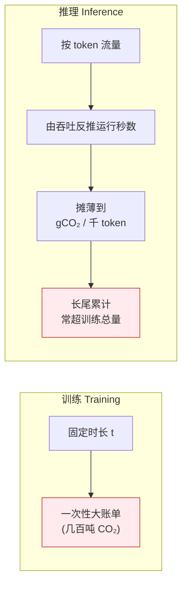

# 🌍 AI 能耗-碳排-水耗计算器 (AI Carbon Footprint Calculator)

> 配套书籍:**《AI Infrastructures and Sustainability》**
> 本项目把一句抽象的口号——「训练一个大模型排放几百吨 CO₂」——拆成**可计算、可测试、可复现**的第一性原理链条。给定 GPU 数、功耗、时长、PUE、电网碳强度、水耗系数,一行行算出**训练 / 推理**的 **kWh、tCO₂e、水(L)**,并对比不同电网(可再生占比)的清洁程度。
>
> **纯 Python 标准库实现核心逻辑,离线可跑,不联网、不下模型、不需 key。**

---

## 📖 目录

1. [这个项目在解决什么问题](#1-这个项目在解决什么问题)
2. [第一性原理:三笔环境账单的物理链条](#2-第一性原理三笔环境账单的物理链条)
3. [核心概念逐个讲(是什么/为什么/怎么用/代价)](#3-核心概念逐个讲)
4. [代码结构与逐行讲解](#4-代码结构与逐行讲解)
5. [如何运行](#5-如何运行)
6. [测试:每条测试对应一个物理直觉](#6-测试每条测试对应一个物理直觉)
7. [Demo 出图解读](#7-demo-出图解读)
8. [💡 实战 & 面试高频](#8--实战--面试高频)
9. [⚠️ 常见坑](#9-️-常见坑)
10. [📌 小结](#10--小结)
11. [🔗 延伸阅读](#11--延伸阅读)

---

## 1. 这个项目在解决什么问题

**是什么。** AI 的算力狂潮背后是**能源、碳、水**三种真实的物理资源消耗。业界常见三类误区:

- 只说 FLOPs / GPU-hours,不换算成**电与碳**,决策者无感;
- 只算训练一次的碳,忽略**推理**长尾——一个模型上线后每天服务亿级 token,累计碳排常常**远超训练**;
- 完全忽略**水足迹**——数据中心冷却塔蒸发的水、上游电厂冷却取的水,是《AI Infrastructures and Sustainability》一书反复强调的「被忽视的第二资源」。

**为什么重要。** 同样一份训练,放在**煤电电网**和**北欧水电电网**,能耗一模一样,但碳排相差 **30 倍**(本项目 demo 实测:452 tCO₂e vs 15 tCO₂e)。这意味着**「训练搬到哪」比「训练怎么优化」对碳的影响还大**。这是 AI Infra 可持续性最重要的杠杆之一。

**怎么用。** 把你手上的硬件与运行参数填进 `TrainingConfig` / `InferenceConfig`,一行代码得到三笔账单;用 `compare_grids` 一键对比不同电网;用 `run_demo.py` 出柱状图与敏感性曲线。

**代价 / 边界。** 本计算器是**教学级线性模型**:假设功率恒定、PUE 恒定、碳强度取平均值。真实世界里功率随负载波动、电网碳强度随时段变化(白天光伏多、夜间火电多)、内存/网络也耗电。本项目刻意**保持简单以暴露物理本质**,并在代码里标注了每个近似点。

---

## 2. 第一性原理:三笔环境账单的物理链条

整本书、整个项目的骨架就是下面这一条链。**记住它,你就能徒手估算任何 AI 任务的碳排。**

```mermaid
flowchart TD
    A["GPU 电功率 P<br/>(瓦 W)"] -->|× GPU数 N × 时长 t(h) × 利用率 u| B["IT 设备电能<br/>(kWh)"]
    B -->|× PUE<br/>数据中心整体用电效率| C["设施总电能<br/>(kWh)"]
    C -->|× 电网碳强度<br/>gCO₂/kWh| D["碳排放<br/>(gCO₂ → tCO₂e)"]
    C -->|× 水耗系数<br/>L/kWh| E["水足迹<br/>(升 L)"]

    style A fill:#e3f2fd,stroke:#1565c0
    style B fill:#fff3e0,stroke:#e65100
    style C fill:#fff3e0,stroke:#e65100
    style D fill:#ffebee,stroke:#c62828
    style E fill:#e1f5fe,stroke:#0277bd
```

用 LaTeX 写成公式(**这 4 行就是全项目的数学**):

$$
E_{\text{IT}} \;=\; \frac{P_{\text{GPU}}}{1000}\times N \times t \times u \quad[\text{kWh}]
$$

$$
E_{\text{facility}} \;=\; E_{\text{IT}} \times \text{PUE} \quad[\text{kWh}]
$$

$$
C \;=\; \frac{E_{\text{facility}} \times I_{\text{grid}}}{10^{6}} \quad[\text{tCO}_2\text{e}], \qquad I_{\text{grid}}\ \text{单位 gCO}_2/\text{kWh}
$$

$$
W \;=\; E_{\text{facility}} \times k_{\text{water}} \quad[\text{L}], \qquad k_{\text{water}}\ \text{单位 L/kWh}
$$

推理侧只是把 $E_{\text{facility}}$ 再**按 token 摊薄**:

$$
\text{gCO}_2\text{ per 1k tokens} \;=\; \frac{C \times 10^{6}}{\text{tokens}/1000}
$$

> 🔬 **第一性原理框**
> 一切归结为一句物理常识:**能量 = 功率 × 时间**。GPU 是耗电器件,数据中心是放大器(PUE),电网是「排放翻译器」(碳强度),冷却与发电是取水户(水耗系数)。四步串起来,再复杂的 AI 碳账都能拆开。**面试时能把这条链画出来,胜过背任何数字。**

---

## 3. 核心概念逐个讲

### 3.1 PUE(Power Usage Effectiveness,电源使用效率)

| 维度 | 说明 |
|---|---|
| **是什么** | $\text{PUE} = \dfrac{\text{数据中心设施总用电}}{\text{IT 设备用电}}$,衡量「一栋数据中心整体用电效率」。 |
| **为什么** | 服务器之外,冷却、配电损耗、UPS、照明都要电。PUE 把这些「非 IT 开销」量化。 |
| **怎么用** | 用 IT 能耗 × PUE 得到设施总能耗。PUE=1.0 是物理下限(完美);超大规模云厂商可做到 1.1,老旧机房常到 1.8~2.0。 |
| **代价** | 每 0.1 的 PUE 都是**白烧的电与碳**。demo 图 3 显示 PUE 从 1.1→1.8,碳排随之线性上升约 60%。 |

> ⚠️ **PUE 物理上不可能 < 1.0**(设施总电必然 ≥ IT 电)。本项目在 `TrainingConfig.__post_init__` 里对 `pue < 1.0` 直接抛 `ValueError`——防呆是靠谱工程的一部分。

### 3.2 电网碳强度(Grid Carbon Intensity,gCO₂/kWh)

- **是什么**:每消耗 1 kWh 电,对应排放多少克 CO₂。取决于这度电**怎么发出来的**。
- **为什么**:同样的算力,煤电 ~900 gCO₂/kWh,北欧水电 ~30 gCO₂/kWh,**相差 30 倍**。这是 AI 减碳最大的杠杆。
- **怎么用**:`GRID_CARBON_INTENSITY` 字典给了 7 个电网的教学近似值;`compare_grids()` 一键对比。
- **代价 / 陷阱**:真实碳强度**随时段波动**(carbon-aware scheduling 的基础),本项目用年均值近似。

本项目内置电网(教学近似):

| 电网 | 碳强度 (gCO₂/kWh) | 特点 |
|---|---:|---|
| 北欧 (水电为主) | 30 | 近乎零碳 |
| 法国 (核电为主) | 55 | 核+水,极低碳 |
| 欧盟平均 | 250 | 中等 |
| 美国平均 | 380 | 偏高 |
| 全球平均 | 475 | IEA 量级 |
| 中国平均 | 580 | 火电占比高 |
| 煤电为主 | 900 | 近乎纯煤 |

### 3.3 水足迹(Water Footprint,L/kWh)

- **是什么**:两部分之和——**现场水**(数据中心蒸发冷却塔,用 WUE 衡量)+ **上游水**(火电/核电冷却取水)。合并系数典型 1.0~3.0 L/kWh,本项目默认 **1.8**。
- **为什么**:一次大模型训练可蒸发**数十万升淡水**;数据中心常建在缺水地区,引发社区矛盾。这是本书的核心议题之一。
- **怎么用**:`energy_to_water_liters(facility_kwh, k_water)`。
- **代价**:水耗与能耗**线性绑定**,所以省电就是省水;但冷却方式(风冷 vs 液冷 vs 蒸发)会大幅改变系数,本项目用单一系数近似。

### 3.4 训练 vs 推理(一锤子买卖 vs 按流量计费)



- **训练**:时长固定,算一次总账。
- **推理**:先由**吞吐**(tokens/s)反推处理 `total_tokens` 需要的墙钟时间,再走同一条物理链,最后**摊薄**到每千 token。
- **关键洞察**:**吞吐越高 → 每 token 碳排越低**(效率的经济价值)。demo 里 8000 tok/s 的每千 token 碳排低于 2000 tok/s——这正是推理优化(batching、量化、KV cache)的可持续性意义。

---

## 4. 代码结构与逐行讲解

```
01_ai_carbon_footprint_calculator/
├── carbon_calculator.py          # 核心:纯标准库,四个物理函数 + 组合 + 对比
├── run_demo.py                   # 可视化:Agg 后端出 3 张图 + 推理摊薄表
├── requirements.txt              # 依赖(核心零依赖,demo/test 用 matplotlib/pytest)
├── README.md                     # 本文件
├── figures/                      # demo 生成的 PNG(运行后出现)
└── tests/
    └── test_carbon_calculator.py # 23 个单元测试,每个对应一条物理直觉
```

### 4.1 核心四函数(`carbon_calculator.py`)——**逐行**

```python
def it_energy_kwh(num_gpus, gpu_power_watts, hours, utilization=1.0):
    power_kw = (gpu_power_watts / 1000.0) * num_gpus * utilization  # W→kW,再乘卡数与利用率
    return power_kw * hours                                         # kW × h = kWh(能量=功率×时间)
```
- `gpu_power_watts / 1000.0`:瓦换千瓦,**单位换算是碳计算最容易出错的地方**,显式写出来。
- `* utilization`:卡未跑满时按利用率折算平均功率(0<u≤1)。
- `* hours`:乘以墙钟小时数,得到千瓦时。这一行就是「能量 = 功率 × 时间」。

```python
def apply_pue(it_kwh, pue):
    return it_kwh * pue        # 设施总电 = IT 电 × PUE,把冷却/配电开销算进来
```

```python
def energy_to_carbon_tco2(facility_kwh, grid_gco2_per_kwh):
    grams = facility_kwh * grid_gco2_per_kwh   # kWh × (gCO₂/kWh) = gCO₂
    return grams / GRAMS_PER_TONNE             # 克 → 吨(/1e6)
```
- 先算克再转吨,避免小数精度问题;`GRAMS_PER_TONNE = 1e6` 是显式常量而非魔法数字。

```python
def energy_to_water_liters(facility_kwh, water_l_per_kwh):
    return facility_kwh * water_l_per_kwh       # kWh × (L/kWh) = L
```

> 💡 **为什么拆成四个一行函数,而不写一个大函数?**
> 因为**每个物理关系都要能单独测试**。`it_energy_kwh` 错了就是能量公式错;`energy_to_carbon_tco2` 错了就是碳换算错。**单一职责 = 可定位的 bug**。这是工程可维护性的第一性原理,面试常考。

### 4.2 组合与摊薄

- `compute_training_footprint(cfg)`:把四函数串起来,额外产出 `gpu_hours`(算力规模)与 `carbon_tco2_per_billion_params`(每十亿参数碳成本)。
- `compute_inference_footprint(cfg, total_tokens)`:
  ```python
  seconds = total_tokens / cfg.throughput_tokens_per_sec  # 反推运行秒数
  hours = seconds / 3600.0                                 # 秒→时,复用同一条链
  ...
  gco2_per_ktok = (carbon * GRAMS_PER_TONNE) / (total_tokens / 1000.0)  # 摊薄
  ```
  这里体现「**推理 = 训练链 + 一次除法摊薄**」的复用之美。

### 4.3 电网对比与可再生插值

```python
def renewable_share_to_intensity(share, fossil=820.0, renewable=20.0):
    return share * renewable + (1 - share) * fossil   # 线性加权:清洁占比越高强度越低
```
- 这是一个**加权平均模型**:电网 = 可再生部分 + 化石部分。`share` 从 0→1,碳强度从 820 单调降到 20。demo 图 2 右侧那条完美下降直线就来自它。

### 4.4 防呆校验(`__post_init__`)

`TrainingConfig` / `InferenceConfig` 在构造时校验:PUE≥1.0、utilization∈(0,1]、吞吐>0、碳强度/水耗系数≥0。**非法输入立刻炸,而不是算出一个悄悄错误的数字**——这在碳核算这种「结果要上报、要拿去做决策」的场景至关重要。

---

## 5. 如何运行

> 环境:Python 3.13、matplotlib 已装、pytest 已装。**离线即可,无需网络/GPU/API key。**

### 5.1 装依赖(如未装)

```bash
pip install -r requirements.txt
```

### 5.2 跑测试(必过)

```bash
cd 01_ai_carbon_footprint_calculator
python -m pytest -q
```
预期输出:
```
.......................                                                  [100%]
23 passed in 0.03s
```

### 5.3 跑可视化 demo(出图 + 打印摊薄表)

```bash
python run_demo.py
```
运行后 `figures/` 下生成 3 张 PNG,终端打印推理摊薄表。

### 5.4 直接用计算器(交互式)

```python
import carbon_calculator as cc

cfg = cc.TrainingConfig(name="我的7B", num_params_billion=7,
                        num_gpus=512, train_hours=400,
                        gpu_power_watts=400, pue=1.4,
                        grid_gco2_per_kwh=475.0)   # 全球平均电网
r = cc.compute_training_footprint(cfg)
print(cc.human_readable(r))
# [我的7B] 设施能耗=114,688.0 kWh | 碳排=54.477 tCO2e | 水耗=206,438.4 L

# 一键对比不同电网,最清洁的排最前
for res in cc.compare_grids(cfg):
    print(cc.human_readable(res))
```

---

## 6. 测试:每条测试对应一个物理直觉

`tests/test_carbon_calculator.py` 共 **23 个测试**,分 7 组。**测试不是走过场,每条都锚定一个「若被破坏则说明公式或直觉出错」的断言:**

| 测试组 | 锚定的物理直觉 |
|---|---|
| 能耗 | 能耗 = 功率 × 时长 × PUE;各因子线性;利用率减半则能耗减半 |
| 碳排 | 碳 = 能耗 × 碳强度;零碳电网碳排为 0 但能耗仍在;碳强度 10 倍→碳排 10 倍 |
| 水耗 | 水 = 能耗 × 系数;水随能耗线性 |
| 可再生 | **可再生占比越高 → 碳单调越低**;全清洁 < 全化石;`compare_grids` 按碳升序 |
| 推理摊薄 | 双倍 token→双倍绝对碳但**每千 token 强度不变**;零 token 零账单;吞吐越高每 token 碳越低 |
| PUE & 校验 | PUE 越高碳越多;PUE<1、utilization 越界、吞吐=0、负碳强度**均抛错** |
| 端到端 | 1024 卡×700W×720h 的量级落在百吨 CO₂——与公开大模型训练估算同数量级 |

实测结果:

```
23 passed in 0.03s
```

> 💡 **面试点**:这套测试展示了「**基于性质的测试**」(property-based thinking)——不去硬编码某个魔法数字,而是断言**关系与单调性**(翻倍、线性、单调递减)。这类测试对重构鲁棒,是高质量工程的信号。

---

## 7. Demo 出图解读

运行 `python run_demo.py` 后:

### 图 1 · 不同规模模型的训练碳足迹
`figures/01_model_scale_carbon.png` — 从 1.5B 到 175B(GPT-3 级),碳排随算力规模跨越数量级增长的柱状图。直观回答「模型越大,碳代价指数级上升」。

### 图 2 · 不同电网对比 + 可再生占比曲线
`figures/02_grid_comparison.png` — **本项目最重要的一张图**:

- **左**:同一个 13B 训练,能耗完全相同,但在煤电电网排 **452 tCO₂e**,在北欧水电只排 **15 tCO₂e**——**相差约 30 倍**。颜色用红→绿映射脏→净。
- **右**:可再生占比 0%→100%,碳排一条漂亮的**线性下降直线**,验证「可再生越高碳越低」。

### 图 3 · PUE 敏感性
`figures/03_pue_sensitivity.png` — 双 Y 轴:PUE 从 1.0 扫到 2.0,设施能耗(蓝)与碳排(红)同步上升,标注了典型值 1.5。**每 0.1 的 PUE 都是真金白银的电与碳。**

### 推理摊薄表(终端)

```
电网              总碳排(tCO2e)     gCO2/千token      mL水/千token
煤电为主                 0.392          0.3920          0.7840
全球平均                 0.207          0.2069          0.7840
北欧水电                 0.013          0.0131          0.7840
```
处理 10 亿 token,**每千 token 的碳排在煤电电网是北欧的 ~30 倍**;水耗系数相同故 mL 水/千 token 一致——再次印证「电网选择」是最大杠杆。

---

## 8. 💡 实战 & 面试高频

- **💡 徒手估碳**:面试官问「训 GPT-3 排多少碳?」——用本链条口算:~1000 卡 × ~0.4kW × ~一个月(720h) ≈ 30 万 kWh IT，×1.4 PUE ≈ 42 万 kWh，× 0.475 kg/kWh ≈ **~200 吨 CO₂**。能现场推演,远胜背数字。
- **💡 训练 vs 推理谁排得多**:强调**推理长尾**。一个日活亿级的模型,几个月推理碳排就能超过训练一次。可持续性重心正从训练转向推理。
- **💡 三大减碳杠杆**:① 换更清洁的电网(最大杠杆,30×);② 降 PUE(选好机房);③ 提推理吞吐(batching/量化/KV cache,降每 token 碳)。
- **💡 carbon-aware scheduling**:真实电网碳强度随时段波动,把可延迟的训练任务调度到「碳强度低谷」(如午间光伏高峰)可显著减碳——本项目的静态碳强度是它的简化版。
- **💡 水足迹是差异化考点**:很多候选人只会算碳,能同时讲清「现场蒸发水 + 上游发电水」会让面试官眼前一亮。

---

## 9. ⚠️ 常见坑

- **⚠️ 单位地狱**:W vs kW、g vs t、s vs h——90% 的碳计算 bug 是单位换算错。本项目在每个函数显式写出换算(`/1000`、`/1e6`、`/3600`)并用测试锁死。
- **⚠️ PUE < 1 是物理不可能**:有人会填 0.9「优化」,本项目直接抛错。PUE 是「放大系数」,恒 ≥1。
- **⚠️ 忘记乘 PUE**:只算 IT 能耗就上报,会**系统性低估 30~80% 的碳**。设施能耗才是要付电费、要算碳的那个数。
- **⚠️ 用错电网**:拿全球平均去算一个建在山西(煤电)或冰岛(地热)的数据中心,误差可达数十倍。**碳强度必须匹配数据中心的实际所在电网**。
- **⚠️ Windows 控制台 GBK 编码崩溃**:打印中文/emoji 时报 `UnicodeEncodeError: 'gbk' codec...`。本项目在 `run_demo.py` 开头 `sys.stdout.reconfigure(encoding="utf-8")` 修复。这是 Windows 上跑中文脚本的高频坑。
- **⚠️ matplotlib 中文乱码 / 负号变方块**:必须 `rcParams["font.sans-serif"]=["Microsoft YaHei","SimHei"]` + `rcParams["axes.unicode_minus"]=False`。无显示器机器还须 `matplotlib.use("Agg")`,否则可能因找不到 GUI 后端报错。
- **⚠️ 把线性模型当真实值**:本计算器是量级估算工具,不是审计级碳核算。功率波动、时变碳强度、内存/网络能耗都被简化。**报数字时要说明假设**。

---

## 10. 📌 小结

- 一切 AI 碳账都是同一条链:**功率 → 能量(×时长)→ 设施能量(×PUE)→ 碳(×碳强度)/ 水(×水耗系数)**。四行公式吃遍训练与推理。
- **能耗决定于硬件与时长;碳决定于电网;水与能耗线性绑定。** 换清洁电网是最大减碳杠杆(本项目实测 **30×**)。
- **推理 = 训练链 + 一次按 token 摊薄**;吞吐越高,每 token 越清洁——推理优化即减碳。
- 工程上:四个一行函数保证**单一职责可测**,构造时**防呆校验**杜绝悄悄的错值,23 个**基于性质的测试**锁死所有物理直觉。
- 跑通:`python -m pytest -q` → **23 passed**;`python run_demo.py` → 3 张图 + 摊薄表。

## 11. 🔗 延伸阅读

- 《AI Infrastructures and Sustainability》(本项目配套书)——数据中心能源、水、碳与政策的系统性论述。
- Strubell et al., *Energy and Policy Considerations for Deep Learning in NLP* (2019) — 首篇量化 NLP 训练碳排的经典。
- Patterson et al., *Carbon Emissions and Large Neural Network Training* (2021) — Google 提出 4M(Model/Machine/Mechanization/Map)减碳框架。
- Luccioni et al., *Estimating the Carbon Footprint of BLOOM* (2022) — 端到端(含制造与推理)碳核算范例。
- **carbon-aware computing / Electricity Maps** — 时变电网碳强度与碳感知调度。
- **进阶练习**:① 给本计算器加入「硬件制造隐含碳(embodied carbon)」;② 接入时变碳强度做 carbon-aware 调度;③ 区分风冷/液冷改进水耗模型。

---

> ✅ 本项目为《AI Infrastructures and Sustainability》配套实战 01。核心 `carbon_calculator.py` 零第三方依赖,`python -m pytest -q` 全绿(23 passed),`python run_demo.py` 离线出图。欢迎改参数、加电网、扩模型规模,把它变成你自己的 AI 碳仪表盘。
