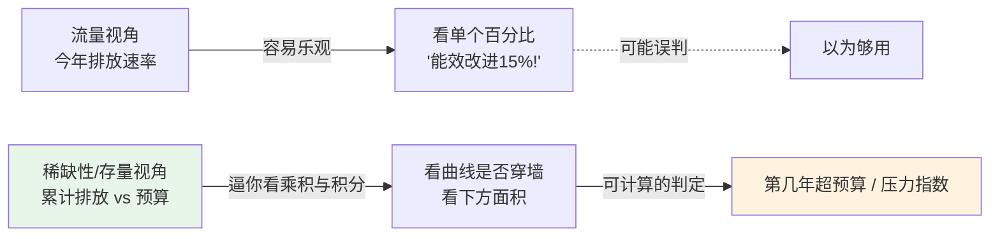
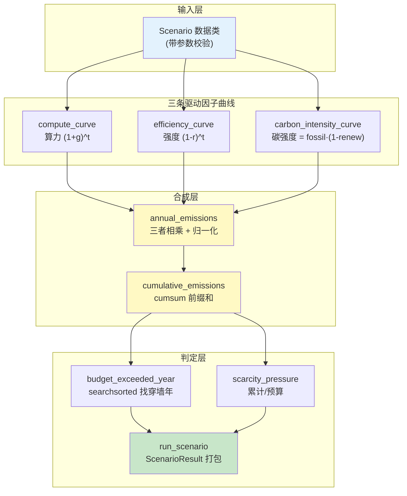
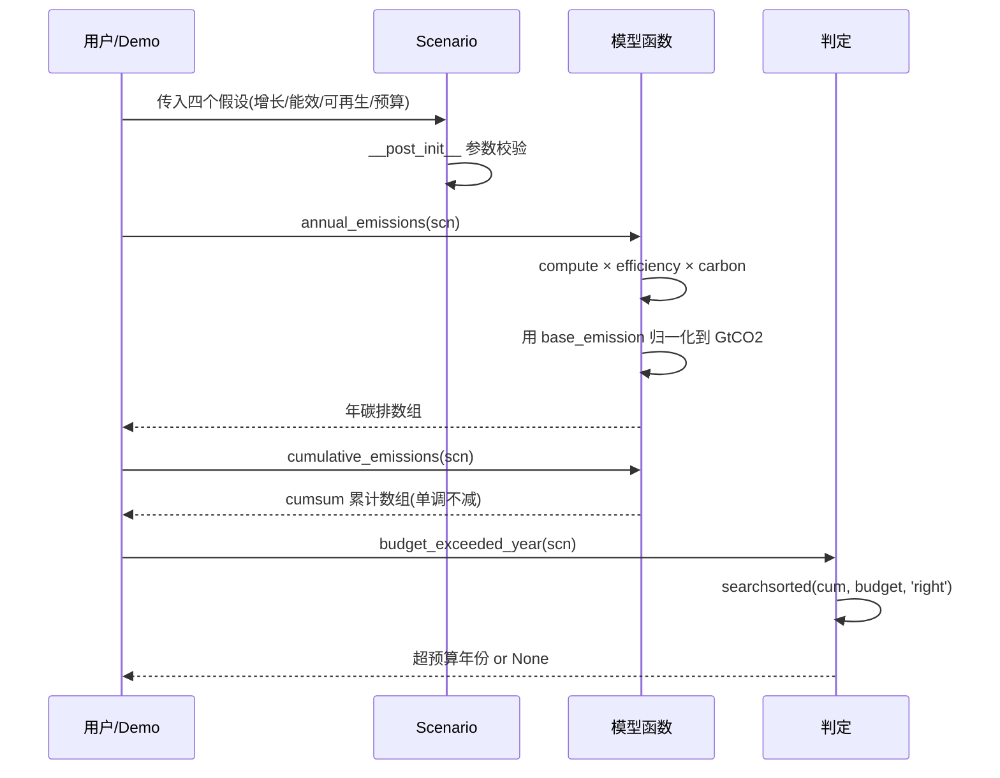
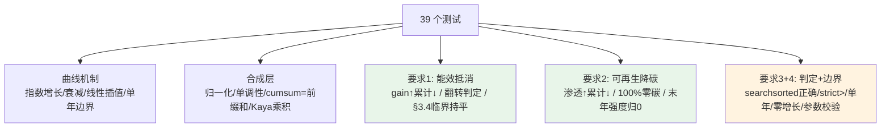

# 🌍 数据中心算力增长 vs 碳预算 —— 稀缺性模型 (Datacenter Scarcity Model)

> 配套书籍:《AI Infrastructures and Sustainability》
> 项目定位:用一个**本机可跑、纯 CPU、离线无网络**的最小模型,回答一个尖锐的问题 ——
> **"照当前趋势,AI 基础设施的累计碳排会在第几年耗尽给定的碳预算?能效改进和可再生能源到底能不能救我们?"**

这是一个从 **稀缺性 (scarcity)** 视角切入的可持续性建模项目。它不追求"预测得准",而追求**把机制讲透**:把一个吓人的总量指标(累计碳排)拆成三条你能理解、能调节的曲线,然后眼睁睁看它逼近那面叫"碳预算"的墙。

---

## 📖 目录

- [1. 这个项目在讲什么(是什么)](#1-这个项目在讲什么是什么)
- [2. 为什么要用"稀缺性"视角(为什么)](#2-为什么要用稀缺性视角为什么)
- [3. 核心原理:Kaya 恒等式 + 碳预算](#3-核心原理kaya-恒等式--碳预算)
- [4. 系统架构与数据流(mermaid)](#4-系统架构与数据流mermaid)
- [5. 代码逐行讲解(怎么用)](#5-代码逐行讲解怎么用)
- [6. 如何运行](#6-如何运行)
- [7. 结果解读:四个对照情景](#7-结果解读四个对照情景)
- [8. 测试怎么设计的](#8-测试怎么设计的)
- [9. 💡 面试高频 & 🔬 第一性原理 & ⚠️ 常见坑](#9--面试高频---第一性原理---常见坑)
- [10. 📌 小结 & 🔗 延伸](#10--小结--延伸)

---

## 1. 这个项目在讲什么(是什么)

一句话:**给定四个假设,模拟未来 N 年 AI 的逐年碳排和累计碳排,判断它是否 / 何时超出剩余碳预算。**

四个输入假设(全部是你能在新闻/研报里看到的数字):

| 输入 | 符号 | 含义 | 典型值 |
|---|---|---|---|
| 算力年增长率 | `compute_growth` | AI 算力需求每年涨多少(复利) | 20%~40% |
| 能效年改进率 | `efficiency_gain` | 单位算力的耗能每年降多少 | 10%~30% |
| 可再生渗透率 | `renewable_start → renewable_end` | 电网里零碳电力的占比,逐年提升 | 30% → 60/90% |
| 剩余碳预算 | `carbon_budget_gt` | 还能排放的 CO₂ 总量(GtCO2) | 例如 5 Gt |

输出:

- **年碳排曲线** `annual_emissions` —— 每年排多少
- **累计碳排曲线** `cumulative_emissions` —— 到第 t 年一共排了多少(单调不减)
- **超预算年份** `budget_exceeded_year` —— 累计曲线第一次穿过预算墙的那一年(没穿返回 `None`)
- **稀缺性压力指数** `scarcity_pressure` —— `累计总碳排 / 碳预算`,`>1` 即赤字

> 🔬 **核心论证(对人文/社科向的可持续性书)**:可持续性辩论里最容易吵架的地方是"能效会不会自动救场"。这个模型的价值在于**把"抵消 (offset)"量化**:能效改进是在跟指数增长拔河,只有当 `(1+g)×(1-r) ≤ 1` 时年碳排才不再上涨(见 §3)。模型让"够不够"从口水仗变成一个可计算的不等式。

---

## 2. 为什么要用"稀缺性"视角(为什么)

大多数碳排讨论用的是**流量视角 (flow)**:"今年比去年多排了 X%"。但气候的物理约束是**存量视角 (stock)**:大气能容纳的 CO₂ 总量是有限的,一旦累计排放超过某个阈值(碳预算),温升目标就守不住了 —— 而且**排出去的碳收不回来**(不可再生资源)。

稀缺性视角把碳预算当作一种**有限的、公共的、不可再生的资源**,和水、算力、带宽一样。它带来两个关键洞察:

1. **速率不重要,面积才重要**。同样的峰值排放,早排 vs 晚排、快涨 vs 慢涨,对应的是累计曲线**下方的面积**不同。稀缺性模型天然用"累计"(cumsum)而不是"当年值"。
2. **抵消是一场赛跑,不是一次胜利**。能效每年改进 15%,听起来很棒,但如果算力每年涨 30%,净效应仍然是碳排上涨。稀缺性视角逼你去看**乘积**和**积分**,而不是被单个亮眼的百分比迷惑。



---

## 3. 核心原理:Kaya 恒等式 + 碳预算

### 3.1 把碳排拆成三个可乘因子

经典的 **Kaya 恒等式 (Kaya identity)** 把碳排放分解成若干"驱动因子"的乘积。搬到 AI 场景:

$$
\text{年碳排}(t) \;=\; \underbrace{C(t)}_{\text{算力需求}} \;\times\; \underbrace{I(t)}_{\text{能耗强度}} \;\times\; \underbrace{K(t)}_{\text{碳强度}}
$$

其中三条曲线各自随时间演化:

$$
C(t) = (1+g)^t, \qquad I(t) = (1-r)^t, \qquad K(t) = K_0\,\big(1 - \text{renew}(t)\big)
$$

- $g$ = `compute_growth`,算力年增长率 → **需求侧,指数上涨,推高碳排** ⬆️
- $r$ = `efficiency_gain`,能效年改进率 → **单位算力耗能下降,抵消增长** ⬇️
- $\text{renew}(t)$ = 可再生渗透率,从 `renewable_start` 线性升到 `renewable_end` → **零碳电力占比越高,碳强度越低** ⬇️

### 3.2 归一化到真实单位

三条曲线相乘得到的是**相对值**(第 0 年 ≈ 1)。我们用第 0 年的绝对碳排 `base_emission_gt` 校准:

$$
\text{annual}(t) = \text{base\_emission} \times \frac{C(t)\,I(t)\,K(t)}{C(0)\,I(0)\,K(0)}
$$

这样单位就从"相对"变成 **GtCO2**。

### 3.3 累计与判定

$$
\text{cumulative}(t) = \sum_{\tau=0}^{t} \text{annual}(\tau) \quad(\text{前缀和 / cumsum})
$$

**超预算年份** = 累计曲线首次**严格大于**碳预算 `B` 的最小 $t$:

$$
t^{*} = \min\{\, t : \text{cumulative}(t) > B \,\}, \quad \text{若不存在则 None}
$$

### 3.4 关键洞察:抵消的临界条件

如果暂时忽略碳强度变化,年碳排的相邻年比值是:

$$
\frac{\text{annual}(t{+}1)}{\text{annual}(t)} = (1+g)(1-r)
$$

于是有一个漂亮的临界判据:

| 条件 | 年碳排趋势 | 含义 |
|---|---|---|
| $(1+g)(1-r) > 1$ | ⬆️ 逐年上涨 | 增长压倒能效,稀缺压力持续加大 |
| $(1+g)(1-r) = 1$ | ➡️ 持平 | **完美抵消**,恰好打平,$r = g/(1+g)$ |
| $(1+g)(1-r) < 1$ | ⬇️ 逐年下降 | 能效反超增长,碳排开始回落 |

> 💡 **实战/面试点**:很多人以为"能效改进 20% 就能压住增长 20%"。错!因为增长是乘 `(1+g)`、改进是乘 `(1-r)`,`(1.2)(0.8)=0.96<1` 恰好能压住,但 `(1.3)(0.8)=1.04>1` 就压不住了。**要打平 30% 的增长,能效需要改进 `1 - 1/1.3 ≈ 23%`,而不是 30%。** 这条 §3.4 的临界条件在 `test_efficiency_offsets_growth_year_over_year` 里被精确验证。

---

## 4. 系统架构与数据流(mermaid)

### 4.1 模块结构



### 4.2 一次判定的时序



---

## 5. 代码逐行讲解(怎么用)

核心文件:`scarcity_model.py`。下面挑最关键的几段逐行拆。

### 5.1 情景数据类与参数校验

```python
@dataclass
class Scenario:
    name: str
    years: int = 26
    compute_growth: float = 0.30      # 算力年增长率(复利)
    efficiency_gain: float = 0.15     # 能效年改进率
    renewable_start: float = 0.30     # 第0年可再生渗透
    renewable_end: float = 0.60       # 末年可再生渗透
    grid_carbon_fossil: float = 1.0   # 化石电力碳强度(相对单位)
    base_emission_gt: float = 0.10    # 第0年绝对碳排(校准用)
    carbon_budget_gt: float = 5.0     # 剩余碳预算(那面墙)

    def __post_init__(self):
        if self.years < 1: raise ValueError("years 必须 >= 1")
        if self.compute_growth <= -1.0: raise ValueError(...)     # 否则算力变负
        if not (0.0 <= self.efficiency_gain < 1.0): raise ValueError(...)
        # ... 渗透率必须在 [0,1],预算必须 > 0
```

- **为什么用 `@dataclass`**:一次性声明所有输入 + 默认值,还免费得到 `__repr__`。
- **为什么在 `__post_init__` 校验**:⚠️ 如果不校验,`efficiency_gain=1.5` 会让 `(1-r)^t` 变成 `(-0.5)^t` 交替正负,产出**看起来正常但物理无意义**的曲线。宁可提前 `raise`,也不要静默出错。

### 5.2 三条曲线:纯 numpy 向量化

```python
def compute_curve(years, growth):
    t = np.arange(years, dtype=float)
    return np.power(1.0 + growth, t)        # (1+g)^t,复利指数增长

def efficiency_curve(years, gain):
    t = np.arange(years, dtype=float)
    return np.power(1.0 - gain, t)          # (1-r)^t,复利衰减

def renewable_curve(years, start, end):
    if years == 1:
        return np.array([start])            # 边界:只有第0年
    return np.linspace(start, end, years)   # 线性插值从 start 到 end

def carbon_intensity_curve(years, start, end, fossil=1.0):
    ren = renewable_curve(years, start, end)
    return fossil * (1.0 - ren)             # 可再生部分视为零碳
```

- `np.power(base, t)` 对整个 `t` 数组一次算完,**没有 Python 循环**,这是向量化。
- `renewable_curve` 单独处理 `years==1`,因为 `np.linspace(a, b, 1)` 会返回 `[a]`(其实也对),但显式写出来意图更清楚,也被 `test_renewable_curve_single_year` 守着。
- 碳强度用最朴素的 `fossil*(1-renew)`:可再生占 100% ⇒ 碳强度 0;占 0% ⇒ 碳强度 = fossil。

### 5.3 年碳排:Kaya 乘积 + 归一化(最关键的一段)

```python
def annual_emissions(scn):
    comp = compute_curve(scn.years, scn.compute_growth)
    eff  = efficiency_curve(scn.years, scn.efficiency_gain)
    carb = carbon_intensity_curve(scn.years, scn.renewable_start,
                                  scn.renewable_end, scn.grid_carbon_fossil)
    raw  = comp * eff * carb          # ① 三因子逐元素相乘(相对单位)
    raw0 = raw[0]                     # ② 第0年的相对量,当归一化基准

    if raw0 == 0.0:                   # ③ 除零保护:起点就零碳 → 全程零碳
        return np.zeros(scn.years)

    return scn.base_emission_gt * (raw / raw0)   # ④ 校准到 GtCO2
```

逐点讲:

1. **`comp * eff * carb`**:numpy 逐元素相乘,得到相对单位的年碳排曲线。这就是 Kaya 恒等式的代码化身。
2. **`raw0 = raw[0]`**:我们希望"第 0 年年碳排恰好等于 `base_emission_gt`"。所以拿第 0 年的原始乘积做分母。
3. **`if raw0 == 0.0`**:⚠️ **除零坑**。如果 `renewable_start == 1.0`(第 0 年就 100% 可再生),那么 `carb[0]=0` ⇒ `raw0=0`。此时物理含义是"从一开始就零碳",整条曲线都应为 0。这个分支被 `test_full_renewable_from_start_is_zero_carbon` 精确覆盖。
4. **`base_emission_gt * (raw/raw0)`**:归一化后再乘绝对基准,单位落地为 GtCO2。`test_annual_year0_equals_base_emission` 验证第 0 年确实 == `base_emission_gt`。

### 5.4 累计 + 超预算判定

```python
def cumulative_emissions(scn):
    return np.cumsum(annual_emissions(scn))    # 前缀和,单调不减

def budget_exceeded_year(scn):
    cum = cumulative_emissions(scn)
    idx = int(np.searchsorted(cum, scn.carbon_budget_gt, side="right"))
    if idx >= scn.years:
        return None                            # 整段都不超
    return idx
```

- **`np.cumsum`**:一次算出累计曲线,天然单调不减(因为年碳排非负)。
- **`np.searchsorted(cum, B, side="right")`**:在**有序**数组 `cum` 里二分查找 `B` 的插入位置。`side="right"` 表示"相等排右边",所以拿到的是**第一个严格大于 `B`** 的下标 —— 正是"超预算年"。
  - 若返回 `>= years`,说明预算比整条累计曲线的最大值还大,永不超预算 ⇒ `None`。
  - 💡 **为什么用 searchsorted 而不是 for 循环**:累计曲线单调,二分查找 O(log n),而且一行搞定,还避免了手写循环的 off-by-one。`test_budget_exceeded_uses_strict_greater` 专门测了"恰好等于预算不算超"的边界。

### 5.5 稀缺性压力指数

```python
def scarcity_pressure(scn):
    total = float(cumulative_emissions(scn)[-1])
    return total / scn.carbon_budget_gt        # >1 赤字,<1 预算内
```

一个无量纲比值,方便跨情景横向比较(Demo 里每条曲线的图例都带着它)。

---

## 6. 如何运行

### 6.1 环境

```bash
# 本机已装:Python 3.13、numpy、matplotlib、pytest(torch 可选,本项目不用)
pip install -r requirements.txt   # 若缺依赖
```

### 6.2 三种跑法

```bash
# ① 模块自检(最快看到四个情景结论)
python scarcity_model.py

# ② 跑测试(必须全绿)
python -m pytest -q
# 期望: 39 passed

# ③ 出图 Demo(生成 out/ 下三张 PNG)
python run_demo.py
```

### 6.3 Demo 产出

`run_demo.py` 生成三张图(`out/` 目录):

| 文件 | 内容 |
|---|---|
| `cumulative_vs_budget.png` | **核心图**:四情景累计碳排曲线 + 红色碳预算墙 + 超预算年份标记 |
| `factor_decomposition.png` | Kaya 三因子分解:算力↑ / 强度↓ / 碳强度↓ 的拔河 |
| `remaining_budget.png` | 剩余碳预算随年份,穿过 0 即进入"碳赤字" |

> ⚠️ **Windows 出图三连坑**(本项目已全部处理):
> 1. `matplotlib.use("Agg")` 必须在 `import pyplot` **之前**,否则后端切换不生效。
> 2. `rcParams["font.sans-serif"]=["Microsoft YaHei","SimHei"]` 否则中文变方框 □□□。
> 3. `rcParams["axes.unicode_minus"]=False` 否则负号(剩余预算为负时)显示异常。
> 附加坑:控制台 `print` emoji(✅❌)会 `UnicodeEncodeError`(GBK),用 `sys.stdout.reconfigure(encoding="utf-8")` 解决;图里避免用 `CO₂` 下标(雅黑缺该字形会告警),改用 `CO2`。

---

## 7. 结果解读:四个对照情景

运行 `python scarcity_model.py` 的实际输出(碳预算统一设为 5.0 Gt):

```
[基准·放任 (BAU 高增长)      ] 累计= 30.44 Gt / 预算=5.0 Gt | 压力=6.09 | ❌ 第 14 年超预算
[强能效改进 (每年-25%强度)    ] 累计=  1.81 Gt / 预算=5.0 Gt | 压力=0.36 | ✅ 预算内
[高可再生渗透 (30%→90%)     ] 累计= 11.29 Gt / 预算=5.0 Gt | 压力=2.26 | ❌ 第 17 年超预算
[双管齐下 (能效+可再生)       ] 累计=  1.20 Gt / 预算=5.0 Gt | 压力=0.24 | ✅ 预算内
```

读这张表能读出四个结论:

1. **放任(BAU)必然爆预算**:30% 算力增长 + 只有 10% 能效改进,`(1.3)(0.9)=1.17>1`,年碳排持续上涨,累计压力高达 **6 倍**,第 14 年就撞墙。
2. **强能效改进(25%)单独就能救场**:`(1.3)(0.75)=0.975<1` 刚好越过临界,累计碳排暴跌到预算的 36%。**能效是最强杠杆**,因为它作用在每一年的每一单位算力上。
3. **高可再生(→90%)有用但不够**:碳强度虽然大幅下降,但增长依旧压倒它,仍然在第 17 年超预算(比放任晚了 3 年)。可再生**推迟**了撞墙,但没**阻止**它。
4. **双管齐下最稳**:能效 + 可再生叠加,压力降到 0.24,最安全。

> 💡 **面试点 / 决策洞察**:这四行数字把"该优先投能效还是可再生"变成了可比较的问题。在这组假设下,**能效改进的边际杠杆 > 可再生渗透**,因为能效是乘在增长项上(直接改变临界条件),而可再生只改变碳强度这个"折扣系数"。真实世界里两者成本、可行性不同,但模型给了你一个量化的起点。

---

## 8. 测试怎么设计的

`tests/test_scarcity_model.py`,共 **39 个用例**,`python -m pytest -q` 全绿。分五组:



几个"点睛"的用例:

- `test_efficiency_offsets_growth_year_over_year`:**精确构造** `r = g/(1+g)` 让 `(1+g)(1-r)=1`,验证年碳排逐年**持平**(§3.4 临界条件的代码化断言)。
- `test_budget_exceeded_uses_strict_greater`:手工构造年碳排恒为 1 ⇒ 累计 `[1,2,3]`,分别测预算 =3(相等,不超,`None`)和 =2.9(第 2 年超,返回 2),锁死 `searchsorted` 的 `side='right'` 语义。
- `test_full_renewable_from_start_is_zero_carbon`:覆盖 §5.3 的**除零分支**,确保"起点就零碳"不崩且全程为 0。
- `test_invalid_params_raise`(参数化 10 组):负增长率 ≤ -1、能效 ≥ 1、渗透率越界、预算 ≤ 0 …… 全部必须 `raise ValueError`。

> ⚠️ **坑**:`tests/` 要能 `import scarcity_model`,靠根目录的 `conftest.py` 把项目根插进 `sys.path`。不加它,从子目录跑 pytest 会 `ModuleNotFoundError`。

---

## 9. 💡 面试高频 & 🔬 第一性原理 & ⚠️ 常见坑

### 💡 面试高频

- **Q:能效每年改进 15%,算力每年增长 15%,碳排会持平吗?**
  A:不会,还会略涨。因为 `(1.15)(0.85)=0.9775<1`?——等等,这个 `<1` 说明会**略降**。真正的坑是反过来:要打平 15% 的**增长**,能效只需改进 `1-1/1.15≈13%`,不是 15%。关键在于增长乘 `(1+g)`、改进乘 `(1-r)`,二者不对称。
- **Q:为什么用累计碳排而不是当年碳排判定?**
  A:气候约束是**存量**(大气 CO₂ 总量),不是**流量**(当年速率)。碳预算约束的是累计排放,所以必须 cumsum。这正是"稀缺性"视角的核心。
- **Q:Kaya 恒等式是什么?**
  A:把碳排分解成若干驱动因子的**乘积**(人口×人均GDP×能耗强度×碳强度…),便于归因和情景分析。本项目用的是它的 AI 变体:算力×能耗强度×碳强度。
- **Q:`np.searchsorted` 相比 for 循环的好处?**
  A:利用累计曲线单调的性质做二分,O(log n),一行、无 off-by-one。

### 🔬 第一性原理

- **碳预算是不可再生资源**:排出去的 CO₂ 在人类时间尺度上收不回,所以模型的关键量是"累计"(积分)而非"瞬时"。这决定了"早减排"比"晚减排"更值钱 —— 同样的终值,曲线下方面积更小。
- **抵消是乘法拔河,不是加法**:增长与改进作用在**乘积**上,`(1+g)(1-r)`。这个乘法结构决定了"能效改进 x% 能否压住增长 x%"的答案是"几乎能但不完全能",临界点是 `r=g/(1+g)`。
- **归一化让参数解耦**:把曲线归一到第 0 年再乘绝对基准,使得"形状"(由增长/能效/可再生决定)和"规模"(由 `base_emission_gt` 决定)解耦,便于单独分析每个杠杆。

### ⚠️ 常见坑

| 坑 | 现象 | 解法 |
|---|---|---|
| 参数不校验 | `efficiency_gain=1.5` 产出交替正负的无意义曲线 | `__post_init__` 提前 `raise` |
| 除零 | `renewable_start=1.0` 时 `raw0=0`,`raw/raw0` 变 `nan` | §5.3 的 `if raw0==0` 分支 |
| searchsorted 语义 | 用 `side='left'` 会把"恰好等于预算"也算超 | 用 `side='right'`(严格大于才算) |
| Agg 后端顺序 | `use('Agg')` 写在 `import pyplot` 之后不生效 | 必须在 import pyplot 之前 |
| 中文方框 | 图里中文变 □□□ | `rcParams['font.sans-serif']=['Microsoft YaHei','SimHei']` |
| 负号异常 | 剩余预算为负时负号显示错 | `rcParams['axes.unicode_minus']=False` |
| Windows GBK | `print` emoji 报 `UnicodeEncodeError` | `sys.stdout.reconfigure(encoding='utf-8')` |
| CO₂ 下标缺字形 | 雅黑无 ₂ 字形,出图告警 | 图里用 `CO2` 纯文本 |

---

## 10. 📌 小结 & 🔗 延伸

### 📌 小结

- 本项目用一个 **50 行核心 + 39 测试** 的最小模型,把"AI 碳排 vs 碳预算"从口水仗变成可计算的判定。
- **机制三层**:三条 Kaya 因子曲线(算力↑/强度↓/碳强度↓)→ 相乘归一化成年碳排 → cumsum 成累计 → searchsorted 判定超预算年。
- **核心洞察**:抵消是乘法拔河,临界条件 `(1+g)(1-r)=1`;能效是作用在增长项上的最强杠杆;可再生能**推迟**但未必**阻止**撞墙;稀缺性视角必须看**累计**(存量)而非**当年**(流量)。
- 四个对照情景 + 三张可视化图,直观展示每个杠杆的独立与叠加效应。

### 🔗 延伸

- **换你自己的数**:改 `default_scenarios()` 里的参数,或直接 `Scenario(name="我的假设", compute_growth=..., ...)` 跑 `run_scenario`。
- **升级碳强度曲线**:`renewable_curve` 现在是线性;真实电网是 S 曲线(logistic),可换成 sigmoid 让转型早期慢、中期快。
- **加入回弹效应 (Jevons paradox)**:能效提升可能反而刺激更多需求 —— 可以让 `compute_growth` 随 `efficiency_gain` 上调,模拟"越省越用"。
- **蒙特卡洛不确定性**:给每个参数加分布,采样跑千次,得到"超预算年份"的概率分布而非单点。
- **配套阅读**:《AI Infrastructures and Sustainability》关于 Kaya 恒等式、碳预算(IPCC remaining carbon budget)、PUE / 能效趋势、电网脱碳路径的章节。

---

> 🗂 **文件清单**
> - `scarcity_model.py` —— 核心模型(曲线/年碳排/累计/判定/情景库)
> - `run_demo.py` —— Agg 出图 Demo(三张 PNG + 控制台结论)
> - `tests/test_scarcity_model.py` —— 39 个 pytest 用例
> - `conftest.py` —— 让 tests 能 import 模块
> - `requirements.txt` —— numpy / matplotlib / pytest
> - `out/*.png` —— Demo 生成的图(运行后出现)
