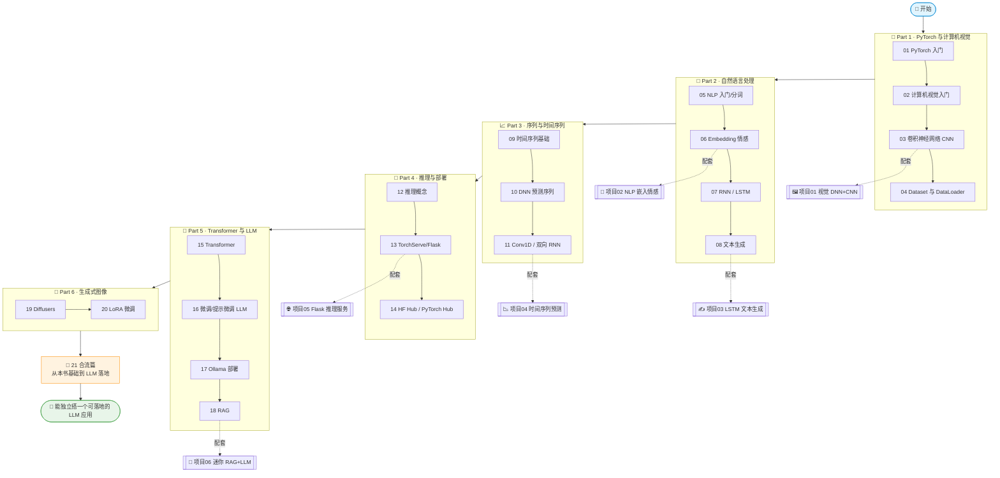

# 🔥《AI and ML for Coders in PyTorch》中文逐章精讲 + 实战合集

> 原书：**AI and ML for Coders in PyTorch — A Coder's Guide to Generative AI and Machine Learning** · Laurence Moroney 著（O'Reilly）
> 本仓库把这本 20 章的书**从零基础逐章讲透**（PyTorch 版），配 **6 个本机可跑的实战项目**（CPU、离线、合成数据、`pytest` 全绿），并额外写了一章 **[从本书基础到 LLM 落地实战]**，把全书地基焊到今天的大语言模型上。
> 一句话定位：**读完讲义懂原理，跑完项目会落地，一路把"传统深度学习"接到"LLM 实战"。**

这不是原书翻译，而是一套面向 **工程师 / 面试者 / 想进 LLM 的人** 的教学材料：每章都有「本章地图 → 第一性原理 → 原书原文引用 → PyTorch 代码拆解 → 社区案例 → **通向 LLM** → 踩坑 → 面试速答」；每个项目都把书里的手法**用可运行代码手写并测试验证**。

---

## 🗺️ 学习路径图



**推荐路线**：视觉打地基（01→04）→ NLP（05→08）→ 序列（09→11）→ 部署（12→14）→ **Transformer 与 LLM（15→18，本书精华）** → 生成式图像（19→20）→ **合流篇（21）串成 LLM 落地能力**。每读到有配套项目的章节，立刻切到 `projects/` 动手跑。

---

## 📚 逐章精讲（`book-guide/`）

| # | 章节讲义 | 一句话简介 |
|---|----------|-----------|
| 01 | [PyTorch 入门](book-guide/01_PyTorch入门：从传统编程到学习.md) | ML 如何翻转"规则→数据→答案"，装好 PyTorch，用 `nn.Linear` 写第一个学习 `y=2x−1` 的网络 |
| 02 | [计算机视觉入门](book-guide/02_计算机视觉入门：FashionMNIST与神经元.md) | Fashion-MNIST、全连接网络、Softmax/交叉熵、过拟合与早停 |
| 03 | [卷积神经网络 CNN](book-guide/03_卷积神经网络：在图像中检测特征.md) | 卷积/池化、Horses-or-Humans、图像增强、迁移学习、Dropout |
| 04 | [Dataset 与 DataLoader](book-guide/04_用PyTorch管理数据：Dataset与DataLoader.md) | Dataset/DataLoader、ImageFolder、ETL、batching/shuffle/并行加载 |
| 05 | [NLP 入门：把语言编码成数字](book-guide/05_自然语言处理入门：把语言编码成数字.md) | 分词、句子转序列、去停用词/清洗、从 CSV/JSON 读文本 |
| 06 | [用嵌入让情感可编程](book-guide/06_用嵌入让情感可编程：Embeddings.md) | `nn.Embedding`、讽刺检测器、可视化嵌入、预训练词向量 |
| 07 | [RNN 与 LSTM 做 NLP](book-guide/07_循环神经网络RNN与LSTM做NLP.md) | 循环的本质、文本分类、堆叠 LSTM、预训练嵌入+RNN |
| 08 | [用机器学习生成文本](book-guide/08_用机器学习生成文本.md) | 逐词预测、复合生成、改进架构与数据、字符级编码 |
| 09 | [理解序列与时间序列](book-guide/09_理解序列与时间序列数据.md) | 趋势/季节性/自相关/噪声、朴素基线、移动平均 |
| 10 | [创建预测序列的 ML 模型](book-guide/10_创建预测序列的ML模型.md) | 窗口化数据集、DNN 拟合序列、评估、调学习率 |
| 11 | [卷积与循环做序列建模](book-guide/11_用卷积与循环方法做序列建模.md) | Conv1D、NASA/GISS 气象数据、RNN、双向 RNN、Dropout |
| 12 | [推理的概念](book-guide/12_推理的概念：Tensor进与出.md) | 张量、图像/文本如何变张量、`eval()`/`no_grad()`、后处理 |
| 13 | [TorchServe 与 Flask 部署](book-guide/13_用TorchServe与Flask部署PyTorch模型.md) | TorchServe（handler/.mar/启动）、Flask 推理服务 |
| 14 | [第三方模型与 Hub](book-guide/14_使用第三方模型与模型中心Hub.md) | Hugging Face Hub、PyTorch Hub、模型复用生态 |
| 15 | [Transformer 与 transformers 库](book-guide/15_Transformer架构与transformers库.md) | 编码器/解码器、自注意力、`pipeline`、tokenizer |
| 16 | [微调与提示微调 LLM](book-guide/16_用自定义数据微调与提示微调LLM.md) | 微调全流程（Trainer）、提示微调（PEFT）、微调 vs LoRA |
| 17 | [用 Ollama 部署 LLM](book-guide/17_用Ollama部署与服务LLM.md) | 本地跑开源 LLM、REST server、构建 Ollama Web App |
| 18 | [RAG 检索增强生成](book-guide/18_RAG检索增强生成入门.md) | 什么是 RAG、相似度、向量库、把检索内容喂给 LLM |
| 19 | [用 Diffusers 做生成式图像](book-guide/19_用HuggingFace_Diffusers做生成式图像.md) | 扩散模型直觉、text/image-to-image、inpainting |
| 20 | [用 LoRA 微调图像模型](book-guide/20_用LoRA与Diffusers微调生成式图像模型.md) | 用 Diffusers 训练 LoRA、准备数据、发布、生成 |
| 🧬 21 | [**从本书基础到 LLM 落地实战（合流篇）**](book-guide/21_从本书基础到LLM落地实战（合流篇）.md) | **本书概念→LLM 对照表 + 落地链路 + 端到端最小示例（本仓库自撰）** |

---

## 🧪 实战项目（`projects/`）

| 项目 | 对应章节 | 你会动手做出 |
|---|---|---|
| [`01_vision_pytorch_lab`](projects/01_vision_pytorch_lab) | 第 2–3 章 | 用全连接 DNN 与 CNN 做图像分类，对比准确率，画 loss 曲线 |
| [`02_nlp_embeddings_lab`](projects/02_nlp_embeddings_lab) | 第 5–6 章 | 手写分词器 + `nn.Embedding` 情感分类，导出可视化嵌入 |
| [`03_rnn_textgen_lab`](projects/03_rnn_textgen_lab) | 第 7–8 章 | 用 LSTM 学语料并自回归生成文本（temperature 采样） |
| [`04_timeseries_forecast_lab`](projects/04_timeseries_forecast_lab) | 第 9–11 章 | 合成时序 + 窗口化，对比 naive/移动平均/DNN/Conv1D/LSTM |
| [`05_serving_flask_lab`](projects/05_serving_flask_lab) | 第 12–13 章 | 训练→导出→Flask `/predict` 推理服务 + TorchServe handler 范例 |
| [`06_rag_mini_lab`](projects/06_rag_mini_lab) | 第 14–18 章 | **离线可跑的迷你 RAG，一键换成真实 LLM（Ollama/HF）—— LLM 落地** |

每个项目都：**CPU、离线、合成数据、几秒跑完、`python -m pytest` 全绿**，且 README 说明「如何换成真实数据/真实 LLM」。

```bash
# 跑任意一个项目
cd projects/01_vision_pytorch_lab
pip install -r requirements.txt
python -m pytest -q          # 先确认测试全绿
python run_demo.py           # 再看效果
```

---

## 🎯 这本书 + 本仓库能给你什么

- **一条从传统深度学习平滑接入 LLM 的路**：不是背概念，而是把 embedding / attention / 自回归 / 微调 / serving / RAG 一个个手搓过。
- **面试可用**：每章的「面试速答」+「通向 LLM」，直接对上大厂 AI 岗高频问法。
- **可落地**：第 21 章合流篇 + 项目 06，给你一套能改成真实私有知识问答系统的骨架。

> 📎 与本仓库其它库互补：`attention-optimization/`（注意力与推理优化 36 讲）、`book-hands-on-llm-serving/`（LLM 服务化）、`llm-alignment/`（对齐）、`scaling-book/`（大规模训练）。

---

*本教学库由多 agent 协作生成并经人工校订；讲义忠于原书结构，代码均为 PyTorch 2.x 习惯写法，社区引用力求真实可查。欢迎指正。*
