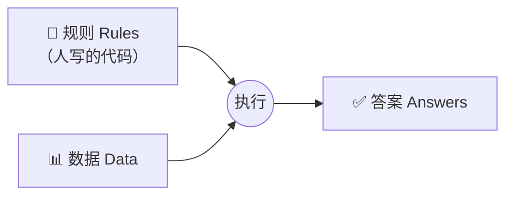
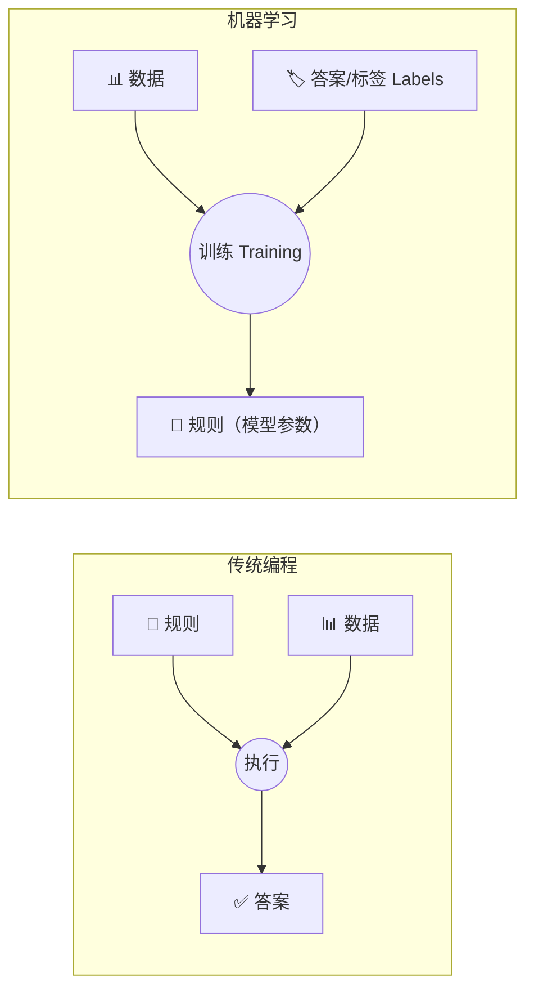
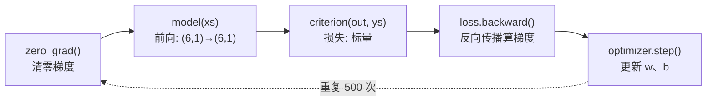

# 🎬 第 01 章 · PyTorch入门：从传统编程到学习（Introduction to PyTorch）

> 本章对应原书 *AI and ML for Coders in PyTorch*（Laurence Moroney 著）第 1 章 "Introduction to PyTorch"，PDF 第 23–44 页。

## 🗺️ 本章地图（读完能会什么）

- 彻底想明白**机器学习和传统编程到底哪里不一样**：不是"更高级的 if-else"，而是把"规则"和"答案"的角色对调了一次。
- 认识 **PyTorch 是什么、从哪来**（Torch/Lua → 2017 年 PyTorch → Meta AI → Linux Foundation），以及它的生态版图（训练 / 推理 / 部署 / 移动端 / 预训练模型）。
- 会用三种方式**装好 PyTorch**：`pip`、PyCharm、Google Colab，并知道 `2.4.1+cu121` 里那串 `cu121` 是什么意思。
- 亲手写出全书第一个"会学习"的神经网络：让一个 `nn.Linear(1,1)` 神经元自己发现 `y = 2x - 1`。
- 吃透那个从此贯穿全书、也贯穿所有 LLM 训练的**五步训练循环**：`zero_grad → forward → loss → backward → step`。
- 学会**把网络学到的东西挖出来看**：打印权重 ≈ 2、偏置 ≈ −1，亲眼确认"它真的学会了"。

> 💡 **一句话本质**：传统编程是"人写规则 + 数据 → 得答案"；机器学习是"给数据 + 给答案 → 机器反推规则"。本章就是用一个只有 1 个神经元的网络，把这句话跑成能运行的代码。

---

## 🧱 从传统编程说起：规则 + 数据 → 答案

在讲机器学习之前，先把我们干了几十年的老本行说清楚。原书用一句话给传统编程定了性：

> "Traditional programming involves writing rules that are expressed in a programming language and that act on data and give us answers."
> （传统编程就是：用某种编程语言写下**规则**，这些规则作用在**数据**上，最后给我们**答案**。——约第 2 页）

书里举了两个特别接地气的例子：

- **打砖块游戏（Breakout）**：球的运动由 `dx`、`dy` 决定；球撞到砖块时，砖块消失、球速加快、方向改变。代码在"游戏当前状态"这个数据上执行规则。
- **金融场景**：给你公司的股价和盈利，你写代码 `price / earnings`，算出一个很有用的比率——市盈率（P/E）。代码读价格、读盈利，返回前者除以后者。

抽象成一张图，传统编程长这样：



这套范式是软件开发的地基。但它有个**天生的天花板**——原书说得很直白：

> "the only scenarios that you can implement are ones for which you can derive rules."
> （你唯一能实现的场景，是那些**你能推导出规则**的场景。——约第 3 页）

---

## 🧱 传统编程的墙：走路、跑步、骑车……然后你卡在了打高尔夫

原书用"活动检测"（健身手环那种）把这堵墙演示得淋漓尽致。假设我们手上的数据只有**速度**：

| 场景 | 规则（人能不能写出来？） |
| --- | --- |
| 🚶 走路 walking | 速度 < 某个值 → 走路 ✅ 能写 |
| 🏃 跑步 running | 速度 > 4 mph → 跑步 ✅ 还能写 |
| 🚴 骑车 biking | 速度更快 → 骑车 ✅ 勉强能写（虽然下坡跑步可能比上坡骑车快） |
| ⛳ 打高尔夫 golfing | 走一会儿、停下、挥杆、再走、再停…… ❌ **写不出来了** |

到高尔夫这里我们就**撞墙**了。原书原话：

> "Now, we're stuck... Our ability to detect this activity using traditional rules has hit a wall. But maybe there's a better way. Enter ML."
> （现在我们卡住了……用传统规则检测这个活动的能力撞上了一堵墙。但也许有更好的办法。机器学习登场。——约第 4–5 页）

> ⚠️ **踩坑（认知层面）**：很多初学者以为"高尔夫写不出来"是因为**规则太复杂**。更本质的原因是：这个规则**存在于数据里，但人类无法显式表达它**。ML 的价值不是"帮你写更复杂的 if-else"，而是"当规则根本没法用手写出来时，让机器从数据里把它挖出来"。

---

## 🔄 翻转坐标轴：这一下，就得到了机器学习

原书最精彩的一招，是把上面那张图的**坐标轴对调**。既然人推导不出规则，那我们换个思路：

> "Instead of us coming up with the rules, what if we were to come up with the answers and, along with the data, have a way of figuring out what the rules might be?"
> （与其我们去想规则，不如我们把**答案**给出来，连同**数据**一起，找到一种能反推出规则的办法？——约第 5 页）

于是范式变成了这样：



对活动检测来说，做法就变成：给手环装上心率、位置、速度等传感器，**采集大量数据并打上标签**——"这是走路的样子""这是跑步的样子""这是打高尔夫的样子"，然后让计算机去找出"什么样的数据对应什么标签"的规则。

程序员的工作因此从"想规则"变成了"**准备好数据和标签、写把二者对上的代码**"。原书顺势给了 AI/ML/深度学习的定位：

- **AI** 最大最抽象，指一切让机器像人一样思考和行动的东西；
- **ML**（机器学习）是通往 AI 的一条"上匝道"——机器通过"看例子"来学习；
- **计算机视觉** 让机器学会像人一样"看"，**NLP** 让机器学会像人一样"读文字"，都是 ML 的子领域。

> 💡 **实战/面试高频**：一句话区分传统编程和 ML——"传统编程人给规则求答案；ML 人给答案求规则。" 面试官问"深度学习和机器学习什么关系"，答：深度学习是 ML 的一个子集，特指用**多层神经网络**自动学特征，本章的单神经元就是最小号的神经网络。

> ⚠️ **书中埋雷（勘误）**：这本是从原 TensorFlow 版**移植过来的 PyTorch 版**，正文里残留了几处 "TensorFlow" 字样，比如"that's where TensorFlow enters the picture""it gives the TensorFlow framework its name"。别被绕晕——**本书全程用的是 PyTorch**，那几处是移植时漏改的手误。`tensor`（张量）这个词本身是通用的数学概念，不专属于哪个框架。

---

## 🔥 PyTorch 是什么

原书这一节讲清了 PyTorch 的来龙去脉：

> "PyTorch is an ML library that is based on a previous library called Torch... In 2017, development of Torch moved to PyTorch, which is a port of the framework in Python."
> （PyTorch 是一个基于早期库 Torch 的机器学习库……2017 年 Torch 的开发转向了 PyTorch，也就是这个框架的 Python 移植版。——约第 7 页）

几个要记住的点：

- **名字**：Torch 原本基于 Lua 语言，`Py` 就是 Python。所以**安装时包名叫 `torch`，不是 `pytorch`**。
- **归属**：最初由 **Meta AI** 开发，后来交给了 **Linux 基金会**——这么做是为了建立开发者信心，表明它不是"某个大厂私有的东西"。
- **地位**：与 TensorFlow/Keras 生态并列，是最主流的两大 ML 库之一。生成式 AI 浪潮（开源文本/图像大模型）来临后，PyTorch 人气爆发，训练（本书 Part I）和推理（Part II）都大量用它。

PyTorch 更像一个**生态**，不同库对应不同场景：

| 库 / 组件 | 干什么用的 | 本书对应章节 |
| --- | --- | --- |
| `torch` + `torch.nn` | 定义张量、搭网络、训练（本章主角） | 本章起 |
| **TorchServe** | 大规模部署模型、开 RESTful 推理端点 | [[13_用TorchServe与Flask部署PyTorch模型]] |
| `torch.distributed` | 模型/训练跨多设备分布式，单卡放不下时用 | 进阶 |
| **PyTorch Mobile** | 把模型部署到 Android / iOS 做端侧推理 | 部署篇 |
| `torchvision.models` | 一行代码调用社区预训练模型 | [[14_使用第三方模型与模型中心Hub]] |

原书还顺手区分了两个贯穿全书的核心动词：

- **训练（training）**：计算机用一堆算法从输入里学习、找出区分它们的规律。想让它认猫狗，就喂大量猫狗图片"炼"出一个模型。
- **推理（inference）**：模型练好后，用它去识别/分类**未来没见过的**新输入。

以及你搞模型时的三条路（第三条叫**迁移学习 transfer learning**，后面章节会讲）：

1. 完全自己从零搭一个模型；
2. 直接用别人现成的模型（够用就行）；
3. 拿别人已训练好的**一部分**，在上面接着搭——这就是迁移学习。

> 💡 **实战/面试高频**：面到"你为什么选 PyTorch 不选 TensorFlow"，可以答：PyTorch 的**动态计算图（define-by-run）**让调试像写普通 Python 一样直观，研究界几乎一边倒用它，绝大多数开源大模型（LLaMA、Mistral、Qwen、Stable Diffusion）权重和训练代码都是 PyTorch 生态的——这对做 LLM 落地是决定性的。

---

## 🛠️ 装好 PyTorch：pip / PyCharm / Colab 三条路

原书给了三种上手方式，都很实用。

### 1️⃣ 命令行 pip（本机）

```bash
# Py = Python，装之前得先有 Python 环境
pip install torch
```

装完验一下版本：

```python
import torch
print(torch.__version__)      # 例如 2.4.1
print(torch.cuda.is_available())  # 有没有可用 GPU
```

原书截图里显示 `torch device` 是 `cpu`——作者在 Mac 上原生安装，默认用 CPU。**复杂模型下 CPU 不够用**，需要 GPU / Apple Metal 这类加速器（后面章节会讲加速器安装）。

### 2️⃣ PyCharm（社区版免费）

作者特别推荐 PyCharm 社区版，理由有二：

- **虚拟环境管理简单**：项目 A 用 PyTorch 1.x、项目 B 用 2.x，各自隔离，切换时不用反复装卸依赖。
- **能单步调试**：对刚入门的人是刚需——`File → Settings → Project: <名字> → Python Interpreter`，点 `+`，搜 `torch`（记住包名是 `torch`），点 Install 即可。

### 3️⃣ Google Colab（浏览器，最省事）

> "What's really neat about Colab is that it provides GPU and TPU backends so you can train models using state-of-the-art hardware at no cost."
> （Colab 最妙的是它免费提供 GPU 和 TPU 后端，你可以零成本用上最先进的硬件训练模型。——约第 12 页）

Colab 里可能看到版本号 `2.4.1+cu121`，那个 `cu121` 是什么？

- `cu` = **CUDA**，NVIDIA 的 GPU 加速库；`121` = CUDA **12.1**。
- 所以 `2.4.1+cu121` 意思是：PyTorch 2.4.1，且带 CUDA 12.1 的 GPU 加速支持。

想换版本可以：

```python
!pip install torch==2.4.1
```

> ⚠️ **踩坑**：在 Colab 里 `pip install` 换 PyTorch 版本，可能装到**没带 CUDA 驱动的版本**，结果悄悄从 GPU 掉回 CPU，训练慢十几倍却不报错。换版本后务必再跑一次 `torch.cuda.is_available()` 确认还是 `True`。

---

## 🚀 全书第一个"会学习"的网络：让机器发现 y = 2x − 1

原书给了一组数字：

```
x = -1, 0, 1, 2, 3, 4
y = -3, -1, 1, 3, 5, 7
```

你盯几秒大概能看出 `y = 2x - 1`。人是怎么想到的？作者描述得很传神：观察到 x 每次 +1、y 每次 +2，所以 `y = 2x ± 某数`；再看 x=0 时 y=−1，于是猜 `y = 2x - 1`；代入其他值发现全对。**机器学习干的事，跟你这个"猜—验证—修正"的过程几乎一模一样。**

下面是全书第一段完整 PyTorch 代码（原书原样，加了中文注释）：

```python
import torch
import torch.nn as nn
import torch.optim as optim
import numpy as np

# ── 模型：一个 Sequential 里装一个 Linear(1,1) —— 一层一个神经元 ──
model = nn.Sequential(nn.Linear(1, 1))

# ── 损失函数 + 优化器 ──
criterion = nn.MSELoss()                          # 均方误差：衡量"猜得多离谱"
optimizer = optim.SGD(model.parameters(), lr=0.01)  # 随机梯度下降，学习率 0.01

# ── 数据：注意是 [[...]]，每个样本自己一行，形状 (6, 1) ──
xs = torch.tensor([[-1.0], [0.0], [1.0], [2.0], [3.0], [4.0]],
                  dtype=torch.float32)
ys = torch.tensor([[-3.0], [-1.0], [1.0], [3.0], [5.0], [7.0]],
                  dtype=torch.float32)

# ── 训练循环：重复 500 次 ──
for _ in range(500):
    optimizer.zero_grad()          # 1. 清零上一轮的梯度
    outputs = model(xs)            # 2. 前向：用当前 w、b 算出预测
    loss = criterion(outputs, ys)  # 3. 算损失：预测 vs 真答案 差多少
    loss.backward()                # 4. 反向传播：算出每个参数该往哪调
    optimizer.step()               # 5. 更新参数：朝减小损失的方向走一步

# ── 预测：问它 x=10 时 y 是多少 ──
with torch.no_grad():
    print(model(torch.tensor([[10.0]], dtype=torch.float32)))
```

### 逐块看懂它

**① 模型 `nn.Sequential(nn.Linear(1, 1))`**

你多半见过神经网络的图——一圈圈神经元排成一列列。原书提醒：把每个圆圈看成一个**神经元（neuron）**，每一列看成一**层（layer）**，数据从左到右流过。

`nn.Sequential` 就是"一串层"的容器，括号里放各层定义。我们只放了一层 `nn.Linear`。原书点破了 Linear 的本质：

> "we're using a Linear layer, in which a linear relationship (where the definition of a line is y = wx + b) can be defined or learned."
> （我们用的是 Linear 层，它可以定义或**学习**一个线性关系，直线的定义就是 y = wx + b。——约第 16 页）

`Linear(1, 1)` 表示"1 个特征进，1 个特征出"——所以整个网络就一层一个神经元，内部只有两个可学习参数：权重 `w` 和偏置 `b`。

**② 损失 `MSELoss` + 优化器 `SGD`**

这里是 ML 的数学核心。原书讲得极形象：一开始计算机完全不知道 x、y 的关系，就随便猜一个，比如 `y = 10x + 10`。那这个猜测有多差？

- **损失函数（loss）** 负责打分：x=−1 时它猜 y=0，真答案是 −3，差一点；x=4 时它猜 50，真答案是 7，差得离谱。MSELoss 把这些误差平方后求平均，得到一个"总离谱程度"。
- **优化器（optimizer）** 负责根据这个分数**再猜一个更好的**。我们选了 **SGD（stochastic gradient descent，随机梯度下降）**：给它当前参数、上次的猜测、以及误差，它就能算出下一个更靠谱的猜测。它的使命是**随时间不断把损失压小**，让猜的公式越来越接近真相。

**③ 数据要包成张量（tensor）**

原书提醒 `tensor` 这个词在 ML 里到处出现，可以把它想成"一个为尺寸灵活性做过优化的数组"。注意数据写成 `[[-1.0], [0.0], ...]`——**双层括号**，形状是 `(6, 1)`：6 个样本，每个样本 1 个特征。这正好对上 `Linear(1,1)` 的"1 个特征进"。

---

## 🔬 关键代码拆解：五步训练循环 + 张量形状

本章最核心、也最该刻进 DNA 的，就是这个训练循环。它在全书、在所有 LLM 训练里**一字不差地重复出现**。逐行看它，顺带盯紧张量形状：

```python
for _ in range(500):
    optimizer.zero_grad()          # 梯度清零
    outputs = model(xs)            # xs:(6,1) → outputs:(6,1)
    loss = criterion(outputs, ys)  # (6,1) vs (6,1) → loss: 标量 ()
    loss.backward()                # 反向传播，填好 w.grad、b.grad
    optimizer.step()               # w ← w - lr*w.grad;  b ← b - lr*b.grad
```



一行一行按原书的解释拆开：

| 行 | 原书怎么说 | 底层发生了什么 |
| --- | --- | --- |
| `optimizer.zero_grad()` | "zero the gradients" | PyTorch 的梯度是**累加**的，不清零会把上一轮的梯度加进来。每轮开头必须归零。 |
| `outputs = model(xs)` | 算出对 6 个 x 的预测 | 第一次循环时 w、b 是**随机初始化**的，所以初始猜测可能是 `y=10x+10` 之类。输入 `(6,1)` → 输出 `(6,1)`。 |
| `loss = criterion(outputs, ys)` | 把猜测和真答案比，算出"有多好/多坏" | MSELoss 输出一个**标量**，越小越好。 |
| `loss.backward()` | 这是学习的**关键**——发生**反向传播（backpropagation）** | 优化器和损失函数的数学在这里合体，算出每个参数的**梯度**（该往哪个方向、走多远才能减小损失）。结果存进 `w.grad`、`b.grad`。 |
| `optimizer.step()` | 收尾——根据上一步算出的梯度**更新参数** | `w ← w − lr·w.grad`。lr=0.01 就是每步走一小步。 |

原书特意配了张"ML 过程图"（Figure 1-20）来对应这段代码，并给了实测的收敛数据：

> "over the first 10 epochs, the loss went from 5.64 to 0.86... We can now see that the loss is 9.52 × 10⁻⁶."
> （前 10 个 epoch，损失从 5.64 降到 0.86……到第 500 个 epoch，损失已经是 9.52 × 10⁻⁶。——约第 19 页）

也就是说，10 轮之后网络就比初始瞎猜好了约 6 倍；500 轮后损失小到近乎为 0，模型基本上已经搞明白 `y = 2x - 1`。

> 💡 **实战/面试高频**：面试常问"训练循环为什么必须 `zero_grad`"。标准答法：**PyTorch 的 `.grad` 是累加的**（这个设计是为了支持梯度累积、RNN 多次 backward 等场景），如果不在每轮开头清零，梯度会跨 batch 叠加，导致更新方向错乱、训练发散。

---

## 🔮 让它预测 x=10：为什么不是刚好 19？

```python
with torch.no_grad():   # 推理时关掉梯度追踪，省内存也更快
    prediction = model(torch.tensor([[10.0]], dtype=torch.float32))
    print(prediction)   # 作者跑出来是 18.991，不是 19
```

你可能脱口而出"19"，但模型给的是**非常接近 19 的值**（作者跑出 18.991）。原书解释了两个原因：

1. **损失不是 0**，只是极小，所以预测理应差一丁点；
2. 网络只用了**极少的数据**——就 6 对 (x, y)，凭这点数据别指望参数精确等于 2 和 −1。

原书还顺手澄清了"prediction（预测）"这个词：**别把它理解成"预知未来"**，用这个词是因为 ML 天生带着**不确定性**——就像活动检测里"以这个速度移动，她'很可能'在走路"。模型学到的是模式，告诉你的是"答案很可能是……"。

> ⚠️ **踩坑**：`with torch.no_grad():` 在推理时几乎必写。忘了它，PyTorch 会为每次前向构建计算图、保存中间量，白白吃显存；在部署/批量推理时可能直接 OOM。训练时则**不能**加它，否则 `backward()` 无从算起。

---

## 🔍 看网络到底学到了什么：把 w 和 b 挖出来

这才是本章的"啊哈"时刻。既然神经元学的是 `y = wx + b`，我们干脆把学到的 w、b 打印出来看：

```python
# 取出 Sequential 里第 0 层（也是唯一一层）
layer = model[0]
# 拿到权重和偏置的数值
weights = layer.weight.data.numpy()
bias = layer.bias.data.numpy()
print("Weights:", weights)
print("Bias:", bias)
```

作者的输出：

```
Weights: [[1.998695]]
Bias:    [-0.9959542]
```

也就是说，网络学到的关系是 `y = 1.998695·x − 0.9959542`——**权重 ≈ 2、偏置 ≈ −1**，和我们期望的 `y = 2x - 1` 高度吻合。原书甚至半开玩笑地说：这可能比"真相"还准，因为我们其实是在**假设这个关系对没见过的值也成立**。

> 💡 **本质**：这一步把"黑箱"打开了给你看。神经网络不是玄学——一个神经元学的就是 `y = wx + b` 里的两个数字。后面所有复杂模型（包括 GPT），本质都是**海量个这样的 `wx + b` 堆叠 + 非线性**，参数从 2 个变成几千亿个而已。

---

## 🌍 社区案例与延伸

- **感知机（Perceptron，Rosenblatt 1958）**：本章的单神经元 `y = wx + b` 正是最古老的神经网络单元——感知机的直系后代。想追根溯源看 Frank Rosenblatt, *"The Perceptron: A Probabilistic Model for Information Storage and Organization in the Brain"*, Psychological Review, 1958。它 60 多年前就提出了"用数据调权重"的思想。
- **PyTorch 官方论文**：Paszke et al., *"PyTorch: An Imperative Style, High-Performance Deep Learning Library"*, NeurIPS 2019，[arXiv:1912.01703](https://arxiv.org/abs/1912.01703)。这篇讲清了 PyTorch 的**动态图 / define-by-run** 设计哲学，正是它让本章代码调试起来像写普通 Python。
- **Karpathy 的 micrograd**：想真正看懂 `loss.backward()` 里发生了什么，强烈推荐 Andrej Karpathy 的 [github.com/karpathy/micrograd](https://github.com/karpathy/micrograd) —— 用约 100 行 Python 从零实现自动求导（autograd），配套视频 "The spelled-out intro to neural networks and backpropagation: building micrograd"。看完你会彻底祛魅反向传播。
- **随机梯度下降的源头**：SGD 的数学根子是 Robbins & Monro, *"A Stochastic Approximation Method"*, 1951——本章 `optim.SGD` 用的就是它的思想。
- **万能逼近定理（Universal Approximation Theorem）**：Cybenko 1989 / Hornik 1991 证明了"足够宽的单隐藏层网络能逼近任意连续函数"。这从理论上解释了：为什么本章这么小的网络加上层数和宽度后，能去学猫狗、学语言这些人类写不出规则的东西。PyTorch 官方 60 分钟入门 [pytorch.org/tutorials/beginner/deep_learning_60min_blitz.html](https://pytorch.org/tutorials/beginner/deep_learning_60min_blitz.html) 是最佳下一站。

---

## 🔗 通向 LLM

本章那段"平平无奇"的代码，其实是 GPT 训练的**同一套骨架**，只是被放大了亿万倍。逐条对应：

- **五步训练循环原封不动**：LLM 预训练的核心也是 `zero_grad → forward → loss → backward → step`。GPT 的 loss 从 `MSELoss` 换成 **CrossEntropyLoss**（预测下一个 token），优化器从 `SGD` 换成 **AdamW**，但循环结构一模一样。你在本章写的 for 循环，和训练 405B 参数 LLaMA 的循环是同构的。
- **`nn.Linear` 是 Transformer 的砖块**：Transformer 里的 Query/Key/Value 投影、注意力输出投影、MLP 的两层前馈——全是 `nn.Linear`。本章一个 `Linear(1,1)` 有 2 个参数；GPT-3 里一个 MLP 的 `Linear` 就是 `Linear(12288, 49152)`，超过 6 亿参数。**同一个类，量变引起质变**。见 [[15_Transformer架构与transformers库]]。
- **"给答案求规则"就是自监督预训练**：本章我们给了 6 对 (x, y)。LLM 更绝——它把海量文本"前面的词"当数据、"下一个词"当答案，**答案是从数据自己身上抠出来的**（self-supervised），于是不需要人工标注就能学到语言的规则。这正是坐标轴翻转思想的极致应用。见 [[08_用机器学习生成文本]]。
- **权重就是"学到的规则"**：本章我们打印出 w≈2、b≈−1，看见了网络学到的规则。LLM 的"规则"就是它那几千亿个权重——你下载的 `.safetensors` 权重文件，本质和本章那两个数字是同一种东西，只是多了 11 位数量级。
- **`torch.no_grad()` 与推理**：本章预测 x=10 时用的 `with torch.no_grad()`，正是 LLM **推理/生成**阶段的标配。自回归解码时每生成一个 token 都在 `no_grad` 下前向一次。见 [[12_推理的概念：Tensor进与出]]。

> 💡 **一句话串起来**：你在本章让 1 个神经元学会 `y=2x-1` 的全过程——搭模型、定损失、训练循环、看权重——就是训练一个 LLM 的**完整心智模型**。剩下的章节都在把这个模型"加宽、加深、换数据、换损失"。

---

## ⚠️ 常见坑

1. **包名是 `torch` 不是 `pytorch`**：`pip install pytorch` 会失败或装错东西，正确命令是 `pip install torch`。
2. **数据形状必须是二维 `(N, 特征数)`**：本章写成 `[[-1.0], [0.0], ...]`（形状 `(6,1)`）而不是 `[-1.0, 0.0, ...]`（形状 `(6,)`）。`nn.Linear` 期望"每行一个样本"，喂一维张量会形状对不上或结果错误。
3. **忘了 `optimizer.zero_grad()`**：梯度会跨轮累加，训练要么发散、要么收敛得莫名其妙。每轮循环开头必须清零。
4. **`dtype` 不匹配**：`nn.Linear` 默认 `float32`。若把数据建成 `float64`（`torch.tensor([...])` 传 Python float 有时会推成 double）或整型，会报 `expected scalar type` 错误。显式写 `dtype=torch.float32` 最省心。
5. **别指望预测精确等于理论值**：x=10 得到 18.991 而不是 19 是**正常且正确**的。损失非零 + 数据极少 + 随机初始化，注定有微小偏差。把这当 bug 去调是白费力气。
6. **Colab 换版本掉回 CPU**：`!pip install torch==某版本` 后可能丢失 CUDA，跑 `torch.cuda.is_available()` 确认。

---

## 🎯 面试速答

- **Q：机器学习和传统编程的本质区别？**
  A：传统编程是"人给规则 + 数据 → 求答案"；机器学习翻转坐标轴，"人给数据 + 答案 → 机器反推规则（模型参数）"。

- **Q：`nn.Linear(1, 1)` 里两个 1 分别是什么？有几个可学习参数？**
  A：分别是输入特征数和输出特征数（1 进 1 出）；共 2 个可学习参数——权重 w 和偏置 b，学的是 `y = wx + b`。

- **Q：训练循环里 `zero_grad / forward / loss / backward / step` 各干什么？**
  A：清零上轮梯度 → 用当前参数前向算预测 → 比对真值算损失 → 反向传播算各参数梯度 → 按梯度更新参数。缺一不可，顺序不能乱。

- **Q：为什么要 `loss.backward()` 之前先 `zero_grad()`？**
  A：PyTorch 的 `.grad` 默认累加（为支持梯度累积/RNN 等），不清零会把历史梯度叠进来导致更新方向错误。

- **Q：`with torch.no_grad()` 什么时候用、为什么？**
  A：推理/预测时用，关闭计算图构建，省显存、提速；训练时绝不能用，否则无法反向传播。

- **Q：模型预测 x=10 得到 18.991 而非 19，是模型有问题吗？**
  A：不是。损失只是极小并非 0、训练数据仅 6 对、参数随机初始化，天然会有微小偏差；这恰恰说明它学的是"概率上的规律"而非死记硬背。

---

## 📌 本章小结

1. **范式翻转**是全书的思想原点：ML = 给数据和答案、让机器反推规则；这解决了"规则写不出来（如高尔夫检测）"的场景。
2. **PyTorch** 源自 Torch（Lua），2017 年由 Meta AI 移植为 Python 版、后归 Linux 基金会；包名是 `torch`，生态覆盖训练、推理、部署（TorchServe）、移动端、预训练模型。
3. 三种安装方式：`pip install torch`、PyCharm（管虚拟环境+调试）、Google Colab（免费 GPU/TPU）；`2.4.1+cu121` 的 `cu121` = CUDA 12.1。
4. 一个 `nn.Sequential(nn.Linear(1,1))` + `MSELoss` + `SGD` + 500 轮训练循环，就能让机器自己学会 `y = 2x - 1`；打印权重得 w≈1.9987、b≈−0.9960，肉眼可见"它学会了"。
5. **五步训练循环** `zero_grad → forward → loss → backward → step` 是从此贯穿全书、也贯穿所有 LLM 训练的通用骨架——本章的一切都是这个骨架的最小实例。

---

## 🔗 延伸阅读 & 交叉链接

- 下一站：[[02_计算机视觉入门：FashionMNIST与神经元]] —— 把本章的单神经元扩展成多层网络，让机器学会"看"图片。
- 数据管线怎么规模化：[[04_用PyTorch管理数据：Dataset与DataLoader]]
- 本章骨架在大模型里的终点站：[[15_Transformer架构与transformers库]]、[[21_从本书基础到LLM落地实战（合流篇）]]
- 全书索引与学习路线：[[README]]

外部真实链接：

- PyTorch 官方 60 分钟入门：<https://pytorch.org/tutorials/beginner/deep_learning_60min_blitz.html>
- PyTorch 论文（NeurIPS 2019，动态图设计）：<https://arxiv.org/abs/1912.01703>
- Karpathy micrograd（100 行看懂反向传播）：<https://github.com/karpathy/micrograd>
- `torch.nn.Linear` 官方文档：<https://pytorch.org/docs/stable/generated/torch.nn.Linear.html>
