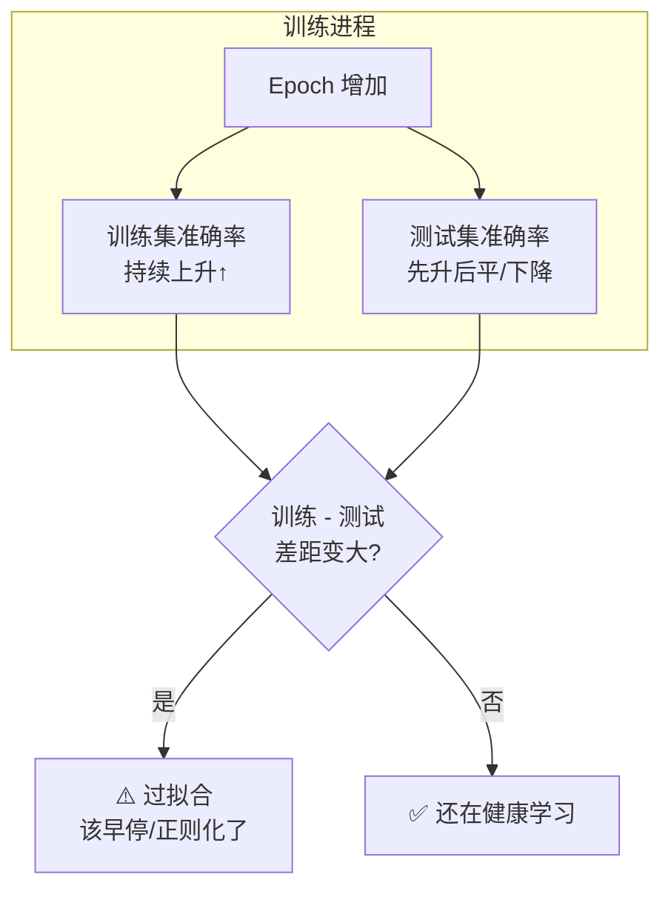

# 🎬 第 2 章 · 计算机视觉入门：FashionMNIST 与神经元（Introduction to Computer Vision）

> 本章对应原书 *AI and ML for Coders in PyTorch*（Laurence Moroney 著）第 2 章 "Introduction to Computer Vision"，PDF 第 45–66 页（书内页码 23–43）。

## 🗺️ 本章地图（读完能会什么）

- 承接第 1 章的「一个神经元学 `y = 2x - 1`」，把同一套「拟合 x→y」的思想升级到**多神经元、多分类**的计算机视觉问题。
- 认识机器学习界的「Hello World」数据集 **Fashion-MNIST**：7 万张 28×28 灰度衣服图，10 个类别。
- 亲手搭一个**全连接（Dense/MLP）分类器**：`Flatten → Linear(784,128) → ReLU → Linear(128,10) → LogSoftmax`，并跑通完整训练循环。
- 学会读懂模型输出的 **logits**、用 `argmax` 取预测类别、用 **准确率（accuracy）** 而不只是 loss 来评估模型。
- 亲眼看到 **过拟合（overfitting）** 现象（训练集越练越好、测试集却停滞甚至变差），并用 **早停（early stopping）** 省时间。
- 打通到 LLM 的主线：Flatten/展平、隐藏层、Softmax、CrossEntropy、DataLoader 这些零件，全都是现代 Transformer/LLM 的地基。

> 💡 **一句话本质**：图像分类的骨架 = **把像素摊平成一个向量 → 过几层带非线性的线性变换 → 输出每个类别的「置信度分数」→ 取最大的那个**；训练就是用「损失 + 优化器」把随机初始化的权重一步步拧到能把图配上正确标签。

---

## 🧠 计算机视觉到底难在哪（第一性原理）

第 1 章我们学了：与其手写规则，不如给模型看大量「输入 + 正确答案」，让它自己**从数据里推断规则**。到了图像，这一点更是致命——你根本没法用 if-else 描述「什么是鞋」。

> 原文（约书内第 23 页）：
> *"There are two shoes in this image, but given the major differences between them, how would you explain to someone what makes them both shoes? ... Sometimes, it's just unfeasible to describe something with rules."*
> 译：这张图里有两只鞋，但它们差别巨大，你要怎么跟别人解释「凭什么它俩都是鞋」？……有时候，用规则去描述一样东西根本不可行。

人是靠「见得多」学会认鞋的。计算机能不能这样学？**能，但有局限**。本章就用 Fashion-MNIST 演示这个「看例子学认物」的过程。

> 💡 **实战/面试高频**：为什么图像识别不用「规则编程」？—— 因为同一类物体的**类内差异（intra-class variation）** 巨大（高跟鞋 vs 运动鞋），且视角/光照/形变无穷多，规则无法穷举。深度学习的价值就是**从数据里自动学出这些规则的近似**。

---

## 👕 Fashion-MNIST 数据集

**MNIST**（Modified NIST，由 Yann LeCun、Corinna Cortes、Christopher Burges 制作）是 ML 领域的奠基数据集：7 万张手写数字（0–9），28×28 灰度。

**Fashion-MNIST** 是 MNIST 的「无痛替换品」（drop-in replacement）：记录数一样、图像尺寸一样、类别数一样，只是把数字换成了 **10 类服饰**。它由 Zalando Research 在 2017 年发布，就是因为 MNIST 太简单了、几乎人人跑到 99%+，缺乏区分度。

| 属性 | Fashion-MNIST | 说明 |
|---|---|---|
| 图像总数 | 70,000 | 训练 60,000 / 测试 10,000 |
| 单图尺寸 | 28 × 28 = **784** 像素 | 灰度（monochrome） |
| 像素取值 | 0–255 | 0=黑，255=白，中间是灰阶 |
| 类别数 | 10 | 见下表 |
| 通道数 | 1（灰度） | 张量形状 `(1, 28, 28)` |

10 个类别的标签编号（**务必记住 9 = Ankle Boot**，本章示例反复用它）：

| 编号 | 类别 | 中文 | 编号 | 类别 | 中文 |
|---|---|---|---|---|---|
| 0 | T-shirt/top | T恤 | 5 | Sandal | 凉鞋 |
| 1 | Trouser | 裤子 | 6 | Shirt | 衬衫 |
| 2 | Pullover | 套头衫 | 7 | Sneaker | 运动鞋 |
| 3 | Dress | 连衣裙 | 8 | Bag | 包 |
| 4 | Coat | 外套 | 9 | **Ankle boot** | 踝靴 |

> 💡 **实战/面试高频**：Fashion-MNIST 的第 6 类 Shirt 和第 0 类 T-shirt、第 2 类 Pullover、第 4 类 Coat 极易混淆，是数据集里公认最难的一类——这也是为什么 SOTA 也就 ~93-95%，比 MNIST 的 99.7% 低不少。面试聊到「数据集选择」时，能说出「Fashion-MNIST 比 MNIST 更能拉开模型差距」是加分项。

---

## 🔢 从「一个神经元」到「一层神经元」

第 1 章那个 `y = 2x - 1`，是**一层一个神经元**在学一条直线。现在：

- 每张图有 **784 个 x**（把 28×28 拉直）；
- 我们要的 **y 是 0–9 中的一个类别**。

一个 `y = mx + c` 显然装不下——它只能画一条线，而 784 维输入到 10 类的映射复杂得多。**解法：让很多神经元协同工作**。每个神经元学自己的一组权重 `w` 和偏置 `b`（随机初始化），把它们的输出组合起来，就能拟合复杂的模式。

> 原文（约书内第 27 页）：
> *"neuron 0 will contain the value of the probability that the pixels will add up to label 0, neuron 1 will contain the value of the probability that the pixels will add up to label 1, etc."*
> 译：0 号神经元存放「这些像素属于标签 0 的概率」，1 号神经元存放「属于标签 1 的概率」，以此类推。

**关键直觉**：10 个类别 → 随机初始化时蒙对约 **10%**。然后 loss 函数 + 优化器 **一个 epoch 接一个 epoch** 地微调每个神经元的内部参数，把这 10% 一路推高。到最后，计算机就「学会看」什么让鞋成为鞋、裙成为裙了。


---

## 🏗️ 设计这个神经网络

原书给出的网络主体：

```python
self.linear_relu_stack = nn.Sequential(
    nn.Linear(28*28, 128),   # 隐藏层：784 输入 → 128 个神经元
    nn.ReLU(),               # 激活函数：负值清零
    nn.Linear(128, 10),      # 输出层：128 输入 → 10 类
    nn.LogSoftmax(dim=1)     # 把 10 个分数转成「log 概率」
)
```

逐层拆解：

### 隐藏层 `nn.Linear(784, 128)`

`nn.Linear(in, out)` 学一个线性变换 `y = xW^T + b`。这里 `in=784`（一张图的像素数），`out=128`（**这一层要 128 个神经元**）。它在图里是**中间层**，术语叫 **隐藏层（hidden layer）**——「隐藏」只是指外部没有直接接口去访问它，不是什么玄学。

> ⚠️ **踩坑**：书里一句很实在的话——"Why 128? This is entirely arbitrary."（为什么是 128？完全是拍脑袋定的。）神经元个数是**超参数（hyperparameter）**，没有铁律：
> - 太多 → 训练慢、参数多、**容易过拟合**；
> - 太少 → 参数不够，学不动。
> 这个「速度 vs 精度」的权衡，靠**超参数调优（hyperparameter tuning）** 试出来。注意区分：**参数（parameters）= 训练中学到的 w/b**；**超参数 = 你手动设定、用来控制训练的值**（如神经元数、学习率、batch size、epoch 数）。

### 激活函数 `nn.ReLU()`

ReLU = Rectified Linear Unit（修正线性单元），公式简单到爆：`ReLU(x) = max(0, x)`——**大于 0 原样输出，小于等于 0 变 0**。

**为什么需要它？** 如果只堆 `Linear`，无论多少层，复合起来还是一个线性变换（`Linear(Linear(x))` 仍是线性），根本学不了曲线/复杂边界。ReLU 引入**非线性**，网络才有表达能力。书里的角度更朴素：我们不想让负值传到下一层去干扰求和，与其写一堆 if-then，不如直接用 ReLU「激活」这一层。

| 激活函数 | 公式 | 特点 | 典型用途 |
|---|---|---|---|
| **ReLU** | `max(0, x)` | 简单、快、缓解梯度消失 | 中间层默认首选 |
| Sigmoid | `1/(1+e^-x)` | 输出 (0,1)，易梯度消失 | 二分类输出 |
| Tanh | `(e^x-e^-x)/(e^x+e^-x)` | 输出 (-1,1) | 老式 RNN |
| GELU | `x·Φ(x)` | 平滑版 ReLU | **Transformer/LLM 标配** |

### 输出层 `nn.Linear(128, 10)` + `nn.LogSoftmax`

输出层 `(128, 10)`：128 个输入（上一层神经元数）→ **10 个输出**（10 个服饰类别）。每个输出神经元对应一个类别，最终值是「这张图属于该类的置信度」，我们的活儿就是**找哪个最大**。

那「哪个神经元管鞋、哪个管衬衫」是谁规定的？**没人手写规定**。训练时我们给出图 + 正确标签（**ground truth**），网络自己学会：看到一只鞋时，对应鞋的输出神经元该趋近「1」、其余趋近「0」。这就是**监督学习的 one-hot 目标**思想。

`LogSoftmax(dim=1)`：先做 Softmax 把 10 个原始分数（logits）归一化成概率分布（和为 1），再取 `log`。`dim=1` 表示**沿类别维度**归一化（第 0 维是 batch）。取 log 后，概率越接近 1、log 值越接近 0（`log(1)=0`），越小的概率对应越负的数——所以**看输出时找最接近 0（最大）的那个**。

> 💡 **实战/面试高频**：**为什么用 `LogSoftmax + NLLLoss` 而不是 `Softmax + 手写交叉熵`？** 数值稳定性！直接算 `log(softmax(x))` 会因指数溢出/下溢出问题炸掉，`LogSoftmax` 用了 log-sum-exp 技巧稳定计算。而 `LogSoftmax + NLLLoss` **在数学上完全等价于 `nn.CrossEntropyLoss`**（后者内部就是这俩的合体，直接吃原始 logits）。见下节。

---

## 📦 完整代码（原书版）

```python
import torch
import torch.nn as nn
import torch.optim as optim
from torchvision import datasets, transforms
from torch.utils.data import DataLoader

# ---------- 1. 加载数据 ----------
transform = transforms.Compose([transforms.ToTensor()])  # 关键：把 [0,255] uint8 → [0,1] float 张量

train_dataset = datasets.FashionMNIST(root='./data', train=True,
                             download=True, transform=transform)
test_dataset = datasets.FashionMNIST(root='./data', train=False,
                             download=True, transform=transform)

train_loader = DataLoader(train_dataset, batch_size=64, shuffle=True)   # 训练要打乱
test_loader = DataLoader(test_dataset, batch_size=64, shuffle=False)    # 测试无需打乱

# ---------- 2. 定义模型 ----------
class FashionMNISTModel(nn.Module):
    def __init__(self):
        super(FashionMNISTModel, self).__init__()
        self.flatten = nn.Flatten()                    # (batch,1,28,28) → (batch,784)
        self.linear_relu_stack = nn.Sequential(
            nn.Linear(28*28, 128),
            nn.ReLU(),
            nn.Linear(128, 10),
            nn.LogSoftmax(dim=1)
        )

    def forward(self, x):
        x = self.flatten(x)                            # 先摊平
        logits = self.linear_relu_stack(x)             # 再过网络
        return logits

model = FashionMNISTModel()

# ---------- 3. 损失函数 & 优化器 ----------
loss_function = nn.NLLLoss()                           # 配合 LogSoftmax
optimizer = optim.Adam(model.parameters())            # 把所有可训练参数交给优化器

# ---------- 4. 训练一个 epoch ----------
def train(dataloader, model, loss_fn, optimizer):
    size = len(dataloader.dataset)                     # 60000，用于打印进度
    model.train()                                      # 切到训练模式
    for batch, (X, y) in enumerate(dataloader):        # 每次拿一个 batch（默认 64 张）
        pred = model(X)                                # 前向：得到 (64, 10) logits
        loss = loss_fn(pred, y)                        # 和真实标签 y (64,) 算损失

        optimizer.zero_grad()                          # 梯度清零（PyTorch 默认累加）
        loss.backward()                                # 反向传播：算梯度
        optimizer.step()                               # 用梯度更新参数

        if batch % 100 == 0:
            loss, current = loss.item(), batch * len(X)
            print(f"loss: {loss:>7f}  [{current:>5d}/{size:>5d}]")

# ---------- 5. 训练 5 个 epoch ----------
epochs = 5
for t in range(epochs):
    print(f"Epoch {t+1}\n-------------------------------")
    train(train_loader, model, loss_function, optimizer)
print("Done!")
```

**数据管线要点**：

- `transforms.ToTensor()` 一步做两件事——① 把 PIL 图 `[0,255]` 整数映射到 `[0,1]` 浮点；② 转成形状 `(1,28,28)` 的张量。**神经网络喜欢归一化输入**，用未归一化的数据往往会训不动、误差巨大。
- 为什么要 **train + test 两个数据集**？防止「记住答案」。模型在训练集上可能变成「专家」，但对没见过的数据泛化差。所以留 1 万张 **绝不参与训练**，专门测泛化能力。
- `DataLoader(batch_size=64)`：6 万条数据不必一次全塞进内存，切成 **batch** 一块块喂。60000 / 64 = **937.5**，所以有 **938 个 batch**（937 个满 64 + 最后 1 个 32 张）。
- **一个 epoch = 把全部数据（所有 batch）过一遍**。

> ⚠️ **踩坑**：`optimizer.zero_grad()` 千万别漏！PyTorch 的梯度是**累加**的，不清零的话这个 batch 的梯度会叠加上一个 batch 的，训练直接乱套。记牢黄金三连：`zero_grad() → backward() → step()`。

---

## 🔬 关键代码拆解：一条最核心的行——准确率计算

Loss 下降 ≠ 我们真正关心的「准确率」。原书用测试函数评估，最难懂的是这一行：

```python
correct += (pred.argmax(1) == y).type(torch.float).sum().item()
```

我们把它当成一个 batch（64 张）来逐步拆张量形状：

```python
# pred:  (64, 10) —— 64 张图，每张 10 个 log 概率
# y:     (64,)    —— 64 个真实标签，取值 0-9

pred.argmax(1)          # 沿 dim=1（类别维）取最大值下标 → (64,) 每张图的预测类别
                        # 例：某张图 10 个值里第 9 个最大 → 预测 9

pred.argmax(1) == y     # 逐元素比较 → (64,) 的布尔张量，如 [True, False, True, ...]

.type(torch.float)      # True→1.0, False→0.0 → (64,) 浮点：[1., 0., 1., ...]

.sum()                  # 求和 → 标量张量，本 batch 猜对的张数，如 tensor(57.)

.item()                 # 张量 → Python float 57.0，累加进 correct
```

最后 `correct /= size`（除以总样本数 10000）得到准确率。跑完 5 个 epoch，书里测试集拿到 **86.9%**——只训练了 5 轮，对**没见过**的数据能对 86.9%，很不赖！

完整测试函数（注意 `model.eval()` 和 `torch.no_grad()`）：

```python
def test(dataloader, model):
    size = len(dataloader.dataset)
    num_batches = len(dataloader)
    model.eval()                       # 切到推理模式（关掉 dropout/BN 的训练行为）
    test_loss, correct = 0, 0
    with torch.no_grad():              # 关掉梯度计算，省显存、提速（推理不需要反传）
        for X, y in dataloader:
            pred = model(X)
            test_loss += loss_function(pred, y).item()
            correct += (pred.argmax(1) == y).type(torch.float).sum().item()
    test_loss /= num_batches
    correct /= size
    print(f"Test Error: \n Accuracy: {(100*correct):>0.1f}%, Avg loss: {test_loss:>8f} \n")

test(test_loader, model)
# → Test Error:  Accuracy: 86.9%, Avg loss: 0.366243
```

> 💡 **实战/面试高频**：`model.train()` vs `model.eval()` 的区别？—— 它切换 **Dropout** 和 **BatchNorm** 的行为：训练模式下 Dropout 随机丢神经元、BN 用当前 batch 统计量；eval 模式下 Dropout 关闭、BN 用训练期累积的移动平均。**忘了切 eval 会导致推理结果不稳定/偏差**。而 `torch.no_grad()` 是另一回事——它只是**不建计算图、不算梯度**，纯为省内存提速，和 train/eval 正交。

---

## 👀 看模型的输出（logits）

训练完，拿一张测试图看看模型「怎么想」：

```python
image, label = test_dataset[0]         # 取第 0 张测试图
image = image.unsqueeze(0)             # (1,28,28) → (1,1,28,28)：补上 batch 维！模型期望批输入
with torch.no_grad():
    prediction = model(image)          # 形状 (1, 10)
    print(prediction)
    predicted_label = prediction.argmax(1).item()
```

原书的一次真实输出：

```
tensor([[-12.4290, -16.0639, -14.3148, -16.2861, -13.1672,
          -4.5377, -13.6284,  -1.3124,  -8.9946,  -0.3285]])
```

这 10 个数是 **log 概率**（LogSoftmax 的产物）。规则：`log(1)=0`，概率小于 1 则 log 为负。**找最接近 0（最大）的那个**——最后一个 `-0.3285` 最大，下标 = **9**。Fashion-MNIST 的 9 号 = **Ankle Boot（踝靴）**，而这张图的真实标签也是 9，**猜对了**！

> ⚠️ **踩坑**：`image.unsqueeze(0)` 别忘。单张图形状是 `(1,28,28)`，但模型的 `nn.Flatten()`/`nn.Linear` 默认第 0 维是 batch，直接喂单图会形状不匹配或结果错误。补 batch 维后是 `(1,1,28,28)`，才符合「一批里有 1 张图」的约定。

---

## 📉 过拟合（Overfitting）：越练越好 ≠ 越练越强

书里做了个经典对比实验——把 5 个 epoch 加到 **50 个 epoch**：

| 训练轮数 | 训练集准确率 | 测试集准确率 | 现象 |
|---|---|---|---|
| 5 epochs | 88.59% | 86.9% | 二者接近，健康 |
| 50 epochs | **96.15%** | **89.2%** | 训练集猛涨、测试集只微涨 |

训练集从 88.59% → 96.15%（大涨 7.5 个点），测试集只从 86.9% → 89.2%（涨 2.3 个点）。**两者的鸿沟拉大**，正是 **过拟合（overfitting）** 的信号：模型开始「死记硬背」训练集的细节，而不是学到能泛化的规律。

> 原文（约书内第 40 页）：
> *"the divergence in the accuracy numbers shows that the model might have become overspecialized to the training data, in a process that's often called overfitting."*
> 译：准确率数字的背离表明，模型可能已经对训练数据过度专门化了，这个过程通常叫过拟合。

书里的类比很妙：**如果你从小只见过运动鞋，第一次看到高跟鞋你会懵**——「大概是鞋？但不确定」。神经网络遇到和训练数据差别够大的输入时，就是这种「懵」的状态。这也解释了为什么**测试集准确率天然低于训练集**——模型只真正「认识」它训练过的输入。



> 💡 **实战/面试高频**：判断过拟合看什么？—— 看 **训练集与验证/测试集的性能鸿沟（generalization gap）**。训练 loss 一路降、验证 loss 触底反弹，就是过拟合。缓解手段（后续章节会展开）：**更多数据、数据增强、Dropout、权重衰减/L2、早停、减小模型容量**。

---

## ⏹️ 早停（Early Stopping）：训到「够好」就收手

前面都是**硬编码 epoch 数**——但你事先并不知道要几轮才够。既然我们已经在训练时算了准确率，那就**监控它，达到阈值就停**。原书做法：训练集准确率到 95% 就停。

```python
# 在训练循环里，每算完一批的平均准确率后：
if batch % 100 == 0:
    current = batch * len(X)
    avg_loss = total_loss / (batch + 1)
    avg_accuracy = total_accuracy / (batch + 1) * 100
    print(f"Batch {batch}, Loss: {avg_loss:>7f}, "
          f"Accuracy: {avg_accuracy:>0.2f}% [{current:>5d}/{size:>5d}]")

    # 早停条件
    if avg_accuracy >= 95:
        print("Reached 95% accuracy, stopping training.")
        return True   # 返回信号，外层据此终止训练
```

配套的准确率小函数：

```python
def get_accuracy(pred, labels):
    _, predictions = torch.max(pred, 1)          # 取每行最大值的下标 → 预测类别
    correct = (predictions == labels).float().sum()
    accuracy = correct / labels.shape[0]         # 除以本 batch 样本数
    return accuracy
```

**效果**：原来死磕 50 epoch 得 96.15%；设了 95% 早停后，模型**第 37 个 epoch 就停了**——省下 13 轮。书里还吐槽：其实前几轮已经到 94.99% 了，本可以停得更早。

> ⚠️ **踩坑**：书里特别提醒——早停判断**最好放在「一个 epoch 结束」时**，别放在 `if batch % 100 == 0` 里就 `return`，否则会在某个 epoch 中途就跳出，统计口径不完整。生产实践里，早停通常监控**验证集**指标（而非训练集），并配 **patience（耐心值）**：连续 N 轮验证指标没改善才停，避免被噪声骗停。

> 💡 **实战/面试高频**：早停算不算正则化？—— 算。早停通过**限制有效训练时长**间接约束模型复杂度，等价于一种隐式正则化，能防止模型在训练后期陷入过拟合区。它是**最便宜、最常用**的防过拟合手段之一。

---

## 🌍 社区案例与延伸

- **LeNet-5（LeCun et al., 1998）**——现代 CNN 与 MNIST 的共同源头。这篇 *"Gradient-Based Learning Applied to Document Recognition"*（Proc. IEEE）就是在 MNIST 上做手写数字识别，奠定了「卷积 + 池化 + 全连接」的范式。本章的全连接分类器就是它「拿掉卷积」的简化版。论文：<http://yann.lecun.com/exdb/publis/pdf/lecun-98.pdf>
- **Fashion-MNIST 原始论文（Xiao, Rasul & Vollgraf, 2017, arXiv:1708.07747）**——*"Fashion-MNIST: a Novel Image Dataset for Benchmarking Machine Learning Algorithms"*。作者明确说造它就是因为 MNIST「太容易、被刷爆、不能代表现代 CV 任务」。仓库：<https://github.com/zalandoresearch/fashion-mnist>，含各类算法的 benchmark 排行榜。
- **ReLU 的由来（Nair & Hinton, 2010 / Glorot, Bordes & Bengio, 2011）**——*"Rectified Linear Units Improve Restricted Boltzmann Machines"* 和 *"Deep Sparse Rectifier Neural Networks"*。这两篇让 ReLU 从边角料变成深度网络的默认激活函数，因为它**缓解了 Sigmoid/Tanh 的梯度消失**，训练更快更稳。<http://proceedings.mlr.press/v15/glorot11a/glorot11a.pdf>
- **PyTorch 官方 Quickstart 教程**——本章代码几乎逐行对应官方 *"Quickstart"*（同样用 FashionMNIST + `nn.Flatten`/`nn.Linear`/`DataLoader`/train-test 循环），是校对 API 的权威参照：<https://pytorch.org/tutorials/beginner/basics/quickstart_tutorial.html>

---

## 🔗 通向 LLM

本章这些「入门零件」，几乎一比一映射到现代 Transformer/LLM 的地基上：

| 本章概念 | 在 LLM 里对应什么 | 说明 |
|---|---|---|
| **Flatten 展平像素** | **Patchify（ViT）/ 序列展平** | Vision Transformer 把图切成 patch 展平成 token 序列，思想同源；LLM 里输入本就是 token 序列 |
| **隐藏层 Linear+ReLU** | **Transformer 里的 FFN/MLP 子层** | 每个 Transformer block 都有 `Linear→激活→Linear` 的 MLP（LLM 常用 GELU/SwiGLU 替 ReLU） |
| **输出层 Linear(128,10)** | **LM Head（输出投影到词表）** | LLM 最后一层 `Linear(hidden, vocab_size)`，把隐状态投到**几万到十几万维的词表**，逻辑和这里的「投到 10 类」完全一致 |
| **Softmax 归一化** | **词表上的概率分布** | LLM 对 vocab 维做 Softmax，得到「下一个 token」的概率分布 |
| **argmax 取预测** | **贪心解码（greedy decoding）** | 取概率最大的 token 就是最简单的解码策略；温度采样/top-k/top-p 是它的进化版 |
| **CrossEntropy / NLLLoss** | **LLM 预训练的唯一主损失** | 「预测下一个 token」本质就是**词表上的多分类**，损失就是本章的交叉熵——LLM 训练目标和这里的图像分类**数学同构** |
| **DataLoader + batch** | **大模型训练数据管线** | LLM 训练同样把海量语料切 batch 喂入，`shuffle`/`batch_size`/多卡分片都是这套思想的放大 |
| **过拟合 / 早停** | **微调（SFT/LoRA）的核心风险与手段** | 在小数据上微调 LLM 极易过拟合，早停 + 验证集监控是标配 |

一句话主线：**「把输入变成向量 → 过带非线性的线性层 → 输出层投到 N 个类别 → Softmax + 交叉熵」这条流水线，从 Fashion-MNIST 的 10 类，放大到 LLM 的十几万词表 token，本质完全一样。** 你现在写的这个 60 行的分类器，就是理解 GPT 输出层的最短路径。

---

## ⚠️ 常见坑

1. **忘了归一化输入**：不加 `transforms.ToTensor()`（把 `[0,255]→[0,1]`）就喂原始像素，网络往往训不动、loss 爆炸。书里明说 normalization 会显著提升训练表现。
2. **`optimizer.zero_grad()` 漏写**：PyTorch 梯度累加，不清零 → 梯度乱叠 → 训练不收敛。
3. **推理忘了 `model.eval()` + `torch.no_grad()`**：前者影响 Dropout/BN 行为致结果不稳，后者不写则白白建计算图、浪费显存拖慢速度。
4. **单张图忘了 `unsqueeze(0)` 补 batch 维**：`(1,28,28)` 直接喂会形状不符，模型期望 `(batch,1,28,28)`。
5. **拿训练集准确率当最终成绩**：训练集 96% 不代表模型好，**必须看测试/验证集**；两者鸿沟大 = 过拟合。
6. **`LogSoftmax` 配错损失**：`LogSoftmax` 要配 `NLLLoss`；若用 `CrossEntropyLoss`（内部已含 LogSoftmax），**千万别再手动加 LogSoftmax**，否则等于做了两次、梯度全错。

---

## 🎯 面试速答

- **Q：为什么隐藏层要加 ReLU 这类激活函数？**
  A：引入非线性；没有它，多层 Linear 复合仍是一个线性变换，网络无法拟合复杂的非线性决策边界。
- **Q：`LogSoftmax + NLLLoss` 和 `CrossEntropyLoss` 什么关系？**
  A：数学上等价——`CrossEntropyLoss = LogSoftmax + NLLLoss` 的合体，且直接吃原始 logits、数值更稳。用了 `CrossEntropyLoss` 就不要在模型末尾再加 Softmax/LogSoftmax。
- **Q：怎么判断模型过拟合了？怎么办？**
  A：看训练集与验证集的**泛化鸿沟**——训练准确率一路涨、验证准确率停滞或下降即过拟合。对策：更多数据/数据增强、Dropout、权重衰减、早停、减小模型。
- **Q：`model.train()` 和 `model.eval()` 的区别？**
  A：切换 Dropout 与 BatchNorm 的行为；train 下 Dropout 生效、BN 用当前 batch 统计，eval 下 Dropout 关闭、BN 用累积移动平均。推理必须切 eval。
- **Q：一个 epoch、一个 batch、一次 iteration 分别是什么？**
  A：batch = 一次喂入的一小撮样本（本章 64）；iteration = 处理一个 batch 的一次前向+反向（本章一个 epoch 938 次）；epoch = 全部训练数据过完一遍。

---

## 📌 本章小结

1. **Fashion-MNIST** = MNIST 的无痛升级版：7 万张 28×28 灰度衣服图、10 类、60k 训练 / 10k 测试，是练手图像分类的标准数据集。
2. 全连接分类器的骨架：**`Flatten(784) → Linear(784,128) → ReLU → Linear(128,10) → LogSoftmax`**，配 `NLLLoss` + `Adam`，5 个 epoch 即可到测试集 ~86.9%。
3. 训练黄金三连：**`optimizer.zero_grad() → loss.backward() → optimizer.step()`**；评估要切 `model.eval()` + `torch.no_grad()`，并用 **argmax + 准确率**（而非只看 loss）衡量。
4. 训练久了会**过拟合**：训练集准确率猛涨、测试集停滞，泛化鸿沟拉大；**早停** 是最省事的应对——训到「够好」就收手。
5. 这套「向量化输入 → 线性层+非线性 → 投到 N 类 → Softmax+交叉熵」的流水线，正是 **LLM 输出层与预训练损失** 的同构原型，是通向 Transformer 的第一块地基。

---

## 🔗 延伸阅读 & 交叉链接

- 上一章打基础：[[01_PyTorch入门：从传统编程到学习]]（从 `y=2x-1` 单神经元起步）
- 下一章升级：[[03_卷积神经网络：在图像中检测特征]]（用卷积「学特征」而非「记像素」，突破全连接的天花板）
- 数据管线深挖：[[04_用PyTorch管理数据：Dataset与DataLoader]]（本章 `DataLoader`/`transform` 的完整机制）
- 推理与部署：[[12_推理的概念：Tensor进与出]]、[[13_用TorchServe与Flask部署PyTorch模型]]
- 主线终点：[[21_从本书基础到LLM落地实战（合流篇）]]（本章的 Softmax/交叉熵如何长成 LLM 输出头）

外部真实链接：
- Fashion-MNIST 论文与仓库：arXiv:1708.07747 · <https://github.com/zalandoresearch/fashion-mnist>
- PyTorch 官方 Quickstart（本章代码的权威对照）：<https://pytorch.org/tutorials/beginner/basics/quickstart_tutorial.html>
- LeNet-5 原始论文（LeCun 1998）：<http://yann.lecun.com/exdb/publis/pdf/lecun-98.pdf>
- ReLU 论文（Glorot 2011, Deep Sparse Rectifier Networks）：<http://proceedings.mlr.press/v15/glorot11a/glorot11a.pdf>
