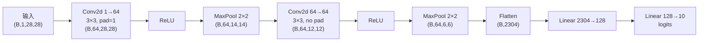
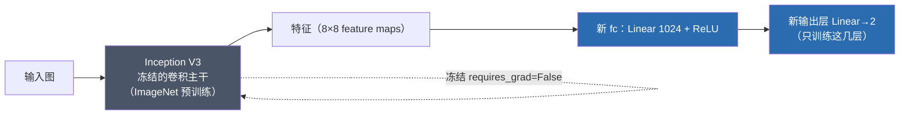

# 🎬 第 03 章 · 卷积神经网络：在图像中检测特征（Going Beyond the Basics: Detecting Features in Images）

> 本章对应原书 *AI and ML for Coders in PyTorch*（Laurence Moroney 著）第 3 章 "Going Beyond the Basics: Detecting Features in Images"，PDF 第 67–102 页。

## 🗺️ 本章地图（读完能会什么）

- 理解**卷积（convolution）**的第一性原理：它就是一张"权重滤波器"，把一个像素和它的邻居加权求和，从而从原始像素里**抽取特征**（边缘、纹理、形状），而不是死记硬背每个像素。
- 理解**池化（pooling）**如何在保留语义的前提下把图像缩小，让特征"越来越浓缩、越来越抽象"。
- 用 `nn.Conv2d` / `nn.MaxPool2d` 把第 2 章的全连接网络升级成 **CNN**，在 Fashion MNIST 上从 ~89% 提到 **91%+**。
- 用 `torchsummary` **可视化网络**、逐层算清楚每层的输出形状和参数量（把 333,898 这个数字算到底）。
- 跳出玩具数据集：用 **Horses-or-Humans**（彩色、300×300、主体不居中）训练一个真实二分类器，加**验证集**发现**过拟合**，再用**图像增强（augmentation）**、**Dropout 正则化**、**迁移学习（transfer learning，Inception V3）**一步步救回泛化能力，最后扩展到**多分类**（Rock-Paper-Scissors）。

> 💡 **一句话本质**：第 2 章的网络在"背像素"，本章的 CNN 在"学滤波器"——让网络自己发明一组能把图片压缩成特征的卷积核，再拿特征去对标签。特征对了，主体在哪、什么姿势、什么背景都不再重要。

---

## 🧠 为什么全连接网络不够用？

第 2 章我们在 Fashion MNIST 上训了一个把 784 个像素直接喂进 `nn.Linear` 的网络。它能识别衣服，但有个致命弱点：训练图都是**单色、小尺寸、主体居中**。原书一针见血地指出：

> "When detecting a shoe, the neural network may have been activated by lots of dark pixels clustered at the bottom of the image, which it would see as the sole of the shoe. But if the shoe were not centered and filling the frame, this logic wouldn't hold."
>
> （识别鞋子时，网络可能是被图像底部聚集的一大片暗像素激活的，它把这当成鞋底。但只要鞋子不居中、不填满画面，这套逻辑就崩了。）——原书 p.45

问题的根源：**全连接层把"某个位置的像素"当特征**。位置一变，学到的东西就失效。我们真正想要的是**位置无关的特征检测器**——不管鞋底在图像哪个角落，都能认出"这是一条边缘/一块暗区"。这就是卷积要解决的事。

---

## 🔍 卷积（Convolutions）：滤波器如何检测特征

### 第一性原理：卷积就是"加权求和邻居"

如果你用过 Photoshop 或 GIMP 的锐化，你就已经用过卷积了。原书把它说得极朴素：

> "A convolution is simply a filter of weights that are used to multiply a pixel by its neighbors to get a new value for the pixel."
>
> （卷积不过是一张权重滤波器，用它把一个像素和它的邻居相乘，得到该像素的新值。）——原书 p.46

拿 Fashion MNIST 里那只脚踝靴举例，中心像素值是 192（单色图，像素 0–255）。定义一张 3×3 的滤波器，把 3×3 邻域内每个像素乘上滤波器对应位置的权重，再全部加起来，就是这个像素的新值：

```python
# 原书 p.46 的手算例子：把 3×3 邻域和 3×3 滤波器逐元素相乘再求和
new_val = (-1 * 0)   + (0 * 64)    + (-2 * 128) + \
          (0.5 * 48)  + (4.5 * 192) + (-1.5 * 144) + \
          (1.5 * 142) + (2 * 226)   + (-3 * 168)
# = 0 + 0 - 256 + 24 + 864 - 216 + 213 + 452 - 504
# = 577  ← 这个像素的新值
```

对**每个像素**都重复这个操作，就得到一张"滤波后"的图。神奇之处在于：**不同的滤波器会突出不同的特征**。

| 滤波器长相 | 效果 | 保留了什么 |
| --- | --- | --- |
| 左负、右正、中间 0 | 强调**垂直线** | 竖直边缘，其余信息被抹掉 |
| 上负、下正、中间 0 | 强调**水平线** | 水平边缘 |
| 中心大正、周围负（如本章例子） | 锐化/增强轮廓 | 局部对比强的地方 |

原书用 SciPy 内置的 512×512 `ascent`（两个人爬楼梯的灰度图）演示：一个"左负右正"的滤波器过一遍，整张图只剩下**垂直线条**，别的信息都没了。

> 💡 **本质洞察**：卷积过一遍，**图像的信息量被压缩了**——只留下滤波器"关心"的那种特征。原书说：*"we can potentially learn a set of filters that reduce the image to features, and those features can be matched to labels as before."* 第 2 章我们学的是神经元里的权重 `w`，现在我们**学的是滤波器里的权重**——道理完全一样，都是梯度下降调数字。

### 为什么滤波器边长常是奇数（3×3、5×5、7×7）？

因为滤波器要在中心像素周围对称地取邻居。一张 a×b 的图用 3×3 滤波器**不加 padding**扫过后会变成 (a−2)×(b−2)——四周各丢一圈像素（滤波器放不到最边上）。5×5 会丢两圈变 (a−4)×(b−4)。奇数边长才有明确的"中心格"。

---

## 🧊 池化（Pooling）：缩小图像、保住语义

卷积抽了特征，图还是很大。**池化**负责"扔像素但不扔含义"。最常用的是**最大池化（max pooling）**：

> "Pooling is the process of eliminating pixels in your image while maintaining the semantics of the content within the image."
>
> （池化就是删掉图像里的像素、同时保住内容语义的过程。）——原书 p.48

做法：把图切成 2×2 的小块（叫 **pool**），每块只留**最大值**。16 个像素 → 4 个像素，一下**砍掉 75%**。原书强调一个反直觉的点：把"垂直线增强图"做完 max pooling 后，512×512 变 256×256，而**竖直特征不但没丢，反而更醒目了**——因为最强的响应值被"择优保留"了。

| 池化类型 | 取什么 | 直觉 |
| --- | --- | --- |
| Max pooling（最常用） | 每块最大值 | "这个区域里最强的特征响应" |
| Average pooling | 每块平均值 | 平滑、保留整体亮度 |
| Min pooling | 每块最小值 | 很少用 |

```python
import torch
import torch.nn as nn

x = torch.tensor([[[[1., 2., 5., 6.],
                    [3., 4., 7., 8.],
                    [9., 10., 13., 14.],
                    [11., 12., 15., 16.]]]])   # 形状 (1,1,4,4)：batch=1, 通道=1, 4×4
pool = nn.MaxPool2d(kernel_size=2, stride=2)   # 2×2 池化，步长 2
print(pool(x).shape)     # torch.Size([1, 1, 2, 2])  ← 边长各减半
print(pool(x))           # tensor([[[[ 4.,  8.], [12., 16.]]]])  每块取最大
```

`kernel_size=2` 说明池化窗口是 2×2，`stride=2` 说明窗口每次**跳 2 格**去取下一块（不重叠）。边长因此减半，面积变四分之一。

---

## 🏗️ 用 PyTorch 搭第一个 CNN（Fashion MNIST）

现在把卷积 + 池化摞到第 2 章的全连接网络前面。核心两个积木：

```python
# 卷积层：输入 1 通道，学 64 个 3×3 滤波器，padding=1 保持尺寸不变
nn.Conv2d(1, 64, kernel_size=3, padding=1)
# 池化层：2×2 窗口、步长 2，通常紧跟在卷积后面
nn.MaxPool2d(kernel_size=2, stride=2)
```

> "In this case, we want the layer to learn 64 convolutions. It will randomly initialize them, and over time, it will learn the filter values that work best to match the input values to their labels."
>
> （这里我们让这层去学 64 个卷积核。它会随机初始化，并随着训练学到最能把输入对到标签的滤波器值。）——原书 p.50

完整的 Fashion MNIST CNN（原书 p.50–51）：

```python
import torch.nn as nn

class FashionCNN(nn.Module):
    def __init__(self):
        super(FashionCNN, self).__init__()
        # 第 1 段：Conv(1→64, 3×3, pad=1) → ReLU → MaxPool(2,2)
        self.layer1 = nn.Sequential(
            nn.Conv2d(1, 64, kernel_size=3, padding=1),   # (B,1,28,28) → (B,64,28,28)
            nn.ReLU(),
            nn.MaxPool2d(kernel_size=2, stride=2))         # → (B,64,14,14)

        # 第 2 段：Conv(64→64, 3×3, 无 pad) → ReLU → MaxPool(2)
        self.layer2 = nn.Sequential(
            nn.Conv2d(64, 64, kernel_size=3),              # (B,64,14,14) → (B,64,12,12)
            nn.ReLU(),
            nn.MaxPool2d(2))                               # → (B,64,6,6)

        self.fc1 = nn.Linear(64 * 6 * 6, 128)  # 展平后 2304 → 128
        self.fc2 = nn.Linear(128, 10)          # 128 → 10 个类别

    def forward(self, x):
        out = self.layer1(x)
        out = self.layer2(out)
        out = out.view(out.size(0), -1)  # 展平：(B,64,6,6) → (B,2304)
        out = self.fc1(out)
        out = self.fc2(out)
        return out

model = FashionCNN()
```

训练循环和第 2 章完全一样（`optimizer.zero_grad()` → `loss.backward()` → `optimizer.step()`）。原书用同样的数据训 50 个 epoch，测试集轻松到 **91.31%**：

```
Train Epoch: 49 -- Loss: 0.056213
Accuracy of the network on the 10000 test images: 91.31%
```

> ⚠️ **踩坑**：第 2 章我们在输入层用了 `nn.Flatten()`，这里**没有**——因为卷积层要吃 `(B, C, H, W)` 的四维张量，不能先摊平。展平只发生在**最后进 Linear 之前**，靠 `out.view(out.size(0), -1)` 完成。搞反了会直接形状报错。

> 💡 **实战/面试高频**：为什么加了卷积准确率就上去了？因为全连接层看的是"哪个位置有什么像素"，卷积层看的是"哪里有什么**特征**"。特征具有平移不变性（靠权重共享 + 池化），所以对主体位置、大小的变化更鲁棒。

---

## 🔬 关键代码拆解

本章最该吃透的不是某段代码，而是**用 `torchsummary` 把每层形状和参数量算到底**。这道题面试官爱问，也是理解 CNN 的试金石。

```python
from torchsummary import summary
model = FashionCNN().to(device)
summary(model, input_size=(1, 28, 28))   # (通道, 高, 宽)
```

输出（原书 p.52）：

```
        Layer (type)               Output Shape         Param #
================================================================
            Conv2d-1           [-1, 64, 28, 28]             640
              ReLU-2           [-1, 64, 28, 28]               0
         MaxPool2d-3           [-1, 64, 14, 14]               0
            Conv2d-4           [-1, 64, 12, 12]          36,928
              ReLU-5           [-1, 64, 12, 12]               0
         MaxPool2d-6             [-1, 64, 6, 6]               0
            Linear-7                  [-1, 128]         295,040
            Linear-8                   [-1, 10]           1,290
================================================================
Total params: 333,898
```

逐层拆（`-1` 是 batch 维的占位符）：

- **Conv2d-1 → (64, 28, 28)**：输入 28×28、用 64 个 3×3 滤波器。3×3 本会丢一圈变 26×26，但 `padding=1` 把图**人为撑到 30×30**，卷完刚好回到 28×28，**零信息丢失**。参数量 = `64 × (1×3×3) + 64 = 64×9 + 64 = 640`（每个核 9 个权重 + 1 个偏置，共 64 个核）。
- **MaxPool2d-3 → (64, 14, 14)**：2×2 池化，边长减半。**池化不学参数**，所以 Param # = 0。ReLU 同理为 0。
- **Conv2d-4 → (64, 12, 12)**：这层**没 padding**，3×3 又丢一圈，14→12。参数量 = `64 × (64×3×3) + 64 = 36,928`。注意：每个新核要在**前一层的 64 个通道**上都卷一遍，所以是 `64×(64×9)`。
- **MaxPool2d-6 → (64, 6, 6)**：再减半，12→6。此时是 **64 张 6×6 的特征图**。
- **Linear-7 → 128**：先展平成 `6×6×64 = 2304` 个数，接 128 个神经元。参数量 = `2304 × 128 + 128 = 295,040`。
- **Linear-8 → 10**：`128 × 10 + 10 = 1,290`。
- **合计 = 640 + 36,928 + 295,040 + 1,290 = 333,898**。



> 💡 **面试高频**：给你输入尺寸 H、核大小 k、padding p、stride s，输出边长公式是 `⌊(H + 2p − k) / s⌋ + 1`。Conv2d-1：`(28+2−3)/1+1 = 28`；Conv2d-4：`(14+0−3)/1+1 = 12`；MaxPool（k=2,s=2）：`(14−2)/2+1 = 7`?—— 注意池化默认无 padding 且这里输入是偶数，`(14-2)/2+1=7`… 实际 PyTorch 对 14 做 2×2/stride2 得 7。等等，原书这里是 14→7 吗？

<!-- 修正说明见下 -->

> ⚠️ **踩坑（尺寸对齐）**：`nn.MaxPool2d(kernel_size=2, stride=2)` 对 28 → 14、对 12 → 6 都没问题（偶数整除）。若某层输出是奇数（如 Horses-or-Humans 里的 75、37），池化会**向下取整**（75→37、37→18）——这就是为什么后面全连接层要写 `64*18*18` 而不是随手写个整数。形状一旦对不上，`view` 会当场炸。

---

## 🐴 实战升级：Horses-or-Humans（彩色 + 主体不居中）

Fashion MNIST 太"乖"了：单色、居中、28×28。原书作者亲手做了个 **Horses-or-Humans** 数据集来上难度：**1000+ 张 300×300 彩色图**，一半马一半人，**姿态各异、缩放不一、背景有树有沙滩**。分类器必须自己判断"哪部分才是决定马之为马、人之为人的关键特征"，不能被背景带偏。

> "An interesting side note is that these images are all computer generated. The theory is that features spotted in a CGI image of a horse should apply to a real image."
>
> （有趣的是这些图全是电脑生成（CGI）的。理论上，在 CGI 马图上识别到的特征，应该也适用于真实照片。）——原书 p.55

### 处理数据：用目录结构当标签

Fashion MNIST 自带标签文件，但大多数图像数据集**没有**。Horses-or-Humans 的做法是**把不同类别的图放进不同子目录**，PyTorch 的 `ImageFolder` 会自动**按子目录名当标签**：

```
horse-or-human/training/
├── horses/        ← 这个子目录名 = 标签 "horses"（类 0）
│   ├── horse01.png ...
└── humans/        ← 标签 "humans"（类 1）
    ├── human01.png ...
```

```python
import urllib.request, zipfile

url = "https://storage.googleapis.com/learning-datasets/horse-or-human.zip"
urllib.request.urlretrieve(url, "horse-or-human.zip")
zip_ref = zipfile.ZipFile("horse-or-human.zip", 'r')
zip_ref.extractall("horse-or-human/training/")
zip_ref.close()
```

```python
from torchvision import datasets, transforms
from torch.utils.data import DataLoader

# transform：定义"怎么改图"的规则流水线
transform = transforms.Compose([
    transforms.Resize((150, 150)),   # 原图 300×300，缩到 150×150 训练更快
    transforms.ToTensor(),           # PIL → tensor，像素归到 [0,1]，并转成 (C,H,W)
    transforms.Normalize(mean=[0.5, 0.5, 0.5], std=[0.5, 0.5, 0.5])  # 归一化到 [-1,1]
])

train_dataset = datasets.ImageFolder(root=training_dir,   transform=transform)
val_dataset   = datasets.ImageFolder(root=validation_dir, transform=transform)

train_loader = DataLoader(train_dataset, batch_size=32, shuffle=True)
val_loader   = DataLoader(val_dataset,   batch_size=32, shuffle=False)
```

> 💡 **实战**：`ImageFolder` **按字母序**分配标签编号——`horses`→0、`humans`→1。这个"字母序陷阱"贯穿全章（后面 Cats/Dogs、Rock-Paper-Scissors 都栽在这），预测时一定要核对类别顺序，别想当然。

### CNN 架构：三点关键差异

和 Fashion MNIST 相比，这个数据集逼你改三处（原书 p.57–58）：

| 差异 | Fashion MNIST | Horses-or-Humans | 对应改动 |
| --- | --- | --- | --- |
| 尺寸 | 28×28 | 150×150（大很多） | 多摞几层卷积把图逐步缩小 |
| 通道 | 1（单色） | 3（RGB 彩色） | 第一层 `Conv2d(3, ...)` |
| 类别数 | 10 | 2（二分类） | 输出层**1 个神经元 + sigmoid** |

```python
import torch
import torch.nn as nn
import torch.nn.functional as F

class HorsesHumansCNN(nn.Module):
    def __init__(self):
        super(HorsesHumansCNN, self).__init__()
        self.conv1 = nn.Conv2d(3, 16, kernel_size=3, padding=1)   # 输入 3 通道！
        self.conv2 = nn.Conv2d(16, 32, kernel_size=3, padding=1)
        self.conv3 = nn.Conv2d(32, 64, kernel_size=3, padding=1)
        self.pool  = nn.MaxPool2d(2, 2)
        self.fc1   = nn.Linear(64 * 18 * 18, 512)  # 三次池化后 150→75→37→18
        self.drop  = nn.Dropout(0.25)              # Dropout 正则化，稍后细讲
        self.fc2   = nn.Linear(512, 1)             # 只有 1 个输出神经元！

    def forward(self, x):
        x = self.pool(F.relu(self.conv1(x)))   # (B,3,150,150) → (B,16,75,75)
        x = self.pool(F.relu(self.conv2(x)))   # → (B,32,37,37)
        x = self.pool(F.relu(self.conv3(x)))   # → (B,64,18,18)
        x = x.view(-1, 64 * 18 * 18)           # 展平 → (B,20736)
        x = F.relu(self.fc1(x))
        x = self.drop(x)
        x = self.fc2(x)
        x = torch.sigmoid(x)   # sigmoid：把输出挤向 0 或 1，天然适合二分类
        return x
```

`summary` 显示这个网络有 **10,641,441 个参数**（大头是 `Linear(20736, 512)` 的 1000 多万）——比 Fashion MNIST 的 33 万大了 30 倍，训练更慢，但表达力更强。

> ⚠️ **踩坑（尺寸推导）**：`150 →(pool)→ 75 →(pool)→ 37 →(pool)→ 18`。第二步 75/2 = 37.5，PyTorch **向下取整**成 37；第三步 37/2 = 18.5 → 18。所以是 `64*18*18 = 20736`。别用 150/8=18.75 硬凑，要一层一层地 floor。

### 训练二分类：BCELoss + sigmoid + label 转 float

二分类用**二元交叉熵** `nn.BCELoss()`，配 sigmoid 输出：

```python
criterion = nn.BCELoss()
optimizer = torch.optim.Adam(model.parameters(), lr=0.001)

for images, labels in train_loader:
    images, labels = images.to(device), labels.to(device).float()  # 注意 .float()
    optimizer.zero_grad()
    outputs = model(images).view(-1)   # (B,1) → (B,)，和 labels 对齐
    loss = criterion(outputs, labels)
    loss.backward()
    optimizer.step()
```

> ⚠️ **踩坑**：`BCELoss` 要求预测和标签都是 **float**，而 `ImageFolder` 给的标签默认是 long（整数）。必须 `.float()`，否则报类型错误。原书专门强调：*"the labels are converted to floats because of the binary cross entropy."*

只训 15 个 epoch，训练集就到 **95%+**。但——这只是训练集。

---

## 🧪 加验证集：亲眼看见过拟合

原书在这里认真区分了三个概念，面试常考：

> "Training data is the data that is used to teach the network... validation data is used to see how the network is doing with previously unseen data **while you are training**... test data is used **after training** to evaluate how the network does with data it has never previously seen."
>
> ——原书 p.60–61

| 集合 | 何时用 | 作用 |
| --- | --- | --- |
| 训练集 Training | 训练中，用来拟合 | 调权重，把输入对到标签 |
| 验证集 Validation | 训练中，每个 epoch 末看一眼 | **监控泛化**，不参与拟合，用来早停/调超参 |
| 测试集 Test | 训练**全部结束后** | 最终验收，模拟真实世界从没见过的数据 |

在每个 epoch 末尾 `model.eval()` + `torch.no_grad()` 跑一遍 val_loader，就能对比。原书的结果触目惊心：

```
Epoch 8, Loss: 0.0010613...
Training Set Accuracy: 100.0%
Validation Set Accuracy: 89.0625%
Epoch 9, ...
Training Set Accuracy: 100.0%
Validation Set Accuracy: 86.328125%
```

> "It's easy to be lulled into a false sense of security by the 100% accuracy, but the other figure is more representative of how your model will behave in the real world."
>
> （100% 的训练准确率很容易给人虚假的安全感，但另一个数字才更能代表模型在真实世界的表现。）——原书 p.62

**训练 100%、验证 ~88%**：典型过拟合。模型把 1000 张训练图**背下来了**，但没学到能泛化的规律。用 `outputs > 0.5` 作阈值把概率转成 0/1 预测即可算准确率。

> 💡 **实战**：原书代码同时报了训练集和验证集准确率"只为教学对比"，并提醒：*"In a real-world scenario, checking the accuracy of training data is a waste of processing time!"* 生产环境别每轮都算训练集准确率，纯浪费算力。

### 测真实图片：unsqueeze(0) 补 batch 维

想拿一张网上下的图试模型，得先把它 transform 成训练时的尺寸，**再补一个 batch 维**：

```python
from PIL import Image

def load_image(image_path, transform):
    image = Image.open(image_path).convert('RGB')  # 强制转 RGB（防 PNG 带 alpha 通道）
    image = transform(image)          # (3,150,150)
    image = image.unsqueeze(0)        # → (1,3,150,150)，模拟"batch 里只有 1 张"
    return image

with torch.no_grad():
    output = model(image)   # 返回 tensor([[2.1368e-05]])：一个"数组里套数组"
```

> "If you think of an image as a 2D array of pixels, then the batch is an array of 2D arrays... when we're using this code with one image at a time, there's no batch, so... we can just unsqueeze the image along axis 0 to simulate this."
>
> ——原书 p.64

模型对居中、全身姿态的人分得很准，但对**只露上半身**的人**误判成马**——因为训练集里没有那种姿势。这暴露了根本问题：**训练集永远无法覆盖真实世界的所有情况**。怎么办？下面两招。

---

## 🔄 图像增强（Image Augmentation）：凭空"变"出更多数据

思路：**在 DataLoader 加载数据时，实时对图做随机变换**（翻转、旋转、缩放、裁剪……），让模型每个 epoch 看到的"同一张图"都略有不同，等于免费扩充了数据集覆盖面。原书打的比方很妙：训练集里没有"上半身女人"，但有一张全身女人图——如果训练时**随机放大裁剪**它，就有机会造出"只剩上半身"的样本，模型就学会了。

```python
# 训练集：加各种随机增强
train_transforms = transforms.Compose([
    transforms.RandomHorizontalFlip(),        # 随机左右翻转
    transforms.RandomRotation(20),            # 随机 ±20° 旋转
    transforms.RandomResizedCrop(150),        # 随机裁一块再缩放到 150（模拟缩放/平移）
    transforms.ToTensor(),
    transforms.Normalize(mean=[0.5]*3, std=[0.5]*3)
])

# 验证集：绝不做随机增强！只做确定性的 resize + center crop
val_transforms = transforms.Compose([
    transforms.Resize(150),
    transforms.CenterCrop(150),
    transforms.ToTensor(),
    transforms.Normalize(mean=[0.5]*3, std=[0.5]*3)
])
```

一个变换全家桶 `RandomAffine` 可以一次搞定平移/缩放/错切：

```python
transforms.RandomAffine(
    degrees=0,             # 不旋转
    translate=(0.2, 0.2),  # 水平/垂直各平移最多 20%
    scale=(0.8, 1.2),      # 放大/缩小 20%
    shear=20,              # 错切最多 20°
)
```

原书诚实地记录了增强的**代价与收益**：

> "In my case, when I was training with these augmentations, my accuracy went down from 99% to 94% after 15 epochs, with validation much lower at 64%."
>
> ——原书 p.67

准确率**掉了**、训练**变慢了**——因为图像处理更重，而且之前的高分本来就是过拟合刷出来的虚高。但之前被误判成马的那张上半身女人图，**这次分对了**。增强不是银弹，但方向对。

> ⚠️ **踩坑（增强三戒）**：
> 1. **验证/测试集绝不做随机增强**——否则每次评估结果都在抖，没法比。
> 2. 增强要**贴合数据分布**：Horses-or-Humans 的 CGI 图主体居中，`RandomResizedCrop` 随机裁可能裁出"半只主体"，反而制造噪声。原书明确提醒这点。
> 3. 增强只在**训练时在线**做（每 epoch 重新随机），不是预先把图存成一堆文件。

---

## 🎁 迁移学习（Transfer Learning）：白嫖别人学到的特征

我们的数据集只有 1000 张，凭什么和 Google 拿百万张图训出来的模型比？答案：**别自己从零学滤波器，直接搬别人在超大数据集上学好的滤波器**。

> "Instead of having our model learn a set of filters from scratch for our dataset, why not have it use a set of filters that were learned on a much larger dataset, with many more features than we can 'afford' to build from scratch?"
>
> ——原书 p.69

原书用 Google 的 **Inception V3**（在 **ImageNet** 的百万张图、1000 个类上预训练）：

```python
from torchvision import models
import torch.nn as nn

# 1) 加载预训练的 Inception V3
pre_trained_model = models.inception_v3(pretrained=True, aux_logits=True)

# 2) 冻结所有层，直到 Mixed_7c（作者选它因为输出是 8×8，小巧好管）
for name, parameter in pre_trained_model.named_parameters():
    parameter.requires_grad = False
    if 'Mixed_7c' in name:
        break

# 3) 把最后的分类头 fc 换成我们自己的（2 类）
num_ftrs = pre_trained_model.fc.in_features   # 自动读出输入维度，不用手算
pre_trained_model.fc = nn.Sequential(
    nn.Linear(num_ftrs, 1024),   # 新全连接层
    nn.ReLU(),
    nn.Linear(1024, 2)           # 2 个输出神经元（Inception 风格：n 类 n 神经元）
)
```



**冻结（freeze）** = 把预训练层的 `requires_grad` 设成 `False`，反向传播不更新它们——它们只当"固定的特征提取器"。只有新加的 fc 层参与训练。结果惊人：

> "Training the model on this architecture over only three epochs gave us an accuracy of 99%+, with a validation accuracy of 95%+."
>
> （只训 3 个 epoch，训练准确率 99%+，验证准确率 95%+。）——原书 p.71

3 个 epoch！之前自己从零训、加增强、折腾半天才 88% 验证，迁移学习一步到位 95%+。原书还举了 Kaggle **Dogs-vs-Cats**（25,000 张）：同样的套路，GPU 上每 epoch 约 3 分钟，连"背对镜头的狗""猫耳朵的狗"这种刁钻图都分对了。

> 💡 **面试高频**：迁移学习为什么有效？因为**低层卷积学到的是通用特征**（边缘、纹理、颜色块），这些特征在"马/人""猫/狗"甚至任意自然图像上都通用。只有高层的语义组合才是任务相关的，所以**冻住通用底座、只换任务头**就够了。这正是现代"预训练 + 微调"范式的雏形。

---

## 🎯 多分类（Multiclass Classification）：从 2 类到 n 类

二分类可以用"1 神经元 + sigmoid"或"2 神经元"。**多分类**要改两处：**输出层变 n 个神经元**（n = 类别数），**损失函数换成 `nn.CrossEntropyLoss`**。

原书用 **Rock-Paper-Scissors**（石头剪刀布，3 类手势）演示：

```python
from torch.optim import RMSprop

# 分类头改成 3 个输出神经元
num_ftrs = pre_trained_model.fc.in_features
pre_trained_model.fc = nn.Sequential(
    nn.Linear(num_ftrs, 1024),
    nn.ReLU(),
    nn.Linear(1024, 3)           # 3 类：Paper / Rock / Scissors
)

# 只优化"可训练"的参数（被冻结的不动）
optimizer = RMSprop(filter(lambda p: p.requires_grad,
                           pre_trained_model.parameters()), lr=0.001)
criterion = nn.CrossEntropyLoss()   # 多分类损失，内部自带 softmax + NLL
```

| 场景 | 输出神经元 | 激活 | 损失函数 |
| --- | --- | --- | --- |
| 二分类（1 神经元） | 1 | sigmoid | `nn.BCELoss` |
| 二分类（2 神经元）/ 多分类 | n | 无需手动 softmax | `nn.CrossEntropyLoss` |

> 💡 **实战**：`nn.CrossEntropyLoss` **能处理任意多类别**，所以前面 Horses-or-Humans、Cats-vs-Dogs 的迁移学习分类器（2 神经元）也能直接用它。但最早那个"1 神经元 + sigmoid"的版本**用不了**——它天生只能表达两类。原书点名这是初学者写分类代码的**常见 bug**。

> ⚠️ **踩坑（字母序又来了）**：`ImageFolder` 按字母序分配类别，所以 Rock-Paper-Scissors 的输出神经元顺序是 **Paper(0)、Rock(1)、Scissors(2)**，不是游戏名的直觉顺序。原书例子里 `scissors4.png` 输出 `[-2.5582, -1.7362, 3.8465]`，最大值在第 3 个神经元（索引 2 = Scissors），分对了。用 `torch.max(output, 1)` 取最大值所在的神经元索引即可。

---

## 💧 Dropout 正则化：随机"关灯"防过拟合

**过拟合**的一个成因：某些神经元变得**过度专精**，甚至相邻神经元学出几乎一样的权重（冗余），整个网络就对训练集"死记硬背"。**Dropout** 的做法：**训练时随机让一部分神经元"下岗"**（输出置零、暂时不参与），逼网络别依赖任何单个神经元。

> "While training, if you remove a random number of neurons and ignore them, then their contribution to the neurons in the next layer is temporarily blocked... This reduces the chances of the neurons becoming overspecialized."
>
> ——原书 p.78–79

```python
nn.Dropout(0.5)   # 训练时随机丢弃 50% 的神经元；比例需要试

# 加进迁移学习的分类头（Rock-Paper-Scissors）
model.fc = nn.Sequential(
    nn.Dropout(0.5),            # 进第一个 FC 前先 dropout
    nn.Linear(num_ftrs, 1024),
    nn.ReLU(),
    nn.Dropout(0.5),           # ReLU 之后再 dropout 一次
    nn.Linear(1024, 3)
)
```

> 💡 **本质**：Dropout 相当于每个 mini-batch 都在训练一个**不同的"子网络"**，最后推理时用全部神经元 = 对海量子网络做了隐式集成（ensemble），泛化更强。**关键：`model.train()` 时 dropout 生效，`model.eval()` 时自动关闭**——PyTorch 帮你切换，别自己手动改。

Dropout 由 **Nitish Srivastava 等人 2014 年**的论文 *"Dropout: A Simple Way to Prevent Neural Networks from Overfitting"* 提出（原书 p.79 明确引用）。原书建议：**建模时永远把 dropout 纳入考虑**，它能减少 ML 过程中的浪费，让模型学得一样好但更快、更抗过拟合。

---

## 🌍 社区案例与延伸

本章的每个概念都能在深度学习史上找到里程碑，这些是面试和实战都绕不开的经典：

1. **卷积网络的起点：LeNet-5**（LeCun et al., 1998, *"Gradient-Based Learning Applied to Document Recognition"*, Proceedings of the IEEE）。第一个成功的 CNN，用在手写数字/支票识别上，`Conv → Pool → Conv → Pool → FC` 的结构和本章的 `FashionCNN` 几乎一模一样。论文：http://yann.lecun.com/exdb/lenet/

2. **引爆深度学习的 AlexNet**（Krizhevsky, Sutskever, Hinton, 2012, *"ImageNet Classification with Deep Convolutional Neural Networks"*, NeurIPS 2012）。在 ImageNet 上 top-5 错误率从 26% 骤降到 15%，并**首次大规模使用 Dropout + 数据增强 + ReLU**——正是本章三大法宝。这篇是本章内容的"集大成"论文。

3. **本章用到的 Inception V3**（Szegedy et al., 2015, *"Rethinking the Inception Architecture for Computer Vision"*, arXiv:1512.00567）与初代 GoogLeNet（arXiv:1409.4842）。`torchvision.models.inception_v3` 直接就是它。搭配 **ImageNet**（Deng et al., 2009, http://www.image-net.org）——迁移学习的"通用特征"就来自在它上面的预训练。

4. **Dropout 原论文**（Srivastava et al., 2014, JMLR, https://jmlr.org/papers/v15/srivastava14a.html）和 **ResNet**（He et al., 2015, *"Deep Residual Learning for Image Recognition"*, arXiv:1512.03385）——后者用残差连接把网络堆到 100+ 层，是现代视觉/Transformer 里"残差 + 归一化"的源头。

5. **自动数据增强**：RandAugment（Cubuk et al., 2019, arXiv:1909.13719）把本章手调的翻转/旋转参数变成可搜索的策略，是工业界训练视觉模型的标配。PyTorch 官方迁移学习教程：https://pytorch.org/tutorials/beginner/transfer_learning_tutorial.html

---

## 🔗 通向 LLM

本章的每个概念，在现代大模型里都有直接对应——这条主线一定要打通：

- **卷积 = 图像分词（Vision Transformer 的 patch embedding）**：ViT（Dosovitskiy et al., 2020, *"An Image is Worth 16×16 Words"*, arXiv:2010.11929）把图切成 16×16 的小块再线性投影——**其实现就是一个 `nn.Conv2d(3, dim, kernel_size=16, stride=16)`**。你在本章学的"卷积把像素压成特征图"，正是把图片变成 Transformer 能吃的"视觉 token"。卷积没消失，它成了多模态 LLM 的图像入口。

- **迁移学习 = 预训练 + 微调 = 整个基础模型范式**：本章"冻住 Inception 主干、只换分类头"的思想，放大一万倍就是"冻住 GPT/LLaMA 主干、只训一个任务头或 LoRA 适配器"。低层学通用特征、高层学任务特征的规律，在语言模型里同样成立。这直接通向本书后面的 [[16_用自定义数据微调与提示微调LLM]]、[[20_用LoRA与Diffusers微调生成式图像模型]]。

- **冻结特征提取器 = LoRA / adapter 微调**：本章 `requires_grad = False` 冻住百万参数、只训几万个新参数的做法，正是参数高效微调（PEFT）的核心直觉——大模型太贵，别全量训，只在小的"新增模块"上动梯度。

- **Dropout 活在每个 Transformer 里**：注意力 dropout、残差 dropout 至今是 GPT/BERT 的标准配置，防止大模型在海量参数下过拟合。你在本章 `model.train()/model.eval()` 学到的切换机制，在 LLM 推理时同样关键（见 [[12_推理的概念：Tensor进与出]]）。

- **sigmoid/softmax 分类头 = LLM 的输出头**：二分类 sigmoid、多分类 softmax 的选择逻辑，直接对应 LLM 里 next-token 的 softmax、以及 RLHF 奖励模型的标量输出头。

- **数据增强的思想迁移到文本**：本章"变换图像扩数据"的思路，在 NLP 里对应回译、同义替换、指令数据合成——数据永远不够，就想办法"造"。

---

## ⚠️ 常见坑

1. **形状对不上（最高频）**：卷积吃 `(B, C, H, W)` 四维张量；进 Linear 前必须 `view(B, -1)` 展平。全连接层的输入维度要**逐层 floor 算清楚**（150→75→37→18，不是 150/8）。写死一个错数字，`view` 当场炸。

2. **忘了 `model.eval()` / `torch.no_grad()`**：验证/推理时若不切 eval 模式，Dropout 还在随机丢神经元、BatchNorm 还在更新统计量，结果乱抖；不加 `no_grad()` 则白白占显存、拖慢速度。

3. **BCELoss 的标签类型 / 输出形状**：标签要 `.float()`，`sigmoid` 输出 `(B,1)` 要 `.view(-1)` 对齐 `(B,)`。多分类别用 sigmoid+BCE，要用 `CrossEntropyLoss`（且它内部已含 softmax，模型最后**不要**再手动 softmax）。

4. **ImageFolder 的字母序标签**：`horses`<`humans`、`cat`<`dog`、`Paper`<`Rock`<`Scissors`——类别编号全按字母序，预测解读时务必核对 `dataset.classes`，别凭直觉。

5. **验证集做了随机增强**：`RandomHorizontalFlip`、`RandomResizedCrop` 只能放训练集。验证/测试集用确定性的 `Resize + CenterCrop`，否则每次评估分数都在变，没法判断模型是否真在进步。

---

## 🎯 面试速答

- **Q：卷积相比全连接层的两大优势？** A：**权重共享**（同一个滤波器扫全图，参数量骤减）+ **平移不变性**（特征在图像任意位置都能被检测到），因此对主体位置/尺寸变化鲁棒。

- **Q：给定输入 H、核 k、padding p、stride s，卷积输出边长？** A：`⌊(H + 2p − k)/s⌋ + 1`。3×3 无 padding 会让边长减 2；`padding=1` 可保持尺寸不变。

- **Q：池化的作用？max 和 average 怎么选？** A：降采样、缩小计算量、扩大感受野、保留最强特征响应。Max pooling 突出显著特征（最常用），average pooling 更平滑保留整体信息。**池化不含可学习参数**。

- **Q：过拟合的表现和三种应对？** A：训练集准确率远高于验证集（如 100% vs 88%）。三招：**数据增强**（扩样本多样性）、**Dropout**（随机失活防共适应）、**迁移学习/更多数据**（引入外部通用特征）。

- **Q：迁移学习为什么有效？怎么做？** A：低层卷积学的是通用特征（边缘/纹理），跨任务可复用；只有高层语义是任务相关的。做法：加载预训练模型 → 冻结主干（`requires_grad=False`）→ 替换最后的分类头为自己的类别数 → 只训新层。这正是 LLM"预训练+微调"的雏形。

---

## 📌 本章小结

- **卷积**是可学习的滤波器，把"背像素"升级成"抽特征"；**池化**在保住语义的前提下把特征图逐步缩小、越缩越抽象。二者叠加就是 CNN。
- 用 `nn.Conv2d` + `nn.MaxPool2d` 把 Fashion MNIST 网络升级，测试集从 ~89% 提到 **91.31%**；用 `torchsummary` 能把每层形状和 **333,898** 个参数算到底。
- 跳到真实数据集 **Horses-or-Humans**（彩色、不居中）暴露了**过拟合**（训练 100% / 验证 88%）；**验证集**是发现它的探针。
- **图像增强**（翻转/旋转/裁剪）在线扩充数据、**Dropout** 随机失活防共适应、**迁移学习**（冻结 Inception V3 只换头）三招救泛化——其中迁移学习 3 个 epoch 就到 95%+ 验证准确率，性价比最高。
- 二分类（1 神经元 + sigmoid + BCELoss）与多分类（n 神经元 + CrossEntropyLoss）的区别，以及 `ImageFolder` 的**字母序标签陷阱**，是工程落地最容易踩的两个坑。

---

## 🔗 延伸阅读 & 交叉链接

**本书兄弟章节：**
- [[02_计算机视觉入门：FashionMNIST与神经元]] —— 本章的前置，全连接网络在同一数据集上的做法，理解"为什么需要卷积"。
- [[04_用PyTorch管理数据：Dataset与DataLoader]] —— 本章手动下载解压 ZIP，下一章讲用标准 API 更优雅地管数据管线。
- [[14_使用第三方模型与模型中心Hub]] —— 迁移学习的进阶：从 torchvision.models 走向 Hugging Face Hub 拉预训练模型。
- [[15_Transformer架构与transformers库]] —— 本章卷积抽特征的思想，如何在 ViT 里变成"图像分词"。
- [[19_用HuggingFace_Diffusers做生成式图像]] —— 从"识别图像"到"生成图像"，卷积在扩散模型 U-Net 里的角色。

**外部真实资料：**
- LeNet-5 论文（LeCun et al., 1998）：http://yann.lecun.com/exdb/publis/pdf/lecun-98.pdf
- AlexNet 论文（Krizhevsky et al., 2012, NeurIPS）：https://papers.nips.cc/paper/2012/hash/c399862d3b9d6b76c8436e924a68c45b-Abstract.html
- Dropout 论文（Srivastava et al., 2014, JMLR）：https://jmlr.org/papers/v15/srivastava14a.html
- PyTorch 迁移学习官方教程：https://pytorch.org/tutorials/beginner/transfer_learning_tutorial.html
- Vision Transformer（Dosovitskiy et al., 2020, arXiv:2010.11929）：https://arxiv.org/abs/2010.11929
