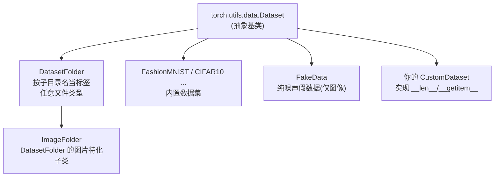
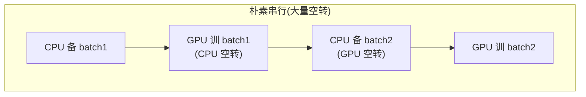
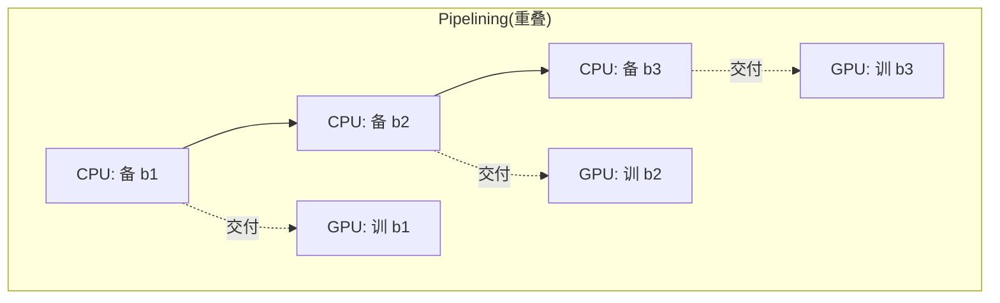

# 🎬 第 04 章 · 用 PyTorch 管理数据：Dataset 与 DataLoader（Using Data with PyTorch）

> 本章对应原书 *AI and ML for Coders in PyTorch*（Laurence Moroney 著）第 4 章 "Using Data with PyTorch"，PDF 第 103–116 页。

## 🗺️ 本章地图（读完能会什么）

- 看清 PyTorch 的**数据三件套定位**：`torchvision / torchtext / torchaudio` 提供现成数据集，全都继承自 `torch.utils.data.Dataset` 这一个抽象基类。
- 会**从零写一个自定义 `Dataset`**：只需实现 `__len__` 和 `__getitem__` 两个方法，就能把任何数据（合成数据、CSV、图片、文本）接入 PyTorch 生态。
- 掌握**通用数据集类** `ImageFolder / DatasetFolder / FakeData`，以及用 `random_split` 做自定义训练/验证/测试划分。
- 理解机器学习数据管线的核心范式 **ETL（Extract-Transform-Load，抽取-转换-加载）**，以及为什么 Load 阶段的**流水线并行（pipelining）**能救回被浪费的 GPU 时间。
- 吃透 `DataLoader` 的四大能力：**批处理（batching）、打乱（shuffling）、并行加载（num_workers）、自定义采样（Sampler）**，并知道它们怎么直通到 LLM 训练的数据管线。

> 💡 **一句话本质**：前三章你是"喂什么数据用什么代码"，本章开始你学的是**一套统一的数据接口**——不管数据是 60000 条内存里的图片，还是几个 T 分布在多机上的文本，`Dataset` 负责"一条一条怎么取"，`DataLoader` 负责"成批、打乱、并行地喂给模型"，训练循环一行都不用改。

---

## 📦 从 Datasets 说起：一个抽象基类统治一切

前三章里，你用过 API 直接下发的 Fashion MNIST，也用过要自己下载解压的 "Horses or Humans"、"Dogs vs. Cats" ZIP 包。原书一上来就点破：获取数据的方式五花八门，但很多公开数据集要求你先学一堆领域专属技能，才轮得到你去想模型架构。PyTorch 的 `torch.utils.data` 命名空间就是要把这件事标准化。

> 📖 **原文（p.81）**：
> "The goal behind PyTorch domains and the tools available at the `torch.utils.data.Datasets` namespace is to expose datasets in a way that's easy to consume, where all the preprocessing steps of acquiring the data and getting it into PyTorch-friendly APIs are done for you."
>
> 译：PyTorch 的各领域库与 `torch.utils.data.Datasets` 命名空间的目标，是以一种便于消费的方式暴露数据集——获取数据、把它转成 PyTorch 友好 API 的所有预处理步骤，都已经替你做好了。

PyTorch 按数据类型把现成数据集分到三个库：

| 领域 | 库 | 覆盖任务举例 | 备注 |
| --- | --- | --- | --- |
| 视觉 Vision | `torchvision` | 图像分类、检测、分割、光流、立体匹配、图像配对、视频分类/预测… | Fashion MNIST 属于"Image Classification"内置数据集 |
| 文本 Text | `torchtext` | 文本分类、语言建模、机器翻译、序列标注、问答、无监督学习 | 不止有数据集，还带一堆文本处理 helper 函数 |
| 音频 Audio | `torchaudio` | 语音/声音相关的机器学习场景 | 详见 PyTorch 官方文档 |

> 📖 **原文（p.82）**："All datasets are subclasses of `torch.utils.data.Dataset`, so it's important to take a look at this library and understand it well."
> 译：所有数据集都是 `torch.utils.data.Dataset` 的子类，所以务必好好理解这个库。

这句是本章的"元知识"：**只要一个类继承了 `Dataset` 并实现了那两个方法，它就能无缝接入后面所有的 `transform / random_split / DataLoader` 生态**。理解了基类，你既能消费别人的数据集，也能造自己的分享出去。

---

## 🧱 自己动手写一个 Dataset：只需两个方法

`torch.utils.data.Dataset` 是一个抽象类。要自定义数据集，你只需子类化它并实现两个方法：

- `__len__(self)`：返回数据集里样本的总数。
- `__getitem__(self, index)`：返回指定索引处的**单个**样本（这个样本会在送进模型前被 transform 处理）。

原书给的最小骨架：

```python
from torch.utils.data import Dataset

class CustomDataset(Dataset):
    def __init__(self, data, transforms=None):
        self.data = data              # 底层数据放在一个数组里
        self.transforms = transforms  # 可选的变换（和内置数据集一致的口子）

    def __len__(self):
        return len(self.data)         # 告诉 DataLoader 一共有多少条

    def __getitem__(self, idx):
        sample = self.data[idx]       # 取第 idx 条
        if self.transforms:
            sample = self.transforms(sample)  # 如果有 transform，就地应用
        return sample
```

> 💡 **第一性原理**：为什么是这两个方法？因为 `DataLoader` 内部就是这么工作的——它先问 `len(dataset)` 知道边界，然后不停地调 `dataset[i]` 一条条取样本，再帮你攒成一批。你只要回答"总共多少条"和"第 i 条长什么样"，剩下的批处理/打乱/并行 PyTorch 全包了。这就是**关注点分离**：`Dataset` 只管"单条怎么取"，`DataLoader` 只管"怎么组织地喂"。

### 一个能跑的例子：把 y = 2x − 1 的合成数据接进来

回到第 1 章那种线性关系，先造合成数据：

```python
import torch
from torch.utils.data import Dataset, DataLoader

# 生成合成数据
torch.manual_seed(0)                       # 固定随机种子，保证可复现
x = torch.arange(0, 100, dtype=torch.float32)   # shape: (100,)
y = 2 * x - 1                              # 线性关系 y = 2x - 1，shape: (100,)
```

然后包成一个 `Dataset`：

```python
class CustomDataset(Dataset):
    def __init__(self, x, y):
        """用 x（输入特征）和 y（输出标签）初始化数据集。"""
        self.x = x
        self.y = y

    def __len__(self):
        """返回样本总数。"""
        return len(self.x)

    def __getitem__(self, idx):
        """取第 idx 条：返回 (特征, 标签) 二元组。"""
        return self.x[idx], self.y[idx]
```

用起来只有三步：**建实例 → 丢进 DataLoader → enumerate 遍历**：

```python
# 1. 建实例
dataset = CustomDataset(x, y)

# 2. 用 DataLoader 处理批处理与打乱
data_loader = DataLoader(dataset, batch_size=10, shuffle=True)

# 3. 遍历
for batch_idx, (inputs, labels) in enumerate(data_loader):
    print(f"Batch {batch_idx+1}")
    print("Inputs:", inputs)   # shape: (10,) —— 一批 10 个 x
    print("Labels:", labels)   # shape: (10,) —— 对应的 10 个 y
    if batch_idx == 0:
        break                  # 演示用，只看第一批
```

有了这个地基，后面所有库里的数据集类（都是这个基类的扩展），API 长得都眼熟。

> ⚠️ **踩坑**：`__getitem__` 里**每次只返回一条**，不要在里面手动 for 循环拼 batch。批处理是 `DataLoader` 的活儿。另外 `__getitem__` 应该尽量轻——重活（比如读大图、复杂解码）会在并行 worker 里被反复调用，写重了就成了训练瓶颈。

---

## 👗 回看 FashionMNIST 类：train 参数怎么切数据

第 2 章你已经用过 `FashionMNIST`。它提供 Fashion-MNIST 数据集：**训练集 60000 张、测试集 10000 张，10 类服饰，每张 28×28 灰度图**。

关键点：**训练数据和测试数据用的是同一个类**，靠 `train` 参数区分：

```python
from torchvision import datasets

# train=True → 拿到 60000 条训练数据
fashion_mnist_train = datasets.FashionMNIST(
    root='./data',      # 数据落盘的位置
    train=True,         # True 训练集 / False 测试集
    download=True,      # 本地没有就下载
    transform=transform # 和基类一样的可选 transform 口子
)
```

> 📖 **原文（p.83）**："When you set `train=True`, the code that overrides the class init method will take the 60,000 records and return them to the caller."
> 译：当你设 `train=True`，重写过的类初始化方法会取那 60000 条记录返回给调用方。

注意 `transform=` 这个参数——**它对所有数据集都可用**，正是继承自前面那个基类的设计。为什么它出现在计算机视觉库里？因为 Fashion MNIST 是视觉数据，放在 `torchvision` 里天经地义。

---

## 🗂️ 通用数据集类：当数据不在现成清单里

有时你的数据不在 `FashionMNIST` 这类现成数据集里，但你又想吃到整个生态的红利（transform、split、后面 DataLoader 的所有好东西）。`torch.utils.data` 为此提供了几个**通用数据集类**。



### ImageFolder：目录名即标签

第 3 章的 "Horses or Humans"、"Rock, Paper, Scissors"、"Cats vs. Dogs" 不以类的形式提供，而是 ZIP 包里的一堆图片。当你解压后把不同类别放进不同子目录（如 `Horses/` 一个文件夹、`Humans/` 一个文件夹），`ImageFolder` 就能直接当数据集用：图片按 DataLoader 的 batch size 从目录里流式读出，**标签由目录名推导，类索引按字母序分配**。

> ⚠️ **踩坑（原书重点强调）**：类索引按**字母序**排！我们习惯说 "Rock, Paper, Scissors"，会以为它们是 0、1、2。但按字母序：**Paper=0、Rock=1、Scissors=2**！调试模型时如果忽略这个顺序，很容易对错标签、百思不得其解。

想强行指定顺序，用自定义索引：

```python
from torchvision.datasets import ImageFolder

# 自定义"类名 → 索引"映射
custom_class_to_idx = {'rabbit': 0, 'dog': 1, 'cat': 2}

dataset = ImageFolder(
    root='data/animals',
    target_transform=lambda x: custom_class_to_idx[dataset.classes[x]]
)
dataset.class_to_idx = custom_class_to_idx
print(dataset.class_to_idx)   # 确认映射生效
```

### DatasetFolder：不止图片，任意文件都行

`ImageFolder` 其实是更通用的 `DatasetFolder` 的图片特化子类。`DatasetFolder` 不限于图像，可以用于任何东西，同样用**目录当标签**。比如你有一堆文本文件，目录结构如下：

```text
root/sarcasm/document1.txt
root/sarcasm/document2.txt
root/sarcasm/document3.txt
root/factual/factdoc1.rtf
root/factual/factdoc2.doc
```

你就能用 `DatasetFolder` 按正确标签（`sarcasm` / `factual`）流式读取文档。而且因为它是基于文档的，你可以用 transform 从文件里**抽取内容**。

### FakeData：没数据也能先跑架构 / 压测系统

`FakeData` 顾名思义提供假数据（写作时仅支持假图像）。它超级适合两种场景：**手头没数据但想先试不同架构**，或者**给系统做基准测试（benchmark）**。

```python
import torch
from torchvision.datasets import FakeData
import torchvision.transforms as transforms
from torch.utils.data import DataLoader

# 定义变换
transform = transforms.Compose([
    transforms.ToTensor(),
    transforms.Normalize((0.5,), (0.5,))
])

# 造 100 张 MobileNet 尺寸(224×224 彩色)的假图，分布在 10 个类
fake_dataset = FakeData(
    size=100,
    image_size=(3, 224, 224),   # (通道, 高, 宽)
    num_classes=10,
    transform=transform
)

data_loader = DataLoader(fake_dataset, batch_size=10, shuffle=True)
```

这会造出 100 张纯噪声图（尺寸 3×224×224，正好喂 MobileNet），横跨 10 类，然后像其他任何数据集一样丢进 DataLoader。虽然 `FakeData` 只给图像，但你完全可以照前面的 `CustomDataset` 思路，自己造数值型或序列型的假数据。

> 💡 **实战/面试高频**：新架构上手第一步不是找数据，而是用 `FakeData` 或随机张量**先把 shape 跑通**——确认前向不报错、loss 能反传、显存放得下。这一步能在数据管线还没就绪时就把架构 bug 抓出来，是工业界的标准热身动作。

---

## ✂️ 自定义切分：random_split 造出你自己的验证集

到目前为止，你用的数据都是别人预先切好的（Fashion MNIST 就是 60000 训练 + 10000 测试）。但如果你想按自己的需要切呢？

先把 `train` 参数**忽略掉**，就能拿到全部数据：

```python
# 不传 train，拿到整个 Fashion-MNIST（训练+测试全给你）
dataset = datasets.FashionMNIST(root='./data', download=True, transform=transform)
```

然后用 `torch.utils.data.random_split`。下面把数据切成 **70% 训练 / 15% 验证 / 15% 测试**：

```python
from torch.utils.data import random_split

total_count = len(dataset)
train_count = int(0.7 * total_count)
val_count   = int(0.15 * total_count)

# 用总数减掉前两份，确保所有数据都被用上、不浪费
test_count  = total_count - train_count - val_count

train_dataset, val_dataset, test_dataset = random_split(
    dataset, [train_count, val_count, test_count]
)
```

> 📖 **原文（p.87）**："When making calculations like this, you may end up with rounding errors that leave some records out—so instead of using 15% for the test count, you can just set the quotient for training to be the total minus the training and validation records."
> 译：这样算百分比可能因取整误差漏掉几条记录——所以与其把测试集也算 15%，不如让最后一份 = 总数 − 训练 − 验证，保证一条不落。

这个 `test_count = total - train - val` 的写法是个务实小技巧：三份 `int(0.x * total)` 相加往往不等于 total，最后一份**兜底吃掉余数**。

**为什么值得多切几种划分？** 如果某一种切法训得准、另一种却训得差，说明模型很可能在某个切片上**过拟合**、架构有隐患；反过来，多种切法结果都一致，就是"架构靠谱"的信号。原书强烈建议训练时用自定义切分来提前发现坑。

> ⚠️ **踩坑（原书澄清）**：`random_split` 里的 "random" **不等于打乱数据本身**！它只是在随机的切点上把数据集切成几片，给你不同的切片。**真正的逐 batch 打乱要靠 DataLoader 的 `shuffle=True`**。这俩别混。

---

## 🔄 ML 数据管理的核心范式：ETL

Extract-Transform-Load（抽取-转换-加载）是训练 ML 模型的核心模式，**不分规模**——本书讲的是单机小规模，但同一套技术能扩到多机大数据集的大规模训练。

> 📖 **原文（p.88）**："Extract, Transfer, Load (ETL) is the core pattern for training ML models, regardless of scale."
> 译：ETL 是训练 ML 模型的核心模式，与规模无关。

| 阶段 | 干什么 | 典型操作 | 通常跑在哪 |
| --- | --- | --- | --- |
| **Extract 抽取** | 从存储处把原始数据加载出来，准备好待转换 | 下载、解压、逐条读盘、`ImageFolder(root=...)` 定位文件 | CPU |
| **Transform 转换** | 把数据加工成适合/更利于训练的形态 | 批处理、图像增强、映射到特征列、`transforms.Compose([...])` | CPU |
| **Load 加载** | 把数据送进神经网络训练 | `DataLoader` 逐批产出、`.to("cuda")` 上加速器、跑训练循环 | GPU/TPU |

第 3 章训练 "Horses or Humans" 的这段代码，就是 **ETL 的代码化身**：

```python
import torchvision.transforms as transforms
from torchvision import datasets
from torch.utils.data import DataLoader

# ===== Transform 的"T"：先把变换定义好 =====
train_transform = transforms.Compose([
    transforms.Resize((150, 150)),
    transforms.RandomHorizontalFlip(),
    transforms.RandomRotation(20),
    transforms.RandomAffine(
        degrees=0,               # 不额外旋转
        translate=(0.2, 0.2),    # 最多平移 20%
        scale=(0.8, 1.2),        # 缩放 ±20%
        shear=20,                # 错切最多 20 度
    ),
    transforms.ToTensor(),
    transforms.Normalize(mean=[0.5, 0.5, 0.5], std=[0.5, 0.5, 0.5]),
])

# ===== Extract：ImageFolder 从磁盘定位并抽取数据；抽取时套上上面的 transform =====
train_dataset = datasets.ImageFolder(root=training_dir,   transform=train_transform)
val_dataset   = datasets.ImageFolder(root=validation_dir, transform=train_transform)

# ===== Load：DataLoader 负责加载（真正读数据要等训练循环去拉才发生）=====
train_loader = DataLoader(train_dataset, batch_size=32, shuffle=True)
val_loader   = DataLoader(val_dataset,   batch_size=32, shuffle=True)
```

> 💡 **一句话本质**：定义 transform 是"T"；`ImageFolder` 干"E"（从磁盘 at-rest 抽取，边抽边套 transform）；`DataLoader` 干"L"。但**真正的加载是惰性的**——直到训练循环 `for x, y in loader:` 去拉，数据才被读出来。

ETL 的最大好处是**让数据管线不受数据/schema 变化的冲击**：不管数据小到能进内存，还是大到单机装不下，抽取的底层结构一致、transform 的 API 一致、加载过程也一致，与你的训练后端无关。这就是"一套代码，任意规模"。

---

## 🚀 优化 Load 阶段：流水线（pipelining）救回浪费的 GPU

Extract 和 Transform（下载、解压、逐条处理）不是 GPU/TPU 擅长的活，通常就在 CPU 上跑；而训练（Load 之后的前向/反向）在 GPU/TPU 上收益巨大。所以理想分工是：**Extract + Transform 在 CPU，Load（训练）在 GPU/TPU**。这也是你一直看到的 `.to(device)` / `.to("cuda")` 只用在训练/推理、不用在抽取转换上的原因——在抽取转换上用 GPU 是浪费。

**朴素做法的问题（原书 Figure 4-1）**：大数据集要分批准备。第一批在 CPU 上准备时，GPU 干等着；批准备好送去 GPU 训练，这时 CPU 又干等着……**两边轮流空转，全是 idle time**。



**流水线做法（原书 Figure 4-2，pipelining）**：让准备和训练**并排同时进行**。GPU 训第 n−1 批的**同时**，CPU 已经在备第 n 批。



> 📖 **原文（p.90）**："The logical solution is to do the work in parallel, preparing and training side by side. This process is called pipelining."
> 译：合理的解法是并行地干活——准备与训练并排进行。这个过程叫流水线（pipelining）。

现实里训 batch n−1 和备 batch n 的耗时不会正好相等：训练更快 → GPU 有空档；训练更慢 → CPU 有空档。**选对 batch size** 能帮你调优，而 GPU/TPU 时间更贵，所以要尽量压低它的 idle。原书点破：**这正是即便 MNIST 这种小例子也要用 batching 的原因之一**——流水线模型就位后，不管数据多大都用一致的 ETL 模式。

---

## 🎛️ DataLoader 的四大能力

`DataLoader` 前面见过很多次，这里深入看它给你的四项能力。

### 1. Batching（批处理）

直觉上前向传播可能一次处理一条，但像 SGD（随机梯度下降）这类优化器**成批喂效果好得多**（梯度估计更准）。在用固定显存的 GPU 时，批处理还能加速——**让一个 batch 恰好塞满显存**最高效。用 DataLoader，batching 只是设一个 `batch_size` 参数的事。

### 2. Shuffling（打乱）

打乱在批处理时尤其重要。设想 Fashion MNIST 10 类各 6000 条、**没打乱**，你每批取 1000 条：第一批全是 class 0、第二批全是 class 1……**每批都偏向某一个标签**，模型学不好。打乱后第一批就有各种标签混着，泛化能力才上得来。

> 📖 **原文（p.91）**："the model may not effectively learn because each batch is biased toward a particular label—but the ability of your model to generalize will improve if the batches are shuffled."
> 译：模型可能学不好，因为每批都偏向某个特定标签——但若各批被打乱，模型的泛化能力会提升。

### 3. Parallel Data Loading（并行加载）

复杂数据的加载往往很慢。`DataLoader` 通过 Python 的 **multiprocessing** 提供并行，能显著加速。核心思路还是那句：把**数据加载/转换**和**模型学习**当成两个独立进程——既别让模型没数据干等，也别让内存堆满数据而模型够不着。调好并行加载能两头兼顾（下一节详讲 `num_workers`）。

### 4. Custom Data Sampling（自定义采样）

除了打乱这种随机采样，你还能自定义采样，指定数据被加载的方式。`torch.utils.data.Sampler` 提供了可继承的基类。原书说这超出本书范围，但网上有大量优秀示例。

> 💡 **实战/面试高频**：类别不均衡（比如欺诈检测正负样本 1:1000）时，常用 `WeightedRandomSampler` 给少数类更高抽样权重，或用 `DistributedSampler` 做多卡训练时保证每张卡拿到不重叠的分片——这两个都是 `Sampler` 的实战子类。注意：**指定了 `sampler` 就不能再传 `shuffle=True`**（互斥）。

| 能力 | DataLoader 参数 | 解决的问题 |
| --- | --- | --- |
| Batching | `batch_size=N` | 梯度估计更准、塞满显存更高效 |
| Shuffling | `shuffle=True` | 避免每批偏向单一标签，提升泛化 |
| 并行加载 | `num_workers=N` | 多进程备数据，别让 GPU 干等 |
| 自定义采样 | `sampler=...` | 不均衡采样、分布式分片等 |

---

## ⚡ 并行化 ETL 提升训练性能：num_workers 实战

用 `DataLoader` 做并行，只需一个 `num_workers` 参数。以 CIFAR10 为例分步走。

**第一步：Extract + Transform**

```python
import torchvision.transforms as transforms
from torchvision.datasets import CIFAR10

# 定义变换：转张量 + 归一化到 [-1, 1]
transform = transforms.Compose([
    transforms.ToTensor(),
    transforms.Normalize((0.5, 0.5, 0.5), (0.5, 0.5, 0.5))
])

# 加载 CIFAR10（5万张 32×32 彩色训练图，10 类）
dataset = CIFAR10(root='./data', train=True, download=True, transform=transform)
```

**第二步：配置 DataLoader 完成 Load**

```python
from torch.utils.data import DataLoader

# num_workers=4 → 起 4 个子进程并行加载数据
data_loader = DataLoader(
    dataset, batch_size=64, shuffle=True, num_workers=4
)
```

> 📖 **原文（p.92）**："Note the `num_workers=4` parameter, which will create four subprocesses to load the data in parallel simultaneously."
> 译：注意 `num_workers=4`，它会创建 4 个子进程同时并行加载数据。

具体开几个 worker 要看你的硬件、核数、CPU 速度，**多试几个值找瓶颈**。最妙的是：ETL 被整洁地封装了，**开不开并行、训练循环一行都不用改**。

**第三步：训练循环（丝毫不受并行影响）**

```python
import torch

# Dummy 模型：把 3×32×32 拉平成 3072 维 → 500 → 10 类
model = torch.nn.Sequential(
    torch.nn.Linear(3 * 32 * 32, 500),
    torch.nn.ReLU(),
    torch.nn.Linear(500, 10)
)
optimizer = torch.optim.Adam(model.parameters(), lr=0.001)
criterion = torch.nn.CrossEntropyLoss()

def train(model, data_loader):
    model.train()
    for batch_idx, (inputs, targets) in enumerate(data_loader):
        # inputs 形状 (64, 3, 32, 32)，拉平成 (64, 3072) 喂全连接
        inputs = inputs.view(inputs.size(0), -1)

        outputs = model(inputs)              # (64, 10)
        loss = criterion(outputs, targets)   # 交叉熵

        optimizer.zero_grad()                # 清梯度
        loss.backward()                      # 反传
        optimizer.step()                     # 更新权重

        if batch_idx % 100 == 0:
            print(f"Train Epoch: {batch_idx} Loss: {loss.item()}")

train(model, data_loader)
```

原书末尾提醒：**别想当然地把训练慢归咎于网络架构**——很多时间其实是被前向传播"等新数据"浪费掉的！加上这种并行，你可能大幅提速。

---

## 🔬 关键代码拆解：一次迭代里张量形状怎么流动

挑本章最核心的一段——CIFAR10 训练循环里一个 batch 的形状变换，逐层看清：

```python
for batch_idx, (inputs, targets) in enumerate(data_loader):
    #  DataLoader 帮你把 64 个 dataset[i] 的 (图, 标签) 自动 collate 成一批：
    #  inputs : (64, 3, 32, 32)  —— (batch, 通道, 高, 宽)
    #  targets: (64,)            —— 64 个整数类标签(0~9)

    inputs = inputs.view(inputs.size(0), -1)
    #  inputs.size(0) = 64 保持 batch 维不动；-1 让 PyTorch 自动算 3*32*32=3072
    #  → inputs 变成 (64, 3072)，因为全连接 Linear(3072, 500) 只吃二维 (batch, 特征)

    outputs = model(inputs)
    #  (64, 3072) → Linear → (64, 500) → ReLU → (64, 500) → Linear → (64, 10)
    #  outputs: (64, 10)，每行是该样本对 10 类的 logits(未归一化分数)

    loss = criterion(outputs, targets)
    #  CrossEntropyLoss 内部自带 log_softmax：直接吃 logits (64,10) 和整数标签 (64,)
    #  ⚠️ 所以模型最后一层不要自己再加 Softmax，否则等于做了两次！
    #  返回标量 loss

    optimizer.zero_grad()   # 把上一步残留的 .grad 清零(PyTorch 梯度默认累加)
    loss.backward()         # 自动微分：从 loss 反向填好每个参数的 .grad
    optimizer.step()        # Adam 按 .grad 更新每个参数
```

三个必须记牢的形状要点：

1. **DataLoader 的 collate**：`Dataset.__getitem__` 每次返回一条 `(3,32,32)` 的图，`DataLoader` 自动在最前面加一维堆成 `(64,3,32,32)`。你不用手写堆叠。
2. **`view(inputs.size(0), -1)` 的拉平**：卷积/图像张量是四维，全连接层要二维。`-1` 让框架自动算出 `3*32*32=3072`，保留 batch 维。这是"Flatten 后 (batch, 特征)"的经典动作。
3. **`zero_grad → backward → step` 三连**：PyTorch 梯度**默认累加**，不清零会把上一 batch 的梯度混进来，这是新手最常见的静默 bug。

---

## 🌍 社区案例与延伸

1. **torchvision 官方数据集与 transforms 文档**——本章所有 `FashionMNIST / ImageFolder / FakeData / CIFAR10 / transforms` 的权威出处，v2 transforms 已成主推。参见官方文档 <https://pytorch.org/vision/stable/datasets.html> 与 <https://pytorch.org/vision/stable/transforms.html>。
2. **PyTorch 官方数据教程 "Datasets & DataLoaders"**——用 FashionMNIST 从零讲 `Dataset`/`DataLoader`，和本章一一对应，是最好的动手补充：<https://pytorch.org/tutorials/beginner/basics/data_tutorial.html>。
3. **NVIDIA DALI（Data Loading Library）**——本章"CPU 备数据成为瓶颈"的工业级答案。当 `num_workers` 的 Python 多进程 + JPEG 解码 + 增强扛不住高端 GPU 时，DALI 把整条数据管线（含解码、增强）搬到 GPU，正是本章 pipelining 思想的极致化。GitHub：<https://github.com/NVIDIA/DALI>。
4. **WebDataset**——面对"大到单机装不下"的数据（本章反复强调的规模无关性），它用 tar 分片 + 顺序流式读取，把 `Dataset` 抽象扩展到云存储上的海量样本，广泛用于大规模视觉/多模态训练：<https://github.com/webdataset/webdataset>。

---

## 🔗 通向 LLM

本章的每个概念在现代 LLM 训练里都有直接对应，而且是**训练效率的命门**：

- **`Dataset` 抽象 → LLM 的数据集流式化**。LLM 预训练动辄几个 T token，不可能进内存。HuggingFace `datasets` 的 `load_dataset(..., streaming=True)` 返回的 `IterableDataset`，正是本章"抽取结构与规模无关"思想的放大版——一条 `__iter__` 逐样本产出，边下载边喂。
- **`__getitem__` 返回单条 → LLM 的样本 = 一段 token 序列**。文本经 BPE/tokenizer 编码成 `input_ids`，`__getitem__` 返回一个定长/变长的 token 张量。参见第 05 章 [[05_自然语言处理入门：把语言编码成数字]] 讲的"把语言编码成数字"。
- **`collate_fn` → LLM 的动态 padding**。文本长度不一，不能像图片那样直接堆叠。LLM 训练用自定义 `collate_fn`（如 `DataCollatorForLanguageModeling`）把一批不等长序列 **pad 到本 batch 最长**，并生成 attention mask——这就是本章"DataLoader 帮你 collate 成批"在 NLP 里的进化形态。
- **Shuffling → LLM 的数据混合与去偏**。本章"每批别偏向单一标签"，在 LLM 里升级为**跨数据源打乱**（网页/代码/书籍按比例混合、全局 shuffle），避免模型一段时间只见某一域数据。
- **`num_workers` / pipelining → LLM 的数据管线永不让 GPU 挨饿**。千卡训练里 GPU 极贵，本章"别让前向等数据"被推到极致：多进程/多线程预取（prefetch）、`pin_memory=True` 加速主机到显存拷贝、`DistributedSampler` 给每张卡切不重叠分片。GPU 利用率（MFU）掉下来，第一个要查的往往就是数据管线。
- **Batching → LLM 的 global batch size**。本章"塞满显存最高效"在 LLM 里变成 `micro_batch × grad_accumulation × 数据并行度 = global batch size` 的精细权衡，直接影响收敛与吞吐。

一句话：**本章你搭的是"数据怎么高效流进模型"的骨架，LLM 训练只是把同一套 ETL + DataLoader 骨架放大到 T 级 token 和千卡集群。** 微调 LLM 时（见第 16 章 [[16_用自定义数据微调与提示微调LLM]]）你写的第一段代码，往往就是一个继承自 `Dataset` 的类。

---

## ⚠️ 常见坑

1. **`ImageFolder` 类索引按字母序**：以为 "Rock/Paper/Scissors" 是 0/1/2，实际是 Paper=0、Rock=1、Scissors=2。上线前一定 `print(dataset.class_to_idx)` 核对。
2. **`random_split` 不打乱数据**：它只在随机切点切片。要逐 batch 打乱必须靠 `DataLoader(shuffle=True)`。两者别混。
3. **切分取整误差漏数据**：三份 `int(0.x*total)` 相加常不等于 total。用 `test = total - train - val` 兜底吃余数。
4. **梯度不清零**：PyTorch 梯度默认累加，忘了 `optimizer.zero_grad()` 会把上批梯度混进来，loss 表现诡异且难查。
5. **Windows 上 `num_workers>0` 报错**：多进程 DataLoader 在 Windows/Notebook 里必须把训练代码放进 `if __name__ == '__main__':` 保护块，否则子进程会递归导入报错。此外 worker 开太多反而因进程通信开销变慢，需实测调参。

---

## 🎯 面试速答

- **问：自定义 Dataset 必须实现哪几个方法？**
  答：`__len__`（返回样本总数）和 `__getitem__`（按索引返回单条样本）；`DataLoader` 靠这两个方法做批处理、打乱和并行加载。

- **问：Dataset 和 DataLoader 分别负责什么？**
  答：`Dataset` 管"单条样本怎么取"，`DataLoader` 管"怎么成批、打乱、并行地喂给模型"——关注点分离，换 batch size 或开并行时训练循环不用改。

- **问：`num_workers` 有什么用，越大越好吗？**
  答：起多个子进程并行预备数据、避免 GPU 等数据空转；不是越大越好，受 CPU 核数/IO/进程通信开销影响，要实测找最优，且 Windows 需放在 `__main__` 保护块里。

- **问：为什么训练要打乱数据（shuffle）？**
  答：不打乱时每个 batch 可能偏向单一类别，梯度有偏、模型学不好泛化差；`shuffle=True` 让每批标签混合，梯度估计更无偏。

- **问：ML 数据管线的 ETL 是什么，为什么 Load 常成瓶颈？**
  答：Extract（从存储抽取）、Transform（增强/归一化等加工）、Load（喂进网络训练）；E/T 在 CPU、L 在 GPU，若串行则两边轮流空转，用流水线（pipelining）+ `num_workers` 让备数据与训练重叠，才能不让昂贵的 GPU 挨饿。

---

## 📌 本章小结

1. **一个基类统治一切**：`torchvision/torchtext/torchaudio` 里所有数据集都是 `torch.utils.data.Dataset` 的子类，自定义只需实现 `__len__` + `__getitem__`。
2. **通用类覆盖常见形态**：`ImageFolder`（目录名当标签，注意字母序）、`DatasetFolder`（任意文件）、`FakeData`（纯噪声，用于试架构/压测），加 `random_split` 做自定义训练/验证/测试切分。
3. **ETL 是核心范式且与规模无关**：Extract/Transform 在 CPU、Load 在 GPU/TPU；同一套代码从单机小数据扩到多机大数据。
4. **pipelining 救回空转**：串行会让 CPU 和 GPU 轮流 idle，流水线让备数据与训练并排进行，`num_workers` 一键开启并行且训练循环零改动。
5. **DataLoader 四大能力**：batching / shuffling / 并行加载 / 自定义采样——这套骨架直通 LLM 的大规模数据管线。

---

## 🔗 延伸阅读 & 交叉链接

- 上一章：[[03_卷积神经网络：在图像中检测特征]]（本章 ETL 例子里的 "Horses or Humans" 就来自那章）
- 数据来源与类的起点：[[02_计算机视觉入门：FashionMNIST与神经元]]（FashionMNIST 类首次登场）
- 训练循环基础：[[01_PyTorch入门：从传统编程到学习]]（`zero_grad→backward→step` 三连的由来）
- 下一章方向：[[05_自然语言处理入门：把语言编码成数字]]（把本章数据管线套到文本，`__getitem__` 开始返回 token 序列）
- LLM 落地：[[16_用自定义数据微调与提示微调LLM]]（微调第一步常是写一个 `Dataset` 子类）、[[21_从本书基础到LLM落地实战（合流篇）]]
- 外部真实链接：
  - PyTorch 官方教程《Datasets & DataLoaders》：<https://pytorch.org/tutorials/beginner/basics/data_tutorial.html>
  - torchvision 数据集文档：<https://pytorch.org/vision/stable/datasets.html>
  - NVIDIA DALI（GPU 数据管线）：<https://github.com/NVIDIA/DALI>
  - WebDataset（大规模流式数据）：<https://github.com/webdataset/webdataset>
