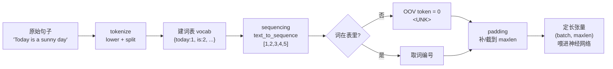

# 🎬 第 5 章 · 自然语言处理入门：把语言编码成数字（Introduction to Natural Language Processing）

> 本章对应原书 *AI and ML for Coders in PyTorch*（Laurence Moroney 著）第 5 章 "Introduction to Natural Language Processing"，PDF 第 117–136 页。

## 🗺️ 本章地图（读完能会什么）

- 建立**核心直觉**：计算机只认数字，所以处理语言的第一步永远是「把文本变成数字」（encoding）。理解为什么按字母编码不行、按词编码（token）才行。
- 会用 **两条路线做 tokenization**：手写一个极简 tokenizer（`split()` + 词表字典），以及用 Hugging Face `transformers` 的 `BertTokenizerFast` 拿到工业级预训练分词器。
- 掌握把句子变成模型能吃的定长数字数组的**完整流水线**：tokenize → 建词表(vocab) → sequencing（句子→数字序列）→ OOV 未登录词处理 → **padding 补齐等长**。
- 学会**文本清洗三板斧**：用 BeautifulSoup 去 HTML 标签、去停用词（stopwords）、用 `string.punctuation` 去标点，并知道每一步的坑。
- 能**处理真实数据源**：下载并解析 IMDb 影评（5 万条 pos/neg）、从 CSV 读情感数据（Twitter 情绪 3.5 万条）、从 JSON 读讽刺标题数据集（Sarcasm，2.6 万条）。
- 这一章是后面 [[06_用嵌入让情感可编程：Embeddings]]、[[07_循环神经网络RNN与LSTM做NLP]]、[[08_用机器学习生成文本]] 乃至整个 LLM 的**地基**——所有大模型都从「文本→token id」开始。

> 💡 **一句话本质**：NLP 的第一步不是"理解语言"，而是**把语言无损、可区分地压成整数序列**——token 就是语言在数字世界里的身份证号，之后所有神经网络都只在这些整数上做数学。

---

## 🔤 为什么要把语言编码成数字（Encoding Language into Numbers）

第一性原理很朴素：神经网络的输入层是张量，张量里装的是浮点数。语言是符号，符号必须先变成数字，模型才可能对它做矩阵乘法。这个过程叫 **encoding（编码）**。

那按什么粒度编码？书里先否决了**按字母编码**这个最自然的想法。

> 原文（p. 95–96）：
> *"For example, consider the word listen. You can encode it with ASCII into the numbers 76, 73, 83, 84, 69, and 78. ... But then consider the word silent, which is an anagram of listen. The same numbers represent that word, albeit in a different order, which might make building a model to understand the text much more difficult."*
>
> 翻译：比如单词 listen，用 ASCII 可以编成 76, 73, 83, 84, 69, 78。但再看 silent——它是 listen 的字母重排（anagram）。同一组数字换个顺序就代表了另一个词，这会让"理解文本"的模型难做得多。

字母级编码的问题：`listen` 和 `silent` 语义天差地别，字符集合却完全相同。让模型从"同一堆数字的排列"里区分语义，负担极重。

所以更好的办法是**按整词编码**：给每个词一个独立的整数。

```python
# 直觉演示：按词编码，语义相近的句子在数字上也相近
# "I love my dog"  -> [1, 2, 3, 4]
# "I love my cat"  -> [1, 2, 3, 5]
# 前三个 token 完全一样，只有最后一个词不同 —— 数字层面就"看着像"，
# 这正是我们想要的：相似的句子，相似的编码。
```

> 原文（p. 96）：*"The numbers representing words are also called tokens, and as a result, this process is called tokenization."*
> 翻译：代表词的这些数字被称为 **token**，因此这个过程就叫 **tokenization（分词/词元化）**。

| 编码粒度 | 例子 | 优点 | 致命问题 |
|---|---|---|---|
| 字符级（ASCII/Unicode） | listen→76,73,... | 无未登录词，词表极小 | anagram 冲突、序列超长、语义弱 |
| **词级（token）** | listen→y, silent→x | 语义可分、序列短、直观 | 词表巨大、有 OOV 未登录词 |
| 子词级（BPE/WordPiece） | playing→play+##ing | 平衡词表大小与 OOV | 需训练，稍复杂 |

子词级是现代 LLM 的实际选择，本章末的「通向 LLM」会展开。

---

## 🧩 tokenization 入门（Getting Started with Tokenization）

### 路线一：手写一个极简 tokenizer

原书特别提醒：PyTorch 生态里常见的 `torchtext` **自 2023 年起已被弃用（deprecated）**，PyTorch 版本在往前走它却不动，容易踩兼容坑。所以书里选择自己写、或用 Hugging Face 的、甚至（意外地）借用 Keras 生态的。

> 原文（p. 96）：*"A common tokenizer you might see in code samples is torchtext, but this has been deprecated since 2023."*
> 翻译：你在代码样例里常见的分词器是 torchtext，但它自 2023 年起已被弃用。

下面是把两句话的小语料（corpus，即"训练用的整体文本"）变成 token 的自定义实现：

```python
import torch

sentences = [
    'Today is a sunny day',
    'Today is a rainy day'
]

# 分词函数：转小写 + 按空格切
def tokenize(text):
    return text.lower().split()

# 构建词表：每见到一个新词，就给它一个从 1 开始递增的整数
def build_vocab(sentences):
    vocab = {}
    for sentence in sentences:
        tokens = tokenize(sentence)
        for token in tokens:
            if token not in vocab:
                vocab[token] = len(vocab) + 1  # 索引从 1 起（0 留给 padding/未知）
    return vocab

vocab = build_vocab(sentences)
print("Vocabulary Index:", vocab)
# 输出：{'today': 1, 'is': 2, 'a': 3, 'sunny': 4, 'day': 5, 'rainy': 6}
```

第一句 "Today is a sunny day" 产出 5 个 token；第二句大部分词重复，只有 `rainy` 是新词，成了第 6 个 token。简单直观，但对超大语料会很慢，而且词表质量取决于你的语料覆盖面。

> ⚠️ **踩坑**：`len(vocab) + 1` 让索引从 1 起，是**故意把 0 空出来**给 padding 和未登录词（OOV）。如果你从 0 开始编号，padding 的 0 就会和某个真实词撞车，模型分不清"这是补位"还是"这是某个词"。

### 路线二：用 Hugging Face 的预训练 tokenizer

大语料自己建词表又慢又不全。更聪明的做法是直接借用别人在数百万词上训练好的分词器。书里用 `transformers` 库的 `BertTokenizerFast`。

> 原文（p. 97）：*"the tokenizer, which is trained on many millions of words, is freely available for you to use. It has bigger coverage than one you might create, and it's free and easy to use!"*
> 翻译：这个分词器在数百万词上训练过，可免费使用，覆盖面比你自己造的大得多，而且免费又好用！

```python
# !pip install transformers
from transformers import BertTokenizerFast

sentences = [
    'Today is a sunny day',
    'Today is a rainy day'
]

# 加载与 BERT 模型配套的预训练分词器（30000 词的词表，Google 训练）
tokenizer = BertTokenizerFast.from_pretrained('bert-base-uncased')

# 一次性完成：分词 + 编码 + padding + 截断，返回 PyTorch 张量
encoded_inputs = tokenizer(sentences, padding=True, truncation=True,
                           return_tensors='pt')

# 把 id 反查回可读 token（方便理解）
tokens = [tokenizer.convert_ids_to_tokens(ids)
          for ids in encoded_inputs["input_ids"]]

word_index = tokenizer.get_vocab()  # 类似 Keras 的 word_index

print("Tokens:", tokens)
print("Token IDs:", encoded_inputs['input_ids'])
```

输出：

```text
Tokens: [['[CLS]', 'today', 'is', 'a', 'sunny', 'day', '[SEP]'],
         ['[CLS]', 'today', 'is', 'a', 'rainy', 'day', '[SEP]']]

Token IDs: tensor([
        [  101,  2651,  2003,  1037, 11559,  2154,   102],
        [  101,  2651,  2003,  1037, 16373,  2154,   102]])
```

几个关键点：

- `return_tensors='pt'`：直接返回 `torch.Tensor`，PyTorch 开发者拿来即用（`'tf'` 会返回 TensorFlow 张量）。
- `[CLS]`（token 101，classifier）和 `[SEP]`（token 102，separator）是 BERT 训练时约定的**特殊标记**：句首放 `[CLS]`，句末/句间放 `[SEP]`。这不是你的词，是模型的"控制字符"。
- 从输出能读出：BERT 里 `today`=2651、`is`=2003、`a`=1037……这些是别人训练好的固定编号。

| 维度 | 自定义 tokenizer | Hugging Face 预训练 tokenizer |
|---|---|---|
| 覆盖面 | 只覆盖你的小语料 | 数百万词，泛化强 |
| 速度/成本 | 小数据快，大数据慢 | 加载有开销，但一劳永逸 |
| 未登录词 | 全靠你自己处理 | 子词切分自动兜底 |
| 特殊标记 | 无 | 自带 `[CLS]`/`[SEP]`/`attention_mask` |
| 适用场景 | 学习、小数据集 | 真实项目、大数据集 |

> 💡 **实战/面试高频**：`BertTokenizerFast` 的 `attention_mask` 会标出哪些位置是真实 token（1）、哪些是 padding（0）。BERT 系模型靠它在 self-attention 里**屏蔽掉补位的 0**，不让 padding 参与注意力计算。本章后面手写的 padding 没有这一层，用到真实模型时一定要配上 mask。

原书后半为了避免 BERT 的这些"额外负担（overhead）"，选择**回到自定义代码**做分词与预处理。我们下面也跟着走这条更透明的路线。

---

## 🔢 把句子转成序列（Turning Sentences into Sequences）

有了词表，就能把句子变成数字列表——这一步叫 **sequencing（序列化）**。

```python
def text_to_sequence(text, vocab):
    # 词在表里就取它的编号，不在就用 0（未知）
    return [vocab.get(token, 0) for token in tokenize(text)]

# 词表：{'today':1,'is':2,'a':3,'sunny':4,'day':5,'rainy':6}
# "Today is a sunny day" -> [1, 2, 3, 4, 5]
# "Today is a rainy day" -> [1, 2, 3, 6, 5]
```

### 未登录词与 OOV token

训练语料不可能覆盖世界上所有词。模型上线后遇到**没见过的词（out-of-vocabulary, OOV）**怎么办？书里的策略是用一个 **OOV token**（这里就是 0，也叫 `<UNK>`）兜底。

> 原文（p. 100）：*"One tool you can use to handle these situations is an out-of-vocabulary (OOV) token, which can help your neural network understand the context of the data containing previously unseen text."*
> 翻译：应对这类情况的一个工具是 OOV（未登录词）token，它能帮神经网络理解那些含有未见过文本的数据的上下文。

```python
test_data = [
    'Today is a snowy day',
    'Will it be rainy tomorrow?'
]
for test_sentence in test_data:
    print(text_to_sequence(test_sentence, vocab))
# [1, 2, 3, 0, 5]         -> "today is a <UNK> day"   （snowy 没见过）
# [0, 0, 0, 6, 0]         -> "<UNK> <UNK> <UNK> rainy <UNK>"
```

第二句几乎全是 0——说明这个语料太小、覆盖太差。OOV 太多是个信号：要么扩语料，要么换更强的子词分词器。

> ⚠️ **踩坑**：**只能用训练集建词表**，绝不能把测试集也拿去建表。否则就是数据泄漏（data leakage）——你偷看了测试集的词汇，评估出来的泛化能力是虚高的。测试集里的新词就该老老实实变成 OOV。

---

## 📏 理解 padding（Understanding Padding）

神经网络要求同一个 batch 内的输入**形状一致**。图像我们统一 resize 成同宽高；文本 tokenize 完，句子长度参差不齐，就得靠 **padding（补齐）** 把它们弄成等长。

> 原文（p. 101）：*"When training neural networks, you typically need all your data to be in the same shape. ... once you've tokenized your words and converted your sentences into sequences, they can all be different lengths. But to get them to be the same size and shape, you can use padding."*
> 翻译：训练神经网络时，通常需要所有数据形状一致。……一旦你把词分好、把句子转成序列，它们长度各不相同。要把它们弄成同样的大小和形状，就得用 padding。

先加一句很长的句子进语料，凸显长度差异：

```python
sentences = [
    'Today is a sunny day',
    'Today is a rainy day',
    'Is it sunny today?',
    'I really enjoyed walking in the snow today'
]
vocab = build_vocab(sentences)  # ⚠️ 别忘了重建词表，否则新词全是 0！
```

重建词表后 sequencing 的结果（长度 5、5、4、8 各不相同）：

```text
[1, 2, 3, 4, 5]
[1, 2, 3, 6, 5]
[2, 7, 4, 8]
[9, 10, 11, 12, 13, 14, 15, 1]
```

书里的极简 padding 函数——短的**在尾部补 0**，长的**从尾部截断**：

```python
def pad_sequences(sequences, maxlen):
    return [seq + [0] * (maxlen - len(seq)) if len(seq) < maxlen
            else seq[:maxlen] for seq in sequences]

for sentence in sentences:
    seq = text_to_sequence(sentence, vocab)
    padded_seq = pad_sequences([seq], maxlen=10)
    print(padded_seq)
# [[1, 2, 3, 4, 5, 0, 0, 0, 0, 0]]
# [[1, 2, 3, 6, 5, 0, 0, 0, 0, 0]]
# [[2, 7, 4, 8, 0, 0, 0, 0, 0, 0]]
# [[9, 10, 11, 12, 13, 14, 15, 1, 0, 0]]
```

现在每条都是长度 10。这份实现很朴素：超长直接砍尾（可能丢失关键信息），你在正经项目里往往要改造它。

> 💡 **实战/面试高频**：**post-padding（尾部补）还是 pre-padding（头部补）？** 对 RNN/LSTM，pre-padding 常更好——因为 RNN 是从左往右吃序列，最后一个时间步的隐状态影响最大，把真实词留在末尾能让模型"记得更清楚"。对本章后面要用的 embedding + 池化、或带 attention mask 的 Transformer，则差别不大。Keras 的 `pad_sequences` 默认是 pre-padding，PyTorch 里常用 `torch.nn.utils.rnn.pad_sequence`（默认 post）。

整个流水线可以画成一张图：



---

## 🧹 去停用词与文本清洗（Removing Stopwords and Cleaning Text）

真实文本很脏：HTML 标签、无意义高频词、标点、用户 ID……书里给出三板斧。

> 原文（p. 103）：*"there are three main things that you can do to clean up your text programmatically."*
> 翻译：有三件主要的事可以用程序化的方式清理文本。

### 1️⃣ 去 HTML 标签（BeautifulSoup）

影评这类网页文本里满是 `<br>` 之类标签，用 `BeautifulSoup` 一行搞定：

```python
from bs4 import BeautifulSoup
soup = BeautifulSoup(sentence, "html.parser")
sentence = soup.get_text()  # 只保留纯文本，标签被剥掉
```

### 2️⃣ 去停用词（stopwords）

`the`、`and`、`but` 这类词太常见、几乎不带语义信息，还可能同时出现在正/负样本里给模型**加噪声**。做法是准备一张停用词表，遍历时过滤掉：

```python
stopwords = ["a", "about", "above", "...", "yours", "yourself", "yourselves"]

words = sentence.split()
filtered_sentence = ""
for word in words:
    if word not in stopwords:
        filtered_sentence = filtered_sentence + word + " "
sentences.append(filtered_sentence)
```

### 3️⃣ 去标点（string.punctuation）

标点会"骗过"停用词过滤器——上面的过滤器按空格切词，`it.`（it 后紧跟句号）不等于 `it`，就漏网了。用 Python `str.maketrans` + `string.punctuation` 先清标点：

```python
import string
table = str.maketrans('', '', string.punctuation)  # 建一张"删除标点"的翻译表

words = sentence.split()
filtered_sentence = ""
for word in words:
    word = word.translate(table)      # 先去标点：'it.' -> 'it'
    if word not in stopwords:         # 再去停用词：'it' 被过滤
        filtered_sentence = filtered_sentence + word + " "
sentences.append(filtered_sentence)
```

> ⚠️ **踩坑**：去标点会把缩写搞坏——`you'll` 会变成 `youll`。如果你想过滤这类词，得把 `youll` 也加进停用词表。另外原书提醒：**做情感分析时对标点要谨慎**，`!!!`、`?` 有时恰恰承载情绪，一刀切删掉可能损失信号。

> 💡 **实战/面试高频**：现代 LLM 预训练**基本不去停用词、不删标点**。因为子词分词器 + 大模型能自己学出这些词/符号的作用，`the` 在句法里也有用。去停用词是**经典词袋/浅层模型时代**的技巧，用在小数据、浅层分类器上才划算。别把它当成"NLP 必做步骤"。

---

## 🌐 处理真实数据源（Working with Real Data Sources）

会了内存里的小句子，接下来上真实公开数据集。原书演示三种来源：**下载解压的 IMDb 文件目录、CSV、JSON**。

### 📥 下载文本数据集：IMDb 影评

IMDb 数据集：5 万条带标签影评，正/负情感各半。用标准库 `urllib` + `tarfile` 下载解压：

```python
import os, urllib.request, tarfile

def download_and_extract(url, destination):
    if not os.path.exists(destination):
        os.makedirs(destination, exist_ok=True)
    file_path = os.path.join(destination, "aclImdb_v1.tar.gz")
    if not os.path.exists(file_path):
        print("Downloading the dataset...")
        urllib.request.urlretrieve(url, file_path)
    if "aclImdb" not in os.listdir(destination):
        print("Extracting the dataset...")
        with tarfile.open(file_path, 'r:gz') as tar:
            tar.extractall(path=destination)

dataset_url = "http://ai.stanford.edu/~amaas/data/sentiment/aclImdb_v1.tar.gz"
download_and_extract(dataset_url, "./data")
```

解压后是**目录结构而非内存字符串**：`train/` 和 `test/` 下各有 `pos/` 和 `neg/` 子目录，标签由**所在文件夹**决定，每条影评是一个 `.txt` 文件。所以建词表要**遍历文件夹读文件**：

```python
from collections import Counter
import os

def tokenize(text):
    return text.lower().split()

def build_vocab(path):
    counter = Counter()
    for folder in ["pos", "neg"]:
        folder_path = os.path.join(path, folder)
        for filename in os.listdir(folder_path):
            with open(os.path.join(folder_path, filename), 'r',
                      encoding='utf-8') as file:
                counter.update(tokenize(file.read()))
    return {word: i + 1 for i, word in enumerate(counter)}  # 索引从 1 起

vocab = build_vocab("./data/aclImdb/train/")
# 输出（截断）：{'a': 1, 'year': 2, 'or': 3, 'so': 4, 'ago,': 5, 'i': 6, 'was': 7 ...}
```

这是个**朴素（naive）**词表：谁先出现谁拿小编号。更好的做法是**按词频排序**，让高频词拿小编号（便于后续截断词表、也符合 embedding 层的习惯）：

```python
def build_vocab(path):
    counter = Counter()
    for folder in ["pos", "neg"]:
        folder_path = os.path.join(path, folder)
        for filename in os.listdir(folder_path):
            with open(os.path.join(folder_path, filename), 'r',
                      encoding='utf-8') as file:
                counter.update(tokenize(file.read()))
    # 按词频降序排
    sorted_words = sorted(counter.items(), key=lambda x: x[1], reverse=True)
    vocab = {word: idx + 1 for idx, (word, _) in enumerate(sorted_words)}
    vocab['<pad>'] = 0  # padding 专用 token，编号 0
    return vocab
```

按频排序后，前 20 名全是停用词，还混着 `/><br`（HTML 标签的残片）：

```text
{'the': 1, 'a': 2, 'and': 3, 'of': 4, 'to': 5, 'is': 6, 'in': 7, 'i': 8,
 'this': 9, 'that': 10, 'it': 11, '/><br': 12, 'was': 13, 'as': 14,
 'for': 15, 'with': 16, 'but': 17, 'on': 18, 'movie': 19, 'his': 20}
```

这正好印证前一节：这些高频停用词 + HTML 残片会给训练加噪声。把清洗接进 `tokenize`：

```python
from bs4 import BeautifulSoup
# stopwords 是一张自定义/取自本书 GitHub 的词表数组

def tokenize(text):
    soup = BeautifulSoup(text, "html.parser")
    cleaned_text = soup.get_text()  # 去 HTML
    return [word.lower() for word in cleaned_text.split()
            if word.lower() not in stopwords]  # 去停用词
```

清洗后词表干净多了，第一名从 `the` 变成了真正有信息量的 `movie`：

```text
{'movie': 1, 'not': 2, 'film': 3, 'one': 4, 'like': 5, 'just': 6, "it's": 7,
 'even': 8, 'good': 9, 'no': 10, 'really': 11, ...}
```

> ⚠️ **踩坑**：原书发现清洗后词表尾部有些**乱码词**——评论者常用连字符/斜杠连词（`annoying-conclusion`、`him/her`），粗暴去标点会把它们粘成一个怪词。所以真实项目里 CSV/JSON 的清洗代码会先 `replace("-", " - ")` 把标点两边加空格再切，避免粘连。

序列化 + 反查解码验证：

```python
def text_to_sequence(text, vocab):
    return [vocab.get(token, 0) for token in tokenize(text)]

# 用反转词表把 id 解码回词，验证清洗效果
reverse_word_index = dict([(value, key) for (key, value) in vocab.items()])
decoded_review = ' '.join([reverse_word_index.get(i, '?') for i in seq])
# "Today is a sunny day" 经清洗+编码+解码后 -> "today sunny day"
# （is、a 作为停用词被丢掉了）
```

### 📄 从 CSV 读：Twitter 情感数据

情感数据常存成 CSV。本书用一份改编自开源 *Sentiment Analysis in Text*（源自 Twitter/X）的数据，每行两列：第一列 `0/1`（负/正），第二列文本。用标准库 `csv` 读，边读边清洗：

```python
import csv
sentences, labels = [], []
with open('/tmp/binary-emotion.csv', encoding='UTF-8') as csvfile:
    reader = csv.reader(csvfile, delimiter=",")
    for row in reader:
        labels.append(int(row[0]))
        sentence = row[1].lower()
        # 给标点两边加空格，避免连字符粘词
        sentence = sentence.replace(",", " , ").replace(".", " . ")
        sentence = sentence.replace("-", " - ").replace("/", " / ")
        soup = BeautifulSoup(sentence)
        sentence = soup.get_text()          # 去 HTML
        words = sentence.split()
        filtered_sentence = ""
        for word in words:
            word = word.translate(table)    # 去标点
            if word not in stopwords:        # 去停用词
                filtered_sentence = filtered_sentence + word + " "
        sentences.append(filtered_sentence)
# 得到 35,327 条句子
```

拿到内存字符串数组后，切训练/测试集就很简单了：

```python
training_size = 28000
training_sentences = sentences[0:training_size]
testing_sentences  = sentences[training_size:]
training_labels    = labels[0:training_size]
testing_labels     = labels[training_size:]

# 只用训练集建词表（避免数据泄漏）
vocab = build_vocab(training_sentences)
```

> ⚠️ **踩坑**：书里明说"这段代码是针对这份数据的（specific to this data）"。别把某个数据集的清洗脚本当万能模板——**每个数据集都有自己的怪癖**，用户 ID、表情符、@提及、话题标签都要按需处理。

### 🗂️ 从 JSON 读：Sarcasm 讽刺检测数据集

JSON 是 Web 交互最常见的结构化格式，人类可读、name/value 对，非常适合带标签文本。书里用 Rishabh Misra 的 **"News Headlines Dataset for Sarcasm Detection"**（约 2.6 万条，来自 The Onion 讽刺标题 + HuffPost 正常标题）。结构：

```json
{"is_sarcastic": 1, "headline": "...", "article_link": "..."}
```

用标准库 `json` 读，边读边清洗，同时抽出 sentences / labels / urls 三条列表：

```python
import json
with open("/tmp/sarcasm.json", 'r') as f:
    datastore = json.load(f)

sentences, labels, urls = [], [], []
for item in datastore:
    sentence = item['headline'].lower()
    sentence = sentence.replace(",", " , ").replace(".", " . ")
    sentence = sentence.replace("-", " - ").replace("/", " / ")
    soup = BeautifulSoup(sentence)
    sentence = soup.get_text()
    words = sentence.split()
    filtered_sentence = ""
    for word in words:
        word = word.translate(table)
        if word not in stopwords:
            filtered_sentence = filtered_sentence + word + " "
    sentences.append(filtered_sentence)
    labels.append(item['is_sarcastic'])   # 用字段名索引
    urls.append(item['article_link'])

# 切分：23000 训练，其余测试
training_size = 23000
training_sentences = sentences[0:training_size]
testing_sentences  = sentences[training_size:]
```

> 💡 **实战/面试高频**：注意三种来源（IMDb 文件夹 / CSV / JSON）**读取方式不同，但清洗+tokenize+sequencing+padding 的下游流程一模一样**。这正是原书想让你看到的"pattern"——数据入口千变万化，进了内存字符串数组后一切归一。工程上把"读取"和"预处理"解耦，就能复用同一套管线。

原书结尾还提了一句很实在的话：处理文本离不开正则表达式，而它语法难学——作者建议**直接让 Gemini / Claude / ChatGPT 帮你写 regex**。这是本书难得的"用 AI 辅助工程"的现实建议。

---

## 🔬 关键代码拆解

本章最核心、最能体现"文本→定长张量"本质的，是 padding 函数。逐块看它对张量形状做了什么：

```python
def pad_sequences(sequences, maxlen):
    return [seq + [0] * (maxlen - len(seq)) if len(seq) < maxlen
            else seq[:maxlen] for seq in sequences]
```

- **输入 `sequences`**：一个"变长列表的列表"，例如 `[[1,2,3,4,5], [2,7,4,8], [9,10,11,12,13,14,15,1]]`，三条序列长度分别是 5、4、8。这不是合法张量——无法直接 `torch.tensor(...)`，因为各行不等长。
- **`if len(seq) < maxlen`**：短于 `maxlen` 就走补齐分支 `seq + [0] * (maxlen - len(seq))`。以 `[2,7,4,8]`、`maxlen=10` 为例，`[0]*6` 生成 6 个 0，拼成 `[2,7,4,8,0,0,0,0,0,0]`，长度补到 10。
- **`else seq[:maxlen]`**：长于等于 `maxlen` 就截断，只留前 `maxlen` 个。这是**信息有损**操作，超出部分被丢弃。
- **输出**：每条都是长度 `maxlen` 的等长列表，堆起来就是形状 `(num_sequences, maxlen)` 的规整矩阵。

对上面三条、`maxlen=10`：

```text
输入形状：不规则 [5], [4], [8]
输出形状：(3, 10) 规整矩阵
[[ 1,  2,  3,  4,  5,  0,  0,  0,  0,  0],
 [ 2,  7,  4,  8,  0,  0,  0,  0,  0,  0],
 [ 9, 10, 11, 12, 13, 14, 15,  1,  0,  0]]
```

转成 PyTorch 张量喂进模型时，形状就是 `(batch=3, seq_len=10)`，dtype 是 `torch.long`（因为要当 embedding 层的索引）。到了 [[06_用嵌入让情感可编程：Embeddings]]，这个 `(batch, seq_len)` 的整数张量会过 `nn.Embedding(vocab_size, embed_dim)`，变成 `(batch, seq_len, embed_dim)` 的浮点张量——语言这才第一次进入"连续向量空间"。

> ⚠️ 这个手写实现有两个工程缺陷：① 截断只砍尾、不可配置；② 没有生成 `attention_mask` 区分真实 token 和补位 0。真实项目建议用 `torch.nn.utils.rnn.pad_sequence` 或 Hugging Face tokenizer 的 `padding=True`，它们会连 mask 一起给你。

---

## 🌍 社区案例与延伸

- **BERT（本章 tokenizer 的来源）**——Devlin et al., 2018, *"BERT: Pre-training of Deep Bidirectional Transformers for Language Understanding"*，arXiv:1810.04805。书里用的 `bert-base-uncased` 就是它，WordPiece 子词分词、30000 词表、`[CLS]`/`[SEP]` 特殊标记都出自这篇。是理解"预训练 tokenizer 为什么和模型绑定"的必读源头。
- **子词分词的两大算法**——BPE（Byte-Pair Encoding）：Sennrich et al., 2016, *"Neural Machine Translation of Rare Words with Subword Units"*，arXiv:1508.07909；WordPiece / SentencePiece：Kudo & Richardson, 2018, arXiv:1808.06226（[google/sentencepiece](https://github.com/google/sentencepiece)）。它们解决了本章"OOV 太多"的痛点——把 `playing` 切成 `play`+`##ing`，几乎没有未登录词。
- **IMDb 数据集原始出处**——Maas et al., 2011, *"Learning Word Vectors for Sentiment Analysis"*，ACL（[数据集主页](http://ai.stanford.edu/~amaas/data/sentiment/)）。本章下载的 `aclImdb_v1.tar.gz` 就是这篇论文放出的 50000 条标注影评，至今是情感分析入门的标准基准。
- **Sarcasm 讽刺检测数据集**——Rishabh Misra，"News Headlines Dataset for Sarcasm Detection"（[Kaggle](https://www.kaggle.com/datasets/rmisra/news-headlines-dataset-for-sarcasm-detection)）。本章 JSON 那一节用的就是它。
- **工业级 tokenizer 库**——Hugging Face [`tokenizers`](https://github.com/huggingface/tokenizers)（Rust 实现，极快）与 OpenAI [`tiktoken`](https://github.com/openai/tiktoken)（GPT 系用的 BPE）。想看你写的字符串被 LLM 切成什么 token，可以直接玩 [OpenAI Tokenizer 可视化](https://platform.openai.com/tokenizer)。

---

## 🔗 通向 LLM

本章每个概念在现代 LLM 里都有直接对应，而且是**主线**：

| 本章概念 | LLM 里的对应 | 说明 |
|---|---|---|
| encoding（文本→数字） | tokenization → token id | LLM 的绝对第一步，输入永远是整数序列 |
| 自定义/BERT tokenizer | BPE / WordPiece / SentencePiece | GPT 用 BPE(tiktoken)，BERT 用 WordPiece，切成子词几乎无 OOV |
| vocab 词表 | LLM 词表（GPT-4 约 10 万、Llama 约 3.2 万） | embedding 矩阵的行数 = 词表大小 |
| OOV / `<UNK>` | 子词兜底 + `<unk>`/字节级回退 | 现代 LLM 靠 byte-level BPE 基本消灭 OOV |
| `[CLS]`/`[SEP]` 特殊标记 | `<s>`/`</s>`/`<|endoftext|>`/chat 模板标记 | 控制序列边界、对话角色 |
| padding + attention_mask | 变长 batch 打包 + causal/padding mask | attention 里屏蔽补位 token，不让它污染注意力 |
| sequencing（句子→id 序列） | prompt → input_ids | 你发给 API 的 prompt 就是这样变成 id 张量的 |
| 序列长度 maxlen / 截断 | context window（上下文窗口） | "超长截断"在 LLM 里就是超出上下文窗口被丢/报错 |

一句话串起来：**你在 ChatGPT 输入框敲的每个字，都要先过 tokenizer 变成 token id（本章的 sequencing），补齐/打包成张量（本章的 padding），才进得了 Transformer。** 本章手写的朴素流程，正是所有 LLM 数据管线的"去掉工程优化后的骨架"。而"高频词拿小编号"的思想，也延续到了 embedding 层——高频 token 的向量被更新得更充分。

下一站 [[06_用嵌入让情感可编程：Embeddings]] 会把这些整数 id 喂进 `nn.Embedding`，让语义第一次进入连续向量空间；再往后 [[07_循环神经网络RNN与LSTM做NLP]]、[[15_Transformer架构与transformers库]] 会在这些向量上建真正的语言模型。

---

## ⚠️ 常见坑

1. **词表索引从 0 开始** → padding 的 0 和真实词撞车。永远把 0 留给 `<pad>`/OOV，真实词从 1 起编号。
2. **加新句子后忘了重建词表** → 新词全被编成 0（OOV），看起来"数据全错"。改语料就要 `vocab = build_vocab(...)` 重跑。
3. **用测试集/全量数据建词表** → 数据泄漏，评估虚高。词表只能从训练集建，测试集新词就该是 OOV。
4. **去标点粘坏缩写和复合词** → `you'll`→`youll`、`him/her`→`himher`。先给标点两边加空格（`replace("-", " - ")`）再切，或把粘出来的怪词加进停用词。
5. **手写 padding 不给 attention_mask** → 用到 RNN/Transformer 时补位的 0 会参与计算、污染结果。真实模型务必配 mask，或直接用 `pad_sequence` / HF tokenizer。
6. **无脑套用别人的清洗脚本** → 每个数据集怪癖不同（Twitter 有 @/#、HTML 有 `<br>`）。原书反复强调"你的情况可能不同（your mileage may vary）"。

---

## 🎯 面试速答

- **Q：为什么按词编码（token）比按字母编码好？**
  A：字母级会让 anagram（如 listen/silent）用同一堆数字表示、序列超长且语义弱；词级给每个词独立整数，语义可区分、序列更短，模型更好学。
- **Q：什么是 OOV？怎么处理？**
  A：训练时没见过的未登录词。经典做法是映射到一个专用 `<UNK>`/0 token 兜底；现代 LLM 用子词分词（BPE/WordPiece）+ 字节级回退，几乎消灭 OOV。
- **Q：padding 是什么，为什么需要？pre 还是 post？**
  A：把变长序列补/截成等长，好凑成规整张量做 batch 训练。RNN/LSTM 常用 pre-padding（真实词留在末尾，末步隐状态影响大）；带 attention mask 的模型无所谓，但必须配 mask 屏蔽补位。
- **Q：为什么要去停用词，但 LLM 又不去？**
  A：浅层词袋模型里停用词高频且不带区分度，会加噪声、拖低精度；LLM 用大模型+子词能自己学出这些词的句法作用，去掉反而丢信息，所以预训练一般不去。
- **Q：BERT tokenizer 输出里的 [CLS] 和 [SEP] 是什么？**
  A：BERT 训练约定的特殊标记，`[CLS]`(101) 放句首常用于分类，`[SEP]`(102) 标句尾/句间分隔；它们不是原文的词，是模型的控制标记。

---

## 📌 本章小结

1. NLP 第一步是 **encoding**——把语言无损、可区分地压成整数（token）。按词编码优于按字母。
2. tokenization 两条路：**手写**（`split()`+词表字典，适合学习/小数据）或 **Hugging Face 预训练**（`BertTokenizerFast`，覆盖广、带特殊标记与 mask）。
3. 完整管线 = tokenize → 建词表 → sequencing（句子→id）→ OOV 兜底 → **padding 补齐等长** → 定长张量喂模型。
4. 文本清洗三板斧：**BeautifulSoup 去 HTML、停用词表去高频噪声词、`string.punctuation` 去标点**，但每步都有坑，且要视数据集而定。
5. 真实数据三种入口（IMDb 文件夹 / CSV / JSON）读法不同，但进内存后**下游预处理完全一致**——这套 pattern 是所有 LLM 数据管线的骨架。

---

## 🔗 延伸阅读 & 交叉链接

- 上一章：[[04_用PyTorch管理数据：Dataset与DataLoader]]（本章清洗后的数据，正是靠 Dataset/DataLoader 喂进训练循环）
- 下一章：[[06_用嵌入让情感可编程：Embeddings]]（把本章的整数 id 变成语义向量）
- 顺流而下：[[07_循环神经网络RNN与LSTM做NLP]]、[[08_用机器学习生成文本]]、[[15_Transformer架构与transformers库]]、[[16_用自定义数据微调与提示微调LLM]]
- 全书主线收口：[[21_从本书基础到LLM落地实战（合流篇）]]
- 外部真实链接：
  - BERT 论文 arXiv:1810.04805 — https://arxiv.org/abs/1810.04805
  - IMDb 数据集主页（Maas et al., 2011）— http://ai.stanford.edu/~amaas/data/sentiment/
  - Hugging Face Tokenizers 文档 — https://huggingface.co/docs/tokenizers
  - OpenAI Tokenizer 可视化（看你的文本被切成什么 token）— https://platform.openai.com/tokenizer
