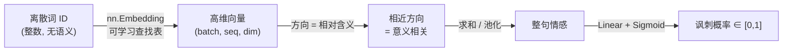

# 🎬 第 06 章 · 用嵌入让情感可编程：Embeddings（Making Sentiment Programmable by Using Embeddings）

> 本章对应原书 *AI and ML for Coders in PyTorch*（Laurence Moroney 著）第 6 章 "Making Sentiment Programmable by Using Embeddings"，PDF 第 137–168 页。

## 🗺️ 本章地图（读完能会什么）

- 承接[[05_自然语言处理入门：把语言编码成数字]]：上一章把词变成了**整数 token**，但整数只是编号，不含语义。本章要让这些编号真正**携带含义**。
- 理解 **embedding（嵌入）** 的第一性原理：把每个词映射成一个**高维向量**，向量的方向由训练学出来，方向相近 = 意义相关。
- 用 `nn.Embedding` 从零搭一个**讽刺检测器（Sarcasm Detector）**，跑通 `Embedding → 池化 → 全连接 → Sigmoid` 的完整二分类管线。
- 系统地对付 NLP 里最常见的敌人——**过拟合**：调学习率、砍词表、缩嵌入维度、简化架构、Dropout、L1/L2 正则、裁句长，一整套组合拳。
- 学会**可视化嵌入**（Embedding Projector）和**加载预训练词向量**（GloVe），并知道它们各自的适用边界。
- 这一章是通向[[07_循环神经网络RNN与LSTM做NLP]] 乃至整个 LLM 的关键跳板——现代大模型的第一层 `wte`（word token embedding）本质上就是这里的 `nn.Embedding`。

> 💡 **一句话本质**：嵌入 = 一张**可学习的查找表**，把离散的词 ID 换成连续的向量；训练让"意思相近的词，向量方向也相近"，于是一句话的情感就能被向量求和/池化后"读"出来——语义第一次变得可微、可编程。

---

## 🌱 从词里建立含义（Establishing Meaning from Words）

上一章的 token 化只是给词发了个"工号"：`new`→3、`trump`→4……工号大小和词义毫无关系。原书开门见山点破了这个痛点：

> "However, in none of that was there any type of modeling of the meaning of a word. And while it's true that there's no absolute numeric encoding that could encapsulate meaning, there are relative ones."
> "但在那整个过程里，我们从未对词的**含义**做任何建模。诚然，不存在一个绝对的数值编码能封装含义——但**相对的**编码是存在的。"（PDF 第 137 页）

"相对含义"这四个字是整章的灵魂：我们不追求给 `happy` 一个"绝对正确"的数值，只追求 `happy` 和 `joyful` 离得近、和 `sad` 离得远。

### 🔢 一个最朴素的例子：正数与负数

用第 5 章的讽刺（Sarcasm）数据集做思想实验：**讽刺**标题里的词记正分，**正常**标题里的词记负分。

拿一条讽刺标题：

```
christian bale given neutered male statuette named oscar
```

假设所有词初始值为 0，讽刺句里每个词 **+1**：

```python
{"christian": 1, "bale": 1, "given": 1, "neutered": 1,
 "male": 1, "statuette": 1, "named": 1, "oscar": 1}
```

再来一条正常（非讽刺）标题，每个词 **-1**：

```
gareth bale scores wonder goal against germany
```

```python
{"christian": 1, "bale": 0, "given": 1, "neutered": 1, "male": 1,
 "statuette": 1, "named": 1, "oscar": 1, "gareth": -1, "scores": -1,
 "wonder": -1, "goal": -1, "against": -1, "germany": -1}
```

注意 `bale` 被抵消成了 **0**——它既出现在讽刺句（christian bale），又出现在正常句（gareth bale）。原书还补了个真实统计：整个数据集里 `bale` 出现 5 次（正常 2 次、讽刺 3 次），所以全局分数是 **-1**。

现在给一句没见过的话打分：

```
neutered male named against germany, wins statuette!
```

把每个词的分数加起来：`neutered(+1) + male(+1) + named(+1) + against(-1) + germany(-1) + statuette(+1)` = **+2**，正数 → 判为**讽刺**。

> 💡 **实战/面试高频**：这个 +1/-1 玩具模型其实就是**词袋（Bag-of-Words）+ 情感词典**的雏形，也是"一句话的情感 = 词情感之和"这个核心直觉的最简版本。它有两个致命短板——① 每个词只有**一维**分数（正/负），信息太少；② 完全**不看词序**（"狗咬人"和"人咬狗"同分）。本章用嵌入解决前者，[[07_循环神经网络RNN与LSTM做NLP]] 用循环层解决后者。

### 🧭 更进一步：向量（Vectors）

一维不够用，就升维。原书用《傲慢与偏见》的角色打了个绝妙的比方：把角色画到二维平面上，**x 轴 = 性别**、**y 轴 = 贵族程度**、**向量长度 = 财富**。

| 角色 | 性别(x) | 贵族(y) | 财富(向量长度) | 一眼读出的信息 |
|---|---|---|---|---|
| Mr. Darcy | 男 | 模糊（"Mister"） | 极高 | 有钱但头衔存疑 |
| Sir William Lucas | 男 | 高（有爵位 Sir） | 中 | 没那么有钱但更"贵" |
| Mr. Bennet | 男 | 低 | 低 | 平民、财务吃紧 |
| Elizabeth Bennet | 女 | 低 | 低 | 像她父亲，但性别不同 |
| Lady Catherine | 女 | 高 | 极高 | 又贵又富 |

光看这张图就能读出一堆关系：Darcy 和 Elizabeth 的爱情张力来自"贵族一侧对平民一侧的偏见"（这正是书名 *Pride and Prejudice*）。**维度越多，能编码的"相对含义"越丰富**。这就是 embedding 的核心思想——只不过真实 NLP 里维度不是 2，而是几十到几百甚至上千。



> "This leads us to the concept of an embedding, which is simply a vector representation of a word that is learned while training a neural network."
> "这就引出了**嵌入**的概念——它不过是一个词的向量表示，而这个向量是在训练神经网络的过程中被学出来的。"（PDF 第 139 页）

---

## 🧩 PyTorch 里的嵌入层（Embeddings in PyTorch）

和 `Linear`、`Conv2d` 一样，PyTorch 把嵌入做成了一个**层**：`nn.Embedding`。它内部是一张查找表——输入整数 ID，输出该 ID 对应的那一行向量。

```python
import torch.nn as nn

# vocab_size 个词，每个词一个 embedding_dim 维向量
embedding = nn.Embedding(vocab_size, embedding_dim)
```

> "The embedding layer will be initialized randomly—that is, the coordinates of the vectors will be completely random to start with and will be learned during training by using backpropagation."
> "嵌入层是**随机初始化**的——一开始每个向量的坐标完全随机，然后在训练中通过**反向传播**被学出来。"（PDF 第 139 页）

这句话点破了嵌入的本质：`nn.Embedding.weight` 就是一个形状 `(vocab_size, embedding_dim)` 的**普通可训练参数矩阵**，第 `i` 行就是第 `i` 号词的向量。前向传播时它做的是"按行索引"（等价于 one-hot 乘矩阵，但省掉了 one-hot），反向传播时只有**被用到的那些行**会收到梯度。

> ⚠️ **踩坑**：`nn.Embedding` 的输入必须是 `torch.long`（整数索引），**不是** one-hot、**不是** float。传错 dtype 会直接报错或给出诡异结果。索引还必须落在 `[0, vocab_size-1]`，越界会触发 CUDA 端难以定位的 `device-side assert`（详见后文常见坑）。

### 🏗️ 搭讽刺检测器的骨架

沿用第 5 章准备好的数据（`training_size = 28000`，训练/测试句子与标签已切好），先看模型架构。嵌入层的输出需要变成**定长向量**才能喂给全连接层——书里用**平均池化**把变长序列压成一个向量：

```python
import torch
import torch.nn as nn

class TextClassificationModel(nn.Module):
    def __init__(self, vocab_size, embedding_dim, hidden_dim=24):
        super().__init__()
        self.embedding   = nn.Embedding(vocab_size, embedding_dim)   # (V, D) 查找表
        self.global_pool = nn.AdaptiveAvgPool1d(1)   # 把序列长度压成 1
        self.fc1 = nn.Linear(embedding_dim, hidden_dim)  # D -> 24
        self.fc2 = nn.Linear(hidden_dim, 1)              # 24 -> 1
        self.relu    = nn.ReLU()
        self.sigmoid = nn.Sigmoid()

    def forward(self, x):
        x = self.embedding(x)          # (batch, seq_len)      -> (batch, seq_len, D)
        x = x.transpose(1, 2)          # -> (batch, D, seq_len)  为了给 1D 池化用
        x = self.global_pool(x).squeeze(2)  # -> (batch, D, 1) -> (batch, D)
        x = self.relu(self.fc1(x))     # (batch, 24)
        x = self.sigmoid(self.fc2(x))  # (batch, 1) 讽刺概率
        return x
```

原书用 `torchinfo.summary` 打印了参数量（vocab_size = **24,292**、embedding_dim = **100**、序列长 100、batch = 32）：

```
==========================================================================
Layer (type:depth-idx)                   Output Shape              Param #
==========================================================================
TextClassificationModel                  [32, 1]                   --
├─Embedding: 1-1                         [32, 100, 100]            2,429,200
├─AdaptiveAvgPool1d: 1-2                 [32, 100, 1]              --
├─Linear: 1-3                            [32, 24]                  2,424
├─ReLU: 1-4                              [32, 24]                  --
├─Linear: 1-5                            [32, 1]                   25
├─Sigmoid: 1-6                           [32, 1]                   --
==========================================================================
Total params: 2,431,649
```

算一遍就懂了参数量都花在哪：

| 层 | 计算 | 参数量 | 占比 |
|---|---|---|---|
| Embedding | 24,292 词 × 100 维 | **2,429,200** | **99.9%** |
| Linear fc1 | 100×24 权重 + 24 偏置 | 2,424 | 0.1% |
| Linear fc2 | 24×1 权重 + 1 偏置 | 25 | ~0% |
| AvgPool / ReLU / Sigmoid | 无参数 | 0 | 0 |
| **合计** | | **2,431,649** | |

> 💡 **实战/面试高频**：注意**嵌入层几乎吞掉了全部参数**（243 万里的 242.9 万）。这解释了本章后面为什么"砍词表"和"缩维度"能立竿见影地降过拟合——你是在直接砍掉网络里最庞大、最容易死记硬背的那块。这个规律在 LLM 里更夸张：GPT-2 small 的词嵌入 + 位置嵌入约占总参数的 30%+，所以现代大模型普遍用**权重绑定（weight tying）** 把输入嵌入和输出投影共享一份，省一半嵌入参数。

训练结果却给了当头一棒：**30 个 epoch 后训练准确率 99%+，但验证准确率跌到 80% 以下**；跑到 100 个 epoch 看损失曲线，验证 loss 不降反**急剧上升**——这是过拟合的教科书信号。

> 💡 **判断过拟合的黄金准则**：不要只盯准确率，要盯 **loss**。验证准确率略降还能忍，但验证 **loss 持续上升**（如原书 Figure 6-3）说明网络正在疯狂拟合训练集里的**噪声**，这些噪声在验证集里不存在，越拟合越糟。

---

## 🛡️ 减少语言模型的过拟合（Reducing Overfitting）

原书对过拟合的定义很到位：

> "Overfitting happens when the network becomes overspecialized to the training data ... the network becoming very good at matching patterns in 'noisy' data in the training set that doesn't exist anywhere else."
> "过拟合发生在网络对训练数据**过度专精**时……网络变得极擅长匹配训练集里那些'噪声'模式，而这些模式在别处根本不存在。"（PDF 第 143 页）

下面是一整套组合拳，按"性价比从高到低"排列。

### 1️⃣ 调学习率（Adjusting the Learning Rate）

学习率（LR）太高 → 学得太快、错过细微差别 → 更易过拟合。原书把 Adam 的 LR 从默认 `0.001` 降一个数量级到 `0.0001`：

```python
import torch.optim as optim

# 默认
optimizer = optim.Adam(model.parameters(), lr=0.001,
                       betas=(0.9, 0.999), amsgrad=False)

# 降一个数量级 —— 过拟合明显推迟且更轻
optimizer = optim.Adam(model.parameters(), lr=0.0001,
                       betas=(0.9, 0.999), amsgrad=False)
```

现象很有意思：低 LR 下前 ~10 个 epoch 看着"没在学"（准确率不涨），但**loss 一直在降**；到某个点突然"破圈"开始快速学习。到 epoch 30，低 LR 的 loss 约 0.49，而高 LR 时是它的两倍多。到 epoch 60 验证 loss 才开始抬头，此时训练 90%、验证 81%——相当能打。

> 💡 `betas=(0.9, 0.999)` 是 Adam 的一阶/二阶动量衰减系数（都须在 0~1、通常接近 1）。`amsgrad` 是 Adam 的一个变体，出自论文 *"On the Convergence of Adam and Beyond"*（Reddi, Kale, Kumar, ICLR 2018, arXiv:1904.09237）。这些细节超出本章范围，但知道"LR 是过拟合的头号旋钮"就够了。

### 2️⃣ 缩词表（Exploring Vocabulary Size）

原书用一个 `word_frequency` 辅助函数统计词频：

```python
def word_frequency(sentences, word_dict):
    frequency = {word: 0 for word in word_dict}
    for sentence in sentences:
        for word in sentence.lower().split():
            if word in frequency:
                frequency[word] += 1
    return frequency
```

排序后前几名是：`{'new': 1318, 'trump': 1117, 'man': 1075, 'not': 634, 'just': 501, ...}`。画出来是一条经典的**"曲棍球杆（hockey stick）"曲线**：极少数词用了成千上万次，绝大多数词只出现寥寥几次。语料里近 **25,000** 个词，但排在 2,000 名之后（占词表 90%+）的词，**每个在整个语料里出现不到 20 次**！

这些"长尾"低频词很可能只在训练集里出现、验证集里没有——正是过拟合的元凶。对策：只保留最高频的 N 个词。

```python
from collections import Counter

def build_vocab(sentences, max_vocab_size=10000):
    counter = Counter()
    for text in sentences:
        counter.update(tokenize(text))
    # 取最高频的 max_vocab_size-2 个（留 2 个位置给特殊 token）
    most_common = counter.most_common(max_vocab_size - 2)
    # 索引从 2 开始
    vocab = {word: idx + 2 for idx, (word, _) in enumerate(most_common)}
    vocab['<pad>'] = 0   # 填充符
    vocab['<unk>'] = 1   # 未登录词（OOV）
    return vocab

vocab_size = 2000
word_index = build_vocab(training_sentences, max_vocab_size=vocab_size)
```

模型架构不用改（嵌入层本来就吃 `vocab_size`），但参数量**从 243 万暴跌到 202,549**。重训后训练准确率约 82%、验证约 76%——**两条线靠得很近、不再发散**，过拟合被大幅压制。

> ⚠️ **踩坑**：词表不是越小越好！砍太狠会**欠拟合**，太多词都变成 `<unk>`，模型没信息可学。原书作者也坦承"取出现 ≥20 次的词纯属拍脑袋"，你得自己试出一个平衡点。

### 3️⃣ 缩嵌入维度（Exploring Embedding Dimensions）

维度太高 + 词太少 = **稀疏**。原书的比喻很形象：想象地球表面有一千个从地心指向表面的三维向量，如果很多向量的 x、y 都是 0、只剩 z，它们全挤向 (0,0,z) 这个北极点，大片地表没被覆盖，向量之间也就失去了"区分度"。

> "Research has shown that a best practice for embedding size is to have it be the fourth root of the vocabulary size."
> "研究表明，嵌入维度的一个最佳实践是取**词表大小的四次方根**。"（PDF 第 151 页）

$$\text{embedding\_dim} \approx \sqrt[4]{\text{vocab\_size}} = \sqrt[4]{2000} \approx 6.687 \to 7$$

把维度从 16 改成 **7**，训练准确率稳定在 ~83%、验证 ~77%，和之前差不多，但**训练速度显著加快**。这条"四次方根"经验法则值得记住（也是很多推荐系统里 categorical 特征嵌入维度的默认起点）。

### 4️⃣ 简化架构（Exploring the Model Architecture）

嵌入池化后只出 7 维，却喂给 24 个神经元的隐层——**杀鸡用牛刀**。把 `hidden_dim` 从 24 降到 **8**，结果几乎不变，但更快。

### 5️⃣ Dropout

在第 3 章卷积网络里用过的老朋友（见[[03_卷积神经网络：在图像中检测特征]]）。作者特意**先做完前面的优化再上 Dropout**——因为砍词表/缩维度/简架构的收益往往比 Dropout 大得多。

```python
class TextClassificationModel(nn.Module):
    def __init__(self, vocab_size, embedding_dim, hidden_dim=8, dropout_rate=0.25):
        super().__init__()
        self.embedding   = nn.Embedding(vocab_size, embedding_dim)
        self.global_pool = nn.AdaptiveAvgPool1d(1)
        self.fc1     = nn.Linear(embedding_dim, hidden_dim)
        self.dropout = nn.Dropout(p=dropout_rate)   # 0.25 ≈ 8 个神经元里丢 2 个
        self.fc2     = nn.Linear(hidden_dim, 1)
        self.relu    = nn.ReLU()
        self.sigmoid = nn.Sigmoid()

    def forward(self, x):
        x = self.embedding(x)
        x = x.transpose(1, 2)
        x = self.global_pool(x).squeeze(2)
        x = self.dropout(self.relu(self.fc1(x)))   # 在激活后 Dropout
        x = self.sigmoid(self.fc2(x))
        return x
```

结果：训练/验证准确率收敛得更好，但**loss 整体抬高了**（带 Dropout 训练 loss > 0.5，不带时约 0.3），且验证 loss 又有抬头趋势。作者的结论很诚实——**神经元本来就没几个的时候，Dropout 未必是好主意**，但它是工具箱里必备的一件，复杂架构上再用。

### 6️⃣ 正则化（L1 / L2）

| 类型 | 别名 | 直觉 | 常用场景 |
|---|---|---|---|
| **L1** | lasso（最小绝对收缩） | 惩罚绝对值，把接近 0 的权重直接压到 0（稀疏） | 特征选择 |
| **L2** | ridge（岭回归） | 惩罚平方，放大非零与近零权重的差距（"山脊"效应） | **NLP 最常用** |
| L1+L2 | elastic | 两者结合 | 折中 |

L2 在 PyTorch 里就是优化器的 `weight_decay`：

```python
optimizer = optim.Adam(model.parameters(), lr=0.001, betas=(0.9, 0.999),
                       amsgrad=False, weight_decay=0.01)   # 通常取 0.01 ~ 0.001
```

PyTorch 还允许**给不同层设不同衰减**（参数分组）：

```python
optimizer = torch.optim.Adam([
    {'params': model.fc1.parameters(), 'weight_decay': 0.01},   # 只对 fc1 上 L2
    {'params': [p for name, p in model.named_parameters()
                if 'fc1' not in name]}                          # 其余层不上
], lr=0.0001)
```

### 7️⃣ 裁句长（Other Considerations）

之前把最大句长定成 100 纯属拍脑袋。画一下句长分布：26,000+ 条句子里**不到 200 条**长度 ≥100 词。把上限降到 **85** 仍覆盖 99%+ 的句子，却大幅减少无用 padding（padding 太多会稀释真实信号、拖慢训练）。

> 💡 **实战/面试高频**：这七招按"性价比"排序基本就是 **砍词表/缩维度/简架构 ≫ 调 LR/裁句长 > Dropout/正则**。核心洞见是：**先做减法（缩小模型容量），再做正则**。因为本例过拟合的根源是"嵌入层参数量爆炸 + 长尾低频词"，直接缩小它比事后打补丁有效得多。

---

## 🔗 整合（Putting It All Together）

把上面所有优化叠加，训练 **300 个 epoch**：训练与验证的准确率曲线大致贴合、损失曲线高度相似——过拟合被基本驯服，网络在**有效学习**。这就是从"99% 训练 / 80% 验证 的假象" 到 "两条线并肩前进" 的完整调优旅程。

---

## 🎯 用模型给一句话分类（Using the Model to Classify a Sentence）

训练完，来做**推理**。造几句新句子（注意必须用**训练时同一个 tokenizer**，否则词↔ID 对不上）：

```python
test_sentences = [
    "granny starting to fear spiders in the garden might be real",
    "game of thrones season finale showing this sunday night",
    "PyTorch book will be a best seller",
]

sequences = texts_to_sequences(test_sentences, word_index)
print(sequences)
# [[1, 803, 753, 1, 1, 312, 97],
#  [123, 1183, 160, 1, 1, 1543, 152],
#  [1, 235, 7, 47, 1]]
```

一堆 `1` 是 `<unk>`（OOV）——`granny`、`spiders` 不在 2000 词表里；序列也短，因为停用词被去掉了。接着 padding 到定长 85：

```python
padded = pad_sequences(sequences, max_len=85)   # 每条补 0 到长度 85
```

然后转张量、切 `eval` 模式、`no_grad` 前向：

```python
input_ids = torch.tensor(padded, dtype=torch.long).to(device)

model.eval()                      # 关掉 Dropout、固定 BN 等
with torch.no_grad():             # 推理不建计算图，省显存
    outputs = model(input_ids)

print(outputs)
# tensor([[0.5516],
#         [0.0765],
#         [0.0987]], device='cuda:0')
```

阈值 0.5 判决：

```python
probabilities = outputs.squeeze().cpu().numpy()
predictions   = (probabilities >= 0.5).astype(int)
```

| 句子 | 概率 | 判定 | 置信度 |
|---|---|---|---|
| granny starting to fear spiders ... might be real | 0.5516 | **Sarcastic** | 0.5516 |
| game of thrones season finale ... sunday night | 0.0765 | Not Sarcastic | 0.9235 |
| PyTorch book will be a best seller | 0.0987 | Not Sarcastic | 0.9013 |

第一句尽管全是停用词又补了一堆 0，仍被判有讽刺意味（0.55，勉强过线）；后两句得分很低。原书的提醒很实在：**多拿数据去"打破"它**，如果能稳定打破，就该换架构、上迁移学习、或用预训练嵌入了。

> ⚠️ **踩坑**：`model.eval()` 和 `torch.no_grad()` 是两件不同的事，推理时**两个都要**。`eval()` 改变 Dropout/BatchNorm 的行为，`no_grad()` 关闭梯度追踪。漏掉 `eval()` 会因 Dropout 让同一句话每次预测都不同；漏掉 `no_grad()` 不影响结果但白白吃显存、拖慢速度。

---

## 🔬 关键代码拆解

本章最核心、最容易看晕的就是 `forward` 里那几行**张量变形**。逐块拆开，盯住形状（设 batch=32、seq_len=85、embedding_dim=7）：

```python
def forward(self, x):
    # x: (32, 85)   —— 32 个句子，每句 85 个整数 token ID（含 padding 的 0）
    x = self.embedding(x)
    # (32, 85, 7)   —— 每个 token 查表变成 7 维向量；这一步纯查行，无矩阵乘

    x = x.transpose(1, 2)
    # (32, 7, 85)   —— 交换 seq 与 dim 维。为什么？因为 AdaptiveAvgPool1d
    #                  沿"最后一维"池化，我们要沿【序列长度】平均，所以把 85 放到最后

    x = self.global_pool(x).squeeze(2)
    # global_pool 输出 (32, 7, 1) —— 沿 85 个位置取平均，压成 1
    # squeeze(2) 去掉那个长度为 1 的维 -> (32, 7)
    #   ★ 语义：把"一句话里所有词向量取平均"，得到一个 7 维的【句子向量】
    #     这正是开头 "情感 = 词向量求和/池化" 直觉的代码实现

    x = self.relu(self.fc1(x))
    # fc1: (7 -> 24)  -> (32, 24)，ReLU 引入非线性

    x = self.sigmoid(self.fc2(x))
    # fc2: (24 -> 1)  -> (32, 1)，Sigmoid 压到 [0,1] 当讽刺概率
    return x
```

三个关键理解点：

1. **`transpose(1, 2)` 不是可有可无**：`nn.AdaptiveAvgPool1d(L)` 把输入的**最后一维**从当前长度自适应池化到 `L`。我们想对"序列长度"求平均（把变长句子压成定长），所以必须先把 `seq_len` 挪到最后一维，池化后再压回来。
2. **平均池化 = 词袋的连续版**：`(32,7,85) → (32,7)` 就是"对一句话里 85 个位置的 7 维向量逐维取平均"。这一步**丢掉了词序**（85 个位置平均后谁先谁后无所谓），这正是本模型的天花板，也是[[07_循环神经网络RNN与LSTM做NLP]] 要补的短板。
3. **padding 的 0 会不会污染平均**？会一点——`<pad>`(ID=0) 也有它自己的嵌入向量，被算进了平均。更严谨的做法是用 **masked mean**（只对非 padding 位置平均），但入门阶段直接平均也能work，因为模型会学着把 `<pad>` 的向量拉向接近 0 的贡献。

---

## 🌍 社区案例与延伸

本章的"词→向量、方向即语义"是深度学习 NLP 的地基，社区里有几座绕不开的里程碑：

1. **word2vec（Mikolov et al., 2013）** —— 让"词向量能做算术"火遍全网的开山之作：`vec("king") - vec("man") + vec("woman") ≈ vec("queen")`。两篇必读：*"Efficient Estimation of Word Representations in Vector Space"*（arXiv:1301.3781，提出 CBOW/Skip-gram）和 *"Distributed Representations of Words and Phrases and their Compositionality"*（arXiv:1310.4546，负采样）。它和本章的区别：word2vec 是**无监督**（靠上下文预测学向量），本章是**有监督**（靠讽刺标签顺带学向量）。

2. **GloVe（Pennington, Socher, Manning, 2014）** —— 就是本章最后要加载的 Stanford 预训练词向量。论文 *"GloVe: Global Vectors for Word Representation"*（EMNLP 2014），官网 <https://nlp.stanford.edu/projects/glove/> 直接下 `glove.6B`（50/100/200/300 维）。它用**全局共现矩阵**的统计信息训练，和 word2vec 的局部窗口思路互补。

3. **fastText（Bojanowski et al., 2017）** —— *"Enriching Word Vectors with Subword Information"*（arXiv:1607.04606）。把词拆成**字符 n-gram** 求嵌入，天然能给 OOV 词（本章里那些变成 `<unk>` 的 `granny`/`spiders`）算出向量，对形态丰富的语言尤其有用。这直接启发了后来 LLM 用 **subword（BPE）** 分词的思路。

4. **Embedding Projector（Smilkov et al., 2016）** —— 本章可视化用的正是这个工具，在线版 <https://projector.tensorflow.org/>，论文 arXiv:1611.05469。它用 **PCA / t-SNE / UMAP** 把高维嵌入降到 3D，是"亲眼看见语义聚类"的最快方式。

---

## 🔗 通向 LLM

这一章的每个概念，在现代大模型里都有直接对应，而且**放大了很多倍**：

| 本章概念 | LLM 里的对应 | 说明 |
|---|---|---|
| `nn.Embedding(vocab, dim)` | **token embedding**（GPT-2 里叫 `wte`） | LLM 的第一层就是它，只是 vocab≈5万、dim=768~12288 |
| 词↔ID 的 tokenizer | **BPE / SentencePiece 分词器** | 承接[[05_自然语言处理入门：把语言编码成数字]]，LLM 用子词而非整词 |
| 嵌入几乎占满参数 | **权重绑定（weight tying）** | 输入嵌入与输出 softmax 投影共享一份矩阵（Press & Wolf 2017, arXiv:1608.05859） |
| 平均池化得"句向量" | **sentence embedding / 句向量检索** | Sentence-BERT（Reimers & Gurevych 2019, arXiv:1908.10084）产句向量，做语义搜索 |
| "方向相近=语义相关" | **余弦相似度 + 向量数据库** | RAG 的召回全靠它，见[[18_RAG检索增强生成入门]] |
| 平均池化丢词序 | **位置编码 + 自注意力** | LLM 用位置嵌入 + Transformer 保住词序，见[[15_Transformer架构与transformers库]] |
| Sigmoid 二分类头 | **分类头 / LM head** | 微调时换成任务专属的头，见[[16_用自定义数据微调与提示微调LLM]] |

**一句话主线**：本章你亲手搭的 `Embedding → 池化 → 分类` 就是一个"迷你、只看词不看序"的语言模型；把平均池化换成**自注意力**、把二分类头换成**预测下一个词**，再堆几十层，你就得到了 GPT。**嵌入是从"符号"进入"语义空间"的那道门，所有 LLM 的第一步都是穿过这道门。**

> 💡 **实战/面试高频**：面试官常问"embedding 和 one-hot 有什么区别？"标准答法：one-hot 是稀疏、正交、维度=词表大小、词间无关系；embedding 是稠密、低维、可学习，**语义相近的词向量也相近**。`nn.Embedding` 在数学上等价于"one-hot × 权重矩阵"，但实现上直接按行索引，省掉了巨大的稀疏乘法。

### 加载预训练嵌入（GloVe）

原书结尾示范了怎么把 GloVe 权重塞进 `nn.Embedding`：

```python
self.embedding = nn.Embedding(vocab_size, embedding_dim)

# 若提供了预训练权重，就覆盖随机初始化
if pretrained_embeddings is not None:
    self.embedding.weight.data.copy_(pretrained_embeddings)
    if freeze_embeddings:
        self.embedding.weight.requires_grad = False   # 冻结：只用不学
```

- `freeze_embeddings=True` → **冻结**，把 GloVe 当固定特征提取器；
- `freeze_embeddings=False` → **微调（fine-tune）**，以 GloVe 为起点继续学。

原书的诚实提醒值得抄下来：用 GloVe 后**训练飞快、过拟合小**，但本任务准确率只有约 **70%**（比抛硬币的 50% 强，但不惊艳）。原因：GloVe 是在通用语料上学的**通用语义**，而"讽刺"是一种高度依赖语境和语气的**任务专属信号**，通用词向量未必抓得住。

> "while using pretrained embeddings can make for much faster training with less overfitting, you should also understand what it is that they're useful for and that they may not always be best for your scenario."
> "预训练嵌入虽能带来更快的训练和更少的过拟合，但你也得明白它们**擅长什么**——它们未必总是最适合你场景的选择。"（PDF 第 166 页）

> ⚠️ **踩坑**：用预训练嵌入时，**tokenizer 的规则必须和预训练时对齐**。GloVe 要求全部小写、数字归一化为 0 等；如果你的分词规则和它不一致，很多词会对不上、退化成随机向量，白费预训练的功夫。

---

## 📊 可视化嵌入（Visualizing the Embeddings）

想亲眼看看网络学到了什么？导出成 Embedding Projector 要的两个 TSV 文件（一个存向量、一个存词元数据）：

```python
# 1) 反转词表：从 {word: id} 得到 {id: word}
reverse_word_index = {value: key for key, value in word_index.items()}

# 2) 取出嵌入权重矩阵
embedding_weights = model.embedding.weight.data.cpu().numpy()
print(embedding_weights.shape)   # (2000, 7) —— 2000 词 × 7 维

# 看一个词的向量
print(reverse_word_index[2])     # new
print(embedding_weights[2])
# [-0.27116913 -1.3026129  1.6390767  0.4922502 -0.6025921  1.4584142  0.05054485]

# 3) 写出 vecs.tsv（向量）和 meta.tsv（词）
import io
out_v = io.open('vecs.tsv', 'w', encoding='utf-8')
out_m = io.open('meta.tsv', 'w', encoding='utf-8')
for word_num in range(1, vocab_size):
    word = reverse_word_index[word_num]
    out_m.write(word + "\n")
    out_v.write('\t'.join(str(x) for x in embedding_weights[word_num]) + "\n")
out_v.close()
out_m.close()
```

把两个 TSV 传到 <https://projector.tensorflow.org/>，点 **Load**，再点 **Sphereize Data**，你会看到词被清晰地**分向两极聚类**——因为这是个二分类器，词天然被拉向"讽刺"或"非讽刺"两端。可以旋转球体、点某个词看它的近邻，直观感受哪些词决定了分类。

> 💡 原书原话："Screenshots don't do all of this justice—you should try it for yourself!"（截图传达不出全部精彩——你该自己动手试试！）强烈建议跑一遍导出、亲手在 Projector 里转一转。

---

## ⚠️ 常见坑

1. **`nn.Embedding` 索引越界 / dtype 错误**：输入必须是 `torch.long` 且落在 `[0, vocab_size-1]`。越界在 GPU 上会抛难以定位的 `CUDA error: device-side assert triggered`，务必确保词表大小与最大 token ID 一致（别忘了给 `<pad>`/`<unk>` 留位）。
2. **忘了 `transpose` 或用错池化维度**：`AdaptiveAvgPool1d` 沿最后一维池化。不转置就会把 embedding_dim 当序列平均掉，形状对了但语义全错，模型学不动还不报错。
3. **训练/推理 tokenizer 不一致**：推理时必须复用训练时的 `word_index`。新建一个 tokenizer 会让同一个词映射到不同 ID，模型看到的等于乱码。
4. **推理漏了 `model.eval()`**：Dropout 在训练模式下随机丢神经元，导致同一句话每次预测都不同、且整体偏低。推理前一定 `eval()`（配合 `torch.no_grad()`）。
5. **过度依赖准确率、忽视 loss**：验证准确率还在涨不代表没过拟合。盯住**验证 loss**，它一旦持续上升就是过拟合的铁证——本章 Figure 6-3 的核心教训。
6. **词表/维度砍过头**：降过拟合是"缩容量"，但缩太狠会欠拟合。太多 `<unk>`、维度太低导致向量无区分度，都会让准确率不升反降，需要在验证集上找平衡点。

---

## 🎯 面试速答

1. **Q：word embedding 到底是什么？和 one-hot 区别？**
   A：一张可学习的查找表，把词 ID 映射成稠密低维向量，语义相近的词向量方向也相近；one-hot 稀疏、正交、维度=词表大小且词间无关系，embedding 稠密、低维、可学习。数学上 embedding ≈ one-hot × 权重矩阵，实现上直接按行索引省掉稀疏乘法。

2. **Q：`nn.Embedding` 的参数是怎么训练的？**
   A：`weight` 就是一个 `(vocab_size, embedding_dim)` 的可训练矩阵，随机初始化，前向按 token ID 索引取行，反向只有**被用到的行**收到梯度，通过反向传播随任务标签一起学出来。

3. **Q：怎么判断 NLP 模型过拟合了？有哪些对策？**
   A：判断看**验证 loss 是否持续上升**（比看准确率更灵）。对策按性价比：缩词表（砍长尾低频词）、缩嵌入维度（≈词表大小的四次方根）、简化架构、调低学习率、裁句长、Dropout、L2 正则（weight_decay）。核心是"先减容量、再上正则"。

4. **Q：把词向量平均成句向量，有什么问题？**
   A：**丢失词序**——"狗咬人"和"人咬狗"平均后一样。它是词袋的连续版，适合粗粒度情感/主题分类，但捕捉不到语序、否定、长距离依赖。解决靠 RNN/LSTM（引入循环）或 Transformer（自注意力 + 位置编码）。

5. **Q：什么时候用预训练词向量（GloVe），什么时候自己训？**
   A：数据少、任务偏通用语义时用预训练（训练快、过拟合小）；任务信号高度专属（如讽刺、领域黑话）或数据充足时，自训或在预训练基础上微调更好。用预训练务必让 tokenizer 规则与预训练对齐（小写、数字归一等）。

---

## 📌 本章小结

- **嵌入 = 可学习的词→向量查找表**，把离散 token 变成携带"相对语义"的稠密向量，方向相近即意义相关；这是让语义变得可微、可编程的关键一步。
- 一个最小 NLP 分类器 = `nn.Embedding → 平均池化 → Linear → Sigmoid`；其中**嵌入层几乎吃掉全部参数**（本例 243 万里的 242.9 万），也因此最易过拟合。
- 对付过拟合有一整套组合拳，按性价比：**缩词表、缩维度（四次方根经验法则）、简架构 ≫ 调 LR、裁句长 > Dropout、L2 正则**；判断信号是**验证 loss 上升**而非准确率。
- 推理三件套：同一个 tokenizer 编码 → `pad_sequences` 补到定长 → `model.eval()` + `torch.no_grad()` 前向；可用 Embedding Projector（导出 vecs/meta 两个 TSV）亲眼看语义聚类。
- 平均池化**丢词序**是本模型的天花板，也是通向[[07_循环神经网络RNN与LSTM做NLP]] 和 Transformer 的动机；而 `nn.Embedding` 本身就是每个现代 LLM 的第一层。

---

## 🔗 延伸阅读 & 交叉链接

**兄弟章节**
- [[05_自然语言处理入门：把语言编码成数字]] —— 上一章：token 化、序列、padding，本章的输入
- [[07_循环神经网络RNN与LSTM做NLP]] —— 下一章：用循环层引入词序，补上平均池化丢掉的信息
- [[03_卷积神经网络：在图像中检测特征]] —— Dropout、过拟合、池化概念的最初来源
- [[04_用PyTorch管理数据：Dataset与DataLoader]] —— 数据管线，喂给嵌入模型的上游
- [[15_Transformer架构与transformers库]] —— 嵌入 + 自注意力 + 位置编码的终极形态
- [[18_RAG检索增强生成入门]] —— 句向量 + 余弦相似度检索的工业应用

**外部真实链接**
- word2vec：Mikolov et al., *Efficient Estimation of Word Representations in Vector Space*, arXiv:1301.3781 <https://arxiv.org/abs/1301.3781>
- GloVe：Pennington, Socher, Manning, *GloVe: Global Vectors for Word Representation*, 官网 <https://nlp.stanford.edu/projects/glove/>
- Embedding Projector 在线工具 <https://projector.tensorflow.org/>（论文 arXiv:1611.05469）
- PyTorch 官方文档：`torch.nn.Embedding` <https://pytorch.org/docs/stable/generated/torch.nn.Embedding.html>
