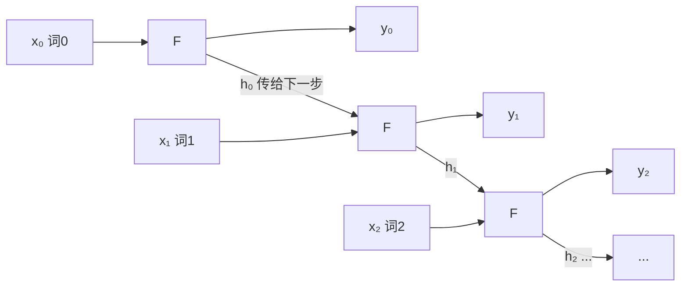
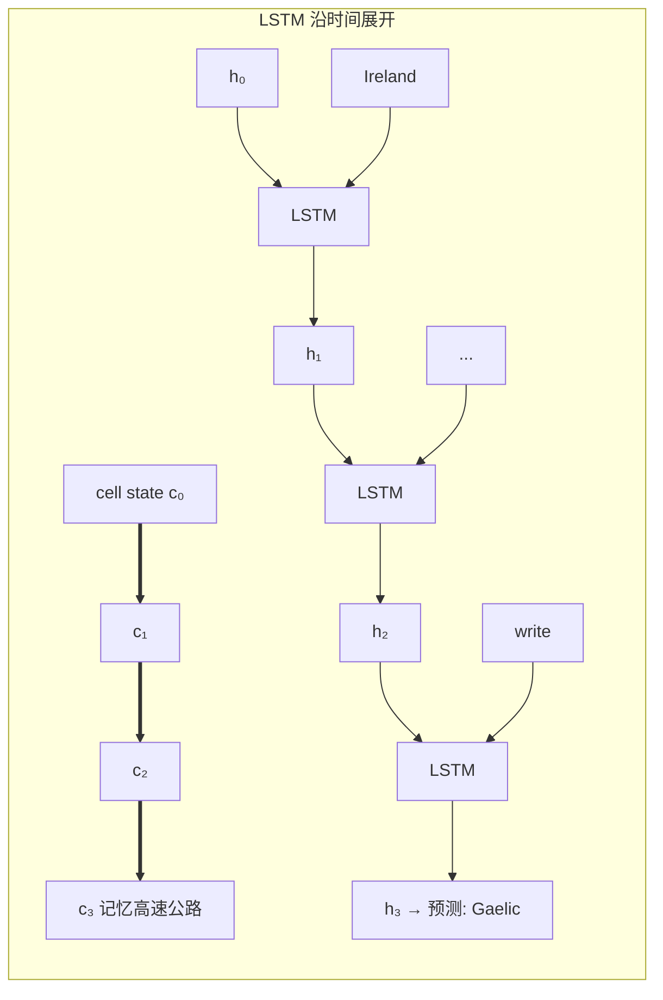

# 🎬 第 07 章 · 循环神经网络 RNN 与 LSTM 做 NLP（Recurrent Neural Networks for Natural Language Processing）

> 本章对应原书 *AI and ML for Coders in PyTorch*（Laurence Moroney 著）第 7 章 "Recurrent Neural Networks for Natural Language Processing"，PDF 第 169–194 页。

## 🗺️ 本章地图（读完能会什么）

- 理解**为什么词袋 / 平均嵌入丢掉了顺序信息**，以及顺序为什么对语言至关重要（"blue sky" vs "Today I am blue"）。
- 用 **Fibonacci 数列**这个绝妙的类比，第一性地理解**循环（recurrence）**——每一步的输出都携带前面所有步的"影子"。
- 明白**简单 RNN 的短期记忆问题**，以及 **LSTM 的 cell state（细胞状态）**如何把"重要的上下文"跨越整句保留下来。
- 用 `nn.LSTM` 亲手搭一个**双向 LSTM 讽刺（sarcasm）分类器**，读懂它每一步的张量形状与参数量（21,537 → 35,745）。
- 学会**堆叠（stack）LSTM**、用**降 LR + dropout** 对抗过拟合，并把**预训练 GloVe 词向量**接进 RNN 做迁移学习（406,817 参数只训 6,817 个）。
- 建立通向 LLM 的直觉：RNN/LSTM 正是 Transformer 之前的"序列建模主力"，也是本书作者亲口说的"transformers 的前身"。

> 💡 **一句话本质**：把"记忆"焊进网络结构——让第 t 步不仅看当前词，还带着前面所有词压缩成的一个状态向量往下走；LSTM 再给这条记忆加一条"高速公路"（cell state），让远处的关键词（如 *Ireland → Gaelic*）也能影响判断。

---

## 🧩 为什么需要循环：顺序是语言的灵魂

前面第 5、6 章我们已经会把句子 token 化、序列化成数字张量，再用嵌入（embedding）让语义相近的词聚到一起，最后**把整句的词向量聚合（平均/求和）**喂进全连接层做情感分类。讽刺分类器效果不错——但有个根本缺陷：**它把词当成一袋子东西，完全不管顺序。**

> 原文（PDF p.169）：
> "But there's a limitation to that: namely, sentences aren't just collections of words—and often, the order in which the words appear will dictate their overall meaning."
> "但这有个局限：句子并不只是词的集合——词出现的**顺序**往往决定了整句的含义。"

书里给了几个精妙例子：
- `blue` 单独看情感中性，`sky` 也中性，但 `blue sky`（蓝天）合起来就是明确的正面情绪；
- `rain cloud`（雨云）、`writing desk`（书桌）、`coffee mug`（咖啡杯）——名词修饰名词，顺序换了意思全变；
- 最扎心的对比：**"Today I am blue, because the sky is gray"（我今天很忧郁，因为天是灰的）** vs **"Today I am happy, and there's a beautiful blue sky"（我今天很开心，还有美丽的蓝天）**。对我们，`blue` 一个是"忧郁"一个是"蓝色"一目了然；但对聚合式模型，两个 `blue` 长得一模一样。

> 💡 **面试高频**：为什么平均池化 / 词袋模型无法区分 "dog bites man" 和 "man bites dog"？——因为它对词序**不变（permutation-invariant）**，聚合操作丢掉了位置信息。要恢复顺序敏感性，要么引入循环（RNN），要么显式加位置编码（Transformer）。

解决办法只有一条路：**把 recurrence（循环）加进模型结构**。

---

## 🌀 循环的本质：从 Fibonacci 数列说起

Moroney 用了一个我特别喜欢的类比：**斐波那契数列**。规则是"每个数 = 前两个数之和"。从 1、2 开始：

```
1, 2 → 3   (1+2)
   2, 3 → 5   (2+3)
      3, 5 → 8   (3+5)
         5, 8 → 13 ...
```

把它画成计算图（原书 Figure 7-3）：每一步吃两个输入，吐一个输出，并**把其中一个值传给下一步**。

> 原文（PDF p.171）：
> "The 1 at the top left sort of 'survives' through the process—it's an element of the 3 that gets fed into the second operation, it's an element of the 5 that gets fed into the third operation, and so on."
> "左上角那个 1 在整个过程中某种程度上'幸存'了下来——它是喂给第二步的 3 的一部分，是喂给第三步的 5 的一部分，以此类推。"

关键洞察：**最开头的那个 1 一直"活着"，但它的影响力逐步衰减。** 这正是循环神经元（recurrent neuron）的工作方式。



一个 recurrent neuron（原书 Figure 7-4/7-5）：在时间步 t，输入 `x_t` 喂进函数 F，产生输出 `y_t`，**同时产生一个传给下一步的状态**（图里那条 F 指回自己的箭头）。这个"传给下一步的值"就是**隐藏状态（hidden state）** `h_t`。

用最朴素的数学写，一个 vanilla RNN 单元就是：

```
h_t = tanh(W_x · x_t + W_h · h_{t-1} + b)
y_t = W_y · h_t
```

`h_{t-1}` 就是那个"幸存下来的 1"——把过去所有步的信息压缩进一个向量往后传。

> ⚠️ **踩坑**：正因为影响力**逐步衰减**（数学上是连乘 `W_h` 导致梯度指数级缩小/放大），vanilla RNN 有**梯度消失/爆炸**问题，学不到长距离依赖。这是下一节 LSTM 要解决的核心痛点。

我们可以用纯 PyTorch 手算一个 RNN 单元，感受"状态往下传"：

```python
import torch
import torch.nn as nn

# 一个手搓 RNN cell：输入维度 4，隐藏维度 3
class TinyRNNCell(nn.Module):
    def __init__(self, in_dim, hid_dim):
        super().__init__()
        self.W_x = nn.Linear(in_dim, hid_dim, bias=False)   # 处理当前输入 x_t
        self.W_h = nn.Linear(hid_dim, hid_dim, bias=True)    # 处理上一步状态 h_{t-1}

    def forward(self, x_seq):
        # x_seq: (seq_len, in_dim)，为简单不带 batch
        h = torch.zeros(self.W_h.out_features)  # 初始隐藏状态 h_0 = 0
        outputs = []
        for x_t in x_seq:                       # 沿时间步循环
            h = torch.tanh(self.W_x(x_t) + self.W_h(h))  # 关键：h 依赖上一次的 h
            outputs.append(h)
        return torch.stack(outputs)             # (seq_len, hid_dim)

cell = TinyRNNCell(4, 3)
seq = torch.randn(5, 4)          # 5 个词，每词 4 维
out = cell(seq)
print(out.shape)                  # torch.Size([5, 3])  每步都有一个隐藏状态
```

这段代码里那句 `h = torch.tanh(... + self.W_h(h))` 就是**循环**的全部秘密：**h 出现在等号两边**，本次的状态由上次的状态算出来。

---

## 🧠 为语言扩展循环：LSTM 与 cell state

简单 RNN 的问题在语言里被放大了。考虑这句：

> "I lived in **Ireland**, so in high school, I had to learn how to speak and write **\<something\>**."

那个 `<something>` 是 **Gaelic（盖尔语）**，但真正给出线索的词是 **Ireland**——它离得**很远**，在句子最前面。简单 RNN 传到句尾时，`Ireland` 的信号早就衰减殆尽了。

> 原文（PDF p.171–172）：
> "The short-term memory of an RNN needs to get longer, and in recognition of this, an enhancement to the architecture called long short-term memory (LSTM) was invented."
> "RNN 的短期记忆需要变得更长，为此人们发明了一种架构增强，叫做**长短期记忆（LSTM）**。"

LSTM 在基本 RNN 之上加了一条 **cell state（细胞状态）**——一条贯穿所有时间步的"记忆高速公路"，让重要的上下文**不只在相邻步之间传，而是跨越整个序列**保留。至于该记住什么、该忘掉什么，由 LSTM 内部的门（gate）"像神经元一样学出来"。



> 💡 **实战/面试高频**：Moroney 特意不展开 LSTM 内部三个门的公式，而是推荐 **Christopher Olah 的经典博客 "Understanding LSTM Networks"**。面试要能一句话说清 LSTM 三门：**遗忘门**决定丢弃多少旧记忆、**输入门**决定写入多少新信息、**输出门**决定从 cell state 里读多少出来当隐藏状态。

### 双向 LSTM：从两个方向读句子

LSTM 一个重要特性是**可以双向（bidirectional）**：时间步既能从前往后走，也能从后往前走，于是上下文可以**从两个方向**学到。因为一个词的线索**既可能在它前面，也可能在它后面**。

书里给了绝妙的反向例子：把上面那句倒过来——

> "I lived in **\<this country\>**, so in high school, I had to learn how to speak and write **Gaelic**."

这时线索词 `Gaelic` 在**后面**，要靠**从后往前**读才能推出 `<this country>` 是 Ireland。所以双向 LSTM 在每个时间步把**前向 pass** `F_t(→)` 和**后向 pass** `(←)F_t` 的结果**聚合**起来当作该步的 `y`。

> ⚠️ **别混淆**（原书 p.173 特别强调）：双向 LSTM 里的 forward/backward 指的是**读序列的方向**（下一个 token vs 上一个 token）；而训练里的 forward/backward pass 指的是**前向计算与反向传播梯度**。两回事，别搞混。

> ⚠️ **踩坑**：双向 LSTM（尤其堆叠时）**训练很慢**。原书直接建议："expect training to be slow. Here's where it's worth investing in a GPU"——上 GPU，或至少用 Colab 的托管 GPU。

---

## 🏗️ 用 RNN 搭文本分类器：双向 LSTM 版讽刺检测

第 6 章我们用嵌入 + 聚合 + 全连接做讽刺分类。现在换成 LSTM：**不再聚合，直接把嵌入层的输出喂进循环层**。

> 原文（PDF p.174）：
> "But when you're using an RNN layer such as an LSTM, you don't do the aggregation, and you can feed the output of the embedding layer directly into the recurrent layer."

关于维度的经验法则（rule of thumb）：**循环层的大小常设成和嵌入维度一样**（不是必须，但是好起点）。注意第 6 章说"嵌入维度约取词表大小的四次方根"这条经验，在 RNN 里常常被无视——否则循环层会太小。

下面是原书的模型（一字不差还原，加中文注释）：

```python
import torch
import torch.nn as nn
import torch.optim as optim

class TextClassificationModel(nn.Module):
    def __init__(self, vocab_size, embedding_dim,
                 hidden_dim=24, lstm_layers=1):
        super(TextClassificationModel, self).__init__()

        # 嵌入层：把 token id 映射成向量
        self.embedding = nn.Embedding(vocab_size, embedding_dim)

        # LSTM 层：双向
        self.lstm = nn.LSTM(
            input_size=embedding_dim,   # 输入维度 = 嵌入维度
            hidden_size=hidden_dim,      # 隐藏维度 24
            num_layers=lstm_layers,
            batch_first=True,            # 输入形状 (batch, seq, feature)
            bidirectional=True           # 双向：输出维度会翻倍 → 48
        )

        # 全局平均池化：把 (batch, hidden, seq) 沿 seq 压成 1
        self.global_pool = nn.AdaptiveAvgPool1d(1)

        # 全连接分类头。注意 fc1 输入是 hidden_dim*2（因为双向）
        self.fc1 = nn.Linear(hidden_dim * 2, hidden_dim)
        self.fc2 = nn.Linear(hidden_dim, 1)

        self.relu = nn.ReLU()
        self.sigmoid = nn.Sigmoid()

    def forward(self, x):
        # x: (batch_size, sequence_length) —— 一批 token id
        embedded = self.embedding(x)
        # embedded: (batch_size, seq_len, embedding_dim)

        lstm_out, _ = self.lstm(embedded)
        # lstm_out: (batch_size, seq_len, hidden_dim*2=48)  每步都有输出

        lstm_out = lstm_out.transpose(1, 2)
        # 转成 (batch_size, 48, seq_len) 以适配 AdaptiveAvgPool1d

        pooled = self.global_pool(lstm_out)   # (batch_size, 48, 1)
        pooled = pooled.squeeze(-1)           # (batch_size, 48)

        x = self.relu(self.fc1(pooled))       # (batch_size, 24)
        x = self.sigmoid(self.fc2(x))         # (batch_size, 1)  概率
        return x
```

损失和优化器（注意 LR = 0.001 = 1e-3）：

```python
criterion = nn.BCELoss()   # 二分类交叉熵（模型末尾已经 sigmoid）
optimizer = optim.Adam(model.parameters(), lr=0.001,
                       betas=(0.9, 0.999), amsgrad=False)
```

打印模型摘要（原书 vocab_size=2000, embedding_dim=7, seq_len=85, batch=32）：

| Layer | Output Shape | Param # |
|---|---|---|
| Embedding | [32, 85, 7] | 14,000 |
| LSTM（双向）| [32, 85, 48] | 6,336 |
| AdaptiveAvgPool1d | [32, 48, 1] | — |
| Linear(fc1) | [32, 24] | 1,176 |
| Linear(fc2) | [32, 1] | 25 |
| **Total** | | **21,537** |

> 💡 **形状要读懂**：`Embedding` 14,000 = vocab 2000 × dim 7。双向 LSTM 输出 48 = 24（前向）+ 24（后向）。序列长度 85 是句子被 pad/截断到的定长。`fc1` 的输入是 48，输出 24——`hidden_dim*2 → hidden_dim`。

原书结果（Figure 7-9/7-10）：训练准确率冲到 **85%**，但验证准确率在 **75%** 附近就趴窝了；更要命的是 **loss 图显示验证 loss 在第 15 个 epoch 后开始上翘——典型过拟合**。

> 💡 **面试金句**：只看 accuracy 会被"虚假的安全感（false sense of security）"骗到——训练准确率漂亮不代表泛化好。**一定要盯 validation loss 曲线**，它上翘就是过拟合的铁证。

---

## 🥞 堆叠 LSTM（Stacked LSTM）

单层 LSTM 不够，可以**堆叠**——这是很多 SOTA NLP 模型的做法。堆叠在 PyTorch 里很直接，但**要小心维度**：第一层若是双向、隐藏维 x，输出就是 `2x`，所以第二层的 `input_size` 必须是 `hidden_dim * 2`。

```python
# 第一层 LSTM：吃嵌入，双向输出 hidden_dim*2
self.lstm1 = nn.LSTM(
    input_size=embedding_dim,
    hidden_size=hidden_dim,
    num_layers=lstm_layers,
    batch_first=True,
    bidirectional=True
)

# 第二层 LSTM：输入是 hidden_dim*2（因为上一层双向），仍然双向
self.lstm2 = nn.LSTM(
    input_size=hidden_dim * 2,   # 关键：翻倍
    hidden_size=hidden_dim,
    num_layers=lstm_layers,
    batch_first=True,
    bidirectional=True
)
```

> 💡 **两种堆叠写法**：原书为了讲清维度衔接，手动写了 `lstm1`、`lstm2` 两层。工程里更常见的是**一行 `nn.LSTM(..., num_layers=2)`**——PyTorch 内部自动堆叠、自动处理层间维度。手动写的好处是能在层间插 dropout 和别的操作；`num_layers` 写法则用 `dropout=` 参数在层间自动加 dropout（注意单层时该参数无效并告警）。

堆叠后参数量（原书摘要）：

| Layer | Output Shape | Param # |
|---|---|---|
| Embedding | [32, 85, 7] | 14,000 |
| LSTM 1（双向）| [32, 85, 48] | 6,336 |
| LSTM 2（双向）| [32, 85, 48] | **14,208** |
| Linear(fc1) | [32, 24] | 1,176 |
| Linear(fc2) | [32, 1] | 25 |
| **Total** | | **35,745** |

多了约 14,000 个参数（增加约 75%），会稍微变慢，但"如果有合理收益，代价相对较低"。可惜结果（Figure 7-11/7-12）：**验证准确率平坦，验证 loss 却急速上翘——过拟合更严重了**。原书精准地描述了这个信号：训练准确率冲向 100%、loss 平滑下降，而验证准确率不动、验证 loss 剧烈上升。

### 对付过拟合手段一：降低学习率（LR）

第 6 章的经验是降 LR 能减过拟合，RNN 上也值得试。原书做了一串实验：

| 学习率 LR | 现象 |
|---|---|
| 0.001（初始）| 单层就明显过拟合 |
| 0.00005（比 0.0001 再降 50%）| 验证准确率略好，过拟合减轻一点 |
| 0.0003 | 训练/验证曲线更收敛，泛化更好（train loss ~0.35，val loss ~0.5）|
| 0.00001（再降）| 准确率更低、loss 更高，但**更接近"真实"结果**，不再被过拟合骗 |

> 💡 **反直觉但重要**："准确率更低、loss 更高"反而是**好事**——它说明模型不再靠死记训练集刷分，拿到的是这个架构在该数据上"realistic（真实）"的水平。追求的是**训练/验证曲线收敛**，不是训练集分数。

### 对付过拟合手段二：Dropout

和第 3 章的 dense 层一样，dropout 随机丢弃神经元、打破"邻近偏置（proximity bias）"。用 `nn.Dropout`：

```python
self.embedding_dropout = nn.Dropout(dropout_rate)   # 嵌入后
self.lstm_dropout      = nn.Dropout(dropout_rate)   # 两层 LSTM 之间
self.final_dropout     = nn.Dropout(dropout_rate)   # 分类头前

def forward(self, x):
    embedded = self.embedding(x)
    embedded = self.embedding_dropout(embedded)      # 丢一部分嵌入

    lstm1_out, _ = self.lstm1(embedded)
    lstm1_out = self.lstm_dropout(lstm1_out)         # 层间 dropout

    lstm2_out, _ = self.lstm2(lstm1_out)
    lstm2_out = self.final_dropout(lstm2_out)        # 池化前 dropout

    lstm_out = lstm2_out.transpose(1, 2)
    pooled = self.global_pool(lstm_out).squeeze(-1)
    x = self.relu(self.fc1(pooled))
    x = self.sigmoid(self.fc2(x))
    return x
```

> ⚠️ **踩坑（原书亲历）**：dropout=0.2 时，如果 LR 太低，**网络直接学不动**。作者把 LR 调回 **0.0003**、跑 300 epoch，才拿到 **>75%** 的准确率（没 dropout 时很难过 70%），而且训练/验证曲线依然贴得很近、验证 loss 稳定在 **0.45** 左右。**dropout 别设太低**，否则可能冻住网络的学习能力；也别太高，会欠拟合。

> 💡 **面试高频**：PyTorch 里 dropout **只在 `model.train()` 生效**，`model.eval()` 时自动关闭并按比例缩放。忘了切 `eval()` 就推理，会得到抖动的、偏低的结果——这是新手最常见的 bug 之一。

---

## 🔁 把预训练嵌入接进 RNN（迁移学习）

到目前为止，嵌入都是**从自己的数据集里现学**的——受限于数据集里的词和标签。第 4 章讲过迁移学习：**为什么不直接用别人训好、且被验证过的词向量？**

> 原文（PDF p.190）：
> "What if instead of learning the embeddings for yourself, you could use pre-learned embeddings, where researchers have already done the hard work of turning words into vectors and those vectors are proven?"

答案就是第 6 章提过的 **GloVe（Global Vectors for Word Representation）**，斯坦福 Jeffrey Pennington、Richard Socher、Christopher Manning 出品。它公开了多套预训练向量：

| 语料 | token 数 | 词表 | 维度 |
|---|---|---|---|
| Wikipedia + Gigaword | 60 亿 | 40 万词 | 50/100/200/300 |
| Common Crawl | 420 亿 | 190 万词 | 300 |
| Common Crawl | 8400 亿 | 220 万词 | 300 |
| Twitter（20 亿推）| 270 亿 | 120 万词 | 25/50/100/200 |

原书选了 **6B、50 维**那套。下载与读入成"词→向量"字典：

```python
import urllib.request, zipfile, numpy as np

# 1) 下载并解压 GloVe
url = "https://nlp.stanford.edu/data/glove.6B.zip"
urllib.request.urlretrieve(url, "glove.6B.zip")
with zipfile.ZipFile("glove.6B.zip", 'r') as z:
    z.extractall()   # 得到 glove.6B.50d.txt / 100d / 200d / 300d

# 2) 读成字典：key=词, value=向量
glove_embeddings = dict()
with open('glove.6B.50d.txt', encoding='utf-8') as f:
    for line in f:
        values = line.split()
        word = values[0]                              # 第一个是词
        coefs = np.asarray(values[1:], dtype='float32')  # 其余是 50 个系数
        glove_embeddings[word] = coefs

print(glove_embeddings['frog'].shape)   # (50,)  查任意词的向量
```

把这套权重**装进 `nn.Embedding`**，并决定冻结还是微调：

```python
class TextClassificationModel(nn.Module):
    def __init__(self, vocab_size, embedding_dim=100, hidden_dim=16,
                 dropout_rate=0.25, pretrained_embeddings=None,
                 freeze_embeddings=True, lstm_layers=2):
        super().__init__()
        self.embedding = nn.Embedding(vocab_size, embedding_dim)

        # 若给了预训练权重，就拷进去
        if pretrained_embeddings is not None:
            self.embedding.weight.data.copy_(pretrained_embeddings)
            if freeze_embeddings:
                self.embedding.weight.requires_grad = False   # 冻结：不再更新

        self.lstm = nn.LSTM(
            input_size=embedding_dim, hidden_size=hidden_dim,
            num_layers=lstm_layers, batch_first=True)         # 这里单向
        self.global_pool = nn.AdaptiveAvgPool1d(1)
        self.fc1 = nn.Linear(hidden_dim, hidden_dim)
        self.fc2 = nn.Linear(hidden_dim, 1)
        self.relu, self.sigmoid = nn.ReLU(), nn.Sigmoid()
```

参数账本很有意思（原书摘要，vocab 8000、embed 50、seq 60）：

| Layer | Output Shape | Param # |
|---|---|---|
| Embedding | [32, 60, 50] | **(400,000) 冻结** |
| LSTM | [32, 60, 16] | 6,528 |
| Linear(fc1) | [32, 16] | 272 |
| Linear(fc2) | [32, 1] | 17 |
| **Total** | | **406,817** |
| **Trainable** | | **6,817** |

> 💡 **迁移学习的威力**：40 万个嵌入参数**全冻结**，真正要训的只有 **6,817** 个（约 1.6%）——训练飞快，而且原书结果（Figure 7-21/7-22）显示**过拟合被漂亮地压住了**，训练/验证曲线贴合。用少量任务数据只学"怎么组合已有语义"，而不是"从头学语义"。

### 该用多大词表？先查覆盖率

第 6 章为防过拟合把词表压到 2000。但 GloVe 已经替你把语义学好了，可以**放大词表**——放多大？先看你的语料有多少词落在 GloVe 里：

```python
# word_index 是从整个语料建的词表（build_vocab_glove(max_vocab_size=100000)）
# 对 sarcasm 数据集返回 vocab_size = 22,457
found_words = sum(1 for w in word_index if w in embeddings_dict)
print(found_words)   # 21,291 —— 绝大多数词都在 GloVe 里！
```

sarcasm 语料 22,457 个词里 **21,291 个**在 GloVe——覆盖率极高。于是作者把词表从 2000 放大到 **8000**（仍按词频挑，保证有信号），拿到了上面那组好结果。

### 实测：拿 The Onion 头条试刀

sarcasm 数据集的讽刺头条来自讽刺媒体 **The Onion**。作者拿几句测：

```python
test_sentences = [
  "It Was, For, Uh, Medical Reasons, Says Doctor To Boris Johnson, "
  "Explaining Why They Had To Give Him Haircut",          # The Onion
  "It's a beautiful sunny day",                           # 正常
  "I lived in Ireland, so in high school they made me "
  "learn to speak and write in Gaelic",                   # 正常但结构怪
  "Census Foot Soldiers Swarm Neighborhoods, Kick Down "
  "Doors To Tally Household Sizes"                         # The Onion
]
# 输出（越接近 1 越讽刺，0.5 为中性）：
# 0.9316  → Sarcastic     (The Onion)
# 0.1603  → Not Sarcastic (天气句)
# 0.6959  → Sarcastic?    (Ireland/Gaelic 句，置信度不高)
# 0.9594  → Sarcastic     (The Onion)
```

两句 The Onion 头条都拿到 **93%+** 讽刺概率，天气句 16%（强烈非讽刺），Ireland 句 69%（模棱两可）——很符合直觉。

---

## 🔬 关键代码拆解：一句话喂进双向 LSTM，张量怎么流

挑第一个双向 LSTM 分类器的 `forward`，把 `(batch=32, seq=85)` 一路追到 `(32, 1)`：

```python
def forward(self, x):
    # ① 输入：一批 token id
    #    x: (32, 85)  —— 32 句，每句 85 个 token
    embedded = self.embedding(x)
    #    embedded: (32, 85, 7)  —— 每个 token 变 7 维向量

    # ② 双向 LSTM 沿 85 个时间步滚动，每步吐一个输出
    lstm_out, _ = self.lstm(embedded)
    #    lstm_out: (32, 85, 48)
    #    48 = 24(前向 h) + 24(后向 h)，拼接在最后一维
    #    返回值第二项 (h_n, c_n) 我们不用，故 _

    # ③ 转轴：AdaptiveAvgPool1d 要求 (N, C, L) 形状
    lstm_out = lstm_out.transpose(1, 2)
    #    (32, 48, 85)  —— 把"通道 48"放中间，"序列 85"放最后

    # ④ 沿序列维做全局平均池化，把 85 步压成 1
    pooled = self.global_pool(lstm_out)   # (32, 48, 1)
    pooled = pooled.squeeze(-1)           # (32, 48)  一句话 → 一个 48 维摘要

    # ⑤ 分类头：48 → 24 → 1
    x = self.relu(self.fc1(pooled))       # (32, 24)
    x = self.sigmoid(self.fc2(x))         # (32, 1)  每句一个讽刺概率
    return x
```

**三个易错点**：
1. **为什么 `lstm_out` 最后一维是 48 不是 24**——`bidirectional=True` 会把前后向隐藏状态**拼接**（concat），维度翻倍。所以 `fc1` 输入必须写 `hidden_dim*2`。
2. **为什么要 `transpose(1, 2)`**——`nn.LSTM(batch_first=True)` 输出是 `(N, L, C)`，而 `AdaptiveAvgPool1d` 把**最后一维**当作要池化的长度维，期望 `(N, C, L)`。不转轴会把"通道"当"序列"池化，语义全错。
3. **`self.lstm(embedded)` 返回两个东西**——`output`（每步的隐藏状态序列）和 `(h_n, c_n)`（最后一步的隐藏态和 cell state）。这里用的是**全部时间步的 output 再池化**；很多分类实现则直接取 `h_n`（最后一步）当句向量，两种都常见。

---

## 🌍 社区案例与延伸

1. **LSTM 原始论文（1997）**：Hochreiter & Schmidhuber, *"Long Short-Term Memory"*, Neural Computation 9(8). 这是 cell state + 门控机制的源头，被引用几十万次。原书刻意不展开内部公式，读原论文或下面的 Olah 博客能补齐。
   - PDF: https://www.bioinf.jku.at/publications/older/2604.pdf

2. **Christopher Olah "Understanding LSTM Networks"**（原书唯一点名推荐的博客）：用一组极清晰的图讲透遗忘门/输入门/输出门与 cell state。学 LSTM 的必读第一站。
   - https://colah.github.io/posts/2015-08-Understanding-LSTMs/

3. **Karpathy "The Unreasonable Effectiveness of Recurrent Neural Networks"（2015）**：用 char-RNN 生成莎士比亚、Linux 源码、LaTeX，直观展示 RNN 的序列建模能力——正好衔接下一章"用 ML 生成文本"。
   - https://karpathy.github.io/2015/05/21/rnn-effectiveness/

4. **GloVe 原论文**：Pennington, Socher, Manning, *"GloVe: Global Vectors for Word Representation"*, EMNLP 2014。本章预训练嵌入用的就是它。官方页面提供全部下载（glove.6B.zip 等）。
   - https://nlp.stanford.edu/projects/glove/

5. **ELMo（2018）——bi-LSTM 走向"预训练时代"的关键一跳**：Peters et al., *"Deep contextualized word representations"*, NAACL 2018（arXiv:1802.05365）。它用**双向 LSTM 语言模型**产生**上下文相关**的词向量（同一个 "bank" 在不同句里向量不同），是本章"双向 LSTM + 预训练嵌入"思想的巅峰，也是 BERT 之前最重要的桥梁。
   - https://arxiv.org/abs/1802.05365

> 💡 **一条清晰的历史线**：vanilla RNN → LSTM(1997) → 双向 LSTM/GRU(Cho 2014, arXiv:1406.1078) → Seq2Seq(Sutskever 2014, arXiv:1409.3215) → ELMo(2018 用 bi-LSTM 做预训练) → **Transformer 用注意力取代循环(2017, arXiv:1706.03762)** → BERT/GPT。本章正站在这条线的中段。

---

## 🔗 通向 LLM

本章的每个概念，在现代 LLM 里都能找到对应或"被取代"的位置：

- **循环 / hidden state → 为什么 Transformer 要取代 RNN**：RNN 必须**一步一步串行**算 `h_t`（第 t 步要等第 t-1 步），无法并行，训练慢、长依赖难学。*Attention Is All You Need*（arXiv:1706.03762）的核心动机就是**去掉循环、用注意力一次看全序列**，从而在 GPU 上大规模并行。理解了本章 `h = f(h_{t-1}, x_t)` 的串行性，就懂了 Transformer 的最大卖点。

- **cell state / 记忆高速公路 → KV cache**：LSTM 用 cell state 跨步携带记忆；自回归 LLM 解码时用 **KV cache** 缓存历史 token 的 key/value，避免每生成一个词都重算整段——两者都是"把过去压缩下来供当前步复用"的工程思想。

- **双向 vs 单向 → BERT vs GPT**：本章双向 LSTM"从两头读句子"正对应 **BERT 的双向编码器**（做理解/分类，能看到左右上下文）；而 **GPT 的因果解码器**只能从左往右看（做生成），恰如单向 RNN。"能否看到未来 token"这条分界线，从 LSTM 时代一直延续到今天。

- **预训练嵌入 → 从静态词向量到 LLM 表示**：本章用 GloVe 做迁移学习，是"复用别人学好的语义"的雏形。但 GloVe 是**静态**的（"bank" 永远同一个向量）；ELMo 用 bi-LSTM 做出**上下文相关**嵌入；到了 LLM，每一层每个位置的 hidden state 都是**深度上下文化**的表示。本章的 `freeze_embeddings=True/False` 正是今天"冻结底座 / 微调"的迁移学习范式的最小版本。

- **序列生成 → 自回归解码**：LSTM 在下一章会用来"预测下一个词、生成文本"，这正是 LLM 自回归生成的原理——每步基于已生成的上文预测下一个 token。本章打下的"用隐藏状态携带上文"的直觉，会一路用到 GPT 的 decoding。

> 💡 **面试金句**：Moroney 在本章结尾亲口点题——"These models are the precursors to the popular and famous 'transformers' models used to underpin generative AI."（这些模型是支撑生成式 AI 的著名 transformers 的**前身**。）把 RNN→LSTM→Transformer 这条线讲顺，是 NLP 岗面试的必答题。

---

## ⚠️ 常见坑

1. **忘了 `hidden_dim * 2`**：双向 LSTM 输出维度翻倍，堆叠时下一层 `input_size` 和分类头 `fc1` 输入都必须写 `hidden_dim*2`，否则维度不匹配直接报错。
2. **`batch_first` 不一致**：`nn.LSTM(batch_first=True)` 输出 `(N, L, C)`；若忘设，默认是 `(L, N, C)`，后面 transpose/池化全错。全流程统一约定。
3. **忘记 `model.eval()`**：dropout 和 BatchNorm 在训练/推理行为不同。推理前不切 `eval()`，dropout 还在随机丢神经元，结果抖动且偏低。
4. **只看 accuracy 被骗**：本章反复强调——训练准确率冲高不代表泛化。**必须画 validation loss**，它上翘就是过拟合。
5. **LR 与 dropout 相互作用**：原书亲测 dropout=0.2 配太低 LR 会**完全学不动**。加了正则就往往需要把 LR 调回高一点（如 0.0003），两个超参要一起调。
6. **GloVe 词表对齐**：装载预训练权重时，必须让 `nn.Embedding` 每一行的 index 与你的 `word_index` 严格对应；找不到的词（OOV）要用零向量或随机向量占位，别错位。

---

## 🎯 面试速答

1. **RNN 和词袋/平均嵌入的本质区别？**
   —— RNN 有隐藏状态沿时间步传递，对**词序敏感**；词袋/平均池化是 permutation-invariant，丢掉了顺序信息。

2. **为什么要 LSTM 而不是 vanilla RNN？**
   —— vanilla RNN 因梯度消失/爆炸学不到长距离依赖；LSTM 用 cell state（记忆高速公路）+ 三个门，让重要上下文跨越整个序列保留。

3. **双向 LSTM 解决什么问题？**
   —— 一个词的线索既可能在前也可能在后（Ireland→Gaelic 或 Gaelic→Ireland）；双向从两个方向读，在每步聚合前向和后向状态。代价是训练慢、且**不能用于自回归生成**（会看到未来）。

4. **为什么用预训练 GloVe 能减过拟合？**
   —— 冻结的预训练嵌入把 40 万参数变成不可训练的先验，任务只需学少量组合参数（6,817 个），用小数据学"怎么用语义"而非"从头学语义"，泛化更好。

5. **RNN/LSTM 和 Transformer 的关系？**
   —— LSTM 是 Transformer 的前身；两者都做序列建模。RNN 串行、难并行、长依赖弱；Transformer 用注意力去掉循环、可并行、直接建模任意距离依赖，因此成为 LLM 的基座。

---

## 📌 本章小结

1. **顺序是语言的灵魂**：平均嵌入丢了词序，`blue sky` 和 "I am blue" 无法区分——需要把**循环**加进结构。
2. **循环 = 状态往下传**：像 Fibonacci 数列，每步的输出携带前面所有步压缩成的隐藏状态 `h_t`，开头的信息"幸存但衰减"。
3. **LSTM = RNN + cell state**：一条贯穿全序列的记忆高速公路解决长依赖；**双向**让上下文从两个方向学到，但训练慢、别用于生成。
4. **工程要点**：`nn.LSTM(bidirectional=True)` 输出维度翻倍；堆叠要接 `hidden_dim*2`；降 LR + dropout 一起调来压过拟合；**盯 validation loss 而非 accuracy**。
5. **迁移学习**：冻结 GloVe 预训练嵌入（406,817 参数只训 6,817 个），训练飞快且显著减过拟合——这就是通向 LLM "冻底座/微调"范式的雏形。

---

## 🔗 延伸阅读 & 交叉链接

- 上一章打底：[[06_用嵌入让情感可编程：Embeddings]]、[[05_自然语言处理入门：把语言编码成数字]]
- 下一章续讲：用本章的 LSTM 去**生成文本/写诗** → [[08_用机器学习生成文本]]
- 序列建模的另一面（时间序列 + 卷积/循环混用）→ [[09_理解序列与时间序列数据]]、[[11_用卷积与循环方法做序列建模]]
- 循环被取代的终点站（注意力机制）→ [[15_Transformer架构与transformers库]]
- 正则与卷积基础回顾 → [[03_卷积神经网络：在图像中检测特征]]、[[04_用PyTorch管理数据：Dataset与DataLoader]]

外部真实链接：
- Olah, *Understanding LSTM Networks*：https://colah.github.io/posts/2015-08-Understanding-LSTMs/
- Karpathy, *The Unreasonable Effectiveness of RNNs*：https://karpathy.github.io/2015/05/21/rnn-effectiveness/
- GloVe 官方（含 glove.6B.zip 下载）：https://nlp.stanford.edu/projects/glove/
- ELMo（bi-LSTM 预训练，arXiv:1802.05365）：https://arxiv.org/abs/1802.05365
- PyTorch `nn.LSTM` 官方文档：https://pytorch.org/docs/stable/generated/torch.nn.LSTM.html
